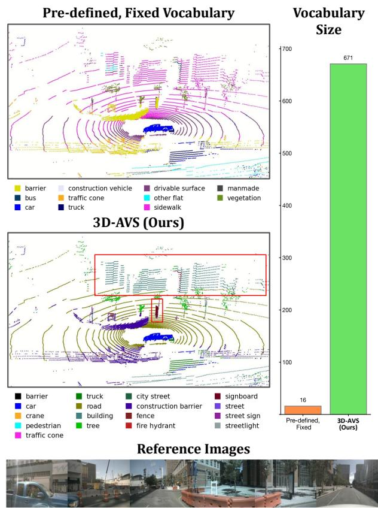
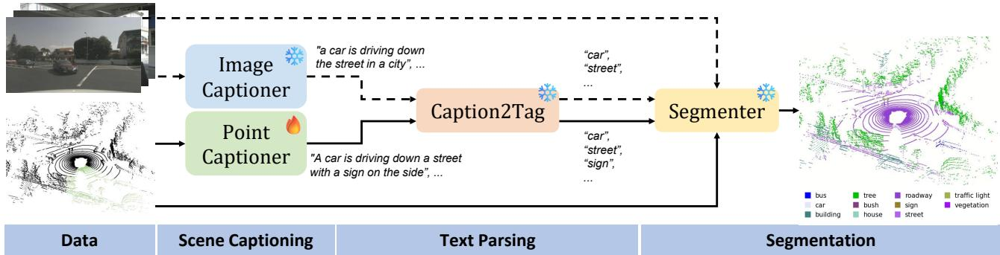
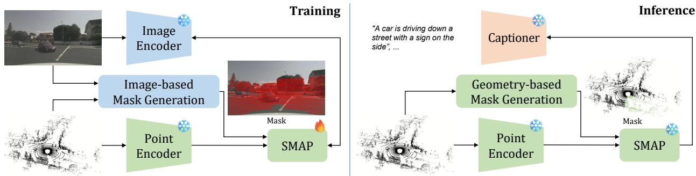
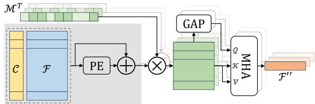
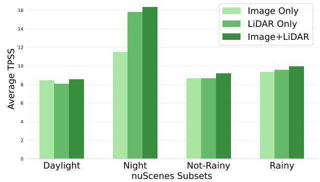
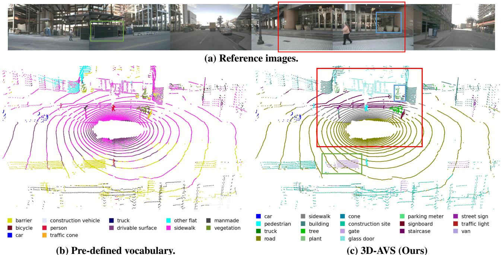

# 3D-AVS: LiDAR-based 3D Auto-Vocabulary Segmentation

Weijie Wei∗, Osman Ulger ¨ ∗, Fatemeh Karimi Nejadasl, Theo Gevers, Martin R. Oswald University of Amsterdam, the Netherlands

## Abstract

Open-vocabulary segmentation methods offer promising capabilities in detecting unseen object categories, but the category must be aware and needs to be provided by a human, either via a text prompt or pre-labeled datasets, thus limiting their scalability. We propose 3D-AVS, a method for Auto-Vocabulary Segmentation of 3D point clouds for which the vocabulary is unknown and auto-generated for each input at runtime, thus eliminating the human in the loop and typically providing a substantially larger vocabularyfor richer annotations. 3D-AVSfirst recognizes semantic entities from image or point cloud data and then segments all points with the automatically generated vocabulary. Our method incorporates both image-based andpointbased recognition, enhancing robustness under challenging lighting conditions where geometric information from Li-DAR is especially valuable. Our point-based recognition features a Sparse Masked Attention Pooling (SMAP) module to enrich the diversity of recognized objects. To address the challenges of evaluating unknown vocabularies and avoid annotation biases from label synonyms, hierarchies, or semantic overlaps, we introduce the annotationfree Text-Point Semantic Similarity (TPSS) metric for assessing generated vocabulary quality. Our evaluations on nuScenes and ScanNet200 demonstrate 3D-AVS’s ability to generate semantic classes with accurate point-wise segmentations.

## 1. Introduction

Existing perception methods [3, 24, 27, 46, 59, 61] for autonomous driving often rely on an inclusiveness assumption that all potential categories of interest must exist in the training dataset. Nevertheless, public datasets often annotate instances with pre-defined categories, which can vary from three (e.g. vehicle, cyclist and pedestrian) [31, 44] to several dozen types [2, 4], and fail to annotate rare objects with correct semantic labels. Failing to recognize atypical objects or road users poses a significant risk to the perception model’s adaptability to diverse real-life scenarios.

  
Figure 1. Pre-defined Vocabulary vs. Auto-Vocabulary. 3D AVS automatically generates a vocabulary for which it predicts segmentation masks, offering greater semantic precision. Our predictions identify specific classes e.g. building and signboard (highlighted in red boxes), which are annotated with ambiguous terms like manmade. Quantitatively, 3D-AVS recognizes 671 unique categories on the validation set of nuScenes [4], significantly surpassing nuScenes’s original 16 categories. Left: Vocabulary for a single scene, Right: Vocabulary for the entire dataset.

The development of Vision-Language Models (VLMs) strengthens the connection between vision and language modalities and promotes progress in multi-modal tasks, such as zero-shot image classification [39], image search and retrieval [40], image captioning [34], video understanding [51], and open-vocabulary learning [49]. Openvocabulary learning methods often utilize pre-trained VLMs to find the correspondence between visual entities and a semantic vocabulary, thereby creating the potential to detect any category of interest [49, 66]. However, these methods rely on human-specified queries, and thus can not dynamically recognize all semantic entities in a scene. Conversely, predefining everything is neither scalable nor practical in a dynamic world, as it is impossible to anticipate all the categories the model may encounter in advance. This shortcoming severely limits the real-life applicability of existing methods, as newly encountered object categories could still be unknown to the model or unaware to humans.

In this work, we propose 3D-AVS, a framework that automatically recognizes objects, generates a vocabulary for them and segments LiDAR points. We evaluate our method on the indoor and outdoor datasets [4, 14, 43] and introduce a metric TPSS to assess the model performance based on semantic consistency in CLIP [39] space. Figure 1 compares the same segmenter, namely OpenScene [38] with different vocabularies. 3D-AVS generates convincing semantic classes as well as accurate point-wise segmentations. Moreover, when pre-defined categories are general and ambiguous, e.g. man-made, 3D-AVS recognizes the semantically more precise categories, e.g. building and signboard.

Our contributions can be summarized as follows: 1) we introduce auto-vocabulary segmentation for point clouds, aiming to label all points using a rich and scene-specific vocabulary. Unlike methods that rely on predefined vocabularies, we address an unknown vocabulary setting by dynamically generating vocabulary per input; 2) we propose 3D-AVS, a framework that automatically identifies objects, either through an image-free point-based captioner or an off-the-shelf image-based captioner; 3) we propose a point captioner for 3D-AVS-LiDAR that decodes text from point-based CLIP features, achieving image independence and enhanced object diversity through a sparse masked attention pooling (SMAP) module; and 4) we introduce the Text-Point Semantic Similarity score, a novel CLIP-based, annotation-free metric that evaluates semantic consistency, accounting for synonyms, hierarchies, and similarity in unknown vocabularies, enabling scalable auto-vocabulary evaluation without human input.

## 2. Related Work

Open-Vocabulary Segmentation (OVS). OVS aims to perform segmentation based on a list of arbitrary text queries. CLIP [39] achieves this in 2D by aligning vision and language in a shared latent space. However, no comparable large-scale point cloud dataset exists for similar training in 3D. Additionally, captions in point cloud datasets are typically much sparser. Therefore, existing methods usually freeze the text encoder and image encoder, and align point features to vision-language feature space [8, 36, 38, 55, 64]. ULIP [55] distils vision-language knowledge into a point encoder via contrastive learning on text-imagepoint triplets. CLIP2Scene [8] adopts self-supervised learning, aligning point-text features using spatial-temporal cues. OpenScene [38] supervises the point encoder with CLIPbased image features through point-pixel projection. While these OVS approaches show promising results, they require user-defined categories as prompts. Conversely, our approach automatically generates categories that potentially appear in the scene without any human in the loop.

Auto-Vocabulary Segmentation (AVS). AVS differs from OVS in that it segments entities directly from perceptual data rather than relying on a human-defined vocabulary as input. Relevant target categories are directly inferred from the image - usually without any additional training, finetuning, data sourcing or annotation effort. Zero-Guidance Segmentation (ZeroSeg) [42] achieve this by using clustered DINO [5] embeddings to obtain binary object masks. These masks were used to guide the attention of CLIP, resulting in embeddings that are more accurately targeted to individual segments, and a trained large language model was tasked to output texts closest to said embeddings. While this required switching between three different latent representations, AutoSeg [70] proposed a more direct approach based on BLIP [26] embeddings only. They introduced a procedure in which multi-scale BLIP embeddings are enhanced through clustering, alignment and denoising. The embeddings are then captioned using BLIP’s decoder and parsed into a noun set used by an OVS model for segmentation. CaSED [13] retrieves captions from an external database and then integrates parsed texts with different segmentation methods. Despite these attempts in 2D domain, AVS in 3D domain remains unexplored. Concurrently and independently, Meng et al. [32] have proposed vocabulary-free 3D instance segmentation and a method PoVo for this task. While PoVo first obtains 3D clusters and then matches the generated semantic categories to the clusters, our work focuses more on target category generation and seamless integration with existing OVS methods.

Challenges of AVS evaluation. AVS presents additional challenges linked to evaluation. Since generated categories can be open-ended and outside of the fixed dataset vocabulary, one needs to bridge the gap between the two to assess the segmentation performance. ZeroSeg [42] exploits subjective assessment. In AutoSeg [70], the LLM-based mapper, LAVE, is introduced to address this challenge. However, the mapping targets are typically limited in size, causing the auto-generated categories - often more semantically rich and precise - to be discarded. To overcome these limitations, we propose the TPSS metric, which enables the evaluation of the generated categories while preserving their open-ended nature.

Captioning 2D and 3D Data. Captioning is the process of generating a concise and meaningful description from data modalities such as images, videos or point clouds. Notable works in 2D combine image-based templates with extracted attributes [23, 60], combine deep learning models like convolutional neural networks with RNN, LSTM or transformer-based generators [47, 52, 62], or leverage pre-trained vision-language embeddings such as CLIP or BLIP [11, 26, 28, 34]. BLIP [26], known for its effective but somewhat generic captions, often focus only on the 2-3 most prominent entities in an image. BCC [70] addresses this limitation by enhancing BLIP tokens through unsupervised semantic clustering in the latent space, enabling cluster-wise captioning and resulting in more comprehensive and detailed captions. More recently, xGen-MM (BLIP-3) [56] was introduced, building on BLIP with two improvements: an expanded and more diverse set of training data, and a scalable vision token sampler for flexible input resolutions. While this task is broadly explored in the 2D domain, it is yet to be solved in the 3D domain. Existing approaches focus on describing a single object, $e . g .$ CAD models [55, 57] and scanned shapes [16, 30, 54, 57, 68], or dense contextual indoor scenarios [6, 9, 10, 18, 20, 48, 68], but fail to caption sparse outdoor scenes due to sparsity and lack of colour information. LidarCLIP [17] encodes a sparse point cloud to a CLIP feature vector and then decodes it to a caption via ClipCap [35]. However, LidarCLIP only provides a global caption per scene, leading to limited coverage of semantic entities. Instead, our proposed point captioner copes with flexible receptive fields and offers a controllable number of captions with various granularity.

## 3. Method

## 3.1. Preliminaries

CLIP and CLIP-aligned encoder. CLIP [39] is believed to properly align visual and text features due to its superior performance on vision-language tasks. It comprises a text encoder $h _ { \mathrm { t x } }$ and an image encoder $h _ { \mathrm { i m } }$ , both of which map a data modality, e.g. text and image, to a visionlanguage latent space, also known as the CLIP space. Many work [12, 15, 25, 53, 63] increase the output resolution of CLIP image encoder, yielding high-resolution features $h _ { \mathrm { i m } } ^ { \mathrm { h r } } .$ while preserving alignment within the original CLIP space. Furthermore, some 3D methods [17, 36, 38, 55] distill features from $h _ { \mathrm { i m } }$ or its high-resolution variant $h _ { \mathrm { i m } } ^ { \mathrm { h r } }$ into 3D backbones, yielding CLIP-aligned 3D encoder $h _ { \mathrm { p t } } .$ . In this paper, we leverage such aligned 3D encoders and bypass the time-consuming training process whenever possible.

Problem Definition. Given a point cloud $\mathbf { P } = \{ p _ { n } \} _ { n = 1 } ^ { N } \in$ $\mathbb { R } ^ { N \times 3 }$ with N points, the aim is to assign a semantic class label $l \in \mathbb S$ to every point, where S indicates a vast semantic space. Different to closed-set or open-vocabulary segmentation for which the vocabulary is known either via a userspecified prompt or by pre-defined labels from dataset, the class set in auto-vocabulary segmentation is unknown and automatically generated for each input scene.

## 3.2. 3D Auto-Vocabulary Segmentation

This section introduces 3D-AVS for which an overview of its major components is shown in Fig. 2. Given a point cloud and a set of corresponding images, 3D-AVS first utilizes a point captioner and an image captioner to describe points and images in detail. The generated captions are parsed in the Caption2Tag module, resulting in a list of tags indicating semantic entities. Eventually, each point is assigned a semantic tag, forming segmentation results. These key components are elaborated in the following paragraphs.

Scene Captioning. A key step of our approach is the autogeneration of a vocabulary for the given scene which is performed by a scene captioner that is either based on input images or on the input point cloud. Image captioning is a wellexplored task with a variety of accessible multi-modality large-language models (MLLMs) [26, 56, 65]. We adopt xGen-MM [56] as the image captioner because of its architectural flexibility and enhanced semantic coverage, Given a set of K images $\mathbf { I } \in \mathbb { R } ^ { K \times H \times W \times 3 }$ capturing a scene, and an instruction prompt (details in supplementary material), the image captioner generates a list of captions

$$
\mathbf { D } = \left\{ d _ { \operatorname* { i m } } ^ { ( k ) } \in \mathbb { R } ^ { w _ { k } } \ | \ k = 1 , \dots , K \right\}\tag{1}
$$

where $w _ { k }$ is the number of words in the caption for the k-th image. To ensure a diverse enough set of coherent captions, we opt for beam search in the generation process. Implementation details are in the supplementary material. Following caption generation, each caption is parsed and validated with Caption2Tag, as described in the section below.

LiDAR point cloud captioning remains an underexplored area in existing research despite the potential of such captions for applications. While images collected alongside LiDAR point clouds can be used to generate a target vocabulary, relying solely on images proves inadequate under challenging conditions such as low light or adverse weather, where visual data becomes unreliable. To address this, we introduce a novel Point Captioner trained via transfer learning, which provides captions directly from color-independent LiDAR data. Our approach, detailed in

  
Figure 2. Overview of 3D-AVS. A point cloud and corresponding images are fed to respective point captioner and image captioner to generate captions. Then, Caption2Tag excludes irrelevant words in the captions. The remaining nouns are passed to a text encoder and eventually assigned to points through a segmenter. The dashed lines indicate that the entire images branch is optional. The point captioner is the only trainable component in 3D-AVS. Note that, the example point caption is generated based on observing the green points.

Sec. 3.3, takes a point cloud \mathbf {P} as input and outputs captions $d _ { \mathrm { p t } }$ . Unlike image captioning, which requires extensive contextual information and sophisticated vision models to produce detailed captions, the Point Captioner provides robust descriptions by relying solely on geometric features. This color independence is particularly beneficial in low-visibility environments, such as nighttime scenes where image-based captioning often falls short. Combining both modalities ultimately yields the best results, uniting the diversity of image captions with the resilience of pointbased captions.

Text Parsing. Captions generated by the image and point captioner are scene-specific sentences in natural language which we then parse into individual object nouns for semantic segmentation. To this end, we filter the sentence on (compound) nouns (i.e. general entities) and proper nouns (i.e. named entities) using spaCy [19] and transform them to their singular form through lemmatization. Lastly, we verify each category against the WordNet dictionary, resulting in a set of M scene-specific tags, denoted as $\mathbf { L } = \{ l _ { m } \} _ { m = 1 } ^ { M }$

Segmentation. The proposed pipeline separates the vocabulary generation and segmentation, enabling seamless integration with an open-vocabulary point segmenter. The segmenter consists of three encoders, namely a text encoder $h _ { \mathrm { t x } } : \mathbb { R } ^ { 1 } \to \mathbb { R } ^ { C }$ , a high-resolution image encoder $h _ { \mathbf { i m } } ^ { \mathrm { h r } } \ : \ \mathbb { R } ^ { \mathbf { \ddot { H } } \times W \times 3 } \ \to \ \mathbb { R } ^ { H \times W \times \mathbf { \dot { C } } }$ and a point encoder $h _ { \mathrm { p t } }$ $\mathbb { R } ^ { N \times 3 } \to \mathbb { R } ^ { N \times C }$ , that are pre-aligned with the CLIP visionlanguage latent space. Following the inference procedure of CLIP [39], namely similarity-based label assignment, we first compute the embeddings as follows:

$$
{ \bf E } _ { \mathrm { t x } } = \{ e _ { m } \} _ { m = 1 } ^ { M }  h _ { \mathrm { t x } } ( { \bf L } )
$$

$$
\mathbf { F } _ { \mathrm { i m } } = \{ f _ { k } \} _ { k = 1 } ^ { K }  h _ { \mathrm { i m } } ( \mathbf { I } )\tag{2}
$$

(3)

$$
\mathbf { F } _ { \mathrm { p t } } = \{ f _ { n } \} _ { n = 1 } ^ { N }  h _ { \mathrm { p t } } ( \mathbf { P } )\tag{4}
$$

where $\mathbf { E } _ { \mathrm { t x } } , \mathbf { F } _ { \mathrm { i m } }$ and $\mathbf { F } _ { \mathrm { p t } }$ indicate text embeddings, image features, and point features. $e _ { m } \in \mathbb { R } ^ { 1 \times C } , f _ { k } \in \mathbf { \breve { R } } ^ { H \times W \times C }$ and $f _ { n } ~ \in ~ \mathbb { R } ^ { 1 \times C }$ represent per-label, per-image and perpoint features. Then, the image features are lifted to 3D and assign each point a pixel feature if the point is visible in the images. In other words, given a point, we calculate its 2D coordinates by point-to-pixel mapping $\boldsymbol { { \cal T } } : \mathbb { R } ^ { 3 }  \mathbb { R } ^ { 2 }$ and then copy the corresponding pixel feature to the point, denoted as $\bar { f } _ { n } ^ { \mathrm { i m } } \in \mathbb { R } ^ { 1 \times C }$ . Eventually, each point is assigned a semantic label as follows:

$$
\hat { l } _ { n } = \underset { m } { \mathrm { a r g m a x } } \left( \operatorname* { m a x } \left( \mathrm { S I M } ( f _ { n } , e _ { m } ) | | \mathrm { S I M } ( f _ { n } ^ { \mathrm { i m } } , e _ { m } \right) \right)\tag{5}
$$

where $\hat { l } _ { n }$ denotes the predicted label for point $p _ { n } , \mathrm { S I M } ( \cdot , \cdot )$ is a similarity metric, for which we employ dot product, producing a tensor $\in \mathbb { R } ^ { 1 \times M }$ and || indicates concatenation when image features are available. max(·) takes a tensor $\in \mathbb { R } ^ { 2 \times M }$ as input, performs a column-wise maximum operation, and outputs a tensor $\in \mathbb { R } ^ { 1 \times M }$

## 3.3. Point Captioner

Inspired by LidarClip [17], we develop the Point Captioner that first encodes points to CLIP latent space and then decodes CLIP features to captions. However, LidarClip only provides a global caption per point cloud, leading to limited coverage of semantic entities. Therefore, we propose a sparse masked attention pooling (SMAP) that can increase the receptive field and output a controllable number of feature vectors, making it possible to train the network with a varying number of images. We detail the training stage, the inference stage and the SMAP in the following paragraphs.

Training. The training of the Point Captioner is essentially a 2D-to-3D distillation that transfers knowledge from the 2D vision foundation model to the 3D backbone. We utilize the CLIP image encoder [39] $h _ { \mathrm { i m } } ^ { \mathrm { c l i p } } : \mathbb { R } ^ { H \times W \times 3 } \to \mathbb { R } ^ { 1 \times 1 \times C }$ and a CLIP-aligned point encoder $h _ { \mathrm { p t } } : \mathbb { R } ^ { N \times 3 }  \mathbb { R } ^ { N \times C }$ to encode images and points. However, $h _ { \mathrm { i m } } ^ { \mathrm { c l i p } } ( \cdot )$ outputs a global feature vector that does not match the per-point features obtained from $h _ { \mathrm { p t } } ( \cdot )$ . Therefore, we add SMAP to pool point-wise features. As shown in Fig. 3 (left), during training, a point cloud and a point-to-pixel mapping function (visualized as an image) are fed to the image-based mask generation. The output is a point-wise binary mask, where true indicates the point is visible in the image. We visualize the point mask by projecting the point to the image. The mask and the point features obtained from $h _ { \mathrm { p t } } ( \cdot )$ are input to SMAP. SMAP integrates features of points that are visible in the image and is supervised by the output feature of $h _ { \mathrm { i m } } ^ { \mathrm { c l i p } } ( \cdot )$ . Note that only one image is visualized in Fig. 3 for clarity but all images corresponding to the point cloud are processed in parallel during training.

  
Figure 3. Point Captioner Overview. The image encoder and point encoder are pre-aligned in the CLIP latent space. During training (left), Sparse Masked Attention Pooling (SMAP) aggregates features from points visible in the image (highlighted in red) and is supervised using CLIP image features. During inference (right), neither the image nor camera intrinsic parameters are available. To address this, a group of masks are generated based solely on geometric information. The SMAP output is then decoded into a group of captions. For simplicity, only one image (left) and one sector (right) are shown.

Inference. Our goal is to generate diverse captions that comprehensively cover all semantic categories without requiring the intrinsic parameters of cameras. To achieve this, we propose a geometry-based mask generation strategy that efficiently partitions the point cloud into multiple regions, followed by individual captions for each region. Given the differences in point cloud distributions, we adopt cylindrical sector-based partitioning for outdoor scenes and square pillar-based partitioning for indoor scenes. In the remainder of this paragraph, we illustrate our approach using outdoor point clouds as an example, while details on indoor partitioning are provided in the supplementary materials. The point cloud is first transformed from a Cartesian coordinate system $\{ p _ { n } = ( x _ { n } , y _ { n } , z _ { n } ) \} _ { n = 1 } ^ { N }$ to a polar coordinate system $\{ p _ { n } = ( \rho _ { n } , \varphi _ { n } , z _ { n } ) \} _ { n = 1 } ^ { N }$ and then split into T sectors according to its polar angle $\varphi .$ The binary masks $B = \{ b _ { n } ^ { t } \} \in \mathbb { R } ^ { N \times \check { T } }$ are obtained as follows:

$$
b _ { n } ^ { t } = { \left\{ \begin{array} { l l } { { \mathrm { t r u e , } } } & { { \mathrm { i f ~ } } { \frac { t } { T } } 2 \pi \leq \varphi < { \frac { t + 1 } { T } } 2 \pi } \\ { { \mathrm { f a l s e , } } } & { { \mathrm { o t h e r w i s e . } } } \end{array} \right. }\tag{6}
$$

where $t \in \{ 0 , 1 , \ldots , T - 1 \}$ . This way, SMAP generates mask-wise features that are further decoded into captions in the caption module. The merit of this method is that the number of captions is controllable by changing T.

  
Figure 4. Sparse Masked Attention Pooling (SMAP). Given the coordinates and features of all points, a relative positional encoding (PE) is applied, followed by a residual connection. Masks are applied to the points, creating groups of point subsets. Global Average Pooling (GAP) on each subset produces a mean feature as a query. Finally, multi-head attention (MHA) is applied within each group to generate one feature per subset.

Sparse Masked Attention Pooling (SMAP). SMAP takes as input 1) an entire point cloud with its per-point coordinates $\mathcal { C } \in \mathbb { R } ^ { N \times 3 }$ and features $\mathbf { \mathcal { F } } = \mathbf { F } _ { \mathrm { p t } } \in \mathbf { \bar { \mathbb { R } } } ^ { N \times C }$ , and 2) J binary point-wise masks $\boldsymbol { B } \in \mathbb { R } ^ { J \times N }$ , where $J = K$ during training and $J = T$ during inference. SMAP first conducts a relative positional encoding and then applies the masks to the encoded point features:

$$
\mathcal { F } ^ { \prime } = \mathcal { B } * \left( \mathcal { F } + \mathrm { P E } ( \mathcal { C } , \mathcal { F } ) \right)\tag{7}
$$

where PE indicates a relative positional encoding as in [50] and ∗ denotes matrix multiplication. The masks essentially divide a point cloud into several subsets, allowing replacement. Therefore, the feature $\mathcal { F } ^ { \prime } = \{ f _ { i } ^ { \prime } \} _ { i = 1 } ^ { j } \in \mathbb { R } ^ { \breve { N _ { j } } \times \breve { C } }$ has a variable length per mask. After multiplication, features $F ^ { \prime }$ go through two paths: 1) zero-padded to the same length and then delivered to multi-head attention (MHA) as key $\kappa$ and value $\nu ,$ and 2) passed to a global average pooling and then input to MHA as query $\mathcal { Q } .$ Eventually, we obtain pooled features $\mathcal { F } ^ { \prime \prime } \in \mathbb { R } ^ { J \times \dot { C } }$

## 4. Evaluation

Auto-vocabulary segmentation introduces a novel setting without a standardized benchmark, making it challenging to compare methods directly. In this section, we introduce the challenges of evaluation this novel task and propose two strategy to evaluate segmentation accuracy and the semantic consistency between points and text labels.

## 4.1. Challenges

In open-vocabulary segmentation, which is a similar but simpler task, evaluation can be performed on conventional segmentation datasets by using the categories present in the annotations as pre-defined queries. However, this inherently means the model has prior knowledge of the classes it is expected to predict. In auto-vocabulary segmentation, however, no such information is available beforehand, presenting a unique challenge for evaluation. Moreover, natural language introduces ambiguities [58, 70], creating complex relationships between classes, such as synonymy, hyponymy and hypernymy. For instance, road could be labeled as drivable surface, street, or roadway, while a tire might be classified independently or as part of a wheel or vehicle. This makes it challenging to determine whether an instance is appropriately tagged with a precise semantic label. Given these nuances, evaluating the quality of generated labels and segmentation accuracy becomes complex, as the model must align with the varying language used in annotations, even when sometimes only general categories are provided in the ground truth.

To address these challenges, we propose two solutions. Firstly, we introduce a novel, objective and annotationindependent metric in Sec. 4.2 that assesses how accurately a label - either auto-generated or selected from a fixed vocabulary -fits a given 3D point. This metric allows for flexible, any-to-any class evaluation. Secondly, we leverage an LLM-based mapping approach to align auto-generated vocabulary classes with the ground-truth classes, enabling us to effectively evaluate both the quality of the segmentation mask and the relevance of the predicted labels (Sec. 4.3).

## 4.2. Text-Point Semantic Similarity Metric

We introduce the Text-Point Semantic Similarity (TPSS) metric, a measure independent of dataset annotations and subjective assessment. TPSS draws inspiration from inference with CLIP [39], where the best label out of a set of target classes $\{ m _ { 0 } , . . . , m _ { M } \}$ is assigned to an image:

$$
\hat { l } = \underset { m } { \mathrm { a r g m a x } } \bigl ( \mathrm { S I M } ( f ^ { \mathrm { i m } } , e _ { m } ) \bigr )\tag{8}
$$

where $\hat { l }$ represents the predicted label, $f ^ { \mathrm { i m } }$ is the image feature, and $e _ { m }$ denotes the text embeddings for class m. This equation identifies the label with the closest text embedding to the provided image feature in latent space, indicating the highest semantic alignment within $\mathrm { C L I P ^ { \circ } s }$ language space. TPSS metric employs a similar approach, comparing pairs of individual point features with text features in this aligned space. This enables evaluation of how well any label corresponds to a specific point based on semantic similarity, making TPSS ideal for assessing both dynamic and fixed vocabularies. For further illustration, consider a scenario where a LiDAR point belongs to an object outside the nuScenes official classes, such as a “trash bin”, and is thus annotated as “background”. If our method predicts “garbage can” for this point, it should not be penalized for not predicting “background”, as the original prediction is semantically closer to “trash bin”. TPSS accounts for such cases, evaluating the predicted label based on the object’s visual appearance rather than annotation setting or potential bias. Formally, let $\mathbf { P } = \{ p _ { n } \} _ { n = 1 } ^ { N }$ be a point cloud with N points and $\mathbf { L } = \{ l _ { m } \} _ { m = 1 } ^ { M }$ be a set of M unique semantic labels generated for this point cloud. The text embeddings E and the point features F are obtained as follows:

$$
{ \bf E } = \{ e _ { m } \} _ { m = 1 } ^ { M }  g _ { \mathrm { t x } } ( { \bf L } )\tag{9}
$$

$$
\mathbf { F } = \{ f _ { n } \} _ { n = 1 } ^ { N }  g _ { \mathrm { p t } } ( \mathbf { P } )\tag{10}
$$

where $g _ { \mathrm { t x } } ( \cdot )$ and $g _ { \mathrm { p t } } ( \cdot )$ are the frozen CLIP text encoder [39] and a CLIP-aligned point encoder, respectively. The TPSS score is calculated as follows:

$$
S _ { n } = \operatorname* { m a x } _ { m } \left( \mathrm { S I M } ( f _ { n } , e _ { m } ) \right)\tag{11}
$$

$$
\mathrm { T P S S } ( \mathbf { P } , \mathbf { L } , g _ { \mathrm { t x } } , g _ { \mathrm { p t } } ) = \operatorname* { m e a n } _ { n } ( S _ { n } )\tag{12}
$$

where $S _ { n }$ is a point-wise similarity score for the point n. $\mathrm { T P S S } ( \mathbf { P } , \mathbf { L } , g _ { \mathrm { p t } } , g _ { \mathrm { t x } } )$ measures the text-point semantic similarity between the point cloud P and the label set L. TPSS is encoder-agnostic as long as $g _ { \mathrm { p t } }$ and $g _ { \mathrm { t x } }$ are aligned. However, to reliably quantify which label set aligns better with a given point cloud, the point encoder and text encoder must remain unchanged across comparisons.

## 4.3. Mapping Auto-Vocabulary to Fixed Vocabulary

While TPSS effectively measures semantic similarity within the embedding space, evaluating the quality of the resulting segmentations is crucial for meaningful assessment. This requires establishing a correspondence between openended classes and the ground truth classes. To achieve this, we employ an evaluation scheme that leverages an LLMbased mapper, inspired by the LLM-based Auto-Vocabulary Evaluator (LAVE) [70]. LAVE maps each unique autovocabulary category to a fixed ground truth class in the dataset. After segmenting the LiDAR point cloud using auto-vocabulary categories, each classification is updated according to this mapping. For example, points labeled as sedan are reclassified under the car category. This mapping enables evaluation of segmentation quality using the widely accepted mean Intersection-over-Union (mIoU) metric based on fixed-vocabulary categories, facilitating comparison with prior methods. Our evaluation framework extends LAVE by integrating mappings with GPT-4o and SBERT [41]. While we provide detailed results of all methods in the supplementary material, GPT-4o is used throughout the main experiments due to its superior mapping accuracy compared to both LAVE and SBERT.

Table 1. TPSS on the validation sets of nuScenes [4] and Scan-Net [14]. Two datasets are created with 16 and 20 official categories, respectively. OpenScene [38] extends the nuScenes label set by manually defining 43 sub-categories. 3D-AVS outperforms these human-defined categories on both datasets, demonstrating its ability to generate a semantically more precise label set.
<table><tr><td>Label Set</td><td>Human-involved nuScenes [4]</td><td></td><td>ScanNet [14]</td></tr><tr><td>Official label set</td><td>√</td><td>7.39</td><td>3.44</td></tr><tr><td>Extended label set [38]</td><td>√</td><td>8.70</td><td>-</td></tr><tr><td>3D-AVS-Image</td><td>x</td><td>8.78</td><td>3.49</td></tr><tr><td>3D-AVS-LiDAR</td><td>x</td><td>8.80</td><td>3.71</td></tr><tr><td>3D-AVS</td><td>x</td><td>9.65</td><td>3.78</td></tr></table>

  
Figure 5. TPSS on nuScenes subsets with different light conditions. LiDAR-only 3D-AVS performs better during night and rainy scenes, suggesting its robustness across difficult conditions.

## 5. Experiments

## 5.1. Experimental Setup

Our method is evaluated on nuScenes [4], ScanNet [14] and ScanNet200 [43] datasets. nuScenes dataset [4] is a comprehensive real-world dataset for autonomous driving research, capturing diverse urban driving scenarios from Boston and Singapore. To increase the spatial density, we aggregate LiDAR points over a 0.5-second interval, focusing on the dataset’s LiDAR segmentation benchmark with 16 manually annotated categories. Given the homogeneity often found in autonomous driving scenarios, we also assess 3D-AVS on the ScanNet [14] and ScanNet200 [43]. Scan-

Table 2. IoU comparison on nuScenes (NUS) [4], ScanNet (SN) [14] and ScanNet200 (SN200) [43]. We employ LAVE [70] to map auto-classes from an Unknown Vocabulary (UV) to the official categories.
<table><tr><td>Method</td><td>Unknown Vocabulary</td><td>Label Set</td><td>NUS [4]</td><td>SN [14]</td><td>SN200 [43]</td></tr><tr><td>CLIP2Scene [8]</td><td>x</td><td rowspan="6">Official</td><td>20.8</td><td>25.1</td><td></td></tr><tr><td>ConceptFusion [21]</td><td>x</td><td></td><td>33.3</td><td>8.8</td></tr><tr><td>OpenMask3D [45]</td><td>X</td><td></td><td>34.0</td><td>10.3</td></tr><tr><td>HICL [22]</td><td>x</td><td>26.8</td><td>33.5</td><td></td></tr><tr><td>AdaCo [69]</td><td>x</td><td>31.2</td><td></td><td></td></tr><tr><td>CNS [7]</td><td>X</td><td>33.5</td><td>26.8</td><td></td></tr><tr><td>OpenScene [38]</td><td>x</td><td></td><td>30.1</td><td>47.0</td><td>11.7</td></tr><tr><td>Diff2Scene [67]</td><td>x</td><td></td><td></td><td>48.6</td><td>14.2</td></tr><tr><td>3D-AVS (Ours)</td><td>√</td><td>I+L</td><td>36.2</td><td>40.5</td><td>14.6</td></tr></table>

Net dataset is an indoor dataset with 20 annotated classes. ScanNet200 updates the annotations of ScanNet with more and finer-grained categories, i.e. 200 categories, while keeping the input point clouds unchanged. Due to space constraints, we refer to implementation details in the supplementary material, such as details on image captioner, segmenter and SMAP.

## 5.2. Label Set Comparison

We compare the generated label set with the fixed, humandefined vocabulary classes in Tab. 1. OpenScene [38] manually create a more fine-grained vocabulary of 43 categories for the nuScenes [4] (originally 16 categories) dataset, boosting the TPSS performance on the dataset from 7.39 to 8.70. Although the performance gain is impressive, Table 1 demonstrates that 3D-AVS-generated labels are more semantically consistent with point clouds than manually defined labels, as 3D-AVS outperforms the predefined categories on both nuScenes [4] and ScanNet [14] datasets. Additionally, Table 1 demonstrates that combining text generation from both camera and LiDAR inputs, as done in 3D-AVS, improves text-point semantic similarity. This advantage stems from 3D-AVS’ ability to adapt to scenes where one modality struggles. For instance, the image captioner often faces challenges in night scenes due to limited color information, while the point captioner continues to accurately describe relevant objects. This is further reflected in Fig. 5, which shows that the point captioner proves especially useful in visually challenging scenes where the Image Captioner falls short.

## 5.3. Segmentation Comparison

For quantitative comparison, we employ LAVE [70] to map all generated novel categories back to predefined categories. Next, we calculate segmentation metrics, namely mean IoU (mIoU), on the validation sets of nuScenes [4], Scan-Net [14], and ScanNet200 [43]. Note that 3D-AVS does not have any access to the predefined categories during testing, which makes the segmentation task much harder.

  
Figure 6. Qualitative comparison between inputting pre-defined vocabulary and 3D-AVS-generated vocabulary to OpenScene [38] segmentor. The (a) six-view images are presented for a better scene understanding. While general and ambiguous pre-defined vocabulary leads to large-area error (b). 3D-AVS segments regions with precise class names, e.g. plant (blue box), gate (green box), road, sidewalk, staircase, building and glass door (bottom-up in red box). These points are annotated as vegetation, drivable surface, sidewalk and manmade in the original dataset (not presented here) but are misclassified as sidewalk and barrier in (b).

Ourdoor dataset. Table 2 shows 3D-AVS generates better segmentation results on nuScenes, confirming the effectiveness of 3D-AVS’ open-ended recognition capabilities. The segmentation performance mainly benefits from automatically generated categories for the ambiguous nuScenes categories, such as driveable surface, terrain, and manmade, achieving mIoU of 68.2, 41.4, and 55.4, respectively—substantially outperforming OpenScene [38] (see details in supplementary material). Such an increase is expected, as 3D-AVS is able to generate much more specific namings for these overly general categories which can easily introduce noise. Figure 6 highlights some of these generated categories, such as man-made being correctly recognized as staircase, building and glass door.

Indoor datasets. Table 2 shows that 3D-AVS achieves a lower mIoU on ScanNet [14] compared to using a fixed vocabulary. This is likely due to the extensive range and variety of objects, where the generated labels must be mapped to a small and coarse-grained set of 20 dataset categories. The state-of-the-art (SOTA) performance on Scan-Net200 [43] further supports this argument. Notably, the predictions of 3D-AVS remain identical on ScanNet and ScanNet200, as the input data are the same; the only difference lies in the evaluation vocabulary—mapping to 20 coarse categories in ScanNet versus 200 fine-grained categories in ScanNet200. This shift in evaluation granularity introduces a more challenging task while allowing for a more faithful and detailed assessment of segmentation performance. 3D-AVS achieves state-of-the-art results on ScanNet200, underscoring its effectiveness in open-ended 3D segmentation tasks.

## 5.4. Ablation Study

Ablation studies are conducted on the image captioner, point captioner and LAVE mapping to validate our design choices and hyperparameters. The corresponding results are provided in the supplementary material.

## 6. Conclusion

In this work, we presented 3D-AVS, the first method for auto-vocabulary LiDAR point segmentation, eliminating the need for human-defined target classes. In suboptimal image captioning conditions, our point captioner can capture missing semantics based on geometric information. To assess the quality of the generated vocabularies in relation to segmentations, we further proposed the TPSS metric. Our experiments show that our model’s segmentations are semantically more aligned with the data than its annotations and achieves competitive masking accuracy. We believe 3D-AVS advances scalable open-ended learning for LiDAR point segmentation without human in the loop.

## 7. Acknowledgements

This work was financially supported by TomTom, the University of Amsterdam and the allowance of Top consortia for Knowledge and Innovation (TKIs) from the Netherlands Ministry of Economic Affairs and Climate Policy. Fatemeh Karimi Nejadasl was financed by the University of Amsterdam Data Science Centre. This work used the Dutch national e-infrastructure with the support of the SURF Cooperative using grant no. EINF-7940.

## References

[1] Llama Team at Meta. Llama 3: Advancing open-source large language models. arXiv preprint arXiv:2407.21783, 2024. 13, 14

[2] Jens Behley, Martin Garbade, Andres Milioto, Jan Quenzel, Sven Behnke, Cyrill Stachniss, and Jurgen Gall. SemanticKITTI: A dataset for semantic scene understanding of LiDAR sequences. In ICCV, 2019. 1

[3] Shubhankar Borse, Ying Wang, Yizhe Zhang, and Fatih Porikli. Inverseform: A loss function for structured boundary-aware segmentation. In CVPR, 2021. 1

[4] Holger Caesar, Varun Bankiti, Alex H. Lang, Sourabh Vora, Venice Erin Liong, Qiang Xu, Anush Krishnan, Yu Pan, Giancarlo Baldan, and Oscar Beijbom. nuScenes: A multimodal dataset for autonomous driving. In CVPR, 2020. 1, 2, 7, 12, 13, 14

[5] Mathilde Caron, Hugo Touvron, Ishan Misra, Herve J ´ egou,´ Julien Mairal, Piotr Bojanowski, and Armand Joulin. Emerging properties in self-supervised vision transformers. In ICCV, 2021. 2

[6] Dave Zhenyu Chen, Ronghang Hu, Xinlei Chen, Matthias Nießner, and Angel X. Chang. Unit3d: A unified transformer for 3d dense captioning and visual grounding. In ICCV, 2023. 3

[7] Runnan Chen, Youquan Liu, Lingdong Kong, Nenglun Chen, Xinge Zhu, Yuexin Ma, Tongliang Liu, and Wenping Wang. Towards label-free scene understanding by vision foundation models. In NeurIPS, 2023. 7

[8] Runnan Chen, Youquan Liu, Lingdong Kong, Xinge Zhu, Yuexin Ma, Yikang Li, Yuenan Hou, Yu Qiao, and Wenping Wang. Clip2scene: Towards label-efficient 3d scene understanding by clip. In CVPR, 2023. 2, 7

[9] Sijin Chen, Xin Chen, Chi Zhang, Mingsheng Li, Gang Yu, Hao Fei, Hongyuan Zhu, Jiayuan Fan, and Tao Chen. Ll3da: Visual interactive instruction tuning for omni-3d understanding, reasoning, and planning. In CVPR, 2024. 3

[10] Yilun Chen, Shuai Yang, Haifeng Huang, Tai Wang, Ruiyuan Lyu, Runsen Xu, Dahua Lin, and Jiangmiao Pang. Grounded 3d-llm with referent tokens. arxiv preprint arxiv:2405.10370, 2024. 3

[11] Jaemin Cho, Seunghyun Yoon, Ajinkya Kale, Franck Dernoncourt, Trung Bui, and Mohit Bansal. Fine-grained image captioning with clip reward. arXiv preprint arXiv:2205.13115, 2023. 3

[12] Seokju Cho, Heeseong Shin, Sunghwan Hong, Anurag Arnab, Paul Hongsuck Seo, and Seungryong Kim. Cat-seg: Cost aggregation for open-vocabulary semantic segmenta tion. In CVPR, 2024. 3

[13] Alessandro Conti, Enrico Fini, Massimiliano Mancini, Paolo Rota, Yiming Wang, and Elisa Ricci. Vocabulary-free im age classification and semantic segmentation. arxiv preprint arxiv:2404.10864, 2024. 2

[14] Angela Dai, Angel X. Chang, Manolis Savva, Maciej Halber, Thomas Funkhouser, and Matthias Nießner. Scannet: Richly-annotated 3d reconstructions of indoor scenes. In CVPR, 2017. 2, 7, 8, 12, 13, 14, 15

[15] Golnaz Ghiasi, Xiuye Gu, and Tsung-Yi Lin Yin Cui. Scaling open-vocabulary image segmentation with image-level labels. In ECCV, 2022. 3, 12

[16] Ziyu Guo, Renrui Zhang, Xiangyang Zhu, Yiwen Tang, Xi anzheng Ma, Jiaming Han, Kexin Chen, Peng Gao, Xianzhi Li, Hongsheng Li, and Pheng-Ann Heng. Point-bind & point-llm: Aligning point cloud with multi-modality for 3d understanding, generation, and instruction following. arXiv preprint arXiv: 2309.00615, 2023-09-01. 3

[17] Georg Hess, Adam Tonderski, Christoffer Petersson, Kalle Astr˚ om, and Lennart Svensson. Lidarclip or: How i learned¨ to talk to point clouds. In WACV, 2024. 3, 4, 12

[18] Yining Hong, Haoyu Zhen, Peihao Chen, Shuhong Zheng, Yilun Du, Zhenfang Chen, and Chuang Gan. 3d-llm: Injecting the 3d world into large language models. In NeurIPS, 2023. 3

[19] Matthew Honnibal, Ines Montani, Sofie Van Landeghem, and Adriane Boyd. spaCy: Industrial-strength Natural Language Processing in Python, 2020. https://github. com/explosion/spaCy. 4

[20] Haifeng Huang, Zehan Wang, Rongjie Huang, Luping Liu, Xize Cheng, Yang Zhao, Tao Jin, and Zhou Zhao. Chat-3d v2: Bridging 3d scene and large language models with object identifiers. arxiv preprint arxiv:2312.08168, 2023. 3

[21] Krishna Murthy Jatavallabhula, Alihusein Kuwajerwala, Qiao Gu, Mohd Omama, Tao Chen, Alaa Maalouf, Shuang Li, Ganesh Iyer, Soroush Saryazdi, Nikhil Keetha, Ayush Tewari, Joshua B. Tenenbaum, Celso Miguel de Melo, Madhava Krishna, Liam Paull, Florian Shkurti, and Antonio Torralba. Conceptfusion: Open-set multimodal 3d mapping. In RSS, 2023. 7

[22] Xin Kang, Lei Chu, Jiahao Li, Xuejin Chen, and Yan Lu. Hierarchical intra-modal correlation learning for label-free 3d semantic segmentation. In CVPR, 2024. 7

[23] Girish Kulkarni, Visruth Premraj, Sagnik Dhar, Siming Li, Yejin Choi, Alexander C. Berg, and Tamara L. Berg. Babytalk: Understanding and generating simple image de scriptions. TPAMI, 2013. 3

[24] Alex H Lang, Sourabh Vora, Holger Caesar, Lubing Zhou, Jiong Yang, and Oscar Beijbom. PointPillars: Fast encoders for object detection from point clouds. In CVPR, 2019. 1

[25] Boyi Li, Kilian Q Weinberger, Serge Belongie, Vladlen Koltun, and Rene Ranftl. Language-driven semantic segmentation. In ICLR, 2022. 3

[26] Junnan Li, Dongxu Li, Caiming Xiong, and Steven Hoi. Blip: Bootstrapping language-image pre-training for unified

vision-language understanding and generation. In ICML, 2022. 2, 3, 12

[27] Zhiqi Li, Wenhai Wang, Hongyang Li, Enze Xie, Chonghao Sima, Tong Lu, Qiao Yu, and Jifeng Dai. Bevformer: Learning bird’s-eye-view representation from multi-camera images via spatiotemporal transformers. In ECCV, 2022. 1

[28] Haotian Liu, Chunyuan Li, Qingyang Wu, and Yong Jae Lee. Visual instruction tuning. In NeurIPS, 2023. 3

[29] Ilya Loshchilov and Frank Hutter. Decoupled weight decay regularization. In ICLR, 2019. 12

[30] Tiange Luo, Chris Rockwell, Honglak Lee, and Justin Johnson. Scalable 3d captioning with pretrained models. In NeurIPS, 2023. 3

[31] Jiageng Mao, Minzhe Niu, Chenhan Jiang, Hanxue Liang, Jingheng Chen, Xiaodan Liang, Yamin Li, Chaoqiang Ye, Wei Zhang, Zhenguo Li, Jie Yu, Hang Xu, and Chunjing Xu. One million scenes for autonomous driving: Once dataset. In NeurIPS, 2021. 1

[32] Guofeng Mei, Luigi Riz, Yiming Wang, and Fabio Poiesi. Vocabulary-free 3d instance segmentation with vision and language assistant. In 3DV, 2025. 2

[33] Purnendu Mishra and Kishor Sarawadekar. Polynomial learning rate policy with warm restart for deep neural network. In TENCON 2019 - 2019 IEEE Region 10 Conference (TENCON), pages 2087–2092, 2019. 12

[34] Ron Mokady, Amir Hertz, and Amit H Bermano. Clipcap: Clip prefix for image captioning. arXiv preprint arXiv:2111.09734, 2021. 2, 3, 12

[35] Ron Mokady, Amir Hertz, and Amit H. Bermano. Clipcap: Clip prefix for image captioning. arXiv preprint arXiv: 2111.09734, 2021. 3

[36] Mahyar Najibi, Jingwei Ji, Yin Zhou, Charles R. Qi, Xinchen Yan, Scott Ettinger, and Dragomir Anguelov. Unsupervised 3d perception with 2d vision-language distillation for autonomous driving. In ICCV, 2023. 2, 3

[37] OpenAI. Gpt-4o system card. arXiv preprint arXiv:2410.21276, 2024. 14

[38] Songyou Peng, Kyle Genova, Chiyu ”Max” Jiang, Andrea Tagliasacchi, Marc Pollefeys, and Thomas Funkhouser. Openscene: 3d scene understanding with open vocabularies. In CVPR, 2023. 2, 3, 7, 8, 12, 13

[39] Alec Radford, Jong Wook Kim, Chris Hallacy, Aditya Ramesh, Gabriel Goh, Sandhini Agarwal, Girish Sastry, Amanda Askell, Pamela Mishkin, Jack Clark, Gretchen Krueger, and Ilya Sutskever. Learning transferable visual models from natural language supervision. In ICML, 2022. 1, 2, 3, 4, 6, 12

[40] Aditya Ramesh, Mikhail Pavlov, Gabriel Goh, Scott Gray, Chelsea Voss, Alec Radford, Mark Chen, and Ilya Sutskever. Zero-shot text-to-image generation. In ICML, 2021. 2

[41] Nils Reimers and Iryna Gurevych. Sentence-bert: Sentence embeddings using siamese bert-networks. In EMNLP, 2019. 7, 13, 14

[42] Pitchaporn Rewatbowornwong, Nattanat Chatthee, Ekapol Chuangsuwanich, and Supasorn Suwajanakorn. Zeroguidance segmentation using zero segment labels. In ICCV, 2023. 2

[43] David Rozenberszki, Or Litany, and Angela Dai. Languagegrounded indoor 3d semantic segmentation in the wild. In ECCV, 2022. 2, 7, 8, 13

[44] Pei Sun, Henrik Kretzschmar, Xerxes Dotiwalla, Aurelien Chouard, Vijaysai Patnaik, Paul Tsui, James Guo, Yin Zhou, Yuning Chai, Benjamin Caine, Vijay Vasudevan, Wei Han, Jiquan Ngiam, Hang Zhao, Aleksei Timofeev, Scott Ettinger, Maxim Krivokon, Amy Gao, Aditya Joshi, Yu Zhang, Jonathon Shlens, Zhifeng Chen, and Dragomir Anguelov. Scalability in perception for autonomous driving: Waymo open dataset. In CVPR, 2020. 1

[45] Ayc¸a Takmaz, Elisabetta Fedele, Robert W. Sumner, Marc Pollefeys, Federico Tombari, and Francis Engelmann. Openmask3d: Open-vocabulary 3d instance segmentation. In NeurIPS, 2023. 7

[46] Andrew Tao, Karan Sapra, and Bryan Catanzaro. Hierarchical multi-scale attention for semantic segmentation. arXiv preprint arXiv:2005.10821, 2020. 1

[47] Oriol Vinyals, Alexander Toshev, Samy Bengio, and D. Er han. Show and tell: A neural image caption generator. CVPR, 2015. 3

[48] Zehan Wang, Haifeng Huang, Yang Zhao, Ziang Zhang, and Zhou Zhao. Chat-3d: Data-efficiently tuning large language model for universal dialogue of 3d scenes. arxiv preprint arxiv:2308.08769, 2023. 3

[49] Jianzong Wu, Xiangtai Li, Shilin Xu, Haobo Yuan, Henghui Ding, Yibo Yang, Xia Li, Jiangning Zhang, Yunhai Tong, Xudong Jiang, Bernard Ghanem, and Dacheng Tao. Towards open vocabulary learning: A survey. TPAMI, 2024. 2

[50] Xiaoyang Wu, Li Jiang, Peng-Shuai Wang, Zhijian Liu, Xihui Liu, Yu Qiao, Wanli Ouyang, Tong He, and Hengshuang Zhao. Point transformer v3: Simpler, faster, stronger. In CVPR, 2024. 5, 13

[51] Hu Xu, Gargi Ghosh, Po-Yao Huang, Dmytro Okhonko, Armen Aghajanyan, Florian Metze, Luke Zettlemoyer, and Christoph Feichtenhofer. Videoclip: Contrastive pre-training for zero-shot video-text understanding. In EMNLP, 2021. 2

[52] Ke Xu, Jimmy Ba, Ryan Kiros, Kyunghyun Cho, Aaron C. Courville, Ruslan Salakhutdinov, Richard S. Zemel, and Yoshua Bengio. Show, attend and tell: Neural image caption generation with visual attention. In ICML, 2015. 3

[53] Mengde Xu, Zheng Zhang, Fangyun Wei, Han Hu, and Xiang Bai. Side adapter network for open-vocabulary semantic segmentation. In CVPR, 2023. 3

[54] Runsen Xu, Xiaolong Wang, Tai Wang, Yilun Chen, Jiangmiao Pang, and Dahua Lin. Pointllm: Empowering large lan guage models to understand point clouds. In ECCV, 2024. 3

[55] Le Xue, Mingfei Gao, Chen Xing, Roberto Mart´ın-Mart´ın, Jiajun Wu, Caiming Xiong, Ran Xu, Juan Carlos Niebles, and Silvio Savarese. Ulip: Learning a unified representation of language, images, and point clouds for 3d understanding. In CVPR, 2023. 2, 3

[56] Le Xue, Manli Shu, Anas Awadalla, Jun Wang, An Yan, Senthil Purushwalkam, Honglu Zhou, Viraj Prabhu, Yutong Dai, Michael S Ryoo, Shrikant Kendre, Jieyu Zhang, Can Qin, Shu Zhang, Chia-Chih Chen, Ning Yu, Juntao Tan, Tulika Manoj Awalgaonkar, Shelby Heinecke, Huan Wang,

Yejin Choi, Ludwig Schmidt, Zeyuan Chen, Silvio Savarese, Juan Carlos Niebles, Caiming Xiong, and Ran Xu. xgen-mm (blip-3): A family of open large multimodal models. arXiv preprint, 2024. 3, 12

[57] Le Xue, Ning Yu, Shu Zhang, Junnan Li, Roberto Mart´ın-Mart´ın, Jiajun Wu, Caiming Xiong, Ran Xu, Juan Carlos Niebles, and Silvio Savarese. Ulip-2: Towards scalable multimodal pre-training for 3d understanding. In CVPR, 2024. 3

[58] Apurwa Yadav, Aarshil Patel, and Manan Shah. A comprehensive review on resolving ambiguities in natural language processing. AI Open, 2:85–92, 2021. 6

[59] Yan Yan, Yuxing Mao, and Bo Li. Second: Sparsely embedded convolutional detection. Sensors, 18(10):3337, 2018. 1

[60] Benjamin Z. Yao, Xiong Yang, Liang Lin, Mun Wai Lee, and Song-Chun Zhu. I2t: Image parsing to text description. Proceedings ofthe IEEE, 2010. 3

[61] Tianwei Yin, Xingyi Zhou, and Philipp Krahenb ¨ uhl. Center-¨ based 3d object detection and tracking. In CVPR, 2021. 1

[62] Quanzeng You, Hailin Jin, Zhaowen Wang, Chen Fang, and Jiebo Luo. Image captioning with semantic attention. In CVPR, 2016. 3

[63] Qihang Yu, Ju He, Xueqing Deng, Xiaohui Shen, and Liang-Chieh Chen. Convolutions die hard: Open-vocabulary segmentation with single frozen convolutional clip. In NeurIPS, 2023. 3

[64] Yihan Zeng, Chenhan Jiang, Jiageng Mao, Jianhua Han, Chaoqiang Ye, Qingqiu Huang, Dit-Yan Yeung, Zhen Yang, Xiaodan Liang, and Hang Xu. Clip\$ˆ2\$: Contrastive language-image-point pretraining from real-world point cloud data. In CVPR, 2023. 2

[65] Youcai Zhang, Xinyu Huang, Jinyu Ma, Zhaoyang Li, Zhaochuan Luo, Yanchun Xie, Yuzhuo Qin, Tong Luo, Yaqian Li, Shilong Liu, et al. Recognize anything: A strong image tagging model. arXiv preprint arXiv:2306.03514, 2023. 3, 12

[66] Xingcheng Zhou, Mingyu Liu, Bare Luka Zagar, Ekim Yurtsever, and Alois C. Knoll. Vision language models in autonomous driving and intelligent transportation systems. arXiv preprint arXiv:2310.14414, 2023. 2

[67] Xiaoyu Zhu, Hao Zhou, Pengfei Xing, Long Zhao, Hao Xu, Junwei Liang, Alexander Hauptmann, Ting Liu, and Andrew Gallagher. Open-vocabulary 3d semantic segmentation with text-to-image diffusion models. In ECCV, 2024. 7

[68] Ziyu Zhu, Xiaojian Ma, Yixin Chen, Zhidong Deng, Siyuan Huang, and Qing Li. 3d-vista: Pre-trained transformer for 3d vision and text alignment. In ICCV, 2023. 3

[69] Pufan Zou, Shijia Zhao, Weijie Huang, Qiming Xia, Chenglu Wen, Wei Li, and Cheng Wang. Adaco: Overcoming visual foundation model noise in 3d semantic segmentation via adaptive label correction. In AAAI, 2025. 7

[70] Osman Ulger, Maksymilian Kulicki, Yuki Asano, and Mar-¨ tin R. Oswald. Auto-vocabulary semantic segmentation. arXiv preprint arXiv:2312.04539, 2024. 2, 3, 6, 7, 13, 14