# A Theory of Learning Unified Model via Knowledge Integration from Label Space Varying Domains

Dexuan Zhang1 Thomas Westfechtel1 Tatsuya Harada1,2

1The University of Tokyo, 2RIKEN

{dexuan.zhang, thomas, harada}@mi.t.u-tokyo.ac.jp

## Abstract

Existing domain adaptation systems can hardly be applied to real-world problems with new classes presenting at deployment time, especially regarding source-free scenarios where multiple source domains do not share the label space despite being given a few labeled target data. To address this, we consider a challenging problem: multi-source semisupervised open-set domain adaptation and propose a learning theory via joint error, effectively tackling strong domain shift. To generalize the algorithm into source-free cases, we introdcue a computationally efficient and architectureflexible attention-basedfeature generation module. Extensive experiments on various data sets demonstrate the significant improvement ofour proposed algorithm over baselines.

## 1. Introduction

Generally, a supervised learning algorithm trained on a particular distribution of labeled samples (source domain) often fails to generalize when deployed on a new environment (target domain) in the presence of domain shift. In this regard, Domain adaptation (DA) [1] algorithms address the domainshift problem by aligning the data distributions of the source and target domains through learning a domain-invariant feature space using statistical or adversarial learning approaches, which have made remarkable success. However, the problem setting still needs to be relaxed for real-world applications when we aim to integrate the knowledge learned from multiple source domains. Current DA methods can hardly cover the case for varying label space across domains, and the corresponding learning theory has yet to be proposed. Moreover, the solution is limited if this heterogeneous domain setting is extended to source-free situations where each source model may be trained on different network architectures and the label space. This work tackles a challenging multi-source semi-supervised open-set domain adaptation paradigm with varying label space, illustrated in Fig. 1.

In general, multi-source DA (MSDA) [45] and semisupervised DA (SSDA) [41] are regarded as more practical than the single-source DA setup, considering that labeled data may come from various domains. More precisely, in these cases, the labeled samples can be differently distributed among themselves in addition to the usual domain shit between the source and the target domains. One naive approach to MSDA and SSDA is to group all labeled data into a single domain and deploy any unsupervised DA (UDA) method. However, such a trivial solution may lead to sub-optimal classification due to the gaps among labeled data [41].

Most DA techniques assume the same label space in source and target domains, usually called the closed-set setting. The paradigm of closed-set DA has been substantially explored in the literature for UDA [11, 32, 33, 39, 47, 62, 64], SSDA [23, 37, 41, 43, 59, 61], and MSDA [19, 36, 51, 53, 57, 65, 67]. In contrast, the open-set DA (OSDA) [4] setting allows the presence of target-specific classes in addition to the shared classes. Such an open-set arrangement is more challenging due to a huge label shift across domains. The closed-set DA techniques cannot be directly applied in this case since these target-specific open-set samples, in turn, may jeopardize the domain alignment process. This work formalizes a more generalized problem where source domains may not share the label space, and the unlabeled target domain additionally contains novel classes.

Motivated by these, we consider a learning scenario in this work as the multi-source semi-supervised open-set DA (MSODA) where each source domain has a diverse label space, the labeled target domain consists of a few-shot of target data whose label space, i.e., the known class, is a superset of any source label space, and the unlabeled target domain contains data either from the known or a combined unknown class. Under this setup, the task is to classify the unlabeled data either into one of the known categories or a common unknown class. Such a setup invariably holds huge applications in fields relating to real-world visual perception like medical imaging and remote sensing, where acquisition of multi-domain data is feasible, and novel categories may show up abruptly [4]. Nonetheless, this MSODA problem cannot be effectively solved by directly utilizing the single source open-set paradigm of [2, 10, 20, 27, 34, 40, 54, 63] mainly because of the following factors: i) the varying label space of multiple source domains becomes an obstacle to the traditional OSDA techniques, and ii) the unknown recognition can be non-trivial since the target domain may be related to each source domain in a different degree. Regarding multisource models, recent works [25, 55] consider various label spaces but require largely shared common classes for all domains to align the features, where we accept source domains with zero overlap.

[36] argued that reducing the domain gap among the source domains leads to a more robust and effective MSDA model. This idea is particularly relevant to our problem setting since aligning the source domains among themselves inherently helps distinguish unknown from known categories in the target domain. Otherwise, the domain shift among the source domains may lead to an unstable alignment of unlabeled target data. Inspired by this idea, we combine the theoretical results from [62, 63] to build a learning theory that can align all source domains with the labeled target domain via joint error, which is crucial to dealing with label shift [66]. Then we introduce PU learning [58] to detect unknowns with an end-to-end algorithm such that the generalization error is guaranteed, unlike those methods applying closed-set DA after unknown separation. Our major contributions can be summarized as:

· We introduce a challenging problem setting of multisource semi-supervised open-set DA with varying label space and propose a learning theory via joint error.

· We design a framework to generate labeled source features via an attention-based mechanism for source-free cases.

· We demonstrate the efficacy of our proposal through extensive experiments on two benchmark datasets where we perform thorough robustness analysis.

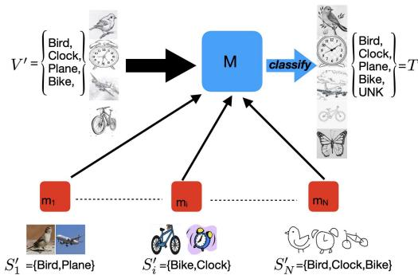  
Figure 1. Knowledge integration from heterogeneous domains can be considered a task for multi-source semi-supervised openset domain adaptation. Given a few labeled target data as the key, we aim to build a unified target model from multiple source domains with varying label space, which can be applied to query data containing unknown categories.

## 2. Learning Theory of Unified Model

In this section, we present the theory that transfers the knowledge from multiple source domains to the target domain given a few labeled target data under the open-set situation. First, we propose a target error bound via joint error based on the theoretical results from [62, 63]. Then, we derive the generalization error of the proposed learning theory based on the generalized Vapnik–Chervonenkis (VC) complexity [49, 50] of real-valued function space. Finally, we proceed with the empirical objective function as an upper bound of a trivial convex combination with the log-sum-exp trick, which leads to a smoother optimization process.

We consider the unified model (UM) as a solution to multi-source semi-supervised open-set domain adaptation (MSODA) tasks, where the learning algorithm has access to multiple source domains that may have different label spaces. A set of $n _ { i } ( i = 1 , . . , N )$ labeled points $\{ ( x _ { s _ { i } } ^ { j } , y _ { s _ { i } } ^ { j } ) \in$ $( \mathcal { X } \subseteq \mathbb { R } ^ { D } \times \mathcal { Y } _ { i } ^ { \prime } \subseteq \mathcal { Y } ^ { \prime } \} _ { j = 1 } ^ { n _ { i } }$ sampled i.i.d. from each source domain $S _ { i } ^ { \prime } .$ . In addition, a set of l labeled points (few-shot) $\{ ( x _ { v } ^ { j } , y _ { v } ^ { j } ) \in ( \mathcal { X } \subseteq \mathbb { R } ^ { D } \times \mathcal { Y } ^ { \prime } = \{ 1 , . . . , K - 1 \} ) \} _ { j = 1 } ^ { l }$ sampled i.i.d. from the labeled target domain V′ is available during learning. We seek a hypothesis that can classify a set of m unlabeled points $\{ ( x _ { t } ^ { j } ) \in X \subseteq \mathbb { R } ^ { D } \} _ { j = 1 } ^ { m }$ sampled i.i.d. from target domain T where $\mathcal { V } = \{ 1 , . . . , \check { K } \}$ containing unknown class K. Let $\begin{array} { r } { \mathcal { K } = \{ k | k \in \mathbb { R } ^ { K } : \sum _ { u \in \mathcal { V } } k [ y ] = 1 , k [ y ] \in } \end{array}$ [0, 1]} denotes output space and $S _ { i } , V$ indicate the complete domains with label space Y.

Theorem 2.1 (Target Error Bound for MSODA via Joint Error1). Given source $( S _ { i } ) _ { ; }$ , labeled (V) and unlabeled target (T) domains that contain data from the unknown class, let $f _ { S _ { i } } , f _ { V } , f _ { T } : \mathcal { X }  \mathcal { K }$ be the true labeling functions of $S _ { i } , V , T$ respectively whose outputs are one-hot vectors denoting the corresponding classes of inputs. Let $\epsilon : \mathcal { K } \times \mathcal { K } $ R denote a distance metric and ϵ $( f , f ^ { \prime } ) : =$ $\mathbb { E } _ { x \sim D } \epsilon ( f ( x ) , f ^ { \prime } ( x ) )$ measure the expected disagreement between the outputs of f, $f ^ { \prime } : \mathcal { X } \to \mathcal { K }$ over a distribution D on X. Regarding the source error ofa hypothesis $h \in \mathcal H$ $\mathcal { X } \to \mathcal { K }$ where $h ( x ) [ y ]$ indicates the probability of x ∈ X labeled as $y \in \mathcal { V }$ , we use the shorthand $\epsilon _ { S _ { i } } ( h ) : = \epsilon _ { S _ { i } } ( h , f _ { S _ { i } } )$ Similarly, we use $\epsilon _ { V } ( h ) , \epsilon _ { T } ( h )$ to denote the labeled and unlabeled target error. For $\forall h , f _ { S _ { i } } ^ { * } , f _ { V } ^ { * } , f _ { T } ^ { * } \in \mathcal { H } : \mathcal { X }  \mathcal { K } ,$ the expected target error is bounded,

$$
\begin{array} { l } { { 2 \epsilon _ { T } ( h ) \leq \epsilon _ { V } ( h ) + \displaystyle \sum _ { i = 1 } ^ { N } \alpha _ { i } U _ { i } ( h ) , \quad s . t . \quad \displaystyle \sum _ { i = 1 } ^ { N } \alpha _ { i } = 1 } } \\ { { \displaystyle \qquad = \epsilon _ { V } ( h ) + \displaystyle \sum _ { i = 1 } ^ { N } \alpha _ { i } \big [ \epsilon _ { S _ { i } } ( h ) + 2 D _ { S _ { i } , V , T } \big ( f _ { S _ { i } } ^ { * } , f _ { V } ^ { * } , f _ { T } ^ { * } , h \big ) + 2 \theta _ { i } \big ] } , } \end{array}\tag{1}
$$

$$
\begin{array} { r l } & { 2 D _ { S _ { i } , V , T } ( f _ { S _ { i } } ^ { * } , f _ { V } ^ { * } , f _ { T } ^ { * } , h ) } \\ & { \quad = \epsilon _ { T } ( f _ { S _ { i } } ^ { * } , f _ { T } ^ { * } ) + \epsilon _ { T } ( f _ { V } ^ { * } , f _ { T } ^ { * } ) + \epsilon _ { T } ( h , f _ { S _ { i } } ^ { * } ) + \epsilon _ { T } ( h , f _ { V } ^ { * } ) } \\ & { \quad + \epsilon _ { V } ( f _ { S _ { i } } ^ { * } , f _ { V } ^ { * } ) + \epsilon _ { S _ { i } } ( f _ { V } ^ { * } , f _ { S _ { i } } ^ { * } ) - \epsilon _ { V } ( h , f _ { S _ { i } } ^ { * } ) - \epsilon _ { S _ { i } } ( h , f _ { V } ^ { * } ) } \end{array}\tag{2}
$$

$$
\begin{array} { l } { { \theta _ { i } = \underbrace { \epsilon _ { S _ { i } } ( f _ { S _ { i } } , f _ { S _ { i } } ^ { * } ) / 2 + \epsilon _ { V } ( f _ { S _ { i } } , f _ { S _ { i } } ^ { * } ) + \epsilon _ { T } ( f _ { S _ { i } } , f _ { S _ { i } } ^ { * } ) } _ { \theta _ { S } ^ { i } } } } \\ { { + \underbrace { \epsilon _ { V } ( f _ { V } , f _ { V } ^ { * } ) / 2 + \epsilon _ { S _ { i } } ( f _ { V } , f _ { V } ^ { * } ) + \epsilon _ { T } ( f _ { V } , f _ { V } ^ { * } ) } _ { \theta _ { V } ^ { i } } + \underbrace { \epsilon _ { T } ( f _ { T } , f _ { T } ^ { * } ) } _ { \theta _ { T } ^ { i } } } } \end{array}\tag{3}
$$

In the following, we discuss the approach to obtain generalization guarantees for multiple source domain adaptation in classification settings by a trivial union-bound argument.

Assumption 2.2 (Substitutes for True Labeling Functions). For finite training data $\{ \hat { S } _ { i } \} _ { i = 1 } ^ { N } , \hat { T } , \hat { V }$ , we assume there exist approximated labeling functions $\{ f _ { S _ { i } } ^ { * } \} _ { i = 1 } ^ { N } , f _ { T } ^ { * } , f _ { V } ^ { * }$ that can lead the empirical deviation $\textstyle \sum _ { i } \alpha _ { i } { \hat { \theta } } _ { i }$ very close to zero such that it can be ignored during the practical learning process.

Theorem 2.3 (Generalization Error1). Let $\hat { S } _ { i } , \hat { V } , \hat { T }$ denote the empirical distributions generated with m i.i.d. samples from each domain. Let ${ \mathcal { F } } = \{ f ( x ) ~ = ~ \epsilon ( h ( x ) , h ^ { \prime } ( x ) ) ~ ;$ $\mathcal { X }  [ 0 , M ] | h , h ^ { \prime } \in \mathcal { H } \}$ be afunction space with complexity measured by uniform covering number $\mathcal { N } _ { 1 } ( \xi , \mathcal { F } , m )$ . Let $\begin{array} { r } { \alpha _ { i } = \frac { \exp ( \nu \hat { U } _ { i } ( h ) ) } { \sum _ { i } \exp ( \nu \hat { U } _ { j } ( h ) ) } , \nu > 0 , } \end{array}$ , given Jensen’s & Cauchy’s inequality and Assumption $2 . 2 ,$ there exist $f _ { S _ { i } } ^ { * } \in \mathcal { H } _ { S _ { i } } \subseteq$ $\mathcal { H } , f _ { V } ^ { * } \in \mathcal { H } _ { V } \subseteq \mathcal { H } , f _ { T } ^ { * } \in \mathcal { H } _ { T } \subseteq \mathcal { H }$ , such tha $f o r 0 < \delta < 1$ with probability at least $1 - \delta , f o r \forall h \in \mathcal { H } \colon$

$$
\begin{array} { l } { \displaystyle \epsilon _ { T } ( h ) \leq \frac { 1 } { 2 } [ \underset { L _ { c l s } ^ { V } ( h ) } { \epsilon _ { \hat { V } } ( h ) } + \frac { 1 } { \nu } \log \sum _ { i = 1 } ^ { N } \exp ( \nu \hat { U } _ { i } ( h ) ) ] } \\ { \displaystyle + \mathcal { O } \left( \sum _ { \sqrt { \frac { 2 } { m } } \leq \gamma \leq M } ( \gamma + \int _ { \gamma } ^ { M } \sqrt { \frac { 1 } { m } \log \frac { 2 ( 1 1 N + 6 ) \mathcal { N } _ { 1 } ( \frac { \xi } { 8 } , \mathcal { F } , 2 m ) } { \delta } } d \xi ) \right) } \end{array}\tag{4}
$$

$$
\hat { U } _ { i } ( h ) = \underbrace { \epsilon _ { \hat { S } _ { i } } ( h ) } _ { L _ { c l s } ^ { S _ { i } } ( h ) } + 2 \underbrace { D _ { \hat { S } _ { i } , \hat { V } , \hat { T } } ( f _ { S _ { i } } ^ { * } , f _ { V } ^ { * } , f _ { T } ^ { * } , h ) } _ { L _ { d i s } ^ { i } ( f _ { S _ { i } } ^ { * } , f _ { V } ^ { * } , f _ { T } ^ { * } , h ) }\tag{5}
$$

The log-sum-exp trick [30] yields an upper bound of the convex combination as Theorem 2.3, where we no longer need to heuristically decide the value of $\alpha _ { i }$ in the unified model. It smooths the objective and provides a principled and adaptive way to combine all the gradients from the N source domains. This often leads to better generalizations in practice because of the ensemble effect of multiple sources implied by the upper bound [65].

According to [13, 56, 63], for $\forall f , f ^ { \prime } : \mathcal { X }  \mathcal { K } , \epsilon _ { V } ( f , f ^ { \prime } )$ can be approximated by the expectation on $V ^ { \prime }$ based on PU learning. Moreover, source data $S _ { i } ^ { \prime }$ may be unavailable due to privacy concerns (e.g., medical data) during the adaptation phase. To tackle this source-free domain adaptation (SFDA) problem, we propose a source features generation pipeline based on the attention mechanism, which can transfer the knowledge between models with different architectures.

## 3. Methodology

In this section, we first recall several preliminaries crucial to the learning algorithm of open-set domain adaptation. Then, we propose a pipeline to transfer the knowledge between models with different architectures based on the attention mechanism to recover feature space under the source-free setting. Finally, we define constrained hypothesis space to obtain a rigorous objective function.

## 3.1. Discrepancy Meassument

As introduced in [63], we recall the definition of Open-set Margin Discrepancy and Unknown Predictive Discrepancy, which serve as key components to bridging the gap between the theory and algorithm for open-set domain adaptation.

Definition 3.1 (Open-set Margin Discrepancy). Let $y , y ^ { \prime }$ denote outputs of $f , f ^ { \prime } \colon \mathcal { X } \to \operatorname { \dot { \mathcal { K } } }$ where $y =$ $l ( f ( x ) ) , l ( { \dot { f ^ { \prime } } } ( x ) ) = \dot { y ^ { \prime } }$ given induced labeling function:

$$
l \circ f : x  \arg \operatorname* { m a x } _ { y \in \mathcal { V } } f ( x ) [ y ]\tag{6}
$$

The Open-set Margin Discrepancy between two functions $f , f ^ { \prime }$ over a distribution D is given by:

(7)

$$
\begin{array} { r l } & { \quad \epsilon _ { D } ( f , f ^ { \prime } ) = \mathbb { E } _ { x \sim D } [ \mathrm { o m d } ( f ( x ) , f ^ { \prime } ( x ) ) ] } \\ & { \mathrm { o m d } ( f ( x ) , f ^ { \prime } ( x ) ) = \operatorname* { m a x } ( | \log ( 1 - f ( x ) [ y ] ) - \log ( 1 - f ^ { \prime } ( x ) [ y ] ) | , } \\ & { \quad \quad \quad \quad \quad | \log ( 1 - f ( x ) [ y ^ { \prime } ] ) - \log ( 1 - f ^ { \prime } ( x ) [ y ^ { \prime } ] ) | ) | } \end{array}\tag{8}
$$

Definition 3.2 (Unknown Predictive Discrepancy). Let $v : \mathcal { K } \times \mathcal { K } \to \mathbb { R }$ denote the Unknown Predictive Discrepancy as a distance metric and $v _ { D } ( f , f ^ { \prime } ) : = \mathbb { E } _ { x \sim D } v ( f ( x ) , \dot { f } ^ { \prime } ( x ) \dot { ) }$ measure the expected disagreement between the K-th outputs of $f , f ^ { \prime } : { \overline { { \mathcal { X } } } } \to { \mathcal { K } }$ over a distribution D on $\mathcal { X }$ . Let ${ \bf \bar { \varphi } } ^ { K } : \mathcal { X }  [ 0 , . . . , 1 ] \in \mathcal { K }$ denote a function that can predict any input as the unknown class. The deviation from $e ^ { K }$ for a hypothesis $h \in \mathcal H$ is further referred to as the shorthand $\begin{array} { r } { \dot { v _ { D } } ( h ) : = v _ { D } ( h , e ^ { K } ) } \end{array}$ that measures the probability that samples from D not classified as unknowns.

$$
v _ { D } ( f , f ^ { \prime } ) = \mathbb { E } _ { x \sim D } | \log ( 1 - f ( x ) [ K ] ) - \log ( 1 - f ^ { \prime } ( x ) [ K ] ) |\tag{9}
$$

## 3.2. Inference on Expectation with PU Learning

In this section, we introduce the techniques from PU learning [58] to estimate the expectation over source domain $S _ { i }$ by the incomplete source domain $S _ { i } ^ { \prime }$ and target domain T for the open-set scenario. The expectation over V can be derived analogously.

Assumption 3.3. Let $S _ { i } ^ { k } = P _ { S _ { i } } ( x | y = k ) , V ^ { k } =$ $P _ { V } ( x | y = k ) , T ^ { k } = P _ { T } ( x | y = k )$ denote class conditional distributions, $S _ { i } ^ { \backslash K } = P _ { S _ { i } } ( x | y \neq K ) , V ^ { \prime } = P _ { V } ( x | y \neq$ $K ) , T ^ { \prime } = P _ { T } ( x | y \neq K )$ indicate incomplete domains that do not contain unknown class $S _ { i } ^ { K } , V ^ { K } { , } T ^ { K }$ . Given a feature extractor $g : \mathcal { X } \subseteq \mathbb { R } ^ { D } \to \bar { \mathcal { Z } } \subseteq \mathbb { R } ^ { F }$ , assume that the feature space can be aligned by DA techniques such that $Z ^ { K } = \bar { P _ { S _ { i } ^ { K } } } ( z ) = \bar { P _ { V ^ { K } } } ( z ) = \bar { P _ { T ^ { K } } } ( z ) , Z ^ { \prime } = \bar { P _ { S _ { i } ^ { \backslash K } } } ( z ) =$ $P _ { V ^ { \prime } } ( z ) = P _ { T ^ { \prime } } ( z )$

Lemma 3.4 (PU Estimation1). Let $\boldsymbol { g } : \mathcal { X } \subseteq \mathbb { R } ^ { D } \to \mathcal { Z } \subseteq \mathbb { R } ^ { F }$ denote the feature extractor. Let $\displaystyle \bar { h } \in \mathcal { H } ^ { F } : \mathcal { Z } \to \mathcal { K }$ where $h \circ g \in { \mathcal { H } } : { \mathcal { X } } \to { \mathcal { K } }$ and $f _ { V } ^ { * } \in \mathcal { H } _ { V } ^ { F } , f _ { T } ^ { * } \in \mathcal { H } _ { T } ^ { F } , f _ { S _ { i } } ^ { * } \in \mathcal { H } _ { S _ { i } } ^ { F }$ $\mathcal { Z } \to \mathcal { K }$ denote the decomposed approximated labelingfunctions. Let $\begin{array} { r } { \sum _ { k = 1 } ^ { K } \pi _ { S _ { i } } ^ { k } = \mathrm { \ i } , \sum _ { k = 1 } ^ { K } \pi _ { V } ^ { k } = 1 , \sum _ { k = 1 } ^ { K } \pi _ { T } ^ { k } = 1 } \end{array}$ denote the class priors ofeach domain. Given Assumption $3 . 3 ,$ the expectation on $S _ { i }$ can be estimated by expectation on $S _ { i } ^ { \backslash K }$ and Unknown Predictive Discrepancy (Definition 3.2) with a mild condition that $\pi _ { S _ { i } } ^ { K } = \pi _ { T } ^ { K } { } ^ { : } = 1 { \ - \ - } ^ { \cdot } \alpha .$

$$
\epsilon _ { S _ { i } } ( h \circ g ) = \alpha [ \epsilon _ { _ { S _ { i } ^ { \backslash K } } } ( h \circ g ) - v _ { _ { S _ { i } ^ { \backslash K } } } ( h \circ g ) ] + v _ { T } ( h \circ g )\tag{10}
$$

$$
\epsilon _ { S _ { i } } ( f _ { S _ { i } } ^ { * } \circ g , f _ { V } ^ { * } \circ g ) = \alpha [ \epsilon _ { S _ { i } ^ { \setminus K } } ( f _ { S _ { i } } ^ { * } \circ g , f _ { V } ^ { * } \circ g ) - v _ { S _ { i } ^ { \setminus K } } ( f _ { S _ { i } } ^ { * } \circ g , f _ { V } ^ { * } \circ g ) ]
$$

$$
+ v _ { T } ( f _ { S _ { i } } ^ { * } \circ g , f _ { V } ^ { * } \circ g )\tag{11}
$$

$$
\epsilon _ { S _ { i } } ( f _ { V } ^ { * } \circ g , h \circ g ) = \alpha [ \epsilon _ { S _ { i } ^ { \backslash K } } ( f _ { V } ^ { * } \circ g , h \circ g ) - \upsilon _ { S _ { i } ^ { \backslash K } } ( f _ { V } ^ { * } \circ g , h \circ g ) ]
$$

$$
+ v _ { T } ( f _ { V } ^ { * } \circ g , h \circ g )\tag{12}
$$

Assumption 3.5. Given a feature extractor $g : \mathcal { X }  \mathcal { Z }$ assume that the covariate shift between each source and labeled target domain can be addressed for known categories as $P _ { S _ { \ast } ^ { k } } ( z ) = P _ { V ^ { k } } ( z ) , k = 1 , \dots K - 1$

Corollary 3.6. Let ${ \mathcal { Y } } _ { i } ^ { \prime \prime } = \{ k | k \notin { \mathcal { Y } } _ { i } ^ { \prime } , k = 1 , . . K - 1 \}$ denote the label space that is absent from ${ \check { S } } _ { i } ^ { \prime } .$ . Given Assumption 3.5, we further decompose the source error as:

$$
\begin{array} { r } { \alpha \epsilon _ { S _ { i } ^ { \backslash K } } ( h \circ g ) = \displaystyle \sum _ { k \in \mathcal { V } _ { i } ^ { \prime \prime } } \pi _ { S _ { i } } ^ { k } \epsilon _ { S _ { i } ^ { k } } ( h \circ g ) + \displaystyle \sum _ { k \in \mathcal { V } _ { i } ^ { \prime } } \pi _ { S _ { i } } ^ { k } \epsilon _ { S _ { i } ^ { k } } ( h \circ g ) } \\ { = \rho _ { i } \displaystyle \sum _ { k \in \mathcal { V } _ { i } ^ { \prime \prime } } \epsilon _ { V _ { i } ^ { k } } ( h \circ g ) + ( 1 - \rho _ { i } ) \epsilon _ { S _ { i } ^ { \prime } } ( h \circ g ) , } \end{array}\tag{13}
$$

where $\rho _ { i } = | \mathcal { V } _ { i } ^ { \prime \prime } | / K$ under a mild condition that $\pi _ { S _ { i } } ^ { k } \ =$ $1 / K f o r k \in \mathcal { V } _ { i } ^ { \prime \prime }$

Remark 3.7. According to Definition 3.2, minimizing $v _ { \hat { T } } ( h \circ$ g) means mapping target samples to the unknown class. In practice, a multiplier $\beta < 1$ is applied on $v _ { \hat { T } } ( h \circ g )$ to prevent all target samples from being classified as unknown.

## 3.3. Towards Source-Free Knowledge Transfer with Attention-based Feature Generation

Source-free domain adaptation (SFDA) has been considered a means of reducing reliance on source data. As described in [24], the existing SFDA research can generally be categorized into data-centric and model-centric methods. Modelcentric methods employ techniques such as self-supervision, while data-centric methods focus on image-based reconstruction. Model-centric methods like [28, 29, 35, 60] require source model fine-tuning, where the generalization to multi-source cases with label shift can be nontrivial since it may fail to fully leverage the few-shot labeled data due to the missing classes in source domains. Meanwhile, for data-centric methods like [6, 26], the pipeline to generate source-like images is generally computationally intensive and time-consuming, which can hardly be applied to highly structured domains. Furthermore, it might violate the intention of SFDA to protect privacy by recovering source-like images. Motivated by this, in this section, we propose a novel attention-based feature generation (AFG) algorithm that can produce labeled anchors for the alignment of unlabeled target data by leveraging the knowledge equipped in source models, which is more computationally efficient and independent from source model fine-tuning.

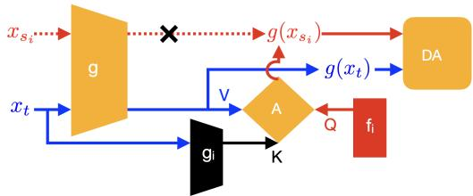  
Figure 2. The mechanism of attention-based feature generation for source-free domain adaptation. Given a similarity-based weight estimated by the knowledge preserved in the pre-trained source model consisting of a black-box feature extractor $g _ { i }$ and a visible classifier $f _ { i } ,$ , labeled features generated with the attention module can be considered a weighted average of unlabeled target features, which serve as the anchor for the target distribution alignment in the adaptation phase.

The SFDA scenario involves two phases: pre-training and adaptation. During pre-training, N models are trained on labeled data from each source domain $x _ { s _ { i } } \sim S _ { i } ^ { \prime } , i = 1 . . . N$ Subsequently, the goal of the adaptation stage is to adapt the pre-trained source model to the unlabeled target data $x _ { t } \sim T$ given few-shot labeled target data $x _ { v } \sim V ^ { \prime }$ . The proposed approach assumes a challenging open-set form, implying that the label spaces among the target and source domains are distinct.

Inspired by [28], which uses a single-layer linear classifier in source models to store the cluster center of source features, we choose the Bayesian linear classifier during pre-training such that source features can be sampled by the re-parameterization trick [21] in the adaptation phase. Let $g _ { i } : \mathcal { X } \to \mathcal { Z } _ { i } \subseteq \mathbb { R } ^ { F _ { i } }$ and $f _ { i } : = \{ \mu _ { i } , \sigma _ { i } \}$ denote each pre-trained source model. As illustrated in Fig. 2, given the source features approximated by the weight samples of Bayesian linear classifier as $g _ { i } ( \hat { S } _ { i } ^ { \prime } ) = \left( \begin{array} { c } { g _ { i } ( x _ { s _ { i } } ^ { 1 } ) } \\ { \vdots } \\ { g _ { i } ( x _ { s _ { i } } ^ { \parallel \mathcal { V } _ { i } ^ { \prime } \parallel } ) } \end{array} \right) : =$

$\mu _ { i } + \sigma _ { i } \odot \left( \begin{array} { c } { \zeta _ { i } ^ { 1 } } \\ { \vdots } \\ { \zeta _ { i } ^ { \parallel y _ { i } ^ { \prime } \parallel } } \end{array} \right) , \zeta _ { i } ^ { j } \sim \mathcal { N } ( 0 , I )$ with size $\| \mathcal { V } _ { i } ^ { \prime } \| \times F _ { i }$

(multiple samples can be generated from each class in practice), along with the query and key mapping functions $w _ { q _ { i } } , w _ { k _ { i } } : { \mathcal { Z } } _ { i } \to { \mathcal { Z } } _ { i } ^ { \prime } \subseteq \mathbb { R } ^ { F _ { i } ^ { \prime } }$ , the corresponding labeled anchor defined as $\{ ( g ( x _ { s _ { i } } ^ { j } ) , y _ { i } ^ { j } \in \mathcal { V } _ { i } ^ { \prime } ) \} _ { j = 1 } ^ { \| \mathcal { V } _ { i } ^ { \prime } \| } , y _ { i } ^ { j } \neq y _ { i } ^ { j ^ { \prime } }$ is given

by:

$$
g ( \hat { S } _ { i } ^ { \prime } ) = \mathrm { s o f t m a x } ( \frac { w _ { q _ { i } } ( g _ { i } ( \hat { S } _ { i } ^ { \prime } ) ) \cdot w _ { k _ { i } } ( g _ { i } ( \hat { T } ^ { \prime } ) ) ^ { \top } } { \sqrt { F _ { i } ^ { \prime } } } ) g ( \hat { T } ^ { \prime } ) ,\tag{14}
$$

where $\hat { \underline { { T } } } ^ { \prime }$ denotes the estimated known-class data from the target. To produce meaningful features for the distribution alignment in the adaptation phase, we propose two objective functions to learn the query and key mapping $\{ w _ { q _ { i } } , w _ { k _ { i } } \} _ { i = 1 } ^ { N }$ of each source domain. Analogous to [5], we train $w _ { q _ { i } } , w _ { k _ { i } }$ by maximizing the similarity between the projections of the same target features extracted by the per-trained source model $g _ { i }$ while pushing the different target features far apart, which can be achieved with minimizing reconstruction loss $L _ { r e c } ^ { i }$ such that the output of the attention module can approximate target features $g ( \hat { T } ^ { \prime } )$ given target data as query and key. To further regularize $w _ { q _ { i } } , w _ { k _ { i } }$ , we introduce a cycleconsistency loss $L _ { c y c } ^ { i }$ that can bring the features generated by labeled and unlabeled target data $\hat { V } ^ { \prime } , \hat { T } ^ { \prime }$ close to each other.

$$
L _ { r e c } ^ { i } = | \mathrm { s o f t m a x } ( \frac { w _ { q _ { i } } ( g _ { i } ( \hat { T } ^ { \prime } ) ) \cdot w _ { k _ { i } } ( g _ { i } ( \hat { T } ^ { \prime } ) ) ^ { \top } } { \sqrt { F _ { i } ^ { \prime } } } ) g ( \hat { T } ^ { \prime } ) - g ( \hat { T } ^ { \prime } ) |\tag{15}
$$

$$
L _ { c y c } ^ { i } = | \mathrm { s o f t m a x } ( \frac { w _ { q _ { i } } ( g _ { i } ( \hat { S } _ { i } ^ { \prime } ) ) \cdot w _ { k _ { i } } ( g _ { i } ( \hat { V } ^ { \prime } ) ) ^ { \sf T } } { \sqrt { F _ { i } ^ { \prime } } } ) g ( \hat { V } ^ { \prime } ) - g ( \hat { S } _ { i } ^ { \prime } ) |\tag{16}
$$

Progressive Unknown Rejection (PUR) is additionally proposed to improve the recognition accuracy on unknown class. In the open-set setting, empirical target data $\hat { T }$ includes the unknown class, while the generated labeled anchors $g ( \hat { S } _ { i } ^ { \prime } )$ should be limited to the known class. According to the generation mechanism defined by Eq. (14), labeled anchors can be considered a similarity-based weighted average of target features, which are not supposed to contain components from irrelevant features of the unknown class. However, it is impractical to learn the ideal results where the weights assigned to those unrelated target features are zero by pure regularization of mapping functions $w _ { q _ { i } } , w _ { k _ { i } }$ To address this problem, we introdcue a scheme to gradually reject the target features from the unknown class by removing the target data labeled as unknown given the current hypothesis $h$ from $\hat { T } .$ . Specifically, at each training iteration during the adaptation stage, for a batch of input target data, we rank the likelihood of the unknown class for each target sample $p ( y = K | x _ { t } ) = h ( x _ { t } ) [ K ]$ in ascending order. Given a threshold $0 < \tau < 1$ progressively increasing from zero according to the exponential ramp-up function [22], we select bottom 1 − Ä target samples as $\hat { T } ^ { \prime }$

## 3.4. Hypothesis Constraint

Proposition 3.8. $I f \mathcal { H } _ { S _ { i } } ^ { F } , \mathcal { H } _ { V } ^ { F } , \mathcal { H } _ { T } ^ { F }$ are sets offunctions that can minimize a part of $\begin{array} { r } { \hat { \theta } _ { S } ^ { i } , \sum _ { i } \hat { \theta } _ { V } ^ { i } , \sum _ { i } \hat { \theta } _ { T } ^ { i } } \end{array}$ respectively, then $f _ { S _ { i } } ^ { * } \in \mathcal { H } _ { S _ { i } } ^ { F } , f _ { V } ^ { * } \in \mathcal { H } _ { V } ^ { F } , \tilde { f } _ { T } ^ { * } \overset { = } { \in } \dot { \mathcal { H } } _ { T } ^ { F }$ must hold such that we can relax $L _ { d i s }$ in Theorem 2.3 by considering maximum w.r.t. functions $f _ { S _ { i } } ^ { \prime } , f _ { V } ^ { \prime } , f _ { T } ^ { \prime }$ as:

$$
\begin{array} { r l r } {  { \log \sum _ { i } \exp ( \nu [ L _ { c l s } ^ { S _ { i } } ( h ; g ) + 2 L _ { d i s } ^ { i } ( f _ { S _ { i } } ^ { * } , f _ { V } ^ { * } , f _ { T } ^ { * } , h ; g ) ] ) } } \\ & { } & { \leq \underset { \{ f _ { S _ { i } } ^ { \prime } \in \mathcal { H } _ { S _ { i } } ^ { F } \} _ { i = 1 } ^ { N } , f _ { V } ^ { \prime } \in \mathcal { H } _ { V } ^ { F } , f _ { T } ^ { \prime } \in \mathcal { H } _ { T } ^ { F } } { \log \sum _ { i } } \exp ( \nu [ L _ { c l s } ^ { S _ { i } } ( h ; g ) + 2 L _ { d i s } ^ { i } ( f _ { S _ { i } } ^ { \prime } , f _ { V } ^ { \prime } , f _ { T } ^ { \prime } , h ; g ) ] ) } \end{array}\tag{17}
$$

Definition 3.9 (Approximated Labeling Function Space). Let $L _ { \mathcal { H } _ { S } } ^ { i } , L _ { \mathcal { H } _ { V } } ^ { i } , L _ { \mathcal { H } _ { T } } ^ { i }$ denote the hypothesis constraints, i.e., a part of the empirical deviation between approximated and true labeling functions $\hat { \theta } _ { S } ^ { i } , \hat { \theta } _ { T } ^ { i } , \hat { \theta } _ { V } ^ { i }$ . Approximated Labeling Function Space $\mathcal { H } _ { S _ { i } } ^ { F } , \mathcal { H } _ { V } ^ { \bar { F } } , \mathcal { H } _ { T } ^ { \bar { F } }$ can be defined as the sets whose members $f _ { S _ { i } } ^ { \prime } , f _ { V } ^ { \prime } , f _ { T } ^ { \prime } \in \mathcal { H } ^ { F }$ can minimize $\begin{array} { r } { L _ { \mathcal { H } _ { S } } ^ { i } , \sum _ { i } L _ { \mathcal { H } _ { V } } ^ { i } , \sum _ { i } L _ { \mathcal { H } _ { T } } ^ { i } \colon } \end{array}$

$$
\left\{ \begin{array} { l l } { \mathcal { H } _ { S _ { i } } ^ { F } = \{ f _ { S _ { i } } ^ { \prime } | \arg \operatorname* { m i n } _ { g , f _ { S _ { i } } ^ { \prime } \in \mathcal { H } ^ { F } } [ L _ { \mathcal { H } _ { S } } ^ { i } ( f _ { S _ { i } } ^ { \prime } ; g ) = L _ { c l s } ^ { S _ { i } } ( f _ { S _ { i } } ^ { \prime } ; g ) / 2 + L _ { c l s } ^ { V } ( f _ { S _ { i } } ^ { \prime } ; g ) ] \} } \\ { \mathcal { H } _ { V } ^ { F } = \{ f _ { V } ^ { \prime } | \arg \operatorname* { m i n } _ { g , f _ { V } ^ { \prime } \in \mathcal { H } ^ { F } } \sum _ { i } [ L _ { \mathcal { H } _ { V } } ^ { i } ( f _ { V } ^ { \prime } ; g ) = L _ { c l s } ^ { V } ( f _ { V } ^ { \prime } ; g ) / 2 + L _ { c l s } ^ { S _ { i } } ( f _ { V } ^ { \prime } ; g ) ] \} } \\ { \mathcal { H } _ { T } ^ { F } = \{ f _ { T } ^ { \prime } | \arg \operatorname* { m i n } _ { g , f _ { T } ^ { \prime } \in \mathcal { H } ^ { F } } \sum _ { i } [ L _ { \mathcal { H } _ { T } } ^ { i } ( f _ { T } ^ { \prime } ; g ) = [ L _ { c l s } ^ { S _ { i } } ( f _ { T } ^ { \prime } ; g ) + L _ { c l s } ^ { V } ( f _ { T } ^ { \prime } ; g ) ] / 2 + L _ { s s l } ] \} } \end{array} \right.\tag{18}
$$

To build a more reliable target function space $\mathcal { H } _ { T } ^ { F }$ , we approximate the target error with the error rate on labeled samples and a semi-supervised regularization term $L _ { s s l } { } ^ { 2 }$ including entropy minimization [14, 15], pseudo labeling [44, 46] and consistency regularization [22, 42], which has been intensively discussed in [23, 43, 59, 63].

## 3.5. Algorithm

As described in Algorithm 1, we introduce a gradient reversal layer [12] to train the overall objective together. ImageNet [8] pre-trained ResNet-50 [16] is used as feature extractor g and randomly initialized 2-layer fully-connected networks are used for classifiers $f _ { S _ { i } } ^ { \prime } , f _ { V } ^ { \prime } , f _ { T } ^ { \prime } , h$ . We adopt SGD with a momentum of 0.9 for optimization, where the initial learning rate is empirically set to 0.001. We employ the learning rate annealing strategy proposed in [12]. We use RandomFlip, RandomCrop, and RandAugment [7] as data augmentation with the batch size fixed to 24.

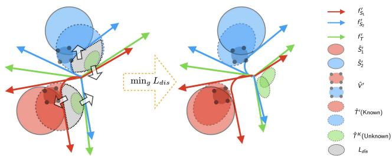  
Figure 3. Alignment mechanism of UM, where unknown target data $\hat { T } ^ { K }$ (green) is pushed away from labeled data into a separated cluster, while known target data $\hat { T } ^ { \prime }$ is aligned back towards labeled clusters by min $_ { 1 g } L _ { d i s }$

Algorithm 1 UM   
Input: source $\{ \hat { S } _ { i } ^ { \prime } \} _ { i = 1 } ^ { N } ,$ labeled target $\hat { V } ^ { \prime } ,$ unlabeled target $\hat { T }$   
Output: updated parameters $\phi ~ = ~ ( \{ f _ { S _ { i } } ^ { \prime } \} _ { i = 1 } ^ { N } , g , h , f _ { V } ^ { \prime } f _ { T } ^ { \prime } ) ,$ w =   
$\{ w _ { q _ { i } } , w _ { k _ { i } } \} _ { i = 1 } ^ { N }$   
Parameter: trade-off parameter $\lambda ;$ learning rate η; known class ratio   
estimator α; coefficients $\nu , \beta , \tau$   
Notation: gradient reversal operator $R ( \cdot )$   
for $e p o c h = 1 , 2 , . . .$ do   
Estimate known class ratio α on $\hat { T }$ with $g , h$   
if source-free then   
Estimate ${ \hat { T } } ^ { \prime }$ according to PUR and Update w to optimize AFG:   
$\begin{array} { r } { w \gets w - \eta \Delta w , \bar { \Delta } w = \frac { \partial \sum _ { i = 1 } ^ { N } ( \bar { L } _ { r e c } ^ { i } + L _ { c y c } ^ { i } ) } { \partial w } } \end{array}$   
Generate labeled features $g ( \hat { S } _ { i } ^ { \prime } )$ according to Eq. (14)   
end if   
Compute labeled target error $L _ { c l s } ^ { V } ( h ; g ) = L _ { V } ,$ , source er  
ror $L _ { c l s } ^ { S _ { i } } ( h ; g ) = L _ { S } ^ { i }$ , hypothesis constraints $L _ { \mathcal { H } _ { S } } ^ { i } ( f _ { S _ { i } } ^ { \prime } ; g ) ~ +$   
$L _ { \mathcal { H } _ { V } } ^ { i } ( f _ { V } ^ { \prime } ; g ) + L _ { \mathcal { H } _ { T } } ^ { i } ( f _ { T } ^ { \prime } ; g ) = L _ { H } ^ { i }$ for i = 1, ..N   
Compute discrepancy $L _ { d i s } ^ { i } ( f _ { S _ { i } } ^ { \prime } , f _ { V } ^ { \prime } , f _ { T } ^ { \prime } , R \circ h \circ R ; R \circ g ) = L _ { D } ^ { i }$   
given the gradient reversal layer for $i = 1 , . . N$   
Update φ to minimize the target error bound:   
$\phi  \phi - \eta \Delta \phi ,$   
$\begin{array} { r } { \Delta \phi = \frac { \partial ( \frac { 1 } { 2 } [ L _ { V } + \frac { 1 } { \nu } \log { \sum _ { i = 1 } ^ { N } \exp ( \nu [ L _ { S } ^ { i } + L _ { H } ^ { i } - \lambda L _ { D } ^ { i } ] ) } ] ) } { \partial \phi } } \end{array}$   
end for

## 4. Evaluation

We evaluated our proposal using two benchmarks, Office-Home and DomainNet. The trade-off parameter ¼ is set to 0.01 during the training procedure according to [62, 63]. In addition, we empirically set the PU, scaling, and threshold coefficients ´ to 0.15, ¿ to 0.1, and Ä to 0.3 for all experiments. For the semi-supervised setting, we select the same few-shot labeled target data according to [41]. Regarding the open-set setting, we assign a distinct label space for each source domain as a subset of the target label space described below. We quantitatively compare our results against various baselines, including OSBP [40], PGL [34], ANNA [27], PUJE [63], MOSDANET [38], HyMOS [3], and MPU [58].

Evaluation Metrics for the proposed method and baselines are the widely used measures [34, 40], i.e., normalized accuracy for the known class only (OS∗) and harmonic mean HOS=2(OS∗ × UNK)/(OS∗ + UNK) [2, 27, 31, 54, 63].

Office-Home [52] is a widely-used domain adaptation benchmark, which consists of 15,500 images from 65 categories and four domains: Art, Clipart, Product, and Real-World. We select the first 30 classes alphabetically as the known class and group the rest as the unknown. Each source domain contains 10 classes without overlap, leading to a large label shift scenario.

DomainNet [36] is a more challenging benchmark dataset for large-scale domain adaptation that has 345 classes and

<table><tr><td rowspan="2">METHOD</td><td rowspan="2">TYPE</td><td colspan="2">→Clipart</td><td colspan="2">→Product</td><td colspan="2">→RealWorld</td><td colspan="2">→Art</td><td colspan="2">Avg.</td></tr><tr><td>1-shot</td><td>3-shot</td><td>1-shot</td><td>3-shot</td><td>1-shot</td><td>3-shot</td><td>1-shot</td><td>3-shot</td><td>1-shot</td><td>3-shot</td></tr><tr><td>OSBP</td><td>Source-Combine</td><td>60.4</td><td>62.6</td><td>70.1</td><td>72.3</td><td>69.7</td><td>68.3</td><td>60.7</td><td>64.3</td><td>65.2</td><td>66.9</td></tr><tr><td>PGL</td><td></td><td>59.0</td><td>61.8</td><td>67.7</td><td>69.9</td><td>66.7</td><td>68.9</td><td>61.2</td><td>64.0</td><td>63.7</td><td>66.2</td></tr><tr><td>ANNA</td><td></td><td>65.8</td><td>67.7</td><td>71.0</td><td>73.4</td><td>70.3</td><td>70.3</td><td>61.0</td><td>63.7</td><td>67.0</td><td>68.8</td></tr><tr><td>PUJE</td><td></td><td>65.8</td><td>71.7</td><td>73.3</td><td>74.2</td><td>75.0</td><td>78.1</td><td>65.5</td><td>67.3</td><td>69.9</td><td>72.8</td></tr><tr><td>MOSDANET</td><td>Multi-Source</td><td>61.5</td><td>65.9</td><td>70.0</td><td>73.8</td><td>71.4</td><td>69.6</td><td>61.6</td><td>63.6</td><td>66.1</td><td>68.2</td></tr><tr><td>HyMOS</td><td></td><td>56.6</td><td>64.4</td><td>64.4</td><td>67.3</td><td>66.2</td><td>68.4</td><td>59.0</td><td>62.2</td><td>61.6</td><td>65.6</td></tr><tr><td>UM</td><td></td><td>68.0</td><td>72.1</td><td>79.0</td><td>83.0</td><td>79.4</td><td>80.8</td><td>67.7</td><td>70.3</td><td>73.5</td><td>76.6</td></tr><tr><td>MPU*</td><td>Source-Free</td><td>46.3</td><td>54.4</td><td>59.7</td><td>66.3</td><td>57.8</td><td>60.2</td><td>58.3</td><td>62.5</td><td>55.5</td><td>60.9</td></tr><tr><td>OSBP*</td><td></td><td>44.5</td><td>56.5</td><td>55.6</td><td>65.1</td><td>59.3</td><td>64.3</td><td>55.6</td><td>59.9</td><td>53.8</td><td>61.5</td></tr><tr><td>PUJE*</td><td></td><td>52.2</td><td>58.4</td><td>.65.0</td><td>70.3</td><td>66.2</td><td>70.0</td><td>58.7</td><td>62.7</td><td>60.5</td><td>65.4</td></tr><tr><td>UM+AFG</td><td></td><td>61.1</td><td>66.0</td><td>77.0</td><td>80.1</td><td>72.0</td><td>78.8</td><td>60.3</td><td>64.6</td><td>67.6</td><td>72.4</td></tr></table>

Table 1. HOS (%) of ResNet-50 model fine-tuned on Office-Home dataset under 1-shot/3-shot setting
<table><tr><td rowspan="2">METHOD</td><td rowspan="2">TYPE</td><td colspan="2">→Clipart</td><td colspan="2">→Painting</td><td colspan="2">→Real</td><td colspan="2">→Sketch</td><td colspan="2">Avg.</td></tr><tr><td>1-shot</td><td>3-shot</td><td>1-shot</td><td>3-shot</td><td>1-shot</td><td>3-shot</td><td>1-shot</td><td>3-shot</td><td>1-shot</td><td>3-shot</td></tr><tr><td>OSBP</td><td>Source-Combine</td><td>54.2</td><td>57.4</td><td>49.8</td><td>53.1</td><td>62.6</td><td>64.0</td><td>49.5</td><td>50.1</td><td>54.0</td><td>56.2</td></tr><tr><td>PGL</td><td></td><td>59.8</td><td>62.0</td><td>59.4</td><td>61.4</td><td>67.4</td><td>69.4</td><td>59.7</td><td>61.2</td><td>61.6</td><td>63.5</td></tr><tr><td>ANNA</td><td></td><td>55.6</td><td>61.5</td><td>53.6</td><td>54.3</td><td>67.5</td><td>66.5</td><td>57.9</td><td>58.1</td><td>58.7</td><td>60.1</td></tr><tr><td>PUJE</td><td></td><td>64.4</td><td>66.2</td><td>59.8</td><td>61.7</td><td>67.7</td><td>69.3</td><td>61.2</td><td>64.2</td><td>63.3</td><td>65.4</td></tr><tr><td>MOSDANET</td><td>Multi-Source</td><td>56.4</td><td>55.3</td><td>55.6</td><td>58.2</td><td>68.5</td><td>69.8</td><td>54.1</td><td>54.9</td><td>58.7</td><td>59.6</td></tr><tr><td>HyMOS</td><td></td><td>53.0</td><td>54.4</td><td>54.1</td><td>56.0</td><td>65.1</td><td>67.4</td><td>56.3</td><td>57.1</td><td>57.1</td><td>58.7</td></tr><tr><td>UM</td><td></td><td>70.3</td><td>71.5</td><td>66.0</td><td>68.8</td><td>75.1</td><td>78.5</td><td>66.1</td><td>69.5</td><td>69.4</td><td>72.1</td></tr><tr><td>MPU*</td><td>Source-Free</td><td>54.5</td><td>57.6</td><td>55.0</td><td>60.1</td><td>62.4</td><td>66.4</td><td>48.4</td><td>52.9</td><td>55.1</td><td>59.3</td></tr><tr><td>MOSDANET*</td><td></td><td>58.1</td><td>60.5</td><td>54.3</td><td>59.3</td><td>63.2</td><td>62.5</td><td>49.4</td><td>54.3</td><td>56.3</td><td>59.2</td></tr><tr><td>PUJE*</td><td></td><td>60.5</td><td>62.2</td><td>55.3</td><td>61.4</td><td>64.0</td><td>67.8</td><td>53.1</td><td>56.2</td><td>58.2</td><td>61.9</td></tr><tr><td>UM+AFG</td><td></td><td>64.8</td><td>69.7</td><td>60.0</td><td>64.2</td><td>67.6</td><td>73.4</td><td>60.0</td><td>64.8</td><td>63.1</td><td>68.0</td></tr></table>

Table 2. HOS (%) of ResNet-50 model fine-tuned on DomainNet dataset under 1-shot/3-shot setting

6 domains. Following the protocol established in [41], we pick 4 domains (Real, Clipart, Painting, Sketch) with 126 classes for the experiments. We select the first 60 classes alphabetically as the known class and group the rest as the unknown. Similarly, each source domain contains 20 classes without any overlap.

As reported in Tabs. 1 and 2, under the same setting given 1-shot/3-shot labeled target data (1/3 samples per class), we observe that our method UM consistently outperforms the state-of-the-art results, improving HOS by 3.6%/3.8% and 6.1%/6.7% on the benchmark datasets of Office-Home and DomainNet respectively, when source data is available. Furthermore, UM+AFG enhances HOS by 7.1%/7.0% in Office-Home and 4.9%/6.1% in DomainNet under the challenging source-free setting. Note that our proposed approach provides significant performance gains for the more complex datasets like DomainNet, which requires knowledge transfer across different modalities, regardless of covariate or label shift. We group all source domains with labeled target data as a single domain for the baselines that require the sourcecombine strategy. For the source-free cases, we introduce a few confident target data labeled by pre-trained models as pseudo-source data to enable several algorithms denoted by ∗ under this problem setting since none of the existing methods can directly address the open-set task under the source-free condition with a huge label shift across source domains.

## 4.1. Feature Space Visualization

To intuitively visualize the effectiveness of different approaches, we extracted features from the baseline models and our proposed model on the →Art task (Office-Home) and →Real task (DomainNet) with the ResNet-50 backbone [16]. The feature distributions were processed with t-SNE [48] afterward. As shown in Fig. 4, compared with baselines, our method UM achieves a better alignment between source and target distributions, especially when the domain shift is large. Benefiting from our joint error-based adversarial alignment mechanism, the extracted feature space, including the cluster of unknown target data (green), has a more discriminative class-wise decision boundary.

<table><tr><td rowspan="2">METHOD</td><td rowspan="2">TYPE</td><td colspan="3">Office-Home</td><td colspan="3">DomainNet</td></tr><tr><td>UNK</td><td>→RealWorld OS*</td><td>HOS</td><td>UNK</td><td>→Clipart OS*</td><td>HOS</td></tr><tr><td>DEFAULT</td><td>Source-Free</td><td>73.7</td><td>70.4</td><td>72.0</td><td>72.6</td><td>58.6</td><td>64.8</td></tr><tr><td>w/o Lsim</td><td></td><td>70.9</td><td>70.6</td><td>70.7</td><td>69.3</td><td>59.1</td><td>63.8</td></tr><tr><td>w/o  $L _ { c y c }$ </td><td></td><td>74.0</td><td>68.5</td><td>71.1</td><td>72.8</td><td>56.9</td><td>63.9</td></tr><tr><td>w/o PUR</td><td></td><td>39.6</td><td>87.0</td><td>54.4</td><td>47.3</td><td>72.9</td><td>57.4</td></tr></table>

Table 3. Ablation study verified with ResNet-50 model on Office-Home & DomainNet dataset

## 4.2. Ablation Study

Self-supervised learning methods have shown that, by relying only on unlabeled data, it is still possible to obtain classification performance close to those of the supervised approaches [5, 17, 18]. In the source-free setting, we adopt the typical SimCLR [5] to help group the feature of unknown target data into a single cluster. As expected in Tab. $3 , L _ { s i m } { } ^ { 2 }$ can slightly improve the accuracy of the unknown class for a higher HOS. Furthermore, Progressive Unknown Rejection (PUR), a denoising of generated labeled features, is crucial to detecting unknowns in source-free cases. As also illustrated in Fig. 7d, generally, a larger threshold Ä will lead to a higher UNK at the cost of low OS∗, characterized as the trade-off between recognizing known and unknown data for open-set tasks. In addition, we verify the effectiveness of cycle-consistency regularization $L _ { c y c }$ and find it helps maintain the normalized accuracy of the known class.

## 4.3. Robustness against Varying Openness

To verify the robustness of the proposed method, we conducted experiments on the → Painting task (DomainNet) with the openness varying in {0.25, 0.5, 0.75}. Here, openness is defined by the ratio of unknown samples in the entire target data. PGL approach heuristically sets the hyperparameter according to the true unknown ratio to control the openness, while PUJE and UM automatically estimate the weight ³ during the training procedure. From Fig. 5a, we observe that our proposal consistently outperforms baselines by a large margin, which confirms its robustness to the change in openness.

## 4.4. Stabel Covergence

In Fig. 5b, we illustrate the recognition performance of UM over training steps on the →Art task of the Office-Home dataset. ${ \mathrm { O S ^ { * } } }$ experiences a downward while the UNK keeps improving, which characterizes a trade-off between the accuracy of knowns and the accuracy of unknowns. We further observe that some previous works [27, 34] do not converge at the optimum. In contrast, our method always reaches a reliable convergence without suffering from a severe performance drop in recognizing known classes.

<table><tr><td rowspan="2">METHOD</td><td rowspan="2">TYPE</td><td rowspan="2">BACKBONE</td><td colspan="6">Office-Home</td><td colspan="6">DomainNet</td><td rowspan="2" colspan="3"></td></tr><tr><td>→Art</td><td></td><td></td><td></td><td>→Product</td><td></td><td></td><td>→Painting</td><td></td><td>→Real</td><td></td><td></td><td>Avg.</td></tr><tr><td></td><td></td><td></td><td>UNK</td><td>OS*</td><td>HOS</td><td>UNK</td><td>OS*</td><td>HOS</td><td>UNK</td><td>OS*</td><td>HOS</td><td>UNK</td><td>OS*</td><td>HOS</td><td>UNK</td><td>OS</td><td>HOS</td></tr><tr><td>UM</td><td>Multi-Source</td><td>ResNet-50</td><td>72.8</td><td>63.3</td><td>67.7</td><td>78.7</td><td>79.3</td><td>79.0</td><td>77.9</td><td>57.3</td><td>66.0</td><td>74.9</td><td>75.2</td><td>75.1</td><td>76.1</td><td>68.8</td><td>72.0</td></tr><tr><td>UM+AFG</td><td>Source-Free</td><td>ResNet-50</td><td>66.1</td><td>55.5</td><td>60.3</td><td>833</td><td>71.6</td><td>77.0</td><td>63.9</td><td>56.5</td><td>60.0</td><td>76.6</td><td>60.6</td><td>67.6</td><td>72.5</td><td>61.1</td><td>66.2</td></tr><tr><td>UM+AFG</td><td></td><td>ViT-16</td><td>77.7</td><td>59.8</td><td>67.5</td><td>87.6</td><td>80.9</td><td>84.1</td><td>68.5</td><td>57.4</td><td>62.5</td><td>82.8</td><td>73.2</td><td>77.7</td><td>79.2</td><td>67.8</td><td>73.0</td></tr></table>

Table 4. Accuracy of ViT-B/16 model fine-tuned on Office-Home & DomainNet dataset under 1-shot setting

## 4.5. Flexibility in Backbone Architecture

As presented in Sec. 3.3, AFG allows the target model to use a different backbone architecture from the pre-trained source models. Therefore, unlike those model-centric methods whose performance is deeply limited by source model architecture, our method can be effectively applied to realworld problems where each source model is trained using various networks by leveraging the power of advanced backbones like ViT [9] for the target model. Tab. 4 reveals a clear advantage of AFG when changing the target backbone to ViT-B/16 as the HOS scores under the source-free condition approach and even outperform the source data results. The same ResNet-50 backbone is used for pre-trained source models across different experiments.

## 4.6. Advantage in Increasing Labeled Target Data

Sec. 4.6 shows the behavior of different methods when the number of labeled examples in the target domain increases from 1 to 10 per class on DomainNet using ResNet50 backbone. Cluster-based methods like OSBP, MOSDANET, and HyMOS will finally be caught up by a simple multi-class PU learning (MPU) when the sample size increases. On the contrary, our method consistently outperforms the most competitive baseline PUJE for various sizes of labeled target data. Furthermore, along with the growth in the size of Vˆ , the HOS score achieved by UM+AFG in the source-free setting gradually approaches, even surpasses those methods using source data.

## 4.7. Sensitivity to PU, Scaling, and Threshold Coefficients

We show the sensitivity of our approach to varying PU coefficient ´, scaling factor ¿, and threshold Ä in Sec. 4.7. We can draw two observations from this: the OS∗ score is relatively stable, and the unknown recognition achieves a more reliable performance for a larger coefficient ´; generally, a larger ¿ means focusing on the source domain that contributes more error and ignoring others, while a smaller ¿ will equalize the importance of each domain, which can harm the performance when a remarkable label shift exists among source domains implied by Fig. 7c (the imbalance setting indicates a case where one source contains 20 classes while the other two sources take 5 classes respectively).

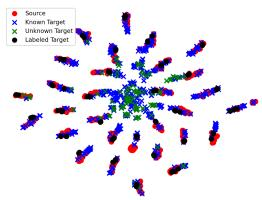  
(a) OSBP

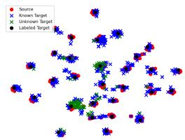  
(b) HyMOS

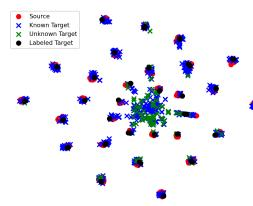

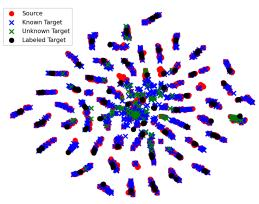

(c) PUJE  
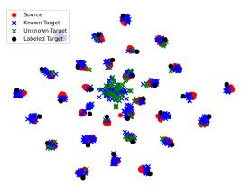

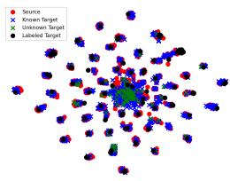  
(e) MOSDANET  
(f) PGL

(d) UM  
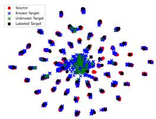  
(g) ANNA

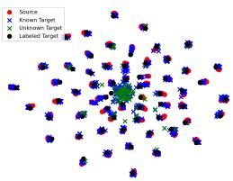  
(h) UM  
Figure 4. T-SNE visualization of feature distributions in (a)-(d) →Art task (Office-Home dataset); (e)-(h) →Real task (DomainNet dataset).

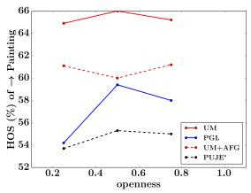  
(a) robust against openness

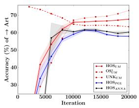  
(b) stable convergence  
Figure 5. (a) Performance comparisons w.r.t. varying openness of the →Painting task from DomainNet dataset; (b) Convergence analysis of the →Art task from Office-Home dataset compared to other baselines with confidence intervals

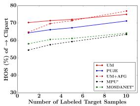  
(a) → Clipart task

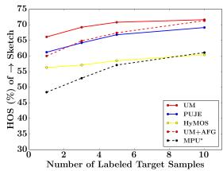  
(b) → Sketch task  
Figure 6. Accuracy vs the number of labeled target samples on DomainNet using ResNet50 backbone. Our method maintains a high level of performance for different sample sizes of the labeled target data.

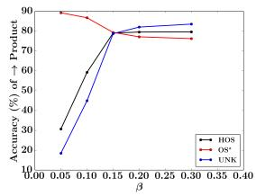  
(a) sensitivity to β

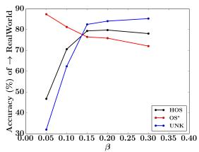

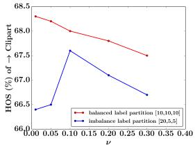  
(c) sensitivity to ν

(b) sensitivity to β  
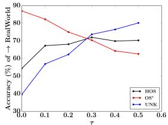  
(d) sensitivity to τ  
Figure 7. (a)-(d) Sensitivity to varying loss coefficient $\beta , \nu , \tau$ verified in Office-Home dataset.

## 5. Conclusion

In this work, we addressed the semi-supervised open-set domain shift problem in multi-source cases with inconsistent label space by introducing a novel learning theory based on joint error and multi-class PU learning that can reduce the open-set risk, where the generalization error is bounded by the extension of VC learning theory based on uniform covering number. We generalize our method into sourcefree scenarios by attention-based feature generation, which is computationally efficient with reliable performance. We conduct extensive experiments on multiple domain adaptation benchmarks. Our model achieves the best performance regardless of source data, compared with recent baseline methods, proving our proposed approach’s efficacy.

## Acknowledgements

This research is partially supported by JST Moonshot R&D Grant Number JPMJPS2011, CREST Grant Number JPMJCR2015 and Basic Research Grant (Super AI) of Institute for AI and Beyond of the University of Tokyo.

## References

[1] Shai Ben-David, John Blitzer, Koby Crammer, Alex Kulesza, Fernando Pereira, and Jennifer Vaughan. A theory of learning from different domains. Machine Learning, 79:151–175, 2010. 1

[2] Silvia Bucci, Mohammad Reza Loghmani, and Tatiana Tommasi. On the effectiveness of image rotation for open set domain adaptation. In 16th European Conference on Computer Vision, pages 422–438. Springer International Publishing, 2020. 2, 6

[3] Silvia Bucci, Francesco Cappio Borlino, Barbara Caputo, and Tatiana Tommasi. Distance-based hyperspherical classification for multi-source open-set domain adaptation. In IEEE/CVF Winter Conference on Applications ofComputer Vision, pages 1030–1039. IEEE, 2022. 6

[4] Pau Panareda Busto and Juergen Gall. Open set domain adaptation. In IEEE International Conference on Computer Vision, pages 754–763, 2017. 1

[5] Ting Chen, Simon Kornblith, Mohammad Norouzi, and Geoffrey Hinton. A simple framework for contrastive learning of visual representations. In Proceedings of the 37th International Conference on Machine Learning. JMLR.org, 2020. 5, 7

[6] Shivang Chopra, Suraj Kothawade, Houda Aynaou, and Aman Chadha. Source-free domain adaptation with diffusion-guided source data generation. CoRR, abs/2402.04929, 2024. 4

[7] Ekin D. Cubuk, Barret Zoph, Jonathon Shlens, and Quoc V. Le. Randaugment: Practical automated data augmentation with a reduced search space. In IEEE/CVF Conference on Computer Vision and Pattern Recognition Workshops, pages 3008–3017, 2020. 5

[8] Jun Deng, Wei Dong, Richard Socher, Li-Jia Li, Kuntai Li, and Li Fei-Fei. Imagenet: A large-scale hierarchical image database. IEEE Conference on Computer Vision and Pattern Recognition, pages 248–255, 2009. 5

[9] Alexey Dosovitskiy, Lucas Beyer, Alexander Kolesnikov, Dirk Weissenborn, Xiaohua Zhai, Thomas Unterthiner, Mostafa Dehghani, Matthias Minderer, Georg Heigold, Sylvain Gelly, Jakob Uszkoreit, and Neil Houlsby. An image is worth 16x16 words: Transformers for image recognition at scale, 2021. 7

[10] Zhen Fang, Jie Lu, Feng Liu, Junyu Xuan, and Guangquan Zhang. Open set domain adaptation: Theoretical bound and algorithm. IEEE Transactions on Neural Networks and Learning Systems, 32:4309–4322, 2020. 2

[11] Yaroslav Ganin and Victor Lempitsky. Unsupervised domain adaptation by backpropagation. In Proceedings of the 32nd International Conference on Machine Learning, pages 1180– 1189. JMLR.org, 2015. 1

[12] Yaroslav Ganin, Evgeniya Ustinova, Hana Ajakan, Pascal Germain, Hugo Larochelle, François Laviolette, Mario Marchand, and Victor Lempitsky. Domain-adversarial training of neural networks. Journal ofMachine Learning Research, 17 (1):2096–2030, 2016. 5

[13] Saurabh Garg, Sivaraman Balakrishnan, and Zachary C. Lipton. Domain adaptation under open set label shift. In Proceedings ofthe 36th International Conference on Neural Information Processing Systems. Curran Associates Inc., 2022. 3

[14] Ryan Gomes, Andreas Krause, and Pietro Perona. Discriminative clustering by regularized information maximization. In Proceedings ofthe 23rd International Conference on Neural Information Processing Systems, pages 775–783. Curran Associates Inc., 2010. 5

[15] Yves Grandvalet and Yoshua Bengio. Semi-supervised learning by entropy minimization. In Proceedings of the 17th International Conference on Neural Information Processing Systems, pages 529–536. MIT Press, 2004. 5

[16] Kaiming He, Xiangyu Zhang, Shaoqing Ren, and Jian Sun. Deep residual learning for image recognition. IEEE Conference on Computer Vision and Pattern Recognition, pages 770–778, 2015. 5, 7

[17] Kaiming He, Haoqi Fan, Yuxin Wu, Saining Xie, and Ross Girshick. Momentum contrast for unsupervised visual representation learning. In IEEE/CVF Conference on Computer Vision and Pattern Recognition, pages 9726–9735, 2020. 7

[18] Olivier J. Hénaff, Aravind Srinivas, Jeffrey De Fauw, Ali Razavi, Carl Doersch, S. M. Ali Eslami, and Aaron Van Den Oord. Data-efficient image recognition with contrastive predictive coding. In Proceedings of the 37th International Conference on Machine Learning. JMLR.org, 2020. 7

[19] Judy Hoffman, Mehryar Mohri, and Ningshan Zhang. Algorithms and theory for multiple-source adaptation. In Proceedings of the 32nd International Conference on Neural Information Processing Systems, pages 8256–8266. Curran Associates Inc., 2018. 1

[20] JoonHo Jang, Byeonghu Na, DongHyeok Shin, Mingi Ji, Kyungwoo Song, and Il-Chul Moon. Unknown-aware domain adversarial learning for open-set domain adaptation. In Proceedings of the 36th International Conference on Neural Information Processing Systems. Curran Associates Inc., 2022. 2

[21] Diederik P. Kingma and Max Welling. Auto-encoding variational bayes. In 2nd International Conference on Learning Representations, 2014. 4

[22] Samuli Laine and Timo Aila. Temporal ensembling for semisupervised learning. In 5th International Conference on Learning Representations, 2017. 5

[23] Jichang Li, Guanbin Li, Yemin Shi, and Yizhou Yu. Crossdomain adaptive clustering for semi-supervised domain adaptation. In IEEE/CVF Conference on Computer Vision and Pattern Recognition, pages 2505–2514, 2021. 1, 5

[24] Jingjing Li, Zhiqi Yu, Zhekai Du, Lei Zhu, and Heng Tao Shen. A comprehensive survey on source-free domain adaptation. IEEE Transactions on Pattern Analysis and Machine Intelligence, 46(8):5743–5762, 2024. 4

[25] Keqiuyin Li, Jie Lu, Hua Zuo, and Guangquan Zhang. Multisource domain adaptation handling inaccurate label spaces. Neurocomputing, 594:127824, 2024. 2

[26] Rui Li, Qianfen Jiao, Wenming Cao, Hau-San Wong, and Si Wu. Model adaptation: Unsupervised domain adaptation without source data. In IEEE/CVF Conference on Computer Vision and Pattern Recognition, pages 9638–9647, 2020. 4

[27] Wuyang Li, Jie Liu, Bo Han, and Yixuan Yuan. Adjustment and alignment for unbiased open set domain adaptation. In 2023 IEEE/CVF Conference on Computer Vision and Pattern Recognition, pages 24110–24119, 2023. 2, 6, 7

[28] Jian Liang, Dapeng Hu, and Jiashi Feng. Do we really need to access the source data? source hypothesis transfer for unsupervised domain adaptation. In Proceedings of the 37th International Conference on Machine Learning. JMLR.org, 2020. 4

[29] Jian Liang, Dapeng Hu, Yunbo Wang, Ran He, and Jiashi Feng. Source data-absent unsupervised domain adaptation through hypothesis transfer and labeling transfer. IEEE Transactions on Pattern Analysis and Machine Intelligence, 44(11): 8602–8617, 2022. 4

[30] Hanxiao Liu, Karen Simonyan, and Yiming Yang. Darts: Differentiable architecture search. In 7th International Conference on Learning Representations, 2019. 3

[31] Mohammad Reza Loghmania, Markus Vinczea, and Tatiana Tommasi. Positive-unlabeled learning for open set domain adaptation. Pattern Recognition Letters, 136:198–204, 2020. 6

[32] Mingsheng Long, Yue Cao, Jianmin Wang, and Michael I. Jordan. Learning transferable features with deep adaptation networks. In Proceedings ofthe 32nd International Conference on Machine Learning, pages 97–105. JMLR.org, 2015. 1

[33] Mingsheng Long, Zhangjie Cao, Jianmin Wang, and Michael I Jordan. Conditional adversarial domain adaptation. In Proceedings ofthe 32nd International Conference on Neural Information Processing Systems, pages 1647–1657. Curran Associates Inc., 2018. 1

[34] Yadan Luo, Zijian Wang, Zi Huang, and Mahsa Baktashmotlagh. Progressive graph learning for open-set domain adaptation. In Proceedings ofthe 37th International Conference on Machine Learning, pages 6468–6478. PMLR, 2020. 2, 6, 7

[35] Yadan Luo, Zijian Wang, Zhuoxiao Chen, Zi Huang, and Mahsa Baktashmotlagh. Source-free progressive graph learning for open-set domain adaptation. IEEE Transactions on Pattern Analysis and Machine Intelligence, 45(9):11240– 11255, 2023. 4

[36] Xingchao Peng, Qinxun Bai, Xide Xia, Zijun Huang, Kate Saenko, and Bo Wang. Moment matching for multi-source domain adaptation. In IEEE/CVF International Conference on Computer Vision, pages 1406–1415, 2019. 1, 2, 6

[37] Md Mahmudur Rahman, Rameswar Panda, and Mohammad Arif Ul Alam. Semi-supervised domain adaptation with autoencoder via simultaneous learning. In IEEE/CVF Winter Conference on Applications of Computer Vision, pages 402– 411, 2023. 1

[38] Sayan Rakshit, Dipesh Tamboli, Pragati Shuddhodhan Meshram, Biplab Banerjee, Gemma Roig, and Subhasis Chaudhuri. Multi-source open-set deep adversarial domain adaptation. In 16th European Conference on Computer Vision, pages 735–750. Springer International Publishing, 2020. 6

[39] Kuniaki Saito, Kohei Watanabe, Yoshitaka Ushiku, and Tatsuya Harada. Maximum classifier discrepancy for unsupervised domain adaptation. IEEE/CVF Conference on Computer Vision and Pattern Recognition, pages 3723–3732, 2017. 1

[40] Kuniaki Saito, Shohei Yamamoto, Yoshitaka Ushiku, and Tatsuya Harada. Open set domain adaptation by backpropagation. In 15th European Conference on Computer Vision, pages 156–171. Springer International Publishing, 2018. 2, 6

[41] Kuniaki Saito, Donghyun Kim, Stan Sclaroff, Trevor Darrell, and Kate Saenko. Semi-supervised domain adaptation via minimax entropy. In IEEE/CVF International Conference on Computer Vision, pages 8049–8057, 2019. 1, 6

[42] Mehdi Sajjadi, Mehran Javanmardi, and Tolga Tasdizen. Regularization with stochastic transformations and perturbations for deep semi-supervised learning. In Proceedings ofthe 30th International Conference on Neural Information Processing Systems, pages 1171–1179. Curran Associates Inc., 2016. 5

[43] Ankit Singh. Clda: contrastive learning for semi-supervised domain adaptation. In Proceedings ofthe 35th International Conference on Neural Information Processing Systems. Curran Associates Inc., 2021. 1, 5

[44] Kihyuk Sohn, David Berthelot, Chun-Liang Li, Zizhao Zhang, Nicholas Carlini, Ekin D. Cubuk, Alex Kurakin, Han Zhang, and Colin Raffel. Fixmatch: simplifying semi-supervised learning with consistency and confidence. In Proceedings ofthe 34th International Conference on Neural Information Processing Systems. Curran Associates Inc., 2020. 5

[45] Shiliang Sun, Honglei Shi, and Yuanbin Wu. A survey of multi-source domain adaptation. Information Fusion, 24: 84–92, 2015. 1

[46] Hui Tang, Ke Chen, and Kui Jia. Unsupervised domain adaptation via structurally regularized deep clustering. In IEEE/CVF Conference on Computer Vision and Pattern Recognition, pages 8722–8732, 2020. 5

[47] Eric Tzeng, Judy Hoffman, Kate Saenko, and Trevor Darrell. Adversarial discriminative domain adaptation. IEEE/CVF Conference on Computer Vision and Pattern Recognition, pages 2962–2971, 2017. 1

[48] Laurens van der Maaten and Geoffrey Hinton. Visualizing data using t-SNE. Journal of Machine Learning Research, 9: 2579–2605, 2008. 7

[49] Vladimir N. Vapnik. The nature of statistical learning theory. Springer-Verlag New York, Inc., 1995. 2

[50] V. N. Vapnik and A. Ya. Chervonenkis. On the Uniform Convergence ofRelative Frequencies ofEvents to Their Probabilities, pages 11–30. Springer International Publishing, 2015. 2

[51] Naveen Venkat, Jogendra Nath Kundu, Durgesh Kumar Singh, Ambareesh Revanur, and R. Venkatesh Babu. Your classifier can secretly suffice multi-source domain adaptation. In Proceedings of the 34th International Conference on Neural Information Processing Systems, 2020. 1

[52] Hemanth Venkateswara, Jose Eusebio, Shayok Chakraborty, and Sethuraman Panchanathan. Deep hashing network for unsupervised domain adaptation. In IEEE Conference on Computer Vision and Pattern Recognition, pages 5385–5394, 2017. 6

[53] Hang Wang, Minghao Xu, Bingbing Ni, and Wenjun Zhang. Learning to combine: Knowledge aggregation for multisource domain adaptation. In 16th European Conference on Computer Vision, pages 727–744. Springer-Verlag, 2020. 1

[54] Qian Wang, Fanlin Meng, and Toby P. Breckon. Progressively select and reject pseudolabeled samples for open-set domain adaptation. IEEE Transactions on Artificial Intelligence, 5(9): 4403–4414, 2024. 2, 6

[55] Zixin Wang, Yadan Luo, Peng-Fei Zhang, Sen Wang, and Zi Huang. Discovering domain disentanglement for generalized multi-source domain adaptation. In IEEE International Conference on Multimedia and Expo, pages 1–6. IEEE, 2022. 2

[56] Jun Wu and Jingrui He. Domain adaptation with dynamic open-set targets. In Proceedings ofthe 28th ACM SIGKDD Conference on Knowledge Discovery and Data Mining, pages 2039–2049. Association for Computing Machinery, 2022. 3

[57] R. Xu, Z. Chen, W. Zuo, J. Yan, and L. Lin. Deep cocktail network: Multi-source unsupervised domain adaptation with category shift. In IEEE/CVF Conference on Computer Vision and Pattern Recognition, pages 3964–3973. IEEE Computer Society, 2018. 1

[58] Yixing Xu, Chang Xu, Chao Xu, and Dacheng Tao. Multipositive and unlabeled learning. In Proceedings of the 26th International Joint Conference on Artificial Intelligence, pages 3182–3188. AAAI Press, 2017. 2, 3, 6

[59] Luyu Yang, Yan Wang, Mingfei Gao, Abhinav Shrivastava, Kilian Q. Weinberger, Wei-Lun Chao, and Ser-Nam Lim. Deep co-training with task decomposition for semi-supervised domain adaptation. In IEEE/CVF International Conference on Computer Vision, pages 8886–8896, 2021. 1, 5

[60] S. Yang, Y. Wang, J. van de Weijer, L. Herranz, S. Jui, and J. Yang. Trust your good friends: Source-free domain adaptation by reciprocal neighborhood clustering. IEEE Transactions on Pattern Analysis and Machine Intelligence, 45(12):15883– 15895, 2023. 4

[61] Jeongbeen Yoon, Dahyun Kang, and Minsu Cho. Semisupervised domain adaptation via sample-to-sample selfdistillation. In IEEE/CVF Winter Conference on Applications ofComputer Vision, pages 1686–1695, 2022. 1

[62] Dexuan Zhang, Thomas Westfechtel, and Tatsuya Harada. Unsupervised domain adaptation via minimized joint error. Transactions on Machine Learning Research, 2023. 1, 2, 6

[63] Dexuan Zhang, Thomas Westfechtel, and Tatsuya Harada. Open-set domain adaptation via joint error based multi-class positive and unlabeled learning. In 18th European Conference on Computer Vision. Springer International Publishing, 2024. 2, 3, 5, 6

[64] Yuchen Zhang, Tianle Liu, Mingsheng Long, and Michael Jordan. Bridging theory and algorithm for domain adaptation. In Proceedings of the 36th International Conference on Machine Learning, pages 7404–7413. PMLR, 2019. 1

[65] Han Zhao, Shanghang Zhang, Guanhang Wu, Joao P. Costeira, Jose M. F. Moura, and Geoffrey J. Gordon. Adversarial multiple source domain adaptation. In Proceedings ofthe 32nd International Conference on Neural Information Processing Systems, pages 8568–8579. Curran Associates Inc., 2018. 1, 3

[66] Han Zhao, Remi Tachet des Combes, Kun Zhang, and Geoffrey J. Gordon. On learning invariant representation for domain adaptation. In Proceedings ofthe 36th International Conference on Machine Learning, 2019. 2

[67] Yongchun Zhu, Fuzhen Zhuang, and Deqing Wang. Aligning domain-specific distribution and classifier for cross-domain classification from multiple sources. In Proceedings of the 33rd AAAI Conference on Artificial Intelligence. AAAI Press, 2019. 1