# ABBSPO: Adaptive Bounding Box Scaling and Symmetric Prior based Orientation Prediction for Detecting Aerial Image Objects

Woojin Lee1\* Hyugjae Chang1\* Jaeho Moon1 Jaehyup Lee2† Munchurl Kim1† 1KAIST 2KNU

{woojin412, hmnc97, jaeho.moon, mkimee}@kaist.ac.kr jaehyuplee@knu.ac.kr https://kaist-viclab.github.io/ABBSPO\_site/

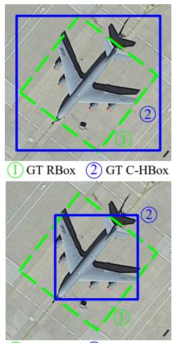  
1 GT RBox 2 GT T-HBox

H2RBox [42]  
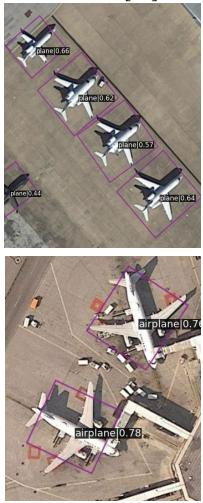

H2RBox-v2 [48]  
ABBSPO  
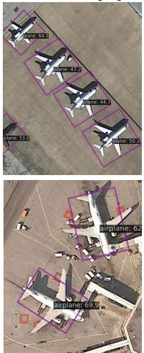

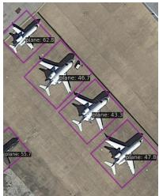

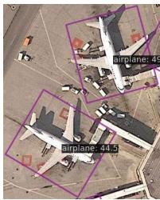

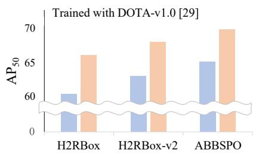

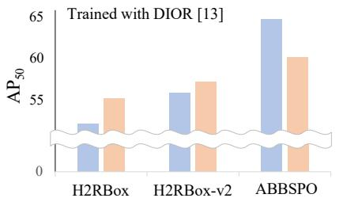  
(b) Visual comparison of HBox-supervised oriented detectors (c) Performance overview 3-AP50 AP50(a) Two types of GT HBox

Figure 1. Performance comparison of HBox-supervised orientated detectors. (a) Top: A coarse horizontal bounding box (C-HBox) (⃝2 ) and its corresponding rotated bounding box (RBox) (⃝1 ). Bottom: A tight horizontal bounding box (T-HBox)(⃝2 ) and its corresponding RBox (⃝1 ). (b) Our ABBSPO is capable of accurately detecting both orientations and scales for GT C-HBoxes and T-HBoxes. (c) Average Precision $( \mathrm { A P _ { 5 0 } } )$ for H2RBox [42], H2RBox-v2 [48], and our ABBSPO. $3 { \mathrm { - A P } } _ { 5 0 }$ represents the mean $\mathrm { A P _ { 5 0 } }$ for three complex shaped objects: (i) DIOR: ‘airplane’, ‘expressway service area’, and ‘overpass’ and (ii) DOTA: ‘plane’, ‘swimming pool’, and ‘helicopter’.

## Abstract

Weakly supervised Oriented Object Detection (WS-OOD) has gained attention as a cost-effective alternative to fully supervised methods, providing efficiency and high accuracy. Among weakly supervised approaches, horizontal bounding box (HBox) supervised OOD stands out for its ability to directly leverage existing HBox annotations while achieving the highest accuracy under weak supervision settings. This paper introduces adaptive bounding box scaling and symmetry-prior-based orientation prediction, called ABBSPO that is a framework for WS-OOD. Our ABB-

SPO addresses the limitations ofprevious HBox-supervised OOD methods, which compare ground truth (GT) HBoxes directly with predicted RBoxes’ minimum circumscribed rectangles, often leading to inaccuracies. To overcome this, we propose: (i) Adaptive Bounding Box Scaling (ABBS) that appropriately scales the GT HBoxes to optimizefor the size ofeach predicted RBox, ensuring more accurate prediction for RBoxes’ scales; and (ii) a Symmetric Prior Angle (SPA) loss that uses the inherent symmetry ofaerial objects for self-supervised learning, addressing the issue in previous methods where learning fails if they consistently make incorrect predictions for all three augmented views (original, rotated, and flipped). Extensive experimental results demonstrate that our ABBSPO achieves state-of-the-art results, outperforming existing methods.

## 1. Introduction

Object detection often leverages supervised learning with ground truth horizontal bounding box labels (GT HBoxes) to locate the objects of interest. However, the usage of GT HBoxes limits the precise localization of the objects with their orientations and tight surrounding boundaries, especially for objects such as airplanes and ships of various orientations in aerial images. To handle object detection as an oriented object detection problem, more precise rotated bounding box labels (GT RBoxes) are required, which is very costly to generate [49]. So, to mitigate this challenge, previous methods [17, 23, 42, 47–49] have explored weakly supervised oriented object detection (OOD) that utilizes less expensive forms of annotations, such as imagelevel, point and HBox annotations. Among these, the use of HBoxes is the most popular due to their widespread availability in existing public datasets [4, 9, 12, 21, 30, 31] to predict the RBoxes for objects of interest. So, this approach can detour the costly process of generating GT RBoxes.

The previous weakly supervised (WS) learning of OOD [22, 27, 42, 48] utilizes GT HBoxes in the forms of coarse HBoxes, called GT C-HBoxes, as supervision to compare with the HBoxes derived as the minimum circumscribed rectangles from the predicted RBoxes by their OOD models. As shown in the upper figure of Fig. 1-(a), the GT C-HBoxes are defined as coarse horizontal bounding boxes that loosely encompass the boundaries of objects (not tightly bounded). The GT HBoxes of the DOTA [29] dataset are in the forms of C-HBoxes which are derived as the minimum circumscribed horizontal bounding boxes of their GT RBoxes. However, when the previous OOD methods [42, 48] are supervised with the other GT HBoxes that are in the form of tight HBoxes, called GT T-HBoxes (e.g. DIOR dataset [13]), as shown in the bottom figure of Fig. 1-(a), we found that their performances are significantly degraded because GT T-HBoxes tend to have different scales, compared to those of GT C-HBoxes (see Fig. 1-(c)). As shown in Fig. 1-(b), this causes the previous methods to predict either RBoxes with accurate orientations but inaccurate scales smaller than the sizes of their corresponding objects, or the RBoxes with inaccurate (close to horizontal) orientations but somewhat accurate scales (almost the same as HBoxes).

To overcome the above limitations of the previous WS-OOD methods, we propose an adaptive bounding box scaling and symmetry-prior-based orientation prediction, called as ABBSPO, as a WS-OOD framework that can be effectively trained with either GT C-HBoxes or GT T-Hboxes for aerial images. For this, (i) a novel Adaptive Bounding Box Scaling (ABBS) module is designed to have the flexibility of adjusting the GT HBoxes for each object into random sizes and then selecting the optimal scaled GT HBoxes that allow it to encompass the predicted RBoxes. Note that the previous methods are not possible to have such flexibility for the adjustment of GT HBoxes; (ii) An angle learning module is proposed in a self-supervised manner that utilizes the symmetric priors of the objects that open appear in topdown views of aerial images. As shown in Figs 1-(b) and (c), Our proposed method predicts accurate orientation and surrounding boxes of objects for both cases of using GT C-HBoxes and GT T-HBoxes, outperforming the previous methods in angle accuracy and localization in terms of average precision (AP). Our contributions are summarized as:

• To the best of our knowledge, our work is the first to address the limitations of previous weakly supervised OOD learning methods with T-HBoxes as GT. To overcome this, we propose a novel weakly supervised OOD method that can be effectively trained with T-HBoxes or C-HBoxes that can be cheaply annotated as GT;

• The adaptive bounding box scaling (ABBS) module is proposed to flexibly adjust the HBox (GT) for each object toward an appropriately scaled HBox. This allows part of the predicted RBoxes to place outside the T-HBox (GT), yielding precise RBox prediction;

• A symmetric prior angle (SPA) loss is presented to enhance the orientation prediction accuracy by leveraging the symmetric priors of the objects in aerial images;

• Our method significantly outperforms the state-of-theart OOD methods using weakly supervised learning with HBoxes (GT) for aerial datasets.

## 2. Related Work

## 2.1. RBox-supervised Oriented Object Detection

Oriented Object Detection (OOD) has gained significant attention, leading to extensive research in RBox-supervised methods (using GT RBoxes) such as Rotated RetinaNet [20], Rotated FCOS [24], \protec \tex {R}^3 Det [37], ROI Transformer [6], ReDet [8], and \protec \tex {S}^2 A-Net [7]. Rotated FCOS [24] improves OOD performance by introducing center-ness, which assigns weights to samples based on their proposal locations, thereby emphasizing well-positioned proposals. Oriented-RepPoints methods [3, 14, 43], in contrast, utilize flexible receptive fields to extract key object points. However, a common challenge in RBox-supervised OOD methods is the boundary discontinuity problem that arises from the definition and prediction of angle parameters (θ) [33, 34]. To address this, several methods modified the ways of defining the RBox representations, such as Gaussian distributions [25, 26, 35, 36, 38–41], thereby avoiding straightforward regression of angle parameters. On the other hand, in weakly supervised learning, the boundary discontinuity issue does not arise thanks to the absence of direct RBox supervision, allowing for more stable angle predictions without the need for complex mitigation strategies.

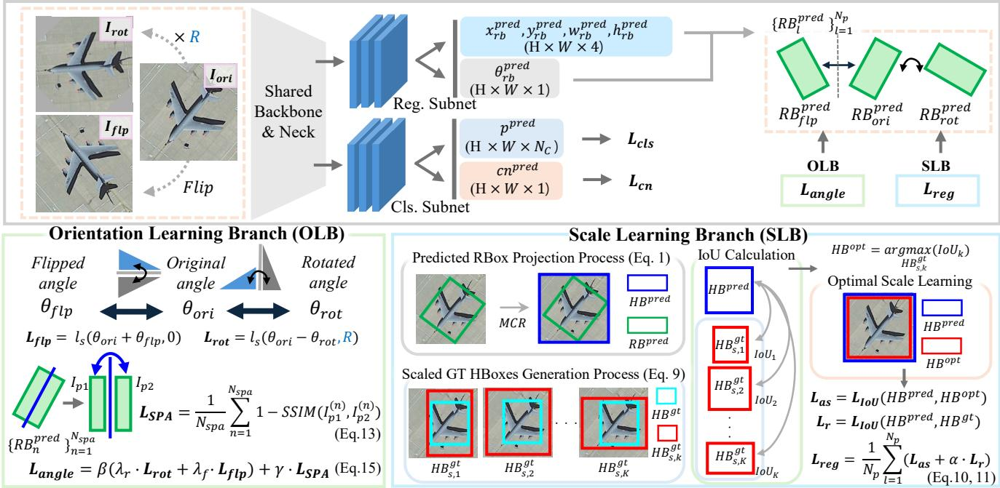  
Figure 2. Overall pipeline of our ABBSPO framework. Our ABBSPO leverages weakly supervised learning from HBox annotations to accurately predict RBoxes. The framework incorporates the Orientation Learning Branch (OLB) for precise angle estimation, using the Symmetric Prior Angle (SPA) loss, and the Scale Learning Branch (SLB) for optimal scale adjustment via the Adaptive Bounding Box Scaling (ABBS) module. The framework supports both C-HBox and T-HBox ground truths, ensuring robust and accurate predictions.

## 2.2. Weakly-supervised Orientd Object Detection

Weakly supervised OOD methods learn to predict RBoxes without directly utilizing GT RBoxes. The approaches in this domain are primarily categorized based on the types of labels they employ: image-based [23], point-based [17, 47], and HBox-based [42, 48].

Image-based supervision. WSODet [23], aims to generate pseudo-RBoxes without explicit localization supervision, thus encountering significant limitations when relying solely on image labels, especially for the scenes with numerous and diverse object types.

Point-based supervision. By leveraging one representative point at the center location as a label for each object, point label-based methods offer the advantage of being costeffective [1, 2, 11, 16, 19, 44]. PointOBB [17] estimates angles from geometric relationships across original, rotated, and flipped views, and determines scales by analyzing proposal distributions between original and scaled input images. PointOBB-v2 [18] improves single point supervision by refining pseudo-label generation, leading to enhanced efficiency and accuracy. Point2RBox [47] employed fundamental patterns as priors to guide the regression of RBoxes. Point-based methods are cost-effective and straightforward, but still struggle with limited supervision.

HBox-based supervision. As annotating HBoxes is more straightforward than RBoxes, the HBox-supervised OOD has gained increasing attention in recent studies. H2RBox [42] utilized rotated views from the original view and provided self-supervision of object orientations without requiring the GT angles. H2RBox-v2 [48] expanded the use of geometric relationships between views by adding flipped views. These methods learn to predict RBoxes by converting minimum circumscribed HBoxes that encompass the predicted RBoxes to directly compare IoU with the GT HBoxes, thereby enabling HBox-supervised OOD. However, these methods only guarantee performance when trained with GT C-HBoxes that are derived from GT RBoxes. These methods struggle to learn precise OOD when being trained with GT T-HBoxes, because of the significant gap between the GT T-HBoxes and the HBoxes derived from predicted RBoxes. To address the issue, we propose an ABBS module to effectively handle both types of GTs (C-HBoxes and T-HBoxes).

## 3. Method

## 3.1. Overall Pipeline

Weakly supervised OOD aims to predict RBoxes using less expensive annotations such as HBoxes. Existing methods such as H2RBox [42] and its improved version H2RBox-v2 [48] have laid the foundation for directly predicting RBoxes from HBoxes. Our proposed pipeline builds upon the H2RBox-v2 [48] framework to effectively enable weakly supervised OOD from either C-HBoxes or T-Boxes. Figure 2 depicts the conceptual framework of our weakly supervised OOD method. Given an input image $\mathrm { I } _ { o r i }$ and its rotated and flipped version $\mathrm { I } _ { r o t }$ and $\mathrm { I } _ { \mathit { f l p } }$ , our proposed pipeline obtains the RBox for each input view $( \mathrm { I } _ { o r i } , \ \mathrm { I } _ { r o t } , \ \mathrm { I } _ { \it f l p } ) .$ , including the center position $( x , y )$ , size $( w , h )$ , angle (θ), class scores (p), and the center-ness (cn). To classify each detected object, we follow FCOS [24] by supervising both the classification $( p )$ and the center-ness (\protect \texti {cn}). The angle (θ) prediction is obtained by using the method proposed in PSC [46]. Our contribution mainly lies in the supervision for localization, consisting of two branches: a scale learning branch (SLB) and an orientation learning branch (OLB).

In the SLB, the adaptive bounding box scaling (ABBS) module addresses the relationships between GT HBoxes and predicted RBoxes. This ABBS module provides proper minimum circumscribed rectangle for the accurately predicted RBoxes, by adaptively scaling the HBoxes based on a predefined scale range. The OLB guides accurate prediction of object orientation by utilizing three input views $( \mathrm { I } _ { o r i } , \mathrm { I } _ { r o t } , \mathrm { I } _ { \it f l p } )$ , following H2RBox-v2 [48]. Additionally, the OLB utilizes these orientation predictions for our symmetric prior angle (SPA) loss, which leverages the inherent leftright symmetry of objects in aerial images. The SPA loss enforces to further adjust the orientations of the predicted RBoxes to be aligned with the orientations of the symmetric objects such as airplanes, ships, ground track fields etc.

## 3.2. Adaptive Bounding Box Scaling Module

In Fig. 2, ‘Scale Learning Branch’ illustrates the conceptual process of our adaptive bounding box scaling module (ABBS) module. In HBox-supervised OOD learning, the predicted RBoxes $( R B ^ { \mathrm { p r e d } } )$ must be compared with the GT HBoxes $( H B ^ { \mathrm { g t } } )$ . Since they cannot be directly compared, $R B ^ { \mathrm { p r e d } }$ is first converted to $H B ^ { \mathrm { p r e d } }$ , defined as the minimum circumscribed HBox of $R B ^ { \mathrm { p r e d } }$ as:

$$
H B ^ { \mathrm { p r e d } } = M C R ( R B ^ { \mathrm { p r e d } } ) ,\tag{1}
$$

where \protect \textit {MCR}(\cdot ) is an operator converting \protect \textit {RB} to the minimum circumscribed \protect \textit {HB}, allowing $H B ^ { \mathrm { p r e d } }$ to be compared with $H B ^ { \mathrm { g t } }$ $H B ^ { \mathrm { p r e d } }$ and $R B ^ { \mathrm { p r e d } }$ are given by:

$$
\begin{array} { r l } & { R B ^ { \mathrm { p r e d } } = [ x _ { r b } ^ { \mathrm { p r e d } } , y _ { r b } ^ { \mathrm { p r e d } } , w _ { r b } ^ { \mathrm { p r e d } } , h _ { r b } ^ { \mathrm { p r e d } } , \theta _ { r b } ^ { \mathrm { p r e d } } ] , } \\ & { H B ^ { \mathrm { p r e d } } = [ x _ { h b } ^ { \mathrm { p r e d } } , y _ { h b } ^ { \mathrm { p r e d } } , w _ { h b } ^ { \mathrm { p r e d } } , h _ { h b } ^ { \mathrm { p r e d } } ] , } \end{array}\tag{2}
$$

where $( x _ { r b } ^ { \mathrm { p r e d } } , y _ { r b } ^ { \mathrm { p r e d } } )$ and $( x _ { h b } ^ { \mathrm { p r e d } } , y _ { h b } ^ { \mathrm { p r e d } } )$ are the centers of $R B ^ { \mathrm { p r e d } }$ and $H B ^ { \mathrm { p r e d } }$ , respectively. The width \protec \texit {w} and height \protec \tex it {h} of $H B ^ { \mathrm { p r e d } }$ can be computed as:

$$
\begin{array} { r l } & { w _ { h b } ^ { \mathrm { p r e d } } = w _ { r b } ^ { \mathrm { p r e d } } \vert \cos \theta _ { r b } ^ { \mathrm { p r e d } } \vert + h _ { r b } ^ { \mathrm { p r e d } } \vert \sin \theta _ { r b } ^ { \mathrm { p r e d } } \vert , } \\ & { h _ { h b } ^ { \mathrm { p r e d } } = w _ { r b } ^ { \mathrm { p r e d } } \vert \sin \theta _ { r b } ^ { \mathrm { p r e d } } \vert + h _ { r b } ^ { \mathrm { p r e d } } \vert \cos \theta _ { r b } ^ { \mathrm { p r e d } } \vert . } \end{array}\tag{3}
$$

If $R B ^ { \mathrm { { o p t } } }$ is defined as the tightly surrounding object boundary RBox with the precise orientation, then we have

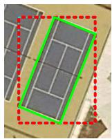  
(a)

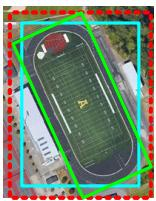  
(b)

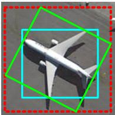

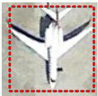  
(d)

(c)  
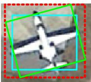  
(e)

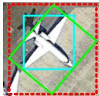  
(f)  
Figure 3. Analysis of scale adjustment function (\protec \texi {f}(\cdot ) ) based on the shape and angle of objects. (a) rectangular shape, (b) rounded rectangular shape, (c) complex shape, (d) horizontal orientation, (e) slightly tilted orientation, (f) diagonal orientation. The cyan solid box, green solid box and red dotted box represent GT T-HBox, RBox and adjusted GT HBox, respectively.

$H B ^ { \mathrm { o p t } } = M C R ( R B ^ { \mathrm { o p t } } )$ for the ‘Predicted RBox Projection Process’ block in the SLB of Fig. 2. When the size of $H B ^ { \mathrm { g t } }$ is larger or smaller than that of $H B ^ { \mathrm { { o p t } } }$ , the model needs to adaptively adjust and find the optimal scale within a predefined range of scale variations. We propose an ABBS module that estimates $R B ^ { \mathrm { o p t } }$ by adaptively adjusting the scale of $H B ^ { \mathrm { g t } }$ . Notably, even if $R B ^ { \mathrm { p r e d } }$ is accurately estimated, its $H B ^ { \mathrm { p r e d } }$ may not overlap well with $H B ^ { \mathrm { g t } }$ , leading to a low Intersection over Union (IoU) value. Enforcing $H B ^ { \mathrm { p r e d } }$ to match $H B ^ { \mathrm { g t } }$ can cause a misalignment with $R B ^ { \mathrm { p r e d } }$ because $H B ^ { \mathrm { g t } }$ may not be ideal in estimating $R B ^ { \mathrm { o p t } }$ . To address this, our ABBS module adaptively scales and adjusts $H B ^ { \mathrm { g t } }$ in the context of $R B ^ { \mathrm { p r e d } }$ , rather than forcing $H B ^ { \mathrm { p r e d } }$ to match $H B ^ { \mathrm { g t } }$

For the detailed explanation of our ABBS module, we first define a set of scaled versions of $H B ^ { \mathrm { g t } }$ for the ‘Scaled GT HBoxes Generation Process’ in the SLB of Fig. 2 as:

$$
\mathbf { H } \mathbf { B } _ { \mathrm { s } } ^ { \mathrm { g t } } = \{ H B _ { \mathrm { s , l } } ^ { \mathrm { g t } } , H B _ { \mathrm { s } , 2 } ^ { \mathrm { g t } } , \cdot \cdot \cdot , H B _ { \mathrm { s , K } } ^ { \mathrm { g t } } \} ,\tag{4}
$$

where $H B _ { \mathrm { s } , k } ^ { \mathrm { g t } }$ is the k-th scaled version of $H B ^ { \mathrm { g t } }$ and K is the total number of scaled variations of $H B ^ { \mathrm { g t } }$ $\mathbf { H } \mathbf { B } _ { \mathrm { S } } ^ { \mathrm { g t } }$ is determined as the combinations of angle-adjusted width and height scale factors, $\{ s _ { a d j , i } ^ { w } \} _ { i = 1 } ^ { N _ { s } }$ and $\{ \bar { s } _ { a d j , j } ^ { h } \} _ { j = 1 } ^ { \bar { N } _ { s } }$ , that are transformed from basic width and height scale factors, $\{ s _ { i } ^ { w } \} _ { i = 1 } ^ { N _ { s } }$ and $\{ s _ { j } ^ { h } \} _ { j = 1 } ^ { N _ { s } }$ by considering angle prediction. Basic scale factors are uniformly spaced in a predefined scale range as:

$$
S _ { w } = \{ s _ { 1 } ^ { w } , s _ { 2 } ^ { w } , \cdot \cdot \cdot , s _ { N _ { s } } ^ { w } \} , S _ { h } = \{ s _ { 1 } ^ { h } , s _ { 2 } ^ { h } , \cdot \cdot \cdot , s _ { N _ { s } } ^ { h } \} ,\tag{5}
$$

where $S _ { w }$ and $S _ { h }$ are the sets of basic width and height scale factors, respectively. $s _ { i } ^ { \phantom { \dagger } w }$ and $s _ { i } ^ { h }$ are calculated as:

$$
\begin{array} { r l } & { s _ { i } ^ { w } = s _ { 1 } ^ { w } + ( s _ { N _ { s } } ^ { w } - s _ { 1 } ^ { w } ) / ( N _ { s } - 1 ) \cdot ( i - 1 ) , } \\ & { s _ { j } ^ { h } = s _ { 1 } ^ { h } + ( s _ { N _ { s } } ^ { h } - s _ { 1 } ^ { h } ) / ( N _ { s } - 1 ) \cdot ( j - 1 ) , } \end{array}\tag{6}
$$

where $s _ { N _ { s } } ^ { w } = s _ { N _ { s } } ^ { h }$ is the predefined largest basic scale factor for both width and height of $H B ^ { \mathrm { g t } }$ , and $N _ { s }$ is the number of uniform quantization for the both range $[ s _ { 1 } ^ { w } . . s _ { N _ { s } } ^ { w } ]$ and $[ s _ { 1 } ^ { h } . . s _ { N _ { s } } ^ { h } ]$ . In order to generate $H B _ { s , i } ^ { \mathrm { g t } }$ , we transform the basic width and height scale factors, $\{ s _ { i } ^ { w } \} _ { i = 1 } ^ { N _ { s } }$ and $\{ s _ { j } ^ { h } \} _ { j = 1 } ^ { N _ { s } }$ , into angle-adjusted width and height scale factors, $\{ s _ { a d j , i } ^ { w } \} _ { i = 1 } ^ { N _ { s } }$ and $\{ s _ { a d j , j } ^ { h } \} _ { j = 1 } ^ { N _ { s } }$ , using the predicted angle $\theta ^ { \mathrm { p r e d } }$ through the scale adjustment function $f \colon$

$$
\begin{array} { r } { s _ { a d j , i } ^ { w } \ = f ( \theta _ { r b } ^ { \mathrm { p r e d } } , s _ { i } ^ { w } ) , \ s _ { a d j , j } ^ { h } \ = f ( \theta _ { r b } ^ { \mathrm { p r e d } } , s _ { j } ^ { h } ) . } \end{array}\tag{7}
$$

To define $f ( \cdot )$ , it’s essential to consider the object types and rotation angles. Fig. 3 shows the effect of scale adjustments on T-HBoxes for three object types: (i) For rectangular objects like tennis courts (Fig. 3-(a)), the adjusted T-HBox (red dotted box) aligns precisely with the $\mathrm { G T ~ T _ { \mathrm { ~ } } }$ HBox (cyan solid box) and tightly circumscribes the optimal RBox (green solid box); (ii) For rounded rectangular objects (Fig. 3-(b)), the optimal RBox slightly exceeds the GT T-HBox; (iii) Complex shapes like airplanes (Fig. 3-(c)) show a larger discrepancy, with parts of the optimal RBox lying outside the GT T-HBox. Furthermore, scale adjustments also depend on rotation angles: (i) Fig. 3-(d) for a vertically (or horizontally) aligned airplane, the GT T-HBox and optimal RBox are identical; (ii) For Fig. 3-(e) with a small rotation angle, they differ slightly; (iii) For Fig. 3- (f) with a larger angle, the difference is more pronounced. Therefore, to take the object’s shape types and orientation degrees into account for the scale adjustment for the widths and heights of T-HBoxes, $f ( \cdot )$ in Eq. 7 is defined as:

$$
\begin{array}{c} \begin{array} { r } { f ( \theta , s ) = \left\{ \frac { 4 } { \pi } ( s - 1 ) \cdot \theta + 1 , \quad \quad \mathrm { i f ~ } 0 \leq \theta < \frac { \pi } { 4 } , \right. } \\ { \left. \frac { 4 } { \pi } ( 1 - s ) \cdot \theta + ( 2 s - 1 ) , \quad \mathrm { i f ~ } \frac { \pi } { 4 } \leq \theta < \frac { \pi } { 2 } , \right.} \end{array}   \end{array}\tag{8}
$$

where the angle range is set to $\theta \in [ 0 , \pi / 2 )$ due to the periodicity of the angle. According to $f ( \cdot )$ and Eq. 7, $H B _ { s , k } ^ { \mathrm { g t } }$ in $\mathbf { H } \mathbf { B } _ { s } ^ { \mathrm { g t } }$ can be expressed as:

$$
H B _ { s , k } ^ { \mathrm { g t } } = [ x ^ { \mathrm { g t } } , y ^ { \mathrm { g t } } , w ^ { \mathrm { g t } } \cdot s _ { a d j , i } ^ { w } , h ^ { \mathrm { g t } } \cdot s _ { a d j , j } ^ { h } ] ,\tag{9}
$$

where $( x ^ { \mathrm { g t } } , y ^ { \mathrm { g t } } )$ is the center point, and $w ^ { \mathrm { g t } }$ and $h ^ { \mathrm { g t } }$ are width and height of $H B ^ { \mathrm { g t } }$ . As shown in the ‘IoU Calculation’ and ‘Optimal Scale Learning’ blocks in the SLB of Fig. 2, $H B ^ { \mathrm { { o p t } } }$ among $\{ H B _ { s , k } ^ { \mathrm { g t } } \} _ { k = 1 } ^ { K }$ can be determined which minimizes the IoU loss for all proposals by an ABBS loss as:

$$
\mathcal { L } _ { \mathrm { a s } } = \frac { 1 } { N _ { p } } \sum _ { l = 1 } ^ { N _ { p } } \operatorname* { m i n } _ { s _ { i } ^ { u } \in S _ { w } } \mathcal { L } _ { \mathrm { I o U } } \Big ( H B _ { l } ^ { \mathrm { p r e d } } , H B _ { s , k } ^ { \mathrm { g t } , l } ( s _ { i } ^ { w } , s _ { j } ^ { h } ) \Big ) ,\tag{10}
$$

where $N _ { p }$ is the total number of proposals for input I. $H B _ { l } ^ { \mathrm { p r e d } }$ is $H B ^ { \mathrm { p r e d } }$ for \protec \xti {l}-th proposal, and $H B _ { s , k } ^ { \mathrm { g t } , l } ( s _ { i } ^ { w } , s _ { j } ^ { h } )$ is \protec \tex it {k}-th scaled $H B ^ { \mathrm { g t } }$ , as $H B _ { s , k } ^ { \mathrm { g t } }$ , whose width and height are scaled for \protec \xti {l}-th proposal according to Eq. 7 to Eq. 9. Finally, by adding a regularization term using the IoU loss between ${ \dot { H } } B ^ { \mathrm { p r e d } }$ and non-scaled $H B ^ { \mathrm { g t } }$ , we formed the regression loss as:

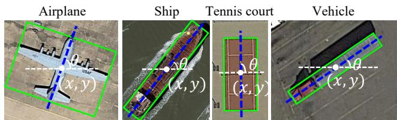  
Figure 4. Examples of symmetric objects in aerial images. In SPA loss, the $x , y$ coordinates and angle θ are used to define the symmetry axis, splitting the object into two parts for comparison.

$$
\begin{array} { r } { \mathcal { L } _ { \mathrm { r e g } } = \mathcal { L } _ { \mathrm { a s } } + \alpha \cdot ( 1 / N _ { p } ) \sum _ { l = 1 } ^ { N _ { p } } \mathcal { L } _ { \mathrm { I o U } } \Big ( H B _ { l } ^ { \mathrm { p r e d } } , H B ^ { \mathrm { g t } , l } \Big ) , } \end{array}\tag{11}
$$

where \alpha is a hyperparameter which is set to 0.01 by default.

## 3.3. Symmetric Prior Angle Loss

In aerial images, objects such as airplanes, ships, tennis courts, and vehicles are often captured from top-down viewpoints, where most of these objects exhibit symmetries in their appearance, as shown in Fig. 4.

In the previous pipelines [42, 48], both the regression loss associated with the bounding box’s center point, width, and height, and the angle loss for accurate angle prediction were trained in a balanced manner. However, they tended to inaccurately predict the angles by maximizing the bounding box’s IoUs at the same time. This issue stems from the fact that, since the angles could not be directly supervised due to the absence of angle annotations, the angles were indirectly supervised from augmented views with rotations and flips. This is problematic because, when the difference between two predicted angles for the same object in the original view and its rotated view are equal to the rotation angle applied for the original view, the angle loss is zero although the predicted angles are inaccurate.

To mitigate such a predicted angle ambiguity, we propose a symmetric prior angle (SPA) loss. Based on the SPA loss, the model can be trained to predict precise angles by indirectly utilizing the object’s symmetric characteristics. As shown in Fig. 4, the detected objects are symmetric against the symmetry axes (blue-dotted lines) passing the center points of their RBoxes. That is, the pixel contents in the two parts divided by the symmetry axis of the RBox are compared in similarity whose difference is used as supervision for our SPA loss. It is noted that our SPA loss utilizes only symmetric objects, incorporating the symmetry prior from GT class labels for proposals identified as symmetric, such as ‘airplane,’ ‘ship,’ ‘vehicle,’ and ‘tennis court

To avoid applying the SPA loss when $R B ^ { p r e d }$ are inaccurate for the respective objects, we first check the fidelity scores of proposal, and sample the Top-k proposals as supervision in the SPA loss as:

$$
\{ R B _ { n } ^ { p r e d } \} _ { n = 1 } ^ { N _ { \mathrm { s p a } } } = \mathrm { T o p } { - } k \left( \{ R B _ { l } ^ { p r e d } \} _ { l = 1 } ^ { N _ { p } } \mid \mathrm { s c } _ { \mathrm { c l s } } ^ { i } + \mathrm { s c } _ { \mathrm { l o c } } ^ { i } \right)\tag{12}
$$

where $\sec _ { \mathrm { c l s } } ^ { ( i ) }$ and $\mathrm { s c } _ { \mathrm { l o c } } ^ { ( i ) }$ are the classification and localization scores for the \protec \ xti {l}-th $R B ^ { p r e d }$ , and $N _ { p }$ is the total number of proposals. From Eq. 12, the selected $N _ { s p a }$ proposals are considered in the SPA loss by which the predicted angles of $R B ^ { p r e d } ( \theta _ { r b } ^ { p r e d } )$ are enforced to align with the orientations of objects in the sense of maximizing the similarity, Structural Similarity Index (SSIM [28]), between the pixel contents in the two parts of each $R B ^ { p r e d }$ . It should be noted that, even in cases where symmetric objects may not appear perfectly symmetric due to contextual factors like shadows or asymmetrical cargo arrangements, their symmetry is still maintained by the inherent structural symmetry between the two parts. Our SPA loss is defined as:

$$
\begin{array} { r } { \mathcal { L } _ { \mathrm { S P A } } = ( 1 / N _ { \mathrm { s p a } } ) \sum _ { n = 1 } ^ { N _ { \mathrm { s p a } } } \left( 1 - \mathrm { S S I M } ( I _ { p 1 } ^ { ( n ) } , I _ { p 2 } ^ { ( n ) } ) \right) } \end{array}\tag{13}
$$

To remove the influence of object sizes in $L _ { \mathrm { S P A } }$ computation, the proposals $( R B ^ { p r e d } )$ are projected onto a fixed-size grid of $5 0 \times 5 0$ . Then, the pixel content $( I _ { p 1 } )$ in one part of the proposal’s projection is compared with that $( I _ { p 2 } )$ of the other part that is flipped before the comparison.

## 3.4. Loss Functions

In the orientation learning branch (OLB), two angle-based losses [48], ${ \mathcal L } _ { \mathrm { r o t } }$ and ${ \mathcal { L } } _ { \mathrm { f l p } } .$ , are adopted to leverage the consistency between the original, rotated, and flipped views of each object proposal. For the rotated and flipped views, ${ \mathcal L } _ { \mathrm { r o t } }$ and ${ \mathcal { L } } _ { \mathrm { f l p } }$ are computed by comparing with the predicted angle \theta in the original view $( \operatorname { I } _ { o r i } ) { : }$

$$
\mathcal { L } _ { \mathrm { r o t } } = l _ { s } ( \theta _ { \mathrm { r o t } } - \theta , R ) , \mathcal { L } _ { \mathrm { f l p } } = l _ { s } ( \theta _ { \mathrm { f l p } } + \theta , 0 ) ,\tag{14}
$$

where $l _ { s }$ denotes a smooth L1 loss-based snap loss [48], and R denotes the angle applied to $\mathrm { I } _ { o r i }$ . The final angle loss is:

$$
\mathcal { L } _ { \mathrm { a n g } } = \beta ( \lambda _ { r } \mathcal { L } _ { \mathrm { r o t } } + \lambda _ { f } \mathcal { L } _ { \mathrm { f l p } } ) + \gamma \mathcal { L } _ { \mathrm { S P A } } ,\tag{15}
$$

where $\lambda _ { r } = 1 . 0 , \lambda _ { f } = 0 . 0 5 , \beta = 0 . 6 ,$ and $\gamma = 0 . 0 5$ are empirically determined for all our experiments. In the shape learning branch (SLB), we use our IoU-based [45] regression loss $\mathcal { L } _ { \mathrm { r e g } }$ in Eq. 11. The overall loss is defined as:

$$
\mathcal { L } _ { \mathrm { t o t a l } } = \lambda _ { \mathrm { a n g } } \mathcal { L } _ { \mathrm { a n g } } + \lambda _ { \mathrm { r e g } } \mathcal { L } _ { \mathrm { r e g } } + \lambda _ { \mathrm { c n } } \mathcal { L } _ { \mathrm { c n } } + \lambda _ { \mathrm { c l s } } \mathcal { L } _ { \mathrm { c l s } }\tag{16}
$$

where ${ \mathcal { L } } _ { \mathrm { c n } }$ is the center-ness loss [24] , and $\mathcal { L } _ { \mathrm { c l s } }$ is the classification loss based on the focal loss [20]. The weighting factors, $\lambda _ { \mathrm { a n g } } , \lambda _ { \mathrm { r e g } } , \lambda _ { \mathrm { c n } } ,$ , and $\lambda _ { \mathrm { c l s } }$ are all set to 1.

## 4. Experiments

## 4.1. Datasets

We trained and tested all the methods across four different datasets: DIOR [5, 13], DOTA-v1.0 [29], SIMD [9] and NWPU VHR-10 [4], which are summarized in Table 1. The details for the datasets and results for SIMD and NWPU are described in Suppl.

<table><tr><td>Datasets</td><td># of Images</td><td>Image Widths</td><td># of Objects</td><td># of Classes</td><td>Annotation Types</td></tr><tr><td>DIOR [13]</td><td>22,463</td><td>800</td><td>190,288</td><td>20</td><td>T-HBox</td></tr><tr><td>DIOR-R [5]</td><td>22,463</td><td>800</td><td>190,288</td><td>20</td><td>RBox</td></tr><tr><td>DOTA-v1.0 [29]</td><td>2,806</td><td>800~ 4K</td><td>188,282</td><td>15</td><td>C-HBox, RBox</td></tr><tr><td>SIMD [9]</td><td>5,000</td><td>1024</td><td>45,096</td><td>15</td><td>T-HBox</td></tr><tr><td>NWPU VHR-10 [4]</td><td>800</td><td>~1000</td><td>3,775</td><td>10</td><td>T-HBoX</td></tr></table>

Table 1. Characteristics of datasets used for experiments

## 4.2. Implementation Details

Our proposed ABBSPO pipeline adopts the FCOS [24] detector as the baseline architecture, utilizing a ResNet-50 [10] backbone and an FPN [15] neck, based on the H2RBox-v2 [48] framework. To ensure fairness, all models are configured with the ResNet-50 [10] backbone and trained for 12 epochs on NVIDIA RTX3090 GPUs.

## 4.3. Experimental Results

## 4.3.1 Quantitative Comparison

It should be noted that objects such as round-shaped pools have orientation ambiguities regardless of their annotations (RBoxes) [42]. In order to avoid confusion in orientation learning, annotations are modified as having horizontal orientations if the objects belong to the following categories: (i) DIOR-R: ‘baseball field’, ‘chimney’, ‘golf field’, ‘stadium’, ‘storage tank’, ‘windmill’; and (ii) DOTA-v1.0: ‘baseball diamond’, ‘stadium’, ‘roundabout’. Accordingly, their orientation learning is enforced to predict the horizontal orientations, similar to previous works [42, 48].

Results on DIOR-R. Table 2 shows the OOD results. In addition to $\mathrm { A P } _ { 5 0 }$ metric, we use $3 \mathrm { - } \mathrm { A P } _ { 5 0 }$ that focuses on the detection performance of the three complex-shaped object categories: ‘airplane’ (APL), ‘expressway service area’ (ESA), and ‘overpass’ (OP). As shown, our ABBSPO outperforms all weakly supervised OOD methods. Especially, in terms of $3 \mathrm { - } \mathrm { A P } _ { 5 0 } ,$ , our ABBSPO is superior to the HBox-supervised SOTA methods, H2RBox and H2RBox-v2, with large margins of average 12.9%-point and average 9.1%-point improvements. In overall $\mathsf { A P } _ { 5 0 }$ performance, our ABBSPO surpasses H2RBox by 5.13%-point and the H2RBox-v2 by 3.03%-point. It is noted that our ABBSPO not only surpasses our base detector (H2RBox-v2 [48]) but also performs comparably to other RBox-supervised OOD methods, such as FCOS [24] and Oriented R-CNN [32]. It is worth noting that, compared to the RBox-supervised OOD methods, our ABBSPO shows even superior performance with large margins from 6.5%-point to 11.7%-point, especially on the ‘airplane’ that has the most complex shape. Notably, the ABBS module is less effective for rectangular objects, such as ‘tennis court’ (TC) and ‘vehicle’ (VE), as scaling is often unnecessary. However, it proves highly beneficial for complex-shaped objects, such as the ESA. The SPA loss is applied only to symmetric categories and helps even surpasses the FCOS Baseline by 0.66%-point lift.

<table><tr><td></td><td>Methods</td><td>APL</td><td>APO</td><td>BF</td><td>BC</td><td>BR</td><td>CH</td><td>ESA</td><td>ETS</td><td>DAM</td><td>GF</td><td>GTF</td><td>HA</td><td>OP</td><td>SH</td><td>STA</td><td>STO</td><td>TC</td><td>TS</td><td>VE</td><td>WM</td><td> $\underline { { 3 \mathbf { - } \mathbf { A } \mathbf { P } _ { 5 0 } } }$ </td><td> $\mathbf { A P } _ { 5 0 }$ </td></tr><tr><td rowspan="7">Se</td><td>RetinaNet [20]</td><td>59.8</td><td>19.3</td><td>69.7</td><td>81.3</td><td>17.2</td><td>72.7</td><td>68.7</td><td>49.4</td><td>18.4</td><td>69.5</td><td>71.3</td><td>33.3</td><td>34.1</td><td>75.8</td><td>67.1</td><td></td><td>59.6</td><td>81.0</td><td>44.1</td><td>38.0 62.5</td><td></td><td>54.20 54.64</td></tr><tr><td>FCOS [24]</td><td>62.1</td><td>37.9</td><td>74.6</td><td>81.2</td><td>32.9</td><td>72.1</td><td>75.3</td><td>61.8</td><td>27.4</td><td>69.1</td><td>78.7</td><td>34.4</td><td>50.6</td><td>80.1</td><td>68.6</td><td>68.1</td><td>81.3</td><td>49.1</td><td>43.4</td><td>64.5</td><td>62.67</td><td>60.66</td></tr><tr><td>Oriented R-CNN [32]</td><td>63.0</td><td>36.7</td><td>71.9</td><td>81.6</td><td>41.1</td><td>72.6</td><td>77.8</td><td>65.5</td><td>24.8</td><td>72.9</td><td>82.1</td><td>40.9</td><td>56.5</td><td>81.2</td><td>73.4</td><td>62.4</td><td></td><td>81.5</td><td>53.3 43.3</td><td>65.6</td><td>65.77</td><td>62.41</td></tr><tr><td>GWD [38] (RetinaNet)</td><td>61.5</td><td>23.6</td><td>73.6</td><td>81.1</td><td>17.4</td><td>72.7</td><td>68.3</td><td>47.2</td><td>20.7</td><td>71.2</td><td>73.2</td><td>33.9</td><td>34.3</td><td>77.6</td><td>64.7</td><td>57.5</td><td></td><td>80.9</td><td>42.1 39.7</td><td>60.2</td><td>54.70</td><td>55.07</td></tr><tr><td>KLD [39] (RetinaNet)</td><td>57.8</td><td>22.6</td><td>71.5</td><td>81.2</td><td>16.9</td><td>72.7</td><td>68.9</td><td>52.1</td><td>20.6</td><td>73.5</td><td>71.0</td><td>33.7</td><td>33.2</td><td>77.1</td><td>68.9</td><td>59.9</td><td>80.9</td><td>43.9</td><td>39.1</td><td>60.9</td><td>53.30</td><td>55.32</td></tr><tr><td>KFIoU [41] (RetinaNet)</td><td>60.6</td><td>36.6</td><td>73.6</td><td>80.9</td><td>27.0</td><td>72.6</td><td>73.4</td><td>56.5</td><td>25.4</td><td>73.9</td><td>72.0</td><td>32.9</td><td>45.8</td><td>75.8</td><td>65.2</td><td>57.6</td><td>80.0</td><td>48.0</td><td>40.1</td><td>58.8</td><td>59.93</td><td>57.84</td></tr><tr><td>S WSODet† [23]</td><td>20.7</td><td>29.0</td><td>63.2</td><td>67.3</td><td>0.2</td><td>65.5</td><td>0.4</td><td>0.1</td><td>0.3</td><td>49.0</td><td>28.9</td><td>0.3</td><td>1.5</td><td>1.2</td><td>53.4</td><td>16.4</td><td></td><td>40.0 0.1</td><td>6.1</td><td>0.1</td><td>7.53</td><td>22.20</td></tr><tr><td rowspan="3">Sp</td><td>PointOBB† [17]</td><td>58.2</td><td>15.3</td><td>70.5</td><td>78.6</td><td>0.1</td><td>72.2</td><td>69.6</td><td>1.8</td><td>3.7</td><td>0.3</td><td>77.3</td><td>16.7</td><td>40.4</td><td>79.2</td><td>39.6</td><td>32.4</td><td>29.6</td><td>16.8</td><td>33.6</td><td>27.7</td><td>56.07</td><td>38.08</td></tr><tr><td>Point2RBox-SK [47]</td><td>41.9</td><td>9.1</td><td>62.9</td><td>52.8</td><td>10.8</td><td>72.2</td><td>3.0</td><td>43.9</td><td>5.5</td><td>9.7</td><td>25.1</td><td>9.1</td><td>21.0</td><td>24.0</td><td>20.4</td><td>25.1</td><td>71.7</td><td>4.5</td><td>16.1</td><td>16.3</td><td>21.97</td><td>27.26</td></tr><tr><td>H2RBox [42]</td><td>57.1</td><td>14.4</td><td>72.2</td><td>82.6</td><td>17.5</td><td></td><td></td><td></td><td>14</td><td></td><td>77.9</td><td></td><td></td><td></td><td></td><td></td><td></td><td></td><td></td><td></td><td>51.43</td><td>54.57</td></tr><tr><td rowspan="2">Si</td><td>H2RBox-v2 [48]</td><td>55.5</td><td>17.8</td><td>76.9</td><td>80.5</td><td>27.7</td><td>71.2 72.2</td><td>56.5 63.0</td><td>55.2 58.6</td><td>24.4</td><td>67.7 73.9</td><td>80.3</td><td>31 33.9</td><td>40.7 47.2</td><td>76.3 77.4</td><td>66.2 58.7</td><td>63.4 60.9</td><td>81.5 81.4</td><td>50.4 48.1</td><td>38 41.1</td><td>57.6 53.9</td><td>55.23</td><td>56.67</td></tr><tr><td>ABBSPO (Ours)</td><td>69.5</td><td>15.7</td><td>76.2</td><td>87.5</td><td>29.9</td><td>72.3</td><td>75.3</td><td>61.2</td><td>28.1</td><td>74.1</td><td>81.7</td><td>34.7</td><td>48.2</td><td>79.3</td><td>67.4</td><td>61.4</td><td>81.5</td><td>54.7</td><td>41.5</td><td>53.8</td><td>64.33</td><td>59.70</td></tr></table>

Table 2. Quantitative results of each category on the DIOR-R [5] test dataset for RBox-supervised $( S _ { R } ) _ { \ l }$ , Image-supervised $( S _ { I } ) .$ , Pointsupervised $( S _ { P } )$ and HBox-supervised $( S _ { H } )$ methods. The $\underline { { 3 \mathrm { - } \mathrm { A P } _ { 5 0 } } }$ represents the mean $\mathrm { A P _ { 5 0 } }$ scores for three complex-shaped objec categories: ‘airplane’ (APL), ‘expressway service area’ (ESA), and ‘overpass’ (OP). The notation † indicates its results in the paper [17].

<table><tr><td>Methods</td><td></td><td>PL</td><td>BD</td><td>BR</td><td>GTF</td><td>SV</td><td>LV</td><td>SH</td><td>TC</td><td>BC</td><td>ST</td><td>SBF</td><td>RA</td><td>HA</td><td>SP</td><td>HC</td><td> $\underline { { 3 \mathbf { - A P } _ { 5 0 } } }$ </td><td> $\mathbf { A P } _ { 5 0 }$ </td></tr><tr><td rowspan="7">SR</td><td>RetinaNet [20]</td><td>87.5</td><td>75.1</td><td>39.9</td><td>59.6</td><td>66.3</td><td>66.3</td><td>78.2</td><td>90.5</td><td>55.0</td><td>62.7</td><td>47.1</td><td>63.6</td><td>59.4</td><td>55.1</td><td>43.0</td><td>61.87</td><td>63.3</td></tr><tr><td>FCOS [24]</td><td>88.8</td><td>74.0</td><td>46.8</td><td>59.1</td><td>70.1</td><td>81.4</td><td>87.7</td><td>90.7</td><td>67.7</td><td>68.3</td><td>60.2</td><td>66.1</td><td>64.9</td><td>58.7</td><td>44.0</td><td>63.83</td><td>68.6</td></tr><tr><td>Oriented R-CNN [32]</td><td>89.3</td><td>76.1</td><td>53.8</td><td>78.7</td><td>68.6</td><td>84.9</td><td>89.3</td><td>90.8</td><td>74.3</td><td>62.8</td><td>66.3</td><td>66.5</td><td>74.7</td><td>58.6</td><td>46.8</td><td>64.90</td><td>72.1</td></tr><tr><td>Oriented RepPoints[14]</td><td>89.7</td><td>80.1</td><td>50.5</td><td>74.4</td><td>75.0</td><td>82.0</td><td>88.7</td><td>90.4</td><td>64.0</td><td>70.0</td><td>45.7</td><td>60.6</td><td>73.6</td><td>60.4</td><td>42.8</td><td>64.30</td><td>69.86</td></tr><tr><td>GWD [38] (RetinaNet)</td><td>88.2</td><td>74.9</td><td>41.3</td><td>60.5</td><td>66.7</td><td>68.1</td><td>85.8</td><td>90.5</td><td>50.4</td><td>66.8</td><td>45.8</td><td>65.1</td><td>60.7</td><td>52.9</td><td>38.9</td><td>60.0</td><td>63.77</td></tr><tr><td>KLD [39] (RetinaNet)</td><td>88.4 84.4</td><td>75.8 74.3</td><td>41.4 40.7</td><td>60.0 55.2</td><td>66.1</td><td>68.8 56.9</td><td>84.7 76.4</td><td>90.6</td><td>56.8</td><td>60.4 64.8</td><td>50.4</td><td>70.1</td><td>60.0</td><td>50.5 48.7</td><td>45.7 42.9</td><td>61.53</td><td>64.65 59.81</td></tr><tr><td>KFIoU [41] (RetinaNet)</td><td></td><td></td><td></td><td></td><td>57.9</td><td></td><td></td><td>71.2</td><td>46.1</td><td></td><td>54.3</td><td>65.0</td><td>58.3</td><td></td><td></td><td>58.67</td><td></td></tr><tr><td rowspan="3"> $\frac { a } { 5 }$ </td><td>PointOBB [17]+FCOS</td><td>32.4</td><td>67.3</td><td>0.8</td><td>53.6</td><td>2.3</td><td>9.7</td><td>18.8</td><td>0.3</td><td>9.9</td><td>12.8</td><td>0.5</td><td>54.0</td><td>11.0</td><td>34.1</td><td>11.4</td><td>25.97</td><td>21.26</td></tr><tr><td>Point2RBox-SK [47]</td><td>50.1</td><td>63.7</td><td>1.6</td><td>44.7</td><td>23.9</td><td>34.7</td><td>32.7</td><td>78.8</td><td>41.2</td><td>32.2</td><td>2.1</td><td>34.3</td><td>20.8</td><td>42.5</td><td>7.2</td><td>33.27</td><td>34.03</td></tr><tr><td>H2RBox [42]</td><td>89.5</td><td>73.1</td><td>37.3</td><td>55.1</td><td>70.7</td><td>76.4</td><td>85.4</td><td>90.3</td><td>66.5</td><td>67.3</td><td>59.6</td><td>64.9</td><td>60.6</td><td>57.9</td><td>36.5</td><td>61.30</td><td>66.07</td></tr><tr><td rowspan="3">HS</td><td>H2RBox-v2 [48]</td><td>89.4</td><td>74.8</td><td>45.4</td><td>56.0</td><td>70.3</td><td>76.6</td><td>87.9</td><td>90.5</td><td>69.3</td><td>67.5</td><td>56.7</td><td>64.7</td><td>65.3</td><td>55.5</td><td>45.5</td><td>63.47</td><td>67.69</td></tr><tr><td>ABBSPO (Ours)</td><td>89.2</td><td>75.6</td><td>47.4</td><td>52.8</td><td>70.3</td><td>77.6</td><td>88.2</td><td>90.5</td><td>67.9</td><td>66.8</td><td>68.2</td><td>66.2</td><td>71.6</td><td>55.6</td><td>51.0</td><td>65.27</td><td>69.26</td></tr><tr><td></td><td></td><td></td><td></td><td></td><td></td><td></td><td></td><td></td><td></td><td></td><td></td><td></td><td></td><td></td><td></td><td></td><td></td></tr></table>

Table 3. Quantitative results of each category on the DOTA-v1.0 [29] validation dataset for $S _ { R } , S _ { I } , S _ { P }$ and $\scriptstyle { S _ { H } }$ methods. The $\underline { { 3 \mathrm { - A P } _ { 5 0 } } }$ represents the mean $\mathrm { \sf A P 5 0 }$ scores for three complex-shaped object categories: plane (PL), swimming pool (SP), and helicopter (HC). Al the methods are re-trained using only train dataset for fair comparison.

improve their performance, except for the categories with orientation ambiguities, such as ‘storage tank’ (STO). Since the predicted angles learned through the SPA loss are also utilized in the ABBS module for scale adjustment, both the SPA loss and the ABBS module jointly contribute to performance improvement in symmetric categories. This joint effect is particularly evident in complex-shaped symmetric categories, such as APL and ESA, where performance gains are more significant. Nevertheless, the performance gains for the two symmetric and rectangular categories, TC and VE, are marginal. This is mainly because the ABBS module has limited impact on rectangular shapes, and the small object sizes lead to an insufficient number of pixels for reliably determining the symmetry axis via the SPA loss.

Results on DOTA-v1.0. Table 3 shows the detection performance results on the DOTA-v1.0 [29]. Due to the nonresponsiveness of the DOTA evaluation server, we report our experimental results on the validation dataset (458 images) instead of the test dataset (937 images). It should be noted that the validation dataset was not used for training all the methods for fair comparison. We use $3 \mathrm { - A P } _ { 5 0 }$ that measures the detection performance for the three complexshaped object categories: ‘plane’, ‘swimming pool’ and ‘helicopter’. Our ABBSPO achieves SOTA performance, outperforming H2RBox by 3.19%-point and H2RBox-v2 by 1.57%-point improvements. Moreover, our ABBSPO

## 4.3.2 Qualitative Comparison

Results on DIOR. As shown in the figures of the first row in Fig. 5, our ABBSPO is the only method that accurately captures both the orientation and scale of the airplane. Since DIOR annotations provide GT in T-HBox format, direct usage of T-HBoxes as GT for training to predict RBox leads to degradations in orientation and scale prediction accuracy for the existing HBox-supervised OOD methods as shown in the figures of columns 2 and 3 in Fig. 5. In contrast, our ABBSPO avoids such degradation by utilizing the ABBS module that optimally scales the GT HBox sizes for precise RBox prediction during training. It is also worthwhile to mention that the predicted orientations by our ABBSPO are more precisely obtained via our SPA loss. Furthermore, it should be noted that compared to the RBox-supervised baseline method (Rotated FCOS [24]), our approach demonstrates superior visual results, even under weakly supervised learning.

Results on DOTA-v1.0. As shown in the figures of the second row in Fig. 5, ABBSPO very accurately predicts both the orientation and scale of the swimming pool, achieving similar accuracy for tennis court. Interestingly, only ABB-SPO successfully detects the two tennis courts that are partially occluded by trees (red solid circle) while the other methods failed. These results visually support the effectiveness of our ABBS module and SPA loss in learning the scales and orientations of objects accurately.

<table><tr><td colspan="2">Module</td><td colspan="2">DIOR-R</td><td>DOTA-v1.0</td></tr><tr><td>ABBS</td><td>SPA</td><td>3-AP50</td><td> $A P _ { 5 0 }$ </td><td> $A P _ { 5 0 }$ </td></tr><tr><td rowspan="3">√</td><td></td><td>55.23</td><td>56.67</td><td>67.69</td></tr><tr><td></td><td>62.13</td><td>58.35</td><td>68.59</td></tr><tr><td>√</td><td>58.77</td><td>58.99</td><td>69.16</td></tr><tr><td>√</td><td>√</td><td>64.33</td><td>59.70</td><td>69.26</td></tr></table>

<table><tr><td colspan="2">Sampling</td><td colspan="2">DIOR-R</td></tr><tr><td> ${ \mathcal { L } } _ { \mathrm { S P A } }$ </td><td>Others</td><td>3-AP50</td><td> $A P _ { 5 0 }$ </td></tr><tr><td></td><td></td><td>61.67</td><td>58.93</td></tr><tr><td></td><td></td><td>64.33</td><td>59.70</td></tr><tr><td rowspan="2">√</td><td>√</td><td>43.63</td><td>50.51</td></tr><tr><td>√</td><td>45.1</td><td>50.91</td></tr></table>

<table><tr><td colspan="3">Scale Range</td><td colspan="2">DIOR-R</td><td>DOTA-v1.0</td></tr><tr><td>Min</td><td>Max</td><td>Interval</td><td>3-AP50</td><td> $A P _ { 5 0 }$  一</td><td> $A P _ { 5 0 }$ </td></tr><tr><td>0.9</td><td>1.1</td><td>0.05</td><td>57.97</td><td>58.15</td><td>69.26</td></tr><tr><td>0.5</td><td>1.5</td><td>0.1</td><td>61.67</td><td>59.62</td><td>68.8</td></tr><tr><td>1.0</td><td>1.5</td><td>0.1</td><td>64.33</td><td>59.70</td><td>68.9</td></tr><tr><td>1.0</td><td>2.0</td><td>0.1</td><td>56.07</td><td>55.46</td><td>66.55</td></tr></table>

Table 4. Ablation results on ABBS module Table 5. Ablation results on proposal Table 6. Ablation results on scale range in and SPA loss ( \protec \mathc l {L}\_\tex {SPA} ). sampling in \protec \mathcl {L}\_\tex {SPA} and other components. ABBS module.

Rotated FCOS  
H2RBox  
H2RBox-v2  
ABBSPO (Ours)  
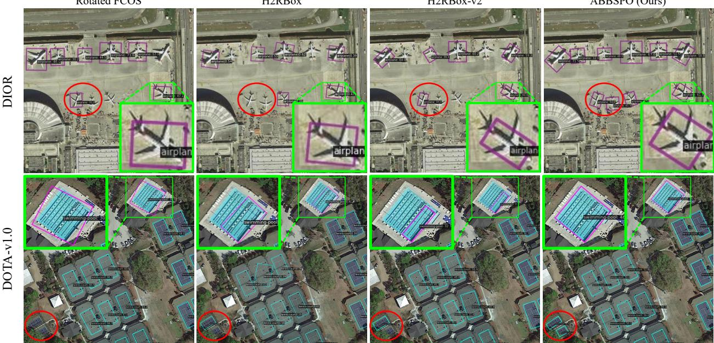  
Figure 5. Qualitative results on DIOR [5, 13] and DOTA-v1.0 [29] . Zoom-in for better visualization. Rotated FCOS was trained only with GT RBoxes, while H2RBox, H2RBox-v2 and our ABBSPO were trained with GT T-HBoxes (1st row) and GT C-HBoxes (2nd row).

## 4.4. Ablation Studies

Ablation study on SPA loss and ABBS module. As shown in Table 4, both components contribute to performance improvements. The ABBS module effectively scales the GT HBoxes, leading to an increase in $\mathrm { { A P } _ { 5 0 } }$ performance on the DIOR dataset. Notably, it has a greater effect on complexshaped object categories, resulting in a significant improvement in $3 \mathrm { - A P } _ { 5 0 }$ . Similarly, the SPA loss enhances angle prediction accuracy, also bringing an improvement in $\mathrm { { A P } _ { 5 0 } }$

Ablation study on proposal sampling. As shown in Table 5, applying Top-k proposal sampling exclusively to the SPA loss $( \mathcal { L } _ { \mathrm { S P A } } )$ yields the highest $\mathrm { { A P } _ { 5 0 } }$ performance, as the symmetric proposals of high-quality benefits ${ \mathcal { L } } _ { \mathrm { S P A } }$ . But, additional proposal sampling to the others $( \mathcal { L } _ { \mathrm { r o t } } , \mathcal { L } _ { \mathrm { f l p } } , \mathcal { L } _ { \mathrm { r e g } } ,$ $\mathcal { L } _ { \mathrm { c n } } , \mathcal { L } _ { \mathrm { c l s } } )$ significantly lowers the performance.

Ablation study on scale range in the ABBS module. As shown in Table 6, the optimal scale range is influenced by the type of GT HBoxes. For DIOR’s T-HBoxes, a scale range of 1 to 1.5 works well because it ensures that the predicted RBoxes fully cover the objects boundary. On the other hand, for DOTA’s C-HBoxes, which are already close to the optimal HBoxes, the optimal scale range is closer to 1. By adjusting the scale range based on the type of HBoxes, the ABBS module achieves high accuracy in predicting RBoxes for both datasets.

## 5. Conclusion

Our ABBSPO, a weakly supervised OOD framework, effectively learns RBox prediction regardless of the type of HBox annotations (T-HBox and C-HBox). With our proposed Adaptive Bounding Box Scaling (ABBS) and Symmetric Prior Angle (SPA) loss, we achieved enhanced orientation and scale accuracy for OOD, which is comparable to or even better than RBox-supervised methods. Extensive experimental results underscore the superiority of our approach, surpassing state-of-the-art HBox-supervised methods. Our method effectively bridges the gap between weakly supervised OOD and fully supervised OOD, making it a promising solution for applications requiring efficient and accurate object detection via training with relatively cheap annotations of HBoxes compared to RBoxes.

## Acknowledgement

This research was supported by Korea Institute of Marine Science & Technology Promotion (KIMST) funded by the Korea Coast Guard (RS-2023-00238652, Integrated Satellite-based Applications Development for Korea Coast Guard, 100%).

## References

[1] Liangyu Chen, Tong Yang, Xiangyu Zhang, Wei Zhang, and Jian Sun. Points as queries: Weakly semi-supervised object detection by points. In Proceedings of the IEEE/CVF conference on computer vision and pattern recognition, pages 8823–8832, 2021. 3

[2] Pengfei Chen, Xuehui Yu, Xumeng Han, Najmul Hassan, Kai Wang, Jiachen Li, Jian Zhao, Humphrey Shi, Zhenjun Han, and Qixiang Ye. Point-to-box network for accurate object detection via single point supervision. In European Conference on Computer Vision, pages 51–67. Springer, 2022. 3

[3] Yihong Chen, Zheng Zhang, Yue Cao, Liwei Wang, Stephen Lin, and Han Hu. Reppoints v2: Verification meets regression for object detection. In Advances in Neural Information Processing Systems, pages 5621–5631. Curran Associates, Inc., 2020. 2

[4] Gong Cheng, Peicheng Zhou, and Junwei Han. Learning rotation-invariant convolutional neural networks for object detection in vhr optical remote sensing images. IEEE transactions on geoscience and remote sensing, 54(12):7405– 7415, 2016. 2, 6

[5] Gong Cheng, Jiabao Wang, Ke Li, Xingxing Xie, Chunbo Lang, Yanqing Yao, and Junwei Han. Anchor-free oriented proposal generator for object detection. IEEE Transactions on Geoscience and Remote Sensing, 60:1–11, 2022. 6, 7, 8

[6] Jian Ding, Nan Xue, Yang Long, Gui-Song Xia, and Qikai Lu. Learning roi transformer for oriented object detection in aerial images. In Proceedings of the IEEE/CVF conference on computer vision and pattern recognition, pages 2849– 2858, 2019. 2

[7] Jiaming Han, Jian Ding, Jie Li, and Gui-Song Xia. Align deep features for oriented object detection. IEEE transactions on geoscience and remote sensing, 60:1–11, 2021. 2

[8] Jiaming Han, Jian Ding, Nan Xue, and Gui-Song Xia. Redet: A rotation-equivariant detector for aerial object detection. In Proceedings of the IEEE/CVF conference on computer vision and pattern recognition, pages 2786–2795, 2021. 2

[9] Muhammad Haroon, Muhammad Shahzad, and Muhammad Moazam Fraz. Multisized object detection using spaceborne optical imagery. IEEE Journal of Selected Topics in Applied Earth Observations and Remote Sensing, 13:3032– 3046, 2020. 2, 6

[10] Kaiming He, Xiangyu Zhang, Shaoqing Ren, and Jian Sun. Deep residual learning for image recognition. In Proceedings ofthe IEEE conference on computer vision and pattern recognition, pages 770–778, 2016. 6

[11] Shitian He, Huanxin Zou, Yingqian Wang, Boyang Li, Xu Cao, and Ning Jing. Learning remote sensing object detec-

tion with single point supervision. IEEE Transactions on Geoscience and Remote Sensing, 2023. 3

[12] Darius Lam, Richard Kuzma, Kevin McGee, Samuel Dooley, Michael Laielli, Matthew Klaric, Yaroslav Bulatov, and Brendan McCord. xview: Objects in context in overhead imagery. arXiv preprint arXiv:1802.07856, 2018. 2

[13] Ke Li, Gang Wan, Gong Cheng, Liqiu Meng, and Junwei Han. Object detection in optical remote sensing images: A survey and a new benchmark. ISPRS journal of photogram metry and remote sensing, 159:296–307, 2020. 2, 6, 8

[14] Wentong Li, Yijie Chen, Kaixuan Hu, and Jianke Zhu. Oriented reppoints for aerial object detection. In Proceedings ofthe IEEE/CVF conference on computer vision and pattern recognition, pages 1829–1838, 2022. 2, 7

[15] Tsung-Yi Lin, Piotr Dollar, Ross Girshick, Kaiming He,´ Bharath Hariharan, and Serge Belongie. Feature pyramid networks for object detection. In Proceedings of the IEEE conference on computer vision and pattern recognition, pages 2117–2125, 2017. 6

[16] Xuebo Liu, Ding Liang, Shi Yan, Dagui Chen, Yu Qiao, and Junjie Yan. Fots: Fast oriented text spotting with a unified network. In Proceedings of the IEEE conference on computer vision and pattern recognition, pages 5676–5685, 2018. 3

[17] Junwei Luo, Xue Yang, Yi Yu, Qingyun Li, Junchi Yan, and Yansheng Li. Pointobb: Learning oriented object detection via single point supervision. In Proceedings of the IEEE/CVF Conference on Computer Vision and Pattern Recognition, pages 16730–16740, 2024. 2, 3, 7

[18] Botao Ren, Xue Yang, Yi Yu, Junwei Luo, and Zhidong Deng. Pointobb-v2: Towards simpler, faster, and stronger single point supervised oriented object detection. arXiv preprint arXiv:2410.08210, 2024. 3

[19] Zhongzheng Ren, Zhiding Yu, Xiaodong Yang, Ming-Yu Liu, Alexander G Schwing, and Jan Kautz. Ufo 2: A unified framework towards omni-supervised object detection. In European conference on computer vision, pages 288–313. Springer, 2020. 3

[20] T-YLPG Ross and GKHP Dollar. Focal loss for dense ob-´ ject detection. In proceedings of the IEEE conference on computer vision and pattern recognition, pages 2980–2988, 2017. 2, 6, 7

[21] Xian Sun, Peijin Wang, Zhiyuan Yan, Feng Xu, Ruiping Wang, Wenhui Diao, Jin Chen, Jihao Li, Yingchao Feng, Tao Xu, et al. Fair1m: A benchmark dataset for finegrained object recognition in high-resolution remote sensing imagery. ISPRS Journal ofPhotogrammetry and Remote Sensing, 184:116–130, 2022. 2

[22] Yongqing Sun, Jie Ran, Feng Yang, Chenqiang Gao, Takayuki Kurozumi, Hideaki Kimata, and Ziqi Ye. Oriented object detection for remote sensing images based on weakly supervised learning. In 2021 IEEE International Conference on Multimedia & Expo Workshops (ICMEW), pages 1– 6. IEEE, 2021. 2

[23] Zhiwen Tan, Zhiguo Jiang, Chen Guo, and Haopeng Zhang. Wsodet: A weakly supervised oriented detector for aerial object detection. IEEE Transactions on Geoscience and Re mote Sensing, 61:1–12, 2023. 2, 3, 7

[24] Zhi Tian, Xiangxiang Chu, Xiaoming Wang, Xiaolin Wei, and Chunhua Shen. Fully convolutional one-stage 3d object detection on lidar range images. Advances in Neural Information Processing Systems, 35:34899–34911, 2022. 2, 4, 6, 7

[25] Hao Wang, Zhanchao Huang, Zhengchao Chen, Ying Song, and Wei Li. Multigrained angle representation for remotesensing object detection. IEEE Transactions on Geoscience and Remote Sensing, 60:1–13, 2022. 2

[26] Jian Wang, Fan Li, and Haixia Bi. Gaussian focal loss: Learning distribution polarized angle prediction for rotated object detection in aerial images. IEEE Transactions on Geoscience and Remote Sensing, 60:1–13, 2022. 2

[27] Linfei Wang, Yibing Zhan, Xu Lin, Baosheng Yu, Liang Ding, Jianqing Zhu, and Dapeng Tao. Explicit and implicit box equivariance learning for weakly-supervised rotated object detection. IEEE Transactions on Emerging Topics in Computational Intelligence, 2024. 2

[28] Zhou Wang, Alan C Bovik, Hamid R Sheikh, and Eero P Simoncelli. Image quality assessment: from error visibility to structural similarity. IEEE transactions on image processing, 13(4):600–612, 2004. 6

[29] Gui-Song Xia, Xiang Bai, Jian Ding, Zhen Zhu, Serge Belongie, Jiebo Luo, Mihai Datcu, Marcello Pelillo, and Liangpei Zhang. Dota: A large-scale dataset for object detection in aerial images. In Proceedings of the IEEE conference on computer vision and pattern recognition, pages 3974–3983, 2018. 2, 6, 7, 8

[30] SUN Xian, WANG Zhirui, SUN Yuanrui, DIAO Wenhui, ZHANG Yue, and FU Kun. Air-sarship-1.0: High-resolution sar ship detection dataset. , 8(6):852–863, 2019. 2

[31] Zhifeng Xiao, Qing Liu, Gefu Tang, and Xiaofang Zhai. Elliptic fourier transformation-based histograms of oriented gradients for rotationally invariant object detection in remote-sensing images. International Journal of Remote Sensing, 36(2):618–644, 2015. 2

[32] Xingxing Xie, Gong Cheng, Jiabao Wang, Xiwen Yao, and Junwei Han. Oriented r-cnn for object detection. In Proceedings of the IEEE/CVF international conference on computer vision, pages 3520–3529, 2021. 6, 7

[33] Hang Xu, Xinyuan Liu, Haonan Xu, Yike Ma, Zunjie Zhu, Chenggang Yan, and Feng Dai. Rethinking boundary discontinuity problem for oriented object detection. In Proceedings of the IEEE/CVF Conference on Computer Vision and Pattern Recognition, pages 17406–17415, 2024. 2

[34] Xue Yang and Junchi Yan. Arbitrary-oriented object detection with circular smooth label. In Computer Vision– ECCV 2020: 16th European Conference, Glasgow, UK, August 23–28, 2020, Proceedings, Part VIII 16, pages 677–694. Springer, 2020. 2

[35] Xue Yang and Junchi Yan. Arbitrary-oriented object detection with circular smooth label. In Computer Vision– ECCV 2020: 16th European Conference, Glasgow, UK, August 23–28, 2020, Proceedings, Part VIII 16, pages 677–694. Springer, 2020. 2

[36] Xue Yang, Liping Hou, Yue Zhou, Wentao Wang, and Junchi Yan. Dense label encoding for boundary discontinuity free

rotation detection. In Proceedings of the IEEE/CVF con ference on computer vision and pattern recognition, pages 15819–15829, 2021. 2

[37] Xue Yang, Junchi Yan, Ziming Feng, and Tao He. R3det: Refined single-stage detector with feature refinement for rotating object. Proceedings ofthe AAAI Conference on Artifi cial Intelligence, 35(4):3163–3171, 2021. 2

[38] Xue Yang, Junchi Yan, Qi Ming, Wentao Wang, Xiaopeng Zhang, and Qi Tian. Rethinking rotated object detection with gaussian wasserstein distance loss. In International conference on machine learning, pages 11830–11841. PMLR, 2021. 2, 7

[39] Xue Yang, Xiaojiang Yang, Jirui Yang, Qi Ming, Wentao Wang, Qi Tian, and Junchi Yan. Learning high-precision bounding box for rotated object detection via kullbackleibler divergence. Advances in Neural Information Processing Systems, 34:18381–18394, 2021. 7

[40] Xue Yang, Gefan Zhang, Xiaojiang Yang, Yue Zhou, Wentao Wang, Jin Tang, Tao He, and Junchi Yan. Detecting rotated objects as gaussian distributions and its 3-d generalization. IEEE Transactions on Pattern Analysis and Machine Intelli gence, 45(4):4335–4354, 2022.

[41] Xue Yang, Yue Zhou, Gefan Zhang, Jirui Yang, Wentao Wang, Junchi Yan, Xiaopeng Zhang, and Qi Tian. The kfiou loss for rotated object detection. arXiv preprint arXiv:2201.12558, 2022. 2, 7

[42] Xue Yang, Gefan Zhang, Wentong Li, Yue Zhou, Xuehui Wang, and Junchi Yan. H2RBox: Horizontal box annota tion is all you need for oriented object detection. In The Eleventh International Conference on Learning Representations, 2023. 1, 2, 3, 5, 6, 7

[43] Ze Yang, Shaohui Liu, Han Hu, Liwei Wang, and Stephen Lin. Reppoints: Point set representation for object detection. In Proceedings ofthe IEEE/CVF international conference on computer vision, pages 9657–9666, 2019. 2

[44] Xinyi Ying, Li Liu, Yingqian Wang, Ruojing Li, Nuo Chen, Zaiping Lin, Weidong Sheng, and Shilin Zhou. Mapping degeneration meets label evolution: Learning infrared small target detection with single point supervision. In Proceedings of the IEEE/CVF Conference on Computer Vision and Pattern Recognition, pages 15528–15538, 2023. 3

[45] Jiahui Yu, Yuning Jiang, Zhangyang Wang, Zhimin Cao, and Thomas Huang. Unitbox: An advanced object detection network. In Proceedings of the 24th ACM international conference on Multimedia, pages 516–520, 2016. 6

[46] Yi Yu and Feipeng Da. Phase-shifting coder: Predicting accurate orientation in oriented object detection. In Proceedings of the IEEE/CVF Conference on Computer Vision and Pattern Recognition, pages 13354–13363, 2023. 4

[47] Yi Yu, Xue Yang, Qingyun Li, Feipeng Da, Jifeng Dai, Yu Qiao, and Junchi Yan. Point2rbox: Combine knowledge from synthetic visual patterns for end-to-end oriented object detection with single point supervision. In Proceedings of the IEEE/CVF Conference on Computer Vision and Pattern Recognition, pages 16783–16793, 2024. 2, 3, 7

[48] Yi Yu, Xue Yang, Qingyun Li, Yue Zhou, Feipeng Da, and Junchi Yan. H2rbox-v2: Incorporating symmetry for boost-

ing horizontal box supervised oriented object detection. Advances in Neural Information Processing Systems, 36, 2024. 1, 2, 3, 4, 5, 6, 7

[49] Tingxuan Yue, Yanmei Zhang, Jin Wang, Yanbing Xu, and Pengyun Liu. A weak supervision learning paradigm for oriented ship detection in sar image. IEEE Transactions on Geoscience and Remote Sensing, 2024. 2