# AI-Face: A Million-Scale Demographically Annotated AI-Generated Face Dataset and Fairness Benchmark

Li Lin1, Santosh1, Mingyang Wu1, Xin Wang2, Shu Hu1†

1Purdue University, West Lafayette, USA {lin1785, santosh2, wu2415, hu968}@purdue.edu 2University at Albany, State University of New York, New York, USA xwang56@albany.edu

## Abstract

AI-generated faces have enriched human life, such as entertainment, education, and art. However, they also pose misuse risks. Therefore, detecting AI-generated faces becomes crucial, yet current detectors show biased performance across different demographic groups. Mitigating biases can be done by designing algorithmicfairness methods, which usually require demographically annotatedface datasets for model training. However, no existing dataset encompasses both demographic attributes and diverse generative methods simultaneously, which hinders the development offair detectorsfor AI-generatedfaces. In this work, we introduce the AI-Face dataset, thefirst million-scale demographically annotated AI-generatedface image dataset, including realfaces,facesfrom deepfake videos, andfaces generated by Generative Adversarial Networks and Diffusion Models. Based on this dataset, we conduct the first comprehensivefairness benchmark to assess various AIface detectors and provide valuable insights andfindings to promote thefuturefair design ofAIface detectors. Our AI-Face dataset and benchmark code are publicly available at https: //github.com/Purdue-M2/AI-Face-FairnessBench.

## 1. Introduction

AI-generated faces are created using sophisticated AI technologies that are visually difficult to discern from real ones [1]. They can be summarized into three categories: deepfake videos [2] created by typically using Variational Autoencoders (VAEs) [3, 4], faces generated from Generative Adversarial Networks (GANs) [5–8], and Diffusion Models (DMs) [9]. These technologies have significantly advanced the realism and controllability of synthetic facial representations. Generated faces can enrich media and increase creativity [10]. However, they also carry significant risks of misuse. For example, during the 2024 United States presidential election, fake face images of Donald Trump surrounded by groups of black people smiling and laughing to encourage African Americans to vote Republican are spreading online [11]. This could distort public opinion and erode people’s trust in media [12, 13], necessitating the detection of AI-generated faces for their ethical use.

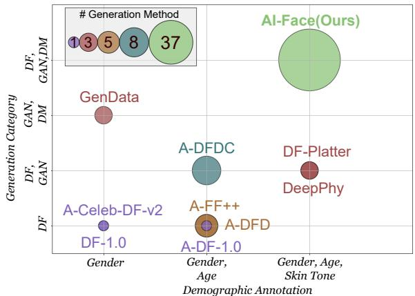  
Figure 1. Comparison between AI-Face and other datasets in terms of demographic annotation, generation category, and the number of generation methods. ‘DF’, ‘GAN’, and ‘DM’ stand for Deepfake Videos, Generative Adversarial Networks, and Diffusion Models.

However, one major issue existing in current AI face detectors [24–27] is biased detection (i.e., unfair detection performance among demographic groups [19, 28–30]). Mitigating biases can be done by designing algorithmic fairness methods, but they usually require demographically annotated face datasets for model training. For example, works like [29, 30] have made efforts to enhance fairness in the detection based on A-FF++ [19] and A-DFD [19]. However, both datasets are limited to containing only faces from deepfake videos, which could cause the trained models not to be applicable for fairly detecting faces generated by GANs and DMs. While some datasets (e.g., GenData [17], DF40 [31]) include GAN and DM faces, they either lack demographic annotations or provide only limited demographic attributes. Most importantly, no existing dataset offers sufficient diversity in generation methods while also providing demographic labels. A comparison of existing datasets is shown in Fig. 1. These limitations ofexisting datasets hamper the development of fair technologiesfor detecting AI-generatedfaces.

<table><tr><td rowspan="2">Dataset</td><td rowspan="2">Year</td><td colspan="2">Face Images</td><td colspan="2">Generation Category Deepfake Videos GAN</td><td rowspan="2">DM</td><td rowspan="2">#Generation</td><td rowspan="2">Source of Real Images</td><td colspan="3">Demographic Annotation Gender</td></tr><tr><td>#Real</td><td>#Fake</td><td></td><td>Methods</td><td>Skin Tone</td><td>Age</td></tr><tr><td>DF-1.0 [14]</td><td>2020</td><td>2.9M</td><td>14.7M</td><td>√ √</td><td>√</td><td></td><td>1 3</td><td>Self-Recording</td><td></td><td></td><td></td></tr><tr><td>DeePhy [15]</td><td>2022</td><td>1K</td><td>50.4K</td><td>√</td><td></td><td></td><td></td><td>YouTube</td><td>√</td><td>√</td><td>√</td></tr><tr><td>DF-Platter [16]</td><td>2023</td><td>392.3K</td><td>653.4K</td><td></td><td></td><td></td><td>3</td><td>YouTube</td><td>√</td><td>√</td><td>√</td></tr><tr><td>GenData [17]</td><td>2023</td><td></td><td>20K</td><td>√</td><td></td><td></td><td>3</td><td>CelebA [18]</td><td></td><td>√</td><td></td></tr><tr><td>A-FF++ [19]</td><td>2024</td><td>29.8K</td><td>149.1K</td><td></td><td></td><td></td><td>5</td><td>YouTube</td><td></td><td>√</td><td>√</td></tr><tr><td>A-DFD [19]</td><td>2024</td><td>10.8K</td><td>89.6K</td><td></td><td></td><td></td><td>5</td><td>Self-Recording</td><td></td><td>√</td><td>√</td></tr><tr><td>A-DFDC [19]</td><td>2024</td><td>54.5K</td><td>52.6K</td><td>√ √</td><td></td><td></td><td>8</td><td>Self-Recording</td><td></td><td>√</td><td>√</td></tr><tr><td>A-Celeb-DF-v2 [19]</td><td>2024</td><td>26.3K</td><td>166.5K</td><td></td><td></td><td></td><td>1</td><td>Self-Recording</td><td></td><td>√</td><td></td></tr><tr><td>A-DF-1.0 [19]</td><td>2024</td><td>870.3K</td><td>321.5K</td><td></td><td></td><td></td><td>1</td><td>Self-Recording FFHQ [6], IMDB-WIKI [20],</td><td></td><td>√</td><td>√</td></tr><tr><td>AI-Face</td><td>2025</td><td>400K</td><td>1.2M</td><td>√</td><td>√</td><td>√</td><td>37</td><td>real from FF++ [2], DFDC [21], DFD [22],Celeb-DF-v2 [23]</td><td>√</td><td>√</td><td>√</td></tr></table>

Table 1. Quantitative comparison of existing datasets with ours on demographically annotated AI-generated faces.

Moreover, benchmarking fairness provides a direct method to uncover prevalent and unique fairness issues in recent AI-generated face detection. However, there is a lack of a comprehensive benchmark to estimate the fairness of existing AI face detectors. Existing benchmarks [32–35] primarily assess utility, neglecting systematic fairness evaluation. Two studies [28, 36] do evaluate fairness in detection models, but their examination is based on a few outdated detectors. Furthermore, detectors’ fairness reliability (e.g., robustness with test set post-processing, fairness generalization) has not been assessed. The absence ofa comprehensive fairness benchmark impedes a thorough understanding ofthe fairness behaviors ofrecent AIface detectors and obscures the research pathfor detectorfairness guarantees.

In this work, we build the first million-scale demographically annotated AI-generated face image dataset: AI-Face. The face images are collected from various public datasets, including the real faces that are usually used to train AI face generators, faces from deepfake videos, and faces generated by GANs and DMs. Each face is demographically annotated by our designed measurement method and Contrastive Language-Image Pretraining (CLIP) [37]-based lightweight annotator. Next, we conduct the first comprehensive fairness benchmark on our dataset to estimate the fairness performance of 12 representative detectors coming from four model types. Our benchmark exposes common and unique fairness challenges in recent AI face detectors, providing essential insights that can guide and enhance the future design of fair AI face detectors. Our contributions are as follows:

• We build the first million-scale demographically annotated AI-generated face dataset by leveraging our designed measure and developed lightweight annotator.

• We conduct the first comprehensive fairness benchmark of AI-generated face detectors, providing an extensive fairness assessment of current representative detectors.

• Based on our experiments, we summarize the unsolved questions and offer valuable insights within this research field, setting the stage for future investigations.

## 2. Background and Motivation

AI-generated Faces and Biased Detection. AI-generated face images, created by advanced AI technologies, are visually difficult to discern from real ones. They can be summarized into three categories: 1) Deepfake Videos. Initiated in 2017 [13], these use face-swapping and face-reenactment techniques with a variational autoencoder to replace a face in a target video with one from a source [3, 4]. Note that our paper focuses solely on images extracted from videos. 2) GAN-generated Faces. Post-2017, Generative Adversarial Networks (GANs) [38] like StyleGANs [6–8] have significantly improved generated face realism. 3) DMgenerated Faces. Diffusion models (DMs), emerging in 2021, generate detailed faces from textual descriptions and offer greater controllability. Tools like Midjourney [39] and DALLE2 [40] facilitate customized face generation. While these AI-generated faces can enhance visual media and creativity [10], they also pose risks, such as being misused in social media profiles [41, 42]. Therefore, numerous studies focus on detecting AI-generated faces [24–27], but current detectors often show performance disparities among demographic groups [19, 28–30]. This bias can lead to unfair targeting or exclusion, undermining trust in detection models. Recent efforts [29, 30] aim to enhance fairness in deepfake detection but mainly address deepfake videos, overlooking biases in detecting GAN- and DM-generated faces.

The Existing Datasets. Current AI-generated facial datasets with demographic annotations are limited in size, generation categories, methods, and annotations, as illustrated in Table 1. For instance, A-FF++, A-DFD, A-DFDC, and A-Celeb-DF-v2 [19] are deepfake video datasets with fewer than one million images. Datasets like DF-1.0 [14] and DF-Platter [16] lack various demographic annotations. Additionally, existing datasets offer limited generation methods. These limitations hinder the development of fair AI face detectors, motivating us to build a million-scale demographically annotated AI-Face dataset.

Benchmark for Detecting AI-generated Faces. Benchmarks are essential for evaluating AI-generated face detectors under standardized conditions. Existing benchmarks, as shown in Table 2, mainly focus on detectors’ utility, often overlooking fairness [31–35]. Loc et al. [28] and CCv1 [36] examined detector fairness. However, their study did not have an analysis on DM-generated faces and only measured bias between groups in basic scenarios without considering fairness reliability under real-world variations and transformations. This motivates us to conduct a comprehensive benchmark to evaluate AI face detectors’ fairness.

<table><tr><td rowspan="2">Existing Benchmarks</td><td rowspan="2">Year</td><td colspan="3">Category</td><td colspan="3">Scope of Benchmark</td></tr><tr><td>Deepfake Videos</td><td>GAN</td><td>DM</td><td>Utility</td><td>Fairness General</td><td>Reliability</td></tr><tr><td>Loc et al. [28]</td><td>2021</td><td></td><td></td><td></td><td>√</td><td></td><td></td></tr><tr><td>CCv1 [36]</td><td>2021</td><td></td><td></td><td></td><td>√</td><td>√</td><td></td></tr><tr><td>DeepfakeBench [34]</td><td>2023</td><td></td><td></td><td></td><td>√</td><td></td><td></td></tr><tr><td>CDDB [32]</td><td>2023</td><td></td><td></td><td></td><td>√</td><td></td><td></td></tr><tr><td>Lin et al. [33]</td><td>2024</td><td></td><td>√</td><td></td><td>√</td><td></td><td></td></tr><tr><td>Le et al. [35]</td><td>2024</td><td>√ √</td><td>√</td><td></td><td>√</td><td></td><td></td></tr><tr><td>DF40 [31]</td><td>2024</td><td></td><td></td><td>√</td><td>√</td><td></td><td></td></tr><tr><td>Ours</td><td>2025</td><td></td><td></td><td>√</td><td>√</td><td>√</td><td>√</td></tr></table>

Table 2. Comparison ofexisting AI-generatedface detection benchmarks and ours. Fairness ‘General’ means fairness evaluation under default/basic settings. Fairness ‘Reliability’ measuresfairness consistency across dynamic scenarios (e.g., post-processing).

The Definition of Demographic Categories. Demographyrelated labels are highly salient to measuring bias. Following prior works [36, 43–47], we will focus on three key demographic categories: Skin Tone, Gender, and Age, in this work. For skin tone, this vital attribute spans a range from pale to dark. We use the Monk Skin Tone scale [48], specifically designed for computer vision applications. For gender, we adopt binary categories (i.e., Male and Female), following practices by many governments [49, 50] and facial recognition research [45, 51, 52], based on sex at birth. For age, using definitions from the United Nations [53] and Statistics Canada [54], we define five age groups: Child (0- 14), Youth (15-24), Adult (25-44), Middle-age Adult (45-64), and Senior (65+). More discussion is in Appendix A.

## 3. AI-Face Dataset

This section outlines the process of building our demographically annotated AI-Face dataset (see Fig. 2), along with its statistics and annotation quality assessment.

## 3.1. Data Collection

We build our AI-Face dataset by collecting and integrating public real and AI-generated face images sourced from academic publications, GitHub repositories, and commercial tools. We strictly adhere to the license agreements of all datasets to ensure that they allow inclusion in our datasets and secondary use for training and testing. More details are in Appendix B.1. Specifically, the fake face images in our dataset originate from 4 Deepfake Video datasets (i.e., FF++ [2], DFDC [21], DFD [22], and Celeb-DFv2 [23]), generated by 10 GAN models (i.e., AttGAN [55], MMDGAN [56], StarGAN [55], StyleGANs [55, 57, 58], MSGGAN [56], ProGAN [59], STGAN [56], and VQ-GAN [60]), and 8 DM models (i.e., DALLE2 [61], IF [61], Midjourney [61], DCFace [62], Latent Diffusion [63], Palette [64], Stable Diffusion v1.5 [65], Stable Diffusion Inpainting [65]). This constitutes a total of 1,245,660 fake face images in our dataset. We include 6 real source datasets (i.e., FFHQ [6], IMDB-WIKI [20], and real images from FF++ [2], DFDC [21], DFD [22], and Celeb-DF-v2 [23]). All of them are usually used as a training set for generative models to generate fake face images. This constitutes a total of 400,885 real face images in our dataset. In general, our dataset contains 28 subsets and 37 generation methods (i.e., 5 in FF++, 5 in DFD, 8 in DFDC, 1 in Celeb-DF-v2, 10 GANs, and 8 DMs). For all images, we use RetinaFace [66] for detecting and cropping faces.

## 3.2. Annotation Generation

## 3.2.1. Skin Tone Annotation Generation

Skin tone is typically measured using an intuitive approach [67, 68], without requiring a predictive model. Inspired by [67], we developed a method to estimate skin tone using the Monk Skin Tone (MST) Scale [48] (including 10-shade scales: Tone 1 to 10) by combining facial landmark detection with color analysis. Specifically, utilizing Mediapipe’s FaceMesh [69] for precise facial landmark localization, we isolate skin regions while excluding non-skin areas such as the eyes and mouth. Based on the detected landmarks, we generate a mask to extract skin pixels from the facial area. These pixels are then subjected to K-Means clustering [70] (we use K= 3 in practice) to identify the dominant skin color within the region of interest. The top-1 largest color cluster is mapped to the closest tone in the MST Scale by calculating the Euclidean distance between the cluster centroid and the MST reference colors in RGB space.

## 3.2.2. Gender and Age Annotation Generation

For generating gender and age annotations, the existing online software (e.g., Face++ [71]) and open-source tools (e.g., InsightFace [72]) can be used for the prediction. However, they fall short in our task due to two reasons: 1) They are mostly designed for face recognition and trained on datasets of real face images but lack generalization capability for annotating AI-generated face images. 2) Their use may introduce bias into our dataset, as they are typically designed and trained without careful consideration of bias and imbalance in the training set. See Appendix B.3 for our experimental study on these tools. To this end, we have to develop our specific annotators to predict gender and age annotations for each image in our dataset.

Problem Definition. Given a training dataset D = $\{ ( X _ { i } , A _ { i } ) \} _ { i = 1 } ^ { n }$ with size n, where $X _ { i }$ represents the i-th face image and $A _ { i }$ signifies a demographic attribute associated with $X _ { i }$ . Here, $A _ { i } \in { \mathcal { A } } .$ , where A represents user-defined groups (e.g., for gender, A = {Female, Male}. For age, $\begin{array} { r l } { A } & { { } = } \end{array}$ {Child, Youth, Adult, Middle-age Adult, Senior}). Our goal is to design a lightweight, generalizable annotator based on D that reduces bias while predicting facial demographic attributes for each image in our dataset. In practice, we use IMDB-WIKI [20] as training dataset, which contains images along with profile metadata sourced from IMDb and Wikipedia, ensuring that the demographic annotations are as accurate as possible. We trained two annotators with identical architecture and training procedures for gender and age annotations, respectively.

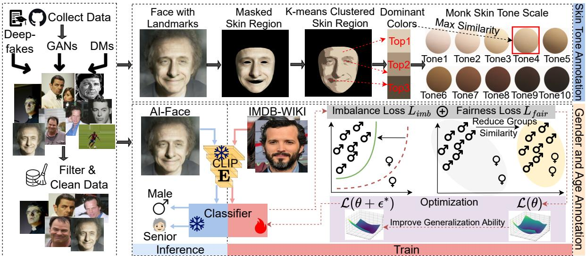  
Figure 2. Generation pipeline ofour Demographically Annotated AI-Face Dataset. First, we collect andfilterface imagesfrom Deepfake Videos, GAN-generatedfaces, and DM-generatedfacesfound in public datasets. Second, we perform skin tone, gender, and age annotation generation. Skin tone is estimated by combiningfacial landmark detection with color analysis to generate the corresponding annotation. For gender and age, we develop annotators trained on the IMDB-WIKI dataset [20], then use them to predict attributesfor each image.

Annotator Architecture. We build a lightweight annotator based on the CLIP [37] foundation model by leveraging its strong zero-shot and few-shot learning capabilities. Specifically, our annotator employs a frozen pre-trained CLIP ViT L/14 [73] as a feature extractor E followed by a trainable classifier parameterized by $\theta ,$ which contains 3-layer Multilayer Perceptron (MLP) M and a classification head h.

Learning Objective. Aware that neural networks can perform poorly when the training dataset suffers from classimbalance [74] and CLIP is not free from demographic bias [75–77], we introduce an imbalance loss and fairness loss to address these challenges in the annotator training. Specifically, for image $X _ { i }$ , its feature $f _ { i }$ is obtained through $f _ { i } { = } \mathbf { M } ( \mathbf { E } ( X _ { i } ) ) ,$ . Next, two losses are detailed below.

Imbalance Loss: To mitigate the impact of imbalance data, we use Vector Scaling [78] loss, which is a re-weighting method for training models on the imbalanced data with distribution shifts and can be expressed as

$$
L _ { i m b } = \frac { 1 } { n } \sum _ { i = 1 } ^ { n } - u _ { A _ { i } } \log \frac { e ^ { \zeta _ { A _ { i } } h ( f _ { i } ) _ { A _ { i } } + \Delta _ { A _ { i } } } } { \sum _ { A \in \mathcal { A } } e ^ { \zeta _ { A } h ( f _ { i } ) _ { A } + \Delta _ { A } } } ,
$$

where $u _ { A _ { i } }$ is the weighting factor for attribute $A _ { i } . h ( f _ { i } ) _ { A _ { i } }$ is the predict logit on $A _ { i } . \zeta _ { A _ { i } }$ is the multiplicative logit scaling factor, calculated as the inverse of $A _ { i } ^ { \prime } \mathbf { s }$ frequency. $\Delta _ { A _ { i } }$ is the additive logit scaling factor, calculated as the log of $A _ { i }$ probabilities. More details about them are in appendix B.4.

Fairness Loss: We introduce a fairness loss to minimize the disparity between the distribution $\mathcal { D } ^ { f }$ of f and the conditional distribution $\mathcal { D } ^ { f _ { A } }$ of $f$ on attribute $A \in A$ . Specifically, we follow [79, 80] to minimize the summation of the following Sinkhorn distance between these two distributions:

$$
L _ { f a i r } = \sum _ { A \in \mathcal { A } } \operatorname* { i n f } _ { \gamma \in \Gamma ( \mathcal { D } ^ { f } , \mathcal { D } ^ { f _ { A } } ) } \big \{ \mathbb { E } _ { X \sim \gamma } [ c ( p , q ) ] + \alpha H ( \gamma | \mu \otimes \nu ) \big \} ,
$$

where $\Gamma ( \mathcal { D } ^ { f } , \mathcal { D } ^ { f _ { A } } )$ is the set of joint distributions based on $\mathcal { D } ^ { f }$ and $\mathcal { D } ^ { f _ { A } }$ . Let $p$ and $q$ be the points from $\mathcal { D } ^ { f }$ and $\mathcal { D } ^ { f _ { A } }$ , respectively. Then, $c ( p , q )$ represents the transport cost [80]. Let $\mu$ and ν be the reference measures from the set of measures on $f .$ Then, $H ( \gamma | \mu \otimes \nu )$ represents the relative entropy of $\gamma$ with respect to the product measure $\mu \otimes \nu .$ $\alpha \geq 0$ is a regularization hyperparameter. In practice, we use the empirical form of $L _ { f a i r }$

Total Loss: Therefore, the final learning objective becomes $\mathcal { L } ( \boldsymbol { \theta } ) = L _ { i m b } + \lambda L _ { f a i r }$ , where λ is a hyperparameter. Train. Traditional optimization methods like stochastic gradient descent can lead to poor model generalization due to sharp loss landscapes with multiple local and global minima. To address this, we use Sharpness-Aware Minimization (SAM) [81] to enhance our annotator’s generalization by flattening the loss landscape. Specifically, flattening is attained by determining the optimal $\epsilon ^ { * }$ for perturbing model parameters θ to maximize the loss, formulated as: $\epsilon ^ { * } = \arg \operatorname* { m a x } _ { \| \epsilon \| _ { 2 } \leq \beta } \mathcal { L } ( \theta + \epsilon )$ ≈ arg $\begin{array} { r } { \operatorname* { m a x } _ { \| \epsilon \| _ { 2 } \leq \beta } \epsilon ^ { \top } \nabla _ { \theta } \mathcal { L } = } \end{array}$ $\beta \mathsf { s i g n } ( \nabla _ { \theta } \mathcal { L } )$ , where $\beta$ controls the perturbation magnitude. The approximation is based on the first-order Taylor expansion with assuming ϵ is small. The final equation is obtained by solving a dual norm problem, where $s \mathrm { i } \mathtt { g n }$ represents a sign function and $\nabla _ { \boldsymbol { \theta } } \mathcal { L }$ being the gradient of $\mathcal { L }$ with respect to θ. As a result, the model parameters are updated by solving: minθ $\mathcal { L } ( \theta + \epsilon ^ { * } )$

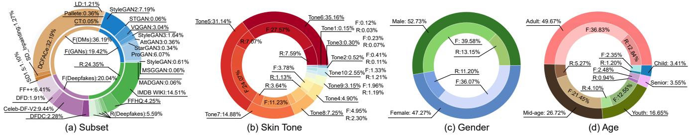  
Figure 3. Distribution offace images ofthe AI-Face dataset. Thefigure shows the (a) subset distribution and the demographic distribution for (b) skin tone, (c) gender, and (d) gender. The outer rings in (b), (c), and (d) represent the proportion ofgroups within each attribute category, while the inner rings indicate the distribution offake (F) and real (R) images within those groups.

Inference. We use the trained annotators to predict demographic labels for each image in AI-Face dataset, except for those from IMDB-WIKI, which already contain true labels.

## 3.3. Dataset Statistics

Fig. 3 illustrates the subset distribution and demographic attributes of the AI-Face dataset. The dataset contains approximately three times more generated images than real images, with diffusion model-generated images constituting the majority. In terms of demographic attributes, the majorities in skin tone are Tone 5 (31.14%) and Tone 6 (35.16%). The lightest skin tones (Tones 1-3) are underrepresented, comprising only 0.97% of the dataset. The dataset is relatively balanced across gender. Adult (25-44) (49.67%) is the predominant representation in age groups.

## 3.4. Annotation Quality Assessment

To assess the quality of demographic annotations in our AI-Face dataset, we conducted a user study. Three participants label the demographic attributes for the given images (the details of labeling activities are in appendix B.5), with the final ground truth determined by majority vote. We then compare our annotations with those in A-FF++, A-DFDC, A-CelebDF-V2, and A-DFD datasets. Specifically, we perform two assessments: 1) Strategic comparison: We select 1,000 images from A-FF++ and A-DFDC that have different annotations from AI-Face. These images likely represent challenging cases. 2) Random comparison: We randomly sampled 1,000 images from A-Celeb-DF-V2 and A-DFD. Due to the limited age classes in these datasets, only gender was evaluated. The results, presented in Table 3, demonstrate the high correctness of the AI-Face annotations and their superior quality compared to the annotations of other datasets. For example, our annotation quality (ACC) surpasses those in A-FF++ by 78.714% on gender and 48.000% on age.

## 4. Fairness Benchmark Settings

This section demonstrates the fairness benchmark settings for detection methods and evaluation metrics on AI-Face (80%/20%: Train/Test). More settings are in Appendix C.1.

Detection Methods. Our benchmark has implemented 12 detectors. The methodologies cover a spectrum that is specifically tailored to detect AI-generated faces from Deepfake Videos, GANs, and DMs. They can be classified into four types: Naive detectors: refer to backbone models that can be directly utilized as the detector for binary classification, including CNN-based (i.e., Xception [82], EfficientB4 [83]) and transformer-based (i.e., ViT-B/16 [84]). Frequency-based: explore the frequency domain for forgery detection (i.e., F3Net [85], SPSL [86], SRM [87]). Spatial-based: focus on mining spatial characteristics (e.g., texture) within images for detection (i.e., UCF [26], UnivFD [88], CORE [89]). Fairness-enhanced: focus on improving fairness in AI-generated face detection by designing specific algorithms (i.e., DAW-FDD [29], DAG-FDD [29], PG-FDD [30]).

<table><tr><td>Evaluation Type</td><td>Dataset</td><td>ACC</td><td>Gender Precision</td><td>Recall</td><td>ACC</td><td>Age Precision Recall</td></tr><tr><td rowspan="4">Strategic</td><td>A-FF++</td><td>8.143</td><td>17.583</td><td>5.966</td><td>37.700 39.459</td><td>45.381</td></tr><tr><td>AI-Face</td><td>86.857</td><td>74.404</td><td>77.367</td><td>85.700 74.024</td><td>63.751</td></tr><tr><td>A-DFDC</td><td>21.600</td><td>28.604</td><td>23.082</td><td>33.400 38.011</td><td>40.165</td></tr><tr><td>AI-Face</td><td>91.700</td><td>92.129</td><td>83.448</td><td>77.000 76.184</td><td>62.646</td></tr><tr><td rowspan="4">Random</td><td>A-Celeb-DF-V2</td><td>89.628</td><td>90.626</td><td>90.494</td><td>，</td><td></td></tr><tr><td>AI-Face</td><td>91.206</td><td>91.474</td><td>91.767</td><td>-</td><td></td></tr><tr><td>A-DFD</td><td>70.900</td><td>71.686</td><td>74.435</td><td></td><td></td></tr><tr><td>AI-Face</td><td>92.300</td><td>91.060</td><td>91.727</td><td>-</td><td></td></tr></table>

Table 3. Annotation quality assessment results (%)for A-FF++, A-DFDC, A-Celeb-DF-V2, A-DFD, and our AI-Face. ACC: Accuracy.

Evaluation Metrics. To provide a comprehensive benchmarking, we consider 5 fairness metrics commonly used in fairness community [90–94] and 5 widely used utility metrics [95–98]. For fairness metrics, we consider Demographic Parity $( F _ { D P } )$ [90, 91], Max Equalized Odds $( F _ { M E O } )$ [93], Equal Odds $( F _ { E O } )$ [92], and Overall Accuracy Equality $( F _ { O A E } )$ [93] for evaluating group (e.g., gender) and intersectional (e.g., individuals of a specific gender and simultaneously a specific skin tone) fairness. In experiments, the intersectional groups are Female-Light (F-L), Female-Medium (F-M), Female-Dark (Dark), Male-Light (M-L), Male-Medium (M-M), and Male-Dark (M-D), where we group 10 categories of skin tones into Light (Tone 1-3), Medium (Tone 4-6), and Dark (Tone 7-10) for simplicity according to [99]. We also use individual fairness $\left( F _ { I N D } \right) [ 9 4 $ , 100] (i.e., similar individuals should have similar predicted outcomes) for estimation. For utility metrics, we employ the Area Under the ROC Curve (AUC), Accuracy (ACC), Average Precision (AP), Equal Error Rate (EER),

<table><tr><td rowspan="2">Measure</td><td rowspan="2">Attribute</td><td rowspan="2">Metric</td><td rowspan="2">Naive ViT-B/16</td><td colspan="10">Frequency</td><td rowspan="2" colspan="4">Fairness-enhanced</td></tr><tr><td>Xception</td><td>EfficientB4</td><td>F3Net [85]</td><td>SPSL [86]</td><td></td><td>SRM</td><td>UCF</td><td>Spatial UnivFD</td><td>CORE DAW-FDD</td><td>DAG-FDD</td><td>PG-FDD [30]</td></tr><tr><td rowspan="9"></td><td rowspan="3">Skin Tone</td><td> $F _ { M E O }$ </td><td>[82] 8.836</td><td>[83] 8.300</td><td>[84] 6.264</td><td></td><td>19.938</td><td>8.055</td><td>[87] 10.002</td><td>[26] 17.325</td><td>[88] 2.577</td><td>[89] 10.779</td><td>[29] 14.118</td><td>[29] 6.551</td><td>6.465</td></tr><tr><td> $F _ { D P }$ </td><td>9.751</td><td></td><td></td><td>7.728</td><td>12.876</td><td>9.379</td><td>10.897</td><td>12.581</td><td>8.556</td><td>10.317</td><td>10.706</td><td></td><td>8.617</td><td>9.746</td></tr><tr><td></td><td></td><td>1.271</td><td>6.184 4.377</td><td>2.168</td><td>2.818</td><td>1.135</td><td>0.915</td><td>1.883</td><td>2.748</td><td>1.332</td><td></td><td>1.667</td><td>1.388</td><td>0.882</td></tr><tr><td></td><td> $F _ { O A E }$   $F _ { E O }$ </td><td>12.132</td><td>11.062</td><td></td><td>8.813</td><td>23.708</td><td>9.789</td><td>14.239</td><td>21.92</td><td>5.536</td><td>13.069</td><td>16.604</td><td>7.383</td><td></td><td>9.115</td></tr><tr><td></td><td> $\overline { { F _ { M E O } } }$ </td><td></td><td>3.975</td><td>5.385</td><td>5.104</td><td>4.717</td><td>4.411</td><td>6.271</td><td>5.074</td><td>4.503</td><td>5.795</td><td></td><td>5.510</td><td>5.910</td><td>3.190</td></tr><tr><td>Gender</td><td> $F _ { D P }$ </td><td></td><td>1.691</td><td>1.725</td><td>1.344</td><td>1.864</td><td>1.827</td><td>1.957</td><td>1.736</td><td>1.190</td><td>2.154</td><td></td><td>2.015</td><td>2.151</td><td>1.252</td></tr><tr><td></td><td> $F _ { O A E }$ </td><td></td><td>0.975</td><td>1.487</td><td>1.803</td><td>1.129</td><td>1.037</td><td>1.772</td><td>1.451</td><td>1.622</td><td>1.389</td><td></td><td>1.325</td><td>1.420</td><td>1.071</td></tr><tr><td></td><td> $F _ { E O }$ </td><td>4.143</td><td></td><td>5.863</td><td>6.031</td><td>4.870</td><td>4.534</td><td>6.78</td><td>5.510</td><td>5.408</td><td>5.931</td><td></td><td>5.696</td><td>6.066</td><td>3.702</td></tr><tr><td></td><td> $F _ { M E O }$ </td><td>27.883</td><td></td><td>6.796</td><td>14.937</td><td>38.801</td><td>27.614 11.232</td><td>24.843 11.570</td><td>47.500 17.049</td><td>5.436</td><td>33.882</td><td></td><td>45.466</td><td>15.229</td><td>14.804</td></tr><tr><td>Fairness(%)↓ Age</td><td></td><td> $F _ { D P }$ </td><td>10.905</td><td>11.849</td><td>11.839 6.838</td><td>14.906 10.116</td><td>7.270</td><td>6.524</td><td></td><td>15.249</td><td></td><td>12.564</td><td>14.106</td><td>9.633 5.533</td><td>10.467 5.009</td></tr><tr><td></td><td></td><td> $F _ { O A E }$ </td><td>7.265 42.216</td><td>2.856 10.300</td><td>30.795</td><td>55.032</td><td>40.943</td><td></td><td>38.528</td><td>11.652 67.545</td><td>3.793 14.148</td><td>8.760 48.729</td><td>11.878 64.384</td><td>30.182</td><td>29.585</td></tr><tr><td></td><td></td><td> $F _ { E O }$ </td><td>10.505</td><td>17.586</td><td>9.384</td><td>21.369</td><td>10.379</td><td></td><td>15.142</td><td>20.134</td><td>6.119</td><td>15.34</td><td>16.565</td><td>12.178</td><td>9.578</td></tr><tr><td></td><td></td><td> $\overline { { F _ { M E O } } }$ </td><td>14.511</td><td>8.607</td><td>11.535</td><td>17.175</td><td>13.259</td><td>15.186</td><td></td><td>17.03</td><td>14.026</td><td>14.301</td><td>14.088</td><td>11.705</td><td>14.697</td></tr><tr><td>Intersection</td><td></td><td> $F _ { D P }$ </td><td>2.536</td><td>8.461</td><td>4.928</td><td>4.870</td><td>2.464</td><td>3.998</td><td></td><td>3.536</td><td>6.287</td><td>2.775</td><td>3.547</td><td>4.035</td><td>3.062</td></tr><tr><td></td><td></td><td> $F _ { O A E }$ </td><td>24.315</td><td>25.114</td><td>27.443</td><td>47.783</td><td>21.679</td><td>30.112</td><td></td><td>43.376</td><td>20.255</td><td>28.84</td><td>33.122</td><td>26.295</td><td>18.348</td></tr><tr><td></td><td>Individual</td><td> $F _ { E O }$   $F _ { I N D }$ </td><td>10.338</td><td>25.742</td><td>0.022</td><td>1.872</td><td>2.518</td><td></td><td>7.621</td><td>0.767</td><td>3.523</td><td>0.041</td><td>3.772</td><td>0.901</td><td>0.780</td></tr><tr><td></td><td></td><td> $\overline { { \mathbf { A U C \uparrow } } }$ </td><td>98.583</td><td>98.611</td><td>98.69</td><td>98.714</td><td></td><td>98.747</td><td>97.936</td><td>98.082</td><td>98.192</td><td>98.579</td><td>97.811</td><td>98.771</td><td>99.172</td></tr><tr><td>Utility(%)</td><td></td><td>ACC↑</td><td>96.308</td><td>94.203</td><td>94.472</td><td>95.719</td><td></td><td>96.346</td><td>95.092</td><td>95.151</td><td>93.651</td><td>96.224</td><td>95.426</td><td>95.722</td><td>96.174</td></tr><tr><td></td><td></td><td></td><td>99.350</td><td>99.542</td><td>99.571</td><td>99.453</td><td></td><td>99.356</td><td>99.172</td><td>99.273</td><td>99.400</td><td>99.360</td><td>99.015</td><td>99.498</td><td>99.694</td></tr><tr><td></td><td></td><td>AP↑</td><td>5.149</td><td>6.689</td><td>6.372</td><td>5.256</td><td></td><td></td><td>6.483</td><td>7.708</td><td></td><td>5.145</td><td>7.063</td><td>5.499</td><td>4.961</td></tr><tr><td></td><td></td><td>EER↓ FPR↓</td><td>12.961</td><td>20.066</td><td>16.426</td><td></td><td>14.679</td><td>4.371 13.661</td><td>15.746</td><td>13.646</td><td>7.633 18.550</td><td>13.410</td><td>16.670</td><td>14.844</td><td>10.971</td></tr><tr><td>Training Time / Epoch</td><td></td><td></td><td>1h15min</td><td>2h25min</td><td>2h40min</td><td></td><td>1h18min</td><td>1h20min</td><td>3h10min</td><td>5h05min</td><td>4h</td><td>1h16min</td><td>1h25min</td><td>1h17min</td><td>7h20min</td></tr></table>

Table 4. Overall performance comparison of difference methods on the AI-Face dataset. The best performance is shown in bold.

## 5. Results and Analysis

In this section, we estimate the existing AI-generated image detectors’ fairness performance alongside their utility on our AI-Face Dataset. More results can be found in Appendix D.

## 5.1. General Fairness Comparison

Overall Performance. Table 4 reports the overall performance on our AI-Face test set. Our observations are: 1) Fairness-Enhanced Models (specifically PG-FDD [30]) are the most effective in achieving both high fairness and utility, underscoring the effectiveness of specialized fairnessenhancement techniques in mitigating demographic biases. 2) UnivFD [88], based on the CLIP backbone [73], also achieves commendable fairness, suggesting that foundation models equipped with fairness-focused enhancements could be a promising direction for developing fairer detectors. 3) Naive detectors, such as EfficientB4 [83], trained on large, diverse datasets (e.g., our AI-Face) can achieve competitive fairness and utility, highlighting the potential of fairness improvements by choosing specific architecture. 4) 10 out of 12 detectors have an AUC higher than 98%, demonstrating our AI-Face dataset is significant for training AI-face detectors in resulting high utility. 5) PG-FDD demonstrates superior performance but has a long training time, which can be explored and addressed in the future.

Performance on Different Subsets. 1) Fig. 4 demonstrates the intersectional $F _ { E O }$ and AUC performance of detectors on each test subset. We observe that the fairness performance varies a lot among different generative methods for every detector. The largest bias on most detectors comes from detecting face images generated by diffusion models. 2) DAG-FDD [29] and SRM [87] demonstrate the most consistent fairness across subsets, indicating a robust handling of bias introduced by different generative methods. 3) Moreover, the stable utility demonstrates our dataset’s expansiveness and diversity, enabling effective training to detect AI-generated faces from various generative techniques.

Performance on Different Subgroups. We conduct an analysis of all detectors on intersectional subgroups. 1) As shown in Fig. 5, facial images with lighter skin tone are more often misclassified as fake, likely due to the underrepresentation of lighter tones (Tone 1-3) in our dataset (see Fig. 3 (b)). This suggests detectors tend to show higher error rates for minority groups. 2) Although gender representation is relatively balanced (see Fig. 3 (c)) in our dataset, the detectors consistently exhibit higher false positive rates for female subgroups, indicating a persistent gender-based bias.

## 5.2. Fairness Reliability Assessment

Fairness Robustness Evaluation. We apply 6 postprocessing methods: Random Crop (RC) [101], Rotation (RT) [34], Brightness Contrast (BC) [34], Hue Saturation Value (HSV) [34], Gaussian Blur (GB) [34], and JEPG Compression (JC) [102] to the test images. Fig. 6 shows each detector’s intersectional $F _ { E O }$ and AUC performance changes after using post-processing. Our observations are: 1) These impairments tend to wash out forensic traces, so that detectors have evident performance degradation. 2) Postprocessing does not always cause detectors more bias (e.g., UCF, UnivFD, CORE, DAW-FDD have better fairness after rotation), though they hurt the utility. 3) Fairness-enhanced detectors struggle to maintain fairness when images undergo post-processing. 4) Spatial detectors have better fairness robustness compared with other model types.

Fairness Generalization Evaluation. To evaluate detectors’ fairness generalization capability, we test them on Casual

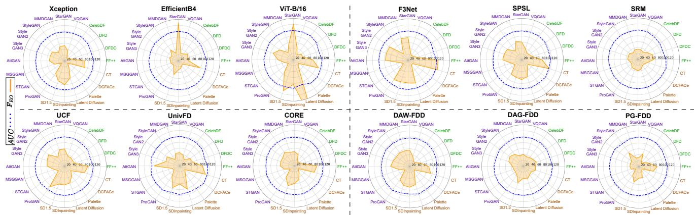

Figure 4. Visualization of the intersectional FEO (%) and AUC (%) of detectors on different subsets. The smaller FEO polygon area represents better fairness. The larger AUC area means better utility.  
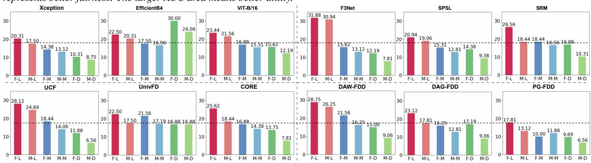  
Figure 5. FPR(%) of each intersectional subgroup The dashline represents the lowest FPR on Female-Light (F-L) subgroup.

Conversations v2 (CCv2) [103], DF-Platter [16], and Gen-Data [17], none of which are part of AI-Face. Notably, CCv2 is a dataset that contains only real face images with demographic annotations (e.g., gender) self-reported by the participants. Results on gender attribute in Table 5 show that: 1) Even well-designed detectors that focus on improving utility or fairness generalization (e.g., UCF, PG-FDD) struggle to achieve consistently superior performance across different dataset domains. This highlights the remaining fairness generalization issue. 2) DAW-FDD and PG-PDD are two fairness-enhanced detectors that require accessing demographic information during training, but their fairness does not encounter a drastic drop when evaluating on CCv2. This reflects the high accuracy of the annotations in our AI-face.

Effect of Training Set Size. We randomly sample 20%, 40%, 60%, and 80% of each training subset from AI-Face to assess the impact of training size on performance. Key observations from Fig. 7 (Left): 1) Among all detectors, UnivFD demonstrates the most stable fairness and utility performance as the training dataset size changes, likely due to its fixed CLIP backbone. 2) Increasing the training dataset size generally improves model utility, but this pattern does not extend to fairness metrics. In fact, certain detectors such as F3Net and UCF exhibit worsening fairness as the training size reaches its maximum. This suggests that more training data does not necessarily lead to fairer detectors.

Effect of the Ratio of Real and Fake. To examine how training real-to-fake sample ratios affect detector performance, we set the ratios at 1:10, 1:1, and 10:1 while keeping the total sample count constant. Experimental results in Fig. 7 (Right) show: 1) Most detectors’ fairness improves as real sample representation increases. Probably because increasing real and reducing fake samples helps detectors reduce overfitting to artifacts specific to fake samples. This makes it easier for detectors to distinguish real from fake, even for underrepresented groups, thereby enhancing fairness. 2) Most detectors achieve the highest AUC with balanced data.

## 5.3. Discussion

According to the above experiments, we summarize the unsolved fairness problems in recent detectors: 1) Detectors fairness is unstable when detecting face images generated by different generative methods, indicating a future direction for enhancing fairness stability since new generative models continue to emerge. 2) Even though fairness-enhanced detectors exhibit small overall fairness metrics, they still show biased detection towards minority groups. Future studies should be more cautious when designing fair detectors to ensure balanced performance across all demographic groups. 3) There is currently no reliable detector, as all detectors experience severe large performance degradation under image post-processing and cross-domain evaluation. Future studies should aim to develop a unified framework that ensures fairness, robustness, and generalization, as these three characteristics are essential for creating a reliable detector. Moreover, integrating foundation models (e.g., CLIP) into detector design may help mitigate bias.

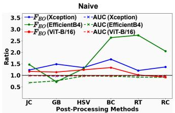

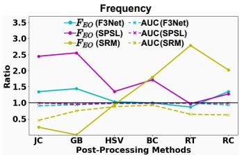  
Figure 6. Performance ratio after vs. before post-processing. Points closer to 1.0 (i.e., no post-processing) indicate better robustness.

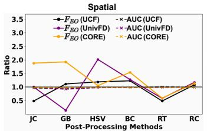

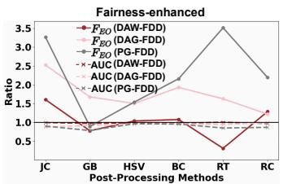

<table><tr><td rowspan="2">Model Type</td><td rowspan="2">Detector</td><td colspan="8">Dataset CCv2 [103]</td></tr><tr><td>Fairness(%)↓</td><td>Utility(%)↑</td><td>Fairness(%)↓</td><td>DF-Platter [16]</td><td>Utility(%)↑</td><td>Fairness(%)↓</td><td>GenData [17]</td><td>Utility(%)↑</td></tr><tr><td rowspan="4">Naive</td><td></td><td> $F _ { O A E }$ </td><td>ACC</td><td> $F _ { O A E }$ </td><td> $F _ { E O }$ </td><td>AUC</td><td> $F _ { O A E }$ </td><td> $F _ { E O }$ </td><td>AUC</td></tr><tr><td>Xception</td><td>1.006(+0.031)</td><td>86.465(-9.843)</td><td> $\overline { { 6 . 8 3 6 ( + 5 . 8 6 1 ) } }$ </td><td>9.789(+5.646)</td><td>81.273(-17.310)</td><td> $\overline { { 2 . 5 3 9 ( + 1 . 5 6 4 ) } }$ </td><td>13.487(+9.344)</td><td>96.971(-1.612)</td></tr><tr><td>EfficientB4</td><td>4.077(+0.259)</td><td>82.980(-11.223)</td><td> $8 . 7 8 6 ( + 7 . 2 9 9 )$ </td><td>12.370(+6.507)</td><td>67.694(-30.917)</td><td> $3 . 3 0 4 ( + 1 . 8 1 7 )$ </td><td>1.995(-3.686)</td><td>93.213(-5.398)</td></tr><tr><td>ViT-B/16</td><td>2.167(+0.364)</td><td>81.489(-12.983)</td><td> $\mathbf { 0 . 0 1 5 \ ( - 1 . 7 8 8 ) }$ </td><td>12.373(+6.342)</td><td>76.050(-22.640)</td><td> $3 . 1 6 4 ( + 1 . 3 6 1 )$ </td><td>9.610(+3.579)</td><td>88.253(-10.437)</td></tr><tr><td rowspan="4">Frequency</td><td>F3Net</td><td>5.743(+4.614)</td><td>87.867(-7.852)</td><td> $3 . 5 2 1 ( + 2 . 3 9 2 )$ </td><td>6.445 (+1.575)</td><td>85.112(-13.602)</td><td> $1 . 1 8 8 ( + 0 . 0 5 9 )$ </td><td>16.306(+11.436)</td><td>91.603(-7.111)</td></tr><tr><td>SPSL</td><td>0.601(-0.436)</td><td>80.006(-16.340)</td><td> $5 . 1 0 9 ( + 4 . 0 7 2 )$ </td><td>7.842(+3.308)</td><td>82.175(-16.572)</td><td> $1 . 3 8 5 ( + 0 . 3 4 8 )$ </td><td>9.261(+4.272)</td><td>98.838(+0.091)</td></tr><tr><td>SRM</td><td>7.000(+5.228)</td><td>79.768(-15.324)</td><td> $3 . 8 2 3 ( + 2 . 0 5 1 )$ </td><td>6.567(-0.213)</td><td>66.401(-31.535)</td><td> $3 . 2 8 1 ( + 1 . 5 0 9 )$ </td><td> $7 . 9 0 7 ( + 1 . 1 2 7 )$ </td><td>90.049(-7.887)</td></tr><tr><td>UCF</td><td>2.169(+0.718)</td><td>93.009 (-2.142)</td><td> $8 . 6 8 7 ( + 7 . 2 3 6 )$ </td><td>17.068(+11.558)</td><td>80.821(-17.261)</td><td> $3 . 5 1 3 ( + 2 . 0 6 2 )$ </td><td> $1 0 . 5 2 9 ( + 5 . 0 1 9 )$ </td><td>87.778(-10.304)</td></tr><tr><td rowspan="4">Spatial Fairness-</td><td>UnivFD</td><td>7.625(+6.003)</td><td>67.983(-25.668)</td><td> $4 . 5 4 0 ( + 2 . 9 1 8 )$ </td><td>9.950(+4.542)</td><td>76.443(-21.749)</td><td> $1 . 6 4 5 ( + 0 . 0 2 3 )$ </td><td> $3 . 8 4 8 ( - 1 . 5 6 0 )$ </td><td>94.418(-3.774)</td></tr><tr><td>CORE</td><td> $4 . 4 1 0 ( + 3 . 0 2 1 )$ </td><td>83.328(-12.896)</td><td> $7 . 7 4 1 ( + 6 . 3 5 2 )$ </td><td> $1 7 . 3 4 8 ( + 1 1 . 4 1 7 )$ </td><td>77.226(-21.353)</td><td> $3 . 7 5 9 ( + 2 . 3 7 0 )$ </td><td> $2 3 . 2 8 9 ( + 1 7 . 3 5 8 )$ </td><td>98.408(-0.171)</td></tr><tr><td>DAW-FDD</td><td> $\overline { { 4 . 7 2 6 ( + 3 . 4 0 1 ) } }$ </td><td>84.685(-10.741)</td><td> $\overline { { 5 . 5 3 6 ( + 4 . 2 1 1 ) } }$ </td><td> $\overline { { 1 3 . 6 6 7 ( + 7 . 7 9 1 ) } }$ </td><td>81.807(-16.004)</td><td> $\overline { { 1 . 4 4 3 ( + 0 . 1 1 8 ) } }$ </td><td> $\overline { { 1 0 . 2 2 8 ( + 4 . 5 3 2 ) } }$ </td><td>97.854(+0.043)</td></tr><tr><td>DAG-FDD</td><td> $2 . 3 6 4 ( + 0 . 9 4 4 )$ </td><td>83.918(-11.804)</td><td> $3 . 0 6 4 ( + 1 . 6 4 4 )$ </td><td> $2 2 . 2 0 3 ( + 1 6 . 1 3 7 )$ </td><td> $7 5 . 2 0 6 ( - 2 3 . 5 6 5 )$ </td><td> $\mathbf { 0 . 7 1 4 } \ ( - 0 . 7 0 6 )$ </td><td> $1 0 . 3 3 2 ( + 4 . 2 6 6 )$ </td><td>92.108(-6.663)</td></tr><tr><td rowspan="2">enhanced</td><td>PG-FDD</td><td> $1 . 5 1 3 ( + 0 . 4 4 2 )$ </td><td>92.852(-3.322)</td><td> $4 . 5 6 5 ( + 3 . 4 9 4 )$ </td><td> $9 . 7 1 7 ( + 6 . 0 1 5 )$ </td><td> $\mathbf { 8 5 . 2 7 1 \ ( - 1 3 . 9 0 1 ) }$ </td><td> $3 . 0 6 3 ( + 1 . 9 9 2 )$ </td><td> $9 . 4 7 9 ( + 5 . 7 7 7 )$ </td><td>93.329(-5.843)</td></tr><tr><td></td><td></td><td></td><td></td><td></td><td></td><td></td><td></td><td></td></tr></table>

Table 5. Fairness generalization results based on the gender attribute. The smallest performance changes (in parentheses) and the best performance are in red and in bold, respectively. Only F fairness metric and ACC metric are used in CCv2 due to all samples are real.

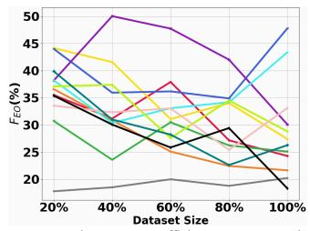

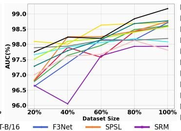

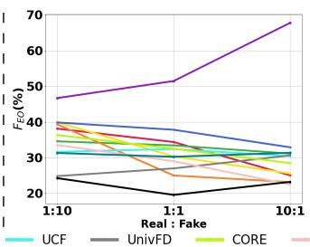

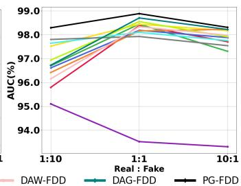  
Figure 7. Impact ofthe training set size (Left) and the ratio ofreal andfake $( R i g h t )$ on detectors’ intersectional $F _ { E O } $ (%) and AUC (%).

## 6. Conclusion

This work presents the first demographically annotated million-scale AI-Face dataset, serving as a pivotal foundation for addressing the urgent need for developing fair AI face detectors. Based on this dataset, we conduct thefirst compre hensive fairness benchmark, shedding light on the fairness performance and challenges of current representative AI face detectors. Our findings can inspire and guide researchers in refining current models and exploring new methods to mitigate bias. Limitation and Future Work: One limitation is that our dataset’s annotations are algorithmically generated, so they may lack 100% accuracy. This challenge is difficult to resolve, as demographic attributes for most AI-generated faces are often too ambiguous to predict and do not map to real-world individuals. We plan to enhance annotation quality through human labeling in the future. We also plan to extend our fairness benchmark to evaluate large language models like LLaMA2 [104] and GPT4 [105] for detecting AI faces. Social Impact: Malicious users could misuse AI-generated face images from our dataset to create fake social media profiles and spread misinformation. To mitigate this risk, only users who submit a signed end-user license agreement will be granted access to our dataset.

## Ethics Statement

Our dataset collection and annotation generation are approved by Purdue’s Institutional Review Board. The dataset is only for research purposes. All data included in this work are sourced from publicly available datasets, and we strictly comply with each dataset’s license agreement to ensure lawful inclusion and permissible secondary use for training and testing. All collected data and their associated licenses are mentioned in the Datasheet of AI-Face in Appendix E. Our annotation processes prioritize ethical considerations: 1) 76% images we annotated are generated facial images, ensuring no potential for harm to any individual. 2) For real images, we only provide annotations for content either licensed by the original copyright holders or explicitly stated as freely shareable for research purposes.

## Acknowledgments

This work is supported by the U.S. National Science Foundation (NSF) under grant IIS-2434967 and the National Artificial Intelligence Research Resource (NAIRR) Pilot and TACC Lonestar6. The views, opinions and/or findings expressed are those of the author and should not be interpreted as representing the official views or policies of NSF and NAIRR Pilot.

## References

[1] L. Lin, N. Gupta, Y. Zhang, H. Ren, C.-H. Liu, F. Ding, X. Wang, X. Li, L. Verdoliva, and S. Hu, “Detecting multimedia generated by large ai models: A survey,” arXiv preprint arXiv:2402.00045, 2024. 1

[2] A. Rossler, D. Cozzolino, L. Verdoliva, C. Riess, J. Thies, and M. Nießner, “Faceforensics++: Learning to detect manipulated facial images,” in Proceedings of the IEEE/CVF international conference on computer vision, pp. 1–11, 2019. 1, 2, 3, 18, 19

[3] “Deepfakes github.” https : / / github . com / deepfakes / faceswap. Accessed: 2024-04-17. 1, 2

[4] “Fakeapp.” https://www.fakeapp.com/. Accessed: 2024-04-17. 1, 2

[5] A. Brock, J. Donahue, and K. Simonyan, “Large scale gan training for high fidelity natural image synthesis,” in 7th International Conference on Learning Representations, ICLR 2019, 2019. 1

[6] T. Karras, S. Laine, and T. Aila, “A style-based generator architecture for generative adversarial networks,” in Proceedings ofthe IEEE/CVF conference on computer vision and pattern recognition, pp. 4401–4410, 2019. 2, 3, 18

[7] T. Karras, S. Laine, M. Aittala, J. Hellsten, J. Lehtinen, and T. Aila, “Analyzing and improving the image quality of stylegan,” in Proceedings of the IEEE/CVF conference on computer vision and pattern recognition, pp. 8110–8119, 2020.

[8] T. Karras, M. Aittala, S. Laine, E. Hark¨ onen, J. Hellsten,¨ J. Lehtinen, and T. Aila, “Alias-free generative adversarial networks,” Advances in neural information processing systems, vol. 34, pp. 852–863, 2021. 1, 2

[9] R. Rombach, A. Blattmann, D. Lorenz, P. Esser, and B. Ommer, “High-resolution image synthesis with latent diffusion models,” in Proceedings of the IEEE/CVF conference on computer vision and pattern recognition, pp. 10684–10695, 2022. 1

[10] D. J. Tojin T. Eapen, “How generative ai can augment human creativity.” https://hbr.org/2023/ 07/how-generative-ai-can-augment-humancreativity, 2023. Accessed: 2024-04-21. 1, 2

[11] B. News, “Trump supporters target black voters with faked ai images.” https://www.bbc.com/news/worldus-canada-68440150, 2024. Accessed: 2023-05-09. 1

[12] H. S. Sætra, “Generative ai: Here to stay, but for good?,” Technology in Society, vol. 75, p. 102372, 2023. 1

[13] M. Westerlund, “The emergence of deepfake technology: A review,” Technology innovation management review, vol. 9, no. 11, 2019. 1, 2

[14] L. Jiang, R. Li, W. Wu, C. Qian, and C. C. Loy, “Deeperforensics-1.0: A large-scale dataset for real-world face forgery detection,” in Proceedings of the IEEE/CVF conference on computer vision and pattern recognition, pp. 2889–2898, 2020. 2

[15] K. Narayan, H. Agarwal, K. Thakral, S. Mittal, M. Vatsa, and R. Singh, “Deephy: On deepfake phylogeny,” in 2022 IEEE International Joint Conference on Biometrics (IJCB), pp. 1–10, IEEE, 2022. 2

[16] K. Narayan, H. Agarwal, K. Thakral, S. Mittal, M. Vatsa, and R. Singh, “Df-platter: multi-face heterogeneous deepfake dataset,” in Proceedings of the IEEE/CVF Conference on Computer Vision and Pattern Recognition, pp. 9739–9748, 2023. 2, 7, 8

[17] C. Teo, M. Abdollahzadeh, and N.-M. M. Cheung, “On measuring fairness in generative models,” Advances in Neural Information Processing Systems, vol. 36, 2023. 1, 2, 7, 8

[18] Z. Liu, P. Luo, X. Wang, and X. Tang, “Deep learning face attributes in the wild,” in Proceedings ofInternational Conference on Computer Vision (ICCV), December 2015. 2

[19] Y. Xu, P. Terhost, M. Pedersen, and K. Raja, “Analyzing¨ fairness in deepfake detection with massively annotated databases,” IEEE Transactions on Technology and Society, 2024. 1, 2, 14

[20] R. Rothe, R. Timofte, and L. Van Gool, “Dex: Deep expectation of apparent age from a single image,” in Proceedings of the IEEE international conference on computer vision workshops, pp. 10–15, 2015. 2, 3, 4, 18

[21] B. Dolhansky, J. Bitton, B. Pflaum, J. Lu, R. Howes, M. Wang, and C. C. Ferrer, “The deepfake detection challenge (dfdc) dataset,” arXiv preprint arXiv:2006.07397, 2020. 2, 3, 18, 19

[22] G. Research, “Contributing data to deepfake detection research,” 2019. Accessed: 2024-04-12. 2, 3, 18, 19

[23] Y. Li, X. Yang, P. Sun, H. Qi, and S. Lyu, “Celeb-df: A large-scale challenging dataset for deepfake forensics,” in Proceedings of the IEEE/CVF conference on computer vision and pattern recognition, pp. 3207–3216, 2020. 2, 3, 18, 19

[24] W. Pu, J. Hu, X. Wang, Y. Li, S. Hu, B. Zhu, R. Song, Q. Song, X. Wu, and S. Lyu, “Learning a deep dual-level network for robust deepfake detection,” Pattern Recognition, vol. 130, p. 108832, 2022. 1, 2

[25] H. Guo, S. Hu, X. Wang, M.-C. Chang, and S. Lyu, “Robust attentive deep neural network for detecting gan-generated faces,” IEEE Access, vol. 10, pp. 32574–32583, 2022.

[26] Z. Yan, Y. Zhang, Y. Fan, and B. Wu, “Ucf: Uncovering common features for generalizable deepfake detection,” in Proceedings of the IEEE/CVF International Conference on Computer Vision, pp. 22412–22423, 2023. 5, 6, 19, 21, 23, 24, 25, 26, 27

[27] L. Papa, L. Faiella, L. Corvitto, L. Maiano, and I. Amerini, “On the use of stable diffusion for creating realistic faces: from generation to detection,” in 2023 11th International

Workshop on Biometrics and Forensics (IWBF), pp. 1–6, IEEE, 2023. 1, 2

[28] L. Trinh and Y. Liu, “An examination of fairness of ai models for deepfake detection,” IJCAI, 2021. 1, 2, 3

[29] Y. Ju, S. Hu, S. Jia, G. H. Chen, and S. Lyu, “Improving fairness in deepfake detection,” in Proceedings of the IEEE/CVF Winter Conference on Applications ofComputer Vision, pp. 4655–4665, 2024. 1, 2, 5, 6, 21, 23, 24, 25, 26, 27

[30] L. Lin, X. He, Y. Ju, X. Wang, F. Ding, and S. Hu, “Preserving fairness generalization in deepfake detection,” CVPR, 2024. 1, 2, 5, 6, 19, 21, 23, 24, 25, 26, 27

[31] Z. Yan, T. Yao, S. Chen, Y. Zhao, X. Fu, J. Zhu, D. Luo, L. Yuan, C. Wang, S. Ding, et al., “Df40: Toward nextgeneration deepfake detection,” NeurIPS, 2024. 1, 2, 3

[32] C. Li et al., “A continual deepfake detection benchmark: Dataset, methods, and essentials,” in Proceedings of the IEEE/CVF Winter Conference on Applications of Computer Vision, pp. 1339–1349, 2023. 2, 3

[33] J. Deng, C. Lin, P. Hu, C. Shen, Q. Wang, Q. Li, and Q. Li, “Towards benchmarking and evaluating deepfake detection,” IEEE Transactions on Dependable and Secure Computing, 2024. 3

[34] Z. Yan, Y. Zhang, X. Yuan, S. Lyu, and B. Wu, “Deepfakebench: A comprehensive benchmark of deepfake detection,” in NeurIPS, 2023. 3, 6

[35] B. M. Le, J. Kim, S. Tariq, K. Moore, A. Abuadbba, and S. S. Woo, “Sok: Facial deepfake detectors,” arXiv, 2024. 2, 3

[36] C. Hazirbas, J. Bitton, B. Dolhansky, J. Pan, A. Gordo, and C. C. Ferrer, “Towards measuring fairness in ai: the casual conversations dataset,” IEEE Transactions on Biometrics, Behavior, and Identity Science, vol. 4, no. 3, pp. 324–332, 2021. 2, 3

[37] A. Radford, J. W. Kim, C. Hallacy, A. Ramesh, G. Goh, S. Agarwal, G. Sastry, A. Askell, P. Mishkin, J. Clark, et al., “Learning transferable visual models from natural language supervision,” in International conference on machine learning, pp. 8748–8763, PMLR, 2021. 2, 4

[38] I. Goodfellow, J. Pouget-Abadie, M. Mirza, B. Xu, D. Warde-Farley, S. Ozair, A. Courville, and Y. Bengio, “Generative adversarial nets,” Advances in neural information processing systems, vol. 27, 2014. 2

[39] “Midjourney.” https://mid- journey.ai/. Accessed: 2024-04-17. 2

[40] A. Ramesh et al., “Hierarchical text-conditional image generation with clip latents,” arXiv, vol. 1, no. 2, p. 3, 2022. 2

[41] D. O’Sullivan, “A high school student created a fake 2020 us candidate. twitter verified it.” https://cnn.it/ 3HpHfzz, 2020. Accessed: 2024-04-21. 2

[42] S. Bond, “That smiling linkedin profile face might be a computer-generated fake.” https://www.npr.org/ 2022 / 03 / 27 / 1088140809 / fake - linkedin - profiles, 2022. Accessed: 2024-04-21. 2

[43] V. Albiero, K. Bowyer, K. Vangara, and M. King, “Does face recognition accuracy get better with age? deep face matchers

say no,” in Proceedings ofthe IEEE/CVF Winter Conference on Applications ofComputer Vision, pp. 261–269, 2020. 3

[44] V. Albiero, K. Ks, K. Vangara, K. Zhang, M. C. King, and K. W. Bowyer, “Analysis of gender inequality in face recognition accuracy,” in Proceedings ofthe ieee/cvfwinter conference on applications ofcomputer vision workshops, pp. 81– 89, 2020.

[45] C. M. Cook, J. J. Howard, Y. B. Sirotin, J. L. Tipton, and A. R. Vemury, “Demographic effects in facial recognition and their dependence on image acquisition: An evaluation of eleven commercial systems,” IEEE Transactions on Biometrics, Behavior, and Identity Science, vol. 1, no. 1, pp. 32–41, 2019. 3, 14

[46] K. Krishnapriya, V. Albiero, K. Vangara, M. C. King, and K. W. Bowyer, “Issues related to face recognition accuracy varying based on race and skin tone,” IEEE Transactions on Technology and Society, vol. 1, no. 1, pp. 8–20, 2020. 14

[47] B. Porgali, V. Albiero, J. Ryda, C. C. Ferrer, and C. Hazirbas, “The casual conversations v2 dataset,” in Proceedings of the IEEE/CVF Conference on Computer Vision and Pattern Recognition (CVPR) Workshops, pp. 10–17, June 2023. 3

[48] Google, “The Monk Skin Tone Scale,” 2024. [Accessed October 16, 2024]. 3, 14

[49] United States Department of State — Bureau of Consular Affairs, “Selecting your gender marker - travel,” 2022. [Accessed October 16, 2024]. 3, 14

[50] Australian Bureau of Statistics, “Standard for Sex, Gender, Variations of Sex Characteristics and Sexual Orientation Variables,” 2024. [Accessed October 16, 2024]. 3, 14

[51] J. J. Howard, Y. B. Sirotin, and A. R. Vemury, “The effect of broad and specific demographic homogeneity on the imposter distributions and false match rates in face recognition algorithm performance,” in 2019 ieee 10th international conference on biometrics theory, applications and systems (btas), pp. 1–8, IEEE, 2019. 3, 14

[52] I. D. Raji and J. Buolamwini, “Actionable auditing: Investigating the impact of publicly naming biased performance results of commercial ai products,” in Proceedings of the 2019 AAAI/ACM Conference on AI, Ethics, and Society, pp. 429–435, 2019. 3, 14

[53] United Nations, “Provisional Guidelines on Standard International Age Classifications,” 1982. [Accessed October 16, 2024]. 3, 14

[54] Statistics Canada, “Age Categories, Life Cycle Groupings,” 2017. [Accessed October 16, 2024]. 3, 14

[55] O. Giudice, L. Guarnera, and S. Battiato, “Fighting deepfakes by detecting gan dct anomalies,” Journal of Imaging, vol. 7, no. 8, p. 128, 2021. 3, 18

[56] V. Asnani, X. Yin, T. Hassner, and X. Liu, “Reverse engineering of generative models: Inferring model hyperparameters from generated images,” IEEE Transactions on Pattern Analysis and Machine Intelligence, 2023. 3, 18

[57] D. Beniaguev, “Synthetic faces high quality (sfhq) dataset,” 2022. 3, 18

[58] Z. Lu, D. Huang, L. Bai, J. Qu, C. Wu, X. Liu, and W. Ouyang, “Seeing is not always believing: Benchmarking

human and model perception of ai-generated images,” Advances in Neural Information Processing Systems, vol. 36, 2024. 3, 18

[59] L. M. Dang, S. I. Hassan, S. Im, J. Lee, S. Lee, and H. Moon, “Deep learning based computer generated face identification using convolutional neural network,” Applied Sciences, vol. 8, no. 12, p. 2610, 2018. 3, 18

[60] P. Esser, R. Rombach, and B. Ommer, “Taming transformers for high-resolution image synthesis,” in Proceedings of the IEEE/CVF conference on computer vision and pattern recognition, pp. 12873–12883, 2021. 3, 18

[61] Z. Wang, J. Bao, W. Zhou, W. Wang, H. Hu, H. Chen, and H. Li, “Dire for diffusion-generated image detection,” arXiv preprint arXiv:2303.09295, 2023. 3, 18

[62] M. Kim, F. Liu, A. Jain, and X. Liu, “Dcface: Synthetic face generation with dual condition diffusion model,” in Proceedings of the IEEE/CVF Conference on Computer Vision and Pattern Recognition, pp. 12715–12725, 2023. 3, 18

[63] R. Corvi, D. Cozzolino, G. Zingarini, G. Poggi, K. Nagano, and L. Verdoliva, “On the detection of synthetic images generated by diffusion models,” in ICASSP 2023-2023 IEEE International Conference on Acoustics, Speech and Signal Processing (ICASSP), pp. 1–5, IEEE, 2023. 3, 18

[64] M. Awsafur Rahman, B. Paul, N. Haque Sarker, Z. I. A. Hakim, and S. Anowarul Fattah, “Artifact: A large-scale dataset with artificial and factual images for generalizable and robust synthetic image detection,” arXiv e-prints, pp. arXiv–2302, 2023. 3, 18

[65] H. Song, S. Huang, Y. Dong, and W.-W. Tu, “Robustness and generalizability of deepfake detection: A study with diffusion models,” arXiv preprint arXiv:2309.02218, 2023. 3, 18

[66] J. Deng, J. Guo, E. Ververas, I. Kotsia, and S. Zafeiriou, “Retinaface: Single-shot multi-level face localisation in the wild,” in Proceedings of the IEEE/CVF conference on computer vision and pattern recognition, pp. 5203–5212, 2020. 3, 31, 32

[67] K. S. Krishnapriya, G. Pangelinan, M. C. King, and K. W. Bowyer, “Analysis of manual and automated skin tone assignments,” in Proceedings of the IEEE/CVF Winter Conference on Applications of Computer Vision (WACV) Workshops, pp. 429–438, January 2022. 3

[68] W. Thong, P. Joniak, and A. Xiang, “Beyond skin tone: A multidimensional measure of apparent skin color,” in Proceedings ofthe IEEE/CVF International Conference on Computer Vision (ICCV), pp. 4903–4913, October 2023. 3

[69] C. Lugaresi, J. Tang, H. Nash, C. McClanahan, E. Uboweja, M. Hays, F. Zhang, C.-L. Chang, M. G. Yong, J. Lee, et al., “Mediapipe: A framework for building perception pipelines,” arXiv preprint arXiv:1906.08172, 2019. 3

[70] J. A. Hartigan and M. A. Wong, “Algorithm as 136: A kmeans clustering algorithm,” Journal ofthe royal statistical society. series c (applied statistics), vol. 28, no. 1, pp. 100– 108, 1979. 3

[71] Megvii Technology Limited, “Face++ Face Detection.” https://www.faceplusplus.com/facedetection/. Accessed: 2024-03. 3, 14, 18, 19

[72] InsightFace Project Contributors, “InsightFace: State-of-the-Art Face Analysis Toolbox.” https://insightface. ai/. Accessed: 2024-03. 3, 14, 18, 19

[73] G. Ilharco, M. Wortsman, R. Wightman, C. Gordon, N. Carlini, R. Taori, A. Dave, V. Shankar, H. Namkoong, J. Miller, H. Hajishirzi, A. Farhadi, and L. Schmidt, “Open clip.” https://github.com/mlfoundations/open\_ clip, 2021. 4, 6, 21

[74] K. Cao, C. Wei, A. Gaidon, N. Arechiga, and T. Ma, “Learning imbalanced datasets with label-distribution-aware margin loss,” Advances in neural information processing systems, vol. 32, 2019. 4

[75] S. Agarwal, G. Krueger, J. Clark, A. Radford, J. W. Kim, and M. Brundage, “Evaluating clip: towards characterization of broader capabilities and downstream implications,” arXiv preprint arXiv:2108.02818, 2021. 4

[76] M. M. Tanjim, K. K. Singh, K. Kafle, R. Sinha, and G. W. Cottrell, “Discovering and mitigating biases in clip-based image editing,” in Proceedings of the IEEE/CVF Winter Conference on Applications of Computer Vision, pp. 2984– 2993, 2024.

[77] J. Wang and G. Kang, “Learn to rectify the bias of clip for unsupervised semantic segmentation,” in Proceedings of the IEEE/CVF Conference on Computer Vision and Pattern Recognition, pp. 4102–4112, 2024. 4

[78] G. R. Kini, O. Paraskevas, S. Oymak, and C. Thrampoulidis, “Label-imbalanced and group-sensitive classification under overparameterization,” Advances in Neural Information Processing Systems, vol. 34, pp. 18970–18983, 2021. 4

[79] G. Peyre, M. Cuturi,´ et al., “Computational optimal transport: With applications to data science,” Foundations and Trends® in Machine Learning, vol. 11, no. 5-6, pp. 355–607, 2019. 4

[80] M. Cuturi, “Sinkhorn distances: Lightspeed computation of optimal transport,” Advances in neural information processing systems, vol. 26, 2013. 4

[81] P. Foret, A. Kleiner, H. Mobahi, and B. Neyshabur, “Sharpness-aware minimization for efficiently improving generalization,” in International Conference on Learning Representations, 2020. 4

[82] F. Chollet, “Xception: Deep learning with depthwise separable convolutions,” in Proceedings ofthe IEEE conference on computer vision and pattern recognition, pp. 1251–1258, 2017. 5, 6, 19, 21, 23, 24, 25, 26, 27

[83] M. Tan and Q. Le, “Efficientnet: Rethinking model scaling for convolutional neural networks,” in International conference on machine learning, pp. 6105–6114, PMLR, 2019. 5, 6, 19, 21, 23, 24, 25, 26, 27

[84] A. Dosovitskiy, L. Beyer, A. Kolesnikov, D. Weissenborn, X. Zhai, T. Unterthiner, M. Dehghani, M. Minderer, G. Heigold, S. Gelly, et al., “An image is worth 16x16 words: Transformers for image recognition at scale,” in 9th International Conference on Learning Representations, 2021. 5, 6, 20, 21, 23, 24, 25, 26, 27

[85] Y. Qian, G. Yin, L. Sheng, Z. Chen, and J. Shao, “Thinking in frequency: Face forgery detection by mining frequencyaware clues,” in European conference on computer vision, pp. 86–103, Springer, 2020. 5, 6, 21, 23, 24, 25, 26, 27

[86] H. Liu, X. Li, W. Zhou, Y. Chen, Y. He, H. Xue, W. Zhang, and N. Yu, “Spatial-phase shallow learning: rethinking face forgery detection in frequency domain,” in Proceedings of the IEEE/CVF conference on computer vision and pattern recognition, pp. 772–781, 2021. 5, 6, 21, 23, 24, 25, 26, 27

[87] Y. Luo, Y. Zhang, J. Yan, and W. Liu, “Generalizing face forgery detection with high-frequency features,” in Proceedings ofthe IEEE/CVF conference on computer vision and pattern recognition, pp. 16317–16326, 2021. 5, 6, 19, 21, 23, 24, 25, 26, 27

[88] U. Ojha, Y. Li, and Y. J. Lee, “Towards universal fake image detectors that generalize across generative models,” in Proceedings ofthe IEEE/CVF Conference on Computer Vision and Pattern Recognition, pp. 24480–24489, 2023. 5, 6, 21, 23, 24, 25, 26, 27

[89] Y. Ni, D. Meng, C. Yu, C. Quan, D. Ren, and Y. Zhao, “Core: Consistent representation learning for face forgery detection,” in Proceedings ofthe IEEE/CVF Conference on Computer Vision and Pattern Recognition, pp. 12–21, 2022. 5, 6, 21, 23, 24, 25, 26, 27

[90] X. Han, J. Chi, Y. Chen, Q. Wang, H. Zhao, N. Zou, and X. Hu, “Ffb: A fair fairness benchmark for in-processing group fairness methods,” in ICLR, 2024. 5

[91] N. Mehrabi, F. Morstatter, N. Saxena, K. Lerman, and A. Galstyan, “A survey on bias and fairness in machine learning,” ACM computing surveys (CSUR), vol. 54, no. 6, pp. 1–35, 2021. 5

[92] J. Wang, X. E. Wang, and Y. Liu, “Understanding instancelevel impact of fairness constraints,” in International Conference on Machine Learning, pp. 23114–23130, PMLR, 2022. 5

[93] H. Wang, L. He, R. Gao, and F. P. Calmon, “Aleatoric and epistemic discrimination in classification,” ICML, 2023. 5

[94] C. Dwork, M. Hardt, T. Pitassi, O. Reingold, and R. Zemel, “Fairness through awareness,” in Proceedings of the 3rd innovations in theoretical computer science conference, pp. 214– 226, 2012. 5

[95] Z. Yan, Y. Luo, S. Lyu, Q. Liu, and B. Wu, “Transcending forgery specificity with latent space augmentation for generalizable deepfake detection,” in Proceedings of the IEEE/CVF Conference on Computer Vision and Pattern Recognition (CVPR), pp. 8984–8994, June 2024. 5

[96] H. Ren, L. Lin, C.-H. Liu, X. Wang, and S. Hu, “Improving generalization for ai-synthesized voice detection,” in AAAI, 2025.

[97] Z. Yan, Y. Zhao, S. Chen, M. Guo, X. Fu, T. Yao, S. Ding, and L. Yuan, “Generalizing deepfake video detection with plug-and-play: Video-level blending and spatiotemporal adapter tuning,” in CVPR, 2025.

[98] J. Cheng, Z. Yan, Y. Zhang, L. Hao, J. Ai, Q. Zou, C. Li, and Z. Wang, “Stacking brick by brick: Aligned feature isolation for incremental face forgery detection,” in CVPR, 2025. 5

[99] “Monk skin tone scale,” https://en.wikipedia.org/wiki/Monk Skin Tone Scale, Wikipedia, The Free Encyclopedia. 5

[100] S. Hu and G. H. Chen, “Fairness in survival analysis with distributionally robust optimization,” arXiv, 2023. 5

[101] F. Cocchi, L. Baraldi, S. Poppi, M. Cornia, L. Baraldi, and R. Cucchiara, “Unveiling the impact of image transformations on deepfake detection: An experimental analysis,” in International Conference on Image Analysis and Processing, pp. 345–356, Springer, 2023. 6

[102] D. Cozzolino, G. Poggi, R. Corvi, M. Nießner, and L. Verdoliva, “Raising the bar of ai-generated image detection with clip,” arXiv preprint arXiv:2312.00195, 2023. 6

[103] B. Porgali, V. Albiero, J. Ryda, C. C. Ferrer, and C. Hazirbas, “The casual conversations v2 dataset,” in Proceedings of the IEEE/CVF Conference on Computer Vision and Pattern Recognition, pp. 10–17, 2023. 7, 8

[104] H. Touvron, L. Martin, K. Stone, P. Albert, A. Almahairi, Y. Babaei, N. Bashlykov, S. Batra, P. Bhargava, S. Bhosale, et al., “Llama 2: Open foundation and fine-tuned chat models,” arXiv preprint arXiv:2307.09288, 2023. 8

[105] J. Achiam, S. Adler, S. Agarwal, L. Ahmad, I. Akkaya, F. L. Aleman, D. Almeida, J. Altenschmidt, S. Altman, S. Anadkat, et al., “Gpt-4 technical report,” arXiv preprint arXiv:2303.08774, 2023. 8

[106] J. Buolamwini and T. Gebru, “Gender shades: Intersectional accuracy disparities in commercial gender classification,” in Conference on fairness, accountability and transparency, pp. 77–91, PMLR, 2018. 14

[107] B. Lu, J.-C. Chen, C. D. Castillo, and R. Chellappa, “An experimental evaluation of covariates effects on unconstrained face verification,” IEEE Transactions on Biometrics, Behavior, and Identity Science, vol. 1, no. 1, pp. 42–55, 2019. 14

[108] Z. Khan and Y. Fu, “One label, one billion faces: Usage and consistency of racial categories in computer vision,” in Proceedings of the 2021 acm conference on fairness, accountability, and transparency, pp. 587–597, 2021. 14

[109] S. Sachdeva, “Fitzpatrick skin typing: Applications in dermatology,” Indian journal ofdermatology, venereology and leprology, vol. 75, p. 93, 2009. 14

[110] J. J. Howard, Y. B. Sirotin, J. L. Tipton, and A. R. Vemury, “Reliability and validity of image-based and self-reported skin phenotype metrics,” IEEE Transactions on Biometrics, Behavior, and Identity Science, vol. 3, no. 4, pp. 550–560, 2021. 14

[111] U. Okoji, S. Taylor, and J. Lipoff, “Equity in skin typing: why it is time to replace the fitzpatrick scale,” British Journal of Dermatology, vol. 185, no. 1, pp. 198–199, 2021. 14

[112] M. Groh, C. Harris, R. Daneshjou, O. Badri, and A. Koochek, “Towards transparency in dermatology image datasets with skin tone annotations by experts, crowds, and an algorithm,” Proceedings of the ACM on Human-Computer Interaction, vol. 6, no. CSCW2, pp. 1–26, 2022. 14

[113] R. Williamson and A. Menon, “Fairness risk measures,” in International conference on machine learning, pp. 6786– 6797, PMLR, 2019. 21

[114] D. Levy, Y. Carmon, J. C. Duchi, and A. Sidford, “Largescale methods for distributionally robust optimization,” Advances in Neural Information Processing Systems, vol. 33, pp. 8847–8860, 2020. 21

[115] R. T. Rockafellar, S. Uryasev, et al., “Optimization of conditional value-at-risk,” Journal of risk, vol. 2, pp. 21–42, 2000. 21

[116] T. Hashimoto, M. Srivastava, H. Namkoong, and P. Liang, “Fairness without demographics in repeated loss minimization,” in International Conference on Machine Learning, pp. 1929–1938, PMLR, 2018. 21

[117] J. C. Duchi and H. Namkoong, “Learning models with uniform performance via distributionally robust optimization,” The Annals ofStatistics, vol. 49, no. 3, pp. 1378–1406, 2021. 21

[118] T. Gebru, J. Morgenstern, B. Vecchione, J. W. Vaughan, H. Wallach, H. D. Iii, and K. Crawford, “Datasheets for datasets,” Communications of the ACM, vol. 64, no. 12, pp. 86–92, 2021. 31