# AKiRa: Augmentation Kit on Rays for optical video generation

Xi Wang1, Robin Courant1, Marc Christie2, Vicky Kalogeiton1 1LIX, Ecole Polytechnique, IP Paris´ 2Univ Rennes, IRISA, Inria, CNRS

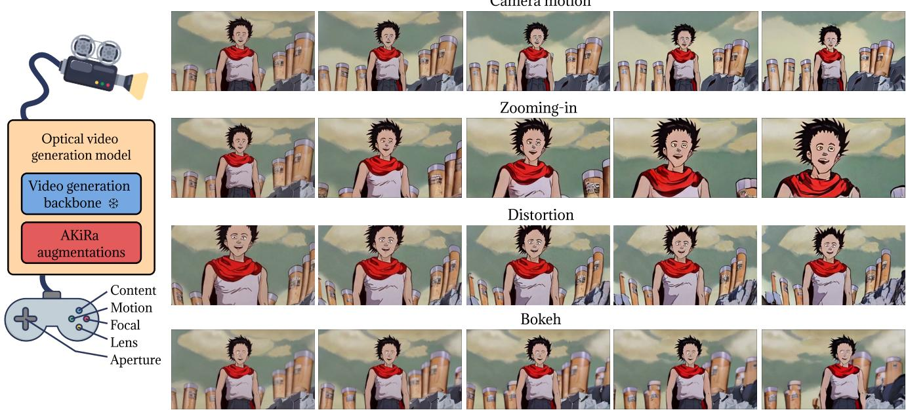  
Figure 1. While current state-of-the-art video generation approaches offer limited control to users on camera motion, we propose a dedicated data augmentation framework —AKiRa — to train an optical video generation model that provides users with a panel of controls on camera motions (top row), camera focal length (second row), lens distortion (third row), or bokeh (camera aperture and focus in bottom row). See more on our project page: https://www.lix.polytechnique.fr/vista/projects/2024\_akira\_wang.

## Abstract

Recent advances in text-conditioned video diffusion have greatly improved video quality. However, these methods offer limited or sometimes no control to users on camera aspects, including dynamic camera motion, zoom, distorted lens andfocus shifts. These motion and optical aspects are crucialfor adding controllability and cinematic elements to generation frameworks, ultimately resulting in visual content that draws focus, enhances mood, and guides emotions according to filmmakers’ controls. In this paper, we aim to close the gap between controllable video generation and camera optics. To achieve this, we propose AKiRa (Augmentation Kit on Rays), a novel augmentation framework that builds and trains a camera adapter with a complex camera model over an existing video generation backbone.

It enables fine-tuned control over camera motion as well as complex optical parameters (focal length, distortion, aperture) to achieve cinematic effects such as zoom, fisheye effect, and bokeh. Extensive experiments demonstrate AKiRa’s effectiveness in combining and composing camera optics while outperforming all state-of-the-art methods. This work sets a new landmark in controlled and optically enhanced video generation, paving the way for future optical video generation methods.

## 1. Introduction

Creating high-quality video sequences has always been a complex interplay between the content itself and the means, the camera, by which it is portrayed. A powerful narrative or stunning visual concept can only reach its full potential when the camera effectively translates it into moving images, capturing nuances through cinematic effects such as dynamic camera motions, zooms, distorted lenses, or intentional focus shifts. Such techniques add texture and depth, drawing the viewer’s eye to specific details, enhancing mood, and subtly guiding emotions. When mastered, they allow filmmakers to transform raw content into a rich, immersive experience that feels artful and purposeful.

Recently, video generation have gained notable popularity in the community [5, 17]. Researchers have focused on various aspects, such as improving generation quality [12, 40, 68], increasing resolution [22, 43] or enhancing the efficiency [1, 6, 53]. Despite the remarkable results of modern work in most aforementioned aspects, they often overlook the cinematic techniques, crucial for achieving realistic and immersive storytelling. To tackle this, some recent approaches [20, 55] provide some control over camera motion. Specifically, given raw camera poses and text, these methods generate video following the specified camera trajectory. However, all these approaches simplify the camera model to its motion alone and neglect crucial optical effects likefocal length (for zoom), lens distortion (fisheye effect), aperture and focus point (for focus shifts) for three reasons. First, most methods do not use any underlying camera model [12, 40, 68], and instead, they treat videos as a sequence of pixels; hence, despite excessive training, the underlying representations still lack visual coherency. Second, some recent works [20, 55] use simplistic camera models, treating videos as a sequence of posed cameras without lens effects; hence, lack control. Third, there is no adequate training data with optical effects or optical parameters meaning that methods cannot use the data to train for optical camera effects directly. Accounting for such optical parameters attached to the camera is essential, and their absence limits the generation of optically coherent video content and reduces the potential for cinematic quality.

To address the above limitations, we introduce the concept of optical video generation models — video generation models which are optically coherent and over which users can control the motion of the camera as well as its optical parameters such as focal length, lens distortion, aperture and focus point. Such a model requires the integration of optical effects into the generation pipeline so that camera and optical parameters are directly leveraged by the model.

To achieve this, we first propose to rely on a Plucker¨ coordinates to represent an image as a collection of camera rays [39, 63] to ensure coherency. We extend the diffusion-based video generation model of [20] by proposing an optically-enhanced camera representation with lens distortion and a dedicated aperture map to encode in- and out-of-focus regions in the screen. Second, we propose a dedicated framework, named AKiRa (Augmentation Kit on Rays), which exploits these extended camera ray representations to augment the training dataset, by simulating optical effects on input frames paired with corresponding optical parameters. With this data augmentation method, we then train a camera adapter on top of a pre-trained and frozen video generation backbone. As a result, we provide the first optical video generation framework capable of controlling optical camera parameters in addition to camera trajectories, allowing the creation of complex cinematographic effects. The work contributes to closing the gap between the level of control offered to designers in computer graphics worlds and the visual quality of video generative frameworks. We evaluate the generalization of our method across various video generation backbones and on a comprehensive benchmark with robust metrics. We show that our method disentangles camera parameters, specifically separating zoom from translational motion—an achievement not possible with other approaches, where these parameters remain intertwined. Finally, AKiRa outperforms state-of-theart methods —MotionCtrl [55] and CameraCtrl [20].

Our contributions are: (1) the first optical video generation framework, which offers the ability to control both camera motions and optics, enabling the generation of videos with complex optical effects (e.g. zoom, fisheye, focus shifts), (2) the design of a camera model representation including optical parameters expressed in a Plucker ¨ map, extended with an aperture map to model in- and outof-focus effect; (3) a joint camera-frame Augmentation Kit on Rays (AKiRa) modelling optical effects to enable the training of more controllable video generation models.

## 2. Related work

Our work contributes to the field of controllable video generation, which can be approached in two ways: in the first, the generation is guided by text, while in the second way, the generation is guided by camera and text. Another related area is virtual cinematography, which does not generate videos but instead focuses on entities within an existing environment, e.g. camera angles, lighting, and composition. Text-to-video generation (T2V). The first video diffusion model is introduced by [24], building on the success of image diffusion [13, 23, 45, 46]. Later, Imagen-Video [22] and Make-A-Video [43] introduced cascaded pixel-based diffusion models for high-definition video generation. To reduce training costs, some works [1, 6, 53] perform diffusion in latent space. Others [5, 7, 17, 50] fine-tune temporal adapters on 2D layers of pre-trained text-to-image models [41] using video datasets [3]. Recently, [33, 34, 68] explored transformer backbones (DiT) for scalability, while RIVER [12] and MovieGen [40] moved to flow matching, achieving state-of-the-art performance. These methods rely solely on text guidance, which is often sufficient for image generation. However, video generation requires additional complexity, incorporating temporal dynamics and camera behavior (motion and optics). To address this, we focus on enhancing camera controllability for video generation.

Camera-based T2V. First approaches of T2V [5, 17] fine-tune the video generation model using LoRA [25] to achieve categorical camera motion. Drawing inspiration from the conditional generation problem with auxiliary modules [14, 15, 36, 62, 64], some works [26, 52] condition models on motion maps to manage camera motion, while [56, 60] are restricted to predefined motion directions. Recent works [2, 9, 20, 55, 57, 67] directly integrate precise camera pose parameters into video generation: MotionCtrl [55] initiated by feeding raw camera poses into the model with a trainable adapter; CameraCtrl [20] expanded this work with Plucker coordinates, effectively linking camera¨ intrinsic and extrinsic parameters to image content through ray-based modelling. However, most research [20, 55, 57] focuses solely on camera motion, neglecting factors like focal length, distortion, aperture and focus point. Ignoring focal length, for example, causes current methods to confuse zoom effects with forward and backward translation, resulting in geometric differences [19]. Moreover, most work assumes a distortion-free camera model, limiting generation capacity, as lens distortions (e.g., fisheye effects) are common in artistic videos [4]. Finally, the aperture and focus point are also neglected, despite being powerful effects for guiding image focus. To address these, we propose an optical video generation model that incorporates a complex camera model into a video generation backbone and enables control of camera motion, focal length, distortion, aperture and focus point.

Virtual cinematography. Recent works explore methods for integrating cinematic and aesthetics into content generation, via camera control. For instance, [28, 29] synthesize camera trajectories with cinematic styles for 3D animations using reference clips. Cinematic transfer adapts cinematic features from reference clips to new scenes. JAWS [51] pioneered this by optimizing camera trajectories directly within a neural radiation field [35] to match visual cinematic features from a reference clip; follow-up works [8, 31, 54] further refined this, notably adding character re-targetting. Other recent works [10, 30] focus on camera trajectory generation using diffusion models conditioned on text prompts and character motion. In [10] they introduce a dataset of camera trajectories with text extracted from movies, grounding generated trajectories in cinematic features. Yet, these approaches require existing content (e.g. 3D environments [28, 29], clips [51]), thus limiting creative possibilities. This may prevent creators from generating new content, limiting stylistic exploration by encouraging repli cating cinematic features from references. Instead, we propose a method that enables cinematic control directly within video generation, removing the need for pre-existing content and expanding users’ creative freedom.

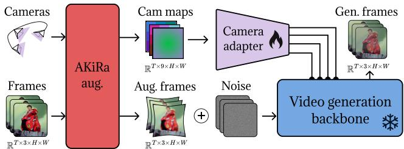  
Figure 2. Overview of AKiRa training. The camera adapter is trained by jointly augmenting camera data and frames using AKiRa augmentations. The adapter processes multiple camera parameters—motion, focal length, distortion, aperture, and focus point. This adapter is integrated into a pre-trained, frozen backbone, resulting in an optical video generation model.

## 3. Method

In this section, we present our approach for training an optical video generation model, enabling users to manipulate the camera’s motion as well as optics to produce cinematic effects such as zoom, distortion, and bokeh.

Overview. To train an optical video generation model capable of controlling both camera motion and optics, we require training data with associated camera parameters. Here, optics refer to the camera’s optical characteristics, including focal length, lens distortion, aperture and focus point, which together shape how the camera captures field-of-view (zoom), lens characteristics (distortion), and light exposure (in- or out-of-focus). Although some recent datasets pair videos with camera trajectories [10, 69], to our knowledge, there are no datasets that include videos with rich varying optical information. Hence, we propose a set of data augmentations based on a complex camera model that parameterizes optics (Section 3.1). To better disentangle each parameter, we design a highly expressive representation for our model (Section 3.2). Finally, we describe the augmentations to generate videos paired with optical parameters (Section 3.3). As illustrated in Figure 2, with these augmentations, we extend prior works [20, 55], by training a camera adapter that controls camera motion and optics on top of a pre-trained, frozen video generation backbone.

## 3.1. Camera model

To train an optical video generation model, we need a camera model to represent the camera parameters. Here we propose a camera model by relying on and extending the pinhole camera model to represent not only camera motion and focal length (pinhole camera model) but also the lens distortion and the aperture and focus point (distorted pinhole camera model with aperture), as described below.

Pinhole camera model. We build our camera model upon the standard pinhole camera model [18], which includes extrinsic and intrinsic camera parameters. The extrinsic parameters $\mathbf { P } \in \mathbb { R } ^ { 3 \times 4 }$ describe the position and orientation of the camera. They are composed of a rotation matrix $\mathbf { R } \in \ S O ( 3 )$ and translation vector $\textbf { t } \in \ \mathbb { R } ^ { 3 }$ , giving $\mathbf { P } = [ \mathbf { R } | \mathbf { t } ] \in S E ( 3 )$ . The intrinsic parameters $\mathbf { K } \in \mathbb { R } ^ { 3 \times 3 }$ include the principal point $\left( c _ { x } , c _ { y } \right)$ and the focal length $f \in \mathbb { R } ^ { + }$ . Specifically, $f$ controls the zoom-in (high f) and zoom-out (low f) capabilities of the camera (different from forward or backward translation), as shown in Figure 3b. Using this pinhole model, a 3D world point $\mathbf { X } \in \mathbb { R } ^ { \bar { 3 } }$ is projected to 2D pixel coordinates $( u , v ) \in \mathbb { R } ^ { 2 }$ as follows:

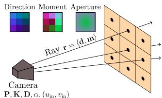

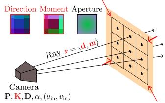

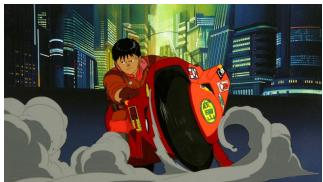  
(a) Base

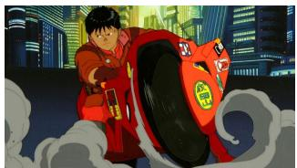  
(b) Focal length - Zoom

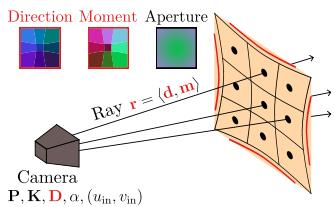

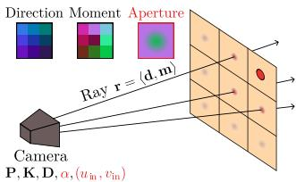

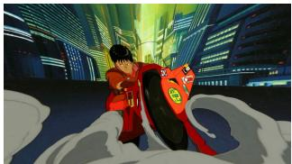  
(c) Lens - Distortion

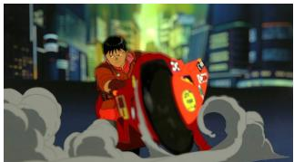  
(d) Aperture - Bokeh  
Figure 3. Optical effect overview. Visualization of various optical effects proposed in our system —zoom, distortion, and bokeh—and their impacts on both the camera parameters (top row) and visual output (bottom row). In addition, as with state-of-art techniques, we enable the control of the camera motion (not displayed here).

$$
\begin{array} { r } { \Big [ \begin{array} { l } { u } \\ { v } \\ { 1 } \end{array} \Big ] = \underbrace { \left[ \begin{array} { l l l l } { f _ { x } } & { 0 } & { c _ { x } } \\ { 0 } & { f _ { y } } & { c _ { y } } \\ { 0 } & { 0 } & { 1 } \end{array} \right] } _ { \mathrm { I n t r i n s i c ~ m a t r i x ~ P } } \underbrace { \left[ \begin{array} { l l l l } { \mathbf { R } } & { \mathbf { t } } \\ { 0 } & { 1 } \end{array} \right] } _ { \mathrm { E x t r i n s i c ~ m a t r i x ~ P } } \left[ \begin{array} { l } { X } \\ { 1 } \end{array} \right] . } \end{array}\tag{1}
$$

Distorted pinhole camera model. The pinhole model does not inherently account for lens distortion, as it assumes a lens-free setup. To represent more realistic cameras, we extend this model by adding radial distortion parameters $\textbf { D } \in \mathbb { R } ^ { 3 }$ [44] (e.g., the well-known fisheye lens with ultra-wide-angle distortion as shown in Figure 3c). These parameters adjust the pixel coordinates (u, v) radially to $( u _ { \mathbf { D } } , v _ { \mathbf { D } } ) \in \mathbb { R } ^ { 2 }$ with $r = \sqrt { ( u - c _ { x } ) ^ { 2 } + ( v - c _ { y } ) ^ { 2 } }$ , follow:

$$
\left[ \begin{array} { l } { u _ { \mathbf { D } } } \\ { v _ { \mathbf { D } } } \end{array} \right] = \left[ \begin{array} { l } { u } \\ { v } \end{array} \right] \left( \mathbf { 1 } _ { 3 } + \mathbf { D } \left[ r ^ { 2 } , r ^ { 4 } , r ^ { 6 } \right] \right) \ ,\tag{2}
$$

Distorted pinhole camera model with aperture. The standard pinhole model, with infinitely small aperture, does not capture depth-of-field effects. To simulate the bokeh $e f -$ fect—the appearance of in-focus and out-of-focus regions, as illustrated in Figure 3d—we introduce an aperture parameter $\alpha \in \mathbb { R }$ . This parameter, along with focus point $( u _ { \mathrm { i n } } , v _ { \mathrm { i n } } ) \in \mathbb { R } ^ { 2 }$ , controls bokeh intensity and location.

## 3.2. Camera model representation

Ray-based camera model representation. To train our optical video generation model, we require an effective camera representation that connects the optical properties of the camera to the generated visual content. For this, we map the geometric camera model (P, K, D) to screen pixels $( u , v ) \in \mathbb { R } ^ { 2 }$ (or patches in practice) using a ray representation r, where each pixel is associated with a ray (a line) passing through the camera’s centre $\mathbf { O } \in \mathbb { R } ^ { 3 }$

Plucker map.¨ We adopt the Plucker coordinates [¨ 39] to represent our camera model, as in [20, 63]. A ray $\mathbf { r } \ =$ $\langle \mathbf { d } , \mathbf { m } \rangle \in \mathbb { R } ^ { 6 }$ is represented by its direction d and its moment m about any point p on the ray, such that $\mathbf { m } = \mathbf { p } \times \mathbf { d } .$ The direction d is computed by reprojecting the pixel coordinates $( u , v )$ with camera parameters P and K, and the moment m is calculated by taking the camera centre O as the point p since all rays pass through O:

$$
\begin{array} { r } { \mathbf { d } = \mathbf { R } ^ { \top } \mathbf { K } ^ { - 1 } \left[ u _ { \mathbf { D } } , v _ { \mathbf { D } } , 1 \right] ^ { \top } , \quad \mathbf { m } = ( - \mathbf { R } ^ { \top } \mathbf { t } ) \times \mathbf { d } \mathbf { \Omega } . } \end{array}\tag{3}
$$

Plucker coordinates¨ m and d encode both information about the focal length K and lens distortion D, as these parameters are inherently linked to ray orientations, as shown in Figures 3b and 3c. For each frame, we derive direction and moment maps with the same dimensions as the frame, associating each pixel with a specific moment and direction. Aperture map. The camera’s aperture parameter ω is not captured by Plucker coordinates, as it is not directly ray-¨ related in the Pinhole model, as shown in Figure 3d. To address this, we introduce an aperture map with the same structure and dimensions as the direction and moment maps, assigning an aperture parameter to each pixel in the frame. To achieve this, we first define the coordinates of the focus point $( u _ { \mathrm { i n } } , v _ { \mathrm { i n } } )$ representing the sharpest point in the frame.

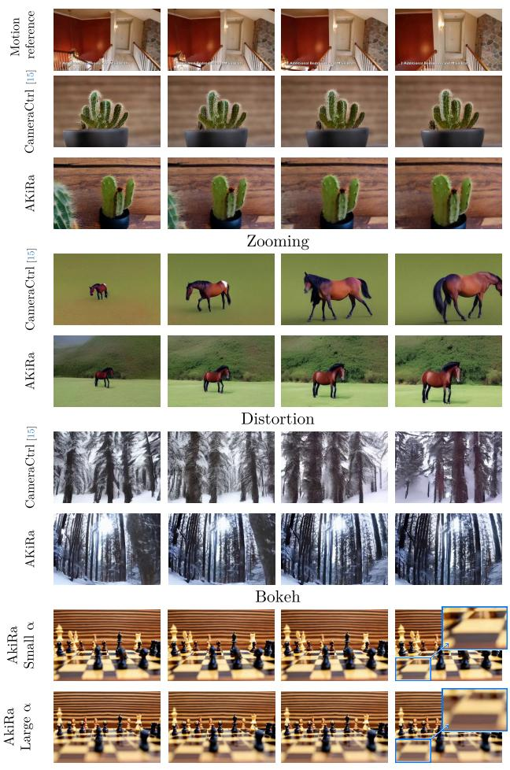  
(a) Animatediff [17]

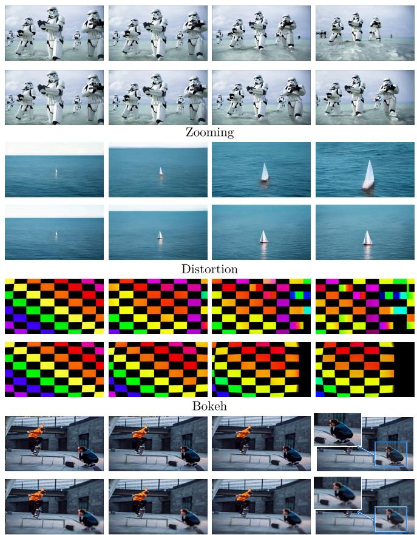  
(b) SVD [5]  
Figure 4. Qualitative results of AKiRa on Animatediff [17] and SVD [5] backbones. We recommend viewing the supplementary video.

We then define the per-pixel aperture map as $\mathbf { a } \in \mathbb { R } ^ { 3 }$ for any point (u, v) on the frame as:

$$
\mathbf { a } = \left[ ( u - u _ { \mathrm { i n } } ) , ( v - v _ { \mathrm { i n } } ) , \lVert ( u , v ) - ( u _ { \mathrm { i n } } , v _ { \mathrm { i n } } ) \rVert ^ { \frac { 1 } { \sigma ( \alpha ) } } \right] ^ { \top } \ .\tag{4}
$$

where $\sigma$ is the sigmoid function. We will discuss the aperture map in the supplementary materials.

Finally, each frame encodes camera information — direction, moment, and aperture $( \mathbf { d } , \mathbf { m } , \mathbf { a } ) \ - \ \mathrm { i n t o } \ \mathrm { ~ a ~ } \ 9 .$ dimensional camera map $\mathbb { R } ^ { 9 \times H \times W }$ matching the video frame dimensions.

## 3.3. AKiRa: Augmentation Kit on Rays

To augment and disentangle optical features in our extended Plucker camera model, we propose AKiRa, an Augmenta- ¨ tion Kit on Rays. It contains augmentation techniques for both video frames and corresponding optical parameters:

Zooming - focal length. For the zooming effect, we augment the focal length f in Equation 1 using a zooming factor $s \in \mathbb { R } ^ { + } ; s > 1$ represents a zoom-in effect, and $s < 1$ represents zoom-out, both proportional to s.

In image space, changing the focal length can be simulated by a center cropping and resizing the image back to its original resolution. This transformation modifies the image coordinates to (ufl, vfl) after the focal length change:

$$
u _ { \mathrm { f l } } = s \left( u - c _ { x } \right) + c _ { x } , \quad v _ { \mathrm { f l } } = s \left( v - c _ { y } \right) + c _ { y } ,\tag{5}
$$

where $( c _ { x } , c _ { y } )$ is the principal point of Equation 1. With the Plucker map aligned to image pixels, its augmentation can ¨ be performed using Equation 5 (see Figure 3b).

Focal length changes (zoom) are often mistaken for forward/backward movement. While zoom affects only the cropping area, translation induces perspective changes (see Figure 5). Such ambiguities can hinder the accurate interpretation of focal length changes and translational motion during training. Thus, augmenting focal length is essential to disambiguate these effects, reducing confusion between zooming and movement, and enabling richer optical compositionality: e.g. moving right while zooming in or moving forward while zooming out (commonly referred to as a dolly zoom), which are popular in modern cinematography. Distortion - lens. Augmentation on distortion involves modifying the radial distortion coefficients Das defined in Equation 2. In alignment with focal-length augmentation, this transformation is applied simultaneously to both the image and Plucker coordinates, as shown in Figure¨ 3c.

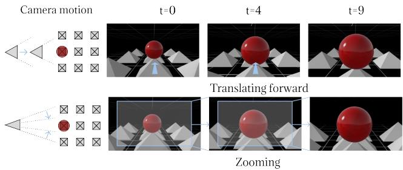  
Figure 5. Difference between zoom and push forward. Zooming (change of focal length) is similar to image cropping and resizing while pushing forward changes the perspective of the scene.

Directly augmenting distortion in image space can create undefined areas as the image stretches to a non-rectangular shape. To resolve this, we compute a zooming factor s to ensure the image can be cropped without undefined borders and incorporate this into the zooming augmentation.

Bokeh - aperture. The Bokeh effect depends on the aperture ω, the depth information of the scene and a focus point $( u _ { \mathrm { i n } } , v _ { \mathrm { i n } } )$ . More precisely, larger depth distances result in a larger blur radius $b _ { r } \in \mathbb { R }$ , which can be approximately described as [38, 61] with $d _ { \mathrm { i n } }$ the disparity value (invert depth) of the focus point: $b _ { r } = \alpha \left| d - d _ { \mathrm { i n } } \right|$ . We estimate depth [59] and then use virtual bokeh rendering [38, 61] based on $b _ { r }$ to augment both the aperture ω and focus point $( u _ { \mathrm { i n } } , v _ { \mathrm { i n } } )$ to simulate bokeh effects (Figure 3d).

Augmentation Algorithm Sampling. In our augmentation kit, we randomly sample parameters for every frame independently. However, direct random sampling may introduce flickering artifacts as between frames the number may change too fast, which is uncommon in the real-world and can harm the learning. To prevent this, we limit the rate of change between frames and ensure smooth transitions by applying spline interpolation to the sampled parameters.

Dropout. We also apply augmentation dropout to ensure that: (1) a certain percentage of the original video frames are used during training, and (2) the model learns specific combinations of augmentations effectively.

Algorithm. Our augmentation starts with bokeh using the pre-estimated depth, then applies distortion on the original images to use the maximum resolution, and followed by focal length changes, see more in the supplementary material.

## 4. Experiments

## 4.1. Evaluation metrics

For video quality of generated videos, we report the commonly used Frechet Inception Distance (´ FID) [21], Frechet Video Distance (´ FVD) [49]. Given that recent works [16, 58] point out that the FVD tends to be biased toward content while overlooking the temporal aspects, we propose to report the Content-Debiased FVD (CD-FVD) [16], considered more relevant.

Evaluating camera motion fidelity is challenging for generated content. Some approaches use SLAM and pose estimation methods [37, 42, 65] to evaluate the estimated trajectory from generated video content (MotionCtrl [55], CameraCtrl [20]). However, these often assume (partial) static consistency, which is hard to maintain in the generated content due to flickering or unrealistic motion artefacts but irrelevant to motion quality; (ii) the absence of precise camera model definitions (e.g., focal length, distortion) further complicates trajectory-based assessments [32, 47] given that optic parameters greatly influence motion interpretation; (iii) trajectory-based methods are computationally intensive (can reach 10 minutes per 16-frame video [65]) and struggle to scale efficiently for large-scale video assessments. See motion evaluation in supplementary materials.

Therefore, to show the camera motion fidelity towards the control we report two metrics: first, following [20, 55] reporting trajectory errors, we estimate dense camera poses using ParticleSfM [65] but calculate scale-corrected rotational and translational relative pose errors between frames (RPE-R and RPE-t, respectively). The choice of using scale correction and relative pose aims at reducing the unstable estimation of trajectory-based metrics [32, 47].

Additionally, to measure motion alignment between reference and generated videos we propose a flow similarity metric (FlowSim). This metric relies less on camera model parameters and focuses primarily on frame-to-frame motion. Moreover, the optical flow-based approach is computationally efficient and scalable with GPU parallelism. For this, we estimate the optical flow of both videos $\mathbf { F } _ { r }$ and $\mathbf { F } _ { g }$ using RAFT [48], then extract the flow magnitude F and direction $\varphi .$ To filter out residual noise, we consider only flow components with a magnitude above a set threshold $t ,$ and we compute the cosine similarity of the directional components as follows, with 1 an indicator function:

$$
\mathrm { F l o w S i m } ( \mathbf { F } _ { r } , \mathbf { F } _ { g } ) = \mathbb { 1 } _ { \| \mathbf { F } _ { r } \| \& \| \mathbf { F } _ { \mathbf { r } } \| > t } \cdot \boldsymbol { \varphi } _ { r } \cdot \boldsymbol { \varphi } _ { g } ,\tag{6}
$$

Dynamic consistency (VBench). We also assess the temporal dynamic consistency of generated videos with the subject consistency (Consistency), smoothness (Smoothness) and temporal flickering (Flickering) metrics proposed in the video benchmark suite VBench [27].

<table><tr><td colspan="2">Method</td><td colspan="3">Video quality</td><td colspan="3">Camera motion fidelity</td><td colspan="3">Dynamic consistency (VBench)</td></tr><tr><td>Backbone</td><td>Camera control</td><td>FID↓</td><td>FVD↓</td><td>CD-FVD ↓</td><td>RPE-R (deg)↓</td><td>RPE-t (cm)↓</td><td>FlowSim ↑</td><td>Consistency ↑</td><td>Smoothness ↑</td><td>Flickering↑</td></tr><tr><td></td><td></td><td>65.09</td><td>835.2</td><td>768.6</td><td>4.354</td><td>3.048</td><td>0.00</td><td>0.845</td><td>0.843</td><td>0.792</td></tr><tr><td></td><td>MotionCtrl [55]</td><td>104.64</td><td>822.9</td><td>449.7</td><td>0.443</td><td>1.857</td><td>58.50</td><td>0.961</td><td>0.965</td><td>0.939</td></tr><tr><td>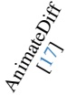</td><td>CameraCtrl [20]</td><td>61.62</td><td>384.5</td><td>355.2</td><td>0.730</td><td>1.807</td><td>53.74</td><td>0.965</td><td>0.960</td><td>0.942</td></tr><tr><td></td><td>AKiRa (ours)</td><td>61.52</td><td>332.3</td><td>328.7</td><td>0.438</td><td>1.480</td><td>70.97</td><td>0.969</td><td>0.974</td><td>0.957</td></tr><tr><td></td><td></td><td>29.94</td><td>351.0</td><td>440.8</td><td>1.837</td><td>2.541</td><td>0.56</td><td>0.916</td><td>0.959</td><td>0.930</td></tr><tr><td></td><td>MotionCtrl [55]</td><td>57.09</td><td>217.3</td><td>460.8</td><td>1.705</td><td>1.343</td><td>11.96</td><td>0.916</td><td>0.979</td><td>0.950</td></tr><tr><td>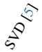</td><td>CameraCtrl [20]</td><td>32.32</td><td>173.8</td><td>424.9</td><td>0.329</td><td>1.322</td><td>79.64</td><td>0.972</td><td>0.991</td><td>0.969</td></tr><tr><td></td><td>AKiRa (ours)</td><td>32.58</td><td>162.8</td><td>398.3</td><td>0.295</td><td>1.321</td><td>80.11</td><td>0.981</td><td>0.993</td><td>0.975</td></tr></table>

Table 1. Comparison with the state-of-the-art. Comparison of AKiRa and concurrent methods with different backbones on WebVid dataset, evaluating video quality, camera motion fidelity, and dynamic consistency. First best and second best

Optical consistency. To evaluate zoom (ZoomSim) and distortion (DistortSim), we use FlowSim to measure the similarity between generated and theoretical optical flow (see supplementary materials). For evaluating bokeh effects, inspired by [11], we use an off-the-shelf defocus detector [66] and report the in-focus area (FocusArea) across varying aperture levels: a low aperture results in a wide in-focus area (everything appears in focus), while a high aperture produces a narrow in-focus area, showing selective focus.

## 4.2. Quantitative comparison

Comparison to the state of the art. Table 1 reports the performance of AKiRa against state-of-the-art camera control approaches for video generation: MotionCtrl [55] and CameraCtrl [20]. We evaluate video quality, camera motion fidelity and temporal dynamic consistency metrics (Section 4.1) for text-to-video (T2V) backbone Animatediff [17] and image-to-video (I2V) backbone SVD [5], also reporting baselines without any camera control module (-). All metrics are computed on 1, 000 generated samples using random text prompts or conditioning frames from the WebVid dataset [3]. For AKiRa, as we explicitly control the bokeh, to improve the realism of the generated results, we set ω = 50 (see discussion in supplementary materials).

In video quality, AKiRa achieves leading performance across quality, camera motion fidelity, and dynamic consistency metrics, outperforming other state-of-the-art methods. Especially, for FVD and CD-FVD, AKiRa scores best with both AnimateDiff (332.3, 328.7) and SVD (162.8, 398.3), outperforming CameraCtrl’s 384.5 and 355.2 on AnimateDiff, and 173.8 and 424.9 on SVD.

For camera motion fidelity, we observe that: (1) AKiRa achieves the highest FlowSim scores (AnimateDiff: 70.97; SVD: 80.11), ahead of MotionCtrl 58.50 with AnimateDiff, and CameraCtrl 79.64 with SVD, and lowest motion errors, both translational and rotational (0.438 and 1.480 on Animatediff); (2) the proposed metric, FlowSim, assigned close to zero values to random motion, thus proportionally reflecting camera pose errors with improved interpretability.

For dynamic consistency, AKiRa leads in VBench scores, e.g. achieving 0.969, 0.974, 0.957 on AnimateDiff, and 0.981, 0.993, 0.975 on SVD. These results validate that disentangling camera components during training enables high-quality and consistent video synthesis.

Optical comparison. In Table 3, we show the optical consistency performances (Section 4.1). We focus on CameraCtrl [20] since its ray-based representation supports zoom and distortion effects, though does not account for bokeh, whereas MotionCtrl [55] lacks these effects due to its camera model. We also report raw Animatediff [17] as the baseline without any control module (-). We generate dedicated datasets of 1,000 samples for each category. For zoom and distortion, we create static motion videos with random zoom-in/zoom-out effects and distortions. For bokeh, we generate 1,000 samples with varying apertures (ω=0/30/100). Table 3 highlights that AKiRa outperforms both AnimateDiff and CameraCtrl in optical coherence metrics, achieves the highest ZoomSim and DistortSim scores (86.82 and 81.19), showing superior zoom and distortion handling compared to CameraCtrl. In terms of bokeh, we observe a decreasing trend of the FocusArea with increasing aperture ω from 0 to 100, confirming the controllability of the aperture feature (a larger aperture results in a bigger bokeh area). These results highlight AKiRa’s ability to control zoom, distortion, and focus effects.

User study. We conducted a user study with 25 participants, evaluating (1) video, (2) text-to-video, (3) motion, (4) zoom, (5) distortion effect, and (6) bokeh effect qualities. Participants viewed 10 samples, with each generated by: the baseline (no camera control module), MotionCtrl [55], CameraCtrl [20], and our AKiRa, both the Animatediff [17] and SVD [5] backbones. For each criterion, participants ranked the methods from 1 (best) to 4 (worst).

In Table 2 we report the proportion of participants ranking each method as 1st across various criteria (with 25% as a random baseline). Results show that AKiRa consistently ranks highest, with an average ranking proportion of 44.2%, compared to 29.2% for the next best method, CameraCtrl [20]. Specifically, 43.6% of participants preferred CameraCtrl’s zoom effect, followed closely by AKiRa at 35.6%.

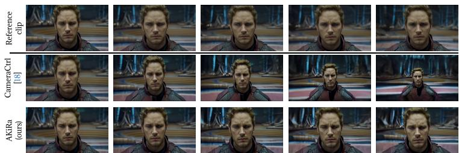

Figure 6. Comparison of dolly zoom effect on SVD (I2V) [5] backbone between AKiRa, CameraCtrl[20] and the reference from Guardians of the Galaxy Vol. 2 (Gunn, 2017). Note that the background recedes while the character remains static.
<table><tr><td>Method</td><td>Video</td><td>Text</td><td>Motion</td><td>Zoom</td><td>Distortion</td><td>Bokeh</td><td>Average</td></tr><tr><td>Baseline [5, 17]</td><td>13.2</td><td>11.2</td><td>7.2</td><td>4.0</td><td>8.4</td><td>7.2</td><td>8.5</td></tr><tr><td>MotionCtrl [55]</td><td>27.6</td><td>6.4</td><td>21.6</td><td>16.8</td><td>18.8</td><td>17.6</td><td>18.1</td></tr><tr><td>CameraCtrl [20]</td><td>19.6</td><td>27.2</td><td>23.6</td><td>43.6</td><td>29.6</td><td>31.6</td><td>29.2</td></tr><tr><td>AKiRa (ours)</td><td>39.6</td><td>55.2</td><td>47.6</td><td>35.6</td><td>43.2</td><td>43.6</td><td>44.2</td></tr></table>

Table 2. Results of user study. % participants ranking each method as 1st for: Video quality, Text-to-video consistency, motion fidelity, and optical coherence (Zoom, Distortion, Bokeh). First best and second best

This preference likely stems from CameraCtrl’s overly fast and impactful zoom effect, though it lacks subject consistency upon closer inspection (see Section 4.3 and Figure 4). Overall, AKiRa notably enhances the aesthetic quality of the backbone, with 39.6% and 55.2% of participants ranking it 1st for video quality and text-video consistency, compared to only 13.2% and 11.2% for the baselines.

Ablation study. In Table 4, we analyze the impact of each augmentation in AKiRa on overall model performance. For each augmentation combination, we train a model using the Animatediff [17] backbone. The results show that applying all augmentations yields the best performances in both visual (CD-FVD) and motion (FlowSim) quality. The strong performance of distortion with bokeh (second-to-last row) is due to the cropping and rescaling process intrinsic to distortion augmentation (see Sec. 3), which implicitly works as a focal length adjustment, leading to comparable results. Additionally, the high FlowSim score for bokeh-only augmentation (fourth row) might be due to overly smoothed content, which implicitly improves the similarity measure.

## 4.3. Qualitative results

Qualitative comparison. In Figure 4 we present a qualitative comparison of the various effects—motion, zoom, distortion, and bokeh—between AKiRa and CameraCtrl [20], using both the Animatediff [17] and SVD [5] backbones. For motion (first part), AKiRa accurately reproduces reference motion from the RealEstate dataset [69] across both backbones. In zooming (second part), our method demonstrates better consistency, while CameraCtrl struggles; for example, in the SVD examples (second part, second column), AKiRa maintains the boat’s position and orientation, unlike CameraCtrl, where the boat shows deformation. In terms of distortion (third part), CameraCtrl fails to achieve this effect, whereas AKiRa successfully applies it; for instance, in the Animatediff example (third part, first column), the tree trunks visibly distort. Lastly, for the bokeh effect (fourth part), AKiRa adds adjustable out-of-focus blur. In the Animatediff example (fourth part, first column), for instance, the foreground of the chessboard displays varying blur levels depending on the aperture.

<table><tr><td>Method</td><td>ZoomSim ↑</td><td>DistortSim ↑</td><td>FocusArea α=0α=30α=100</td><td></td></tr><tr><td>AnimateDiff [17]</td><td>0.00</td><td>0.00</td><td>0.90</td><td>一</td></tr><tr><td>CameraCtrl [20]</td><td>78.98</td><td>62.13</td><td>0.69</td><td></td></tr><tr><td>AKiRa (ours)</td><td>86.82</td><td>81.19</td><td>0.72 0.64</td><td>0.61</td></tr></table>

Table 3. Optical comparison of AKiRa and CameraCtrl [20] with Animatediff [17] backbone on WebVid, evaluating optical coherence (zoom, distortion and bokeh).
<table><tr><td>Focal Lens Aperture</td><td></td><td>CD-FVD ↓ FlowSim ↑</td><td></td></tr><tr><td rowspan="5">√ √</td><td></td><td>355.2</td><td>53.74</td></tr><tr><td></td><td>351.2</td><td>67.25</td></tr><tr><td></td><td>360.1</td><td>71.82</td></tr><tr><td>√</td><td>375.8</td><td>73.27</td></tr><tr><td></td><td>359.4</td><td>66.86</td></tr><tr><td>√</td><td>√ √</td><td>332.7</td><td>62.93</td></tr><tr><td>√</td><td></td><td>331.0</td><td>71.97</td></tr><tr><td>√</td><td>√ √</td><td>328.7</td><td>70.97</td></tr></table>

Table 4. Ablation of augmentations. Ablation of each augmentation combination in AKiRa. All models are trained on Animatediff [17] backbone.

A special case: dolly zoom. A dolly zoom is an iconic cinematic effect that produces a dramatic perspective shift, achieved by simultaneously pulling while zooming in the reverse direction. We show in Figure 6 that AKiRa successfully reproduces the dolly zoom effect, whereas CameraCtrl [20] achieves only a pure zoom-out effect. This is due to AKiRa ’s precise disentangling of key camera parameters, especially focal length and camera position. We recommend viewing the supplementary video.

## 5. Conclusion

In this paper, we introduce the concept of optical video generation, a framework that allows users to control camera motions as well as optical parameters. We trained a dedicated camera adapter using a set of data augmentation techniques —AKiRa — that pairs camera/lens parameters with corresponding videos. Results show that our framework generates optically coherent content, outperforming stateof-the-art approaches while offering extra control. AKiRa expands the possibilities of video generation and bridges the gap between synthetic and real-world capabilities.

## Acknowledgments

This work was supported by ANR-22-CE23-0007, ANR-22-CE39-0016, Hi!Paris grant and fellowship, DATAIA Convergence Institute as part of the “Programme d’Investissement d’Avenir” (ANR-17-CONV-0003) operated by Ecole Polytechnique, IP Paris, and was granted access to the IDRIS high-performance Computing (HPC) resources under the allocation 2024-AD011014300R1 made by GENCI.

## References

[1] An, J., Zhang, S., Yang, H., Gupta, S., Huang, J.B., Luo, J., Yin, X.: Latent-shift: Latent diffusion with temporal shift for efficient text-to-video generation. arXiv preprint arXiv:2304.08477 (2023) 2

[2] Bahmani, S., Skorokhodov, I., Siarohin, A., Menapace, W., Qian, G., Vasilkovsky, M., Lee, H.Y., Wang, C., Zou, J., Tagliasacchi, A., et al.: Vd3d: Taming large video diffusion transformers for 3d camera control. arXiv preprint arXiv:2407.12781 (2024) 3

[3] Bain, M., Nagrani, A., Varol, G., Zisserman, A.: Frozen in time: A joint video and image encoder for end-to-end retrieval. In: ICCV (2021) 2, 7

[4] Bertalm´ıo, M.: Image processing for cinema. CRC Press (2014) 3

[5] Blattmann, A., Dockhorn, T., Kulal, S., Mendelevitch, D., Kilian, M., Lorenz, D., Levi, Y., English, Z., Voleti, V., Letts, A., et al.: Stable video diffusion: Scaling latent video diffusion models to large datasets. arXiv preprint arXiv:2311.15127 (2023) 2, 3, 5, 7, 8

[6] Blattmann, A., Rombach, R., Ling, H., Dockhorn, T., Kim, S.W., Fidler, S., Kreis, K.: Align your latents: High-resolution video synthesis with latent diffusion models. In: CVPR (2023) 2

[7] Chen, H., Xia, M., He, Y., Zhang, Y., Cun, X., Yang, S., Xing, J., Liu, Y., Chen, Q., Wang, X., et al.: Videocrafter1: Open diffusion models for high-quality video generation. arXiv preprint arXiv:2310.19512 (2023) 2

[8] Chen, W., Liu, F., Wu, D., Sun, H., Song, H., Duan, Y.: Dreamcinema: Cinematic transfer with free camera and 3d character. arXiv preprint arXiv:2408.12601 (2024) 3

[9] Cheong, S.Y., Ceylan, D., Mustafa, A., Gilbert, A., Huang, C.H.P.: Boosting camera motion control for video diffusion transformers. arXiv preprint arXiv:2410.10802 (2024) 3

[10] Courant, R., Dufour, N., Wang, X., Christie, M., Kalogeiton, V.: E.T. the Exceptional Trajectories: textto-camera-trajectory generation with character awareness. In: ECCV (2024) 3

[11] Courant, R., Lino, C., Christie, M., Kalogeiton, V.: High-level features for movie style understanding. In: ICCV-W (2021) 7

[12] Davtyan, A., Sameni, S., Favaro, P.: Efficient video prediction via sparsely conditioned flow matching. In: ICCV (2023) 2

[13] Dhariwal, P., Nichol, A.: Diffusion models beat gans on image synthesis. NeurIPS (2021) 2

[14] Dufour, N., Picard, D., Kalogeiton, V.: Scam! transferring humans between images with semantic cross attention modulation. In: ECCV. Springer (2022) 3

[15] Gauthier, J.: Conditional generative adversarial nets for convolutional face generation. Class project for Stanford CS231N: convolutional neural networks for visual recognition, Winter semester (2014) 3

[16] Ge, S., Mahapatra, A., Parmar, G., Zhu, J.Y., Huang, J.B.: On the content bias in frechet video distance. In:´ CVPR (2024) 6

[17] Guo, Y., Yang, C., Rao, A., Liang, Z., Wang, Y., Qiao, Y., Agrawala, M., Lin, D., Dai, B.: Animatediff: Animate your personalized text-to-image diffusion models without specific tuning. In: ICLR (2023) 2, 3, 5, 7, 8

[18] Hartley, R.I., Zisserman, A.: Multiple View Geometry in Computer Vision. Cambridge University Press (2004) 3

[19] Hartley, R., Zisserman, A.: Multiple view geometry in computer vision. Cambridge university press (2003) 3

[20] He, H., Xu, Y., Guo, Y., Wetzstein, G., Dai, B., Li, H., Yang, C.: Cameractrl: Enabling camera control for text-to-video generation. arXiv preprint arXiv:2404.02101 (2024) 2, 3, 4, 6, 7, 8

[21] Heusel, M., Ramsauer, H., Unterthiner, T., Nessler, B., Hochreiter, S.: Gans trained by a two time-scale update rule converge to a local nash equilibrium. NeurIPS (2017) 6

[22] Ho, J., Chan, W., Saharia, C., Whang, J., Gao, R., Gritsenko, A., Kingma, D.P., Poole, B., Norouzi, M., Fleet, D.J., et al.: Imagen video: High definition video generation with diffusion models. arXiv preprint arXiv:2210.02303 (2022) 2

[23] Ho, J., Jain, A., Abbeel, P.: Denoising diffusion probabilistic models. NeurIPS (2020) 2

[24] Ho, J., Salimans, T., Gritsenko, A., Chan, W., Norouzi, M., Fleet, D.J.: Video diffusion models. NeurIPS (2022) 2

[25] Hu, E.J., Wallis, P., Allen-Zhu, Z., Li, Y., Wang, S., Wang, L., Chen, W., et al.: Lora: Low-rank adaptation of large language models. In: ICLR (2022) 3

[26] Hu, T., Zhang, J., Yi, R., Wang, Y., Huang, H., Weng, J., Wang, Y., Ma, L.: Motionmaster: Training-free camera motion transfer for video generation. arXiv preprint arXiv:2404.15789 (2024) 3

[27] Huang, Z., He, Y., Yu, J., Zhang, F., Si, C., Jiang, Y., Zhang, Y., Wu, T., Jin, Q., Chanpaisit, N., et al.: Vbench: Comprehensive benchmark suite for video generative models. In: CVPR (2024) 6

[28] Jiang, H., Christie, M., Wang, X., Liu, L., Wang, B., Chen, B.: Camera keyframing with style and control. ACM TOG (2021) 3

[29] Jiang, H., Wang, B., Wang, X., Christie, M., Chen, B.: Example-driven virtual cinematography by learning camera behaviors. ACM TOG (2020) 3

[30] Jiang, H., Wang, X., Christie, M., Liu, L., Chen, B.: Cinematographic camera diffusion model. In: Computer Graphics Forum (2024) 3

[31] Jiang, X., Rao, A., Wang, J., Lin, D., Dai, B.: Cinematic behavior transfer via nerf-based differentiable filming. In: CVPR (2024) 3

[32] Jinyu, L., Bangbang, Y., Danpeng, C., Nan, W., Guofeng, Z., Hujun, B.: Survey and evaluation of monocular visual-inertial slam algorithms for augmented reality. Virtual Reality & Intelligent Hardware (2019) 6

[33] Ma, X., Wang, Y., Jia, G., Chen, X., Liu, Z., Li, Y.F., Chen, C., Qiao, Y.: Latte: Latent diffusion transformer for video generation. arXiv preprint arXiv:2401.03048 (2024) 2

[34] Menapace, W., Siarohin, A., Skorokhodov, I., Deyneka, E., Chen, T.S., Kag, A., Fang, Y., Stoliar, A., Ricci, E., Ren, J., et al.: Snap video: Scaled spatiotemporal transformers for text-to-video synthesis. In: CVPR (2024) 2

[35] Mildenhall, B., Srinivasan, P., Tancik, M., Barron, J., Ramamoorthi, R., Ng, R.: Nerf: Representing scenes as neural radiance fields for view synthesis. In: ECCV (2020) 3

[36] Van den Oord, A., Kalchbrenner, N., Espeholt, L., Vinyals, O., Graves, A., et al.: Conditional image generation with pixelcnn decoders. NeurIPS (2016) 3

[37] Pan, L., Barath, D., Pollefeys, M., Sch´ onberger, J.L.:¨ Global structure-from-motion revisited. In: ECCV (2024) 6

[38] Peng, J., Cao, Z., Luo, X., Lu, H., Xian, K., Zhang, J.: Bokehme: When neural rendering meets classical rendering. In: CVPR (2022) 6

[39] Plucker, J.: Analytisch-geometrische Entwicklungen. ¨ GD Baedeker (1828) 2, 4

[40] Polyak, A., Zohar, A., Brown, A., Tjandra, A., Sinha, A., Lee, A., Vyas, A., Shi, B., Ma, C.Y., Chuang, C.Y., et al.: Movie gen: A cast of media foundation models. arXiv preprint arXiv:2410.13720 (2024) 2

[41] Rombach, R., Blattmann, A., Lorenz, D., Esser, P., Ommer, B.: High-resolution image synthesis with latent diffusion models. In: CVPR (2022) 2

[42] Schonberger, J.L., Frahm, J.M.: Structure-frommotion revisited. In: CVPR (2016) 6

[43] Singer, U., Polyak, A., Hayes, T., Yin, X., An, J., Zhang, S., Hu, Q., Yang, H., Ashual, O., Gafni, O., et al.: Make-a-video: Text-to-video generation without text-video data. arXiv preprint arXiv:2209.14792 (2022) 2

[44] Slama, C.C., Theurer, C., Henriksen, S.W.: Manual of photogrammetry. American Society of Photogrammetry (1980) 4

[45] Sohl-Dickstein, J., Weiss, E., Maheswaranathan, N., Ganguli, S.: Deep unsupervised learning using nonequilibrium thermodynamics. In: ICML (2015) 2

[46] Song, Y., Ermon, S.: Improved techniques for training score-based generative models. NeurIPS (2020) 2

[47] Sturm, J., Engelhard, N., Endres, F., Burgard, W., Cremers, D.: A benchmark for the evaluation of rgb-d slam systems. In: Proc. IEEE/RSJ Conf. on Intelligent Robots and Systems (2012) 6

[48] Teed, Z., Deng, J.: Raft: Recurrent all-pairs field transforms for optical flow. In: ECCV (2020) 6

[49] Unterthiner, T., Van Steenkiste, S., Kurach, K., Marinier, R., Michalski, M., Gelly, S.: Towards accurate generative models of video: A new metric & challenges. arXiv preprint arXiv:1812.01717 (2018) 6

[50] Wang, J., Yuan, H., Chen, D., Zhang, Y., Wang, X., Zhang, S.: Modelscope text-to-video technical report. arXiv preprint arXiv:2308.06571 (2023) 2

[51] Wang, X., Courant, R., Shi, J., Marchand, E., Christie, M.: Jaws: just a wild shot for cinematic transfer in neural radiance fields. In: CVPR (2023) 3

[52] Wang, X., Yuan, H., Zhang, S., Chen, D., Wang, J., Zhang, Y., Shen, Y., Zhao, D., Zhou, J.: Videocomposer: Compositional video synthesis with motion controllability. NeurIPS (2024) 3

[53] Wang, Y., Chen, X., Ma, X., Zhou, S., Huang, Z., Wang, Y., Yang, C., He, Y., Yu, J., Yang, P., et al.: Lavie: High-quality video generation with cascaded latent diffusion models. arXiv preprint arXiv:2309.15103 (2023) 2

[54] Wang, Z., Li, Y., Zeng, Y., Fang, Y., Guo, Y., Liu, W., Tan, J., Chen, K., Xue, T., Dai, B., et al.: Humanvid: Demystifying training data for cameracontrollable human image animation. arXiv preprint arXiv:2407.17438 (2024) 3

[55] Wang, Z., Yuan, Z., Wang, X., Li, Y., Chen, T., Xia, M., Luo, P., Shan, Y.: Motionctrl: A unified and flexible motion controller for video generation. In: SIG-GRAPH (2024) 2, 3, 6, 7, 8

[56] Wu, J., Li, X., Zeng, Y., Zhang, J., Zhou, Q., Li, Y., Tong, Y., Chen, K.: Motionbooth: Motion-aware customized text-to-video generation. CoRR (2024) 3

[57] Xu, D., Nie, W., Liu, C., Liu, S., Kautz, J., Wang, Z., Vahdat, A.: Camco: Camera-controllable 3dconsistent image-to-video generation. arXiv preprint arXiv:2406.02509 (2024) 3

[58] Ya, G., Favero, G., Luo, Z.H., Jolicoeur-Martineau, A., Pal, C., et al.: Beyond fvd: Enhanced evaluation metrics for video generation quality. arXiv preprint arXiv:2410.05203 (2024) 6

[59] Yang, L., Kang, B., Huang, Z., Zhao, Z., Xu, X., Feng, J., Zhao, H.: Depth anything v2. arXiv preprint arXiv:2406.09414 (2024) 6

[60] Yang, S., Hou, L., Huang, H., Ma, C., Wan, P., Zhang, D., Chen, X., Liao, J.: Direct-a-video: Customized video generation with user-directed camera movement and object motion. In: SIGGRAPH (2024) 3

[61] Yang, Y., Lin, H., Yu, Z., Paris, S., Yu, J.: Virtual dslr: High quality dynamic depth-of-field synthesis on mobile platforms. Electronic Imaging (2016) 6

[62] Ye, H., Zhang, J., Liu, S., Han, X., Yang, W.: Ip-adapter: Text compatible image prompt adapter for text-to-image diffusion models. arXiv preprint arXiv:2308.06721 (2023) 3

[63] Zhang, J.Y., Lin, A., Kumar, M., Yang, T.H., Ramanan, D., Tulsiani, S.: Cameras as rays: Pose estimation via ray diffusion. In: ICLR (2024) 2, 4

[64] Zhang, L., Rao, A., Agrawala, M.: Adding conditional control to text-to-image diffusion models. In: ICCV (2023) 3

[65] Zhao, W., Liu, S., Guo, H., Wang, W., Liu, Y.J.: Particlesfm: Exploiting dense point trajectories for localizing moving cameras in the wild. In: ECCV (2022) 6

[66] Zhao, W., Wei, F., Wang, H., He, Y., Lu, H.: Fullscene defocus blur detection with defbd+ via multilevel distillation learning. IEEE Transactions on Multimedia (2023) 7

[67] Zheng, G., Li, T., Jiang, R., Lu, Y., Wu, T., Li, X.: Cami2v: Camera-controlled image-to-video diffusion model. arXiv preprint arXiv:2410.15957 (2024) 3

[68] Zheng, Z., Peng, X., Yang, T., Shen, C., Li, S., Liu, H., Zhou, Y., Li, T., You, Y.: Open-sora: Democratizing efficient video production for all (2024), https:// github.com/hpcaitech/Open-Sora 2

[69] Zhou, T., Tucker, R., Flynn, J., Fyffe, G., Snavely, N.: Stereo magnification: Learning view synthesis using multiplane images. ACM TOG (2018) 3, 8