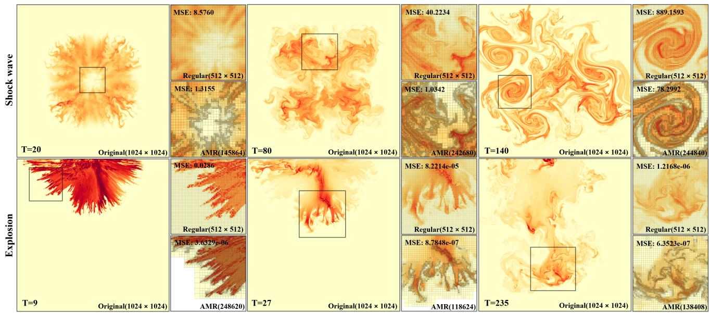
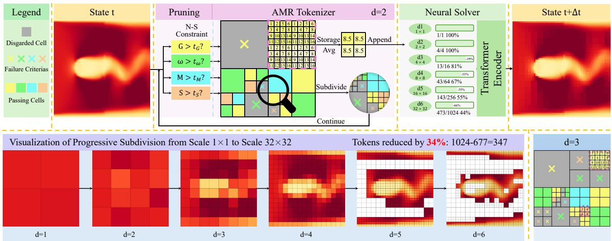
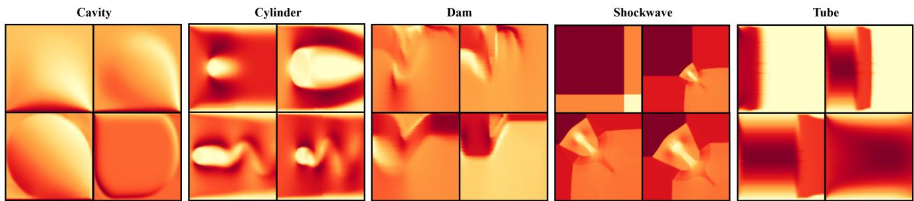

# AMR-Transformer: Enabling Efficient Long-range Interaction for Complex Neural Fluid Simulation

Zeyi Xu2\* Jinfan Liu1\* Kuangxu Chen3 Ye Chen1 Zhangli Hu1 Bingbing Ni1† 1Shanghai Jiao Tong University 2Shanghai University 3Shenzhen Technology University xzyblxa@shu.edu.cn {ljf 2024, nibingbing}@sjtu.edu.cn https://github.com/JfanLiu/AMR Transformer

  
Figure 1. AMR tokenizer results in high-resolution simulation. Visualization of the AMR tokenizer applied to 1024 × 1024 shock wave and explosion simulations. The AMR tokenizer captures fine-scale structures while reducing token count. Right panels compare the regular 512 × 512 grid with the AMR partitioning, each right panel displays the total cell count and partitioning scheme (bottom-right), along with the mean squared error (MSE) relative to the 1024 × 1024 ground truth (top-left)

## Abstract

Accurately and efficiently simulating complex fluid dynamics is a challenging task that has traditionally relied on computationally intensive methods. Neural network-based approaches, such as convolutional and graph neural networks, have partially alleviated this burden by enabling efficient local feature extraction. However, they struggle to capture long-range dependencies due to limited receptive fields, and Transformer-based models, while providing

global context, incur prohibitive computational costs. To tackle these challenges, we propose AMR-Transformer, an efficient and accurate neural CFD-solving pipeline that integrates a novel adaptive mesh refinement scheme with a Navier-Stokes constraint-aware fast pruning module. This design encourages long-range interactions between simulation cells and facilitates the modeling of global fluid wave patterns, such as turbulence and shockwaves. Experiments show that our approach achieves significant gains in efficiency while preserving critical details, making it suitable for high-resolution physical simulations with long-range dependencies. On CFDBench, PDEBench and a new shock-

wave dataset, our pipeline demonstrates up to an order-ofmagnitude improvement in accuracy over baseline models. Additionally, compared to ViT, our approach achieves a reduction in FLOPs ofup to 60 times.

## 1. Introduction

The use of artificial intelligence methods for solving partial differential equations (PDEs) has become increasingly prevalent in computational fluid dynamics (CFD), a field with critical applications in science and engineering, including turbulence modeling, airfoil design, and micromechanics. Traditional CFD simulations are computationally intensive, particularly when modeling complex fluid behaviors like turbulence and vortex dynamics. Deep learning methods provide faster, data-driven approximations of these complex physical processes.

To model local interaction relationships, pioneer methods typically utilize computational schemes like convolutional neural networks (CNNs) [16] and graph neural networks (GNNs) [22, 37] . These methods can be combined with techniques like Level of Detail (LOD) [5] or multiscale frameworks [25] to expand the receptive field. They have been successfully applied to simulate fluid dynamics phenomena governed by Navier-Stokes equations, such as cylinder flow and airfoil dynamics [18]. In contrast, implicit neural representations (INRs) [19, 23] focus on learning direct mappings from input to output, bypassing the explicit modeling of any interactions. These approaches are primarily suitable for single-instance solutions under specific conditions and exhibit limited generalization across different physical instances.

In scenarios that require modeling long-range dependencies, such as high-precision shockwave simulations, traditional local operations may face challenges in capturing the inherent global dependencies. While CNNs, especially architectures like UNets, are capable of global communication through hierarchical structures (such as skip connections), they still rely on a fixed receptive field that can limit their ability to model extremely large-scale global interactions. On the other hand, Transformers, through selfattention mechanisms, can directly model global interactions across the entire computational domain, without the limitations of a fixed receptive field. However, for an input sequence or grid of size N, self-attention has a computational complexity of $O ( N ^ { 2 } )$ . High-precision fluid dynamics simulations, for instance, can involve millions or even billions of grid points per time step, leading to unaffordable computational costs and memory requirements for selfattention mechanisms.

Furthermore, in physical simulations, different regions contribute varying levels of information and have different impacts on the overall dynamics. Some areas require highresolution local modeling to capture complex phenomena accurately, while others do not need the same level of detail.

Treating all regions equally is inefficient and can lead to significant redundancy, especially in simulations with heterogeneous complexities. While patch-based methods like Vision Transformer (ViT) [6] attempt to address computational costs by dividing the input into patches, ViT treats all patches indiscriminately, lacking tailored adjustments for regions of interest. This limitation restricts the ability to capture critical details in complex physical simulations.

Given these limitations, there is a clear need for a method that efficiently models global interactions without incurring excessive computational costs. To address this, we propose the AMR-Transformer pipeline, which combines Adaptive Mesh Refinement (AMR) as a tokenizer with an Encoder-only Transformer neural solver to model long-range dependencies. Our approach employs a hierarchical multi-way tree-based AMR structure, merging redundant information while preserving multi-scale features. In addition, a Navier-Stokes constraint-aware fast pruning module based on physical properties such as velocity gradient, vorticity, momentum, and phenomena like the Kelvin-Helmholtz instability, guides adaptive focus on regions with complex dynamics. During training, we randomly generate hyperparameters for the subdivision criteria, allowing for manual adjustment post-training to optimize the balance between accuracy and efficiency.

Extensive experiments are conducted and analyzed on the CFDBench [39] and PDEbench [28] benchmarks, which include incompressible flow and PDE-based problems, to evaluate the framework comprehensively. Additionally, we provide a new shockwave dataset with four times the resolution of the CFDBench dataset, introducing compressible flow scenarios, that feature a more uneven distribution of physical information and significantly finer-grained details. Experiments show that our pipeline achieves state-of-the-art (SOTA) performance in most problems, with accuracy improvements of up to an order of magnitude compared over previous SOTA. Our tokenizer can effectively reduce the number of tokens by a factor of 2 to 10 across various problems, with negligible loss in simulation accuracy. Given the $O ( N ^ { 2 } )$ complexity of selfattention, the reduced token count translates into a substantial speedup, approximately quadratic in relation to the token reduction.

## 2. Related Work

## 2.1. AI for CFD

Recent advancements in artificial intelligence show great promise in solving CFD problems, providing faster and more efficient alternatives to traditional methods. Physics-Informed Neural Networks (PINNs) [23, 24, 38] integrate physical constraints directly into the loss function, ensuring compliance with governing equations. DeepONet [9, 19, 35, 36] leverages a fully connected network to learn nonlinear operators, demonstrating strong performance on small datasets. The Fourier Neural Operators (FNOs) [16, 29, 32] combine convolutional networks with fast Fourier transforms (FFT) for efficient PDE solving. Graph-based neural networks (GNNs) [1, 34], which model simulation domains as graphs, have led to advancements like the Graph Neural Simulator (GNS) [12, 26] and Graph Neural Operator (GNO) [15, 41]. These methods primarily capture local dependencies, which can lead to insufficient accuracy. Transformer-based PDE solvers [8, 10, 11, 17, 33] partition simulation domains into token sequences, capturing complex physical correlations while efficiently handling large, high-dimensional spaces. Despite they exhibit both local and global adaptability through attention mechanisms, Transformers require substantial computational resources, especially for large-scale simulations.

## 2.2. Accumulation Approaches

Recent advancements in accumulation techniques for PDE solvers improve computational efficiency, memory usage, and accuracy in high-resolution simulations. MultiScale MeshGraphNet [3, 21, 31] employs a multi-scale structure to facilitate coarse-to-fine dynamics learning, thereby enhancing its ability to extract meaningful information across varying resolutions. However, the approach has limitations in high-dimensional scenarios requiring fine-grained accuracy, such as turbulent flow, due to the inherent loss of detailed information. Comparable methodologies include Multi-Grid Neural Operators [2, 27, 30]. Neural Flow Maps [5, 7] achieve high accuracy in fluid simulations using bidirectional flow maps, but their effectiveness is constrained by spatial sparsity. Fourier PINN [4, 40] improves computational efficiency by replacing costly differential operators with spectral multiplications, while MG-TFNO [13] employs Fourier-domain tensor factorization to achieve parameter compression and enable parallelization. However, these methods exhibit limitations in handling irregular or non-uniform simulation domains, as well as in scenarios where spectral approaches are less effective.

## 3. Methodology

Traditional methods, such as CNN-based approaches, are unable to model long-range interactions effectively, while using Transformers with self-attention to model direct interactions is too slow when handling high-resolution data. In order to alleviate the problem, we propose a novel pipeline, the AMR-Transformer, which combines Adaptive Mesh Refinement (AMR) as a tokenizer with a Transformer-based neural solver. Grid-based AMR processing transforms the feature domain from the structured grid $\mathbb { R } ^ { H \times W \times c }$ , where each pixel has c-dimensional features, to a patch representation $\mathbb { R } ^ { N \times K \times c }$ . Here, N denotes the number of patches, each patch contains K cells. For adaptive refinement, we employ a multi-way tree structure, and the hierarchical AMR produces overlapping patches of varying sizes.

## 3.1. AMR Tokenizer

The AMR Tokenizer utilizes an adaptive mesh refinement (AMR) strategy based on a hierarchical multi-way tree structure to capture multi-scale features in fluid dynamics. Refinement decisions are made solely based on the velocity field within the input features, without requiring additional specific input. For simplicity, we illustrate this process in 2D using a quadtree structure, which readily generalizes to 3D with an octree or other multi-way tree structures (Figure 3). In this framework, the tokenizer partitions the input domain $I \in \mathbb { R } ^ { H \times W \times c }$ based on specific physical criteria, transforming the structured grid into a set of patches $I _ { p } \in \mathbb { R } ^ { N \times K \times c }$ , where each patch contains $K = k \times k$ cells, represented as $I _ { p } = \mathrm { A M R T o k e n i z e r } ( I )$ . The parameter k determines the number of subdivisions per dimension, directly influencing the resolution of the patches. To enhance computational efficiency, cells are processed in parallel at each depth before moving to the next, significantly accelerating the pruning process. The key steps of the AMR tokenizer are outlined as follows.

In the initialization phase, the entire input domain I is treated as a single patch with $k \times k$ cells for storing or subdividing according to the pruning criteria. At next each subsequent depth, regions resulting from the previous depth are further processed. The process is outlined as follows: 1) If a cell was marked as not to be further subdivided in the previous layer, it is no longer processed. For all other cells, the Navier-Stokes constraint-aware fast pruning module evaluates pruning conditions concurrently. 2) If a cell meets the subdivision criteria, then it is both stored (Eq.1) and subdivided in the quadtree structure. 3) Otherwise, it is stored without further subdivision. To reasonably control the granularity of subdivision, we define the minimum depth s and the maximum depth e. Before reaching depth s, all cells are subdivided but not stored. Upon reaching depth e, subdivision ceases.

During pruning, the module identifies the positions requiring subdivision or storage at each depth d. For each cell mi (where $i = 1 , \dots , M _ { d }$ and $M _ { d }$ represents the number of cells that require storage), we compute an aggregated feature along with its positional information (depth d and mean coordinates $( \bar { x } _ { m _ { i } } , \bar { y } _ { m _ { i } } ) )$ as,

$$
C _ { m _ { i } } = \left[ \frac { 1 } { | m _ { i } | } \sum _ { ( x , y ) \in m _ { i } } I ( x , y ) , d , \bar { x } _ { m _ { i } } , \bar { y } _ { m _ { i } } \right] ,\tag{1}
$$

where x and y denote the grid coordinates within $m _ { i } .$ . The information for each cell $C _ { m _ { i } }$ is then added directly to the cumulative list C, which collects all stored cell information across depths.

The cumulative list C is then organized into patches by grouping adjacent cells based on their spatial positions. This transforms the structured grid into a set of patches $I _ { p } .$ This hierarchical patch representation facilitates multi-scale analysis in the Transformer pipeline.

## 3.2. N-S Constraint-Aware Pruning Module

The Navier-Stokes constraint-aware pruning module applies fast pruning based on specific physical properties that are crucial for capturing the complex dynamics of fluid flow. By concentrating computational resources in these regions, we ensure higher resolution where it matters most, thereby enhancing simulation accuracy. The criteria are designed for each cell $m _ { i }$ to capture unique aspects of fluid motion, ranging from localized rapid changes to instability-induced turbulence.

Velocity Gradient: The velocity gradient identifies sharp changes in fluid speed typically at boundaries, shock fronts, or regions with fine-scale features. For example, in shockwave and dam break scenarios, sudden velocity shifts create high gradients, indicating discontinuities or fronts. We compute the gradient magnitude $G _ { m _ { i } }$ of cell $m _ { i }$ as,

$$
G _ { m _ { i } } = \frac { 1 } { | m _ { i } | } \int \sqrt { \nabla u ^ { 2 } + \nabla v ^ { 2 } } d m _ { i } ,\tag{2}
$$

where ∇u and $\nabla \cdot$ v represent spatial velocity changes. Capturing these shifts is critical for delineating features like shock fronts and complex flow boundaries, strengthening the model’s tracking rapid transitions and flow separations. Vorticity: The Vorticity ω of cell $m _ { i }$ defined as,

$$
\omega _ { m _ { i } } = \frac { 1 } { \left| m _ { i } \right| } \int \left( \frac { \partial V } { \partial x } - \frac { \partial u } { \partial y } \right) d m _ { i } ,\tag{3}
$$

measures local fluid rotation, indicating swirling flows like eddies or turbulence. High vorticity often characterizes regions where rotational motion drives turbulent mixing and energy dissipation, as seen in cavity flows or behind cylindrical obstacles. Identifying these zones ensures that vortex structures are resolved, supporting a detailed representation of rotational flow behavior crucial for understanding energy transfer within the fluid.

Momentum: The momentum identifies regions with significant flow that heavily influence the overall dynamics, particularly in cases where flow jets or moving currents, such as those in tube or dam flows, govern the system’s behavior. The momentum $M _ { m _ { i } }$ of cell $m _ { i }$ is defined as,

$$
M _ { m _ { i } } = \frac { 1 } { \left| { m _ { i } } \right| } \sqrt { { \left( \int { u d m _ { i } } \right) } ^ { 2 } + { \left( \int { v d m _ { i } } \right) } ^ { 2 } } ,\tag{4}
$$

where A represents the area of the region being analyzed. Capturing momentum-heavy regions enables accurate simulation of flow-driving forces, impacting downstream behavior and the interaction of moving fronts with boundaries.

Kelvin-Helmholtz Instability: The Kelvin-Helmholtz instability detects shear-driven instabilities, which forms at fluid interfaces with significant velocity differentials. Such shear instabilities are common in atmospheric flows and can be relevant in tube and dam break scenarios, where layers of moving fluid interact. The shear strength $S _ { m _ { i } }$ of cell $m _ { i }$ defined as,

$$
S _ { m _ { i } } = \frac { 1 } { \left| m _ { i } \right| } \int \left| \frac { \partial u } { \partial y } - \frac { \partial v } { \partial x } \right| d m _ { i } ,\tag{5}
$$

helps pinpoint areas prone to instability, allowing the model to depict the emergence of wave patterns and subsequent turbulence. This capability is essential for resolving the fine-scale interfacial interactions that contribute to mixing and layer formation.

We define a global set of characteristic physical properties $\mathbf { P } _ { \mathrm { g } } = \{ P _ { G , \mathrm { g } } , P _ { \omega , \mathrm { g } } , P _ { M , \mathrm { g } } , P _ { S , \mathrm { g } } \}$ , where each property has an associated threshold factor $\textbf { T } = \ \{ t _ { G } , t _ { \omega } , t _ { M } , t _ { S } \}$ The values of $t _ { i }$ are sampled uniformly over a predefined range, allowing manual adjustment of the AMR pruning parameters post-training to balance accuracy and efficiency. For a cell $m _ { i }$ with properties $\begin{array} { r l } { \mathbf { P } _ { m _ { i } } } & { { } = } \end{array}$ $\{ P _ { G , m _ { i } } , P _ { \omega , m _ { i } } , P _ { M , m _ { i } } , P _ { S , m _ { i } } \}$ , subdivision is triggered if,

$$
\exists i \in \{ G , \omega , M , S \} \quad { \mathrm { s u c h t h a t } } \quad P _ { i , m _ { i } } > P _ { i , \mathbf { g } } \cdot t _ { i } .\tag{6}
$$

For Velocity Gradient $G ,$ we apply a proportional subdivision mechanism: if the velocity gradient in $m _ { i }$ at the current depth level falls within the top $r _ { G }$ percentile of the distribution at that level, then $m _ { i }$ undergoes subdivision if the following holds, where $P _ { G , d }$ denotes the distribution of velocity gradients at the current depth level and ${ \mathrm { T o p } } { \cdot } r _ { G } ( P _ { G , d } )$ represents the top $r _ { G } .$ -percentile value of $P _ { G , d } ,$ as,

$$
P _ { G , m _ { i } } \geq \mathrm { T o p } \mathrm { - } r _ { G } \left( P _ { G , d } \right) .\tag{7}
$$

## 3.3. Transformer Neural Solver

The neural solver aims to solve the Navier-Stokes equations, which describe fluid flow dynamics, to predict the state of the flow field, including the velocity field ${ \bf u } \ =$ $( u , v )$ , pressure $p ,$ density field $\rho ,$ and viscosity field ν (as applicable), at the next time step $t + \Delta t$ , based on the corresponding information at t as,

$$
\frac { \partial { \bf u } } { \partial t } + ( { \bf u } \cdot \nabla ) { \bf u } = - \frac { 1 } { \rho } \nabla p + { \nu } { \nabla ^ { 2 } } { \bf u } .\tag{8}
$$

The input domain $I \in \mathbb { R } ^ { H \times W \times c }$ is defined as: $I _ { i j } = $ $\{ u _ { i j } , v _ { i j } , \ldots \}$ where the primary components are the velocity fields $u _ { i j }$ and $v _ { i j }$ . Additional channels may include other physical fields such as density $\rho _ { i j }$ , viscosity $\nu _ { i j }$ , and pressure $p _ { i j }$ , as well as constant parameters that incorporate case-specific global attributes. At each time step t, the input domain $I _ { t }$ is processed using an adaptive mesh refinement (AMR) tokenizer. This tokenizer generates a refined list of patches $I _ { p , t } \in \mathbb { R } ^ { N \times K \times ( c + 3 ) }$ , where each patch contains aggregated features and positional encodings as,

  
Figure 2. AMR Tokenizer: The AMR tokenizer adaptively partitions the input domain I, where $H \times W \times$ c represents the full spatia resolution of the domain with c channels of features. AMR tokenizer refines the mesh progressively, from low resolution to high resolution, depth by depth. At each depth, cells undergo subdivision and storage based on customized Navier-Stokes constraints, including the velocity gradient, vorticity, momentum, and Kelvin-Helmholtz instability. Grayscale cells marked with a colored × fail the corresponding physica constraint, meaning they are discarded and neither stored nor subdivided. Cells that pass the corresponding physical constraints are marked with the color of the most sensitive constraint, and stored and subdivided in the quadtree structure. The stored cells are aggregated by averaging (shown as ”Storage (AVG)”), producing a compact multi-resolution representation of the domain. The second row shows the mesh results of progressive subdivision at each depth.

$$
I _ { p , t } = { \mathrm { A M R T o k e n i z e r } } ( I _ { t } ) .\tag{9}
$$

The Transformer architecture was chosen for the neural solver due to its capability to effectively capture long-range interactions through the self-attention mechanism. This feature is particularly advantageous for fluid dynamics simulations, which involve complex, cross-regional dependencies. Furthermore, the Transformer can seamlessly handle varying numbers of patches N without requiring adjustments for different input sizes, unlike cCNNs, which typically rely on fixed grid sizes, or GNNs, which require graph-based structures. This flexibility allows the Transformer to process all patches simultaneously, naturally adapting to the multi-scale representation from the AMR tokenizer. The Transformer-based neural solver then predicts the state at the next time step t + ∆t, yielding an output $I _ { p , t + \Delta t } \in$ $\mathbb { R } ^ { N \times K \times c }$ , as,

$$
I _ { p , t + \Delta t } = \mathrm { T r a n s f o r m e r } ( I _ { p , t } ) .\tag{10}
$$

During training, hyperparameters for the AMR subdivision criteria are randomly generated, allowing flexibility in balancing accuracy and efficiency. We use the normalized mean squared error (NMSE) as the loss function to ensure scale consistency across simulations. The training labels are processed through the AMR Tokenizer to create tokenized labels that match the multi-scale representation of the model’s output. During testing, the model’s output $I _ { p , t + \Delta t }$ is mapped back onto the original grid for direct comparison with the ground truth.

To further refine the AMR tokenizer’s pruning criteria, we define the velocity fields at both the current and previous time steps as $\mathbf { u } _ { t }$ and $\mathbf { u } _ { t - \Delta t }$ . Using forward Euler integration, we estimate a virtual velocity field $\mathbf { u } _ { t + \Delta t } ^ { \prime }$ as,

$$
\mathbf { u } _ { t + \Delta t } ^ { \prime } = \mathbf { u } _ { t } + ( \mathbf { u } _ { t } - \mathbf { u } _ { t - \Delta t } ) ,\tag{11}
$$

where $\mathbf { u } _ { t + \Delta t } ^ { \prime }$ serves as an additional input for the AMR tokenizer’s refinement criteria. Both $\mathbf { u } _ { t }$ and $\mathbf { u } _ { t + \Delta t } ^ { \prime }$ inform the AMR decision-making process, and the union of regions flagged for refinement based on either field defines the final set of regions for subdivision and storage.

## 4. Experiment

We begin with the implementation details in Section 4.1, followed by an introduction to the CFDBench and PDEBench problems in Section 4.2 and a detailed analysis of our newly created compressible shockwave dataset in Section 4.3. Comparative results between our model and current approaches are presented in Section 4.4, with Section 4.5 providing in-depth studies of the computational cost and accuracy impacts of the AMR tokenizer. Additional ablation studies are discussed in Section 4.6.

  
Figure 3. Visualization of five problems: Each column represents one of the five benchmark problems (Cavity, Cylinder, Dam, Shock wave, and Tube). These visualizations highlight the diversity and complexity of the flow scenarios, from boundary-driven flows in Cavity, vortex shedding around the Cylinder, rapid changes in the Dam break, steep gradients in Shockwave, to confined flows in the Tube.

## 4.1. Implementation

Our Transformer architecture utilizes PyTorch’s nn.TransformerEncoder [20] as the neural solver, and the entire model is trained and evaluated on a single Nvidia RTX 4090 GPU. The number of epochs is set to 200 for the dam and shockwave problems, and to 500 for all other problems. For all problems, to adaptively refine regions based on physical properties, we set specific sampling ranges for each property. The threshold range for velocity gradient is uniformly sampled from 0.1 to 2, for momentum from 0.5 to 10, for vorticity from 0.2 to 4, and for Kelvin-Helmholtz(KH) instability from 0.2 to 4. We use a quadtree-based AMR structure with consistent model hyperparameters across tasks. The Transformer Neural Solver includes 4 attention heads, 6 transformer encoder layers, a hidden dimension of 256, and a feedforward network dimension of 1024. The batch size is set to 128, and optimization is performed with the Adam optimizer using a warmup-scheduled learning rate defined as,

$$
\mathbf { \boldsymbol { \mathrm { I r } } } ( t ) = \frac { 1 } { \sqrt { d _ { \mathrm { m o d e l } } } } \cdot \operatorname* { m i n } \left( t ^ { - \frac { 1 } { 2 } } , t \cdot w a r m u p . s t e p s ^ { - \frac { 3 } { 2 } } \right)\tag{12}
$$

where $d _ { \mathrm { m o d e l } }$ is set to 256, and warmup steps is 4000.

For the CFDBench dataset, the input domain I includes velocity components u and v, along with global parameters like density and viscosity, with an output predicting velocity components at the next time step. For the PDEBench dataset, the input domain I is similar to the CFDBench dataset but without global parameters. For the shockwave dataset, I consists of u, v, pressure p, and density $\rho ,$ with output predictions for all four fields.

## 4.2. CFDBench AND PDEBench Benchmark

We evaluate our model on the seven problems provided in CFDBench and PDEBench, and present the visualizations in Figure 3:

• Cylinder: Simulates fluid flow around a stationary cylinder, capturing phenomena like flow separation, boundary layer behavior, and periodic vortex shedding. This problem has 185 cases with a total of 205,620 frames.

• Dam: Models the rapid release of water from a column collapse, representing free surface flows with complex interactions and varying flow velocities. It comprises a total of 220 cases and 21,916 frames.

• Tube: Examines a jet flow in a narrow tube, testing the model’s ability to simulate confined flow dynamics and the formation of boundary layers near the walls. There are 175 cases with 39,553 frames.

• Cavity: Represents driven cavity flow within a closed box, where a moving lid induces vortices and complex boundary-driven interactions, including a total of 159 cases and 34,582 frames.

• Diffusion-Reaction: Simulates the interaction of diffusion and chemical reactions, with substance concentrations evolving over time, including 1000 cases and 101,000 frames, with 128 × 128 grid.

• NS-Incom-Inhom: Simulates incompressible, inhomogeneous fluid flow using the Navier-Stokes equations with 4 cases and 4000 frames, with 512 × 512 grid.

These problems cover a variety of flow phenomena, from boundary layer effects and vortex shedding to free surface and confined flows, allowing for a broad evaluation of the AMR-Transformer’s capabilities across fluid dynamics scenarios. However, all problems of CFDBench are generated at a low resolution of $6 4 \times 6 4$ , with a relatively uniform distribution of physical information across the domain.

## 4.3. Shockwave Dataset

To showcase our pipeline’s capability in handling highresolution simulations with uneven physical information distribution and capturing long-range dependencies, we introduce a new dataset, Shockwave, based on the 2D Riemann problem, specifically Configuration 3 from Kurganov and Tadmor [14]. The dataset has a resolution of $1 2 8 \times 1 2 8 .$ four times larger than the 64 $\times ~ 6 4$ CFDBench datasets, and of comparable high resolution to the PDEbench dataset. Initial conditions are set as,

$$
( \rho , u , v , p ) = \left\{ \begin{array} { l l l } { ( 1 . 5 , 0 , 0 , 1 . 5 ) , } & { \mathrm { i f } } & { x > 0 . 5 , y > 0 . 5 , } \\ { ( 0 . 5 3 2 3 , 1 . 2 0 6 , 0 , 0 . 3 ) , } & { \mathrm { i f } } & { x < 0 . 5 , y > 0 . 5 , } \\ { ( 0 . 1 3 8 , 1 . 2 0 6 , 1 . 2 0 6 , 0 . 0 2 9 ) , } & { \mathrm { i f } } & { x < 0 . 5 , y < 0 . 5 , } \\ { ( 0 . 5 3 2 3 , 0 , 1 . 2 0 6 , 0 . 3 ) . } & { \mathrm { i f } } & { x > 0 . 5 , y < 0 . 5 . } \end{array} \right.\tag{13}
$$

Here, ρ represents density, u and v are velocity components in the x and $y$ directions, and $p$ is pressure. The computational domain is $[ 0 , 1 ] ^ { 2 }$ with Neumann boundary conditions, and simulations are run to a final time of $t = 0 . 3$ . To increase variability, random perturbations (up to 20% deviation) are applied to initial conditions, creating 10 unique cases, each with 200 frames and containing u, v, p, and $\rho$ for detailed flow representation.

Compared to CFDBench cases like cylinder and cavity flows, which involve relatively simple, steady-state or periodic structures, the Shockwave dataset introduces strong shocks, sharp discontinuities, and complex, evolving smallscale vortex structures, creating a challenging testbed for models to capture intricate fluid dynamics.

## 4.4. Comparative Analysis with SOTA

<table><tr><td>Problem</td><td>Model</td><td>NMSE</td><td>MAE</td><td>MSE</td></tr><tr><td rowspan="5">Dam</td><td>Identity</td><td>3.16E-3</td><td>8.20E-3</td><td>1.69E-3</td></tr><tr><td>U-Net</td><td>3.24E-3</td><td>9.21E-3</td><td>1.70E-3</td></tr><tr><td>FNO</td><td>6.36E-2</td><td>1.02E-1</td><td>2.03E-2</td></tr><tr><td>DeepONet</td><td>3.08E-3</td><td>7.27E-3</td><td>1.64E-3</td></tr><tr><td>Ours</td><td>4.10E-4</td><td>3.24E-3</td><td>1.63E-4</td></tr><tr><td rowspan="5">Cylinder</td><td>Identity</td><td>1.57E-2</td><td>1.09E-1</td><td>7.54E-2</td></tr><tr><td>U-Net</td><td>2.16E-5</td><td>3.09E-3</td><td>5.49E-5</td></tr><tr><td>FNO</td><td>1.78E-5</td><td>3.06E-3</td><td>2.74E-5</td></tr><tr><td>DeepONet</td><td>6.86E-2</td><td>1.27E-1</td><td>5.43E-2</td></tr><tr><td>Ours</td><td>4.12E-5</td><td>2.24E-3</td><td>2.09E-5</td></tr><tr><td rowspan="5">Cavity</td><td>Identity</td><td>1.41E-3</td><td>4.11E-1</td><td>5.95E-1</td></tr><tr><td>U-Net</td><td>4.166E-4</td><td>3.19E-2</td><td>1.58E-2</td></tr><tr><td>FNO</td><td>5.06E-4</td><td>5.69E-2</td><td>1.77E-2</td></tr><tr><td>DeepONet</td><td>1.39E-3</td><td>5.66E-2</td><td>6.38E-2</td></tr><tr><td>Ours</td><td>5.76E-4</td><td>2.47E-2</td><td>4.71E-3</td></tr><tr><td rowspan="5">Tube</td><td>Identity</td><td>1.11E-1</td><td>1.20E-1</td><td>1.64E-1</td></tr><tr><td>U-Net</td><td>3.18E-3</td><td>1.81E-2</td><td>1.29E-3</td></tr><tr><td>FNO</td><td>5.30E-3</td><td>2.39E-2</td><td>1.27E-3</td></tr><tr><td>DeepONet</td><td>6.48E-2</td><td>1.20E-1</td><td>7.23E-2</td></tr><tr><td>Ours</td><td>3.49E-3</td><td>1.13E-2</td><td>1.33E-3</td></tr><tr><td rowspan="5">Shock</td><td>Identity</td><td>7.42E-1</td><td>4.11E-1</td><td>5.95E-1</td></tr><tr><td>U-Net</td><td>7.20E-2</td><td>1.59E-1</td><td>6.21E-2</td></tr><tr><td>FNO</td><td>5.53E-3</td><td>3.53E-2</td><td>4.83E-3</td></tr><tr><td>DeepONet</td><td>6.86E-2</td><td>1.27E-1</td><td>5.43E-2</td></tr><tr><td>Ours</td><td>9.32E-4</td><td>1.71E-2</td><td>9.66E-4</td></tr><tr><td rowspan="5">Diffusion-Reaction</td><td>Identity</td><td>3.11E+1</td><td>8.07E-1</td><td>1.02</td></tr><tr><td>U-Net</td><td>4.72E+1</td><td>8.04E-1</td><td>1.01</td></tr><tr><td>FNO</td><td>8.14E-1</td><td>1.03E-1</td><td>1.76E-2</td></tr><tr><td>DeepONet</td><td>3.09E+1</td><td>8.05E-1</td><td>1.01</td></tr><tr><td>Ours</td><td>8.17E-1</td><td>1.02E-1</td><td>1.75E-2</td></tr><tr><td rowspan="5">NS-Incom-Inhom</td><td>Identity</td><td>1.49E-3</td><td>1.47E-3</td><td>5.61E-4</td></tr><tr><td>U-Net</td><td>1.23E-3</td><td>2.48E-3</td><td>1.50E-5</td></tr><tr><td>FNO</td><td>1.00</td><td>1.14E-1</td><td>4.24E-2</td></tr><tr><td>DeepONet</td><td>5.68E-5</td><td>8.96E-4</td><td>5.88E-6</td></tr><tr><td>Ours</td><td>5.42E-5</td><td>5.87-4</td><td>3.76E-6</td></tr></table>

Table 1. Performance comparison across models on seven problems. The ”Identity” model serves as a baseline reference, returning the input as output without any learned modifications.

We compare the AMR-Transformer with current stateof-the-art (SOTA) models, including U-Net [25], FNO [16], and DeepONet [19], across all seven problems (cylinder, dam, tube, cavity, shockwave, diffusion-reaction and nsincom-inhom). U-Net and FNO are CNN-based architectures, while DeepONet represents an implicit neural representation approach. The results in Table 1 reveal significant improvements for our model. Model-specific hyperparameters follow the configurations in CFDBench [39], ensuring consistency across comparisons.

Our AMR-Transformer pipeline consistently displays strong learning capabilities across all problems, with particularly notable improvements in the most challenging scenarios. For the Dam problem, our model achieves a relative improvement of approximately 91% on the MSE metric, reducing it to 1.63E-4 compared to DeepONet’s 1.64E-3. This problem involves complex flow interactions and rapid changes that demand a model capable of handling non-local features, which our pipeline effectively addresses. Similarly, in the Shock problem, characterized by steep gradients and abrupt transitions, the AMR-Transformer surpasses the best alternative, FNO, by approximately 83% on NMSE , showcasing its robust handling of multiscale phenomena.

In the Cylinder problem, our model’s MAE is reduced by approximately 27% compared to FNO, underscoring the pipeline’s effectiveness in capturing flow separations, reattachments, and eddy-driven energy transfers. Notably, the Cylinder problem showcases periodic behaviors, which FNO excels at due to its proficiency in learning repetitive structures. In the Cavity problem, our model demonstrates a substantial improvement in MSE, achieving a reduction of 70% compared to FNO, highlighting our model’s precision in capturing boundary-driven interactions and vortical structures within enclosed flow domains.

In the Dam and NS-Incom-Inhom problems, the FNO’s MAE is 12.4 times and 75.6 times higher than the identity baseline, respectively, clearly indicating its inability to learn the underlying dynamics of this complex scenario. Similarly, DeepONet struggles on both Cylinder and Dam problems, with performance metrics close to the Identity baseline, reflecting its limitations in handling high-gradient and complex conditions.

In the Diffusion-Reaction problem, U-Net and Deep-ONet fail to capture the complex variations. In contrast, both FNO and our model effectively handle these challenges. In the NS-Incom-Inhom problem, characterized by complex fluid dynamics and inhomogeneous properties, our model outperforms DeepONet by approximately 36% on MSE.

Based on the results in CFDBench [39] and PDEBench [28], we exclude Physics-Informed Neural Networks [23] from this comparison, as they did not exceed baseline performance in any tested scenario.

## 4.5. Analysis of AMR tokenizer

To analyze the impact of the AMR tokenizer, we examine its influence on computational cost and accuracy in Table 3.
<table><tr><td>Dataset</td><td>Method</td><td>Token Count(N)</td><td>GFLOPs</td></tr><tr><td rowspan="2">Shock</td><td>Regular</td><td>4096</td><td>71.37</td></tr><tr><td>AMR</td><td> $9 7 0 _ { \pm 3 8 8 }$ </td><td>7.51</td></tr><tr><td rowspan="2">Diffusion-Reaction</td><td>Regular</td><td>4096</td><td>71.37</td></tr><tr><td>AMR</td><td> $1 2 9 6 { \scriptstyle \pm 6 3 4 }$ </td><td>11.34</td></tr><tr><td rowspan="2">NS-Incom-Inhom</td><td>Regular</td><td>65536</td><td>13607.90</td></tr><tr><td>AMR</td><td> $7 5 4 7 _ { \pm 4 2 5 2 }$ </td><td>212.12</td></tr><tr><td>CFDBench</td><td>Regular</td><td> $1 0 2 4$ </td><td>8.10</td></tr><tr><td>Cylinder</td><td>AMR</td><td> $3 5 4 _ { \pm 2 1 2 }$ </td><td>2.07</td></tr><tr><td>Cavity</td><td>AMR</td><td> $5 0 9 { \scriptstyle \pm 3 6 7 }$ </td><td>3.22</td></tr><tr><td>Dam</td><td>AMR</td><td> $3 4 7 _ { \pm 2 1 0 }$ </td><td>2.02</td></tr><tr><td>Tube</td><td>AMR</td><td> $4 9 8 _ { \pm 2 9 5 }$ </td><td>3.13</td></tr></table>

Table 2. Computational cost comparison: The table shows the average number of tokens generated (with standard deviation) and the computational cost in gigaflops (GFLOPs) for each dataset and method. ”CFDBench-Regular” represents four problems simulated with a regular grid, all having identical computational efficiency.

Given the $O ( N ^ { 2 } )$ complexity of self-attention, reducing the token count results in quadratic reductions in FLOPs. For the shockwave dataset, the AMR tokenizer improves computational efficiency by nearly 10 times by significantly decreasing both token count and FLOPs compared to the regular grid (Figure 2). While the regular tokenizer maintains a fixed token count and FLOPs across CFDBench datasets, the AMR tokenizer adapts the token count based on each problem’s complexity, achieving approximately 60% to 70% reductions in tokens and 70% to 75% reductions in FLOPs. For the PDEBench dataset, the AMR tokenizer achieves reductions of 61% to 88% in tokens, and 84% to 98% in FLOPs. This adaptive refinement enables the AMR tokenizer to focus computational resources on dynamically significant regions, ensuring high efficiency.

To quantitatively assess the AMR tokenizer’s performance, we apply it to a 1024 × 1024 dataset containing velocity fields for shock wave and explosion simulations, aimed at generating visually accurate effects (Figure 1). The AMR tokenizer achieved a 4 to 10 times reduction in token count compared to a $5 1 2 \times 5 1 2$ regular grid while preserving essential details. Furthermore, it significantly improves accuracy, reducing MSE by factors ranging from 6 to 1000 over the regular grid. These results highlight the tokenizer’s ability to balance computational efficiency with high fidelity in capturing critical features, demonstrating its adaptability for high-resolution physical simulations and potential applications in visual effect generation.

## 4.6. Ablation Study

The ablation study in Table 3 demonstrates that using individual physical properties alone does not achieve optimal results in terms of accuracy. In contrast, the ”Overall” method, which incorporates all physical properties, markedly enhances accuracy to an MSE of $1 . 6 3 \times 1 0 ^ { - 4 }$ while requiring a moderate increase in token number (347). This result highlights that integrating multiple criteria allows the model to capture a broader spectrum of dynamic flow features, leading to improved precision with only a slight increase in computational cost. Compared to the standard, non-adaptive regular tokenizer, which produces an MSE of $1 . 3 6 \times 1 0 ^ { - 4 }$ with 1024 tokens, our AMR tokenizer achieves a similar simulation accuracy (1.63E-4) while using much fewer tokens, illustrating the efficiency of constraint-aware adaptive refinement.

<table><tr><td>Physical Property</td><td>Token Pruned</td><td>MSE</td></tr><tr><td>Velocity Gradient</td><td>257</td><td>2.80E-4</td></tr><tr><td>Vorticity</td><td>80</td><td>1.93E-3</td></tr><tr><td>Momentum</td><td>132</td><td>1.12E-3</td></tr><tr><td>KH Instability</td><td>187</td><td>5.40E-4</td></tr><tr><td>Overall</td><td>347</td><td>1.63E-4</td></tr><tr><td>Regular</td><td>1024</td><td>1.36E-4</td></tr></table>

Table 3. N-S Constraint-Aware Pruning Module ablation: Presentation of the average number of tokens and MSE values for applying different physical properties in the dam problem. The ”Regular” row represents the results using a standard, non-adaptive tokenizer without N-S constraint-aware pruning.

<table><tr><td>Neural Solver</td><td>MSE</td><td>MAE</td><td>NMSE</td></tr><tr><td>AMR-Transformer</td><td>9.32E-4</td><td>1.71E-2</td><td>9.66E-4</td></tr><tr><td>AMR-MeshGraphNet</td><td>7.38E-2</td><td>1.40E-1</td><td>8.16E-2</td></tr></table>

Table 4. Neural Solver comparison: Performance comparison of the Transformer and MeshGraphNet on the shockwave problem.

We conduct an ablation study replacing our Transformer with MeshGraphNet [22] in Table 4, configured with a hidden layer dimension of 128, 15 message-passing steps, and edges connecting nodes within a radius of 4. The results demonstrate the Transformer’s superior accuracy, underscoring its effectiveness in capturing the long-range interaction of the shockwave problem.

## 5. Conclusion

We introduced AMR-Transformer, a novel pipeline that leverages Adaptive Mesh Refinement with an Encoder-only Transformer to address the challenges of complex fluid dynamics simulations. Our approach adaptively allocates computational resources to the most complex regions while utilizing the Transformer’s self-attention mechanism to capture global interactions across scales. This combination achieves an excellent balance between efficiency and accuracy, making the model well-suited for scenarios that require both detailed spatial resolution and effective global context modeling.

## 6. Acknowledgment

This work was supported by National Science Foundation of China (U20B2072, 61976137). This work was also partially supported by Grant YG2021ZD18 from Shanghai Jiaotong University Medical Engineering Cross Research. This work was partially supported by STCSM 22DZ2229005.

## References

[1] Ravichandra Addanki, Peter W Battaglia, David Budden, Andreea Deac, Jonathan Godwin, Thomas Keck, Wai Lok Sibon Li, Alvaro Sanchez-Gonzalez, Jacklynn Stott, Shantanu Thakoor, et al. Large-scale graph representation learning with very deep gnns and self-supervision. arXiv preprint arXiv:2107.09422, 2021. 3

[2] Mathias Anselmann and Markus Bause. A geometric multigrid method for space-time finite element discretizations of the navier–stokes equations and its application to 3d flow simulation. ACM Transactions on Mathematical Software, 49(1):1–25, 2023. 3

[3] Yadi Cao, Menglei Chai, Minchen Li, and Chenfanfu Jiang. Bi-stride multi-scale graph neural network for mesh-based physical simulation. 2022. 3

[4] Madison Cooley, Varun Shankar, Robert M Kirby, and Shandian Zhe. Fourier pinns: From strong boundary conditions to adaptive fourier bases. arXiv preprint arXiv:2410.03496, 2024. 3

[5] Yitong Deng, Hong-Xing Yu, Diyang Zhang, Jiajun Wu, and Bo Zhu. Fluid simulation on neural flow maps. ACM Transactions on Graphics (TOG), 42(6):1–21, 2023. 2, 3

[6] Alexey Dosovitskiy, Lucas Beyer, Alexander Kolesnikov, Dirk Weissenborn, Xiaohua Zhai, Thomas Unterthiner, Mostafa Dehghani, Matthias Minderer, Georg Heigold, Sylvain Gelly, Jakob Uszkoreit, and Neil Houlsby. An image is worth 16x16 words: Transformers for image recognition at scale. In International Conference on Learning Representations, 2021. 2

[7] N Benjamin Erichson, Lionel Mathelin, Zhewei Yao, Steven L Brunton, Michael W Mahoney, and J Nathan Kutz. Shallow neural networks for fluid flow reconstruction with limited sensors. Proceedings of the Royal Society A, 476 (2238):20200097, 2020. 3

[8] Zhou Hang, Yuezhou Ma, Haixu Wu, Haowen Wang, and Mingsheng Long. Unisolver: Pde-conditional transformers are universal pde solvers. arXiv preprint arXiv:2405.17527, 2024. 3

[9] Junyan He, Shashank Kushwaha, Jaewan Park, Seid Koric, Diab Abueidda, and Iwona Jasiuk. Sequential deep operator networks (s-deeponet) for predicting full-field solutions under time-dependent loads. Engineering Applications ofArtificial Intelligence, 127:107258, 2024. 2

[10] AmirPouya Hemmasian and Amir Barati Farimani. Reduced-order modeling of fluid flows with transformers. Physics ofFluids, 35(5), 2023. 3

[11] AmirPouya Hemmasian and Amir Barati Farimani. Multiscale time-stepping of partial differential equations with

transformers. Computer Methods in Applied Mechanics and Engineering, 426:116983, 2024. 3

[12] Chunhao Jiang and Nian-Zhong Chen. Graph neural networks (gnns) based accelerated numerical simulation. Engineering Applications of Artificial Intelligence, 123:106370, 2023. 3

[13] Jean Kossaifi, Nikola Kovachki, Kamyar Azizzadenesheli, and Anima Anandkumar. Multi-grid tensorized fourier neural operator for high-resolution pdes. arXiv preprint arXiv:2310.00120, 2023. 3

[14] Alexander Kurganov and Eitan Tadmor. Solution of twodimensional riemann problems for gas dynamics without riemann problem solvers. Numerical Methods for Partial Differential Equations: An International Journal, 18(5):584– 608, 2002. 6

[15] Zongyi Li, Nikola B. Kovachki, Kamyar Azizzadenesheli, Burigede Liu, Kaushik Bhattacharya, Andrew M. Stuart, and Anima Anandkumar. Neural operator: Graph kernel network for partial differential equations. CoRR, abs/2003.03485, 2020. 3

[16] Zongyi Li, Nikola Borislavov Kovachki, Kamyar Azizzadenesheli, Burigede liu, Kaushik Bhattacharya, Andrew Stuart, and Anima Anandkumar. Fourier neural operator for parametric partial differential equations. In International Con ference on Learning Representations, 2021. 2, 3, 7

[17] Zijie Li, Dule Shu, and Amir Barati Farimani. Scalable transformer for pde surrogate modeling. Advances in Neural In formation Processing Systems, 36, 2024. 3

[18] Mario Lino, Chris D. Cantwell, Anil Anthony Bharath, and Stathi Fotiadis. Simulating continuum mechanics with multi scale graph neural networks. ArXiv, abs/2106.04900, 2021. 2

[19] Lu Lu, Pengzhan Jin, Guofei Pang, Zhongqiang Zhang, and George Em Karniadakis. Learning nonlinear operators via deeponet based on the universal approximation theorem of operators. Nature Machine Intelligence, 3:218 – 229, 2019. 2, 7

[20] Adam Paszke, Sam Gross, Francisco Massa, Adam Lerer, James Bradbury, Gregory Chanan, Trevor Killeen, Zeming Lin, Natalia Gimelshein, Luca Antiga, Alban Desmaison, Andreas Kopf, Edward Yang, Zachary DeVito, Martin Rai son, Alykhan Tejani, Sasank Chilamkurthy, Benoit Steiner, Lu Fang, Junjie Bai, and Soumith Chintala. Pytorch: An imperative style, high-performance deep learning library. In Advances in Neural Information Processing Systems. Curran Associates, Inc., 2019. 6

[21] Roberto Perera and Vinamra Agrawal. Multiscale graph neural networks with adaptive mesh refinement for accelerating mesh-based simulations. Computer Methods in Applied Me chanics and Engineering, 429:117152, 2024. 3

[22] Tobias Pfaff, Meire Fortunato, Alvaro Sanchez-Gonzalez, and Peter Battaglia. Learning mesh-based simulation with graph networks. In International Conference on Learning Representations, 2021. 2, 8

[23] M. Raissi, P. Perdikaris, and G.E. Karniadakis. Physicsinformed neural networks: A deep learning framework for solving forward and inverse problems involving nonlinear

partial differential equations. Journal of Computational Physics, 378:686–707, 2019. 2, 7

[24] Majid Rasht-Behesht, Christian Huber, Khemraj Shukla, and George Em Karniadakis. Physics-informed neural networks (pinns) for wave propagation and full waveform inversions. Journal of Geophysical Research: Solid Earth, 127 (5):e2021JB023120, 2022. 2

[25] Olaf Ronneberger, Philipp Fischer, and Thomas Brox. Unet: Convolutional networks for biomedical image segmentation. In Medical image computing and computer-assisted intervention–MICCAI 2015: 18th international conference, Munich, Germany, October 5-9, 2015, proceedings, part III 18, pages 234–241. Springer, 2015. 2, 7

[26] Yulia Rubanova, Alvaro Sanchez-Gonzalez, Tobias Pfaff, and Peter W. Battaglia. Constraint-based graph network sim ulator. CoRR, abs/2112.09161, 2021. 3

[27] Suihong Song, Tapan Mukerji, and Dongxiao Zhang. Physics-informed multi-grid neural operator: Theory and an application to porous flow simulation. Journal of Computational Physics, 520:113438, 2025. 3

[28] Makoto Takamoto, Timothy Praditia, Raphael Leiteritz, Dan MacKinlay, Francesco Alesiani, Dirk Pfluger, and Mathias¨ Niepert. Pdebench: an extensive benchmark for scientific machine learning. In Proceedings of the 36th International Conference on Neural Information Processing Systems, Red Hook, NY, USA, 2024. Curran Associates Inc. 2, 7

[29] Alasdair Tran, Alexander Mathews, Lexing Xie, and Cheng Soon Ong. Factorized fourier neural operators. In The Eleventh International Conference on Learning Representations, 2023. 3

[30] Jeroen Wackers, Michel Visonneau, A Serani, R Pellegrini, R Broglia, and M Diez. Multi-Fidelity Machine Learning from Adaptive-and Multi-Grid RANS Simulations. In 33rd Symposium on Naval Hydrodynamics, Ousaka, Japan, 2020. 3

[31] Tianyi Wang and Shiguang Liu. Multi-scale edge aggregation mesh-graph-network for character secondary motion. Computer Animation and Virtual Worlds, 35(3):e2241, 2024. 3

[32] Gege Wen, Zongyi Li, Kamyar Azizzadenesheli, Anima Anandkumar, and Sally M Benson. U-fno—an enhanced fourier neural operator-based deep-learning model for multiphase flow. Advances in Water Resources, 163:104180, 2022. 3

[33] Haixu Wu, Huakun Luo, Haowen Wang, Jianmin Wang, and Mingsheng Long. Transolver: A fast transformer solver for pdes on general geometries. arXiv preprint arXiv:2402.02366, 2024. 3

[34] Zonghan Wu, Shirui Pan, Fengwen Chen, Guodong Long, Chengqi Zhang, and S Yu Philip. A comprehensive survey on graph neural networks. IEEE transactions on neural networks and learning systems, 32(1):4–24, 2020. 3

[35] Chen Xu, Ba Trung Cao, Yong Yuan, and Gunther Meschke.¨ A multi-fidelity deep operator network (deeponet) for fusing simulation and monitoring data: Application to real-time settlement prediction during tunnel construction. Engineering Applications ofArtificial Intelligence, 133:108156, 2024. 2

[36] Wuzhe Xu, Yulong Lu, and Li Wang. Transfer learning enhanced deeponet for long-time prediction of evolution equations. In Proceedings of the AAAI Conference on Artificial Intelligence, pages 10629–10636, 2023. 2

[37] Zeyi Xu and Yifei Li. Learning physical simulation with message passing transformer, 2024. 2

[38] Liu Yang, Xuhui Meng, and George Em Karniadakis. Bpinns: Bayesian physics-informed neural networks for forward and inverse pde problems with noisy data. Journal of Computational Physics, 425:109913, 2021. 2

[39] Luo Yining, Chen Yingfa, and Zhang Zhen. Cfdbench: A large-scale benchmark for machine learning methods in fluid dynamics. 2023. 2, 7

[40] Tianchi Yu, Yiming Qi, Ivan Oseledets, and Shiyi Chen. Fourier spectral physics informed neural network: An efficient and low-memory pinn. arXiv preprint arXiv:2408.16414, 2024. 3

[41] Yangjie Zhou, Jingwen Leng, Yaoxu Song, Shuwen Lu, Mian Wang, Chao Li, Minyi Guo, Wenting Shen, Yong Li, Wei Lin, et al. Ugrapher: High-performance graph operator computation via unified abstraction for graph neural networks. In Proceedings of the 28th ACM International Conference on Architectural Supportfor Programming Lan guages and Operating Systems, Volume 2, pages 878–891, 2023. 3