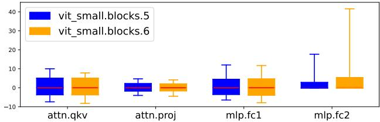
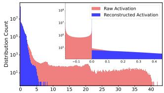
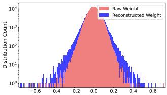
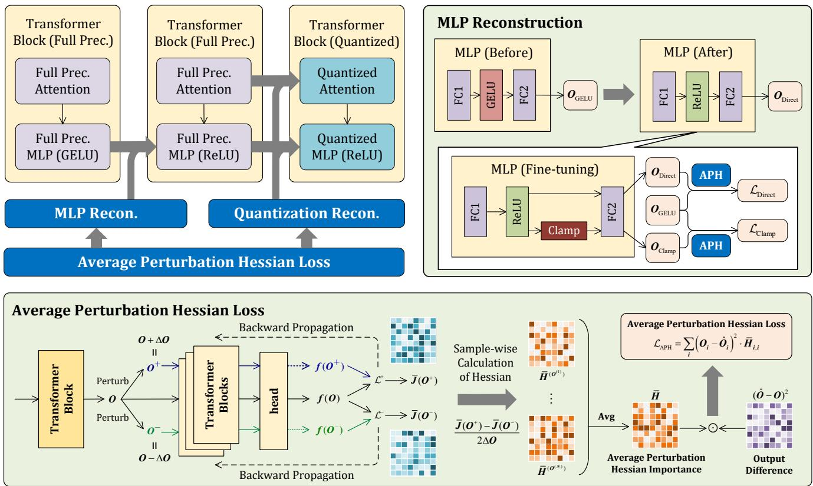

# APHQ-ViT: Post-Training Quantization with Average Perturbation Hessian Based Reconstruction for Vision Transformers

Zhuguanyu Wu<sup>1,2</sup>, Jiayi Zhang<sup>1,2</sup>, Jiaxin Chen<sup>1,2B</sup>, Jinyang Guo<sup>3</sup>, Di Huang<sup>2</sup>, Yunhong Wang<sup>1,2B</sup> <sup>1</sup>State Key Laboratory of Virtual Reality Technology and Systems, Beihang University, China <sup>2</sup>School of Computer Science and Engineering, Beihang University, Beijing, China <sup>3</sup>School of Artificial Intelligence, Beihang University, Beijing, China {goatwu, zhangjyi, jiaxinchen, jinyangguo, dhuang, yhwang}@buaa.edu.cn

## Abstract

Vision Transformers (ViTs) have become one of the most commonly used backbonesfor vision tasks. Despite their remarkable performance, they often suffer significant accuracy drops when quantized for practical deployment, particularly by post-training quantization (PTQ) under ultra-low bits. Recently, reconstruction-based PTQ methods have shown promising performance in quantizing Convolutional Neural Networks (CNNs). However, they fail when applied to ViTs, primarily due to the inaccurate estimation of output importance and the substantial accuracy degradation in quantizing post-GELU activations. To address these issues, we propose APHQ-ViT, a novel PTQ approach based on importance estimation with Average Perturbation Hessian (APH). Specifically, we first thoroughly analyze the current approximation approaches with Hessian loss, and propose an improved average perturbation Hessian loss. To deal with the quantization of the post-GELU activations, we design an MLP Reconstruction (MR) method by replacing the GELU function in MLP with ReLU and reconstructing it by the APH loss on a small unlabeled calibration set. Extensive experiments demonstrate that APHQ-ViT using linear quantizers outperforms existing PTQ methods by substantial margins in 3-bit and 4-bit across different vision tasks. The source code is available at https://github.com/GoatWu/APHQ-ViT.

## 1. Introduction

The success of Transformer-based models in natural language processing (NLP) [7, 45] has inspired their application to various computer vision tasks, such as image classification [3, 11, 32], object detection [2, 6, 53, 57] and instance segmentation [42, 48, 51, 52, 56]. Due to their sophisticated architectures for representation learning, substantial memory usage and computational overhead make it a great challenge to deploy these models on resource-constrained devices [23].

  
(a) activation statistics of linear layers

  
(b) activation distribution of mlp.fc2

  
(c) weight distribution of mlp.fc2  
Figure 1. (a) shows the box plot of activations for each linear layer in vit-small.blocks.5 and 6 by using the 0.99 quantile, highlighting the varying ranges of post-GELU activations. (b) and (c) display that the activation range offc2 is significantly reduced after MLP Reconstruction, while the weight range only exhibits slight changes.

Model quantization has recently emerged as a promising solution to reduce the computational cost of deep learning models. This technique converts the weights or activations from float-point precision to low bit-width, while preserving the original model architectures. Most current quantization approaches are generally categorized into two groups: quantization-aware training (QAT) [5, 12] and post-training quantization (PTQ) [15, 40]. QAT methods typically achieve superior accuracy compared to PTQ by performing end-toend training on the full pretraining dataset. Nevertheless, they are often time-intensive and encounter substantial limitations when the original dataset is inaccessible. In contrast, PTQ methods are more applicable as they rely solely on a small unlabeled calibration dataset instead of requiring access to the full training set. PTQ methods can be further divided into two categories, i.e., the one that only involves calibration [27, 29, 35, 50], and the reconstruction-based one [20, 36, 49, 54], where the later generally achieves superior accuracy by introducing an efficient fine-tuning process. Despite their promising performance in quantizing CNNs [25, 30, 46], the reconstruction-based methods suffer from the following two limitations when applied to ViTs.

1) Inaccurate estimation of output importance. Representative reconstruction-based PTQ methods employ the block-reconstruction framework [25, 46], which fine-tunes the AdaRound [39] weights to ensure that the output of the quantized block closely matches the output of the original full-precision one. The mean squared error (MSE) between the quantized and original outputs is one of the most commonly used metrics to evaluate quantization quality. However, this approach is suboptimal, since it treats all output tokens and dimensions equally, overlooking the critical importance of the class token and the importance variations across channels in ViTs as shown in Sec. C of the supplementary material. Some works leverage the Hessian matrix based on Fisher information to explore the distinct importance [8, 25, 50], while fail to surpass the MSE loss due to the inaccurate approximation on the Hessian matrix.

2) Performance degradation in quantizing post-GELU activation. As shown in Fig. 1 (a), the quantization error in post-GELU activations stems from two primary factors. First, the activation distribution is highly imbalanced: negative activations are densely concentrated within a narrow interval [−0.17, 0], while positive activations follow sparse distributions. Second, the activation range varies significantly, reaching up to 40 in certain layers. Some works have attempted to deal with the imbalanced activation distribution by a twin-uniform quantizer that employs separate scaling factors for positive and negative activations [50], or employ a hardware-friendly logarithmic quantizer with an arbitrary base [47]. However, they necessitate specialized hardware support for the quantizer, limiting their practicality in real-world applications.

To address the above issues, we propose a novel quantization approach dubbed APHQ-ViT for the post-training quantization of Vision Transformers. As illustrated in Fig. 2, to tackle the inaccurate estimation of output importance, we thoroughly investigate the current approximation methods with Hessian loss, and propose an improved average perturbation Hessian (APH) loss for block reconstruction. We show that applying APH to explore the importance of output can stabilize the reconstruction process, and further promote precision. To deal with performance degradation in quantizing post-GELU activations, we develop the MLP Reconstruction method (MR), by replacing the GELU activation function with ReLU. As shown in Fig. 1(b) and (c), MR not only reduces the activation range while maintaining the weight range, but also alleviates the imbalanced activation distributions, thus reducing the quantization error.

The main contributions of our work lie in three-fold:

1) We thoroughly analyze the limitations of existing Hessian guide quantization loss, and propose an improved Average Perturbation Hessian (APH) loss by mitigating the estimation deviations, which facilitates both the block-wise quantization reconstruction and MLP reconstruction.

2) We develop a novel MLP Reconstruction (MR) method by replacing the GELU activation function in MLP with ReLU, which simultaneously alleviates imbalanced activation distribution and significantly reduces the activation range, making the model more amenable to quantization.

3) We extensively conduct experiments on public datasets across various vision tasks in order to evaluate the performance of our method. Experimental results demonstrate that the proposed method, utilizing only linear quantizers, significantly outperforms the current state-of-the-art approaches with distinct Vision Transformer architectures, especially in the case of ultra-low bit quantization.

## 2. Related Work

Model quantization, which aims to map the floating-point weights and activations to lower bit widths, has become one of the most widely used techniques for accelerating the inference of deep learning models. It can be roughly divided into two categories: Post-Training Quantization (PTQ) and Quantization Aware Training (QAT). Among the quantization methods for Vision Transformers, QAT methods [5, 12, 18, 26] often achieve higher accuracy. However, QAT methods often require a large amount of training resources, limiting their universality. By contrast, PTQ methods only take a small calibration dataset to adjust quantization parameters, making them resource-efficient.

The PTQ methods can be further categorized into two groups, i.e., the calibration-only methods that solely involve the calibration stage, and the reconstruction-based methods that additionally incorporate a reconstruction stage.

Calibration-only methods can efficiently obtain a quantized model. PTQ4ViT [50] employs a twin-uniform quantizer to reduce the activation quantization error, and adopts a Hessian guided loss to evaluate the effectiveness of different scaling factors. RepQ-ViT [27] decouples the quantization and inference processes, specifically addressing post-LayerNorm activations with significant inter-channel variations. NoisyQuant [31] reduces quantization error by adding a fixed uniform noisy bias to the values being quantized. IGQ-ViT [38] employs a group-wise activation quantizer to balance the inference efficiency and quantization accuracy. ERQ [55] introduces the GPTQ approach [14] to ViTs and proposes an activation quantization error reduction module to mitigate quantization errors, along with a derived proxy for output error to refine weight rounding. AdaLog [47] designs a hardware-friendly arbitrary-base logarithmic quantizer to handle power-law activations and a progressive hyperparameter search algorithm. However, these methods still suffer substantial quantization loss under low-bit quantization.

Reconstruction-based methods often achieve quantized models with higher accuracy, by additionally employing quantization reconstruction. Numerous approaches have been developed for CNNs. AdaRound [39] adopts a refined weight rounding strategy to minimize the task loss, outperforming conventional rounding-to-nearest methods. BRECQ [25] improves performance by leveraging cross-layer dependencies through block-wise reconstruction. QDrop [46] employs random activation dropout during block reconstruction, facilitating obtaining smoother optimized weight distributions. Although effective for CNNs, these methods yield suboptimal results when applied to ViTs. I&S-ViT [54] employs a three-stage smooth optimization strategy to address the quantization inefficiency and ensure stable learning. DopQ-ViT selects optimal scaling factors to mitigate the impact of outliers and preserve quantization performance. OASQ [36] addresses outlier activations employing distinct granularities in the quantization reconstruction. Although these methods generally outperform calibration-only approaches, they still struggle to reach an acceptable performance under ultra-low bit quantization.

## 3. The Proposed Approach

As shown in Fig. 2, the proposed APHQ-ViT approach follows the block-wise quantization pipeline. In each block, we first perform MLP Reconstruction, followed by quantization reconstruction based on QDrop. The average perturbation Hessian loss is applied in both reconstructions to explore the distinct output importance. The overall pipeline of APHQ-ViT is summarized in Algorithm 1. The average perturbation Hessian loss and MLP Reconstruction are described in Sec. 3.2 and Sec. 3.3, respectively.

## 3.1. Preliminaries: Hessian in BRECQ

The Hessian guided metric proposed by BRECQ [25] stands out as one of the most prevalent metrics for evaluating the quantization quality of CNNs. It assumes that the dequantized weight $\widehat { W }$ can be represented as the original weight W perturbed by $\epsilon , i . e . , \widehat { W } = W + \epsilon$ . The quality of quantization is measured by estimating the quantization loss through a Taylor expansion:

$$
\mathbb { E } [ \mathcal { L } ( \widehat { W } ) ] - \mathbb { E } [ \mathcal { L } ( W ) ] \approx \epsilon ^ { \top } \bar { J } ^ { ( W ) } + \frac { 1 } { 2 } \epsilon ^ { \top } \bar { H } ^ { ( W ) } \epsilon ,\tag{1}
$$

where $\bar { \mathbf { J } } ^ { ( W ) }$ and $\bar { \pmb { H } } ^ { ( W ) }$ are the Jacobian and Hessian matrices w.r.t the weight W, respectively.

Supposing the convergence of a pre-trained model to be quantized, existing works often drop the first-order term

```powershell
Algorithm 1 APHQ-ViT for Block-wise Quantization.
Input: The full-precision model M, the full-precision
block B to be quantized, the calibration data $\mathcal { D } _ { c a l i b }$ , and
the loss function $\mathcal { L } .$
# Calculate the Average Perturbation Hessian:
1: Compute the raw output O of B based on $\mathcal { D } _ { c a l i b } .$
2: Calculate the perturbed outputs $O ^ { + }$ and $O ^ { - }$
3: Compute $f ( \bar { O } ) / f ( O ^ { + } ) / f ( \bar { O } ^ { - } )$ by forward passing
$O / O ^ { + } / O ^ { - }$ through the remaining blocks of $\mathcal { M } .$
4: Calculate $\bar { \mathcal { L } } ( f ( O ) , f ( O ^ { + } ) )$ and $\bar { \mathcal { L } } ( f ( O ) , f ( O ^ { - } ) )$ and
obtain $\bar { J } ^ { ( O ^ { + } ) }$ and $\bar { J } ^ { ( O ^ { - } ) }$ by backward propagation.
5: Calculate the average perturbation Hessian matrix H<sup>¯</sup>
based on Eq. (8).
# MLP Reconstruction:
6: Replace the GELU activation of MLP by ReLU.
7: for $i = 0 , \cdots ,$ , max iter do
8: Calculate $O _ { \mathrm { { D i r e c t } } }$ and $O _ { \mathrm { C l a m p } }$ by Eqs. (11) and
(12).
9: Calculate $\mathcal { L } _ { \mathrm { D i s t i l l } }$ by Eq. (14).
10: Perform backward propagation and update MLP.
11: end for
# Quantization Reconstruction:
12: for $i = 0 , \cdots$ , max iter do
13: Calculate the quantized output $\widehat { O }$ by QDrop [46].
14: Calculate $\mathcal { L } _ { \mathrm { A P H } }$ based on Eq. (9).
15: Perform backward propagation and update the
AdaRound [39] weights in $B .$
16: end for
Output: The quantized block ${ \widehat { B } } .$
```

$\epsilon ^ { \top } \bar { \mathbf { J } } ^ { ( W ) }$ and approximate the Hessian matrix with squared gradient, resulting in the quantization loss:

$$
\mathbb { E } [ \mathcal { L } ( \widehat { \pmb { W } } ) ] - \mathbb { E } [ \mathcal { L } ( \pmb { W } ) ] \approx \sum _ { i } \left( ( \widehat { \pmb { O } } _ { i } - \pmb { O } _ { i } ) \cdot \frac { \partial \mathcal { L } } { \partial \pmb { O } _ { i } } \right) ^ { 2 } ,\tag{2}
$$

where O is the output, and $\widehat { o }$ is the de-quantized one of O.

The above Hessian guided quantization loss adopts two approximations as in BRECQ: 1) the Hessian matrix is approximated by the Fisher Information Matrix (FIM) [13]; 2) the diagonal elements of FIM are approximated by the squared gradients w.r.t. the output. These approximations achieve high accuracy, when the task loss is the Cross-Entropy (CE) loss, and the model’s predicted distribution aligns closely with the true data distribution. However, in practice, models are often unable to fit the true data distribution well, leading to inevitable approximation errors. Additionally, these approximations fail to generalize to tasks such as segmentation and object detection. As a consequence, when applied to ViTs, the loss in Eq. (2) is inferior to the MSE Loss in many ViT architectures as shown in Table 4.

  
Figure 2. Framework overview of APHQ-ViT. In the block-wise quantization process, we first reconstruct the MLP layer, followed by quantization reconstruction, both of which are optimized by the proposed Average Perturbation Hessian (APH) loss. The MLP Reconstruction (MR) method replaces the GELU activation function with ReLU and reduces the post-GELU activation range. The detailed implementation of the APH loss is visualized at the bottom.

## 3.2. Average Perturbation Hessian Loss

To address the limitations of the Hessian guided loss in Eq. (2), we develop a perturbation based estimation method that only relies on two fundamental assumptions as below:

A.1) When performing Taylor series expansions for the loss, the third and higher-order derivatives can be omitted without significantly sacrificing the accuracy [10, 37, 39].

A.2) The influence of individual elements on the final output is assumed to be independent, allowing the use of the diagonal Hessian as a practical substitute for the computationally intensive full Hessian [10, 43].

It is worth noting that A.1) and A.2) are widely used in various model compression methods, including BRECQ, which further rely on additional, stronger assumptions to achieve their results.

We first extend the loss function to ensure compatibility across diverse tasks. Instead of the conventional CE loss, we regard quantization as a knowledge distillation process on a small unlabeled calibration dataset. This allows us to directly employ distillation loss to address different tasks. Specifically, for classification, we adopt the KL divergence between the output logits as the distillation loss. For two-stage object detection and instance segmentation, we combine the KL divergence from the classification head and the smooth L1 distance [16] from the regression head as the distillation loss. Compared to the CE Loss, these distillation losses share the following common characteristics: $\mathcal { L } ( \hat { O } , O ) \geq 0$ , and $\mathcal { L } ( \hat { O } , O ) = 0$ if and only if $O = { \hat { O } }$ . According to the extreme value theorem [21], if L is differentiable at $\hat { O } = O$ then we have:

$$
\bar { J } ^ { ( O ) } = \left. \frac { \partial \mathcal { L } ( \hat { O } , O ) } { \partial \hat { O } } \right| _ { \hat { O } = O } = 0 .\tag{3}
$$

Based on Eq. (3), we treat the errors introduced by quantization or MLP Reconstruction as small perturbations denoted by ϵ, and perform a Taylor expansion as below:

$$
\begin{array} { c } { \displaystyle \mathcal { L } ( O + \epsilon ) = \mathcal { L } ( O ) + \epsilon ^ { \top } \bar { \pmb { J } } ^ { ( O ) } + \frac { 1 } { 2 } \epsilon ^ { \top } \bar { \pmb { H } } ^ { ( O ) } \epsilon + O ( \| \epsilon \| ^ { 3 } ) } \\ { \displaystyle = \frac { 1 } { 2 } \epsilon ^ { \top } \bar { \pmb { H } } ^ { ( O ) } \epsilon + O ( \| \epsilon \| ^ { 3 } ) \approx \frac { 1 } { 2 } \epsilon ^ { \top } \bar { \pmb { H } } ^ { ( O ) } \epsilon , } \end{array}\tag{4}
$$

where $\mathcal { L } ( O + \epsilon ) , \mathcal { L } ( O )$ are the abbreviations of $\mathcal { L } ( O + \epsilon , O )$ and ${ \mathcal { L } } ( O , O )$ , respectively, $\bar { \pmb { H } } ^ { ( O ) }$ is the Hessian matrix of

L w.r.t O, and $O ( \| \epsilon \| ^ { 3 } )$ represents the sum of the third and higher-order derivatives. As depicted in Eq. (3), $\mathcal { L } ( O )$ and $\bar { \pmb J } ^ { ( O ) }$ are zeros, and $O ( \| \epsilon \| ^ { 3 } )$ is omitted according to A.1).

Based on A.2), we follow BRECQ by utilizing the blockdiagonal Hessian and disregarding the inter-block dependencies. By definition, the diagonal elements of the Hessian matrix are the second partial derivatives of the loss function:

$$
\bar { \pmb { H } } _ { i , i } ^ { ( O ) } = \frac { \partial ^ { 2 } \mathcal { L } } { \partial \pmb { O } _ { i } ^ { 2 } } = \frac { \partial } { O _ { i } } \left( \frac { \partial \mathcal { L } } { O _ { i } } \right) .\tag{5}
$$

For the i−th diagonal element, we perturb O by $\Delta O =$ $1 0 ^ { - 6 } \colon O ^ { + } = O + \Delta O$ · 1 and $O ^ { - } = O - \Delta O \cdot { \bf 1 }$ , where 1 equals 1 for all elements. Based on the mean value theorem [21], there exists an $O ^ { \prime }$ between $O ^ { - }$ and $O ^ { + }$ such that

$$
\bar { H } _ { i , i } ^ { ( O ^ { \prime } ) } = \frac { \bar { J } _ { i } ^ { ( O ^ { + } ) } - \bar { J } _ { i } ^ { ( O ^ { - } ) } } { 2 \cdot \Delta O _ { i } } ,\tag{6}
$$

where ${ \bar { J } } ^ { ( O ^ { + } ) }$ and $\bar { J } ^ { ( O ^ { - } ) }$ are the Jacobian matrices at $O ^ { + }$ and $O ^ { - }$ , which are computed through backwardpropagation. As the perturbation $\Delta O$ is small enough, we approximate $\bar { \pmb { H } } _ { i , i } ^ { ( O ) }$ by $\bar { \pmb { H } } _ { i , i } ^ { ( O ^ { \prime } ) }$ . The perturbation Hessian loss is thus formulated as below:

$$
\mathcal { L } _ { \mathrm { P H } } = \sum _ { i } \left( \widehat { O } _ { i } - O _ { i } \right) ^ { 2 } \cdot \bar { H } _ { i , i } ^ { ( O ) } .\tag{7}
$$

It is worth noting that using distinct Hessians for different samples may lead to an unstable training process. To address this issue, we compute the average Hessian across all samples and utilize the mean value to formulate the final reconstruction loss as below:

$$
\bar { H } _ { i , i } = \frac { 1 } { N } \sum _ { n = 1 } ^ { N } \bar { H } _ { i , i } ^ { ( O ^ { ( n ) } ) } ,\tag{8}
$$

$$
\mathcal { L } _ { \mathrm { A P H } } = \sum _ { i } \left( \widehat { O } _ { i } - O _ { i } \right) ^ { 2 } \cdot \bar { H } _ { i , i } ,\tag{9}
$$

where ${ \cal O } ^ { ( n ) }$ is the output of the n−th sample, and N is the sample size.

Ideally, $\mathcal { L } _ { \mathrm { A P H } }$ and $\mathcal { L } _ { \mathrm { P H } }$ have the following properties.

Theorem 3.1. The expectation of the APH loss is consistent with that of the PH loss, i.e., $\dot { \mathbb { E } } \left[ \mathcal { L } _ { \mathrm { A P H } } \right] = \mathbb { E } \left[ \mathcal { L } _ { \mathrm { P H } } \right]$ , under certain independence assumptions.

Theorem 3.2. When utilizing mini-batch gradient descent, the variance ofthe gradient ofthe quantization parameter θ w.r.t. the APH loss is smaller than that ofthe PH loss under certain independence assumptions:

$$
\mathrm { V a r } \left[ \frac { \partial \mathcal { L } _ { \mathrm { A P H } } } { \partial \theta } \right] \leq \mathrm { V a r } \left[ \frac { \partial \mathcal { L } _ { \mathrm { P H } } } { \partial \theta } \right] .\tag{10}
$$

We refer to Sec. A.1 and Sec. A.2 of the supplementary material for detailed proof. Theorems 3.1 and 3.2 imply that the gradient of the APH loss is an unbiased estimation on that of the PH loss, while effectively reducing its variance, under certain independence assumptions. As claimed in [22, 24], lower gradient variance results in faster convergence and improved training stability. Therefore, our proposed APH loss is expected to outperform the PH loss.

Compared to the Hessian in BRECQ, our method only requires one additional forward and backward pass, while maintaining the same training complexity. As a result, the extra computational overhead is negligible. The key advantages of our method lie in two-fold: 1) APH is deduced directly from the definition, thus eliminating errors introduced by the Fisher Information Matrix; 2) APH is theoretically generalizable to other tasks besides classification, such as object detection and segmentation.

## 3.3. MLP Reconstruction

As depicted in Sec. 1, quantizing post-GELU activations in ViTs incurs two significant challenges: 1) the post-GELU activation distribution is highly imbalanced, i.e., concentrating within the narrow interval (-0.17, 0], which leads to approximation errors during quantization [50]. 2) the activation range of post-GELU activations varies substantially.

In this section, we propose an MLP Reconstruction method to address the above two issues simultaneously. To deal with the imbalanced distribution, we replace all GELU activation functions in MLP with ReLU. Subsequently, we perform the feature knowledge distillation [19], and reconstruct MLP individually. Specifically, for each MLP, we obtain its original input and output using the unlabeled data. By following Sec. 3.2, we compute the average perturbation Hessian to determine the output importance. Thereafter, we replace the MLP activation function with ReLU and utilize the Hessian importance to calculate the weighted $L _ { 2 }$ distance between the output with ReLU and the original one with GELU, formulated as below:

$$
\mathcal { L } _ { \mathrm { D i r e c t } } = \left( O _ { \mathrm { G E L U } } - O _ { \mathrm { D i r e c t } } \right) ^ { 2 } \odot \bar { H } ,\tag{11}
$$

where $O _ { \mathrm { { D i r e c t } } } = \operatorname { F C 2 } ( \operatorname { R e L U } ( \operatorname { F C 1 } ( X ) ) )$ is the output of reconstructed MLP with ReLU for input $X , O _ { \mathrm { G E L U } }$ is the output of the original MLP with GELU, and H<sup>¯</sup> is the average perturbation Hessian.

The reason ReLU can be used as a replacement for GELU lies in the fact that, in deeper Transformers, ReLU may suffer from the dying ReLU problem [33], which is why GELU is typically used during training. However, as described in [34], neural networks with ReLU activations also theoretically possess universal approximation capabilities. In this paper, the MLP module are reconstructed individually for each layer, which is of shallow depth, thus avoiding the dying ReLU problem. This enables the network to achieve expressive capability comparable to that by using GELU.

Table 1. Comparison of the top-1 accuracy (%) on the ImageNet dataset with different quantization bit-widths. Here ‘Opt.’ means whether or not using an optimize-based PTQ method, ‘PSQ’ refers to ‘Post-Softmax Quantizer’, and ‘PGQ’ refers to ‘Post-GELU Quantizer’. ‘\*’ indicates that the results are reproduced by using the official code. ‘TUQ’, ‘MPQ’, ‘GUQ’, ‘SULQ’, and ‘TanQ’ are the abbreviations of ‘Twin-Uniform Quantizer’ in PTQ4ViT, ‘Matthew-effect Preserving Quantizer’ in APQ-ViT, ‘Groupwise Uniform Quantizer’ in IGQ-ViT, ‘Shift-Uniform-Log2 Quantizer’ in I&S-ViT, and ‘Tangent Quantizer’ in DopQ-ViT, respectively.
<table><tr><td>Method</td><td>Opt.</td><td>PSQ</td><td>PGQ</td><td>W/A</td><td>ViT-S</td><td>ViT-B</td><td>DeiT-T</td><td>DeiT-S</td><td>DeiT-B</td><td>Swin-S</td><td>Swin-B</td></tr><tr><td>Full-Prec.</td><td>-</td><td>1</td><td></td><td>32/32</td><td>81.39</td><td>84.54</td><td>72.21</td><td>79.85</td><td>81.80</td><td>83.23</td><td>85.27</td></tr><tr><td>PTQ4ViT [50]</td><td>X</td><td>TUQ</td><td>TUQ</td><td>3/3</td><td>0.10</td><td>0.10</td><td>3.50</td><td>0.10</td><td>31.06</td><td>28.69</td><td>20.13</td></tr><tr><td>RepQ-ViT [27]</td><td>X</td><td>log √2</td><td>Uniform</td><td>3/3</td><td>0.10</td><td>0.10</td><td>0.10</td><td>0.10</td><td>0.10</td><td>0.10</td><td>0.10</td></tr><tr><td>AdaLog [47]</td><td>X</td><td>AdaLog</td><td>AdaLog</td><td>3/3</td><td>13.88</td><td>37.91</td><td>31.56</td><td>24.47</td><td>57.47</td><td>64.41</td><td>69.75</td></tr><tr><td>I&amp;S-ViT [54]</td><td>√</td><td>SULQ</td><td>Uniform</td><td>3/3</td><td>45.16</td><td>63.77</td><td>41.52</td><td>55.78</td><td>73.30</td><td>74.20</td><td>69.30</td></tr><tr><td>DopQ-ViT [49]</td><td>√</td><td>TanQ</td><td>Uniform</td><td>3/3</td><td>54.72</td><td>65.76</td><td>44.71</td><td>59.26</td><td>74.91</td><td>74.77</td><td>69.63</td></tr><tr><td>QDrop* [46]</td><td>√</td><td>Uniform</td><td>Uniform</td><td>3/3</td><td>38.31</td><td>73.79</td><td>46.69</td><td>52.55</td><td>74.32</td><td>74.11</td><td>75.28</td></tr><tr><td>APHQ-ViT(Ours)</td><td>√</td><td>Uniform</td><td>Uniform</td><td>3/3</td><td>63.17</td><td>76.31</td><td>55.42</td><td>68.76</td><td>76.31</td><td>76.10</td><td>78.14</td></tr><tr><td>PTQ4ViT [50]</td><td>X</td><td>TUQ</td><td>TUQ</td><td>4/4</td><td>42.57</td><td>30.69</td><td>36.96</td><td>34.08</td><td>64.39</td><td>76.09</td><td>74.02</td></tr><tr><td>APQ-ViT [8]</td><td>X</td><td>MPQ</td><td>Uniform</td><td>4/4</td><td>47.95</td><td>41.41</td><td>47.94</td><td>43.55</td><td>67.48</td><td>77.15</td><td>76.48</td></tr><tr><td>RepQ-ViT [27]</td><td>X</td><td>log √2</td><td>Uniform</td><td>4/4</td><td>65.05</td><td>68.48</td><td>57.43</td><td>69.03</td><td>75.61</td><td>79.45</td><td>78.32</td></tr><tr><td>ERQ [55]</td><td>X</td><td>log √2</td><td>Uniform</td><td>4/4</td><td>68.91</td><td>76.63</td><td>60.29</td><td>72.56</td><td>78.23</td><td>80.74</td><td>82.44</td></tr><tr><td>IGQ-ViT [38]</td><td>X</td><td>GUQ</td><td>GUQ</td><td>4/4</td><td>73.61</td><td>79.32</td><td>62.45</td><td>74.66</td><td>79.23</td><td>80.98</td><td>83.14</td></tr><tr><td>AdaLog [47]</td><td>X</td><td>AdaLog</td><td>AdaLog</td><td>4/4</td><td>72.75</td><td>79.68</td><td>63.52</td><td>72.06</td><td>78.03</td><td>80.77</td><td>82.47</td></tr><tr><td>I&amp;S-ViT [54]</td><td>√</td><td>SULQ</td><td>Uniform</td><td>4/4</td><td>74.87</td><td>80.07</td><td>65.21</td><td>75.81</td><td>79.97</td><td>81.17</td><td>82.60</td></tr><tr><td>DopQ-ViT [49]</td><td>√</td><td>TanQ</td><td>Uniform</td><td>4/4</td><td>75.69</td><td>80.95</td><td>65.54</td><td>75.84</td><td>80.13</td><td>81.71</td><td>83.34</td></tr><tr><td>QDrop* [46]</td><td>√</td><td>Uniform</td><td>Uniform</td><td>4/4</td><td>67.62</td><td>82.02</td><td>64.95</td><td>74.73</td><td>79.64</td><td>81.03</td><td>82.79</td></tr><tr><td>OASQ [36]</td><td>V</td><td>Unifrom</td><td>Uniform</td><td>4/4</td><td>72.88</td><td>76.59</td><td>66.31</td><td>76.00</td><td>78.83</td><td>81.02</td><td>82.46</td></tr><tr><td>APHQ-ViT(Ours)</td><td>√</td><td>Uniform</td><td>Uniform</td><td>4/4</td><td>76.07</td><td>82.41</td><td>66.66</td><td>76.40</td><td>80.21</td><td>81.81</td><td>83.42</td></tr></table>

To address the activation range issue, we design an alternative clamp loss to constrain the range effectively. Specifically, we compute the p-th percentile of all positive values and restrict the activations within this p-th percentile. The clipped output is formulated as:

$$
\begin{array} { r l } & { \quad A _ { \mathrm { F C 2 } } = \mathrm { R e L U } ( \mathrm { F C } 1 ( \boldsymbol { X } ) ) , } \\ & { \quad O _ { \mathrm { c l a m p } } = \mathrm { F C 2 } ( \mathrm { c l a m p } ( A _ { \mathrm { F C 2 } } , \mathrm { ~ Q u a n t i l e } _ { p } ( A _ { \mathrm { F C 2 } } ) ) ) . } \end{array}\tag{12}
$$

Accordingly, the clipped reconstruction loss is written as:

$$
\mathcal { L } _ { \mathrm { C l a m p } } = \left( O _ { \mathrm { G E L U } } - O _ { \mathrm { c l a m p } } \right) ^ { 2 } \odot H .\tag{13}
$$

The MLP Reconstruction loss is finally formulated as:

$$
\mathcal { L } _ { \mathrm { D i s t i l l } } = \mathcal { L } _ { \mathrm { D i r e c t } } + \alpha \cdot \mathcal { L } _ { \mathrm { C l a m p } } ,\tag{14}
$$

where α is a trade-off hyperparameter fixed as $\alpha = 2$ . It is important to note that $\mathcal { L } _ { \mathrm { { D i r e c t } } }$ cannot be omitted. By solely using ${ \mathcal { L } } _ { \mathrm { C l a m p } }$ leads to vanishing gradients for hardclipped activations. In regions where activations are hardclipped, the gradients tend to be zero, hindering the effective update of the MLP parameters. By incorporating $\mathcal { L } _ { \mathrm { { D i r e c t } } }$ that leverages unclamped activations, the gradient vanishing issue is mitigated, thus facilitating effective learning.

## 4. Experimental Results and Analysis

## 4.1. Experimental Setup

Datasets and Models. For the classification task, we evaluate our method on ImageNet [41] with representative Vision Transformer architectures, including ViT [11], DeiT [44] and Swin [32]. For object detection and instance segmentation, we evaluate on COCO [28] by utilizing the Mask R-CNN [17] and Cascade Mask R-CNN [1] frameworks based on the Swin backbones.

Implementation Details. All pretrained full-precision Vision Transformers are obtained from the timm library<sup>1</sup>. The pretrained detection and segmentation models are obtained from MMDetection [4]. Following existing works [25, 36, 46, 54], we randomly select 1024 unlabeled images from ImageNet and 256 unlabeled images from COCO as the calibration sets for classification and object detection, respectively. We adopt channel-wise uniform quantizers for weight quantization and layer-wise uniform quantizers for activation quantization, including the attention map. We follow the hyper-parameter settings as used in QDrop [46] by setting the batch size, learning rate for activation quantization, learning rate for tuning weight, the maximal iteration number in both MLP Reconstruction and QDrop reconstruction as 32, 4e-5, 1e-3 and 20000, respectively. In addition, we set the percentile $p = 0 . 9 9$ in Eq. (12).

Table 2. Quantization results (%) on COCO for the object detection and instance segmentation tasks. Here, ‘Baseline’ refers to the results by using only uniform quantizers for calibration. \* and † indicate that the results are re-produced by using the official code.
<table><tr><td rowspan="2">Method</td><td rowspan="2">Opt.</td><td rowspan="2">PSQ</td><td rowspan="2">W/A</td><td colspan="4">Mask R-CNN</td><td rowspan="2"></td><td colspan="4">Cascade Mask R-CNN</td></tr><tr><td> $\mathsf { A P } ^ { \mathsf { b } }$ </td><td>Swin-T  $\mathsf { A P } ^ { \mathrm { m } }$ </td><td>Swin-S  $\mathsf { A P } ^ { \mathsf { b } }$ </td><td> $\mathsf { A P } ^ { \mathrm { m } }$ </td><td>Swin-T APb</td><td> $\mathbf { A P } ^ { \mathrm { m } }$ </td><td>Swin-S APb</td><td>APⁿ</td></tr><tr><td>Full-Precision</td><td>-</td><td></td><td>32/32</td><td>46.0</td><td>41.6</td><td>48.5</td><td></td><td>43.3</td><td>50.4</td><td>43.7</td><td>51.9</td><td>45.0</td></tr><tr><td>Baseline*</td><td>X</td><td>Uniform</td><td>4/4</td><td>34.6</td><td>34.2</td><td>40.8</td><td></td><td>38.6</td><td>45.9</td><td>40.2</td><td>47.9</td><td>41.6</td></tr><tr><td>RepQ-ViT [27]</td><td>X</td><td> $\log { \sqrt { 2 } }$ </td><td>4/4</td><td>36.1</td><td>36.0</td><td> $4 4 . 2 _ { 4 2 . 7 } \dagger$ </td><td></td><td>40.2</td><td>47.0</td><td>41.1</td><td>49.3</td><td>43.1</td></tr><tr><td>ERQ [55]</td><td>X</td><td>log√2</td><td>4/4</td><td>36.8</td><td>36.6</td><td>43.4</td><td></td><td>40.7</td><td>47.9</td><td>42.1</td><td>50.0</td><td>43.6</td></tr><tr><td>I&amp;S-ViT [54]</td><td>√</td><td>SULQ</td><td>4/4</td><td>37.5</td><td>36.6</td><td>43.4</td><td></td><td>40.3</td><td>48.2</td><td>42.0</td><td>50.3</td><td>43.6</td></tr><tr><td>DopQ-ViT [49]</td><td>√</td><td>TanQ</td><td>4/4</td><td>37.5</td><td>36.5</td><td>43.5</td><td></td><td>40.4</td><td>48.2</td><td>42.1</td><td>50.3</td><td>43.7</td></tr><tr><td>QDrop* [46]</td><td>√</td><td>Uniform</td><td>4/4</td><td>36.2</td><td>35.4</td><td>41.6</td><td>39.2</td><td></td><td>47.0</td><td>41.3</td><td>49.0</td><td>42.5</td></tr><tr><td>APHQ-ViT (Ours)</td><td>√</td><td>Uniform</td><td>4/4</td><td>38.9</td><td>38.1</td><td>44.1</td><td></td><td>41.0</td><td>48.9</td><td>42.7</td><td>50.3</td><td>43.7</td></tr></table>

## 4.2. Quantization Results on ImageNet

We first compare our method to the state-of-the-art approaches for post-training quantization of ViTs on ImageNet: 1) the calibration-only methods including PTQ4ViT [50], APQ-ViT [8], RepQ-ViT [27], ERQ [55], IGQ-ViT [38] and AdaLog [47]; and 2) the reconstruction-based methods including DopQ-ViT [49], QDrop [46] and OASQ [36].

As summarized in Table 1, for 4-bit quantization, some of the compared methods suffer a remarkable degradation in accuracy due to severe quantization loss of weights and activations. However, the performance of the proposed APHQ-ViT remains competitive compared to the full-precision models and consistently outperforms existing methods. As for 3-bit quantization, calibration-only methods yield an extremely low performance (e.g. 0.1%) in most scenarios. Reconstruction-based methods like DopQ-ViT and I&S-ViT also suffer significant accuracy loss on models that are challenging to quantize (e.g. ViT-S and DeiT-T). By contrast, APHQ-ViT maintains more stable accuracy when reducing the precision from 32 bits to 3 bits. It surpasses the secondbest method, DopQ-ViT, by 10.71% when using the DeiT-T backbone and achieves an average improvement of 7.21%.

## 4.3. Quantization Results on COCO

We further evaluate our method on COCO for object detection and instance segmentation. As shown in Table 2, the baseline method, which employs only uniform quantizers and QDrop, achieves lower accuracy compared to other calibration-only and reconstruction-based methods that utilize specific quantizers. By employing the APH loss and MLP Reconstruction, our method achieves results on par with or superior to those using specific quantizers.

Table 3. Ablation results w.r.t the top-1 accuracy (%) of the proposed main components on ImageNet with the W3/A3 setting.
<table><tr><td>Method</td><td>ViT-S</td><td>ViT-B</td><td>DeiT-T</td><td>DeiT-S</td><td>Swin-S</td></tr><tr><td>Full-Prec.</td><td>81.39</td><td>84.54</td><td>72.21</td><td>79.85</td><td>81.80</td></tr><tr><td>QDrop</td><td>38.31</td><td>73.79</td><td>46.69</td><td>52.55</td><td>74.11</td></tr><tr><td>+APH</td><td>59.11</td><td>76.05</td><td>53.82</td><td>67.40</td><td>75.44</td></tr><tr><td>+APH +MR</td><td>63.17</td><td>76.31</td><td>55.42</td><td>68.76</td><td>76.10</td></tr></table>

## 4.4. Ablation Studies

Effect of the Main Components. We first evaluate the effectiveness of the proposed Average Perturbation Hessian (APH) loss and the MLP Reconstruction (MR) method. As displayed in Table 3, applying the APH loss on QDrop reconstruction significantly promotes the top-1 accuracy across distinct Vision Transformer architectures. Specifically, the accuracy is improved by 20.80%, 14.85%, and 7.13% when using ViT-S, DeiT-S, and DeiT-T on W3/A3, respectively. MLP Reconstruction consistently boosts the accuracy when combined with the APH loss.

Average Perturbation Hessian. To validate the effectiveness of the proposed APH loss, we compare it with the alternative representative quantization loss, including the MSE loss [46] and the BRECQ based Hessian (BH) loss. We further compare it with the original Perturbation Hessian (PH) without averaging. As shown in Table 4, the PH loss outperforms other quantization losses in most ViT architectures, and the APH loss further improves the accuracy.

MLP Reconstruction. We separately reconstruct the MLP module, i.e., performing MLP Reconstruction one by one without utilizing QDrop reconstruction. As summarized in Table 5, except for a performance drop of over 1% on DeiT-T, the accuracy loss on other models is less than 0.5%. On ViT-B, the accuracy even surpasses that of the full-precision model by adopting the MR method.

Table 4. Ablation results w.r.t the top-1 accuracy (%) of the proposed Perturbation Hessian, compared to other losses on ImageNet with the W3/A3 setting. “BH”, “PH” and “APH” denote “BRECQbased Hessian”, “Perturbation Hessian” and “Average Perturbation Hessian”, respectively.
<table><tr><td>Method</td><td>ViT-S</td><td>ViT-B</td><td>DeiT-T</td><td>DeiT-S</td><td>Swin-S</td></tr><tr><td>Full-Prec.</td><td>81.39</td><td>84.54</td><td>72.21</td><td>79.85</td><td>83.23</td></tr><tr><td>MSE [46]</td><td>38.31</td><td>73.79</td><td>46.69</td><td>52.55</td><td>74.11</td></tr><tr><td>BH [25]</td><td>54.33</td><td>66.62</td><td>49.27</td><td>63.72</td><td>75.20</td></tr><tr><td>PH</td><td>55.14</td><td>72.80</td><td>52.25</td><td>66.12</td><td>75.40</td></tr><tr><td>APH</td><td>59.11</td><td>76.05</td><td>53.82</td><td>67.40</td><td>75.44</td></tr></table>

Table 5. Ablation results w.r.t the top-1 accuracy (%) of the proposed MLP Reconstruction method on ImageNet.
<table><tr><td>Method</td><td>ViT-S</td><td>ViT-B</td><td>DeiT-T</td><td>DeiT-S</td><td>Swin-S</td></tr><tr><td>Full-Prec.</td><td>81.39</td><td>84.54</td><td>72.21</td><td>79.85</td><td>83.23</td></tr><tr><td>MLP Recon.</td><td>80.90</td><td>84.84</td><td>71.07</td><td>79.38</td><td>83.12</td></tr></table>

We provide more ablation results in Sec. B of the supplementary material.

## 4.5. Analysis of Inference Efficiency on MR

MLP Reconstruction replaces the GELU activation function with ReLU. Unlike GELU, which incurs additional computational overhead, ReLU can be folded into the preceding linear layer. As a consequence, the proposed MR method not only promotes quantization accuracy but also accelerates inference. Since quantization below 8 bits typically requires specialized hardware [9, 25, 55], we benchmark the quantized model at W8A8 on an Intel i5-12400F CPU. As shown in Table 6, 8-bit quantization generally achieves a 1.4 to 1.6 times speedup. By replacing GELU with ReLU via MR, we further improve inference efficiency.

## 4.6. Discussion on Training Efficiency

The MLP Reconstruction method in APHQ-ViT introduces additional training overhead. However, the extra training cost is acceptable. As shown in Table 7, our method incurs less training overhead, compared to QAT methods such as LSQ. Furthermore, our approach requires only 1024 unlabeled images as a calibration set, eliminating fine-tuning on the entire dataset, as is typically required by QAT methods.

## 5. Conclusion

In this paper, we propose a novel post-training quantization approach dubbed APHQ-ViT for Vision Transformers. We first demonstrate that the current Hessian guided loss adopts an inaccurate estimated Hessian matrix, and present an improved Average Perturbation Hessian (APH) loss. Based on APH, we develop an MLP Reconstruction method that simultaneously replaces the GELU activation function with ReLU and significantly reduces the activation range. Extensive experimental results show the effectiveness of our approach across various Vision Transformer architectures and vision tasks, including image classification, object detection, and instance segmentation. Notably, compared to the state-of-the-art methods, APHQ-ViT achieves an average improvement of 7.21% on ImageNet with 3-bit quantization using only uniform quantizers.

Table 6. Comparison of latency and throughput of ViTs under W8A8 quantization to full-precision models. “AF” indicates the adopted activation function. “Lat.” refers to the model latency (in milliseconds). “TP” stands for the throughput (in images per second). “SR” is the speedup rate.
<table><tr><td>Model</td><td>AF</td><td>Bits</td><td>Lat.</td><td>TP</td><td>SR</td></tr><tr><td rowspan="3">DeiT-T</td><td>GELU</td><td>32</td><td>30.93</td><td>32.08</td><td>×1</td></tr><tr><td>GELU</td><td>8</td><td>22.34</td><td>44.76</td><td>× 1.40</td></tr><tr><td>ReLU</td><td>8</td><td>20.66</td><td>48.40</td><td>× 1.51</td></tr><tr><td rowspan="3">DeiT-S</td><td>GELU</td><td>32</td><td>100.03</td><td>9.97</td><td>×1</td></tr><tr><td>GELU</td><td>8</td><td>63.89</td><td>15.65</td><td>× 1.57</td></tr><tr><td>ReLU</td><td>8</td><td>58.40</td><td>17.12</td><td>× 1.72</td></tr><tr><td rowspan="3">DeiT-B</td><td>GELU</td><td>32</td><td>346.93</td><td>2.88</td><td>×1</td></tr><tr><td>GELU</td><td>8</td><td>217.96</td><td>4.59</td><td>× 1.59</td></tr><tr><td>ReLU</td><td>8</td><td>198.80</td><td>5.03</td><td>× 1.75</td></tr><tr><td rowspan="3">Swin-S</td><td>GELU</td><td>32</td><td>255.56</td><td>3.90</td><td>×1</td></tr><tr><td>GELU</td><td>8</td><td>180.42</td><td>5.54</td><td>× 1.42</td></tr><tr><td>ReLU</td><td>8</td><td>171.88</td><td>5.82</td><td>× 1.49</td></tr><tr><td rowspan="3">Swin-B</td><td>GELU</td><td>32</td><td>411.07</td><td>2.43</td><td>×1</td></tr><tr><td>GELU</td><td>8</td><td>282.28</td><td>3.54</td><td>× 1.44</td></tr><tr><td>ReLU</td><td>8</td><td>264.38</td><td>3.78</td><td>× 1.54</td></tr></table>

Table 7. Comparison of the training time cost and accuracy (%) under W3/A3 by using distinct quantization methods on a single Nvidia RTX 4090 GPU.
<table><tr><td>Model</td><td>Method</td><td>PTQ</td><td>Data Size</td><td>Time Cost</td><td>Acc.</td></tr><tr><td>DeiT-S</td><td>LSQ [12] QDrop [46] APHQ-ViT</td><td>× √ V</td><td>1280 K 1024 1024</td><td>~170 h 47 min 62 min</td><td>77.3 52.6</td></tr><tr><td>Swin-S</td><td>LSQ [12] QDrop [46] APHQ-ViT</td><td>× √ √</td><td>1280 K 1024 1024</td><td>~450 h 130 min 170 min</td><td>68.8 80.6 74.1 76.1</td></tr></table>

## Acknowledgments

This work was partly supported by the Beijing Municipal Science and Technology Project (No. Z231100010323002), the National Natural Science Foundation of China (Nos. 62202034,62176012,62022011,62306025), the Beijing Natural Science Foundation (No. 4242044), the Aeronautical Science Foundation of China (No. 2023Z071051002), CCF-Baidu Open Fund, the Research Program of State Key Laboratory of Virtual Reality Technology and Systems, and the Fundamental Research Funds for the Central Universities.

## References

[1] Zhaowei Cai and Nuno Vasconcelos. Cascade R-CNN: delving into high quality object detection. In CVPR, pages 6154– 6162, 2018. 6

[2] Nicolas Carion, Francisco Massa, Gabriel Synnaeve, Nicolas Usunier, Alexander Kirillov, and Sergey Zagoruyko. Endto-end object detection with transformers. In ECCV, pages 213–229, 2020. 1

[3] Chun-Fu (Richard) Chen, Quanfu Fan, and Rameswar Panda. Crossvit: Cross-attention multi-scale vision transformer for image classification. In ICCV, pages 347–356, 2021. 1

[4] Kai Chen, Jiaqi Wang, Jiangmiao Pang, Yuhang Cao, Yu Xiong, Xiaoxiao Li, Shuyang Sun, Wansen Feng, Ziwei Liu, Jiarui Xu, Zheng Zhang, Dazhi Cheng, Chenchen Zhu, Tianheng Cheng, Qijie Zhao, Buyu Li, Xin Lu, Rui Zhu, Yue Wu, Jifeng Dai, Jingdong Wang, Jianping Shi, Wanli Ouyang, Chen Change Loy, and Dahua Lin. MMDetection: Open mmlab detection toolbox and benchmark. arXiv preprint arXiv:1906.07155, 2019. 6

[5] Jungwook Choi, Zhuo Wang, Swagath Venkataramani, I Pierce, Jen Chuang, Vijayalakshmi Srinivasan, and Kailash Gopalakrishnan. Pact: Parameterized clipping activation for quantized neural networks. arXiv preprint arXiv:1805.06085, 2018. 1, 2

[6] Xiyang Dai, Yinpeng Chen, Jianwei Yang, Pengchuan Zhang, Lu Yuan, and Lei Zhang. Dynamic DETR: end-to-end object detection with dynamic attention. In ICCV, pages 2968–2977, 2021. 1

[7] Jacob Devlin, Ming-Wei Chang, Kenton Lee, and Kristina Toutanova. BERT: pre-training of deep bidirectional transformers for language understanding. In NAACL-HLT, pages 4171–4186, 2019. 1

[8] Yifu Ding, Haotong Qin, Qinghua Yan, Zhenhua Chai, Junjie Liu, Xiaolin Wei, and Xianglong Liu. Towards accurate posttraining quantization for vision transformer. In ACM MM, pages 5380–5388, 2022. 2, 6, 7

[9] Peiyan Dong, Lei Lu, Chao Wu, Cheng Lyu, Geng Yuan, Hao Tang, and Yanzhi Wang. Packqvit: Faster sub-8-bit vision transformers via full and packed quantization on the mobile. In NeurIPS, 2023. 8

[10] Zhen Dong, Zhewei Yao, Amir Gholami, Michael W. Mahoney, and Kurt Keutzer. HAWQ: hessian aware quantization of neural networks with mixed-precision. In ICCV, pages 293–302, 2019. 4

[11] Alexey Dosovitskiy, Lucas Beyer, Alexander Kolesnikov, Dirk Weissenborn, Xiaohua Zhai, Thomas Unterthiner, Mostafa Dehghani, Matthias Minderer, Georg Heigold, Sylvain Gelly, Jakob Uszkoreit, and Neil Houlsby. An image is worth 16x16 words: Transformers for image recognition at scale. In ICLR, 2021. 1, 6

[12] Steven K. Esser, Jeffrey L. McKinstry, Deepika Bablani, Rathinakumar Appuswamy, and Dharmendra S. Modha. Learned step size quantization. In ICLR, 2020. 1, 2, 8

[13] Fisher and Ronald Aylmer. On the mathematical foundations of theoretical statistics. Philosophical Transactions of the Royal Society of London. Series A, Containing Papers of a Mathematical or Physical Character, 222:309–368, 1922. 3

[14] Elias Frantar, Saleh Ashkboos, Torsten Hoefler, and Dan Alistarh. GPTQ: accurate post-training quantization for generative pre-trained transformers. In ICLR, 2023. 2

[15] Amir Gholami, Sehoon Kim, Zhen Dong, Zhewei Yao, Michael W. Mahoney, and Kurt Keutzer. A survey of quantization methods for efficient neural network inference. arXiv preprint arXiv:2103.13630, 2021. 1

[16] Ross B. Girshick. Fast R-CNN. In ICCV, 2015. 4

[17] Kaiming He, Georgia Gkioxari, Piotr Dollar, and Ross B.´ Girshick. Mask R-CNN. In ICCV, pages 2980–2988, 2017. 6

[18] Yefei He, Zhenyu Lou, Luoming Zhang, Jing Liu, Weijia Wu, Hong Zhou, and Bohan Zhuang. Bivit: Extremely compressed binary vision transformers. In ICCV, 2023. 2

[19] Geoffrey E. Hinton, Oriol Vinyals, and Jeffrey Dean. Distilling the knowledge in a neural network. arXiv preprint arXiv:1503.02531, 2015. 5

[20] Haocheng Huang, Jiaxin Chen, Jinyang Guo, Ruiyi Zhan, and Yunhong Wang. TCAQ-DM: timestep-channel adaptive quantization for diffusion models. In AAAI, 2025. 2

[21] Stewart James. Calculus: Early Transcendentals. Cengage Learning, 2015. 4, 5

[22] Rie Johnson and Tong Zhang. Accelerating stochastic gradient descent using predictive variance reduction. In NeurIPS, 2013. 5

[23] Raghuraman Krishnamoorthi. Quantizing deep convolutional networks for efficient inference: A whitepaper. arXiv preprint arXiv:1806.08342, 2018. 1

[24] Lihua Lei and Michael I. Jordan. Less than a single pass: Stochastically controlled stochastic gradient. In International Conference on Artificial Intelligence and Statistics, 2017. 5

[25] Yuhang Li, Ruihao Gong, Xu Tan, Yang Yang, Peng Hu, Qi Zhang, Fengwei Yu, Wei Wang, and Shi Gu. BRECQ: pushing the limit of post-training quantization by block reconstruction. In ICLR, 2021. 2, 3, 6, 8

[26] Yanjing Li, Sheng Xu, Baochang Zhang, Xianbin Cao, Peng Gao, and Guodong Guo. Q-vit: Accurate and fully quantized low-bit vision transformer. In NeurIPS, 2022. 2

[27] Zhikai Li, Junrui Xiao, Lianwei Yang, and Qingyi Gu. Repqvit: Scale reparameterization for post-training quantization of vision transformers. In ICCV, pages 17227–17236, 2023. 2, 6, 7

[28] Tsung-Yi Lin, Michael Maire, Serge J. Belongie, James Hays, Pietro Perona, Deva Ramanan, Piotr Dollar, and C. Lawrence´ Zitnick. Microsoft COCO: common objects in context. In ECCV, pages 740–755, 2014. 6

[29] Yang Lin, Tianyu Zhang, Peiqin Sun, Zheng Li, and Shuchang Zhou. Fq-vit: Post-training quantization for fully quantized vision transformer. In IJCAI, pages 1173–1179, 2022. 2

[30] Jiawei Liu, Lin Niu, Zhihang Yuan, Dawei Yang, Xinggang Wang, and Wenyu Liu. Pd-quant: Post-training quantization based on prediction difference metric. In CVPR, 2023. 2

[31] Yijiang Liu, Huanrui Yang, Zhen Dong, Kurt Keutzer, Li Du, and Shanghang Zhang. Noisyquant: Noisy bias-enhanced post-training activation quantization for vision transformers. In CVPR, pages 20321–20330, 2023. 2

[32] Ze Liu, Yutong Lin, Yue Cao, Han Hu, Yixuan Wei, Zheng Zhang, Stephen Lin, and Baining Guo. Swin transformer: Hierarchical vision transformer using shifted windows. In ICCV, pages 9992–10002, 2021. 1, 6

[33] Lu Lu, Yeonjong Shin, Yanhui Su, and George E. Karniadakis. Dying relu and initialization: Theory and numerical examples. arXiv preprint arXiv:1903.06733, 2019. 5

[34] Zhou Lu, Hongming Pu, Feicheng Wang, Zhiqiang Hu, and Liwei Wang. The expressive power of neural networks: A view from the width. In NeurIPS, 2017. 5

[35] Chengtao Lv, Hong Chen, Jinyang Guo, Jinyang Guo, Jinyang Guo, Yifu Ding, and Xianglong Liu. PTQ4SAM: posttraining quantization for segment anything. In CVPR, 2024. 2

[36] Yuexiao Ma, Huixia Li, Xiawu Zheng, Feng Ling, Xuefeng Xiao, Rui Wang, Shilei Wen, Fei Chao, and Rongrong Ji. Outlier-aware slicing for post-training quantization in vision transformer. In ICML, 2024. 2, 3, 6, 7

[37] James Martens and Roger B. Grosse. Optimizing neural networks with kronecker-factored approximate curvature. In ICML, pages 2408–2417, 2015. 4

[38] Jaehyeon Moon, Dohyung Kim, Junyong Cheon, and Bumsub Ham. Instance-aware group quantization for vision transformers. In CVPR, 2024. 2, 6, 7

[39] Markus Nagel, Rana Ali Amjad, Mart van Baalen, Christos Louizos, and Tijmen Blankevoort. Up or down? adaptive rounding for post-training quantization. In ICML, pages 7197– 7206, 2020. 2, 3, 4

[40] Babak Rokh, Ali Azarpeyvand, and Alireza Khanteymoori. A comprehensive survey on model quantization for deep neural networks. arXiv preprint arXiv:2205.07877, 2022. 1

[41] Olga Russakovsky, Jia Deng, Hao Su, Jonathan Krause, Sanjeev Satheesh, Sean Ma, Zhiheng Huang, Andrej Karpathy, Aditya Khosla, Michael S. Bernstein, Alexander C. Berg, and Li Fei-Fei. Imagenet large scale visual recognition challenge. IJCV, 115(3):211–252, 2015. 6

[42] Robin Strudel, Ricardo Garcia Pinel, Ivan Laptev, and Cordelia Schmid. Segmenter: Transformer for semantic segmentation. In ICCV, pages 7242–7252, 2021. 1

[43] Becker Suzanna and Lecun Yann. Improving the convergence of back-propagation learning with second-order methods. In Connectionist Models Summer School, 1989. 4

[44] Hugo Touvron, Matthieu Cord, Matthijs Douze, Francisco Massa, Alexandre Sablayrolles, and Herve J ´ egou. Training´ data-efficient image transformers & distillation through attention. In ICML, pages 10347–10357, 2021. 6

[45] Ashish Vaswani, Noam Shazeer, Niki Parmar, Jakob Uszkoreit, Llion Jones, Aidan N. Gomez, Lukasz Kaiser, and Illia Polosukhin. Attention is all you need. In NeurIPS, pages 5998–6008, 2017. 1

[46] Xiuying Wei, Ruihao Gong, Yuhang Li, Xianglong Liu, and Fengwei Yu. Qdrop: Randomly dropping quantization for extremely low-bit post-training quantization. In ICLR, 2022. 2, 3, 6, 7, 8

[47] Zhuguanyu Wu, Jiaxin Chen, Hanwen Zhong, Di Huang, and Yunhong Wang. Adalog: Post-training quantization for vision transformers with adaptive logarithm quantizer. In ECCV, 2024. 2, 6, 7

[48] Zhiyong Xu, Weicun Zhang, Tianxiang Zhang, Zhifang Yang, and Jiangyun Li. Efficient transformer for remote sensing image segmentation. Remote. Sens., 13(18):3585, 2021. 1

[49] Lianwei Yang, Haisong Gong, and Qingyi Gu. Dopqvit: Towards distribution-friendly and outlier-aware posttraining quantization for vision transformers. arXiv preprint arXiv:2408.03291, 2024. 2, 6, 7

[50] Zhihang Yuan, Chenhao Xue, Yiqi Chen, Qiang Wu, and Guangyu Sun. Ptq4vit: Post-training quantization for vision transformers with twin uniform quantization. In ECCV, pages 191–207, 2022. 2, 5, 6, 7

[51] Yanan Zhang, Jiaxin Chen, and Di Huang. Cat-det: Contrastively augmented transformer for multimodal 3d object detection. In CVPR, 2022. 1

[52] Sixiao Zheng, Jiachen Lu, Hengshuang Zhao, Xiatian Zhu, Zekun Luo, Yabiao Wang, Yanwei Fu, Jianfeng Feng, Tao Xiang, Philip H. S. Torr, and Li Zhang. Rethinking semantic segmentation from a sequence-to-sequence perspective with transformers. In CVPR, pages 6881–6890, 2021. 1

[53] Hanwen Zhong, Jiaxin Chen, Yutong Zhang, Di Huang, and Yunhong Wang. Transforming vision transformer: Towards efficient multi-task asynchronous learner. In NeurIPS, 2024. 1

[54] Yunshan Zhong, Jiawei Hu, Mingbao Lin, Mengzhao Chen, and Rongrong Ji. I&s-vit: An inclusive & stable method for pushing the limit of post-training vits quantization. arXiv preprint arXiv:2311.10126, 2023. 2, 3, 6, 7

[55] Yunshan Zhong, Jiawei Hu, You Huang, Yuxin Zhang, and Rongrong Ji. ERQ: Error reduction for post-training quantization of vision transformers. In ICML, 2024. 2, 6, 7, 8

[56] Chao Zhou, Yanan Zhang, Jiaxin Chen, and Di Huang. Octr: Octree-based transformer for 3d object detection. In CVPR, 2023. 1

[57] Xizhou Zhu, Weijie Su, Lewei Lu, Bin Li, Xiaogang Wang, and Jifeng Dai. Deformable DETR: deformable transformers for end-to-end object detection. In ICLR, 2021. 1