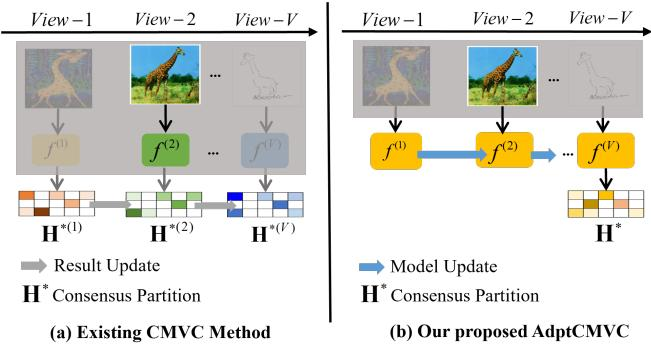
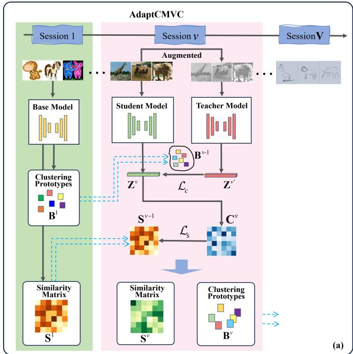
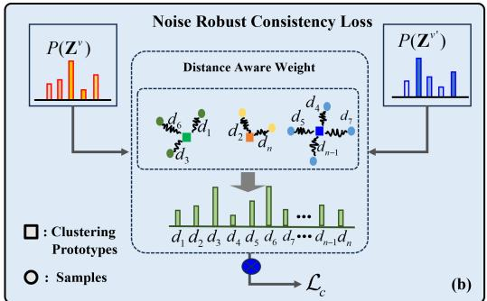
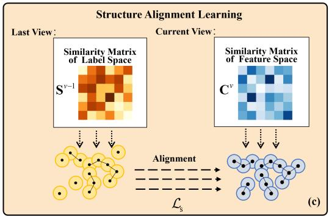
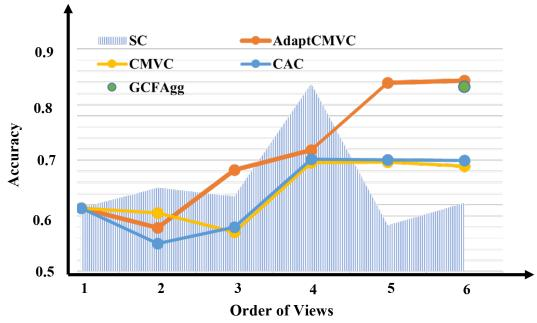
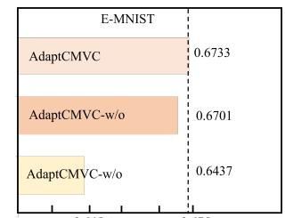
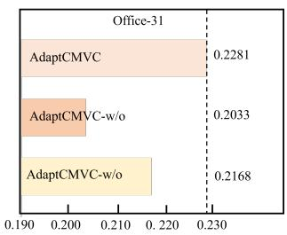
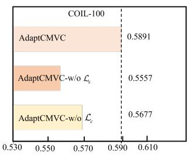
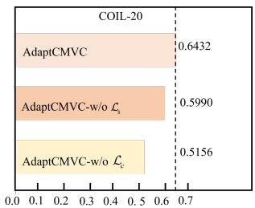

# AdaptCMVC: Robust Adaption to Incremental Views in Continual Multi-view Clustering

Jing Wang1, Songhe Feng1\*, Kristoffer Knutsen Wickstrøm2, Michael C. Kampffmeyer2 1 School of Computer Science & Technology, Beijing Jiaotong University 2 Department of Physics and Technology, UiT The Arctic University of Norway {jing w,shfeng}@bjtu.edu.cn, {kristoffer.k.wickstrom, michael.c.kampffmeyer}@uit.no

## Abstract

Most Multi-view Clustering approaches assume that all views are available for clustering. However, this assumption is often unrealistic as views are incrementally accumulated over time, leading to a needfor continual multi-view clustering (CMVC) methods. Current approaches to CMVC leverage latefusion-based approaches, where a new model is typically learned individuallyfor each view to obtain the corresponding partition matrix, and then used to update a consensus matrix via a moving average. These approaches are prone to view-specific noise and struggle to adapt to large gaps between different views. To address these shortcomings, we reconsider CMVCfrom the perspective ofdomain adaptation and propose AdaptCMVC, which learns how to incrementally accumulate knowledge of new views as they become available and prevents catastrophicforgetting. Specifically, a self-trainingframework is introduced to extend the model to new views, particularly designed to be robust to view-specific noise. Further, to combat catastrophic forgetting, a structure alignment mechanism is proposed to enable the model to explore the global group structure across multiple views. Experiments on several multi-view benchmarks demonstrate the effectiveness ofour proposed method on the CMVC task. The code is available at: AdaptCMVC.

## 1. Introduction

Nowadays, more and more data originating from multiple views, or multiple modalities offer plentiful information for multi-view applications, such as cross-modal image retrieval [56], visual question answering [8], and multimodal 3D object detection [26]. As a cornerstone of multiview learning, Multi-View Clustering (MVC) aims to discover underlying groups of data by leveraging the complementary information from multiple views. Existing multiview clustering algorithms can be classified into four popular paradigms, including multi-view subspace clustering (MVSC) [43, 45, 50, 57, 62], multi-view graph clustering (MVGC) [9, 38, 51, 52], multiple kernel clustering (MKC) [22, 53], and deep multi-view clustering (DMVC) [20, 22, 40, 41].

  
Figure 1. Graphical comparison between the existing CMVC paradigm and our proposed AdaptCMVC.

Although the current multi-view clustering algorithms [59, 61] have achieved excellent performance, they normally focus on clustering static multi-view data [24], which is unrealistic in many real-life settings. In many practical scenarios, different views of data arise in a continuous, incremental manner, where the number of views is unfixed and only the data of the current session can be accessed. For instance, in a medical diagnostic scenario, due to limitations in a patient’s physical condition or medical equipment availability, different types of multimodal data (such as MRI, CT, and X-ray) are often collected at separate stages throughout the examination process. Similarly, in federated learning, data from edge devices are used exclusively for local model training, helping to prevent potential data breaches. In these cases, when a new view arrives, existing MVC methods need access to all historical views of the data in order to reuse them with the new view in order to retrain the model. This leads to high time and space complexity and can violate data privacy regulations. Thus, these methods struggle when deployed to continual multi-view clustering.

In this paper, motivated by the aforementioned scenario, we focus on a more flexible and practical setting. The setting is Continual Multi-view Clustering (CMVC), which was first proposed in [60]. There are two differences between MVC and CMVC: 1) In CMVC, the multiple views are presented in a sequential nature, creating a continuously evolving feature space. Unlike traditional MVC, the model can thus not access all data views simultaneously. 2) At each incremental session, data from previous views is no longer accessible. In addition to discovering information in the new view, it is thus of critical importance to also preserve information about past views. This results in the following three challenges that need to be addressed to improve the continual clustering performance: View Discrepancy: Multi-view data describes samples from distinct feature spaces, creating a significant gap between previous views and incoming views. This discrepancy makes it difficult for the model to adapt effectively to new views. Noise in Views: Not all views contribute positively to clustering, as some may contain noisy features. Adjusting the adaption process to minimize the impact of noise is a critical challenge. Catastrophic Forgetting [47]: The adaption process of the model does not rely on previous views data. This can lead to catastrophic forgetting, causing the model to lose important clustering structure from earlier views.

CMVC is a recent and emerging research area with some notable works [58, 60, 63]. However, some, such as [60, 63], require reusing either the most recent or all historical view data to update a consensus memory. This approach is impractical in data privacy-sensitive scenarios, where the model can only access data from the current view. For instance, [60] reconstructs a consensus similarity matrix using both the new and previous views, and applies sparse, connected graph regularization to mitigate noise. On the other hand, to prevent forgetting knowledge of previous views, existing CMVC methods attempt to learn a knowledge library and update it with data from each new view. For example, [58] aims to maintain a consensus partition matrix and update it with the incoming partition matrix of the new view. As shown in Figure 1 (a), these methods train a distinct model for each new view, exploring current-view knowledge and integrating it through an average updating mechanism. However, these late fusion multi-view clustering frameworks struggle to adapt effectively to the unique shifts between different views because they learn the knowledge of multiple views individually and only fuse them for clustering.

To address the aforementioned issues effectively, we propose a view adaption-based solution, named AdaptCMVC, which enables the model to successfully adapt to incremental views in the continual clustering setting, as shown in Figure 1 (b). Concretely, in the initial session, we utilize the first view data to train the model, establishing a foundational feature extraction model. In the incremental sessions, we propose to effectively adapt the base model to the current view data under a self-training framework. Firstly, to discover view-specific information, we use a weighted-average teacher model to create target features for the base mode to align with. This is inspired by the success of prominent works in self-supervised learning [4, 5], which has shown that such teacher-student learning can produce representations of high quality. Secondly, to mitigate the impact of noisy samples in the current session, we lessen their influence on model updates and adjust their weights based on the distance from the samples to the clustering prototype obtained from the last session.

Furthermore, in order to prevent forgetting previous views, we propose a structure alignment mechanism to enforce consistency between the current and previous view group structure. By implementing an adaption strategy that allows for the simultaneous learning of new views while preserving previous knowledge, AdaptCMVC facilitates CMVC with incremental views. Extensive experimental results demonstrate the effectiveness of AdaptCMVC in continual clustering. Our contributions are:

• We focus on the more realistic setting of CMVC and introduce a new perspective that redefines the problem by taking inspiration from domain adaptation. It allows the model to continuously adapt to new views while preserving knowledge from previous views.

• We propose a self-training framework where a weightaveraged teacher model is able to yield more accurate targets for the student model, enabling it to explore specific information from the new views.

• A structure alignment learning mechanism is proposed to mine the consistent group structure across multiple views, effectively avoiding catastrophic forgetting.

## 2. Related Work

In this section, we briefly review related work on MVC, CMVC, and domain adaptation.

## 2.1. Multi-view Clustering

By utilizing the complementary information from multiple views, multi-view clustering is able to outperform singleview approaches. MVC methods can broadly be categorized into subspace-based, graph-based, multiple kernel-based, and deep learning-based multi-view clustering approaches. Subspace-based methods [2, 11, 27, 37] encode the multiview data into a common subspace and apply different regularization terms to divide the data points into different clusters. For the graph-based multi-view clustering methods [10, 19, 29, 49], they discover the view-specific structure information to construct multiple graphs and fuse them to obtain a consensus one, which can then be cut into groups. Multiple kernel-based multi-view clustering methods [21, 25, 48] adopt different kernel functions to map the nonlinear data into a high dimensional space where the data can be separated. More recently, with the widespread adoption of deep learning, many recent works introduce deep learning into multi-view clustering [18, 40, 41, 46]. Deep learning-based MVC methods employ view-specific encoders to extract multiple representations and leverage single-view or multi-view self-supervised tasks to model a consensus representation, which is used as the input of the clustering module [41].

## 2.2. Continual Multi-view Clustering

In real world applications, multiple views are hard to collect all at once. Unlike traditional MVC methods, which assume that all views are available in advance, CMVC aims to address the case where views are incrementally added over time. This distinctive characteristic enables CMVC to employ a sequential encoder training paradigm, thereby relaxing the constraint on data availability, and addressing data privacy regulations, while also potentially being beneficial for resource constrained settings (i.e. memory constraints). Accordingly, CMVC requires learning knowledge from new views as well as utilizing historical information, continually clustering when provided with a stream of view data.

In recent years, there have been some initial efforts [36, 42, 44, 58, 60, 63], to address the CMVC setting. Specifically, [36] propose a generalized lifelong spectral clustering method to incorporate the new clustering task, which employs a dual memory to store the clustering centers and manifold representations for continual clustering. The most recent and current state-of-the-art approach to CMVC, aptly named CMVC [58] 1, creates a category library to learn and preserve the historical categories and uses the new view to update the consensus partition matrix. These models make a preliminary attempt at CMVC, which still faces several challenges. First, these methods use the new view directly to update the consensus part which neglects the noise contained in the new view. Second, by continuously updating the consensus part, the historical knowledge will to some extent be forgotten.

In this paper, we reconsider the CMVC setting from the perspective of domain adaptation and propose the AdaptCMVC model to address these shortcomings.

## 2.3. Domain Adaptation

Domain adaptation [31, 31] is an important branch of transfer learning [30], which aims at improving the target performance with the knowledge learned from the source domain. Continual domain adaptation [7] considers the adaption problem for a continually changing target environment. Our work is inspired by [47], which utilizes a self-training framework to help the model adapt to the continually changed environment. They stochastically restore part of the parameters to the source model to prevent catastrophic forgetting.

Unlike [47], our model proposes a noise robust objective function to directly address the potential noise contained in the new view in the CMVC setting. Furthermore, we explore the view-consistent group structure information to store the knowledge learned from the previous views. It should further be noted that training is conducted fully unsupervised in the CMVC setting, while training is conducted in a supervised manner on the source domain in domain adaptation.

## 3. Method

## 3.1. Problem Definition

For CMVC, we define a sequence of V clustering sessions $\{ S ^ { 0 } , S ^ { 1 } , \ldots , S ^ { V } \}$ , each session is composed of n unlabeled samples $\mathbf { X } ^ { v } \in \mathbb { R } ^ { n \times d }$ , where d denotes the feature dimension 2. According to the CMVC setting, the feature space is continually changing and only Xv is accessible in the v-th session. Therefore, when the system encounters new view data, it should continuously perform clustering, integrating the knowledge from the new view and previous views to improve the clustering performance. Consequently, the final clustering performance should be expected to surpass any single view or keep the same performance in case new views have little additional information.

## 3.2. Methodology

To address the CMVC task, our proposed AdaptCMVC takes a base model pre-trained on the first view and adapts it to the continually incremental views. To successfully adapt to the large gap between different views, a noise robust self-training framework is introduced to accumulate viewspecific knowledge of new view data and avoid the impact of view-specific noise. In addition, to help preserve knowledge from prior views, we define a structure alignment learning mechanism to discover the global structure across all views by aligning the current view with the last. An overview of the proposed method is presented in Figure 2.

Base Model. Existing works on continual multi-view clustering require a view-specific model for each view to explore specific semantic details within views. However, in our proposed AdaptCMVC method, we redefine the problem from the perspective of domain adaptation. It focuses on leveraging a base model pre-trained on the first session data to effectively adapt to subsequent sessions. Therefore a robust base model should be trained in the first session. To achieve this, we adopt a Variational Autoencoders (VAE) [15] model to transform $\mathbf { x } _ { i } ^ { v }$ to its representation $\mathbf { z } _ { i } ^ { v }$ and use it to generate the original samples.

  
Figure 2. An overview of the proposed AdaptCMVC. (a) The AdaptCMVC model reconsiders the CMVC setting from the domain adaptation perspective, resulting in a unified model capable of adapting to different sessions of view data. (b) Our noise robust consistency loss is particularly designed to enable the model robust to view-specific noise. (c) Our structure alignment learning module explores the global group structure information to prevent forgetting previous views.

Concretely, to enable the model to be robust to noise, we use a masking strategy, randomly blurring pixels of the original image, which enables the model to learn a noise-robust representation. The mask version $\mathbf { x } _ { i } ^ { v \prime }$ is treated as the input of encoder $E _ { \phi } ( \cdot )$ with parameters $\phi$ and the approximate posterior of representation $\mathbf { z } _ { i } ^ { v }$ can be inferred as follows:

$$
q _ { \phi } ( \mathbf { z } _ { i } ^ { v } | \mathbf { x } _ { i } ^ { v \prime } ) = \mathcal { N } ( \mu ^ { v } , \sigma ^ { v 2 } )\tag{1}
$$

where $\mu ^ { v }$ and $\sigma ^ { v }$ are parameterized with neural networks, whose input is $\mathbf { x } _ { i } ^ { v \prime }$

Since the approximate posterior $q _ { \phi } ( \mathbf { z } _ { i } ^ { v } | \mathbf { x } _ { i } ^ { v \prime } )$ is intractable to optimize, we leverage the reparameterization trick [16] to facilitate optimization:

$$
q _ { \phi } ( \mathbf { z } _ { i } ^ { v } \vert \mathbf { x } _ { i } ^ { v ^ { \prime } } ) = \mathcal { N } ( \mu ^ { v } , \sigma ^ { v 2 } ) = \mu ^ { v } + \sigma ^ { v } \epsilon\tag{2}
$$

where $\epsilon \sim \mathcal { N } ( \mathbf { 0 } , \mathbf { I } )$

In the generative process, the representation $\mathbf { z } _ { i } ^ { v }$ is utilized to generate samples. The decoder $D _ { \theta } ( \cdot )$ with trainable parameters θ can be expressed as:

$$
\hat { \mathbf { x } } _ { i } ^ { v } = p _ { \theta } ( \mathbf { x } _ { i } ^ { v } \mid \mathbf { z } _ { i } ^ { v } )\tag{3}
$$

To enable the VAE to explore the knowledge of a particular view $v ,$ the objective will maximize the likelihood function of the observed data. The base model can be trained by the evidence lower bound (ELBO) [1]:

$$
\begin{array} { r l } & { \mathcal { L } _ { r } = \mathbb { E } _ { q _ { \phi } ( \mathbf { z } _ { i } ^ { v } \mid \mathbf { x } _ { i } ^ { v \prime } ) } [ \log p _ { \theta } ( \mathbf { x } _ { i } ^ { v } \mid \mathbf { z } _ { i } ^ { v } ) ] } \\ & { \qquad - K L ( q _ { \phi } ( \mathbf { z } _ { i } ^ { v } | \mathbf { x } _ { i } ^ { v \prime } ) \| p ( \mathbf { z } _ { i } ^ { v } ) ) } \end{array}\tag{4}
$$

where $K L ( \cdot )$ denotes the Kullback–Leibler divergence. $p ( \mathbf { z } _ { i } ^ { v } )$ is the prior of the sample representation, which follows a standard Gaussian distribution, i.e., $p ( \mathbf { z } _ { i } ^ { v } ) \sim \mathcal { N } ( \mathbf { 0 } , \mathbf { I } )$

Noise Robust Self-training Framework. In the CMVC setting, the view is incremental over time and the base model needs to successfully adapt to the new view data. While the base model typically works well on the first view, the quality of the extracted features drops significantly for continually changing view data because of the large gap between different views. To deal with the view discrepancy, a self-training framework is introduced, which follows a student-teacher model. Inspired by [33, 39], a weight-average teacher model is introduced to provide more robust features.

Under a view incremental environment, the feature space of new sessions changes dramatically, thus we use augmented samples as the input of the teacher model to improve robustness. At time-step $t = 0$ , both the student and teacher models are initialized to be the same as the base model. At time step $t > 0 ,$ , a consistency cost is introduced to supervise the update of the student model as below:

$$
\mathcal { L } _ { c } ( \mathbf { z } _ { i } ^ { v } ) = - \sum _ { d } p ( \mathbf { z } _ { i d } ^ { v } ) \log p ( \mathbf { z } _ { i d } ^ { v \prime } )\tag{5}
$$

where the $p ( \mathbf { z } _ { i d } ^ { v } )$ is the distribution of the features extracted by the student model, and $p ( \mathbf { z } _ { i d } ^ { v \prime } )$ is the distribution of the features extracted by the teacher model, which is obtained by a softmax function.

To further facilitate a noise robust model, we need to consider that some views contain noise and thus might not be positive and might even be detrimental to the model adaption. To ensure good CMVC performance, we thus need to mitigate the impact of the noise depending on the knowledge learned from the last views. According to the representation extracted from the last view, we obtain class prototypes $\mathbf { B } ^ { v - 1 } \in \mathcal { R } ^ { k \times d }$ and a soft cluster assignments matrix $\bar { \mathbf { H } ^ { v - 1 } } \in \{ 0 , 1 \} ^ { n \times k }$ by applying the K-means clustering [28], and then leverage these to adjust the weight of the consistency loss. The final noise-robust consistency loss that is applied to deal with noisy samples by reformulating Eq. 5 is:

$$
\mathcal { L } _ { c } ( \mathbf { z } _ { i } ^ { v } ) = - \frac { 1 } { ( l ( i , b _ { i } ^ { v - 1 } ) ) ^ { 2 } } \sum _ { d } p ( \mathbf { z } _ { i d } ^ { v } ) \log p ( \mathbf { z } _ { i d } ^ { v \prime } )\tag{6}
$$

where $l ( i , b _ { i } ^ { v - 1 } ) = \| \mathbf { z } _ { i } ^ { v } - \mathbf { h } _ { i } ^ { v - 1 } \mathbf { B } ^ { v - 1 } \| ^ { 2 }$ is the distance between sample i and its corresponding class prototype, and $\mathbf { h } _ { i } ^ { v - 1 }$ is the k-dimensional one-hot vector of cluster assignments.

The intuition behind this approach is that we should use more reliable samples − those closer to the class prototypes − to help the model adapt, rather than relying on samples that are far from the prototypes. We demonstrate the effectiveness of this loss in Sec. 7.3 of the supplementary material.

After updating the student model using Equation 6, the parameters $\psi _ { t } ^ { \prime } = \{ \theta , \phi \}$ of the teacher model at step t are defined by the exponential moving average (EMA) of successive ψt:

$$
\psi _ { t } ^ { \prime } = \alpha \psi _ { t - 1 } ^ { \prime } + ( 1 - \alpha ) \psi _ { t }\tag{7}
$$

where α is a smoothing factor.

By introducing the weight-averaged teacher model, our model is able to extract more accurate features of the new view. Meanwhile, the features learned by the teacher model contain information from past models, which is beneficial to prevent forgetting prior knowledge and to generalize the new view stably. Finally, the noise-robust consistency loss weakens the impact of noisy samples to reduce the error accumulation successfully.

Structure Alignment Learning. Although the noise robust self-training framework can successfully adapt the base model to new view data, the continual adaption process over many views will cause forgetting, especially when the model suffers a strong view shift.

To address the catastrophic forgetting problem, we propose a structure alignment module, which models the global structure across all views to enable the model to encode the view-consistent information for long time adaption. Specifically, to favorably enable the model to preserve the knowledge from previous views, we adopt an MSE loss to encourage that the samples keep a consistent structure with the previous session:

$$
\mathcal { L } _ { s } = \frac { 1 } { n ^ { 2 } } \sum _ { i = 1 } ^ { n } \sum _ { j = 1 } ^ { n } \| \mathbf { s } _ { i j } ^ { v - 1 } - \mathbf { c } _ { i j } ^ { v } \|\tag{8}
$$

where $\begin{array} { r } { c _ { i j } ^ { v } = \frac { < \mathbf { z } _ { i } ^ { v } , \mathbf { z } _ { j } ^ { v } > } { \| \mathbf { z } _ { i } ^ { v } \| \| \mathbf { z } _ { j } ^ { v } \| } } \end{array}$ is the similarity between two features, which is measured by the cosine similarity and $\mathbf { s } _ { i j } ^ { v - 1 }$ denotes the specific element of the last view similarity matrix $\mathbf { S } ^ { v - 1 } \in$ ${ \mathcal { R } } ^ { n \times n }$ . At the beginning of session $v , \mathbf { S } ^ { v - 1 }$ is initialized by the soft cluster assignments matrix $\mathbf { H } ^ { v - 1 }$ obtained in the last view:

$$
\mathbf { s } _ { i j } ^ { v - 1 } = \left\{ \begin{array} { l l } { 0 } & { \mathbf { h } _ { i k } ^ { v - 1 } \neq \mathbf { h } _ { j k } ^ { v - 1 } } \\ { 1 } & { \mathbf { h } _ { i k } ^ { v - 1 } = \mathbf { h } _ { j k } ^ { v - 1 } } \end{array} \right.\tag{9}
$$

In subsequent epochs, $\mathbf { S } ^ { v - 1 }$ is updated by the current view similarity matrix to capture the joint structure:

$$
\mathbf { S } _ { t } ^ { v - 1 } = \beta \mathbf { S } _ { t - 1 } ^ { v - 1 } + ( 1 - \beta ) \mathbf { C } _ { t } ^ { v }\tag{10}
$$

where $\beta$ is a smoothing factor.

The structure alignment learning module uses the similarity matrix obtained by the last session rather than accessing the last view data, maintaining a global structure across multiple views to prevent forgetting knowledge of prior views while avoiding access to data. The whole learning process of AdaptCMVC is summarized in Algorithm 1.

Algorithm 1 The proposed AdaptCMVC   
Initialization: A base model $g _ { \psi _ { 0 } } ( \cdot )$ , student model $f _ { \psi _ { 0 } } ( \cdot )$   
and teacher model $f _ { \psi _ { 0 } } ^ { ' } ( \cdot )$ initialized from $g _ { \psi _ { 0 } } ( \cdot ) .$   
Input: For each session v, the similarity matrix $\mathbf { S } ^ { v - 1 }$ , the   
cluster assignments matrix $\mathbf { H } ^ { v - 1 }$ , the cluster prototype   
$\mathbf { B } ^ { v - 1 }$ from the last session and the current view data $\mathbf { X } ^ { v }$   
1. for $\mathbf { t } = \mathbf { 1 }$ to $T$   
2. Augment $\mathbf { X } ^ { v }$ and get the average-weight   
representations from the teacher model $f _ { \psi _ { v } } ^ { t ^ { \prime } } ( \cdot )$   
3. Updating the student $f _ { \psi _ { v } } ^ { t } ( \cdot )$ by noise robust   
consistency loss in Equation 6, structure   
alignment loss in Equation 8, and reconstruction   
loss in Equation 4.   
4. Updating teacher $f _ { \psi _ { v } } ^ { t ^ { \prime } } ( \cdot )$ by moving average in   
Equation 7.   
5. end for   
Output: The updated student $f _ { \psi _ { v } } ( \cdot )$ model, the teacher   
model $f _ { \psi _ { v } } ^ { \prime } ( \cdot )$ , the similarity matrix $\mathbf { S } ^ { v }$ , the cluster assign  
ments matrix $\mathbf { H } ^ { v }$ , the cluster prototype $\mathbf { B } ^ { v }$

<table><tr><td rowspan="2">Method</td><td colspan="2">E-MNIST</td><td colspan="2">E-FMNIST</td><td colspan="2">Office-31</td><td colspan="2">COIL-100</td></tr><tr><td>ACC</td><td>NMI</td><td>ACC</td><td>NMI</td><td>ACC</td><td>NMI</td><td>ACC</td><td>NMI</td></tr><tr><td>Joint-VAE</td><td></td><td></td><td></td><td></td><td></td><td></td><td></td><td>42.81±0.03 35.45±0.05 37.22±0.58 26.94±0.31 25.19±0.60 29.30±0.34 55.85±1.49 77.53±0.61</td></tr><tr><td>β-VAE</td><td></td><td></td><td></td><td></td><td></td><td></td><td></td><td> $3 9 , 6 9 \pm 0 . 7 2 ~ 2 4 . 9 7 \pm 0 . 1 8 ~ 3 9 . 7 6 \pm 0 . 0 2 ~ 3 8 . 3 7 \pm 0 . 0 5 ~ 1 1 . 8 9 \pm 0 . 4 4 ~ 1 3 . 5 3 \pm 0 . 0 9 ~ 2 4 . 0 2 \pm 0 . 2 3 ~ 4 0 . 9 6 \pm 0 . 2 6$ </td></tr><tr><td>MFLVC</td><td> $6 5 . 9 8 { \pm } 0 . 0 6$ </td><td></td><td></td><td></td><td> $5 9 . 0 8 \pm 0 . 0 4 \ 4 8 . 4 8 \pm 0 . 1 5 \ 4 6 . 6 2 \pm 0 . 1 2 \ 3 2 . 0 9 \pm 0 . 2 1 \ 2 9 . 3 9 \pm 0 . 0 7 \ 3 5 . 0 5 \pm 1 . 1 4$ </td><td></td><td></td><td> $7 3 . 1 9 { \pm } 1 . 1 6$ </td></tr><tr><td>CONAN</td><td></td><td></td><td></td><td></td><td></td><td></td><td> $5 0 . 2 2 \pm 0 . 0 2 4 4 . 4 2 \pm 0 . 0 1 4 8 . 7 0 \pm 0 . 1 1 4 1 . 4 1 \pm 0 . 0 1 1 3 . 5 1 \pm 0 . 2 4 1 7 . 1 1 \pm 0 . 2 2 5 4 . 0 4 \pm 1 . 3 7$ </td><td> $7 4 . 7 3 { \pm } 0 . 4 7$ </td></tr><tr><td>EAMC</td><td> $4 9 . 1 7 { \pm } 0 . 3 2 $ </td><td></td><td></td><td></td><td></td><td></td><td> $4 6 . 2 8 \pm 0 . 3 4 ~ 4 5 . 4 4 \pm 0 . 4 2 ~ 4 2 . 7 6 \pm 1 . 0 3 ~ 3 3 . 1 6 \pm 0 . 1 9 ~ 3 0 . 0 8 \pm 0 . 1 3 ~ 6 0 . 3 1 \pm 0 . 8 4 ~ 9 . 0 9 9 9 9 9 9 9 9 9 .$ </td><td> $7 3 . 1 3 { \pm } 0 . 9 1 $ </td></tr><tr><td>GCFAgg</td><td></td><td></td><td></td><td></td><td></td><td></td><td> $6 7 . 1 0 \pm 0 . 8 8 6 1 . 3 4 \pm 0 . 6 2 4 3 . 0 9 \pm 0 . 0 7 4 0 . 2 5 \pm 0 . 2 1 3 1 . 1 7 \pm 0 . 2 1 2 8 . 5 4 \pm 0 . 3 1 4 5 . 7 1 \pm 1 . 3 5 \pm 0 . 0 9 4 9 . 2 1 1 . 2 8 \pm 0 . 0 9 4 9 . 2 1 1 . 2 8 \pm 0 . 0 9 4 9 .$ </td><td> $7 0 . 2 2 { \pm } 1 . 8 2 $ </td></tr><tr><td>Multi-VAE</td><td></td><td></td><td></td><td></td><td></td><td></td><td> $6 0 . 7 4 \pm 0 . 2 3 5 9 . 0 3 \pm 0 . 1 8 5 3 . 1 6 \pm 0 . 1 4 5 4 . 4 7 \pm 0 . 0 6 \ 3 1 . 2 7 \pm 0 . 2 7 \ 2 7 . 8 4 \pm 0 . 3 9 \ 4 8 . 8 7 \pm 0 . 0 3 4 . 0 3 5 \ .$ </td><td> $4 5 . 2 9 { \pm } 0 . 1 5 $ </td></tr><tr><td>CMVC</td><td> $\overline { { 5 7 . 3 0 { \pm } 0 . 0 0 } }$ </td><td></td><td></td><td></td><td></td><td></td><td>47.54±0.00 46.24±0.00 45.08±0.00 16.02±0.00 18.7±0.00 36.41±0.00</td><td> $\overline { { 6 1 . 9 8 { \pm } 0 . 0 0 } }$ </td></tr><tr><td>CAC</td><td></td><td></td><td></td><td></td><td></td><td></td><td> $5 7 . 2 8 \pm 0 . 0 0 4 8 . 1 8 \pm 0 . 0 0 4 6 . 4 2 \pm 0 . 0 0 4 5 . 4 9 \pm 0 . 0 0 1 6 . 2 0 \pm 0 . 0 0 1 8 . 9 8 \pm 0 . 0 0 3 3 . 9 1 \pm 0 . 0 0 0 4 5 . 0 0 0 4 6 . 0 0 0 5 . 0 0 2 4 . 0 0 0$ </td><td> $5 9 . 3 7 { \pm } 0 . 0 0$ </td></tr><tr><td>AdaptCMVC</td><td>(+9.8)</td><td>(+5.96)</td><td>(+7.71)</td><td>(+1.49)</td><td>(+6.61)</td><td>(+14.41)</td><td>67.10±0.06* 54.14±0.03 54.13±0.02 46.98±0.02 22.81±0.03 33.39±0.13 57.12±0.01 (+20.71)</td><td> $\mathbf { \overline { { 7 9 . 2 9 } } \pm 0 . 0 2 ^ { \ast } }$  (+17.31)</td></tr></table>

Table 1. The clustering performance comparisons on E-MNIST, E-FMNIST, Office-31, and COIL-100 datasets. The best are highlighted in bold. The differences between our model and the best CMVC baseline model are shown in green. In addition, we provide results for traditional MVC approaches that use all views simultaneously. The ∗ represents results where our proposed AdaptCMVC also outperforms the traditional MVC approaches despite not having access to all views simultaneously. Baseline results are taken from [13].

## 4. Experiment

## 4.1. Setup

Datasets. We adopt six common multi-view datasets [13, 41] to evaluate our proposed model and compare to the current state-of-the-art approaches. These datasets are: (a) E-MNIST [23], a widely used image dataset for multi-view clustering, which is based on the MNIST dataset [17] and consists of 70,000 handwritten digits from 0 to 9. Each digit is described by two views, the original MNIST version and an edge-detection version. (b) E-FMNIST is a fashion dataset with 10 classes corresponding to different clothing items. The first view consists of 70,000 images with 32×32 pixels, while the second view is an edge-detected version constructed following [13]. (c) COIL-100 [35] and (d) COIL-20 [35] contain RGB and grayscale images of 100 and 20 objects, respectively, captured from various angles. Three distinct views were generated following [13]. (e) Office-31 [34] is an office setting dataset that includes 2253 items from 31 categories, which is constructed into a three-view dataset by applying ColorJitter following [13]. (f) PatchedMNIST [41] is a subset of MNIST comprised of 3 classes and designed to evaluate the performance for cases with a large number of views. In [41], they divide the original images into $1 2 7 \times 7$ non-overlapping patches, where the 6 center patches containing the most information were used in our experiments.

Baselines. Our proposed method AdaptCMVC is compared with nine state-of-the-art methods, including three categories of baseline methods: (i) single view clustering methods: Joint-VAE [3] and β-VAE [6]; (ii) Deep multi-view clustering methods: Multi-level Feature Learning for contrastive multi-View Clustering (MFLVC) [55], End-to-end Adversarial attention network for Multi-modal Clustering (EAMC) [64], CONtrAstive fusion Networks for multi-view clustering (CONAN) [12], Global and Cross-view Feature Aregation for multi-view clustering (GCFAgg) [57], and learning disentangled view-common and view-peculiar visual representations for multi-view clustering (Multi-VAE) [54]; (iii) Continual multi-view clustering methods: Continual Multi-View Clustering (CMVC) [42] and Continual Action Clustering with incremental views (CAC) [58]. We report the average values and variance over 10 training runs. For the shallow MVC methods, we treat the features extracted by our backbone as the input data to ensure fair comparisons. Furthermore, for the single-view clustering methods, we report the results for the best performing view as the evaluation result. For deep methods that were not designed to deal with image datasets, we replace the backbone with ours.

Implementation Details. Our proposed method is implemented in PyTorch [32]. We train the model for 50 epochs in each session using the Adam [14] optimizer with a batch size of 256 and the learning rate of $1 \times 1 0 ^ { - 4 }$ . We report the results from the epoch resulting in the lowest value of the unsupervised training loss $\mathcal { L } _ { c } + \mathcal { L } _ { s } + \mathcal { L } _ { r }$ . The encoder and decoder are built using convolutional networks as described by [13]. The decoder has a symmetric structure. For the random augmentations, we follow [47] and employ random horizontal flipping, color jitter, Gaussian blur, and the addition of Gaussian noise. Additional implementation details are provided in the supplementary material.

Evaluation Metrics. We employ two widely used metrics to evaluate our model, namely Accuracy (ACC) and the Normalized Mutual Information (NMI). For completeness, we provide the definitions in the supplementary material.

## 4.2. Comparison Results and Analysis

In this section, we compare our proposed AdaptCMVC with nine baselines on six datasets. The baselines include singleview clustering methods, multi-view clustering methods, and continual multi-view clustering methods.

<table><tr><td rowspan="2">Method</td><td colspan="2">COIL-20</td><td colspan="2">PatchedMNIST</td></tr><tr><td>ACC</td><td>NMI</td><td>ACC</td><td>NMI</td></tr><tr><td>Joint-VAE</td><td>61.98±2.60 74.14±0.82</td><td></td><td> $7 5 . 5 1 { \pm } 0 . 0 5$ </td><td> $\overline { { 5 2 . 5 8 { \pm } 0 . 1 1 } }$  1</td></tr><tr><td>β-VAE</td><td>35.80±0.71 44.67±0.86</td><td></td><td> $6 1 . 0 6 { \pm } 0 . 0 7$ </td><td>41.86±0.10</td></tr><tr><td>MFLVC</td><td>36.98±20.7 67.16±1.99</td><td></td><td> $7 7 . 2 8 { \pm } 0 . 0 5$ </td><td> $4 4 . 8 4 { \pm } 0 . 0 4$ </td></tr><tr><td>CONAN</td><td>55.94±0.8863.98±0.46</td><td></td><td> $7 6 . 8 9 { \pm } 0 . 0 6$ </td><td> $4 7 . 3 4 { \pm } 0 . 0 8 $ </td></tr><tr><td>EAMC</td><td>58.19±1.93</td><td> $7 5 . 1 3 { \pm } 1 . 2 1 $ </td><td>十</td><td>十</td></tr><tr><td>GCFAgg</td><td>55.79±1.66</td><td> $7 5 . 0 8 { \pm } 1 . 3 8 $ </td><td> $8 3 . 2 0 { \pm } 0 . 0 2$ </td><td> $5 4 . 4 0 { \scriptstyle \pm 0 . 0 2 }$ </td></tr><tr><td>Multi-VAE</td><td>65.77±1.04</td><td> $7 8 . 2 2 { \pm } 1 . 0 3 $ </td><td> $5 9 . 3 8 { \pm } 0 . 0 6$ </td><td> $2 7 . 3 7 { \pm } 0 . 0 5$ </td></tr><tr><td>CMVC</td><td>68.15±0.00</td><td> $\overline { { 7 5 . 6 2 \pm 0 . 0 0 } }$ </td><td> $\overline { { 7 1 . 0 3 { \pm } 0 . 0 0 } }$ </td><td> $\overline { { 4 0 . 7 0 { \pm } 0 . 0 0 } }$ </td></tr><tr><td>CAC</td><td>68.50±0.00</td><td> $7 5 . 4 3 { \pm } 0 . 0 0$ </td><td> $6 9 . 8 9 { \scriptstyle \pm 0 . 0 0 }$ </td><td> $3 9 . 6 0 { \scriptstyle \pm 0 . 0 0 }$ </td></tr><tr><td>AdaptCMVC</td><td>64.32±0.1567.72±0.2384.33±0.03* (-4.18) (-7.90)</td><td></td><td>(+13.30)</td><td> $\overline { { 5 5 . 8 7 \pm 0 . 0 2 ^ { * } } }$  (+15.17)</td></tr></table>

Table 2. The clustering performance comparisons on COIL-20 and PatchedMNIST datasets. Same formatting as in Table 1. $" \ddag ^ { , }$ means that training resulted in NaN loss.

Table 1 and 2 show the results of our proposed AdaptCMVC and nine baselines across all datasets. Based on these results, the following observations can be made:

(i) Under the continual multi-view clustering setting, compared with other state-of-the-art CMVC baselines (CMVC and CAC), AdaptCMVC achieves superior performance in most cases, particularly in the PatchedMNIST dataset which has the largest number of views. The results indicate that the adaption strategy introduced by our model leads to a significant improvement compared to previous CMVC methods, illustrating that AdaptCMVC can successfully deal with the incremental view setting and maintain the clustering performance.

(ii) Compared with other traditional MVC baselines, despite only having access to the views in sequential order, our AdaptCMVC demonstrates superior performance over the majority of baselines. For the few that it does not outperform, the difference in performance remains marginal. The results demonstrate that our method can accumulate knowledge from new incremental views and explore the viewconsistency information even if the previous views are inaccessible. This highlights the effectiveness of AdaptCMVC.

Table 3 displays the performance and ranking of all methods averaged over all datasets for both accuracy and NMI. To compute the rank, we order the performance (ACC or NMI) of all methods on each dataset from best to worst and use the position as the rank, such that the best performing model has rank 1 and the least performing one rank 10. This summary shows that single view clustering methods result in poor performance. Furthermore, the performance of other CMVC methods, i.e. CAC and CMVC, are lower than traditional multi-view clustering methods, sometimes giving a comparable performance with them. AdaptCMVC, instead, achieves the best performance compared with all baselines.

<table><tr><td>Methods</td><td colspan="4">Avg ACC Avg Rank Avg NMI Avg Rank</td></tr><tr><td>Joint-VAE</td><td>49.76</td><td>6</td><td>49.32</td><td>5.83</td></tr><tr><td>β-VAE</td><td>35.37</td><td>9.3</td><td>34.06</td><td>9</td></tr><tr><td>MFLVC</td><td>48.71</td><td>5</td><td>52.63</td><td>4.33</td></tr><tr><td>CONAN</td><td>49.89</td><td>5.3</td><td>48.17</td><td>6.67</td></tr><tr><td>EAMC</td><td>49.25</td><td>5.5</td><td>44.56</td><td>5.5</td></tr><tr><td>GCFAgg</td><td>54.34</td><td>4.3</td><td>54.97</td><td>4.33</td></tr><tr><td>Multi-VAE</td><td>53.20</td><td>3.8</td><td>48.70</td><td>4.33</td></tr><tr><td>CMVC</td><td>49.19</td><td>4.8</td><td>48.27</td><td>5.67</td></tr><tr><td>CAC</td><td>48.70</td><td>4.7</td><td>47.84</td><td>5.83</td></tr><tr><td>AdaptCMVC</td><td>58.30</td><td>2.3</td><td>56.23</td><td>3.5</td></tr></table>

Table 3. The comparison of Accuracy and NMI averaged over all datasets. Additionally, we provide the average rank both based on ACC and NMI. Results show that our proposed method results in better performance across all metrics.  
  
Figure 3. ACC of AdaptCMVC, CAC, CMVC, and GCFAgg as the number of views increases on PatchedMNIST. SC represents single-view clustering. Unlike the continual multi-view clustering methods, GCFAgg assumes access to all the views simultaneously.

## 4.3. Result of Adaption Process and Analysis

In Figure 3, we show the clustering performance of AdaptCMVC and the other two CMVC methods as the number of views increases on the PatchedMNIST dataset. We observe that the performance of our AdaptCMVC steadily improves as the number of views increases. Compared to the other two CMVC approaches, i.e., CAC and CMVC, the performance of AdaptCMVC improves more quickly and CAC and CMVC performance stagnates as the number of views increases. This demonstrates that AdaptCMVC is able to effectively leverage additional views by continually accumulating knowledge in the presence of incremental views, while also being less effected by the catastrophic forgetting problem that hampers other CMVC methods as the number of views increases. Ultimately, AdaptCMVC can reach or even exceed the performance of the top traditional MVCs baseline, GCFAgg.

Interestingly, we observe that while AdaptCMVC leverages additional views most efficiently from current CMVC approaches, single high-informative views do not necessarily lead to immediate improvements as indicated by the introduction of view 4 when compared to the single-view clustering performance SC.

Figure 4. Ablation study on the different components.
<table><tr><td>E-MNIST</td><td>CAC</td><td>CMVC</td><td>AdaptCMVC</td></tr><tr><td>View1 to View2</td><td>57.30</td><td>57.28</td><td>66.98</td></tr><tr><td rowspan="2">View2 to View1</td><td>57.44</td><td>57.29</td><td>67.08</td></tr><tr><td></td><td>View1</td><td>View2</td></tr><tr><td rowspan="2">SC</td><td>ACC</td><td>62.10</td><td>54.09</td></tr><tr><td></td><td></td><td></td></tr></table>

Table 4. The view order impact of E-MNIST dataset on CAC, CMVC, and AdaptCMVC.SC presents the accuracy of individually using single view clustering.

## 4.4. Impact of View Order

In the CMVC setting, the model is exposed to different views in a sequence. Thus, in this section, we observe the impact of the view appearance order on the E-MNIST. For the E-MNIST dataset, there are two data views and we present the results for both orders in Table 4. We can observe that our AdaptCMVC always outperforms other CMVC methods with different kinds of view orders and that results are robust. More experiments about the impact of view order are given in the supplementary materials.

## 4.5. Catastrophic Forgetting Analysis

In CMVC, the model can only access the data from the current view during each incremental session. In this analysis, we evaluate whether the final model can retain the knowledge from previous views. This is done by evaluating the final model, which has been continuously trained on all views, to cluster the data from individual views.

From the results in Table 5, we see that the final model achieves good performance on most of the views. Further, when compared to a ”Base Model” that is only trained on the corresponding available view, we observe that performance of the final model is either on-par or better than considering the single view, demonstrating the ability of AdaptCMVC to preserve the knowledge of prior views.

## 4.6. Ablation Study

We further perform an ablation study to evaluate the effectiveness of the proposed components of AdaptCMVC. Specifically, we train AdaptCMVC with and without the proposed noise robust consistency loss and structure alignment mechanism, on the E-MNIST, Office-31, COIL-100, and COIL-20 datasets. When we remove the noise robust consistency loss, we utilize the reconstruction loss $\mathcal { L } _ { r }$ directly and use the structure alignment loss $\mathcal { L } _ { s }$ to train the student model. Results in Figure 4 demonstrate that the full AdaptCMVC model always outperforms the ablated models, which clearly demonstrates that both the noise robust consistency loss and structure alignment mechanism have positive effects on continual clustering. In particular, we observe that the effect of the losses differs across datasets, meaning that for some datasets noise robustness is more important than structure alignment and vice versa.

<table><tr><td>PatchedMNIST</td><td>View1</td><td>View2</td><td>View3</td></tr><tr><td>Base Model</td><td>0.6348 0.7568</td><td>0.8371 0.7962</td><td>0.6141 0.5889</td></tr><tr><td>Final Model</td><td>(+12.2)</td><td>(-4.09)</td><td>(-2.52)</td></tr><tr><td>PatchedMNIST</td><td>View4</td><td>View5</td><td>View6</td></tr><tr><td>Base Model</td><td>0.6501 0.6429</td><td>0.5826 0.7843</td><td>0.6228</td></tr><tr><td>Final Model</td><td>(-0.72)</td><td>(20.14)</td><td>0.8433 (22.05)</td></tr></table>

Table 5. Catastrophic forgetting analysis on the PatchedMNIST dataset. The result of the final model represents the evaluation of the final model on the previous view data. The base model is trained by only the corresponding view data. The differences between the two models are highlighted in green.

## 5. Conclusion

Our work focuses on the recent and emerging research area of CMVC, which aims at continually clustering data with incremental views. We propose an AdaptCMVC model to reconsider the CMVC setting from the domain adaptation perspective, which is for the first time introduced to CMVC. A self-training framework is proposed to adapt the base model to new views, which is trained via a noise robust consistency loss to utilize the view-specific information safely. Additionally, we introduce a structure alignment mechanism to preserve group structure across all views, mitigating knowledge forgetting from previous views. Extensive experiments demonstrate the superiority and robustness of our method over state-of-the-art CMVC methods.

## Acknowledgments

This work was supported by the Fundamental Research Funds for the Central Universities (2024YJS194), the Beijing Natural Science Foundation under Grant 4242046, and the Research Council of Norway (Grant 309439 and 315029).

## References

[1] David M. Blei, Alp Kucukelbir, and Jon D. McAuliffe. Variational inference: A review for statisticians. CoRR, 2016. 4

[2] Xiaochun Cao, Changqing Zhang, Huazhu Fu, Si Liu, and Hua Zhang. Diversity-induced multi-view subspace clustering. In CVPR, pages 586–594, 2015. 2

[3] Emilien Dupont. Learning disentangled joint continuous and discrete representations. In NeurIPS, pages 708–718, 2018. 6

[4] Jean-Bastien Grill, Florian Strub, Florent Altche, Corentin´ Tallec, Pierre H. Richemond, Elena Buchatskaya, Carl Doersch, Bernardo Avila Pires, Zhaohan Guo, Mohammad Ghesh-´ laghi Azar, Bilal Piot, Koray Kavukcuoglu, Remi Munos, and´ Michal Valko. Bootstrap your own latent - A new approach to self-supervised learning. In NeurIPS, 2020. 2

[5] Kaiming He, Haoqi Fan, Yuxin Wu, Saining Xie, and Ross B. Girshick. Momentum contrast for unsupervised visual representation learning. In CVPR, pages 9726–9735, 2020. 2

[6] Irina Higgins, Lo¨ıc Matthey, Arka Pal, Christopher P. Burgess, Xavier Glorot, Matthew M. Botvinick, Shakir Mohamed, and Alexander Lerchner. Beta-vae: learning basic visual concepts with a constrained variational framework. In ICLR, 2017. 6

[7] Judy Hoffman, Trevor Darrell, and Kate Saenko. Continuous manifold based adaptation for evolving visual domains. In CVPR, pages 867–874, 2014. 3

[8] Yan Huang, Qi Wu, Wei Wang, and Liang Wang. Image and sentence matching via semantic concepts and order learning. PAMI, 42(3):636–650, 2018. 1

[9] Zongmo Huang, Yazhou Ren, Xiaorong Pu, Shudong Huang, Zenglin Xu, and Lifang He. Self-supervised graph attention networks for deep weighted multi-view clustering. In AAAI, pages 7936–7943, 2023. 1

[10] Peiguang Jing, Yuting Su, Zhengnan Li, and Liqiang Nie. Learning robust affinity graph representation for multi-view clustering. Inf. Sci., 544:155–167, 2021. 2

[11] Zhao Kang, Wangtao Zhou, Zhitong Zhao, Junming Shao, Meng Han, and Zenglin Xu. Large-scale multi-view subspace clustering in linear time. In AAAI, pages 4412–4419, 2020. 2

[12] Guanzhou Ke, Zhiyong Hong, Zhiqiang Zeng, Zeyi Liu, Yangjie Sun, and Yannan Xie. CONAN: contrastive fusion networks for multi-view clustering. In Big Data, pages 653– 660, 2021. 6

[13] Guanzhou Ke, Bo Wang, Xiaoli Wang, and Shengfeng He. Rethinking multi-view representation learning via distilled disentangling. In CVPR, pages 26774–26783, 2024. 6, 1

[14] Diederik P. Kingma and Jimmy Ba. Adam: a method for stochastic optimization. In ICLR, 2015. 6

[15] Diederik P. Kingma and Max Welling. Auto-encoding variational bayes. In ICLR, 2014. 3

[16] Diederik P. Kingma and Max Welling. Auto-encoding variational bayes. 2014. 4

[17] Yann LeCun, Leon Bottou, Yoshua Bengio, and Patrick´ Haffner. Gradient-based learning applied to document recognition. Proc. IEEE, 86(11):2278–2324, 1998. 6

[18] Zhaoyang Li, Qianqian Wang, Zhiqiang Tao, Quanxue Gao, and Zhaohua Yang. Deep adversarial multi-view clustering network. In IJCAI, pages 2952–2958, 2019. 3

[19] Zhiping Lin, Zhao Kang, Lizong Zhang, and Ling Tian. Multiview attributed graph clustering. IEEE Trans. Knowl. Data Eng., 35(2):1872–1880, 2023. 2

[20] Chengliang Liu, Jie Wen, Yabo Liu, Chao Huang, Zhihao Wu, Xiaoling Luo, and Yong Xu. Masked two-channel decoupling framework for incomplete multi-view weak multi-label learning. 2023. 1

[21] Jiyuan Liu, Xinwang Liu, Yuexiang Yang, Qing Liao, and Yuanqing Xia. Contrastive multi-view kernel learning. PAMI, 45(8):9552–9566, 2023. 2

[22] Jiyuan Liu, Xinwang Liu, Yuexiang Yang, Qing Liao, and Yuanqing Xia. Contrastive multi-view kernel learning. PAMI, 45(8):9552–9566, 2023. 1

[23] Ming-Yu Liu and Oncel Tuzel. Coupled generative adversarial networks. NeurIPS, 29, 2016. 6

[24] Suyuan Liu, Junpu Zhang, Yi Wen, Xihong Yang, Siwei Wang, Yi Zhang, En Zhu, Chang Tang, Long Zhao, and Xinwang Liu. Sample-level cross-view similarity learning for incomplete multi-view clustering. In AAAI, pages 14017–14025, 2024. 1

[25] Xinwang Liu, Li Liu, Qing Liao, Siwei Wang, Yi Zhang, Wenxuan Tu, Chang Tang, Jiyuan Liu, and En Zhu. One pass late fusion multi-view clustering. In ICML, pages 6850–6859, 2021. 2

[26] Zhijian Liu, Haotian Tang, Alexander Amini, Xinyu Yang, Huizi Mao, Daniela L Rus, and Song Han. Bevfusion: multitask multi-sensor fusion with unified bird’s-eye view representation. In ICRA, pages 2774–2781, 2023. 1

[27] Juncheng Lv, Zhao Kang, Boyu Wang, Luping Ji, and Zenglin Xu. Multi-view subspace clustering via partition fusion. Inf. Sci., 560:410–423, 2021. 2

[28] J MacQueen. Some methods for classification and analysis of multivariate observations. In Proceedings of 5-th Berkeley Symposium on Mathematical Statistics and Probability/University of California Press, 1967. 5

[29] Erlin Pan and Zhao Kang. Multi-view contrastive graph clustering. In NeurIPS, pages 2148–2159, 2021. 2

[30] Sinno Jialin Pan and Qiang Yang. A survey on transfer learning. IEEE Trans. Knowl. Data Eng., 22(10):1345–1359, 2010. 3

[31] Sinno Jialin Pan, Ivor W. Tsang, James T. Kwok, and Qiang Yang. Domain adaptation via transfer component analysis. IEEE Trans. Neural Networks, 22(2):199–210, 2011. 3

[32] Adam Paszke, Sam Gross, Francisco Massa, Adam Lerer, James Bradbury, Gregory Chanan, Trevor Killeen, Zeming Lin, Natalia Gimelshein, Luca Antiga, Alban Desmaison, Andreas Kopf, Edward Z. Yang, Zachary DeVito, Martin¨ Raison, Alykhan Tejani, Sasank Chilamkurthy, Benoit Steiner, Lu Fang, Junjie Bai, and Soumith Chintala. Pytorch: an imperative style, high-performance deep learning library. In NeurIPS, pages 8024–8035, 2019. 6

[33] Boris T Polyak and Anatoli B Juditsky. Acceleration of stochastic approximation by averaging. SIAM journal on control and optimization, 30(4):838–855, 1992. 4

[34] Kate Saenko, Brian Kulis, Mario Fritz, and Trevor Darrell. Adapting visual category models to new domains. In ECCV, pages 213–226, 2010. 6

[35] Hiroshi Murase Sameer A Nene, Shree K Nayar. Columbia object image library (coil-20). 5, 1996. 6

[36] Gan Sun, Yang Cong, Jiahua Dong, Yuyang Liu, Zhengming Ding, and Haibin Yu. What and how: generalized lifelong spectral clustering via dual memory. PAMI, 44(7):3895–3908, 2021. 3

[37] Mengjing Sun, Pei Zhang, Siwei Wang, Sihang Zhou, Wenxuan Tu, Xinwang Liu, En Zhu, and Changjian Wang. Scalable multi-view subspace clustering with unified anchors. In ACMMM, pages 3528–3536, 2021. 2

[38] Yuze Tan, Yixi Liu, Hongjie Wu, Jiancheng Lv, and Shudong Huang. Metric multi-view graph clustering. In AAAI, pages 9962–9970, 2023. 1

[39] Antti Tarvainen and Harri Valpola. Mean teachers are better role models: Weight-averaged consistency targets improve semi-supervised deep learning results. pages 1195–1204, 2017. 4

[40] Daniel J Trosten, Sigurd Lokse, Robert Jenssen, and Michael Kampffmeyer. Reconsidering representation alignment for multi-view clustering. In CVPR, pages 1255–1265, 2021. 1, 3

[41] Daniel J Trosten, Sigurd Løkse, Robert Jenssen, and Michael C Kampffmeyer. On the effects of self-supervision and contrastive alignment in deep multi-view clustering. In CVPR, pages 23976–23985, 2023. 1, 3, 6

[42] Xinhang Wan, Jiyuan Liu, Weixuan Liang, Xinwang Liu, Yi Wen, and En Zhu. Continual multi-view clustering. In ACMMM, pages 3676–3684, 2022. 3, 6, 2

[43] Xinhang Wan, Jiyuan Liu, Xinbiao Gan, Xinwang Liu, Siwei Wang, Yi Wen, Tianjiao Wan, and En Zhu. One-step multiview clustering with diverse representation. TNNLS, pages 1–13, 2024. 1

[44] Xinhang Wan, Jiyuan Liu, Hao Yu, Qian Qu, Ao Li, Xinwang Liu, Ke Liang, Zhibin Dong, and En Zhu. Contrastive continual multiview clustering with filtered structural fusion. TNNLS, 2024. 3

[45] Xinhang Wan, Bin Xiao, Xinwang Liu, Jiyuan Liu, Weixuan Liang, and En Zhu. Fast continual multi-view clustering with incomplete views. TIP, 33:2995–3008, 2024. 1

[46] Jing Wang, Songhe Feng, Gengyu Lyu, and Jiazheng Yuan. SURER: structure-adaptive unified graph neural network for multi-view clustering. In AAAI, pages 15520–15527, 2024. 3

[47] Qin Wang, Olga Fink, Luc Van Gool, and Dengxin Dai. Continual test-time domain adaptation. In CVPR, pages 7191– 7201, 2022. 2, 3, 6

[48] Siwei Wang, Xinwang Liu, En Zhu, Chang Tang, Jiyuan Liu, Jingtao Hu, Jingyuan Xia, and Jianping Yin. Multi-view clustering via late fusion alignment maximization. In IJCAI, pages 3778–3784, 2019. 2

[49] Lai Wei, Zhengwei Chen, Jun Yin, Changming Zhu, Rigui Zhou, and Jin Liu. Adaptive graph convolutional subspace clustering. In CVPR, pages 6262–6271, 2023. 2

[50] Lai Wei, Zhengwei Chen, Jun Yin, Changming Zhu, Rigui Zhou, and Jin Liu. Adaptive graph convolutional subspace clustering. In CVPR, pages 6262–6271, 2023. 1

[51] Jie Wen, Chengliang Liu, Gehui Xu, Zhihao Wu, Chao Huang, Lunke Fei, and Yong Xu. Highly confident local structure based consensus graph learning for incomplete multi-view clustering. In CVPR, pages 15712–15721, 2023. 1

[52] Danyang Wu, Zhenkun Yang, Jitao Lu, Jin Xu, Xiangmin Xu, and Feiping Nie. Ebmgc-gnf: efficient balanced multi-view graph clustering via good neighbor fusion. PAMI, 2024. 1

[53] Tingting Wu, Songhe Feng, and Jiazheng Yuan. Low-rank kernel tensor learning for incomplete multi-view clustering. In AAAI, pages 15952–15960, 2024. 1

[54] Jie Xu, Yazhou Ren, Huayi Tang, Xiaorong Pu, Xiaofeng Zhu, Ming Zeng, and Lifang He. Multi-vae: learning disentangled view-common and view-peculiar visual representations for multi-view clustering. In ICCV, pages 9214–9223, 2021. 6

[55] Jie Xu, Huayi Tang, Yazhou Ren, Liang Peng, Xiaofeng Zhu, and Lifang He. Multi-level feature learning for contrastive multi-view clustering. In CVPR, pages 16030–16039, 2022. 6

[56] Xing Xu, Kaiyi Lin, Yang Yang, Alan Hanjalic, and Heng Tao Shen. Joint feature synthesis and embedding: adversarial cross-modal retrieval revisited. PAMI, 44(6):3030–3047, 2020. 1

[57] Weiqing Yan, Yuanyang Zhang, Chenlei Lv, Chang Tang, Guanghui Yue, Liang Liao, and Weisi Lin. Gcfagg: global and cross-view feature aggregation for multi-view clustering. In CVPR, pages 19863–19872, 2023. 1, 6

[58] Xiaoqiang Yan, Yingtao Gan, Yiqiao Mao, Yangdong Ye, and Hui Yu. Live and learn: Continual action clustering with incremental views. In AAAI, pages 16264–16271, 2024. 2, 3, 6

[59] Xiaoqiang Yan, Zhixiang Jin, Fengshou Han, and Yangdong Ye. Differentiable information bottleneck for deterministic multi-view clustering. In CVPR, pages 27425–27434, 2024. 1

[60] Hongwei Yin, Wenjun Hu, Zhao Zhang, Jungang Lou, and Minmin Miao. Incremental multi-view spectral clustering with sparse and connected graph learning. Neural Networks, 144:260–270, 2021. 2, 3

[61] Jun Yin, Shiliang Sun, Lai Wei, and Pei Wang. Discriminatively fuzzy multi-view k-means clustering with local structure preserving. In AAAI, pages 16478–16485, 2024. 1

[62] Xuejiao Yu, Yi Jiang, Guoqing Chao, and Dianhui Chu. Deep contrastive multi-view subspace clustering with representation and cluster interactive learning. TKDE, (01):1–12, 2024. 1

[63] Peng Zhou, Yi-Dong Shen, Liang Du, Fan Ye, and Xuejun Li. Incremental multi-view spectral clustering. KBS, 174:73–86, 2019. 2, 3

[64] Runwu Zhou and Yi-Dong Shen. End-to-end adversarialattention network for multi-modal clustering. In CVPR, pages 14607–14616, 2020. 6