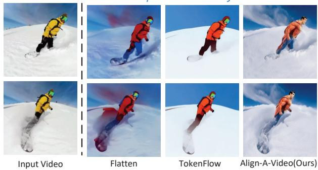
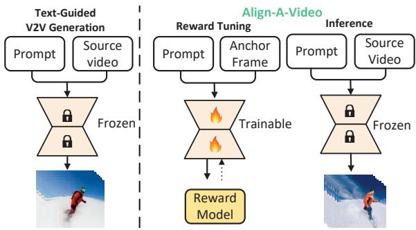
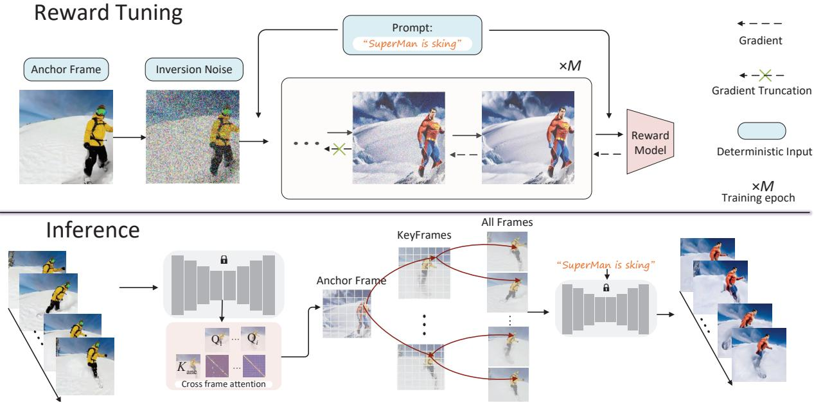
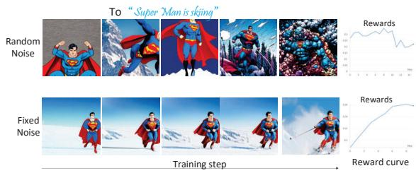
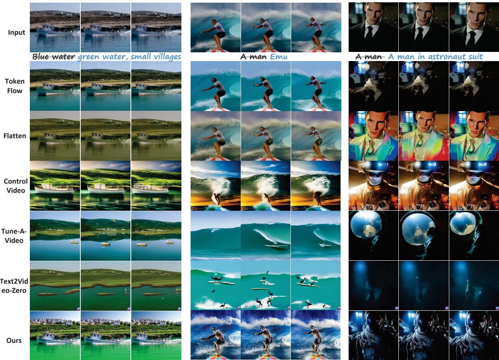
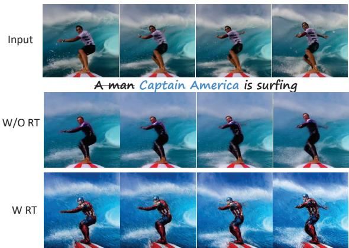
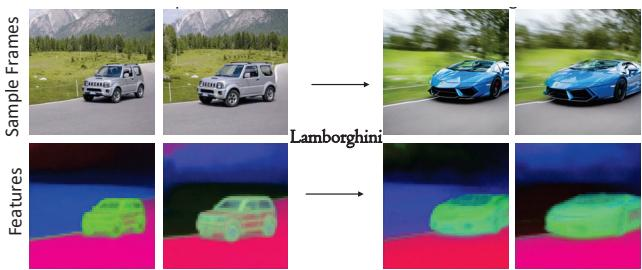
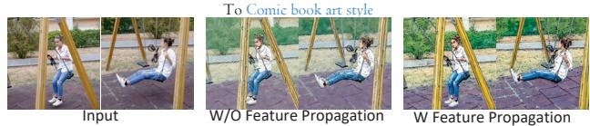
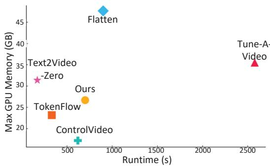
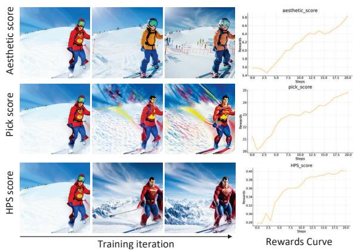

# Align-A-Video: Deterministic Reward Tuning of Image Diffusion Models for Consistent Video Editing

Shengzhi Wang1, Yingkang Zhong2, Jiangchuan Mu1, Kai Wu3, Mingliang Xiong2, Wen Fang2, Mingqing Liu2, Hao Deng2, Bin He1, Gang Li1, and Qingwen Liu \*1,2

1Shanghai Research Institute for Autonomous Intelligent Systems, Tongji University 2School of Computer Science and Technology, Tongji University 3ByteDance

## Abstract

Due to control limitations in the denoising process and the lack of training, zero-shot video editing methods often struggle to meet user instructions, resulting in generated videos that are visually unappealing andfail tofully satisfy expectations. To address this problem, we propose Align-A-Video, a video editing pipeline that incorporates human feedback through reward fine-tuning. Our approach consists of two key steps: 1) Deterministic Reward Fine-tuning. To reduce optimization costs for expected noise distributions, we propose a deterministic reward tuning strategy. This method improves tuning stability by increasing sample determinism, allowing the tuning process to be completed in minutes; 2) Feature Propagation Across Frames. We optimize a selected anchor frame and propagate its features to the remainingframes, improving both visual quality and semantic fidelity. This approach avoids temporal consistency degradation from reward optimization. Extensive qualitative and quantitative experiments confirm the effectiveness of using reward fine-tuning in Align-A-Video, significantly improving the overall quality of generated videos.

## 1. Introduction

The rapid advancement of diffusion models [11, 28, 31, 47] has significantly enhanced image generation technologies, enabling precise manipulation of various image attributes [2, 14]. However, diffusion models have yet to achieve high-quality performance in video generation. Due to the complexity of temporal motion in videos, training a video diffusion model requires substantial data and computational resources [37, 45]. To avoid learning temporal dynamics from scratch, zero-shot video editing methods leverage pre-trained image diffusion models to transform source videos into new ones while preserving the original motion [5, 10, 18, 22, 44, 49]. However, successfully applying image diffusion models to the video domain is a challenging task. It requires addressing the following key aspects: 1) Temporal consistency : cross-frame constraints for motion consistency; 2) Semantic fidelity: generated content matches the input text descriptions; 3) Visual quality: aligns with the user’s aesthetic preferences.

To ĀSuperman is skiingā  
  
Figure 1. Given a source input video and a text prompt, we utilize a pre-trained image diffusion model [24] to edit the video. Stateof-the-art zero-shot video editing methods, such as Flatten [5] and TokenFlow [10], struggle to generate content that is align with the text prompt. Our proposed method achieves improved text alignment and better visual quality.

Current state-of-the-art methods [5, 10, 41, 44, 49] achieve temporal consistency by imposing strict control conditions, such as DDIM inversion [31], attention feature injection [35], depth guidance [46], and optical-flow constraints [43]. While these techniques successfully stabilize inter-frame coherence, their heavy reliance on fixed priors introduces two critical limitations: semantic fidelity degradation and visual quality compromise, as shown in Fig. 1. This reveals a fundamental challenge in video editing: Existing approaches treat temporal consistency as a primary optimization target, yet inadvertently suppress the flexibility required for high-fidelity semantic preservation and visual refinement.

  
Figure 2. Overview of the Align-A-Video Framework.

In this paper, we introduce a novel method for video editing tasks, comprising two key components: image reward optimization and video editing inference, as shown in Fig. 2. Directly applying image-based reward optimization to video content could compromise temporal consistency (i.e., the smooth continuity between frames in a video) [45].To address this issue, rather than optimizing the entire video at once, our method begins by refining an anchor frame (a key frame in the video). This approach enhances the anchor frame while preserving both semantic accuracy and visual quality. The features of the optimized anchor frame are then used as a reference to adjust the remaining frames. To better propagate the optimized features while ensuring appearance consistency across the entire video, we adapt the spatialtemporal attention mechanism from [41] into a cross-frame attention mechanism. This adaptation prioritizes the relationship between the anchor frame and the other frames. By integrating these two components, our framework achieves significant improvements in the overall quality of the edited videos. In summary, our main contributions are as follows:

• A novel one-shot tuning paradigm for text-guided videoto-video generation tasks, effectively improving visual quality and semantic fidelity of generated videos while maintaining temporal consistency.

• A fast reward tuning method that aims to achieve stable and rapid alignment of a text-image pair in terms of shape, texture, and color.

• A feature propagation method allows the reward optimization results to propagate across frames.

## 2. Related Work

Our work lies at the intersection of text-guided V2V synthesis and image reward fine-tuning. In this section, we provide a concise overview of the key research in these areas, highlighting the connections and distinctions between our work and previous studies.

## 2.1. Text-Guided V2V Synthesis

Gen-1 displayed a structure and content-driven approach [6]. However, it required significant computational resources and was limited by the duration of videos it could process. Recently, some promising work has utilized pretrained image diffusion models for text-driven V2V synthesis tasks [5, 10, 13, 17, 22, 26, 27, 38, 41, 49, 50], either in one-shot or zero-shot training methods. Tune-A-Video [41] utilizes a one-shot approach that expands the latent space into the spatial-temporal domain and incorporates a temporal attention module to assimilate motion priors. Despite these innovations, issues with temporal consistency persist. To address this, several training-free methods have been developed: ControlVideo [49] calculates a depth map from the source video, enhancing the editing quality via ControlNet; TokenFlow [10] maintains temporal consistency by aligning inter-frame correspondences in the diffusion feature space; Flatten [5] leverages optical flow to direct the attention module during diffusion. Although these methods are effective, they often overload the diffusion process with pixel information to maintain consistency, causing the output to overly resemble the source video and diverge from textual prompts and intended edits. Our research seeks to refine the output quality and text alignment of edited videos without compromising their temporal consistency.

## 2.2. Image Reward Tuning

Reinforcement learning with human feedback when applied to large language models, enhances their capability to produce text outputs that align with human preferences [19, 32]. From this perspective, image and video generation tasks share the same target [1, 7, 20, 36, 45]. In the realm of image generation, DDPO [1] and DPOK [7] conceptualize the denoising steps of diffusion models as a series of decision-making processes, introducing the technique of denoising diffusion policy optimization. They demonstrated improvements in image compression, aesthetics, and text alignment using reward functions such as the JPEG compression algorithm, LAION aesthetics predictor [25], and BERTScore [48]. Furthermore, DRaFT [4] and Align-Prop [20] implement gradient clipping and checkpointing during the sampling phase to efficiently propagate the gradients from differentiable reward functions. In video generation, InstructVideo [45] and VADER [21] use reward finetuning to optimize text-to-video (T2V) diffusion models. They utilize gradient clipping and checkpointing methods to backpropagate reward gradients during the diffusion model sampling process. Considering the challenges of training a video-specific reward model, both methods initially use image reward models as the reward function. Due to the degradation of temporal consistency caused by directly applying dense image rewards to video outputs, InstructVideo introduced Segmented Video Rewards, which strategically evaluates video quality based on a set of sparsely sampled frames. The efforts of InstructVideo and VADER revolve around using extensive data to train general-purpose textto-video models, a process that typically requires a substantial amount of time. Conversely, our approach concentrates on swift, precise reward optimization with a single prompt for text-guided V2V synthesis, capable of completing optimization within several minutes.

## 3. Methodology

## 3.1. Preliminaries

Diffusion models [11, 28] learn to approximate the probability distribution $p ( x )$ by reversing a noise-adding process, which gradually corrupts the sample x. The forward process, in which noise is progressively added to a clean image $x _ { 0 }$ according to $x _ { t } ~ = ~ \sqrt { \bar { \alpha } _ { t } } x + \sqrt { 1 - \bar { \alpha } _ { t } } \epsilon$ , where $\epsilon \sim N ( 0 , 1 )$ and $\bar { \alpha } _ { t }$ are the noise schedule that controls the rate of the diffusion process. The model then learns a reverse diffusion process to predict the noise ˆ given $x _ { t }$ and t as inputs. The denoising process is achieved by a neural network $\hat { \boldsymbol { \epsilon } } = \epsilon _ { \boldsymbol { \theta } } \left( \boldsymbol { x } _ { t } ; t \right)$ . By adding an additional conditional signal c (such as text) to the denoising neural network $\epsilon _ { \theta } .$ the probability distribution can be extended to $p ( x | c )$ Training the parameters θ of the denoising network $\epsilon _ { \theta }$ with a large number of image-text pairs using the following objective [11, 30]:

$$
\begin{array} { r } { \mathcal { L } _ { D M } = \mathbb { E } _ { x , \epsilon \sim \mathcal { N } ( 0 , 1 ) , t } \left[ \left. \epsilon - \hat { \epsilon } \right. _ { 2 } ^ { 2 } \right] . } \end{array}\tag{1}
$$

DDIM enables the conversion of random noise into a deterministic outcome during sampling. Assuming that the ordinary differential equation can be reversed in the smallstep limit, the deterministic DDIM reverse transformation [29, 31] can be expressed as:

$$
\begin{array} { r } { z _ { t } = \sqrt { \frac { \bar { \alpha } _ { t } } { \bar { \alpha } _ { t - 1 } } } z _ { t - 1 } + \sqrt { \bar { \alpha } _ { t } } \left( \sqrt { \frac { 1 } { \bar { \alpha } _ { t } } - 1 } - \sqrt { \frac { 1 } { \bar { \alpha } _ { t - 1 } } - 1 } \right) \epsilon _ { \theta } \left( z _ { t } , t \right) . } \end{array}\tag{2}
$$

where $z _ { t }$ is the latent variable at timestep $t ; \bar { \alpha } _ { t }$ is the cumulative scaling factor at timestep t.

## 3.2. Overall Framework

Given an input video $\begin{array} { l l l } { { \pmb { \mathcal { T } } } } & { { = } } & { { \left[ { \pmb { I } } ^ { 1 } , \ldots , { \pmb { I } } ^ { n } \right] } } \end{array}$ and an editing prompt $\mathcal { P }$ , we aim to generate an edited video $\mathcal { I } =$ $\bar { \lceil J ^ { 1 } , \ldots , J ^ { n } \rceil }$ that aligns with the text prompt $\mathcal { P }$ . However, discrepancies may arise between $\mathcal { I }$ and $\mathcal { P }$ due to various conditional constraints during the sampling process.

Therefore, we introduce image reward fine-tuning within the video editing pipeline to align the edited video with the textual prompts. As shown in Fig. 3, our framework, named Align-A-Video, consists of two steps: during fine-tuning, we use image reward scores to update the projection matrix in the attention blocks. During inference, we sample a new video from the inverted latent noise of the input video, guided by the editing prompt.

## 3.3. Deterministic Reward Tuning

The goal of image reward tuning is to train the parameters $\theta$ of  to maximize a reward function for the generated images:

$$
\begin{array} { r } { \mathcal { L } _ { \mathcal { R } } ( \theta ) = \mathbb { E } _ { \mathbb { P } ( \pmb { \mathcal { P } } ) } \mathbb { E } _ { \mathbb { P } ( \pmb { x } | \pmb { \mathcal { P } } , z ) } \left[ - \mathcal { R } \left( \pmb { x } , \pmb { \mathcal { P } } \right) \right] , } \end{array}\tag{3}
$$

where $\mathbb { E } _ { \mathbb { P } ( \mathcal { P } ) }$ denotes the expected distribution of prompts ${ \mathcal { P } } ,$ and $\mathbb { E } _ { \mathbb { P } ( x | \mathcal { P } , z ) }$ is the expected distribution of the generated images x given the prompts $\mathcal { P }$ and the sampled noise $z \sim \mathcal { N } ( 0 , \mathbf { I } )$ . Directly applying image rewards to edited videos compromise temporal consistency due to the misalignment between frame-wise optimization and overall video coherence [45]. Given that video is a natural extension of images, we believe that human preferences for images can be extended to video. Therefore, we consider performing single-frame optimization and then propagating the results to the remaining frames.

For an given editing prompt ${ \mathcal { P } } _ { \mathrm { { i } } }$ , our goal is to maximize the reward scores of generated images x. A natural idea is to optimize the expected distribution of the generated images x given the prompts $\mathcal { P }$ and the sampled noise z:

$$
\begin{array} { r } { \mathcal { L } _ { \mathcal { R } } ( \theta ) = \mathbb { E } _ { \mathbb { P } ( x \mid \mathcal { P } , z ) } \left[ - \mathcal { R } \left( x , \mathcal { P } \right) \right] . } \end{array}\tag{4}
$$

However, this approach encounters difficulties in achieving training convergence. When minimizing the expected loss across different sampled noise inputs, the variability in the noise $z _ { i }$ results in noticeable changes in the model output $x _ { i } ,$ which in turn leads to substantial fluctuations in the reward scores. These fluctuations contribute to instability in the gradient $\nabla _ { \boldsymbol { \theta } } \mathcal { L } _ { \mathcal { R } }$ (See Fig. 4, first row). Additionally, this optimization process is not sufficiently targeted, as it lacks a clear focus on specific objectives or constraints that could guide the training more effectively for subsequent video editing inference.

To address these challenges, we introduce deterministic reward tuning. For a given anchor frame $\pmb { I } _ { a n c } \in$ $\lceil \pmb { I } ^ { 1 } , \dots , \pmb { I } ^ { n } \rceil$ , we apply DDIM inversion [31] to obtain a deterministic initial noise z, which is then reused in each training iteration. Keeping the initial noise constant eliminates the variance introduced by randomness, resulting in more consistent outputs and stable parameter updates. This allows the model to concentrate on refining the input-output relationship, thereby reducing volatility in gradient descent and facilitating reliable convergence (See Fig. 4).

  
Figure 3. Align-A-Video pipeline.

  
Figure 4. Observations on single-prompt reward optimization. Directly optimizing the noise distribution for a single prompt led to training collapse (see first row). In contrast, sampling and fixing a single noise (i.e., using a constant random seed so that each iteration receives the same noise input) stabilizes the training process (see second row).

In the generation process, the initial steps are crucial for shaping the rough structure of the image, while the subsequent steps refine this initial image. The essence of reward tuning is not to drastically change the model’s output, but to subtly adjust it to align with human preferences. Guided by this concept, we extract inversion features during the last k steps of the deterministic DDIM inversion process. These features are then reused in the initial k steps of the denoising process [35]. This approach helps shape the rough structure of the generated images, thereby increasing their determinism. For the remaining denoising steps, we randomize the truncation of gradients, varying the time steps at which backpropagation occurs to subtly adjust the generated images while mitigating the short-term dependency bias introduced by gradient updates over a limited number of steps [20, 34]. Specifically, we define a hyperparameter l Uniform(K), where $K = \{ k , \ldots , T \}$ and T denotes the total number of DDIM steps. This hyperparameter serves as the starting point for reward tuning at the beginning of each training iteration, with gradients being truncated during the backpropagation process at l.

Finally, since $x , \mathcal { P } _ { ; }$ , and z are all deterministic values, the expectation term $\mathbb { E } _ { \mathbb { P } ( x | \mathcal { P } , z ) }$ is omitted. Thus, our reward loss is redefined as:

$$
{ \mathcal { L } } _ { { \mathcal { R } } } ( \theta ) = - { \mathcal { R } } \left( x , { \mathcal { P } } \right) .\tag{5}
$$

The proposed method fine-tunes the model exclusively on anchor frame generation, effectively eliminating the need to optimize the entire video or image set. This strategy significantly reduces the training cost while improving the precision of the optimization process.

## 3.4. Feature Propagation of Anchor Frame

Our method first sampling a set of keyframes, followed by feature propagation between anchor frames and keyframes, and finally using the keyframes to guide the generation of the remaining frames. Specifically, at each generation step, we sample a set of keyframes $\left\{ \mathcal { K } ^ { i } \right\} _ { i \in \kappa } .$ . To encourage visual consistent between these keyframes, we extend the self-attention to cross-frame attention, allowing simultaneous processing of keyframes [41]. The cross-frame attention features of all keyframes can be represented as $\left\{ \mathbf { Q } ^ { i } \right\} _ { i \in \kappa } , \left\{ \mathbf { K } ^ { i } \right\} _ { i \in \kappa } , \left\{ \mathbf { V } ^ { i } \right\} _ { i \in \kappa }$ , where Qi, Ki, and $\mathbf { V } ^ { i }$ are the query, key, and value for frame $\textit { i } \in \kappa ,$ , and $\kappa ~ =$ $\{ i _ { 1 } , \ldots i _ { k } \}$ . To facilitate the propagation of anchor frame features, we derive the query features $\mathbf { Q } _ { c u r r }$ from the current frame and derive the key ${ \bf K } _ { a n c }$ and value ${ \bf V } _ { a n c }$ from the anchor frame. Therefore, the cross-frame attention is formulated as:

  
Figure 5. Qualitative comparisons between our method and baselines. Our approach achieves superior visual quality and semantic fidelity, while effectively preserving the structural integrity and motion consistency of the source frames. We recommend that readers consult the supplementary materials for more detailed results.

$$
\phi \left( \mathbf { \mathcal { K } } ^ { i } \right) = \mathrm { s o f t m a x } \left( \frac { \mathbf { Q } _ { \mathrm { c u r r } } \mathbf { K } _ { \mathrm { a n c } } ^ { T } } { \sqrt { d } } \right) \mathbf { V } _ { \mathrm { a n c } }\tag{6}
$$

Intuitively, each keyframe queries the anchor frame and aggregates information from it. This allows the keyframes to have a stronger dependency on the anchor frame, resulting in a roughly consistent appearance between the keyframes and the anchor frame.

Given $\{ \phi \left( \mathcal { K } ^ { i } \right) \}$ , we propagate across the entire video based on the features correspondence extracted from the original video [10]. We fuse the remaining frames with the key frame based on the attention results, using a weighted average. The weights $w _ { i }$ are determined by the distance between the current frame and the key frames:

$$
w _ { s } = | s - p ^ { - } | / ( | s - p ^ { - } | + | s - p ^ { + } | ) ,\tag{7}
$$

where $s = \{ 1 , \ldots n \}$ is the index of the current frame, $p ^ { - } \in$ κ represents the index of the nearest key frame before s, and $p ^ { + } \in \kappa$ represents the index of the nearest key frame after s. The fused result for frame s, denoted by $F _ { s } ,$ can be expressed as:

$$
F _ { s } = w _ { s } \cdot \phi ( \mathcal { K } ^ { p ^ { - } } ) + ( 1 - w _ { s } ) \cdot \phi ( \mathcal { K } ^ { p ^ { + } } ) .\tag{8}
$$

Feature propagation of the optimized anchor frame significantly improves prompt alignment performance and visual quality, while preserving motion consistency between edited and source videos.

## 4. Experiments

## 4.1. Experimental Setup

Datasets. We evaluate our method on the V2VBench dataset [33], a comprehensive benchmark specifically designed to assess video editing techniques. The dataset consists of 50 standardized videos, grouped into various categories. Each video is accompanied by 3 unique editing prompts, which collectively span 4 different editing tasks: foreground, stylization, a combination of foreground and background, and a combination of foreground and stylization.

Implementation Details. Our method leverages a pretrained text-to-image model alongside existing image control techniques for video editing. We utilize Stable Diffusion (version 1.5) [24] as the image generator, together with the DDIM scheduler for reverse steps and sampling across a defined number of iterations. We adopt the PnP-diffusion [35] to guide the sampling process of keyframes. we employ HPSv2 [42] as the reward function. Directly backpropagating the reward loss into the diffusion model is computationally intensive and risks catastrophic forgetting [8, 9]. To mitigate these challenges and further accelerate fine-tuning, we integrate LoRA [12].

Evaluation Metrics. We evaluate the performance of Align-A-Video from three key perspectives: 1)Visual Quality, which examines the overall visual appeal of the generated video; 2)Semantic Fidelity, assessing whether the edited video adheres accurately to user instructions; and 3)Temporal Consistency, assessing smooth continuity across frames. To evaluate semantic fidelity: we used the CLIP score [23] to assess the feature similarity between generated frames and their target prompts. The original CLIP score may not always accurately reflect video-level alignment. To address this, we also computed ViCLIP score [39], which is trained on video-text pairs, the ViCLIP score evaluates the spatiotemporal alignment between the video’s content and the target prompts, providing a more comprehensive measure of alignment at the video level. For visual quality, we utilized the Aesthetic score [25], which is calibrated with human rankings, to assess the visual appeal and aesthetic quality of the edited video frames. Additionally, we considered the Pick score [16], a CLIP-based scoring function trained on extensive human preference labels, which simultaneously evaluates image and text inputs to reflect content quality and alignment. In addition to frameby-frame evaluations, we employed the DOVER score [40], an advanced video quality assessment metric. Trained on a large-scale dataset of human-ranked videos, DOVER effectively evaluates artifacts, distortions, and blurriness in video content. For temporal consistency, we consider three metrics: CLIP Consistency, DINO Consistency, and Endpoint Error (EPE). Specifically, CLIP Consistency is obtained by calculating the cosine similarity between CLIP embeddings [23] of adjacent frames, primarily to assess inter-frame consistency and video smoothness. We use DINO [3] to check whether the object-level appearance in the edited video remains consistent by calculating the object-level inter-frame similarity, denoted as DINO Consistency. Additionally, we calculate the optical flow for each source-edited video pair using GMFlow [43] and measure the EPE to evaluate their consistent motion alignment.

Baselines. We compare our method to the state-of-the-art methods: Tune-A-Video [41], TokenFlow [10], Flatten [5], Text2Video-Zero [15], ControlVideo [49]. We categorize these methods based on generation control conditions into three classes: 1) attention feature injection, which uses PnP diffusion [35] as a control mechanism to guide video generation, with methods such as TokenFlow and Flatten; 2)diffusion latents manipulation, which involves controlling or adjusting latents in the diffusion model’s generation process to influence the generated content, including methods like Text2Video-Zero and ControlVideo; and 3) learning paradigm, which applies training to learn motion priors from the source video for generation control, with methods such as Tune-A-Video. We reimplemented these 5 methods using their officially released code repositories.

## 4.2. Main Results

Qualitative Evaluation. Figure 5 shows the comparison results between our method and the baselines. Text2Video-Zero relies on random initial noise, leading to a heavy dependence on extended attention mechanisms to implicitly encourage consistency. Tune-A-Video encounters difficulties in learning motion consistency, especially when motion complexity increases. TokenFlow and Flatten perform well in three temporal consistency metrics; however, they fall short in adhering to textual instructions. Although attention feature injection aligns source frame structure and maintains motion consistency, it can impede the model’s ability to follow prompt instructions accurately, sometimes resulting in meaningless edits. ControlVideo performs well in terms of visual quality and semantic fidelity but lacks alignment with the motion of source videos. In contrast, our method generates frames that simultaneously adhere to editing prompts, preserve the source frame structure, and achieve superior visual quality, whereas other methods struggle to meet all three objectives at once. Notably, although our method also employs attention feature injection, it successfully aligns the injected features with text instructions after just a few reward fine-tuning steps.

Quantitative Evaluation. We present quantitative evaluation results in Table 1. No method consistently outperforms all others across all metrics. Baselines with attention feature injection (TokenFlow and Flatten) show a clear advantage in temporal consistency. On the EPE metric, even the lowest-performing feature injection method surpasses the best scores from other baselines. However, feature injection operations retain substantial pixel information from the source video, emphasizing temporal consistency at the expense of visual quality and semantic fidelity. Tune-A-Video excels at accurately following editing instructions (high semantic fidelity), but its output sometimes exhibits noticeable visual artifacts (lower temporal consistency). ControlVideo performs well overall but still falls short in maintaining consistent motion alignment with the input source video. Text2Video-Zero uses random noise instead of noise reversed from the source frames, resulting in generated frames that differ from the source frames and leading to unsatisfactory performance. Our method achieves superior performance in visual quality. It significantly outperforms other methods in the Dover score (0.761, compared to the second-best score of 0.708). It also achieves competitive performances in both semantic fidelity and temporal consistency. By employing reward tuning, our approach strikes a balance among these three aspects.

Table 1. Quantitative evaluation results. Red and blue indicate the best and second-best result. S.: score; C.: consistency.
<table><tr><td rowspan="2"></td><td colspan="3">Visual Quality</td><td colspan="2">Semantic Fidelity</td><td colspan="3">Temporal Consistency</td></tr><tr><td>Aesthetic S.</td><td>Pick S.</td><td>Dover S.</td><td>Clip S.</td><td>V-Clip S.</td><td>Clip C.</td><td>Dino C.</td><td>EPE</td></tr><tr><td>TokenFlow</td><td>5.035</td><td>20.594</td><td>0.695</td><td>0.264</td><td>0.238</td><td>0.957</td><td>0.956</td><td>-1.762</td></tr><tr><td>Flatten</td><td>4.847</td><td>20.391</td><td>0.680</td><td>0.265</td><td>0.242</td><td>0.931</td><td>0.940</td><td>-2.187</td></tr><tr><td>Tune-A-Video</td><td>5.299</td><td>20.959</td><td>0.697</td><td>0.282</td><td>0.263</td><td>0.873</td><td>0.824</td><td>-13.667</td></tr><tr><td>ControlVideo</td><td>5.520</td><td>21.039</td><td>0.708</td><td>0.282</td><td>0.259</td><td>0.956</td><td>0.937</td><td>-9.309</td></tr><tr><td>Text2Video-Zero</td><td>4.960</td><td>20.476</td><td>0.596</td><td>0.280</td><td>0.263</td><td>0.909</td><td>0.889</td><td>-15.611</td></tr><tr><td>Ours</td><td>5.512</td><td>21.847</td><td>0.761</td><td>0.284</td><td>0.265</td><td>0.955</td><td>0.944</td><td>-1.874</td></tr></table>

## 4.3. Ablation study

Effectiveness of Deterministic Reward Tuning. We ablated the training process to analyze its impact. The results shown in Fig. 6 indicate that the model without training replicates the motion from the input video (i.e., surfing) but fails to follow the input text instruction (edit ”A man” to ”Captain America”). Our method achieves optimal performance by aligning with textual instructions through deterministic reward tuning, without sacrificing temporal consistency. Additionally, using feature injection [35] to guide the denoising process enforces strict adherence to the structural layout of the source video, making it challenging to balance temporal consistency with structural editing [5, 10]. Our method employs reward training, guiding the edited results to gradually align with textual instructions. This process allows for relatively simple structural editing while maintaining temporal consistency. As shown in the second row of Fig. 7, the injected diffusion features are aligned with the textual instructions after the reward training and denoising processes.

  
Figure 6. Ablation study of reward tuning. RT: Reward Tuning.

  
Figure 7. Visualization of diffusion features. Given the input video, we apply DDIM inversion to each frame and extract features from the highest-resolution decoder layer. We apply PCA to the extracted features and visualize the top three components.

Effectiveness of Cross Frame Attention. We conducted an ablation study on cross-frame attention, replacing it with the extended attention from [10]. The ablation results are shown in Fig. 8. Directly applying extended attention can retain some effects of reward optimization, but it makes the generated frames blurry, whereas our cross-frame selfattention preserves the quality of the generated frames. Most existing methods achieve cross-frame attention by extending self-attention to include multiple frames, thereby producing better coherence. Our approach continues this line of thought, sharing anchor frame features between key frames to ensure that optimization results propagate more effectively across frames.

  
Figure 8. Ablation study of cross-frame attention.

  
Figure 9. Comparison of Editing Efficiency. We considered both time efficiency (the time required to perform one edit) and space efficiency (the maximum GPU memory allocated during editing). Tests were conducted on a single NVIDIA RTX 6000 ADA.

## 4.4. Editing Efficiency

In Fig. 9, we compare the editing efficiency of different methods on a 40-frame video. TokenFlow and ControlVideo demonstrate advantages in memory consumption and running speed. Due to the absence of DDIM inversion, Text2Video-Zero achieves a faster editing speed. However, its editing quality declines, with occasional artifacts and jitter. Our method effectively reduces memory consumption and significantly shortens training time through deterministic training, achieving competitive editing efficiency compared to other methods.

## 4.5. Adaptation to Other Reward Models

In this work, we focus on using HPSv2 [42]. To further validate the generalization capability of our method with respect to other reward functions, we explored using PickScore [16] and the LAION aesthetic predictor [25] as our reward models. We conducted the same reward finetuning as with HPSv2 and presented the results in Fig. 10. We observed that, although different in style from HPSv2, the quality of the results generally improved in terms of structure, colors, and detail. The LAION aesthetic predictor is solely used to evaluate the aesthetic quality of an image and thus does not possess text alignment capabilities.

  
Figure 10. Training with different reward models.

## 5. Conclusion

In this paper, we present Align-A-Video, a novel method that leverages human preferences to guide text-driven V2V synthesis. To accelerate and stabilize the training process, we propose deterministic reward tuning. To achieve consistent optimization across frames, we introduce anchor frame feature propagation. Extensive experiments demonstrate that our method achieves superior results in visual quality, semantic fidelity, and temporal consistency.

## 6. Acknowledgments

This work was supported in part by the Shanghai Municipal Science and Technology Major Project under Grant 2021SHZDZX0100; in part by the Shanghai Municipal Commission of Science and Technology Project under Grant 19511132101; in part by the National Key Research and Development Program of China under No.2022YFA1004700; in part by the National Natural Science Foundation of China under Grant 62305019, Grant 62301308, Grant 62371342, and Grant 62071334; in part by the China National Postdoctoral Program for Innovative Talents under Grant BX20230223; in part by the China Postdoctoral Science Foundation under Grant 2023M732262; in part by Aeronautical Science Foundation of China under Grant 20230007038001; and in part by the Fundamental Research Funds for the Central Universities under Grant 22120210543.

## References

[1] Kevin Black, Michael Janner, Yilun Du, Ilya Kostrikov, and Sergey Levine. Training diffusion models with reinforcement learning. arXiv preprint arXiv:2305.13301, 2023. 2

[2] Tim Brooks, Aleksander Holynski, and Alexei A Efros. Instructpix2pix: Learning to follow image editing instructions. In Proceedings of the IEEE/CVF Conference on Computer Vision and Pattern Recognition, pages 18392–18402, 2023. 1

[3] Mathilde Caron, Hugo Touvron, Ishan Misra, Herve J´ egou,´ Julien Mairal, Piotr Bojanowski, and Armand Joulin. Emerging properties in self-supervised vision transformers. In Proceedings of the IEEE/CVF international conference on computer vision, pages 9650–9660, 2021. 6

[4] Kevin Clark, Paul Vicol, Kevin Swersky, and David J Fleet. Directly fine-tuning diffusion models on differentiable rewards. arXiv preprint arXiv:2309.17400, 2023. 2

[5] Yuren Cong, Mengmeng Xu, Christian Simon, Shoufa Chen, Jiawei Ren, Yanping Xie, Juan-Manuel Perez-Rua, Bodo Rosenhahn, Tao Xiang, and Sen He. Flatten: optical flowguided attention for consistent text-to-video editing. arXiv preprint arXiv:2310.05922, 2023. 1, 2, 6, 7

[6] Patrick Esser, Johnathan Chiu, Parmida Atighehchian, Jonathan Granskog, and Anastasis Germanidis. Structure and content-guided video synthesis with diffusion models. In Proceedings of the IEEE/CVF International Conference on Computer Vision, pages 7346–7356, 2023. 2

[7] Ying Fan, Olivia Watkins, Yuqing Du, Hao Liu, Moonkyung Ryu, Craig Boutilier, Pieter Abbeel, Mohammad Ghavamzadeh, Kangwook Lee, and Kimin Lee. Reinforcement learning for fine-tuning text-to-image diffusion models. Advances in Neural Information Processing Systems, 36, 2024. 2

[8] Tao Feng, Mang Wang, and Hangjie Yuan. Overcoming catastrophic forgetting in incremental object detection via elastic response distillation. In Proceedings ofthe IEEE/CVF conference on computer vision and pattern recognition, pages 9427–9436, 2022. 6

[9] Tao Feng, Hangjie Yuan, Mang Wang, Ziyuan Huang, Ang Bian, and Jianzhou Zhang. Progressive learning without forgetting. arXiv preprint arXiv:2211.15215, 2022. 6

[10] Michal Geyer, Omer Bar-Tal, Shai Bagon, and Tali Dekel. Tokenflow: Consistent diffusion features for consistent video editing. arXiv preprint arXiv:2307.10373, 2023. 1, 2, 5, 6, 7, 8

[11] Jonathan Ho, Ajay Jain, and Pieter Abbeel. Denoising diffusion probabilistic models. Advances in neural information processing systems, 33:6840–6851, 2020. 1, 3

[12] Edward J Hu, Yelong Shen, Phillip Wallis, Zeyuan Allen-Zhu, Yuanzhi Li, Shean Wang, Lu Wang, and Weizhu Chen. Lora: Low-rank adaptation of large language models. arXiv preprint arXiv:2106.09685, 2021. 6

[13] Hyeonho Jeong and Jong Chul Ye. Ground-a-video: Zeroshot grounded video editing using text-to-image diffusion models. arXiv preprint arXiv:2310.01107, 2023. 2

[14] Bahjat Kawar, Shiran Zada, Oran Lang, Omer Tov, Huiwen Chang, Tali Dekel, Inbar Mosseri, and Michal Irani. Imagic:

Text-based real image editing with diffusion models. In Proceedings of the IEEE/CVF Conference on Computer Vision and Pattern Recognition, pages 6007–6017, 2023. 1

[15] Levon Khachatryan, Andranik Movsisyan, Vahram Tadevosyan, Roberto Henschel, Zhangyang Wang, Shant Navasardyan, and Humphrey Shi. Text2video-zero: Textto-image diffusion models are zero-shot video generators. In Proceedings of the IEEE/CVF International Conference on Computer Vision, pages 15954–15964, 2023. 6

[16] Yuval Kirstain, Adam Polyak, Uriel Singer, Shahbuland Matiana, Joe Penna, and Omer Levy. Pick-a-pic: An open dataset of user preferences for text-to-image generation. Advances in Neural Information Processing Systems, 36: 36652–36663, 2023. 6, 8

[17] Max Ku, Cong Wei, Weiming Ren, Huan Yang, and Wenhu Chen. Anyv2v: A plug-and-play framework for any videoto-video editing tasks. arXiv preprint arXiv:2403.14468, 2024. 2

[18] Xirui Li, Chao Ma, Xiaokang Yang, and Ming-Hsuan Yang. Vidtome: Video token merging for zero-shot video editing. In Proceedings of the IEEE/CVF Conference on Computer Vision and Pattern Recognition, pages 7486–7495, 2024. 1

[19] Long Ouyang, Jeffrey Wu, Xu Jiang, Diogo Almeida, Carroll Wainwright, Pamela Mishkin, Chong Zhang, Sandhini Agarwal, Katarina Slama, Alex Ray, et al. Training language models to follow instructions with human feedback. Advances in neural information processing systems, 35:27730– 27744, 2022. 2

[20] Mihir Prabhudesai, Anirudh Goyal, Deepak Pathak, and Katerina Fragkiadaki. Aligning text-to-image diffusion models with reward backpropagation. arXiv preprint arXiv:2310.03739, 2023. 2, 4

[21] Mihir Prabhudesai, Russell Mendonca, Zheyang Qin, Katerina Fragkiadaki, and Deepak Pathak. Video diffusion alignment via reward gradients. arXiv preprint arXiv:2407.08737, 2024. 2

[22] Chenyang Qi, Xiaodong Cun, Yong Zhang, Chenyang Lei, Xintao Wang, Ying Shan, and Qifeng Chen. Fatezero: Fusing attentions for zero-shot text-based video editing. In Proceedings of the IEEE/CVF International Conference on Computer Vision, pages 15932–15942, 2023. 1, 2

[23] Alec Radford, Jong Wook Kim, Chris Hallacy, Aditya Ramesh, Gabriel Goh, Sandhini Agarwal, Girish Sastry, Amanda Askell, Pamela Mishkin, Jack Clark, et al. Learning transferable visual models from natural language supervision. In International conference on machine learning, pages 8748–8763. PMLR, 2021. 6

[24] Robin Rombach, Andreas Blattmann, Dominik Lorenz, Patrick Esser, and Bjorn Ommer. High-resolution image ¨ synthesis with latent diffusion models. In Proceedings of the IEEE/CVF conference on computer vision and pattern recognition, pages 10684–10695, 2022. 1, 6

[25] Christoph Schuhmann. Laion aesthetic predictor. https: //laion ai/blog/laion- aesthetics/, 2022. Accessed: YYYY-MM-DD. 2, 6, 8

[26] Chaehun Shin, Heeseung Kim, Che Hyun Lee, Sang-gil Lee, and Sungroh Yoon. Edit-a-video: Single video editing with

object-aware consistency. In Asian Conference on Machine Learning, pages 1215–1230. PMLR, 2024. 2

[27] Uriel Singer, Adam Polyak, Thomas Hayes, Xi Yin, Jie An, Songyang Zhang, Qiyuan Hu, Harry Yang, Oron Ashual, Oran Gafni, et al. Make-a-video: Text-to-video generation without text-video data. arXiv preprint arXiv:2209.14792, 2022. 2

[28] Jascha Sohl-Dickstein, Eric Weiss, Niru Maheswaranathan, and Surya Ganguli. Deep unsupervised learning using nonequilibrium thermodynamics. In International conference on machine learning, pages 2256–2265. PMLR, 2015. 1, 3

[29] Jiaming Song, Chenlin Meng, and Stefano Ermon. Denoising diffusion implicit models. arXiv preprint arXiv:2010.02502, 2020. 3

[30] Yang Song and Stefano Ermon. Generative modeling by estimating gradients of the data distribution. Advances in neural information processing systems, 32, 2019. 3

[31] Yang Song, Jascha Sohl-Dickstein, Diederik P Kingma, Abhishek Kumar, Stefano Ermon, and Ben Poole. Score-based generative modeling through stochastic differential equations. arXiv preprint arXiv:2011.13456, 2020. 1, 3

[32] Nisan Stiennon, Long Ouyang, Jeffrey Wu, Daniel Ziegler, Ryan Lowe, Chelsea Voss, Alec Radford, Dario Amodei, and Paul F Christiano. Learning to summarize with human feedback. Advances in Neural Information Processing Systems, 33:3008–3021, 2020. 2

[33] Wenhao Sun, Rong-Cheng Tu, Jingyi Liao, and Dacheng Tao. Diffusion model-based video editing: A survey. arXiv preprint arXiv:2407.07111, 2024. 6

[34] Corentin Tallec and Yann Ollivier. Unbiasing truncated backpropagation through time. arXiv preprint arXiv:1705.08209, 2017. 4

[35] Narek Tumanyan, Michal Geyer, Shai Bagon, et al. Plugand-play diffusion features for text-driven image-to-image translation. In Proceedings of the IEEE/CVF Conference on Computer Vision and Pattern Recognition, pages 1921– 1930, 2023. 1, 4, 6, 7

[36] Dimitri Von Rutte, Elisabetta Fedele, Jonathan Thomm, and¨ Lukas Wolf. Fabric: Personalizing diffusion models with iterative feedback. arXiv preprint arXiv:2307.10159, 2023. 2

[37] Jiuniu Wang, Hangjie Yuan, Dayou Chen, Yingya Zhang, Xiang Wang, and Shiwei Zhang. Modelscope text-to-video technical report. arXiv preprint arXiv:2308.06571, 2023. 1

[38] Wen Wang, Yan Jiang, Kangyang Xie, Zide Liu, Hao Chen, Yue Cao, Xinlong Wang, and Chunhua Shen. Zero-shot video editing using off-the-shelf image diffusion models. arXiv preprint arXiv:2303.17599, 2023. 2

[39] Yi Wang, Yinan He, Yizhuo Li, Kunchang Li, Jiashuo Yu, Xin Ma, Xinyuan Chen, Yaohui Wang, Ping Luo, Ziwei Liu, Yali Wang, Limin Wang, and Yu Qiao. Internvid: A largescale video-text dataset for multimodal understanding and generation. arXiv preprint arXiv:2307.06942, 2023. 6

[40] Haoning Wu, Erli Zhang, Liang Liao, Chaofeng Chen, Jingwen Hou, Annan Wang, Wenxiu Sun, Qiong Yan, and Weisi Lin. Exploring video quality assessment on user generated contents from aesthetic and technical perspectives. In

Proceedings of the IEEE/CVF International Conference on Computer Vision, pages 20144–20154, 2023. 6

[41] Jay Zhangjie Wu, Yixiao Ge, Xintao Wang, Stan Weixian Lei, Yuchao Gu, Yufei Shi, Wynne Hsu, Ying Shan, Xiaohu Qie, and Mike Zheng Shou. Tune-a-video: One-shot tuning of image diffusion models for text-to-video generation. In Proceedings of the IEEE/CVF International Conference on Computer Vision, pages 7623–7633, 2023. 1, 2, 4, 6

[42] Xiaoshi Wu, Yiming Hao, Keqiang Sun, Yixiong Chen, Feng Zhu, Rui Zhao, and Hongsheng Li. Human preference score v2: A solid benchmark for evaluating human preferences of text-to-image synthesis. arXiv preprint arXiv:2306.09341, 2023. 6, 8

[43] Haofei Xu, Jing Zhang, Jianfei Cai, Hamid Rezatofighi, and Dacheng Tao. Gmflow: Learning optical flow via global matching. In Proceedings of the IEEE/CVF conference on computer vision and pattern recognition, pages 8121–8130, 2022. 1, 6

[44] Shuai Yang, Yifan Zhou, Ziwei Liu, and Chen Change Loy. Rerender a video: Zero-shot text-guided video-to-video translation. In SIGGRAPH Asia 2023 Conference Papers, pages 1–11, 2023. 1

[45] Hangjie Yuan, Shiwei Zhang, Xiang Wang, Yujie Wei, Tao Feng, Yining Pan, Yingya Zhang, Ziwei Liu, Samuel Albanie, and Dong Ni. Instructvideo: instructing video diffusion models with human feedback. In Proceedings of the IEEE/CVF Conference on Computer Vision and Pattern Recognition, pages 6463–6474, 2024. 1, 2, 3

[46] Lvmin Zhang, Anyi Rao, and Maneesh Agrawala. Adding conditional control to text-to-image diffusion models. In Proceedings of the IEEE/CVF International Conference on Computer Vision, pages 3836–3847, 2023. 1

[47] Qinsheng Zhang, Molei Tao, and Yongxin Chen. gddim: Generalized denoising diffusion implicit models. arXiv preprint arXiv:2206.05564, 2022. 1

[48] Tianyi Zhang, Varsha Kishore, Felix Wu, Kilian Q Weinberger, and Yoav Artzi. Bertscore: Evaluating text generation with bert. arXiv preprint arXiv:1904.09675, 2019. 2

[49] Yabo Zhang, Yuxiang Wei, Dongsheng Jiang, Xiaopeng Zhang, Wangmeng Zuo, and Qi Tian. Controlvideo: Training-free controllable text-to-video generation. arXiv preprint arXiv:2305.13077, 2023. 1, 2, 6

[50] Yuyang Zhao, Enze Xie, Lanqing Hong, Zhenguo Li, and Gim Hee Lee. Make-a-protagonist: Generic video editing with an ensemble of experts. arXiv preprint arXiv:2305.08850, 2023. 2