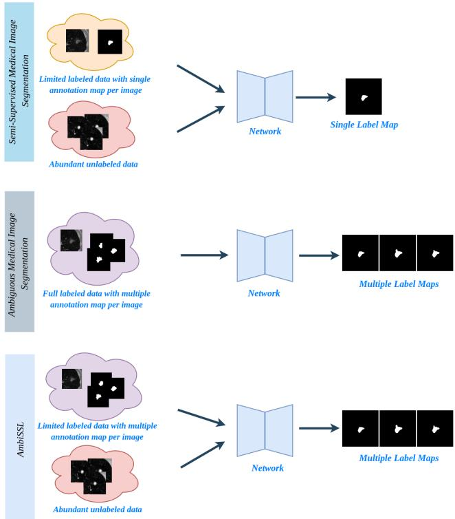
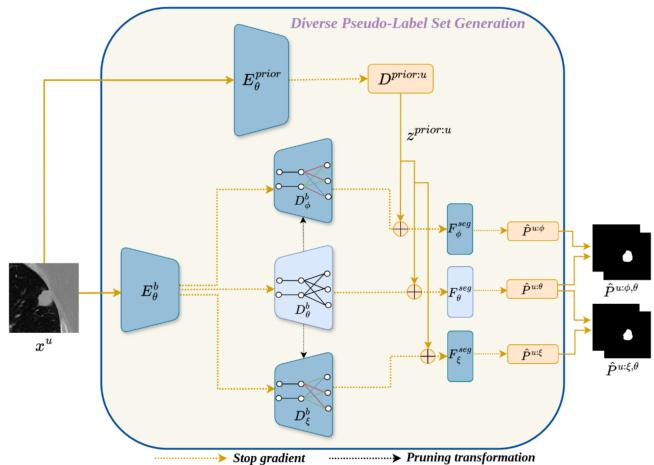
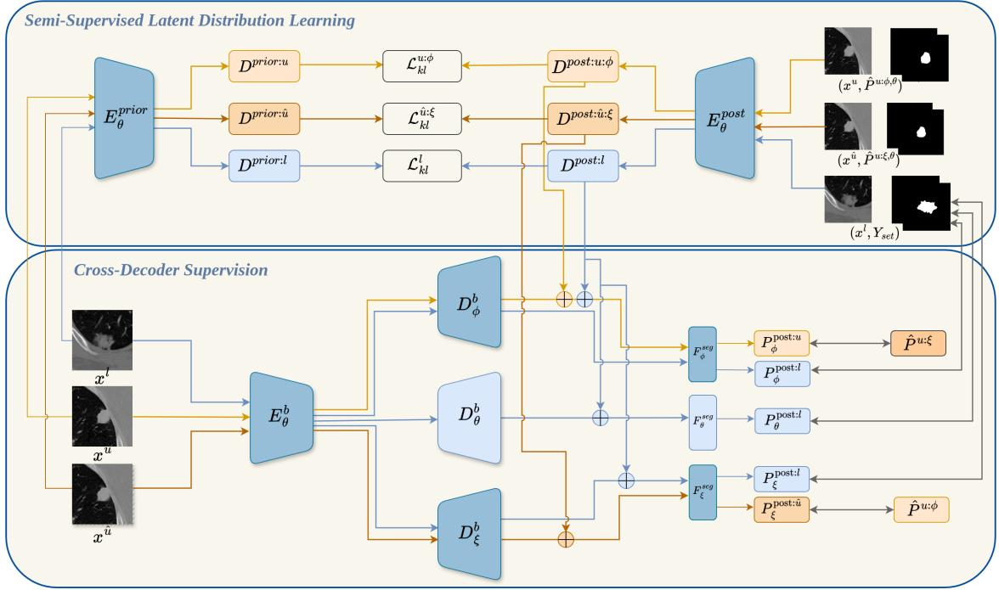
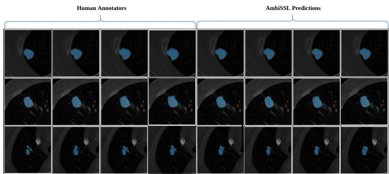

# Annotation Ambiguity Aware Semi-Supervised Medical Image Segmentation

Suruchi Kumari Pravendra Singh\*

Indian Institute of Technology Roorkee

{suruchi k@cs.iitr.ac.in, pravendra.singh@cs.iitr.ac.in}

## Abstract

Despite the remarkable progress ofdeep learning-based methods in medical image segmentation, their use in clinical practice remains limited for two main reasons. First, obtaining a large medical dataset with precise annotations to train segmentation models is challenging. Secondly, most current segmentation techniques generate a single deterministic segmentation mask for each image. However, in real-world scenarios, there is often significant uncertainty regarding what defines the “correct” segmentation, and various expert annotators might provide different segmentations for the same image. To tackle both of these problems, we propose Annotation Ambiguity Aware Semi-Supervised Medical Image Segmentation (AmbiSSL). AmbiSSL combines a small amount ofmulti-annotator labeled data and a large set of unlabeled data to generate diverse and plausible segmentation maps. Our method consists of three key components: (1) The Diverse Pseudo-Label Generation (DPG) module utilizes multiple decoders, created by performing randomized pruning on the original backbone decoder. These pruned decoders enable the generation of a diverse pseudo-label set; (2) a Semi-Supervised Latent Distribution Learning (SSLDL) module constructs a common latent space by utilizing both ground truth annotations and pseudo-label set; and (3) a Cross-Decoder Supervision (CDS) module, which enables pruned decoders to guide each other’s learning. We evaluated the proposed method on two publicly available datasets. Extensive experiments demonstrate that AmbiSSL can generate diverse segmentation maps using only a small amount of labeled data and abundant unlabeled data, offering a more practical solution for medical image segmentation by reducing reliance on large labeled datasets.

## 1. Introduction

Automatic medical image segmentation is a crucial step in developing effective clinical applications. Despite the remarkable progress of deep learning-based methods in medical image segmentation [9, 11, 33], their use in clinical practice [4] remains limited for two main reasons. First, acquiring a large, accurately annotated medical dataset for segmentation is challenging, as it requires pixel-level annotations, which are both time-consuming and costly to produce. Second, existing methods typically provide only a single segmentation map, while medical images often contain regions of inherent ambiguity, and a single ”correct”

  
Figure 1. In semi-supervised segmentation (top), few labeled samples and abundant unlabeled data are utilized, producing a single label map per image. Existing ambiguity-aware methods (middle) use multiple annotations per image, generating multiple segmentations. AmbiSSL, by contrast, leverages both unlabeled data and a limited amount of labeled data with multiple annotations, enabling the generation of multiple segmentations per image.

segmentation map may not exist. This ambiguity can stem from blurred or low-contrast images [34], complex anatomical structures [10, 23], varying interpretations by human raters, or specific downstream objectives [4]. Overlooking this ambiguity can negatively impact downstream analysis, diagnosis, and treatment.

Recent studies address the above issues separately, noting that while acquiring labeled data is challenging, obtaining unlabeled data is more practical [7]. Consequently, semi-supervised learning (SSL) has emerged as an effective paradigm that can achieve performance comparable to supervised learning at a lower cost [6, 7]. In SSL, a small set of labeled data is utilized alongside a substantial amount of unlabeled data. Several SSL techniques have been developed specifically for medical image segmentation [14]; however, these methods typically yield only a single segmentation mask for a given input image.

Independently, stochastic or ambiguous segmentation techniques generate multiple plausible segmentations during inference, capturing task-related uncertainty [19, 25, 35]. Despite this progress, training a model for ambiguous segmentation still requires annotations from multiple experts, which is costly and time-consuming. However, obtaining a small annotated dataset is feasible, and acquiring unlabeled data is relatively easy. Consequently, our work focuses on leveraging a small annotated dataset together with abundant unlabeled data to achieve diverse segmentation results.

Given the importance of both challenges in medical image segmentation, it is essential to develop a framework that can leverage both labeled and unlabeled data while simultaneously generating multiple plausible segmentation maps. To this end, we propose AmbiSSL, a novel annotation ambiguity aware semi-supervised approach for medical image segmentation (Figure 1). Our method comprises three key modules to effectively utilize the labeled and unlabeled data: (1) A Diverse Pseudo-label Generation (DPG) module that leverages multiple decoders, created through randomized pruning of the original backbone decoder. This pruning selectively removes weights from the final layers, resulting in varied representations across decoders. These diverse features from each decoder are then concatenated with sampled latent codes from the prior distribution to generate a diverse pseudo-label set. To further enhance quality, outputs from the multiple decoders are aggregated into an ensemble, refining the pseudo-label set for subsequent training, (2) The Semi-Supervised Latent Distribution Learning (SSLDL) module constructs a common latent space by incorporating both ground truth annotations and pseudo-label sets, and (3) The Cross-Decoder Supervision (CDS) module enables a pseudo-label set generated by one pruned decoder to guide the training of another, promoting crosssupervision that encourages the decoders to learn complementary features and correct each other’s mistakes.

Our Contributions: Our work presents the first solution to address annotation ambiguity in semi-supervised medical image segmentation. To tackle this, we introduce a DPG module, which utilizes multiple decoders created by performing random pruning on the original backbone decoder. These pruned decoders enable the generation of a diverse pseudo-label set. Secondly, we develop SSLDL module, which leverages both ground truth annotations and pseudolabel sets to construct a common latent space, where different latent codes lead to diversified segmentation results. Furthermore, to enable a comprehensive evaluation of our method, we establish several baselines that represent common approaches in the field, providing a fair comparison to assess the performance of our approach. Extensive experiments on two datasets with different label settings demonstrate that our framework provides diverse segmentation results, effectively utilizing the unlabeled data and reducing reliance on large labeled datasets.

## 2. Related work

## 2.1. Semi-supervised Medical Image Segmentation.

In the context of SSMIS, a variety of approaches have emerged to leverage both labeled and unlabeled data [20]. One common strategy is pseudo-labeling, where the model generates labels for unlabeled images, which are then used in subsequent training cycles [14]. Pseudo-labeling can be further divided into self-training and co-training methods. Self-training involves a single model generating pseudolabels for unlabeled data, which are iteratively used to refine the model’s predictions [5, 7]. In contrast, co-training involves training two or more models simultaneously on the same data but with different views or feature sets [6]. Each model provides pseudo-labels for the other, reducing the risk of reinforcing the same errors. The mutual correction framework (MCF) [32] introduces two distinct subnetworks that leverage their differences to identify and correct the model’s cognitive biases.

Another popular method involves consistency regularization, which encourages the model to produce stable predictions for unlabeled data under various perturbations, such as adding noise or applying transformations. Sajjadi et al. [26] propose a model that maintains consistency by evaluating outputs from augmented samples. Tarvainen et al. [30] present a teacher-student framework that utilizes exponential moving average weights to improve consistency. Furthermore, hybrid methods that combine different semi-supervised techniques, such as combining pseudolabeling with consistency regularization, have demonstrated improved performance in various medical imaging challenges [2].

All these methods perform well for medical image segmentation. However, they are unable to handle multiple label maps from different expert annotators and typically produce only a single segmentation mask for a given input image.

## 2.2. Ambiguous Medical Image Segmentation

Stochastic segmentation methods aim to generate multiple plausible segmentations at inference time, which helps represent uncertainty in challenging tasks. Estimating uncertainty allows users to assess their confidence in a segmentation, helping them make informed decisions and guiding subsequent processes. Various methods exist to capture this uncertainty. A popular approach is to estimate pixel-level probability [16, 17] by applying dropout to spatial features, though this often leads to inconsistent outputs [19]. An alternative, simpler approach involves training an ensemble of deep models for more stable predictions, though these may lack diversity and miss rare variations due to independent training [21]. To address these limitations, the probabilistic U-Net [19] incorporates pixel correlations using a multivariate Gaussian distribution with low-rank covariance. Other methods integrate hierarchical representations for UNetbased models through variational auto-encoders [18]. Recently, diffusion models have also been explored for ensembling and producing stochastic segmentations [25, 36]. However, these methods are relatively slow during training and inference due to the inherent nature of diffusion.

Despite the progress, all these methods require annotations for each image from multiple radiologists, which is costly and time-consuming. In contrast, our work focuses on using a small annotated dataset along with abundant unlabeled data to achieve diverse segmentation results.

## 3. Method

In Annotation Ambiguity Aware Semi-Supervised Medical Image Segmentation (AmbiSSL), we work with labeled data ${ D _ { l } } = \{ ( x _ { i } ^ { l } , Y _ { s e t } ^ { i } ) \} _ { i = 1 } ^ { R }$ and unlabeled data $D _ { u } =$ $\{ x _ { i } ^ { u } \} _ { i = 1 } ^ { S }$ , where R represents the number of labeled images and S represents the number of unlabeled images. Here, each $Y _ { s e t } ^ { i } = \{ y _ { 1 } , y _ { 2 } , . . . , y _ { a } \}$ is a collection of annotations for image $x _ { i } ^ { l }$ , with a representing the number of annotations per image. These annotations reflect variations in expert criteria and preferences. Our goal is to learn a shared latent space from $D _ { l }$ and $D _ { u }$ . This latent space can then be sampled to generate diverse segmentation outcomes, capturing the variations in expert annotations.

## 3.1. Semi-Supervised Latent Distribution Learning

We utilize two separate encoders $E _ { \theta } ^ { \mathrm { p r i o r } }$ and $E _ { \theta } ^ { \mathrm { p o s t . } }$ to generate the prior and posterior distributions, respectively [19]. Additionally, an encoder-decoder architecture $F _ { \theta } ^ { b }$ is used for feature extraction, and a segmentation head $\dot { F } _ { \theta } ^ { \mathrm { s e g } }$ maps the latent space to segmentation results. The prior distribution for labeled data $x ^ { l }$ is modeled as a multivariate normal distribution with a diagonal covariance matrix, denoted as: $D ^ { \mathrm { p r i o r } } ( x ^ { l } ) = \mathcal { N } ( \mu _ { \mathrm { p r i o r } } ^ { l } , \bar { \sigma } _ { \mathrm { p r i o r } } ^ { l } )$ . The posterior distribution for the labeled data is defined as the joint distribution over the labeled data $x ^ { l }$ and its corresponding annotator set $Y _ { s e t }$ represented as: $D ^ { \mathrm { p o s t . } } ( x ^ { l } , Y _ { s e t } ) \stackrel { - } { = } \mathcal { N } ( \mu _ { \mathrm { p o s t . } } ^ { \bar { l } } , \sigma _ { \mathrm { p o s t . } } ^ { l } )$

  
Figure 2. Depiction of the Diverse Pseudo-Label Generation module, which utilizes a backbone network with an encoder-decoder architecture and incorporates two additional decoders transformed through random pruning. For each decoder, latent codes are sampled from the prior distribution and combined with the backbone features to generate the pseudo-label set.

The corresponding mean values and variances for $x ^ { l }$ in the prior and posterior distributions are determined as follows:

$$
\begin{array} { r } { \mu _ { \mathrm { p r i o r } } ^ { l } , \sigma _ { \mathrm { p r i o r } } ^ { l } = E _ { \theta } ^ { \mathrm { p r i o r } } ( x ^ { l } ) , \quad \mu _ { \mathrm { p o s t } } ^ { l } , \sigma _ { \mathrm { p o s t } } ^ { l } = E _ { \theta } ^ { \mathrm { p o s t } } ( x ^ { l } , Y _ { s e t } ) , } \end{array}\tag{1}
$$

Next, we consider the unlabeled data, denoted as $x ^ { u }$ for weak augmentation and $x ^ { \hat { u } }$ for strong augmentation. Unlike the labeled data, we model the prior distribution for the unlabeled data as a Laplace distribution, represented as $E _ { \theta } ^ { \mathrm { p r i o r } } ( x ^ { u } ) ~ = ~ \mathcal { G } ( \mu _ { \mathrm { p r i o r } } ^ { u } , \bar { b _ { \mathrm { p r i o r } } ^ { u } } )$ , where $\mathcal { G }$ represents the Laplace distribution and b is the scale parameter of the Laplace distribution. For unlabeled data, we utilize two pseudo-label sets $\hat { P } ^ { u ; \phi , \theta }$ and $\hat { P } ^ { u ; \xi , \theta }$ to calculate the posterior, and the process for generating both sets are described in Section 3.2. However, since pseudo-labels are not as reliable as ground truths provided by human annotators, employing a normal distribution in this context would impose excessive confidence on the pseudo-labels, potentially leading to overfitting and skewed results. This is because the normal distribution is sensitive to outliers and assigns exponentially decreasing probabilities to values far from the mean. In contrast, the Laplace distribution assigns higher probabilities to these values, thereby not placing excessive confidence in the pseudo-label set. The posterior for the unlabeled data is modeled as $D ^ { \mathrm { p o s t } } ( x ^ { u } , \hat { P } ^ { u : \phi , \theta } ) =$ $\mathcal { G } ( \mu _ { \mathrm { p o s t } } ^ { u : \phi } , b _ { \mathrm { p o s t } } ^ { u : \phi } )$ and $D ^ { \mathrm { p o s t } } ( x ^ { \hat { a } } , \hat { P } ^ { u : \xi , \theta } ) = \mathcal { G } ( \mu _ { \mathrm { p o s t } } ^ { \hat { a } : \xi } , b _ { \mathrm { p o s t } } ^ { \hat { a } : \xi } )$ . The corresponding mean and scale values for $x ^ { u }$ in the prior and posterior distributions are determined as follows:

  
ConcatenateLabeled data flowWeakly augmented unlabeled data flowStrongly augmented unlabeled data flow Loss supervision  
Figure 3. Illustration of two key modules of AmbiSSL: (Top) Semi-Supervised Latent Distribution Learning (SSLDL) module, which constructs a shared latent space from labeled and unlabeled data, where different latent codes lead to diversified segmentation results. (Bottom) Cross-Decoder Supervision (CDS) module, where pseudo-labels generated by one randomly pruned decoder guide the training of another pruned decoder.

$$
\mu _ { \mathrm { p r i o r } } ^ { u } , b _ { \mathrm { p r i o r } } ^ { u } = E _ { \theta } ^ { \mathrm { p r i o r } } ( x ^ { u } ) , \quad \mu _ { \mathrm { p o s t } } ^ { u } , b _ { \mathrm { p o s t } } ^ { u } = E _ { \theta } ^ { \mathrm { p o s t } } ( x ^ { u } , \hat { P } ^ { u ; \phi , \theta } ) .\tag{2}
$$

$$
\mu _ { \mathrm { p r i o r } } ^ { \hat { u } } , b _ { \mathrm { p r i o r } } ^ { \hat { u } } = E _ { \theta } ^ { \mathrm { p r i o r } } ( x ^ { \hat { u } } ) , \quad \mu _ { \mathrm { p o s t } } ^ { \hat { u } } , b _ { \mathrm { p o s t } } ^ { \hat { u } } = E _ { \theta } ^ { \mathrm { p o s t } } ( x ^ { \hat { u } } , \hat { P } ^ { u ; \xi , \theta } ) .\tag{3}
$$

After calculating the prior and posterior, A common Kullback–Leibler divergence (KL) loss is used to align the two distributions:

$$
\mathcal { L } _ { k l } ^ { l } = K L ( D ^ { p r i o r } ( x ^ { l } ) , D ^ { p o s t . } ( x ^ { l } , Y _ { s e t } ) ) .\tag{4}
$$

$$
\mathcal { L } _ { k l } ^ { u : \phi } = K L ( D ^ { p r i o r } ( x ^ { u } ) , D ^ { p o s t . } ( x ^ { u } , \hat { P } ^ { u ; \phi , \theta } ) ) .\tag{5}
$$

$$
\mathcal { L } _ { k l } ^ { \hat { u } : \xi } = K L ( D ^ { p r i o r } ( x ^ { \hat { u } } ) , D ^ { p o s t . } ( x ^ { \hat { u } } , \hat { P } ^ { u ; \xi , \theta } ) ) .\tag{6}
$$

## 3.2. Diverse Pseudo label Generation

For labeled data, we have the multi-annotator set $Y _ { s e t } .$ which guides the diversified segmentation process. Since $Y _ { s e t }$ is unavailable for unlabeled data, we generate pseudolabel sets to facilitate learning from the unlabeled samples. We utilize the backbone $F _ { \theta } ^ { b }$ , which can be further divided into an encoder $E _ { \theta } ^ { b }$ and a decoder $D _ { \theta } ^ { b }$ . Additionally, two more decoders are used: the random pruned decoders $D _ { \phi } ^ { b }$ and $D _ { \xi } ^ { b }$ . The architectures of $D _ { \xi } ^ { b }$ and $D _ { \phi } ^ { b }$ are similar to $D _ { \theta } ^ { b } \colon$ ; however, to generate diverse pseudo-label sets, we use a pruning transformation module to convert the model $f _ { \theta }$ with parameters $\theta = \{ W _ { 1 } , \ldots , W _ { n } \}$ into $f _ { \tilde { \theta } } .$

This pruning transformation is applied to the weight matrices in the final layers of the decoder, beginning from a threshold layer $L .$ For each layer $k \ \geq \ L$ , the weight matrix $W _ { k }$ is modified by a layer-specific pruning mask $M _ { k } \in \{ 0 , 1 \}$ , which determines whether each weight in $W _ { k }$ is retained or pruned. The transformed weight matrix $W _ { k }$ is defined as:

$$
\tilde { W } _ { k } = M _ { k } \odot W _ { k } + ( 1 - M _ { k } ) \odot \lambda ( W _ { k } ) ,\tag{7}
$$

where $\lambda ( W _ { k } )$ is given by:

$$
\lambda ( W _ { k } ) = \left\{ \begin{array} { l l } { \mathrm { T o p } a ( W _ { k } ) } & { \mathrm { w i t h ~ p r o b a b i l i t y ~ } q _ { k } } \\ { W _ { k } } & { \mathrm { w i t h ~ p r o b a b i l i t y ~ } 1 - q _ { k } } \end{array} \right.\tag{8}
$$

Here, “Top $a ( W _ { k } ) ^ { \mathfrak { N } }$ retains the top $a \%$ of weights by magnitude, and sets the remaining weights to 0. This pruning is applied exclusively to the final layers of the decoder, introducing targeted variability in these layers. The pruning probability $q _ { k }$ for each decoder layer controls the level of variability in the pruned features, generating diverse views to enhance training on unlabeled data.

We generate pseudo-labels from all three decoders with gradients turned off, as shown in Figure 2. The procedure for generating pseudo-labels is consistent across the three decoders: we first sample latent codes zprior:u from the prior distribution of the unlabeled data, $D ^ { p r i o r : u }$ , matching the number of multiple expert annotations available for the labeled data. This latent code is then concatenated with encoder-decoder features specific to each decoder and fed into the specific segmentation to generate the final pseudolabels. For clarity, we use decoder-specific notation to represent the entire encoder-decoder features. Although the decoders differ, the encoder remains the same across all three. Mathematically, the pseudo-label generation process is detailed below.

$$
\hat { P } ^ { u ; \theta } = F _ { \theta } ^ { s e g } ( \hat { z } ^ { \mathrm { p r i o r : u } } , D _ { \theta } ^ { d } ( x ^ { u } ) )\tag{9}
$$

$$
\hat { P } ^ { u ; \phi } = F _ { \phi } ^ { s e g } ( \hat { z } ^ { \mathrm { p r i o r : u } } , D _ { \phi } ^ { d } ( x ^ { u } ) )\tag{10}
$$

$$
\hat { P } ^ { u ; \xi } = F _ { \xi } ^ { s e g } ( \hat { z } ^ { \mathrm { p r i o r : u } } , D _ { \xi } ^ { d } ( x ^ { u } ) )\tag{11}
$$

To improve the quality of the pseudo-labels, we create an ensemble of two sets from the three generated, as described below:

$$
\hat { P } ^ { u ; \phi , \theta } = \hat { P } ^ { u ; \phi } + \hat { P } ^ { u ; \theta }\tag{12}
$$

$$
\hat { P } ^ { u ; \xi , \theta } = \hat { P } ^ { u ; \xi } + \hat { P } ^ { u ; \theta }\tag{13}
$$

This ensemble strategy combines the strengths of different models, yielding higher-quality pseudo-labels for further model training.

## 3.3. Training

To learn from labeled data, we train all three decoders on labeled samples by first randomly sampling a latent code from the posterior distribution, denoted as $z _ { \mathrm { r a n d o m } } ^ { \mathrm { \overline { { p o s t : l . } } } } \ \in \ \mathbb { R } ^ { D \times 1 \times 1 }$ This latent code is then scaled to match the image dimensions. We concatenate this scaled latent code with backbone features, passing them through the segmentation head to produce the segmentation result:

$$
\begin{array} { r } { P _ { \eta } ^ { \mathrm { p o s t : } l } = F _ { \eta } ^ { \mathrm { s e g } } ( z _ { \mathrm { r a n d o m } } ^ { \mathrm { p o s t : } l } , D _ { \eta } ^ { d } ( x ^ { l } ) ) , \quad \eta \in \{ \theta , \phi , \xi \} . } \end{array}
$$

Here, we use the symbol η for brevity to represent the three decoders θ, ϕ, and $\xi .$ Since there is no inherent correspondence between $z _ { \mathrm { r a n d o m } } ^ { \mathrm { p o s t : l } }$ and the label set $Y _ { \mathrm { s e t } }$ , we randomly select an annotation $Y _ { \mathrm { r a n d o m } }$ from the available annotations in $Y _ { \mathrm { s e t } }$ , following [12, 15]. We then apply the conventional Dice loss (DSC) [27] as shown below:

$$
\begin{array} { r } { \mathcal { L } _ { \mathrm { s e g } } ^ { l : \eta } = \mathrm { D S C } ( P _ { \eta } ^ { \mathrm { p o s t : } l } , Y _ { \mathrm { r a n d o m } } ) , \quad \eta \in \{ \theta , \phi , \xi \} . } \end{array}
$$

In line with [27], we apply a re-parameterization trick to sample $z _ { \mathrm { r a n d o m } } ^ { \mathrm { p o s t : l } }$ from the posterior distribution $D ^ { \mathrm { p o s t : l } }$ l, enabling gradient backpropagation for model training.

Furthermore, to enhance prediction diversity, following the approach in [35], we utilize a bound prediction task for segmentation training. This involves calculating the intersection and union of the annotation set, $Y _ { \mathrm { b o u n d } } =$ $\{ Y _ { \mathrm { i n t e r . } } , Y _ { \mathrm { u n i o n } } \}$ , as supervision labels. Sampling multiple latent codes from the prior distribution, $D ^ { \mathrm { p r i o r } }$ , yields multiple segmentation results with their intersection and union denoted by $P _ { \mathrm { { b o u n d } } } ^ { \mathrm { { p r i o r } } } = \{ P _ { \mathrm { { i n t e r . } } } ^ { \mathrm { { p r i o r } } } , P _ { \mathrm { { u n i o n } } } ^ { \mathrm { { p r i o r } } } \}$ . The complementary segmentation loss is then calculated as:

$$
\begin{array} { r } { \mathcal { L } _ { \mathrm { b o u n d } } = \mathrm { D S C } ( P _ { \mathrm { i n t e r . } } ^ { \mathrm { p r i o r } } , A _ { \mathrm { i n t e r . } } ) + \mathrm { D S C } ( P _ { \mathrm { u n i o n } } ^ { \mathrm { p r i o r } } , A _ { \mathrm { u n i o n } } ) . } \end{array}
$$

Final supervised segmentation loss can be depicted as follows:

$$
\mathcal { L } _ { s u p } = \alpha _ { l } * \mathcal { L } _ { k l } ^ { l ; \eta } + \mathcal { L } _ { \mathrm { s e g } } ^ { l ; \eta } + \beta * \mathcal { L } _ { \mathrm { b o u n d } } ^ { l ; \eta } \quad \eta \in \{ \theta , \phi , \xi \}\tag{14}
$$

Cross-Decoder Supervision. For unlabeled data, we sample latent codes for weakly and strongly augmented unlabeled data, $z _ { \mathrm { r a n d o m } } ^ { \mathrm { p o s t : } u , \phi }$ and $z _ { \mathrm { r a n d o m } } ^ { \mathrm { p o s t } : \hat { u } , \xi }$ , from $\mathcal { D } ^ { \mathrm { p o s t : } u , \phi }$ and $D ^ { \mathrm { p o s t : } \hat { u } , \xi }$ , respectively. The scaled latent code $z _ { \mathrm { r a n d o m } } ^ { \mathrm { p o s t : } u , \phi }$ is concatenated with features from $\mathcal { D } _ { \phi } ^ { d } .$ , and similarly, $z _ { \mathrm { r a n d o m } } ^ { \mathrm { p o s t } : \hat { u } , \xi }$ is concatenated with features from $\mathcal { D } _ { \xi } ^ { d }$ . These concatenated features are then passed through their respective segmentation heads to obtain the final segmentation results, as shown below:

$$
P _ { \phi } ^ { \mathrm { p o s t : } u } = F _ { \phi } ^ { \mathrm { s e g } } \left( z _ { \mathrm { r a n d o m } } ^ { \mathrm { p o s t : } u : \phi } , D _ { \phi } ^ { d } ( x ^ { u } ) \right) ,\tag{15}
$$

$$
P _ { \xi } ^ { \mathrm { p o s t : } \hat { u } } = F _ { \xi } ^ { \mathrm { s e g } } \left( z _ { \mathrm { r a n d o m } } ^ { \mathrm { p o s t : } u : \xi } , D _ { \xi } ^ { d } ( x ^ { \hat { u } } ) \right) .\tag{16}
$$

Cross-decoder supervision involves using the output of one decoder to guide the learning of another decoder, encouraging both decoders to learn complementary features, as shown in Figure 3. To implement this, we randomly select predictions from the two decoders during training [12, 15]. Specifically, we randomly choose $\hat { P } _ { \mathrm { r a n d o m } } ^ { u : \phi }$ from the set $\hat { P } _ { \mathrm { s e t } } ^ { u : \phi }$ and $\hat { P } _ { \mathrm { r a n d o m } } ^ { u : \xi }$ from the set $\hat { P } _ { \mathrm { s e t } } ^ { u : \xi }$ . These randomly selected predictions are then used in the computation of the segmentation losses between the output of one decoder and the randomly chosen prediction from the other decoder. This process ensures that each decoder is supervised by the other’s output in a cross-wise manner. The resulting losses are computed as follows:

$$
\begin{array} { r } { \mathcal { L } _ { \mathrm { s e g } } ^ { u : \phi } = \mathcal { L } _ { \mathrm { D i c e } } ( P _ { \phi } ^ { \mathrm { p o s t : } u } , \hat { P } _ { \mathrm { r a n d o m } } ^ { u : \xi } ) , } \end{array}\tag{17}
$$

$$
\mathcal { L } _ { \mathrm { s e g } } ^ { \hat { u } : \xi } = \mathcal { L } _ { \mathrm { D i c e } } ( P _ { \xi } ^ { \mathrm { p o s t } : \hat { u } } , \hat { P } _ { \mathrm { r a n d o m } } ^ { u : \phi } ) .\tag{18}
$$

To facilitate gradient backpropagation during training, we employ a reparameterization trick [27] to sample $z _ { \mathrm { r a n d o m } } ^ { \mathrm { p o s t a } , \phi }$ and $z _ { \mathrm { r a n d o m } } ^ { \mathrm { p o s t : } } \hat { u } , \xi$ from the posterior distributions $D ^ { \mathrm { p o s t : } \mathrm { u } , \phi }$ and $D ^ { \mathrm { p o s t : } \hat { u } , \xi }$ , respectively.

The final unsupervised loss can be depicted as follows:

$$
\mathcal { L } _ { \mathrm { u n s u p } } ^ { \phi } = \alpha _ { u } * \mathcal { L } _ { \mathrm { k l } } ^ { u : \phi } + \mathcal { L } _ { \mathrm { s e g } } ^ { u : \phi }\tag{19}
$$

$$
\mathcal { L } _ { \mathrm { u n s u p } } ^ { \xi } = \alpha _ { u } * \mathcal { L } _ { \mathrm { k l } } ^ { \hat { u } : \xi } + \mathcal { L } _ { \mathrm { s e g } } ^ { \hat { u } : \xi }\tag{20}
$$

Overall, the model is trained with both supervised and unsupervised loss as:

$$
{ \mathcal { L } } _ { \mathrm { f i n a l } } = { \mathcal { L } } _ { s u p } + \mu * ( { \mathcal { L } } _ { \mathrm { u n s u p } } ^ { \phi } + { \mathcal { L } } _ { \mathrm { u n s u p } } ^ { \xi } )\tag{21}
$$

where $\mu$ follows the epoch-dependent Gaussian ramp-up strategy [24], gradually increasing the contribution of the unsupervised loss over time. During inference, we use the prior network $E _ { \theta } ^ { \mathrm { p r i o t } }$ , along with the encoder $E _ { \theta } ^ { b }$ and decoder $D _ { \phi } ^ { b } .$ , to generate diverse segmentation results.

## 4. Experiments and Results

## 4.1. Dataset

We evaluate our method on the two segmentation datasets: the public lung nodule segmentation dataset (LIDC-IDRI) [1] and ISIC 2018 dataset [8].

LIDC-IDRI dataset.The LIDC-IDRI dataset comprises 1,609 2D thoracic CT scans from 214 subjects, with each scan accompanied by four binary masks that mark lung nodules. Notably, 12 radiologists were involved in the annotation process [1]. This dataset is commonly used for lung nodule diagnosis. Consistent with standard practice [19], the scans are cropped and centered to a size of $1 2 8 \times 1 2 8$ Following [31], we use a four-fold cross-validation setup at the patient level for our experiments.

The ISIC dataset. The ISIC dataset [8] includes dermoscopic images designed for the segmentation and identification of skin lesions, specifically targeting melanoma and nevi. It comprises 120 color (RGB) images, each annotated by three experts. In line with [31], the images are cropped to a size of $2 5 6 \times 2 5 6$ . We use a four-fold cross-validation setup at the patient level for our experiments.

## 4.2. Implementation Details

We use the Adam optimizer with an initial learning rate of 1e-4 for model training. All experiments are performed in a consistent environment on a single NVIDIA A5000 GPU with 24 GB memory, and the model contains a total of 31.60 million parameters. To prevent overfitting, an L2 regularization term is also applied, following the approach in [19, 27]. For more details on implementation, please refer to the supplementary material.

## 4.3. Benchmarks

Our method is the first to perform ambiguous semisupervised medical image segmentation. Existing ambiguous segmentation methods cannot handle unlabeled data, while current SSL methods are limited to producing only a single segmentation mask. To ensure a fair comparison, we establish baselines that are representative of common semi-supervised image segmentation methods. To enable the baseline methods to handle annotations from multiple experts and learn a common latent space, we utilize the prior and posterior networks [19], training them with a loss function to bring them closer together. The features from the backbone networks and the common latent code from the prior network are concatenated to generate the pseudo-label set. The baseline methods presented below differ in how they utilize the unlabeled data.

Baseline I: In this baseline, we utilize a self-training approach, where a single model generates pseudo-labels for unlabeled data, which are iteratively used to refine the model’s predictions [22]. To avoid noisy pseudo-labels, only those with high confidence (above a set threshold) are used to train the model in a self-training manner on the unlabeled data.

Baseline II: In this baseline, we utilize a cross-pseudo supervision approach [6], where two distinct networks are trained simultaneously. Each network learns from the other’s predictions while also leveraging its own views of the data. The model is trained on these pseudo-labels in a cross-correction manner, enabling both networks to iteratively refine each other’s predictions.

Baseline III: In this baseline, a consistency regularization method is used to leverage unlabeled data by enforcing consistency between model predictions on weakly and strongly augmented versions of the same input [28]. The consistency loss encourages the model to generate similar predictions for both augmentations.

## 4.4. Evaluation Metrics

We employ four evaluation metrics to assess our method’s performance. To estimate diversity, we utilize two standard metrics: the Generalized Energy Distance (GED) [3, 19] and the soft Dice score $( D i c e _ { s o f t } )$ [13, 31]. The GED quantifies prediction diversity, while $D i c e _ { s o f t }$ evaluates the consistency of generated results. Specifically, GED is formulated as:

$$
G E D = 2 \mathbb { E } [ d ( P , A ) ] - \mathbb { E } [ d ( P , P ^ { \prime } ) ] - \mathbb { E } [ d ( A , A ^ { \prime } ) ]\tag{22}
$$

where $P$ and $P ^ { \prime }$ are independent samples from the prediction set $P _ { s e t }$ , and A and $A ^ { \prime }$ from the annotation set $A _ { s e t }$ Here, d denotes the distance function $d ( a , b ) \ =$ $1 - I o U ( a , b )$ , as in [19]. A lower GED value suggests greater variation across segmentation outputs.

<table><tr><td rowspan="2">Method</td><td colspan="2">Ratio</td><td colspan="2">Diversity Performance</td><td colspan="2">Personalized Performance (%)</td></tr><tr><td>Labeled</td><td>Unlabeled</td><td>GED↓</td><td> $\overline { { D i c e _ { s o f t } ~ } } \overline { { \dag } }$ </td><td> $\overline { { D i c e _ { m a x } } } \mathrm { ~ \ d ~ \cdot ~ }$ </td><td> $\overline { { D i c e _ { m a t c h } \ : \uparrow } }$ </td></tr><tr><td>Upper Bound</td><td>100%</td><td>0</td><td>0.1461</td><td>90.24</td><td>90.75</td><td>90.51</td></tr><tr><td>Prob. U-Net [19]</td><td rowspan="5">60 (5%) 0</td><td rowspan="5"></td><td>0.2792</td><td>60.22</td><td>81.26</td><td>80.22</td></tr><tr><td>CM-Global [29]</td><td>0.3342</td><td>85.38</td><td>85.88</td><td>85.41</td></tr><tr><td>CM-Pixel [37]</td><td>0.3367</td><td>85.40</td><td>85.79</td><td>85.34</td></tr><tr><td>Pionono [27]</td><td>0.2479</td><td>76.26</td><td>84.80</td><td>84.43</td></tr><tr><td>D-Persona [35]</td><td>0.2532</td><td>72.73</td><td>86.24</td><td>84.79</td></tr><tr><td>Baseline I</td><td rowspan="4">60 (5%)</td><td>0.2268</td><td></td><td>86.76</td><td>87.10</td><td>86.83</td></tr><tr><td>Baseline II</td><td>1146 (95%)</td><td>0.2169</td><td>87.02</td><td>87.51</td><td>87.23</td></tr><tr><td>Baseline III</td><td></td><td>0.2153</td><td>87.29</td><td>87.92</td><td>87.56</td></tr><tr><td>Ours</td><td></td><td>0.1872</td><td>88.34</td><td>88.98</td><td>88.75</td></tr><tr><td>Prob. U-Net [19]</td><td rowspan="5">120 (10%) 0</td><td>0.2679</td><td>83.09</td><td></td><td></td><td>85.87</td></tr><tr><td>CM-Global [29]</td><td></td><td>0.2833</td><td>87.68</td><td>86.83 88.28</td><td>88.02</td></tr><tr><td>CM-Pixel [37]</td><td></td><td>0.2808</td><td>87.87</td><td>88.18</td><td>87.94</td></tr><tr><td>Pionono [27]</td><td></td><td>0.2364</td><td>86.52</td><td>87.19</td><td>86.92</td></tr><tr><td>D-Persona [35]</td><td></td><td>0.2021</td><td>87.14</td><td>88.12</td><td>87.86</td></tr><tr><td>Baseline I</td><td rowspan="4">120 (10%) 1086 (90%)</td><td></td><td></td><td>88.13</td><td>88.49</td><td>88.25</td></tr><tr><td>Baseline II</td><td></td><td>0.1881 0.1834</td><td>88.36</td><td>88.60</td><td>88.40</td></tr><tr><td>Baseline III</td><td></td><td>0.1779</td><td>88.75</td><td>89.23</td><td>89.08</td></tr><tr><td>Ours</td><td></td><td>0.1620</td><td>89.86</td><td>90.03</td><td>89.84</td></tr></table>

Table 1. Performance of our proposed AmbiSSL framework on the LIDC-IDRI dataset under four different settings: with 5% and 10% labeled data, compared against existing methods; with 5% labeled data, utilizing the remaining unlabeled data; and with 10% labeled data, utilizing the remaining unlabeled data, both compared with baseline methods.

The $D i c e _ { s o f t }$ metric calculates the average Dice similarity score over multiple threshold levels to compare soft predictions $P _ { s o f t }$ and soft annotations $A _ { s o f t }$ , averaged across T binary evaluations as:

$$
D i c e _ { s o f t } = \frac { 1 } { T } \sum _ { i = 1 } ^ { T } D i c e ( [ P _ { s o f t } > \tau _ { i } ] , [ A _ { s o f t } > \tau _ { i } ] )\tag{23}
$$

where τ is a threshold selected from {0.1, 0.3, 0.5, 0.7, 0.9} and $T = 5$

To further assess the personalized segmentation performance, we employ two set-to-set metrics: $D i c e _ { m a x }$ and $D i c e _ { m a t c h }$ . Specifically, $D i c e _ { m a x }$ quantifies the highest overlap between the prediction set and the annotation set, representing the maximum alignment achieved. In contrast, $D i c e _ { m a t c h }$ imposes a one-to-one matching criterion, requiring that each annotation has a unique corresponding prediction with closely aligned segmentation results. In this context, $D i c e _ { m a x }$ serves as an upper limit for $\begin{array} { r } { D i c e _ { m a t c h } . } \end{array}$ with the difference between them reflecting the level of unique alignment between each expert annotation and the predictions. Smaller differences between $D i c e _ { m a x }$ and $D i c e _ { m a t c h }$ indicate that each expert annotation has a distinct, well-aligned prediction.

## 4.5. Performance on LIDC-IDRI

Table 1 presents the evaluation of our model on the LIDC-IDRI dataset, where the average performance from a fourfold cross-validation is reported. We show the results for existing state-of-the-art ambiguous methods, which use only 5% and 10% labeled data and no unlabeled data, since these methods are not capable of handling unlabeled data. Subsequently, we report the results for three baseline methods and our approach using 5% and 10% labeled data, with the remaining data being unlabeled. The results show that utilizing unlabeled data is beneficial and leads to improvements compared to using only a small amount of labeled data. When compared to the upper bound, our method achieves competitive results even with significantly fewer labeled samples. For example, with 10% labeled data, our method reduces the GED score to 0.1620, achieving a soft Dice score of 89.86%, surpassing the performance of all other baselines in terms of prediction diversity and accuracy. These results highlight the effectiveness of our framework in leveraging both a small labeled dataset and abundant unlabeled data, while still generating diverse and meaningful segmentation results.

<table><tr><td rowspan="2">Method</td><td colspan="2">Ratio</td><td colspan="2">Diversity Performance</td><td colspan="2">Personalized Performance (%)</td></tr><tr><td>Labeled</td><td>Unlabeled</td><td>GED↓</td><td> $\overline { { D i c e _ { s o f t } \ \uparrow } }$ </td><td> $\overline { { D i c e _ { m a x } } }$  ↑</td><td> $\overline { { D i c e _ { m a t c h } \ \uparrow } }$ </td></tr><tr><td>Upper Bound</td><td>100%</td><td>0</td><td>0.2160</td><td>87.86</td><td>88.54</td><td>88.34</td></tr><tr><td>Prob. U-Net [19]</td><td rowspan="5">9 (10%) 0</td><td></td><td>0.3851</td><td>57.61</td><td>82.73</td><td>81.73</td></tr><tr><td>CM-Global [29]</td><td></td><td>0.3751</td><td>78.00</td><td>83.00</td><td>82.45</td></tr><tr><td>CM-Pixel [37]</td><td></td><td>0.3727</td><td>79.32</td><td>83.92</td><td>82.24</td></tr><tr><td>Pionono [27]</td><td></td><td>0.3461</td><td>52.15</td><td>73.61</td><td>72.87</td></tr><tr><td>D-Persona [35]</td><td></td><td>0.3504</td><td>66.20</td><td>83.92</td><td>83.22</td></tr><tr><td>Baseline I</td><td rowspan="4">9 (10%)</td><td></td><td>0.3459</td><td>79.97</td><td>80.56</td><td>80.37</td></tr><tr><td>Baseline II</td><td>81 (90%)</td><td>0.3421</td><td>81.54</td><td>82.02</td><td>81.67</td></tr><tr><td>Baseline III</td><td></td><td>0.3377</td><td>79.54</td><td>79.58</td><td>79.54</td></tr><tr><td>Ours</td><td></td><td>0.3358</td><td>83.40</td><td>83.35</td><td>83.29</td></tr><tr><td>Prob. U-Net [19]</td><td rowspan="5">18 (10%) 0</td><td>0.3160</td><td>80.74</td><td></td><td>83.29</td><td>82.83</td></tr><tr><td>CM-Global [29]</td><td></td><td>0.3594</td><td>83.35</td><td>85.33</td><td>84.45</td></tr><tr><td>CM-Pixel [37]</td><td></td><td>0.3280</td><td>83.60</td><td>85.01</td><td>84.76</td></tr><tr><td>Pionono [27]</td><td></td><td>0.2541</td><td>66.43</td><td>80.36</td><td>78.32</td></tr><tr><td>D-Persona [35]</td><td>0.3139</td><td></td><td>83.85</td><td>84.11</td><td>83.22</td></tr><tr><td>Baseline I</td><td rowspan="4"></td><td>0.2927</td><td></td><td>82.22</td><td>82.37</td><td>82.27</td></tr><tr><td>Baseline II</td><td>18 (20%) 72 (80%)</td><td>0.2732</td><td>83.32</td><td>83.76</td><td>83.21</td></tr><tr><td>Baseline III</td><td></td><td>0.2862</td><td>82.62</td><td>83.78</td><td>83.63</td></tr><tr><td>Ours</td><td></td><td>0.2444</td><td>85.87</td><td>86.21</td><td>85.92</td></tr></table>

Table 2. Performance of our proposed AmbiSSL framework on the ISIC dataset under four different settings: with 10% and 20% labeled data, compared against existing methods; with 10% labeled data, utilizing the remaining unlabeled data; and with 20% labeled data, utilizing the remaining unlabeled data, both compared with baseline methods.

Further, we also show the visualization results of the AmbiSSL framework, as shown in Figure 4. We can see that AmbiSSL provides a set of predictions that are diverse and match those of the human annotators. Additional visualization results are provided in the supplementary material.

## 4.6. Performance on ISIC Dataset

Table 2 presents the evaluation of our model on the ISIC dataset. The same experiments were performed as with the LIDC dataset; however, the percentage of labeled data used is 10% and 20%, as the ISIC dataset is comparatively smaller, and results with 5% labeled data were unstable. Our approach consistently outperforms the baselines in terms of both prediction diversity and accuracy, even with fewer labeled samples. For instance, with 20% labeled data, our method achieves a soft Dice score of 85.87%, and significantly reducing the GED score to 0.2444.

<table><tr><td rowspan=3 colspan=1> $\alpha _ { u }$ </td><td rowspan=1 colspan=2>LIDC-IDRI</td><td rowspan=1 colspan=2>ISIC</td></tr><tr><td rowspan=1 colspan=1>Scans Used</td><td rowspan=1 colspan=1>Metrics</td><td rowspan=1 colspan=1>Scans Used</td><td rowspan=1 colspan=1>Metrics</td></tr><tr><td rowspan=1 colspan=1>Labeled   Unlabeled</td><td rowspan=1 colspan=1>GED↓   $\overline { { D i c e _ { s o f t } \uparrow } }$ </td><td rowspan=1 colspan=1>Labeled  Unlabeled</td><td rowspan=1 colspan=1>GED↓   $\overline { { D i c e _ { s o f t } \ \uparrow } }$ </td></tr><tr><td rowspan=1 colspan=1>0.30.51.0</td><td rowspan=1 colspan=1>60(5%)   1146(95%)</td><td rowspan=1 colspan=1>0.1987     88.330.1872     88.340.2134     86.75</td><td rowspan=1 colspan=1>9(10%)   81(90%)</td><td rowspan=1 colspan=1>0.3412     83.520.3358     83.400.3533     79.65</td></tr><tr><td rowspan=2 colspan=1>0.30.51.0</td><td rowspan=2 colspan=1>120(10%)  1086(90%)</td><td rowspan=2 colspan=1>0.1765     88.950.1620     89.860.1876     85.88</td><td rowspan=2 colspan=1>18(20%)  72(80%)</td><td rowspan=1 colspan=1>0.2645     85.320.2444     85.87</td></tr><tr><td rowspan=1 colspan=1>0.3014     81.19</td></tr></table>

Table 3. Ablation study of the weights $\alpha _ { u }$ in the unsupervised loss function.

Figure 4. Comparison of segmentation results of our proposed AmbiSSL framework on the LIDC-IDRI dataset with human annotators.
<table><tr><td>L</td><td>a%</td><td>GED↓</td><td> $D i c e _ { s o f t } \uparrow ( \% )$ </td><td>L |</td><td>a%</td><td> $G E D \downarrow$ </td><td> $D i c e _ { s o f t } \uparrow ( \% )$ </td></tr><tr><td>0</td><td></td><td>0.1742</td><td>88.51</td><td rowspan="6">2</td><td>20</td><td>0.1751</td><td>88.21</td></tr><tr><td>1</td><td>50</td><td>0.1613</td><td>88.78</td><td>30</td><td>0.1749</td><td>88.61</td></tr><tr><td>2</td><td></td><td>0.1620</td><td>89.86</td><td>40</td><td>0.1678</td><td>89.44</td></tr><tr><td>3</td><td></td><td>0.1689</td><td>89.32</td><td>50</td><td>0.1620</td><td>89.86</td></tr><tr><td>4</td><td></td><td>0.1732</td><td>89.55</td><td>60</td><td>0.1667</td><td>89.65</td></tr></table>

Table 4. Ablation studies of different L and $a \%$ values in the pruning-transformed decoder of our framework, evaluated on the LIDC-IDRI dataset with 10% labeled and the remaining unlabeled data. The number of samples is set to 10 for all comparisons.

## 5. Ablation Experiments

## 5.1. Weights in Loss Function

In this section, we study the impact of the hyperparameter $\alpha _ { u }$ . We vary $\alpha _ { u }$ across {0.3, 0.5, 1.0} to observe changes in performance. As shown in Table 3, we achieve the best results across all datasets by setting $\alpha _ { u } = 0 . 5$ . However, a noticeable drop occurs when $\alpha _ { u }$ is set to 1.0. For the supervised hyperparameter $\alpha _ { l }$ , we set its value to 1.0, and for $\beta ,$ we use a value of 0.5.

## 5.2. Design Choices for Random Pruned Decoders

Our method incorporates two randomly pruned decoders to generate a diverse pseudo-label set with different views. In this section, we examine the impact of two key factors in the pruning process: the threshold layer L (which determines where pruning begins) and the pruning percentage a% (which defines the proportion of weights pruned in each layer). Table 4 summarizes the results of the pruning experiments, where we first vary L and keep a% constant. When $L = 0$ , pruning is applied across all layers of the decoder, resulting in higher sparsity. As L increases, pruning is applied only to the final layers of the decoder. For example, with $L = 2$ , pruning starts at the third layer, resulting in a GED score of 0.1620 and a DiceSoft score of 89.86, indicating an improvement in prediction diversity.

Next, we fix L and vary the pruning percentage $a \% .$ . As the pruning percentage increases, the GED score decreases, showing that higher pruning percentages lead to more diverse predictions. Specifically, the GED score decreases with increasing $a \% .$ , reaching the lowest value of 0.1620 and the highest DiceSoft score of 89.86 at $a \ : = \ : 5 0 \%$ , indicating that the model is able to generate more diverse yet meaningful segmentation results.

## 6. Conclusion and Future Work

In this paper, we introduce AmbiSSL, the first framework designed to address annotation ambiguity in semisupervised learning for medical image segmentation. Our framework leverages both labeled and unlabeled data to generate multiple plausible segmentation maps simultaneously. To achieve this, we propose the DPG module, which produces diverse pseudo-label sets using randomly pruned decoders. Additionally, we employ semi-supervised latent distribution learning, utilizing both ground truth annotations and pseudo-label sets to construct a common latent space where different latent codes result in varied segmentation outcomes. Finally, Cross-Decoder Supervision enables the pruned decoders to enhance their performance through mutual guidance. Extensive experiments on two publicly available datasets demonstrate that AmbiSSL generates diverse segmentation maps, effectively utilizing unlabeled data and reducing dependence on large labeled datasets.

Despite the significant progress demonstrated by our method, its performance remains below that of fully annotated methods. To bridge this gap, future work should explore additional strategies to further enhance the effectiveness of annotation ambiguity aware semi-supervised learning.

## References

[1] Samuel G Armato III, Geoffrey McLennan, Luc Bidaut, Michael F McNitt-Gray, Charles R Meyer, Anthony P Reeves, Binsheng Zhao, Denise R Aberle, Claudia I Henschke, Eric A Hoffman, et al. The lung image database consortium (lidc) and image database resource initiative (idri): a completed reference database of lung nodules on ct scans. Medical Physics, 38(2):915–931, 2011. 6

[2] Hritam Basak and Zhaozheng Yin. Pseudo-label guided contrastive learning for semi-supervised medical image segmentation. In Proceedings of the IEEE/CVF conference on computer vision and pattern recognition, pages 19786–19797, 2023. 2

[3] Marc G Bellemare, Ivo Danihelka, Will Dabney, Shakir Mohamed, Balaji Lakshminarayanan, Stephan Hoyer, and Remi´ Munos. The cramer distance as a solution to biased wasserstein gradients. arXiv preprint arXiv:1705.10743, 2017. 6

[4] Olivier Bernard, Alain Lalande, Clement Zotti, Frederick Cervenansky, Xin Yang, Pheng-Ann Heng, Irem Cetin, Karim Lekadir, Oscar Camara, Miguel Angel Gonzalez Ballester, et al. Deep learning techniques for automatic mri cardiac multi-structures segmentation and diagnosis: is the problem solved? IEEE TMI, 37(11):2514–2525, 2018. 1, 2

[5] Krishna Chaitanya, Ertunc Erdil, Neerav Karani, and Ender Konukoglu. Local contrastive loss with pseudo-label based self-training for semi-supervised medical image segmentation. Medical image analysis, 87:102792, 2023. 2

[6] Xiaokang Chen, Yuhui Yuan, Gang Zeng, and Jingdong Wang. Semi-supervised semantic segmentation with cross pseudo supervision. In Proceedings of the IEEE/CVF conference on computer vision and pattern recognition, pages 2613–2622, 2021. 2, 6

[7] Veronika Cheplygina, Marleen De Bruijne, and Josien PW Pluim. Not-so-supervised: a survey of semi-supervised, multi-instance, and transfer learning in medical image analysis. Medical image analysis, 54:280–296, 2019. 2

[8] Noel CF Codella, David Gutman, M Emre Celebi, Brian Helba, Michael A Marchetti, Stephen W Dusza, Aadi Kalloo, Konstantinos Liopyris, Nabin Mishra, Harald Kittler, et al. Skin lesion analysis toward melanoma detection: A challenge at the 2017 international symposium on biomedical imaging (isbi), hosted by the international skin imaging collaboration (isic). In 2018 IEEE 15th international symposium on biomedical imaging (ISBI 2018), pages 168–172. IEEE, 2018. 6

[9] Thorsten Falk, Dominic Mai, Robert Bensch, Ozg¨ un C¸ ic¸ek,¨ Ahmed Abdulkadir, Yassine Marrakchi, Anton Bohm, Jan¨ Deubner, Zoe Jackel, Katharina Seiwald, et al. U-net: deep¨ learning for cell counting, detection, and morphometry. Nature Methods, 16(1):67–70, 2019. 1

[10] Fan Fu, Jianyong Wei, Miao Zhang, Fan Yu, Yueting Xiao, Dongdong Rong, Yi Shan, Yan Li, Cheng Zhao, Fangzhou Liao, et al. Rapid vessel segmentation and reconstruction of head and neck angiograms using 3d convolutional neural network. Nature Communications, 11(1):4829, 2020. 2

[11] Ali Hatamizadeh, Yucheng Tang, Vishwesh Nath, Dong Yang, Andriy Myronenko, Bennett Landman, Holger R

Roth, and Daguang Xu. Unetr: Transformers for 3d medical image segmentation. In WACV, pages 574–584, 2022. 1

[12] Martin Holm Jensen, Dan Richter Jørgensen, Raluca Jalaboi, Mads Eiler Hansen, and Martin Aastrup Olsen. Improving uncertainty estimation in convolutional neural networks using inter-rater agreement. In MICCAI, pages 540–548, 2019. 5

[13] Wei Ji, Shuang Yu, Junde Wu, Kai Ma, Cheng Bian, Qi Bi, Jingjing Li, Hanruo Liu, Li Cheng, and Yefeng Zheng. Learning calibrated medical image segmentation via multirater agreement modeling. In CVPR, pages 12341–12351, 2021. 6

[14] Rushi Jiao, Yichi Zhang, Le Ding, Bingsen Xue, Jicong Zhang, Rong Cai, and Cheng Jin. Learning with limited annotations: a survey on deep semi-supervised learning for medical image segmentation. Computers in Biology and Medicine, page 107840, 2023. 2

[15] Alain Jungo, Raphael Meier, Ekin Ermis, Marcela Blatti-Moreno, Evelyn Herrmann, Roland Wiest, and Mauricio Reyes. On the effect of inter-observer variability for a reliable estimation of uncertainty of medical image segmentation. In MICCAI, pages 682–690, 2018. 5

[16] Alex Kendall and Yarin Gal. What uncertainties do we need in bayesian deep learning for computer vision? Advances in neural information processing systems, 30, 2017. 3

[17] Alex Kendall, Vijay Badrinarayanan, and Roberto Cipolla. Bayesian segnet: Model uncertainty in deep convolu tional encoder-decoder architectures for scene understanding. arXiv preprint arXiv:1511.02680, 2015. 3

[18] SA Kohl, B Romera-Paredes, KH Maier-Hein, DJ Rezende, S Eslami, P Kohli, A Zisserman, and O Ronneberger. A hierarchical probabilistic u-net for modeling multi-scale am biguities (2019). arXiv preprint arXiv:1905.13077, 1905. 3

[19] Simon Kohl, Bernardino Romera-Paredes, Clemens Meyer, Jeffrey De Fauw, Joseph R Ledsam, Klaus Maier-Hein, SM Eslami, Danilo Jimenez Rezende, and Olaf Ronneberger. A probabilistic u-net for segmentation of ambiguous images. In NeurIPS, 2018. 2, 3, 6, 7

[20] Suruchi Kumari and Pravendra Singh. Data efficient deep learning for medical image analysis: A survey. arXiv preprint arXiv:2310.06557, 2023. 2

[21] Balaji Lakshminarayanan, Alexander Pritzel, and Charles Blundell. Simple and scalable predictive uncertainty estimation using deep ensembles. Advances in neural information processing systems, 30, 2017. 3

[22] Dong-Hyun Lee et al. Pseudo-label: The simple and effi cient semi-supervised learning method for deep neural networks. In Workshop on challenges in representation learn ing, ICML, page 896. Atlanta, 2013. 6

[23] Rongjian Li, Tao Zeng, Hanchuan Peng, and Shuiwang Ji. Deep learning segmentation of optical microscopy images improves 3-d neuron reconstruction. IEEE TMI, 36(7):1533– 1541, 2017. 2

[24] Yiqun Lin, Huifeng Yao, Zezhong Li, Guoyan Zheng, and Xiaomeng Li. Calibrating label distribution for classimbalanced barely-supervised knee segmentation. In International Conference on Medical Image Computing and

Computer-Assisted Intervention, pages 109–118. Springer, 2022. 6

[25] Aimon Rahman, Jeya Maria Jose Valanarasu, Ilker Hacihaliloglu, and Vishal M Patel. Ambiguous medical image segmentation using diffusion models. In CVPR, pages 11536–11546, 2023. 2, 3

[26] Mehdi Sajjadi, Mehran Javanmardi, and Tolga Tasdizen. Regularization with stochastic transformations and perturbations for deep semi-supervised learning. Advances in neural information processing systems, 29, 2016. 2

[27] Arne Schmidt, Pablo Morales-Alvarez, and Rafael Molina.´ Probabilistic modeling of inter-and intra-observer variability in medical image segmentation. In ICCV, pages 21097– 21106, 2023. 5, 6, 7

[28] Kihyuk Sohn, David Berthelot, Nicholas Carlini, Zizhao Zhang, Han Zhang, Colin A Raffel, Ekin Dogus Cubuk, Alexey Kurakin, and Chun-Liang Li. Fixmatch: Simplifying semi-supervised learning with consistency and confidence. Advances in neural information processing systems, 33:596– 608, 2020. 6

[29] Ryutaro Tanno, Ardavan Saeedi, Swami Sankaranarayanan, Daniel C Alexander, and Nathan Silberman. Learning from noisy labels by regularized estimation of annotator confusion. In CVPR, pages 11244–11253, 2019. 7

[30] Antti Tarvainen and Harri Valpola. Mean teachers are better role models: Weight-averaged consistency targets improve semi-supervised deep learning results. Advances in neural information processing systems, 30, 2017. 2

[31] Lin Wang, Xiufen Ye, Lie Ju, Wanji He, Donghao Zhang, Xin Wang, Yelin Huang, Wei Feng, Kaimin Song, and Zongyuan Ge. Medical matting: Medical image segmentation with uncertainty from the matting perspective. Computers in Biology and Medicine, 158:106714, 2023. 6

[32] Yongchao Wang, Bin Xiao, Xiuli Bi, Weisheng Li, and Xinbo Gao. Mcf: Mutual correction framework for semisupervised medical image segmentation. In Proceedings of the IEEE/CVF conference on computer vision and pattern recognition, pages 15651–15660, 2023. 2

[33] Yicheng Wu, Zongyuan Ge, Donghao Zhang, Minfeng Xu, Lei Zhang, Yong Xia, and Jianfei Cai. Mutual consistency learning for semi-supervised medical image segmentation. Medical Image Analysis, 81:102530, 2022. 1

[34] Yicheng Wu, Zhonghua Wu, Hengcan Shi, Bjoern Picker, Winston Chong, and Jianfei Cai. Coactseg: Learning from heterogeneous data for new multiple sclerosis lesion segmentation. In MICCAI, pages 3–13, 2023. 2

[35] Yicheng Wu, Xiangde Luo, Zhe Xu, Xiaoqing Guo, Lie Ju, Zongyuan Ge, Wenjun Liao, and Jianfei Cai. Diversified and personalized multi-rater medical image segmentation. In Proceedings of the IEEE/CVF Conference on Computer Vision and Pattern Recognition, pages 11470–11479, 2024. 2, 5, 7

[36] Lukas Zbinden, Lars Doorenbos, Theodoros Pissas, Adrian Thomas Huber, Raphael Sznitman, and Pablo Marquez-Neila. Stochastic segmentation with conditional´ categorical diffusion models. In Proceedings of the IEEE/CVF International Conference on Computer Vision, pages 1119–1129, 2023. 3

[37] Le Zhang, Ryutaro Tanno, Mou-Cheng Xu, Joseph Jacob, Olga Ciccarelli, Frederik Barkhof, and Daniel C. Alexander. Disentangling human error from the ground truth in segmentation of medical images. In NeurIPS, pages 15750–15762, 2020. 7