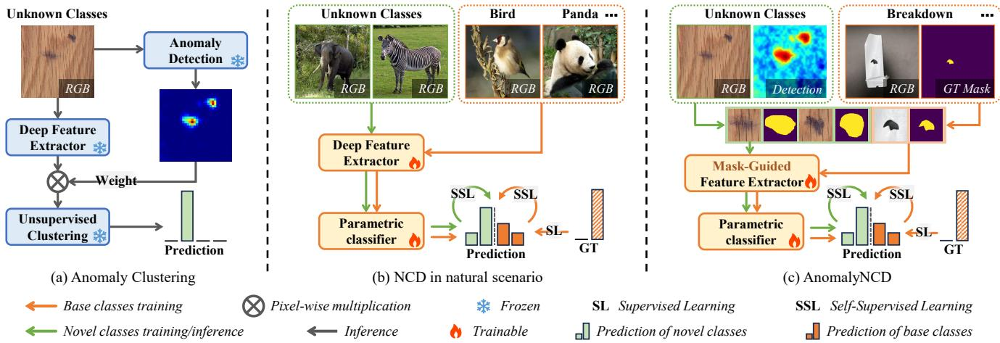
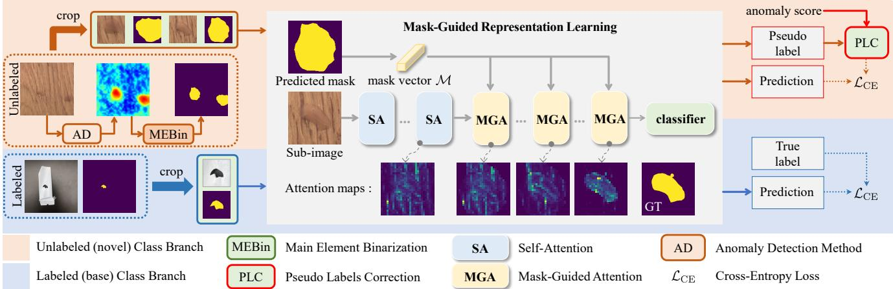
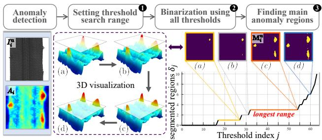
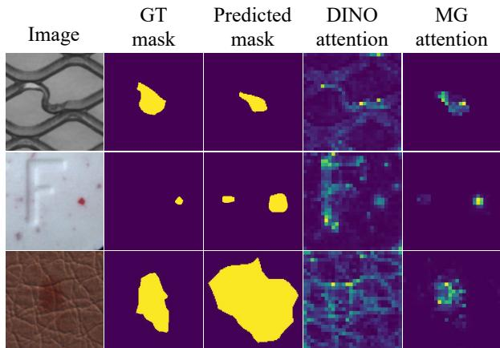
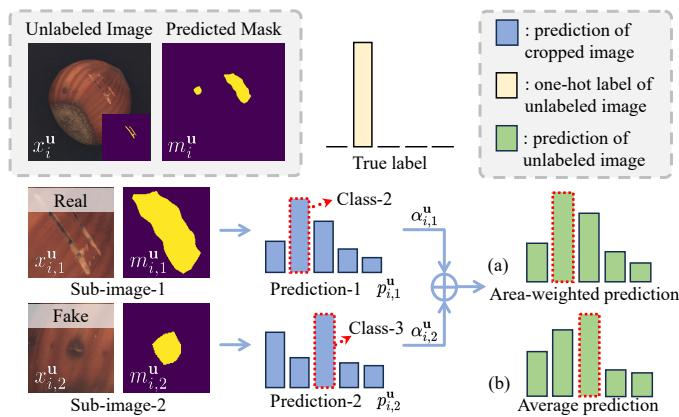
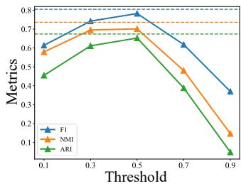
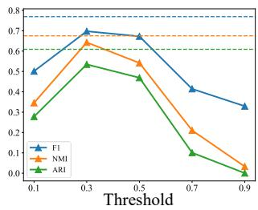
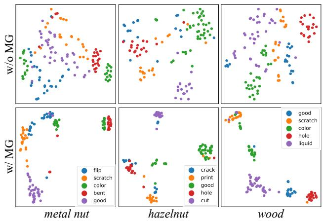

# AnomalyNCD: Towards Novel Anomaly Class Discovery in Industrial Scenarios

Ziming Huang1,∗ Xurui Li1,∗ Haotian Liu1,∗ Feng Xue4 Yuzhe Wang1 Yu Zhou1,2,3,†

2 Hubei Key Laboratory of Smart Internet Technology, Huazhong University of Science and Technology

3Artificial Intelligence Research Institute, Wuhan JingCe Electronic Group Co., LTD

4Department of Information Engineering and Computer Science, University of Trento

## Abstract

Recently, multi-class anomaly classification has garnered increasing attention. Previous methods directly cluster anomalies but often struggle due to the lack of anomalyprior knowledge. Acquiring this knowledge faces two issues: the non-prominent and weak-semantics anomalies. In this paper, we propose AnomalyNCD, a multi-class anomaly classification network compatible with different anomaly detection methods. To address the non-prominence of anomalies, we design main element binarization (MEBin) to obtain anomaly-centered images, ensuring anomalies are learned while avoiding the impact of incorrect detections. Next, to learn anomalies with weak semantics, we design mask-guided representation learning, whichfocuses on isolated anomalies guided by masks and reduces confusion from erroneous inputs through corrected pseudo labels. Finally, to enableflexible classification at both region and image levels, we develop a region merging strategy that determines the overall image category based on the classified anomaly regions. Our method outperforms the state-ofthe-art works on the MVTec AD and MTD datasets. Compared with the current methods, AnomalyNCD combined with zero-shot anomaly detection method achieves a 10.8% F1 gain, 8.8% NMI gain, and 9.5% ARI gain on MVTec AD, and 12.8% F gain, 5.7% NMI gain, and 10.8% ARI gain on MTD. Code is available at https://github.com/HUST-SLOW/AnomalyNCD.

## 1. Introduction

In recent years, industrial anomaly detection [22, 24, 31, 53] has garnered remarkable performance. It locates visual anomalies on industrial products but without recognizing fine-grained anomaly categories. For downstream anomaly treatments, it is necessary to recognize the anomaly classes, such as fracture, ablation, etc., and even discover novel anomaly categories that are constantly emerging.

Several anomaly clustering approaches [1, 28, 40] have been proposed to address the multi-class anomaly classification task, as illustrated in Fig. 1 (a). These approaches typically employ a two-step process: anomaly localization followed by feature extraction from the anomalous regions for clustering. However, the effectiveness of these methods is limited when dealing with homogeneous anomaly patterns that exhibit differences in shape, appearance, and location, primarily due to the lack of prior knowledge of anomaly types. Therefore, our study aims to classify unseen anomalies by leveraging prior knowledge of seen anomalies, thereby overcoming the limitations of current methods.

Through detailed investigation, we find two primary obstacles in leveraging prior knowledge of known anomalies, which prevent existing classification network to industrial anomalies. ❶ Non-prominence Anomalies: Classification in natural scenes assumes that subjects are centered in the images so that networks easily extract their semantics, while this assumption is not true in industrial scenarios. ❷ Lowsemantics Anomalies: In contrast to natural objects, industrial anomalies are typically less semantic, making the network hard to focus on anomalies but prone to background.

In this paper, we overcome both obstructions and propose a multi-class anomaly classification network that aligns with the concept of novel class discovery (NCD), as illustrated in 1 (c). This network learns to classify isolated anomalies by focusing the model’s attention on real anomaly regions. Firstly, to address the non-prominence issue, we propose a main element binarization (MEBin) method. MEBin isolates the primary anomaly regions by extracting them from anomaly detection (AD) results. This binarization process alleviates the negative impact of errors within AD results on the subsequent multi-class anomaly learning, enabling compatibility with various AD algorithms. Secondly, to tackle low-semantics anomalies, we propose mask-guided representation learning. It leverages the anomaly masks generated by MEBin to direct the network’s attention specifically to individual anomalous regions, ensuring our network learns more discriminative features specific to anomalies and classifies each individual anomaly. Additionally, we use corrected pseudo labels in this learning method to prevent false-positive anomalies from training. Finally, to achieve more flexible classification in both region and image levels, we propose a region merging strategy, which determines the image category according to the classification of each region in the image. Experimental results on the MVTec AD [5] and MTD datasets [23] demonstrate the effectiveness of AnomalyNCD.

  
Figure 1. Comparison between solutions organizing anomalies into groups. (a) Anomaly clustering methods extract the features of the anomaly region and employ unsupervised clustering algorithms to cluster the anomalies. (b) Vanilla NCD methods typically employ a trainable feature extractor and classifier. These components process object-centered images from both known and unknown classes. (c) Our method aims to learn features of isolated anomaly regions using anomaly-centered sub-images and masks from MEBin.

In summary, the major contributions of our work are:

• We propose the first method based on self-supervised manner in multi-class anomaly classification, named AnomalyNCD. It can be seamlessly combined with different anomaly detection methods and classify unseen anomalies detected into homogeneous groups.

• We study the challenges of learning from anomalous regions in industrial scenarios, motivating us to propose MEBin and mask-guided representation learning for our network to focus on real anomalous regions and learn discriminative features of isolated anomalies.

• AnomalyNCD surpasses existing anomaly clustering methods and NCD methods on the MVTec AD and MTD datasets, providing a decent foundation for downstream anomaly treatments in industrial scenarios.

## 2. Related Work

## 2.1. Image Clustering in Industrial Scenarios

Directly clustering the images cannot perform well in multiclass anomaly classification. To address this issue, two studies build the clustering pipeline specific for fine-grained anomaly classes. Sohn et al. [40] proposed a simple but effective method to aggregate the patch features by anomaly map weighting. Lee et al. [28] only aggregates the patch features with the higher anomaly score to determine the classes. However, both methods rely on frozen models that cannot learn features specific to anomalies. Therefore, we adopt self-supervised learning to discover novel classes from unlabeled anomalies.

## 2.2. Novel Class Discovery

Novel Class Discovery setting was first formalized in [18]. The early methods follow a two-stage pipeline [18, 20, 21]. The first stage is to learn representation from the base set to obtain prior knowledge for classification, which serves as the basis for the second one to train the model on the novel set. Recent methods are one-stage [19, 46, 56]. By handling the base set and novel set simultaneously, one-stage methods extract better representations with less bias towards the base classes. NCD has been applied in several fields, such as medical image classification [14, 58], semantic segmentation [55] and point cloud segmentation [37, 49]. In this paper, we introduce the NCD architecture into multi-class industrial anomaly classification for the first time.

## 2.3. Binarization Approach

Binarization is a crucial preprocessing step for various vision tasks, e.g., edge detection [6, 59], segmentation [10, 16, 57], document image processing [7, 34, 41], medical image processing [39, 42], object detection [50–52], etc. Otsu [35] determines the optimal threshold to separate the foreground and background by maximizing the between-class variance of the pixel intensities. DiffuMask [48] utilizes cross-attention maps and adaptive thresholding to generate binary maps. However, these methods usually obtain fragmented false-positive regions when segmenting the anomalies, which harms the region-level anomaly class prediction. To alleviate this, we propose the main element binarization strategy to extract only the primary anomaly region, thereby reducing the impact of false positives on representation learning.

  
Figure 2. Illustration of the Training Process for AnomalyNCD. First, we apply main element binarization (MEBin) to segment anomaly masks from detection results and generate anomaly-centered sub-images. Second, we introduce mask-guided representation learning to learn discriminative features of anomalies, classifying sub-images into various categories.

## 3. Method

The proposed AnomalyNCD aims to automatically discover and recognize the visual categories of industrial anomalies. Fig. 2 illustrates its overall framework. To extract main anomaly regions from detection results, we outline the main element binarization method (Sec. 3.2). Guided by these anomaly regions, we then apply mask-guided representation learning (Sec. 3.3) to extract and classify discriminative features of anomalies within these regions. Finally, a region merging strategy (Sec. 3.4) ensures robust image-level classification based on all anomaly regions.

## 3.1. Problem Definition

Given a set of unlabelled images $\mathcal { D } ^ { \mathbf { u } } = \{ I _ { i } ^ { \mathbf { u } } | i \in [ 1 , N ^ { \mathbf { u } } ] \}$ the goal of AnomalyNCD is to assign them into ${ \mathcal { C } } ^ { \mathbf { u } }$ classes (named “Novel” previously), where ${ \mathcal { C } } ^ { \mathbf { u } }$ is known as a priori, referring to vanilla NCD [15, 17, 45]. To provide a better foundation for learning novel classes, we follow previous NCD tasks to assume a set of labeled anomaly images $\mathcal { D } ^ { 1 } =$ $\{ ( I _ { i } ^ { 1 } , y _ { i } ^ { 1 } , \mathbf { M } _ { i } ^ { 1 } ) | i \in [ 1 , N ^ { 1 } ] \}$ with $\mathcal { C } ^ { 1 }$ classes available (named “Base” previously), where $y _ { i } ^ { 1 } \in \mathbb { R } ^ { 1 \times ( \mathcal { C } ^ { 1 } + \mathcal { C } ^ { \bf u } ) }$ is the one-hot class label, and ${ \bf M } _ { i } ^ { 1 }$ is the ground truth anomaly mask of image $I _ { i } ^ { 1 } \in \mathcal { D } ^ { 1 } , \mathrm { ~ \it ~ \dot { ~ D } ^ { 1 } ~ }$ supplies the auxiliary knowledge of the industrial anomalies for grouping the images in ${ \mathcal { D } } ^ { \mathbf { u } }$ . To further generalize our study, we also perform experiments with different $\mathcal { D } ^ { \mathrm { I } }$ and without $\mathcal { D } ^ { 1 }$ in the Appendix F.

## 3.2. Main Element Binarization

To provide a clear anomaly indication of unlabeled images, we use an anomaly detection method on $I _ { i } ^ { \mathbf { u } }$ to generate the anomaly probability map, denoted as $A _ { i } \in$ $[ 0 , 1 ] ^ { H \times W }$ . However, $A _ { i }$ inevitably contains false positives (over-detections) and false negatives (missed detections). These errors can negatively affect multi-class anomaly classification. To address this, we propose a Main Element Binarization (MEBin) approach. It extracts the principal anomaly structures (Main Element) from $A _ { i }$ by focusing on stable regions across small threshold variations. Overall, the MEBin consists of three steps: ❶ Predefine a range $[ \mathbf { s } _ { \mathrm { m i n } } , \mathbf { s } _ { \mathrm { m a x } } ]$ for threshold exploration; ❷ Binarize $A _ { i }$ across all thresholds within this range; ❸ Identify the main elements in $A _ { i }$ based on the changes of segmented regions under different binarization results.

  
Figure 3. Pipeline of the Main Element Binarization. In 3D visualization, we show the changes of segmented regions under different thresholds. The 3D map (a) corresponds to the 2D binary segmentation mask (a).

The first step: To capture all potential anomalies across the set $\{ A _ { i } | i \in [ 1 , N ^ { \mathbf { u } } ] \}$ , the upper limit $\mathbf { s } _ { \mathrm { m a x } }$ is set to 1. Conversely, the lower limit, $\mathbf { s } _ { \mathrm { m i n } } ,$ , is determined by the minimum anomaly score1 found across the set $\{ A _ { i } | i { \in } [ 1 , N ^ { \mathbf { u } } ] \}$ represented as $\mathbf { s } _ { \mathrm { m i n } } = \operatorname* { m i n } ( s _ { 1 } , s _ { 2 } , . . . , s _ { N ^ { \mathbf { u } } } )$ , where $s _ { i } =$ max $\left( A _ { i } \right)$ . Such a lower limit helps minimize the likelihood of normal image pixels being segmented.

The second step: To analyze the segmented regions change with thresholds, we uniformly sample $\tau$ thresholds $\{ \epsilon _ { j } | j \in [ 1 , \mathcal { T } ] \}$ in $\left[ \mathbf { s } _ { \mathrm { m i n } } , \mathbf { s } _ { \mathrm { m a x } } \right]$ . For each threshold $\epsilon _ { j } .$ , the anomaly map $A _ { i }$ is binarized into a mask $M _ { i } ^ { j }$ $M _ { i } ^ { j } = \Im [ A _ { i } > \epsilon _ { j } ]$ , where 1[.] is the indicator function. To reduce the meaningless and fragmented segmentation, we further apply an erosion operation to each mask $M _ { i } ^ { j }$

The third step: We identify main anomaly regions through two operations. First, let $\delta _ { i } ^ { j }$ denote the number of individual regions segmented in $M _ { i } ^ { j }$ , each region is an independent connected component. We observe that the amount of the main regions in the anomaly map $A _ { i }$ can be characterized by the non-zero value that appears most frequently in $\{ \delta _ { i } ^ { j } | j \in [ 1 , \mathcal { T } ] \}$ , denoted as $\delta _ { i }$ . Second, to segment the main regions, we take the longest continuous threshold range where only ${ \bar { \delta } } _ { i }$ regions are segmented. The main anomaly regions remain stable within this threshold range, as shown in Fig. 3.

• If this range is shorter than τ , there is no anomaly region to be segmented.

• Conversely, if this range exceeds τ, it confirms stable anomaly segmentation within this threshold range. In this case, we select the minimum threshold from the identified range to segment anomalies as completely as possible.

Finally, we use the selected threshold to segment $A _ { i }$ into the binary mask, denoted as ${ \mathbf { M } } _ { i } ^ { \mathbf { u } }$ . In this way, the unlabeled images set $\mathcal { D } ^ { \mathbf { u } }$ are extended with the binary masks: $\{ ( I _ { i } ^ { \mathbf { u } } , \mathbf { M } _ { i } ^ { \mathbf { u } } ) | i \in [ 1 , N ^ { \mathbf { u } } ] \}$

Anomaly-Centered Sub-Image Cropping. To focus the model on anomalous regions, we crop each region in ${ \mathbf { M } } _ { i } ^ { \mathbf { u } }$ individually into anomaly-centered sub-images. Specifically, for each region in ${ \mathbf { M } } _ { i } ^ { \mathbf { u } }$ , we use the minimum bounding square to crop the sub-image from $I _ { i } ^ { \mathbf { u } }$ and its mask from ${ { \mathbf { M } } _ { i } ^ { \mathbf { u } } }$ Then the sub-images of $I _ { i } ^ { \mathbf { u } }$ can be denoted as $\{ x _ { i , 1 } ^ { \mathbf { u } } , x _ { i , 2 } ^ { \mathbf { u } } , \ldots \}$ , and the corresponding masks cropped from ${ \bf { M } } _ { i } ^ { \mathbf { u } }$ are denoted as $\{ m _ { i , 1 } ^ { \mathbf { u } } , m _ { i , 2 } ^ { \mathbf { u } } , . . . \}$ . To align labeled and unlabeled inputs, we use the same cropping operation to extract sub-images and masks for the labeled data set $\mathcal { D } ^ { \mathrm { I } }$ , denoted as $\{ ( x _ { i , 1 } ^ { \bar { 1 } } , m _ { i , 1 } ^ { 1 } ) , ( x _ { i , 2 } ^ { 1 } , m _ { i , 2 } ^ { 1 } ) , \ldots | i \in [ 1 , N ^ { 1 } ] \}$ . These are then merged with the unlabeled data in the same structures, represented as $\{ ( x _ { i , k } , m _ { i , k } , y _ { i , k } ) | i \in [ 1 , N ^ { 1 } + N ^ { \mathbf { u } } ] , k \in$ $[ 1 , { \bar { \delta } } _ { i } ] \}$ , where ${ \bar { \delta } } _ { i }$ indicates the number of sub-images per image, and $y _ { i , k }$ is the one-hot class label for each labeled sub-image, matching the label of the $i ^ { \mathrm { { t h } } }$ image if it belongs to $\mathcal { D } ^ { \mathrm { I } }$ . Implementation details of the cropping process are supplied in the Appendix C.

## 3.3. Mask-Guided Representation Learning

## 3.3.1. Mask-Guided Vision Transformer (MGViT)

MGViT is built on vision transformer (ViT). Thus we review its structure.

Vision transformer [13] processes an input image by dividing it into N fixed-size patches. Each patch is treated as a “token” and is flattened into an embedding vector of length

  
Figure 4. Visualization of the self-attention of the [CLS] token on the last layer’s heads. DINO attention refers to the [CLS] token extracted from a DINO pre-trained ViT that mainly focuses on a foreground object. AnomalyNCD uses a mask to direct the [CLS] token’s attention to the anomalous regions.

D. ViT has L sequential transformer layers, each containing self-attention layers and feed-forward neural networks. In addition, a special class token [CLS], is propagated from the first layer to the final layer where it serves as the basis for classification. In the self-attention of the $l ^ { \mathrm { t h } }$ layer, the input patches undergo linear projections to form the queries, keys, and values $\mathbf { Q } _ { l - 1 } , \bar { \mathbf { K } _ { l - 1 } } , \mathbf { V } _ { l - 1 } \in \mathbb { R } ^ { ( \mathrm { N } + 1 ) \times D }$ Here, ViT captures the relationships between the image patches by self-attention mechanism Attn as follows:

$$
A t t n { = } \mathrm { s o f t m a x } \left( \mathrm { c o n c a t } ( \mathbf { Q } _ { l - 1 } ^ { \mathrm { c l s } } \mathbf { K } _ { l - 1 } ^ { \top } , \mathbf { Q } _ { l - 1 } ^ { \mathrm { p a t c h } } \mathbf { K } _ { l - 1 } ^ { \top } ) \right) \mathbf { V } _ { l - 1 }\tag{1}
$$

where we divide $\mathbf { Q } _ { l - 1 }$ into $\mathbf { Q } _ { l - 1 } ^ { \mathrm { c l s } } \in \mathbb { R } ^ { 1 \times D }$ and $\mathbf { Q } _ { l - 1 } ^ { \mathrm { p a t c h } } { \in } \mathbb { R } ^ { \mathrm { N } \times \dot { D } }$ to represent class token and patch tokens separately.

Insufficient Focus on Anomalies. The ViT excels in semantic representation but fails to detect weak semantic anomalies. Fig. 4 demonstrates this using the self-attention map of the [CLS] token in the last layer of a DINOpretrained ViT [9]. In the $1 ^ { \mathrm { s t } }$ row’s example, the model highlights the salient object (metal grid) in an image, rather than the local anomaly. This observation means that the network over-focuses on learning background.

Mask-Guided Attention. To address the issue above, we propose mask-guided attention to direct ViT’s focus on the anomalous region. Specifically, the input sub-image $x _ { i , k }$ is fed into the ViT, and we assume the token number is N. At the same time, its mask $m _ { i , k }$ is resized to $\sqrt { \mathbb { N } } \times \sqrt { \mathbb { N } }$ by average pooling and then flattened into a vector $\mathcal { M } \in \mathbb { R } ^ { \mathrm { { N } \times 1 } }$ Subsequently, we insert the constant 1 at the beginning of M to align its size with the tokens. Next, we use the mask vector in the self-attention mechanism for re-directing focus, which has three possible design choices.

1. Adding the mask M on both class and patch tokens.

2. Adding the mask M on the patch tokens.

3. Adding the mask M on the class token.

The $1 ^ { \mathrm { s t } }$ and $2 ^ { \mathrm { n d } }$ designs suppress the rich contextual features in patch tokens that are crucial for classification, and our network only focuses on classifying anomalies rather than segmenting. Thus, the $3 ^ { \mathrm { r d } }$ one is recommended as the most suitable design, and the experiment also verifies its effectiveness. Such a design can be formulated as follows:

$$
A t t n { = } \mathrm { s o f t m a x } ( \mathrm { c o n c a t } ( \mathbf { Q } _ { l - 1 } ^ { \mathrm { c l s } } \mathbf { K } _ { l - 1 } ^ { \top } { + } \overline { { \mathcal { M } } } , \mathbf { Q } _ { l - 1 } ^ { \mathrm { p a t c h } } \mathbf { K } _ { l - 1 } ^ { \top } ) ) \mathbf { V } _ { l - 1 }\tag{2}
$$

where $\overline { { \mathcal { M } } }$ denotes the converted mask vector that is compatible with the attention mechanism [12]:

$$
\begin{array} { r } { \overline { { \mathcal { M } } } ( i ) = \left\{ \begin{array} { l l } { 0 , \quad } & { \mathrm { i f } \ M ( i ) > 0 . 5 } \\ { - \infty , \quad } & { \mathrm { o t h e r w i s e } } \end{array} \right. } \end{array}\tag{3}
$$

Note that, in the ViT, the self-attention in the last $L _ { m }$ -layer is replaced with the mask-guided attention to form MGViT. Fig. 4 reveals that the [CLS] token focuses on anomalous regions by using our mask-guided attention. Even though the predicted masks do not align with the ground truth accurately, the network still focuses on the anomaly roughly.

## 3.3.2. Model Training

Given a sub-image pair $( x _ { i , k } , m _ { i , k } )$ , we first apply random augmentation to generate two views $( \tilde { x } _ { i , k } , \tilde { m } _ { i , k } )$ and $\left( \hat { x } _ { i , k } , \hat { m } _ { i , k } \right)$ . Following DINO [9], we feed these two views into the teacher and student networks respectively, which have shared MGViT and classification heads with different softmax temperatures. For labeled sub-images, the ground truth labels are converted into one-hot vectors to serve as supervision targets for the student network. For unlabeled sub-images $\tilde { x } _ { i , k } , \hat { x } _ { i , k }$ , we generate pseudo labels $\hat { q } _ { i , k } , \tilde { q } _ { i , k } \in$ $\mathbb { R } ^ { 1 \times ( \boldsymbol { C } ^ { 1 } + \boldsymbol { C } ^ { \mathbf { u } } ) }$ by the “teacher” one, which employs a sharp temperature $\tau _ { t }$ to produce confident predictions. The entries of labeled classes $( \mathcal { C } ^ { 1 } )$ in the pseudo labels are set to 0. The “student” one, using a smooth temperature $\tau _ { s } .$ , is trained to align its probability predictions $\hat { p } _ { i , k } , \tilde { p } _ { i , k } \in \mathbb R ^ { 1 \times ( \mathcal { C } ^ { 1 } + \mathcal { C } ^ { \bf u } ) }$ with either ground truth labels (for labeled data) or pseudo labels (for unlabeled data). This dual supervision ensures effective learning from both labeled and unlabeled data.

Our training objective follows existing category discovery methods [45, 47] and includes classification objective and representation learning objective. The classification objective contains ground truth label supervision $\mathcal { L } _ { \mathrm { c l s } } ^ { 1 }$ on labeled sub-images, and pseudo label supervision $\mathcal { L } _ { \mathrm { c l s } } ^ { \mathbf { u } }$ on unlabeled sub-images. The representation learning objective contains self-supervised contrastive learning $\mathcal { L } _ { \mathrm { r e p } } \ [ 1 1 ]$ on both labeled sub-images and unlabeled sub-images, and supervised contrastive learning $\mathcal { L } _ { \mathrm { r e p } } ^ { 1 }$ [26] on only labeled subimages. Finally, we adopt a mean-entropy maximization regularizer $\mathcal { L } _ { \mathrm { r e g } } ^ { \mathbf { u } }$ [8] for unlabeled sub-images. More details about the training procedure are provided in Appendix A.

The overall loss of training objective is written as:

$$
\mathcal { L } = \lambda ( \mathcal { L } _ { \mathrm { r e p } } ^ { 1 } + \mathcal { L } _ { \mathrm { c l s } } ^ { 1 } ) + ( 1 - \lambda ) ( \mathcal { L } _ { \mathrm { r e p } } + \mathcal { L } _ { \mathrm { c l s } } ^ { \bf u } + \mu \mathcal { L } _ { \mathrm { r e g } } ^ { \bf u } )\tag{4}
$$

  
Figure 5. Region merging strategy for image-level classification. Using average prediction, the output of normal cropped images (Sub-image-2) leads to final misclassification, while areaweighted prediction can reduce the negative effect of normal cropped images on the final result.

where λ is a hyperparameter that balances the supervised loss and the self-supervised loss. $\mu$ is the coefficient of the regularization.

Pseudo Labels Correction. The error in pseudo labels leads to the false learning objective for the classification model. To mitigate these errors, especially the false detection of anomalous regions, we propose to use anomaly scores (described in Sec 3.2) to correct pseudo labels. Let $s _ { i , k }$ denote the anomaly score for $x _ { i , k }$ , we weightedly judge whether the view $\hat { x } _ { i , k }$ should be labeled as normal or assigned the generated pseudo labels.

$$
\hat { q } _ { i , k }  w _ { i , k } \mathbf { e } + ( 1 - w _ { i , k } ) \hat { q } _ { i , k } ; w _ { i , k } = \operatorname* { m a x } ( 0 . 5 - s _ { i , k } , 0 )\tag{5}
$$

where $w _ { i , k }$ is the weight for normal. $\mathbf { e } \in \mathbb { R } ^ { 1 \times ( \mathcal { C } ^ { 1 } + \mathcal { C } ^ { \mathbf { u } } ) }$ denotes a unit vector whose $( \mathcal { C } ^ { 1 } + 1 )$ -th value is 1 and all other values are 0, in which we use the first class in the $\mathcal { C } ^ { \mathbf { u } }$ classes as normal. If $s _ { i , k }$ is smaller, the more likely the sub-image $\hat { x } _ { i , k }$ is normal, and $\hat { q } _ { i , k }$ is closer to e. Thus, such correction forces the network to separate normal sub-images from the train set. In the same way, the pseudo label $\tilde { q } _ { i , k }$ is updated.

## 3.4. Region Merging for Image Classification

For flexible classification in both sub-image and image levels, we aim to determine the image’s anomaly class according to its sub-image classification. Intuitively, a naive method is to average the predictions of all sub-images within an image. However, false classification of the overdetected region may mislead the image class. As shown in Fig. 5, Sub-image-1 and Sub-image-2 are classified to Class-2 and Class-3, respectively, where the wrong prediction of Sub-image-2 misleads the image class in Fig. 5 (b).

To address this issue, we propose a region merging approach to robustly classify images. We found that misclassification is mostly over-detected regions that are much smaller than real anomalies. Therefore, we define an arearelated weight $\alpha _ { i , k } ^ { \mathbf { u } }$ for each sub-image $x _ { i , k } ^ { \mathbf { u } }$ , which is used in determining the image category:

<table><tr><td rowspan="2">Datasets</td><td rowspan="2">Metric</td><td rowspan="2">IIC[25]</td><td rowspan="2">GATCluster[33]</td><td rowspan="2">SCAN[44]</td><td rowspan="2">UNO[15]</td><td rowspan="2">GCD[45]</td><td rowspan="2">SimGCD[47]</td><td rowspan="2">AMEND[3]</td><td rowspan="2">AC[40] (Unsup.)</td><td rowspan="2">MuSc [30] +AnomalyNCD</td></tr><tr><td></td></tr><tr><td rowspan="3">MVTec AD [5]</td><td>NMI</td><td>0.093</td><td>0.136</td><td>0.210</td><td>0.146</td><td>0.417</td><td>0.452</td><td>0.431</td><td>0.525</td><td>0.613</td></tr><tr><td>ARI</td><td>0.020</td><td>0.053</td><td>0.103</td><td>0.052</td><td>0.302</td><td>0.346</td><td>0.333</td><td>0.431</td><td>0.526</td></tr><tr><td> $F _ { 1 }$ </td><td>0.285</td><td>0.264</td><td>0.335</td><td>0.342</td><td>0.553</td><td>0.569</td><td>0.542</td><td>0.604</td><td>0.712</td></tr><tr><td rowspan="3">MTD [23]</td><td>NMI</td><td>0.064</td><td>0.028</td><td>0.041</td><td>0.034</td><td>0.211</td><td>0.105</td><td>0.138</td><td>0.179</td><td>0.268</td></tr><tr><td>ARI</td><td>0.020</td><td>0.009</td><td>0.029</td><td>0.011</td><td>0.115</td><td>0.048</td><td>0.067</td><td>0.120</td><td>0.228</td></tr><tr><td> $F _ { 1 }$ </td><td>0.252</td><td>0.243</td><td>0.282</td><td>0.221</td><td>0.381</td><td>0.293</td><td>0.324</td><td>0.346</td><td>0.509</td></tr></table>

Table 1. Quantitative results on the MVTec AD and MTD dataset. All the methods only use unlabeled images as input. The best-performing result is in bold, the second best result is underlined.

<table><tr><td>Datasets</td><td></td><td>AC[40] Metric (Semi-sup.)</td><td>UniFormaly[28] (0.953 / 0.837)</td><td>PatchCore[38] (0.938 / 0.729) +AnomalyNCD</td><td>RD++[43] (0.950 / 0.741) +AnomalyNCD</td><td>EfficientAD[4] (0.917 / 0.731) +AnomalyNCD</td><td>PNI[2] (0.942 / 0.516) +AnomalyNCD</td><td>CPR[29] (0.964 / -) +AnomalyNCD</td></tr><tr><td rowspan="3">MVTec AD [5]</td><td>NMI</td><td>0.608</td><td>0.547</td><td>0.670</td><td>0.631</td><td>0.516</td><td>0.675</td><td>0.736</td></tr><tr><td>ARI</td><td>0.489</td><td>0.433</td><td>0.601</td><td>0.542</td><td>0.394</td><td>0.609</td><td>0.674</td></tr><tr><td>F1</td><td>0.652</td><td>0.645</td><td>0.769</td><td>0.721</td><td>0.641</td><td>0.769</td><td>0.805</td></tr><tr><td rowspan="3">MTD [23]</td><td>NMI</td><td>0.390</td><td>0.421</td><td>0.380</td><td>0.368</td><td>0.220</td><td>0.181</td><td></td></tr><tr><td>ARI</td><td>0.314</td><td>0.322</td><td>0.390</td><td>0.361</td><td>0.188</td><td>0.219</td><td></td></tr><tr><td> $F _ { 1 }$ </td><td>0.490</td><td>0.609</td><td>0.617</td><td>0.600</td><td>0.467</td><td>0.465</td><td></td></tr></table>

Table 2. Quantitative results on the MVTec AD and MTD dataset. All the methods use unlabeled images and labeled normal images as input. We evaluate the AUPRO metric across various anomaly detection approaches on two datasets, e.g., (0.953 / 0.837), the first one on the MVTec AD dataset and the second on the MTD dataset. For the metrics of multi-class anomaly classification, the best-performing result is in bold, the second best result is underlined. The unofficial results are marked in gray .

$$
\alpha _ { i , k } ^ { \mathbf { u } } = \frac { \exp ( \sqrt { \mathbf { a } _ { i , k } ^ { \mathbf { u } } } / \tau _ { \alpha } ) } { \sum _ { k = 1 } ^ { \bar { \delta } _ { i } } \exp ( \sqrt { \mathbf { a } _ { i , k } ^ { \mathbf { u } } } / \tau _ { \alpha } ) }\tag{6}
$$

where $\mathbf { a } _ { i , k } ^ { \mathbf { u } }$ is the area of anomaly in $x _ { i , k } ^ { \mathbf { u } } ,$ and $\tau _ { \alpha }$ is the temperature value. Then, for an image $I _ { i } ^ { \mathbf { u } }$ composed by sub-images $\{ x _ { i , k } ^ { \mathbf { u } } | k \in [ 1 , \bar { \delta } _ { i } ] \}$ , the prediction logit is $p _ { i } ^ { \mathbf { u } } =$ $\begin{array} { r l } { \sum _ { k = 1 } ^ { \bar { \delta } _ { i } } \alpha _ { i , k } ^ { \mathbf { u } } p _ { i , k } ^ { \mathbf { u } } } & { { } } \end{array}$ , where $p _ { i , k } ^ { \mathbf { u } }$ is the probability prediction of $x _ { i , k } ^ { \mathbf { u } }$ generated by the student network. As shown in Fig. 5 (a), the prediction $p _ { i } ^ { \mathbf { u } }$ depends more on $p _ { i , 1 } ^ { \mathbf { u } }$ , which has a larger weight $\alpha _ { i , 1 } ^ { \mathbf { u } }$ and a correct prediction.

## 4. Experiments

## 4.1. Experimental setting

## 4.1.1. Datasets

We conduct experiments on industrial datasets MVTec AD [5] and Magnetic Tile Defect (MTD) [23]. MVTec AD has industrial product images of 10 object categories and 5 texture categories. Each product category has at least two anomaly classes. Following [40] and [28], we remove the combined anomaly classes for a fair comparison. Notice that our method can also handle the combined anomaly class, as described in the Appendix G. MTD dataset has 952 normal images and 392 abnormal images, the abnormal images are divided into five anomaly classes. We follow [40] that uses 80% of normal images as the reference images and the rest as the test images. For both datasets, we use the single-blade sub-dataset in Aero-engine Blade Anomaly Detection Dataset (AeBAD-S) [54] with the normal class removed, as our default labeled image set $\mathcal { D } ^ { 1 }$

## 4.1.2. Implementation details

We use ViT-B/8 [13] pre-trained with DINO [9] as our feature extractor. The self-attentions in the last 9 layers are replaced with our mask-guided attention. During training, all the layers of ViT are fixed except the last layer. For anomaly detection methods preceding AnomalyNCD, we choose zero-shot method MuSc [30], one-class methods PatchCore [38], EfficientAD [4], RD++ [43], PNI [2] and CPR [29]. More details are in the Appendix B.

## 4.1.3. Competing methods

We compare our method with two state-of-the-art industrial anomaly clustering methods, UniFormaly [28] and Anomaly Clustering [40] that has two settings: an unsupervised one (Unsup.) and a semi-supervised one (Semisup.). The former setting only inputs unlabeled images for clustering, while the latter one uses labeled normal images, same as the input of one-class anomaly detection. We also employ three deep clustering methods, IIC [25], GAT-Cluster [33], and SCAN [44], which cluster unlabeled images directly. In addition, four NCD methods in the nature scene are considered for comparison, UNO [15], GCD [45], SimGCD [47] and AMEND [3]. As in our method, the AeBAD-S dataset is used as labeled abnormal images.

<table><tr><td></td><td>Avg FPR↓</td><td> $\mathbf { A v } \mathbf { g }$  FNR↓</td><td>NMI↑</td><td>ARI↑</td><td> $F _ { 1 } \uparrow$  1</td></tr><tr><td> $\epsilon = 0 . 1$ </td><td>0.572</td><td>0.617</td><td>0.554</td><td>0.482</td><td>0.650</td></tr><tr><td> $\epsilon = 0 . 3$ </td><td>0.678</td><td>0.742</td><td>0.499</td><td>0.404</td><td>0.587</td></tr><tr><td> $\epsilon = 0 . 5$ </td><td>0.484</td><td>0.165</td><td>0.567</td><td>0.458</td><td>0.640</td></tr><tr><td> $\epsilon = 0 . 7$ </td><td>0.269</td><td>0.247</td><td>0.495</td><td>0.395</td><td>0.623</td></tr><tr><td> $\epsilon = 0 . 9$ </td><td>0.544</td><td>0.593</td><td>0.077</td><td>0.013</td><td>0.337</td></tr><tr><td>Otsu [35]</td><td>0.676</td><td>0.525</td><td>0.382</td><td>0.268</td><td>0.499</td></tr><tr><td>Ours</td><td>0.153</td><td>0.035</td><td>0.613</td><td>0.526</td><td>0.712</td></tr></table>

Table 3. Ablation study of different binarization approaches on the MVTec AD dataset. The best-performing result is in bold.

## 4.1.4. Evaluation metrics

We report three widely used metrics for the evaluation of clustering: the $F _ { 1 }$ score, the normalized mutual information (NMI) [32], and the adjusted rand index (ARI) [36]. We use the Hungarian algorithm [27] to match the predicted clusters to the ground truth labels. For methods using anomaly maps, we measure the segmentation per-region overlap (AUPRO) with 30% FPR [5] to explore the impact of anomaly detection performance on the multi-class classification. All metrics are calculated by the official code.

## 4.2. Quantitative results

We report the results of the multi-class anomaly classification on the MVTec AD and MTD datasets in Table 1 and 2. Notably, AnomalyNCD is compatible with all the anomaly detection methods to enable subsequent multiclass anomaly classification.

All methods in Table 1 only use unlabeled images as input. Compared to Anomaly Clustering [40], AnomalyNCD combined with zero-shot anomaly detection method MuSc [30], achieves 8.8% gains on NMI, 9.5% gains on ARI, and 10.8% $F _ { 1 }$ gains, proving that AnomalyNCD extracts more discriminative features than Anomaly Clustering through contrastive learning in anomalous regions. AnomalyNCD also outperforms state-of-the-art NCD methods, achieving 16.1% gains on NMI, 18.0% gains on ARI, and 14.3% $F _ { 1 }$ gains. The performance advantage of AnomalyNCD is due to focusing on anomalies inside images.

In Table 2, all methods utilize both unlabeled images and labeled normal images from the same product. We integrate AnomalyNCD with various one-class AD methods. Utilizing CPR, which has the highest AUPRO, achieves the best performance on the MVTec AD dataset: NMI increases by 10.7%, ARI by 14.9%, and $F _ { 1 }$ score by 9.6%, surpassing other methods. On the MTD dataset, although the segmentation AUPRO of all AD methods is lower than that of Uniformaly, PatchCore+AnomalyNCD still achieves improvements of 6.8% in ARI and 0.8% in $F _ { 1 }$ score.

  
(a) CPR  
(b) PNI  
Figure 6. The results of various anomaly detection (AD) methods under multiple fixed thresholds. The horizontal dashed line represents the results of MEBin. Notably, the optimal fixed thresholds differ across AD methods, while our MEBin consistently outperforms the fixed threshold results.

  
Figure 7. T-SNE visualization of sub-images on the MVTec AD dataset. We choose metal nut, hazelnut and wood as examples. The different colors of dots represent their anomaly classes.

## 4.3. Ablation Study

## 4.3.1. Effectiveness of main element binarization

Table 3 compares MEBin’s performance with the Otsu method [35] and fixed thresholds. Since the missed detection is more critical than over-detection in industrial scenarios, we define an anomaly as detected if the intersection over union (IoU) between the actual and predicted bounding boxes exceeds 0.1. Then we calculate the FPR and FNR for these binarization methods. MEBin demonstrates lower FPR and FNR than fixed thresholds and Otsu, leading to better multi-class classification results. Compared to the fixed thresholds, MEBin adaptively determines an optimal threshold for each image adaptation and achieves a 7.2% $F _ { 1 }$ improvement. The Otsu tends to over-detect, particularly in normal images, making it less effective for this task.

In Fig. 6, we further apply MEBin on different one-class AD methods, which exhibit varying optimal fixed thresholds. For example, the optimal threshold of CPR [29] is near 0.5, whereas for PNI [2] it is approximately 0.3. MEBin’s adaptive threshold selection for each image outperforms al fixed thresholds for the whole image set.

<table><tr><td>Mask Mechanism</td><td>NMI</td><td>ARI</td><td> $F _ { 1 }$ </td></tr><tr><td>(a) w/o MGA</td><td>0.598</td><td>0.494</td><td>0.698</td></tr><tr><td>(b) all tokens</td><td>0.507</td><td>0.382</td><td>0.600</td></tr><tr><td>(c) patch tokens</td><td>0.563</td><td>0.467</td><td>0.686</td></tr><tr><td>(d) class token (Ours)</td><td>0.613</td><td>0.526</td><td>0.712</td></tr></table>

Table 4. Compared with different mask attention mechanisms on the MVTec AD dataset, the best-performing result is in bold.
<table><tr><td rowspan="2"></td><td colspan="3">MVTec AD</td><td colspan="3">MTD</td></tr><tr><td> $L _ { m }$  NMI</td><td>ARI</td><td> $F _ { 1 }$ </td><td>NMI</td><td>ARI</td><td> $F _ { 1 }$ </td></tr><tr><td>1</td><td>0.606</td><td>0.508</td><td>0.690</td><td>0.191</td><td>0.157</td><td>0.420</td></tr><tr><td>3</td><td>0.608</td><td>0.511</td><td>0.694</td><td>0.209</td><td>0.173</td><td>0.436</td></tr><tr><td>6</td><td>0.613</td><td>0.519</td><td>0.713</td><td>0.253</td><td>0.214</td><td>0.492</td></tr><tr><td>9</td><td>0.613</td><td>0.526</td><td>0.712</td><td>0.268</td><td>0.228</td><td>0.509</td></tr><tr><td>12</td><td>0.609</td><td>0.521</td><td>0.712</td><td>0.249</td><td>0.213</td><td>0.492</td></tr></table>

Table 5. Ablation study on the position of mask-guided layers on MVTec AD and MTD datasets. Best results in bold.

## 4.3.2. Discussion of the mask-guided attention

The mask-guided attention (MGA) directs ViT to focus on tokens within the mask (anomalous region). We show the t-SNE visualization in Fig. 7. With MGA in the $2 ^ { n d }$ row, image features have larger inter-class distances (e.g. metal nut) and smaller intra-class distances (e.g. hazelnut and wood) than those without MGA in the $1 ^ { s t }$ row. In terms of metrics on MVTec AD, our MGA has a 1.5% NMI gain, 3.2% ARI gain, and 1.4% $F _ { 1 }$ gain shown in Table 4.

We conduct experiments to introduce the binary mask into different tokens in Table 4. (b) introduces the binary mask on [CLS] token and patch tokens. (c) introduces it on patch tokens. Our MGA (d) only performs on [CLS] token, which is directly input into the classifier. We make patch tokens have a global receptive field to introduce more surrounding information indirectly into [CLS] token. Compared to other mask strategies, our MGA achieves 5.0% NMI, 5.9% ARI, and 2.6% $F _ { 1 }$ improvements.

## 4.3.3. The influence of the mask-guided layer $L _ { m }$

In our method, we introduce mask-guided attention in the last $L _ { m }$ layers of ViT. As reported in Table 5, we conduct the experiments with different $L _ { m }$ . The results demonstrate that using mask-guided attention in the last 9 layers yields better performance on both datasets. When $L _ { m }$ is small, the [CLS] token cannot adequately focus on the anomaly within the binary mask. In contrast, when $L _ { m } ~ = ~ 1 2$ the [CLS] token completely lost contextual information around the anomaly, resulting in a drop in metrics.

## 4.3.4. Discussion of merging strategies

In Table 6, we report results using different merging strategies. (i) averaging the predictions of the sub-images, (ii) utilizing the anomaly scores of the sub-images as weights to merge, and (iii) using our region merging strategy. Strategy (iii) achieves better metrics than (i) and (ii) on both datasets. In anomaly detection, noise inevitably leads to over-detections, which have small areas but large anomaly scores. Directly averaging results over all sub-images is inaccurate, especially when many false positive sub-images are involved. Similarly, using anomaly scores as weights is also inappropriate. In contrast, our merging method, which assigns weights to multiple sub-image predictions based on area, achieves more robust merged predictions.

<table><tr><td></td><td colspan="3">MVTec AD</td><td colspan="3">MTD</td></tr><tr><td>Merge</td><td>NMI</td><td>ARI</td><td>F1</td><td>NMI</td><td>ARI</td><td> $F _ { 1 }$ </td></tr><tr><td>(i) Avg</td><td>0.610</td><td>0.521</td><td>0.709</td><td>0.257</td><td>0.223</td><td>0.501</td></tr><tr><td>(ii) Score  $\mathbf { A v } \mathbf { g }$ </td><td>0.600</td><td>0.513</td><td>0.703</td><td>0.228</td><td>0.208</td><td>0.485</td></tr><tr><td>(iii) Area Avg</td><td>0.613</td><td>0.526</td><td>0.712</td><td>0.268</td><td>0.228</td><td>0.509</td></tr></table>

Table 6. Compared with different merging strategies on the MVTec AD and MTD datasets.
<table><tr><td></td><td>Precision</td><td>Recall</td><td>NMI</td><td>ARI</td><td> $F _ { 1 }$ </td></tr><tr><td>w/o PLC</td><td>0.797</td><td>0.727</td><td>0.597</td><td>0.517</td><td>0.714</td></tr><tr><td>w PLC</td><td>0.821</td><td>0.876</td><td>0.613</td><td>0.526</td><td>0.712</td></tr></table>

Table 7. The ablation experiment of pseudo label correction (PLC) on the MVTec AD dataset. We evaluate the precision and recall of the normal class.

## 4.3.5. Effect of Pseudo Label Correcting

Our Pseudo Label Correcting (PLC) aims to reduce the impact of over-detections from the anomaly detection process. Although over-detected sub-images are normal, they have large appearance differences, which makes it difficult to correctly group them into the same normal class. Table 7 presents the precision and recall of the normal class. After applying PLC, recall improves by 14.9%, which means that some misclassified normal sub-images are corrected by our PLC. Additionally, a 1.6% improvement in NMI is observed in the multi-class classification results.

## 5. Conclusion

In this paper, we propose a novel multi-class anomaly classification method AnomalyNCD, which is compatible with existing anomaly detection methods. Firstly, we propose the main element binarization approach to isolate most overdetections and missed detections brought by anomaly detection methods. Secondly, we crop each anomalous region and leverage mask-guided representation learning to focus the network on the local anomaly and learn discriminative representations. Finally, our region merging strategy achieves flexible classification at sub-image and image levels during inference. While the performance of AnomalyNCD is generally influenced by the quality of the anomaly detection method, our AnomalyNCD outperforms all the current industrial anomaly clustering methods and NCD methods in the nature scene.

## 6. Acknowledgments

This work was supported by the National Natural Science Foundation of China under Grant No.62176098. The computation is completed in the HPC Platform of Huazhong University of Science and Technology.

## References

[1] Andrei-Timotei Ardelean and Tim Weyrich. Blind localization and clustering of anomalies in textures. IEEE/CVF Conference on Computer Vision and Pattern Recognition Workshop (CVPR Workshop), 2024. 1

[2] Jaehyeok Bae, Jae-Han Lee, and Seyun Kim. Pni: industrial anomaly detection using position and neighborhood information. In IEEE/CVF International Conference on Computer Vision (ICCV), 2023. 6, 7

[3] Anwesha Banerjee, Liyana Sahir Kallooriyakath, and Soma Biswas. Amend: Adaptive margin and expanded neighborhood for efficient generalized category discovery. In IEEE/CVF Winter Conference on Applications of Computer Vision (WACV), 2024. 6, 7

[4] Kilian Batzner, Lars Heckler, and Rebecca Konig. Efficien-¨ tad: Accurate visual anomaly detection at millisecond-level latencies. In IEEE/CVF Winter Conference on Applications ofComputer Vision (WACV), 2024. 6

[5] Paul Bergmann, Michael Fauser, David Sattlegger, and Carsten Steger. Mvtec ad–a comprehensive real-world dataset for unsupervised anomaly detection. In IEEE/CVF Conference on Computer Vision and Pattern Recognition (CVPR), 2019. 2, 6, 7

[6] Gedas Bertasius, Jianbo Shi, and Lorenzo Torresani. Deepedge: A multi-scale bifurcated deep network for topdown contour detection. In IEEE/CVF Conference on Computer Vision and Pattern Recognition (CVPR), 2015. 2

[7] Showmik Bhowmik, Ram Sarkar, Bishwadeep Das, and David Doermann. GiB: A Game Theory Inspired Binarization Technique for Degraded Document Images. IEEE Transactions on Image Processing (TIP), 28(3):1443–1455, 2019. 2

[8] Mathilde Caron, Ishan Misra, Julien Mairal, Priya Goyal, Piotr Bojanowski, and Armand Joulin. Unsupervised learning of visual features by contrasting cluster assignments. Advances in Neural Information Processing Systems (NeurIPS), 2020. 5

[9] Mathilde Caron, Hugo Touvron, Ishan Misra, Herve J´ egou,´ Julien Mairal, Piotr Bojanowski, and Armand Joulin. Emerging properties in self-supervised vision transformers. In IEEE/CVF International Conference on Computer Vision (ICCV), 2021. 4, 5, 6

[10] Yicong Chang, Feng Xue, Fei Sheng, Wenteng Liang, and Anlong Ming. Fast road segmentation via uncertainty-aware symmetric network. In IEEE International Conference on Robotics and Automation (ICRA), 2022. 2

[11] Ting Chen, Simon Kornblith, Mohammad Norouzi, and Geoffrey Hinton. A simple framework for contrastive learning of visual representations. In International Conference on Machine Learning (ICML), 2020. 5

[12] Bowen Cheng, Ishan Misra, Alexander G Schwing, Alexander Kirillov, and Rohit Girdhar. Masked-attention mask transformer for universal image segmentation. In IEEE/CVF Conference on Computer Vision and Pattern Recognition (CVPR), 2022. 5

[13] Alexey Dosovitskiy, Lucas Beyer, Alexander Kolesnikov, Dirk Weissenborn, Xiaohua Zhai, Thomas Unterthiner, Mostafa Dehghani, Matthias Minderer, Georg Heigold, Sylvain Gelly, et al. An image is worth 16x16 words: Transformers for image recognition at scale. In International Con ference on Learning Representations (ICLR), 2021. 4, 6

[14] Jianan Fan, Dongnan Liu, Hang Chang, Heng Huang, Mei Chen, and Weidong Cai. Seeing unseen: Discover novel biomedical concepts via geometry-constrained probabilistic modeling. IEEE/CVF Conference on Computer Vision and Pattern Recognition (CVPR), 2024. 2

[15] Enrico Fini, Enver Sangineto, Stephane Lathuiliere, Zhun´ Zhong, Moin Nabi, and Elisa Ricci. A unified objective for novel class discovery. In IEEE/CVF International Confer ence on Computer Vision (ICCV), 2021. 3, 6

[16] Shi Gong, Huan Zhou, Feng Xue, Cong Fang, Yiqun Li, and Yu Zhou. Fastroadseg: Fast monocular road segmentation network. IEEE Transactions on Intelligent Transportation Systems (TITS), 23(11):21505–21514, 2022. 2

[17] Peiyan Gu, Chuyu Zhang, Ruijie Xu, and Xuming He. Classrelation knowledge distillation for novel class discovery. In IEEE/CVF International Conference on Computer Vision (ICCV), 2023. 3

[18] Kai Han, Andrea Vedaldi, and Andrew Zisserman. Learning to discover novel visual categories via deep transfer clustering. In IEEE/CVF International Conference on Computer Vision (ICCV), 2019. 2

[19] Kai Han, Sylvestre-Alvise Rebuffi, Sebastien Ehrhardt, An drea Vedaldi, and Andrew Zisserman. Autonovel: Automatically discovering and learning novel visual categories. IEEE Transactions on Pattern Analysis and Machine Intelligence (TPAMI), 44(10):6767–6781, 2021. 2

[20] Yen-Chang Hsu, Zhaoyang Lv, and Zsolt Kira. Learning to cluster in order to transfer across domains and tasks. In International Conference on Learning Representations (ICLR), 2018. 2

[21] Yen-Chang Hsu, Zhaoyang Lv, Joel Schlosser, Phillip Odom, and Zsolt Kira. Multi-class classification without multi-class labels. In International Conference on Learning Represen tations (ICLR), 2019. 2

[22] Bozhen Hu, Bin Gao, Wai Lok Woo, Lingfeng Ruan, Jikun Jin, Yang Yang, and Yongjie Yu. A lightweight spatial and temporal multi-feature fusion network for defect detection. IEEE Transactions on Image Processing (TIP), 30:472–486, 2021. 1

[23] Yibin Huang, Congying Qiu, and Kui Yuan. Surface defect saliency of magnetic tile. The Visual Computer, 36(1):85– 96, 2020. 2, 6

[24] Jongheon Jeong, Yang Zou, Taewan Kim, Dongqing Zhang, Avinash Ravichandran, and Onkar Dabeer. Winclip: Zero-/few-shot anomaly classification and segmentation. In IEEE/CVF Conference on Computer Vision and Pattern Recognition (CVPR), 2023. 1

[25] Xu Ji, Joao F Henriques, and Andrea Vedaldi. Invariant information clustering for unsupervised image classification and segmentation. In IEEE/CVF International Conference on Computer Vision (ICCV), 2019. 6

[26] Prannay Khosla, Piotr Teterwak, Chen Wang, Aaron Sarna, Yonglong Tian, Phillip Isola, Aaron Maschinot, Ce Liu, and Dilip Krishnan. Supervised contrastive learning. Advances in Neural Information Processing Systems (NeurIPS), 2020. 5

[27] Harold W Kuhn. The hungarian method for the assignment problem. Naval Research Logistics Quarterly, 2(1-2):83–97, 1955. 7

[28] Yujin Lee, Harin Lim, Seoyoon Jang, and Hyunsoo Yoon. Uniformaly: Towards task-agnostic unified framework for visual anomaly detection. arXiv preprint arXiv:2307.12540, 2023. 1, 2, 6

[29] Hanxi Li, Jianfei Hu, Bo Li, Hao Chen, Yongbin Zheng, and Chunhua Shen. Target before shooting: Accurate anomaly detection and localization under one millisecond via cascade patch retrieval. IEEE Transactions on Image Processing (TIP), 2023. 6, 7

[30] Xurui Li, Ziming Huang, Feng Xue, and Yu Zhou. Musc: Zero-shot industrial anomaly classification and segmentation with mutual scoring of the unlabeled images. In International Conference on Learning Representations (ICLR), 2024. 6, 7

[31] Yufei Liang, Jiangning Zhang, Shiwei Zhao, Runze Wu, Yong Liu, and Shuwen Pan. Omni-frequency channelselection representations for unsupervised anomaly detection. IEEE Transactions on Image Processing (TIP), 32: 4327–4340, 2023. 1

[32] Christopher D Manning. An introduction to Information Retrieval (IR). 2009. 7

[33] Chuang Niu, Jun Zhang, Ge Wang, and Jimin Liang. Gatcluster: Self-supervised gaussian-attention network for image clustering. In European Conference on Computer Vision (ECCV), 2020. 6

[34] Konstantinos Ntirogiannis, Basilis Gatos, and Ioannis Pratikakis. Performance evaluation methodology for historical document image binarization. IEEE Transactions on Image Processing (TIP), 22(2):595–609, 2013. 2

[35] Nobuyuki Otsu. A threshold selection method from graylevel histograms. IEEE Transactions on Systems, Man, and Cybernetics (TSMC), 9(1):62–66, 1979. 2, 7

[36] William M Rand. Objective criteria for the evaluation of clustering methods. Journal of the American Statistical Association (JASA), 66(336):846–850, 1971. 7

[37] Luigi Riz, Cristiano Saltori, Elisa Ricci, and Fabio Poiesi. Novel class discovery for 3d point cloud semantic segmentation. In IEEE/CVF Conference on Computer Vision and Pattern Recognition (CVPR), 2023. 2

[38] Karsten Roth, Latha Pemula, Joaquin Zepeda, Bernhard Scholkopf, Thomas Brox, and Peter Gehler. Towards total¨ recall in industrial anomaly detection. In IEEE/CVF Conference on Computer Vision and Pattern Recognition (CVPR), 2022. 6

[39] Sudipta Roy, Ayan Dey, Kingshuk Chatterjee, and Samir K Bandyopadhyay. A new efficient binarization method for mri

of brain image. Signal & Image Processing, 3(6):35, 2012. 2

[40] Kihyuk Sohn, Jinsung Yoon, Chun-Liang Li, Chen-Yu Lee, and Tomas Pfister. Anomaly clustering: Grouping images into coherent clusters of anomaly types. In IEEE/CVF Win ter Conference on Applications ofComputer Vision (WACV), 2023. 1, 2, 6, 7

[41] Bolan Su, Shijian Lu, and Chew Lim Tan. Robust document image binarization technique for degraded document images. IEEE Transactions on Image Processing (TIP), 22(4):1408– 1417, 2012. 2

[42] Torbjørn Sund and Karsten Eilertsen. An algorithm for fast adaptive image binarization with applications in radiotherapy imaging. IEEE Transactions on Medical Imaging (TMI), 22(1):22–28, 2003. 2

[43] Tran Dinh Tien, Anh Tuan Nguyen, Nguyen Hoang Tran, Ta Duc Huy, Soan Duong, Chanh D Tr Nguyen, and Steven QH Truong. Revisiting reverse distillation for anomaly detection. In IEEE/CVF Conference on Computer Vision and Pattern Recognition (CVPR), 2023. 6

[44] Wouter Van Gansbeke, Simon Vandenhende, Stamatios Georgoulis, Marc Proesmans, and Luc Van Gool. Scan: Learning to classify images without labels. In European Conference on Computer Vision (ECCV), 2020. 6

[45] Sagar Vaze, Kai Han, Andrea Vedaldi, and Andrew Zisserman. Generalized category discovery. In IEEE/CVF Confer ence on Computer Vision and Pattern Recognition (CVPR), 2022. 3, 5, 6, 7

[46] Sagar Vaze, Andrea Vedaldi, and Andrew Zisserman. No representation rules them all in category discovery. Advances in Neural Information Processing Systems (NeurIPS), 2023. 2

[47] Xin Wen, Bingchen Zhao, and Xiaojuan Qi. Parametric classification for generalized category discovery: A baseline study. In IEEE/CVF International Conference on Computer Vision (ICCV), 2023. 5, 6, 7

[48] Weijia Wu, Yuzhong Zhao, Mike Zheng Shou, Hong Zhou, and Chunhua Shen. Diffumask: Synthesizing images with pixel-level annotations for semantic segmentation using diffusion models. In IEEE/CVF International Conference on Computer Vision (ICCV), 2023. 2

[49] Ruijie Xu, Chuyu Zhang, Hui Ren, and Xuming He. Duallevel adaptive self-labeling for novel class discovery in point cloud segmentation. In European Conference on Computer Vision (ECCV). Springer, 2025. 2

[50] Feng Xue, Anlong Ming, and Yu Zhou. A novel multi-layer framework for tiny obstacle discovery. In International Con ference on Robotics and Automation (ICRA), 2019. 2

[51] Feng Xue, Anlong Ming, and Yu Zhou. Tiny obstacle discov ery by occlusion-aware multilayer regression. IEEE Transactions on Image Processing (TIP), 29:9373–9386, 2020.

[52] Feng Xue, Yicong Chang, Tianxi Wang, Yu Zhou, and Anlong Ming. Indoor obstacle discovery on reflective ground via monocular camera. International Journal of Computer Vision (IJCV), 132(3):987–1007, 2024. 2

[53] Zhaoyang Zeng, Bei Liu, Jianlong Fu, and Hongyang Chao. Reference-based defect detection network. IEEE Transac tions on Image Processing (TIP), 30:6637–6647, 2021. 1

[54] Zilong Zhang, Zhibin Zhao, Xingwu Zhang, Chuang Sun, and Xuefeng Chen. Industrial anomaly detection with domain shift: A real-world dataset and masked multi-scale reconstruction. Computers in Industry, 151:103990, 2023. 6

[55] Yuyang Zhao, Zhun Zhong, Nicu Sebe, and Gim Hee Lee. Novel class discovery in semantic segmentation. In IEEE/CVF Conference on Computer Vision and Pattern Recognition (CVPR), 2022. 2

[56] Zhun Zhong, Linchao Zhu, Zhiming Luo, Shaozi Li, Yi Yang, and Nicu Sebe. Openmix: Reviving known knowledge for discovering novel visual categories in an open world. In IEEE/CVF Conference on Computer Vision and Pattern Recognition (CVPR), 2021. 2

[57] Huan Zhou, Feng Xue, Yucong Li, Shi Gong, Yiqun Li, and Yu Zhou. Exploiting low-level representations for ultra-fast road segmentation. IEEE Transactions on Intelligent Transportation Systems (TITS), pages 1–11, 2024. 2

[58] Jiaying Zhou, Yang Liu, and Qingchao Chen. Novel class discovery in chest x-rays via paired images and text. In Proceedings of the AAAI Conference on Artificial Intelligence (AAAI), 2024. 2

[59] Yu Zhou, Rui Lu, Feng Xue, and Yuzhe Gao. Occlusion relationship reasoning with a feature separation and interaction network. Visual Intelligence, 1(1):23, 2023. 2