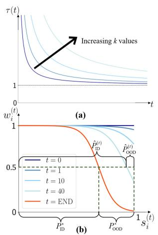
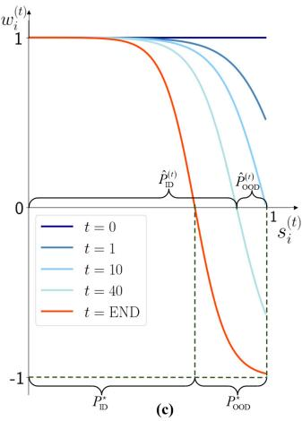
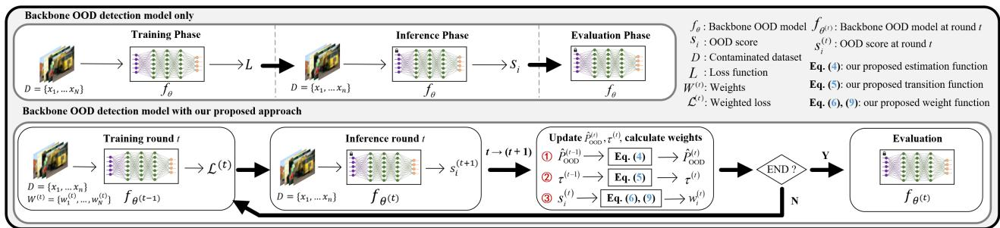

# Beyond Clean Training Data: A Versatile and Model-Agnostic Framework for Out-of-Distribution Detection with Contaminated Training Data

Yuchuan Li Queen’s University

Jae-Mo Kang Kyungpook National University

Il-Min Kim\* Queen’s University

## Abstract

In real-world AI applications, training datasets are often contaminated, containing a mix ofin-distribution (ID) and out-of-distribution (OOD) samples without labels. This contamination poses a significant challengefor developing and training OOD detection models, as nearly all existing methods assume access to a clean training dataset of only ID samples—a condition rarely met in real-world scenarios. Customizing each existing OOD detection method to handle such contamination is impractical, given the vast number of diverse methods designed for clean data. To address this issue, we propose a universal, model-agnostic framework that integrates with nearly all existing OOD detection methods, enabling training on contaminated datasets while achieving high OOD detection accuracy on test datasets. Additionally, our framework provides an accurate estimation ofthe unknown proportion ofOOD samples within the training dataset—an important and distinct challenge in its own right. Our approach introduces a novel dynamic weighting function and transition mechanism within an iterative training structure, enabling both reliable estimation ofthe OOD sample proportion of the training data and precise OOD detection on test data. Extensive evaluations across diverse datasets, including ImageNet-1k, demonstrate that our framework accurately estimates OOD sample proportions oftraining data and substantially enhances OOD detection accuracy on test data.

## 1. Introduction

The development of out-of-distribution (OOD) detection methodologies has become paramount in the quest to fortify the reliability and generalizability of deep neural networks (DNNs). Within the conventional scenario of OOD detection paradigms, a critical and often implicit assumption is that the training dataset is clean, devoid of any OOD contaminants and composed solely of in-distribution (ID) samples [21]. This assumption is foundational to essentially all OOD detection techniques. However, this idealistic assumption often falls apart, even for the gold standard dataset, ImageNet, [36], not to mention almost all real-world datasets [45]. OOD instances are ubiquitous in practice due to labeling errors for ID and OOD by humans, as well as imperfections in (semi-)automated annotations. The task of data purification becomes exponentially more daunting as dataset sizes burgeon. A dataset that contains a mixture of ID and OOD samples is called a contaminated dataset. If such a dataset is erroneously assumed to be uncontaminated during the training process, the performance and reliability of OOD detection methods can be severely compromised [2] (e.g., a 5% contamination of all training samples could lead to a 30- point drop in OOD detection performance). Despite being a more practical scenario for real-world AI applications, this field remains mostly unexplored. Addressing this critical issue is the primary motivation for our work.

Recent advancements in OOD detection have led to a proliferation of diverse and unique methods [12, 40, 43], designed for clean training data. While this variety has strengthened OOD detection capabilities, it presents a critical challenge when dealing with contaminated training data, as individually customizing all those methods to handle such contamination is impractical. This challenge underscores the need for a model-agnostic framework that can integrate with existing OOD detection methods, enabling them to be trained on contaminated datasets—being model-agnostic is additional motivation for our work.

Meanwhile, another important issue is accurately estimating the proportion of OOD samples within contaminated training datasets, which can be useful for various purposes on its own. However, this task presents a tricky challenge: an OOD detection model may only be able to estimate the OOD percentage accurately if it is already well-trained, yet effective training becomes difficult when the training dataset itself is contaminated. The core challenge arises from the need to estimate the OOD proportion of the “training” data itself (not the test data), requiring a model that can be trained on the contaminated training data while simultaneously providing an accurate estimate of the OOD proportion within the data itself. Addressing this issue is the last, yet equally important, motivation for our work.

To address the three challenges simultaneously, we develop a versatile, model-agnostic iterative framework that can be implemented in a plug-and-play manner, seamlessly integrating with almost all existing OOD detection approaches, including those that utilize negative samples. Our method features an innovative weight function design, which not only ensures compatibility with a wide range of OOD detection methods but also significantly enhances their performance with contaminated training datasets. Additionally, we introduce a novel transition mechanism within the weight function to facilitate seamless integration whether the backbone OOD detection methods do or do not utilize negative samples. Together, these innovations also enable our method to directly estimate the OOD percentage within a contaminated training dataset by iteratively refining the estimation to achieve an accurate result—a first in the literature.

When integrated with various existing OOD detection methods, our framework demonstrates substantial performance improvements across a variety of datasets, including ImageNet-1k. The key contributions of our study include the following:

• We propose a model-agnostic framework which can be seamlessly integrated with nearly all existing OOD detection methods, including those utilizing negative samples.

• We introduce an innovative weight and transition mechanism design within the iterative framework, which enables direct estimation of the OOD percentage of the contaminated training dataset for the first time.

• Extensive experiments on diverse datasets (including ImageNet-1k) show that our framework enables various existing OOD detection methods to estimate the OOD percentage of the contaminated training dataset and to substantially improve OOD detection performance.

## 2. Related Works

A popular categorization of OOD detection methods is based on their techniques: (i) discriminative classifier-based, (ii) density estimation-based, (iii) distance-based, and (iv) reconstruction-based. Discriminative methods utilize softmax probabilities to compute OOD scores [12, 14, 23, 24]. Density estimation approaches employ models such as Variational Autoencoders (VAEs) and Flow models to estimate probability densities [5, 7, 25, 28, 39, 43]. Distance-based techniques leverage different distance metrics to measure separations between ID and OOD data [15, 20, 32, 42]. Reconstruction-based methods utilize encoder-decoder architectures or diffusion models to evaluate input reconstruction fidelity and separate ID and OOD samples [8, 11, 41, 47].

Despite extensive research, however, research on OOD detection with contaminated training data remains largely unexplored, although some studies in Anomaly Detection (AD) have addressed this issue [18, 22, 35]. Among these limited AD studies, the approach in [18] represents a modelagnostic AD method for managing contaminated training data. However, applying AD methods directly to OOD detection is generally ineffective due to fundamental differences in the goals, assumptions, and data characteristics of AD and OOD tasks. Additionally, while methods like [18] may be model-agnostic for AD, they are not necessarily modelagnostic for OOD detection, which often relies on distinct techniques—such as leveraging negative samples—that are not typically employed in AD. Moreover, to our knowledge, no work has been proposed to estimate the proportion of contamination within the training dataset itself, which is one of our primary goals. A more detailed discussion of data contamination is provided in Appendix A.

  
Figure 1. The weight function design for our proposed method (a)–(c). (a) The transition function $\check { \tau } ^ { ( t ) }$ in Equation (5). (b) The transition of our weight function in Equation (6) from the start $( t =$ 0) to the end $( t = \mathrm { E N D } )$ ) of training for OOD detection models that do not use negative samples. Initially, all samples are assigned a weight of 1 (dark blue line). The series of lighter blue curves are the weight function across training rounds $( 1 \leq t < \mathrm { E N D } )$ ). The red curve is the weight function at the end $( t = \mathrm { E N D } )$ . (c) The transition of our weight function in Equation (9) for OOD detection models that use negative samples. In this case, $w _ { i } ^ { ( t ) }$ output is expanded to the range of [−1, 1] to facilitate the inclusion of negative samples. Other conventions are the same as in (b).

## 3. Our proposed model-agnostic method

In this study, we introduce a versatile and model-agnostic framework, designed to seamlessly integrate with nearly all existing OOD detection methodologies in a plug-and-play manner, that significantly enhances performance with contaminated training datasets. It features an iterative procedure indexed by t and the OOD detection model is incrementally trained, which is parameterized by $\theta ^ { ( t ) } = \arg \operatorname* { m i n } _ { \theta } \mathcal { L } ^ { ( t ) }$ where the loss $\mathcal { L } ^ { ( t ) }$ will be discussed later. Then, for each sample $x _ { i } .$ , its (normalized) OOD score $s _ { i } ^ { ( t + 1 ) }$ that will be used for the next iteration round is computed by the current model $f _ { \theta ( t ) }$ as $s _ { i } ^ { ( t + 1 ) } = f _ { \theta ^ { ( t ) } } ( x _ { i } ) \in [ 0 , 1 ]$ . In this paper, $f _ { \theta ^ { ( t ) } }$ is referred to as the backbone OOD detection model, which can be any existing OOD detection method designed for clean training data. When $s _ { i } ^ { ( t + 1 ) }$ is closer to zero, it is more likely to be ID, and when it is closer to one, it is more likely to be OOD.

To enable tailored learning from each input sample, we use a sample-wise importance weight mechanism, which assigns individual weight $w _ { i } ^ { ( t ) }$ to each training sample xi in each round t in the iterative framework. The training of the model at round t is guided by the following loss:

$$
\mathcal { L } ^ { \left( t \right) } = \frac { 1 } { n } \sum _ { i = 1 } ^ { n } w _ { i } ^ { \left( t \right) } \cdot L \left( x _ { i } \right)\tag{1}
$$

where $L$ is the original loss function of the backbone model and n is the number of samples.

Our proposed method is detailed in Algorithm 1, which is featured by the iterative and interleaved updates between the weight function $w _ { i } ^ { ( t ) }$ and the estimation $\hat { P } _ { \mathrm { O O D } } ^ { ( t ) }$ of the OOD sample ratio within the contaminated training dataset, thereby augmenting the model’s capability to detect OOD instances. Notably, our method provides a precise estimation $\hat { P } _ { \mathrm { O O D } } ^ { ( t ) }$ —an endeavor not previously explored in any literature, representing a novel contribution. Another major improvement of our method is the intelligent design of the transition mechanism from the initial stage (t = 0) to the subsequent iteration rounds $( t = 1 , 2 , \cdots )$ for the weight $w _ { i } ^ { ( t ) }$ to enhance performance. A comparison of a backbone OOD detection model with and without our proposed approach is shown in Figure 2. The weight function and transition function of our method are shown in Figures 1a–c.

As for the backbone model, current existing OOD detection methods $f _ { \theta ^ { ( t ) } }$ in the literature present a wide spectrum of trade-offs between performance and computational complexity. Those existing OOD detection methods can be categorized into two paradigms based on whether negative samples are utilized or not: the vast majority of the existing OOD methods do not utilize any negative samples, while only some of the very recently proposed OOD methods utilize negative samples. Our framework is meticulously crafted to be compatible with both categories, thereby broadening its applicability across the continuum of current OOD detection strategies. In the following, we first focus on the OOD detection methods that do not utilize negative samples, followed by consideration for the OOD detection methods that incorporate negative samples.

Algorithm 1: Our proposed model-agnostic method   
Input: Unlabeled contaminated training dataset D   
and untrained backbone OOD detection   
model $f _ { \theta }$   
Parameter: α and $k$   
Output: Trained model $f _ { \theta ^ { ( } }$ (END) and $\hat { P } _ { \mathrm { O O D } } ^ { \mathrm { ( E N D ) } }$   
1 $t \gets 0 , w _ { i } ^ { ( 0 ) } \gets 1 , x _ { i } \in D , \hat { P } _ { \mathrm { O O D } } ^ { ( 0 ) } \gets 0$   
2 Do   
3 Update $\boldsymbol { \mathcal { L } ^ { ( t ) } }$ by Eq. (1); Train $f _ { \theta ^ { ( t ) } }$ with $\boldsymbol { \mathcal { L } ^ { ( t ) } }$   
4 Calculate $s _ { i } ^ { ( t + 1 ) } = f _ { \theta ^ { ( t ) } } ( x _ { i } ) \in [ 0 , 1 ]$ for $x _ { i } \in D$   
5 $t \gets t + 1$   
6 Update $\hat { P } _ { \mathrm { O O D } } ^ { ( t ) }$ by Eq. (4); update $\tau ^ { ( t ) }$ by Eq. (5)   
7 Update $w _ { i } ^ { ( t ) }$ by Eq. (6) for $x _ { i } \in D$ $f _ { \theta ( t ) }$ does   
not use negative samples; else by Eq. (9)   
8 While $| \hat { P } _ { \mathrm { O O D } } ^ { ( t ) } - \bar { P } _ { \mathrm { O O D } } ^ { ( t - 1 ) } | \overset { \cdot } { \geq } 0 . 0 5 \cdot \hat { P } _ { \mathrm { O O D } } ^ { ( \bar { t } ) }$

## 3.1. Proposed method for backbone OOD detection models that do not use negative samples

We introduce a novel design for $w _ { i } ^ { ( t ) }$ in our method, specifically engineered to accommodate contaminated datasets with any proportion of OOD samples. For clear illustrative purposes, we first assume that the exact portion of the OOD samples in the contaminated dataset were known, denoted as $P _ { \mathrm { O O D } } ^ { \star } \in [ 0 , 0 . 5 )$ . Under this assumption, the weight could be precisely aligned with $P _ { \mathrm { I D } } ^ { \star } = 1 - P _ { \mathrm { O O D } } ^ { \star }$ as:

$$
w _ { i } ^ { \star , ( t ) } = \frac { 1 } { 1 + e ^ { \alpha ( s _ { i } ^ { ( t ) } - P _ { \mathrm { I D } } ^ { \star } ) } }\tag{2}
$$

where $\alpha > 0$ is a hyperparameter to control the slope. Also, substituting w $\mathbf { \boldsymbol { \mathbf { \mathit { \sigma } } } } _ { i } ^ { \star , ( t ) }$ into Equation (1) yields the ideal loss function, $\bar { \mathcal { L } } ^ { \star , ( t ) }$

In real-world scenarios, however, it is widely acknowledged that this parameter $P _ { \mathrm { I D } } ^ { \star }$ (or $P _ { \mathrm { O O D } } ^ { \star } )$ is mostly unknown. As a consequence, we are compelled to devise an estimation strategy for this parameter when it is unknown. The cornerstone of accurately estimating $P _ { \mathrm { I D } } ^ { \star }$ rests upon a robustly trained OOD detection model $f _ { \theta ^ { \star } }$ , one that is trained comprehensively on the dataset to yield trustworthy OOD scores, denoted by $s _ { i } ^ { \star }$ , for each sample in the dataset. The estimation of the OOD portion $P _ { \mathrm { O O D } } ^ { \star }$ can be executed by enumerating the samples whose $s _ { i } ^ { \star }$ values are higher than a threshold as follows:

$$
P _ { \mathrm { O O D } } ^ { \star } = \frac { 1 } { n } \sum _ { i = 1 } ^ { n } \mathbf { 1 } _ { \{ s _ { i } ^ { \star } > \lambda ^ { \star } \} }\tag{3}
$$

where $\lambda ^ { \star }$ is the optimal OOD score threshold demarcating ID from OOD samples and $\mathbf { 1 } _ { A }$ is a function returning one if A is true or returning zero otherwise.

  
Figure 2. A comparison of the entire procedure between using only backbone OOD detection model $f _ { \theta } ,$ , versus the backbone OOD detection model with our method (from top to bottom) for OOD detection on a contaminated dataset D. When only the backbone OOD detection model is employed, the training, inference, and evaluation phases are conducted sequentially. In contrast, when our proposed approach is employed, these phases are executed across multiple rounds $t ,$ governed by a termination criterion that we introduced. In round t, the backbone OOD detection model $f _ { \theta ^ { ( t ) } }$ , the OOD percentage estimation $\hat { P } _ { \mathrm { O O D } } ^ { ( t ) } .$ , the transition function $\tau ^ { ( t ) }$ , and the weight function $w _ { i } ^ { ( t ) }$ are iteratively refined. This iterative framework ensures an incremental refinement of the model $f _ { \theta } ,$ enhancing its capacity to extract ID features from ID samples while gradually mitigating the impact of OOD samples.

It is important to see that constructing an ideally trained OOD detection model $f _ { \theta ^ { \star } }$ that can estimate the exact OOD portion $P _ { \mathrm { O O D } } ^ { \star }$ hinges on the ideal loss function $\mathcal { L } ^ { \star }$ employing the ideal weights $w _ { i } ^ { \star }$ . Contradictorily, determining the ideal weights $w _ { i } ^ { \star }$ is contingent upon an exact estimation of $P _ { \mathrm { I D } } ^ { \star }$ , while the latter actually relies on the former, culminating in a conundrum of circular dependency that precludes resolution.

To navigate this impasse, we employ an iterative strategy between $w _ { i } ^ { ( t ) }$ and the OOD percentage estimation $\hat { P } _ { \mathrm { O O D } } ^ { ( t ) } .$ Specifically, $\hat { P } _ { \mathrm { O O D } } ^ { ( t ) }$ in each round t is produced with a similar decision mechanisms as in Equation (3), but with a recursively updated threshold, to encourage the OOD detection model to gradually learn the features of samples as follows:

$$
\hat { P } _ { \mathrm { O O D } } ^ { ( t ) } = \frac { 1 } { n } { \sum _ { i = 1 } ^ { n } \mathbf { 1 } } _ { \{ \bar { s } _ { i } ^ { ( t ) } > ( 1 - \hat { P } _ { \mathrm { O O D } } ^ { ( t - 1 ) } ) \} }\tag{4}
$$

where $\bar { s } _ { i } ^ { ( t ) }$ is the moving average of OOD scores for sample $x _ { i }$ in the rounds leading up to round t. Then the estimated ID ratio $\hat { P } _ { \mathrm { I D } } ^ { ( t ) } = 1 - \hat { P } _ { \mathrm { O O D } } ^ { ( t ) }$ is used for the weights in Equation (2) in lieu of $P _ { \mathrm { I D } } ^ { \star }$ . This iterative method, predicated on a moving average and a recursive thresholding mechanism grounded in OOD scores, is more congruent with a model that is progressively attuned to the characteristics of the samples within the dataset.

Nonetheless, Equations (2) with $\hat { P } _ { \mathrm { I D } } ^ { ( t ) }$ and (4) still exhibit a major limitation within this iterative framework, especially during the beginning stages of the iterative training. In these early iterations, the model has not yet achieved a state of refinement, rendering the OOD scores $s _ { i } ^ { ( t ) }$ it generates as unreliable. Consequently, the weights $w _ { i } ^ { ( t ) }$ —which are determined from not-yet-reliable OOD scores—are similarly untrustworthy. This unreliability may lead to two types of misclassification: (i) some ID samples might be erroneously identified as OOD, assigning them inappropriately low weights, and (ii) some OOD samples might be erroneously identified as ID, assigning unduly high weights.

In the latter scenario (ii), the impact is often benign, especially in the early stage of training. As explicated in the corpus of literature on curriculum learning [3], the phenomenon of noisy labels [1, 10, 16, 44], and the concept of simplicity bias [29, 34], deep learning models initially gravitate towards simpler, easily discernible features, and then progressively advancing to more complex ones at later training stages. In our setting of training on contaminated datasets, ID samples could be considered as the “easy” ones, because ID samples make up the majority of the dataset and they also possess a common characteristic that the model can learn more efficiently. In contrast, OOD samples could be considered as “hard” ones because OOD samples are a minority and they do not necessarily possess a common characteristic, which is harder to learn. Since OOD samples are hard ones to learn, even if some OOD samples are misclassified as ID and consequently assigned higher weights, at the early stage of training, it is unlikely that the model will substantially incorporate the features of these OOD samples.

Contrastingly, in the former case (i), the impact is often clearly negative even at the early stage of training. This is because when ID samples (i.e., easy ones) are erroneously classified as OOD and consequently attributed to diminished weights, those ID samples are (almost entirely or at least partially) excluded from training, which could have benefited the training otherwise in the early phase of training. Consistent with the principles outlined in curriculum learning [3], therefore, it is imperative for a deep learning model to be encouraged to initially focus on easy samples to facilitate the attainment of optimal performance in the end.

To address this negative impact, we propose a transition mechanism to ensure that, even for the ID samples that are erroneously identified as OOD due to their erroneous high OOD score $s _ { i } ^ { ( t ) }$ , their weights $w _ { i } ^ { ( t ) }$ are maintained high enough to be included in training, especially at the early stage. To this end, we design a special transition function $\tau ^ { ( t ) }$ , which will divide $s _ { i } ^ { ( t ) }$ to produce $w _ { i } ^ { ( t ) }$ , such that the values of $w _ { i } ^ { ( t ) }$ are encouraged to be large enough even when the OOD scores $s _ { i } ^ { ( t ) }$ are large. In this paper, $\tau ^ { ( t ) }$ is designed to be (also, shown in Figure 1a):

$$
\tau ^ { ( t ) } = \frac { k } { t } + 1\tag{5}
$$

where $k > 0$ controls the steepness of this function, thus the decreasing speed of $\tau ^ { ( t ) }$ . It is clear that at the early stage of training, as $\frac { s _ { i } ^ { ( t ) } } { \tau ^ { ( t ) } }$ is (much) smaller than $s _ { i } ^ { ( t ) }$ , they still receive high weights due to $\frac { s _ { i } ^ { ( t ) } } { \tau ^ { ( t ) } }$ . As the training progresses, the value of $\tau ^ { ( t ) }$ monotonically decreases and eventually converges to one, meaning that, at the later stage of training, the effect of $\tau ^ { ( t ) }$ fades out. This would be reasonable because the OOD scores predicted by the model are more reliable at the later stage.

Overall, our proposed weights, integrating this transitional element, are expressed as follows (also shown in Figure 1b):

$$
\begin{array}{c} w _ { i } ^ { ( t ) } = \left\{ \begin{array} { l l } { 1 , } & { t = 0 } \\ { \quad 1 } \\ { 1 + e ^ { \alpha ( \frac { s _ { i } ^ { ( t ) } } { \tau ^ { ( t ) } } - \hat { P } _ { \mathrm { I D } } ^ { ( t ) } ) } } \\ { \quad 1 } \\ { \quad 1 + e ^ { \alpha ( s _ { i } ^ { ( t ) } - \hat { P } _ { \mathrm { I D } } ^ { ( t ) } ) } } \end{array} , \quad 1 \leq t < \mathrm { E N D }  \end{array} \right.\tag{6a}
$$

(6b)

(6c)

Note that Equations (6a) and (6c) serve as asymptotic manifestations of Equation (6b), delineating the initial $( t = 0 )$ and final (t = END) round of the iterative training process, respectively. As the round index t approaches zero, τ(t) escalates towards infinity. This asymptotic behavior causes the term $\frac { s _ { i } ^ { ( t ) } } { \tau ^ { ( t ) } }$ to asymptotically approach 0. Consequently, the expression $\frac { s _ { i } ^ { ( t ) } } { \tau ^ { ( t ) } } - \hat { P } _ { \mathrm { I D } } ^ { ( t ) }$ gravitates towards −1, given that $\hat { P } _ { \mathrm { I D } } ^ { ( t ) }$ is posited to be 1 at the onset of the training process. Subsequently, the term $\alpha \big ( \frac { s _ { i } ^ { ( t ) } } { \tau ^ { ( t ) } } - \hat { P } _ { \mathrm { I D } } ^ { ( t ) } \big )$ assumes a significantly negative value, owing to α being a large positive number. This results in the exponential term $e ^ { \alpha ( \frac { s _ { i } ^ { ( t ) } } { \tau ^ { ( t ) } } - \hat { P } _ { \mathrm { I D } } ^ { ( t ) } ) }$ within Equation (6b) becoming negligible relative to 1. Thus, at the inception of training, $w _ { i } ^ { ( t ) }$ is effectively approximated as 1. Meanwhile, in the terminal round of training, where t is sufficiently large, $\tau ^ { ( t ) }$ converges towards 1, thereby aligning $\frac { s _ { i } ^ { ( t ) } } { \tau ^ { ( t ) } }$ closely with $s _ { i } ^ { ( t ) }$ . This convergence ultimately simplifies Equation (6b) into Equation (6c).

As for the termination criterion in our method, the $\hat { P } _ { \mathrm { O O D } } ^ { ( t ) }$ can naturally serve as an indicator of the training progress.

Specifically, when $\hat { P } _ { \mathrm { O O D } } ^ { ( t ) }$ demonstrates a small variation $( \mathrm { e . g . } , | \hat { P } _ { \mathrm { O O D } } ^ { ( t ) } - \hat { P } _ { \mathrm { O O D } } ^ { ( t - 1 ) } | < 0 . 0 5 \hat { P } _ { \mathrm { O O D } } ^ { ( t ) }$ , where 0.05 is chosen empirically), it suggests that the model has likely gained enough understanding of the dataset. More details on the weight function design in Equations (6a)–(6c) are available in Appendix B.1.

It is noteworthy that the method in [18] is substantially different from our method. Indeed, it is a versatile framework for AD on contaminated datasets that is available now, which holds potential for application in OOD detection on contaminated datasets, making it a comparable scheme for performance comparison (the comparison results will be presented later). Notwithstanding some similarities, our method diverges substantially in its framework design. For example, the method [18] lacks the capability to leverage negative samples, nor does it possess the functionality to estimate the proportion of contamination in the training dataset. The design of weight functions is also very different and no transition function was adopted in [18].

## 3.2. Proposed method for backbone OOD detection models using negative samples

In this section, as the backbone of our method, we now consider the OOD detection models utilizing negative samples. Existing OOD detection methods incorporating negative samples (all those works assumed clean training datasets) typically generate synthetic negative samples from real ID samples during training to enhance model performance. This was a reasonable (perhaps, the only possible) approach in those works, because the training dataset is purely composed of ID samples, with no access to real OOD samples, during training. However, in the scenario of contaminated datasets, authentic real OOD samples are inherently included in the training dataset, which can be actually utilized as negative samples (if accurately detected). In this sense, contaminated datasets could be paradoxically beneficial for the OOD detection methods utilizing negative samples in the sense that the naturally occurring genuine OOD samples can be leveraged instead of generating synthetic negatives from ID samples.

In the domain of OOD models utilizing synthetic negative samples [13, 33], the total loss is a summation of two loss terms: one loss term for the positive samples and the other loss term for the negative samples. When this approach is directly integrated with the sample-wise weights in Equation (1), the total loss in our problem can be written as

$$
\begin{array} { c } { { \displaystyle \mathcal { L } ^ { ( t ) } = \frac { 1 } { n _ { \mathrm { I D } } } \sum _ { i \in D _ { \mathrm { I D } } } w _ { i } ^ { \mathrm { I D } , ( t ) } L _ { \mathrm { I D } } \left( x _ { i } \right) } } \\ { { \displaystyle ~ + \frac { \mu } { n _ { \mathrm { O O D } } } \sum _ { i \in D _ { \mathrm { O O D } } } w _ { i } ^ { \mathrm { O O D } , ( t ) } L _ { \mathrm { O O D } } \left( x _ { i } \right) } } \end{array}\tag{7}
$$

where $n _ { \mathrm { I D } }$ and $n _ { \mathrm { O O D } }$ denote the number of samples in the ID set $D _ { \mathrm { I D } }$ and the OOD set $D _ { \mathrm { O O D } }$ , respectively. Also,

$L _ { \mathrm { I D } } ~ \geq ~ 0$ and $w _ { i } ^ { \mathrm { I D } , ( t ) } \in [ 0 , 1 ]$ , respectively, represent the loss function and weights tailored for ID samples, while $L _ { \mathrm { O O D } } ~ \le ~ 0 $ and $w _ { i } ^ { \mathrm { O O D } , ( t ) } \in [ 0 , 1 ]$ represent the distinct loss function and weights for OOD samples. $\mu > 0$ is a hyperparameter to control the impact of the second term.

However, the straightforward application of this loss function design introduces several challenges. First of all, a hard decision process to classify the contaminated dataset D into $D _ { \mathrm { I D } }$ or $D _ { \mathrm { O O D } }$ is required, which however is actually the original OOD detection problem that we want to solve, turning into circular reasoning. Even approximate classification is still very challenging, especially at the initial stages of training when the model’s OOD detection capabilities are still underdeveloped. Moreover, the weights $w _ { i } ^ { \mathrm { \tiny \dot { I D } } , ( t ) }$ need to be re-designed, because they are now supposed to be used only for ID samples and thus Equation (6) cannot be used. Also, $w _ { i } ^ { \mathrm { O O D } , ( t ) }$ should be designed differently from $w _ { i } ^ { \mathrm { I D } , ( t ) }$ because $L _ { \mathrm { I D } }$ and $\scriptstyle L _ { \mathrm { O O D } }$ often take different forms. Lastly, tuning of the hyperparameter $\mu$ is very challenging because it must take into account the (unknown) accuracy of hard classification of D into $D _ { \mathrm { { I D } } }$ and $D _ { \mathrm { O O D } }$ , and moreover, it must be adapted for the mechanism of each specific backbone OOD detection model.

To address all of these challenges simultaneously, we adopt the same weight function $w _ { i } ^ { ( \bar { t } ) }$ for both ID and OOD samples while adjusting the range from [0, 1] to [−1, 1]. This range modification of $w _ { i } ^ { ( t ) }$ makes it possible to use the original loss $\boldsymbol { \mathcal { L } ^ { ( t ) } }$ in Equation (1) as is, for the entire dataset D including both ID and OOD samples, while bypassing (i) rigid separation of D into distinct sets $D _ { \mathrm { { I D } } }$ and $D _ { \mathrm { O O D } }$ , (ii) designing two different weights $w _ { i } ^ { \mathrm { I D } , ( t ) }$ and $w _ { i } ^ { \mathrm { O O D } , ( t ) }$ , and (iii) tuning the critical hyperparameter $\mu .$ . In such universal designing of $w _ { i } ^ { ( t ) } \in [ - 1 , 1 ]$ , we need to ensure that, for the OOD likely samples whose OOD scores $s _ { i } ^ { ( t ) }$ are close to one, the weights must be close to −1, whereas for the ID likely samples whose $s _ { i } ^ { ( t ) }$ are close to zero, the weights must be close to 1. If the OOD scores $s _ { i } ^ { ( t ) }$ were sufficiently trustworthy (this could be the case only when $t \gg 1 )$ , we would design $w _ { i } ^ { ( t ) } \in [ - 1 , 1 ]$ as follows:

$$
w _ { i } ^ { ( t ) } = \frac { 2 } { 1 + e ^ { \alpha ( s _ { i } ^ { ( t ) } - \hat { P } _ { \mathrm { I D } } ^ { ( t ) } ) } } - 1 , t \gg 1 .\tag{8}
$$

However, the OOD scores $s _ { i } ^ { ( t ) }$ might not be reliable enough, especially in the early stage of training. Therefore, we need a transition mechanism that reduces the effect of misclassification that ID samples are erroneously identified as OOD, as discussed before. Thanks to the universal use of $w _ { i } ^ { ( t ) }$ for both ID and OOD samples, we can adopt the same transition mechanism $\tau ^ { ( t ) }$ in Equation (5) for the design of $w _ { i } ^ { ( t ) }$ as follows (also, shown in Figure 1c):

$$
w _ { i } ^ { ( t ) } = \left\{ \begin{array} { l l } { 1 , } & { t = 0 } \\ { \displaystyle \frac { 2 } { 1 + e ^ { \alpha ( \frac { s _ { i } ^ { ( t ) } } { \tau ^ { ( t ) } } - \hat { P } _ { \mathrm { I D } } ^ { ( t ) } ) } } - 1 , } & { 1 \le t < \mathrm { E N D } } \\ { \displaystyle \frac { 2 } { 1 + e ^ { \alpha ( s _ { i } ^ { ( t ) } - \hat { P } _ { \mathrm { I D } } ^ { ( t ) } ) } } - 1 , } & { t = \mathrm { E N D } . } \end{array} \right.\tag{9a}
$$

(9b)

(9c)

Note that Equations (9a) and (9c) serve as asymptotic manifestations of Equation (9b), delineating the initial $( t = 0 )$ and final $( t = \mathrm { E N D } )$ round of the iterative training process, respectively. Further discussions about the weight function are available in Appendix B.2.

## 4. Experiments

The evaluation of our proposed method spans various datasets, including CIFAR-10, Celeb A, SVHN, GTSRB, CIFAR-100, Mini-ImageNet, Tiny-ImageNet, ImageNet-1k, iNaturalist, and OpenImage-O. To construct the training partition of a contaminated dataset, two datasets are chosen as ID and OOD datasets, where a portion of each is selected based on $P _ { \mathrm { O O D } } ^ { \star }$ . The test partition mirrors the training set, and labels are not available in the training. More details of dataset pre-processing are delineated in Appendix C.

In evaluating our method for being model-agnostic, we select a suite of widely-regarded backbone OOD detection models, including DB [5], LReg [39], LRat [28], WAIC [7], G-ODIN [14], Energy [24], and ReAct [31] for OOD detection models that do not use negative samples, along with CSI [33], CnC [11], and VOS [9] for OOD detection models that use negative samples. More details about the utilization of these backbone models with our method are provided in Appendix D. As a performance metric for OOD detection accuracy, we report the Area Under the Receiver Operating Characteristic (AUROC) scores. For evaluating the accuracy of OOD percentage estimation, we use the normalized error ε of OOD percentage estimation that is defined by

$$
\varepsilon = \frac { \left| P _ { \mathrm { O O D } } ^ { \star } - \hat { P } _ { \mathrm { O O D } } ^ { \mathrm { ( E N D ) } } \right| } { 0 . 5 }\tag{10}
$$

Note that ε is in the range [0, 1) because both $P _ { \mathrm { O O D } } ^ { \star }$ and $\hat { P } _ { \mathrm { O O D } } ^ { \mathrm { ( E N D ) } }$ lie within [0, 0.5).

In the area of OOD detection, to the best of our knowledge, no model-agnostic approach exists for handling contaminated training data. Meanwhile, in the field of AD, there is a model-agnostic method known as IAD [18]. However, IAD is not model-agnostic for OOD detection, as it was not originally designed to support the use of negative samples. In this paper, with proper adaptations, we adopt IAD as a competing model-agnostic framework for OOD detection on contaminated training data. Notably, IAD’s weight design is based on the implicit assumption that the contamination portion of the training data is fixed at 0.5, without any mechanism to estimate this proportion. Thus, the OOD percentage estimation results for IAD are represented as “N/A $\left( \varepsilon _ { \mathrm { I A D } } \right) ^ { * }$ where εIAD is computed using Equation (10) with setting $\hat { P } _ { \mathrm { O O D } } ^ { \mathrm { ( E N D ) } }$ to 0.5.

## 4.1. Comparison in OOD detection performance

First, with $P _ { \mathrm { O O D } } ^ { \star } = 1 \%$ , we assess our method on different ID and OOD datasets for OOD detection models that do not utilize negative samples in Table 1 and for the models utilizing negative samples in Table 2. It could be observed that our method shows consistently better performance against the IAD method across various popular large-scale datasets with a light-contaminated condition.

Table 1. AUROC score of our method and IAD for OOD detection models that do not use negative samples with different ID and OOD datasets of $P _ { \mathrm { O O D } } ^ { \star } = 1 \%$ . “T-ImageNet” and “M-ImageNet” indicate Tiny-ImageNet and Mini-ImageNet datasets, respectively. “BB” demotes the backbone OOD detection model that is used. Backbone OOD detection model names with square (□) symbols represent the ones that do not utilize negative samples. Numbers in bold indicate the best performance in each test case.
<table><tr><td rowspan="2">ID Dataset</td><td rowspan="2">OOD dataset</td><td rowspan="2">BB</td><td colspan="3">Methods</td></tr><tr><td>BB only</td><td>BB+ IAD</td><td>BB+ Ours</td></tr><tr><td rowspan="3">CIFAR-100</td><td rowspan="2">T-ImageNet</td><td>DB  $\mathbf { G - O D I N } ^ { \perp }$ </td><td>54.8 56.9</td><td>55.9</td><td>57.2</td></tr><tr><td> $\mathbf { R e A c t } ^ { \perp }$ </td><td>67.5</td><td>58.7 70.1</td><td>61.3 72.5</td></tr><tr><td>M-ImageNet</td><td> $\mathrm { D } \mathbf { B } ^ { \perp }$   $\mathbf { G - O D I N } ^ { \perp }$ </td><td>54.3</td><td>54.7</td><td>55.6</td></tr><tr><td rowspan="5">ImageNet-1k</td><td rowspan="2"></td><td> $\mathrm { R e A c t } ^ { \circ }$ </td><td>53.3 59.7</td><td>56.8 61.5</td><td>60.4 64.4</td></tr><tr><td> $\mathrm { D } \mathbf { B } ^ { \perp }$ </td><td>57.9</td><td></td><td></td></tr><tr><td rowspan="3">iNaturalist</td><td> $\mathbf { G - O D I N } ^ { \perp }$ </td><td>60.4</td><td>59.0 62.6</td><td>60.7 64.8</td></tr><tr><td>ReAct</td><td>63.9</td><td>67.6</td><td>70.3</td></tr><tr><td></td><td></td><td></td><td></td></tr><tr><td rowspan="3"></td><td rowspan="3">OpenImage-O</td><td>DB</td><td>53.6</td><td>53.8</td><td>54.3</td></tr><tr><td> $\mathbf { G - O D I N } ^ { \perp }$ </td><td>54.5</td><td>55.6</td><td>57.7</td></tr><tr><td> $\mathbf { R e A c t } ^ { \perp }$ </td><td>57.6</td><td>60.8</td><td>63.0</td></tr></table>

Table 2. AUROC score of our method and IAD for OOD detection models that use negative samples with different ID and OOD datasets of $P _ { \mathrm { O O D } } ^ { \star } = 1 \%$ . Backbone OOD detection model names with triangle (△) symbols represent the ones that utilize negative samples. Other conventions are the same as in Table 1.
<table><tr><td rowspan="2">ID Dataset</td><td rowspan="2">OOD dataset</td><td rowspan="2">BB</td><td colspan="3">Methods</td></tr><tr><td>BB only</td><td>BB+ IAD</td><td>BB+ Ours</td></tr><tr><td>CIFAR-100</td><td>T-ImageNet M-ImageNet</td><td> $\mathrm { \nabla { V O S ^ { \triangle } } }$ </td><td>57.2 57.6</td><td>58.5 58.5</td><td>62.1 59.6</td></tr><tr><td>ImageNet-1k</td><td>iNaturalist OpenImage-O</td><td>VOS</td><td>61.0 53.8</td><td>62.1 54.3</td><td>63.2 55.2</td></tr></table>

We also consider the setting where CIFAR-10 is the ID dataset, while Celeb A is the OOD dataset. Notably, this is one of the most challenging test cases in smaller-scale datasets [5, 7]. For this challenging scenario, we evaluate our method, varying $P _ { \mathrm { O O D } } ^ { \star }$ for OOD detection models that do not and do utilize negative samples, respectively, in Tables 3 and 4. It shows that our method can consistently outperform the IAD method across different backbone OOD detection models, whether they use negative samples or not over different $P _ { \mathrm { O O D } } ^ { \star }$ . Detailed results of backbone OOD detection models on more test cases, performance results on standard (ideal) settings of OOD detection, more performance results with different test cases varying OOD percentage $P _ { \mathrm { O O D } } ^ { \star }$ , and performance stability based on repeated tests are discussed in Appendices E.1, E.2, E.3, and E.4 respectively.

Table 3. AUROC score comparison of our method and IAD with CIFAR-10 as ID dataset and Celeb A as OOD dataset for OOD detection models that do not use negative samples with different $P _ { \mathrm { O O D } } ^ { \star }$ . Other conventions are the same as in Table 1.
<table><tr><td rowspan="2"> $P _ { \mathrm { O O D } } ^ { \star }$ </td><td rowspan="2">BB</td><td colspan="3">Methods</td></tr><tr><td>BB only</td><td>BB + IAD</td><td>BB + Ours</td></tr><tr><td rowspan="5">1%</td><td> $\mathrm { D B } ^ { \perp }$ </td><td>58.6</td><td>60.1</td><td>62.2</td></tr><tr><td> $\mathrm { L R e g } ^ { \perp }$ </td><td>63.4</td><td>65.2</td><td>68.5</td></tr><tr><td> $\mathrm { E n e r g y } ^ { \circ }$ </td><td>60.6</td><td>63.8</td><td>66.3</td></tr><tr><td> $\mathbf { R e A c t } ^ { \perp }$ </td><td>65.7</td><td>69.1</td><td>72.2</td></tr><tr><td> $\mathbf { G - O D I N } ^ { \perp }$ </td><td>59.1</td><td>62.5</td><td>65.7</td></tr><tr><td rowspan="6">2%</td><td> $\mathrm { D B } ^ { \perp }$ </td><td>56.7</td><td>58.4</td><td>60.6</td></tr><tr><td> $\mathrm { L R e g } ^ { \perp }$ </td><td>62.2</td><td>64.0</td><td>66.9</td></tr><tr><td> $\mathrm { E n e r g y } ^ { \circ }$ </td><td>56.5</td><td>60.0</td><td>62.6</td></tr><tr><td> $\mathbf { R e A c t } ^ { \perp }$ </td><td>61.9</td><td>66.7</td><td>69.8</td></tr><tr><td> $\mathbf { G - O D I N } ^ { \perp }$ </td><td>57.2</td><td>60.8</td><td>64.3</td></tr><tr><td></td><td></td><td></td><td></td></tr></table>

Table 4. AUROC score comparison of our method and IAD with CIFAR-10 as ID dataset and Celeb A as OOD dataset for OOD detection models that use negative samples with different $P _ { \mathrm { O O D } } ^ { \star }$ Other conventions are the same as in Table 3.
<table><tr><td rowspan="2"> $P _ { \mathrm { O O D } } ^ { \star }$ </td><td rowspan="2">BB</td><td colspan="3">Methods</td></tr><tr><td>BB only</td><td>BB + IAD</td><td>BB + Ours</td></tr><tr><td rowspan="3">1%</td><td>CSI</td><td>58.6</td><td>61.6</td><td>64.3</td></tr><tr><td> $\mathrm { C n C ^ { \Delta } }$ </td><td>59.4</td><td>62.0</td><td>64.2</td></tr><tr><td> $\mathrm { \ v o s ^ { \triangle } }$ </td><td>59.8</td><td>61.8</td><td>63.1</td></tr><tr><td rowspan="3">2%</td><td>CSI</td><td>57.1</td><td>60.2</td><td>62.6</td></tr><tr><td> $\mathrm { C n C ^ { \triangle } }$ </td><td>56.8</td><td>60.5</td><td>62.3</td></tr><tr><td> $\mathrm { \ v o s ^ { \triangle } }$ </td><td>56.5</td><td>59.9</td><td>62.1</td></tr></table>

## 4.2. OOD percentage estimation performance

For OOD percentage estimation performance, it could be observed that our method is able to accurately estimate $P _ { \mathrm { O O D } } ^ { \star }$ in challenging scenarios with larger-scale datasets and with models that do and do not use negative samples, as shown in Table 5. As previously clarified, the IAD method [18] implicitly assumes that half of the samples in the dataset are contaminated ones, as it uses the median statistics of anomaly scores in their weights, but no attempt to estimate the actual contamination rate in the training dataset.

Table 5. Normalized OOD percentage estimation error ε comparison for our method and IAD for OOD detection models that do and do not use negative samples with different datasets of $P _ { \mathrm { O O D } } ^ { \star } = 1 \%$ $\mathrm { \ddot { \ s u p } \mathrm { \vec { \Omega } } }$ indicates any of the backbone OOD detection models.
<table><tr><td rowspan="2">ID Dataset</td><td rowspan="2">OOD Dataset</td><td rowspan="2">Method</td><td colspan="3">BB</td></tr><tr><td> $\mathrm { D B } ^ { \perp }$ </td><td> $\mathbf { G - O D I N } ^ { \perp }$ </td><td>VOS</td></tr><tr><td>Any</td><td>Any</td><td>BB+ IAD</td><td>N/A (0.980)</td><td>N/A (0.980)</td><td>N/A (0.980)</td></tr><tr><td>CIFAR-100</td><td>T-ImageNet M-ImageNet</td><td rowspan="3">BB+ Ours</td><td>0.001 0.001</td><td>0.001 0.000</td><td>0.001 0.001</td></tr><tr><td>ImageNet-1k</td><td>iNaturalist OpenImage-O</td><td>0.002 0.001</td><td>0.002 0.001</td><td>0.000 0.001</td></tr></table>

We also evaluate our OOD percentage estimation for test cases with different $P _ { \mathrm { O O D } } ^ { \star }$ for OOD detection models that do not and do use negative samples. The results in Table 6 show that our method can accurately estimate the OOD percentage on different backbone OOD detection models. More results on other datasets are available in Appendix E.5.

Table 6. Normalized OOD percentage estimation error ε comparison for our method and IAD for OOD detection models that do and do not use negative samples with CIFAR-10 as ID dataset and Celeb A as OOD dataset of different $P _ { \mathrm { O O D } } ^ { \star }$ . Other conventions are the same as in Table 5.
<table><tr><td rowspan="2">Methods</td><td rowspan="2">BB</td><td colspan="3"> $P _ { \mathrm { O O D } } ^ { \star }$ </td></tr><tr><td>0.010</td><td>0.020</td><td>0.050</td></tr><tr><td> $\mathrm { B B } + \mathrm { I A D }$ </td><td> $\mathbf { A n y } ^ { \perp , \Delta }$ </td><td>N/A (0.980)</td><td>N/A (0.960)</td><td>N/A (0.900)</td></tr><tr><td rowspan="4"> $\mathbf { B B } + \mathbf { O u r s }$ </td><td> $\mathrm { D } \mathbf { B } ^ { \perp }$ </td><td>0.001</td><td>0.002</td><td>0.016</td></tr><tr><td> $\mathrm { L R e g } ^ { \perp }$ </td><td>0.000</td><td>0.001</td><td>0.009</td></tr><tr><td> $\mathrm { E n e r g y } ^ { \circ }$ </td><td>0.000</td><td>0.002</td><td>0.010</td></tr><tr><td> $\mathrm { R e A c t } ^ { \square }$  G-ODIN</td><td>0.000 0.001</td><td>0.001 0.001</td><td>0.014 0.012</td></tr><tr><td rowspan="3"> $\mathbf { B B } + \mathbf { O u r s }$ </td><td> $\mathrm { C S I ^ { \Delta } }$ </td><td></td><td></td><td>0.014</td></tr><tr><td> $\mathrm { C n C ^ { \triangle } }$ </td><td>0.001 0.001</td><td>0.002 0.002</td><td>0.004</td></tr><tr><td>VOS</td><td>0.000</td><td>0.002</td><td>0.012</td></tr></table>

## 4.3. Ablation Study

## 4.3.1 OOD percentage estimation

First, we present an ablation study of OOD percentage estimation in our weight function in Table 7 on different backbone OOD detection models with different $P _ { \mathrm { O O D } } ^ { \star }$ . This is done by keeping the usage of $\tau ^ { ( t ) }$ while fixing the $\hat { P } _ { \mathrm { O O D } }$ at 0.5. The results in those tables indicate that our proposed weight function is essential for our proposed method, as omitting the OOD percentage estimation $\bar { P } _ { \mathrm { O O D } } ^ { ( t ) }$ consistently degrades the OOD detection performance across different test cases with backbone OOD detection models that do and do not use negative samples with varying $P _ { \mathrm { O O D } } ^ { \star }$

Table 7. AUROC scores for our method with and without (w/o) OOD percentage estimation with CIFAR-10 as ID dataset and Celeb A as OOD dataset and different $P _ { \mathrm { O O D } } ^ { \star }$
<table><tr><td rowspan="2"> $P _ { \mathrm { O O D } } ^ { \star }$ </td><td rowspan="2">BB</td><td colspan="3">Methods</td></tr><tr><td>BB only</td><td>BB + Ours</td><td> $\mathbf { B B } + \mathbf { O u r s } ( \mathbf { w } / \mathbf { o \ } \hat { P } _ { \mathrm { O O D } } ^ { ( t ) } )$ </td></tr><tr><td rowspan="2">1%</td><td>DB</td><td>58.6</td><td>62.2</td><td>61.0</td></tr><tr><td>VOS</td><td>59.8</td><td>63.1</td><td>61.9</td></tr><tr><td rowspan="2">2%</td><td>DB</td><td>56.7</td><td>60.6</td><td>58.4</td></tr><tr><td>VOS</td><td>56.5</td><td>62.1</td><td>60.1</td></tr></table>

## 4.3.2 Transition in the weight function

Furthermore, we also include an ablation study of the transition $\tau ^ { ( t ) }$ of our proposed approach in Table 8 on different backbone OOD models with different test cases and different $P _ { \mathrm { O O D } } ^ { \star }$ . It could be observed that the removal of $\tau ^ { ( t ) }$ also consistently downgrades the OOD detection performance across those test cases. More results of this ablation study for the training procedure are available in Appendix E.6.

Table 8. AUROC scores for our method with and without (w/o) $\tau ^ { ( t ) }$ . Other conventions are the same as in Table 7.
<table><tr><td rowspan="2"> $P _ { \mathrm { O O D } } ^ { \star }$ </td><td rowspan="2">BB</td><td colspan="3">Methods</td></tr><tr><td>BB only</td><td>BB + Ours</td><td> $\mathbf { B B } + \mathbf { O u r s } ( \mathbf { w } / \mathbf { o \Lambda } \tau ^ { ( t ) } )$ </td></tr><tr><td rowspan="2">1%</td><td> $\mathrm { D } \mathbf { B } ^ { \perp }$ </td><td>58.6</td><td>62.2</td><td>58.5</td></tr><tr><td> $\mathrm { \Delta V O S ^ { \Delta } }$ </td><td>59.8</td><td>63.1</td><td>60.9</td></tr><tr><td rowspan="2">2%</td><td>DB</td><td>56.7</td><td>60.6</td><td>58.1</td></tr><tr><td> $\mathrm { \Delta V O S ^ { \Delta } }$ </td><td>56.5</td><td>62.1</td><td>59.4</td></tr></table>

## 5. Conclusions

In this work, we introduced a novel model-agnostic method that could be integrated with almost all existing OOD detection models to address OOD detection with contaminated training datasets, a very practical scenario in real-world applications. By innovating the weight function in an iterative manner with a novel transition and OOD percentage estimation of the contaminated dataset, our method substantially enhanced adaptability and reduced the impact of erroneous OOD model predictions. Besides, we proposed another innovative design of the weight function specifically for OOD detection models that generated and utilized synthetic negative samples, aimed at augmenting their performance with rea negative samples identified from the contaminated dataset. Our method demonstrated superior performance across various popular datasets and experimental setups, and it provided an accurate estimation of the actual OOD percentage in contaminated training datasets—a first in the literature.

Acknowledgement. This work was partly funded by the Natural Sciences and Engineering Research Council of Canada (NSERC).

## References

[1] Devansh Arpit, Stanisław Jastrzbski, Nicolas Ballas, David Krueger, Emmanuel Bengio, Maxinder S Kanwal, Tegan Maharaj, Asja Fischer, Aaron Courville, Yoshua Bengio, et al. A closer look at memorization in deep networks. In Proceedings of the International Conference on Machine Learning (ICML), 2017. 4, 12, 13

[2] Laura Beggel, Michael Pfeiffer, and Bernd Bischl. Robust anomaly detection in images using adversarial autoencoders. In Proceedings ofthe Machine Learning and Knowledge Discovery in Databases: European Conference (ECML PKDD), 2020. 1, 15

[3] Yoshua Bengio, Jer´ ome Louradour, Ronan Collobert, andˆ Jason Weston. Curriculum learning. In Proceedings of the International Conference on Machine Learning (ICML), 2009. 4

[4] Julian Bitterwolf, Maximilian Mueller, and Matthias Hein. In or out? fixing imagenet out-of-distribution detection evaluation. arXiv preprint arXiv:2306.00826, 2023. 12

[5] Kushal Chauhan, Pradeep Shenoy, Manish Gupta, Devarajan Sridharan, et al. Robust outlier detection by de-biasing vae likelihoods. In Proceedings ofthe IEEE/CVF Conference on Computer Vision and Pattern Recognition (CVPR), 2022. 2, 6, 7

[6] Ting Chen, Simon Kornblith, Mohammad Norouzi, and Geoffrey Hinton. A simple framework for contrastive learning of visual representations. In Proceedings ofthe International Conference on Machine Learning (ICML), 2020. 18

[7] Hyunsun Choi, Eric Jang, and Alexander A Alemi. Waic, but why? generative ensembles for robust anomaly detection. arXiv preprint arXiv:1810.01392, 2018. 2, 6, 7, 17

[8] Taylor Denouden, Rick Salay, Krzysztof Czarnecki, Vahdat Abdelzad, Buu Phan, and Sachin Vernekar. Improving reconstruction autoencoder out-of-distribution detection with mahalanobis distance. arXiv preprint arXiv:1812.02765, 2018. 2

[9] Xuefeng Du, Zhaoning Wang, Mu Cai, and Yixuan Li. Vos: Learning what you don’t know by virtual outlier synthesis. arXiv preprint arXiv:2202.01197, 2022. 6, 19

[10] Bo Han, Quanming Yao, Xingrui Yu, Gang Niu, Miao Xu, Weihua Hu, Ivor Tsang, and Masashi Sugiyama. Co-teaching: Robust training of deep neural networks with extremely noisy labels. Advances in neural information processing systems, 31, 2018. 4, 12, 13, 19, 23

[11] Ramya Hebbalaguppe, Soumya Suvra Ghosal, Jatin Prakash, Harshad Khadilkar, and Chetan Arora. A novel data augmentation technique for out-of-distribution sample detection using compounded corruptions. In Proceedings of the Joint European Conference on Machine Learning and Knowledge Discovery in Databases (ECML PKDD), 2022. 2, 6, 18

[12] Dan Hendrycks and Kevin Gimpel. A baseline for detecting misclassified and out-of-distribution examples in neural networks. arXiv preprint arXiv:1610.02136, 2016. 1, 2

[13] Dan Hendrycks, Mantas Mazeika, and Thomas Dietterich. Deep anomaly detection with outlier exposure. arXiv preprint arXiv:1812.04606, 2018. 5

[14] Yen-Chang Hsu, Yilin Shen, Hongxia Jin, and Zsolt Kira. Generalized odin: Detecting out-of-distribution image without learning from out-of-distribution data. In Proceedings of the IEEE/CVF Conference on Computer Vision and Pattern Recognition (CVPR), 2020. 2, 6, 17, 18

[15] Haiwen Huang, Zhihan Li, Lulu Wang, Sishuo Chen, Bin Dong, and Xinyu Zhou. Feature space singularity for outof-distribution detection. arXiv preprint arXiv:2011.14654, 2020. 2

[16] Lu Jiang, Zhengyuan Zhou, Thomas Leung, Li-Jia Li, and Li Fei-Fei. Mentornet: Learning data-driven curriculum for very deep neural networks on corrupted labels. In Proceedings of the International Conference on Machine Learning (ICML), 2018. 4, 12, 13

[17] Zhimeng Jiang, Kaixiong Zhou, Zirui Liu, Li Li, Rui Chen, Soo-Hyun Choi, and Xia Hu. An information fusion approach to learning with instance-dependent label noise. In Proceedings of the International Conference on Learning Representations (ICLR), 2021. 12

[18] Minkyung Kim, Jongmin Yu, Junsik Kim, Tae-Hyun Oh, and Jun Kyun Choi. An iterative method for unsupervised robust anomaly detection under data contamination. IEEE Transactions on Neural Networks and Learning Systems, 32: 1–13, 2023. 2, 5, 6, 7, 12, 14, 20, 21, 22, 24, 25, 26

[19] Diederik P Kingma and Max Welling. Auto-encoding variational bayes. arXiv preprint arXiv:1312.6114, 2013. 15

[20] Kimin Lee, Kibok Lee, Honglak Lee, and Jinwoo Shin. A simple unified framework for detecting out-of-distribution samples and adversarial attacks. In Proceedings of the Advances in Neural Information Processing Systems (NeurIPS), 2018. 2

[21] Dan Li, Dacheng Chen, Jonathan Goh, and See-kiong Ng. Anomaly detection with generative adversarial networks for multivariate time series. arXiv preprint arXiv:1809.04758, 2018. 1

[22] Tangqing Li, Zheng Wang, Siying Liu, and Wen-Yan Lin. Deep unsupervised anomaly detection. In Proceedings of the IEEE/CVF Winter Conference on Applications ofComputer Vision (WACV), 2021. 2, 12

[23] Shiyu Liang, Yixuan Li, and Rayadurgam Srikant. Enhancing the reliability of out-of-distribution image detection in neural networks. arXiv preprint arXiv:1706.02690, 2017. 2

[24] Weitang Liu, Xiaoyun Wang, John Owens, and Yixuan Li. Energy-based out-of-distribution detection. In Proceedings of the Advances in Neural Information Processing Systems (NeurIPS), 2020. 2, 6, 18

[25] Eric Nalisnick, Akihiro Matsukawa, Yee Whye Teh, Dilan Gorur, and Balaji Lakshminarayanan. Do deep generative models know what they don’t know? arXiv preprint arXiv:1810.09136, 2018. 2

[26] Alec Radford, Luke Metz, and Soumith Chintala. Unsupervised representation learning with deep convolutional generative adversarial networks. arXiv preprint arXiv:1511.06434, 2015. 15

[27] Alec Radford, Jong Wook Kim, Chris Hallacy, Aditya Ramesh, Gabriel Goh, Sandhini Agarwal, Girish Sastry, Amanda Askell, Pamela Mishkin, Jack Clark, et al. Learning

transferable visual models from natural language supervision. In International conference on machine learning, pages 8748–8763. PmLR, 2021. 12

[28] Jie Ren, Peter J Liu, Emily Fertig, Jasper Snoek, Ryan Poplin, Mark Depristo, Joshua Dillon, and Balaji Lakshminarayanan. Likelihood ratios for out-of-distribution detection. In Proceedings ofthe Advances in Neural Information Processing Systems (NeurIPS), 2019. 2, 6, 15

[29] Harshay Shah, Kaustav Tamuly, Aditi Raghunathan, Prateek Jain, and Praneeth Netrapalli. The pitfalls of simplicity bias in neural networks. In Proceedings ofthe Advances in Neural Information Processing Systems (NeurIPS), 2020. 4, 13

[30] Jie-Jing Shao, Jiang-Xin Shi, Xiao-Wen Yang, Lan-Zhe Guo, and Yu-Feng Li. Investigating the limitation of clip models: The worst-performing categories. arXiv preprint arXiv:2310.03324, 2023. 13

[31] Yiyou Sun, Chuan Guo, and Yixuan Li. React: Out-ofdistribution detection with rectified activations. In Proceedings ofthe Advances in Neural Information Processing Systems (NeurIPS), 2021. 6, 18

[32] Yiyou Sun, Yifei Ming, Xiaojin Zhu, and Yixuan Li. Out-ofdistribution detection with deep nearest neighbors. In Proceedings of the International Conference on Machine Learning (ICML), 2022. 2

[33] Jihoon Tack, Sangwoo Mo, Jongheon Jeong, and Jinwoo Shin. Csi: Novelty detection via contrastive learning on distributionally shifted instances. In Proceedings ofthe Advances in Neural Information Processing Systems (NeurIPS), 2020. 5, 6, 18

[34] Damien Teney, Ehsan Abbasnejad, Simon Lucey, and Anton Van den Hengel. Evading the simplicity bias: Training a diverse set of models discovers solutions with superior ood generalization. In Proceedings of the IEEE/CVF Conference on Computer Vision and Pattern Recognition (CVPR), 2022. 4, 13

[35] Markus Ulmer, Jannik Zgraggen, and Lilach Goren Huber. A generic machine learning framework for fully-unsupervised anomaly detection with contaminated data. arXiv preprint arXiv:2308.13352, 2023. 2, 12

[36] Vijay Vasudevan, Benjamin Caine, Raphael Gontijo Lopes, Sara Fridovich-Keil, and Rebecca Roelofs. When does dough become a bagel? analyzing the remaining mistakes on imagenet. Proceedings of the Advances in Neural Information Processing Systems (NeurIPS), 2022. 1, 12

[37] Hongxin Wei, Lue Tao, Renchunzi Xie, and Bo An. Openset label noise can improve robustness against inherent label noise. In Proceedings ofthe Advances in Neural Information Processing Systems (NeurIPS), 2021. 12

[38] Xiaobo Xia, Tongliang Liu, Bo Han, Mingming Gong, Jun Yu, Gang Niu, and Masashi Sugiyama. Sample selection with uncertainty of losses for learning with noisy labels. arXiv preprint arXiv:2106.00445, 2021. 12

[39] Zhisheng Xiao, Qing Yan, and Yali Amit. Likelihood regret: An out-of-distribution detection score for variational auto-encoder. In Proceedings ofthe Advances in Neural Information Processing Systems (NeurIPS), 2020. 2, 6, 15

[40] Jingkang Yang, Kaiyang Zhou, Yixuan Li, and Ziwei Liu. Generalized out-of-distribution detection: A survey. arXiv preprint arXiv:2110.11334, 2021. 1

[41] Yijun Yang, Ruiyuan Gao, and Qiang Xu. Out-of-distribution detection with semantic mismatch under masking. In Proceedings of the European Conference on Computer Vision (ECCV), 2022. 2

[42] Alireza Zaeemzadeh, Niccolo Bisagno, Zeno Sambugaro, Nicola Conci, Nazanin Rahnavard, and Mubarak Shah. Outof-distribution detection using union of 1-dimensional subspaces. In Proceedings of the IEEE/CVF Conference on Computer Vision and Pattern Recognition (CVPR), 2021. 2

[43] Shuangfei Zhai, Yu Cheng, Weining Lu, and Zhongfei Zhang. Deep structured energy based models for anomaly detection. In Proceedings of the International Conference on Machine Learning (ICML), 2016. 1, 2

[44] Chiyuan Zhang, Samy Bengio, Moritz Hardt, Benjamin Recht, and Oriol Vinyals. Understanding deep learning (still) requires rethinking generalization. Communications of the ACM, 64:107–115, 2021. 4, 12, 13

[45] Chong Zhou and Randy C Paffenroth. Anomaly detection with robust deep autoencoders. In Proceedings of the International Conference on Knowledge Discovery and Data Mining (SIGKDD), 2017. 1

[46] Xiong Zhou, Xianming Liu, Chenyang Wang, Deming Zhai, Junjun Jiang, and Xiangyang Ji. Learning with noisy labels via sparse regularization. In Proceedings of the IEEE/CVF International Conference on Computer Vision (ICCV), 2021. 12

[47] Yibo Zhou. Rethinking reconstruction autoencoder-based outof-distribution detection. In Proceedings of the IEEE/CVF Conference on Computer Vision and Pattern Recognition (CVPR), 2022. 2

[48] Zhaowei Zhu, Tongliang Liu, and Yang Liu. A second-order approach to learning with instance-dependent label noise. In Proceedings of the IEEE/CVF Conference on Computer Vision and Pattern Recognition (CVPR), 2021. 12