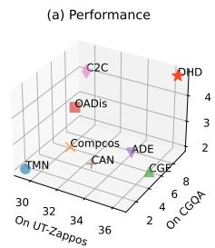
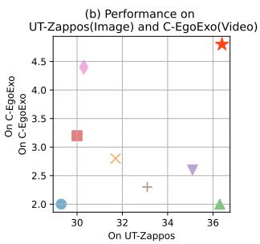
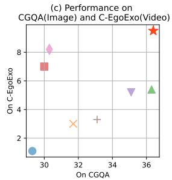
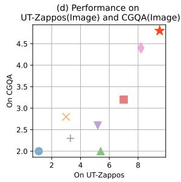
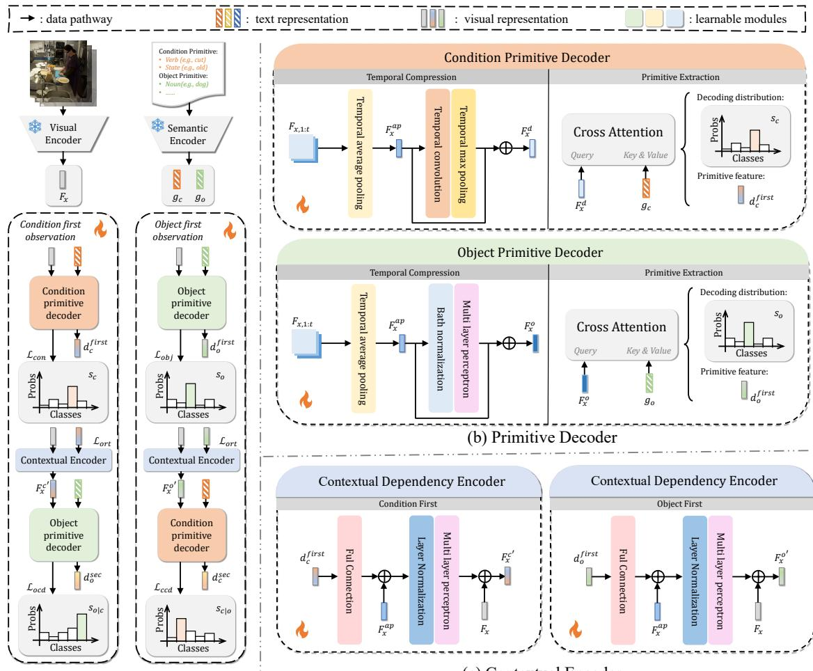
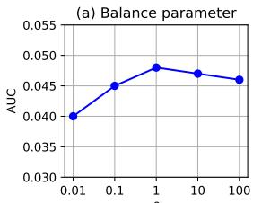
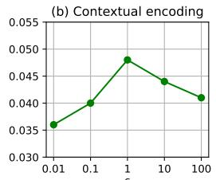
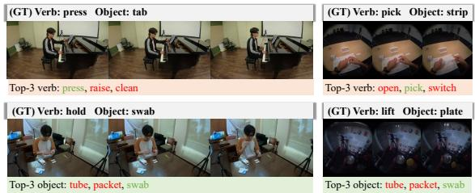
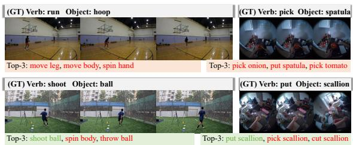
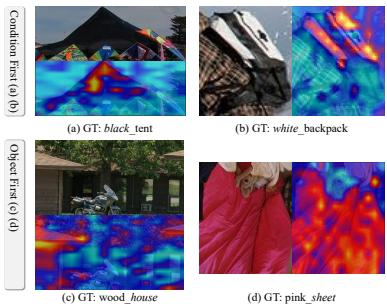

# Beyond Image Classification: A Video Benchmark and Dual-Branch Hybrid Discrimination Framework for Compositional Zero-Shot Learning

Dongyao Jiang Haodong Jing Yongqiang Ma Nanning Zheng\* Institute of Artificial Intelligence and Robotics, Xi’an Jiaotong University, Shanxi, China jdy20020305@stu.xjtu.edu.cn, nnzheng@xjtu.edu.cn

## Abstract

Human reasoning naturally combines concepts to identify unseen compositions, a capability that Compositional Zero-Shot Learning (CZSL) aims to replicate in machine learning models. However, we observe thatfocusing solely on typical image classification tasks in CZSL may limit models’ compositional generalization potential. To address this, we introduce C-EgoExo, a video-based benchmark, along with a compositional action recognition task to enable more comprehensive evaluations. Inspired by human reasoning processes, we propose a Dual-branch Hybrid Discrimination (DHD) framework, featuring two branches that decode visual inputs in distinct observation sequences. Through a cross-attention mechanism and a contextual dependency encoder, DHD effectively mitigates challenges posed by conditional variance. Wefurther design a Copulabased orthogonal decoding loss to counteract contextual interference in primitive decoding. Our approach demonstrates outstanding performance across diverse CZSL tasks, excelling in both image-based and video-based modalities and in attribute-object and action-object compositions, setting a new benchmarkfor CZSL evaluation.

## 1. Introduction

Compositional Zero-Shot Learning (CZSL) aims to build models that can generalize across unseen compositions of learned concepts, enhancing a model’s compositional generalization ability[4, 22–25, 27]. By training the examples of open book and close door, the model should infer new compositions like open door and close book. Similarly, exposure to peeled potato and sliced lemon should allow the model to generalize to concepts like peeled lemon or sliced potato. The goal of CZSL is to enable broad conceptual recomposition using limited training classes [14, 15, 35, 37] and to achieve faster learning [3, 21, 26, 36, 39] for diverse, real-world compositions.

  
Figure 1. Performance Comparison Across Benchmarks. (a) We evaluated eight methods across three benchmarks and visualized the performance. (b) (c) The weak linear correlation between image and video tasks suggests that methods tailored for one modality may not generalize well to others. (d) But our method (DHD) achieves the highest performance across all tasks, demonstrating strong compositional generalization ability.

Misra et al. [23] introduced a benchmark for image classification with an unseen composition accuracy metric, enabling consistent dataset construction and model evaluation. Later, Purushwalkam et al. [27] proposed the Area Under Curve (AUC) metric, which has since become a standard measure of compositional generalization in CZSL. While increasingly sophisticated models show improved performance, it is essential to examine whether gains truly reflect better compositional generalization. Some models may achieve higher results via task-specific adaptations like finetuning pretrained models [26, 28] or using prompts tailored to specific text encoders [36]. Although these enhancements improve performance, the question remains whether this approach aligns with CZSL’s goals, as it may simply optimize for specific image-classification tasks rather than compositional generalization.

To this end, we introduce a new benchmark, Compositional EgoExo-4D (C-EgoExo), based on the EgoExo-4D[8] dataset. C-EgoExo comprises 387,000 video samples, each labeled with a verb and object in the form of a word or phrase. This benchmark extends CZSL evaluation from image to video, shifting the compositional structure from “attribute with object” to “verb with object”, thereby establishing a broader paradigm of “condition primitive with object primitive”. We aims to provide a more holistic evaluation for CZSL models.

To assess whether current models are over-fitting to image tasks, we evaluated them on the C-EgoExo dataset, as shown in Fig. 1. The results show a weak correlation between performance on video and image data, indicating that methods optimized for one modality may not generalize well to others. This underscores the need for a multi-modal, multi-task evaluation framework for a more balanced assessment of compositional generalization.

CZSL faces two key challenges that complicate generalization. First, there exists a domain gap between training and test categories. Although models are trained on certain compositions, they must generalize to novel compositions not encountered during training. This discrepancy in class distributions introduces a domain shift, requiring models to adapt their learned representations to unseen configurations[18, 20, 22]. Second, individual primitives exhibit significant visual and semantic variability across different compositions. The same primitive (e.g., “open” or “book”) can appear in vastly different contexts within both seen and unseen compositions, leading to distinct visual and semantic interpretations. This variability compounds the challenge, as seen compositions and unseen compositions effectively form separate domains, with the model needing to infer how primitives recombine in novel ways without explicit exposure to those specific pairings[11, 17, 29]. Addressing these dual-domain shifts, both between train-test categories and within primitive re-combinations, is essential for advancing robust compositional generalization in CZSL.

To address the two primary challenges and the goal of achieving a more robust compositional generalization, we identified two fundamental modes that humans commonly use to categorize compositions[2]: condition-first observation (verb/attribute before object) and object-first observation. For instance, with meshed banana, one might first recognize the meshed condition, making it easier to associate it with meshed something and subsequently identify meshed banana. Conversely, in the action open door, one can easily identify the door, then observe its state to determine the action is open rather than close. The two foundational modes operate in parallel, allowing us to flexibly apply either approach based on context or prior knowledge.

We believe this enables the brain to integrate both types of information for a more accurate final interpretation.

To handle domain shifts between seen and unseen compositions, and manage the visual and semantic variability of the same primitive across different compositions, we designed a dual-branch hybrid discrimination framework inspired by these two fundamental cognitive modes. The condition-first branch captures contextual dependencies by initially focusing on condition primitives, which reduces ambiguity when inferring potential object associations. This approach helps mitigate domain discrepancies by emphasizing semantic consistencies across unseen combinations. Meanwhile, the object-first branch emphasizes object recognition prior to condition, enabling the model to discern differences in object state or action based on visual cues. By operating these branches in parallel, our model integrates information from both perspectives, bridging the gaps between seen and unseen compositions and enhancing compositional generalization across domains.

Based on this insight, we propose a dual-branch hybrid discrimination framework, where each branch represents one of the processing modes for condition and object primitives in different sequences. We also design specialized modules for handling each primitive type. To coordinate information extraction across branches, we introduce a copula entropy-based loss function, promoting the learning of more discriminative features in both modules. The contributions of this work can be summarized as follows:

• A comprehensive benchmark for evaluating CZSL models, expanding from image to video modality and from attribute with object to condition (verb or attribute) with object tasks. Our experiments demonstrate that current methods are still insufficient for handling these extended tasks effectively.

• A novel dual-branch hybrid discrimination framework, inspired by human compositional recognition processes, designed to enhance compositional generalization abilities in complex multi-modal settings.

• A copula entropy-based loss and specialized primitive discrimination modules that enable more effective capture of unseen compositional features. Our approach achieves state-of-the-art performance across multiple datasets, underscoring its robustness and adaptability.

## 2. Related work

Compositional Zero-Shot Learning (CZSL) explores whether models can handle scenarios where compositions of familiar components form novel categories that were unseen during training. The approaches are generally fall into two categories: 1) Composed CZSL: Models are trained to combine two primitive features (e.g., from pretrained models like CLIP[28]) to form both seen and unseen compositions[4, 11, 24, 25]. Seen compositions guide training, while unseen compositions test the model’s compositional generalization ability. 2) De-composed CZSL: Models learn each primitive independently or in stages, with later stages informed by earlier ones[13, 14, 16, 39]. This two-step or multi-step structure, which we adopt in our method, allows the model to incrementally learn features with compositional generalization in mind.

Condition-Based Compositional Generalization builds on recent findings that prior discrimination results can inform subsequent stages[9, 16], boosting the generalization capacity of De-composed CZSL models. In this framework, the model leverages the original input and previous outputs to refine current predictions, encoding primitive relationships without added complexity. This conditional modeling has also influenced Composed CZSL methods seeking efficient primitive encoding[36].

Zero-Shot Compositional Action Recognition (ZS-CAR) introduces composition to the action recognition domain, with standardized annotations and adapted metrics for evaluation[16]. Our approach uses concise verb phrases for actions rather than full sentences with masked objects, focusing the model on core actions (e.g., pick book) rather than context-specific variations(e.g., pretend to pick vs. pick), thereby improving generalization.

## 3. Problem Formulation and New Benchmark

## 3.1. Problem Formulation

Given a training set $T = \{ ( x _ { 1 : t } , y ) \mid x \in \mathcal { X } , y \in \mathcal { Y } _ { \mathrm { s e e n } } \}$ where $x _ { 1 : t }$ represents a video or any time-series data in the training set $x ,$ and $x _ { i }$ denotes a slice of $x _ { 1 : t } ;$ in cases where $t = 1 , x _ { 1 : 1 }$ is an image. Here, $y$ is a compositional label from the set of seen classes $\mathcal { D } _ { \mathrm { s e e n } } .$ , with the full label set given by $\mathcal { Y } = \mathcal { Y } _ { \mathrm { s e e n } } \cup \mathcal { Y } _ { \mathrm { u n s e e n } }$ . Each compositional label y is a tuple $y = \left( c , o \right)$ , where $c \in { \mathcal { C } }$ is a condition primitive within the condition primitive space C, and $o \in \mathcal { O }$ is an object primitive in the object primitive space O. All primitive elements in C and O are included within the seen compositions. CZSL aims to classify instances labeled with unseen classes $y _ { \mathrm { u n s e e n } } \in \mathcal { V } _ { \mathrm { u n s e e n } } [ 2 1$ , 23]. In this work, we denote the text encoder as $\phi ( \cdot )$ and the visual encoder as ψ(·). Let $g _ { j }$ represent the embedding of a text $j \in \mathcal { C } \cup \mathcal { O } \cup \mathcal { Y } _ { \mathrm { p r e d } }$ after encoding with $\phi ( \cdot )$ , and let $F _ { x , i }$ denote the feature vector of input $x _ { i }$ after encoding with ψ(·), i.e., $F _ { x , i } = \psi ( x _ { i } )$

## 3.2. The Composition Egoexo-4D Benchmark

To evaluate our proposed task, we constructed the Compositional EgoExo-4D (C-EgoExo) benchmark, built upon the EgoExo-4D dataset [8]. The C-EgoExo dataset consists of 387,000 video clips featuring human-object interactions across 1,042 object types (e.g., sports equipment, medical supplies) in various settings, totaling 10,112 unique action-object compositions. We processed 353,490

human-annotated descriptions automatically using Stanza [1] and SpaCy [10], while manually annotating the remaining 33,510 due to inconsistent outputs from these tools.
<table><tr><td></td><td>#Objects</td><td>#Verbs</td><td>#Verb-Object Actions</td><td>#Sample</td></tr><tr><td>Train</td><td>1042</td><td>575</td><td>6709</td><td>186970</td></tr><tr><td>Val</td><td>591</td><td>303</td><td>1401 Seen + 1450 Unseen</td><td>95584</td></tr><tr><td>Test</td><td>641</td><td>331</td><td>1905 Seen + 1934 Unseen</td><td>104446</td></tr><tr><td>All</td><td>1042</td><td>575</td><td>10112</td><td>387000</td></tr></table>

Table 1. Dataset statistics.

Split. We followed the ratios of the sth-com dataset [16], ensuring all verbs and objects appeared in the training set. A total of 186,970 videos, representing 6,709 compositions, were allocated to the training set. The remaining data were split into test and validation sets, maintaining a 4:3 ratio of unseen classes, in line with the MIT-States dataset [12]. This resulted in 1,934 unseen compositions for the test set and 1,450 for the validation set. The remaining seen compositions were distributed between the test and validation sets, maintaining a similar seen-to-unseen ratio, yielding 1,905 seen compositions for the test set and 1,450 for the validation set. An overview of the C-EgoExo dataset statistics is provided in Tab. 1.

## 4. Method

To achieve cross-modal compositional generalization, we propose a dual-branch hybrid discrimination framework (Fig. 2) with tailored decoders for condition primitives (Sec. 4.1) and object primitives (Sec. 4.2). Sec. 4.3 introduces a conditional encoding module, Sec. 4.4 presents a Copula entropy based loss to address conditional variance.

## 4.1. Condition Primitive Decoding

As outlined in Sec. 1, the condition primitive defines the changes that occur to an object within a composition. For temporally dependent tasks, such as verbs, these changes can be observed through shifts in the object’s position or form. For temporally independent tasks, like states, they can be identified by comparing the object’s features with feature without the given state. Therefore, the condition primitive decoder first extracts temporal variations in the input, projects them into a time-independent space, and then performs semantic-based decoding.

Temporal Compression. To align with the temporally invariant nature of compositional concepts, we first extract temporal information from the input and map it to a timeinvariant latent space. For example, given a video input $x _ { 1 : T } \in \mathbb { R } ^ { T \times 2 2 4 \times 2 2 4 \times 3 }$ , where T represents the number of frames, we apply a pretrained model (e.g., ResNet[33] or CLIP[28]) to independently encode each frame into a feature embedding $\bar { F _ { x } } \in \mathbb { R } ^ { T \times n }$ using Eq. (1), where n is the embedding dimension of the pretrained model:

$$
F _ { x , t } = \psi ( x _ { t } ) \in \mathbb { R } ^ { n } ,\tag{1}
$$

  
(a) Overview  
(c) Contextual Encoder  
Figure 2. Dual-branch hybrid discrimination(DHD) framework. (a) DHD consists of two parallel decoding branches: Condition-firs observation decodes the condition primitive before the object, while Object-first observation follows the reverse order. (b) A tempora compression module in the Primitive Decoder enables seamless processing of both image and video inputs without altering the mode structure, as well as leveraging spatiotemporal dynamics . (c) The contextual dependency encoder and Copula-based orthogonal decoding loss amplify confidently decoded features to enhance contextual discrimination in the second decoding step.

We apply average pooling to obtain $F _ { x } ^ { a p } \in \mathbb { R } ^ { n }$ , representing components with minimal temporal variation. Then, we compute the frame-wise differences between $F _ { x }$ and $F _ { x } ^ { a p }$ feeding it into a temporal convolutional layer followed by max pooling to capture the temporal variation $F _ { x } ^ { c } \in \mathbb { R } ^ { n }$

$$
\begin{array} { r l } & { { \cal F } _ { x } ^ { a p } = \displaystyle \frac { 1 } { T } \sum _ { t = 0 } ^ { T } { \cal F } _ { x , t } \in \mathbb { R } ^ { n } , } \\ & { { \cal F } _ { x , t } ^ { t c } = \displaystyle \sum _ { j = 0 } ^ { k - 1 } { \cal W } ^ { c } ( j ) \cdot ( { \cal F } _ { x , ( t - j ) } - { \cal F } _ { x } ^ { a p } ) \in \mathbb { R } ^ { n } , } \\ & { { \cal F } _ { x } ^ { c } ( i ) = \displaystyle \operatorname* { m a x } _ { 0 \le t \le T } { \cal F } _ { x , t } ^ { t c } ( i ) \in \mathbb { R } , } \end{array}\tag{2}
$$

where $W ^ { c }$ denotes the convolution kernel and k represents the kernel size. When the input is an image, there is no temporal variation, so $F _ { x } ^ { a p } = F _ { x }$ , resulting in $F _ { x } ^ { c } \ = \ 0$ which is a reasonable outcome.

We combine $F _ { x } ^ { a p }$ and $F _ { x } ^ { c }$ using a residual connection followed by batch normalization[31] to obtain $F _ { x } ^ { d }$ , i.e., $F _ { x } ^ { d } = \mathrm { B N } ( F _ { x } ^ { a p } + F _ { x } ^ { c } )$ , where BN(·) denotes batch normalization. This approach preserves contextual information while enhancing temporal variation components, ultimately encoding all modal inputs into a vector within the Rn space.

Primitive Extraction. To capture potential condition primitive within $F _ { x } ^ { d } .$ , we apply a multi-head cross-attention mechanism. First, we encode the label text using a pretrained text encoder to obtain $g _ { c }$ , where $g _ { c } = \phi ( c ) \in \mathbb { R } ^ { n }$ Setting $F _ { x } ^ { d }$ as the query and $g _ { c }$ sequence as the key-value inputs, we compute the resulting token using Eq. (3):

$$
q _ { x , i } = F _ { x } ^ { d } W _ { i } ^ { q } , k _ { c , i } = g _ { c } W _ { i } ^ { k } , v _ { c , i } = g _ { c } W _ { i } ^ { v } \in \mathbb { R } ^ { n / h } ,\tag{3}
$$

where $i = 1 , 2 , \ldots , h$ and h represents the number of attention heads, and $W _ { i } ^ { q } , W _ { i } ^ { k }$ , and $\mathbf { \bar { \mathbf { \mathit { W } } } } _ { i } ^ { v } \in \mathbb { R } ^ { n \times ( n / h ) }$ are weight matrices.

The outputs from each attention head $d _ { i } ^ { f i r s t }$ are concatenated to form $d _ { c } ^ { f i r s t }$ , as shown in Eq. (4):

$$
\begin{array} { r l } & { d _ { i } ^ { f i r s t } = \pi \left( { q } _ { x , i } { k _ { c , i } ^ { T } } / { \sqrt { n / h } } \right) v _ { c , i } \in \mathbb { R } ^ { \left( n / h \right) } , } \\ & { d _ { c } ^ { f i r s t } = c o n c a t ( d _ { 1 } ^ { f i r s t } , d _ { 2 } ^ { f i r s t } , \dotsc , d _ { h } ^ { f i r s t } ) \in \mathbb { R } ^ { n } , } \end{array}\tag{4}
$$

where $\pi ( \cdot )$ denotes the softmax function. We calculate the cross-entropy loss by utilizing the contribution of each primitive as the decoding distribution as shown in Eq. (7):

$$
s _ { c } = \frac { 1 } { h } \sum _ { i = 1 } ^ { h } \frac { q _ { x , i } k _ { c , i } ^ { T } } { \sqrt { n / h } } \in \mathbb { R } ,\tag{5}
$$

$$
\hat { p } _ { c } = \frac { \exp ( s _ { c } / \tau ) } { \sum _ { i } ^ { | \mathcal { C } | } \exp ( s _ { i } / \tau ) } \in \mathbb { R } ,\tag{6}
$$

$$
\mathcal { L } _ { c o n } = - \sum _ { c } ^ { | c | } \mathbb { I } ( c \in y ) \log \hat { p } _ { c } \in \mathbb { R } ,\tag{7}
$$

where $\tau$ is the temperature coefficient and $\mathbb { I } ( i \in y )$ equals 1 if the condition is met, otherwise 0. For simplicity, we denote this module as $( s _ { c } , d _ { c } ^ { f i r s t } ) = C P D ( F _ { x } )$ .

## 4.2. Object Primitive Decoding

As outlined in Sec. 1, the object primitive captures the inherent, stable characteristics within a composition. For time series data, such as video, the decoder first extracts time-invariant features that reflect consistent object properties across frames and contexts. It’s followed by a semantic comparison to further distinguish object-specific features, enabling the decoder to identify primitives accurately within a time-independent latent space.

Temporal Compression. To enhance the commonality required for object primitive decoding, we prioritize a representation, $F _ { x } ^ { a p } \in \mathbb { R } ^ { n }$ , that captures stable features. A residual connection and normalization are applied between $F _ { x } ^ { a p }$ and $F _ { x }$ , followed by a two-layer MLP to project $F _ { x }$ into a time-invariant latent space $\mathbb { R } ^ { n }$

$$
F _ { x } ^ { o } = \mathbf { M L P } ( \mathbf { B N } ( F _ { x } ^ { a p } + F _ { x } ) ) \in \mathbb { R } ^ { n } .\tag{8}
$$

For image inputs, since $F _ { x } = F _ { x } ^ { a p }$ , the residual connection preserves the distribution of $F _ { x }$ , maintaining consistency in the subsequent projection process.

Primitive Extraction. We employ a cross-attention mechanism similar to that in Sec. 4.1 to decode the object primitive from the fused $F _ { x } ^ { o }$ , replacing the condition primitive-encoded key-value input $g _ { c }$ with $g _ { o }$ as Eq. (9):

$$
q _ { x , i } = F _ { x } ^ { o } W _ { i } ^ { q } , k _ { o , i } = g _ { o } W _ { i } ^ { k } , v _ { o , i } = g _ { o } W _ { i } ^ { v } \in \mathbb { R } ^ { n / h } .\tag{9}
$$

By substituting $k _ { o , i }$ and $v _ { o , i }$ into Eq. (4), we obtain $d _ { o } ^ { f i r s t }$ and compute the object primitive decoding loss as follows:

$$
s _ { o } = \frac { 1 } { h } \sum _ { i = 1 } ^ { h } \frac { q _ { x , i } k _ { o , i } ^ { T } } { \sqrt { n / h } } \in \mathbb { R } ,\tag{10}
$$

$$
\hat { p } _ { o } = \frac { \exp ( s _ { o } / \tau ) } { \sum _ { i } ^ { | \mathcal { O } | } \exp ( s _ { i } / \tau ) } \in \mathbb { R } ,\tag{11}
$$

$$
\mathcal { L } _ { o b j } = - \sum _ { o } ^ { | \mathcal { O } | } \mathbb { I } ( o \in y ) \log \hat { p } _ { o } \in \mathbb { R } .\tag{12}
$$

For ease of representation, we denote the object primitive decoding module as $( s _ { o } , d _ { o } ^ { f i r s t } ) = O P D ( F _ { x } )$

## 4.3. Contextual Dependency Encoding

In Sec. 4.1 and Sec. 4.2, we independently decoded two types of primitives from $F _ { x }$ using a cross-attention module, obtaining representations $d _ { c } ^ { f i r s t } \in \mathbb { R } ^ { n }$ and $d _ { o } ^ { f i r s t } \in \mathbb { R } ^ { n }$ These representations are derived by linearly weighting information related to a single primitive, with each typically capturing either condition or object semantics. This information is essential for identifying the unknown primitive. For instance, if the verb is confidently identified as “chop,” prior knowledge helps eliminate unlikely object candidates, such as “door,” thus narrowing the possible candidates.

Therefore, by fusing $F _ { x }$ with both $d _ { c } ^ { f i r s t }$ and $d _ { o } ^ { f i r s t }$ , and feeding the results into the CPD and OPD, we can calculate $\scriptstyle s _ { o \mid c }$ and $\begin{array} { r } { { s } _ { c | o } , } \end{array}$ along with the composition decoding loss. The fusion is performed using an MLP with layer normalization (LN) and a residual connection as shown in Eq. (13):

$$
\begin{array} { r l } & { F _ { x } ^ { c ^ { \prime } } = F _ { x } ^ { d } + \mathbf { M L P } \left( \mathbf { L N } ( F _ { x } ^ { d } + d _ { c } ^ { f i r s t } W ^ { O } ) \right) \in \mathbb { R } ^ { n } , } \\ & { F _ { x } ^ { o ^ { \prime } } = F _ { x } ^ { o } + \mathbf { M L P } \left( \mathbf { L N } ( F _ { x } ^ { o } + d _ { o } ^ { f i r s t } W ^ { O } ) \right) \in \mathbb { R } ^ { n } , } \end{array}\tag{13}
$$

where $W ^ { O } \in \mathbb { R } ^ { n \times n }$ is the weight matrix. Next, we apply the respective decoder to capture the contextual dependencies for the remaining primitive type, using $( s _ { c | o } , d _ { c } ^ { s e c } ) =$ $C P D ( F _ { x } ^ { o ^ { \prime } } )$ and $( s _ { o | c } , d _ { o } ^ { s e c } ) = O P D ( F _ { x } ^ { c ^ { \prime } } )$ . Finally, we calculate the contextual decoding loss $\mathcal { L } _ { c c d }$ and $\mathcal { L } _ { o c d } \mathrm { : }$

$$
\begin{array} { r } { \begin{array} { r } { a _ { c \mid o } = { F _ { x } ^ { d } } ^ { T } d _ { c } ^ { s e c } \in \mathbb { R } , \hat { p } _ { c \mid o } = \frac { \exp \left( { a _ { c \mid o } / \tau } \right) } { \sum _ { i } ^ { \mid c \mid } \exp \left( { a _ { i \mid o } / \tau } \right) } \in \mathbb { R } , } \end{array} } \end{array}\tag{14}
$$

$$
\mathcal { L } _ { c c d } = - \sum _ { c } ^ { | { \mathcal { C } } | } \mathbb { I } ( c \in y ) \log \hat { p } _ { c | o } \in \mathbb { R } ,\tag{15}
$$

$$
\begin{array} { r } { \begin{array} { r } { a _ { o | c } = F _ { x } ^ { o ^ { T } } d _ { o } ^ { s e c } \in \mathbb { R } , \hat { p } _ { o | c } = \frac { \exp \left( a _ { o | c } / \tau \right) } { \sum _ { i } ^ { | \mathcal { O } | } \exp \left( a _ { i | c } / \tau \right) } \in \mathbb { R } , } \end{array} } \end{array}\tag{16}
$$

$$
\mathcal { L } _ { o c d } = - \sum _ { o } ^ { | \mathcal { O } | } \mathbb { I } ( o \in y ) \log \hat { p } _ { o | c } \in \mathbb { R } .\tag{17}
$$

## 4.4. Copula-based Orthogonal Decoding Loss

Conditional variance poses a challenge in CZSL, where the visual representation of a primitive (whether condition or object) shifts with context. For instance, although “open” applies to both “open door” and “open book”, the visual cues differ across contexts, introducing unwanted composition-specific elements in the decoded primitives. Ideally, the model should first decode primitives independently, then add contextual information through contextual dependency encoding. We believe that this sequential process can minimize redundancy across branches and enhances the model’s compositional generalization ability.

<table><tr><td rowspan="2"></td><td colspan="4">UT-Zappos[38]</td><td colspan="4">CGQA[24]</td><td colspan="4">C-EgoExo</td></tr><tr><td>S(%↑)</td><td>U(%↑)</td><td>HM(↑)</td><td>AUC(↑)</td><td>S(%↑)</td><td>U(%↑)</td><td>HM(↑)</td><td>AUC(↑)</td><td>S(%↑)</td><td>U(%↑)</td><td>HM(↑)</td><td>AUC(↑)</td></tr><tr><td>TMN[27]</td><td>58.7</td><td>60.0</td><td>45.0</td><td>29.3</td><td>21.6</td><td>6.3</td><td>7.7</td><td>1.1</td><td>22.0</td><td>11.5</td><td>10.8</td><td>2.0</td></tr><tr><td>Compcos[21]</td><td>63.6</td><td>63.5</td><td>47.5</td><td>31.7</td><td>27.8</td><td>13.2</td><td>13.6</td><td>3.0</td><td>24.3</td><td>14.4</td><td>12.8</td><td>2.8</td></tr><tr><td>CĠE[24]</td><td>63.4</td><td>71.3</td><td>49.7</td><td>36.3</td><td>38.0</td><td>17.1</td><td>18.5</td><td>5.4</td><td>22.2</td><td>11.5</td><td>10.9</td><td>2.0</td></tr><tr><td>OADis[30]</td><td>59.5</td><td>65.5</td><td>44.4</td><td>30.0</td><td>38.3</td><td>19.8</td><td>20.1</td><td>7.0</td><td>27.1</td><td>14.6</td><td>14.2</td><td>3.2</td></tr><tr><td>ADE[9]</td><td>63.0</td><td>64.3</td><td>51.1</td><td>35.1</td><td>35.0</td><td>17.7</td><td>18.0</td><td>5.2</td><td>24.0</td><td>13.8</td><td>12.6</td><td>2.6</td></tr><tr><td>CAN[34]</td><td>61.0</td><td>66.3</td><td>47.3</td><td>33.1</td><td>30.0</td><td>13.2</td><td>14.5</td><td>3.3</td><td>23.4</td><td>12.7</td><td>11.8</td><td>2.3</td></tr><tr><td>C2C[16]</td><td>60.5</td><td>62.6</td><td>42.5</td><td>30.3</td><td>39.4</td><td>23.6</td><td>23.3</td><td>8.2</td><td>30.8</td><td>16.8</td><td>17.3</td><td>4.4</td></tr><tr><td>DHD(Ours)</td><td>66.7</td><td>71.8</td><td>48.1</td><td>36.4</td><td>38.1</td><td>29.6</td><td>25.3</td><td>9.5</td><td>32.4</td><td>17.8</td><td>18.3</td><td>4.8</td></tr></table>

Table 2. Contrast Experiment. We performed experiments on three datasets: UT-Zappos, CGQA, and C-EgoExo. Please refer to Sec. 5. for details on adapting the image-based CZSL model to video tasks.

To address this, we introduce a copula entropy-based orthogonal decoding loss to enforce orthogonality between decoded primitives across branches. To ensure uniform marginal distributions for both primitive decoders, we apply a rank transformation[5] for probability integral transformation. Given the outputs of decoder $F _ { x } ^ { d }$ and $F _ { x } ^ { o }$ , we compute their marginal uniform distributions U and V over [0, 1] as follows:

$$
u _ { i } = \frac { r a n k ( F _ { x , i } ^ { d } ) } { n + 1 } \in \mathbb { R } , v _ { i } = \frac { r a n k ( F _ { x , i } ^ { o } ) } { n + 1 } \in \mathbb { R } ,\tag{18}
$$

where rank(·) represents the ranking of each feature component within $F _ { x } ^ { d }$ and $F _ { x } ^ { o }$ . Then, we use Kernel Density Estimation (KDE)[32] to estimate the joint density $f _ { U , V } ( u , v )$ and the marginal densities $f _ { U } ( u )$ and $f _ { V } ( v )$

$$
\hat { f } _ { U , V } ( u , v ) = \frac { 1 } { n b _ { h } } \sum _ { i = 1 } ^ { n } K ( \frac { u - u _ { i } } { b _ { h } } ) K ( \frac { v - v _ { i } } { b _ { h } } ) \in \mathbb { R } ,\tag{19}
$$

$$
\hat { f } _ { U } ( u ) = \frac { 1 } { n b _ { h } } \sum _ { i = 1 } ^ { n } K ( \frac { u - u _ { i } } { b _ { h } } ) \in \mathbb { R } ,\tag{20}
$$

$$
\hat { f } _ { V } ( v ) = \frac { 1 } { n b _ { h } } \sum _ { i = 1 } ^ { n } K ( \frac { v - v _ { i } } { b _ { h } } ) \in \mathbb { R } ,\tag{21}
$$

where $K ( x ) = e ^ { - \gamma | | x | | ^ { 2 } }$ is a Gaussian kernel with $\gamma = 0 . 5 ,$ and $b _ { h }$ is the bandwidth parameter[6], given by $\begin{array} { r } { b _ { h } = \frac { 4 \hat { \sigma } ^ { 5 } } { 3 n } } \end{array}$ ≈ $1 . 0 6 \cdot \frac { 1 } { \gamma } \cdot n ^ { - \frac { 1 } { 5 } }$ . Using these, we estimate the copula density $\scriptstyle { \hat { c } } ( u , v )$ as follows:

$$
\hat { c } ( u , v ) = \frac { \hat { f } _ { U , V } ( u , v ) } { \hat { f } _ { U } ( u ) \cdot \hat { f } _ { V } ( v ) } \in \mathbb { R } .\tag{22}
$$

Finally, we compute the orthogonal decoding loss for the

two branches as:

$$
\mathcal { L } _ { o r t } = - \frac { 1 } { n } \sum _ { i = 1 } ^ { n } \log \left( \frac { \hat { f } _ { U , V } \left( u _ { i } , v _ { i } \right) } { \hat { f } _ { U } \left( u _ { i } \right) \cdot \hat { f } _ { V } \left( v _ { i } \right) } \right) \in \mathbb { R } .\tag{23}
$$

We believe that conditional variance stems from nonlinear coupling between compositional and primitive features. Using a copula function, we separate marginal distributions from dependency structure within a multivariate distribution, effectively isolating context-related information.

## 4.5. Training and Inference

Finally, we compute the overall loss as shown in Eq. (24):

$$
\mathcal { L } = ( \mathcal { L } _ { c o n } + \alpha \mathcal { L } _ { o c d } ) + \beta ( \mathcal { L } _ { o b j } + \sigma \mathcal { L } _ { c c d } ) + \delta \mathcal { L } _ { o r t } ,\tag{24}
$$

where $\alpha , \beta , \sigma , \delta$ serves as a balancing parameter to ensure the scales of the individual losses are roughly equivalent.

During inference, given an input $x _ { 1 : T }$ , we feed it into the dual-branch hybrid discrimination framework. The final inference result is determined by maximizing the score ${ \mathit { s } } _ { c , o }$ as shown in Eq. (25):

$$
s _ { c , o } = \arg \operatorname* { m a x } _ { c \in \mathcal { C } , o \in \mathcal { O } } \frac { s _ { c } \cdot s _ { o \mid c } + s _ { o } \cdot s _ { c \mid o } } { 2 } + \epsilon ( s _ { c } + s _ { o } ) ,\tag{25}
$$

where ϵ is a balancing parameter that adjusts the influence of the contextual dependency encoding module.

## 5. Experiments

Evaluation Metrics. To ensure a fair comparison, we use the same metrics employed in image-based datasets to evaluate model performance on C-EgoExo. The evaluation metrics we use are as follows: (1) Best seen accuracy (S). (2) Best unseen accuracy (U). (3) Best harmonic mean (HM): The harmonic mean of S and U. (4) Area under the curve (AUC): The area under accuracy curve.

Baselines. We compared DHD with several existing methods, including TMN [27], Compcos [21], CGE [24], OADis [30], ADE [9], CAN [34], and C2C [16]. To ensure that the models and the pretrained encoders had no prior exposure to the unseen compositions in C-EgoExo, we used a

<table><tr><td>Condition First</td><td>Object First</td><td>Contextual Encoding</td><td>HM(↑) AUC(↑)</td></tr><tr><td>√</td><td></td><td></td><td>15.1 3.6</td></tr><tr><td></td><td>√</td><td></td><td>14.7 3.4</td></tr><tr><td>V</td><td>√</td><td></td><td>17.5 4.4</td></tr><tr><td>√</td><td>√</td><td>√</td><td>18.3 4.8</td></tr></table>

Table 3. Ablation study on each compoment in DHD. Please refer to Sec. 5.2 for details of experiment setting.
<table><tr><td> $\mathcal { L } _ { c o n }$ </td><td> $\mathcal { L } _ { o b j }$ </td><td> $\mathcal { L } _ { c c d }$ </td><td> $\mathcal { L } _ { o c d }$ </td><td> $\mathcal { L } _ { o r t }$ </td><td>HM(↑)</td><td>AUC(↑)</td></tr><tr><td>√</td><td></td><td></td><td></td><td></td><td>15.8</td><td>3.9</td></tr><tr><td>√</td><td>√</td><td></td><td></td><td></td><td>16.3</td><td>4.1</td></tr><tr><td>√</td><td>√</td><td>√</td><td></td><td></td><td>16.9</td><td>4.2</td></tr><tr><td>√</td><td>√</td><td>√</td><td>√</td><td></td><td>17.7</td><td>4.5</td></tr><tr><td>√</td><td>√</td><td>√</td><td>√</td><td>一</td><td>18.3</td><td>4.8</td></tr></table>

Table 4. Ablation study on each compoment in loss function. Please refer to Sec. 5.2 for details of experiment setting.

CNN-based TSM-18[19] visual encoder, pretrained on different datasets and annotations.

Implementation Details. We set the parameters in Eq. (24) and Eq. (25) as follows: $\alpha = \beta = \sigma = 1 , \delta = 0 . 5 .$ $\epsilon = 0 . 1$ , and $\gamma = 0 . 5$ . During training, we apply a dropout rate of 0.5. For consistent feature dimensionality within the model, the output dimension of the last MLP layer in the primitive decoder is set to 1024, the kernel size of the temporal convolution layer is set to 8, and the multi-head attention module is configured with 16 attention heads.

## 5.1. Comparisons with State-of-the-Art

We replace the visual encoders in existing CZSL models for image datasets with the TSM-18[19] encoder used in DHD, incorporating a temporal average pooling layer to handle video inputs. The ADE[9] decoding process, tied to the ViT[7] architecture, is incompatible with a CNNbased encoder. To address this, we adapt the method in [16] for processing video inputs. Additionally, we use a pretrained FastText model to replace the text encoder. This setup ensures fair comparisons of existing methods on the C-EgoExo dataset. Since DHD was designed for multimodal inputs, it can be directly trained on image datasets and evaluated alongside existing approaches.

Comparisons on C-EgoExo. We evaluate DHD against other methods on our proposed video dataset, C-EgoExo, as shown in Tab. 2. We observe that most methods exhibit a weak correlation between performance on video and image modalities. This trend is particularly evident in CGE [24], where AUC drops from a relative scores of 99.7% on UT-Zappos to 41.7% on C-EgoExo. This phenomenon is further illustrated in Fig. 1 (b)(c), where models with lower image performance, such as OADis and C2C, demonstrate notable adaptability to video, achieving relative AUC scores of 66.7% and 91.7%, respectively. These findings suggest that current evaluation frameworks focused solely on image classification may inadequately assess model performance across modalities. Additionally, the average S:U ratio on C-EgoExo is 1.82, significantly higher than $\mathrm { U T - Z a p p o s ^ { \prime } 0 . 9 4 } .$ This indicates a stronger preference for seen classes in video data, with models facing greater difficulty generalizing to unseen compositions, highlighting the potential limitations of image-based compositional learning modules in video contexts. This underscores the need for further exploration into compositional generalization across diverse modalities and tasks. Finally, DHD achieves substantial improvements on most metrics, consistently performing well on both image and video tasks, validating the compositional generalization capability of our dual-branch hybrid discrimination framework.

<table><tr><td></td><td colspan="3">C-EgoExo Cross-Domain</td></tr><tr><td></td><td>S(%↑)</td><td>U(%↑)</td><td>HM(↑) AUC(↑)</td></tr><tr><td>Condition Only</td><td>25.5</td><td>12.6 12.9</td><td>2.63</td></tr><tr><td>Object Only</td><td>27.6</td><td>13.6</td><td>2.97</td></tr><tr><td>Full</td><td>27.1</td><td>13.8</td><td>3.01</td></tr></table>

Table 5. The cross-domain evaluation on C-EgoExo dataset

  
Figure 3. Ablation study on the parameter in loss function.

Comparison on UT-Zappos and C-GQA. We also report model performance on image datasets in Tab. 2. Since images lack temporal information, DHD’s temporal mixing module does not aid feature distribution adjustment during training and inference, limiting performance gains on UT-Zappos and C-GQA, where AUC improvements over C2C are only 20.1% and 15.9%, respectively. Notably, however, compared to ADE [9], which also employs a cross-attention decoding mechanism, DHD achieves higher average performance across multimodal, multitask settings while reducing cross-attention branches by nearly half. For instance, DHD shows a 45.8% improvement in AUC on video tasks, whereas ADE’s relative AUC performance drops from 96.4% on images to 51.2% on videos. These results highlight the potential of our dual-branch hybrid discrimination framework as a generalizable solution to compositional generalization challenges.

## 5.2. Ablation Study

Effects of Different Modules. Using a single Condition-First Observation branch as the baseline, we incrementally add the Object-First Observation branch and the Contextual Dependency Encoder module, recording the model’s performance changes on the C-EgoExo dataset, as shown in Tab. 3. We observe that the performance difference between using only the condition observation branch versus only the object observation branch is minimal, with the former showing only a 5.9% higher AUC, possibly due to the higher action discernibility in videos. Adding both branches together significantly boosts relative performance by 22.2%, as the Orthogonal Decoding Loss enables coordinated rather than independent functioning between branches. Finally, incorporating the Contextual Dependency Encoder to model conditional primitives yields a 33.3% relative improvement.

  
Figure 4. The top-3 decode result with the same object or verb components.

  
Figure 5. Examples of successes and failures of DHD.

Loss Function Analysis. We varied the loss components in Eq. (24) and adjusted some hyperparameters, reporting the results in Tab. 4 and Fig. 3. Incorporating $\mathcal { L } _ { c c d }$ and ${ \mathcal { L } } _ { o c d } ,$ designed specifically for the Contextual Dependency Encoder, improved AUC by 9.8% compared to using only $\mathcal { L } _ { c o n }$ and $\mathcal { L } _ { o b j }$ , highlighting the benefit of context in decoupling primitives. Further adding $\mathcal { L } _ { o r t }$ yielded an additional 6.7% improvement, indicating that mitigating conditional variance effectively enhances performance. Adjusting the balance parameter $\beta$ introduced a performance fluctuation of approximately 16.7%, suggesting that optimal weighting across branches can boost performance for different downstream tasks with varied prior knowledge. Lastly, tuning σ caused performance fluctuations of up to 25.0%, underscoring that effectively managing conditional variance remains a major challenge in CZSL research.

Cross-Domain Evaluation. We trained DHD on Sthcom and evaluated it on C-EgoExo, constructing two experimental variants, Condition Only and Object Only, by subtracting $\epsilon \cdot s _ { o }$ and $\epsilon \cdot s _ { c }$ from Eq. (25), respectively. As shown in Tab. 5, unlike the phrase-based coarse annotations in C-EgoExo, Sth-com labels actions by masking words in sentences, for which we used the average embedding of all masked words to represent the action. This difference in annotation format appears to impact the condition primitive decoder, with the object only variant achieving 9.1% higher performance than condition only. Nevertheless, the model’s final performance reached 62.7% of its level in regular training, demonstrating robust cross-domain adaptability.

  
Figure 6. Attention visualization of primitive decoders.

## 5.3. Qualitative Analysis

We randomly selected two ego videos (right) and two exo videos (left) from C-EgoExo. Given either the object or verb, we used the corresponding branch to output the highest-scoring primitive, $s _ { v \mid o }$ or $\scriptstyle s _ { o \mid v }$ , as shown in Fig. 4. Additionally, for other samples chosen randomly, we decoded compositions directly without prior information, with results displayed in Fig. 5. We also visualized the attention maps of the cross-attention modules within the two trained primitive decoders, showing the response between GT text and different image regions, as shown in Fig. 6. These results highlight DHD’s compositional generalization capability.

## 6. Conclusion

In this work, we figure a potential trend of over-fitting in CZSL research for image classification task. To overcome this, we introduce a benchmark dataset, C-EgoExo, and a baseline method, DHD, aim at evaluating models’ compositional generalization abilities across image, video, state and action scenarios. DHD is inspired by two fundamental human observation patterns, condition first and object first observation. To mitigate conditional variance and insufficient compositional decoupling, we propose a contextual dependency encoder and a Copula-based orthogonal decoding loss. Our approach achieves superior performance across both image and video modalities in attribute-object and action-object tasks, demonstrating its robustness in handling diverse compositions.

## Acknowledgments

This work was supported by the National Natural Science Foundation of China (NO. 62088102), STI2030-Major Projects (NO. 2022ZD0208801), and China National Postdoctoral Program for Innovative Talents from China Postdoctoral Science Foundation (NO. BX2021239).

## References

[1] John Bauer, Chloe Kiddon, Eric Yeh, Alex Shan, and´ Christopher D. Manning. Semgrex and ssurgeon, searching and manipulating dependency graphs. In Proceedings of the 21st International Workshop on Treebanks and Linguistic Theories (TLT, GURT/SyntaxFest 2023), pages 67– 73, Washington, D.C., 2023. Association for Computational Linguistics. 3, 1

[2] Irving Biederman. Recognition-by-components: a theory of human image understanding. Psychological review, 94(2): 115, 1987. 2

[3] Wei-Lun Chao, Soravit Changpinyo, Boqing Gong, and Fei Sha. An empirical study and analysis of generalized zeroshot learning for object recognition in the wild. In Computer Vision–ECCV 2016: 14th European Conference, Amsterdam, The Netherlands, October 11-14, 2016, Proceedings, Part II 14, pages 52–68. Springer, 2016. 1

[4] Hui Chen, Jingjing Jiang, and Nanning Zheng. Learning to infer unseen single-/multi-attribute-object compositions with graph networks. IEEE Transactions on Pattern Analysis and Machine Intelligence, 2023. 1, 2

[5] William J Conover and Ronald L Iman. Rank transformations as a bridge between parametric and nonparametric statistics. The American Statistician, 35(3):124–129, 1981. 6

[6] Khosrow Dehnad. Density estimation for statistics and data analysis, 1987. 6

[7] Alexey Dosovitskiy, Lucas Beyer, Alexander Kolesnikov, Dirk Weissenborn, Xiaohua Zhai, Thomas Unterthiner, Mostafa Dehghani, Matthias Minderer, Georg Heigold, Sylvain Gelly, et al. An image is worth 16x16 words: Transformers for image recognition at scale. arXiv preprint arXiv:2010.11929, 2020. 7

[8] Kristen Grauman, Andrew Westbury, Lorenzo Torresani, Kris Kitani, Jitendra Malik, Triantafyllos Afouras, Kumar Ashutosh, Vijay Baiyya, Siddhant Bansal, Bikram Boote, et al. Ego-exo4d: Understanding skilled human activity from first-and third-person perspectives. In Proceedings of the IEEE/CVF Conference on Computer Vision and Pattern Recognition, pages 19383–19400, 2024. 2, 3, 1

[9] Shaozhe Hao, Kai Han, and Kwan-Yee K Wong. Learning attention as disentangler for compositional zero-shot learning. In Proceedings of the IEEE/CVF Conference on Computer Vision and Pattern Recognition, pages 15315–15324, 2023. 3, 6, 7

[10] Matthew Honnibal, Ines Montani, Sofie Van Landeghem, and Adriane Boyd. spacy: Industrial-strength natural language processing in python. 2020. 3, 1

[11] Siteng Huang, Biao Gong, Yutong Feng, Yiliang Lv, and Donglin Wang. Troika: Multi-path cross-modal traction for compositional zero-shot learning. arXiv preprint arXiv:2303.15230, 2023. 2

[12] Phillip Isola, Joseph J Lim, and Edward H Adelson. Discovering states and transformations in image collections. In Proceedings of the IEEE conference on computer vision and pattern recognition, pages 1383–1391, 2015. 3

[13] Dongyao Jiang, Hui Chen, Haodong Jing, Yongqiang Ma, and Nanning Zheng. Mrsp: Learn multi-representations of single primitive for compositional zero-shot learning. In European Conference on Computer Vision, pages 1–17. Springer, 2025. 3

[14] Shyamgopal Karthik, Massimiliano Mancini, and Zeynep Akata. Kg-sp: Knowledge guided simple primitives for open world compositional zero-shot learning. In Proceedings of the IEEE/CVF Conference on Computer Vision and Pattern Recognition, pages 9336–9345, 2022. 1, 3

[15] Lin Li, Guikun Chen, Jun Xiao, and Long Chen. Composi tional zero-shot learning via progressive language-based observations. arXiv preprint arXiv:2311.14749, 2023. 1

[16] Rongchang Li, Zhenhua Feng, Tianyang Xu, Linze Li, Xiao-Jun Wu, Muhammad Awais, Sara Atito, and Josef Kittler. C2c: Component-to-composition learning for zero-shot compositional action recognition. In European Conference on Computer Vision, pages 369–388. Springer, 2025. 3, 6, 7

[17] Xiangyu Li, Xu Yang, Kun Wei, Cheng Deng, and Mul Yang. Siamese contrastive embedding network for compositional zero-shot learning. In Proceedings of the IEEE/CVF conference on computer vision and pattern recognition, pages 9326–9335, 2022. 2

[18] Yong-Lu Li, Yue Xu, Xiaohan Mao, and Cewu Lu. Symmetry and group in attribute-object compositions. In Proceedings of the IEEE/CVF conference on computer vision and pattern recognition, pages 11316–11325, 2020. 2

[19] Ji Lin, Chuang Gan, and Song Han. Tsm: Temporal shift module for efficient video understanding. In Proceedings of the IEEE/CVF international conference on computer vision, pages 7083–7093, 2019. 7

[20] Yuning Lu, Jianzhuang Liu, Yonggang Zhang, Yajing Liu, and Xinmei Tian. Prompt distribution learning. In Proceed ings of the IEEE/CVF Conference on Computer Vision and Pattern Recognition, pages 5206–5215, 2022. 2

[21] Massimiliano Mancini, Muhammad Ferjad Naeem, Yongqin Xian, and Zeynep Akata. Open world compositional zero shot learning. In Proceedings of the IEEE/CVF conference on computer vision and pattern recognition, pages 5222– 5230, 2021. 1, 3, 6

[22] Massimiliano Mancini, Muhammad Ferjad Naeem, Yongqin Xian, and Zeynep Akata. Learning graph embeddings for open world compositional zero-shot learning. IEEE Transactions on pattern analysis and machine intelligence, 2022. 1, 2

[23] Ishan Misra, Abhinav Gupta, and Martial Hebert. From red wine to red tomato: Composition with context. In Proceedings ofthe IEEE Conference on Computer Vision and Pattern Recognition, pages 1792–1801, 2017. 1, 3

[24] Muhammad Ferjad Naeem, Yongqin Xian, Federico Tombari, and Zeynep Akata. Learning graph embeddings for compositional zero-shot learning. In Proceedings of the IEEE/CVF Conference on Computer Vision and Pattern Recognition, pages 953–962, 2021. 2, 6, 7

[25] Tushar Nagarajan and Kristen Grauman. Attributes as operators: factorizing unseen attribute-object compositions. In Proceedings of the European Conference on Computer Vi sion (ECCV), pages 169–185, 2018. 1, 2

[26] Nihal V Nayak, Peilin Yu, and Stephen H Bach. Learning to compose soft prompts for compositional zero-shot learning. arXiv preprint arXiv:2204.03574, 2022. 1

[27] Senthil Purushwalkam, Maximilian Nickel, Abhinav Gupta, and Marc’Aurelio Ranzato. Task-driven modular networks for zero-shot compositional learning. In Proceedings of the IEEE/CVF International Conference on Computer Vision, pages 3593–3602, 2019. 1, 6

[28] Alec Radford, Jong Wook Kim, Chris Hallacy, Aditya Ramesh, Gabriel Goh, Sandhini Agarwal, Girish Sastry, Amanda Askell, Pamela Mishkin, Jack Clark, et al. Learning transferable visual models from natural language supervision. In International conference on machine learning, pages 8748–8763. PMLR, 2021. 1, 2, 3

[29] Nirat Saini, Khoi Pham, and Abhinav Shrivastava. Disentangling visual embeddings for attributes and objects. In Proceedings of the IEEE/CVF Conference on Computer Vision and Pattern Recognition, pages 13658–13667, 2022. 2

[30] Nirat Saini, Khoi Pham, and Abhinav Shrivastava. Disentangling visual embeddings for attributes and objects. In Proceedings of the IEEE/CVF Conference on Computer Vision and Pattern Recognition, pages 13658–13667, 2022. 6

[31] Shibani Santurkar, Dimitris Tsipras, Andrew Ilyas, and Aleksander Madry. How does batch normalization help optimization? Advances in neural information processing systems, 31, 2018. 4

[32] Leonard A Stefanski and Raymond J Carroll. Deconvolving kernel density estimators. Statistics, 21(2):169–184, 1990. 6

[33] Sasha Targ, Diogo Almeida, and Kevin Lyman. Resnet in resnet: Generalizing residual architectures. arXiv preprint arXiv:1603.08029, 2016. 3

[34] Qingsheng Wang, Lingqiao Liu, Chenchen Jing, Hao Chen, Guoqiang Liang, Peng Wang, and Chunhua Shen. Learning conditional attributes for compositional zero-shot learning. In Proceedings of the IEEE/CVF Conference on Computer Vision and Pattern Recognition, pages 11197–11206, 2023. 6

[35] Guangyue Xu, Parisa Kordjamshidi, and Joyce Chai. Prompting large pre-trained vision-language models for compositional concept learning. arXiv preprint arXiv:2211.05077, 2022. 1

[36] Guangyue Xu, Joyce Chai, and Parisa Kordjamshidi. Gipcol: Graph-injected soft prompting for compositional zero-shot learning. In Proceedings of the IEEE/CVF Winter Conference on Applications ofComputer Vision, pages 5774–5783, 2024. 1, 3

[37] Hongwei Yi, Chun-Hao P Huang, Shashank Tripathi, Lea Hering, Justus Thies, and Michael J Black. Mime: Humanaware 3d scene generation. In Proceedings of the IEEE/CVF Conference on Computer Vision and Pattern Recognition, pages 12965–12976, 2023. 1

[38] Aron Yu and Kristen Grauman. Fine-grained visual comparisons with local learning. In Proceedings of the IEEE conference on computer vision and pattern recognition, pages 192–199, 2014. 6, 2

[39] Kaiyang Zhou, Jingkang Yang, Chen Change Loy, and Ziwei Liu. Learning to prompt for vision-language models. In-

ternational Journal of Computer Vision, 130(9):2337–2348, 2022. 1, 3