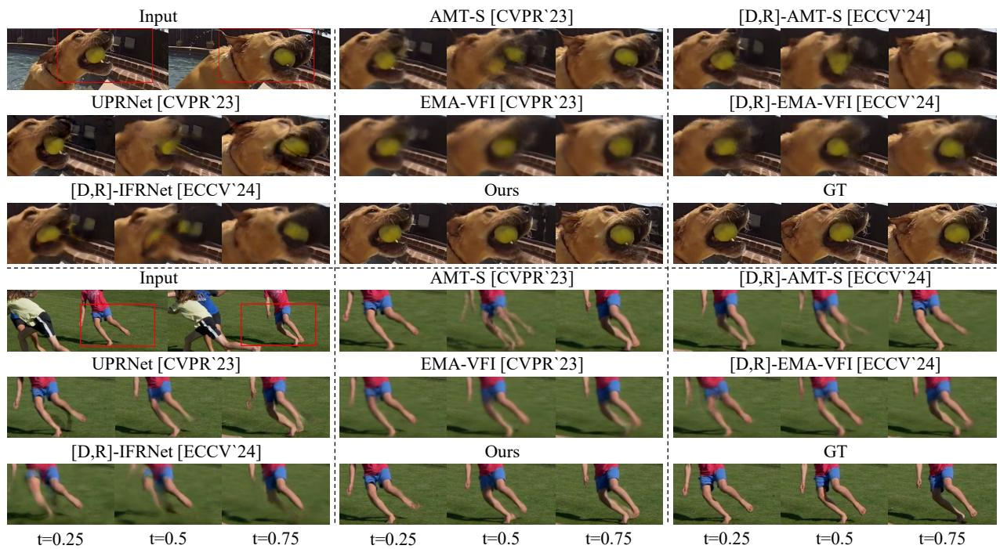
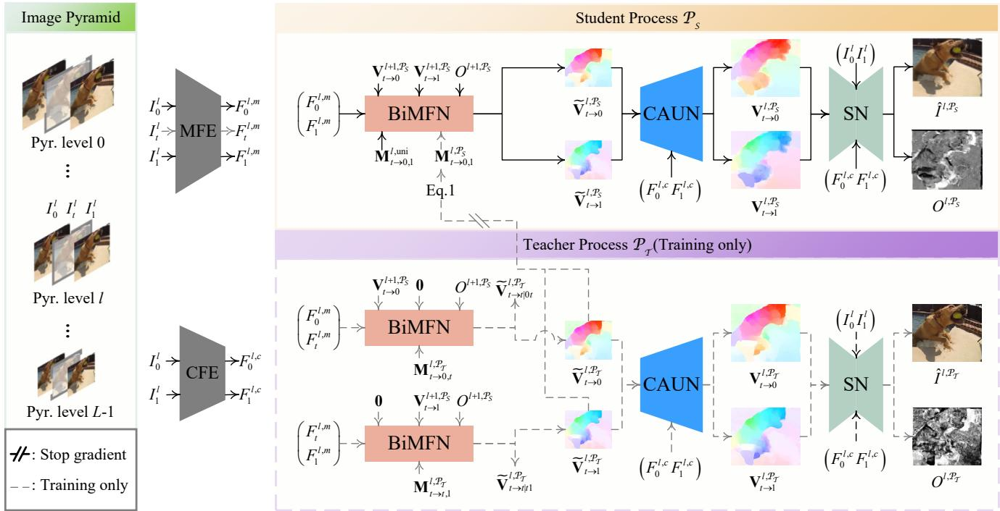
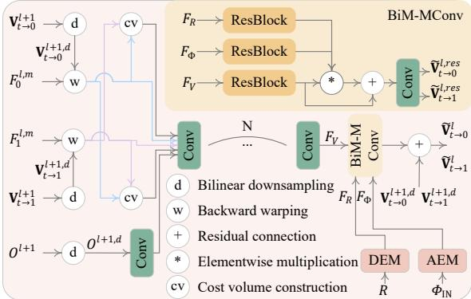
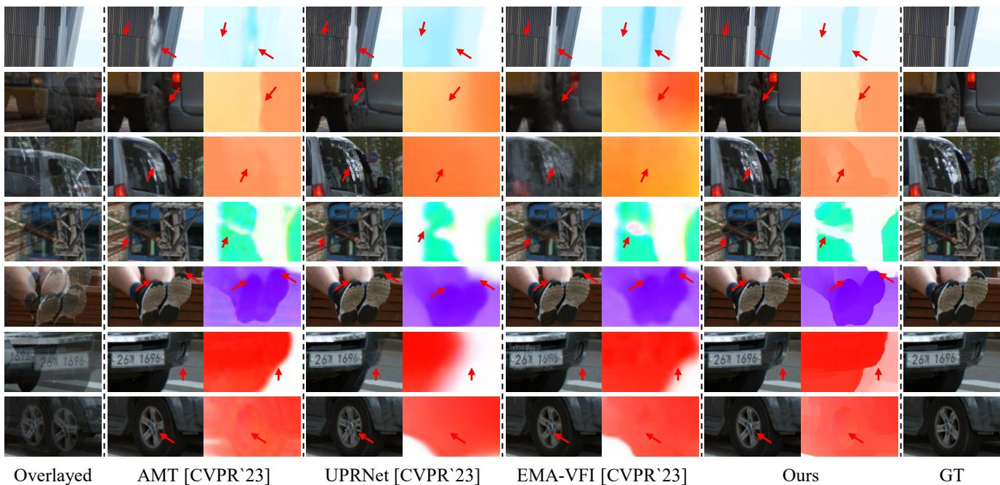
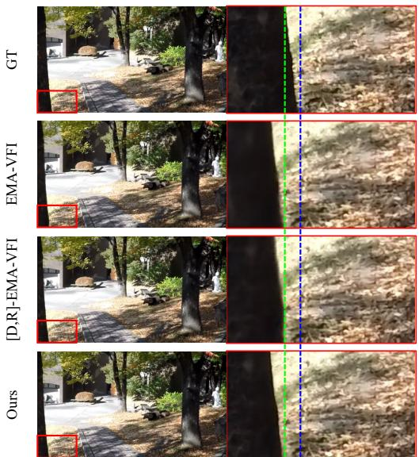

# BiM-VFI: Bidirectional Motion Field-Guided Frame Interpolation for Video with Non-uniform Motions

Wonyong Seo KAIST\* wyong0122@kaist.ac.kr

Jihyong Oh† Chung-Ang University

Munchurl Kim†   
KAIST\*   
mkimee@kaist.ac.kr

https://kaist-viclab.github.io/BiM-VFI\_site/

  
Figure 1. Qualitative comparison of our proposed BiM-VFI and SOTA models at arbitrary time instances (t = 0.25, 0.5 and 0.75) for video frame interpolation. The previous SOTA methods yield blurry interpolated frames while our BiM-VFI model generates clear ones.

## Abstract

Existing Video Frame interpolation (VFI) models tend to suffer from time-to-location ambiguity when trained with video of non-uniform motions, such as accelerating, decel erating, and changing directions, which often yield blurred interpolated frames. In this paper, we propose (i) a novel motion description map, Bidirectional Motion field (BiM), to effectively describe non-uniform motions; (ii) a BiMguided Flow Net (BiMFN) with Content-Aware Upsampling Network (CAUN) for precise optical flow estimation; and

(iii) Knowledge Distillation for VFI-centric Flow supervision (KDVCF) to supervise the motion estimation of VFI model with VFI-centric teacher flows. The proposed VFI is called a Bidirectional Motion field-guided VFI (BiM-VFI) model. Extensive experiments show that our BiM-VFI model significantly surpasses the recent state-of-the-art VFI methods by 26% and 45% improvements in LPIPS and STLPIPS respectively, yielding interpolated frames with much fewer blurs at arbitrary time instances.

<table><tr><td rowspan=2 colspan=1>BiMr0 r1/vt→1Vνt→0     φ $M _ { t  0 , 1 } : = ( \frac { r _ { 0 } } { r _ { 0 } + r _ { 1 } } , \phi )$ </td><td rowspan=1 colspan=1>CASE 1</td><td rowspan=1 colspan=2>CASE 2</td><td rowspan=1 colspan=2>CASE 3</td></tr><tr><td rowspan=1 colspan=1>0.5    0.5o         O  5  Oπt=0   t=0.5   t=1</td><td rowspan=1 colspan=1>0.4   0.656        O  9  oπt=0   t=0.5   t=1</td><td rowspan=1 colspan=1>0.6    0.4 O   6o   5  Oπt=0   t=0.5   t=1</td><td rowspan=1 colspan=1>0.4       0.6Co  OC      0.8πt=0   t=0.5  t=1</td><td rowspan=1 colspan=1>0.4  0.6Q61.2πt=0   t=0.5   t=1</td></tr><tr><td rowspan=1 colspan=1>Time Indexing</td><td rowspan=1 colspan=1>(0.5)</td><td rowspan=1 colspan=1>(0.5)    Ambig</td><td rowspan=1 colspan=1>uous   (0.5)</td><td rowspan=1 colspan=1>(0.5)    Ambig</td><td rowspan=1 colspan=1>uous    (0.5)1</td></tr><tr><td rowspan=1 colspan=1>Distance Indexing</td><td rowspan=1 colspan=1>(0.5)</td><td rowspan=1 colspan=1>(0.4)     Dist</td><td rowspan=1 colspan=1>inct     (0.6)</td><td rowspan=1 colspan=1>(0.4)    Ambig</td><td rowspan=1 colspan=1>uous    (0.4)1</td></tr><tr><td rowspan=1 colspan=1>BiM (Ours)</td><td rowspan=1 colspan=1>(0.5, π)</td><td rowspan=1 colspan=1>(0.4, π)    Dist</td><td rowspan=1 colspan=1>inct    (0.6, π)</td><td rowspan=1 colspan=1>(0.4, 0.8π)   Dist</td><td rowspan=1 colspan=1>inct   (0.4, 1.2π)</td></tr></table>

Figure 2. Time-to-location (TTL) ambiguity comparison of motion descriptors (time indexing, distance indexing, our BiM).

## 1. Introduction

Video frame interpolation (VFI) is a fundamental low-level vision task that aims to synthesize intermediate frames between temporally adjacent input frames. VFI enables the conversion of low-frame-rate videos into high-frame-rate sequences, enhancing visual fluidity and realism. VFI has broad applications, including the restoration and enhancement of low frame rate videos, the creation of slow-motion videos [12, 41], and the improvement of animation workflows in the cartoon industry [2, 32, 36].

VFI is an ill-posed problem due to the time-to-location (TTL) ambiguity between two input frames [22, 34, 44]. The TTL ambiguity stems from infinitely many possible trajectories between the corresponding pixels of the two source input frames for video sequences with non-uniform motions (CASE1, CASE2, and CASE3 in Fig. 2). It is well known that TTL ambiguity complicates the prediction of the actual target frame during inference. However, it also can pose challenges during training. VFI learning based only on target timesteps t between the two source input frames can cause VFI networks to learn the average of all the possibilities as final interpolation results which often turn out to be very blurred [44]. Solving the TTL ambiguity problem is challenging, especially for inference because of its high illposedness. Instead, we propose an alternative solution not to solve the TTL ambiguity problem at inference time but to resolve ambiguity in the training phase to obtain clean interpolated frames at target time instances.

To resolve TTL ambiguity during training, we propose a novel motion description map based on Bidirectional-Motion Fields (BiM), inspired by the distance indexing [44]. The distance indexing relies only on relative distances on the line between two corresponding pixels in source frames, so it is limited in describing the directional changes along motion trajectories, and thus cannot fully resolve the ambiguity. However, our BiM can fully describe any non-uniform motions including accelerations, decelerations, or directional changes by incorporating both magnitude and angular information of bidirectional flows between a target frame and each of two source frames. The BiM is used as a description map for VFI learning to generate clean interpolated frames by limiting the solution space of the possible motion trajectories during training. Also, we design (i) a BiM-guided FlowNet (BiMFN), and (ii) a Content-Aware Upsample Network (CAUN) to precisely estimate the motions based on input BiM. Lastly, we propose a Knowledge Distillation for VFI-Centric Flow supervision (KDVCF) as a new training strategy with the help of the target frame to generate both BiM as input to student process and accurate flows for student process supervision during the training. Our proposed VFI model with KDVCF, BiMFN, and CAUN is called Bidirectional Motion fieldguided VFI (BiM-VFI).

## 2. Related Works

## 2.1. Video frame interpolation

VFI methods can be divided into two categories: flowbased and kernel-based approaches. The flow-based methods [9, 13, 16, 18, 42] utilize optical flows in interpolating a target frame. The kernel-based methods construct various types of kernels, such as the adaptive kernels [27, 28], the deformable kernels [17, 39], or the attention maps [22, 34] to interpolate the target frames by applying these kernels to the source frames. While flow-based methods can interpolate at any arbitrary time frame, kernel-based methods are limited to interpolating center frames. Consequently, flowbased methods have dominated the recent VFI works.

Flow-based methods focus on improving the performance of their motion estimators to enhance the interpolation quality. For the methods [7, 26] employing forward warping [26], pre-trained optical flow models [8, 37, 38] have been directly utilized to estimate the motion to improve the motion estimation accuracy. For the methods employing backward warping [11], flows have to be estimated from the target frame to each of the two source frames, while target frames are unavailable. Therefore, recent methods tried to design their own motion estimators for accurate flow estimations. Park et al. [29–31] and Jin et al. [13] have tailored local cost volumes in a bilateral manner to estimate motions between target frame and each of two source frame. Li et al. [18] also adopted ‘all pair cost volume’ [38], to enhance the motion estimation capabilities of their model.

Recent studies [16, 18] have demonstrated that supervising the flow estimation using pre-trained optical flow models [10] can benefit motion estimation learning, especially in large motions or motions in homogeneous regions, which are not adequately captured by photometric supervision. However, the pre-trained flow models resulted in degraded performance for VFI in cases of motion in certain regions such as shadows, or blurs, because flows estimated from supervised optical flow models and flows for VFI have distinct roles [16]. Huang et al. [9] introduced the “privileged block”, which utilizes the target frame to generate a more accurate optical flow from the target to the source frame. They supervised the flows estimated solely from source frames with these privileged flows to enhance motion estimation performance. However, the privileged block only consists of a few convolution layers, thus limiting the full utilization of target frames to enhance motion estimation accuracy.

## 2.2. Non-uniform motions for VFI

There are studies focused on reducing ambiguity caused by non-uniform motions in VFI. Xu et al. [40] utilized four neighboring consecutive input source frames around each target frame to model motion as a quadratic equation. Several studies [22, 34] also use four neighboring frames with transformer architectures [4, 19] to implicitly capture nonuniform motion and interpolate the target frames with selfattention operation. However, while VFI methods using 4 input frames can reduce TTL ambiguity during training, they still cannot fully resolve it.

Recently, Zhong et al. [44] proposed a novel paradigm to address TTL ambiguity during training. Zhong et al. [44] introduced a novel motion descriptor called ‘distance index-$\operatorname { i n g } ^ { \prime }$ , which describes the relative magnitude between the motion from $I _ { 0 }$ to $I _ { 1 }$ and the motion from $I _ { 0 }$ to $I _ { t } ,$ using a pixel-wise motion magnitude ratio map. It has shown that distance indexing can effectively resolve velocity ambiguity but cannot resolve directional ambiguity, because it only includes the motion magnitudes and ignores the directional components.

## 3. Proposed Method

Fig. 3 depicts the overall network architecture of our BiM-VFI based on a recurrent pyramid architecture, operates from $( L - 1 )$ -th level to 0-th level (where L is a number pyramid level), and the procedure of proposed KDVCF. Every pyramid level consists of a pair of student and teacher processes, $\mathcal { P } _ { \mathcal { S } }$ and $\mathcal { P } _ { 7 }$ , where the weights are shared between the processes as well as across all pyramid levels. A preceding source frame, a following source frame, and a target frame are denoted as $I _ { 0 } , I _ { 1 }$ , and $I _ { t } .$ , respectively.

In the BiM-VFI, $I _ { 0 } , I _ { t } .$ , and $I _ { 1 }$ are downsampled by a factor $1 / 2$ at each hierarchical level. The Motion Feature Extractor (MFE) extracts motion features $F _ { 0 } ^ { l , m } , F _ { 1 } ^ { l , m }$ and $\boldsymbol { F } _ { t } ^ { l , m }$ for l-th level input, while the Context Feature Extractor (CFE) extracts context features $F _ { 0 } ^ { l , c }$ and $F _ { 1 } ^ { l , c }$ . In the student process, $F _ { 0 } ^ { l , m }$ and $F _ { 1 } ^ { l , m }$ are fed in Bidirectional Motion Field FlowNet (BiMFN) that outputs bidirectional optical flows, $\tilde { \mathbf { V } } _ { t  0 } ^ { l , \mathcal { P } _ { S } }$ and $\tilde { \mathbf { V } } _ { t  1 } ^ { l , \mathcal { P } _ { S } }$ . The Content-Aware Upsampling Network (CAUN) takes $\tilde { \mathbf { V } } _ { t  0 } ^ { l , \mathcal { P } _ { S } } , \tilde { \mathbf { V } } _ { t  1 } ^ { l , \mathcal { P } _ { S } } , F _ { 0 } ^ { l , c }$ , and $F _ { 1 } ^ { l , c }$ as input and yields upsampled optical flows $\mathbf { V } _ { t  0 } ^ { l , \mathcal { P } _ { s } }$ and $\mathbf { V } _ { t  1 } ^ { l , \mathcal { P } _ { s } }$ in a adaptive manner. In the synthesis network (SN), $I _ { 0 } ^ { l } , \ I _ { 1 } ^ { l } , \ F _ { 0 } ^ { l , c }$ , and $F _ { 1 } ^ { l , c }$ are backwarped [11] by $\mathbf { V } _ { t  0 } ^ { l , \mathcal { P } _ { s } }$ and $\mathbf { V } _ { t  1 } ^ { l , \mathcal { P } _ { s } }$ . The warped frames and context features then finally yield a blending mask for two warped images, $O ^ { l , \mathcal { P } _ { S } }$ and corresponding interpolated frame $\hat { I } _ { t } ^ { i , \mathcal { P } _ { S } }$ . Simple U-net [33] architecture is employed as SN for our BiM-VFI.

The teacher process operates almost in the same manner as the student process except using ground truth target frame $I _ { t } ^ { l }$ as input pair with each of $I _ { 0 } ^ { l }$ and $I _ { 1 } ^ { l }$ . Since $I _ { t } ^ { l }$ is used as part of input, the resulting $\tilde { \mathbf { V } } _ { t  0 } ^ { l , \mathcal { P } _ { \tau } }$ and $\tilde { \mathbf { V } } _ { t  1 } ^ { l , \mathcal { P } _ { T } }$ are more precise than $\tilde { \mathbf { V } } _ { t  0 } ^ { l , \mathcal { P } _ { s } }$ and $\tilde { \mathbf { V } } _ { t  1 } ^ { l , \mathcal { P } _ { S } }$ so they are used to supervise the learning of $\tilde { \mathbf { V } } _ { t  0 } ^ { l , \mathcal { P } _ { s } }$ and $\tilde { \mathbf { V } } _ { t  1 } ^ { l , \mathcal { P } _ { s } }$ , as well as to compute the BiM for student process $M _ { t  0 , 1 } ^ { l , \mathcal { P } _ { S } }$

In the rest of this section, we will explain our motion description map BiM (Sec. 3.1), specific modules in our BiM-VFI (Secs. 3.2 and 3.3), and the proposed knowledge distillation strategy KDVCF (Sec. 3.4) in detail.

## 3.1. Bidirectional Motion Field (BiM)

Various non-uniform motions including accelerating, decelerating, and changing directions are contained in realworld videos. Such non-uniform motions not only make illposedness at inference but also cause VFI learning to suffer from the TTL ambiguity at training time, thus resulting in severe blur artifacts in interpolated frames. It is very challenging to resolve such ambiguity problems directly in inference time because it is difficult to predict the actual trajectory when only the first and last frames of the motion are given. Instead, we take an alternative approach to solving the blur problem caused by TTL ambiguity at training time.

To resolve the TTL ambiguity during training, we introduce a Bidirectional Motion Field (BiM), $\mathbf { M } _ { t  0 , 1 } ~ =$ $[ R , \Phi ] ^ { T }$ , as a novel motion descriptor that consists of pixelwise motion magnitude ratios R and angles Φ between bidirectional optical flows $\mathbf { V } _ { t  0 }$ and $\mathbf { V } _ { t  1 }$ from $I _ { t }$ to each of $I _ { 0 }$ and $I _ { 1 }$ . The BiM at pixel location (x, y) is defined as:

$$
\mathbf { M } _ { t  0 , 1 } ( x , y ) = [ R ( x , y ) , \Phi ( x , y ) ] ^ { T } = [ \frac { r _ { 0 } } { r _ { 0 } + r _ { 1 } } , \phi ] ^ { T } ,\tag{1}
$$

  
Figure 3. Our Bidirectional Motion Field-guided VFI (BiM-VFI) with Knowledge Distillation for VFI-Centric Flow supervision (KDVCF).

where $r _ { 0 } = | | \mathbf { V } _ { t  0 } ( x , y ) | | , r _ { 1 } = | | \mathbf { V } _ { t  1 } ( x , y ) | |$ , and $\phi =$ $\angle \mathbf { V } _ { t  1 } ( x , y ) - \angle \mathbf { V } _ { t  0 } ( x , y )$ (top left of Fig. 2).

Fig. 2 depicts a TTL ambiguity comparison of different motion descriptors, time indexing [9, 16, 18, 45], distance indexing [44] and our BiM. CASE 1 illustrates a car at timestep $t ~ = ~ 0 . 5$ is exactly at the center between the cars at timestep $t = 0$ and $t = 1$ . All motion descriptors can avoid TTL ambiguity if all training triplets have uniform motions as depicted in CASE1. In CASE 2, the blue car is placed at a relative distance of 0.4, while the green car is placed at a relative distance of 0.6. In this case, the blue and green cars are described by the same time indexing of 0.5 but different distance indexings and BiMs of 0.4 and 0.6, which incurs the TTL ambiguity only with time indexing. That is, time indexing cannot distinguish the blue and green car’s position, where both cars are captured at $t = 0 . 5$ Lastly, CASE 3 shows the case where the blue and green cars have different changes in motion directions at an accelerating speed. Both time and distance indexings fail to distinguish the two cars, but our BiM can describe the two cars differently in terms of ϕ = 1.2π and 0.8π. Due to this TTL ambiguity problem, recent VFI models trained with time indexing [9, 16, 18, 45] or distance indexing [44] tend to produce blurry interpolated frames at target times in the sense of averaging all possible answers (blue and green cars) to minimize the objectives such as L1 losses.

For inference, $I _ { t }$ has to be restored, but the flows $\mathbf { V } _ { t  0 } .$ $\mathbf { V } _ { t  1 }$ , or even the BiM $\mathbf { M } _ { t  0 , 1 }$ is not available except for the target time t. Moreover, the motion types (uniform or non-uniform) are not known between $I _ { 0 }$ and $I _ { 1 }$ . Nevertheless, it is known that uniform motion assumption reasonably works well [44]. We extend this uniform assumption, $\mathbf { \Delta V } _ { t  0 } / t + \mathbf { V } _ { t  1 } / ( 1 - t ) = 0$ . by adding angle information $\phi = \pi$ . So, the uniform BiM used for inference is given as:

$$
\mathbf { M } _ { t  0 , 1 } ^ { \mathrm { u n i } } = [ t \cdot \mathbf { 1 } _ { H \times W } \quad \pi \cdot \mathbf { 1 } _ { H \times W } ] ^ { T } ,\tag{2}
$$

where H and $W$ are the height and width of desired bidirectional optical flows, $\mathbf { V } _ { t  0 }$ and $\mathbf { V } _ { t  1 }$ . We demonstrate that our BiM, under the uniform motion assumption, can interpolate frames with a similar sense of time indexing as described in Sec. 4.5.

We point out that our BiM guides the BiM-VFI model to yield relatively cleaner interpolated frames at t than other VFI models with time indexing and distance indexing (Fig. 1). With the distinct motion describability of BiM, our BiM-VFI is trained without TTL ambiguity and can infer much cleaner target frames under the uniform motion assumption, although the motion of the interpolated target frames may not aligned with their real motions.

## 3.2. BiM-guided FlowNet (BiMFN)

We now design a bidirectional flow estimation network that utilizes the BiM. Fig. 4 shows our BiM-guided FlowNet (BiMFN) that estimates $\tilde { \mathbf { V } } _ { t  0 } ^ { l }$ and $\tilde { \mathbf { V } } _ { t  1 } ^ { l }$ from $I _ { t } ^ { l }$ to each of $I _ { 0 } ^ { l }$ and $I _ { 1 } ^ { l }$ at l-th pyramid level. It is noted that $\mathbf { V } _ { t  0 } ^ { l + 1 , d }$ and $\mathbf { V } _ {  \ b 1 } ^ { l + 1 , d }$ are bilinearly downsampled versions of $\mathbf { V } _ { t  0 } ^ { l + 1 }$ and $\mathbf { V } _ { t  1 } ^ { \tilde { l } + \tilde { 1 } ^ { \prime } }$ by a factor of 2 and its magnitude is also divided by factor of 2 to match the spatial sizes and magnitude of $\tilde { \mathbf { V } } _ { t  0 } ^ { l }$ and $\tilde { \mathbf { V } } _ { t  1 } ^ { l }$ . The blending mask estimated from the previous pyramid level, $O ^ { l + 1 }$ , is also downsampled as $O ^ { l + \hat { 1 , } d }$ in the same sense.

  
Figure 4. Proposed BiM-Guided FlowNet (BiMFN) at l-th pyramid level.

The BiMFN first warps $F _ { 0 } ^ { l , m }$ and $F _ { 1 } ^ { l , m }$ using $\mathbf { V } _ { t  0 } ^ { l + 1 }$ and $\mathbf { V } _ { t  1 } ^ { l + 1 }$ , resulting in $F _ { 0  t } ^ { l , m }$ and $F _ { 1  t } ^ { l , m } . \ F _ { 0  t } ^ { l , \bar { m } }$ and $F _ { 1  t } ^ { l , m }$ are then used to construct local cost volumes [37, 38] to find precise correspondences between two features. Local cost volumes from $\bar { F } _ { 0  t } ^ { l , m }$ to $F _ { 1  t } ^ { l , m }$ and vice versa are constructed to encapsulate asymmetric correspondence information. $O ^ { l + 1 , d }$ is encoded through separate convolution layers and then concatenated with $F _ { 0  t } ^ { l , \bar { m } } , F _ { 1  t } ^ { l , m }$ , and two cost volumes before being passed to the next module.

Then, the BiM Modulation Convolution (BiM-MConv) in Fig. 4 takes three inputs with $F _ { V } , F _ { R }$ , and $F _ { \Phi }$ where (i) $F _ { V }$ is the output of the cascaded eight convolution layers; (ii) $F _ { R }$ is the encoded output from the Distance Embedding Module (DEM) with a one-channel motion ratio component input R in Eq. (1); and (iii) $F _ { \Phi }$ is the feature output of the Angle Embedding Module (AEM) for a two-channel angular component input $\Phi _ { \mathrm { I N } } = ( \sin ( \Phi ) , \cos ( \Phi ) )$ ) from Eq. (1). Finally, for $F _ { R } , F _ { \Phi }$ , and $F _ { V }$ input, the BiM-MConv integrates them with elementwise multiplication and produces the refined residual flow fields, $\tilde { \mathbf { V } } _ { t  0 } ^ { l , r e s }$ and $\tilde { \mathbf { V } } _ { t  1 } ^ { l , r e s }$ . The final flow estimations at l-th pyramid level are computed as:

$$
\begin{array} { r l } & { \tilde { \mathbf { V } } _ { t  0 } ^ { l } = \mathbf { V } _ { t  0 } ^ { l + 1 , d } + \tilde { \mathbf { V } } _ { t  0 } ^ { l , r e s } , } \\ & { \tilde { \mathbf { V } } _ { t  1 } ^ { l } = \mathbf { V } _ { t  1 } ^ { l + 1 , d } + \tilde { \mathbf { V } } _ { t  1 } ^ { l , r e s } . } \end{array}\tag{3}
$$

3.3. Content-Aware Upsampling Network (CAUN) Since $\tilde { \mathbf { V } } _ { t  0 } ^ { l }$ and $\tilde { \mathbf { V } } _ { t  1 } ^ { l }$ are of the same size as $F _ { 0 , m } ^ { l }$ and $F _ { 1 , m } ^ { l } ,$ they must be upsampled by a scale factor of 4 to match the image dimensions, $H / 2 ^ { l }$ and $W / 2 ^ { l }$ . In general, the usage of bilinear or bicubic upsampling can incur flow leakages along object boundaries and diminish small objects by blending external flows [23, 38]. To avoid this, adaptive upsampling is commonly employed in optical flow estimation models such as [10, 23, 38], but still is not widely used in VFI models. We adopt ‘Convex upsample’ layer, proposed by Teed et al. [38], and extend it for VFI to upsample $\tilde { \mathbf { V } } _ { t  0 } ^ { l }$ and $\tilde { \mathbf { V } } _ { t  1 } ^ { l }$ to $\mathbf { V } _ { t  0 } ^ { l }$ and $\mathbf { V } _ { t  1 } ^ { l }$ using pixelwise adaptive kernels. The detailed structure of $\mathrm { C A U N }$ is presented in Supplementals. The adaptive upsampling of the CAUN not only aesthetically enhances the upsampling of flows but it also more effectively captures small objects and complex boundaries in interpolated frames, thanks to its ability to maintain the flows of small objects and prevent mixing the flows at object boundaries. Our extensive experiments show its effectiveness, which is presented in Sec. 4.4.

## 3.4. Knowledge Distillation for VFI-centric Flow Supervision (KDVCF)

As discussed in Sec. 2.1, the flow estimation of pre-trained optical flow models and VFI models operates differently in certain areas, such as blurs and shadows. Therefore, instead of using pre-trained optical flow models for BiM and flow supervision, we propose Knowledge Distillation for VFIcentric Flow supervision (KDVCF) that provides BiM and flow supervision more suitable for VFI. KDVCF consists of student process $\mathcal { P } _ { \mathcal { S } }$ and teacher process $\mathcal { P } _ { \mathcal { T } }$ . The two processes sequentially run but share the same architecture with the same weights. First, as shown in Fig. 3, $\mathcal { P } _ { T }$ takes two input pairs, $( I _ { 0 } ^ { l } , I _ { t } ^ { l } )$ and $( I _ { t } ^ { l } , I _ { 1 } ^ { l } )$ , and produce precise flow estimations $\tilde { \mathbf { V } } _ { t  0 } ^ { l , \mathcal { P } _ { T } }$ and $\tilde { \mathbf { v } } _ { t  1 } ^ { l , \mathcal { P } _ { \tau } }$ Then the BiM is computed based on $\tilde { \mathbf { V } } _ { t  0 } ^ { l , \mathcal { P } _ { T } }$ and $\tilde { \mathbf { V } } _ { t  1 } ^ { l , \mathcal { P } _ { T } }$ according to Eq. (1), and is inputted to the BiMFN of $\mathcal { P } _ { \mathcal { S } }$ . So, the knowledge distillation can be made from $\mathcal { P } _ { T }$ to $\mathcal { P } _ { \mathcal { S } }$ for flow estimations during training. Note that $\mathcal { P } _ { \mathcal { S } }$ only remains at inference.

In $\mathcal { P } _ { T }$ , the BiMFN yields $\tilde { \mathbf { V } } _ { t  0 } ^ { l , \mathcal { P } _ { T } }$ and $\tilde { \mathbf { V } } _ { t  t | 0 t } ^ { l , \mathcal { P } _ { T } }$ for input frame pair $I _ { 0 } ^ { l }$ and $I _ { t } ^ { l } .$ . In this case, $\tilde { \mathbf { V } } _ { t  0 } ^ { \mathcal { P } \tau }$ can be an accurate flow field estimate, and $\tilde { \mathbf { V } } _ { t  t | 0 t } ^ { l , \mathcal { P } _ { T } }$ is ideally a vector field of all ${ \bf 0 } ^ { \prime } { \bf s } .$ Since our BiM is formatted in terms of a relative motion ratio and an angle between bidirectional flows, the resulting motion ratio R is constructed as a uniform map of 1’s but the angles map Φ is undefined because $\tilde { \mathbf { V } } _ { t  t } ^ { l , \mathcal { P } _ { T } }$ has zero vectors. So, Φ is filled with angles randomly sampled from a uniform distribution $\mathcal { U } ( 0 , 2 \pi )$ to avoid a bias to any specific angle value. Thus, the BiM to be inputted to the BiMFN in $\mathcal { P } _ { T }$ for input pair $( I _ { 0 } ^ { l } , I _ { t } ^ { l } )$ is defined as:

$$
\begin{array} { r l } { \mathbf { M } _ { t  0 , t } ^ { l , \mathcal { P } _ { T } } = [ \mathbf { 1 } _ { H / 2 ^ { l + 2 } \times W / 2 ^ { l + 2 } }  } & { { } \phi _ { 0 } \cdot \mathbf { 1 } _ { H / 2 ^ { l + 2 } \times W / 2 ^ { l + 2 } } ] ^ { T } } \end{array}\tag{4}
$$

where $\phi _ { 0 } \sim \mathcal { U } ( 0 , 2 \pi )$ . Like for another input pair $( I _ { t } ^ { l } , I _ { 1 } ^ { l } )$ in $\mathcal { P } _ { \mathcal { T } }$ , the BiMFN yields $\tilde { \mathbf { V } } _ { t  t | t 1 } ^ { l , \mathcal { P } _ { T } }$ and $\tilde { \mathbf { V } } _ { t  1 } ^ { l , \bar { P _ { T } } }$ . So, the BiM

  
Figure 5. Qualitative comparison for fixed-time interpolation datasets, XTest [35].

as input to the BiMFN for input pair $( I _ { t } ^ { l } , I _ { 1 } ^ { l } )$ is defined as:

$$
\mathbf { M } _ { t  t , 1 } ^ { l , \mathcal { P } _ { \tau } } = [ \mathbf { 0 } _ { H / 2 ^ { l + 2 } \times W / 2 ^ { l + 2 } } \quad \phi _ { 1 } \cdot \mathbf { 1 } _ { H / 2 ^ { l + 2 } \times W / 2 ^ { l + 2 } } ] ^ { T }\tag{5}
$$

where $\phi _ { 1 } \sim \mathcal { U } ( 0 , 2 \pi )$

To ensure the VFI-centric estimation of $\tilde { \mathbf { V } } _ { t  0 } ^ { l , \mathcal { P } _ { T } }$ and $\tilde { \mathbf { V } } _ { t  1 } ^ { l , \mathcal { P } _ { \tau } }$ , these flows are further employed to reconstruct the target image $\hat { I } _ { t } ^ { l , \mathcal { P } _ { \mathcal { T } } }$ in $\mathcal { P } _ { T }$ , along with CAUN and SN, and are trained with a photometric reconstruction loss. Note that $\tilde { \mathbf { V } } _ { t  0 } ^ { l , \mathcal { P } _ { T } }$ and $\tilde { \mathbf { V } } _ { t  1 } ^ { l , \mathcal { \hat { P } } _ { \tau } }$ are also employed to construct the BiM in Eq. (1) for $\mathcal { P } _ { \mathcal { S } }$ that operates for source frame pairs, $I _ { 0 } ^ { l }$ and $I _ { 1 } ^ { l }$ , as well as to supervise the output flow fields, $\tilde { \mathbf { V } } _ { t  0 } ^ { l , \mathcal { P } _ { s } }$ and $\tilde { \mathbf { V } } _ { t  1 } ^ { l , \mathcal { P } _ { S } }$ , of the BiMFN in $\mathcal { P } _ { \mathcal { S } }$ . Unlike estimated flows from pre-trained supervised optical flow models, that are trained to minimize end-point error with GT flows, our $\tilde { \mathbf { V } } _ { t  0 } ^ { l , \mathcal { P } _ { T } }$ and $\tilde { \mathbf { V } } _ { t  1 } ^ { l , \mathcal { P } _ { \tau } }$ align precisely with the objectives of VFI. Consequently, the distillation is fully beneficial and effectively tailored to the $\mathcal { P } _ { \mathcal { S } } \mathbf { \ ' } _ { \mathbf { S } }$ purpose. Extensive experiments showed that our KDVCF is more beneficial than the distillation from pre-trained supervised optical flow models.

During $\mathcal { P } _ { \mathcal { S } }$ , our BiM-VFI learns various uniform and non-uniform motions with a distinct motion descriptor (BiM) and a precise VFI-centric flow supervision produced by $\mathcal { P } _ { T }$ . It is worth menting that $\tilde { \mathbf { V } } _ { t  0 } ^ { l , \mathcal { P } _ { s } }$ and $\tilde { \mathbf { V } } _ { t  1 } ^ { l , \mathcal { \hat { P } } _ { s } }$ in $\mathcal { P } _ { \mathcal { S } }$ can be precisely learned in the help of our BiM based on accurate flow fields $\tilde { \mathbf { V } } _ { t  0 } ^ { l , \mathcal { P } _ { \tau } }$ and $\tilde { \mathbf { V } } _ { t  1 } ^ { \hat { l } , \mathcal { P } _ { \tau } }$ obtained in $\mathcal { P } _ { \mathcal { T } }$ with the availability of target frame $I _ { t } ^ { l }$ . For inference, the BiM for uniform motions is fed into the BiMFN, and our BiM-VFI can correspondingly construct clean interpolated frames with uniform motions although they might not be well aligned with ground truth target frames with nonuniform motions.

## 4. Experiments

## 4.1. Experiments details

Benchmarks. We tested our BiM-VFI for both fixed-time (t=0.5) and arbitrary time interpolation datasets. For fixedtime interpolation, we used Vimeo90K triplet [41], SNU-FILM [3], and XTest [35] datasets. For arbitrary-time interpolation, we conducted experiments on Vimeo90K septuplet [41] and SNU-FILM-arb [6] datasets.

Metrics. We measured both pixel-centric metrics (PSNR and SSIM) and perceptual metrics (LPIPS [43], STLPIPS [5], and NIQE [25]) for quantitative comparisons between our BiM-VFI and SOTA methods. Both LPIPS and STLPIPS are full-reference perceptual metrics, while NIQE is a no-reference perceptual metric. LPIPS and STLPIPS compute the similarity between features of the input and reference images using a pre-trained network. However, while LPIPS exhibits a significant drop in metric performance in the presence of minor misalignments, STLPIPS is more tolerant of such misalignments.

## 4.2. Qualitative results

We compared our BiM-VFI with both State-of-the-art (SOTA) arbitrary-time and fixed-time VFI models for various datasets. Fig. 1 compares arbitrary-time interpolation results at $t = 0 . 2 5 , 0 . 5$ , and 0.75 for SNU-FILM-arb extreme datasets [3]. While the objects (dog’s heads and balls in the upper figures, legs in the lower figures) with very fast motions are blurrily reconstructed by all the SOTA models, including the models plugged with ‘distance indexing and ‘iterative reference-based estimation’ [44] (denoted as [D,R]), our BiM-VFI successfully restored much cleaner frames than other methods.

<table><tr><td rowspan="2">Methods</td><td colspan="5">Vimeo90K-septuplet</td><td colspan="8">SNU-FILM-arb</td></tr><tr><td>psnr ssim</td><td>lpips</td><td></td><td>stlpips</td><td>niqe</td><td>lpips stlpips</td><td>Medium</td><td>niqe</td><td>lpips stlpips</td><td>Hard niqe</td><td>lpips</td><td>Extreme stlpips</td><td>niqe</td></tr><tr><td>RIFE [9]</td><td>28.22</td><td>0.912</td><td>0.105</td><td></td><td></td><td>0.038</td><td>0.021</td><td>4.975</td><td></td><td></td><td></td><td></td><td></td></tr><tr><td></td><td></td><td></td><td></td><td>0.084</td><td>6.663</td><td></td><td></td><td>0.072 0.066</td><td>0.054</td><td>5.177 4.870</td><td>0.134 0.115</td><td>0.116</td><td>5.358</td></tr><tr><td>IFRNet [16]</td><td>28.260.9150.088</td><td></td><td></td><td>0.094</td><td>6.422</td><td>0.046 0.037</td><td>4.921</td><td>0.049</td><td>0.054 0.025</td><td>4.758</td><td>0.089</td><td>0.094 0.055</td><td>4.793</td></tr><tr><td>M2M-PWC [7]</td><td>27.43</td><td>0.901</td><td>0.081</td><td>0.055</td><td>6.026</td><td>0.030</td><td>0.014</td><td>4.806</td><td></td><td></td><td></td><td></td><td>4.657</td></tr><tr><td>AMT-S [18]</td><td>28.52 27.23</td><td>0.920 0.900</td><td>0.101 50.087</td><td>0.105</td><td>6.866</td><td>0.072 0.031</td><td>0.046</td><td>5.443</td><td>0.089 0.060</td><td>5.444</td><td>0.135</td><td>0.098</td><td>5.500</td></tr><tr><td>UPRNet [13] EMA-VFI [45]</td><td>29.41</td><td>0.928 0.086</td><td></td><td>0.061 0.079</td><td>6.280 6.736</td><td>0.041</td><td>0.014 0.025</td><td>4.837 4.984</td><td>0.054 0.028 0.072 0.054</td><td>4.909</td><td>0.092</td><td>0.056</td><td>4.923</td></tr><tr><td></td><td>27.41</td><td>0.901</td><td>0.086</td><td></td><td></td><td>0.027</td><td></td><td></td><td>0.026</td><td>5.236</td><td>0.125 0.101</td><td>0.106</td><td>5.522</td></tr><tr><td>[D,R]-RIFE [44]</td><td>27.13 0.899 0.078</td><td></td><td></td><td>0.059 0.053</td><td>6.220 6.167</td><td>0.026</td><td>0.011 0.010</td><td>4.751 4.757</td><td>0.050 0.048 0.023</td><td>4.829 4.798</td><td>0.095</td><td>0.072</td><td>4.898</td></tr><tr><td>[D,R]-IFRNet [44]</td><td>27.17 0.902 0.081</td><td></td><td></td><td>0.053</td><td>6.326</td><td>0.029</td><td>0.013</td><td>4.747 0.054</td><td>0.028</td><td>4.849</td><td>0.107</td><td>0.062 0.071</td><td>4.821 5.017</td></tr><tr><td>[D,R]-AMT-S [44] [D,R]-EMA-VFI [44]</td><td>24.730.851</td><td></td><td>0.081</td><td>0.046</td><td>6.227</td><td>0.032</td><td>0.013</td><td>4.864</td><td>0.055 0.027</td><td>4.978</td><td>0.106</td><td>0.071</td><td>5.120</td></tr><tr><td>Ours</td><td>26.83</td><td>0.893 0.070</td><td></td><td>0.043</td><td>6.009</td><td>0.023</td><td>0.008</td><td>4.693</td><td>0.039 0.015</td><td>4.725</td><td>0.070</td><td>0.034</td><td>4.751</td></tr><tr><td></td><td></td><td></td><td></td><td></td><td></td><td></td><td></td><td></td><td></td><td></td><td></td><td></td><td></td></tr></table>

Table 1. Quantitative comparisons on arbitrary-time interpolation datasets.

Also, we compared our BiM-VFI with other SOTA models (Fig. 5) for a fixed-time VFI dataset, XTest-set [35]. Even though other SOTA VFI models are trained on fixedtime datasets, our BiM-VFI outperforms them qualitatively. As shown in Fig. 5, the small objects (streetlight pole in the 1st row, power lines in the 3rd row, car plate numbers in the 5th row) and the complex boundaries between a car wheel and a rear bumper in the 2nd row are well constructed in the interpolated frame by our BiM-VFI, while the other SOTA models fail to interpolate repeated patterns (building wall with vertical strips in the 1st row) or incurred blurs in object boundaries. It is worth noting for the estimated flows in the 3rd, 5th, 7th, and 9th columns that our BiM-VFI can estimate sharper flows even in object boundaries and repeated patterns compared to other SOTA models.

## 4.3. Quantitative results

Tab. 1 compares our BiM-VFI and SOTA methods for arbitrary time interpolation test datasets. While our BiM-VFI underperforms in terms of pixel-centric metrics for Vimeo90K-septuplet [41], it demonstrated significantly higher performance by a large margin in terms of the perceptual metrics for Vimeo90K-septuplet and SNU-FILMarb [6]. For the Vimeo90K-septuplet and the SNU-FILMarb (Medium, Hard and Extreme) data sets, our BiM-VFI outperformed all other VFI models in terms of perceptual metrics (LPIPS, STLPIPS, and NIQE) except M2M-PWC [7] with 4.657 only in NIQE metric for SNU-FILMarb Extreme data set. As shown in Tab. 1, there are large metric gaps in pixel-centric metrics (PSNR and SSIM) between our BiM-VFI and most of the other SOTA methods because our BiM-VFI assumes uniform motion in interpolated frame reconstruction at inference. In spite of relatively large values of pixel-centric metrics for the other SOTA methods, their reconstructed interpolated frames are very blurry as shown in Fig. 1. These pixel-centric metrics conducted on test datasets containing non-uniform motions do not match the perceptual qualities as reported in [15, 44].

Tab. 2 shows the frame interpolation results for fixedtime interpolation data sets. As shown, our BiM-VFI also achieved comparable or superior performance to other SOTA models across most datasets although it was not trained for frame interpolation tasks at fixed target times.

## 4.4. Ablation studies

We conducted ablation studies on the proposed BiM, KD-VCF, and model components. First, for the BiM, we performed ablations by replacing R with time indexing T and by removing the Φ component, where we supervised the experiments using our proposed KDVCF on Vimeo90K septuplet datasets [41]. When the Φ component was removed, we excluded corresponding network components from the BiMFN. As shown in Tab. 3 (a), our proposed BiM achieved the best perceptual metric, which indicates BiM can resolve ambiguity at training, thus interpolating frames with much fewer blurs under uniform-motion scenarios.

In Tab. 3 (b), we compared our proposed KDVCF with the supervision using FlowFormer [8]-extracted flows and the training without any flow supervision. As shown, our proposed KDVCF yielded higher perceptual metrics than the pre-trained flow supervision, confirming that our flow estimations from $\mathcal { P } _ { T }$ provide more suitable BiM and supervision for training our BiM-VFI.

Lastly, in Tab. 3 (c), we compared replacing elementwise multiplication in BiM-MConv with a module that concatenates $F _ { V } , F _ { R } ,$ , and $F _ { \Phi }$ followed by a convolution layer, and removing the adaptive upsampling (CAUN). Our BiMFN design was found to better leverage the BiM, and the CAUN not only effectively upsamples the flow but also improves the perceptual quality of frame interpolation results.

<table><tr><td rowspan="2">Methods</td><td rowspan="2">Vimeo 90K-triplet</td><td colspan="4">SNU-FILM</td><td rowspan="2">XTest</td></tr><tr><td>Easy</td><td>Medium</td><td>Hard</td><td>Extreme</td></tr><tr><td>AMT-G [18]</td><td>0.019/0.012/5.327</td><td>0.022/0.008/4.822</td><td>0.035/0.015/4.924</td><td>0.060/0.028/4.993</td><td>0.112/0.068/4.993</td><td>0.134/0.097/6.883</td></tr><tr><td>M2M-PWC [7]</td><td>0.025/0.017/5.346</td><td>0.021/0.009/4.765</td><td>0.036/0.016/4.824</td><td>0.063/0.033/4.773</td><td>0.212/0.057/6.082</td><td>0.211/0.135/6.005</td></tr><tr><td>UPRNet [13]</td><td>0.022/0.015/5.367</td><td>0.018/0.008/4.703</td><td>0.034/0.015/4.853</td><td>0.062/0.030/4.975</td><td>0.110/0.067/5.052</td><td>0.095/0.059/6.372</td></tr><tr><td>RIFE [9]</td><td>0.022/0.014/5.240</td><td>0.018/0.007/4.709</td><td>0.032/0.014/4.813</td><td>0.066/0.037/4.872</td><td>0.138/0.099/4.935</td><td>0.295/0.209/6.419</td></tr><tr><td>XVFI [35]</td><td>0.028/0.019/5.236</td><td>0.027/0.015/4.829</td><td>0.040/0.024/4.847</td><td>0.068/0.043/4.780</td><td>0.120/0.083/4.618</td><td>0.109/0.072/6.041</td></tr><tr><td>IFRNet [16]</td><td>0.019/0.013/5.267</td><td>0.020/0.008/4.820</td><td>0.032/0.013/4.889</td><td>0.056/0.027/4.890</td><td>0.113/0.073/4.856</td><td>0.190/0.134/5.892</td></tr><tr><td>EMA-VFI [45]</td><td>0.020/0.013/5.350</td><td>0.019/0.008/4.704</td><td>0.033/0.015/4.847</td><td>0.059/0.030/4.979</td><td>0.113/0.073/5.087</td><td>0.139/0.099/7.008</td></tr><tr><td>Ours</td><td>0.020/0.012/5.283</td><td>0.017/0.006/4.678</td><td>0.029/0.011/4.773</td><td>0.052/0.022/4.863</td><td>0.097/0.052/4.942</td><td>0.089/0.060/6.717</td></tr></table>

Table 2. Quantitative comparisons on fixed time interpolation datasets.

<table><tr><td rowspan=1 colspan=1>Ablation</td><td rowspan=1 colspan=1>Methods</td><td rowspan=1 colspan=1>lpipsstlpipsniqe</td></tr><tr><td rowspan=1 colspan=1>(a) BiM</td><td rowspan=1 colspan=1>(T)(R)(T, Φ)</td><td rowspan=1 colspan=1>0.0980.077 6.838Train failed0.0740.045 6.222</td></tr><tr><td rowspan=1 colspan=1>(b) KDVCF</td><td rowspan=1 colspan=1>w/o KDVCFw Flow loss</td><td rowspan=1 colspan=1>0.076 0.0506.3580.0760.0496.334</td></tr><tr><td rowspan=1 colspan=1>(c) Modules</td><td rowspan=1 colspan=1>BiM concatw/o CAUN</td><td rowspan=1 colspan=1>0.071 0.0446.0590.0760.045 6.124</td></tr><tr><td rowspan=1 colspan=1>Full</td><td rowspan=1 colspan=1>Ours</td><td rowspan=1 colspan=1>0.070 0.0436.009</td></tr></table>

Table 3. Ablation studies on BiM, KDVCF, and modules.

## 4.5. Limitation on Uniform Motion Assumption

Our BiM-VFI is limited for frame interpolation under a uniform motion assumption at inference time, due to the unavailability of the target BiM, which is an inherit limitation as for all other VFI methods. Fig. 6 demonstrates that other VFI methods, such as those employing time indexing (EMA-VFI [45]) and distance indexing ([D,R]- EMA-VFI [44]), also fail to adequately interpolate the target frame with non-uniform motions, where the boundary of the tree at the target frame (indicated by the blue line) does not align with the interpolation results from EMA-VFI, [D,R]-EMA-VFI, or our BiM-VFI (indicated by the green line). Moreover, the boundary of the tree from the interpolated frame using EMA-VFI that employs time indexing is well aligned with those of models using distance indexing or BiM under the uniform motion assumption. This suggests that the time-indexing-based method implicitly tends to comply with the uniform motion assumption from training where uniform motion is dominant, thereby supporting that the uniform motion assumption at inference is more likely enforced for all the methods in VFI.

  
Figure 6. Visual comparisons of interpolating non-uniform motion target frame. 2nd column is zoom-in version of the red boxes in 1st column.

## 5. Conclusion

We proposed Bidirectional Motion field-guided VFI (BiM-VFI), which consists of (i) a distinct motion descriptor, named Bidirectional Motion Field (BiM); (ii) a BiM-guided FlowNet (BiMFN) and Context-Aware Upsampling Network (CAUN); and (iii) a Knowledge Distillation for VFIcentric Flow supervision (KDVCF). Our BiM-VFI trained with the BiM can resolve the time-to-location ambiguity during training and interpolate clear frames by not averaging all the possible interpolation results. In inference, our BiM-VFI can interpolate frames with very clean frames under uniform motion assumptions. Extensive experiments have verified the effectiveness of our BiM-VFI, perceptually outperforming the recent SOTA models significantly.

## 6. Acknowledgement

This work was supported by Institute of Information & communications Technology Planning & Evaluation (IITP) grant funded by the Korean Government [Ministry of Science and ICT (Information and Communications Technology)] (Project Number: RS-2022-00144444, Project Title: Deep Learning Based Visual Representational Learning and Rendering of Static and Dynamic Scenes, 100%).

## References

[1] Pierre Charbonnier, Laure Blanc-Feraud, Gilles Aubert, and Michel Barlaud. Two deterministic half-quadratic regularization algorithms for computed imaging. In IEEE Int. Conf. Image Process., pages 168–172. IEEE, 1994. 1

[2] Shuhong Chen and Matthias Zwicker. Improving the perceptual quality of 2d animation interpolation. In Eur. Conf. Comput. Vis., pages 271–287. Springer, 2022. 2

[3] Myungsub Choi, Heewon Kim, Bohyung Han, Ning Xu, and Kyoung Mu Lee. Channel attention is all you need for video frame interpolation. In AAAI, pages 10663–10671, 2020. 6, 7, 1, 3, 4

[4] Alexey Dosovitskiy, Lucas Beyer, Alexander Kolesnikov, Dirk Weissenborn, Xiaohua Zhai, Thomas Unterthiner, Mostafa Dehghani, Matthias Minderer, Georg Heigold, Sylvain Gelly, Jakob Uszkoreit, and Neil Houlsby. An image is worth 16x16 words: Transformers for image recognition at scale. In Int. Conf. Learn. Represent., 2021. 3

[5] Abhijay Ghildyal and Feng Liu. Shift-tolerant perceptual similarity metric. In Eur. Conf. Comput. Vis., pages 91–107. Springer, 2022. 6

[6] Zujin Guo, Wei Li, and Chen Change Loy. Generalizable implicit motion modeling for video frame interpolation. arXiv preprint arXiv:2407.08680, 2024. 6, 7, 1, 3, 4, 5, 8, 9

[7] Ping Hu, Simon Niklaus, Stan Sclaroff, and Kate Saenko. Many-to-many splatting for efficient video frame interpolation. In IEEE Conf. Comput. Vis. Pattern Recog., pages 3553–3562, 2022. 2, 7, 8, 3, 4

[8] Zhaoyang Huang, Xiaoyu Shi, Chao Zhang, Qiang Wang, Ka Chun Cheung, Hongwei Qin, Jifeng Dai, and Hongsheng Li. Flowformer: A transformer architecture for optical flow. In Eur. Conf. Comput. Vis., pages 668–685. Springer, 2022. 2, 7

[9] Zhewei Huang, Tianyuan Zhang, Wen Heng, Boxin Shi, and Shuchang Zhou. Real-time intermediate flow estimation for video frame interpolation. In Eur. Conf. Comput. Vis., pages 624–642. Springer, 2022. 2, 3, 4, 7, 8

[10] Tak-Wai Hui, Xiaoou Tang, and Chen Change Loy. Liteflownet: A lightweight convolutional neural network for optical flow estimation. In IEEE Conf. Comput. Vis. Pattern Recog., pages 8981–8989, 2018. 3, 5

[11] Max Jaderberg, Karen Simonyan, Andrew Zisserman, et al. Spatial transformer networks. Adv. Neural Inform. Process. Syst., 28, 2015. 2, 3

[12] Huaizu Jiang, Deqing Sun, Varun Jampani, Ming-Hsuan Yang, Erik Learned-Miller, and Jan Kautz. Super slomo:

High quality estimation of multiple intermediate frames for video interpolation. In IEEE Conf. Comput. Vis. Pattern Recog., pages 9000–9008, 2018. 2

[13] Xin Jin, Longhai Wu, Jie Chen, Youxin Chen, Jayoon Koo, and Cheul-hee Hahm. A unified pyramid recurrent network for video frame interpolation. In IEEE Conf. Comput. Vis. Pattern Recog., pages 1578–1587, 2023. 2, 7, 8, 3, 4, 5

[14] Rico Jonschkowski, Austin Stone, Jonathan T Barron, Ariel Gordon, Kurt Konolige, and Anelia Angelova. What matters in unsupervised optical flow. In Eur. Conf. Comput. Vis., pages 557–572. Springer, 2020. 1

[15] Simon Kiefhaber, Simon Niklaus, Feng Liu, and Simone Schaub-Meyer. Benchmarking video frame interpolation, 2024. 7

[16] Lingtong Kong, Boyuan Jiang, Donghao Luo, Wenqing Chu, Xiaoming Huang, Ying Tai, Chengjie Wang, and Jie Yang. Ifrnet: Intermediate feature refine network for efficient frame interpolation. In IEEE Conf. Comput. Vis. Pattern Recog., pages 1969–1978, 2022. 2, 3, 4, 7, 8

[17] Hyeongmin Lee, Taeoh Kim, Tae-young Chung, Daehyun Pak, Yuseok Ban, and Sangyoun Lee. Adacof: Adaptive collaboration of flows for video frame interpolation. In IEEE Conf. Comput. Vis. Pattern Recog., pages 5316–5325, 2020. 2

[18] Zhen Li, Zuo-Liang Zhu, Ling-Hao Han, Qibin Hou, Chun-Le Guo, and Ming-Ming Cheng. Amt: All-pairs multi-field transforms for efficient frame interpolation. In IEEE Conf. Comput. Vis. Pattern Recog., pages 9801–9810, 2023. 2, 3, 4, 7, 8, 5

[19] Ze Liu, Yutong Lin, Yue Cao, Han Hu, Yixuan Wei, Zheng Zhang, Stephen Lin, and Baining Guo. Swin transformer: Hierarchical vision transformer using shifted windows. In Int. Conf. Comput. Vis., pages 10012–10022, 2021. 3

[20] I Loshchilov. Decoupled weight decay regularization. arXiv preprint arXiv:1711.05101, 2017. 3

[21] Ilya Loshchilov and Frank Hutter. Sgdr: Stochastic gradient descent with warm restarts. arXiv preprint arXiv:1608.03983, 2016. 3

[22] Liying Lu, Ruizheng Wu, Huaijia Lin, Jiangbo Lu, and Jiaya Jia. Video frame interpolation with transformer. In IEEE Conf. Comput. Vis. Pattern Recog., pages 3532–3542, 2022. 2, 3

[23] Kunming Luo, Chuan Wang, Shuaicheng Liu, Haoqiang Fan, Jue Wang, and Jian Sun. Upflow: Upsampling pyramid for unsupervised optical flow learning. In IEEE Conf. Comput. Vis. Pattern Recog., pages 1045–1054, 2021. 5

[24] Simon Meister, Junhwa Hur, and Stefan Roth. Unflow: Unsupervised learning of optical flow with a bidirectional census loss. In AAAI, 2018. 1

[25] Anish Mittal, Rajiv Soundararajan, and Alan C Bovik. Mak ing a “completely blind” image quality analyzer. IEEE Sign. Process. Letters, 20(3):209–212, 2012. 6, 4

[26] Simon Niklaus and Feng Liu. Softmax splatting for video frame interpolation. In IEEE Conf. Comput. Vis. Pattern Recog., pages 5437–5446, 2020. 2

[27] Simon Niklaus, Long Mai, and Feng Liu. Video frame interpolation via adaptive convolution. In IEEE Conf. Comput. Vis. Pattern Recog., pages 670–679, 2017. 2

[28] Simon Niklaus, Long Mai, and Feng Liu. Video frame interpolation via adaptive separable convolution. In Int. Conf. Comput. Vis., pages 261–270, 2017. 2

[29] Junheum Park, Keunsoo Ko, Chul Lee, and Chang-Su Kim. Bmbc: Bilateral motion estimation with bilateral cost volume for video interpolation. In Eur. Conf. Comput. Vis., pages 109–125. Springer, 2020. 2

[30] Junheum Park, Chul Lee, and Chang-Su Kim. Asymmetric bilateral motion estimation for video frame interpolation. In IEEE Conf. Comput. Vis. Pattern Recog., pages 14539– 14548, 2021.

[31] Junheum Park, Jintae Kim, and Chang-Su Kim. Biformer: Learning bilateral motion estimation via bilateral transformer for 4k video frame interpolation. In IEEE Conf. Comput. Vis. Pattern Recog., pages 1568–1577, 2023. 2

[32] Markus Plack, Karlis Martins Briedis, Abdelaziz Djelouah, Matthias B Hullin, Markus Gross, and Christopher Schroers. Frame interpolation transformer and uncertainty guidance. In IEEE Conf. Comput. Vis. Pattern Recog., pages 9811– 9821, 2023. 2

[33] Olaf Ronneberger, Philipp Fischer, and Thomas Brox. Unet: Convolutional networks for biomedical image segmentation. In International Conference on Medical image computing and computer-assisted intervention, pages 234–241. Springer, 2015. 3, 1

[34] Zhihao Shi, Xiangyu Xu, Xiaohong Liu, Jun Chen, and Ming-Hsuan Yang. Video frame interpolation transformer. In IEEE Conf. Comput. Vis. Pattern Recog., pages 17482– 17491, 2022. 2, 3

[35] Hyeonjun Sim, Jihyong Oh, and Munchurl Kim. Xvfi: extreme video frame interpolation. In IEEE Conf. Comput. Vis. Pattern Recog., pages 14489–14498, 2021. 6, 7, 8, 1, 3, 4

[36] Li Siyao, Shiyu Zhao, Weijiang Yu, Wenxiu Sun, Dimitris Metaxas, Chen Change Loy, and Ziwei Liu. Deep animation video interpolation in the wild. In IEEE Conf. Comput. Vis. Pattern Recog., pages 6587–6595, 2021. 2

[37] Deqing Sun, Xiaodong Yang, Ming-Yu Liu, and Jan Kautz. Pwc-net: Cnns for optical flow using pyramid, warping, and cost volume. In IEEE Conf. Comput. Vis. Pattern Recog., pages 8934–8943, 2018. 2, 5

[38] Zachary Teed and Jia Deng. Raft: Recurrent all-pairs field transforms for optical flow. In Eur. Conf. Comput. Vis., pages 402–419. Springer, 2020. 2, 3, 5

[39] Xiaoyu Xiang, Yapeng Tian, Yulun Zhang, Yun Fu, Jan P Allebach, and Chenliang Xu. Zooming slow-mo: Fast and accurate one-stage space-time video super-resolution. In IEEE Conf. Comput. Vis. Pattern Recog., pages 3370–3379, 2020. 2

[40] Xiangyu Xu, Li Siyao, Wenxiu Sun, Qian Yin, and Ming-Hsuan Yang. Quadratic video interpolation. Adv. Neural Inform. Process. Syst., 32, 2019. 3

[41] Tianfan Xue, Baian Chen, Jiajun Wu, Donglai Wei, and William T Freeman. Video enhancement with task-oriented flow. Int. J. Comput. Vis., 127:1106–1125, 2019. 2, 6, 7, 1, 3, 4

[42] Guozhen Zhang, Yuhan Zhu, Haonan Wang, Youxin Chen, Gangshan Wu, and Limin Wang. Extracting motion and appearance via inter-frame attention for efficient video frame

interpolation. In IEEE Conf. Comput. Vis. Pattern Recog., pages 5682–5692, 2023. 2

[43] Richard Zhang, Phillip Isola, Alexei A Efros, Eli Shechtman, and Oliver Wang. The unreasonable effectiveness of deep features as a perceptual metric. In IEEE Conf. Comput. Vis. Pattern Recog., pages 586–595, 2018. 6

[44] Zhihang Zhong, Gurunandan Krishnan, Xiao Sun, Yu Qiao, Sizhuo Ma, and Jian Wang. Clearer frames, anytime: Resolving velocity ambiguity in video frame interpolation. In Eur. Conf. Comput. Vis., 2024. 2, 3, 4, 7, 8, 5

[45] Kun Zhou, Wenbo Li, Xiaoguang Han, and Jiangbo Lu. Exploring motion ambiguity and alignment for high-quality video frame interpolation. In IEEE Conf. Comput. Vis. Pattern Recog., pages 22169–22179, 2023. 4, 7, 8, 3, 5