# Binarized Mamba-Transformer for Lightweight Quad Bayer HybridEVS Demosaicing

Shiyang Zhou1\* Haijin Zeng2\* Yunfan Lu3 Tong Shao1 Ke Tang1 Yongyong Chen1† Jie Liu1 Jingyong Su1†   
1Harbin Institute of Technology (Shenzhen) 2Harvard University   
3Hong Kong University of Science and Technology, Guangzhou

## Abstract

Quad Bayer demosaicing is the central challengefor enabling the widespread application ofHybrid Event-based Vision Sensors (HybridEVS). Although existing learning-based methods that leverage long-range dependency modeling have achieved promising results, their complexity severely limits deployment on mobile devices for real-world applications. To address these limitations, we propose a lightweight Mamba-based binary neural network designedfor efficient and high-performing demosaicing ofHybridEVS RAW images. First, to effectively capture both global and local dependencies, we introduce a hybrid Binarized Mamba-Transformer architecture that combines the strengths ofthe Mamba and Swin Transformer architectures. Next, to significantly reduce computational complexity, we propose a binarized Mamba (Bi-Mamba), which binarizes all projections while retaining the core Selective Scan in full precision. Bi-Mamba also incorporates additional global visual information to enhance global context and mitigate precision loss. We conduct quantitative and qualitative experiments to demonstrate the effectiveness of BMTNet in both performance and computational efficiency, providing a lightweight demosaicing solution suited for real-world edge devices. Our codes and models are available at https://github.com/Clausy9/BMTNet.

## 1. Introduction

By integrating traditional frame-based imaging with eventbased detection, the Quad Bayer HybridEVS camera [21] has been designed as an advanced type of event camera for next-generation mobile phones. This integration captures detailed spatial information and high-speed temporal changes, offering superior performance in dynamic environments by effectively detecting motion and rapid events. Moreover, recent studies [51, 56] have shown that non-Bayer color filter arrays (CFAs), like Quad Bayer, make great success in low-light scenes on mobile devices with limited sensors. These features make the Quad Bayer HybridEVS camera a cutting-edge device. However, despite its significant advantages in dynamic scenarios and low light conditions, it faces challenges in image demosaicing due to its limited sensor size, the complexity of the Quad Bayer CFA, and color loss caused by event pixels, as shown in Figure 1.

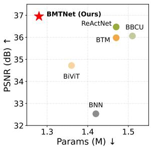

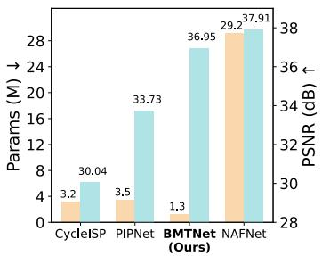

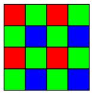  
Bayer

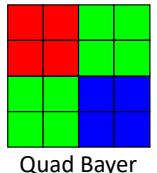

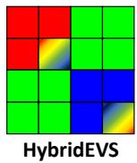  
Figure 1. Up-left: PSNR and parameters comparisons of our BMT-Net and other BNNs on MIPI dataset. Up-right: PSNR and Parameters comparisons of our BMTNet and other FP methods on MIPI dataset. Down: CFA comparisons between Bayer, Quad Bayer, and Quad Bayer HybridEVS. Event pixel appears as a mixed color.

Recently, with the development of mobile imaging, artificial intelligence image signal processors (AI-ISPs) have become crucial for enhancing imaging quality on mobile devices. Specifically, for the critically demosaicing process, deep learning methods provide a strong fitting ability to reconstruct full RGB images from degraded mosaic images, significantly improving restoration result and overcoming artifacts and aliasing issues on Quad Bayer CFA sensors [1, 65]. Although existing methods have demonstrated the effectiveness of deep learning in demosaicing, their deployment on edge devices remains challenging due to the high computational cost. Moreover, recent studies have shown that global information, such as long-range dependencies and global context [50, 64] plays a key role in enhancing image restoration tasks. These tasks are typically based on Transformer architectures, which can effectively capture global dependencies. However, these methods suffer from high complexity and insufficient emphasis on global visual priors, making it challenging for demosaicing approaches to achieve high performance with limited resources.

To address this issue, various model compression methods have been proposed, such as 8-bit and 4-bit quantization [3, 4]. Among these, binary neural networks (BNNs) represent the most extreme approach, compressing the model to only positive and negative values, which marks the upper limit of model compression [5, 18, 40]. These highly compressed methods demonstrate significant potential for deploying deep learning models onto resource-constrained devices. Prior works have shown BNN’s capability in both natural language processing and vision tasks, including large language models [17, 57], image classification [18, 38, 40], and image restoration [5, 62], etc. However, the application of binary networks for the demosaicing task remains an unexplored area for further research.

To fully leverage global information with fewer resources, state space models (SSMs) [12, 42] have emerged as a fundamental architecture, competing with conventional structures like convolutional neural networks (CNNs) and Transformers. Advanced SSMs like Mamba [11] model have demonstrated significant capability in capturing long-range dependencies with lower computational costs than self-attention mechanisms. Nevertheless, deploying Mamba on resourcelimited devices is still constrained by complex projection layers. BNN offers a promising optimization to reduce complexity in less critical layers of Mamba, yet most research on binarization mainly focused on CNNs and Transformers, leaving Mamba binarization relatively blank.

In this paper, we introduce a binarized Mamba-Transformer architecture called BMTNet to tackle the aforementioned issues, as shown in Figure 2. The basic unit called the Binarized Mamba-Transformer (BMT) block combines Mamba and Transformer in a binary format with linear complexity, which is pioneering the binarization of Mamba by binarizing all projections, which effectively reduces model complexity while maintaining core functions in full precision. The advanced combination effectively leverages both long and short dependencies while significantly decreasing parameters and computation costs by 97% and 96% on Mamba blocks.

To reduce precision loss and enhance global feature extraction, we incorporate an additional binarized global visual encoder specifically designed for Quad Bayer RAW images to capture global visual information. For the visual representation, we use an embedding mechanism that combines image features with global information to generate a control matrix for the input in the Selective Scan process of our proposed Binarized Mamba (Bi-Mamba). This property can effectively enhance the perceptual ability of BMTNet by improving the control matrix of input. Our proposed BMT-Net outperforms other BNN methods and achieves results comparable to full precision methods, as shown in Figure 1, In summary, the contributions of our work are that

• We introduce a novel BNN-based hybrid BMTNet for Quad Bayer HybridEVS demosaicing. To the best of our knowledge, this is the first research to explore binary Mamba and binarized Quad Bayer demosaicing.

• We propose a hybrid binary Mamba-Transformer design that benefits from its dual-branch form and linear complexity in a binary format, efficiently capturing global and local dependencies with minimal computation.

• An advanced binary Mamba that binarizes non-critical projections while keeping the core SSM in full precision, enabling meaningful global visual information to be embedded in the attention process and significantly reducing complexity by 79% on parameters and 88% on OPs.

## 2. Related Work

Demosaicing is a crucial step in the imaging process, aiming to reconstruct RGB images from RAW data, and is typically integrated into ISPs. Traditional demosaicing methods are mainly based on interpolation [16, 22]. In recent years, Convolution Neural Networks (CNNs) have led a great improvement in Bayer demosaicing, exhibiting impressive ability to overcome the color degradation [25, 44–47]. Despite demosaicing on Bayer images having achieved great success, non-Bayer CFAs, which have more complicated color arrangements present new challenges. With the development of mobile imaging, Quad Bayer has been widely implemented on flagship smartphone cameras [56] and advanced event cameras [43], which demonstrate better imaging results on dark scenes. Still, as an emergent CFA, research on Quad Bayer is limited. Some research [19, 61] proposed two-stage strategies on remosaicing Quad Bayer to Bayer. Some GAN-based structures [1, 41] have been proposed to achieve refined detail on Quad Bayer demosaicing. However, most of them neglect constrained computation resources on ISPs, making them difficult to deploy on edge devices.

Recently, event cameras have emerged as a bio-inspired vision sensor to capture changes in the scene, showing high dynamic range, high temporal resolution, and low latency [9, 10, 43]. Some methods [36, 63] demonstrate advanced applications of event cameras. Pioneering methods [34] explore demosaicing for neuromorphic event sensors with real data. Nevertheless, research on the recently proposed Quad Bayer Hybrid Event Vision Sensor (HybridEVS) is still limited [21]. MIPI workshop [51] proposed some advanced methods for demosaicing. Some advanced methods [32, 55, 58] are proposed to solve the cutting-edge problem. However, the substantial computational demands make these methods challenging to deploy on resource-constrained ISPs. The need for the exploration of lightweight demosaicing methods remains essential.

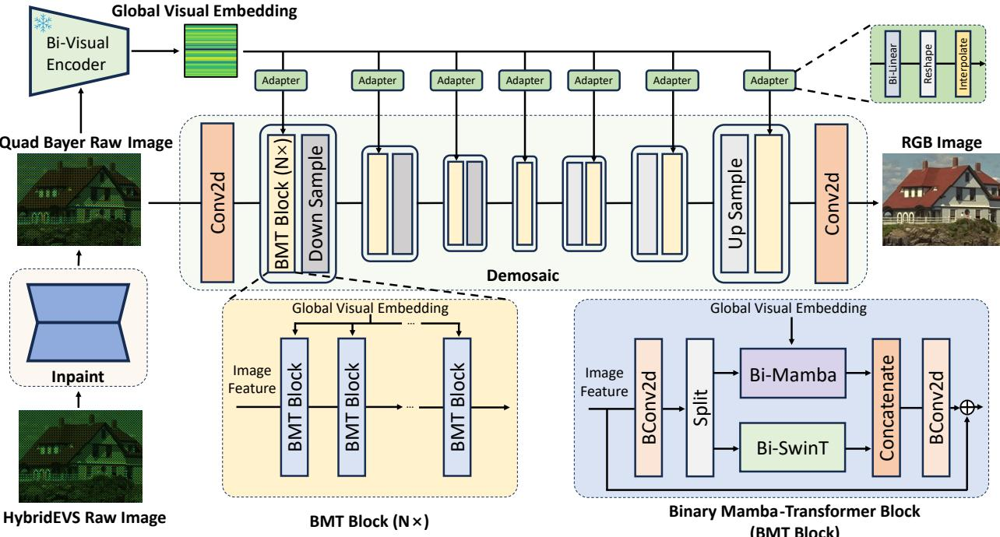  
Figure 2. Overall architecture of BMTNet. A binary convolution-based simple subnetwork is initially employed for event pixel inpainting. The main branch incorporates our hybrid binary Mamba-Transformer Block, which pioneeringly integrates Bi-Mamba with Bi-Swin Transformer to capture both global and local features. An additional global visual branch is used to enhance global dependencies, with Bi-Mamba specifically handling the fusion of global features.

State space models (SSMs) have developed to be a powerful competitor to CNNs and Transformers that capture global information with linear complexity. Prior models [12, 42] introduce efficient parallel scanning to improve the effectiveness and speed of SSMs. The emergence of Mamba [11] features a data-independent SSM layer that demonstrated impressive performance with linear complexity. Prior works have utilized Mamba on multiple computer vision tasks [14, 23, 48, 66] as well as image restoration [13, 53]. The linear scalability of complexity and strong modeling ability for long-dependencies demonstrate extraordinary potential for visual tasks, with emerging OEM prototypes exploring Mamba’s edge deployment.

Binary neural network (BNN) is an extreme compression technology that quantizes the network’s weights and activation values on a 1-bit form, which can bring a significant reduction in computation loads. Early works [8, 18, 27, 38] introduced binarized CNNs, utilizing the sign function to binarize weights and activations. To mitigate the loss of precision due to binarization, Rastegari et al. [40] adapted scaling factors for weights and activations. For BNNs in image restoration tasks, Xia et al. [52] determined some essential components of BNN in image restoration. Some advanced research [5, 62] employed BNNs for downstream restoration tasks. However, the binarized network for the demosaicing task still needs to be explored. Furthermore, besides binarization of CNNs, binarized Transformers are also explored [30, 39], He et al. [15] expanded binarization into vision Transformers. Still, asfor the recently proposed Mamba network, no work has yet explored its binarization.

## 3. Methods

In this section, we first formulate the Quad Bayer HybridEVS demosaicing problem and outline the overall architecture of our network. We then provide a detailed explanation of the proposed binarized visual encoder and binarized Mamba-Transformer block.

## 3.1. Network Architecture

Demosaicing for Quad Bayer HybridEVS cameras is a cutting-edge challenge, particularly for real-world event camera applications. Unlike standard demosaicing tasks, the unique design of HybridEVS introduces the Quad Bayer CFA and the event pixel. The Quad Bayer CFA increases color distortion due to larger gaps between identical colors, while the event pixel leads to additional color loss, making demosaicing especially challenging. The task is to reconstruct the RGB image $\mathbf { I } _ { \mathbf { R } } \in \mathbb { R } ^ { \mathbf { \breve { H } } \times \mathbf { \breve { W } } \times 3 }$ from the Quad Bayer RAW image $\mathbf { I } _ { \mathbf { Q } } \in \mathbb { R } ^ { H \times W \times 1 }$ . Additionally, HybridEVS RAW images experience color loss at event position $\mathbf { L } \in \mathbb { R } ^ { H \times W \times 1 }$ . The relationship between these factors can be expressed as:

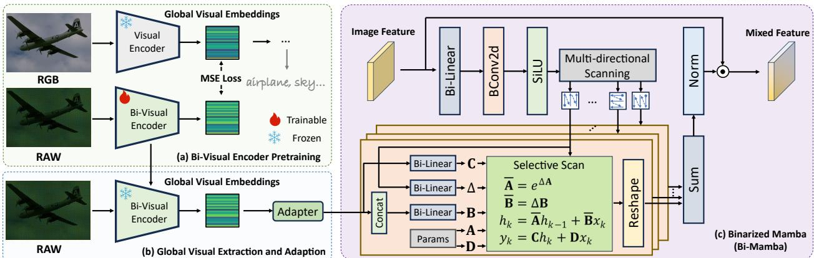  
Figure 3. Model details of the bi-visual encoder and Bi-Mamba. (a) We first adopted a pretrained large visual encoder from RAM [64] to pretrain our binarized visual encoder fit for Quad Bayer RAW input. (b) During the training of BMTNet, the binarized visual encoder is frozen and produces global visual embeddings to Bi-Mamba after an adapter. (c) In the binarized Mamba, we binarize all projections while keeping the core selective scan calculation in full precision, effectively reducing computational load while maintaining performance. To further enhance the global capacity, we introduce extra global information into the control matrix B of input.

$$
\mathbf { I } _ { \mathbf { Q } } = \mathcal { M } ( \mathbf { I } _ { \mathbf { R } } ) + \mathbf { L } ,\tag{1}
$$

where M indicates Quad Bayer mosaic process. To address these challenges, we introduce the binarized hybrid Mamba-Transformer network (BMTNet), as shown in Figure 2. Our approach starts with a subnetwork $\mathcal { N } _ { 1 }$ based on BBCU [52] to coarsely inpaint color loss. Then, the binarized Mamba-Transformer network $\mathcal { N } _ { 2 }$ solves the demosaicing task. Additionally, we incorporate an encoder branch to leverage additional global visual information from Quad Bayer images. The entire process can be formulated as:

$$
\mathbf { I } _ { \mathbf { R } } = \mathcal { N } _ { 2 } ( \mathcal { N } _ { 1 } ( \mathbf { I } _ { \mathbf { Q } } ) ) .\tag{2}
$$

Next, we present the binarized visual encoder and details of the hybrid binarized Mamba-Transformer block.

## 3.2. Binarized Visual Encoder

Recent research shows that global visual information supplies extra global information, improving the accuracy of image restoration, especially in finer details [50]. To strengthen Mamba’s global capacity, we incorporated a global visual encoder tailored for Quad Bayer RAW images in a binary format, as shown in Figure 2, which offers implicit visual encoding with little computational load. This encoder starts with a pretraining phase (see Figure 3 (a)), where a frozen large visual encoder (from RAM [64]) serves as a teacher to train a compact visual encoder. This enables a direct fusion of global visual information into the main branch in vector form.

During main branch training and inference, the binarized visual encoder remains frozen to preserve its capacity for global visual extraction (see Figure 3 (b)). The visual embeddings are then fed into each layer’s Bi-Mamba module through a single-layer Bi-Linear adapter, as shown in Figure 2. This adapter is essential for adapting the visual embeddings across layers with different levels of information. Overall, the additional visual encoder ensures global consistency throughout the encoding and decoding process, providing a distinct prior and preserving global structural information throughout these stages.

## 3.3. Binarized Mamba-Transformer

Mamba is an efficient mechanism for capturing long-range dependencies with linear complexity, but the numerous projection layers still make it challenging to deploy on resourceconstrained mobile devices. The Swin Transformer has demonstrated strong capabilities in extracting local features but is also limited by high computational demands. To leverage the strengths of both architectures while expanding the applicability of BNN, we introduce a binarized Mamba-Transformer block (BMT block), as shown in Figure 2. The BMT block employs a two-branch design combining the binarized Mamba (Bi-Mamba) and binarized Swin Transformer (Bi-SwinT) to capture global and local dependencies in parallel. Additionally, it benefits from a reduced channel number in each sub-block, lowering the computation load and resulting in a more lightweight model.

Specifically, the Bi-Mamba fully binarizes non-critical projections while using full precise computations for the core selective scan (SS) function, along with an extra global visual embedding on the control matrix of input, the illustration of Bi-Mamba is shown in Figure 3 (c). This approach minimizes model complexity while maintaining high performance with precise core computations. The quantization in Mamba mainly focuses on linear and convolution projections. In our approach, full precision linear weights $\mathbf { W } ^ { f } \in \mathbb { R } ^ { C _ { i n } \times C _ { o u t } }$ are binarized using the Sign function and activation $\mathbf { A } ^ { f } \in \mathbb { R } ^ { H \times W \times C _ { i n } }$ are binarized using RSign function [28], resulting in values of {+1, -1}, which can be expressed as:

$$
\mathbf { W } ^ { b } = \mathrm { S i g n } \left( \mathbf { W } ^ { f } \right) = \left\{ \begin{array} { l l } { + 1 , } & { \mathbf { W } ^ { f } > 0 } \\ { - 1 , } & { \mathbf { W } ^ { f } \leq 0 } \end{array} . \right.\tag{3}
$$

$$
\mathbf { A } ^ { b } = \operatorname { R S i g n } \left( \mathbf { A } ^ { f } \right) = { \left\{ \begin{array} { l l } { + 1 , } & { \mathbf { A } ^ { f } > \alpha } \\ { - 1 , } & { \mathbf { A } ^ { f } \leq \alpha } \end{array} \right. } ,\tag{4}
$$

where $\alpha \in \mathbb { R } ^ { C _ { i n } }$ represents learnable parameters. To mitigate precision loss due to binarization, we apply additional learnable scaling factors $\mathbf { S } \in \mathbb { R } ^ { C _ { o u t } }$ [15]. The whole Bi-Linear process can be expressed as:

$$
\begin{array} { r l } & { \mathrm { B i } \mathrm { - } \mathrm { L i n e a r } ( A ^ { f } ) = \mathbf { W } ^ { b } * \mathbf { A } ^ { b } * \mathbf { S } } \\ & { \qquad = \mathrm { b i t c o u n t } ( \mathbf { X } \mathbf { N } \mathbf { O } \mathbf { R } ( \mathbf { W } ^ { b } , \mathbf { A } ^ { b } ) ) * \mathbf { S } . } \end{array}\tag{5}
$$

The Binarized convolution (BConv2d) applies similar binarization on weights and activations but sets S as the average of Wf. Specific to Bi-Mamba, given a full-precision input $\mathbf { X } ^ { f } \in \bar { \mathbb { R } ^ { H \times W \times C _ { i n } } }$ , it is first projected into feature $\mathbf { X } ^ { \prime } \in \mathbb { R } ^ { H \times W \times d }$ , where d is the hidden dimension, which can be expressed as:

$$
\mathbf { X } ^ { \prime } = \operatorname { S i L U } ( \operatorname { B C o n v 2 d } ( \operatorname { B i - L i n e a r } ( \mathbf { X } ^ { f } ) ) ) .\tag{6}
$$

Features are then transformed into a one-dimensional format using multiple scan orders [26], which can be expressed as:

$$
{ \bf X } _ { 1 } , { \bf X } _ { 2 } , \ldots , { \bf X } _ { n } = \mathrm { S } _ { 1 } ( { \bf X } ^ { \prime } ) , \mathrm { S } _ { 2 } ( { \bf X } ^ { \prime } ) , \ldots , \mathrm { S } _ { \mathrm { n } } ( { \bf X } ^ { \prime } ) ,\tag{7}
$$

where S denotes the scan operation and n is the total number of scan types. For each $\mathbf { X } _ { i } \in \mathbb { R } ^ { L \times d } , i \in \{ 1 , 2 , \dots , n \}$ $L = H * W$ , we extract SSM parameters $\mathbf { B } _ { i } \in \mathbb { R } ^ { L \times m }$ $\mathbf { C } _ { i } \in \mathbb { R } ^ { L \times m }$ and $\pmb { \Delta } _ { i } \in \mathbb { R } ^ { L \times d }$ . Unlike previous Mamba methods that derive all parameters solely from the input $\mathbf { X } _ { i } .$ we enhance the control matrix by concatenating the additional global visual vector $\mathbf { S } \in \mathbb { R } ^ { L \times 1 }$ from the bi-visual encoder. The projection of SSM parameters is thus represented as:

$$
\begin{array} { r l } & { \mathbf { C } _ { i } = \mathrm { B i - L i n e a r } ( \mathbf { X } _ { i } ) , } \\ & { \mathbf { \Delta } \Delta _ { i } = \mathrm { B i - L i n e a r } ( \mathbf { X } _ { i } ) , } \\ & { \mathbf { B } _ { i } = \mathrm { B i - L i n e a r } ( \mathrm { C o n c a t } ( \mathbf { X } _ { i } , \mathbf { S } ) ) . } \end{array}\tag{8}
$$

With the learnable parameters $\mathbf { A } _ { i } \in \mathbb { R } ^ { d \times m }$ and $\mathbf { D } _ { i } \in \mathbb { R } ^ { d } .$ the Selective Scan (SS) process in full precise can be expressed as:

$$
\begin{array} { r l } & { \overline { { \mathbf { B } } } _ { i } = \mathbf { B } _ { i } ^ { \top } \otimes \mathbf { { A } } _ { i } , } \\ & { \overline { { \mathbf { A } } } _ { i } = \exp ( \mathbf { { A } } _ { i } \otimes \mathbf { { A } } _ { i } ) , } \\ & { \mathbf { { O } } _ { i } = \mathrm { R e s h a p e } ( \operatorname { S S M } ( \overline { { \mathbf { A } } } _ { i } , \overline { { \mathbf { B } } } _ { i } , \mathbf { C } _ { i } , \mathbf { D } _ { i } , \mathbf { X } _ { i } ) ) . } \end{array}\tag{9}
$$

This SSM [11] function computes the most critical longrange attention dependencies. Retaining it in full precision enables our Bi-Mamba to achieve results comparable to full-precision Mamba with minimal computation cost. The global visual embedding in the control matrix B directly enriches the input X with extra global visual features, contributing to the recursive SS process in an additive manner. This approach preserves the original formula while effectively enhancing performance without significant disruption. The final output is computed by summing the SS results and performing a Hadamard product with the output from another Bi-Linear branch, which can be expressed as:

$$
\mathbf { X } ^ { o u t } = \operatorname { L N } ( \sum _ { i = 1 } ^ { n } \mathbf { O } _ { i } ) * \operatorname { S i L U } ( \operatorname { B i - L i n e a r } ( \mathbf { X } ^ { f } ) ) ,\tag{10}
$$

where LN represents layer normalization. Bi-Mamba reduces parameters by binarizing non-essential projections like linear and convolution while maintaining high performance through full-precision selective scanning and globa visual embedding. This approach offers a practical way to enhance Mamba and significantly compress the model into a binary format, making it well-suited for demosaicing on resource-limited edge devices.

To further enhance local representation, we introduce the binarized Swin Transformer (Bi-SwinT) block. The Bi-SwinT block employs a binary format [15] of the Swin Transformer [29], facilitating information exchange and improving local detail extraction. In summary, the integration of the binarized Mamba-Transformer block pioneeringly simplifies the Mamba architecture while effectively capturing both global and local dependencies with minimal computational loads, which significantly broadens the application of BNNs in vision Transformers and Mamba.

## 4. Experiments

In this section, we first specify the implementation details. Then, we evaluate our BMTNet across eight diverse datasets, including both single images and video sequences, demonstrating a comparison with full precision and BNN methods. Finally, we perform an ablation study to analyze our methods. Additional analysis of extended visual results is provided in the supplementary material.

## 4.1. Experimental Settings

Datasets. The dataset used in our experiments comprises both simulated and real data. The simulated data includes ground truth, which can be utilized for training and quantitative analysis, while the real data lacks definitive values and is employed for qualitative analysis. We train all models using the MIPI dataset from the CVPR Mobile Intelligent Photography & Imaging Workshop 2024. This dataset includes 800 training pairs and 26 test pairs of RAW and RGB obtain a reference image for comparison.

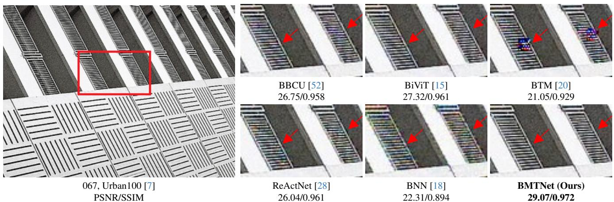  
Figure 4. Visualization on the Urban100 dataset across all compared BNN methods. The proposed BMTNet achieves the best visual quality, effectively reducing artifacts and color aliasing.

<table><tr><td rowspan="2">Methods</td><td rowspan="2">Params (M)</td><td rowspan="2">OPs (G)</td><td rowspan="2">MIPI</td><td rowspan="2">Kodak</td><td rowspan="2">McM</td><td rowspan="2">BSD100</td><td rowspan="2">Urban100</td><td rowspan="2">Wed</td><td rowspan="2">Average</td></tr><tr><td></td></tr><tr><td>DFormer [54]</td><td>30.28</td><td>491.1</td><td>39.35/0.981</td><td>39.32/0.982</td><td>37.88/0.963</td><td>37.65/0.982</td><td>37.64/0.980</td><td>34.86/0.968</td><td>38.15/0.978</td></tr><tr><td>NAFNet [6]</td><td>29.16</td><td>32.19</td><td>37.91/0.980</td><td>38.60/0.984</td><td>36.18/0.961</td><td>37.12/0.985</td><td>35.63/0.978</td><td>35.24/0.972</td><td>37.16/0.978</td></tr><tr><td>Restormer [60]</td><td>26.11</td><td>282.2</td><td>38.46/0.984</td><td>39.16/0.986</td><td>36.54/0.967</td><td>37.11/0.985</td><td>36.36/0.977</td><td>35.00/0.971</td><td>37.45/0.980</td></tr><tr><td>SAGAN [41]</td><td>22.56</td><td>341.6</td><td>34.25/0.959</td><td>36.14/0.974</td><td>32.58/0.939</td><td>30.53/0.931</td><td>29.89/0.946</td><td>28.22/0.917</td><td>32.74/0.952</td></tr><tr><td>PIPNet [1]</td><td>3.46</td><td>68.8</td><td>33.73/0.950</td><td>32.20/0.960</td><td>31.34/0.928</td><td>31.97/0.950</td><td>28.92/0.942</td><td>29.19/0.929</td><td>31.97/0.951</td></tr><tr><td>CycleISP [59]</td><td>3.23</td><td>104.9</td><td>30.04/0.934</td><td>33.09/0.970</td><td>30.37/0.919</td><td>32.18/0.969</td><td>29.78/0.942</td><td>30.22/0.944</td><td>31.14/0.952</td></tr><tr><td>BNN [18]</td><td>1.42</td><td>6.45</td><td>32.53/0.930</td><td>33.83/0.955</td><td>28.59/0.889</td><td>31.43/0.953</td><td>29.56/0.935</td><td>29.32/0.926</td><td>31.07/0.926</td></tr><tr><td>ReActNet [28]</td><td>1.47</td><td>6.12</td><td>36.47/0.971</td><td>37.25/0.978</td><td>34.55/0.946</td><td>35.25/0.978</td><td>33.86/0.970</td><td>33.53/0.962</td><td>35.08/0.970</td></tr><tr><td>BBCU [52]</td><td>1.51</td><td>6.97</td><td>36.06/0.970</td><td>37.03/0.978</td><td>33.74/0.941</td><td>34.30/0.977</td><td>33.27/0.967</td><td>32.63/0.959</td><td>34.85/0.967</td></tr><tr><td>BTM [20]</td><td>1.47</td><td>6.12</td><td>35.98/0.972</td><td>37.39/0.979</td><td>32.99/0.947</td><td>35.41/0.979</td><td>33.69/0.971</td><td>32.76/0.962</td><td>34.59/0.972</td></tr><tr><td>BiViT [15]</td><td>1.36</td><td>6.51</td><td>34.72/0.963</td><td>36.55/0.975</td><td>30.44/0.932</td><td>33.48/0.974</td><td>32.79/0.965</td><td>30.40/0.952</td><td>33.33/0.963</td></tr><tr><td>BMTNet (Ours)</td><td>1.28</td><td>6.56</td><td>36.95/0.975</td><td>37.69/0.980</td><td>34.79/0.950</td><td>36.11/0.981</td><td>34.45/0.973</td><td>33.95/0.965</td><td>35.52/0.975</td></tr></table>

Table 1. Quantitative evaluation of our BMTNet compared to full-precision and other BNN methods across six image datasets, using PSNR (dB) / SSIM as evaluation metrics for visual quality. The blue background indicates full-precise methods, while the green background means binary neural networks. BMTNet outperforms other BNNs while achieving results comparable to full-precision models at a minimal computational cost.

images, containing synthesized Gaussian noise and defect pixels [51]. To broaden the test scenes in different conditions, we simulate the HybridEVS test cases on additional seven datasets, including image datasets: Kodak [31], McM [49], BSD100 [35], Urban100 [7], Wed [33], and video datasets: REDS [37], Vid4 [24]. These datasets cover a wide range of daily life scenes. The real-world data was collected using a hybrid-vision sensor (HVS) developed in collaboration with Alpsentek [2], which is based on the ALPIX-Eiger chip, with a resolution of $2 4 4 8 \times 3 2 4 6$ . Additionally, we collected scenes in both indoor and outdoor environments. For the demosaicing task, we specifically captured a 2000-line resolution chart to evaluate the resolution performance of different methods. To focus the evaluation on demosaicing, we employed long exposure to minimize the noise in the RAW images and applied white balance after processing the results to prevent color deviation. Furthermore, we used MATLAB to perform a basic ISP on the RAW images to

Implementation Details. During training, we randomly crop images into $1 2 8 \times 1 2 8$ patches with batch $\mathrm { s i z e } = 3 2$ The Adam optimizer with L1 loss is employed, with a learning rate from $2 \times 1 0 ^ { - 4 } \mathrm { ~ t o ~ } 1 \times 1 0 ^ { - 7 }$ in a cosine annealing scheme. Total iterations are set $\mathrm { ~ t o ~ 1 ~ } \times \mathrm { ~ 1 0 ~ } ^ { 6 }$ . For BMTNet and other compared BNNs, we apply a pretraining step to utilize the two-stage structure. To preserve performance, upsampling and downsampling operations remain in FP.

Computation Load Calculation of BNNs. Following the prior works on BNN [18, 27, 52], binarized operations $( \mathrm { \bar { B O P s } } ^ { b } )$ is computed as $\mathrm { B O P s } ^ { b } = \mathrm { B O P s } ^ { f } / 6 4$ , with total operations calculated by $\mathrm { O P s } = \mathrm { B O P s } ^ { b } + \mathrm { \bar { O } P s } ^ { f }$ , where $\mathrm { O P s } ^ { \hat { \boldsymbol { f } } }$ means floating-point operations. The binarized parameters are calculated as $\mathrm { B P a r m s } ^ { b } = \mathrm { B P a r m s } ^ { f } / 3 2$ , and total parameters are computed as $\mathrm { P a r m s } = \mathrm { B P a r m s } ^ { \prime } + \mathrm { P a r m s } ^ { f }$ where Parmsf indicates the number of float-point param-

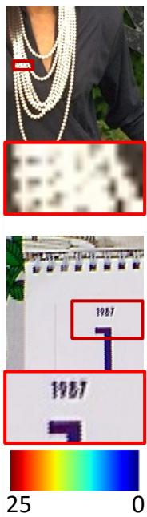  
(a) Reference

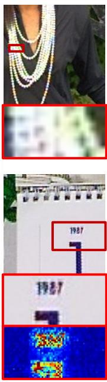  
(b) BNN [18]

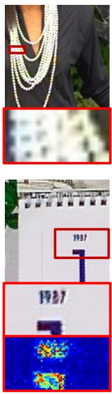  
(c) BBCU [52]

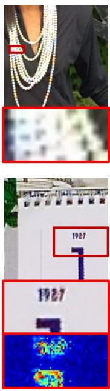  
(d) BiViT [15]

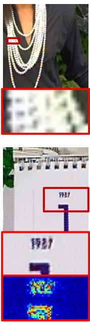  
(e) BTM [20]

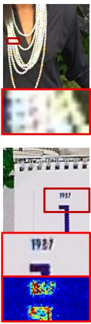  
(f) ReActNet [28]

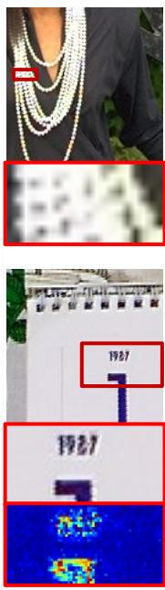  
(g) BMTNet (Ours)

Figure 5. Visualized results across all compared BNN methods on the Kodak (up) and Vid4 (down) datasets, with a corresponding heatmap showing the pixel value differences. The proposed BMTNet exhibits less color aliasing than other BNN methods.  
eters. All computational load tests are conducted on a 256×256 image.
<table><tr><td rowspan=1 colspan=1>Methods</td><td rowspan=1 colspan=3>REDS       Vid4</td><td rowspan=1 colspan=1>Avearge</td></tr><tr><td rowspan=3 colspan=1>DFormer [54]NAFNet [6]Restormer [60]SAGAN [41]PIPNet [1]CycleISP [59]</td><td rowspan=2 colspan=3>42.45/0.99136.01/0.97941.65/0.98934.98/0.97441.91/0.99035.08/0.981</td><td rowspan=3 colspan=1>39.23/0.98538.31/0.98238.50/0.98535.15/0.97434.20/0.97331.71/0.965</td></tr><tr><td rowspan=1 colspan=1>91/0.990 35.08/0.</td></tr><tr><td rowspan=1 colspan=3>38.13/0.98432.16/0.96336.19/0.98132.20/0.96432.96/0.97530.46/0.964</td></tr><tr><td rowspan=1 colspan=1>BNN[18]ReActNet [28]BBCU [52]BTM [20]BiViT [15]</td><td rowspan=1 colspan=3>36.55/0.97831.23/0.95740.28/0.99133.90/0.97540.47/0.99233.79/0.97440.30/0.99233.35/0.97539.96/0.99033.59/0.972</td><td rowspan=1 colspan=1>33.89/0.96737.09/0.98337.13/0.98336.83/0.98336.78/0.981</td></tr><tr><td rowspan=1 colspan=1>BMTNet (Ours)</td><td rowspan=1 colspan=3>41.15/0.993 34.24/0.976</td><td rowspan=1 colspan=1>37.70/0.985</td></tr></table>

Table 2. Quantitative evaluation on two video datasets, using PSNR (dB) / SSIM as evaluation metrics. BMTNet outperforms all other BNNs by over 0.6dB in PSNR, surpasses several full-precision networks, and approaches state-of-the-art FP methods.

## 4.2. Comparison to State-of-the-Arts

Quantitative Comparison. We compared our BMTNet with other binarization methods by replacing BMT block to the corresponding BNN block, including BNN [18], Re-ActNet [28], BBCU [52], BTM [20] and BiViT [15]. Additionally, we compare our BMTNet with State-of-the-Arts image restoration and demosaicing networks, including DFormer [54], NAFNet [6], Restormer [60], SAGAN [41], CycleISP [59], PIPNet [1]. We evaluated the performance and computational load of the models across six image datasets and two video datasets, as illustrated in Table 1 and Table 2. The upper section reports the performance of full precision models, while the lower section demonstrates the results of BNNs. Notably, some full-precision methods perform unsatisfied results due to the color loss caused by event pixels. In contrast, our BMTNet demonstrates robust performance with significant reductions in parameters and operations. Furthermore, our proposed binary Mamba-Transformer block outperformed other BNN methods on all image and video datasets, achieving superior results with the least parameters of 1.28M and a slight increase of operators of 0.44G compared with the minimized model BTM due to the full-precise Selective Scan. The results validate that our method effectively enhances information extraction across both local and global dimensions.

Visual Comparison. Visual comparisons are presented in Figures 4, 5, and 6, showing results on image data, video data, and real HybridEVS images. Our BMTNet reaches superior visual performance, which effectively reduces color aliasing and moiré artifacts in the test datasets compared to other approaches. Our BMTNet also demonstrates the best visual results on real-world HybridEVS data, effectively reducing artifacts when facing dense lines on images.

## 4.3. Ablation Study

We demonstrate an ablation study on the proposed binarized Mamba block to validate its effectiveness, as shown in Table 3 and Table 4, separately conducting the influence of binarization and global visual embeddings.

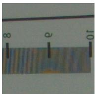  
(a) Reference

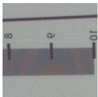  
(b) BNN [18]

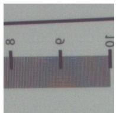  
(c) BBCU [52]

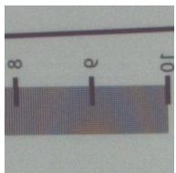  
(d) BiViT [15]

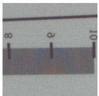  
(e) BTM [20]

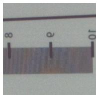  
(f) ReActNet [28]

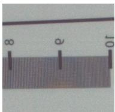  
(g) BMTNet (Ours)

Figure 6. Visualized comparison on real data of HybridEVS. Reference is acquired from the classic demosaic method. Our BMTNet reduces moiré artifacts on dense lines and achieves the best result among BNNs.  
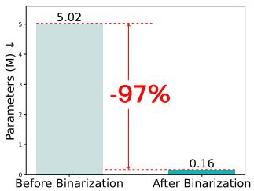

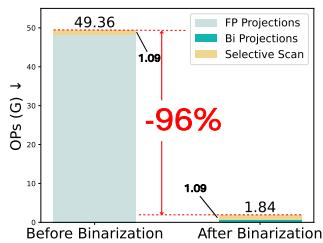  
Figure 7. Left: Parameters reduction of our Bi-Mamba. Right: Operations reduction of our Bi-Mamba.

Binarization of Mamba As shown in Table 3, our proposed Bi-Mamba achieves a significant PSNR improvement of 1.78dB, attributed to the enhancement of long-range dependencies. This highlights the effectiveness of our hybrid structure in capturing both global and local information. We replace Bi-Mamba with a full-precision Mamba block to evaluate the impact of binarization. Bi-Mamba achieves a 79% reduction in parameters and an 88% reduction in total computation costs, with a reasonable performance drop of 0.79dB in PSNR. Specific to the Mamba blocks, as shown in Figure 7, Bi-Mamba significantly compresses the projections, including linear and convolution layers, reducing parameters and computation costs by 96% and 97%.

Global Visual Embeddings To further explore the global visual embeddings, we analyze the effects of embedding positions across different control matrices, as shown in Table 4. Our proposed global visual embedding method on B improves PSNR by 0.05dB and SSIM by 0.001, demonstrating that appropriately integrated extra global information can enhance performance. However, applying global visual embeddings to all control matrices or the ∆ matrix results in a slight performance decline. As shown in Formula 9, $\Delta$ controls both B and A, meaning the latent vector $h _ { k }$ is affected in a cumulative product form by global visual information, which reduces its impact and causes $h _ { k }$ to become unstable. In contrast, embedding the global visual vector with B directly influences the input and impacts the latent vector through cumulative summation, preserving usable information more effectively. Otherwise, embedding into C avoids cumulative product but has a limited impact on $h _ { k } .$ yielding only a 0.01dB improvement in PSNR.

<table><tr><td>Modules</td><td colspan="3">Params (M) OPs (G) PSNR/SSIM</td></tr><tr><td>w/o Mamba</td><td>1.25</td><td>5.32</td><td>35.17/0.964</td></tr><tr><td>FP Mamba</td><td>6.15</td><td>54.07</td><td>37.73/0.971</td></tr><tr><td>Bi-Mamba (Ours)</td><td>1.28</td><td>6.56</td><td>36.95/0.975</td></tr></table>

Table 3. Ablation study on the Bi-Mamba block. Bi-Mamba is crucial for maintaining performance, while it significantly reduces both parameters and operations with reasonable performance loss compared with the full precision version.
<table><tr><td>SE Position</td><td>None</td><td>All</td><td>C</td><td>Δ</td><td>B (Ours)</td></tr><tr><td>PSNR</td><td>36.90</td><td>36.89</td><td>36.91</td><td>36.83</td><td>36.95</td></tr><tr><td>SSIM</td><td>0.974</td><td>0.975</td><td>0.974</td><td>0.974</td><td>0.975</td></tr></table>

Table 4. Ablation study on the position of global visual embeddings. Embedding into the control matrix B enhances global capacity while maintaining a stable influence on the latent vector $h _ { k }$

## 5. Conclusion

In this paper, we presented a lightweight binarized Mamba-Transformer network (BMTNet) for Quad Bayer HybridEVS demosaicing. First, we presented a binarized global visual encoding branch to acquire additional global information, which effectively enhances Mamba’s global capacity. Second, we introduced a binarized Mamba-Transformer structure to reduce the model complexity. The pioneering binarization of Mamba and the fusion of extra global visual embeddings reduce computational complexity by compressing non-essential projections while enhancing performance through precise integration. Experiments conducted on eight diverse datasets demonstrate that our BMTNet outperforms other BNN methods while achieving results comparable to full-precision models at a minimal computational cost. Our approach expands the capabilities of BNNs and offers an efficient and high-performing demosaicing solution for resource-constrained HybridEVS.

Acknowledgments: This work was supported by the National Natural Science Foundation of China (grant No. 62350710797), the Key Program of Technology Research from Shenzhen Science and Technology Innovation Committee under Grant JSGG20220831104402004.

## References

[1] SM A Sharif, Rizwan Ali Naqvi, and Mithun Biswas. Beyond joint demosaicking and denoising: An image processing pipeline for a pixel-bin image sensor. In Proceedings of the IEEE/CVF Conference on Computer Vision and Pattern Recognition, pages 233–242, 2021. 1, 2, 6, 7

[2] Alpsentek. Alpix-eiger product overview: https:// alpsentek.com/product, 2024. URL https:// alpsentek.com/product. Accessed: 2024-05-19. 6

[3] Ron Banner, Itay Hubara, Elad Hoffer, and Daniel Soudry. Scalable methods for 8-bit training of neural networks. In Proceedings of the Advances in Neural Information Processing Systems, 2018. 2

[4] Ron Banner, Yury Nahshan, and Daniel Soudry. Post training 4-bit quantization of convolutional networks for rapiddeployment. In Proceedings ofthe Advances in Neural Information Processing Systems, 2019. 2

[5] Yuanhao Cai, Yuxin Zheng, Jing Lin, Xin Yuan, Yulun Zhang, and Haoqian Wang. Binarized spectral compressive imaging. In Proceedings ofthe Advances in Neural Information Processing Systems, 2024. 2, 3

[6] Liangyu Chen, Xiaojie Chu, Xiangyu Zhang, and Jian Sun. Simple baselines for image restoration. In Proceedings of the European Conference on Computer Vision, pages 17–33. Springer, 2022. 6, 7

[7] Marius Cordts, Mohamed Omran, Sebastian Ramos, Timo Rehfeld, Markus Enzweiler, Rodrigo Benenson, Uwe Franke, Stefan Roth, and Bernt Schiele. The cityscapes dataset for semantic urban scene understanding. In Proceedings ofthe IEEE Conference on Computer Vision and Pattern Recognition, 2016. 6

[8] Matthieu Courbariaux, Yoshua Bengio, and Jean-Pierre David. Binaryconnect: Training deep neural networks with binary weights during propagations. In Proceedings of the Advances in Neural Information Processing Systems, 2015. 3

[9] Yanchen Dong, Ruiqin Xiong, Jing Zhao, Jian Zhang, Xiaopeng Fan, Shuyuan Zhu, and Tiejun Huang. Joint demosaicing and denoising for spike camera. In Proceedings ofthe AAAI Conference on Artificial Intelligence, pages 1582–1590, 2024. 2

[10] Guillermo Gallego, Tobi Delbrück, Garrick Orchard, Chiara Bartolozzi, Brian Taba, Andrea Censi, Stefan Leutenegger, Andrew J Davison, Jörg Conradt, Kostas Daniilidis, et al. Event-based vision: A survey. IEEE Transactions on Pattern Analysis and Machine Intelligence, 44(1):154–180, 2020. 2

[11] Albert Gu and Tri Dao. Mamba: Linear-time sequence modeling with selective state spaces. arXiv preprint arXiv:2312.00752, 2023. 2, 3, 5

[12] Albert Gu, Karan Goel, and Christopher Ré. Efficiently modeling long sequences with structured state spaces. arXiv preprint arXiv:2111.00396, 2021. 2, 3

[13] Hang Guo, Jinmin Li, Tao Dai, Zhihao Ouyang, Xudong Ren, and Shu-Tao Xia. Mambair: A simple baseline for image restoration with state-space model. arXiv preprint arXiv:2402.15648, 2024. 3

[14] Ali Hatamizadeh and Jan Kautz. Mambavision: A hy-

brid mamba-transformer vision backbone. arXiv preprint arXiv:2407.08083, 2024. 3

[15] Yefei He, Zhenyu Lou, Luoming Zhang, Jing Liu, Weijia Wu, Hong Zhou, and Bohan Zhuang. Bivit: Extremely compressed binary vision transformers. In Proceedings ofthe IEEE/CVF International Conference on Computer Vision, pages 5651– 5663, 2023. 3, 5, 6, 7, 8

[16] Keigo Hirakawa and Thomas W Parks. Adaptive homogeneity-directed demosaicing algorithm. IEEE Transactions on Image Processing, 14(3):360–369, 2005. 2

[17] Wei Huang, Yangdong Liu, Haotong Qin, Ying Li, Shiming Zhang, Xianglong Liu, Michele Magno, and Xiaojuan Qi. Billm: Pushing the limit of post-training quantization for llms. arXiv preprint arXiv:2402.04291, 2024. 2

[18] Itay Hubara, Matthieu Courbariaux, Daniel Soudry, Ran El-Yaniv, and Yoshua Bengio. Binarized neural networks. In Proceedings ofthe Advances in Neural Information Processing Systems, 2016. 2, 3, 6, 7, 8

[19] Jun Jia, Hanchi Sun, Xiaohong Liu, Longan Xiao, Qihang Xu, and Guangtao Zhai. Learning rich information for quad bayer remosaicing and denoising. In Proceedings of the European Conference on Computer Vision, pages 175–191. Springer, 2022. 2

[20] Xinrui Jiang, Nannan Wang, Jingwei Xin, Keyu Li, Xi Yang, and Xinbo Gao. Training binary neural network without batch normalization for image super-resolution. In Proceedings of the AAAI Conference on Artificial Intelligence, pages 1700– 1707, 2021. 6, 7, 8

[21] Kazutoshi Kodama, Yusuke Sato, Yuhi Yorikado, Raphael Berner, Kyoji Mizoguchi, Takahiro Miyazaki, Masahiro Tsukamoto, Yoshihisa Matoba, Hirotaka Shinozaki, Atsumi Niwa, et al. 1.22 µm 35.6 mpixel rgb hybrid event-based vision sensor with 4.88 µm-pitch event pixels and up to 10k event frame rate by adaptive control on event sparsity. In 2023 IEEE International Solid-State Circuits Conference (ISSCC), pages 92–94. IEEE, 2023. 1, 2

[22] Xin Li, Bahadir Gunturk, and Lei Zhang. Image demosaicing: A systematic survey. Visual Communications and Image Processing, 6822:489–503, 2008. 2

[23] Weibin Liao, Yinghao Zhu, Xinyuan Wang, Cehngwei Pan, Yasha Wang, and Liantao Ma. Lightm-unet: Mamba assists in lightweight unet for medical image segmentation. arXiv preprint arXiv:2403.05246, 2024. 3

[24] Ce Liu and Deqing Sun. A bayesian approach to adaptive video super resolution. In Proceedings of the IEEE Conference on Computer Vision and Pattern Recognition, pages 209–216. IEEE, 2011. 6

[25] Lin Liu, Xu Jia, Jianzhuang Liu, and Qi Tian. Joint demosaicing and denoising with self guidance. In Proceedings of the IEEE/CVF Conference on Computer Vision and Pattern Recognition, pages 2240–2249, 2020. 2

[26] Yue Liu, Yunjie Tian, Yuzhong Zhao, Hongtian Yu, Lingx Xie, Yaowei Wang, Qixiang Ye, Jianbin Jiao, and Yunfan Liu. Vmamba: Visual state space model. In The Thirtyeighth Annual Conference on Neural Information Processing Systems, 2024. 5

[27] Zechun Liu, Baoyuan Wu, Wenhan Luo, Xin Yang, Wei Liu, and Kwang-Ting Cheng. Bi-real net: Enhancing the performance of 1-bit cnns with improved representational capability and advanced training algorithm. In Proceedings of the European Conference on Computer Vision, pages 722–737, 2018. 3, 6

[28] Zechun Liu, Zhiqiang Shen, Marios Savvides, and Kwang-Ting Cheng. Reactnet: Towards precise binary neural network with generalized activation functions. In Computer Vision– ECCV 2020: 16th European Conference, Glasgow, UK, August 23–28, 2020, Proceedings, Part XIV 16, pages 143–159. Springer, 2020. 5, 6, 7, 8

[29] Ze Liu, Yutong Lin, Yue Cao, Han Hu, Yixuan Wei, Zheng Zhang, Stephen Lin, and Baining Guo. Swin transformer: Hierarchical vision transformer using shifted windows. In Proceedings of the IEEE/CVF International Conference on Computer Vision, pages 10012–10022, 2021. 5

[30] Zechun Liu, Barlas Oguz, Aasish Pappu, Lin Xiao, Scott Yih, Meng Li, Raghuraman Krishnamoorthi, and Yashar Mehdad. BiT: Robustly binarized multi-distilled transformer. In Proceedings of the Advances in Neural Information Processing Systems, pages 14303–14316, 2022. 3

[31] Alexander Loui, Jiebo Luo, Shih-Fu Chang, Dan Ellis, Wei Jiang, Lyndon Kennedy, Keansub Lee, and Akira Yanagawa. Kodak’s consumer video benchmark data set: concept definition and annotation. In Proceedings of the International Workshop on Multimedia Information Retrieval, pages 245– 254, 2007. 6

[32] Yunfan Lu, Yijie Xu, Wenzong Ma, Weiyu Guo, and Hui Xiong. Event camera demosaicing via swin transformer and pixel-focus loss. In Proceedings of the IEEE/CVF Conference on Computer Vision and Pattern Recognition, pages 1095– 1105, 2024. 3

[33] Kede Ma, Zhengfang Duanmu, Qingbo Wu, Zhou Wang, Hongwei Yong, Hongliang Li, and Lei Zhang. Waterloo exploration database: New challenges for image quality assessment models. IEEE Transactions on Image Processing, 26(2):1004–1016, 2017. 6

[34] Yi Ma, Peiqi Duan, Yuchen Hong, Chu Zhou, Yu Zhang, Jimmy Ren, and Boxin Shi. Color4e: Event demosaicing for full-color event guided image deblurring. In Proceedings of the 32nd ACM International Conference on Multimedia, pages 661–670, 2024. 2

[35] D. Martin, C. Fowlkes, D. Tal, and J. Malik. A database of human segmented natural images and its application to evaluating segmentation algorithms and measuring ecological statistics. In Proceedings Eighth IEEE International Conference on Computer Vision, pages 416–423 vol.2, 2001. 6

[36] Gottfried Munda, Christian Reinbacher, and Thomas Pock. Real-time intensity-image reconstruction for event cameras using manifold regularisation. International Journal ofComputer Vision, 126(12):1381–1393, 2018. 2

[37] Seungjun Nah, Sungyong Baik, Seokil Hong, Gyeongsik Moon, Sanghyun Son, Radu Timofte, and Kyoung Mu Lee. Ntire 2019 challenge on video deblurring and superresolution: Dataset and study. In Proceedings of the IEEE/CVF Conference on Computer Vision and Pattern Recognition Workshops, pages 0–0, 2019. 6

[38] Haotong Qin, Ruihao Gong, Xianglong Liu, Mingzhu Shen, Ziran Wei, Fengwei Yu, and Jingkuan Song. Forward and backward information retention for accurate binary neural networks. In Proceedings ofthe IEEE/CVF Conference on Computer Vision and Pattern Recognition, pages 2250–2259, 2020. 2, 3

[39] Haotong Qin, Yifu Ding, Mingyuan Zhang, Qinghua Yan, Aishan Liu, Qingqing Dang, Ziwei Liu, and Xianglong Liu. Bibert: Accurate fully binarized bert. arXiv preprint arXiv:2203.06390, 2022. 3

[40] Mohammad Rastegari, Vicente Ordonez, Joseph Redmon, and Ali Farhadi. Xnor-net: Imagenet classification using binary convolutional neural networks. In Proceedings ofthe European Conference on Computer Vision, pages 525–542. Springer, 2016. 2, 3

[41] SMA Sharif, Rizwan Ali Naqvi, and Mithun Biswas. Sagan: adversarial spatial-asymmetric attention for noisy nona-bayer reconstruction. arXiv preprint arXiv:2110.08619, 2021. 2, 6, 7

[42] Jimmy TH Smith, Andrew Warrington, and Scott W Linderman. Simplified state space layers for sequence modeling. arXiv preprint arXiv:2208.04933, 2022. 2, 3

[43] B Son, Y Suh, S Kim, H Jung, JS Kim, C Shin, K Park, K Lee, J Park, J Woo, et al. A 640× 480 dynamic vision sensor with a 9 um pixel and 300 meps address-event representation. In Proceedings ofthe IEEE International Conference on Solid-State Circuits, San Francisco, CA, USA, pages 5–9, 2017. 2

[44] Nai-Sheng Syu, Yu-Sheng Chen, and Yung-Yu Chuang. Learning deep convolutional networks for demosaicing. arXiv preprint arXiv:1802.03769, 2018. 2

[45] Daniel Stanley Tan, Wei-Yang Chen, and Kai-Lung Hua. Deepdemosaicking: Adaptive image demosaicking via multiple deep fully convolutional networks. IEEE Transactions on Image Processing, 27(5):2408–2419, 2018.

[46] Hanlin Tan, Xiangrong Zeng, Shiming Lai, Yu Liu, and Maojun Zhang. Joint demosaicing and denoising of noisy bayer images with admm. In 2017 IEEE International Conference on Image Processing (ICIP), pages 2951–2955. IEEE, 2017.

[47] Runjie Tan, Kai Zhang, Wangmeng Zuo, and Lei Zhang. Color image demosaicking via deep residual learning. In Proceedings ofthe IEEE International Conference on Multimedia and Expo, page 6, 2017. 2

[48] Jue Wang, Wentao Zhu, Pichao Wang, Xiang Yu, Linda Liu, Mohamed Omar, and Raffay Hamid. Selective structured state-spaces for long-form video understanding. In Proceedings ofthe IEEE/CVF Conference on Computer Vision and Pattern Recognition, pages 6387–6397, 2023. 3

[49] Sanghyun Woo, Jongchan Park, Joon-Young Lee, and In So Kweon. Cbam: Convolutional block attention module. In Proceedings ofthe European Conference on Computer Vision, 2018. 6

[50] Rongyuan Wu, Tao Yang, Lingchen Sun, Zhengqiang Zhang, Shuai Li, and Lei Zhang. Seesr: Towards semantics-aware real-world image super-resolution. In Proceedings of the IEEE/CVF Conference on Computer Vision and Pattern Recognition, pages 25456–25467, 2024. 2, 4

[51] Yaqi Wu, Zhihao Fan, Xiaofeng Chu, Jimmy S Ren, Xiaoming Li, Zongsheng Yue, Chongyi Li, Shangcheng Zhou, Ruicheng Feng, Yuekun Dai, et al. Mipi 2024 challenge on demosaic for hybridevs camera: Methods and results. arXiv preprint arXiv:2405.04867, 2024. 1, 2, 6

[52] Bin Xia, Yulun Zhang, Yitong Wang, Yapeng Tian, Wenming Yang, Radu Timofte, and Luc Van Gool. Basic binary convolution unit for binarized image restoration network. arXiv preprint arXiv:2210.00405, 2022. 3, 4, 6, 7, 8

[53] Yi Xiao, Qiangqiang Yuan, Kui Jiang, Yuzeng Chen, Qiang Zhang, and Chia-Wen Lin. Frequency-assisted mamba for remote sensing image super-resolution. arXiv preprint arXiv:2405.04964, 2024. 3

[54] Senyan Xu, Zhijing Sun, Jiaying Zhu, Yurui Zhu, Xueyang Fu, and Zheng-Jun Zha. Demosaicformer: Coarse-to-fine demosaicing network for hybridevs camera. In Proceedings of the IEEE/CVF Conference on Computer Vision and Pattern Recognition Workshops, pages 1126–1135, 2024. 6, 7

[55] Senyan Xu, Zhijing Sun, Jiaying Zhu, Yurui Zhu, Xueyang Fu, and Zheng-Jun Zha. Demosaicformer: Coarse-to-fine demosaicing network for hybridevs camera. In Proceedings ofthe IEEE/CVF Conference on Computer Vision and Pattern Recognition, pages 1126–1135, 2024. 3

[56] Qingyu Yang, Guang Yang, Jun Jiang, Chongyi Li, Ruicheng Feng, Shangchen Zhou, Wenxiu Sun, Qingpeng Zhu, Chen Change Loy, Jinwei Gu, et al. Mipi 2022 challenge on quad-bayer re-mosaic: Dataset and report. In Proceedings of the European Conference on Computer Vision, pages 21–35. Springer, 2022. 1, 2

[57] Zhihang Yuan, Yuzhang Shang, and Zhen Dong. Pb-llm: Partially binarized large language models. In The Twelfth International Conference on Learning Representations, 2024. 2

[58] LU Yunfan, Yanlin Qian, Ziyang Rao, Junren Xiao, Liming Chen, and Hui Xiong. Rgb-event isp: The dataset and benchmark. In The Thirteenth International Conference on Learning Representations, 2024. 3

[59] Syed Waqas Zamir, Aditya Arora, Salman Khan, Munawar Hayat, Fahad Shahbaz Khan, Ming-Hsuan Yang, and Ling Shao. Cycleisp: Real image restoration via improved data synthesis. In Proceedings ofthe IEEE/CVF Conference on Computer Vision and Pattern Recognition, pages 2696–2705, 2020. 6, 7

[60] Syed Waqas Zamir, Aditya Arora, Salman Khan, Munawar Hayat, Fahad Shahbaz Khan, and Ming-Hsuan Yang. Restormer: Efficient transformer for high-resolution image restoration. In Proceedings ofthe IEEE/CVF Conference on Computer Vision and Pattern Recognition, pages 5728–5739, 2022. 6, 7

[61] Haijin Zeng, Kai Feng, Jiezhang Cao, Shaoguang Huang, Yongqiang Zhao, Hiep Luong, Jan Aelterman, and Wilfried Philips. Inheriting bayer’s legacy-joint remosaicing and denoising for quad bayer image sensor. International Journal ofComputer Vision, 2023. 2

[62] Gengchen Zhang, Yulun Zhang, Xin Yuan, and Ying Fu. Binarized low-light raw video enhancement. In Proceedings of the IEEE/CVF Conference on Computer Vision and Pattern Recognition, pages 25753–25762, 2024. 2, 3

[63] Jiqing Zhang, Bo Dong, Haiwei Zhang, Jianchuan Ding, Felix Heide, Baocai Yin, and Xin Yang. Spiking transformers for event-based single object tracking. In Proceedings of the IEEE/CVF Conference on Computer Vision and Pattern Recognition, pages 8801–8810, 2022. 2

[64] Youcai Zhang, Xinyu Huang, Jinyu Ma, Zhaoyang Li, Zhaochuan Luo, Yanchun Xie, Yuzhuo Qin, Tong Luo, Yaqian Li, Shilong Liu, et al. Recognize anything: A strong image tagging model. In Proceedings of the IEEE/CVF Conference on Computer Vision and Pattern Recognition, pages 1724– 1732, 2024. 2, 4

[65] Bolun Zheng, Haoran Li, Quan Chen, Tingyu Wang, Xiaofei Zhou, Zhenghui Hu, and Chenggang Yan. Quad bayer joint demosaicing and denoising based on dual encoder network with joint residual learning. In Proceedings of the AAAI Conference on Artificial Intelligence, pages 7552–7561, 2024. 1

[66] Lianghui Zhu, Bencheng Liao, Qian Zhang, Xinlong Wang, Wenyu Liu, and Xinggang Wang. Vision mamba: Efficient visual representation learning with bidirectional state space model. arXiv preprint arXiv:2401.09417, 2024. 3