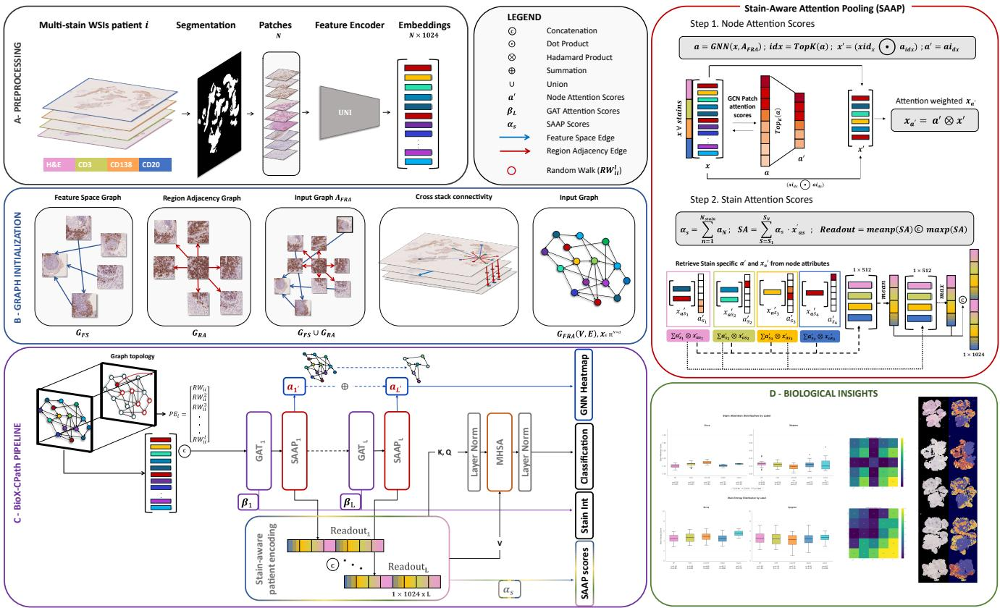
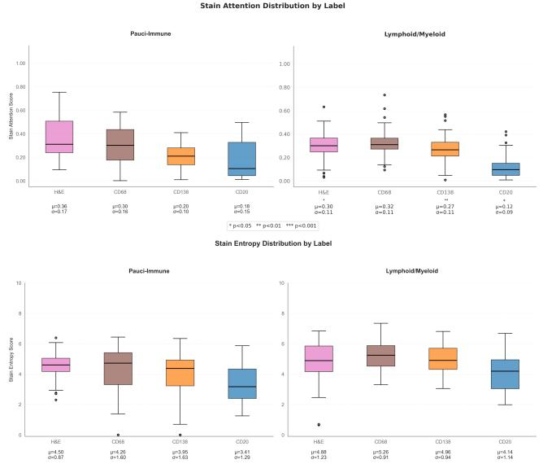
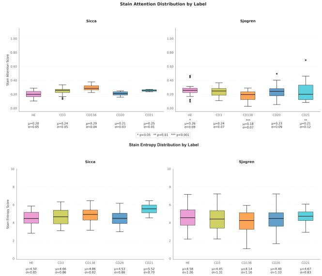

# BioX-CPath: Biologically-driven Explainable Diagnostics for Multistain IHC Computational Pathology

Amaya Gallagher-Syed\*† Henry Senior\* Omnia Alwazzan\* Elena Pontarini Michele Bombardieri\* Costantino Pitzalis\* Myles J. Lewis\* Michael R. Barnes Luca Rossi‡ Gregory Slabaugh\*

## Abstract

The development of biologically interpretable and explainable models remains a key challenge in computational pathology, particularly for multistain immunohistochemistry (IHC) analysis. We present BioX-CPath, an explainable graph neural network architecture for whole slide image (WSI) classification that leverages both spatial and semantic features across multiple stains. At its core, BioX-CPath introduces a novel Stain-Aware Attention Pooling (SAAP) module that generates biologically meaningful, stain-aware patient embeddings. Our approach achieves state-of-the-art performance on both Rheumatoid Arthritis and Sjogren’s Disease multistain datasets. Beyond performance metrics, BioX-CPath provides interpretable insights through stain attention scores, entropy measures, and stain interaction scores, thatpermit measuring model alignment with known pathological mechanisms. This biological grounding, combined with strong classification performance, makes BioX-CPath particularly suitable for clinical applications where interpretability is key. Source code and documentation can be found at: https://github. com/AmayaGS/BioX-CPath.

## 1. Introduction

Whole Slide Image (WSI) scanners capture high resolution, multi-magnification digital images of stained tissue biopsies presented on glass slides. The digitization of these biopsies has spurred the development of computational pathology methods. Analysis of these WSIs currently stands as one of the gold standard diagnostic and subtyping methods for many forms of cancers and autoimmune diseases, such as Rheumatoid Arthritis (RA) and Sjogren’s Disease. Different types of staining exist, which highlight different aspects of the tissue samples. Hematoxylin & Eosin (H&E) staining, a traditional and widely used technique, offers a broad view of tissue architecture and cellular morphology, with Hematoxylin staining cell nuclei a deep blue-purple, while Eosin stains cytoplasm and extracellular matrix in shades of pink. In contrast, Immunohistochemistry (IHC) is a more specialized technique that uses antibodies tagged with visual markers to identify specific proteins or cell types within tissue samples, allowing for precise localization and visualization of cell populations present in the tissue [41].

In cancer diagnostics, H&E staining remains the foundation for initial assessment and general diagnosis. However, IHC plays a crucial role in tumor classification, prognosis determination, and treatment selection by pinpointing specific cancer biomarkers, such Human Epidermal Growth Factor Receptor 2 (HER2), Estrogen Receptor (ER) and Progesterone Receptor (PR) [64, 65]. For autoimmune diseases, while H&E staining identifies general patterns of inflammation and tissue damage, IHC becomes essential for a more nuanced understanding of the disease process. It highlights the types of immune cells present in inflammatory infiltrates, detects autoantibody deposits, and visualizes specific autoantigens targeted by the immune system [43]. In clinical pathology, a tissue sample will be taken and thinly sliced, and different stains applied to these slices, often with a reference H&E slide to verify tissue quality [41]. These multi-stain WSIs stacks are rich in information about cellular types, tissue structures, and spatial patterns which relate to disease presentation and prognosis. Expert pathologists examining these stacks perform a semi-quantitative analysis, efficiently integrating information across both scale, stains, and images.

Most state-of-the-art computational pathology methods so far have focused on H&E and the single-stain domain. Works that has tackled IHC have often done so in the context of cell quantification via cell segmentation [15, 26, 51, 52], as well as prediction and scoring of biomarkers [26, 27, 47], or registration of multistain stacks [55]. Some works have also explored the potential of H&E to IHC virtual staining techniques [37, 48, 58] or recently of using IHC as views for self-supervised representation learning [26]. Most of these approaches have concentrated on extracting information from IHC slides such that this could be predicted using H&E or on quantification of cell populations in IHC. This is because H&E is an older, more widely available and cost-effective technology. However, the use of IHC and more advanced techniques such as immunofluorescence is only set to grow in the coming years, associated with a decrease in technology cost and more advanced biomarker detection techniques [41]. There is therefore a clear need for methods which explicitly focus on integrating the complex cell landscapes across stains. To the best of our knowledge, few studies have concentrated on the issue of classification of unregistered, unannotated multistain datasets to date, with a single stain graph and mid/late fusion approaches developed in [13] and a multistain attention graph approach proposed in MUSTANG [17]. However, the value of computational pathology extends beyond classification tasks. Given the rich information contained in multi-stain data, these methods must be interpretable and generate actionable biological insights at both the disease and patient level. This interpretability serves two crucial purposes: it advances our understanding of underlying disease mechanisms, and it allows pathologists to verify that model predictions align with established biological knowledge, building trust in the system’s outputs.

## 1.1. Contributions

1. We introduce BioX-CPath, a biologically driven graphbased model tailored to the complex cellular landscapes in multistain datasets. BioX-CPath works across multiple stains using semantic and spatial cues to capture complementary cellular and tissue information.

2. We propose a novel Stain-Aware Attention Pooling (SAAP) module that generates expressive, stain-aware patient embeddings. This module uniquely respects the biological and diagnostic diversity across stains, improving interpretability and diagnostic relevance.

3. We fully leverage the biological interpretability of BioX-CPath via derived metrics: stain attention and entropy scores, stain-stain interaction scores and Graph Neural Networks (GNNs) node heatmaps. These metrics provide detailed insights into stain relevance and inter-stain relationships, uncovering key biological patterns and interactions that contribute to disease pathology.

## 1.2. Related Work

## 1.2.1. Multiple Instance Learning

WSIs are gigapixel, heterogeneous image files, which present challenges for computer vision methods given each image can reach over 100k × 100k pixels, generally within a low patient sample setting. A weakly supervised Multiple Instance Learning (MIL) approach is most often employed to address this challenge. The image is divided into a regular grid of smaller patches (e.g., 224 × 224 pixels), each inheriting slide/patient labels. Patches are then embedded into a feature vector and classified at the slide/patient level using some form of non-trainable (e.g., max or mean) or trainable aggregation on the set of instances. Methods such as ABMIL [25], DS-MIL [35], and CLAM introduced trainable linear attention aggregation layers [38]. TransMIL [50] tackles the issue of long-range dependencies by approximating self-attention operations between patches via the Nystrom method [¨ 56].

## 1.2.2. GNNs in Histopathology

Applications in histopathology can be divided into cell, patch, or tissue-level graphs, with both node and graph classification approaches being employed. Patch-graphs can be constructed using features extracted from a WSI or a set of WSIs, then connected via edges [2, 3, 62, 63]. DeepGraph-Conv [36], PatchGCN [9], GTP [62], CAMIL [16] and HEAT [8] adopt this approach by constructing a graph connecting either the k-nearest neighbors in feature space or region adjacent patches. DeepGraphConv uses spectral graph convolution on a subset of patches, whereas Patch-GCN employs graph convolutional layers with residual connections and a final global attention pooling mechanism layer, which GTP replaces with a Transformer layer. CAMIL [16] combines a spatial neighbor constrained attention module with a transformer layer. HEAT [8] incorporates node and edge attributes in a heterogeneous graph, together with a pseudo-label pooling algorithm based on predicted cell types using KimiaNet, a feature extractor which was pretrained on H&E images from The Cancer Genome Atlas Program (TCGA) [46].

These methods were designed for accurate classification and prognosis in H&E staining and cancer datasets. Because of this, these models are optimized to focus on features and patterns linked to tissue architecture and cell morphology. Notably, because these models were designed for the single-stain cancer domain, they concentrate on spatial awareness which aligns well with the need in cancer to accurately detect tumors and tumor microenvironment based on tissue architecture and cell morphology [8, 9, 33]. Moreover, these approaches provide insight into tumor localization by providing heatmaps overlays showing the attention scores obtained per patch. Other methods, such as TEA-Graph [33] and Slide-Graph [39] also provide insight into interpretable prognostic biomarkers linked to tissue type.

In line with previous work, we adopt a patch-graph approach to efficiently integrate information across multistain WSI stacks. However, although we provide insight into the model decision making process through examination of layer importance and GNN heatmap, our focus is on providing insight into the alignment of our model with underlying biology and in understanding how the cell populations interact. This approach bridges the gap between performance-based approaches and explainable, insightdriven approaches.

## 2. Preliminaries

In this section we provide definitions and background on the concepts used throughout this work.

Graph Neural Networks. GNNs are capable of learning representations of graphs by propagating node features through a series of computationally efficient messagepassing and aggregation operations [14]. Given a graph over a set of nodes $V ,$ during the k-th message-passing iteration, the embedding $\mathbf { h } _ { u } ^ { ( k ) }$ corresponding to each node $u \in V$ is updated according to information aggregated from the neighbors of u, i.e.,

$$
\begin{array} { r l } & { \mathbf { h } _ { u } ^ { ( k + 1 ) } = \operatorname { U P D A T E } ^ { ( k ) } \left( \mathbf { h } _ { u } ^ { ( k ) } , \mathbf { m } _ { \mathcal { N } ( u ) } ^ { ( k ) } \right) } \\ & { \mathbf { m } _ { \mathcal { N } ( u ) } ^ { ( k ) } = \operatorname { A G G R E G A T E } ^ { ( k ) } \left( \left\{ \mathbf { h } _ { v } ^ { ( k ) } , \forall v \in \mathcal { N } ( u ) \right\} \right) } \end{array}\tag{1}
$$

where the neighborhood $\mathcal { N } ( u )$ is defined as the set of nodes that share an edge with u, UPDATE and AGGREGATE are arbitrary differentiable functions, and m $^ { ( k ) } _ { \mathcal { N } ( u ) }$ is the “message” that is aggregated from $\mathcal { N } ( u )$ . At each iteration, the AGGREGATE function takes as input the set of embeddings of the nodes in $\mathcal { N } ( u )$ [21]. When each node u of the input graph has an associated $d _ { x }$ -dimensional input feature $\mathbf { x } _ { u } \in \mathbb { R } ^ { d _ { x } } , \mathbf { h } _ { u } ^ { ( 0 ) }$ is set to $\mathbf { x } _ { u } .$ . As a result, through several message-passing iterations $\mathbf { h } _ { u } ^ { ( k ) }$ captures increasingly rich information encapsulating both the topological structure and the features surrounding each graph node u. However, after successive message-passing operation GNNs can suffer from vanishing gradients due to over-smoothing of the signal, leading to increasingly similar node representations [1, 4, 14]. In tasks where long-range interactions between far away nodes are important, this leads to loss of local neighborhood topological information.

Graph Attention Network. Graph Attention Networks (GATs) [54] are a type of GNN which incorporate masked self-attention layers [5, 53] into message-passing and use attention weights to define a weighted sum of the neighbors, i.e.,

$$
\mathbf { m } _ { \mathcal { N } ( u ) } ^ { ( k ) } = \sum _ { v \in \mathcal { N } ( u ) } \beta _ { u , v } \mathbf { h } _ { v } ^ { ( k ) } ,\tag{2}
$$

where $\beta _ { u , v }$ denotes the attention on neighbor $v \in \mathcal { N } ( u )$ when aggregating information at node u.

Graph pooling. Graph pooling methods aim to downsample graphs while preserving essential structural information. There are two different type of approaches: spectral-based and top-k-based methods [59]. Spectral approaches such as DiffPool [59], LaPool [42] or EigenPool [40] transform the graph into a compressed representation through learned soft clustering assignments, producing new abstract node representations. In contrast, top-k methods [61] such as gPool [20], TopKPool [19] or SAGPool [32] directly identify and preserve the most important nodes through various scoring mechanisms. The resulting scores enable direct node selection, maintaining a clear correspondence between the original and pooled graph, which maintains interpretability by producing a subgraph where node identity is conserved. gPool and TopKPool use a learnable vector to calculate projection scores and select the topranked nodes, but do not fully take into account graph topology [7, 32]. SAGPool [32] uses the GCN defined in [29] to calculate the self-attention scores $\mathbf { z } \in \mathbb { R } ^ { N \times 1 }$ as follows:

$$
\mathbf { z } = \sigma \left( \tilde { \mathbf { D } } ^ { - \frac { 1 } { 2 } } \tilde { \mathbf { A } } \tilde { \mathbf { D } } ^ { - \frac { 1 } { 2 } } \mathbf { X } \pmb { \theta } _ { a t t } \right) ,\tag{3}
$$

where $\tilde { \textbf { A } } \in \mathbb { R } ^ { N \times N }$ represents the adjacency matrix with self-connections, D˜ is its degree matrix, $\mathbf { X } \doteq \mathbb { R } ^ { N \times F }$ contains node features, and $\pmb { \theta } _ { a t t } \overset { - } { \in } \mathbb { R } ^ { F \times 1 }$ are the learnable parameters.

By utilizing graph convolutions to obtain self-attention scores, the result of the pooling is based on both graph and topological features, while remaining efficient to calculate in terms of memory and runtime [32]. The node selection method follows [7, 19, 30] by retaining a portion of nodes of the input graph, even when graphs of varying sizes and structures are input. The pooling ratio $k \in \mathsf { \Gamma } ( 0 , 1 ]$ hyperparameter determines the number of nodes to keep at each pooling layer.

Graph readouts. Graph readout operations are specifically focused on obtaining a fixed-size graph-level representation by aggregating all node features. This is generally done through simple statistical operators such as globa mean and global max pooling operations [57]. However, these basic aggregation procedures cause information loss through oversmoothing of the node signals, failing to capture complex topological relationships encoded into graphs. Recent methods have examined how to obtain more expressive graph readouts through the use of clustering [31], attention [9] or variance[49] based techniques. Notably in the histopathology area HEAT [8] proposed to aggregate based on the assignment of tissue type pseudo-labels. However, approaches based on pseudo-cluster can be inconsistent across graphs [8] and fail to align with meaningful and interpretable biology.

Positional encoding. Random walk positional encoding is a technique used to incorporate structural information from a graph into the node embeddings [14]. Specifically, for each node u in the graph, a random walk of fixed length is performed, starting from that node u and considering only the landing probability of transitioning back to the node u itself at each step, i.e., $\begin{array} { r l } { \mathbf { p } _ { \mathrm { R W P E } } ^ { u } } & { { } = } \end{array}$ $\left[ R W _ { u u } , R W _ { u u } ^ { 2 } , \ldots R W _ { u u } ^ { l } \right] ^ { \top } \ \in \ \mathbb { R } ^ { l }$ , where $\mathbf { p } _ { \mathrm { R W P E } } ^ { u }$ represents the random walk positional encoding for node $u ,$ $R W _ { u u } ^ { l }$ is the l-step landing probability of returning to node u after a random walk of length l starting from $u ,$ and the positional encoding concatenates these l-step landing probabilities into a vector in $\mathbb { R } ^ { l }$ . The node random walk positional encoding is then concatenated with its feature vector to obtain a new enriched input feature, i.e.,

$$
\mathbf { h } _ { u } = \mathbf { W } _ { c } \left[ \mathbf { x } _ { u } \parallel \mathbf { p } _ { \mathrm { R W P E } } ^ { u } \right]\tag{4}
$$

where $\mathbf { h } _ { u } \in \mathbb { R } ^ { d }$ is the final d-dimensional embedding for node $u , \mathbf { x } _ { u } \in \mathbb { R } ^ { d _ { x } }$ is the initial $d _ { x }$ -dimensional feature vector for node u, $\mathbf { p } _ { \mathrm { R W P E } } ^ { u } \in \mathbb { R } ^ { l }$ is the l-dimensional random walk positional encoding for node $u , \parallel$ denotes the vector concatenation operation, and $\mathbf { W } _ { c } \in \dot { \mathbb { R } ^ { d \times ( d _ { x } + l ) } }$ is a learnable weight matrix that projects the concatenated node feature and positional encoding to an d-dimensional embedding space. This allows the node embeddings to capture not only the local neighborhood structure around each node, but also higher-order proximity information between nodes that are multiple hops away, potentially improving their ability to capture complex global patterns and dependencies within the graph structure.

## 3. Methods

Here we introduce our proposed pipeline, which we illustrate graphically in Fig. 1.

## 3.1. Preprocessing

Feature extraction. We start by preprocessing each stack of patient multistain WSIs by thresholding tissue areas from background and extracting patches. For each extracted patch, the $( x , y )$ -coordinates are saved. Each patch is then processed by a feature extractor to obtain an embedded feature vector. Here we use the UNI feature encoder [11] as it has shown reasonable performance on IHC benchmarking tasks [18]. This produces a feature matrix $\mathbf { X } _ { p } \in \mathbb { R } ^ { N }$ ×d which represents the stack of WSIs for a given patient $p ,$ with d the embedding dimension of the feature encoder. See SM.5 for further details.

Graph initialization. Given our feature matrix $\mathbf { X } _ { p }$ , we first construct a k-Nearest Neighbor $\left( k { \mathrm { - N N } } \right)$ graph in feature space. This feature space graph $G _ { F S }$ contains relationships between semantically similar patches, regardless of their spatial relationship, and has an adjacency matrix denoted ${ \bf A } _ { F S } [ i , j ]$ where $\mathbf { A } _ { F S } [ i , j ] = 1$ if patch $j$ is among k nearest neighbors of i in feature space. We then construct a region adjacency graph $G _ { R A }$ using the extracted $( x , y )$ coordinates, with adjacency matrix $\mathbf { A } _ { R A } [ i , j ]$ where ${ \bf A } _ { R A } [ i , j ] = 1$ if patch $j$ is among k region adjacent nearest neighbors of i both on the $( x , y )$ plane (same WSIs) and zaxis of the WSIs stack. We illustrate these two types of connectivity in Fig. 1B. We then combine max $\left( \mathbf { A } _ { F S } , \mathbf { A } _ { R A } \right)$ to obtain our full $\mathbf { A } _ { F R A } \in \{ 0 , 1 \} ^ { N \times N }$ , which we use to initialize our input graph $G _ { F R A } \ = \ ( V , E )$ . For each node, we store as a categorical node attribute their stain type $S ,$ while for each edge we store the edge type. The combination of feature and spatial proximity was chosen to connect stains across the stack and permit information flow during message passing operations.

Positional encoding. For each node in $G _ { F R A }$ , a fixed length random walk is performed [13], starting from a given node and considering only the landing probability of transitioning back to the initial node at each step. The random walk positional encoding vector is appended to the initial feature vector of its associated node and re-appended through each layer of our backbone. We employ this approach to alleviate issues with long-range cross WSIs stack connectivity by providing global topological information to the graph.

## 3.2. Patient Level Encoding

Hierarchical graph blocks. To obtain patient-level encoding, we use as our backbone a hierarchal graph approach as presented in [7, 59], with the aim of attenuating oversmoothing issues. Our patient level encoder backbone consists of alternating GAT layers [54] and our proposed Stain-Aware Attention Pooling (SAAP) module, which refines the node features whilst selecting the most relevant ones - using an importance score - to be forwarded to the next layer [32]. Finally, we apply multi-head self-attention (MHSA) to the concatenated stain-aware patients encoding returned by the SAAP module at each layer, with the resultant features passed to a fully connected classification head. Our backbone architecture choice is motivated by the desire to obtain the most expressive representation of patient encoding [8, 17, 22, 45]

Stain-Aware Attention Pooling module. The SAAP algorithm, illustrated in Fig. 1, begins with calculating node attention scores $\mathbf { a } \in \mathbb { R } ^ { \breve { N } }$ . Here we use the SAGPool algorithm as defined in 2. Briefly, the attention scores are computed as $\mathbf { a } = \mathbf { G } \mathbf { N } \mathbf { N } ( \mathbf { X } , \mathbf { A } _ { \mathbf { F R A } } )$ . These node attention scores represent the importance of each node in the graph based on both their features and graph topology. Both the node attention scores a and the feature matrix X are sorted and a subset $\mathbf { X } ^ { \prime }$ is selected based on the top k nodes wrt the attention scores, forming the subgraph $G _ { F R A } ^ { \prime }$ This preserves the most relevant nodes while reducing the computational complexity. The attention scores of the k nodes are then used to scale the node features $\mathbf { X } ^ { \prime }$ through elementwise multiplication. This injects relevance ranking in the feature matrix $\mathbf { X } ^ { \prime }$ , such that more relevant nodes now have higher weight. For each stain s, a stain-level weight $\alpha _ { s }$ is then calculated as the sum of the normalized attention scores $\mathbf { a } ^ { \prime }$ of the $N _ { s }$ nodes belonging to that stain, i.e.,

  
Figure 1. Architecture: Our approach begins by preprocessing the WSIs into patch features using UNI [11] (Section A). The resultant features are combined into two graphs, $G _ { F S }$ and $G _ { R A }$ , representing the feature space similarity and region adjacency respectively. Given that the node sets of the two graphs are shared, we join the edge sets together, yielding graph $G _ { F R A }$ (Section B). $G _ { F R A }$ is then passed through hierarchical GNN blocks (Section C) consisting of a Graph Attention Network (GAT) [54] and our proposed Stain-Aware Attention Pooling (SAAP) (detailed in the top right), which updates the node features while selecting the most relevant ones using an importance score. We obtain stain-aware patient encoding, which we pass through a final MHSA layer, before classification. Derived from both SAAP and GAT layers we propose metrics which provide biological insights into the model’s predictions (Section D).

$$
\alpha _ { s } = \sum _ { n = 1 } ^ { N _ { s } } \mathbf { a } _ { n } ^ { \prime } ,\tag{5}
$$

The algorithm then pools weighted features by stain. Stain attention (SA) scores are then calculated as

$$
\operatorname { S A } { \operatorname { s c o r e s } } = \sum _ { s \in S } \alpha _ { s } \cdot \mathbf { X } _ { s } ^ { \prime }\tag{6}
$$

where $S$ is the set of stains, $\alpha _ { s }$ is the attention weight for stain s and $\mathbf { X } _ { s } ^ { \prime }$ represents the features specific to stain s. Finally, we obtain stain-aware readouts Readout = [meanp(SA)∥maxp(SA)] where meanp and maxp represent mean pooling and max pooling operations respectively, and ∥ represents the vector concatenation operation. SAAP explicitly handles multiple stain modalities by computing stain-specific weights $( \alpha _ { s } )$ , allowing the model to learn the relative importance of different stains for downstream tasks. With this we aim to maximize expressiveness, while aligning it with relevant biological information.

Biological insight. Based on our SAAP module and the proposed backbone architecture, we introduce a number of derived metrics which allow us to verify if the model aligns with known biology and can help provide clinical insights. These metrics are:

• SAAP scores, defined above. This score informs us on which stains were most diagnostically relevant for the

downstream task.

• Stain entropy scores, $\begin{array} { r } { H _ { s } \ = \ - \sum _ { n = 1 } ^ { N _ { s } } ( \mathbf { a } _ { n } ^ { \prime } \cdot \log ( \mathbf { a } _ { n } ^ { \prime } ) ) } \end{array}$ where $H _ { s }$ is the entropy for stain s and $\mathbf { a } _ { n } ^ { \prime }$ are the normalized attention scores of the $N _ { s }$ nodes belonging to stain s. This measures how uniformly distributed the attention scores are within each stain type, with lower entropy values indicating more concentrated, focused attention patterns aligning with organized, localized cellular structures, while higher entropy represents uniformly distributed attention corresponding to diffuse, disorganized cellular structures present throughout the tissue.

• Stain-stain interaction scores, I are defined as $\mathbf { I } _ { i , j } ~ =$ $\begin{array} { r } { \mathbf { I } _ { j , i } = \frac { 1 } { | P _ { i , j } | } \sum _ { p \in P _ { i , j } } \beta _ { p } } \end{array}$ where $i , j$ are indices in the set of unique stains S, $P _ { i , j }$ is the set of all pairs between stains $s _ { i }$ and $s _ { j }$ and $\beta _ { p }$ represents the GAT attention weights for pair $p ,$ extracted from the model’s attention mechanism. $| P _ { i , j } |$ is the number of pairs between stains $s _ { i }$ and $s _ { j } .$ . This score quantifies the importance of edge connections between nodes of different stain types.

GNN Heatmap. Extending on the use of attention scores, we design a simple GNN heatmap visualization method. The attention scores calculated for each node at the first SAAP layer are extracted and successively updated after each the pooling procedure. The final attention scores are min-max normalized and mapped back to their spatial location to obtain an attention heatmap of node importance. The resulting heatmap overlay provides a visual interpretation of the GNN model attention, highlighting the regions of the image that are considered most important for the downstream task.

## 4. Experiments

## 4.1. Datasets

We test our pipeline on two autoimmune multi-stain datasets, one for Rheumatoid Arthritis and the other for Sjogren’s Disease. Each dataset is composed of H&E slides, with approximately 3 IHC slides of different immune biomarkers per patient. In Table SM.1, we give further information on the stains present in each dataset.

## 4.1.1. Rheumatoid Arthritis

This dataset consists of 607 Whole Slide Images (WSIs) from 153 RA patients, categorized into low (N=66) and high (N=87) inflammatory subtypes [24]. Samples were stained with H&E and the IHC markers CD20+ B cells, CD68+ macrophages, and CD138+ macrophages (see Fig. SM.1 for details). The dataset features a variable number of stains, averaging 3.9 per patient. We perform binary classification on low (N=66) and high (N=87) inflammatory subtypes. We extract non-overlapping patches at a 10x magnification, keeping those with over 40% tissue coverage, totaling approximately 275k patches.

## 4.1.2. Sjogren

This dataset consists of 347 WSIs of labial salivary gland biopsies sampled from 93 patients, with 46 cases of nonspecific Sicca and 47 cases of Sjpgren. Samples were stained with H&E and the IHC stains CD20+ B cells, CD3+ T cells, CD21+ follicular dendritic cell network, and CD138+ plasma cells (see Fig. SM.2 for details). Each patient has a variable set of multi-stain WSIs, averaging 3.7 stains per patient. We perform detection of inflammatory patterns. We extract non-overlapping patches at a 20x magnification, keeping those with over 30% tissue coverage, totaling approximately 237k patches.

## 4.2. Implementation Details

Experimental setup and evaluation metrics. We separate a random label stratified 20% hold out test set and perform 5-fold random label stratified cross validation on the remaining data (train:val:test / 60:20:20). Models were trained for a maximum 200 epochs, with patience set to 15 such that early stopping was called if no change was observed in either the loss, accuracy, or AUC score for 15 epochs. Weights were kept for the model obtaining the best accuracy score on each validation set while ensuring there was no under-fitting or over-fitting of the models. Each of the 5 trained model was applied to the hold-out test. We report the mean and standard error (SE) of the results obtained on the hold-out test set for accuracy, macro F1-score, precision, recall, AUC, and average precision.

Training schedule. All models were trained using crossentropy loss, with the AdamW optimizer set to $\beta _ { 1 } = 0 . 9 $ $\beta _ { 2 } = 0 . 9 8$ , and $\epsilon = 1 0 ^ { - 9 }$ , with a learning rate $1 e ^ { - 3 }$ and weight decay $L _ { 2 } = 0 . 0 1$ . No learning scheduler was used. We show the hyperparameters used in Table SM.3. Training was conducted on an NVidia A100 GPU (40Gb). We provide information on peak VRAM and memory use in Table SM.4.

Benchmarking and ablation studies. We compare our method against seven SOTA methods, ABMIL [25], CLAM-SB [38], DeepGraphConv [36] PatchGCN [9], TransMIL [50], GTP [62] and MUSTANG [17]. We perform ablation on the different components of our pipeline: the SAAP module, the RW positional encoding, and the Multi Head Self-Attention layer.

## 5. Results

In Table 1 we present the results obtained by BioX-CPath on both datasets. On the RA dataset, our model achieved 0.90 (±0.019) accuracy, representing a 4 percent point improvement over the next best performing model, MUS-TANG (0.86 ±0.021). BioX-CPath did not outperfrom MUSTANG in AUC (0.96 ±0.007) and average precision (0.98 ±0.004), however did well compared to other methods. On the Sjogren dataset BioX-CPath achieved 0.84 (±0.018) accuracy, showing a significant improvement over both CLAM-SB and MUSTANG (0.80 ±0.018). The model also demonstrated stronger AUC (0.88 ±0.023) and average precision (0.86 ±0.032) compared to all baseline methods.

  
Figure 2. RA Dataset Explainability: The top row shows box plots of the SAAP scores distribution for different stain types (H&E, CD68, CD138, and CD20) for each classification label in the RA dataset (Pauci-Immune and Lymphoid/Myeloid). The bottom row shows the entropy score distributions for each of the stain types according to the classification label.

Ablation results shown in Tables 2 and 3 highlight the contribution of each component in our model. On the Sjogren dataset, the baseline model achieved 0.756 (±0.059) accuracy, while adding the RW positional encoding improved the performance to 0.80 (±0.038), indicating the importance of adding long-range topological information to the graph. The addition of SAAP provided another substantial boost, bringing the accuracy to 0.84 (±0.018). Similarly for the RA dataset, while the positional encoding improved the accuracy from 0.79 (±0.018) to 0.86 (±0.018), the full model with SAAP achieved the best performance at 0.90 (±0.019). We note the addition of the MHSA brought a slight decrease in performance. However, given the gains in model interpretability we do not view this as a significant disadvantage (we discuss this further in SM.8).

## 5.1. Biological Interpretability

## 5.1.1. RA

The Pauci-Immune pathotype exhibited lower attention scores for CD138 $( \mu = 0 . 2 0 , \sigma = 0 . 1 0 , p < 0 . 0 1 )$ and CD20 $( \mu = 0 . 1 8 , \sigma = 0 . 1 5 , p < 0 . 0 5 )$ markers, reflecting the characteristic scarcity of lymphocytic and plasma cell infiltrates in this disease subset. The lower entropy values observed in these samples (CD20: $\mu = 3 . 4 1 , \sigma = 1 . 2 9 ;$ CD138: $\mu = 3 . 9 5 , \sigma = 1 . 6 3 )$ quantitatively capture the more ordered tissue architecture and sparse inflammatory foci associated with this RA pathotype. Conversely, Lymphoid/Myeloid samples showed more balanced attention distribution across CD68 (µ = 0.32, σ = 0.11) and CD138 $( \mu \ : = \ : 0 . 2 7 , \ : \sigma \ : = \ : 0 . 1 1 )$ with consistently higher entropy values (CD68: µ = 5.26, σ = 0.91; CD138: $\mu = 4 . 9 6$ $\sigma = 0 . 9 4 )$ , reflecting the established role of plasma cells and macrophages in driving severe disease through autoantibody production and pro-inflammatory cytokine secretion [12, 60]. These computational findings provide quantitative support for the histological classification of RA subtypes, where Lymphoid/Myeloid pathotypes demonstrate abundant but disorganized immune cell infiltrates, while Pauci-Immune samples show more limited inflammatory patterns and more ordered tissue architecture [23, 34]. The relatively high attention scores for H&E staining in Pauci-Immune $( \mu = 0 . 3 6 , \sigma = 0 . 1 7 , p < 0 . 0 5 )$ align with the understanding that when specific immune cell infiltrates are less prominent, general tissue architecture becomes more informative for pathotype classification, reflecting the heterogeneous nature of RA synovitis and its immunological basis.

  
Figure 3. Sjogren Dataset Explainability: The top row shows box plots of the SAAP scores for different stain types (HE, CD3, CD138, CD20, and CD21) for each classification label in the Sjogren dataset (Sicca and Sjogren). The bottom row shows the entropy score distributions for each of the stain types according to the classification label.

Table 1. Performance comparison of BioX-CPath against SOTA methods on the RA and Sjogren datasets. We report accuracy, AUC, and average precision (AP) with standard error shown in parentheses. The best results for each metric are shown in bold, with the second best underlined.
<table><tr><td></td><td colspan="3">RA</td><td colspan="3">Sjogren</td></tr><tr><td></td><td>Accuracy (↑)</td><td>AUC (↑)</td><td>AP (↑)</td><td>Accuracy (↑)</td><td>AUC (↑)</td><td>AP (↑)</td></tr><tr><td>ABMIL [25]</td><td>0.79 (0.028)</td><td>0.89 (0.027)</td><td>0.92 (0.019)</td><td>0.73 (0.018)</td><td>0.80 (0.035)</td><td>0.79 (0.044)</td></tr><tr><td>CLAM-SB [38]</td><td>0.81 (0.026)</td><td>0.92 (0.011)</td><td>0.95 (0.008)</td><td>0.80 (0.018)</td><td>0.85 (0.017)</td><td>0.85 (0.026)</td></tr><tr><td>TransMIL [50]</td><td>0.80 (0.025)</td><td>0.87 (0.024)</td><td>0.91 (0.021)</td><td>0.75 (0.018)</td><td>0.73 (0.011)</td><td>0.74 (0.017)</td></tr><tr><td>DeepGraphConv [36]</td><td>0.81 (0.025)</td><td>0.88 (0.009)</td><td>0.92 (0.007)</td><td>0.77 (0.038)</td><td>0.83 (0.031)</td><td>0.83 (0.039)</td></tr><tr><td>Patch-GCN [10]</td><td>0.83 (0.015)</td><td>0.91 (0.019)</td><td>0.94 (0.014)</td><td>0.77 (0.019)</td><td>0.85 (0.015)</td><td>0.83 (0.030)</td></tr><tr><td>GTP [62]</td><td>0.79 (0.020)</td><td>0.87 (0.012)</td><td>0.92 (0.007)</td><td>0.62 (0.048)</td><td>0.73 (0.031)</td><td>0.72 (0.024)</td></tr><tr><td>MUSTANG [17]</td><td>0.86 (0.021)</td><td>0.96 (0.010)</td><td>0.97 (0.006)</td><td>0.80 (0.018)</td><td>0.85 (0.019)</td><td>0.84 (0.026)</td></tr><tr><td>BioX-CPath [ours]</td><td>0.90 (0.019)</td><td>0.96 (0.007)</td><td>0.98 (0.004)</td><td>0.84 (0.018)</td><td>0.88 (0.023)</td><td>0.86 (0.032)</td></tr></table>

Table 2. Ablation on model components shown on the Sjogren dataset.
<table><tr><td></td><td>Accuracy (↑)</td><td>AUC (↑)</td><td>AP (↑)</td></tr><tr><td>Baseline</td><td>0.756 (0.059)</td><td>0.849 (0.024)</td><td>0.84 (0.036)</td></tr><tr><td>+ MHSA</td><td>0.736 (0.049)</td><td>0.849 (0.021)</td><td>0.86 (0.036)</td></tr><tr><td>+ RW</td><td>0.80 (0.038)</td><td>0.84 (0.035)</td><td>0.81 (0.034)</td></tr><tr><td>+ SAAP</td><td>0.84 (0.018)</td><td>0.88 (0.023)</td><td>0.86 (0.032)</td></tr></table>

Table 3. Ablation on model components shown on the RA dataset.
<table><tr><td></td><td>Accuracy (↑)</td><td>AUC (↑)</td><td>AP (↑)</td></tr><tr><td>Baseline</td><td>0.79 (0.018)</td><td>0.87 (0.011)</td><td>0.92 (0.010)</td></tr><tr><td>+ MHSA</td><td>0.78 (0.025)</td><td>0.88(0.024)</td><td>0.92 (0.018)</td></tr><tr><td>+ RW</td><td>0.86 (0.018)</td><td>0.95 (0.010)</td><td>0.98 (0.007)</td></tr><tr><td>+ SAAP</td><td>0.90 (0.019)</td><td>0.96 (0.007)</td><td>0.98 (0.004)</td></tr></table>

## 5.1.2. Sjogren

Sjogren’s samples show a balanced attention across immune markers, with CD3 $( \mu = 0 . 2 4 , \sigma = 0 . 0 7 ) , \mathbf { C D } 2 0 ( \mu = 0 . 2 3 ,$ $\sigma = 0 . 0 9 )$ , and CD21 $( \mu = 0 . 2 1 , \sigma = 0 . 1 2 )$ receiving balanced attention, along with HE staining $( \mu = 0 . 2 6 , \sigma =$ 0.09). This reflects characteristic organized lymphocytic infiltrates with a mix of B-cells, plasma cells, and T-cells [6], as well as the importance of changes in tissue architecture. Most notably CD138 shows significantly lower attention in the Sjogren’s group $( \mu = 0 . 1 8 , \sigma = 0 . 0 7 )$ compared to Sicca $( \mu = 0 . 2 9 , \sigma = 0 . 0 4 , p < 0 . 0 0 1 )$ , with lower entropy scores $( \mu = 4 . 1 4 , \sigma = 1 . 1 6 )$ suggesting that specific plasma cell organization patterns, rather than overall abundance, are distinctive for Sjogren’s pathology, which is consistent with the formation of ectopic lymphoid structures typical in Sjogren’s [44]. Additionally, CD21 shows significant attention differences between groups (Sjogren’s µ = 0.21, σ = 0.12; Sicca $\mu = 0 . 2 5 , \sigma = 0 . 0 1 , p < 0 . 0 1 )$ , with notable outliers in the Sjogren’s group suggesting well-formed follicular dendritic networks in some cases. These patterns align with current understanding where Sicca represents non-inflammatory dryness with more homogeneously distributed immune cells (higher entropy), while Sjogren’s demonstrates organized autoimmune infiltrates with more concentrated immune cell groupings (lower entropy). The model appears to have learned biologically relevant features that align with known pathological mechanisms.

In Supplementary materials, we conduct further analysis of model mechanics, looking at stain interaction scores (SM.6), GNN heatmaps (SM.7) and Layer Importance (SM.8).

## 6. Conclusion

BioX-CPath is an explainable GNN-based architecture for multistain IHC analysis, that bridges computational pathology and biological interpretability. By integrating multistain histopathological data into a unified framework, our approach not only achieves state-of-the-art accuracy but also provides mechanistic insights that align with established pathological mechanisms. This work establishes a foundation for developing and extending explainable computational pathology to other complex autoimmune and inflammatory diseases where multistain tissue analysis is essential for accurate diagnosis and subtyping.

## Acknowledgments and Disclosure of Funding

We wish to thank Dr. Dovile Zilenaite for her insightful comments and knowledge, in particular discussing stain-stain interaction and entropy scores. A.G.S. receives funding from the Wellcome Trust [218584/Z/19/Z]. This paper utilized Queen Mary’s Andrena HPC facility [28]. This work also acknowledges the support of the National Institute for Health and Care Research Barts Biomedica Research Centre (NIHR203330), a delivery partnership of Barts Health NHS Trust, Queen Mary University of London, St George’s University Hospitals NHS Foundation Trust and St George’s University of London.

## References

[1] Ralph Abboud, Radoslav Dimitrov, and ˙Ismail ˙Ilkan Ceylan. Shortest Path Networks for Graph Property Prediction. Technical report, 2023. arXiv:2206.01003 [cs] type: article. 3

[2] Radhakrishna Achanta, Appu Shaji, Kevin Smith, Aurelien Lucchi, Pascal Fua, and Sabine Susstrunk. SLIC Superpix-¨ els Compared to State-of-the-Art Superpixel Methods. IEEE Transactions on Pattern Analysis and Machine Intelligence, 34(11):2274–2282, 2012. 2

[3] Mohammed Adnan, Shivam Kalra, and Hamid R. Tizhoosh. Representation Learning of Histopathology Images using Graph Neural Networks. In 2020 IEEE/CVF Conference on Computer Vision and Pattern Recognition Workshops (CVPRW), pages 4254–4261, 2020. ISSN: 2160-7516. 2

[4] Uri Alon and Eran Yahav. On the Bottleneck of Graph Neural Networks and its Practical Implications. Technical report, 2021. arXiv:2006.05205 [cs, stat] type: article. 3

[5] Dzmitry Bahdanau, Kyunghyun Cho, and Yoshua Bengio. Neural Machine Translation by Jointly Learning to Align and Translate. Technical report, 2016. arXiv:1409.0473 [cs, stat] type: article. 3

[6] Michele Bombardieri, Myles Lewis, and Costantino Pitzalis. Ectopic lymphoid neogenesis in rheumatic autoimmune diseases. Nature Reviews Rheumatology, 13(3):141–154, 2017. 8

[7] Cat˘ alina Cangea, Petar Veli ˘ ckovi ˇ c, Nikola Jovanovi ´ c,´ Thomas Kipf, and Pietro Lio. Towards Sparse Hierarchical\` Graph Classifiers. Technical report, 2018. arXiv:1811.01287 [cs, stat] type: article. 3, 4

[8] Tsai Hor Chan, Fernando Julio Cendra, Lan Ma, Guosheng Yin, and Lequan Yu. Histopathology whole slide image analysis with heterogeneous graph representation learning. In Proceedings of the IEEE/CVF Conference on Computer Vision and Pattern Recognition, pages 15661–15670, 2023. 2, 3, 4

[9] Richard J. Chen, Ming Y. Lu, Muhammad Shaban, Chengkuan Chen, Tiffany Y. Chen, Drew F. K. Williamson, and Faisal Mahmood. Whole Slide Images are 2D Point Clouds: Context-Aware Survival Prediction using Patchbased Graph Convolutional Networks. Technical report, 2021. arXiv:2107.13048 [cs, eess, q-bio] type: article. 2, 3, 6

[10] Richard J. Chen, Chengkuan Chen, Yicong Li, Tiffany Y. Chen, Andrew D. Trister, Rahul G. Krishnan, and Faisal Mahmood. Scaling Vision Transformers to Gigapixel Images via Hierarchical Self-Supervised Learning. In 2022 IEEE/CVF Conference on Computer Vision and Pattern Recognition (CVPR), pages 16123–16134, 2022. ISSN: 2575-7075. 8

[11] Richard J. Chen, Tong Ding, Ming Y. Lu, Drew F. K. Williamson, Guillaume Jaume, Andrew H. Song, Bowen Chen, Andrew Zhang, Daniel Shao, Muhammad Shaban, Mane Williams, Lukas Oldenburg, Luca L. Weishaupt, Judy J. Wang, Anurag Vaidya, Long Phi Le, Georg Gerber, Sharifa Sahai, Walt Williams, and Faisal Mahmood. To-

wards a general-purpose foundation model for computational pathology. Nature Medicine, 30(3):850–862, 2024. 4, 5

[12] Glynn Dennis, Cecile TJ Holweg, Sarah K Kummerfeld,´ David F Choy, A Francesca Setiadi, Jason A Hackney, Peter M Haverty, Houston Gilbert, Wei Yu Lin, Lauri Diehl, S Fischer, An Song, David Musselman, Micki Klearman, Cem Gabay, Arthur Kavanaugh, Judith Endres, David A Fox, Flavius Martin, and Michael J Townsend. Synovial pheno types in rheumatoid arthritis correlate with response to bio logic therapeutics. Arthritis Research & Therapy, 16(2):R90, 2014. 7

[13] Chaitanya Dwivedi, Shima Nofallah, Maryam Pouryahya, Janani Iyer, Kenneth Leidal, Chuhan Chung, Timothy Watkins, Andrew Billin, Robert Myers, John Abel, and Ali Behrooz. Multi Stain Graph Fusion for Multimodal Integra tion in Pathology. pages 1835–1845, 2022. 2, 4

[14] Vijay Prakash Dwivedi, Anh Tuan Luu, Thomas Laurent, Yoshua Bengio, and Xavier Bresson. Graph Neural Networks with Learnable Structural and Positional Representations. Technical report, 2022. arXiv:2110.07875 [cs] type: article. 3, 4

[15] I. Keren Evangeline, J. Glory Precious, Natesan Pazhanivel, and S. P. Angeline Kirubha. Automatic detection and counting of lymphocytes from immunohistochemistry cancer images using deep learning. Journal ofMedical and Biological Engineering, 40:735 – 747, 2020. 1

[16] Olga Fourkioti, Matt De Vries, and Chris Bakal. CAMIL: Context-Aware Multiple Instance Learning for Cancer Detection and Subtyping in Whole Slide Images. 2023. 2

[17] Amaya Gallagher-Syed, Luca Rossi, Felice Rivellese, Costantino Pitzalis, Myles Lewis, Michael Barnes, and Gregory Slabaugh. Multi-stain self-attention graph multiple instance learning pipeline for histopathology whole slide im ages. In 34th British Machine Vision Conference 2023, BMVC 2023, Aberdeen, UK, November 20-24, 2023. BMVA, 2023. 2, 4, 6, 8

[18] Amaya Gallagher-Syed, Elena Pontarini, Myles J Lewis, Michael R Barnes, and Gregory Slabaugh. Going beyond h&e and oncology: How do histopathology foundation models perform for multi-stain ihc and immunology? arXiv preprint arXiv:2410.21560, 2024. 4

[19] Hongyang Gao and Shuiwang Ji. Graph U-Nets. pages 2083–2092. PMLR, 2019. 3

[20] Hongyang Gao, Yongjun Chen, and Shuiwang Ji. Learning Graph Pooling and Hybrid Convolutional Operations for Text Representations. In The World Wide Web Conference, pages 2743–2749, New York, NY, USA, 2019. Association for Computing Machinery. 3

[21] William L. Hamilton. Graph representation learning. Synthesis Lectures on Artificial Intelligence and Machine Learning, 14(3):1–159. 3

[22] Wentai Hou, Lequan Yu, Chengxuan Lin, Helong Huang, Rongshan Yu, Jing Qin, and Liansheng Wang. Hˆ2-MIL: Exploring Hierarchical Representation with Heterogeneous Multiple Instance Learning for Whole Slide Image Analy sis. Proceedings of the AAAI Conference on Artificial Intel ligence, 36(1):933–941, 2022. 4

[23] Frances Humby, Myles Lewis, Nandhini Ramamoorthi, Jason A Hackney, Michael R Barnes, Michele Bombardieri, A Francesca Setiadi, Stephen Kelly, Fabiola Bene, Maria DiCicco, et al. Synovial cellular and molecular signatures stratify clinical response to csdmard therapy and predict radiographic progression in early rheumatoid arthritis patients. Annals ofthe rheumatic diseases, 78(6):761–772, 2019. 7

[24] Frances Humby, Patrick Durez, Maya H. Buch, Myles J. Lewis, Hasan Rizvi, Felice Rivellese, Alessandra Nerviani, Giovanni Giorli, Arti Mahto, Carlomaurizio Montecucco, Bernard Lauwerys, Nora Ng, Pauline Ho, Michele Bombardieri, Vasco C. Romao, Patrick Verschueren, Stephen˜ Kelly, Pier Paolo Sainaghi, Nagui Gendi, Bhaskar Dasgupta, Alberto Cauli, Piero Reynolds, Juan D. Canete, Robert˜ Moots, Peter C. Taylor, Christopher J. Edwards, John Isaacs, Peter Sasieni, Ernest Choy, Costantino Pitzalis, Charlotte Thompson, Serena Bugatti, Mattia Bellan, Mattia Congia, Christopher Holroyd, Arthur Pratt, Joao Eurico Cabral da˜ Fonseca, Laura White, Louise Warren, Joanna Peel, Rebecca Hands, Liliane Fossati-Jimack, Gaye Hadfield, Georgina Thorborn, Julio Ramirez, and Raquel Celis. Rituximab versus tocilizumab in anti-TNF inadequate responder patients with rheumatoid arthritis (R4RA): 16-week outcomes of a stratified, biopsy-driven, multicentre, open-label, phase 4 randomised controlled trial. The Lancet, 397(10271):305– 317, 2021. 6

[25] M. Ilse, J. Tomczak, and M. Welling. Attention-based deep multiple instance learning. In Proc. 35th ICML, pages 2127– 2136, 2018. 2, 6, 8

[26] Guillaume Jaume, Anurag Jayant Vaidya, Andrew Zhang, Andrew H Song, Richard J. Chen, Sharifa Sahai, Dandan Mo, Emilio Madrigal, Long Phi Le, and Mahmood Faisal. Multistain pretraining for slide representation learning in pathology. In European Conference on Computer Vision. Springer, 2024. 1, 2

[27] Jakob Nikolas Kather, Alexander T. Pearson, Niels Halama, Dirk Jager, Jeremias Krause, Sven H. Loosen,¨ Alexander Marx, Peter Boor, Frank Tacke, Ulf Peter Neumann, Heike I. Grabsch, Takaki Yoshikawa, Hermann Brenner, Jenny Chang-Claude, Michael Hoffmeister, Christian Trautwein, and Tom Luedde. Deep learning can predict microsatellite instability directly from histology in gastrointestinal cancer. Nature Medicine, 25(7):1054–1056, 2019. 1

[28] Thomas King, Simon Butcher, and Lukasz Zalewski. Apocrita - High Performance Computing Cluster for Queen Mary University of London. 2017. 8

[29] Thomas N. Kipf and Max Welling. Semi-Supervised Classification with Graph Convolutional Networks. Technical report, 2017. arXiv:1609.02907 [cs, stat] type: article. 3

[30] Boris Knyazev, Graham W Taylor, and Mohamed Amer. Understanding Attention and Generalization in Graph Neural Networks. In Advances in Neural Information Processing Systems. Curran Associates, Inc., 2019. 3

[31] Dongha Lee, Su Kim, Seonghyeon Lee, Chanyoung Park, and Hwanjo Yu. Learnable Structural Semantic Readout for Graph Classification. In 2021 IEEE International Con-

ference on Data Mining (ICDM), pages 1180–1185, 2021. ISSN: 2374-8486. 3

[32] Junhyun Lee, Inyeop Lee, and Jaewoo Kang. Self-attention graph pooling. In Proceedings of the 36th International Conference on Machine Learning, 2019. 3, 4

[33] Yongju Lee, Jeong Hwan Park, Sohee Oh, Kyoungseob Shin, Jiyu Sun, Minsun Jung, Cheol Lee, Hyojin Kim, Jin-Haeng Chung, Kyung Chul Moon, and Sunghoon Kwon. Deriva tion of prognostic contextual histopathological features from whole-slide images of tumours via graph deep learning. Nature Biomedical Engineering, pages 1–15, 2022. 2

[34] Myles J. Lewis, Michael R. Barnes, Kevin Blighe, Katriona Goldmann, Sharmila Rana, Jason A. Hackney, Nandhini Ramamoorthi, Christopher R. John, David S. Watson, Sarah K. Kummerfeld, Rebecca Hands, Sudeh Riahi, Vidalba Rocher-Ros, Felice Rivellese, Frances Humby, Stephen Kelly, Michele Bombardieri, Nora Ng, Maria DiCicco, Desir´ ee van der Heijde, Robert Landew´ e, Annette van´ der Helm-van Mil, Alberto Cauli, Iain B. McInnes, Christo pher D. Buckley, Ernest Choy, Peter C. Taylor, Michael J. Townsend, and Costantino Pitzalis. Molecular Portraits of Early Rheumatoid Arthritis Identify Clinical and Treatment Response Phenotypes. Cell Reports, 28(9):2455–2470.e5, 2019. 7

[35] Bin Li, Yin Li, and Kevin W. Eliceiri. Dual-stream Multi ple Instance Learning Network for Whole Slide Image Classification with Self-supervised Contrastive Learning. Con ference on Computer Vision and Pattern Recognition Work shops. IEEE Computer Society Conference on Computer Vision and Pattern Recognition. Workshops, 2021:14318– 14328, 2021. 2

[36] Ruoyu Li, Jiawen Yao, Xinliang Zhu, Yeqing Li, and Junzhou Huang. Graph CNN for Survival Analysis on Whole Slide Pathological Images. In Medical Image Computing and Computer Assisted Intervention – MICCAI 2018, pages 174– 182, Cham, 2018. Springer International Publishing. 2, 6, 8

[37] Sitong Liu, Kechun Liu, Samuel Margolis, Wenjun Wu, Stevan R. Knezevich, David E. Elder, Megan M. Eguchi, Joann G. Elmore, and Linda Shapiro. Generating seamless virtual immunohistochemical whole slide images with con tent and color consistency. 2024. arXiv:2410.01072. 2

[38] M. Y. Lu, D. F. K. Williamson, T. Y. Chen, et al. Dataefficient and weakly supervised computational pathology on whole-slide images. Nat. Biomed. Eng, 5(6):555–570, 2021. 2, 6, 8

[39] Wenqi Lu, Simon Graham, Mohsin Bilal, Nasir Rajpoot, and Fayyaz Minhas. Capturing Cellular Topology in Multi-Gigapixel Pathology Images. In 2020 IEEE/CVF Conference on Computer Vision and Pattern Recognition Workshops (CVPRW), pages 1049–1058, 2020. ISSN: 2160-7516. 2

[40] Yao Ma, Suhang Wang, Charu C. Aggarwal, and Jiliang Tang. Graph Convolutional Networks with EigenPooling. 2019. arXiv:1904.13107. 3

[41] Shino Magaki, Seyed A. Hojat, Bowen Wei, Alexandra So, and William H. Yong. An Introduction to the Performance of Immunohistochemistry. Methods in molecular biology (Clifton, N.J.), 1897:289, 2019. 1, 2

[42] Emmanuel Noutahi, Dominique Beaini, Julien Horwood, Sebastien Gigu´ ere, and Prudencio Tossou. Towards Inter-\` pretable Sparse Graph Representation Learning with Laplacian Pooling. 2020. arXiv:1905.11577. 3

[43] Costantino Pitzalis, Gareth W. Jones, Michele Bombardieri, and Simon A. Jones. Ectopic lymphoid-like structures in infection, cancer and autoimmunity. Nature Reviews Immunology, 14(7):447–462, 2014. 1

[44] Elena Pontarini, Elisabetta Sciacca, Farzana Chowdhury, Sofia Grigoriadou, Felice Rivellese, William J Murray-Brown, Davide Lucchesi, Liliante Fossati-Jimack, Alessandra Nerviani, Edyta Jaworska, et al. Serum and tissue biomarkers associated with composite of relevant endpoints for sjogren syndrome (cress) and sj ¨ ogren tool for assessing¨ response (star) to b cell–targeted therapy in the trial of anti–b cell therapy in patients with primary sjogren syndrome (trac-¨ tiss). Arthritis & Rheumatology, 76(5):763–776, 2024. 8

[45] Daniel Reisenbuchler, Sophia J. Wagner, Melanie Boxberg,¨ and Tingying Peng. Local attention graph-based transformer for multi-target genetic alteration prediction. In Lecture Notes in Computer Science, pages 377–386. Springer Nature Switzerland, 2022. 4

[46] Abtin Riasatian, Morteza Babaie, Danial Maleki, Shivam Kalra, Mojtaba Valipour, Sobhan Hemati, Manit Zaveri, Amir Safarpoor, Sobhan Shafiei, Mehdi Afshari, Maral Rasoolijaberi, Milad Sikaroudi, Mohd Adnan, Sultaan Shah, Charles Choi, Savvas Damaskinos, Clinton JV Campbell, Phedias Diamandis, Liron Pantanowitz, Hany Kashani, Ali Ghodsi, and H. R. Tizhoosh. Fine-Tuning and training of densenet for histopathology image representation using TCGA diagnostic slides. Medical Image Analysis, 70: 102032, 2021. 2

[47] Emanuelle M. Rizk, Robyn D. Gartrell, Luke W. Barker, Camden L. Esancy, Grace G. Finkel, Darius D. Bordbar, and Yvonne M. Saenger. Prognostic and predictive immunohistochemistry-based biomarkers in cancer and immunotherapy. Hematology/oncology clinics of North America, 33(2):291, 2019. 1

[48] J. Saltz, Rajarsi R. Gupta, Le Hou, Tahsin M. Kurc¸, Pankaj Kumar Singh, Vu Nguyen, Dimitris Samaras, Kenneth R Shroyer, Tianhao Zhao, Rebecca C. Batiste, John S. Van Arnam, Ilya Shmulevich, Arvind U. K. Rao, Alexander J. Lazar, Ashish Sharma, and Vesteinn Thorsson. Spatial´ organization and molecular correlation of tumor-infiltrating lymphocytes using deep learning on pathology images. Cell reports, 23 1:181–193.e7, 2018. 2

[49] Lisa Schneckenreiter, Richard Freinschlag, Florian Sestak, Johannes Brandstetter, Gunter Klambauer, and Andreas¨ Mayr. GNN-VPA: A Variance-Preserving Aggregation Strategy for Graph Neural Networks. 2024. 3

[50] Zhuchen Shao, Hao Bian, Yang Chen, Yifeng Wang, Jian Zhang, Xiangyang Ji, et al. Transmil: Transformer based correlated multiple instance learning for whole slide image classification. Advances in Neural Information Processing Systems, 34:2136–2147, 2021. 2, 6, 8

[51] Zaneta Swiderska-Chadaj, Hans Pinckaers, Mart van Rijthoven, Maschenka C. A. Balkenhol, Margarita Melnikova, Oscar G. F. Geessink, Quirine F. Manson, Mark E. Sherman,

Antonio Pol´ onia, Jeremy Parry, Mustapha Abubakar, Geert´ J. S. Litjens, Jeroen van der Laak, and Francesco Ciompi. Learning to detect lymphocytes in immunohistochemistry with deep learning. Medical image analysis, 58:101547, 2019. 1

[52] Roger Trullo, Quoc-Anh Bui, Qi Tang, and Reza Olfati-Saber. Image translation based nuclei segmentation for im munohistochemistry images. 2022. arXiv:2208.06202. 1

[53] Ashish Vaswani, Noam Shazeer, Niki Parmar, Jakob Uszkoreit, Llion Jones, Aidan N Gomez, Łukasz Kaiser, and Illia Polosukhin. Attention is All you Need. In Advances in Neural Information Processing Systems. Curran Associates, Inc., 2017. 3

[54] Petar Velickoviˇ c, Guillem Cucurull, Arantxa Casanova,´ Adriana Romero, Pietro Lio, and Yoshua Bengio. Graph At-\` tention Networks. Technical report, 2018. arXiv:1710.10903 [cs, stat] type: article. 3, 4, 5

[55] Philippe Weitz, Masi Valkonen, Leslie Solorzano, Circe Carr, Kimmo Kartasalo, Constance Boissin, Sonja Koivukoski, Aino Kuusela, Dusan Rasic, Yanbo Feng, Sandra Sinius Pouplier, Abhinav Sharma, Kajsa Ledesma Eriksson, Stephanie Robertson, Christian Marzahl, Chandler D. Gatenbee, Alexander R. A. Anderson, Marek Wodzinski, Artur Jurgas, Niccolo Marini, Manfredo Atzori,\` Henning Muller, Daniel Budelmann, Nick Weiss, Stefan¨ Heldmann, Johannes Lotz, Jelmer M. Wolterink, Bruno De Santi, Abhijeet Patil, Amit Sethi, Satoshi Kondo, Satoshi Kasai, Kousuke Hirasawa, Mahtab Farrokh, Neeraj Kumar, Russell Greiner, Leena Latonen, Anne-Vibeke Laenkholm, Johan Hartman, Pekka Ruusuvuori, and Mattias Rantalainen. The ACROBAT 2022 challenge: Automatic registration of breast cancer tissue. Medical Image Analysis, 97:103257, 2024. 1

[56] Yunyang Xiong, Zhanpeng Zeng, Rudrasis Chakraborty, Mingxing Tan, Glenn Fung, Yin Li, and Vikas Singh. Nystromformer: A Nystr ¨ om-based Algorithm for Approxi-¨ mating Self-Attention. Proceedings of the AAAI Conference on Artificial Intelligence, 35(16):14138–14148, 2021. 2

[57] Keyulu Xu, Weihua Hu, Jure Leskovec, and Stefanie Jegelka. How Powerful are Graph Neural Networks? Technical report, 2019. arXiv:1810.00826 [cs, stat] type: article. 3

[58] Zhaoyang Xu, Xingru Huang, Carlos Fernandez Moro, B ´ ela´ Bozoky, and Qianni Zhang. Gan-based virtual re-staining:´ A promising solution for whole slide image analysis. 2022. arXiv:1901.04059. 2

[59] Rex Ying, Jiaxuan You, Christopher Morris, Xiang Ren, William L. Hamilton, and Jure Leskovec. Hierarchical Graph Representation Learning with Differentiable Pooling. Technical report, 2019. arXiv:1806.08804 [cs, stat] type: article. 3, 4

[60] Fan Zhang, Kevin Wei, Kamil Slowikowski, Chamith Y Fonseka, Deepak A Rao, Stephen Kelly, Susan M Goodman, Darren Tabechian, Laura B Hughes, Karen Salomon-Escoto, et al. Defining inflammatory cell states in rheumatoid arthritis joint synovial tissues by integrating single-cell transcrip tomics and mass cytometry. Nature immunology, 20(7):928– 942, 2019. 7

[61] Zhen Zhang, Jiajun Bu, Martin Ester, Jianfeng Zhang, Chengwei Yao, Zhi Yu, and Can Wang. Hierarchical Graph Pooling with Structure Learning. Technical report, 2019. arXiv:1911.05954 [cs, stat] type: article. 3

[62] Yi Zheng, Rushin H. Gindra, Emily J. Green, Eric J. Burks, Margrit Betke, Jennifer E. Beane, and Vijaya B. Kolachalama. A Graph-Transformer for Whole Slide Image Classification. IEEE Transactions on Medical Imaging, 41(11): 3003–3015, 2022. 2, 6, 8

[63] Yushan Zheng, Zhiguo Jiang, Jun Shi, Fengying Xie, Haopeng Zhang, Wei Luo, Dingyi Hu, Shujiao Sun, Zhongmin Jiang, and Chenghai Xue. Encoding histopathology whole slide images with location-aware graphs for diagnostically relevant regions retrieval. Medical Image Analysis, 76: 102308, 2022. 2

[64] Yue Zhou, Lei Tao, Jiahao Qiu, Jing Xu, Xinyu Yang, Yu Zhang, Xinyu Tian, Xinqi Guan, Xiaobo Cen, and Yinglan Zhao. Tumor biomarkers for diagnosis, prognosis and targeted therapy. Signal Transduction and Targeted Therapy, 9 (1):1–86, 2024. 1

[65] Dovile Zilenaite-Petrulaitiene, Allan Rasmusson, Justinas Besusparis, Ruta Barbora Valkiuniene, Renaldas Augulis, Aida Laurinaviciene, Benoit Plancoulaine, Linas Petkevicius, and Arvydas Laurinavicius. Intratumoral heterogeneity of ki67 proliferation index outperforms conventional immunohistochemistry prognostic factors in estrogen receptorpositive her2-negative breast cancer. Virchows Archiv, pages 1–12, 2024. 1