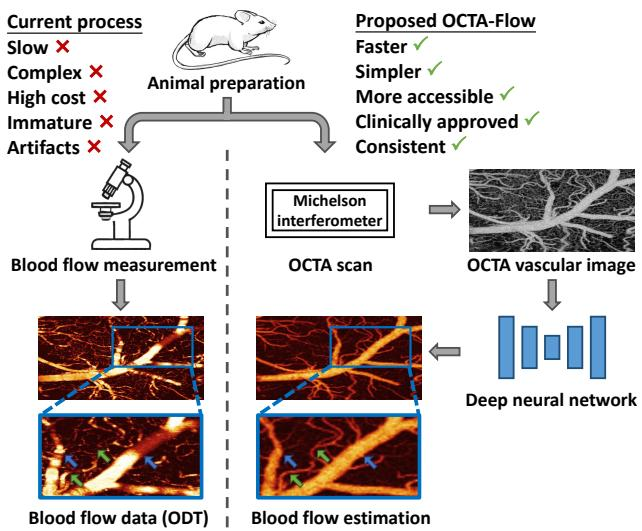
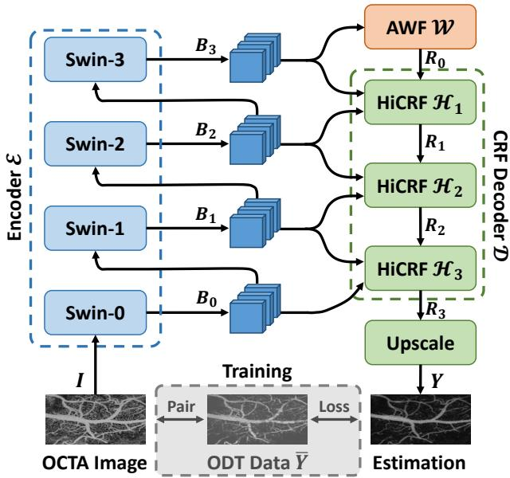
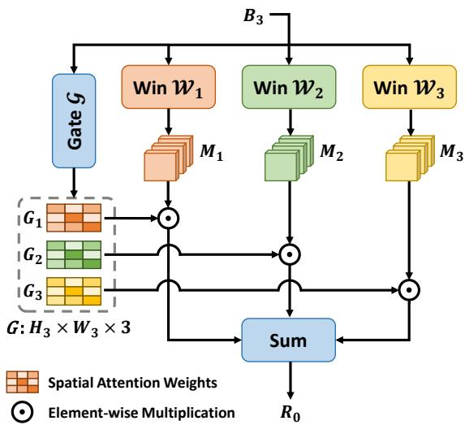
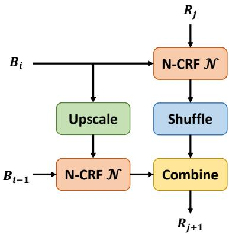
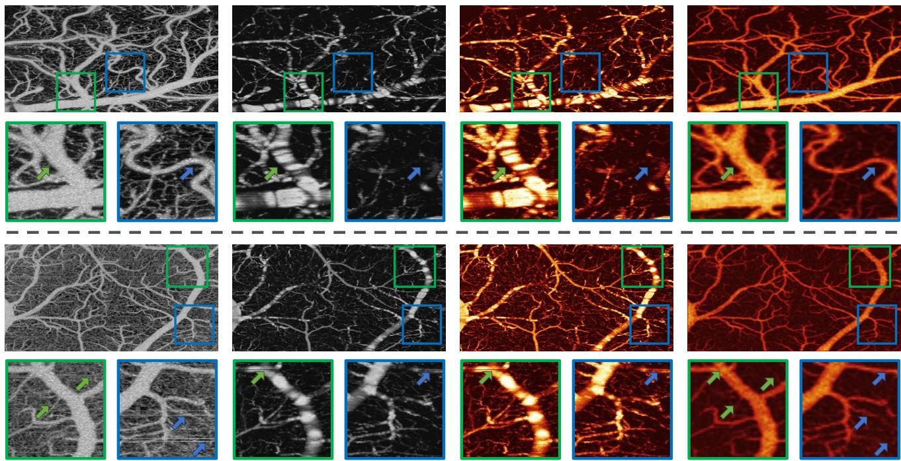

# Blood Flow Speed Estimation with Optical Coherence Tomography Angiography Images

Wensheng Cheng1, Zhenghong Li1, Jiaxiang Ren1, Hyomin Jeong2, Congwu Du2, Yingtian Pan2, Haibin Ling 1

1Department of Computer Science, 2Department of Biomedical Engineering, Stony Brook University {wenscheng,zhenghli,jiaxren,hling}@cs.stonybrook.edu {hyomin.jeong,congwu.du,yingtian.pan}@stonybrook.edu

## Abstract

Estimating blood flow speed is essential in many medical and physiological applications, yet it is extremely challenging due to complex vascular structure andflow dynamics, particularly for cerebral cortex regions. Existing techniques, such as Optical Doppler Tomography (ODT), generally require complex hardware control and signal processing, and still sufferfrom inherent system-level artifacts. To address these challenges, we propose a new learningbased approach named OCTA-Flow, which directly estimates vascular blood flow speed from Optical Coherence Tomography Angiography (OCTA) images that are commonly used for vascular structure analysis. OCTA-Flow employs several novel components to achieve this goal. First, using an encoder-decoder architecture, OCTA-Flow leverages ODT data as pseudo labels during training, thus bypassing the difficulty ofcollecting ground truth data. Second, to capture the relationship between vessels of varying scales and theirflow speed, we design an Adaptive Window Fusion module that employs multiscale window attention. Third, to mitigate ODT artifacts, we incorporate a Conditional Random Field Decoder that promotes smoothness and consistency in the estimated bloodflow. Together, these innovations enable OCTA-Flow to effectively produce accurate flow estimation, suppress the artifacts in ODT, and enhance practicality, benefiting from the established techniques of OCTA data acquisition. The code and data are available at https://github.com/Spritea/OCTA-Flow.

## 1. Introduction

Blood flow speed measurement provides insights into vascular health and functions [16, 28, 31, 38] that are critical in medical and physiological research. However, precise blood flow speed measurement is extremely challenging in practice [40] due to complex vascular structure and flow dynamics, especially for cerebral cortex regions, where vessel architecture is highly intricate, and sizes vary largely [41].

  
Figure 1. Current blood flow measurement process (left) is slow, complex, costly, immature for clinical use, often suffering from system-level artifacts (highlighted by arrows in zoomed-in panels). In contrast, the proposed OCTA-Flow (right) is faster, simpler, and more accessible by leveraging the clinically approved OCTA technique while mitigating artifacts and generating consistent estimations. Blood flow results are visualized in colormap.

Existing blood flow (referring to speed in this work) measurement techniques are complex and prone to systemlevel artifacts that affect accuracy [11]. For example, Optical Doppler Tomography (ODT) is costly, requires precise hardware control, and involves complex signal processing [43]. Moreover, ODT is affected by angle artifacts when the light is nearly perpendicular to the vessel, causing artifacts that show drastic flow changes and even disruptions in vessel structures [39, 45] (see blue arrows and green arrows respectively in the zoomed-in panels of Fig. 1).

Driven by the above observation, we propose a novel solution, named OCTA-Flow, which leverages the power of modern deep learning techniques and the practicality of the Optical Coherence Tomography Angiography (OCTA) technique. As shown in Fig. 1, OCTA-Flow directly estimates flow speed from an input OCTA image, suppresses the artifacts in ODT, and enjoys the practicality of established OCTA acquisition techniques.

It is worth noting that, despite being popularly used in clinical and biomedical research for analyzing vascular structures [12, 18], OCTA is not designed for blood flow estimation. At first glance, the vascular structure information in OCTA images provides little/limited clue about the flow speed. However, as we will show later, the prior knowledge of hemodynamics [2, 29] encoded (implicitly and noisily) in OCTA, when combined with carefully designed learning architecture, can serve as an effective flow estimator.

With the above motivation, we develop several novel components in OCTA-Flow for estimating blood flow speed. First, OCTA-Flow employs an encoder-decoder architecture for flow estimation. A primary challenge is the absence of ground truth flow data for model training. To address this, we use the noisy flow estimations from ODT as pseudo labels for supervision. Specifically, we construct datasets containing paired high-resolution OCTA and ODT data from the mouse cerebral cortex, which features complex vascular structures. Second, an Adaptive Window Fusion (AWF) module is designed to capture the correlation between vessels of varying scales and their flow speed. AWF uses multiple window attention blocks [23] with varying window sizes to extract features at different scales, and then applies automatically generated weights to adaptive feature fusion. This way, it effectively adapts to the vascular distribution across different OCTA images and handles the large variation of different vascular structures. Third, a Conditional Random Field Decoder (CRFD) is incorporated to ensure the smoothness in blood flow and meanwhile mitigate artifacts in ODT data (during training). CRFD models the relationship among multilevel features and optimizes both the relationship and features to improve the smoothness of blood flow estimation.

For evaluation, we collected two real datasets in vivo from the mouse cerebral cortex. Experiments on both datasets demonstrate that OCTA-Flow not only produces accurate flow estimations but also avoids the angle artifacts present in ODT measurements. We believe this work can inspire researchers to explore this emerging field with significant practical value, as it has the potential to make blood flow measurement more accessible and further improve measurement accuracy.

In summary, our contributions are as follows.

• We propose OCTA-Flow, a novel solution for blood flow estimation that directly predicts blood flow from OCTA images. In addition to providing high-quality flow estimation, OCTA-Flow bypasses the need for costly and practically challenging measurement techniques like ODT.

• We propose using ODT data as pseudo labels for blood flow of OCTA images during training, addressing the lack of ideal ground truth blood flow speed measurement data.

• We propose an Adaptive Window Fusion module, which captures the correlation between vessels at different scales and their corresponding blood flow speed by multiple window attention blocks and adaptive integration.

• We introduce the Conditional Random Field Decoder to enforce flow estimation smoothness and mitigate ODT artifacts by modeling multilevel feature relationships.

• We build datasets of paired OCTA and ODT images with varied characteristics, which are collected under different animal conditions.

• Experiments show that our method generates accurate flow estimations from OCTA images, outperforms alternative methods, and mitigates artifacts in ODT data.

## 2. Related Work

## 2.1. Blood Flow Speed Measurement

Blood flow speed measurement is crucial in biomedical research but typically requires costly hardware, complex operations, and advanced signal processing [11, 40]. Common techniques include Doppler Ultrasound [30], Phase-Contrast MRI [8], and Optical Doppler Tomography [5, 19]. Doppler Ultrasound and MRI detect blood flow in thick tissues but lack the resolution for high-precision measurements. ODT offers high-resolution capillary imaging but suffers from artifacts, leading to inconsistent and underestimated results, limiting clinical use [43, 44].

To bypass these issues of existing blood flow measurements, our work seeks an alternative solution by directly predicting blood flow from OCTA images, while using ODT data as pseudo label during model training.

## 2.2. Optical Coherence Tomography Angiography

Optical Coherence Tomography Angiography (OCTA) is widely used in clinical and biomedical research [12, 18]. OCTA uses speckle decorrelation to distinguish between vessels and surrounding tissues, where vasculature generally has higher intensity variance across frames than the static tissue, due to the moving red blood cells [33].

Despite its success in vascular structure analysis, OCTA is not designed for blood flow estimation. Typically, a specialized blood flow measurement technique like ODT is additionally used to obtain flow information, where data from both modalities are utilized for physiology study [26]. Although recent works [1, 10] have attempted to estimate blood flow using OCTA, they rely on raw signals with statistical models, require specialized OCT systems, and generally produce less accurate results than dedicated blood flow measurement techniques. To our best knowledge, our work is the first to directly estimate blood flow speed from OCTA images using generic OCT systems, which is expected to open a new door for the task.

## 2.3. Deep Regression and Pseudo Labels

Regression is a fundamental task for machine learning. Deep learning-based regression methods have demonstrated their advantage on various regression problems, including age estimation [25], crowd counting [3], human pose estimation [35], and depth estimation [24]. Motivated by the strong learning ability of deep models on complex patterns, we formulate the blood flow estimation in a regression form and develop a deep model to tackle the problem.

Pseudo labels are typically used in problems where the perfect ground truth data is not available, such as weaklysupervised learning problems [20]. Pseudo labels enable models to learn from more samples without ideal labels, improving their performance and generalization. Here we adopt the ODT flow data as the pseudo labels, which contain valuable fine-grained flow information. Despite the presence of artifacts, this approach enables us to leverage the inherent common characteristics of blood flow data.

## 3. OCTA-Flow

## 3.1. Problem Formulation

Formally, during inference, given an OCTA image $I \in$ $\mathbb { R } ^ { H \times W }$ of size $H \times W$ , the task of blood flow estimation is to learn a flow estimation model $\mathcal { F } _ { \theta }$ that directly estimates the pixel-wise blood flow speed $\boldsymbol { Y } ~ \in ~ \mathbb { R } ^ { H \times W }$ by $Y = \mathcal { F } _ { \theta } ( I )$ , where θ represents parameters of $\mathcal { F }$

To train the model ${ \mathcal { F } } _ { \theta } .$ given a set of K paired OCTA-ODT images $\{ I _ { k } , \overline { { Y } } _ { k } \} _ { k = 1 } ^ { K }$ , with the ODT data $\overline { { Y } } _ { k } ~ \in$ $\mathbb { R } ^ { H \times W }$ as the pseudo label for $I _ { k }$ , the model learns to minimize the discrepancy between ${ \overline { { Y } } } _ { k }$ and estimated blood flow $Y _ { k } = \mathcal { F } _ { \theta } ( I _ { k } )$ by:

$$
\operatorname* { m i n } _ { \theta } \sum _ { k = 1 } ^ { K } \mathcal { L } ( \mathcal { F } _ { \theta } ( I _ { k } ) , \overline { { Y } } _ { k } ) ,\tag{1}
$$

where $\mathcal { L } ( \cdot )$ is the loss function measuring the discrepancy explained in Sec. 3.5.

## 3.2. Overview of OCTA-Flow

The overview of the proposed OCTA-Flow is shown in Fig. 2. It has an encoder-decoder like pipeline. A multistage backbone network E (Swin Transformer [23]) serves as the encoder to extract multilevel features, denoted by:

$$
\mathbb { B } = \left\{ B _ { 0 } , B _ { 1 } , B _ { 2 } , B _ { 3 } \right\} = \mathcal { E } ( I ) ,\tag{2}
$$

where $B _ { i } \in \mathbb { R } ^ { H _ { i } \times W _ { i } \times C _ { i } } , i \in \{ 0 , 1 , 2 , 3 \}$ , are the multilevel features extracted from blocks of different depths. Then the deep feature $B _ { 3 }$ is fed to the proposed Adaptive Window Fusion module W to extract adaptive multiscale context information to handle vasculature of various sizes, denoted by:

  
Figure 2. Overview of OCTA-Flow. Our model directly estimates pixel-wise blood flow speed from a given OCTA image during inference. ODT data is only used as the pseudo label during the training process.

$$
R _ { 0 } = \mathcal { W } ( B _ { 3 } ) \in \mathbb { R } ^ { H _ { 3 } \times W _ { 3 } \times C _ { 0 } ^ { R } } ,\tag{3}
$$

where $C _ { 0 } ^ { R }$ is the channel number of $R _ { 0 }$ . Next, the introduced Conditional Random Field Decoder D captures the relation of these multilevel features, and enforces smoothness in the prediction results, leading to:

$$
R _ { 3 } = { \mathcal { D } } ( \mathbb { B } , R _ { 0 } ) \in \mathbb { R } ^ { H _ { 0 } \times W _ { 0 } } .\tag{4}
$$

Finally, $R _ { 3 }$ is upscaled with bilinear upsampling to get the pixel-wise blood flow speed estimation $Y \in \mathbb { R } ^ { \breve { H } \times W }$ corresponding to the OCTA input image I.

## 3.3. Adaptive Window Fusion

The vascular system in animals exhibits a remarkable complexity in structure, especially on vessel size. For instance, the mouse cerebral cortex contains vascular structures of varying sizes, such as large pial vessels, medium-sized arteries and veins, and small capillaries. Vessels of different sizes exhibit distinct blood flow speed patterns, since vessel size significantly impacts blood flow speed [2].

To capture the relation between vessels of varying sizes and their blood flow speed, it is essential to incorporate multiscale contextual information. Hence, we propose the Adaptive Window Fusion module, which extracts multiscale context information and integrates them conditioned on the input adaptively. This adaptive fusion process tailors the feature integration to the specific characteristics of each input, enhancing the ability to capture the relation between diverse vascular structures and the blood flow speed. Fig. 3 shows this module’s structure. This module is composed of two parts, one for multiscale context information extraction, and the other for adaptive feature integration.

Window-based Context Extraction. We propose to utilize the window attention mechanism [23] with varying window sizes to capture multiscale context information from the deep features. The small window focuses on local details and captures fine-grained structures, while the large window attends to a wider area and provides more holistic information. Formally, the process is expressed as

$$
M _ { i } = \mathcal { W } _ { i } ( B _ { 3 } ) , i \in \{ 1 , 2 , 3 \} .\tag{5}
$$

Here $\mathcal { W } _ { i }$ is the window attention blocks with window size of $w _ { i } \times w _ { i } , i \in \{ 1 , 2 , 3 \}$ $B _ { 3 } ~ \in ~ \mathbb { R } ^ { H _ { 3 } \times W _ { 3 } \times C _ { 3 } }$ is the input deep feature, and $M _ { 1 } , M _ { 2 } , M _ { 3 } \in \mathbb { R } ^ { H _ { 3 } \times W _ { 3 } \times C _ { 0 } ^ { R } }$ are the extracted multiscale context information.

For each window attention block, since the regular window-based attention focuses on each non-overlapping window itself, to bridge and provide connection of windows, the shifted-window attention [23] is further applied following the regular window-based attention. Formally, the window attention block $\mathcal { W } _ { i } , \ : i \in \ : \{ 1 , 2 , 3 \}$ , consists of consecutive operations below:

$$
\begin{array} { r l } & { \widehat { M _ { i } } = \mathbf { W } \mathbf { - M S A } _ { i } ( \mathbf { L N } ( B _ { 3 } ) ) + B _ { 3 } , } \\ & { \widehat { M _ { i } } = \mathbf { M L P } ( \mathbf { L N } ( \widehat { M _ { i } } ) ) + \widehat { M _ { i } } , } \\ & { \widehat { M _ { i } } = \mathbf { S W } \mathbf { - M S A } _ { i } ( \mathbf { L N } ( \overline { { M _ { i } } } ) ) + \overline { { M _ { i } } } , } \\ & { M _ { i } = \mathbf { M L P } ( \mathbf { L N } ( \widetilde { M _ { i } } ) ) + \widehat { M _ { i } } . } \end{array}\tag{6}
$$

Here $\mathbf { W } \mathbf { - M S A } _ { i } , \mathbf { \Phi } \mathbf { S W - M S A } _ { i }$ refer to the regular window multi-head self-attention and the shifted window multi-head self-attention with window size of $w _ { i } \times w _ { i }$ respectively. LN and MLP refer to layer norm and multilayer perceptron.

This window-based multiscale context information extraction method enjoys multiple key advantages, compared with the widely used pyramid pooling method [48]. (1) Our method keeps more complete information than pyramid pooling. The window attention mechanism maintains information for every element in the input, while the pooling method only keeps local maximum, resulting in inevitable information loss, especially on details like small vessels. (2) As an attention mechanism [37], window attention automatically adjusts the feature weights based on the input vasculature feature, focusing on important regions and features, while the pyramid pooling, as a non-parametric method, uses fixed-scale pooling operations, which are much less adaptive to content and cannot adjust focus accordingly.

Figure 3. The Adaptive Window Fusion module. This module extracts multiscale context information with window attention, and adaptively integrates them with dynamically generated finegrained spatial attention weights conditioned on the input.  
  
Figure 4. The Hierarchical CRF block. This block models the interdependencies between multilevel features hierarchically, enforcing consistent and smooth blood flow estimation results.

(3) Window attention with shifting enables efficient information flow and interaction across different windows, and blends them naturally. In contrast, pyramid pooling typically extracts features of each pooling window independently, lacking interaction across pooling windows.

Adaptive Feature Integration. The biological and anatomical study [41] shows that the vascular structure differs across regions and individuals, due to metabolic and functional differences. Therefore, we emphasize that the vessel feature integration should be content-aware, depending on the specific vasculature characteristics of the input. Here we propose an adaptive method to integrate multiscale context information dynamically, conditioned on the input vasculature feature. This enables content-aware fusion, which fusion with fixed weights [48] cannot achieve.

Specifically, for the input content $B _ { 3 }$ , a convolutional gate G is applied to generate the feature weight combination G dynamically. The weight combination is split by channel to obtain three single-channel weights $G _ { 1 } , G _ { 2 } , G _ { 3 }$ , for multiscale context features respectively. Then the weighted sum is performed to combine all context features, which forms the module’s output $R _ { 0 }$ . Formally, the process is:

$$
\begin{array} { c } { { G = { \mathcal G } ( B _ { 3 } ) , \quad ( G _ { 1 } , G _ { 2 } , G _ { 3 } ) = \mathrm { S P } ( G ) , } } \\ { { { \cal R } _ { 0 } = G _ { 1 } \odot M _ { 1 } + G _ { 2 } \odot M _ { 2 } + G _ { 3 } \odot M _ { 3 } . } } \end{array}\tag{7}
$$

Here $B _ { 3 } \in \mathbb { R } ^ { H _ { 3 } \times W _ { 3 } \times C _ { 3 } } , G \in \mathbb { R } ^ { H _ { 3 } \times W _ { 3 } \times 3 } , G _ { 1 } , G _ { 2 } , G _ { 3 } \in$ $\mathbb { R } ^ { H _ { 3 } \times W _ { 3 } }$ , and SP refers to the channel splitting operation, which extracts every channel of G as the weights. ⊙ denotes the element-wise multiplication with broadcasting, where $G _ { i } , \ i \in \ \{ 1 , 2 , 3 \}$ is changed from single channel to $C _ { 0 } ^ { R }$ channels by repeating on the channel-axis before performing element-wise multiplication.

Instead of predicting a scalar weight, which multiplies the context feature elements with a same number, we generate a weight matrix $G _ { i } .$ It can be regarded as the spatial attention weight [4], which assigns a unique weight to each element in the spatial dimensions of the context feature. This achieves a more refined attention mechanism that can selectively emphasize or suppress specific regions of the context feature based on the input vasculature feature in the fusion process.

Based on the above process, we provide a robust mechanism for content-aware, multiscale context feature integration. It offers adaptive and fine-grained feature fusion, tailored to the unique characteristics of the input vasculature. Combined with the window-based multiscale context extraction method, they enhance the model’s capacity to recognize diverse vascular structures, and capture the correlation between them and the blood flow speed.

## 3.4. Conditional Random Field Decoder

Conditional Random Field (CRF) [36] is a probabilistic model for structured prediction problems, where the outputs are interdependent rather than independent. It models the relation between the node and its adjacent nodes in a graph, and infers the result by considering these relations comprehensively, leading to consistent and smooth results.

Given that blood flow at a certain position is closely related to its neighbor areas and should exhibit local continuity [2], we propose the Conditional Random Field Decoder (CRFD), inspired by the robust relational modeling capabilities of CRF. The CRF Decoder captures the interdependencies of multilevel features in the form of CRF. By jointly optimizing both the feature relationships and the feature values through backpropagation, this approach enhances the smoothness and accuracy of blood flow estimation.

Hierarchical CRF block. To model the relation of multilevel features, we propose the Hierarchical CRF (HiCRF)

block. Fig. 4 shows its structure. It takes three features from different levels, and models the relation between them progressively and hierarchically. Specifically, given low level feature $\bar { B } _ { i - 1 } \in \mathbb { R } ^ { H _ { i - 1 } \times W _ { i - 1 } \times \bar { C } _ { i - 1 } }$ , and middle level feature $B _ { i } \ \in \ \mathbb { R } ^ { H _ { i } \times W _ { i } \times C _ { i } }$ from the backbone network, and high level feature $R _ { j } \in \mathbb { R } ^ { H _ { i } \times W _ { i } \times C _ { j } ^ { R } } , j \in \{ 0 , 1 , 2 \}$ , from the previous HiCRF block (or AWF for $R _ { 0 } )$ , we model the relation between $B _ { i - 1 }$ and $B _ { i } ,$ and the one between $B _ { i }$ and $R _ { j }$ with the Neural CRF (N-CRF) unit $\mathcal { N }$ respectively. Then the relations are integrated by concatenation and projection as the block’s output. Formally, the process is:

$$
\begin{array} { r l } & { \quad Z _ { i , j } = N ( B _ { i } , R _ { j } ) , } \\ & { Z _ { i - 1 , i } ^ { \prime } = N ( B _ { i - 1 } , \operatorname { U P } ( B _ { i } ) ) , } \\ & { \quad R _ { j + 1 } = \operatorname { P r o j } ( Z _ { i - 1 , i } ^ { \prime } \oplus \operatorname { P S } ( Z _ { i , j } ) ) . } \end{array}\tag{8}
$$

Here $R _ { j + 1 } \in \mathbb R ^ { H _ { i - 1 } \times W _ { i - 1 } \times C _ { j + 1 } ^ { R } }$ is the output of one Hi-CRF block. UP represents bilinear upsampling, PS represents pixel shuffle, Proj represents projection, and ⊕ denotes concatenation by channel. Pixel shuffle is applied to $Z _ { i , j } ^ { R }$ , due to its deep semantic context from $R _ { j }$ with a large channel count, enhancing sharpness and reducing computational load. Bilinear upsampling is applied to $B _ { i }$ , because it has a mix of semantic and spatial information with a moderate channel count, preserving structural coherence and aligning it spatially with $B _ { i - 1 }$ for later interaction.

Three consecutive HiCRF blocks, $\mathcal { H } _ { 1 } , \mathcal { H } _ { 2 } , \mathcal { H } _ { 3 } ,$ , cascade to form the complete CRF Decoder, represented as:

$$
\begin{array} { r } { R _ { 1 } = \mathcal { H } _ { 1 } ( B _ { 3 } , B _ { 2 } , R _ { 0 } ) , } \\ { R _ { 2 } = \mathcal { H } _ { 2 } ( B _ { 2 } , B _ { 1 } , R _ { 1 } ) , } \\ { R _ { 3 } = \mathcal { H } _ { 3 } ( B _ { 1 } , B _ { 0 } , R _ { 2 } ) . } \end{array}\tag{9}
$$

The HiCRF blocks benefit the blood flow estimation problem from multiple aspects. (1) It leverages the dependencies between neighbor regions, smooths out flow predictions, and generates more consistent flow results. (2) The integration of multilevel features enables the model to capture both low-level fine-grained structure details, and high-level context with rich semantics. (3) By passing features through cascaded HiCRF blocks, the model iteratively adjusts the features and refines predictions, improving the ability on handling regions with complex flow dynamics.

Neural CRF unit. With the development of deep learning, multiple works implement CRF with neural networks and train the whole network end-to-end [22, 42, 49]. Here we adopt the Neural CRF (N-CRF) implementation [46], due to its ability to model dense pairwise relations comprehensively. It implements fully-connected CRF with window attention [23]. Specifically, the CRF energy function is composed of the unary potential term, which describes the node itself, and the pairwise potential term, which models the dependencies between nodes. The Neural CRF unit implements the unary potential term with convolution layers, and the pairwise potential term with window attention. The energy function is optimized with the whole model end-to-end by back propagation. Please refer to [46] for details.

## 3.5. Loss Function

Since the blood flow speed varies a lot for different vessels, simply calculating the absolute error makes the training process dominated by vessels with large blood flow, and ignores those small ones. Besides, the drastic change and extreme values in the pseudo blood flow label caused by the measurement artifacts need to be handled to alleviate its influence on model training.

To address issues above, we adopt a scale-invariant logarithmic loss [7] for model training. Formally, the loss function is defined as:

$$
\mathcal { L } = \alpha \sqrt { \frac { 1 } { N } \sum _ { i } g _ { i } ^ { 2 } - \frac { \lambda } { N ^ { 2 } } ( \sum _ { i } g _ { i } ) ^ { 2 } } ,\tag{10}
$$

where $g _ { i } = \log y _ { i } - \log { \bar { y _ { i } } }$ is the logarithmic difference between the prediction $y _ { i }$ and the pseudo label $\bar { y _ { i } }$ . N is the number of pixels in an image. α, λ are constant factors. The logarithmic scaling compresses the blood flow values to similar ranges, and reduces the impact of absolute magnitude differences. It also alleviates the influence of extreme values in the pseudo label due to measurement artifacts and allows for more reliable learning.

## 3.6. Dataset

To validate this approach, we build datasets with paired OCTA images and ODT blood flow measurements of the mouse cerebral cortex. We use ODT for high-resolution, high-sensitivity blood flow data [34, 43]. The data collection involves three steps: animal preparation, data acquisition, and data processing. Mice require at least 2 months to mature, followed by cranial window surgery and recovery. An ultrahigh-resolution fiber optic OCT system [44] then captures OCTA or ODT data from the same brain region. Raw data is processed with specialized algorithms to generate data volumes, which are projected to 2D images. Note that the OCTA data is 8-bit, while the ODT data is 16-bit, which increases the blood flow speed estimation difficulty.

Because the animal’s state (anesthetized or awake) affects imaging characteristics [9], we collected data in both states, creating two separate datasets, Anesthetized Dataset and Awake Dataset. Given the time-consuming and laborintensive process of OCTA/ODT animal data collection, prior animal studies typically use fewer than 10 samples [13, 14, 21]. We have collected 106 samples—53 pairs of OCTA and ODT data from over 30 animals, covering various conditions. This includes 66 anesthetized and 40 awake samples. Samples of Anesthetized Dataset and

Awake Dataset are shown in Fig. 5. OCTA images and ODT data of Awake Dataset are affected by bulk motion artifacts caused by awake animal [9], appearing as striped lines, while data of Anesthetized Dataset is less affected by such artifacts.

## 4. Experiments

## 4.1. Experimental Setup

Implementation details. We adopt Swin Transformer [23] as the model backbone, following previous regression works [32, 46, 47]. $w _ { 1 }$ , w2 and $w _ { 3 }$ are set as 3, 5 and 7 in the AWF module. α and λ are set as 10 and 0.85 in the loss function respectively. We train the model with 50 epochs. The initial learning rate is 0.0002, which gradually decreases to 0.00002. We use Adam optimizer [15] with $\beta _ { 1 }$ as $0 . 9 ,$ and $\beta _ { 2 }$ as 0.999. We have compared our method with recent advanced regression models of various architectures [6, 17, 27, 32, 46, 47]. We use the official implementations of these methods. All methods are trained and evaluated on both Anesthetized Dataset and Awake Dataset for comparison. We perform five-fold cross validation for comprehensive evaluation on both datasets.

Evaluation metrics. We adopt relative absolute error (Abs Rel), and root mean squared error (RMSE) as the metrics to evaluate methods on this task. These metrics are widely used in the regression task [24]. The metrics are computed based on the model’s prediction data with linear scaling, following previous regression works [17, 32]. Abs Rel can handle data with different ranges, and RMSE is more sensitive to large absolute errors. Please refer to the supplementary file for metric details and additional experiments.

## 4.2. Dataset Evaluation

Anesthetized Dataset. Evaluation results on the Anesthetized Dataset are shown in Table 1 (left part). Our method clearly outperforms the comparison methods. For the Abs Rel metric, it surpasses the second-best model by 0.009, and for the RMSE metric, it outperforms the secondbest model by 0.150. These represent significant improvements for these metrics. The low errors, especially Abs Rel of 0.353, show that our model can effectively estimate the blood flow based on the vascular structure, which validates the feasibility of the proposed approach.

Qualitative results of our method are shown in Fig. 5 (top row). ODT measurement is severely affected by the angle artifacts, leading to inconsistent and incorrect results, which appear like alternating bright and black stripes, shown in the green rectangular region. The artifacts can even break vessels, as shown in the blue rectangular region. In contrast, our method can generate consistent and smooth blood flow estimation, with a high alignment with the OCTA vascular structure, thanks to our framework and module design. Our estimation also shows consistency with hemodynamics [2, 29], where the blood flow speed gradually decreases when the blood flow goes from large vessels to small branches.

Table 1. Five-fold cross validation results on Anesthetized Dataset and Awake Dataset. Mean and standard deviation are reported. ↓ indicates that better performance corresponds to smaller values. Results in bold are the best. Results underlined are the second-best.
<table><tr><td rowspan="2">Method</td><td rowspan="2">Architecture</td><td colspan="2">Anesthetized Dataset</td><td colspan="2">Awake Dataset</td></tr><tr><td>Abs Rel ↓</td><td>RMSE↓</td><td>Abs Rel↓</td><td>RMSE↓</td></tr><tr><td>BTS [17]</td><td>DenseNet</td><td> $0 . 3 7 4 { \pm } 0 . 0 3 3$ </td><td> $6 . 7 7 7 { \scriptstyle \pm 0 . 5 3 2 }$ </td><td> $0 . 3 6 6 { \scriptstyle \pm 0 . 0 2 6 }$ </td><td> $6 . 3 3 6 { \scriptstyle \pm 0 . 7 7 6 }$ </td></tr><tr><td>IEBins [32]</td><td>Swin</td><td> $0 . 3 7 7 { \scriptstyle \pm 0 . 0 5 7 }$ </td><td> $7 . 2 1 7 { \scriptstyle \pm 0 . 7 3 0 }$ </td><td> $0 . 3 6 4 { \pm } 0 . 0 5 6$ </td><td> $7 . 9 5 8 { \pm } 1 . 1 9 7$ </td></tr><tr><td>NeuWin [46]</td><td>Swin</td><td> $0 . 3 6 6 { \scriptstyle \pm 0 . 0 4 6 }$ </td><td>6.428±0.337</td><td> $0 . 3 6 7 { \pm } 0 . 0 3 8$ </td><td> $6 . 3 2 4 { \pm } 0 . 7 5 9$ </td></tr><tr><td>Ord Ent [47]</td><td>Swin</td><td> $0 . 3 6 2 { \scriptstyle \pm 0 . 0 4 5 }$ </td><td>6.442±0.447</td><td> $0 . 3 5 9 { \pm } 0 . 0 3 6$ </td><td> $6 . 3 1 5 { \scriptstyle \pm 0 . 8 5 3 }$ </td></tr><tr><td>Diff Depth [6]</td><td>Diffusion</td><td> $0 . 4 8 5 { \scriptstyle \pm 0 . 0 3 7 }$ </td><td>7.649±0.341</td><td> $0 . 4 5 7 { \scriptstyle \pm 0 . 0 7 0 }$ </td><td> $7 . 2 4 1 { \pm } 0 . 7 3 6$ </td></tr><tr><td>ECoDepth [27]</td><td>Diffusion</td><td> $0 . 4 4 5 { \scriptstyle \pm 0 . 0 6 5 }$ </td><td> $7 . 9 5 8 { \pm } 1 . 2 8 6 $ </td><td> $0 . 7 6 6 { \scriptstyle \pm 0 . 0 8 0 }$ </td><td> $7 . 5 1 3 { \pm } 0 . 5 6 5$ </td></tr><tr><td>OCTA-Flow (ours)</td><td>Swin</td><td> $\mathbf { 0 . 3 5 3 { \scriptstyle \pm 0 . 0 4 2 } }$ </td><td>6.278±0.480</td><td> $\mathbf { 0 . 3 1 8 { \overset { . } { = } } 0 . 0 1 8 }$ </td><td>6.037±0.674</td></tr></table>

  
(a) OCTA image  
(b) ODT data  
(c) ODT data w. colormap  
(d) Our estimation w. colormap  
Figure 5. Qualitative results of our method on Anesthetized Dataset (top row) and Awake Dataset (bottom row). Zoomed-in regions with arrows highlight details. Top rows show that our method can generate more continuous and smoother blood flow estimations than ODT data by mitigating the measurement artifacts. Bottom rows show that both OCTA images and ODT data are affected by motion artifacts caused by awake animal’s movements, while our method is robust in handling motion artifacts present in both the OCTA and ODT data.

Awake Dataset. Evaluation results on the Awake Dataset are shown in Table 1 (right part). Our method outperforms comparison methods as well. The increased advantage (0.041 on Abs Rel and 0.278 on RMSE) of our method over the second-best method highlights its robustness to the motion artifacts on this dataset.

Qualitative results of our method are shown in Fig. 5 (bottom row). The OCTA image is heavily influenced by the motion artifacts in the awake group, leading to white striped lines across the whole image, as pointed by the arrows in the zoomed-in rectangular regions of column (a). ODT measurement is also affected by the artifacts, appearing as black striped lines, highlighted by the arrows in the zoomed-in rectangular regions of column (b) and (c). Conversely, our method is robust to motion artifacts, providing a clean blood flow estimation. We attribute this to both the AWF module, which captures intricate vascular structures and discriminates vessels from the artifact noise, and the CRF Decoder, which mitigates the impact of outliers by modeling the interdependencies of multilevel features and enforces consistent and smooth blood flow estimations.

Table 2. Ablation study of the main components on Anesthetized Dataset. Base denotes the UNet-like baseline model. AWF is the Adaptive Window Fusion module. CRFD is the CRF Decoder. ∆ denotes the performance difference compared with the base model. Results in bold are the best.
<table><tr><td>Model Abs Rel ↓</td><td> $\Delta _ { \mathrm { a b s } }$ </td><td>RMSE  $\downarrow \Delta _ { \mathrm { r m s e } }$ </td></tr><tr><td>Base</td><td>0.393</td><td>7.232</td></tr><tr><td> $\mathbf { B a s e } + \mathbf { A W F }$ </td><td>0.344 0.049</td><td>6.998 0.234</td></tr><tr><td> $\mathbf { B a s e + C R F D }$ </td><td>0.358 0.035</td><td>7.011 0.221</td></tr><tr><td>Base + AWF + CRFD (ours)</td><td>0.328 0.065</td><td>6.661 0.571</td></tr></table>

Table 3. Ablation study of the Adaptive Window Fusion module on Anesthetized Dataset. W/O AWF means the model without the AWF module. PPM means replacing the AWF module with the pyramid pooling module. W1, W2, W3 are window attention blocks with different window sizes. G means using the dynamic weights generated by the gate. ∆ denotes the performance difference compared with the model without the AWF module. Results in bold are the best.
<table><tr><td>Model Abs Rel ↓</td><td> $\Delta _ { \mathrm { a b s } }$   $\mathrm { R M S E } \downarrow \Delta _ { \mathrm { r m s e } }$ </td></tr><tr><td>W/O AWF</td><td>0.358 7.011</td></tr><tr><td>PPM</td><td>0.342 0.016 6.964 0.047</td></tr><tr><td> $\mathcal { W } _ { 1 }$ </td><td>0.348 0.010 6.922 0.089</td></tr><tr><td> $\mathcal { W } _ { 1 } + \mathcal { W } _ { 2 }$ </td><td>0.343 0.015 6.838 0.173</td></tr><tr><td> $\mathcal { W } _ { 1 } + \mathcal { W } _ { 2 } + \mathcal { W } _ { 3 }$ </td><td>0.335 0.023 6.790 0.221</td></tr><tr><td> $\mathcal { W } _ { 1 } + \mathcal { W } _ { 2 } + \mathcal { W } _ { 3 } + \mathcal { G } \mathrm { ~ ( o u r s ) }$ </td><td>0.328 0.030 6.661 0.350</td></tr></table>

Table 4. Ablation study of the CRF Decoder on Anesthetized Dataset. W/O CRFD means the model without the CRF Decoder. H , H , H refer to the first, second and third HiCRF block. ∆ denotes the performance difference compared with the model without CRF Decoder. Results in bold are the best.
<table><tr><td>Model</td><td>Abs Rel↓  $\Delta _ { \mathrm { a b s } }$ </td><td> $\mathrm { R M S E } \downarrow$ </td><td> $\Delta _ { \mathrm { r m s e } }$ </td></tr><tr><td>W/O CRFD</td><td>0.344</td><td>6.998</td><td></td></tr><tr><td> $\mathcal { H } _ { 1 }$ </td><td>0.339</td><td>0.005 6.945</td><td>0.053</td></tr><tr><td> $\mathcal { H } _ { 1 } + \mathcal { H } _ { 2 }$ </td><td>0.334</td><td>0.010</td><td>6.884 0.114</td></tr><tr><td> $\mathcal { H } _ { 1 } + \mathcal { H } _ { 2 } + \mathcal { H } _ { 3 } \mathrm { ~ ( o u r s ) }$ </td><td>0.328</td><td>0.016</td><td>6.661 0.337</td></tr></table>

## 4.3. Ablation Study

Main components. Table 2 shows the ablation study results of the main components on Anesthetized Dataset using the default split fold. Base refers to a UNet-like baseline model with skip connections, using the same backbone network as ours. Using AWF or CRF Decoder alone leads to significant performance improvement, and their combination further improves the results. This demonstrates that AWF and CRF Decoder are not only individually effective, but also have complementary effects for the task.

AWF module. Table 3 presents the ablation study results of the AWF module on Anesthetized Dataset. Using one window attention block improves Abs Rel by 0.010 and RMSE by 0.089, and using multiple window attention blocks with different window sizes further boosts the performance by 0.013 on Abs Rel and 0.132 on RMSE. This validates the effectiveness of our window attention based multiscale context information fusing. Applying dynamic weights conditioned on the input brings totally 0.03 improvement on Abs Rel and 0.35 improvement on RMSE. This shows the benefit of using input-based adaptive fusion.

Compared to the pyramid pooling module, our method performs significantly better than it with the improvement of 0.014 on Abs Rel and 0.303 on RMSE. This demonstrates the advantage of our window attention-based method on capturing complicated vascular structure than the widely used pyramid pooling method.

CRF Decoder. Table 4 summarizes the ablation study of the CRF Decoder on the Anesthetized Dataset. Using a single HiCRF block improves Abs Rel by 0.005 and RMSE by 0.053. When more HiCRF blocks are applied in cascade and more features from multiple levels are included, the performance continues increasing, and achieves an improvement of 0.016 on Abs Rel and 0.337 on RMSE. This study demonstrates the effectiveness of modeling interdependencies across multilevel features in the CRF form, and the necessity of progressive refinement through cascaded HiCRF blocks.

## 5. Conclusion

We propose a novel approach for estimating blood flow speed directly from OCTA images, circumventing the need of costly blood flow measurements. ODT data is used as pseudo label to address the lack of ideal ground truth measurement data. We design an Adaptive Window Fusion module to capture the correlation between complex vascular structures and the flow speed, and the CRF Decoder to model interdependencies across multilevel features, enforcing smooth and consistent predictions. In addition, we collected two real datasets for evaluation, and experiments on the datasets demonstrate that our method produces accurate flow speed estimation without the artifacts in ODT measurements. We believe this work can inspire future research in this emerging field of significant practical value, with great potential to make blood flow speed measurement more accessible and accurate.

Acknowledgement. This work was supported in part by NIH Grants 2R01 DA029718 (CD, YP), R21DA042597 (CD, YP, HL), NIH’s Intramural Program of NIAAA (NDV) and NSF Grants 2331769 (HL).

## References

[1] Malvika Arya, Ramy Rashad, Osama Sorour, Eric M Moult, James G Fujimoto, and Nadia K Waheed. Optical coherence tomography angiography (octa) flow speed mapping technology for retinal diseases. Expert review of medical devices, 15 (12):875–882, 2018. 2

[2] Oguz K Baskurt and Herbert J Meiselman. Blood rheology and hemodynamics. In Seminars in thrombosis and hemostasis, pages 435–450. Thieme Medical Publishers, 2003. 2, 3, 5, 7

[3] Lokesh Boominathan, Srinivas SS Kruthiventi, and R Venkatesh Babu. Crowdnet: A deep convolutional network for dense crowd counting. In Proceedings of the 24th ACM international conference on Multimedia, pages 640–644, 2016. 3

[4] Long Chen, Hanwang Zhang, Jun Xiao, Liqiang Nie, Jian Shao, Wei Liu, and Tat-Seng Chua. Sca-cnn: Spatial and channel-wise attention in convolutional networks for image captioning. In Proceedings of the IEEE conference on computer vision and pattern recognition, pages 5659–5667, 2017. 5

[5] Zhongping Chen, Thomas E Milner, Shyam Srinivas, Xiaojun Wang, Arash Malekafzali, Martin JC van Gemert, and J Stuart Nelson. Noninvasive imaging of in vivo blood flow velocity using optical doppler tomography. Optics letters, 22 (14):1119–1121, 1997. 2

[6] Yiquan Duan, Xianda Guo, and Zheng Zhu. Diffusiondepth: Diffusion denoising approach for monocular depth estimation. In European Conference on Computer Vision, pages 432–449. Springer, 2024. 6, 7

[7] David Eigen, Christian Puhrsch, and Rob Fergus. Depth map prediction from a single image using a multi-scale deep network. Advances in neural information processing systems, 27, 2014. 6

[8] Peter D Gatehouse, Jennifer Keegan, Lindsey A Crowe, Sharmeen Masood, Raad H Mohiaddin, Karl-Friedrich Kreitner, and David N Firmin. Applications of phase-contrast flow and velocity imaging in cardiovascular mri. European radiology, 15:2172–2184, 2005. 2

[9] Tristan T Hormel, David Huang, and Yali Jia. Artifacts and artifact removal in optical coherence tomographic angiography. Quantitative Imaging in Medicine and Surgery, 11(3): 1120, 2021. 6

[10] Yunchan Hwang, Jungeun Won, Antonio Yaghy, Hiroyuki Takahashi, Jessica M Girgis, Kenneth Lam, Siyu Chen, Eric M Moult, Stefan B Ploner, Andreas Maier, et al. Retinal blood flow speed quantification at the capillary level using temporal autocorrelation fitting octa. Biomedical Optics Express, 14(6):2658–2677, 2023. 2

[11] AK Jayanthy, N Sujatha, and M Ramasubba Reddy. Measuring blood flow: techniques and applications–a review. Int. J. Res. Review Appl. Sci, 6:203–216, 2011. 1, 2

[12] Yali Jia, Steven T Bailey, Thomas S Hwang, Scott M Mc-Clintic, Simon S Gao, Mark E Pennesi, Christina J Flaxel, Andreas K Lauer, David J Wilson, Joachim Hornegger, et al. Quantitative optical coherence tomography angiography of

vascular abnormalities in the living human eye. Proceed ings of the National Academy of Sciences, 112(18):E2395– E2402, 2015. 2

[13] Zhe Jiang, Zhiyu Huang, Bin Qiu, Xiangxi Meng, Yunfei You, Xi Liu, Mufeng Geng, Gangjun Liu, Chuanqing Zhou, Kun Yang, et al. Weakly supervised deep learning-based op tical coherence tomography angiography. IEEE Transactions on Medical Imaging, 40(2):688–698, 2020. 6

[14] Zhe Jiang, Zhiyu Huang, Yunfei You, Mufeng Geng, Xiangxi Meng, Bin Qiu, Lei Zhu, Mengdi Gao, Jing Wang, Chuan qing Zhou, et al. Rethinking the neighborhood information for deep learning-based optical coherence tomography angiography. Medical Physics, 49(6):3705–3716, 2022. 6

[15] Diederik P Kingma. Adam: A method for stochastic opti mization. arXiv preprint arXiv:1412.6980, 2014. 6

[16] Niels A Lassen, David H Ingvar, and Erik Skinhøj. Brain function and blood flow. Scientific American, 239(4):62–71, 1978. 1

[17] Jin Han Lee, Myung-Kyu Han, Dong Wook Ko, and Il Hong Suh. From big to small: Multi-scale local planar guidance for monocular depth estimation. arXiv preprint arXiv:1907.10326, 2019. 6, 7

[18] Ju-Yeun Lee, Jun Pyo Kim, Hyemin Jang, Jaeho Kim, Sung Hoon Kang, Ji Sun Kim, Jongmin Lee, Young Hee Jung, Duk L Na, Sang Won Seo, et al. Optical coherence tomography angiography as a potential screening tool for cerebral small vessel diseases. Alzheimer’s Research & Therapy, 12:1–10, 2020. 2

[19] Rainer A Leitgeb, Rene M Werkmeister, Cedric Blatter, and´ Leopold Schmetterer. Doppler optical coherence tomogra phy. Progress in retinal and eye research, 41:26–43, 2014. 2

[20] Yi Li, Zhanghui Kuang, Liyang Liu, Yimin Chen, and Wayne Zhang. Pseudo-mask matters in weakly-supervised semantic segmentation. In Proceedings of the IEEE/CVF international conference on computer vision, pages 6964–6973, 2021. 3

[21] Zhenghong Li, Jiaxiang Ren, Zhilin Zou, Kalyan Garigapati, Congwu Du, Yingtian Pan, and Haibin Ling. Self-supervised denoising and bulk motion artifact removal of 3d optical coherence tomography angiography of awake brain. In International Conference on Medical Image Computing and Computer-Assisted Intervention, pages 601–611. Springer, 2024. 6

[22] Fayao Liu, Chunhua Shen, and Guosheng Lin. Deep convolutional neural fields for depth estimation from a single image. In Proceedings of the IEEE conference on computer vision and pattern recognition, pages 5162–5170, 2015. 5

[23] Ze Liu, Yutong Lin, Yue Cao, Han Hu, Yixuan Wei, Zheng Zhang, Stephen Lin, and Baining Guo. Swin transformer: Hierarchical vision transformer using shifted windows. In Proceedings of the IEEE/CVF international conference on computer vision, pages 10012–10022, 2021. 2, 3, 4, 5, 6

[24] Yue Ming, Xuyang Meng, Chunxiao Fan, and Hui Yu. Deep learning for monocular depth estimation: A review. Neuro computing, 438:14–33, 2021. 3, 6

[25] Alice Othmani, Abdul Rahman Taleb, Hazem Abdelkawy, and Abdenour Hadid. Age estimation from faces using deep

learning: A comparative analysis. Computer Vision and Image Understanding, 196:102961, 2020. 3

[26] Yingtian Pan, Kicheon Park, Jiaxiang Ren, Nora D Volkow, Haibin Ling, Alan P Koretsky, and Congwu Du. Dynamic 3d imaging of cerebral blood flow in awake mice using selfsupervised-learning-enhanced optical coherence doppler tomography. Communications Biology, 6(1):298, 2023. 2

[27] Suraj Patni, Aradhye Agarwal, and Chetan Arora. Ecodepth: Effective conditioning of diffusion models for monocular depth estimation. In Proceedings of the IEEE/CVF Conference on Computer Vision and Pattern Recognition, pages 28285–28295, 2024. 6, 7

[28] Eric C Peterson, Zhengfeng Wang, and Gavin Britz. Regulation of cerebral blood flow. Internationaljournal ofvascular medicine, 2011(1):823525, 2011. 1

[29] William J Powers. Cerebral hemodynamics in ischemic cerebrovascular disease. Annals of Neurology: Official Journal of the American Neurological Association and the Child Neurology Society, 29(3):231–240, 1991. 2, 7

[30] Helen F Routh. Doppler ultrasound. IEEE Engineering in Medicine and Biology Magazine, 15(6):31–40, 1996. 2

[31] Heinrich R Schelbert. Anatomy and physiology of coronary blood flow. Journal of nuclear cardiology, 17(4):545–554, 2010. 1

[32] Shuwei Shao, Zhongcai Pei, Xingming Wu, Zhong Liu, Weihai Chen, and Zhengguo Li. Iebins: Iterative elastic bins for monocular depth estimation. Advances in Neural Information Processing Systems, 36, 2023. 6, 7

[33] Richard F Spaide, James G Fujimoto, Nadia K Waheed, Srinivas R Sadda, and Giovanni Staurenghi. Optical coherence tomography angiography. Progress in retinal and eye research, 64:1–55, 2018. 2

[34] Vivek J Srinivasan, Sava Sakadziˇ c, Iwona Gorczynska, Svet-´ lana Ruvinskaya, Weicheng Wu, James G Fujimoto, and David A Boas. Quantitative cerebral blood flow with optical coherence tomography. Optics express, 18(3):2477–2494, 2010. 6

[35] Xiao Sun, Bin Xiao, Fangyin Wei, Shuang Liang, and Yichen Wei. Integral human pose regression. In Proceedings of the European conference on computer vision (ECCV), pages 529–545, 2018. 3

[36] Charles Sutton, Andrew McCallum, et al. An introduction to conditional random fields. Foundations and Trends® in Machine Learning, 4(4):267–373, 2012. 5

[37] A Vaswani. Attention is all you need. Advances in Neural Information Processing Systems, 2017. 4

[38] Monica S Vavilala, Lorri A Lee, and Arthur M Lam. Cerebral blood flow and vascular physiology. Anesthesiology Clinics ofNorth America, 20(2):247–264, 2002. 1

[39] Yimin Wang, Bradley A Bower, Joseph A Izatt, Ou Tan, and David Huang. In vivo total retinal blood flow measurement by fourier domain doppler optical coherence tomography. Journal of biomedical optics, 12(4):041215–041215, 2007. 1

[40] John P Woodcock. Theory and practice of blood flow measurement. Butterworth-Heinemann, 2013. 1, 2

[41] Benyi Xiong, Anan Li, Yang Lou, Shangbin Chen, Ben Long, Jie Peng, Zhongqin Yang, Tonghui Xu, Xiaoquan Yang, Xiangning Li, et al. Precise cerebral vascular atlas in stereotaxic coordinates of whole mouse brain. Frontiers in neuroanatomy, 11:128, 2017. 1, 4

[42] Dan Xu, Wei Wang, Hao Tang, Hong Liu, Nicu Sebe, and Elisa Ricci. Structured attention guided convolutional neural fields for monocular depth estimation. In Proceedings of the IEEE conference on computer vision and pattern recognition, pages 3917–3925, 2018. 5

[43] Jiang You, Congwu Du, Nora D Volkow, and Yingtian Pan. Optical coherence doppler tomography for quantitative cerebral blood flow imaging. Biomedical optics express, 5(9): 3217–3230, 2014. 1, 2, 6

[44] Jiang You, Qiujia Zhang, Kicheon Park, Congwu Du, and Yingtian Pan. Quantitative imaging of microvascular blood flow networks in deep cortical layers by 1310 nm µodt. Op tics letters, 40(18):4293–4296, 2015. 2, 6

[45] Jiang You, Ang Li, Congwu Du, and Yingtian Pan. Volumetric doppler angle correction for ultrahigh-resolution optical coherence doppler tomography. Applied physics letters, 110 (1), 2017. 1

[46] Weihao Yuan, Xiaodong Gu, Zuozhuo Dai, Siyu Zhu, and Ping Tan. Neural window fully-connected crfs for monocular depth estimation. In Proceedings of the IEEE/CVF con ference on computer vision and pattern recognition, pages 3916–3925, 2022. 5, 6, 7

[47] Shihao Zhang, Linlin Yang, Michael Bi Mi, Xiaoxu Zheng, and Angela Yao. Improving deep regression with ordinal entropy. arXiv preprint arXiv:2301.08915, 2023. 6, 7

[48] Hengshuang Zhao, Jianping Shi, Xiaojuan Qi, Xiaogang Wang, and Jiaya Jia. Pyramid scene parsing network. In Proceedings ofthe IEEE conference on computer vision and pattern recognition, pages 2881–2890, 2017. 4

[49] Shuai Zheng, Sadeep Jayasumana, Bernardino Romera-Paredes, Vibhav Vineet, Zhizhong Su, Dalong Du, Chang Huang, and Philip HS Torr. Conditional random fields as recurrent neural networks. In Proceedings ofthe IEEE international conference on computer vision, pages 1529–1537, 2015. 5