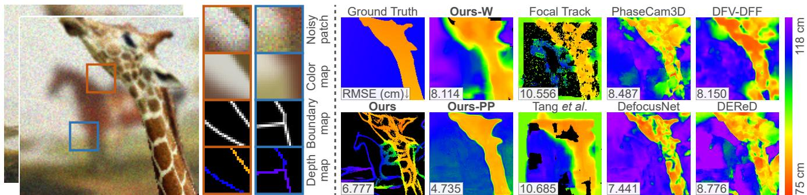
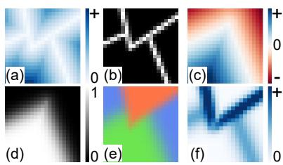
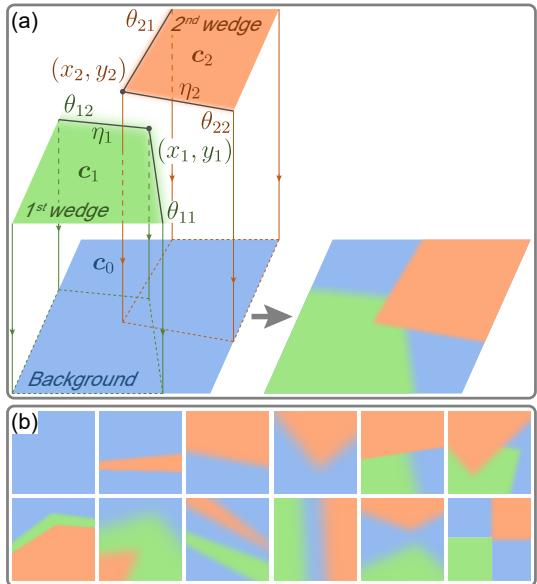
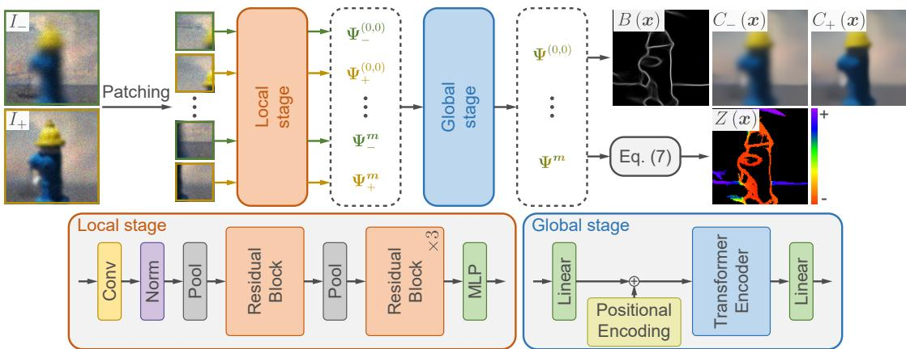
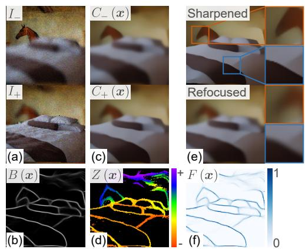
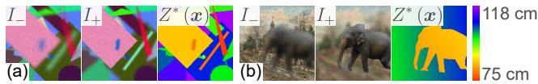
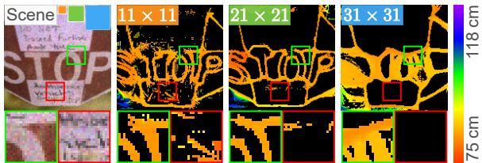
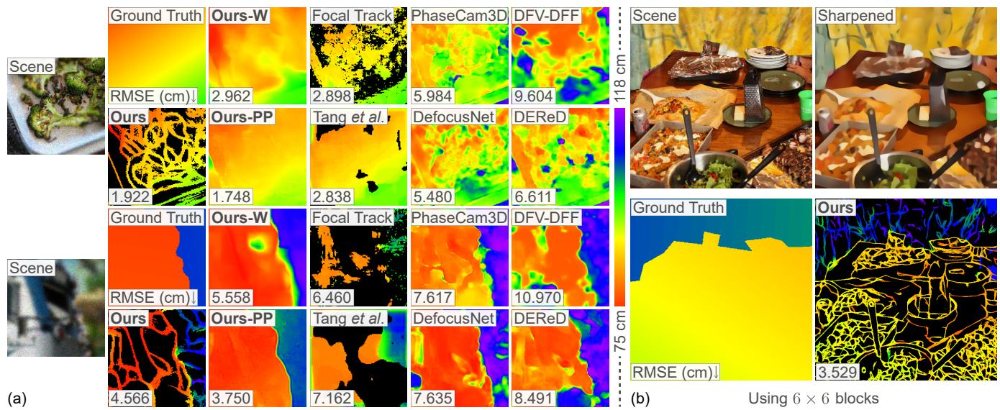
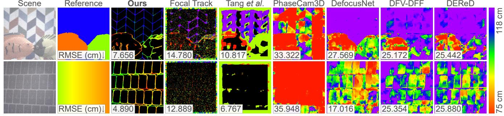

# Blurry-Edges: Photon-Limited Depth Estimation from Defocused Boundaries

Wei Xu, Charles James Wagner, Junjie Luo, and Qi Guo Elmore Family School of Electrical and Computer Engineering, Purdue University {xu1639,wagne329,luo330,qiguo}@purdue.edu

  
Figure 1. Overview. (Left) Blurry-Edges representation parametrically models an image patch’s color, boundary positions, and boundary smoothness. Object depths can be analytically calculated from the smoothness of corresponding boundaries in a pair of differently defocused images. (Right) Compared to a variety of state-of-the-art depth from defocus algorithms [8, 23, 32, 38, 44, 47], our method generates sparse or dense depth maps with the lowest depth estimation errors from photon-limited, noisy images.

## Abstract

Extracting depth information from photon-limited, defo cused images is challenging because depth from defocus (DfD) relies on accurate estimation ofdefocus blur, which is fundamentally sensitive to image noise. We present a novel approach to robustly measure object depths from photonlimited images along the defocused boundaries. It is based on a new image patch representation, Blurry-Edges, that explicitly stores and visualizes a rich set of low-level patch information, including boundaries, color, and smoothness. We develop a deep neural network architecture that predicts the Blurry-Edges representation from a pair of differently defocused images, from which depth can be calculated using a closed-form DfD relation we derive. The experimental results on synthetic and real data show that our method achieves the highest depth estimation accuracy on photonlimited images compared to a broad range of state-of-theart DfD methods.

## 1. Introduction

Depth from defocus (DfD) generates physically accurate depth maps without additional, active illumination like time-of-flight or structured light [14–16, 26], and has a monocular and compact form factor compared to stereo [13,

18]. These advantages make DfD suitable for spatially constrained artificial platforms, such as AR/VR, smartphones and watches, miniature robots, and drones.

However, DfD relies on accurately estimating spatial derivatives in the captured images, a proxy of defocus level, as the depth cue, which is highly susceptible to the image noise [1, 2, 35]. To our knowledge, existing DfD solutions typically avoid this issue by assuming low noise levels in the input image (Tab. 1). Considering DfD’s potential applications, which inevitably include dark environments, there is a pressing need for a DfD algorithm robust to photon-limited, noisy images.

In light of this, we propose a method that robustly estimates object depth along the blurry boundaries from a pair of differently defocused noisy images. It leverages a novel patch structure representation named Blurry-Edges. Blurry-Edges models an image patch as a stack of partially occluded wedges. As shown in Fig. 2, each wedge is parameterized by its vertex, color, and boundary blurriness. We develop a deep neural network to predict the optimal Blurry-Edges parameters that describe each patch and are consistent with neighboring patches’ representation regarding boundary location, smoothness, and color.

To perform depth estimation, our method utilizes a camera with a deformable lens to capture a pair of images of a static scene with varied focal lengths. The images share the same structure but have different smoothness at the boundaries due to the difference in defocus. By estimating the smoothness of the corresponding boundaries using Blurry-Edges, we can calculate the depth along the boundary from a closed-form DfD equation.

We observe several critical advantages of the proposed DfD algorithm. First, it can be trained using naive, synthesized images with basic geometries and effectively estimate depths on real-world captured images without fine-tuning. Second, the Blurry-Edges representation is multifunctional. Besides the depth prediction, Blurry-Edges simultaneously generates a boundary map including edges of all smoothness and a noiseless color map. Last and most importantly, the proposed method demonstrates the unprecedented robustness of estimating depth from photon-limited images. The proposed method shows the highest accuracy in depth prediction using noisy, photon-limited input images compared to state-of-the-art DfD algorithms in both simulation and real-world experiments.

The contribution of the paper includes:

1. A parametrized representation, Blurry-Edges, that simultaneously models the color, boundary, and blurriness of a noisy image patch;

2. A closed-form DfD equation that associates the smoothness of the corresponding boundaries in a pair of differently defocused images to the depth;

3. A deep neural network architecture that robustly estimates object depth along boundaries from a pair of defocused images, handling 4× higher noise level (in standard deviations) than previous DfD algorithms (Tab. 1);

4. A comprehensive simulation and real-world analysis that proves the robustness of the proposed method’s depth estimation under limited photons and its generalizability in training.

All data and code of this work can be found in https://blurry-edges.qiguo.org/.

## 2. Related Work

Depth from defocus (DfD) was first proposed decades ago [28], and it has undergone rapid progress in the past decade thanks to the maturation and accessibility of various optical technologies, such as diffractive optical elements [12], deformable lenses [8], and metasurfaces [9]. There are currently two complementary lines of research in DfD. The first utilizes analytical, non-learning-based solutions that estimate partially dense depth maps with minimal computational resources, and the second exploits learningbased models to produce high-quality, dense depth maps with a higher computational cost.

Analytical DfD algorithms leverage the physical relationship between the image derivatives [11, 22, 24, 39, 42] or local spatial frequency spectrum [10, 17, 45] and the depth. Theoretically, at least two images of the same scene captured with different focal planes are required to measure an object’s depth without ambiguity [36]. Recently, a special family of DfD algorithms, depth from differential defocus, demonstrates unprecedentedly low computational cost by leveraging simple, mathematical relationships between the differential change of image defocus and the object depth and is validated by real-world prototypes [1, 8, 9, 21]. Despite being computationally efficient, a fundamental drawback of these analytical DfD algorithms is the degeneracy, i.e., unreliable depth estimations at textureless regions of the images due to the lack of defocus cues [1, 38]. Fortunately, it is possible to predict where the degeneracies will happen given an image and the unreliable depth estimations in such areas can be removed from the final depth estimation [8, 9, 21, 38].

Learning-based DfD algorithms utilize deep neural network architectures to learn the mapping from the defocused images to the depth values from data [5, 23, 47]. Compared to the analytical solutions, this class of methods achieves higher-quality, dense depth maps at higher computational costs. For example, a recent analytical DfD algorithm costs fewer than 1k floating point operations (FLOPs) per pixel [9], while a U-Net-based DfD algorithm uses 300k FLOPs per pixel [44]. The learning-based DfD algorithms bypass the degeneracy issue by implicitly learning to fill depth values in textureless regions based on neighboring depth estimations. Thanks to recent advances in optical technologies, people have also incorporated the design of the blur kernel into the learning process so that the optical design and the DfD algorithm are optimized in an end-toend fashion [3, 12, 37, 44]. The jointly-optimized systems typically demonstrate more accurate depth estimation than systems with pre-determined, fixed optics.

The sensitivity to image noise is a fundamentally challenging problem in DfD. This is because the defocus information needs to be extracted from the spatial gradients of the images, which becomes increasingly sensitive to noise when the image defocus is significant [31]. As shown in Tab. 1, past DfD algorithms typically assume a relatively low noise level in their experiments. When necessary, these methods simply suppress the noise by averaging multiple frames [1] or binning pixels [8], and some use specially designed filters to locally attenuate the perturbation of the noise [35, 41].

In recent years, a series of works have utilized a novel patch representation, field-of-junction (FoJ), to regularize boundary detection from images [29, 40, 46]. FoJ demonstrates extraordinary robustness in detecting boundary structures from images at an extremely low signal-tonoise ratio, as restricting the variety of local patch structures can effectively attenuate the impact of noise in image restoration [25]. However, FoJ does not model boundary smoothness, and the boundary structures it can represent are limited to lines, edges, and junctions. If a more general patch representation incorporating boundary smoothness and more sophisticated boundary structures can be developed, it could be utilized to detect the defocus along boundaries robustly in the presence of significant noise.

<table><tr><td>Method</td><td>Venue&#x27;Year</td><td>Noise SD (LSB)↑</td><td>Illuminance (lux) ↓</td></tr><tr><td>Focal Flow [1]</td><td>ECCV&#x27;2016</td><td>0.09-0.63</td><td>67,832–3,323,680</td></tr><tr><td>Tang et al. [38]</td><td>CVPR&#x27;2017</td><td>1.50-3.75</td><td>1,916–11,967</td></tr><tr><td>Focal Track [8]</td><td>ICCV’2017</td><td>0.30-2.00</td><td>6,732–299,133</td></tr><tr><td>PhaseCam3D [44]</td><td>ICCP’2019</td><td>2.55</td><td>4,142</td></tr><tr><td>Guo et al. [9]</td><td>PNAS&#x27;2019</td><td>0.70</td><td>54,944</td></tr><tr><td>DefocusNet [23]</td><td>CVPR&#x27;2020</td><td>1.00-4.00</td><td>1,684–26,923</td></tr><tr><td>DEReD [32]</td><td>CVPR&#x27;2023</td><td>1.00-4.00</td><td>1,684–26,923</td></tr><tr><td>Ours</td><td></td><td>18.21-19.22</td><td>74-83</td></tr></table>

Table 1. Image noise of previous DfD work. We convert the noise levels reported by each paper into the standard deviation (SD) in the unit of least significant bit (LSB) for 8-bit images. Images used in this work have at least 4× more significant noise. We also convert the Noise SD to the illuminance under common camera parameters, with calculation details in the supplementary. Images used in this work roughly correspond to photos taken under the twilight or a very dark day [43].

## 3. Methods

## 3.1. Depth from Defocus

Consider a wide-aperture lens imaging a front parallel target. Under paraxial approximation, the captured image on the photosensor is mathematically the convolution of the point spread function (PSF) $k ( { \pmb x } )$ and the pinhole image Q(x):

$$
I \left( \pmb { x } \right) = Q \left( \pmb { x } \right) * k \left( \pmb { x } , \sigma \left( z \right) \right) .\tag{1}
$$

where x is the 2D position on the photosensor. Assuming the PSF has a Gaussian intensity profile and the defocus process follows the thin lens law, the PSF $k ( { \pmb x } )$ can be mathematically expressed as:

$$
k \left( \pmb { x } , \sigma \left( z \right) \right) = \frac { 1 } { 2 \pi \left( \sigma \left( z \right) \right) ^ { 2 } } \exp \left( - \frac { \left. \pmb { x } \right. ^ { 2 } } { 2 \left( \sigma \left( z \right) \right) ^ { 2 } } \right) ,\tag{2}
$$

where the defocus level $\sigma \left( z \right)$ is determined by the target’s depth z and constant parameters of the optical system [8]:

$$
\sigma \left( z \right) = \Sigma \left[ \left( \frac { 1 } { z } - \rho \right) s + 1 \right] .\tag{3}
$$

where Σ represents the standard deviation of the Gaussian aperture function, $\rho$ is the dioptric power of the lens, and s is the separation between the photosensor and the lens.

Now we consider the textures in the pinhole image $Q ( { \pmb x } )$ To approximate the textures of different sharpness, we

model each small patch $P$ of the pinhole image $Q ( { \pmb x } )$ as the convolution of a Gaussian kernel $k ( \pmb { x } ; \xi )$ with standard deviation $\xi$ and a piecewise 2D step function $\bar { Q } ( { \pmb x } )$

$$
Q \left( { \pmb x } \right) = \bar { Q } \left( { \pmb x } \right) * k \left( { \pmb x } , { \pmb \xi } \right) , { \pmb x } \in P .\tag{4}
$$

For sharp textures, the Gaussian kernel has a relatively small standard deviation $\xi ,$ , and vice versa. Combining Eq. (4) with Eq. (1), the captured image $I ( { \pmb x } )$ can be represented as:

$$
I ( { \pmb x } ) = \bar { Q } ( { \pmb x } ) * k \left( { \pmb x } , \sqrt { \sigma ( z ) ^ { 2 } + \xi ^ { 2 } } \right) ,\tag{5}
$$

where the term $\sqrt { \sigma ( z ) ^ { 2 } + \xi ^ { 2 } }$ indicates the smoothness value of the boundaries in the patch $P .$

Consider a deformable lens that can dynamically vary its optical power, with a visualization provided in the supplementary . The system can sequentially capture two images of a static scene, $I _ { + }$ and $I _ { - }$ , with different optical powers, $\rho _ { + }$ and $\rho _ { - } . \mathrm { ~ B y ~ }$ estimating the smoothness value of a corresponding boundary in a patch $P , \eta _ { + }$ and $\eta _ { - }$ , we have the mathematical relationships:

$$
\sqrt { \eta _ { \pm } ^ { 2 } - \xi ^ { 2 } } = \Sigma \left[ \left( \frac { 1 } { z } - \rho _ { \pm } \right) s + 1 \right] .\tag{6}
$$

By combining both equations to cancel out $\xi ,$ we obtain the following equation to calculate the depth of the boundary given a pair of estimated smoothness $\eta _ { + }$ and $\eta _ { - } \colon$

$$
z ( \eta _ { + } , \eta _ { - } ) = \frac { 2 \Sigma ^ { 2 } s ^ { 2 } ( \rho _ { - } - \rho _ { + } ) } { \eta _ { + } ^ { 2 } - \eta _ { - } ^ { 2 } - \Sigma ^ { 2 } s ^ { 2 } ( \rho _ { + } - \rho _ { - } ) ( \rho _ { + } + \rho _ { - } - 2 ) } .\tag{7}
$$

## 3.2. Blurry-Edges Representation

Blurry-Edges represents an image patch as the alpha clipping of l vertically-stacked, constant-color wedges with smooth boundaries. As illustrated in Fig. 2a, each patch is modeled by a set of parameters,

$$
\Psi = \left( \{ p _ { i } , \theta _ { i } , c _ { i } , \eta _ { i } , i = 1 , 2 , \cdot \cdot \cdot , l \} , c _ { 0 } \right) .\tag{8}
$$

The tuple $\left( { { p } _ { i } } , { { \theta } _ { i } } , { { c } _ { i } } , { { \eta } _ { i } } \right)$ parameterize the ith wedge in the patch, with $\pmb { p } _ { i } \ = \ \left( x _ { i } , y _ { i } \right)$ representing the vertex, $\begin{array} { r l } { \pmb { \theta } _ { i } } & { { } = } \end{array}$ $( \theta _ { i 1 } , \theta _ { i 2 } )$ denoting the starting and ending angle, $\mathbf { c } _ { i }$ indicating the RGB color, and $\eta _ { i }$ recording the smoothness of the boundary. The wedge with a large index is in the front. The vector $c _ { \mathrm { 0 } }$ represents the RGB color of the background. As shown in Fig. 2b, this representation can model various boundary structures and smoothness.

Given a Blurry-Edges representation of a patch $\Psi ,$ several types of auxiliary visualizations can be generated. First, the boundary center map b (x; Ψ, δ) highlights the center of each unoccluded boundary in the patch (Fig. 3b.) It is computed via:

$$
b \left( \pmb { x } ; \Psi , \delta \right) = \exp \left[ - \frac { \left( u \left( \pmb { x } ; \Psi \right) \right) ^ { 2 } } { \delta ^ { 2 } } \right] ,\tag{9}
$$

  
Figure 3. Visualizations from a sample Blurry-Edges representation. (a) The unsigned distance map to the nearest unoccluded boundary, u $( \pmb { x } ; \pmb { \Psi } )$ . (b) The corresponding boundary center map, $b \left( \pmb { x } ; \Psi , \delta \right)$ . (c) The signed distance map of the bottom wedge, $d _ { 1 } \left( \pmb { x } ; \pmb { \Psi } \right)$ . (d) The α-map of the bottom wedge, $\alpha _ { 1 } \left( { \pmb x } ; { \pmb \Psi } \right)$ . (e) The color map of the patch, $c \left( x ; \Psi \right)$ . (f) The magnitude of color derivative map of the patch, $c ^ { \prime } \dot { ( } x ; \Psi )$ .

  
Figure 2. Blurry-Edges representation with the number of wedges $l \ = \ 2$ . (a) The ith wedge is parameterized by the vertex position $( x _ { i } , y _ { i } )$ , the starting and ending angle $\left( \theta _ { i 1 } , \theta _ { i 2 } \right)$ , the color $^ { c _ { i } , }$ and the boundary smoothness η . The rendering of the patch is through the α-clipping of the wedges. (b) Blurry-Edges can represent a variety of boundary structures. In particular, it can represent structures with various boundary smoothness.

where $\delta$ is a hyperparameter that controls the stroke of the visualized boundaries and u $, ( \pmb { x } ; \pmb { \Psi } )$ is an unsigned distance map to the nearest unoccluded boundary center for each pixel. The exact calculation of the distance map can be found in the supplementary. Figure 3a shows the distance map to generate Fig. 3b.

Second, the color map $c \left( \pmb { x } ; \pmb { \Psi } \right)$ is the rendering of the stacked, colored wedges according to their boundary smoothness and occlusion. It can be computed via $\alpha \mathrm { - }$

clipping:

$$
c ( \pmb { x } ; \Psi ) = \sum _ { i = 0 } ^ { l } { c _ { i } \alpha _ { l  i } ( \pmb { x } ; \Psi ) } ,\tag{10}
$$

where $\alpha _ { l  i } ( \pmb { x } ; \pmb { \Psi } )$ is the collective α-map from the lth to the ith wedge:

$$
\alpha _ { l \to i } \left( { \pmb x } ; { \pmb { \Psi } } \right) = \alpha _ { i } \left( { \pmb x } ; { \pmb { \Psi } } \right) \prod _ { j = i + 1 } ^ { l } \left( 1 - \alpha _ { j } \left( { \pmb x } ; { \pmb { \Psi } } \right) \right) .\tag{11}
$$

The term $\alpha _ { i } \left( \pmb { x } ; \pmb { \Psi } \right)$ is the α-map of the ith wedge:

$$
\alpha _ { i } \left( { \pmb x } ; { \pmb \Psi } \right) = \frac { 1 } { 2 } \left[ 1 + \mathrm { e r f } \left( \frac { d _ { i } \left( { \pmb x } ; { \pmb \Psi } \right) } { \sqrt { 2 } \eta _ { i } } \right) \right] ,\tag{12}
$$

where erf(·) indicates the Gausian error function, $d _ { i } \left( \pmb { x } ; \pmb { \Psi } \right)$ denotes the signed distance map of the ith wedge (Fig. 3c), and $\eta _ { i }$ is the boundary smoothness of the wedge. Figure 3e shows a sample color map that corresponds to the boundary center map in Fig. 3b.

Besides the boundary center map and the color map, Blurry-Edges also enables a color derivative map $c ^ { \prime } \left( \pmb { x } ; \pmb { \Psi } \right)$ that highlights the boundary smoothness. We compute the color derivative map as the color map’s response to the Sobel operator [34]:

$$
c ^ { \prime } \left( { \pmb x } ; { \pmb \Psi } \right) = \sqrt { \left( c \left( { \pmb x } ; { \pmb \Psi } \right) * G _ { x } \right) ^ { 2 } + \left( c \left( { \pmb x } ; { \pmb \Psi } \right) * G _ { y } \right) ^ { 2 } } ,\tag{13}
$$

where $G _ { x }$ and $G _ { y }$ are the Sobel kernels in x and y directions. A sample color derivative map is visualized in Fig. 3f.

## 3.3. Depth estimation

Figure 4 shows our DfD algorithm based on the Blurry-Edges representation. The input is a pair of differently defocused images of a static scene, $I _ { + } , \bar { I } _ { - } \in \mathbb { R } ^ { H \times W \times k }$ . For simplicity of notation, we use $I _ { \pm }$ to represent the pair of images throughout the paper. The model first estimates the Blurry-Edges representation of the images in two stages and then generates the depth map from it.

First, our method divides the images into uniform-size, overlapping patches and independently predicts the Blurry-Edges representation of each patch using a convolutional neural network (CNN) based architecture. Given a patch, $P \in \mathbb { R } ^ { h \times w \times k }$ , the CNN predicts a part of its Blurry-Edges representation, including the vertex locations $\{ { \pmb p } _ { i } \}$ , the angles $\{ \pmb \theta _ { i } \}$ , and the boundary smoothness $\{ \eta _ { i } \}$ . Then, it computes the color information $\left\{ c _ { i } \right\}$ using these predicted parameters and the patch P via ridge regression:

$$
[ \begin{array} { l } { c _ { 0 } } \\ { \vdots } \\ { c _ { l } } \end{array} ] = ( \boldsymbol { A } ^ { \top } \boldsymbol { A } + \lambda \mathbb { I } _ { ( l + 1 ) \times ( l + 1 ) } ) ^ { - 1 } [ \begin{array} { l } { \alpha _ { l  0 } ( \pmb { x } ) \cdot P ( \pmb { x } ) } \\ { \vdots } \\ { \alpha _ { l  l } ( \pmb { x } ) \cdot P ( \pmb { x } ) } \end{array} ]\tag{14}
$$

  
Figure 4. Framework of the proposed model. There are two stages. The local stage consists of residual blocks and predicts the Blurry-Edges representation for each patch locally. The global stage consists of a Transformer Encoder and refines the Blurry-Edges representation for all patches globally. Finally, the framework combines all the per-patch representations and outputs the global boundary map, color map, and depth map.

where $\alpha _ { l \to 0 } \left( { \pmb x } \right)$ is the collective α-map described in Eq. (11) and $\alpha _ { l  i } ( \pmb { x } ) \cdot P ( \pmb { x } )$ indicate the channel-wise dot product between the collective α-map and the patch, and the matrix $A = \left\lceil \alpha _ { l \to 0 } ( \pmb { x } ) \cdot \cdot \cdot \alpha _ { l \to l } ( \pmb { x } ) \right\rceil$

The first stage estimates Blurry-Edges representation of each patch purely based on the local information. Thus, we refer to it as the local stage. For notation purposes, we denote a patch cropped from one of the two images, $I _ { \pm }$ , as $P _ { \pm } ^ { m }$ . The subscript ± represents the image from which it is cropped, and the superscript ${ \pmb m } = ( m , n )$ indicates the center position of the patch from the original image. Its Blurry-Edges representation predicted by the local stage is denoted as $\Psi _ { \pm } ^ { m }$ , as shown in Fig. 4.

In the second or the global stage, the model leverages a Transformer Encoder to take in all Blurry-Edges representations, $\left\{ \Psi _ { \pm } ^ { m } , \forall m \right\}$ and refine them according to several consistency constraints. First, for each pair of patches corresponding to the center position m in the pair of images, the global stage outputs a regularized Blurry-Edges representation, $\Psi ^ { m } = \left( \Omega ^ { m } , \eta _ { + } ^ { m } , \eta _ { - } ^ { m } \right)$

$$
\begin{array} { r l } & { \Omega ^ { m } = \{ p _ { i } , \theta _ { i } , c _ { i } , c _ { 0 } , i = 1 , \cdots , l \} , } \\ & { \eta _ { + } ^ { m } = \{ \eta _ { i , + } , i = 1 , \cdots , l \} , } \\ & { \eta _ { - } ^ { m } = \{ \eta _ { i , - } , i = 1 , \cdots , l \} . } \end{array}\tag{15}
$$

This regularized Blurry-Edges representation enforces the defocus consistency, i.e., the pair of patches share the same wedge positions and colors, $\Omega ^ { m }$ , but different boundary smoothness as specified by $\eta _ { + } ^ { m }$ and $\pmb { \eta } _ { - } ^ { m }$ . Then, using the DfD equation (Eq. (7)), the depth value of each wedge can be solved from the two corresponding smoothness values $\eta _ { i , + } , \eta _ { i , - } ;$

$$
z _ { i } ^ { m } = z \left( \eta _ { i , + } , \eta _ { i , - } \right) .\tag{16}
$$

The Transformer Encoder is trained to also promote consistency among neighboring patches in terms of boundary center maps, color maps, and color derivative maps. The loss functions to be used to promote these consistencies will be discussed in Sec. 3.4. More details of the network architecture can be found in the supplementary.

Finally, the model calculates a global boundary center map, a global color map, and a global depth image by aggregating all patchwise Blurry-Edges representations. The global boundary center map $B \left( \pmb { x } \right)$ is computed by averaging all per-patch boundary maps:

$$
B \left( \pmb { x } \right) = \frac { 1 } { \left| P _ { \pm } ^ { m } \ni \pmb { x } \right| } \sum _ { P _ { + } ^ { m } \ni \pmb { x } } b \left( \pmb { x } - \pmb { m } ; \Omega ^ { m } , \delta \right) ,\tag{17}
$$

where $P _ { \pm } ^ { m } \ni x$ indicates all patches centered at m that contain pixel x and $| P _ { \pm } ^ { m } \ni x |$ denotes the number of such patches. The global color map $C \left( { \pmb x } \right)$ is computed similarly by averaging the local color maps, but it can be augmented with different smoothness values for each wedge:

$$
C \left( \pmb { x } \right) = \frac { 1 } { \left| P _ { \pmb { \pm } } ^ { m } \ni \pmb { x } \right| } \sum _ { P _ { \pm } ^ { m } \ni \pmb { x } } c \left( \pmb { x } - m ; \{ \Omega ^ { m } , \eta ^ { m } \} \right) .\tag{18}
$$

The parameter $\eta ^ { m }$ denotes the smoothness values for all wedges in the patch. When setting the smoothness value $\eta ^ { m } = \eta _ { \pm } ^ { m }$ , the generated color maps correspond to the input image pairs $I _ { \pm }$ , which are $C _ { \pm } \left( \pmb { x } \right)$ . Furthermore, the model can generate a refocused or sharpened color map by setting $\eta ^ { m }$ to different values. Examples are shown in Fig. 5e. From the global color map $C ( { \pmb x } )$ , we can also calculate the global color-derivative map $C ^ { \prime } ( { \pmb x } )$ by performing the Sobel filtering as in Eq. (13).

The global sparse depth map $Z \left( { \pmb x } \right)$ visualizes the depth values along the boundary centers:

$$
Z ( \pmb { x } ) = \frac { \sum _ { P _ { \pm } ^ { m } \ni \pmb { x } } \sum _ { i = 1 } ^ { l } H ( b _ { i } ( \pmb { x } - m ; \Omega ^ { m } , \delta ) - \tau ) \cdot z _ { i } ^ { m } } { \sum _ { P _ { \pm } ^ { m } \ni \pmb { x } } H ( b ( \pmb { x } - m ; \Omega ^ { m } , \delta ) - \tau ) } ,\tag{19}
$$

where $H \left( \cdot \right)$ is the Heaviside step function, $b _ { i } \left( { \pmb x } ; { \Omega } ^ { m } , \delta \right) =$ $b \left( \pmb { x } ; \Omega ^ { m } , \delta \right) \cdot M _ { i } \left( \pmb { x } \right)$ is the unoccluded boundary center of the ith wedge $( M _ { i } \left( \pmb { x } \right)$ is the mask for the unoccluded ith wedge, whose calculation is in the supplementary), τ is a hyperparameter to control the coverage of the depth value, $z _ { i } ^ { m }$ is the estimated depth value of the ith wedge in patch $P _ { \pm } ^ { m }$ according to Eq. (16). The model also outputs a global confidence map that predicts and filters unreliable boundary and depth estimations. It is calculated via:

$$
F \left( \pmb { x } \right) = \frac { 1 } { \left| P _ { \pm } ^ { m } \ni \pmb { x } \right| } \sum _ { P _ { \pm } ^ { m } \ni \pmb { x } } H \left( b \left( \pmb { x } - \pmb { m } ; \Omega ^ { m } , \delta \right) - \tau \right) .\tag{20}
$$

Figure 5 visualizes the global maps generated from our DfD algorithm of a sample synthesized scene.

  
Figure 5. Examples of inputs and global outputs. (a) Noisy input image pair $I _ { \pm }$ with different optical power $\rho _ { \pm }$ . (b) Global boundary center map $B \left( \pmb { x } \right)$ . (c) Global color map $C \left( { \pmb x } \right)$ . (d) Global sparse depth map $Z \left( { \pmb x } \right)$ . (e) Sharpened and refocused color maps. (f) Global confidence map $F \left( { \pmb x } \right)$

## 3.4. Training

We design a modular learning scheme that trains the local and global stages of our model independently. First, we optimize the parameters of the CNN in the local stage using the following loss function:

$$
\mathcal { L } _ { \mathrm { l o c a l } } = \sum _ { i = 1 } ^ { 3 } \beta _ { i } \mathbb { E } _ { m } \left( l _ { i } \right) ,\tag{21}
$$

where $\mathbb { E } _ { m }$ denotes the expectation over all patches in an image. The loss function consists of three terms, $l _ { i } ,$ that comprehensively penalize the color error, smoothness error, and boundary localization error. After the local stage converges, we train the Transformer Encoder in the global stage with a fixed local stage using a comprehensive loss function that consists of seven terms:

$$
\mathcal { L } _ { \mathrm { g l o b a l } } = \sum _ { i = 1 } ^ { 7 } \gamma _ { i } \mathbb { E } _ { I _ { \pm } , m } \left( g _ { i } \right) ,\tag{22}
$$

where $\mathbb { E } _ { I _ { \pm } , m }$ denotes the expectation over all image pairs $I _ { \pm }$ in the training set and all corresponding patches of each image pair. The seven loss terms, $g _ { i }$ , comprehensively penalize the prediction error and inconsistency among neighboring patches regarding colors, boundary locations, boundary smoothness, and depth. The exact derivation is shown in the supplementary. During the training of the two stages, we observe that dynamically changing the coefficients $\beta _ { i } , \gamma _ { i }$ helps with the convergence, which is also discussed in the supplementary. We will describe other details of the training configurations in Sec. 4.1.

## 4. Experimental Results

## 4.1. Training Configurations

We fix the number of wedges $l = 2$ throughout the experiments, providing the optimal balance between accuracy and computational complexity from our experience. The framework is implemented in $\mathrm { P y }$ Torch [27]. We use the AdamW optimizer [20] and the ReduceLROnPlateau scheduler for training both stages. The initial learning rates are $6 \times 1 0 ^ { - 5 }$ and $1 \times 1 0 ^ { - 4 }$ for local and global stages. The two stages are trained with batch sizes of 64 and 8 for 1000 and 350 epochs, respectively. We provide a more detailed description of the training parameters in the supplementary. The training and testing are performed on an NVIDIA GeForce RTX A5000 graphics card with 24 GB of memory.

## 4.2. Datasets

The training set we generate consists of images with only basic geometries, i.e., squares, circles, and triangles. Each object has a constant, random depth value ranging from 0.75 m to 1.18 m. We apply the Poisson-Gaussian noise to the synthesized images [6]:

$$
I \left( \mathbf { x } \right) = \mathrm { P o i s s o n } \left( \alpha I ^ { * } \left( \mathbf { x } \right) \right) + \mathrm { G a u s s i a n } \left( 0 , \sigma ^ { 2 } \right) ,\tag{23}
$$

where $I \left( \mathbf { x } \right)$ and $I ^ { * } \left( \mathbf { x } \right) \in \left[ 0 , 1 \right]$ are the noisy and normalized clean images, $\alpha \in [ 1 8 0 , 2 0 0 ]$ is the photon level that controls the maximum photon capacity for each pixel, and $\sigma = 2$ is the standard deviation of the Gaussian read noise. We synthesize two images for each scene with optical powers $\rho _ { - } = 1 0 . 0 \mathrm { m } ^ { - 1 }$ and $\rho _ { + } = 1 0 . 2 \ : \mathrm { m ^ { - 1 } }$

The training and validation sets contain 8,000 and 2,000 randomly generated scenes, respectively. Sample images and the corresponding depth map are shown in Fig. 6a. For the local stage, we randomly cropped 16,000 and 4,000 patches from the training and the validation sets with significant boundaries for training and validation. We use the full images from these sets for the global stage. For the testing set, we avoid commonly used RGBD datasets, such as NYUDv2 [33], as realistically rendering a defocused depth boundary requires the occluded background information that these datasets do not provide. Instead, we independently select foreground and background images from two image datasets. The background is randomly selected from the Painting dataset [4], and the foreground uses images from the MS-COCO dataset [19]. We directly utilize the segmentation mask in the MS-COCO to create a foreground object with sophisticated textures and boundary shapes. Both the foreground and the background can have continuously changing depth values. We also follow the rendering framework of Guo et al. [9], which uses interpolated PSFs to create a smoothly changing defocus and alpha-clipping for realistic depth boundaries. We render 200 scenes for the testing set. Sample images and the corresponding depth maps are shown in Fig. 6b. The images in our dataset have a resolution of $1 4 7 \times 1 4 7$ pixels.

  
Figure 6. Sample images of the synthetic dataset. Z∗ (x) indicates the ground truth depth map. (a) The training and validation set consists of basic geometries as objects. (b) The testing set contains objects with realistic textures and boundaries.

## 4.3. Patch size

The patch size is a critical hyperparameter of Blurry-Edges that impacts our algorithm’s accuracy. To analyze the effect of the patch size and determine the optimal value, we train our model with three patch sizes, $1 1 \times 1 1 , 2 1 \times 2 1$ and $3 1 \times 3 1$ , and quantitatively and qualitatively compare the depth prediction accuracy. As shown in Tab. 2, the patch size $2 1 \times 2 1$ achieves the highest accuracy across key metrics (δ1, RMSE, and AbsRel) on the testing set. This can be intuitively explained from Fig. 7, where the patch size 21 × 21 strikes a balance between containing sufficient pixels for accurate depth estimation and retaining detailed structures in the image. Although a smaller patch size enables depth estimation along the tiny textures, it also requires a smaller stride for consistency, which increases memory usage. Therefore, we select the patch size of $2 1 \times 2 1$ and the stride of 2 after balancing the accuracy and computational efficiency throughout the experiment.

<table><tr><td>Patch size</td><td>δ1↑ δ2↑ δ3↑</td><td>|RMSE (cm)↓|AbsRel (cm)↓</td><td></td></tr><tr><td>11 × 11</td><td>0.717 0.841 0.903</td><td>5.675</td><td>3.498</td></tr><tr><td>21 × 21</td><td>0.720 0.840 0.895</td><td>5.281</td><td>3.295</td></tr><tr><td> $3 1 \times 3 1$ </td><td>0.657 0.821 0.895</td><td>6.123</td><td>4.060</td></tr></table>

Table 2. Depth estimation accuracy for different patch sizes on the synthesized testing set. We report metrics commonly used in prior works [7, 32, 47]. Detailed calculations of these metrics are in the supplementary.

  
Figure 7. Depth map generated with different patch sizes, with patch sizes indicated by colored squares, $1 1 \times 1 1 , 2 1 \times 2 1$ , and $3 1 \times 3 1$ , respectively. Our method estimates depth values along the boundaries. The patch size 21×21 results in the most accurate depth estimation with fine structures preserved. 11×11 can detect tiny structures but requires a smaller stride for consistency.

## 4.4. Results on Synthetic and Real Data

We compare our method with various state-of-the-art DfD algorithms, including both analytical [8, 38] and learningbased [23, 32, 44, 47]. These algorithms are not originally designed for noisy images. We repurpose and retrain them using the same training data described in Sec. 4.2 to perform on noisy images. Our method can also output dense depth maps by assigning the depth values to wedges. Additionally, a post-processing can be adopted as a densifier. The notations Ours, Ours-W, and Ours-PP refer to the sparse depth maps, dense depth maps from Blurry-Edges, and dense depth maps generated from the sparse depth maps using a U-Net [30] as post-processing, respectively. More details about the densification of depth maps are in the supplementary. The quantitative comparison on the testing set is shown in Tab. 3 with sample depth maps shown in Fig. 8. Our model clearly achieves the best performance on all metrics and visually, with Ours and Ours-PP outperforming other methods on sparse and dense depth maps, respectively. Besides images with standard $1 4 7 \times 1 4 7$ resolution, our method can also handle larger images by dividing them into $1 4 7 \times 1 4 7$ blocks to process individually. Additional details on how we merge the results of each block can be found in the supplementary. We show a sample result of input images with 587 × 587 resolution in Fig. 8b.

We also build a prototype camera with a deformable lens similar to the one in Guo et al. [8], and use it to capture lowlight, differently defocused image pairs or stacks to test the algorithms’ performance on real-world data. Figure 9 compares the sample depth maps from different methods. Depth maps from the proposed method demonstrate the highest visual quality. More details and results of the real-world experiments are in the supplementary.

Acknowledgement. We thank Professors Emma Alexander, Stanley Chan, David Inouye, and Xiaoqian Wang for their valuable feedback. The work was partly supported by the U.S. National Science Foundation award CCF-2431505.

<table><tr><td colspan="2">Method</td><td>Venue&#x27;Year</td><td># images</td><td>δ1 ↑</td><td>δ2 ↑</td><td>δ3↑</td><td>RMSE (cm) ↓</td><td>AbsRel (cm) ↓</td></tr><tr><td rowspan="3">Sparse</td><td>Focal Track [8]</td><td>ICCV’2017</td><td>2</td><td>0.588</td><td>0.784</td><td>0.874</td><td>6.308</td><td>4.640</td></tr><tr><td>Tang et al. [38]</td><td>CVPR’2017</td><td>2</td><td>0.663</td><td>0.790</td><td>0.878</td><td>6.737</td><td>4.346</td></tr><tr><td>Ours</td><td></td><td>2</td><td>0.720</td><td>0.840</td><td>0.895</td><td>5.281</td><td>3.295</td></tr><tr><td rowspan="5">Dense</td><td>PhaseCam3D [44] DefocusNet [23]</td><td>ICCP&#x27;2019 CVPR&#x27;2020</td><td>2</td><td>0.405</td><td>0.646</td><td>0.775</td><td>9.883</td><td>8.053</td></tr><tr><td rowspan="5">DFV-DFF [47] DEReD [32] Ours-W</td><td rowspan="5">CVPR&#x27;2022 CVPR&#x27;2023</td><td>5</td><td>0.657</td><td>0.847</td><td>0.908</td><td>6.092</td><td>4.548</td></tr><tr><td>5</td><td>0.518</td><td>0.762</td><td>0.868</td><td>8.298</td><td>6.707</td></tr><tr><td>5</td><td>0.536</td><td>0.778</td><td>0.874</td><td>7.779</td><td>5.977</td></tr><tr><td>2</td><td>0.628</td><td>0.812</td><td>0.885</td><td>6.297</td><td>4.525</td></tr><tr><td></td><td>2</td><td>0.806</td><td>0.906 0.945</td><td></td><td>3.992 2.691</td></tr></table>

Table 3. Depth prediction accuracy on the synthetic testing set. The proposed algorithm has the best performance compared with the state-of-the-art algorithms on all metrics, with Ours leading on sparse depth maps and Ours-PP leading on dense depth maps. Details of the metrics are provided in the supplementary.

Figure 8. Depth maps from the synthetic testing set. (a) Our method can robustly predict sparse depth maps along boundaries for nois input images. The sparse depth map can be effectively densified using two methods, i.e., Ours-W and Ours-PP. Ours-PP achieves the highest visual quality and accuracy among all methods. A detailed explanation of the densification methods is in the supplementary. (b) Sample results of larger input images. Our method can handle images with higher resolution. It divides the input images into 147 × 147 blocks and processes each block individually. A detailed description is in the supplementary.  
Scene  
Reference  
Ours  
Focal Track  
Tang et al.  
PhaseCam3D  
DefocusNet  
  
DFV-DFF  
DEReD  
Figure 9. Depth maps on real-world images. Our method generates sparse depth maps of the highest visual quality and accuracy. The reference depth map is generated from manual measurements. The inset numbers are calculated according to the reference depth map.

## References

[1] Emma Alexander, Qi Guo, Sanjeev Koppal, Steven Gortler, and Todd Zickler. Focal flow: Measuring distance and velocity with defocus and differential motion. In Computer Vision–ECCV 2016: 14th European Conference, Amsterdam, The Netherlands, October 11-14, 2016, Proceedings, Part III 14, pages 667–682. Springer, 2016. 1, 2, 3

[2] Saeed Anwar, Zeeshan Hayder, and Fatih Porikli. Deblur and deep depth from single defocus image. Machine vision and applications, 32(1):34, 2021. 1

[3] Julie Chang and Gordon Wetzstein. Deep optics for monocular depth estimation and 3d object detection. In Proceedings ofthe IEEE/CVF International Conference on Computer Vision, pages 10193–10202, 2019. 2

[4] Elliot J Crowley and Andrew Zisserman. In search of art. In Computer Vision-ECCV 2014 Workshops: Zurich, Switzerland, September 6-7 and 12, 2014, Proceedings, Part I 13, pages 54–70. Springer, 2015. 7

[5] Arun CS Kumar, Suchendra M Bhandarkar, and Mukta Prasad. Depthnet: A recurrent neural network architecture for monocular depth prediction. In Proceedings of the IEEE Conference on Computer Vision and Pattern Recognition Workshops, pages 283–291, 2018. 2

[6] Qiaoqiao Ding, Yong Long, Xiaoqun Zhang, and Jeffrey A Fessler. Modeling mixed poisson-gaussian noise in statistical image reconstruction for x-ray ct. Arbor, 1001:48109, 2016. 6

[7] David Eigen, Christian Puhrsch, and Rob Fergus. Depth map prediction from a single image using a multi-scale deep network. Advances in neural information processing systems, 27, 2014. 7

[8] Qi Guo, Emma Alexander, and Todd Zickler. Focal track: Depth and accommodation with oscillating lens deformation. In Proceedings of the IEEE international conference on computer vision, pages 966–974, 2017. 1, 2, 3, 7, 8

[9] Qi Guo, Zhujun Shi, Yao-Wei Huang, Emma Alexander, Cheng-Wei Qiu, Federico Capasso, and Todd Zickler. Compact single-shot metalens depth sensors inspired by eyes of jumping spiders. Proceedings of the National Academy of Sciences, 116(46):22959–22965, 2019. 2, 3, 7

[10] Jui-Ting Huang, Chun-Hung Shen, See-May Phoong, and Homer Chen. Robust measure of image focus in the wavelet domain. In 2005 International Symposium on Intelligent Signal Processing and Communication Systems, pages 157– 160. IEEE, 2005. 2

[11] Wei Huang and Zhongliang Jing. Evaluation of focus measures in multi-focus image fusion. Pattern recognition letters, 28(4):493–500, 2007. 2

[12] Hayato Ikoma, Cindy M Nguyen, Christopher A Metzler, Yifan Peng, and Gordon Wetzstein. Depth from defocus with learned optics for imaging and occlusion-aware depth estimation. In 2021 IEEE International Conference on Computational Photography (ICCP), pages 1–12. IEEE, 2021. 2

[13] Sunil Jacob, Varun G Menon, and Saira Joseph. Depth information enhancement using block matching and image pyramiding stereo vision enabled rgb-d sensor. IEEE Sensors Journal, 20(10):5406–5414, 2020. 1

[14] Gyeongtae Kim, Yeseul Kim, Jooyeong Yun, Seong-Won Moon, Seokwoo Kim, Jaekyung Kim, Junkyeong Park, Trevon Badloe, Inki Kim, and Junsuk Rho. Metasurfacedriven full-space structured light for three-dimensional imaging. Nature Communications, 13(1):5920, 2022. 1

[15] Lucas J Koerner. Models of direct time-of-flight sensor precision that enable optimal design and dynamic configuration. IEEE Transactions on Instrumentation and Measurement, 70:1–9, 2021.

[16] Oichi Kumagai, Junichi Ohmachi, Masao Matsumura, Shinichiro Yagi, Kenichi Tayu, Keitaro Amagawa, Tomohiro Matsukawa, Osamu Ozawa, Daisuke Hirono, Yasuhiro Shinozuka, et al. 7.3 a 189× 600 back-illuminated stacked spad direct time-of-flight depth sensor for automotive lidar systems. In 2021 IEEE International Solid-State Circuits Conference (ISSCC), pages 110–112. IEEE, 2021. 1

[17] Sang-Yong Lee, Jae-Tack Yoo, Yogendera Kumar, and Soo-Won Kim. Reduced energy-ratio measure for robust autofocusing in digital camera. IEEE Signal Processing Letters, 16 (2):133–136, 2009. 2

[18] Huei-Yung Lin, Chun-Lung Tsai, et al. Depth measurement based on stereo vision with integrated camera rotation. IEEE Transactions on Instrumentation and Measurement, 70:1– 10, 2021. 1

[19] Tsung-Yi Lin, Michael Maire, Serge Belongie, James Hays, Pietro Perona, Deva Ramanan, Piotr Dollar, and C Lawrence´ Zitnick. Microsoft coco: Common objects in context. In Computer Vision–ECCV 2014: 13th European Conference, Zurich, Switzerland, September 6-12, 2014, Proceedings, Part V 13, pages 740–755. Springer, 2014. 7

[20] I Loshchilov. Decoupled weight decay regularization. arXiv preprint arXiv:1711.05101, 2017. 6

[21] Junjie Luo, Yuxuan Liu, Emma Alexander, and Qi Guo. Depth from coupled optical differentiation. arXiv preprint arXiv:2409.10725, 2024. 2

[22] Aamir Saeed Malik and Tae-Sun Choi. A novel algorithm for estimation of depth map using image focus for 3d shape recovery in the presence of noise. Pattern Recognition, 41 (7):2200–2225, 2008. 2

[23] Maxim Maximov, Kevin Galim, and Laura Leal-Taixe. Fo-´ cus on defocus: bridging the synthetic to real domain gap for depth estimation. In Proceedings of the IEEE/CVF conference on computer vision and pattern recognition, pages 1071–1080, 2020. 1, 2, 3, 7, 8

[24] Shree K Nayar and Yasuo Nakagawa. Shape from focus. IEEE Transactions on Pattern analysis and machine intelligence, 16(8):824–831, 1994. 2

[25] Nati Ofir, Meirav Galun, Sharon Alpert, Achi Brandt, Boaz Nadler, and Ronen Basri. On detection of faint edges in noisy images. IEEE transactions on pattern analysis and machine intelligence, 42(4):894–908, 2019. 2

[26] Yaming Ou, Junfeng Fan, Chao Zhou, Shifei Tian, Long Cheng, and Min Tan. Binocular structured light 3-d reconstruction system for low-light underwater environments: Design, modeling, and laser-based calibration. IEEE Transactions on Instrumentation and Measurement, 72:1–14, 2023.

[27] Adam Paszke, Sam Gross, Soumith Chintala, Gregory Chanan, Edward Yang, Zachary DeVito, Zeming Lin, Alban Desmaison, Luca Antiga, and Adam Lerer. Automatic differentiation in pytorch. 2017. 6

[28] Alex Paul Pentland. A new sense for depth of field. IEEE transactions on pattern analysis and machine intelligence, (4):523–531, 1987. 2

[29] Mia Gaia Polansky, Charles Herrmann, Junhwa Hur, Deqing Sun, Dor Verbin, and Todd Zickler. Boundary attention: Learning to find faint boundaries at any resolution. arXiv preprint arXiv:2401.00935, 2024. 2

[30] Olaf Ronneberger, Philipp Fischer, and Thomas Brox. Unet: Convolutional networks for biomedical image segmentation. In Medical image computing and computer-assisted intervention–MICCAI 2015: 18th international conference, Munich, Germany, October 5-9, 2015, proceedings, part III 18, pages 234–241. Springer, 2015. 7

[31] Yoav Y Schechner and Nahum Kiryati. Depth from defocus vs. stereo: How different really are they? International Journal ofComputer Vision, 39:141–162, 2000. 2

[32] Haozhe Si, Bin Zhao, Dong Wang, Yunpeng Gao, Mulin Chen, Zhigang Wang, and Xuelong Li. Fully self-supervised depth estimation from defocus clue. In Proceedings of the IEEE/CVF Conference on Computer Vision and Pattern Recognition, pages 9140–9149, 2023. 1, 3, 7, 8

[33] Nathan Silberman, Derek Hoiem, Pushmeet Kohli, and Rob Fergus. Indoor segmentation and support inference from rgbd images. In Computer Vision–ECCV 2012: 12th European Conference on Computer Vision, Florence, Italy, October 7-13, 2012, Proceedings, Part V 12, pages 746–760. Springer, 2012. 6

[34] Irwin Sobel, R Duda, P Hart, and John Wiley. Sobelfeldman operator. Preprint at https://www. researchgate. net/profile/Irwin-Sobel/publication/285159837. Accessed, 20, 2022. 4

[35] Murali Subbarao and JennKwei Tyan. Noise sensitivity analysis of depth-from-defocus by a spatial-domain approach. In Videometrics V, pages 174–187. SPIE, 1997. 1, 2

[36] Richard Szeliski. Computer vision: algorithms and applications. Springer Nature, 2022. 2

[37] Shiyu Tan, Frank Yang, Vivek Boominathan, Ashok Veeraraghavan, and Gururaj V Naik. 3d imaging using extreme dispersion in optical metasurfaces. ACS Photonics, 8(5): 1421–1429, 2021. 2

[38] Huixuan Tang, Scott Cohen, Brian Price, Stephen Schiller, and Kiriakos N Kutulakos. Depth from defocus in the wild. In Proceedings of the IEEE conference on computer vision and pattern recognition, pages 2740–2748, 2017. 1, 2, 3, 7, 8

[39] Andrea Thelen, Susanne Frey, Sven Hirsch, and Peter Hering. Improvements in shape-from-focus for holographic reconstructions with regard to focus operators, neighborhoodsize, and height value interpolation. IEEE Transactions on Image Processing, 18(1):151–157, 2008. 2

[40] Dor Verbin and Todd Zickler. Field of junctions: Extracting boundary structure at low snr. In Proceedings of the IEEE/CVF International Conference on Computer Vision, pages 6869–6878, 2021. 2

[41] Masahiro Watanabe and Shree K Nayar. Rational filters for passive depth from defocus. International Journal of Computer Vision, 27:203–225, 1998. 2

[42] Masahiro Watanabe, Shree K Nayar, and Minori N Noguchi. Real-time computation of depth from defocus. In Three-Dimensional and Unconventional Imagingfor Industrial Inspection and Metrology, pages 14–25. SPIE, 1996. 2

[43] Wikipedia contributors. Illuminance — Wikipedia, the free encyclopedia. https : / / en . wikipedia . org/w/index.php?title=Illuminance&oldid= 1243679454, 2024. [Online; accessed 23-March-2025]. 3

[44] Yicheng Wu, Vivek Boominathan, Huaijin Chen, Aswin Sankaranarayanan, and Ashok Veeraraghavan. Phasecam3d—learning phase masks for passive single view depth estimation. In 2019 IEEE International Conference on Computational Photography (ICCP), pages 1–12. IEEE, 2019. 1, 2, 3, 7, 8

[45] Hui Xie, Weibin Rong, and Lining Sun. Wavelet-based focus measure and 3-d surface reconstruction method for microscopy images. In 2006 IEEE/RSJ International Conference on Intelligent Robots and Systems, pages 229–234. IEEE, 2006. 2

[46] Wei Xu, Junjie Luo, and Qi Guo. Ct-bound: Robust boundary detection from noisy images via hybrid convolution and transformer neural networks. In 2024 IEEE 26th International Workshop on Multimedia Signal Processing (MMSP), pages 1–6. IEEE, 2024. 2

[47] Fengting Yang, Xiaolei Huang, and Zihan Zhou. Deep depth from focus with differential focus volume. In Proceedings ofthe IEEE/CVF conference on computer vision and pattern recognition, pages 12642–12651, 2022. 1, 2, 7, 8