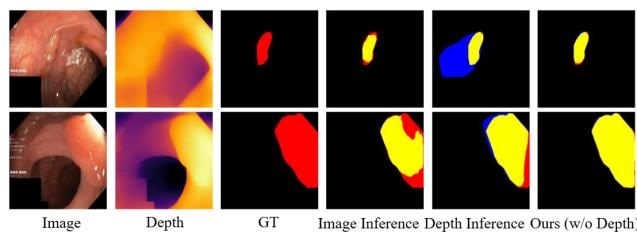
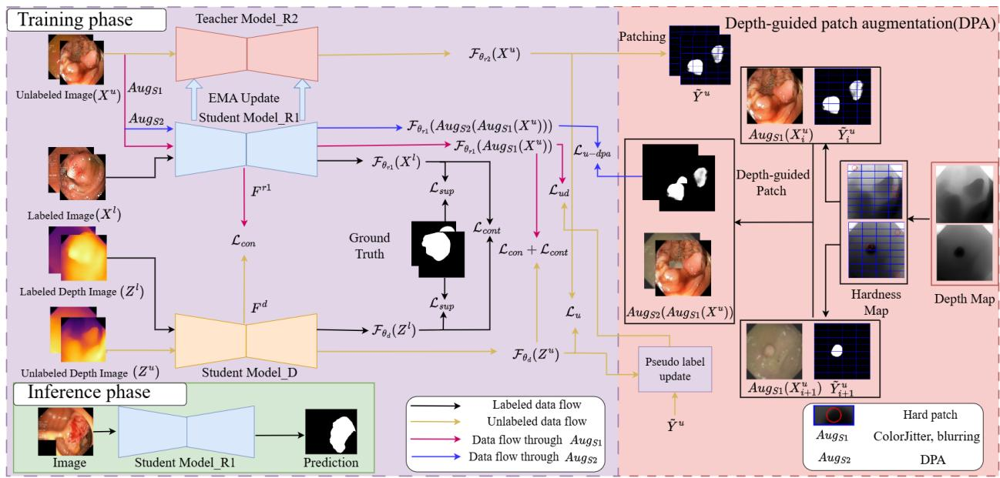
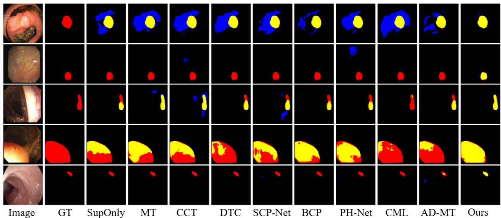
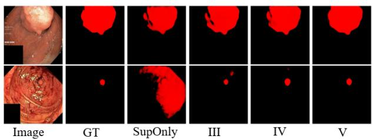
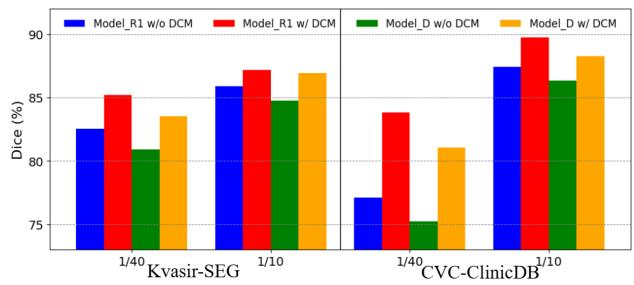

# Boost the Inference with Co-training: A Depth-guided Mutual Learning Framework for Semi-supervised Medical Polyp Segmentation

Yuxin Li1 Zihao Zhu1 Yuxiang Zhang1 Yifan Chen1 Zhibin Yu1,2\* 1College of Electronic Engineering, Ocean University of China   
2Key Laboratory of Ocean Observation and Information of Hainan Province, Sanya Oceanographic Institution, Ocean University of China

## Abstract

Semi-supervised polyp segmentation has made significant progress in recent years as a potential solution for computer-assisted treatment. Since depth images can provide extra information other than RGB images to help segment these problematic areas, depth-assisted polyp segmentation has gained much attention. However, the utilization of depth information is still worth studying. The existing RGB-D segmentation methods rely on depth data in the inference stage, limiting their clinical applications. To tackle this problem, we propose a semi-supervised polyp segmentation framework based on the mean teacher architecture. We establish an auxiliary student network with depth images as input in the training stage, and we propose a depthguided cross-modal mutual learning strategy to promote the learning of complementary information between different student networks. Meanwhile, we use the high-confidence pseudo-labels generated by the auxiliary student network to guide the learning progress of the main student network from different perspectives. Our model does not need depth data in the inference phase. In addition, we introduce a depth-guided patch augmentation method to improve the model’s learning performance in difficult regions of unlabeled polyp images. Experimental results show that our method achieves state-of-the-art performance under different label conditions on five polyp datasets. The code is available at https://github.com/pingchuan/RD-Net.

## 1. Introduction

Colorectal cancer (CRC) is a common gastrointestinal malignancy and has become the third most common cancer [20]. Various screening methods (such as colonoscopy) are proposed for early detection and treatment to reduce its incidence [18]. Intestinal polyps are often considered a precursor to colorectal cancer [25]. Therefore, the precise segmentation of polyps plays a key role in the early diagnosis and treatment of colorectal cancer. Recently, supervised deep learning methods have achieved remarkable success in the field of polyp segmentation [9, 23, 24, 29, 33]. However, these methods rely on high-quality pixel-wise labeled data. Collecting sufficient labeled data in the medical field is not always feasible. To alleviate this limitation, some studies have explored semi-supervised learning (SSL) [3, 16, 34, 36, 41] methods for medical image segmentation, using unlabeled data to improve the segmentation performance of the model. These semi-supervised learning (SSL) methods mainly rely on RGB images for training, neglecting the rich spatial information in the image. Studies have shown that combining RGB images with depth data can efficiently complement the contour information that can not be easily extracted in RGB images [6, 11, 14, 40]. As shown in Figure 1, the pseudolabels predicted by the network based on depth images and RGB images can complement each other during training. However, these RGB-D segmentation methods usually require complex feature splicing and fusion in the training phase. This factor leads to reliance on depth data input during the inference phase, greatly limiting their application in clinical practice. To this end, we propose a semisupervised polyp segmentation framework RD-Net based on mean teacher, which effectively takes advantage of RGB and depth images during training and only needs the RGB images without depth information during inference. Specifically, in the training phase, we introduce an auxiliary student network with depth images as input into the traditional teacher-student network framework and adopt the proposed depth-guided cross-modal mutual learning strategy to effectively promote the learning of complementary information between different student networks. Our model uses the high-confidence pseudo-labels generated by the auxiliary student network to guide the training of the main student network from different perspectives. In addition, we propose depth-guided patch augmentation to improve the model’s ability to learn difficult areas of polyp images. We summarize our main contributions as follows:

  
Figure 1. To illustrate the complementary role of RGB and depth images, we present segmentation results on unlabeled images trained with 10% labeled data in the Kvasir-SEG dataset. The results indicate that our method effectively learns richer information from unlabeled data. The red, blue, and yellow areas represent the ground truth, prediction, and their overlap, respectively.

• A novel semi-supervised polyp segmentation framework is proposed to promote the learning of complementary information between student networks through a depthguided cross-modal mutual learning strategy. No depth information is required in the inference stage.

• The pseudo-labels generated by the auxiliary student network are additionally used to guide the learning of the main student network from different perspectives, making the most of pixel information.

• Depth-guided patch augmentation is proposed to boost model learning on challenging regions in unlabeled data. Our method outperforms state-of-the-art methods on five challenging polyp datasets.

## 2. Related Work

## 2.1. RGB-D semantic segmentation

RGB-D information contains RGB features such as color texture and depth features such as distance boundaries [8], which are complementary to some extent. Some studies have explored how to integrate RGB-D information [1, 8, 11, 14, 39] to improve the performance of semantic segmentation. ACNet [14] effectively improved the semantic segmentation performance by leveraging the proposed attention complementary modality and using the channel attention mechanism to select bimodal features for fusion at multiple stages. CMX [1] achieved the calibration of different modal features by utilizing the designed cross-modal feature correction module to correct the features of another modality using the features of one modality and effectively fuses the features of different modalities through the proposed feature fusion module. However, these methods often perform complex feature splicing and fusion in the encoder stage. They still rely on depth images in the inference stage, greatly limiting their clinical applications. Although Mask-Mentor [43] adopted self-training token-pixel joint reconstruction to narrow the intermediate representation between the missing modality and the complete modality, thereby enhancing the model’s ability to handle the modality missing to some extent. The performance of MaskMentor would decrease if modality was missing. Instead, our method can effectively learn the information between different modalities during the training phase without involving feature fusion between different modalities. Notably, our model does not require depth information during the inference phase.

## 2.2. Semi-supervised medical segmentation

In recent years, a large number of excellent methods have emerged in the field of semi-supervised medical image segmentation [3, 12, 16, 32, 34, 41, 44]. SCPNet [41] proposed a cross-sample prototype learning method to enhance the diversity of predictions in consistency learning by integrating rich semantic information from multiple inputs. BCP [3] encourages unlabeled data to learn richer language information from labeled data by bidirectionally copying and pasting labeled and unlabeled data. ACL-Net [34] proposed a semi-supervised segmentation framework that combines affinity contrast learning and self-training learning, which can adaptively refine pseudo-labels with optimized affinity to improve the performance of semi-supervised polyp segmentation. PH-Net [16] evaluated difficult regions by calculating the hardness scores of image patches and guides the model’s attention to difficult regions, thereby improving segmentation performance. However, this method used the model’s prediction results to identify difficult regions, which are susceptible to network performance. In contrast, we propose a depth-guided patch enhancement that does not rely on the network and can accurately identify difficult regions, thereby strengthening the learning of difficult regions. In addition, we introduce an auxiliary student network trained with depth images and promote the learning of complementary information between different modal networks through a deep-guided cross-modal mutual learning strategy. At the same time, the pseudo-labels of the auxiliary student network are used to adaptively guide the main student network, thereby utilizing more pixel information.

## 3. Method

## 3.1. Preliminary

In semi-supervised polyp segmentation, the dataset consists of two parts: labeled images and unlabeled images. For the labeled images $\mathcal { D } _ { l } = \{ ( X _ { i } , Z _ { i } , Y _ { i } ) \} _ { i = 1 } ^ { N } ,$ the unlabeled images $\mathcal { D } _ { u } = \bar { \{ } X _ { i } , Z _ { i } \} _ { i = N + 1 } ^ { N + } ,$ , where $\bar { { X } _ { i } } \bar { \in } \mathbb { R } ^ { H _ { i } \times W _ { i } \times 3 }$ is the image, $Z _ { i } \in \mathbb { R } ^ { H _ { i } \times W _ { i } \times 3 }$ is the corresponding depth image, and $Y _ { i } \in \{ 0 , 1 \} ^ { H _ { i } \times W _ { i } \times 1 }$ represents the ground truth. For the images $X _ { i }$ , we use a monocular depth estimation network to infer grayscale depth maps of the same size as the original images. Specifically, we use the Depth Anything model [37] and its pre-trained model Depth-Anything-

  
Figure 2. The overall framework of the proposed RD-Net. $\mathcal { L } _ { \mathrm { s u p } }$ is used to guide the student to learn from labeled data; ${ \mathcal { L } } _ { \mathrm { c o n } }$ and ${ \mathcal { L } } _ { \mathrm { c o n t } }$ are used to promote different student networks to learn from each other from consistent and different predictions; the high-confidence pseudo-labels generated by Model D guide Model R1 to learn through ${ \mathcal { L } } _ { \mathrm { u d } } .$ , and the student network Model R1 can strengthen the learning of difficult areas through depth-guided patch augmentation.

Large to infer about the dataset used in our work directly. Subsequently, the grayscale depth maps are converted by applying color mapping into three-channel depth images, resulting in the final corresponding depth image.

Our RD-Net framework is shown in Figure 2, which is based on the classic semi-supervised learning framework mean teacher (MT) [28]. It consists of the teacher network Model R2 and the main student network Model R1, both based on RGB image input, and an auxiliary student network Model D based on depth image input. The three networks use the same UNet network architecture, and the network output is realized through the Sigmoid function. Two student networks will be used for training and optimization, and the exponential moving average (EMA) will be used to update the teacher network [28]. Since the two student networks learn independently during training, and only constraints are imposed at the loss level, only Model R1 is used for inference without depth information. We define weak image augmentation (flipping, scaling, and cropping) operations as $\operatorname { A u g } _ { W }$ and strong image augmentation (color jitter, blurring) operations as $\operatorname { A u g } _ { S 1 }$ . By default, all image data have been subjected to $\operatorname { A u g } _ { W }$ operations.

For the input image $\{ X _ { i } , Z _ { i } \}$ , the outputs of the teacher network and the two student networks can be expressed as $\mathcal { F } _ { \theta _ { r 2 } } ( X _ { i } ) , \mathcal { F } _ { \theta _ { r 1 } } ( X _ { i } )$ , and $\mathcal { F } _ { \theta _ { d } } ( Z _ { i } )$ . For the labeled data, the two student models are trained with cross-entropy and Dice loss, they are formulated as:

$$
\mathcal { L } _ { \mathrm { s u p } } = \frac { 1 } { 2 | \mathcal { D } _ { l } | } \sum \Big ( \mathcal { L } _ { c e } ( \tilde { Y } _ { i } ^ { l } , Y _ { i } ) + \mathcal { L } _ { d i c e } ( \tilde { Y } _ { i } ^ { l } , Y _ { i } ) \Big )\tag{1}
$$

where $\tilde { Y } _ { i } ^ { l }$ represents the prediction of the student network for labeled data. For unlabeled data, the output of the teacher network is used as the pseudo-label. Since unreliable pseudo-labels are unsuitable for supervision, we use the confidence threshold method to filter the pseudo-labels. The unsupervised loss can be formulated as:

$$
\mathcal { L } _ { \sf u } = \frac { 1 } { 2 | \mathcal { D } _ { u } | } \sum \Big ( \mathcal { L } _ { c e } ( \tilde { Y } _ { i } ^ { u } , \tilde { Y } _ { i } ) + \mathcal { L } _ { d i c e } ( \tilde { Y } _ { i } ^ { u } , \tilde { Y } _ { i } ) \Big ) \cdot A _ { i }\tag{2}
$$

$$
A _ { i } = \mathbb { 1 } \left[ \tilde { Y } _ { i } \geq \gamma \mathrm { o r } \tilde { Y } _ { i } \leq 1 - \gamma \right]\tag{3}
$$

where ${ \tilde { Y } } _ { i } ^ { u }$ and $\tilde { Y _ { i } }$ represent the predictions of the student network and the teacher network for the unlabeled data, respectively, and $\gamma$ represents the set confidence threshold for filtering out unreliable pixels. The teacher weights $\theta _ { r 2 }$ are updated by the exponential moving average of the student weights $\theta _ { r 1 }$ , with a momentum parameter α set to 0.99:

$$
\theta _ { r 2 } \xrightarrow { \mathrm { \tiny ~ E M A } } \alpha \theta _ { r 2 } + ( 1 - \alpha ) \theta _ { r 1 }\tag{4}
$$

## 3.2. Depth-guided cross-modal mutual learning

To encourage Model R1 to learn more complementary information from Model D and prevent Model R1 from learning some wrong information from Model D due to the large performance gap between the two student networks in the later stage of training, we propose a novel mutual learning strategy that uses a large amount of unlabeled data to guide different student networks to learn cross-modal complementary knowledge effectively. Specifically, we perform mutual learning in three aspects based on the consistency and difference of Model R1 and Model D predictions.

Consistency learning. For unlabeled data $\{ X _ { i } , Z _ { i } \} \in \mathcal { D } _ { u } .$ we use consistency constraints to encourage the student network to have consistent prediction. In addition, we also encourage the deep encoding features of the student network outputs of different modalities to be aligned. We use the mean square error (MSE) loss as a constraint for simplicity. The unlabeled data consistency loss can be expressed as:

$$
\begin{array} { r l } & { \mathcal { L } _ { \mathrm { c o n } } = \displaystyle \frac { 1 } { 2 | \mathcal { D } _ { u } | } \sum _ { ( X _ { i } , Z _ { i } ) \in \mathcal { D } _ { u } } } \\ & { \quad \quad \left( \left\| F _ { i } ^ { r 1 } - F _ { i } ^ { d } \right\| _ { 2 } ^ { 2 } + \left\| \mathcal { F } _ { \theta _ { r 1 } } ( X _ { i } ^ { S 1 } ) - \mathcal { F } _ { \theta _ { d } } ( Z _ { i } ) \right\| _ { 2 } ^ { 2 } \right) } \end{array}\tag{5}
$$

where $F _ { i } ^ { r 1 }$ and $F _ { i } ^ { d }$ represent the output features of the last layer encoders of the two student networks, respectively, and $X _ { i } ^ { S 1 } = \operatorname { A u g } _ { S 1 } ( X _ { i } )$

Complementary knowledge learning. By only constraining the consistency of outputs and features of different student networks, this method easily leads to the premature convergence of the two student networks to consistency, making it difficult for the student networks to learn richer cross-modal complementary information. At present, contrastive learning [2, 5, 31, 34] has shown great potential in semi-supervised methods. Considering the large differences between RGB and depth modalities in the feature space, it may be difficult to capture the cross-modal association between them using feature-level contrastive learning directly. Therefore, we use a contrastive learning strategy based on output-level positive and negative sample pairs to guide the model to learn richer cross-modal complementary information. Considering that medical polyp image segmentation is a two-class task, we regard the different category regions of each sample as the same object and establish positive and negative sample pairs between different modalities and different samples. For each batch of training sample set $\{ ( X _ { i } , Z _ { i } ) \ \in \ \mathsf { \mathcal { D } } _ { l } \} _ { i = 1 } ^ { K } \cup \{ ( X _ { i } , Z _ { i } ) \ \in \ \mathcal { D } _ { u } \} _ { i = K + 1 } ^ { 2 K }$ , the network output of the paired modality is used as a pair of positive sample pairs. For the positive sample pair set $T _ { l } ^ { + }$ with labeled data $\{ ( X _ { i } , Z _ { i } ) \in \mathcal { D } _ { l } \} _ { i = 1 } ^ { K }$ , it can be formulated as:

$$
T _ { l } ^ { + } = \{ ( \mathcal { F } _ { \theta _ { r 1 } } ( X _ { i } ) , \mathcal { F } _ { \theta _ { d } } ( Z _ { i } ) ) \} _ { i = 1 } ^ { K }\tag{6}
$$

For the unlabeled data $\{ ( X _ { i } , Z _ { i } ) \in \mathcal { D } _ { u } \} _ { i = K + 1 } ^ { 2 K }$ , the corresponding positive sample pair set $T _ { u } ^ { + }$ can be expressed as:

$$
T _ { u } ^ { + } = \{ ( \mathcal { F } _ { \theta _ { r 1 } } ( \operatorname { A u g } _ { S 1 } ( X _ { i } ) ) , \mathcal { F } _ { \theta _ { d } } ( Z _ { i } ) ) \} _ { i = K + 1 } ^ { 2 K }\tag{7}
$$

We can get the positive sample pair set $\Gamma ^ { + }$ under each training batch as:

$$
\Gamma ^ { + } = T _ { l } ^ { + } \cup T _ { u } ^ { + }\tag{8}
$$

For simplicity, we can express $\Gamma ^ { + }$ as:

$$
\Gamma ^ { + } = \{ \overline { { Y } } _ { i } ^ { r 1 } , \overline { { Y } } _ { i } ^ { d } \} _ { i = 1 } ^ { 2 K }\tag{9}
$$

where $\overline { { \boldsymbol Y } } _ { i } ^ { r 1 }$ represents the prediction of the student network Model R1, and $\overline { { \boldsymbol { Y } } } _ { i } ^ { d }$ represents the prediction of the student network Model D. For the i-th positive sample pair, we take the remaining $4 K - 2$ predictions as the i-th corresponding negative sample pair $T _ { i } ^ { - }$ . The Dice coefficient can measure the overlapping area of two samples and is robust to the imbalance of foreground and background. Inspired by this, we use the Dice coefficient to evaluate the regional similarity of positive and negative samples. The calculation formula for the Dice coefficient can be defined as:

$$
S _ { \mathrm { { D i c e } } } ( \overline { { Y } } _ { i } ^ { r 1 } , \overline { { Y } } _ { i } ^ { d } ) = \frac { 2 \sum _ { k = 1 } ^ { H \times W } \overline { { Y } } _ { i , k } ^ { r 1 } \cdot \overline { { Y } } _ { i , k } ^ { d } } { \sum _ { k = 1 } ^ { H \times W } \overline { { Y } } _ { i , k } ^ { r 1 } + \sum _ { k = 1 } ^ { H \times W } \overline { { Y } } _ { i , k } ^ { d } }\tag{10}
$$

where $\overline { { Y } } _ { i , k } ^ { r 1 }$ and $\overline { { \boldsymbol { Y } } } _ { i , \boldsymbol { k } } ^ { d }$ represent the predicted values of the kth pixel $\overline { { \boldsymbol Y } } _ { i } ^ { r 1 }$ and $\overline { { \boldsymbol { Y } } } _ { i } ^ { d }$ predicted by the network respectively. $H$ and $W$ represent the predicted height and width respectively. Since the prediction results with RGB images as the main modality have a higher confidence level, when calculating the similarity between the positive sample pairs and the corresponding negative sample pairs, only the prediction $\overline { { \boldsymbol Y } } _ { i } ^ { r 1 }$ obtained by the Model R1 is used. Then the contrastive learning loss function ${ \mathcal { L } } _ { \mathrm { c o n t } }$ can be expressed as:

$$
\begin{array} { c } { { \mathcal { L } _ { \mathrm { c o n t } } = - \displaystyle \frac { 1 } { | \Gamma ^ { + } | } \sum _ { ( \overline { { { Y } } } _ { i } ^ { r 1 } , \overline { { { Y } } } _ { i } ^ { d } ) \in \Gamma ^ { + } } } } \\ { { \log \displaystyle \frac { e ^ { S _ { \mathrm { D i c e } } ( \overline { { { Y } } } _ { i } ^ { r 1 } , \overline { { { Y } } } _ { i } ^ { d } ) } } { e ^ { S _ { \mathrm { D i c e } } ( \overline { { { Y } } } _ { i } ^ { r 1 } , \overline { { { Y } } } _ { i } ^ { d } ) } + \sum _ { \overline { { { Z } } } _ { i } ^ { j } \in T _ { i } ^ { - } } e ^ { S _ { \mathrm { D i c e } } ( \overline { { { Y } } } _ { i } ^ { r 1 } , \overline { { { Z } } } _ { i } ^ { j } ) } } } } \end{array}\tag{11}
$$

where $\overline { { Z } } _ { i } ^ { j }$ represents the j-th sample in the negative sample pair corresponding to the i-th positive sample pair.

Auxiliary student network guides learning. We believe that the high confidence prediction of Model D on unlabeled data can also be used as a pseudo-label to guide the learning of Model R1. For the k-th pixel prediction $y _ { k }$ , if $y _ { k } > 0 . 5 ,$ , it is a polyp category; if $y _ { k } \le 0 . 5$ , it is a background category. Specifically, we consider the k-th pixel prediction $y _ { k }$ of Model R2 and the corresponding prediction $y _ { k } ^ { \prime }$ of Model D. If the distance between $y _ { k } ^ { \prime }$ and the corresponding category is lower than the threshold distance, and this distance is lower than the distance between $y _ { k }$ and the corresponding category, we replace the k-th pixel prediction value with $y _ { k } ^ { \prime }$ , which can be formulated as follows:

$$
Y _ { i , k } ^ { \prime \prime } = \left\{ { \begin{array} { l l } { y _ { k } ^ { \prime } , } & { { \mathrm { i f } } y _ { k } ^ { \prime } > \gamma \quad { \mathrm { a n d } } \quad d _ { k } ^ { \prime } < d _ { k } } \\ { y _ { k } ^ { \prime } , } & { { \mathrm { i f } } y _ { k } ^ { \prime } < 1 - \gamma \quad { \mathrm { a n d } } \quad d _ { k } ^ { \prime } < d _ { k } } \\ { y _ { k } , } & { { \mathrm { o t h e r w i s e } } } \end{array} } \right.\tag{12}
$$

where $Y _ { i , k } ^ { \prime \prime }$ represents the pseudo label of the k-th pixel of the i-th image after update. If $y$ is a polyp category, then

the distance $d = 1 - y ;$ otherwise, $d = y$ . Then the corresponding unsupervised loss ${ \mathcal { L } } _ { \mathrm { u d } }$ can be formulated as:

$$
\mathcal { L } _ { \mathrm { u d } } = \mathcal { L } _ { \mathrm { u } } ( \mathcal { F } _ { \theta _ { r 1 } } ( X _ { i } ^ { S 1 } ) , Y _ { i } ^ { \prime \prime } ) )\tag{13}
$$

## 3.3. Depth-guided patch augmentation

The CutMix [38] method has proven its effectiveness [10] in semi-supervised segmentation tasks, and many CutMixbased improvement methods have emerged [16, 17, 42]. PH-Net [16] considers the difference in learning difficulty between difficult and simple regions in an image and proposes an adaptive patch augmentation (APA) method to identify and process difficult regions to improve performance. This method evaluates the difficulty of a patch by calculating the entropy of the model’s prediction distribution. However, there are some limitations in evaluating the difficulty of image patches based on model predictions. The model prediction confidence is low when the amount of labeled data is small. Suppose a high-confidence erroneous prediction is made for difficult regions. In that case, these regions may be misjudged as easy regions, thus affecting the overall performance. Instead, we use depth information for difficult patch evaluation. For the RGB image X and its corresponding single-channel depth map $D ,$ the hardness score of a patch $P$ of size $h \times w$ can be expressed as:

$$
H _ { P } = \frac { 1 } { h \times w } \sum _ { ( i , j ) \in P } \operatorname { V a r } ( D _ { i , j } )\tag{14}
$$

where $H _ { P }$ is the hardness score of patch P, $D _ { i , j }$ is the depth value of pixel position $( i , j )$ in the depth map $D ,$ and $\mathrm { V a r } ( D _ { i , j } )$ represents the variance of pixel depth values in the patch. The larger the variance of the patch, the more obvious the depth change of the patch is, which means that the difficulty of the patch is higher. To enhance the richness of the training samples, we randomly select h and w from {10, 20, 40}. The patches are sorted in descending order of hardness scores so that patches with higher hardness scores can be shielded to prevent them from being cut off during the cutting process. The number of shielded patches is dynamically set following PH-Net [16]. Then, the depth guided patch augmentation can be expressed as:

$$
\mathrm { A u g } _ { S 2 } ( X _ { i } ^ { S 1 } ) \xleftarrow { } M \odot X _ { i } ^ { S 1 } + ( 1 - M ) \odot X _ { i + 1 } ^ { S 1 }\tag{15}
$$

$$
Y _ { i } ^ { r 2 } \gets M \odot \tilde { Y } _ { i } ^ { r 2 } + ( 1 - M ) \odot \tilde { Y } _ { i + 1 } ^ { r 2 }\tag{16}
$$

where $X _ { i } ~ \in ~ \mathcal { D } _ { u }$ and $X _ { i + 1 } ~ \in ~ \mathcal { D } _ { u }$ represent the i-th and $( i + 1 )$ -th unlabeled RGB images in the batch. $\tilde { Y } _ { i } ^ { r 2 }$ and $\tilde { Y } _ { i + 1 } ^ { r 2 }$ denote the corresponding pseudo labels predicted by the teacher network for $X _ { i }$ and $X _ { i + 1 }$ , and M is a patch mask randomly selected from the unmasked patches. Then, the corresponding loss $\mathcal { L } _ { \mathrm { u - d p a } }$ can be formulated as:

$$
\mathcal { L } _ { \mathrm { u - d p a } } = \mathcal { L } _ { \mathrm { u } } ( \mathcal { F } _ { \theta _ { r 1 } } ( \operatorname { A u g } _ { S 2 } ( X _ { i } ^ { S 1 } ) ) , Y _ { i } ^ { r 2 } ) )\tag{17}
$$

## 3.4. Loss function

The training loss of student networks consists of supervised loss and unsupervised loss. The training loss of the student network Model R1 can be formulated as:

$$
\mathcal { L } _ { \mathrm { r g b } } = \frac { 1 } { 3 } \left( \mathcal { L } _ { \mathrm { s u p } } ( \mathcal { F } _ { \theta _ { r 1 } } ( X _ { i } ) , Y _ { i } ) + \mathcal { L } _ { \mathrm { u - d p a } } + \mathcal { L } _ { \mathrm { u d } } \right)\tag{18}
$$

where $X _ { i } \in \mathcal { D } _ { l } , Y _ { i }$ is the ground truth corresponding to the image $X _ { i }$ . The student network Model D predicts $\breve { \tilde { Y } } _ { i } ^ { d , u } =$ $\mathcal { F } _ { \theta _ { d } } ( Z _ { i } )$ for the unlabeled data $Z _ { i } \in \mathcal { D } _ { u } .$ , while the pseudo label predicted by Model R2 using the corresponding RGB image $X _ { i }$ is $\tilde { Y } _ { i } ^ { r 2 }$ . The training loss of the student network Model D can be formulated as:

$$
\mathcal { L } _ { \mathrm { d e p t h } } = \frac { 1 } { 2 } \left( \mathcal { L } _ { \mathrm { s u p } } ( \mathcal { F } _ { \theta _ { d } } ( Z _ { i } ) , Y _ { i } ) + \mathcal { L } _ { \mathrm { u } } ( { \tilde { Y } } _ { i } ^ { d , u } , { \tilde { Y } } _ { i } ^ { r 2 } ) \right)\tag{19}
$$

where $Z _ { i } \in { \mathcal { D } } _ { l } , Y _ { i }$ is the corresponding ground truth. The overall training loss can be formulated as:

$$
{ \mathcal { L } } _ { \mathrm { t o t a l } } = { \mathcal { L } } _ { \mathrm { r g b } } + { \mathcal { L } } _ { \mathrm { d e p t h } } + { \mathcal { L } } _ { \mathrm { c o n t } } + { \mathcal { L } } _ { \mathrm { c o n } }\tag{20}
$$

## 4. Experiments

## 4.1. Dataset and evaluation metrics

Datasets. We evaluated our method on five typical polyp segmentation datasets: Kvasir-SEG [15], CVC-ClinicDB [4], CVC-300 [30], CVC-ColonDB [27] and ETIS-Larib [26].

The Kvasir-SEG dataset contains 1000 polyp images, of which 900 are randomly divided into training sets and the remaining 100 into test sets. The training sets are partitioned into labeled and unlabeled subsets according to the 1/40 and 1/10 partitioning protocols. The CVC-ClinicDB dataset contains 612 polyp images, of which 550 are randomly divided into training sets and the remaining 62 into test sets. The training sets are partitioned into labeled and unlabeled subsets according to the 1/40 and 1/10 partitioning protocols. In addition, we followed the experimental settings of the ACL-Net [34] method. We combined 900 training images from the Kvasir-SEG dataset and 550 training images from the CVC-ClinicDB dataset into a new training set of 1450 images as a semi-supervised training dataset. The training sets are partitioned into labeled and unlabeled subsets according to the 1/10 partitioning protocols. Under this experimental setting, only the CVC-300, CVC-ColonDB, and ETIS-Larib datasets are tested to further evaluate the generalization ability of the model.

Evaluation metrics. We adopt three widely used metrics for quantitative evaluation, including the mean dice similarity coefficient (Dice(%)), the mean pixel-wise accuracy $( \operatorname { A c c } ( \% ) )$ , and the mean intersection over union (IoU(%)).

Table 1. Quantitative comparison using different state-of-the-art methods on Kvasir-SEG and CVC-ClinicDB datasets. Boldface and underlined numbers represent the best and second-best results of each setting, respectively.
<table><tr><td rowspan="2">Method</td><td colspan="5">Kvasir-SEG</td><td colspan="5">CVC-ClinicDB</td></tr><tr><td>Labeled</td><td>Unlabeled</td><td>Dice(%)↑</td><td>IoU(%)↑</td><td>Acc(%)↑</td><td>Labeled</td><td>Unlabeled</td><td>Dice(%)↑</td><td>IoU(%)↑</td><td>Acc(%)↑</td></tr><tr><td>U-Net</td><td>22(2.5%)</td><td>0</td><td>76.49</td><td>70.48</td><td>94.61</td><td>14(2.5%)</td><td>0</td><td>67.60</td><td>58.45</td><td>95.90</td></tr><tr><td>U-Net</td><td>90(10%)</td><td>0</td><td>82.76</td><td>77.09</td><td>95.23</td><td>54(10%)</td><td>0</td><td>77.84</td><td>72.14</td><td>97.24</td></tr><tr><td>U-Net</td><td>900(100%)</td><td>0</td><td>89.43</td><td>84.35</td><td>97.07</td><td>550(100%)</td><td>0</td><td>88.34</td><td>83.54</td><td>98.59</td></tr><tr><td>MT [28]</td><td rowspan="9"></td><td rowspan="9">22(2.5%)</td><td>64.27</td><td>67.77</td><td>93.86</td><td></td><td></td><td>53.19</td><td>58.79</td><td>95.67</td></tr><tr><td>CCT [21]</td><td>44.08</td><td>44.83</td><td></td><td>84.65</td><td></td><td>31.02</td><td>37.14</td><td>84.43</td></tr><tr><td>DTC [19]</td><td>73.93</td><td>70.99</td><td>94.38</td><td></td><td></td><td>63.25</td><td>61.76</td><td>95.76</td></tr><tr><td>SCP-Net [41]</td><td>73.53</td><td>62.87</td><td>92.99</td><td>14(2.5%)</td><td></td><td>63.93</td><td>53.03</td><td>94.16</td></tr><tr><td>BCP [3]</td><td>878(97.5%)</td><td>82.42</td><td>75.19</td><td>95.39</td><td>536(97.5%)</td><td>76.65</td><td>71.90</td><td>96.75</td></tr><tr><td>PH-Net [16]</td><td>83.12</td><td></td><td>75.69</td><td>95.65</td><td></td><td>73.37</td><td>67.42</td><td>96.17</td></tr><tr><td>CML [35]</td><td>83.21</td><td></td><td>76.59</td><td>95.43</td><td></td><td>77.60</td><td>71.67</td><td>97.02</td></tr><tr><td>AD-MT [44]</td><td>82.29</td><td></td><td>74.51</td><td>95.22</td><td></td><td>74.36</td><td>66.14</td><td>96.07</td></tr><tr><td>Ours</td><td></td><td>86.35</td><td>80.10</td><td>96.05</td><td></td><td>82.60</td><td>75.81</td><td>97.32</td></tr><tr><td>MT [28]</td><td rowspan="9">90(10%)</td><td rowspan="9"></td><td>84.81</td><td>79.27</td><td>96.13</td><td></td><td></td><td>80.66</td><td>74.13</td><td>97.51</td></tr><tr><td>CCT [21]</td><td></td><td>70.02</td><td>68.39</td><td>93.09</td><td></td><td>65.43</td><td>61.89</td><td>94.63</td></tr><tr><td>DTC [19]</td><td>83.84</td><td>79.74</td><td>96.11</td><td></td><td>79.32</td><td></td><td>76.52</td><td>97.86</td></tr><tr><td>SCP-Net [41]</td><td>85.70</td><td>78.46</td><td></td><td>96.33 54(10%)</td><td></td><td>82.08</td><td>74.93</td><td>97.70</td></tr><tr><td>BCP [3]</td><td>810(90%)</td><td>87.30</td><td>80.92</td><td>96.25</td><td>496(90%)</td><td>85.59</td><td>78.70</td><td>97.99</td></tr><tr><td>PH-Net [16]</td><td></td><td>87.35</td><td>80.67</td><td>96.54</td><td>82.11</td><td></td><td>75.06</td><td>97.93</td></tr><tr><td>CML [35]</td><td>86.89</td><td></td><td>80.46</td><td>95.72</td><td>85.49</td><td></td><td>77.92</td><td>97.97</td></tr><tr><td>AD-MT [44]</td><td>86.38</td><td></td><td>79.91</td><td>96.23</td><td>83.66</td><td></td><td>76.22</td><td>97.42</td></tr><tr><td>Ours</td><td></td><td>89.07</td><td>84.21</td><td>97.07</td><td></td><td>87.84</td><td>81.84</td><td>98.15</td></tr></table>

## 4.2. Implementation details

All experiments in this study were implemented on a single NVIDIA GeForce RTX 3060 using the PyTorch framework and used a fixed random seed. Our baseline uses the UNet [22] network and uses the ResNet34 [13] pretrained on ImageNet [7] as the UNet backbone. The image and label sizes are resized to 320 × 320. The SGD optimizer is used with an initial learning rate of 0.001, momentum of 0.9, and weight decay of 0.00001. The learning rate is decayed using a polynomial strategy: η = ηinit · $\begin{array} { r } { \bigg ( 1 - \frac { \mathrm { i t e r } } { \mathrm { i t e r } _ { \mathrm { t o t a l } } } \bigg ) ^ { 0 . 9 } } \end{array}$ . In our experimental setup, we adopt a batch size of 4 and train for 50,000 iterations, with the batch size for labeled and unlabeled data set to 2.

## 4.3. Comparisons with SOTA methods

We compare our method with eight state-of-the-art semisupervised segmentation methods, including MT [28], CCT [21], DTC [19], SCP-Net [41], BCP [3] , PH-Net [16], CML [35], and AD-MT [44]. To ensure a fair comparison, for all experiments, we use UNet with ResNet-34 as the backbone of the segmentation network, adopt the same experimental environment and data augmentation, and the data partitioning protocol of these methods is the same.

As shown in Table 1, our proposed method achieves the highest scores on the three evaluation metrics on two typical polyp segmentation datasets, Kvasir-SEG and CVC-ClinicDB, with 2.5% and 10% labeled data settings. On the Kvasir-SEG dataset, using only 22 labeled images, our method achieves a Dice score of 86.35% and an IoU score of 80.10%, which is 3.14% higher in Dice score and 3.51% higher in IoU score than the previous state-of-the-art method CML [35]. To more intuitively compare the performance of semi-supervised methods, we also conducted experiments in a fully supervised manner. Under the 10% experimental setting, our method approaches the performance of full supervision. Our method achieves the best segmentation under all partitions of the Kvasir-SEG dataset and CVC-ClinicDB dataset, indicating that our method enables the model to be better trained on unlabeled images.

We also experimentally demonstrate that our method has excellent generalization ability on the unseen CVC-300, CVC-ColonDB, and ETIS-Larib polyp datasets. As shown in Table 2, our method has surpassed competitors significantly. Specifically, compared with the SupOnly method, our method achieves a 10.44% Dice and 8.80% IoU score improvement on the CVC-ColonDB dataset. We also obtained a 28.17% Dice and 23.67% IoU score improvement on the most challenging ETIS-Larib dataset. These experimental results show that by combining the mutual learning strategy of depth images and RGB images, our method can significantly enhance the model’s feature representation ability. This approach helps the model better understand the shape and structure of polyps, which is particularly important for delicate tasks such as segmenting polyps. Therefore, our model performs well on different datasets, showing its strong adaptability and effectiveness.

For qualitative analysis, to more intuitively demonstrate our method’s superiority, we visually compare challenging cases in Figure 3. Our method produces excellent segmentation results for very small polyps with unclear boundaries and low contrast areas between polyps and their surrounding mucosa. This indicates that our method can effectively deal with challenges such as polyp size, shape, and low contrast.

Table 2. Generalization ability comparison with different state-of-the-art methods. We split all the training images (1450) in Kvasir-SEG and CVC-ClinicDB into 1/10 labeled images (144) and 9/10 unlabeled images (1306) for training. “SupOnly” stands for supervised training without using any unlabeled data. Boldface and underlined numbers represent the best and second best results of each setting, respectively.
<table><tr><td rowspan="2">Method</td><td colspan="2">Kvasir-SEG</td><td colspan="2">CVC-ClinicDB</td><td colspan="2">CVC-300</td><td colspan="2">ETIS-Larib</td><td colspan="2">CVC-ColonDB</td></tr><tr><td>Dice(%)↑</td><td>IoU(%)↑</td><td>Dice(%)↑</td><td>IoU(%)↑</td><td>Dice(%)↑</td><td>IoU(%)↑</td><td>Dice(%)↑</td><td>IoU(%)↑</td><td>Dice(%)↑</td><td>IoU(%)↑</td></tr><tr><td>SupOnly</td><td>82.22</td><td>77.33</td><td>74.71</td><td>69.39</td><td>79.10</td><td>70.47</td><td>43.30</td><td>39.80</td><td>63.85</td><td>57.55</td></tr><tr><td>MT [28]</td><td>84.60</td><td>78.52</td><td>76.43</td><td>69.57</td><td>76.84</td><td>70.12</td><td>48.45</td><td>42.17</td><td>69.23</td><td>62.41</td></tr><tr><td>CCT [21]</td><td>84.93</td><td>79.63</td><td>76.68</td><td>70.20</td><td>81.72</td><td>75.66</td><td>52.04</td><td>47.63</td><td>66.14</td><td>59.43</td></tr><tr><td>DTC [19]</td><td>84.61</td><td>79.75</td><td>77.02</td><td>73.60</td><td>81.16</td><td>75.22</td><td>52.89</td><td>49.71</td><td>65.67</td><td>61.49</td></tr><tr><td>SCP-Net [41]</td><td>85.45</td><td>77.75</td><td>79.79</td><td>72.95</td><td>79.79</td><td>71.50</td><td>48.57</td><td>40.35</td><td>66.10</td><td>57.57</td></tr><tr><td>BCP [3]</td><td>86.25</td><td>80.10</td><td>81.75</td><td>75.09</td><td>80.36</td><td>76.12</td><td>59.70</td><td>51.72</td><td>66.19</td><td>58.61</td></tr><tr><td>PH-Net [16]</td><td>87.02</td><td>79.95</td><td>79.01</td><td>72.64</td><td>84.35</td><td>77.24</td><td>59.73</td><td>51.85</td><td>69.70</td><td>61.62</td></tr><tr><td>CML [35]</td><td>85.39</td><td>79.01</td><td>84.01</td><td>77.77</td><td>83.10</td><td>75.98</td><td>56.00</td><td>49.45</td><td>63.88</td><td>57.51</td></tr><tr><td>AD-MT [44]</td><td>85.55</td><td>78.28</td><td>82.13</td><td>76.07</td><td>84.43</td><td>77.52</td><td>66.29</td><td>58.61</td><td>71.46</td><td>64.13</td></tr><tr><td>Ours</td><td>88.88</td><td>82.98</td><td>85.88</td><td>79.97</td><td>85.61</td><td>79.32</td><td>71.47</td><td>63.47</td><td>74.29</td><td>66.35</td></tr></table>

Table 3. Ablation study of different components on Kvasir-SEG dataset with 10% labeled data. DPA: Depth-guided patch augmentation. “SupOnly” stands for training using only labeled data.
<table><tr><td>Method</td><td> ${ \mathcal L } _ { \mathrm { u d } }$ </td><td> $\mathcal { L } _ { \mathrm { c o n } }$ </td><td> ${ \mathcal { L } } _ { \mathrm { c o n t } }$ </td><td>DPA</td><td>Dice (%)</td><td>IoU (%)</td></tr><tr><td>SupOnly</td><td></td><td></td><td></td><td></td><td>82.76</td><td>77.09</td></tr><tr><td>I</td><td>√</td><td>√</td><td></td><td></td><td>87.96</td><td>82.61</td></tr><tr><td>ⅡI</td><td>√</td><td></td><td>√</td><td></td><td>88.08</td><td>82.51</td></tr><tr><td>ⅢII</td><td>√</td><td></td><td></td><td>√</td><td>88.03</td><td>82.68</td></tr><tr><td>IV</td><td>√</td><td>√</td><td>√</td><td></td><td>88.14</td><td>82.89</td></tr><tr><td>V</td><td>√</td><td>√</td><td>√</td><td>√</td><td>89.07</td><td>84.21</td></tr></table>

Table 4. Ablation study of different enhancement methods on Kvasir-SEG dataset. SA: $\mathbf { A u g } _ { S 1 }$
<table><tr><td rowspan="2">Method</td><td colspan="2"># images used</td><td colspan="2">Metrics</td></tr><tr><td>Labeled</td><td>Unlabeled</td><td>Dice (%)</td><td>IoU (%)</td></tr><tr><td>SA</td><td rowspan="3">22(2.5%)</td><td rowspan="3">878(97.5%)</td><td>81.67</td><td>74.79</td></tr><tr><td>SA+CutMix [38]</td><td>84.53</td><td>78.44</td></tr><tr><td>SA+APA [16]</td><td>84.42</td><td>77.87</td></tr><tr><td>SA+DPA</td><td colspan="2"></td><td>86.35</td><td>80.10</td></tr><tr><td>SA</td><td colspan="2">90(10%)</td><td>87.16 88.09</td><td>81.01</td></tr><tr><td>SA+CutMix [38]</td><td colspan="2">810(90%)</td><td>88.50</td><td>82.27</td></tr><tr><td>SA+APA [16] SA+DPA</td><td colspan="2"></td><td>89.07</td><td>82.76 84.21</td></tr></table>

Table 5. Ablation study of confidence threshold γ on Kvasir-SEG dataset with 10% labeled data.
<table><tr><td>γ</td><td>0.7</td><td>0.75</td><td>0.8</td><td>0.85</td><td>0.9</td><td>0.95</td></tr><tr><td>Dice (%)</td><td>88.66</td><td>88.74</td><td>89.06</td><td>89.07</td><td>89.03</td><td>88.72</td></tr><tr><td>IoU (%)</td><td>83.60</td><td>83.55</td><td>83.91</td><td>84.21</td><td>83.74</td><td>83.67</td></tr></table>

## 4.4. Ablation studies

Effectiveness of components. In Table 3, we study the effectiveness of our proposed RD-Net main components on the Kvasir-SEG dataset with 10% labeled data. We use the model trained with supervised learning (SupOnly) using only labeled data as our baseline. The model with depthguided cross-modal mutual learning $( \mathcal { L } _ { \mathrm { u d } } , \mathcal { L } _ { \mathrm { c o n } }$ and ${ \mathcal { L } } _ { \mathrm { c o n t } } )$ can obtain a performance gain of the Dice of the baseline by +5.38%, verifying that depth-guided cross-modal mutual learning can provide more cross-membrane complementary information for model training. Adding Depthguided patch augmentation (DPA) improves the Dice of the baseline by +5.27%, verifying that the DPA module can guide the model to learn difficult patch regions. The full model with all components obtains the most accurate segmentation with the highest Dice and IoU scores. Overall, the results demonstrate the importance of each component in our proposed method for semi-supervised polyp segmentation. To more clearly demonstrate the advantages of each component, Figure 4 shows the predicted visualization of our method. Obviously, with the gradual introduction of enhanced components, the predicted lesion boundaries gradually become more refined. This result shows the effectiveness of our method in processing complex polyp images.

Effectiveness of depth-guided cross-modal mutual learning. We evaluated the prediction accuracy of the unlabeled data in the training set, and the results are shown in Figure 5. Notably, by adopting the depth-guided crossmodal mutual learning strategy, the model can improve the segmentation accuracy of the unlabeled training data in each partition of the Kvasir-SEG and CVC-ClinicDB datasets. This result shows that our depth-guided cross-modal mutual learning strategy effectively helps the model better utilize the information of unlabeled images.

Effectiveness of Depth-guided patch augmentation. As shown in Table 4, we compare the performance of APA augmentation, ordinary CutMix augmentation, and our DPA augmentation. When the labeling ratio is 2.5%, the Dice value of DPA augmentation is 1.93% higher than that of APA augmentation, which indicates that in the case of very little labeled data, the prediction confidence of the model is low, resulting in poor performance of APA based on prediction for masking patches. In contrast, our method can more effectively select difficult patches for masking, thereby effectively identifying and alleviating the problem of insufficient training of challenging patches.

  
Figure 3. Visual comparison with different state-of-the-art methods on five public polyp datasets. The SupOnly method is trained on only 1/10 labeled data. The red, blue, and yellow areas represent the ground truth, predictions, and their overlap regions, respectively.

  
Figure 4. Visual comparison of component ablation studies. Darker red indicates higher confidence in the prediction.

  
Figure 5. Comparing predictions on unlabeled training data under all partitioning protocols. DCM: Depth-guided cross-modal mutual learning.

Ablation study on hyper-parameters. Table 5 shows the ablation study of the confidence threshold γ used to filter pseudo labels in Eq.(3) on the Kvasir-SEG dataset. As the threshold increases from 0.7 to 0.95, the Dice and IoU scores of our method increase first and then decrease. This result indicates that the model is prone to learning wrong prediction information when the threshold is low. Additionally, too much correct prediction information may be filtered out when the threshold is too high. We set $\gamma = 0 . 8 5$

## 5. Conclusion

This paper proposes a novel semi-supervised polyp segmentation framework. The proposed depth-guided cross-modal mutual learning strategy promotes the learning of complementary information between different student networks in the training phase, while no depth information is required in the inference phase. At the same time, the pseudo-labels generated by the auxiliary student network are additionally used to guide the learning of the main student network from different angles, making the most of more high-confidence pixels. In addition, we introduce a depth-guided patch augmentation method to promote the model’s learning in difficult areas of polyp images. Experimental results show that our method significantly outperforms the state-of-theart methods on five polyp datasets.

Acknowledgement. This work was supported by the National Natural Science Foundation of China (Grant No. 62171419), the Hainan Province Science and Technology Special Fund of China (Grant No. ZDYF2022SHFZ318) and the Natural Science Foundation of Shandong Province of China (Grant No. ZR2021LZH005).

## References

[1] Cmx: Cross-modal fusion for rgb-x semantic segmentation with transformers. IEEE Transactions on intelligent transportation systems, 2023. 2

[2] Inigo Alonso, Alberto Sabater, David Ferstl, Luis Montesano, and Ana C Murillo. Semi-supervised semantic segmentation with pixel-level contrastive learning from a classwise memory bank. In Proceedings of the IEEE/CVF international conference on computer vision, pages 8219–8228, 2021. 4

[3] Yunhao Bai, Duowen Chen, Qingli Li, Wei Shen, and Yan Wang. Bidirectional copy-paste for semi-supervised medical image segmentation. In Proceedings of the IEEE/CVF conference on computer vision and pattern recognition, pages 11514–11524, 2023. 1, 2, 6, 7

[4] Jorge Bernal, F Javier Sanchez, Gloria Fern´ andez-´ Esparrach, Debora Gil, Cristina Rodr´ıguez, and Fernando Vilarino. Wm-dova maps for accurate polyp highlighting˜ in colonoscopy: Validation vs. saliency maps from physicians. Computerized medical imaging and graphics, 43:99– 111, 2015. 5

[5] Ting Chen, Simon Kornblith, Mohammad Norouzi, and Geoffrey Hinton. A simple framework for contrastive learning of visual representations. In International conference on machine learning, pages 1597–1607. PMLR, 2020. 4

[6] Yanhua Cheng, Xin Zhao, Rui Cai, Zhiwei Li, Kaiqi Huang, Yong Rui, et al. Semi-supervised multimodal deep learning for rgb-d object recognition. In IJCAI, pages 3345–3351, 2016. 1

[7] Jia Deng, Wei Dong, Richard Socher, Li-Jia Li, Kai Li, and Li Fei-Fei. Imagenet: A large-scale hierarchical image database. In 2009 IEEE conference on computer vision and pattern recognition, pages 248–255. Ieee, 2009. 6

[8] Siqi Du, Weixi Wang, Renzhong Guo, Ruisheng Wang, and Shengjun Tang. Asymformer: Asymmetrical cross-modal representation learning for mobile platform real-time rgb-d semantic segmentation. In Proceedings of the IEEE/CVF Conference on Computer Vision and Pattern Recognition, pages 7608–7615, 2024. 2

[9] Deng-Ping Fan, Ge-Peng Ji, Tao Zhou, Geng Chen, Huazhu Fu, Jianbing Shen, and Ling Shao. Pranet: Parallel reverse attention network for polyp segmentation. In International conference on medical image computing and computerassisted intervention, pages 263–273. Springer, 2020. 1

[10] Geoff French, Samuli Laine, Timo Aila, Michal Mackiewicz, and Graham Finlayson. Semi-supervised semantic segmentation needs strong, varied perturbations. arXiv preprint arXiv:1906.01916, 2019. 5

[11] Xiangyu Guo, Wei Ma, Fangfang Liang, and Qing Mi. Dualmodal non-local context guided multi-stage fusion for indoor rgb-d semantic segmentation. Expert Systems with Applications, 255:124598, 2024. 1, 2

[12] Along He, Tao Li, Yanlin Wu, Ke Zou, and Huazhu Fu. Frcnet: Frequency and region consistency for semi-supervised medical image segmentation. In International Conference on Medical Image Computing and Computer-Assisted Intervention, pages 305–315. Springer, 2024. 2

[13] Kaiming He, Xiangyu Zhang, Shaoqing Ren, and Jian Sun. Deep residual learning for image recognition. In Proceed ings ofthe IEEE conference on computer vision and pattern recognition, pages 770–778, 2016. 6

[14] Xinxin Hu, Kailun Yang, Lei Fei, and Kaiwei Wang. Acnet: Attention based network to exploit complementary features for rgbd semantic segmentation. In 2019 IEEE international conference on image processing (ICIP), pages 1440–1444. IEEE, 2019. 1, 2

[15] Debesh Jha, Pia H Smedsrud, Michael A Riegler, Pal˚ Halvorsen, Thomas De Lange, Dag Johansen, and Havard D˚ Johansen. Kvasir-seg: A segmented polyp dataset. In MultiMedia modeling: 26th international conference, MMM 2020, Daejeon, South Korea, January 5–8, 2020, proceed ings, part II 26, pages 451–462. Springer, 2020. 5

[16] Siyao Jiang, Huisi Wu, Junyang Chen, Qin Zhang, and Jing Qin. Ph-net: Semi-supervised breast lesion segmentation via patch-wise hardness. In Proceedings of the IEEE/CVF Conference on Computer Vision and Pattern Recognition, pages 11418–11427, 2024. 1, 2, 5, 6, 7

[17] Jang-Hyun Kim, Wonho Choo, and Hyun Oh Song. Puz zle mix: Exploiting saliency and local statistics for optimal mixup. In International conference on machine learning, pages 5275–5285. PMLR, 2020. 5

[18] Su Young Kim, Hyun-Soo Kim, Yun Tae Kim, Jung Kuk Lee, Hong Jun Park, Hee Man Kim, and Dae Ryoung Kang. Colonoscopy versus fecal immunochemical test for reducing colorectal cancer risk: A population-based case–control study. Clinical and translational gastroenterology, 12(5): e00350, 2021. 1

[19] Xiangde Luo, Jieneng Chen, Tao Song, and Guotai Wang. Semi-supervised medical image segmentation through dualtask consistency. In Proceedings of the AAAI conference on artificial intelligence, pages 8801–8809, 2021. 6, 7

[20] Ines M ´ armol, Cristina S ´ anchez-de Diego, Alberto´ Pradilla Dieste, Elena Cerrada, and Mar´ıa Jesus Ro-´ driguez Yoldi. Colorectal carcinoma: a general overview and future perspectives in colorectal cancer. International journal ofmolecular sciences, 18(1):197, 2017. 1

[21] Yassine Ouali, Celine Hudelot, and Myriam Tami. Semi-´ supervised semantic segmentation with cross-consistency training. In Proceedings of the IEEE/CVF conference on computer vision and pattern recognition, pages 12674– 12684, 2020. 6, 7

[22] Olaf Ronneberger, Philipp Fischer, and Thomas Brox. Unet: Convolutional networks for biomedical image segmentation. In Medical image computing and computer-assisted intervention–MICCAI 2015: 18th international conference, Munich, Germany, October 5-9, 2015, proceedings, part III 18, pages 234–241. Springer, 2015. 6

[23] Hao Shao, Yang Zhang, and Qibin Hou. Polyper: Boundary sensitive polyp segmentation. In Proceedings of the AAAI Conference on Artificial Intelligence, pages 4731– 4739, 2024. 1

[24] Jing-Hui Shi, Qing Zhang, Yu-Hao Tang, and Zhong-Qun Zhang. Polyp-mixer: An efficient context-aware mlp-based paradigm for polyp segmentation. IEEE Transactions on Cir-

cuits and Systemsfor Video Technology, 33(1):30–42, 2022. 1

[25] Noam Shussman and Steven D Wexner. Colorectal polyps and polyposis syndromes. Gastroenterology report, 2(1):1– 15, 2014. 1

[26] Juan Silva, Aymeric Histace, Olivier Romain, Xavier Dray, and Bertrand Granado. Toward embedded detection of polyps in wce images for early diagnosis of colorectal cancer. International journal of computer assisted radiology and surgery, 9:283–293, 2014. 5

[27] Nima Tajbakhsh, Suryakanth R Gurudu, and Jianming Liang. Automated polyp detection in colonoscopy videos using shape and context information. IEEE transactions on medical imaging, 35(2):630–644, 2015. 5

[28] Antti Tarvainen and Harri Valpola. Mean teachers are better role models: Weight-averaged consistency targets improve semi-supervised deep learning results. Advances in neural information processing systems, 30, 2017. 3, 6, 7

[29] Quoc-Huy Trinh. Meta-polyp: a baseline for efficient polyp segmentation. In 2023 IEEE 36th International Symposium on Computer-Based Medical Systems (CBMS), pages 742– 747. IEEE, 2023. 1

[30] David Vazquez, Jorge Bernal, F Javier S´ anchez, Gloria´ Fernandez-Esparrach, Antonio M L´ opez, Adriana Romero,´ Michal Drozdzal, and Aaron Courville. A benchmark for endoluminal scene segmentation of colonoscopy images. Journal ofhealthcare engineering, 2017(1):4037190, 2017. 5

[31] Xiaoyang Wang, Bingfeng Zhang, Limin Yu, and Jimin Xiao. Hunting sparsity: Density-guided contrastive learning for semi-supervised semantic segmentation. In Proceedings of the IEEE/CVF Conference on Computer Vision and Pattern Recognition, pages 3114–3123, 2023. 4

[32] Yongchao Wang, Bin Xiao, Xiuli Bi, Weisheng Li, and Xinbo Gao. Mcf: Mutual correction framework for semisupervised medical image segmentation. In Proceedings of the IEEE/CVF conference on computer vision and pattern recognition, pages 15651–15660, 2023. 2

[33] Jun Wei, Yiwen Hu, Ruimao Zhang, Zhen Li, S Kevin Zhou, and Shuguang Cui. Shallow attention network for polyp segmentation. In Medical Image Computing and Computer Assisted Intervention–MICCAI 2021: 24th International Conference, Strasbourg, France, September 27–October 1, 2021, Proceedings, Part I 24, pages 699–708. Springer, 2021. 1

[34] Huisi Wu, Wende Xie, Jingyin Lin, and Xinrong Guo. Aclnet: semi-supervised polyp segmentation via affinity contrastive learning. In Proceedings of the AAAI Conference on Artificial Intelligence, pages 2812–2820, 2023. 1, 2, 4, 5

[35] Song Wu, Xiaoyu Wei, Xinyue Chen, Yazhou Ren, Jing He, and Xiaorong Pu. Cross-view mutual learning for semisupervised medical image segmentation. In ACM Multimedia 2024, 2024. 6, 7

[36] Yang Xia, Haijiao Yun, Peiyu Liu, and Mingjing Li. A novel parallel cooperative mean-teacher framework (pcmt) combined with prediction uncertainty guide and class contrastive learning for semi-supervised polyp segmentation. Expert Systems with Applications, 255:124816, 2024. 1

[37] Lihe Yang, Bingyi Kang, Zilong Huang, Xiaogang Xu, Jiashi Feng, and Hengshuang Zhao. Depth anything: Unleashing

the power of large-scale unlabeled data. In Proceedings of the IEEE/CVF Conference on Computer Vision and Pattern Recognition, pages 10371–10381, 2024. 2

[38] Sangdoo Yun, Dongyoon Han, Seong Joon Oh, Sanghyuk Chun, Junsuk Choe, and Youngjoon Yoo. Cutmix: Regularization strategy to train strong classifiers with localizable features. In Proceedings ofthe IEEE/CVF international conference on computer vision, pages 6023–6032, 2019. 5, 7

[39] Chen Zhang, Runmin Cong, Qinwei Lin, Lin Ma, Feng Li, Yao Zhao, and Sam Kwong. Cross-modality discrepant interaction network for rgb-d salient object detection. In Proceedings of the 29th ACM international conference on mul timedia, pages 2094–2102, 2021. 2

[40] Hongyan Zhang, Victor S Sheng, Xuefeng Xi, Zhiming Cui, and Huan Rong. Overview of rgbd semantic segmentation based on deep learning. Journal of Ambient Intelligence and Humanized Computing, 14(10):13627–13645, 2023. 1

[41] Zhenxi Zhang, Ran Ran, Chunna Tian, Heng Zhou, Xin Li, Fan Yang, and Zhicheng Jiao. Self-aware and crosssample prototypical learning for semi-supervised medical image segmentation. In International Conference on Med ical Image Computing and Computer-Assisted Intervention, pages 192–201. Springer, 2023. 1, 2, 6, 7

[42] Zhen Zhao, Lihe Yang, Sifan Long, Jimin Pi, Luping Zhou, and Jingdong Wang. Augmentation matters: A simple-yeteffective approach to semi-supervised semantic segmenta tion. In Proceedings of the IEEE/CVF conference on computer vision and pattern recognition, pages 11350–11359, 2023. 5

[43] Zhida Zhao, Jia Li, Lijun Wang, Yifan Wang, and Huchuan Lu. Maskmentor: Unlocking the potential of masked selfteaching for missing modality rgb-d semantic segmentation. In Proceedings of the 32nd ACM International Conference on Multimedia, pages 1915–1923, 2024. 2

[44] Zhen Zhao, Zicheng Wang, Longyue Wang, Dian Yu, Yixuan Yuan, and Luping Zhou. Alternate diverse teaching for semi-supervised medical image segmentation. In European Conference on Computer Vision, pages 227–243. Springer, 2025. 2, 6, 7