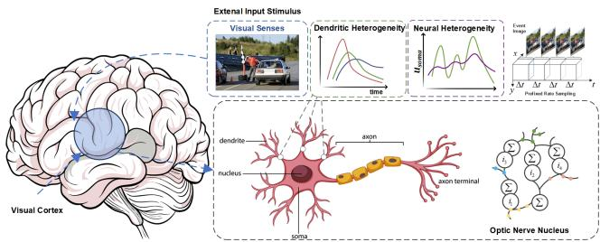
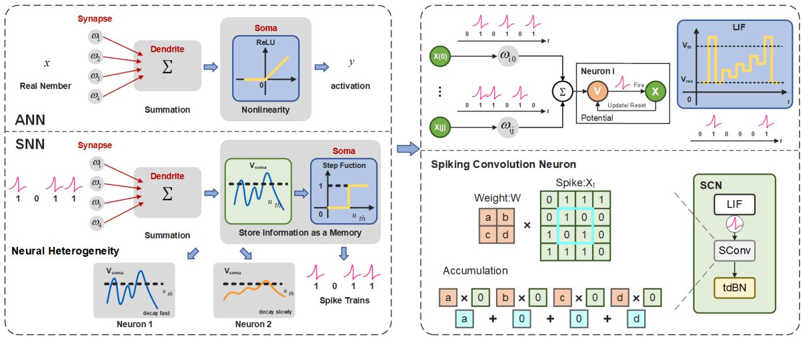
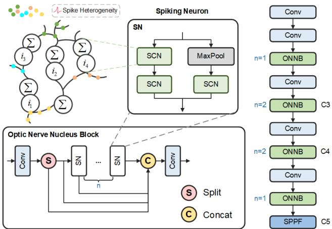
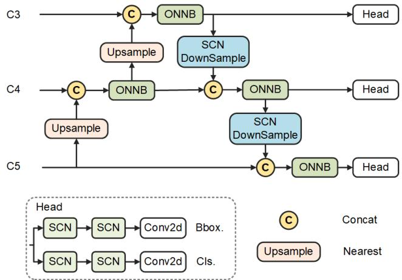
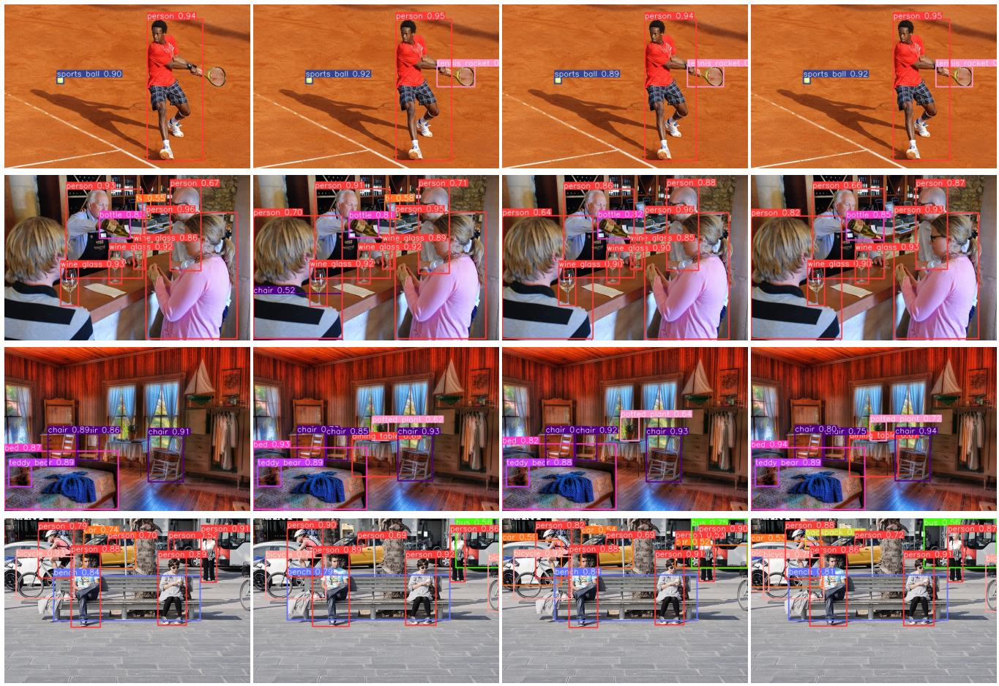
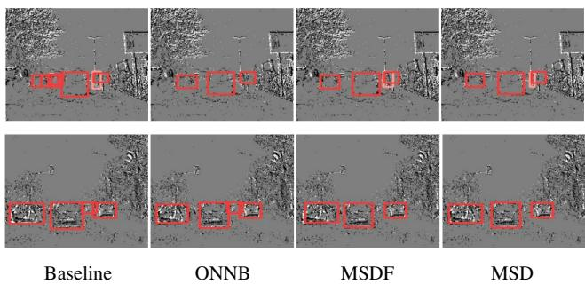

# Brain-Inspired Spiking Neural Networks for Energy-Efficient Object Detection

Ziqi Li1, Tao Gao1\* Yisheng An1, Ting Chen1\*, Jing Zhang2 Yuanbo Wen1, Mengkun Liu1, Qianxi Zhang1 Chang’an University1, Australian National University

{lzq,gaotao,aysm,tchen,wyb,mengkunliu,zqx1216}@chd.edu.cn, jing.zhang@anu.edu.au

## Abstract

Brain-inspired spiking neural networks (SNNs) have the capability ofenergy-efficient processing oftemporal information. However, leveraging the rich dynamic characteristics of SNNs and prior works in artificial neural networks (ANNs) to construct an effective object detection model for visual tasks remains an open question for further exploration. To develop a directly-trained , low energy consumption and high-performance multi-scale SNN model, we propose a novel interpretable object detection framework Multi-scale Spiking Detector (MSD). Initially, we propose a spiking convolutional neuron as a core component of the Optic Nerve Nucleus Block (ONNB), designed to significantly enhance the deep feature extraction capabilities of SNNs. ONNB enables direct training with improved energy efficiency, demonstrating superior performance compared to state-of-the-art ANN-to-SNN conversion and SNN techniques. In addition, we propose a Multi-scale Spiking Detection Framework to emulate the biological response and comprehension of stimuli from different objects. Wherein, spiking multi-scale fusion and the spiking detector are employed to integrate features across different depths and to detect response outcomes, respectively. Our method outperforms state-of-the-art ANN detectors, with only 7.8 M parameters and 6.43 mJ energy consumption. MSD obtains the mean average precision (mAP) of62.0% and 66.3% on COCO and Gen1 datasets, respectively.

## 1. Introduction

Object detection is a significant topic in computer vision, widely applied in multi-object tracking [53, 54], autonomous driving [10, 26, 47], robotics [21, 38], remote sensing [11, 12, 46] and medical image analysis [18, 29], etc. Achieving real-time object detection on embedded computing devices while balancing computational efficiency and high energy efficiency has always been a research focus.

Spiking Neural Networks (SNNs), often referred to as third-generation neural networks [35, 43], hold the potential to become a more efficient, biologically inspired approach to object detection. Specifically, SNNs utilize binary signals (spikes) rather than continuous signals for neuron communication, which significantly reduces the overhead associated with data transmission and storage. Moreover, SNNs exhibit asynchronous computation and event-driven communication, enabling them to avoid unnecessary computations and synchronization costs. SNNs exhibit outstanding energy efficiency when deployed on neuromorphic hardware [36, 39]. However, most existing SNN object detection tasks are converted from ANN, which has limitations in this operation. Spiking-Yolo [23] requires 3500 time steps to match the performance of artificial neural network (ANN). Spike Calibration [28] reduces the time steps to the order of hundreds, but the performance is limited by the baseline ANN model. Moreover, most ANN-to-SNN methods are not suitable for sparse event data, as their dynamic design is aimed at approximating the expected activations of ANN, making them unable to capture spatiotemporal information of DVS data [6] and difficult to train directly.

  
Figure 1. Illustration of the visual perception stimulation. We examine membrane potential changes in visual cortex neurons to explore dendritic and neural heterogeneity and further present an efficient trainable neuron model that transmits information via bypass pathways by simulating these changes.

Additionally, as illustrated in Fig 1, during cognitive tasks, image signals stimulate brain perception regions, where neural nuclei in the visual cortex, upon receiving electrical signals, transmit information through fast or bypass neural circuits due to dendritic heterogeneity, thus preventing information loss. Neuroscientists have observed significant temporal heterogeneity in brain circuits and responses required for real-world temporal computation tasks, including neural heterogeneity [15], dendritic heterogeneity [16], and synaptic heterogeneity [3]. To account for the heterogeneity and interactions between neurons, it is essential to simulate the potential firing model of neurons in response to stimuli. However, it presents a major challenge for network modeling due to the high computational and storage overhead associated with the numerous synapses involved. Therefore, when simulating large-scale neural networks, it becomes necessary to introduce simplified neuron models. As illustrated in Fig. 2, most existing SNNs designed for real-world temporal computation tasks use leaky integrateand-fire (LIF) neurons [1], effectively capturing temporal information across different time scales by fully leveraging the inherent temporal heterogeneity. Inspired by such biological mechanisms, the research objective is to achieve this efficiency in real-time object detection using SNNs.

  
Figure 2. Visualization of the biological inspirations for enhancing SNN modeling with temporal dendritic heterogeneity. Artificial neuron model used in ANNs lacks temporal memory, while the spiking neuron model in SNNs incorporates single-scale temporal memory in the neuron’s membrane potential. Spiking Convolution Neuron is designed by integrating the LIF firing model.

Unfortunately, when SNNs perform deep feature extraction, they inevitably encounter the problem of vanishing/exploding gradients, and performing multi-scale transformations on channels and dimensions while extracting features at different scales leads to increased energy consumption in non-spiking convolutional operations [45]. Existing object detection models [23, 51], limited by shallow architectures, suffer from low utilization of multi-scale feature information [34]. Furthermore, for deployment on neuromorphic hardware where only spike operations are allowed, SNNs need to achieve high-performance and efficient processing of static images and event data with few time steps.

To tackle these issues and develop a directly-trained and high-performance multi-scale object detection model based on SNN, we propose a novel interpretable Multi-scale Spiking Detector (MSD). Initially, we introduce the Optic Nerve Nucleus Block (ONNB), a novel module that incorporates the Spiking Convolutional Neuron as its core component, specifically designed to significantly enhance the deep feature extraction capabilities of SNNs. ONNB enables direct training with improved energy efficiency, demonstrating superior performance compared to state-of-the-art ANN-to-SNN conversion techniques. In addition, we propose a multi-scale spiking detection framework to emulate the biological response and comprehension of stimuli from different objects. Wherein, spiking multi-scale fusion and the spiking detector are employed to integrate features across different depths and to detect response outcomes, respectively. MSD effectively handles both static images and event data, demonstrating superior performance and lower energy consumption compared to other convert and hybrid SNNs for object detection.

We summarize the main contributions as follows.

• We introduce a innovative Multi-scale Spiking Detector (MSD), which could fuse multi-scale spatiotemporal features of SNNs, be trained directly, and achieve better performance than ANN-to-SNN conversion methods.

• We design a spiking convolutional neuron as a core compoment of Optic Nerve Nucleus Block (ONNB), achieving excitation through full spiking and theoretically analyzing the capability of extracting deep features, avoiding the vanishing/exploding gradient problem.

• We propose a detection framework that integrates multiscale spike signals, capable of simulating biological responses and processing stimuli from different objects. Experiments on the public datasets show that MSD achieves excellent performance while reducing energy consumption by 82.9%.

## 2. Related Work

## 2.1. Spiking Neural Networks

The training strategies for deep SNNs can be broadly classified into ANN-to-SNN conversion and direct SNN training. In ANN-to-SNN conversion, the average firing rate of the SNN is approximated by the continuous activation values of an ANN with ReLU non-linearity [2, 8]. The performance of the converted SNN is heavily dependent on the original ANN, making it difficult to achieve high-performance, low-latency SNNs, and could resulting in performance loss during conversion. Additionally, converted SNNs struggle to efficiently handle sparse event data, which is crucial for neuromorphic hardware integration.

Driven by the rapid advancement of artificial neural networks, researchers have utilized surrogate gradients to enable the direct training of SNNs. Leveraging backpropagation and various encoding schemes, directly trained SNNs can perform effectively over shorter time steps with low power consumption [20, 37]. Zheng et al. [55] introduced threshold-dependent batch normalization (tdBN) within the STBP framework, allowing SNNs to scale from shallow (<10 layers) to deeper architectures (up to 50 layers). Further works by Hu et al. [17] and Fang et al. [9] have achieved high performance on classification tasks. Some studies have explored deep directly trained SNNs for regression tasks like object tracking and image reconstruction. However, the application to object detection remains limited.

## 2.2. Spiking Object Detection

Mainstream deep learning detectors fall into two categories: two-stage frameworks (e.g., RCNN [13]) and one-stage frameworks (e.g., YOLO [42], SSD [33], Transformers [56]). While high-performing, these models are energyintensive, driving interest in more efficient SNN-based approaches.

Additionally, in object detection, key visual sensors include frame-based and event-based cameras [27, 40], with the latter excelling in challenging conditions like motion blur, overexposure, and low light. Early methods [22, 23, 28] used ANN-to-SNN conversion, but faced long inference times and were unsuitable for event camera data. Hybrid architectures [19, 30] combining SNN backbones with ANN detection heads added complexity. FSHNN [4] combines STDP, STBP, and Monte Carlo Dropout methods, reducing the time step requirement to 300 steps. However, the model still faces challenges in deployment on mobile robotic platforms, and its detection accuracy remains inferior to that of current mainstream ANN models like YOLOv5. Liu et al. [32] were the first to deploy an SNN-based object detection system on a robot, but the performance was suboptimal. Luo et al. [34] proposed the Integer-Valued Training and Spike-Driven Inference Spiking Neural Network, but it still faces issues related to large energy model parameters and high energy consumption. In this work, we propose using fully directly trained SNNs for object detection, offering a novel and efficient solution.

## 2.3. SNNs Training Method

The development of SNNs has long been constrained by training methodologies. To enable deeper SNN architectures, two primary training approaches have been developed. The ANN-to-SNN method replaces ReLU activation functions with spiking neurons, aiming to simulate continuous activation by controlling the firing rates of these neurons. While this approach can achieve high performance, it typically requires long time steps and struggles with sequence tasks that leverage the spatiotemporal dynamics of SNNs. To address the non-differentiable nature of SNNs, researchers have used surrogate gradients [25, 44, 52] to approximate the derivative of spiking functions. Wu et al. introduced the spatio-temporal backpropagation (STBP) framework [49], which considers both spatial and temporal dependencies during training, and later enhanced it with a neuron normalization technique [48]. Gu et al. proposed spatio-temporal credit assignment (STCA) with a temporal loss function [14]. Kim et al. developed batch normalization through time (BNTT) for BPTT [24], while Zheng et al. introduced threshold-dependent batch normalization (tdBN) for STBP [55]. This direct training is more flexible and requires fewer time steps but often results in performance that is inferior to that of artificial neural networks with the same architecture. Leveraging these emerging techniques, direct training methods can be used to build low-latency, high-accuracy SNNs [7, 41]. In this work, we focus on utilizing directly trained SNNs for object detection, as this approach offers greater architectural flexibility.

## 3. Proposed Method

## 3.1. Preliminary Definition

Event Input Considering the spatiotemporal characteristics of SNNs, static images generated by frame cameras are duplicated and used as input frames for each time step, while each pixel of an event camera responds independently to changes in light. When the logarithmic change in light $I ( x , y , t )$ exceeds the threshold $\theta _ { t h }$ , an event $\textit { e } _ { n } ~ = ~ ( x _ { n } , y _ { n } , t _ { n } , p _ { n } )$ is generated at the timestamp $t _ { n }$ for the pixel $( x _ { n } , y _ { n } )$ . The polarity $p _ { n } ~ \in ~ [ - 1 , 1 ]$ indicates an increase or decrease in light intensity. Given a spatiotemporal window $\varOmega ,$ the asynchronous event stream $E = \{ e _ { n } \in \varOmega , n = 1 , \cdots , N \}$ represents a sparse point grid in 3D space. In this paper, we split the asynchronous event stream into time bins with a constant time window $d t ,$ mapping the events into a 2D representation similar to an image [45]. The network processes T fixed time steps at a time, resulting in a total sequence of $\Gamma = T \times d t$

Energy Consumption The computational energy consumption of neuromorphic hardware is often measured by the number of operations. In ANNs, each operation involves floating-point multiplications and additions (MACs), and the computational load is typically estimated using floating-point operations (FLOPs). SNNs, however, are more energy-efficient in neuromorphic hardware since neurons only perform accumulation computations (AC) during spikes, and this can be achieved with a comparable number of synaptic operations (SyOPs). However, many existing SNNs introduce extra MAC operations due to design limitations. We define the energy consumption of SNNs as $\begin{array} { r } { E = \sum _ { i = 1 } ^ { n } E _ { i } , E _ { i } } \end{array}$ represents $i _ { t h }$ block:

$$
E _ { i } = T \times ( f _ { r } \times E _ { A C } \times O P _ { A C } + E _ { M A C } \times O P _ { M A C } ) ,\tag{1}
$$

where $T$ and $f _ { r }$ denote time steps and firing rate. The energy consumption is determined by the number of AC operations and MAC operations. For a 32-bit floating-point implementation using 45nm technology, $E _ { M A C } = 4 . 6 p J$ and $E _ { A C } = 0 . 9 p J$

## 3.2. Spiking Convolutional Neuron

Neurons are the fundamental units of neural networks, converting a large number of synaptic inputs into meaningful action potential outputs. In ANNs, neuron models typically disregard temporal dynamics, focusing on information propagation in the spatial domain. While this approach simplifies computation, it fails to capture the temporal characteristics of biological neurons. In contrast, SNNs use spiking neurons, which are more biologically realistic because they emulate the membrane potential dynamics and spikebased communication schemes, making them a more faithful representation of biological processes.

As illustrate in Fig. 2, among spiking neuron models, the Leaky Integrate-and-Fire (LIF) model, the Quadratic Integrate-and-Fire (QIF) model, and the Adaptive Exponential Integrate-and-Fire (AdEx) model are the most prominent. The LIF model, in particular, strikes a balance between biological realism and computational complexity, making it widely used for constructing SNNs. Additionally, spiking neurons incorporate rich biological features and consume less energy compared to ANN neurons. We are able to train deep SNNs with a speedup of tens of times by iterative LIF model [48], which can be describe as:

$$
\begin{array} { l } { { \displaystyle V ^ { t + 1 , n + 1 } ( i ) = k _ { \tau 1 } V ^ { t , n + 1 } ( i ) ( 1 - o ^ { t , n + 1 } ( i ) ) } } \\ { { \displaystyle \qquad \quad \quad ^ { l ( n ) } } } \\ { { \displaystyle \qquad + \sum _ { j = 1 } ^ { l } \omega _ { i j } ^ { n } o ^ { t + 1 , n } ( j ) , } } \\ { { \displaystyle \qquad \quad } } \\ { { \displaystyle o ^ { t + 1 , n + 1 } ( i ) = f ( V ^ { t + 1 , n + 1 } ( i ) - V _ { t h } ) , } } \end{array}\tag{2}
$$

(3)

where n and $l ( n )$ denote the n-th layer and its neuron number, respectively, $V ^ { t + 1 , n + 1 } ( i )$ is the membrane potential of the i-th neuron in layer n + 1 at time step $t ,$ and τ is the decay factor for leakage. $\omega _ { i j } ^ { n }$ represents the synaptic weight from the $j \mathrm { - t h }$ neuron in the pre-layer (layer n) to the i-th neuron in the post-layer (layer $n + 1 )$ . The synaptic input is the sum of $j$ spikes $o ^ { t + 1 , n } ( j )$ multiplied by the synaptic weights $\omega _ { i j } ^ { n }$ from the previous layer $n . \ f ( \cdot )$ is the step function, defined as $f ( x ) = 0$ when $x < 0$ and $f ( x ) = 1$ otherwise. As shown in Fig. 2, a spike activity is controlled by the threshold $V _ { t h }$ . Once a neuron fires at time step $t + 1 , V _ { t + 1 , n + 1 }$ is reset to $V _ { r e s t }$

Additionally, to resolve the issue of indistinguishable spikes in backpropagation, we utilize the surrogate gradient [49], which can be expressed as:

$$
\frac { \partial o ^ { t , n } ( i ) } { \partial V ^ { t , n } ( i ) } = \frac { 1 } { a } \mathrm { S i g n a l } ( \mid V ^ { t , n } ( i ) - V _ { t h } \mid ) \leq \frac { a } { 2 } ,\tag{4}
$$

where a where a is introduced to ensure that the gradient integrates to 1 and to determine the steepness of the curve. We utilize the tdBN [55] normalization method, which takes both spatial and temporal domains into account. tdBN can be described as:

$$
\mathrm { t d B N } ( I ^ { t + 1 } ( i ) ) = \lambda _ { i } \frac { \alpha V _ { t h } ( I ^ { t + 1 } ( i ) - \mu _ { c i } ) } { \sqrt { \sigma _ { c i } ^ { 2 } + \epsilon } } + \beta _ { i } ,\tag{5}
$$

$$
V ^ { t + 1 , n + 1 } ( i ) = \tau V ^ { t , n + 1 } ( i ) ( 1 - o ^ { t , n + 1 } ( i ) ) + \mathrm { t d B N } ( I ^ { t + 1 } ( i ) ) ,\tag{6}
$$

where $\mu _ { c i } , \sigma _ { c i } ^ { 2 }$ are the mean and variance for each channel computed using mini-batch continuous inputs, given by $\begin{array} { r } { I ^ { t + 1 } ( i ) = \sum _ { j = 1 } ^ { l ( n ) } \omega _ { i j } ^ { n } o ^ { t + 1 , n } ( j ) } \end{array}$ , ϵ is a small constant to avoid division by zero, while $\lambda _ { i }$ and $\beta _ { i }$ are two trainable parameters, α is a threshold-related hyperparameter.

As shown in Algorithm 1, we introduce the working principle of a spiking convolutional neuron (SCN). SCN controls membrane potential mem updates through LIF and decay factors. The Spike Conv performs convolution operations with time step, aiding in capturing the dynamic characteristics of time-series or spike data. tdBN applies batch normalization to data with a time dimension.

## 3.3. Optic Nerve Nucleus Block

In neuroscience, multiple neurons form a neural network interconnected by synapses, enabling complex signal transmission and processing. Neurons communicate via electrochemical signals (action potentials) and can group into neural nuclei to perform specific functions. Currently, SNNs primarily utilize a residual structure similar to ResNet. The SCN can be seen as comprising multiple neurons of the Optic Nerve Nucleus Block, where signals retain initial information as they pass through layers, with bypass signals enhancing transmission to prevent information loss.

Algorithm 1 Algorithm of Spiking Convolutional Neuron   
Input: X ∈ RT ×C×H×W (T = Time Window)   
Output: $X \in \mathbb { R } ^ { T \times C \times H \times W }$   
1: 1. LIF   
2: mem = zerolike.X[0]   
3: spike = zerolike.X[0]   
4: Xmem = zerolike.X[0]   
5: memold = 0   
6: for i ∈ range(T) : do   
7: if T>0 then   
8: mem = memold ∗ decay ∗ (1 − spike) + X[i]   
9: else   
10: mem = X[i]   
11: end if   
12: spike = SiLU(mem)   
13: mem = mem.clone()   
14: Xmem[i] = spike   
15: end for   
16: return $X _ { m e m }$   
17: 2. Spike Conv   
18: H = (height − kernel + 2 ∗ padding)/stride + 1   
19: W = (width − kernel + 2 ∗ padding)/stride + 1   
20: Y = zero tensor   
21: $Y = [ T , B , C _ { o u t } , h , w ]$   
22: for i ∈ range(T) : do   
23: Y[i] = Conv2D(input[i], weights, bias, stride, pad)   
24: end for   
25: return Y   
26: 3. tdBN   
27: Xinput = [N, C, T, H, W](N = batch)   
28: Transpose Xinput to [C, T, N, H, W]   
29: Reset Running Stats()   
30: if affine: then   
31: weight = α ∗ thresh (α=scale factor)   
32: bias = 0   
33: end if   
34: Transpose Back   
35: $\tilde { X _ { o u t p u t } } = n n . B a t c h N o r m 3 d ( X _ { o u t p u t } )$   
36: Output = tdBN(Spike Conv(LIF(Input)))   
37: return Output

As illustrated in Fig. 3, We define the Optic Nerve Nucleus Block (ONNB) to achieve residual learning by constraining the final LIF activation function to each residual and shortcut path. When a spike is received by each path:

  
Figure 3. Overall architecture of the optic nerve nucleus block (ONNB) is designed to enable residual learning by applying the final LIF activation function to each residual and shortcut path.

$$
X _ { t } = F ^ { r } ( X _ { t - 1 } ) + F ^ { s } ( X _ { t - 1 } ) = 2 ,\tag{7}
$$

which means that the non-spike convolution operation in the next block will introduce MAC operations. where $X _ { t }$ is the output of the t-th block $F ^ { r } ( \cdot )$ is residual path and $F ^ { s } ( \cdot )$ is shortcut path. Despite attempts to use AND or IAND operations to avoid this issue, they resulted in intolerable performance losses. For the MSResNet[17], it ignores the non-spiking convolution operations on the shortcut path. When the dimensions or the number of channels in the network change continuously, the energy consumption caused by this component cannot be overlooked. We design Spiking Neuron (SN) from the perspective of reducing parameters and avoiding MAC operations, where the residual path adopts the structure of two SCNs. On the shortcut path, considering the continuous downsampling process in the object detection task, we employ maxpooling to reduce parameters while introducing SCN to convert information into sparse spikes, enabling the entire network to operate in a fully spiking manner.

Given static image or event stream is represented as $X = \{ X _ { t } \} _ { t = 1 } ^ { T } .$ . The format of input data $X _ { t }$ at each time step t is $C \times H \times W$ , where $C$ denotes the number of channels and $H \times W$ represents the resolution. In the backbone, the first convolutional layer is trained to convert the input into spikes, with LIF neurons integrating the weighted input and generating output spike sequences when the membrane potential exceeds the trained firing threshold. Subsequently, ONNBs are utilized to extract target features from various dimensions and channel counts, enhancing the robustness of the network.

We construct the core components of ONNB by assembling two convolution modules (Conv), each comprising standard convolution, batch normalization and SiLU activation layers, along with several SNs. The output of the Conv is represented as follows:

$$
\operatorname { C o n v M } ( \mathrm { X } ) = { \mathit { S i L U } } ( B N [ c o n v ( X ) ] ) ,\tag{8}
$$

where conv(·) denotes the convolution operation.

In the ONNB, the input feature map $\boldsymbol { X } ^ { ' } \in \mathbb { R } ^ { T \times C _ { i n } \times H \times W }$ undergoes a Conv, resulting in the output $X \_ { \in }$ $\mathbb { R } ^ { T \times \breve { C } \times H \times W }$ . Then, the output is split into two parts which halve the number of channels, with one feature map serving as input to the Spike Neuron (SN), and the other as input for feature fusion. Subsequently, the input feature map $X ~ \in ~ \mathbb { R } ^ { T \times 0 . 5 C \times H \times W }$ is sequentially passed through n SNs, retaining the output features from each SN. Afterwards, these output features are concatenated together to obtain $X ~ \in ~ \mathbb { R } ^ { \hat { T } \times 0 . 5 ( n + 3 ) C \times H \times W }$ Finally, we pass the fused feature map through a Conv to resize the output feature map to $T \times C \times H \times W$

$$
\operatorname { S N } ( X ) = [ \operatorname { S C N } ( \operatorname { S C N } ( X ) ) , \operatorname { S C N } ( \operatorname { M a x p o o l } ( X ) ) ] ,\tag{9}
$$

$$
\begin{array} { r } { \mathrm { O N N B } ( X ) = \mathrm { C o n v } [ \mathrm { C o n v } ( X ) , S p ( X ) , } \\ { \mathrm { S N } ( S p ( X ) ) , \cdot \cdot \cdot , \mathrm { S N } ( \cdot \cdot \cdot \mathrm { S N } ( S p ( X ) ) ] , } \end{array}\tag{10}
$$

where [·] denotes concatenate operation, $S p ( \cdot )$ denotes split operation which split the input into two along the channel dimension, · · · encompasses the operations of passing through n SNs, which have been omitted for brevity. Each branch is concatenated to obtain the output feature map $X \in \mathbb { R } ^ { T \times 0 . 5 ( n + 3 ) C \times H \times W }$ , which is subsequently processed to produce the output $X \in \mathbb { R } ^ { T \times C \times H \times \hat { W } }$ through a Conv layer.

We concatenate 2 Conv layers and n SNs at each stage as depicted in Fig. 3. Different stages employ varying quantities of SNs in ONNB. The outputs from stages 3 and 4 are used as inputs C3 and C4 for the subsequent feature fusion operation within the multi-scale spiking detection framework. Additionally, the output from stage 4 undergoes pooling operation SPPF to yield C5.

## 3.4. Multi-scale Spiking Detection Framework

Feature pyramid innovatively integrates and outputs information at different scales through a top-down pathway, significantly enhancing the network’s detection performance for multi-scale objects. As illustrated in Fig. 4, we achieve this by leveraging ONNB to learn the spike response of features at different depths during the fusion process, merging fine-grained features from adjacent lower levels by SCN to generate high-quality feature representations for each scale.

For detector head, we introduce spikes into the Decouple Head to provide distinct features for classification and regression tasks. The SCN can automatically adjust the importance of each sub-task through spike-driven excitation, allowing the two branches to focus on their respective features and predictions.

  
Figure 4. Overall architecture of the multi-scale spiking detection framework (MSDF), which integrates features at different scales and simulates biological perception of objects by the responses of spiking convolutional neuron (SCN) in decouple head.

As a classification and regression task for SNN models, the main challenge in object detection is to transform the extracted features into precise continuous value representations of bounding box coordinates using spike trains. Here, we input the final membrane potentials of the neurons into each detector to generate anchors of varying sizes. After applying NMS-free processing, we obtain the final class coordinates and bounding box coordinates for different objects.

## 4. Experimental Results

## 4.1. Implementation Details

We apply mosaic data augmentation with a 0.5 stochastic probability. Utilizing the Stochastic Gradient Descent (SGD) optimizer, we set the momentum to 0.9 and commence training with a learning rate of 0.01, which is then decayed using cosine annealing to 0.0001. Our training utilizes a batch size of 32 and 300 epochs, resizing input images to 640 × 640 pixels sourced from COCO 2017.

The experiments are conducted in the PyTorch framework, utilizing a workstation equipped with an RTX 3090 Ti 24-GB GPU and 32-GB RAM. We set the reset value $V _ { r e s e t }$ of LIF neurons to 0, the membrane time constant τ to 0.25, the threshold $V _ { t h }$ to 0.5, and the coefficient α to 1.

## 4.2. Datasets

MS COCO dataset [31] is a primary static dataset for object detection. COCO 2017 val contains 80 classes, consisting of 118K training images and 5K validation images. We train on the train 2017 set, tuned hyperparameters using the val 2017 set, and evaluated on the test 2017 set, comparing with state-of-the-art object detectors.

Gen1 dataset [5] is a large-scale neuromorphic dataset designed for object detection, featuring 39 hours of open-road and various driving scenarios recorded with an ATIS sensor at a resolution of 304×240 pixels. It is divided into training, validation, and testing sets, and includes more than 255,000 manually labeled bounding boxes for pedestrians and vehicles. For each label, we process the event stream from 2.5 seconds prior, dividing it into T slices as input for the model. Training is conducted over 50 epochs and maintains the same hyperparameters as COCO 2017.

## 4.3. Comparison Experiments and Analysis

We conduct experiments to evaluate the performance of our proposed method with several existing state-of-the-art object detectors on two commonly used benchmarks.

Table 1. Comparison experiments on COCO 2017 dataset.
<table><tr><td>Method</td><td colspan="4">Params(M)Power(mJ)mAP@0.5@mAP@0.5:0.95</td></tr><tr><td>Spiking-Yolo [23]</td><td>10.2</td><td></td><td>1</td><td>25.7</td></tr><tr><td>Bayesian Optim [22]</td><td>10.2</td><td></td><td></td><td>25.9</td></tr><tr><td>Spike Calib [28]</td><td>17.1</td><td></td><td>45.4</td><td></td></tr><tr><td>EMS-YOLO [45]</td><td>26.9</td><td>29.0</td><td>50.1</td><td>30.1</td></tr><tr><td>Meta-SpikeFormer [50]</td><td>16.8</td><td>34.8</td><td>45.0</td><td></td></tr><tr><td>Meta-SpikeFormer(YOLO) [50]</td><td>16.8</td><td>70.7</td><td>50.3</td><td></td></tr><tr><td>SpikeYOLO [34]</td><td>13.2</td><td>23.1</td><td>59.2</td><td>42.5</td></tr><tr><td>MSD</td><td>7.8</td><td>6.4</td><td>62.0</td><td>45.3</td></tr></table>

Results on COCO 2017 dataset As it illustrate in Table 1, we obtain 62.0% mAP@50 and 45.3%mAP@0.5:0.95, which is +2.8% and + 2.8% higher than the prior stateof-the-art SNN, higher than the prior state-of-the-art SNN. MSD also shows significant advantages over existing SNNs in terms of parameters and power consumption, with 7.8 M parameters and 6.4 mJ, outperforming current methods. The comparison results with ANN-based object detection methods are presented in the Supplementary Materials.

Additionally, as illustrate in Fig. 1, we showcase the MSD’s detection results on dense, occluded, small objects, and complex backgrounds, all of which demonstrate outstanding detection performance on COCO 2017 dataset. MSD accurately localizes and identifies pedestrians concealed near vehicles, overlapping pedestrians, and distant small-scale targets, demonstrating its capability to handle such challenging scenarios effectively. MSD demonstrates exceptional proficiency in accurately detecting densely occluded objects, showcasing its robustness in challenging environments with complex backgrounds.

Results on Gen1 dataset: As shown in Table 2, MSD significantly improved the performance benchmark of the Gen1 dataset in SNNs. With 7.8M parameters and 6.51mJ energy consumption, it outperforms the state-of-the-art SNN model by 8% in mAP@0.5 and 8% in mAP@0.5:0.95, demonstrating the promising potential of SNNs in handling neuromorphic data. Compared to SpikeYOLO with

T×D set to 5×1, MSD achieves a +0.3 mAP@0.5 and +0.4 mAP@0.5:0.95 improvement, while using less than 40.9% of the parameters and 40.8% of the energy consumption.

Moreover, we showcase the MSD’s detection results on Gen1 dataset in Fig. 6. The visualization results show the varying performance of the proposed method on event camera data. MSD can accurately detect occluded moving objects and distant targets, demonstrating the promising potential of SNNs in processing neuromorphic data.

Table 2. Comparison experiments results on Gen1 dataset.
<table><tr><td>Method</td><td colspan="5">Params(M) Power(mJ) T × D mAP@0.5 @mAP@0.5:0.95</td></tr><tr><td>EMS-YOLO [45]</td><td>14.4</td><td>3.4</td><td>5</td><td>59.0</td><td>31.0</td></tr><tr><td>Spiking-Yolo [23]</td><td>7.9</td><td>102.3</td><td>500</td><td>44.2</td><td></td></tr><tr><td>Tr-Spiking-Yolo [51]</td><td>7.9</td><td>0.9</td><td>5</td><td>45.3</td><td></td></tr><tr><td>SpikeYOLO [34]</td><td>13.2</td><td>11.0</td><td>5×1</td><td>66.0</td><td>38.5</td></tr><tr><td>MSD</td><td>7.8</td><td>6.51</td><td>5×1</td><td>66.3</td><td>38.9</td></tr></table>

## 4.4. Ablation Study

To better understand the effectiveness of proposed methods in reducing energy consumption, we conducted ablation experiments of the proposed method on the Gen1 dataset.

Table 3. Ablation experiment on Gen1 dataset.
<table><tr><td>Method</td><td>Params(M) Power(mJ) T × D mAP@0.5 @mAP@0.5:0.95</td><td></td><td></td><td></td><td></td></tr><tr><td>Baseline</td><td>8.8</td><td>38.2</td><td>1</td><td>56.8</td><td>37.4</td></tr><tr><td>+ONNB</td><td>7.8</td><td>11.3</td><td>5×1</td><td>64.3</td><td>34.2</td></tr><tr><td>+MSDF</td><td>7.7</td><td>20.9</td><td>5×1</td><td>59.1</td><td>41.1</td></tr><tr><td>MSD (ONNB+MSDF)</td><td>7.8</td><td>6.5</td><td>5×1</td><td>66.3</td><td>38.9</td></tr></table>

Effect of ONNB: In Table 3, ONNB significantly improves performance with a minimal increase in parameters. We obtain 64.3% mAP@50 and 34.2% mAP@0.5 0.95 by deploying ONNB with 26.9mJ power and 1.0M parameter reduction. In Table 3, ONNB significantly improves performance with a minimal increase in parameters. In the visualized detection results shown in Fig. 5, the introduction of ONNB significantly reduces missed detections and improves the accuracy of detecting low-quality objects.

Effect of MSDF: MSDF positively impacts the performance of both the baseline and our final network. Additionally, we found that MSDF has a minimal impact on the model’s parameter count while significantly reducing energy consumption. Only by deploying MSDF on the baseline, we still achieved performance reductions of 2.3% mAP@50 and 6.1% mAP@0.5:0.95. We finaly obtain 66.3% mAP@50 and 38.9% mAP@0.5:0.95 in MSD by adding ONNB and MSDF. Wherein, we reduced energy consumption 82.9% and parameter count by 11.2%. In the visualized detection results shown in Fig. 5, MSDF improves the detection accuracy of objects at different scales.

MSD  

Figure 5. Object detection results on the COCO 2017 dataset. The first three columns compare the effect of Baseline, ONNB, MSDF. The fourth columns compare the MSD performance. MSD could accurately locate and identify pedestrians hidden near vehicles, overlapping pedestrians, and small-scale distant targets, demonstrating proposed methods effectiveness in handling such challenging scenarios.  
  
Figure 6. Object detection results on the Gen1 dataset. By comparing the visualization results of the proposed methods across different scenarios, we obtain varying performance on data containing temporal information.

## 5. Limitations

Although our model achieves competitive performance with small amount of parameters, it still presents two main limitations. Initially, the further ablation experiments of our model with varying depths and parameters have not been conducted, limiting a more in-depth analysis of ONNB and MSDF. Furthermore, the affects of membrane potential reset mechanism in learning dynamics and convergence remain unclear and warrants further investigation.

## 6. Conclusion

In this work, we propose a directly-trained Multi-scale Spiking Detector. Initially, a plug-and-play, brain-inspired Optic Nerve Nucleus Block exhibit low energy consumption and high efficiency, facilitating deployment on SNN neuromorphic hardware. Additionally, Multi-scale Spiking Detection Framework achieve performance comparable to ANNs in shorter time steps. This work greatly reduces the performance gap between SNNs and ANNs in object detection tasks. In future work, we will further investigate the use of pulse neurons in multi-visual task applications and address the current limitations.

Acknowledgment. This research was funded by the National R&D Program of China (2023YFB2504703), the National Natural Science Foundation of China (52441205, 52172379), and the Shaanxi International S&T Cooperation Program Project (2024GH-YBXM-24).

## References

[1] Larry F Abbott. Lapicque’s introduction of the integrate-andfire model neuron (1907). Brain research bulletin, 50(5-6): 303–304, 1999. 2

[2] Yongqiang Cao, Yang Chen, and Deepak Khosla. Spiking deep convolutional neural networks for energy-efficient object recognition. International Journal of Computer Vision (IJCV), 113:54–66, 2015. 3

[3] Franc¸ois P Chabrol, Alexander Arenz, Martin T Wiechert, Troy W Margrie, and David A DiGregorio. Synaptic diversity enables temporal coding of coincident multisensory inputs in single neurons. Nature neuroscience, 18(5):718–727, 2015. 2

[4] Biswadeep Chakraborty, Xueyuan She, and Saibal Mukhopadhyay. A fully spiking hybrid neural network for energy-efficient object detection. IEEE Transactions on Image Processing, 30:9014–9029, 2021. 3

[5] Pierre De Tournemire, Davide Nitti, Etienne Perot, Davide Migliore, and Amos Sironi. A large scale eventbased detection dataset for automotive. arXiv preprint arXiv:2001.08499, 2020. 7

[6] Lei Deng, Yujie Wu, Xing Hu, Ling Liang, Yufei Ding, Guoqi Li, Guangshe Zhao, Peng Li, and Yuan Xie. Rethinking the performance comparison between snns and anns. Neural networks, 121:294–307, 2020. 1

[7] Shikuang Deng, Yuhang Li, Shanghang Zhang, and Shi Gu. Temporal efficient training of spiking neural network via gradient re-weighting. In International Conference on Learning Representations (ICLR), 2022. 3

[8] Peter U Diehl, Daniel Neil, Jonathan Binas, Matthew Cook, Shih-Chii Liu, and Michael Pfeiffer. Fast-classifying, highaccuracy spiking deep networks through weight and threshold balancing. In International joint conference on neural networks (IJCNN), pages 1–8. ieee, 2015. 3

[9] Wei Fang, Zhaofei Yu, Yanqi Chen, Tiejun Huang, Timothee´ Masquelier, and Yonghong Tian. Deep residual learning in spiking neural networks. Advances in Neural Information Processing Systems, 34:21056–21069, 2021. 3

[10] Di Feng, Christian Haase-Schutz, Lars Rosenbaum, Heinz¨ Hertlein, Claudius Glaeser, Fabian Timm, Werner Wiesbeck, and Klaus Dietmayer. Deep multi-modal object detection and semantic segmentation for autonomous driving: Datasets, methods, and challenges. IEEE Transactions on Intelligent Transportation Systems, 22(3):1341–1360, 2020. 1

[11] Tao Gao, Ziqi Li, Yuanbo Wen, Ting Chen, Qianqian Niu, and Zixiang Liu. Attention-free global multiscale fusion network for remote sensing object detection. IEEE Transactions on Geoscience and Remote Sensing, 2023. 1

[12] Tao Gao, Qianqian Niu, Jing Zhang, Ting Chen, Shaohui Mei, and Ahmad Jubair. Global to local: A scale-aware network for remote sensing object detection. IEEE Transactions on Geoscience and Remote Sensing, 2023. 1

[13] Ross Girshick, Jeff Donahue, Trevor Darrell, and Jitendra Malik. Rich feature hierarchies for accurate object detection and semantic segmentation. In Proceedings ofthe IEEE conference on computer vision and pattern recognition, pages 580–587, 2014. 3

[14] Pengjie Gu, Rong Xiao, Gang Pan, and Huajin Tang. Stca: Spatio-temporal credit assignment with delayed feedback in deep spiking neural networks. In International Joint Conference on Artificial Intelligence (IJCAI), pages 1366–1372, 2019. 3

[15] Kenneth D Harris and Gordon MG Shepherd. The neocortical circuit: themes and variations. Nature neuroscience, 18 (2):170–181, 2015. 2

[16] Michael Hausser, Nelson Spruston, and Greg J Stuart. Diversity and dynamics of dendritic signaling. Science, 290 (5492):739–744, 2000. 2

[17] Yifan Hu, Lei Deng, Yujie Wu, Man Yao, and Guoqi Li. Ad vancing spiking neural networks toward deep residual learning. IEEE Transactions on Neural Networks and Learning Systems, 2024. 3, 5

[18] Paul F Jaeger, Simon AA Kohl, Sebastian Bickelhaupt, Fabian Isensee, Tristan Anselm Kuder, Heinz-Peter Schlemmer, and Klaus H Maier-Hein. Retina u-net: Embarrassingly simple exploitation of segmentation supervision for medical object detection. In Machine Learning for Health Workshop, pages 171–183. PMLR, 2020. 1

[19] Olof Johansson. Training of object detection spiking neura networks for event-based vision, 2021. 3

[20] Jacques Kaiser, Hesham Mostafa, and Emre Neftci. Synap tic plasticity dynamics for deep continuous local learning (decolle). Frontiers in Neuroscience, 14:424, 2020. 3

[21] Hakan Karaoguz and Patric Jensfelt. Object detection approach for robot grasp detection. In International Conference on Robotics and Automation (ICRA), pages 4953–4959. IEEE, 2019. 1

[22] Seijoon Kim, Seongsik Park, Byunggook Na, Jongwan Kim, and Sungroh Yoon. Towards fast and accurate object detection in bio-inspired spiking neural networks through bayesian optimization. IEEE Access, 9:2633–2643, 2020. 3, 7

[23] Seijoon Kim, Seongsik Park, Byunggook Na, and Sungroh Yoon. Spiking-yolo: spiking neural network for energyefficient object detection. In AAAI Conference on Artificial Intelligence (AAAI), pages 11270–11277, 2020. 1, 2, 3, 7

[24] Youngeun Kim and Priyadarshini Panda. Revisiting batch normalization for training low-latency deep spiking neural networks from scratch. Frontiers in neuroscience, 15: 773954, 2021. 3

[25] Jun Haeng Lee, Tobi Delbruck, and Michael Pfeiffer. Train ing deep spiking neural networks using backpropagation. Frontiers in neuroscience, 10:508, 2016. 3

[26] Buyu Li, Wanli Ouyang, Lu Sheng, Xingyu Zeng, and Xiao gang Wang. Gs3d: An efficient 3d object detection frame

work for autonomous driving. In IEEE Conference on Computer Vision and Pattern Recognition (CVPR), pages 1019– 1028, 2019. 1

[27] Jianing Li, Xiao Wang, Lin Zhu, Jia Li, Tiejun Huang, and Yonghong Tian. Retinomorphic object detection in asynchronous visual streams. In AAAI Conference on Artificial Intelligence (AAAI), pages 1332–1340, 2022. 3

[28] Yang Li, Xiang He, Yiting Dong, Qingqun Kong, and Yi Zeng. Spike calibration: Fast and accurate conversion of spiking neural network for object detection and segmentation. arXiv preprint arXiv:2207.02702, 2022. 1, 3, 7

[29] Zhuoling Li, Minghui Dong, Shiping Wen, Xiang Hu, Pan Zhou, and Zhigang Zeng. Clu-cnns: Object detection for medical images. Neurocomputing, 350:53–59, 2019. 1

[30] Hong-Han Lien and Tian-Sheuan Chang. Sparse compressed spiking neural network accelerator for object detection. IEEE Transactions on Circuits and Systems I: Regular Papers, 69(5):2060–2069, 2022. 3

[31] Tsung-Yi Lin, Michael Maire, Serge Belongie, James Hays, Pietro Perona, Deva Ramanan, Piotr Dollar, and C. Lawrence´ Zitnick. Microsoft coco: Common objects in context. In European Conference on Computer Vision (ECCV), pages 740– 755, Cham, 2014. Springer International Publishing. 6

[32] Bo-Chao Liu, Qian Yu, Jing-Wen Gao, Shuang Zhao, Xiong-Chang Liu, and Yan-Feng Lu. Spiking neuron networks based energy-efficient object detection for mobile robot. In 2021 China Automation Congress (CAC), pages 3224–3229. IEEE, 2021. 3

[33] Wei Liu, Dragomir Anguelov, Dumitru Erhan, Christian Szegedy, Scott Reed, Cheng-Yang Fu, and Alexander C Berg. Ssd: Single shot multibox detector. In European Conference on Computer Vision (ECCV), pages 21–37. Springer, 2016. 3

[34] Xinhao Luo, Man Yao, Yuhong Chou, Bo Xu, and Guoqi Li. Integer-valued training and spike-driven inference spiking neural network for high-performance and energy-efficient object detection. In European Conference on Computer Vision (ECCV), 2024. 2, 3, 7

[35] Wolfgang Maass. Networks of spiking neurons: the third generation of neural network models. Neural networks, 10 (9):1659–1671, 1997. 1

[36] Paul A Merolla, John V Arthur, Rodrigo Alvarez-Icaza, Andrew S Cassidy, Jun Sawada, Filipp Akopyan, Bryan L Jackson, Nabil Imam, Chen Guo, Yutaka Nakamura, et al. A million spiking-neuron integrated circuit with a scalable communication network and interface. Science, 345(6197):668– 673, 2014. 1

[37] Emre O Neftci, Hesham Mostafa, and Friedemann Zenke. Surrogate gradient learning in spiking neural networks: Bringing the power of gradient-based optimization to spiking neural networks. IEEE Signal Processing Magazine, 36 (6):51–63, 2019. 3

[38] Shuvo Kumar Paul, Muhammed Tawfiq Chowdhury, Mircea Nicolescu, Monica Nicolescu, and David Feil-Seifer. Object detection and pose estimation from rgb and depth data for real-time, adaptive robotic grasping. In Advances in Computer Vision and Computational Biology: Proceedings from

IPCV’20, HIMS’20, BIOCOMP’20, and BIOENG’20, pages 121–142. Springer, 2021. 1

[39] Chi-Sang Poon and Kuan Zhou. Neuromorphic silicon neu rons and large-scale neural networks: challenges and oppor tunities. Frontiers in neuroscience, 5:108, 2011. 1

[40] Christoph Posch, Daniel Matolin, and Rainer Wohlgenannt. A qvga 143 db dynamic range frame-free pwm image sensor with lossless pixel-level video compression and time-domain cds. IEEE Journal of Solid-State Circuits, 46(1):259–275, 2010. 3

[41] Nitin Rathi and Kaushik Roy. Diet-snn: A low-latency spik ing neural network with direct input encoding and leakage and threshold optimization. IEEE Transactions on Neural Networks and Learning Systems, 34(6):3174–3182, 2021. 3

[42] J Redmon. You only look once: Unified, real-time object detection. In Proceedings of the IEEE conference on computer vision and pattern recognition, 2016. 3

[43] Kaushik Roy, Akhilesh Jaiswal, and Priyadarshini Panda. Towards spike-based machine intelligence with neuromorphic computing. Nature, 575(7784):607–617, 2019. 1

[44] Sumit B Shrestha and Garrick Orchard. Slayer: Spike layer error reassignment in time. Advances in neural information processing systems, 31, 2018. 3

[45] Qiaoyi Su, Yuhong Chou, Yifan Hu, Jianing Li, Shijie Mei, Ziyang Zhang, and Guoqi Li. Deep directly-trained spik ing neural networks for object detection. In Proceedings of the IEEE/CVF International Conference on Computer Vision (ICCV), pages 6555–6565, 2023. 2, 7

[46] Yuanbo Wen, Tao Gao, Jing Zhang, Ziqi Li, and Ting Chen. Encoder-free multiaxis physics-aware fusion network for remote sensing image dehazing. IEEE Transactions on Geoscience and Remote Sensing, 61:1–15, 2023. 1

[47] Yuanbo Wen, Tao Gao, Ziqi Li, Jing Zhang, Kaihao Zhang, and Ting Chen. All-in-one weather-degraded image restora tion via adaptive degradation-aware self-prompting model. IEEE Transactions on Multimedia, pages 1–13, 2025. 1

[48] Yujie Wu, Lei Deng, Guoqi Li, Jun Zhu, and L Shi. Direct training for spiking neural networks: Faster. Larger, Better, 2018. 3, 4

[49] Yujie Wu, Lei Deng, Guoqi Li, Jun Zhu, and Luping Shi. Spatio-temporal backpropagation for training highperformance spiking neural networks. Frontiers in neuroscience, 12:331, 2018. 3, 4

[50] Man Yao, Jiakui Hu, Tianxiang Hu, Yifan Xu, Zhaokun Zhou, Yonghong Tian, Bo Xu, and Guoqi Li. Spike-driven transformer v2: Meta spiking neural network architecture inspiring the design of next-generation neuromorphic chips. arXiv preprint arXiv:2404.03663, 2024. 7

[51] Mengwen Yuan, Chengjun Zhang, Ziming Wang, Huixiang Liu, Gang Pan, and Huajin Tang. Trainable spiking-yolo for low-latency and high-performance object detection. Neural Networks, 172:106092, 2024. 2, 7

[52] Friedemann Zenke and Surya Ganguli. Superspike: Super vised learning in multilayer spiking neural networks. Neural computation, 30(6):1514–1541, 2018. 3

[53] Yifu Zhang, Chunyu Wang, Xinggang Wang, Wenjun Zeng, and Wenyu Liu. Fairmot: On the fairness of detection and

re-identification in multiple object tracking. International journal ofcomputer vision, 129:3069–3087, 2021. 1

[54] Yifu Zhang, Peize Sun, Yi Jiang, Dongdong Yu, Fucheng Weng, Zehuan Yuan, Ping Luo, Wenyu Liu, and Xinggang Wang. Bytetrack: Multi-object tracking by associating every detection box. In European Conference on Computer Vision (ECCV), pages 1–21. Springer, 2022. 1

[55] Hanle Zheng, Yujie Wu, Lei Deng, Yifan Hu, and Guoqi Li. Going deeper with directly-trained larger spiking neural networks. In AAAI Conference on Artificial Intelligence (AAAI), pages 11062–11070, 2021. 3, 4

[56] Xizhou Zhu, Weijie Su, Lewei Lu, Bin Li, Xiaogang Wang, and Jifeng Dai. Deformable detr: Deformable transformers for end-to-end object detection. In International Conference on Learning Representations (ICLR), 2021. 3