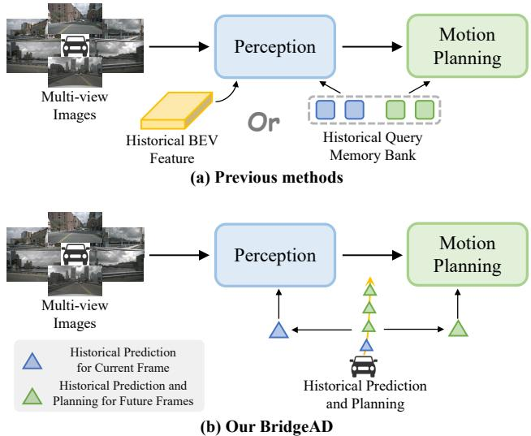
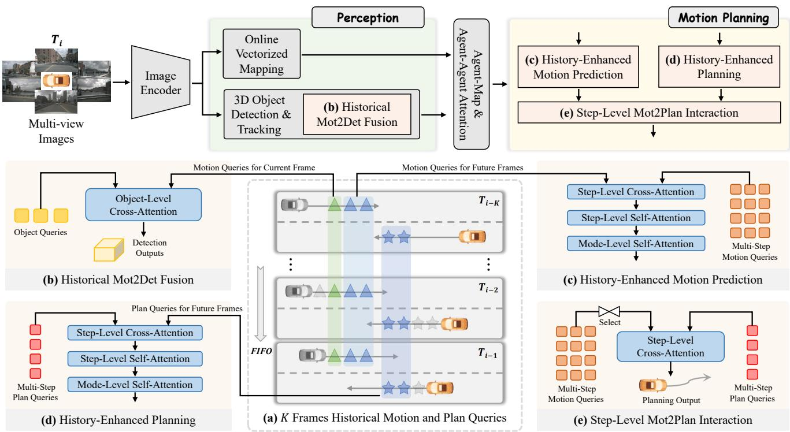
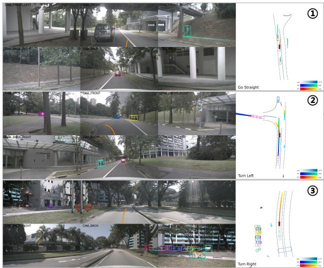
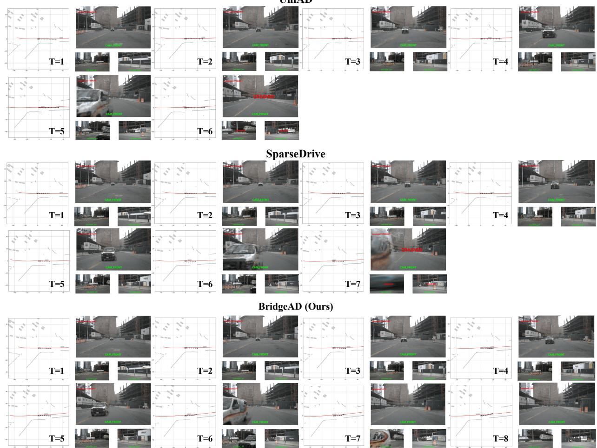

# Bridging Past and Future: End-to-End Autonomous Driving with Historical Prediction and Planning

Bozhou Zhang1 Nan Song1 Xin Jin2 Li Zhang1\*

1 School of Data Science, Fudan University 2 Eastern Institute of Technology

https://github.com/fudan-zvg/BridgeAD

## Abstract

End-to-end autonomous driving unifies tasks in a differentiable framework, enabling planning-oriented optimization and attracting growing attention. Existing methods aggregate historical information either through dense historical bird’s-eye-view (BEV) features or by querying a sparse memory bank, following paradigms inherited from detection. We argue that these paradigms either omit historical information in motion planning or fail to align with its multi-step nature, which requires predicting or planning multiple future time steps. In line with the philosophy of “future is a continuation ofpast”, we propose BridgeAD, which reformulates motion and planning queries as multistep queries to differentiate the queriesfor eachfuture time step. This design enables the effective use of historical prediction and planning by applying them to the appropriate parts of the end-to-end system based on the time steps, which improves bothperception and motionplanning. Specifically, historical queries for the current frame are combined with perception, while queries for future frames are integrated with motion planning. In this way, we bridge the gap between past and future by aggregating historical insights at every time step, enhancing the overall coherence and accuracy of the end-to-end autonomous driving pipeline. Extensive experiments on the nuScenes dataset in both open-loop and closed-loop settings demonstrate that BridgeAD achieves state-of-the-art performance.

## 1. Introduction

Autonomous driving [7] has progressed rapidly in recent years. Traditional systems use a modular approach, dividing tasks into perception [24, 27, 47], prediction [40, 58], and planning [9, 12], which simplifies each task but may interrupt the flow of information and lead to error accumulation. End-to-end methods [18, 22] unify these tasks, enabling planning-oriented optimization and improved system coherence, and have gained increasing attention.

  
Figure 1. The primary distinction between previous methods and ours lies in how historical information is aggregated. As depicted in (a), previous methods either interact with historical BEV features within the perception module or utilize a historical query memory bank. As shown in (b), our BridgeAD enhances end-toend autonomous driving by incorporating historical prediction for the current frame into the perception module and historical prediction and planning for future frames into the motion planning module.

Current end-to-end methods largely originate from detection approaches [24, 30, 47], adopting similar paradigms for utilizing temporal information to enhance performance. These paradigms are generally divided into two categories: dense methods [18, 22], which aggregate historical bird’seye-view (BEV) features, and sparse methods [43, 54], which rely on querying a sparse memory bank. However, we argue that these paradigms are suboptimal. As shown in Figure 1 (a), the former leverages temporal information solely in the perception module, overlooking its importance in motion planning. The latter performs a rough interaction with historical motion planning queries, where each query corresponds to a trajectory instance. This approach does not align with the multi-step nature of motion planning, which requires predicting or planning multiple future steps to account for varying agent states over time, leading to suboptimal results.

In this paper, we propose BridgeAD, a framework to enhance end-to-end autonomous driving by leveraging historical prediction and planning, as shown in Figure 1 (b). Embracing the idea thatfuture is a continuation ofpast, we first decompose motion and planning queries into multi-step queries to address each future time step individually. Then, motion queries for the current frame, derived from historical prediction, are integrated into the perception module to enhance perception accuracy. Similarly, motion and planning queries for future frames, derived from historical prediction and planning, are combined within the motion planning module, allowing step-specific interactions to refine prediction and planning outcomes. Additionally, interactions between motion and planning queries at corresponding steps ensure consistency between the predictions of surrounding agents and the ego vehicle’s planning across future time steps. Through this design, we bridge past and future by merging historical prediction and planning with current perception and future motion planning. This approach enhances the entire end-to-end autonomous driving pipeline, creating a more cohesive system that improves the accuracy and consistency of perception, prediction, and planning across different time steps.

Our contributions are summarized as follows: (i) We represent motion and planning queries as multi-step queries, distinguishing each future time step to leverage historical insights at the step level. (ii) We introduce BridgeAD, a novel framework that employs historical prediction and planning to enhance the end-to-end autonomous driving pipeline. (iii) Extensive experiments on the nuScenes dataset, conducted in both open-loop and closed-loop settings, demonstrate that BridgeAD achieves state-of-the-art performance.

## 2. Related work

Perception. Perception extracts meaningful information from raw sensor data, primarily through 3D detection, multi-object tracking, and online mapping. For 3D detection, a series of approaches [19, 33] inspired by LSS [38] obtain BEV representations from 2D image features using depth estimation; other approaches [24, 50] use predefined BEV queries for feature sampling. Recent methods [30, 47] adopt a sparse approach, employing sparse queries for spatial-temporal aggregation. For multi-object tracking (MOT), some methods [47, 51] use the trackingby-detection approach, while others [52, 55] employ track queries to continuously model tracked instances. For online mapping, HDMapNet [23] accomplishes this using BEV semantic segmentation with post-processing, while VectorMapNet [32] employs a two-stage autoregressive transformer for vectorized map construction. MapTR [27] and subsequent methods [6, 28] treat map elements as permutation-equivalent point sets, achieving impressive performance.

Motion prediction. Motion prediction aims to forecast agents’ multi-modal future trajectories. Inspired by object queries in detection [4], some methods adopt a querycentric paradigm [20, 40, 41, 53, 58] to achieve strong performance in motion prediction benchmarks [13, 49]. Some works aim to enhance motion prediction performance by incorporating historical predictions [44] or employing a streaming approach [42]. Other approaches [5, 26, 37] explore end-to-end motion prediction by first perceiving objects from multi-view images and then predicting their future trajectories. ViP3D [14] leverages agent queries to jointly perform tracking and prediction, using images and HD maps as input.

Planning. Rule-based [12, 45] and learning-based planners [8, 9] are widely explored in planning benchmarks [3]. Some works [1, 15, 21] explore the use of belief states to improve planning results or decision-making. Recently, endto-end planning has gained attention for its ability to integrate perception, prediction, and planning within a unified framework. Earlier approaches [10, 39] often bypass intermediate tasks such as perception and motion prediction. ST-P3 [17] incorporates map perception, BEV occupancy prediction, and trajectory planning to derive ego vehicle planning results from surrounding camera views. Recently, UniAD [18] has significantly advanced end-toend autonomous driving by introducing a unified query design that integrates multiple tasks into a planning-oriented model, delivering impressive performance across perception, prediction, and planning. VAD [22] simplifies the pipeline by using vectorized map representations, achieving state-of-the-art planning performance with improved efficiency. GenAD [57] adopts a generative framework that predicts the ego vehicle’s future trajectories within a learned probabilistic latent space. SparseDrive [43] employs a sparse scene representation and a parallel structure for its motion planner. However, these methods do not fully explore how to leverage historical information to improve planning accuracy and continuity during continuous driving. Our BridgeAD is the first to integrate this insight into its design.

## 3. Methodology

## 3.1. Overview

The framework of BridgeAD is illustrated in Figure 2. It comprises three main components: image encoder, historyenhanced perception and history-enhanced motion planning. First, the image encoder extracts multi-scale spatial features from multi-view images. Next, the historyenhanced perception module employs a sparse approach for 3D object detection, tracking, and online vectorized mapping, integrating historical information through (b) the Historical Mot2Det Fusion Module, followed by agent-agent and agent-map attention. Finally, the history-enhanced motion planning module, consisting of (c) the History-Enhanced Motion Prediction Module, (d) the History-Enhanced Planning Module, and (e) the Step-Level Mot2Plan Interaction Module, generates motion prediction and planning outputs using historical data. Additionally, the memory queue (a) caches historical motion and planning queries to provide relevant historical information to the above modules.

## 3.2. Multi-step motion and planning query caching

The design of our BridgeAD framework relies on a multistep representation for motion and planning queries. Existing methods represent multi-modal motion queries as $Q _ { \mathrm { m o t } } ^ { \mathrm { p r e v i o u s } } \in \mathbb { R } ^ { N _ { \mathrm { a } } \times \mathbf { \dot { M } } _ { \mathrm { m o t } } \times C }$ , where $N _ { \mathrm { a } } , M _ { \mathrm { m o t } }$ , and C denote the number of surrounding agents, the number of prediction modes, and the feature channels, respectively. Each query corresponds to a trajectory. In contrast, we define the motion queries as $Q _ { \mathrm { m o t } } \in \dot { \mathbb { R } } ^ { \mathbf { \bar { N } _ { a } } \times M _ { \mathrm { m o t } } \times T _ { \mathrm { m o t } } \times C }$ , where $T _ { \mathrm { m o t } }$ is the number of future time steps for prediction. Similarly, we represent planning queries as $Q _ { \mathrm { p l a n } } \doteq \mathbb { R } ^ { M _ { \mathrm { p l a n } } \times T _ { \mathrm { p l a n } } \times \overleftarrow { C } } ,$ where $M _ { \mathrm { p l a n } }$ and $T _ { \mathrm { p l a n } }$ denote the number of planning modes and future planning time steps, respectively. In this way, we differentiate queries across time steps in motion planning, establishing the foundation for step-level interactions with historical information in subsequent modules. Motion and planning queries for the past K frames are stored in a memory queue, which operates on a first-in, firstout (FIFO) basis: as new frame information is added, the oldest entry is removed, as illustrated in Figure 2 (a).

## 3.3. History-enhanced perception

Detection, tracking, and online mapping. Given the multi-view images $\breve { I } ~ \in ~ \mathbb { R } ^ { N _ { \mathrm { i m g } } \times 3 \times H \times \bar { W } }$ , where $N _ { \mathrm { i m g } }$ denotes the number of camera views, the image encoder [16] first extracts multi-view visual features, denoted as ${ \mathcal F } .$ These features are then used for perception.

The key components of perception are detection, tracking, and online mapping. We follow a sparse paradigm [30, $4 3 , 4 7 ]$ . For detection, surrounding agents are represented by a set of object queries $Q _ { \mathrm { o b j } } \in \mathbb { R } ^ { N _ { \mathrm { a } } \times C }$ and and anchor boxes $B _ { \mathrm { o b j } } \in \mathbb { R } ^ { N _ { \mathrm { a } } \times 1 1 }$ , where each box is represented as $\{ x , y , z , l n ( \bar { w } ) , l n ( h ) , l n ( l ) , s i n ( \theta ) , c o n ( \theta ) , v _ { x } , v _ { y } , v _ { z } \}$ containing location, dimensions, yaw angle, and velocity components, respectively. Several attention-based decoder layers [11, 46, 59] are used to refine the object queries and anchor boxes. These layers take the visual features ${ \mathcal { F } } _ { : }$ object queries $Q _ { \mathrm { o b j } }$ , and anchor boxes $B _ { \mathrm { o b j } }$ as input and output classification scores along with anchor box offsets. For tracking, we follow the ID assignment process in Lin et al. [31], where each object query is assigned a unique ID. For online mapping, we employ a vectorized representation [22, 27, 43], where map instances are represented as a set of map queries and points, utilizing a structure similar to that used in detection.

Historical Mot2Det fusion. As shown in Figure $2 \ ( \mathsf { b } )$ the Historical Mot2Det Fusion Module aggregates historical prediction. As mentioned above, we extract the motion query corresponding to the current frame’s time step from the cached historical motion queries over the past K frames, yielding $Q _ { \mathrm { m 2 d } } ~ \in ~ \mathbb { R } ^ { N _ { \mathrm { a } } \times K \times \bar { C } }$ . An attention mechanism is then applied to interact between historical motion queries $Q _ { \mathrm { m 2 d } }$ and object queries $Q _ { \mathrm { o b j } }$ , as shown below:

$$
Q _ { \mathrm { o b j } } = \mathrm { C r o s s A t t n } ( \mathrm { Q } = Q _ { \mathrm { o b j } } , \mathrm { K } , \mathrm { V } = Q _ { \mathrm { m 2 d } } ) .\tag{1}
$$

Then, similar to the decoder layers in the detection module, classification scores along with anchor box offsets are output, and the refined object queries are passed to the following modules.

## 3.4. History-enhanced motion planning

After obtaining object and map queries from the perception module, the object queries and initialized ego query interact with map queries and each other via attention. These refined queries are then passed to the motion planning module, which predicts future trajectories for surrounding agents and plans the ego vehicle’s trajectory.

History-enhanced motion prediction. As shown above, we formulate motion queries as multi-step queries, $Q _ { \mathrm { m o t } } \in$ $\mathbb { R } ^ { N _ { \mathrm { a } } \times M _ { \mathrm { m o t } } \times T _ { \mathrm { m o t } } \times C }$ , initialized from object queries. From the cached historical motion queries over the past K frames, we extract the motion queries corresponding to the future $T _ { \mathrm { m 2 m } }$ steps in each frame, yielding $Q _ { \mathrm { m 2 m } } \in$ $\mathbb { R } ^ { N _ { \mathrm { a } } \times M _ { \mathrm { m o t } } \times K \times T _ { \mathrm { m 2 m } } \times C }$ It is worth noting that $T _ { \mathrm { m 2 m } }$ is smaller than the total time steps $T _ { \mathrm { m o t } }$ used for motion prediction, as historical data does not allow prediction as far into the future as required for the current frame. Attention is then applied in three aspects: cross-attention between $Q _ { \mathrm { m o t } }$ and $Q _ { \mathrm { m 2 m } } .$ , and self-attention on $Q _ { \mathrm { m o t } }$ at both the step and mode levels, as shown below:

  
Figure 2. Overview of the BridgeAD framework: Multi-view images are first processed by the Image Encoder, after which both 3D objects and the vectorized map are perceived. (a) The memory queue caches K past frames of historical motion and planning queries. (b) The Historical Mot2Det Fusion Module is proposed to enhance detection and tracking by leveraging historical motion queries for the current frame. In the motion planning component, (c) the History-Enhanced Motion Prediction Module and (d) the History-Enhanced Planning Module aggregate multi-step historical motion and planning queries into queries for the future frames. Finally, (e) the Step-Level Mot2Plan Interaction Module facilitates interaction between multi-step motion queries and planning queries for corresponding future time steps.

$$
\begin{array} { r l } & { Q _ { \mathrm { m o t } } = \mathrm { C r o s s A t t n } ( \mathrm { Q } = Q _ { \mathrm { m o t } } , \mathrm { K } , \mathrm { V } = Q _ { \mathrm { m 2 m } } ) , } \\ & { Q _ { \mathrm { m o t } } = \mathrm { S t e p S e l f A t t n } ( Q _ { \mathrm { m o t } } ) , } \\ & { Q _ { \mathrm { m o t } } = \mathrm { M o d e S e l f A t t n } ( Q _ { \mathrm { m o t } } ) . } \end{array}\tag{2}
$$

This process, illustrated in Figure 2 (c), aggregates historical prediction information and enhances consistency across future time steps and trajectory modes.

History-enhanced planning. The planning module follows a similar process to the motion prediction module, as shown in Figure 2 (d). Planning queries are initialized as multi-step queries, $Q _ { \mathrm { p l a n } } \in \bar { \mathbb { R } } ^ { M _ { \mathrm { p l a n } } \times T _ { \mathrm { p l a n } } \times C }$ , from the ego query. Historical planning queries corresponding to the future $T _ { \mathrm { p 2 p } }$ steps are extracted to form $Q _ { \mathrm { p 2 p } } \in$ $\mathbb { R } ^ { M _ { \mathrm { p l a n } } \times K \times T _ { \mathrm { p 2 p } } \times \dot { C } }$ . Similar to the motion prediction module, three types of attention are applied, as shown below:

$$
\begin{array} { r l } & { Q _ { \mathrm { p l a n } } = \mathrm { C r o s s A t t n } ( \mathrm { Q } = Q _ { \mathrm { p l a n } } , \mathrm { K } , \mathrm { V } = Q _ { \mathrm { p 2 p } } ) , } \\ & { Q _ { \mathrm { p l a n } } = \mathrm { S t e p S e l f A t t n } ( Q _ { \mathrm { p l a n } } ) , } \\ & { Q _ { \mathrm { p l a n } } = \mathrm { M o d e S e l f A t t n } ( Q _ { \mathrm { p l a n } } ) . } \end{array}\tag{3}
$$

Notably, cross-attention in both the motion prediction and planning modules occurs between corresponding time steps. Specifically, historical motion queries interact with the $T _ { \mathrm { m 2 m } }$ steps of all $T _ { \mathrm { m o t } }$ motion queries, and the same applies to the planning module. Historical information is then propagated to all steps of queries using two levels of self-attention.

Step-level Mot2Plan interaction. To improve consistency between motion prediction and planning, we introduce a module to interact motion queries and planning queries at the step level, as shown in Figure 2 (e). Specifically, the $T _ { \mathrm { p l a n } }$ steps of motion queries, representing the future states of surrounding agents within the planning time horizon, interact with the corresponding planning queries. We select the queries with the highest probability across $M _ { \mathrm { m o t } }$ modes based on the prediction scores to form $Q _ { \mathrm { m o t } } ^ { * } \in$ $\mathbb { R } ^ { N _ { \mathrm { a } } \times T _ { \mathrm { p l a n } } \times C }$ . The process is shown below:

$$
\begin{array} { r l } & { Q _ { \mathrm { m o t } } ^ { * } = \mathrm { S e l e c t W i t h S c o r e } ( Q _ { \mathrm { m o t } } ) , } \\ & { Q _ { \mathrm { p l a n } } = \mathrm { C r o s s A t t n } ( \mathrm { Q } = Q _ { \mathrm { p l a n } } , \mathrm { K } , \mathrm { V } = Q _ { \mathrm { m o t } } ^ { * } ) . } \end{array}\tag{4}
$$

Finally, the planning trajectories and scores are output.

Following previous practice [18, 22, 43], we use three driving commands: turn left, turn right, and go straight, to select and obtain the final planning output.

## 3.5. End-to-end learning

The loss functions consist of four tasks: detection $( \mathcal { L } _ { d e t } ) .$ online mapping $( \mathcal { L } _ { m a p } ) _ { \ast }$ , motion prediction $( \mathcal { L } _ { m o t } )$ , and planning $( \mathcal { L } _ { p l a n } )$ . The loss for each task is divided into regression and classification components. For regression, we use L1 loss, and for classification, we use Focal loss [29]. For the multi-modal motion prediction and planning tasks, we apply a winner-takes-all strategy. The overall loss function for end-to-end training is as follows:

$$
\mathcal { L } _ { t o t a l } = \mathcal { L } _ { d e t } + \mathcal { L } _ { m a p } + \mathcal { L } _ { m o t } + \mathcal { L } _ { p l a n } .\tag{5}
$$

Further details of the model and loss function are provided in the supplementary materials.

## 4. Experiments

## 4.1. Experimental settings

Datasets and evaluation metrics. We conduct our experiments on the challenging nuScenes [2] dataset, which comprises 1,000 driving scenes, each lasting 20 seconds. The dataset provides semantic maps and 3D object detection annotations for keyframes, with samples annotated at 2Hz, including six camera images per keyframe. We perform openloop testing on nuScenes following previous work [18, 22] and conduct closed-loop testing in the NeuroNCAP [34] simulator based on nuScenes. NeuroNCAP is a photorealistic closed-loop simulation framework providing diverse safety-critical scenarios recorded from nuScenes, which are not feasible to collect in the real world. For open-loop evaluation, we use the L2 Displacement Error metric, consistent with VAD [22], and the Collision Rate [17, 25] as defined in [25, 43]. For closed-loop evaluation, we apply the NeuroNCAP Score and Collision Rate [34]. Additional metrics for perception and prediction tasks are consistent with previous work [18]. Further details are provided in the supplementary materials.

Implementation details. BridgeAD plans a 3-second future trajectory for the ego vehicle and forecasts a 6-second future trajectory for surrounding agents. This setup results in a motion prediction time step, $T _ { \mathrm { m o t } }$ , of 12 and a planning time step, $T _ { \mathrm { p l a n } } .$ , of 6. The historical time steps for motion prediction, $T _ { \mathrm { m 2 m } }$ , is set to 6, and for planning, $T _ { \mathrm { p 2 p } }$ is set to 3. We cache the past $K = 3$ frames of motion and planning queries in the memory queue. Our BridgeAD model has two variants: BridgeAD-S and BridgeAD-B. For BridgeAD-S, ResNet50 [16] is used as the backbone network to encode image features, with an input image size of 256 × 704; this is our default model. For BridgeAD-B, ResNet101 is used with an input image size of 512 × 1408. In training, we use the AdamW [35] optimizer with Cosine Annealing [36], a weight decay of $1 \times 1 0 ^ { - 3 }$ , and an initial learning rate of $1 \times 1 0 ^ { - 4 }$ . Training is conducted in two stages: one focused on perception tasks and the other on end-to-end training. Experiments are conducted on 8 NVIDIA RTX A6000 GPUs. Additional configuration details and further experiments are provided in the supplementary materials.

## 4.2. Comparison with state of the art

Open-loop planning results. As shown in Table 1, we compare the open-loop planning performance of our BridgeAD with recent top-performing methods, including both end-to-end autonomous driving [18, 22, 43, 57] and world model [48, 56] approaches. Our BridgeAD achieves state-of-the-art performance. To address the issue raised by Li et al. [25] regarding over-reliance on ego vehicle status for future path planning, our BridgeAD does not use ego status as input. Despite this, our method outperforms others that do rely on ego status.

Closed-loop planning results. We adopt BridgeAD for closed-loop evaluation using the NeuroNCAP [34] simulator based on the nuScenes [2] dataset, which provides photorealistic, safety-critical scenarios for testing. Our BridgeAD achieves significantly better performance than previous methods [18, 22, 43], with or without the trajectory post-processing proposed by UniAD [18], as shown in Table 2. Specifically, without post-processing, the NeuroNCAP score of our BridgeAD-S is 65% higher than SparseDrive and reduces the collision rate by 12.4% compared to UniAD. The results demonstrate that our model improves continuity and consistency in planning across continuous driving scenes by effectively aggregating historical information, highlighting the potential of BridgeAD in closed-loop simulation. In contrast, other methods either neglect historical information in motion planning [18, 22] or fail to effectively incorporate it at the current frame [43], which allows them to perceive surrounding agents but limits their ability to avoid collisions. We highlight this advantage in the qualitative analysis section to further support the insights of our method.

Perception and motion prediction results. The perception results are shown in Table 4, and the motion prediction results in Table 3. By leveraging historica information and multi-step motion query representation, our BridgeAD achieves superior performance across all metrics compared to other methods. Similar improvements are also evident in the perception results, for both detection and tracking.

<table><tr><td rowspan="2">Method</td><td rowspan="2">Reference</td><td colspan="4">L2 (m) ↓</td><td colspan="4">Col. Rate (%) ↓</td><td rowspan="2">FPS</td></tr><tr><td>1s</td><td>2s</td><td>3s</td><td>Avg.</td><td>1s</td><td>2s</td><td>3s</td><td>Avg.</td></tr><tr><td>OccWorld-D [56]</td><td>ECCV 2024</td><td>0.52</td><td>1.27</td><td>2.41</td><td>1.40</td><td>0.12</td><td>0.40</td><td>2.08</td><td>0.87</td><td>一</td></tr><tr><td>Drive-WM [48]</td><td>CVPR 2024</td><td>0.43</td><td>0.77</td><td>1.20</td><td>0.80</td><td>0.10</td><td>0.21</td><td>0.48</td><td>0.26</td><td></td></tr><tr><td>ST-P3 [17]</td><td>ECCV 2022</td><td>1.33</td><td>2.11</td><td>2.90</td><td>2.11</td><td>0.23</td><td>0.62</td><td>1.27</td><td>0.71</td><td>1.6</td></tr><tr><td>GenAD [57]</td><td>ECCV 2024</td><td>0.36</td><td>0.83</td><td>1.55</td><td>0.91</td><td>0.06</td><td>0.23</td><td>1.00</td><td>0.43</td><td>6.7</td></tr><tr><td>UniAD† [18]</td><td>CVPR 2023</td><td>0.45</td><td>0.70</td><td>1.04</td><td>0.73</td><td>0.62</td><td>0.58</td><td>0.63</td><td>0.61</td><td>1.8</td></tr><tr><td>VAD† [22]</td><td>ICCV 2023</td><td>0.41</td><td>0.70</td><td>1.05</td><td>0.72</td><td>0.03</td><td>0.19</td><td>0.43</td><td>0.21</td><td>4.5</td></tr><tr><td>SparseDrive† [43]</td><td>arXiv 2024</td><td>0.30</td><td>0.58</td><td>0.95</td><td>0.61</td><td>0.01</td><td>0.05</td><td>0.23</td><td>0.10</td><td>6.1</td></tr><tr><td>BridgeAD-S (Ours)</td><td></td><td>0.29</td><td>0.57</td><td>0.92</td><td>0.59</td><td>0.01</td><td>0.05</td><td>0.22</td><td>0.09</td><td>5.0</td></tr><tr><td>BridgeAD-B (Ours)</td><td></td><td>0.28</td><td>0.55</td><td>0.92</td><td>0.58</td><td>0.00</td><td>0.04</td><td>0.20</td><td>0.08</td><td>3.9</td></tr></table>

Table 1. Open-loop planning results on the nuScenes [2] validation dataset. † indicates evaluation with the official checkpoint. FPS is measured on one NVIDIA RTX 3090 GPU with batch size 1, while UniAD’s is on one NVIDIA Tesla A100. To avoid the ego-status leakage problem, as proposed by Li et al. [25], we do not use the ego status as input.

<table><tr><td>Method</td><td>Post-proc.</td><td>Score ↑</td><td>Col. Rate (%) ↓</td></tr><tr><td>VAD [22]</td><td>x</td><td>0.66</td><td>92.5</td></tr><tr><td>UniAD [18]</td><td>x</td><td>0.73</td><td>88.6</td></tr><tr><td>SparseDrive† [43]</td><td>x</td><td>0.92</td><td>93.9</td></tr><tr><td>BridgeAD-S (Ours)</td><td>x</td><td>1.52</td><td>76.2</td></tr><tr><td>BridgeAD-B (Ours)</td><td>x</td><td>1.60</td><td>72.6</td></tr><tr><td>VAD [22]</td><td>√</td><td>2.75</td><td>50.7</td></tr><tr><td>UniAD [18]</td><td>√</td><td>1.84</td><td>68.7</td></tr><tr><td>BridgeAD-S (Ours)</td><td>√</td><td>2.98</td><td>46.1</td></tr><tr><td>BridgeAD-B (Ours)</td><td>√</td><td>3.06</td><td>44.3</td></tr></table>

Table 2. Closed-loop simulation results on nuScenes dataset with NeuroNCAP [34] benchmark. † indicates evaluation with official checkpoint. “Post-proc.” refers to trajectory post-processing, as proposed in UniAD.
<table><tr><td>Method</td><td>ADE (m) ↓ Car / Ped</td><td>FDE (m) ↓ Car / Ped</td><td>MR↓ Car / Ped</td><td>EPA↑ Car / Ped</td></tr><tr><td>ViP3D [14]</td><td>2.05 / -</td><td>2.84 / -</td><td>0.25 / -</td><td>0.23 / -</td></tr><tr><td>UniAD [18]</td><td>0.71 / 0.78</td><td>1.02 / 1.05</td><td>0.15 / 0.12</td><td>0.46 / 0.35</td></tr><tr><td>SparseDrive [43]</td><td>0.62 / 0.72</td><td>0.99 / 1.07</td><td>0.14 / 0.14</td><td>0.48 / 0.41</td></tr><tr><td>BridgeAD-S (Ours) BridgeAD-B (Ours)</td><td>0.62 / 0.70 0.60 / 0.70</td><td>0.98 / 0.99 0.96 / 0.98</td><td>0.13 / 0.13 0.13 / 0.12</td><td>0.50 / 0.44 0.52 / 0.45</td></tr></table>

Table 3. Comparison of motion prediction results of state-of-theart methods. We evaluate two main categories: cars and pedestrians.

## 4.3. Ablation study

Effects of designs for planning. We conduct experiments on our planning design, as shown in Table 6. In ID-1, we remove the History-Enhanced Planning module, and in ID-2, we remove the Step-Level Mot2Plan Interaction module. The results show that removing either module leads to a significant reduction in planning performance compared to BridgeAD in ID-3. This demonstrates that historical planning information and prediction of surrounding agents play a crucial role in improving ego vehicle planning.

<table><tr><td rowspan=1 colspan=1>Method</td><td rowspan=1 colspan=1>Backbone</td><td rowspan=1 colspan=1>mAP↑</td><td rowspan=1 colspan=1>NDS ↑</td></tr><tr><td rowspan=2 colspan=1>VAD† [22]SparseDrive [43]</td><td rowspan=2 colspan=1>R50R50</td><td rowspan=1 colspan=1>0.273</td><td rowspan=1 colspan=1>0.397</td></tr><tr><td rowspan=1 colspan=1>0.418</td><td rowspan=1 colspan=1>0.525</td></tr><tr><td rowspan=1 colspan=1>BridgeAD-S (Ours)</td><td rowspan=1 colspan=1>R50</td><td rowspan=1 colspan=1>0.423</td><td rowspan=1 colspan=1>0.534</td></tr><tr><td rowspan=2 colspan=1>BEVFormer [24]UniAD [18]</td><td rowspan=1 colspan=1>R101</td><td rowspan=1 colspan=1>0.416</td><td rowspan=1 colspan=1>0.517</td></tr><tr><td rowspan=1 colspan=1>R101</td><td rowspan=1 colspan=1>0.380</td><td rowspan=1 colspan=1>0.498</td></tr><tr><td rowspan=1 colspan=1>BridgeAD-B (Ours)</td><td rowspan=1 colspan=1>R101</td><td rowspan=1 colspan=1>0.507</td><td rowspan=1 colspan=1>0.594</td></tr></table>

(a) 3D detection results.

<table><tr><td rowspan=1 colspan=1>Method</td><td rowspan=1 colspan=1>Backbone</td><td rowspan=1 colspan=1>AMOTA↑</td><td rowspan=1 colspan=1>AMOTP↓</td><td rowspan=1 colspan=1>IDS↓</td></tr><tr><td rowspan=2 colspan=1>ViP3D [14]SparseDrive [43]</td><td rowspan=1 colspan=1>R50</td><td rowspan=1 colspan=1>0.217</td><td rowspan=2 colspan=1>1.6251.254</td><td rowspan=2 colspan=1>886</td></tr><tr><td rowspan=1 colspan=1>R50</td><td rowspan=1 colspan=1>0.386</td></tr><tr><td rowspan=1 colspan=1>BridgeAD-S (Ours)</td><td rowspan=1 colspan=1>R50</td><td rowspan=1 colspan=1>0.398</td><td rowspan=1 colspan=1>1.232</td><td rowspan=1 colspan=1>639</td></tr><tr><td rowspan=1 colspan=1>UniAD [18]</td><td rowspan=1 colspan=1>R101</td><td rowspan=1 colspan=1>0.359</td><td rowspan=1 colspan=1>1.320</td><td rowspan=1 colspan=1>906</td></tr><tr><td rowspan=1 colspan=1>BridgeAD-B (Ours)</td><td rowspan=1 colspan=1>R101</td><td rowspan=1 colspan=1>0.512</td><td rowspan=1 colspan=1>1.080</td><td rowspan=1 colspan=1>544</td></tr></table>

(b) Multi-object tracking results.  
Table 4. Comparison of perception results of state-of-the-art perception or end-to-end methods. † indicates evaluation with official checkpoint.

Effects of designs for perception and prediction. We conduct experiments on our design for perception and prediction, with results shown in Table 5. In ID-1, when the History-Enhanced Motion Prediction module is removed, motion prediction performance significantly declines. Although the Historical Mot2Det Fusion module is used, detection and tracking performance does not match that in ID-3 due to suboptimal prediction. Similarly, in ID-2, detection and tracking performance significantly decreases without the Historical Mot2Det Fusion module.

Effects of self-attention in planning. We conduct an ablation study on the effect of step-level self-attention and mode-level self-attention in the planning module, as shown in Table 7. The results show that without either type of self-attention, planning performance significantly decreases. Without self-attention, historical information can only be aggregated for the $T _ { \mathrm { p 2 p } }$ steps of planning queries. The step-level and mode-level self-attention mechanisms propagate this information across all planning steps and modes, enhancing both the accuracy and consistency of planning at each time step.

<table><tr><td rowspan="2">ID</td><td rowspan="2">Mot2Det</td><td rowspan="2">HisMot</td><td colspan="2">Detection</td><td colspan="2">Tracking</td><td colspan="3">Motion Prediction</td></tr><tr><td>mAP↑</td><td>NDS ↑</td><td>AMOTA↑</td><td>AMOTP↓</td><td>ADE (m) ↓</td><td>FDE (m) ↓</td><td>EPA↑</td></tr><tr><td>1</td><td>√</td><td></td><td>0.412</td><td>0.526</td><td>0.387</td><td>1.240</td><td>0.66 / 0.75</td><td>1.05 / 1.08</td><td>0.47 / 0.40</td></tr><tr><td>2</td><td></td><td>√</td><td>0.404</td><td>0.512</td><td>0.369</td><td>1.260</td><td>0.62 / 0.69</td><td>0.99 / 0.98</td><td>0.49 / 0.43</td></tr><tr><td>3</td><td>√</td><td>√</td><td>0.423</td><td>0.534</td><td>0.398</td><td>1.232</td><td>0.62 / 0.70</td><td>0.98 / 0.99</td><td>0.50 / 0.44</td></tr></table>

Table 5. Ablation study on the Historical Mot2Det Fusion module and History-Enhanced Motion Prediction module. We evaluate motion prediction for cars and pedestrians.

<table><tr><td rowspan="2">ID</td><td rowspan="2">HisPlan Mot2Plan</td><td rowspan="2">1s</td><td colspan="4">L2 (m) ↓</td><td colspan="4">Col. Rate (%) ↓</td></tr><tr><td></td><td>2s</td><td>3s</td><td>Avg.</td><td>1s</td><td>2s</td><td>3s</td><td>Avg.</td></tr><tr><td>1</td><td></td><td>√</td><td>0.35</td><td>0.68</td><td>1.10</td><td>0.71</td><td>0.01</td><td>0.11</td><td>0.34</td><td>0.15</td></tr><tr><td>2</td><td>√</td><td></td><td>0.33</td><td>0.65</td><td>1.07</td><td>0.68</td><td>0.01</td><td>0.13</td><td>0.40</td><td>0.18</td></tr><tr><td>3</td><td>√</td><td>√</td><td>0.29</td><td>0.57</td><td>0.92</td><td>0.59</td><td>0.01</td><td>0.05</td><td>0.22</td><td>0.09</td></tr></table>

Table 6. Ablation study on the History-Enhanced Planning module and Step-Level Mot2Plan Interaction module.
<table><tr><td>SLA</td><td>MLA|</td><td></td><td>| Avg. L2 (m) ↓ | Avg. Col. Rate (%) ↓</td></tr><tr><td rowspan="2">√</td><td></td><td>0.66</td><td>0.17</td></tr><tr><td>√</td><td>0.64</td><td>0.15</td></tr><tr><td></td><td>√</td><td>0.59</td><td>0.09</td></tr></table>

Table 7. Ablation study on step-level self-attention (SLA) and mode-level self-attention (MLA).

<table><tr><td>HisMot</td><td>HisPlan</td><td></td><td>| Avg. L2 (m) ↓ | Avg. Col. Rate (%) ↓</td></tr><tr><td>5</td><td>3</td><td>0.63</td><td>0.13</td></tr><tr><td>7</td><td>3</td><td>0.62</td><td>0.09</td></tr><tr><td>6</td><td>2</td><td>0.64</td><td>0.13</td></tr><tr><td>6</td><td>4</td><td>0.60</td><td>0.11</td></tr><tr><td>6</td><td>3</td><td>0.59</td><td>0.09</td></tr></table>

Table 8. Ablation study on the number of time steps for aggregating historical information.

Effects of the number of time steps in aggregating historical information. As shown in Table 8, we investigate performance variations based on the number of time steps used for aggregating historical information in motion and planning queries. We fix the time steps for aggregating historical information in planning queries at 3, while varying them in motion queries (upper part). Similarly, we fix the time steps in motion queries at 6, while varying them in planning queries (lower part). We observe that the best results are achieved when the number of time steps for interacting with historical information is 6 for motion queries and 3 for planning queries.

  
Figure 3. Qualitative results in the open-loop evaluation show that our BridgeAD accurately produces planning outputs.

## 4.4. Efficiency analysis

As shown in Table 1, we compare the Frames Per Second (FPS) of our BridgeAD and other end-to-end methods. FPS for all models, except UniAD, is measured on a single NVIDIA RTX 3090 GPU with a batch size of 1. For UniAD, we use the official FPS value, measured on an NVIDIA Tesla A100 GPU. Our BridgeAD achieves high performance with reasonable efficiency. The inference latency of our model is 157.2 ms, significantly faster than VAD’s 224.3 ms and UniAD’s 555.6 ms.

  
Figure 4. Qualitative results in the closed-loop evaluation demonstrate that our BridgeAD effectively avoids collisions in safety-critical scenarios.

## 4.5. Qualitative analysis

We present qualitative results of open-loop and closed-loop evaluation on the nuScenes [2] dataset. As shown in Figure 3, we display the perception and prediction outcomes along with the planning of the ego vehicle in both surrounding images and the Bird’s Eye View (BEV) in the open-loop setting. In Figure 4, we illustrate the closedloop simulation results for a safety-critical scenario in which our BridgeAD model successfully avoids a collision with an oncoming vehicle traveling in the wrong direction by steering appropriately. In contrast, UniAD [18] and SparseDrive [43] either fail to steer or do not steer suf ficiently, resulting in a crash. Qualitative results for the closed-loop simulation show that our model, by aggregating historical motion and planning information, forms a continuous understanding of nearby vehicles’ motions, enabling coherent driving actions that successfully avoid collisions with oncoming vehicles. Additional qualitative results and failure cases are provided in the supplementary materials.

## 5. Conclusion

In this paper, we propose BridgeAD, an end-to-end framework that enhances autonomous driving by integrating historical prediction and planning across perception, prediction, and planning stages. By representing motion and planning queries as multi-step queries, we enable step-specific interactions and leverage temporal information to improve coherence across future time steps. Extensive experiments on the nuScenes dataset in both open-loop and closed-loop scenarios demonstrate that BridgeAD achieves superior performance. Our results highlight the potential of incorporating historical insights to bridge past and future, advancing technological progress in autonomous driving.

## Acknowledgments

This work was supported in part by National Natural Science Foundation of China (Grant No. 62376060).

## References

[1] Maxime Bouton, Akansel Cosgun, and Mykel J Kochenderfer. Belief state planning for autonomously navigating urban intersections. In 2017 IEEE Intelligent Vehicles Symposium (IV), 2017. 2

[2] Holger Caesar, Varun Bankiti, Alex H Lang, Sourabh Vora, Venice Erin Liong, Qiang Xu, Anush Krishnan, Yu Pan, Giancarlo Baldan, and Oscar Beijbom. nuscenes: A multimodal dataset for autonomous driving. In CVPR, 2020. 5, 6, 8

[3] Holger Caesar, Juraj Kabzan, Kok Seang Tan, Whye Kit Fong, Eric Wolff, Alex Lang, Luke Fletcher, Oscar Beijbom, and Sammy Omari. nuplan: A closed-loop ml-based planning benchmark for autonomous vehicles. arXiv preprint, 2021. 2

[4] Nicolas Carion, Francisco Massa, Gabriel Synnaeve, Nicolas Usunier, Alexander Kirillov, and Sergey Zagoruyko. End-toend object detection with transformers. In ECCV, 2020. 2

[5] Sergio Casas, Wenjie Luo, and Raquel Urtasun. Intentnet: Learning to predict intention from raw sensor data. In CoRL, 2018. 2

[6] Jiacheng Chen, Yuefan Wu, Jiaqi Tan, Hang Ma, and Yasutaka Furukawa. Maptracker: Tracking with strided memory fusion for consistent vector hd mapping. In ECCV, 2024. 2

[7] Li Chen, Penghao Wu, Kashyap Chitta, Bernhard Jaeger, Andreas Geiger, and Hongyang Li. End-to-end autonomous driving: Challenges and frontiers. IEEE TPAMI, 2024. 1

[8] Jie Cheng, Yingbing Chen, and Qifeng Chen. Pluto: Pushing the limit of imitation learning-based planning for autonomous driving. arXiv preprint, 2024. 2

[9] Jie Cheng, Yingbing Chen, Xiaodong Mei, Bowen Yang, Bo Li, and Ming Liu. Rethinking imitation-based planners for autonomous driving. In ICRA, 2024. 1, 2

[10] Felipe Codevilla, Matthias Muller, Antonio L¨ opez, Vladlen´ Koltun, and Alexey Dosovitskiy. End-to-end driving via conditional imitation learning. In ICRA, 2018. 2

[11] Tri Dao, Daniel Y Fu, Stefano Ermon, Atri Rudra, and Christopher Re. Flashattention: Fast and memory-efficient´ exact attention with io-awareness. In NeurIPS, 2022. 3

[12] Daniel Dauner, Marcel Hallgarten, Andreas Geiger, and Kashyap Chitta. Parting with misconceptions about learningbased vehicle motion planning. In CoRL, 2023. 1, 2

[13] Scott Ettinger, Shuyang Cheng, Benjamin Caine, Chenxi Liu, Hang Zhao, Sabeek Pradhan, Yuning Chai, Ben Sapp, Charles R Qi, Yin Zhou, et al. Large scale interactive motion forecasting for autonomous driving: The waymo open motion dataset. In ICCV, 2021. 2

[14] Junru Gu, Chenxu Hu, Tianyuan Zhang, Xuanyao Chen, Yilun Wang, Yue Wang, and Hang Zhao. Vip3d: End-to-end visual trajectory prediction via 3d agent queries. In CVPR, 2023. 2, 6

[15] Ziqing Gu, Yujie Yang, Jingliang Duan, Shengbo Eben Li, Jianyu Chen, Wenhan Cao, and Sifa Zheng. Belief state separated reinforcement learning for autonomous vehicle decision making under uncertainty. In 2021 IEEE International Intelligent Transportation Systems Conference (ITSC), 2021. 2

[16] Kaiming He, Xiangyu Zhang, Shaoqing Ren, and Jian Sun. Deep residual learning for image recognition. In CVPR, 2016. 3, 5

[17] Shengchao Hu, Li Chen, Penghao Wu, Hongyang Li, Junchi Yan, and Dacheng Tao. St-p3: End-to-end vision-based autonomous driving via spatial-temporal feature learning. In ECCV, 2022. 2, 5, 6

[18] Yihan Hu, Jiazhi Yang, Li Chen, Keyu Li, Chonghao Sima, Xizhou Zhu, Siqi Chai, Senyao Du, Tianwei Lin, Wenha Wang, et al. Planning-oriented autonomous driving. In CVPR, 2023. 1, 2, 5, 6, 8

[19] Junjie Huang and Guan Huang. Bevdet4d: Exploit temporal cues in multi-camera 3d object detection. arXiv preprint, 2022. 2

[20] Zhiyu Huang, Haochen Liu, and Chen Lv. Gameformer: Game-theoretic modeling and learning of transformer-based interactive prediction and planning for autonomous driving. In ICCV, 2023. 2

[21] Zhiyu Huang, Chen Tang, Chen Lv, Masayoshi Tomizuka, and Wei Zhan. Learning online belief prediction for efficient pomdp planning in autonomous driving. IEEE RA-L, 2024. 2

[22] Bo Jiang, Shaoyu Chen, Qing Xu, Bencheng Liao, Jiajie Chen, Helong Zhou, Qian Zhang, Wenyu Liu, Chang Huang, and Xinggang Wang. Vad: Vectorized scene representation for efficient autonomous driving. In ICCV, 2023. 1, 2, 3, 5, 6

[23] Qi Li, Yue Wang, Yilun Wang, and Hang Zhao. Hdmapnet: An online hd map construction and evaluation framework. In ICRA, 2022. 2

[24] Zhiqi Li, Wenhai Wang, Hongyang Li, Enze Xie, Chonghao Sima, Tong Lu, Yu Qiao, and Jifeng Dai. Bevformer: Learning bird’s-eye-view representation from multi-camera images via spatiotemporal transformers. In ECCV, 2022. 1, 2, 6

[25] Zhiqi Li, Zhiding Yu, Shiyi Lan, Jiahan Li, Jan Kautz, Tong Lu, and Jose M Alvarez. Is ego status all you need for openloop end-to-end autonomous driving? In CVPR, 2024. 5, 6

[26] Ming Liang, Bin Yang, Wenyuan Zeng, Yun Chen, Rui Hu, Sergio Casas, and Raquel Urtasun. Pnpnet: End-to-end per ception and prediction with tracking in the loop. In CVPR, 2020. 2

[27] Bencheng Liao, Shaoyu Chen, Xinggang Wang, Tianheng Cheng, Qian Zhang, Wenyu Liu, and Chang Huang. Maptr: Structured modeling and learning for online vectorized hd map construction. In ICLR, 2023. 1, 2, 3

[28] Bencheng Liao, Shaoyu Chen, Yunchi Zhang, Bo Jiang, Qian Zhang, Wenyu Liu, Chang Huang, and Xinggang Wang. Maptrv2: An end-to-end framework for online vectorized hd map construction. IJCV, 2024. 2

[29] Tsung-Yi Lin, Priya Goyal, Ross Girshick, Kaiming He, and Piotr Dollar. Focal loss for dense object detection. In ICCV, 2017. 5

[30] Xuewu Lin, Tianwei Lin, Zixiang Pei, Lichao Huang, and Zhizhong Su. Sparse4d v2: Recurrent temporal fusion with sparse model. arXiv preprint, 2023. 1, 2, 3

[31] Xuewu Lin, Zixiang Pei, Tianwei Lin, Lichao Huang, and Zhizhong Su. Sparse4d v3: Advancing end-to-end 3d detection and tracking. arXiv preprint, 2023. 3

[32] Yicheng Liu, Tianyuan Yuan, Yue Wang, Yilun Wang, and Hang Zhao. Vectormapnet: End-to-end vectorized hd map learning. In ICML, 2023. 2

[33] Zhijian Liu, Haotian Tang, Alexander Amini, Xinyu Yang, Huizi Mao, Daniela L Rus, and Song Han. Bevfusion: Multitask multi-sensor fusion with unified bird’s-eye view representation. In ICRA, 2023. 2

[34] William Ljungbergh, Adam Tonderski, Joakim Johnander, Holger Caesar, Kalle Astr ˚ om, Michael Felsberg, and ¨ Christoffer Petersson. Neuroncap: Photorealistic closedloop safety testing for autonomous driving. In ECCV, 2024. 5, 6

[35] I Loshchilov. Decoupled weight decay regularization. In ICLR, 2019. 5

[36] Ilya Loshchilov and Frank Hutter. Sgdr: Stochastic gradient descent with warm restarts. In ICLR, 2017. 5

[37] Wenjie Luo, Bin Yang, and Raquel Urtasun. Fast and furious: Real time end-to-end 3d detection, tracking and motion forecasting with a single convolutional net. In CVPR, 2018. 2

[38] Jonah Philion and Sanja Fidler. Lift, splat, shoot: Encoding images from arbitrary camera rigs by implicitly unprojecting to 3d. In ECCV, 2020. 2

[39] Aditya Prakash, Kashyap Chitta, and Andreas Geiger. Multimodal fusion transformer for end-to-end autonomous driving. In CVPR, 2021. 2

[40] Shaoshuai Shi, Li Jiang, Dengxin Dai, and Bernt Schiele. Motion transformer with global intention localization and local movement refinement. In NeurIPS, 2022. 1, 2

[41] Shaoshuai Shi, Li Jiang, Dengxin Dai, and Bernt Schiele. Mtr++: Multi-agent motion prediction with symmetric scene modeling and guided intention querying. IEEE TPAMI, 2024. 2

[42] Nan Song, Bozhou Zhang, Xiatian Zhu, and Li Zhang. Motion forecasting in continuous driving. In NeurIPS, 2024. 2

[43] Wenchao Sun, Xuewu Lin, Yining Shi, Chuang Zhang, Haoran Wu, and Sifa Zheng. Sparsedrive: End-to-end autonomous driving via sparse scene representation. arXiv preprint, 2024. 1, 2, 3, 5, 6, 8

[44] Xiaolong Tang, Meina Kan, Shiguang Shan, Zhilong Ji, Jinfeng Bai, and Xilin Chen. Hpnet: Dynamic trajectory forecasting with historical prediction attention. In CVPR, 2024. 2

[45] Martin Treiber, Ansgar Hennecke, and Dirk Helbing. Congested traffic states in empirical observations and microscopic simulations. Physical review E, 2000. 2

[46] A Vaswani. Attention is all you need. In NeurIPS, 2017. 3

[47] Shihao Wang, Yingfei Liu, Tiancai Wang, Ying Li, and Xiangyu Zhang. Exploring object-centric temporal modeling for efficient multi-view 3d object detection. In ICCV, 2023. 1, 2, 3

[48] Yuqi Wang, Jiawei He, Lue Fan, Hongxin Li, Yuntao Chen, and Zhaoxiang Zhang. Driving into the future: Multiview visual forecasting and planning with world model for autonomous driving. In CVPR, 2024. 5, 6

[49] Benjamin Wilson, William Qi, Tanmay Agarwal, John Lambert, Jagjeet Singh, Siddhesh Khandelwal, Bowen Pan, Ratnesh Kumar, Andrew Hartnett, Jhony Kaesemodel Pontes, et al. Argoverse 2: Next generation datasets for self-driving perception and forecasting. In NeurIPS, 2021. 2

[50] Chenyu Yang, Yuntao Chen, Hao Tian, Chenxin Tao, Xizhou Zhu, Zhaoxiang Zhang, Gao Huang, Hongyang Li, Yu Qiao, Lewei Lu, et al. Bevformer v2: Adapting modern image backbones to bird’s-eye-view recognition via perspective su pervision. In CVPR, 2023. 2

[51] Tianwei Yin, Xingyi Zhou, and Philipp Krahenbuhl. Centerbased 3d object detection and tracking. In CVPR, 2021. 2

[52] Fangao Zeng, Bin Dong, Yuang Zhang, Tiancai Wang, Xi angyu Zhang, and Yichen Wei. Motr: End-to-end multiple object tracking with transformer. In ECCV, 2022. 2

[53] Bozhou Zhang, Nan Song, and Li Zhang. Decoupling motion forecasting into directional intentions and dynamic states. In NeurIPS, 2024. 2

[54] Diankun Zhang, Guoan Wang, Runwen Zhu, Jianbo Zhao, Xiwu Chen, Siyu Zhang, Jiahao Gong, Qibin Zhou, Wenyuan Zhang, Ningzi Wang, et al. Sparsead: Sparse query-centric paradigm for efficient end-to-end autonomous driving. arXiv preprint, 2024. 1

[55] Tianyuan Zhang, Xuanyao Chen, Yue Wang, Yilun Wang, and Hang Zhao. Mutr3d: A multi-camera tracking frame work via 3d-to-2d queries. In CVPRW, 2022. 2

[56] Wenzhao Zheng, Weiliang Chen, Yuanhui Huang, Borui Zhang, Yueqi Duan, and Jiwen Lu. Occworld: Learning a 3d occupancy world model for autonomous driving. In ECCV, 2024. 5, 6

[57] Wenzhao Zheng, Ruiqi Song, Xianda Guo, Chenming Zhang, and Long Chen. Genad: Generative end-to-end au tonomous driving. In ECCV, 2024. 2, 5, 6

[58] Zikang Zhou, Jianping Wang, Yung-Hui Li, and Yu-Kai Huang. Query-centric trajectory prediction. In CVPR, 2023. 1, 2

[59] Xizhou Zhu, Weijie Su, Lewei Lu, Bin Li, Xiaogang Wang, and Jifeng Dai. Deformable detr: Deformable transformers for end-to-end object detection. In ICLR, 2021. 3