# Bridging the Vision-Brain Gap with an Uncertainty-Aware Blur Prior

Haitao Wu1 Qing Li1,2 Changqing Zhang1\* Zhen He2\* Xiaomin Ying2\*

1College of Intelligence and Computing, Tianjin University

2Beijing Institute of Basic Medical Sciences

wuhaitao, liqing0315, zhangchangqing @tju.edu.cn hezhen.bio@gmail.com, yingxmbio@foxmail.com

## Abstract

Can our brain signals faithfully reflect the original visual stimuli, even including high-frequency details? Although human perceptual and cognitive capacities enable us to process and remember visual information, these abilities are constrained by several factors, such as limited attentional resources andfinite capacity ofvisual memory. When visual stimuli are processed by human visual system into brain signals, some information is inevitably lost, leading to a discrepancy known as the System GAP. Additionally, perceptual and cognitive dynamics, along with technical noise in signal acquisition, degrade the fidelity of brain signals relative to the visual stimuli, known as the Random GAP. When encoded brain representations are directly aligned with the corresponding pretrained image features, the System GAP and Random GAP between paired data challenge the model, requiring it to bridge these gaps. However, due to limited paired data, these gaps are difficult for the model to learn, leading to overfitting and poor generalization to new data. To address these GAPs, we propose a simple yet effective approach called the Uncertainty-aware Blur Prior (UBP). It estimates the uncertainty within the paired data, reflecting the mismatch between brain signals and visual stimuli. Based on uncertainty, UBP dynamically blurs the high-frequency details of the original images, reducing the impact of mismatch and improving alignment. Our method achieves a top-1 accuracy of50.9% and a top-5 accuracy of 79.7% on the zero-shot brain-to-image retrieval task, surpassing previous state-of-the-art methods. Code is available at https://github.com/HaitaoWuTJU/ Uncertainty-aware-Blur-Prior.

## 1. Introduction

The human brain is one of the most complex things known in the universe, and extensive studies have been devoted to unraveling its structure and function over the past several decades [27, 28, 36, 41, 48, 50, 54]. Vision, as the primary sense for humans to perceive the world, involves approximately one-third of the cortical surface. Consequently, the brain plays a crucial role in visual perception and cognition [39, 63, 64, 66]. To understand the mechanisms between human vision and brain activity, various brain imaging techniques such as Electroencephalogram (EEG), Magnetoencephalography (MEG) and Functional magnetic resonance imaging (fMRI), are utilized to measure brain responses to visual stimuli. EEG is a low-cost, portable method for measuring brain activity by detecting voltage changes caused by neuronal signals, offering high temporal resolution. However, it suffers from a low signal-to-noise ratio due to weak signals being influenced by the skull, external interference, and biological noise. MEG offers high temporal resolution, but is limited by its high cost. In contrast, fMRI provides high spatial resolution by detecting changes in blood oxygen levels, but its temporal resolution is limited due to the slower hemodynamic response.

Recently, various methods for decoding brain signals have been proposed [5, 10, 12, 15, 37, 57, 60, 62]. These methods aim to retrieve and reconstruct the original visual stimuli by aligning the representations of brain signals with the visual stimuli. However, they fail to account for the GAPs between brain signals and visual stimuli. Previous studies [6, 7, 13, 51, 72] on human perceptual and cognitive capacities have shown that the amount of visual information human can process and remember at any given moment is limited and varies across individuals due to constrained attentional resources [8, 17, 59], limitations in eye movements and scanning [33, 73], and the limited capacity of visual working memory [45]. When the digital image modality is transformed into the brain signal modality through human visual perception and cognitive processes, some information is unavoidably lost, which is called the System GAP between human and machine. A key factor contributing to this information loss is the structure of the human eye. As shown in Fig. 1, when an individual observes an object, the resolution of the visual field is not uniform and gradually decreases from the fovea toward the periphery [14].

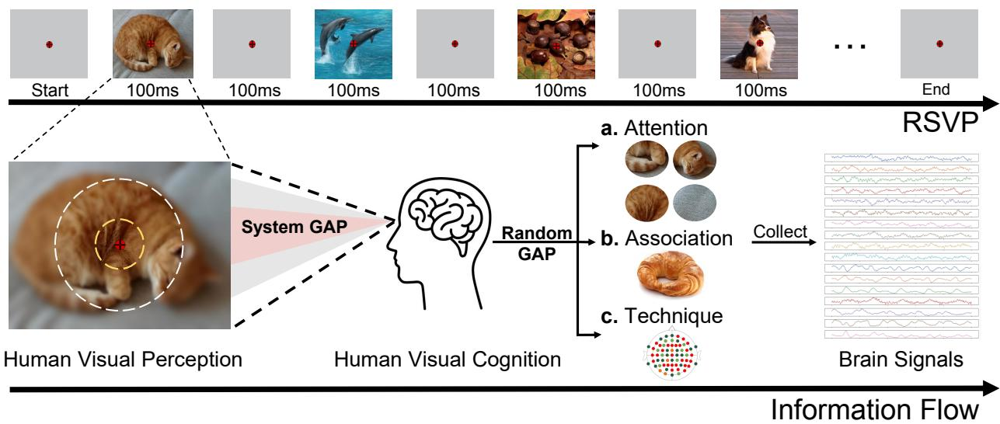  
Figure 1. Overview of the information flow during Rapid Serial Visual Presentation (RSVP) and the GAPs in human visual perception and cognition. The top panel illustrates the RSVP paradigm, where a sequence of images is rapidly presented for 100ms each, with a fixation point in the center. The bottom panel highlights the GAPs in the visual processing pipeline: System Gap, which represents the loss of high-frequency details during the transition from raw visual stimuli to visual perception, and Random Gap, which arises due to (a) dynamic perceptual processes (e.g., shifts in visual attention), (b) dynamic cognitive processes (e.g., associating with similar objects or concepts), and (c) low-level technical noise in signal collection.

Human perception and cognition are inherently dynamic, even when viewing or considering the same image or problem, leading to variability in brain signals responding to same stimuli. As illustrated in Fig. 1, perception can shift as attention is directed toward different parts of an image, while cognition may dynamically associate with related objects or concepts. Additionally, signal acquisition is impacted by technical noise, such as poor electrodeskin contact or instability in signal channels. These factors contribute to variability in brain signals, as shown in Fig. 13(a), and weaken the information relative to the original visual stimuli, reducing the signal-to-noise ratio. Consequently, even for two completely different stimuli, the corresponding brain signals are difficult to differentiate due to limited information and excessive noise, as shown in Fig. 13(b). We refer to this variability-induced information mismatch as Random GAP, attributed to its stochastic nature, which makes it exceptionally challenging to quantify. As illustrated in Fig. 13(c)(d), it demonstrates variability both across trials and among different subjects.

The most advanced visual neural decoding methods [10, 15, 37, 60] align encoded representations of brain signals with the pretrained embedding of corresponding visual stimuli by contrastive learning [11]. However, when we directly align them, the System GAP and Random GAP may prompt the model to bridge the GAPs. Limited by the scarcity of paired data, the gaps become difficult for the model to learn, leading to overfitting on the training set and poor generalization to new data. To address this issue, we aim to mitigate the impact of the GAPs and improve the alignment by introducing priors, thereby preventing the model from overfitting to these gaps. Our main contributions are summarized as follows:

1. We propose the existence of System GAP and Random GAP between visual stimuli and brain signals as shown in Fig. 1. The System GAP arises from the inability of brain signals to faithfully reflect visual stimuli, while the Random GAP arises from three factors: the dynamics of perception, the dynamics of cognition, and low-level technical noise in signal collection. These GAPs contribute to the reduction of the fidelity of brain signals in relation to the original visual stimuli.

2. We experimentally analyzed the impact of the two types of gaps. Based on observations and experimental analysis, we propose a simple and effective method called Uncertainty-aware Blur Prior (UBP). Our method achieves a top-1 accuracy of 50.9% and a top-5 accuracy of 79.7% on the zero-shot brain-to-image retrieval task, surpassing previous state-of-the-art methods by margins of 13.7% and 9.8%, respectively.

## 2. Related Works

## 2.1. Neural Decoding

Neural decoding refers to the process of interpreting neural signals (e.g., EEG, MEG, fMRI) to infer state of human perception and cognition. In recent years, significant progress has been made in this field, particularly in applications such as motor imagery decoding [2], visual decoding [3, 4, 18, 20, 44, 52, 57, 58, 62, 74, 75], text decoding [16], emotion decoding [38], inter-subject decoding[67, 82], and diagnosis of neurological disorders [65]. Visual decoding includes two primary tasks: brain-to-image retrieval and reconstruction. Several methods [10, 15, 37, 60] have been proposed for visual decoding, notably aligning the encoded representations of EEG/MEG signals with the Contrastive Vision-Language Pre-training (CLIP) [53] embedding space. However, they did not account for the GAPs between brain signals and visual stimuli, leading to overfitting on the training set and poor generalization to new data.

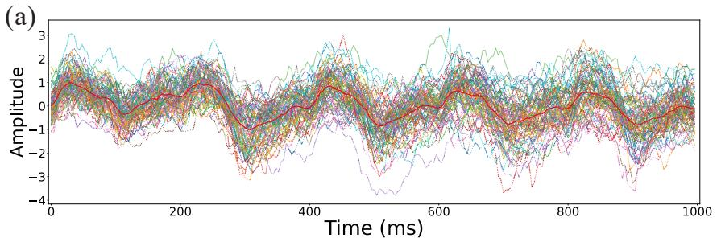

(c)  
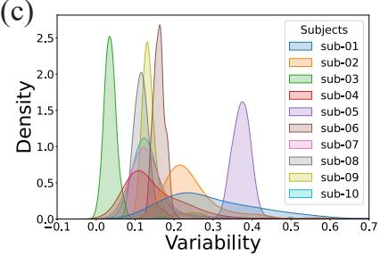

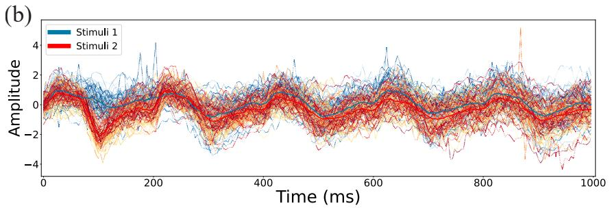

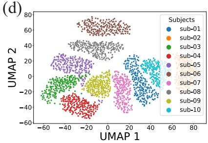  
Figure 2. Illustration of brain signals. (a) EEG signals recorded over 80 trials of the same stimulus for Subject 1. The red line indicates the mean across all trials. (b) EEG signals from 80 trials of two stimuli for Subject 1. Cool colors represent Stimulus 1, warm colors represent Stimulus 2. The blue and red lines show the means for Stimulus 1 and Stimulus 2, respectively. (c) Density distribution of EEG signal variability across 10 subjects. Variability is negatively correlated with task performance and see Tab. 4 for further details. (d) UMAP projection of EEG signals from 10 subjects, showing distinct clustering patterns.

## 2.2. Multi-modal Contrastive Learning

Contrastive representation learning has attained remarkable achievements in multiple domains, including vision [11], language [19], and graph [79]. Building on the success of these works, multi-modal contrastive representation learning (MMCL) has emerged, focusing on aligning inputs from multiple modalities within a shared representation space. These models are typically pretrained on large-scale paired datasets using a contrastive loss function. Recent visionlanguage contrastive pre-training models, such as CLIP [53] and ALIGN [31] have demonstrated remarkable zero-shot retrieval and classification performance, along with robust generalization to a wide range of downstream tasks [61, 70]. Inspired by the success of these vision-language models, contrastive representation learning across diverse modalities has garnered increasing attention [22, 35, 47]. However, in real-world settings, for certain modality pairs like audiovisual [24] and 3D-language [77], it is challenging to obtain paired data that match precisely. This constraint restricts the generalization capabilities of the pretraining models. Fortunately, several methods have been proposed to address this issue and provide theoretical analyses [40, 71, 77]. The visual-neural data for neural decoding also suffers from poor matching. Consequently, rough alignment will inevitably lead to a reduction in generalization performance.

## 2.3. Uncertainty Quantification

Uncertainty quantification is crucial for ensuring qualityaware and high-stakes decision-making [1]. One prominent field is out-of-distribution (OOD) detection [9, 43, 78]. Extreme outliers present during training can negatively impact generalization performance, while outliers encountered during evaluation can undermine the reliability of the assessment. Uncertainty quantification has also been applied to multimodal fusion in previous works [25, 76, 80] to enable dynamic fusion. Several methods [55, 69, 81] leverage uncertainty to identify the incorrect pseudo-labels in unlabeled data, preventing error accumulation during model training. [46] enhances response reliability by estimating the uncertainty of LLMs. In our task, Random Gap lowers the SNR in brain signals, making it essential to quantify uncertainty and dynamically mitigate the impact.

## 3. Visual Neural Decoding

## 3.1. Notation

In this paper, we begin by introducing the basic notation for visual neural decoding. We use paired data $( x _ { v } , x _ { b } )$ , where $x _ { v } \in \mathbb { R } ^ { d _ { V } }$ represents an image from the visual domain, and $x _ { b } \in \mathbb { R } ^ { d _ { B } }$ represents the corresponding brain signal. $\mathcal { X } _ { V }$ is used to denote the set of all visual data from distribution $\mathcal { P } _ { V }$ , and $\mathcal { X } _ { B }$ is employed to denote the set of all brain data from distribution $\mathcal { P } _ { B }$ . Their joint multi-modal distribution is $\mathcal { P } _ { M }$

## 3.2. Vision-Brain Contrastive Learning

The goal of vision-brain contrastive learning is to map brain data $\mathcal { X } _ { B }$ to a k-dimensional latent space $\mathcal { H } ~ \in ~ \mathbb { R } ^ { k }$ that aligns with the representation of visual data $\mathcal { X } _ { V }$ . This is achieved by using a frozen visual encoder $f _ { V } : { \mathcal { X } } _ { V } \to { \mathcal { H } }$ to obtain visual embeddings and training a brain encoder $f _ { B } : \mathcal { X } _ { B } \to \mathcal { H }$ with parameters ω to map brain data into the shared latent space $\mathcal { H } .$ . Given the effectiveness of pretrained vision-language models (VLMs) in providing rich visual features, $f _ { V }$ is taken from the vision branch of a pretrained VLM, such as CLIP [53].

For multi-modal positive and negative pairs, we define an image-brain pair drawn from the paired vision-brain data, $\mathrm { i . e . , } \ ( x _ { v } , x _ { b } ) \sim \mathcal { P } _ { M }$ , as positive pairs, and draw independent samples from each domain, $x _ { v } ^ { - } \sim \mathcal { P } _ { V } , x _ { b } ^ { - } \sim \mathcal { P } _ { B } .$ and treat $( x _ { v } , x _ { b } ^ { - } ) , ~ ( x _ { v } ^ { - } , x _ { b } )$ , and $( x _ { v } ^ { - } , x _ { b } ^ { - } )$ as negative pairs, assuming that the samples in these pairs are independent of each other. Given positive and negative pairs $( x _ { v } , x _ { b } , x _ { v } ^ { - } , x _ { b } ^ { - } )$ , the corresponding encoders map them to $( h _ { v } , h _ { b } , h _ { v } ^ { - } , h _ { b } ^ { - } )$ . The learning objective is the symmetric cross-entropy (SCE) loss [68], computed as follows:

$$
\begin{array} { r l r } & { } & { { \mathcal L } _ { \mathrm { S C E } } ( f _ { B } ) = - \mathbb E _ { x _ { v } , x _ { b } } \log \frac { \exp \big ( f _ { V } ( x _ { v } ) ^ { \top } f _ { B } ( x _ { b } ) / \tau \big ) } { \mathbb E _ { x _ { b } ^ { - } } \exp \big ( f _ { V } ( x _ { v } ) ^ { \top } f _ { B } ( x _ { b } ^ { - } ) / \tau \big ) } } \\ & { } & { \qquad - \mathbb E _ { x _ { v } , x _ { b } } \log \frac { \exp \big ( f _ { V } ( x _ { v } ) ^ { \top } f _ { B } ( x _ { b } ) / \tau \big ) } { \mathbb E _ { x _ { v } ^ { - } } \exp \big ( f _ { V } ( x _ { v } ^ { - } ) ^ { \top } f _ { B } ( x _ { b } ) / \tau \big ) } . } \end{array}\tag{1}
$$

## 4. Method

Our method consists of Blur Prior and Uncertainty-aware components, addressing the System GAP and Random GAP, respectively. The algorithmic flow of our framework is illustrated in Algorithm 1 and the details are as follows.

## 4.1. Blur Prior

Due to the existence of the System GAP between the human visual system and the original visual stimuli, a discrepancy in information arises, particularly in the loss of highfrequency details. Aligning brain signals with the images may cause the model to overfit to the high-frequency details in the images. To mitigate the System GAP, we propose a simple prior, which applies Gaussian blur to the original images, making the image modality better aligned with the brain signal modality.

Algorithm 1 Uncertainty-aware Blur Prior Framework   
1: Input: Multimodal training dataset $\mathcal { P } _ { M }$   
2: Model: Brain encoder $f _ { B }$ with random parameters $\theta ,$   
pretrained vision encoder $f _ { V }$ with parameters $\phi ,$ tem  
perature parameter $\tau ,$ learning rate ϖ   
3: Output: Trained model $f _ { B }$   
4: for each iteration do   
5: Obtain training sample $( x _ { v } , x _ { b } )$ from dataset $\mathcal { P } _ { M }$   
6: Obtain $\tilde { x } _ { v }$ by Eq. (4) with blur radius r   
7: $h _ { b } = f _ { B } ( x _ { b } ) ; h _ { v } = f _ { V } ( \tilde { x } _ { v } )$   
8: Compute loss $\mathcal { L }$ by Eq. (1)   
9: Update $r$ for sample $( x _ { v } , x _ { b } )$ by Eq. (10)   
10: Update model parameters $\theta \gets \theta - \eta \nabla { \mathcal { L } }$   
11: end for   
12: return trained model $f _ { B }$

Based on the characteristics of the experimental paradigm, where the focal point is concentrated on the red dot in the center of the image, we synthesized images of the macular and peripheral regions of the human eye to simulate the decrease in resolution and reduce high-frequency details. Concretely, a uniformly blurred image is generated first:

$$
x _ { \mathrm { b l u r } } ( i , j ) = \sum _ { m = - k } ^ { k } \sum _ { n = - k } ^ { k } x ( i - m , j - n ) \cdot G ( m , n ) ,\tag{2}
$$

where $r = 2 k + 1$ denotes the radius of the Gaussian kernel, and $x ( i - m , j - n )$ represents the pixel value in the original image $x ,$ while $G ( m , n )$ denotes the corresponding weights provided by the Gaussian kernel. The Gaussian kernel $G ( m , n )$ is defined as:

$$
G ( m , n ) = \frac { 1 } { 2 \pi \sigma ^ { 2 } } \exp \left( - \frac { m ^ { 2 } + n ^ { 2 } } { 2 \sigma ^ { 2 } } \right) ,\tag{3}
$$

where $\sigma$ is the standard deviation, which controls the intensity of the blur. The fovea blur image is blended with the original image and the uniformly blurred image as:

$$
\tilde { x } _ { v } = \alpha \cdot x + ( 1 - \alpha ) \cdot x _ { \mathrm { b l u r } } ,\tag{4}
$$

where $\alpha$ is the blending factor, represented as a matrix with values between 0 and 1. For a foveated effect, we define a function of distance from the fovea as:

$$
\alpha ( i , j ) = \exp \left( - \frac { \lambda \cdot d ( i , j ) } { L } \right) ,\tag{5}
$$

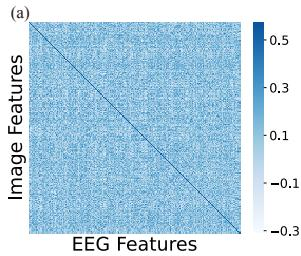

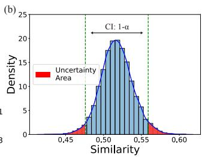  
Figure 3. Semantic similarity visualization. (a) Semantic similarity matrix between image features and EEG features. The diagonal represents the similarity between corresponding pairs of features from the two modalities. (b) Density distribution of similarity scores from the diagonal of the matrix. The green dashed lines denote the confidence interval at a significance level of $1 - \alpha ,$ indicating the range of similarity scores that are statistically significant. The red areas represent the Uncertainty Area, indicating scores outside the confidence interval.

where $d ( i , j )$ denotes the Euclidean (2-norm) distance between pixel (i, j) and the fovea, and L denotes the maximum possible distance within the image. The parameter ↼ controls the rate of decay, moderating how quickly the weight $\alpha ( i , j )$ decreases as the distance increases. In our setting, the level of blurriness of the image depends on the radius of the Gaussian kernel r, with other factors being fixed.

## 4.2. Uncertainty Quantification

The mismatch between brain signals and the original image stimuli attributes to Random GAP, including dynamics of perception and cognition, along with technical noise, as shown in Fig. 1. Due to the complexity of perception and cognitive processes, which are difficult to disentangle, it is challenging to quantify the contribution of each factor to the Random GAP. Fortunately, the similarity of paired samples is found to follow a Gaussian distribution, as illustrated in Fig. 3. Based on this observation, outlier pairs falling beyond the confidence interval, indicate a large Random GAP between vision and brain. For each sample $( x _ { v } , x _ { b } )$ , uncertainty is estimated based on its corresponding interval, and r is adjusted accordingly to dynamically mitigate the information discrepancy between brain signals and visual stimuli. Overall, a larger discrepancy leads to greater blurring, while a smaller discrepancy results in milder blurring.

Specifically, the N paired samples are denoted as $\{ ( x _ { v } ^ { i } , x _ { b } ^ { i } ) \} _ { i = 1 } ^ { N }$ . The blurred image is represented as $x _ { v } \ \stackrel { r } { \to }$ $\tilde { x } _ { v }$ . The latent features $h _ { b } \in \mathbb { R } ^ { \mathbf { \breve { N } } \times d }$ and $h _ { v } \in \mathbb { R } ^ { N \times d }$ are obtained through their respective modality encoders. The similarity matrix $\mathbf { M } \in \mathbb { R } ^ { N \times N }$ is computed as:

$$
\mathbf { M } = h _ { b } \cdot h _ { v } ^ { \top } \cdot \mathrm { s o f t p l u s } ( \tau ) ,\tag{6}
$$

where $\tau$ is a learned scalar parameter, and softplus( ) is a

smooth, non-linear activation function applied to $\tau$ to ensure positivity. The similarity scores for the N pairs are represented as $\mathbf { S } \in \mathbb { R } ^ { N }$ and computed as:

$$
\mathbf { S } = \mathrm { d i a g } ( \mathbf { M } ) ,\tag{7}
$$

where diag( ) denotes the diagonal of a matrix. A moving average is applied to M during iterations to maintain smoothness. The similarity scores approximately follow a normal distribution $\mathcal { N } ( \hat { \mu } , \hat { \sigma } ^ { 2 } )$ . The mean $\hat { \mu }$ and variance $\hat { \sigma } ^ { 2 }$ are computed as follows:

$$
{ \hat { \boldsymbol { \mu } } } = { \frac { 1 } { n } } \sum _ { i = 1 } ^ { n } \mathbf { S } _ { i } , \quad { \hat { \boldsymbol { \sigma } } } ^ { 2 } = { \frac { 1 } { n - 1 } } \sum _ { i = 1 } ^ { n } ( \mathbf { S } _ { i } - { \hat { \boldsymbol { \mu } } } ) ^ { 2 } .\tag{8}
$$

The confidence interval for the similarity scores with confidence level $1 - \alpha$ is given by:

$$
\left[ \hat { \mu } - z _ { \alpha / 2 } \cdot \hat { \sigma } , \hat { \mu } + z _ { \alpha / 2 } \cdot \hat { \sigma } \right] ,\tag{9}
$$

where $z _ { \alpha / 2 }$ represents the critical value from the standard normal distribution corresponding to a two-sided confidence level of $1 - \alpha$ . For the similarity s, the corresponding degree of blur is defined as follows:

$$
r ( s ) = \left\{ { \begin{array} { l l } { r _ { 0 } - c , } & { { \mathrm { i f ~ } } s < { \hat { \mu } } - z _ { \alpha / 2 } \cdot { \hat { \sigma } } , } \\ { r _ { 0 } + c , } & { { \mathrm { i f ~ } } s > { \hat { \mu } } + z _ { \alpha / 2 } \cdot { \hat { \sigma } } , } \\ { r _ { 0 } , } & { { \mathrm { i f ~ } } { \hat { \mu } } - z _ { \alpha / 2 } \cdot { \hat { \sigma } } \leq s \leq { \hat { \mu } } + z _ { \alpha / 2 } \cdot { \hat { \sigma } } , } \end{array} } \right.\tag{10}
$$

where $r _ { 0 }$ is the baseline blur radius, and c is a constant that controls the change in blur radius when s is outside this interval.

## 5. Experiments and Results

## 5.1. Datasets and Implementation Details

THINGS-EEG [21] is a large scale EEG dataset including 10 subjects with the Rapid Serial Visual Presentation (RSVP) paradigm [23, 30, 32]. The training set includes 1654 concepts with each concept 10 images, and each image repeats 4 times per subject. The test set includes 200 concepts with each concept 1 image, and each image repeats 80 times per subject. For data preprocessing, we follow the method detailed in [60]. Repetitions are averaged for the purpose of high SNR, resulting in a total of 16540 training samples and 200 test samples per subject. The ablation study on channel and time interval selection is provided in Appendix B.4.

THINGS-MEG [26] involves four participants and consists of 271 channels. It consists of 1854 concepts 12 images $\times \ 1$ repetition in the training set and 200 concepts  1 image 12 repetitions in the test set. We follow the same setting described in [60]. Repetitions of the same stimulus are averaged to ensure the SNR.

Table 1. Top-1 and Top-5 accuracy (%) for 200-way zero-shot retrieval on THINGS-EEG
<table><tr><td></td><td>Subject 1</td><td></td><td>Subject 2</td><td></td><td>Subject 3</td><td></td><td>Subject 4</td><td></td><td>Subject 5</td><td>Subject 6</td><td></td><td>Subject 7</td><td></td><td>Subject 8</td><td></td><td>Subject 9</td><td>Subject 10</td><td></td><td></td><td>Avg</td></tr><tr><td>Method</td><td colspan="16">top-1 top-5 top-1 top-5 top-1 top-5 top-1 top-5</td><td colspan="10">top-1 top-5 top-1 top-5</td></tr><tr><td></td><td colspan="10">Intra-subject:</td><td></td><td>: train and test on one subject</td><td></td><td></td><td></td><td></td><td></td><td></td><td></td><td></td><td></td><td></td></tr><tr><td>BraVL [15]</td><td>6.1</td><td>17.9</td><td>4.9</td><td>14.9</td><td>5.6</td><td>17.4</td><td>5.0</td><td>15.1</td><td>4.0</td><td>13.4</td><td>6.0</td><td>18.2</td><td>6.5</td><td>20.4</td><td>8.8</td><td>23.7</td><td>4.3</td><td>14.0</td><td>7.0</td><td>19.7</td><td>5.8</td><td>17.5</td></tr><tr><td>NICE [60]</td><td>13.2</td><td>39.5</td><td>13.5</td><td>40.3</td><td>14.5</td><td>42.7</td><td>20.6</td><td>52.7</td><td>10.1 31.5</td><td>16.5</td><td>44.0</td><td></td><td>17.0</td><td>42.1</td><td>22.9</td><td>56.1</td><td>15.4</td><td>41.6</td><td>17.4</td><td>45.8</td><td>16.1</td><td>43.6</td></tr><tr><td>NICE-SA [60]</td><td>13.3</td><td>40.2</td><td>12.1</td><td>36.1</td><td>15.3</td><td>39.6</td><td>15.9</td><td>49.0</td><td>9.8 34.4</td><td>14.2</td><td>42.4</td><td></td><td>17.9</td><td>43.6</td><td>18.2</td><td>50.2</td><td>14.4</td><td>38.7</td><td>16.0</td><td>42.8</td><td>14.7</td><td>41.7</td></tr><tr><td>NICE-GA [60]</td><td>15.2</td><td>40.1</td><td>13.9</td><td>40.1</td><td>14.7</td><td>42.7</td><td>17.6</td><td>48.9</td><td>9.0</td><td>29.7 16.4</td><td></td><td>44.4</td><td>14.9</td><td>43.1</td><td>20.3</td><td>52.1</td><td>14.1</td><td>39.7</td><td>19.6</td><td>46.7</td><td>15.6</td><td>42.8</td></tr><tr><td>ATM-S [37]</td><td>25.6</td><td>60.4</td><td>22.0</td><td>54.5</td><td>25.0</td><td>62.4</td><td>31.4</td><td>60.9</td><td>12.9</td><td>43.0 21.3</td><td></td><td>51.1</td><td>30.5</td><td>61.5</td><td>38.8</td><td>72.0</td><td>34.4</td><td>51.5</td><td>29.1</td><td>63.5</td><td>28.5</td><td>60.4</td></tr><tr><td>VE-SDN [10] UBP (Ours)</td><td>32.6</td><td>63.7</td><td>34.4</td><td>69.9</td><td>38.7</td><td>73.5</td><td>39.8</td><td>72.0</td><td>29.4</td><td>58.6 34.5</td><td></td><td>68.8</td><td>34.5</td><td>68.3</td><td>49.3</td><td>79.8</td><td>39.0</td><td>69.6</td><td>39.8</td><td>75.3</td><td>37.2</td><td>69.9</td></tr><tr><td></td><td>41.2</td><td>70.5</td><td>51.2</td><td>80.9</td><td>51.2</td><td>82.0</td><td>51.1 Inter-subject: leave one subject out for test</td><td>76.9</td><td>42.2 72.8</td><td>57.5</td><td></td><td>83.5</td><td>49.0</td><td>79.9</td><td>58.6</td><td>85.8</td><td>45.1</td><td>76.2</td><td>61.5</td><td>88.2</td><td>50.9</td><td>79.7</td></tr><tr><td></td><td colspan="14"></td><td colspan="9"></td><td></td></tr><tr><td>BraVL NICE</td><td>2.3</td><td>8.0</td><td>1.5</td><td>6.3</td><td>1.4</td><td>5.9</td><td>1.7</td><td>6.7</td><td>1.5</td><td>5.6</td><td>1.8</td><td>7.2</td><td>2.1</td><td>8.1</td><td>2.2</td><td>7.6</td><td>1.6</td><td>6.4</td><td>2.3</td><td>8.5</td><td>1.8</td><td>7.0</td></tr><tr><td></td><td>7.6</td><td>22.8</td><td>5.9</td><td>20.5</td><td>6.0</td><td>22.3</td><td>6.3</td><td>20.7</td><td>4.4</td><td>18.3</td><td>5.6</td><td>22.2</td><td>5.6</td><td>19.7</td><td>6.3</td><td>22.0</td><td>5.7</td><td>17.6</td><td>8.4</td><td>28.3</td><td>6.2</td><td>21.4</td></tr><tr><td>NICE-SA</td><td>7.0</td><td>22.6</td><td>6.6</td><td>23.2</td><td>7.5</td><td>23.7</td><td>5.4</td><td>21.4</td><td>6.4</td><td>22.2</td><td>7.5</td><td>22.5</td><td>3.8</td><td>19.1</td><td>8.5</td><td>24.4</td><td>7.4</td><td>22.3</td><td>9.8</td><td>29.6</td><td>7.0</td><td>23.1</td></tr><tr><td>NICE-GA</td><td>5.9</td><td>21.4</td><td>6.4</td><td>22.7</td><td>5.5</td><td>20.1</td><td>6.1</td><td>21.0</td><td>4.7</td><td>19.5 6.2</td><td></td><td>22.5</td><td>5.9</td><td>19.1 7.3</td><td>25.3</td><td></td><td>4.8</td><td>18.3</td><td>6.2</td><td>26.3</td><td>5.9</td><td>21.6</td></tr><tr><td>ATM-S</td><td>10.5</td><td>26.8</td><td>7.1</td><td>24.8</td><td>11.9</td><td>33.8</td><td>14.7</td><td>39.4</td><td>7.0</td><td>23.9 11.1</td><td></td><td>35.8</td><td>16.1</td><td>43.5</td><td>15.0</td><td>40.3</td><td>4.9</td><td>22.7</td><td>20.5</td><td>46.5</td><td>11.8</td><td>33.7</td></tr><tr><td>UBP (Ours)</td><td>11.5</td><td>29.7</td><td>15.5</td><td>40.0</td><td>9.8</td><td>27.0</td><td>13.0</td><td>32.3</td><td>8.8</td><td>33.8</td><td>11.7</td><td>31.0</td><td>10.2</td><td>23.8</td><td>12.2</td><td>32.2</td><td>15.5</td><td>40.5</td><td>16.0</td><td>43.5</td><td>12.4</td><td>33.4</td></tr></table>

Table 2. Top-1 and Top-5 accuracy (%) for 200-way zero-shot retrieval on THINGS-MEG
<table><tr><td rowspan="2">Method</td><td colspan="2">Subject 1</td><td colspan="2">Subject 2</td><td colspan="2">Subject 3</td><td colspan="2">Subject 4</td><td colspan="2">Avg</td></tr><tr><td>top-1 top-5</td><td></td><td>top-1 top-5</td><td></td><td>top-1 top-5</td><td></td><td></td><td></td><td>top-1 top-5 top-1 top-5</td><td></td></tr><tr><td colspan="9">Intra-subject: train and test on one subject</td></tr><tr><td>NICE</td><td>9.6</td><td>27.8</td><td>18.5</td><td>47.8</td><td>14.2</td><td>41.6</td><td>9.0</td><td>26.6</td><td>12.8</td><td>36.0</td></tr><tr><td>NICE-SA</td><td>9.8</td><td>27.8</td><td>18.6</td><td>46.4</td><td>10.5</td><td>38.4</td><td>11.7</td><td>27.2</td><td>12.7</td><td>35.0</td></tr><tr><td>NICE-GA</td><td>8.7</td><td>30.5</td><td>21.8</td><td>56.6</td><td>16.5</td><td>49.7</td><td>10.3</td><td>32.3</td><td>14.3</td><td>42.3</td></tr><tr><td>UBP(Ours)</td><td>15.0</td><td>38.0</td><td>46.0</td><td>80.5</td><td>27.3</td><td>59.0</td><td>18.5</td><td>43.5</td><td>26.7</td><td>55.2</td></tr><tr><td colspan="11">Inter-subject: leave one subject out for test</td></tr><tr><td>UBP(Ours)</td><td>2.0</td><td>5.7</td><td>1.5</td><td>17.2</td><td>2.7</td><td>10.5</td><td>2.5</td><td>8.0</td><td>2.2</td><td>10.4</td></tr></table>

Brain Encoders. We employ a simple yet effective encoder named EEGProject, consisting of two linear layers with residual connection and a normalization layer. The detailed model architecture is provided in the appendix. To further assess the generalizability of our method, we have conducted experiments with additional architectures, including Shallownet [56], Deepnet [56], EEGnet [34], and TSconv [60].

Vision Encoders. Our research employs the visual branches of CLIP models, specifically using pretrained weights from OpenCLIP [29]. These weights are derived from training multiple models across a diverse range of data sources and computational resources. In the experiments, we utilize several weights, including RN50, RN101, ViT-B/16, ViT-B/32, ViT-L/14, ViT-H/14, ViT-g/14, and ViTbigG/14. Unless otherwise stated, RN50 is employed as the default model.

More details on data preprocessing, hyperparameter settings, and hardware configurations are provided in Appendix A.

## 5.2. Comparison with Baselines

Baselines. We compare our approach with recent neural decoding methods. Du et al. [15] propose BraVL, a model based on Mixture of Experts (MoE) that uses multimodal learning of brain-visual-linguistic features. Song et al. [60] present a self-supervised framework for learning image representations from EEG signals, called NICE, incorporating two plug-and-play spatial modules with self-attention and graph attention. Li et al. [37] propose a EEG encoder called the Adaptive Thinking Mapper (ATM), which incorporates position encoding and temporospatial encoding. Chen et al. [10] construct a joint semantic space and propose a Visual-EEG Semantic Decouple Framework, called VE-SDN, which explicitly extracts semantic features from both modalities to enable optimal alignment.

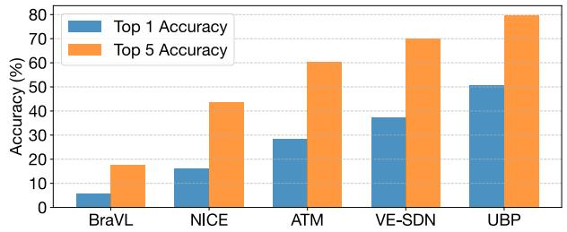  
Figure 4. Comparison of Top-1 and Top-5 accuracy (%) for Intra subject task on THINGS-EEG.

Comparison. Tab. 1 and Tab. 2 show quantitative comparisons between our approach and baselines on EEG and MEG test set. Our approach significantly outperforms previous sate-of-the-art in terms of both intra-subject and intersubject settings. Notably, UBP achieves a top-1 accuracy of 50.9% and top-5 accuracy of 79.7% for the zero-shot brainto-image retrieval task on the THINGS-EEG dataset, and a top-1 accuracy of 26.7% and top-5 accuracy of 55.2% on the THINGS-MEG dataset. Notably, we employed two additional evaluation metrics, mAP and Similarity Score, to comprehensively assess performance, as detailed in Ap-

Table 3. Top-1 and Top-5 accuracy (%) for 200-way zero-shot retrieval on THINGS-EEG with different data transformations.
<table><tr><td></td><td></td><td></td><td colspan="2">Intra-subject</td><td colspan="2">Inter-subject</td></tr><tr><td>Method</td><td>Corrupt</td><td>Dynamic</td><td>top-1</td><td>top-5</td><td>top-1</td><td>top-5</td></tr><tr><td>Vanilla</td><td>x</td><td>x</td><td>42.1</td><td>74.5</td><td>8.5</td><td>26.6</td></tr><tr><td>Flip</td><td>x</td><td>x</td><td>40.8</td><td>73.8</td><td>8.6</td><td>25.9</td></tr><tr><td>Crop</td><td>x</td><td>x</td><td>41.6</td><td>74.0</td><td>9.6</td><td>27.2</td></tr><tr><td>Grayscale</td><td>x</td><td>x</td><td>38.8</td><td>72.4</td><td>9.1</td><td>27.0</td></tr><tr><td>Color jitter</td><td>x</td><td>x</td><td>41.3</td><td>76.2</td><td>8.5</td><td>25.7</td></tr><tr><td>Noise</td><td>√</td><td>X</td><td>47.7</td><td>78.8</td><td>10.0</td><td>30.5</td></tr><tr><td>Low-Res</td><td>√</td><td>X</td><td>48.1</td><td>78.4</td><td>10.8</td><td>31.9</td></tr><tr><td>Uniform blur</td><td>√</td><td>X</td><td>49.3</td><td>80.3</td><td>11.2</td><td>31.1</td></tr><tr><td>Fovea blur</td><td>√</td><td>X</td><td>50.2</td><td>79.1</td><td>12.3</td><td>31.7</td></tr><tr><td>UBP</td><td>√</td><td>√</td><td>50.9</td><td>79.7</td><td>12.4</td><td>33.4</td></tr></table>

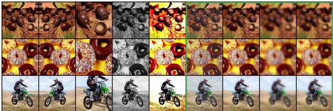  
Figure 5. Illustration of various stimuli augmentations and corruptions applied to the visual stimuli. The augmentations (Flip, Crop, Grayscale, Color jitter) modify geometric properties or color distributions, while the corruptions (Gaussian noise, Low resolution, Uniform blur, Fovea blur) degrade image quality by introducing noise, lowering resolution, or simulating optical distortions.

pendix B.5.

## 5.3. Effectiveness of Blur Prior

To demonstrate that the Blur Prior is not merely a data augmentation technique but rather a mechanism for bridging the System GAP, visual stimuli processed with different techniques are presented in Fig. 5, with the corresponding performance reported in Tab. 3. As shown in Tab. 3, image transformations that degrade high-frequency details significantly enhance retrieval performance, whereas those affecting only geometric properties or color distributions offer limited improvements. This further supports our motivation that reducing the information mismatch between visual stimuli and brain signals enables the model to mitigate the overfitting issue arising from the System GAP. Moreover, the proposed Fovea Blur method, drawing inspiration from the human visual system, outperforms other corruptive transformations in terms of performance. Additionally, when the Random GAP is taken into account, the dynamic blurring method UBP further improves the retrieval performance.

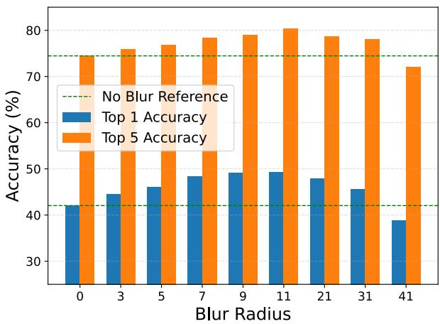  
Figure 6. Comparison of Top-1 and Top-5 accuracy (%) at various blur radius, with reference accuracy for no-blur conditions.

## 5.4. Sensitivity Analysis of Various Blur Radius

To investigate the effect of different degrees of blur on mitigating System GAP, we applied uniform blur with radius ranging from 0 to 41. The results summarized in Fig. 6 show that as the blur level increases, both top-1 and top-5 accuracy improve, peaking at a blur radius of 11. As the blur level continues to increase, model performance begins to decline, which aligns with our expectation that an appropriate level of blur can reduce the mismatch between visual stimuli and brain signals. Excessive blur, such as a blur radius of 41, leads to a loss of information beyond the optimal level, increasing the information mismatch and resulting in worse performance compared to no blur.

## 5.5. Effectiveness of Uncertainty Quantification

Due to the unavailability of mismatch labels, direct evaluation of uncertainty quantification is challenging. However, non-averaged EEG signals, with their low signal-to-noise ratio, can serve as proxies for outlier samples. As shown in Fig. 7, our method effectively distinguishes these outlier samples based on the confidence intervals of the similarity distribution, thereby preventing the impact of outlier samples on generalization performance.

## 5.6. Ablation Study on Various Encoders

To demonstrate that UBP is not architecture-specific, we conducted comprehensive experiments and trained thousands of models across five brain encoder architectures and eight image encoder architectures, where UBP consistently achieved performance improvements. Fig. 8 illustrate the improvements in top-1 accuracy of UBP on the THINGS-EEG. Detailed results, including the top-1 and top-5 accuracy for both baseline and UBP, are provided in the appendix.

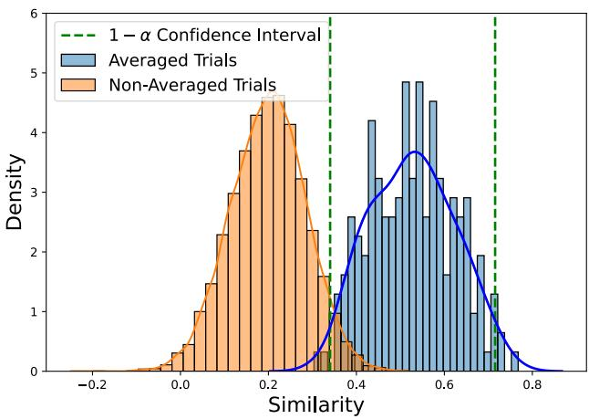  
Figure 7. Distribution of similarity scores for averaged and nonaveraged EEG trials. The dashed green lines denote the 1 ε confidence interval for the averaged trials. Our method effectively distinguishes the two types of trials, with non-averaged samples approximately treated as those with a large Random GAP.

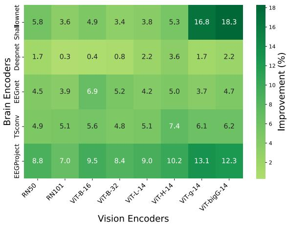  
Figure 8. Top-1 accuracy improvement (%) of UBP across various brain and vision encoder combinations on the THINGS-EEG dataset.

## 5.7. Robustness to Subject Variability

As shown in Tab. 4, we report the Pearson and Spearman correlations between subject variability and zero-shot retrieval accuracy. Methods such as NICE-SA, VE-SDN, and Vanilla exhibit strong negative Pearson correlations (e.g., -0.783, -0.687, and -0.761 for top-1, respectively), indicating substantial sensitivity to subject variability. In contrast, UBP demonstrates improved robustness, with a less negative Pearson correlation (-0.481) compared to Vanilla. UBP demonstrates more stable performance when handling subjects with high variability, with its accuracy not significantly degrading.

Table 4. Pearson and Spearman correlation coefficients between each subject’s mean variability value and the corresponding Top-1 accuracy for different methods.
<table><tr><td colspan="3">Pearson</td><td colspan="2">Spearmanr</td></tr><tr><td>Method</td><td>top-1</td><td>top-5</td><td>top-1</td><td>top-5</td></tr><tr><td>BraVL</td><td>-0.419</td><td>-0.451</td><td>-0.394</td><td>-0.406</td></tr><tr><td>NICE</td><td>-0.681</td><td>-0.705</td><td>-0.564</td><td>-0.588</td></tr><tr><td>NICE-SA</td><td>-0.783</td><td>-0.539</td><td>-0.745</td><td>-0.418</td></tr><tr><td>NICE-GA</td><td>-0.611</td><td>-0.709</td><td>-0.382</td><td>-0.450</td></tr><tr><td>ATM-S</td><td>-0.643</td><td>-0.608</td><td>-0.624</td><td>-0.697</td></tr><tr><td>VE-SDN</td><td>-0.687</td><td>-0.810</td><td>-0.787</td><td>-0.758</td></tr><tr><td>Vanilla</td><td>-0.761</td><td>-0.721</td><td>-0.636</td><td>-0.690</td></tr><tr><td>UBP</td><td>-0.481</td><td>-0.649</td><td>-0.345</td><td>-0.515</td></tr><tr><td>↑ Improvement</td><td>0.280</td><td>0.072</td><td>0.291</td><td>0.175</td></tr></table>

## 6. Conclusion

In this work, we propose the Uncertainty-aware Blur Prior (UBP) to address the System GAP and Random GAP in visual neural decoding. UBP leverages uncertainty estimation and biological priors to robustly retrieve natural images from multiple brain modalities. Extensive experiments demonstrate that UBP outperforms previous state-of-theart methods, achieving 13.7% improvement in Top-1 accuracy and 9.8% improvement in Top-5 accuracy on the THINGS-EEG dataset, along with 12.4% improvement in Top-1 accuracy and 12.9% improvement in Top-5 accuracy on the THINGS-MEG dataset. Beyond brain-to-image retrieval, UBP holds potential for applications in stimuli reconstruction and broader multimodal learning contexts. To the best of our knowledge, this is the first effort to incorporate uncertainty awareness and priors into visual neural decoding, offering new perspectives for brain-computer interfaces. Moreover, UBP provides valuable insights for other multimodal tasks, where similar challenges may arise.

Limitations. Despite its effectiveness in reducing mismatches between brain signals and visual stimuli, UBP has certain limitations. UBP uses a blur prior to approximate high-frequency detail loss, providing a simplified model of the visual system but lacking completeness. Advanced learnable methods could better bridge this and improve generalization. Additionally, uncertainty quantification may fail due to the complexity of the Random GAP, which is influenced by perceptual and cognitive dynamics, as well as technical noise. It is promising to investigate advanced uncertainty quantification methods to improve reliability and robustness.

Acknowledgements. This work is partially supported by the National Key R&D Program of China (2022YFF1202400) and the National Natural Science Foundation of China (62376193). The authors appreciate the valuable feedback from anonymous reviewers.

## References

[1] Moloud Abdar, Farhad Pourpanah, Sadiq Hussain, Dana Rezazadegan, Li Liu, Mohammad Ghavamzadeh, Paul Fieguth, Xiaochun Cao, Abbas Khosravi, U Rajendra Acharya, et al. A review of uncertainty quantification in deep learning: Techniques, applications and challenges. Informationfusion, 76:243–297, 2021. 3

[2] Tyson Aflalo, Spencer Kellis, Christian Klaes, Brian Lee, Ying Shi, Kelsie Pejsa, Kathleen Shanfield, Stephanie Hayes-Jackson, Mindy Aisen, Christi Heck, et al. Decoding motor imagery from the posterior parietal cortex of a tetraplegic human. Science, 348(6237):906–910, 2015. 3

[3] Yunpeng Bai, Xintao Wang, Yan-pei Cao, Yixiao Ge, Chun Yuan, and Ying Shan. Dreamdiffusion: Generating highquality images from brain eeg signals. arXiv preprint arXiv:2306.16934, 2023. 3

[4] Roman Beliy, Guy Gaziv, Assaf Hoogi, Francesca Strappini, Tal Golan, and Michal Irani. From voxels to pixels and back: Self-supervision in natural-image reconstruction from fmri. In Advances in Neural Information Processing Systems. Curran Associates, Inc., 2019. 3

[5] Yohann Benchetrit, Hubert Banville, and Jean-Remi King.´ Brain decoding: toward real-time reconstruction of visual perception. arXiv preprint arXiv:2310.19812, 2023. 1

[6] Ned Block. Perceptual consciousness overflows cognitive access. Trends in cognitive sciences, 15(12):567–575, 2011. 1

[7] Timothy J Buschman, Markus Siegel, Jefferson E Roy, and Earl K Miller. Neural substrates of cognitive capacity limitations. Proceedings of the National Academy of Sciences, 108(27):11252–11255, 2011. 1

[8] Patrick Cavanagh and George A Alvarez. Tracking multiple targets with multifocal attention. Trends in cognitive sciences, 9(7):349–354, 2005. 1

[9] Bertrand Charpentier, Daniel Zugner, and Stephan¨ Gunnemann. Posterior network: Uncertainty estima-¨ tion without ood samples via density-based pseudo-counts. Advances in neural information processing systems, 33: 1356–1367, 2020. 3

[10] Hongzhou Chen, Lianghua He, Yihang Liu, and Longzhen Yang. Visual neural decoding via improved visual-eeg semantic consistency. arXiv preprint arXiv:2408.06788, 2024. 1, 2, 3, 6

[11] Ting Chen, Simon Kornblith, Mohammad Norouzi, and Geoffrey Hinton. A simple framework for contrastive learning of visual representations. In International conference on machine learning, pages 1597–1607. PMLR, 2020. 2, 3

[12] Zijiao Chen, Jiaxin Qing, Tiange Xiang, Wan Lin Yue, and Juan Helen Zhou. Seeing beyond the brain: Conditional diffusion model with sparse masked modeling for vision decoding. In Proceedings of the IEEE/CVF Conference on Computer Vision and Pattern Recognition, pages 22710–22720, 2023. 1

[13] Michael A Cohen, Daniel C Dennett, and Nancy Kanwisher. What is the bandwidth of perceptual experience? Trends in cognitive sciences, 20(5):324–335, 2016. 1

[14] Christine A Curcio, Kenneth R Sloan, Robert E Kalina, and Anita E Hendrickson. Human photoreceptor topography. Journal ofcomparative neurology, 292(4):497–523, 1990. 2

[15] Changde Du, Kaicheng Fu, Jinpeng Li, and Huiguang He. Decoding visual neural representations by multimodal learning of brain-visual-linguistic features. IEEE Transactions on Pattern Analysis and Machine Intelligence, 45(9):10760– 10777, 2023. 1, 2, 3, 6

[16] Yiqun Duan, Charles Chau, Zhen Wang, Yu-Kai Wang, and Chin-teng Lin. Dewave: Discrete encoding of eeg waves for eeg to text translation. Advances in Neural Information Processing Systems, 36, 2024. 3

[17] Paul E Dux and Rene Marois. How humans search for tar- ´ gets through time: A review of data and theory from the attentional blink. Attention, perception & psychophysics, 71 (8):1683, 2009. 1

[18] Tao Fang, Qian Zheng, and Gang Pan. Alleviating the semantic gap for generalized fmri-to-image reconstruction. Advances in Neural Information Processing Systems, 36, 2024. 3

[19] Tianyu Gao, Xingcheng Yao, and Danqi Chen. Simcse: Simple contrastive learning of sentence embeddings. In Proceed ings ofthe 2021 Conference on Empirical Methods in Natu ral Language Processing, pages 6894–6910, 2021. 3

[20] Guy Gaziv, Roman Beliy, Niv Granot, Assaf Hoogi, Francesca Strappini, Tal Golan, and Michal Irani. Selfsupervised natural image reconstruction and large-scale semantic classification from brain activity. NeuroImage, 254: 119121, 2022. 3

[21] Alessandro T Gifford, Kshitij Dwivedi, Gemma Roig, and Radoslaw M Cichy. A large and rich eeg dataset for modeling human visual object recognition. NeuroImage, 264:119754, 2022. 5, 1

[22] Rohit Girdhar, Alaaeldin El-Nouby, Zhuang Liu, Mannat Singh, Kalyan Vasudev Alwala, Armand Joulin, and Ishan Misra. Imagebind: One embedding space to bind them all. In Proceedings of the IEEE/CVF Conference on Computer Vision and Pattern Recognition, pages 15180–15190, 2023. 3

[23] Tijl Grootswagers, Amanda K Robinson, and Thomas A Carlson. The representational dynamics of visual objects in rapid serial visual processing streams. NeuroImage, 188: 668–679, 2019. 5, 1

[24] Andrey Guzhov, Federico Raue, Jorn Hees, and Andreas¨ Dengel. Audioclip: Extending clip to image, text and audio. In ICASSP 2022-2022 IEEE International Conference on Acoustics, Speech and Signal Processing (ICASSP), pages 976–980. IEEE, 2022. 3

[25] Zongbo Han, Changqing Zhang, Huazhu Fu, and Joey Tianyi Zhou. Trusted multi-view classification with dynamic evidential fusion. IEEE transactions on pattern analysis and machine intelligence, 45(2):2551–2566, 2022. 3

[26] Martin N Hebart, Oliver Contier, Lina Teichmann, Adam H Rockter, Charles Y Zheng, Alexis Kidder, Anna Corriveau, Maryam Vaziri-Pashkam, and Chris I Baker. Things-data, a multimodal collection of large-scale datasets for investigating object representations in human brain and behavior. Elife, 12:e82580, 2023. 5, 1

[27] David H Hubel and Torsten N Wiesel. Receptive fields and functional architecture of monkey striate cortex. The Journal ofphysiology, 195(1):215–243, 1968. 1

[28] David H Hubel, Torsten N Wiesel, et al. Receptive fields of single neurones in the cat’s striate cortex. J physiol, 148(3): 574–591, 1959. 1

[29] Gabriel Ilharco, Mitchell Wortsman, Ross Wightman, Cade Gordon, Nicholas Carlini, Rohan Taori, Achal Dave, Vaishaal Shankar, Hongseok Namkoong, John Miller, Hannaneh Hajishirzi, Ali Farhadi, and Ludwig Schmidt. Openclip, 2021. If you use this software, please cite it as below. 6, 1

[30] Helene Intraub. Rapid conceptual identification of sequentially presented pictures. Journal of Experimental Psychology: Human Perception and Performance, 7(3):604, 1981. 5, 1

[31] Chao Jia, Yinfei Yang, Ye Xia, Yi-Ting Chen, Zarana Parekh, Hieu Pham, Quoc Le, Yun-Hsuan Sung, Zhen Li, and Tom Duerig. Scaling up visual and vision-language representation learning with noisy text supervision. In International conference on machine learning, pages 4904–4916. PMLR, 2021. 3

[32] Christian Keysers, D-K Xiao, Peter Foldi¨ ak, and David I Per-´ rett. The speed of sight. Journal of cognitive neuroscience, 13(1):90–101, 2001. 5, 1

[33] Eileen Kowler. Eye movements: The past 25 years. Vision research, 51(13):1457–1483, 2011. 1

[34] Vernon J Lawhern, Amelia J Solon, Nicholas R Waytowich, Stephen M Gordon, Chou P Hung, and Brent J Lance. Eegnet: a compact convolutional neural network for eeg-based brain–computer interfaces. Journal of neural engineering, 15(5):056013, 2018. 6, 1

[35] Weixian Lei, Yixiao Ge, Kun Yi, Jianfeng Zhang, Difei Gao, Dylan Sun, Yuying Ge, Ying Shan, and Mike Zheng Shou. Vit-lens: Towards omni-modal representations. In Proceedings of the IEEE/CVF Conference on Computer Vision and Pattern Recognition, pages 26647–26657, 2024. 3

[36] Jerome Y Lettvin, Humberto R Maturana, Warren S McCulloch, and Walter H Pitts. What the frog’s eye tells the frog’s brain. Proceedings ofthe IRE, 47(11):1940–1951, 1959. 1

[37] Dongyang Li, Chen Wei, Shiying Li, Jiachen Zou, and Quanying Liu. Visual decoding and reconstruction via eeg embeddings with guided diffusion. Advances in Neural Information Processing Systems, 2024. 1, 2, 3, 6

[38] Xiang Li, Yazhou Zhang, Prayag Tiwari, Dawei Song, Bin Hu, Meihong Yang, Zhigang Zhao, Neeraj Kumar, and Pekka Marttinen. Eeg based emotion recognition: A tutorial and review. ACM Computing Surveys, 55(4):1–57, 2022. 3

[39] Liang Liang, Alex Fratzl, Glenn Goldey, Rohan N Ramesh, Arthur U Sugden, Josh L Morgan, Chinfei Chen, and Mark L Andermann. A fine-scale functional logic to convergence from retina to thalamus. Cell, 173(6):1343–1355, 2018. 1

[40] Victor Weixin Liang, Yuhui Zhang, Yongchan Kwon, Serena Yeung, and James Y Zou. Mind the gap: Understanding the modality gap in multi-modal contrastive representation learning. Advances in Neural Information Processing Systems, 35:17612–17625, 2022. 3

[41] Margaret S Livingstone and David H Hubel. Anatomy and physiology of a color system in the primate visual cortex. Journal ofNeuroscience, 4(1):309–356, 1984. 1

[42] Ilya Loshchilov and Frank Hutter. Decoupled weight decay regularization. In International Conference on Learning Representations, 2019. 1

[43] Fan Lu, Kai Zhu, Wei Zhai, Kecheng Zheng, and Yang Cao. Uncertainty-aware optimal transport for semantically coherent out-of-distribution detection. In Proceedings of the IEEE/CVF Conference on Computer Vision and Pattern Recognition, pages 3282–3291, 2023. 3

[44] Yizhuo Lu, Changde Du, Qiongyi Zhou, Dianpeng Wang, and Huiguang He. Minddiffuser: Controlled image reconstruction from human brain activity with semantic and structural diffusion. In Proceedings ofthe 31st ACM International Conference on Multimedia, pages 5899–5908, 2023. 3

[45] Steven J Luck and Edward K Vogel. Visual working memory capacity: from psychophysics and neurobiology to individual differences. Trends in cognitive sciences, 17(8):391–400, 2013. 1

[46] Huan Ma, Jingdong Chen, Guangyu Wang, and Changqing Zhang. Estimating llm uncertainty with logits. arXiv preprint arXiv:2502.00290, 2025. 3

[47] Arsha Nagrani, Paul Hongsuck Seo, Bryan Seybold, Anja Hauth, Santiago Manen, Chen Sun, and Cordelia Schmid. Learning audio-video modalities from image captions. In European Conference on Computer Vision, pages 407–426. Springer, 2022. 3

[48] Ian Nauhaus, Kristina J Nielsen, Anita A Disney, and Edward M Callaway. Orthogonal micro-organization of orientation and spatial frequency in primate primary visual cortex. Nature neuroscience, 15(12):1683–1690, 2012. 1

[49] Marc R Nuwer, Giancarlo Comi, Ronald Emerson, Anders Fuglsang-Frederiksen, Jean-Michel Guerit, Hermann Hin-´ richs, Akio Ikeda, Fransisco Jose C Luccas, and Peter Rappelsburger. Ifcn standards for digital recording of clinical eeg. Electroencephalography and clinical Neurophysiology, 106(3):259–261, 1998. 1

[50] Michael I Posner, Charles R Snyder, and Brian J Davidson. Attention and the detection of signals. Journal ofexperimen tal psychology: General, 109(2):160, 1980. 1

[51] Zenon Pylyshyn. Is vision continuous with cognition?: The case for cognitive impenetrability of visual perception. Be havioral and brain sciences, 22(3):341–365, 1999. 1

[52] Ruijie Quan, Wenguan Wang, Zhibo Tian, Fan Ma, and Yi Yang. Psychometry: An omnifit model for image reconstruction from human brain activity. In Proceedings of the IEEE/CVF Conference on Computer Vision and Pattern Recognition, pages 233–243, 2024. 3

[53] Alec Radford, Jong Wook Kim, Chris Hallacy, Aditya Ramesh, Gabriel Goh, Sandhini Agarwal, Girish Sastry, Amanda Askell, Pamela Mishkin, Jack Clark, et al. Learning transferable visual models from natural language supervision. In International conference on machine learning, pages 8748–8763. PMLR, 2021. 3, 4

[54] Marcus E Raichle, Ann Mary MacLeod, Abraham Z Snyder, William J Powers, Debra A Gusnard, and Gordon L Shul-

man. A default mode of brain function. Proceedings of the national academy ofsciences, 98(2):676–682, 2001. 1

[55] Mamshad Nayeem Rizve, Kevin Duarte, Yogesh S Rawat, and Mubarak Shah. In defense of pseudo-labeling: An uncertainty-aware pseudo-label selection framework for semi-supervised learning. In International Conference on Learning Representations. 3

[56] Robin Tibor Schirrmeister, Jost Tobias Springenberg, Lukas Dominique Josef Fiederer, Martin Glasstetter, Katharina Eggensperger, Michael Tangermann, Frank Hutter, Wolfram Burgard, and Tonio Ball. Deep learning with convolutional neural networks for eeg decoding and visualization. Human brain mapping, 38(11):5391–5420, 2017. 6, 1

[57] Paul Scotti, Atmadeep Banerjee, Jimmie Goode, Stepan Shabalin, Alex Nguyen, Aidan Dempster, Nathalie Verlinde, Elad Yundler, David Weisberg, Kenneth Norman, et al. Reconstructing the mind’s eye: fmri-to-image with contrastive learning and diffusion priors. Advances in Neural Information Processing Systems, 36, 2024. 1, 3

[58] Paul S Scotti, Mihir Tripathy, Cesar Kadir Torrico Villanueva, Reese Kneeland, Tong Chen, Ashutosh Narang, Charan Santhirasegaran, Jonathan Xu, Thomas Naselaris, Kenneth A Norman, et al. Mindeye2: Shared-subject models enable fmri-to-image with 1 hour of data. arXiv preprint arXiv:2403.11207, 2024. 3

[59] Daniel J Simons and Daniel T Levin. Change blindness. Trends in cognitive sciences, 1(7):261–267, 1997. 1

[60] Yonghao Song, Bingchuan Liu, Xiang Li, Nanlin Shi, Yijun Wang, and Xiaorong Gao. Decoding natural images from EEG for object recognition. In The Twelfth International Conference on Learning Representations, 2024. 1, 2, 3, 5, 6, 9

[61] Samuel Stevens, Jiaman Wu, Matthew J Thompson, Elizabeth G Campolongo, Chan Hee Song, David Edward Carlyn, Li Dong, Wasila M Dahdul, Charles Stewart, Tanya Berger-Wolf, et al. Bioclip: A vision foundation model for the tree of life. In Proceedings of the IEEE/CVF Conference on Computer Vision and Pattern Recognition, pages 19412–19424, 2024. 3

[62] Yu Takagi and Shinji Nishimoto. High-resolution image reconstruction with latent diffusion models from human brain activity. In Proceedings of the IEEE/CVF Conference on Computer Vision and Pattern Recognition, pages 14453– 14463, 2023. 1, 3

[63] Doris Y Tsao, Winrich A Freiwald, Roger BH Tootell, and Margaret S Livingstone. A cortical region consisting entirely of face-selective cells. Science, 311(5761):670–674, 2006. 1

[64] David C Van Essen, Charles H Anderson, and Daniel J Felleman. Information processing in the primate visual system: an integrated systems perspective. Science, 255(5043):419– 423, 1992. 1

[65] Mario L Vicchietti, Fernando M Ramos, Luiz E Betting, and´ Andriana SLO Campanharo. Computational methods of eeg signals analysis for alzheimer’s disease classification. Scientific Reports, 13(1):8184, 2023. 3

[66] Gang Wang, Keiji Tanaka, and Manabu Tanifuji. Optical imaging of functional organization in the monkey inferotemporal cortex. Science, 272(5268):1665–1668, 1996. 1

[67] Shizun Wang, Songhua Liu, Zhenxiong Tan, and Xinchao Wang. Mindbridge: A cross-subject brain decoding frame work. In Proceedings ofthe IEEE/CVF Conference on Computer Vision and Pattern Recognition, pages 11333–11342, 2024. 3

[68] Yisen Wang, Xingjun Ma, Zaiyi Chen, Yuan Luo, Jinfeng Yi, and James Bailey. Symmetric cross entropy for robust learning with noisy labels. In Proceedings of the IEEE/CVF in ternational conference on computer vision, pages 322–330, 2019. 4

[69] Zhenyu Wang, Ya-Li Li, Ye Guo, and Shengjin Wang. Combating noise: semi-supervised learning by region uncertainty quantification. Advances in Neural Information Processing Systems, 34:9534–9545, 2021. 3

[70] Zifeng Wang, Zhenbang Wu, Dinesh Agarwal, and Jimeng Sun. Medclip: Contrastive learning from unpaired medical images and text. arXiv preprint arXiv:2210.10163, 2022. 3

[71] Zehan Wang, Yang Zhao, Haifeng Huang, Jiageng Liu, Aoxiong Yin, Li Tang, Linjun Li, Yongqi Wang, Ziang Zhang, and Zhou Zhao. Connecting multi-modal contrastive representations. Advances in Neural Information Processing Systems, 36:22099–22114, 2023. 3

[72] David Whitney and Allison Yamanashi Leib. Ensemble per ception. Annual review ofpsychology, 69(1):105–129, 2018. 1

[73] Jeremy M Wolfe. Guided search 2.0 a revised model of visual search. Psychonomic bulletin & review, 1:202–238, 1994. 1

[74] Weihao Xia, Raoul de Charette, Cengiz Oztireli, and Jing-Hao Xue. Dream: Visual decoding from reversing human visual system. In Proceedings ofthe IEEE/CVF Winter Confer ence on Applications of Computer Vision, pages 8226–8235, 2024. 3

[75] Weihao Xia, Raoul de Charette, Cengiz Oztireli, and Jing-¨ Hao Xue. Umbrae: Unified multimodal brain decoding. In European Conference on Computer Vision (ECCV), 2024. 3

[76] Cai Xu, Jiajun Si, Ziyu Guan, Wei Zhao, Yue Wu, and Xiyue Gao. Reliable conflictive multi-view learning. In Proceed ings of the AAAI conference on artificial intelligence, pages 16129–16137, 2024. 3

[77] Le Xue, Mingfei Gao, Chen Xing, Roberto Mart´ın-Mart´ın, Jiajun Wu, Caiming Xiong, Ran Xu, Juan Carlos Niebles, and Silvio Savarese. Ulip: Learning a unified representation of language, images, and point clouds for 3d understanding. In Proceedings ofthe IEEE/CVF conference on computer vision and pattern recognition, pages 1179–1189, 2023. 3

[78] Jingkang Yang, Pengyun Wang, Dejian Zou, Zitang Zhou, Kunyuan Ding, Wenxuan Peng, Haoqi Wang, Guangyao Chen, Bo Li, Yiyou Sun, et al. Openood: Benchmarking generalized out-of-distribution detection. Advances in Neu ral Information Processing Systems, 35:32598–32611, 2022. 3

[79] Yuning You, Tianlong Chen, Yongduo Sui, Ting Chen, Zhangyang Wang, and Yang Shen. Graph contrastive learn ing with augmentations. Advances in neural informationprocessing systems, 33:5812–5823, 2020. 3

[80] Qingyang Zhang, Haitao Wu, Changqing Zhang, Qinghua Hu, Huazhu Fu, Joey Tianyi Zhou, and Xi Peng. Provable

dynamic fusion for low-quality multimodal data. In International conference on machine learning, pages 41753–41769. PMLR, 2023. 3

[81] Xujiang Zhao, Feng Chen, Shu Hu, and Jin-Hee Cho. Uncertainty aware semi-supervised learning on graph data. Advances in Neural Information Processing Systems, 33: 12827–12836, 2020. 3

[82] Qiongyi Zhou, Changde Du, Shengpei Wang, and Huiguang He. Clip-mused: Clip-guided multi-subject visual neural information semantic decoding. arXiv preprint arXiv:2402.08994, 2024. 3