# CADRef: Robust Out-of-Distribution Detection via Class-Aware Decoupled Relative Feature Leveraging

Zhiwei Ling Yachen Chang

Hailiang Zhao\* Xinkui Zhao Kingsum Chow∗ Shuiguang Deng Zhejiang University

{zwling,yachenchang,hliangzhao,zhaoxinkui,kingsum.chow,dengsg}@zju.edu.cn

## Abstract

Deep neural networks (DNNs) have been widely criticized for their overconfidence when dealing with out-ofdistribution (OOD) samples, highlighting the critical need for effective OOD detection to ensure the safe deployment of DNNs in real-world settings. Existing post-hoc OOD detection methods primarily enhance the discriminative power of logit-based approaches by reshaping sample features, yet they often neglect critical information inherent in the features themselves. In this paper, we propose the Class-Aware Relative Feature-based method (CARef), which utilizes the error between a sample’s feature and its class-aware average feature as a discriminative criterion. To further refine this approach, we introduce the Class-Aware Decoupled Relative Feature-based method (CADRef), which decouples sample features based on the alignment of signs between the relative feature and corresponding model weights, enhancing the discriminative capabilities ofCARef. Extensive experimental results across multiple datasets and models demonstrate that both proposed methods exhibit effectiveness and robustness in OOD detection compared to state-ofthe-art methods. Specifically, our two methods outperform the best baseline by 2.82% and 3.27% in AUROC, with improvements of4.03% and 6.32% in FPR95, respectively.

## 1. Introduction

The remarkable progress in DNNs over the past few years has expanded their application across various domains [9, 20]. However, this success brings an equally significant challenge in terms of model reliability and safety. When exposed to out-of-distribution (OOD) samples, DNNs deployed in real-world settings frequently produce confidently incorrect predictions, failing to recognize when samples fall outside their classification capabilities [11, 22, 31]. This vulnerability introduces substantial risks in safety-critical fields, such as autonomous driving [13] and medical diagnostics [14], where incorrect predictions could lead to severe consequences. A trustworthy DNN model must not only achieve high accuracy on in-distribution (ID) samples but also effectively identify and reject OOD samples [44, 47]. Therefore, the development of robust OOD detection methods has become an urgent priority for ensuring the safe deployment of DNNs [17].

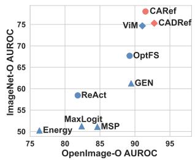

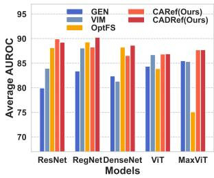  
(a) Performance of Methods  
(b) Performance across Models  
Figure 1. Performance of post-hoc OOD detection methods: (a) shows the average AUROC of various methods tested on the ImageNet-O and OpenImage-O datasets, where $\triangle , \bigcirc ,$ and ♢ represent logit-based methods, feature-based methods, and methods that fuse logits and features, respectively. (b) presents the average AUROC of our methods compared to three SOTA methods across different model architectures on the ImageNet-1k benchmark.

Currently, the prevailing approach to OOD detection involves designing a post-hoc score function that assigns confidence scores to samples, where ID samples receive high scores, and OOD samples receive low scores to enable clear differentiation [23, 34, 50]. Literature on post-hoc OOD detection can be categorized into two main types: Logitbased methods and Feature-based methods [2, 4, 28, 48]. As illustrated in Figure 1a, feature-based methods generally outperform logit-based methods to a certain extent, indicating a performance gap. However, Figure 1b shows that logit-based methods can achieve superior results on a few specific models. Despite the effectiveness of feature-based methods, they primarily focus on reshaping features and subsequently adjusting logits, often neglecting the rich information embedded within the features. This raises an important question: Can OOD detection methods be designed to integrate both features and logits while fully leveraging the information inherent in samplefeatures?

In this paper, we introduce a novel OOD detection algorithm called Class-Aware Relative Feature Leveraging (CARef). Unlike other feature-based OOD detection methods, our approach specifically focuses on the rich information embedded within sample features. CARef first aggregates the sample features in the ID training dataset by class to obtain the average features for each class. For a given test sample, we then compute the relative error between its features and the class-specific average features to determine whether it is an OOD sample. To establish a connection with logits, we further extend $C A R e f$ to the Class-Aware Decoupled Relative Feature (CADRef) method, which decouples the sample’s relative features into two components. This decoupling is based on the sign alignment between the relative features and corresponding model weights according to their contribution to the maximum logit. CADRef also incorporates advanced logit-based scoring methods to scale the relative errors of these two components, effectively amplifying the distinction between ID and OOD samples. In summary, this paper makes the following three key contributions:

• From the perspective of class-specific feature discrepancy, we propose a simple yet effective OOD detection method, $C A R e f ,$ which calculates the relative error of a sample’s features in relation to class-aware features to determine the OOD score.

• By leveraging the association between logits and features, we extend CARef to CADRef, decoupling sample features based on the alignment of signs between relative features and corresponding model weights. This extension also integrates logit-based OOD detection methods to scale positive errors.

• Comprehensive experimental results across multiple datasets and architectures demonstrate that our methods achieve notable improvements while consistently exhibiting robustness across different architectures.

## 2. Preliminaries

Consider a sample classification task with c classes. Given a DNN model $\mathcal { M } : \mathcal { X } \ :  \ : \mathbb { R } ^ { c }$ trained on an ID training dataset $\mathcal { D } _ { \mathrm { t r a i n } } .$ , the prediction label for any sample $x \in \mathcal { D } _ { \mathrm { t e s t } }$ is given by $\mathcal { T } = \arg \operatorname* { m a x } _ { i } \mathcal { M } ( \boldsymbol { x } ) _ { i }$ i. We further define $\mathcal { F }$ $\mathcal { X }  \mathbb { R } ^ { d }$ as the feature extractor, where $\mathcal { F } ( x )$ represents the feature vector from the penultimate layer for the input x. Additionally, let $\mathcal { W } : \mathbb { R } ^ { d }  \mathbb { R } ^ { c }$ and $\boldsymbol { B } : \mathbb { R } ^ { c }  \mathbb { R } ^ { c }$ denote the weights and biases of the classifier, respectively. The logits $\mathcal { L }$ produced by the model for sample x are computed

as follows:

$$
\begin{array} { r } { \mathcal { L } = \mathcal { M } ( \boldsymbol { x } ) = \mathcal { W } \cdot \mathcal { F } ( \boldsymbol { x } ) + \mathcal { B } , } \end{array}\tag{1}
$$

$$
\mathcal { T } = \arg \operatorname* { m a x } _ { i } \mathcal { M } ( \boldsymbol { x } ) _ { i } .\tag{2}
$$

Let $\mathcal { D } _ { \mathrm { I } }$ denote the ID dataset, while $\mathcal { D } _ { 0 }$ stands for the OOD dataset. The goal of OOD detection is to determine whether a given sample originates from the in-distribution dataset $\mathcal { D } _ { \mathrm { I } }$ or the out-of-distribution dataset ${ \mathcal { D } } _ { 0 } ,$ , effectively framing it as a binary classification task. This task is based on a scoring function SCORE(·; ·):

$$
\left\{ \begin{array} { l l } { x \sim \mathcal { D } _ { 0 } , } & { \mathrm { i f } \mathrm { S C O R E } ( \mathcal { M } ; x ) \leq \gamma , } \\ { x \sim \mathcal { D } _ { \mathrm { I } } , } & { \mathrm { i f } \mathrm { S C O R E } ( \mathcal { M } ; x ) > \gamma , } \end{array} \right.\tag{3}
$$

where $\gamma$ is the threshold. According to (3), a sample is classified as an OOD sample if its score falls below $\gamma ;$ otherwise, it is classified as an ID sample. In real-world applications, once a sample is identified as an OOD sample, the DNN should abstain from making any predictions for it.

## 3. Related Work

The design of post-hoc OOD score can be categorized into Logits-based $( S _ { \mathrm { l o g i t } } )$ and Features-based $( S _ { \mathrm { f e a t u r e } } )$ methods.

## 3.1. Logit-based OOD-Detection Method

<table><tr><td>Method</td><td>Score Equation</td></tr><tr><td>MSP [11]</td><td> $\operatorname* { m a x } ( \operatorname { S o f t M a x } ( \mathcal { L } ) )$ </td></tr><tr><td>MaxLogit [10]</td><td>max(L)</td></tr><tr><td>ODIN [22]</td><td> $\operatorname* { m a x } ( \mathrm { S o f t M a x } ( \tilde { \mathcal { L } } ) )$ </td></tr><tr><td>Energy [23]</td><td> $T \cdot \log \sum ( \exp ( \mathcal { L } / T ) )$ </td></tr><tr><td>GEN [24]</td><td> $\begin{array} { r } { - \sum _ { i = 1 } ^ { M } \mathcal { L } _ { i } ^ { \gamma } ( 1 - \mathcal { L } _ { i } ) ^ { \gamma } } \end{array}$ </td></tr></table>

Table 1. Score equations of logit-based OOD-detection methods

Logit-based methods analyze the logits produced by the model for each sample and design confidence scores such that in-distribution (ID) samples yield higher scores while OOD samples yield lower scores [11, 40, 49]. For example, Hendrycks et al. propose the classic baseline method, MSP [11], which uses the maximum value of the logits after applying the softmax function. Additionally, ODIN [22] enhances detection by using temperature scaling and adding small perturbations to the input. Both Energy [23] and GEN [24] leverage the energy function and generalized entropy, respectively, to construct OOD scores, achieving notable improvements. For large-scale anomaly segmentation tasks, Hendrycks et al. observed that using maximum logits can yield superior performance [10]. Table 1 summarizes the scoring equations for these methods.

<table><tr><td>Method</td><td>Score Equation</td></tr><tr><td>ReAct [34]</td><td> $S _ { \mathrm { l o g i t } } ( \mathcal { W } \cdot \mathrm { m i n } ( \mathcal { F } ( x ) , \tau ) + \mathcal { B } )$ </td></tr><tr><td>DICE [35]</td><td> $S _ { \mathrm { l o g i t } } ( ( \mathcal { W } \odot \mathcal { M } ) \cdot \mathcal { F } ( x ) + \mathcal { B } )$ </td></tr><tr><td>ViM [39]</td><td> $- \alpha \| \mathcal F ( x ) ^ { P ^ { \perp } } \| _ { 2 } + S _ { \mathrm { l o g i t } } ( \mathcal L )$ </td></tr><tr><td>ASH-S [7]</td><td> $S _ { \mathrm { l o g i t } } ( \mathcal { W } \cdot ( a _ { s } \odot \mathcal { F } ( x ) ) + \mathcal { B } )$ </td></tr><tr><td>ASH-P [7]</td><td> $S _ { \mathrm { l o g i t } } ( \mathcal { W } \cdot ( a _ { p } \odot \mathcal { F } ( x ) ) + \mathcal { B } )$ </td></tr><tr><td>ASH-B [7]</td><td> $S _ { \mathrm { l o g i t } } ( \mathcal { W } \cdot ( a _ { b } \odot \mathcal { F } ( x ) ) + \mathcal { B } )$ </td></tr><tr><td>OptFS [50]</td><td> $S _ { \mathrm { l o g i t } } ( \mathcal { W } \cdot ( \theta \odot \mathcal { F } ( x ) ) + \mathcal { B } )$ </td></tr></table>

Table 2. Score equations of feature-based OOD-detection methods

## 3.2. Feature-based OOD-Detection Method

Feature-based methods operate on the feature layer, often by computing or modifying elements in the feature space [1, 18, 21, 34]. These approaches are founded on observing and exploiting the comparative stability of feature behaviors in ID samples relative to OOD samples, thereby enhancing the discriminative gap between ID and OOD samples. For example, ReAct [34] removes outliers by truncating features that exceed a certain threshold τ . Djurisic et al. [7] introduce a straightforward method that removes most of a sample’s features while applying adjustments to the remaining ones. Their method includes three variants, ASH-S, ASH-P, and ASH-B, which apply different masks to features. These masks are defined as follows:

$$
a _ { s } , a _ { p } , a _ { b } = \left\{ \begin{array} { l l } { \exp ( \frac { s _ { o } } { s _ { p } } ) , 1 , \frac { s _ { o } } { n \cdot \mathcal { F } ( x ) _ { i } } , } & { \mathrm { i f } \mathcal { F } ( x ) _ { i } \geq \tau , } \\ { 0 , } & { \mathrm { i f } \mathcal { F } ( x ) _ { i } < \tau , } \end{array} \right.\tag{4}
$$

where $s _ { o }$ and $s _ { p }$ denote the sum of features before and after pruning, and n represents the number of features retained. Scale [42] makes a slight modification to ASH-S by retaining pruned features. Moving away from heuristic masks, Zhao et al. reformulate feature-shaping masks as an optimization problem [50], where the objective is to maximize the highest logit values for training samples. DICE [35] ranks weights according to their contributions on the ID training dataset, pruning those with lower values. In contrast, ViM [39] captures the deviation of features from the principal subspace P, making full use of the information embedded in the features. ViM [39] also includes the logits associated with ID classes, addressing part of the issues we identified. Table 2 summarizes these feature-based methods.

## 4. Approach

In this section, we first introduce CARef in Subsection 4.1, which is designed to compute class-aware relative feature errors. Following this, we extend CARef to CADRef by introducing two essential modules: Feature Decoupling and Error Scaling.

To achieve a fine-grained decoupling, we separate a sample’s features into positive and negative components based on their contribution to the maximum logit. By analyzing the two resulting error components, CADRef effectively mitigates the positive errors of samples with high $ { S _ { \mathrm { l o g i t } } }$ values. Details on these two modules are provided in Subsections 4.2 and 4.3, respectively.

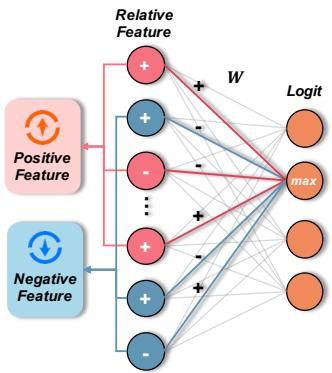  
Figure 2. Example diagram of Feature Decoupling operation of CADRef. Relative features refer to the gap between sample features and class-aware average features. The symbols + and - denote the sign of the corresponding values.

## 4.1. Class-Aware Relative Feature Error

We begin by extracting the features of the training samples, similar to other feature-based methods [34, 35, 50]. The key difference in our approach is that we group these features based on the predicted labels of the samples and compute the average feature vector for each class. For each $k \in \{ 1 , 2 , . . . , c \}$ , we define

$$
\overline { { \mathcal { F } } } ^ { k } = \frac { 1 } { n _ { k } } \cdot \sum _ { x \in \mathcal { D } _ { \mathrm { t r a i n } } } \mathbf { 1 } \Big ( \mathcal { T } ( x ) = k \Big ) \cdot \mathcal { F } ( x ) ,\tag{5}
$$

where $n _ { k }$ is the number of samples with label k in $\mathcal { D } _ { \mathrm { t r a i n } }$ and 1(·) is the indicator function.

To measure the deviation of individual sample features from their class averages, we propose calculating the relative error between a sample’s feature vector and its corresponding class centroid. Specifically, we compute the normalized $l _ { 1 } .$ -distance between the sample feature and the average feature, with normalization performed by the $l _ { 1 } .$ -norm of the sample feature. The error formula and score function for CARef are defined as:

$$
\mathcal { E } ( x ) = \frac { \Vert \mathcal { F } ( x ) - \overline { { \mathcal { F } } } ^ { \mathcal { T } ( x ) } \Vert _ { 1 } } { \Vert \mathcal { F } ( x ) \Vert _ { 1 } } , \quad \mathrm { S c o R E } _ { C A R e f } = - \mathcal { E } ( x ) .\tag{6}
$$

Our experimental results, presented in Table 3 and Table $^ { 4 , }$ demonstrate that using class-aware relative feature error as a score function yields remarkable effectiveness.

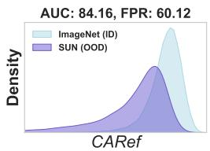  
(a) CARef

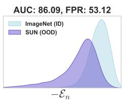  
(b) Negative Feature

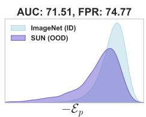  
(c) Positive Feature

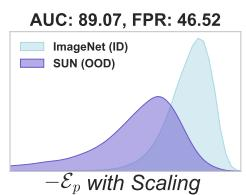  
(d) Scaled Positive Feature

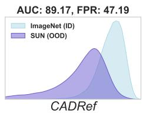  
(e) CADRef  
Figure 3. Detection results and score distributions on ImageNet-1k (blue) [6] and SUN (purple) [41] using DenseNet-201 [9].

## 4.2. Feature Decoupling

As noted in [39], relying solely on sample features limits the effectiveness of OOD detection methods. To address this, we explore the relationship between features and logits in depth and conduct a fine-grained analysis of the features, which distinguishes CADRef from $C A R e f .$ Based on an empirical observation, increasing the maximum logit (i.e., max(L)) of a sample tends to improve the performance of most logits-based methods. Therefore, we focus on the change in the maximum logit of the sample features relative to the class-aware average features.

Let $\mathcal { W } ^ { \mathrm { m a x } }$ denote the weights corresponding to the maximum logit. As illustrated in Figure 2, the contribution to logit values depends on the alignment of signs between the weights and relative features. Specifically, a positive contribution to the maximum logit occurs only when the signs of weights and relative features align, while a mismatch in signs results in an antagonistic effect that diminishes the logit value. By influencing the maximum logit, these positive features also affect logit-based detection methods. We will analyze this relationship further in the next subsection.

Furthermore, the features of each sample can be divided into two parts: $\mathrm { P O S } = \{ i \mid \mathcal { W } _ { i } ^ { m a x } \cdot ( \mathcal { F } ( x ) _ { i } - \overline { { \mathcal { F } } } _ { i } ^ { \mathcal { T } ( x ) } ) \geq 0 \}$ and $\mathrm { N E G } = \{ i  { \mid }  { \mathcal { W } _ { i } ^ { m a x } \cdot ( \mathcal { F } ( x ) _ { i } - \overline { { \mathcal { F } } } _ { i } ^ { T ( x ) } ) < 0 \} }$ . The corresponding errors for these two parts are as follows:

$$
\mathcal { E } _ { p } ( \boldsymbol { x } ) = \frac { \| \sum _ { i \in \mathrm { P o s } } ( \mathcal { F } ( \boldsymbol { x } ) _ { i } - \overline { { \mathcal { F } } } _ { i } ^ { \mathcal { T } ( x ) } ) \| _ { 1 } } { \| \mathcal { F } ( \boldsymbol { x } ) \| _ { 1 } } ,\tag{7}
$$

$$
\mathcal { E } _ { n } ( x ) = \frac { \| \sum _ { i \in \mathrm { N E G } } ( \mathcal { F } ( x ) _ { i } - \overline { { \mathcal { F } } } _ { i } ^ { \mathcal { T } ( x ) } ) ) \| _ { 1 } } { \| \mathcal { F } ( x ) \| _ { 1 } } .\tag{8}
$$

## 4.3. Error Scaling

Decomposing E(x) into $\mathcal { E } _ { p } ( x )$ and $\mathcal { E } _ { n } ( x )$ does not impact the relative error between samples. To investigate their individual contributions, we evaluated these components separately as OOD detection scores. Empirical results show that, compared to CARef, using the positive error as the score substantially reduces OOD detection performance, while using the negative error as the score achieves nearly comparable performance. As shown in Figure 3, the AUROC and FPR95 of $\mathcal { E } _ { p }$ are approximately 13% and 15% lower than those of CARef, respectively. In contrast, ${ \mathcal { E } } _ { n }$ shows a 2.03% and 7.00% increase. Due to the poor classification performance of the positive error, we conclude that it plays a harmful role in CARef’s coupling form, highlighting the need to focus on enhancing $\mathcal { E } _ { p }$

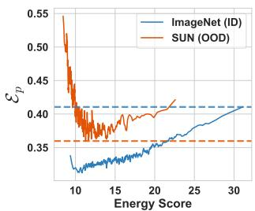

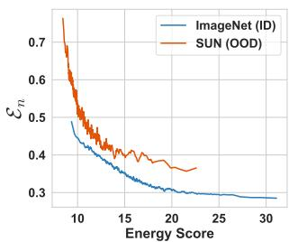  
(b) Negative Feature

(a) Positive Feature  
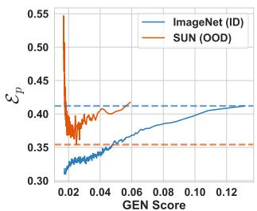

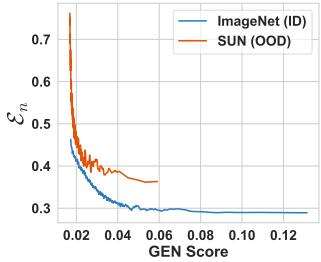  
(c) Positive Feature  
(d) Negative Feature  
Figure 4. Score and error distribution of ID/OOD samples.

Since $\mathcal { E } _ { p }$ is closely related to logit-based methods, we explore the relationship between $ { S _ { \mathrm { l o g i t } } }$ and $\mathcal { E } _ { p }$ for a sample, using the Energy [23] and GEN [24] scores as examples. Results for other methods are provided in the supplementary materials. As shown in Figure 4a and Figure 4c, we observe that ${ \mathcal { E } } _ { p }$ effectively distinguishes between ID and OOD samples at lower $S _ { \mathrm { l o g i t } }$ values. However, at higher $S _ { \mathrm { l o g i t } }$ values, $\mathcal { E } _ { p }$ for ID and OOD samples shows substantial overlap, which reduces OOD detection performance. To address this issue, we propose using the ratio of $\cdot \mathcal { E } _ { p }$ to $\boldsymbol { S _ { l o g i t } }$ instead of $\cdot \mathcal { E } _ { p }$ alone. When ID and OOD samples have similar $\mathcal { E } _ { p }$ values, the higher $ { S _ { \mathrm { l o g i t } } }$ of ID samples reduces this ratio, while for OOD samples, the effect is reversed. For the negative error, as shown in Figure 4b and Figure 4d, we observe the opposite phenomenon. There is no overlap in ${ \mathcal { E } } _ { n }$ between ID and OOD samples at high $ { S _ { \mathrm { l o g i t } } }$ , while some overlap exists at low $ { S _ { \mathrm { l o g i t } } }$ . This overlap does not impact the detection performance of the negative error, as low $ { S _ { \mathrm { l o g i t } } }$ values indicate that distinguishing these samples is challenging for any detection method. Therefore, modifying the negative error is deemed unnecessary for performance enhancement.

<table><tr><td rowspan="2">Method</td><td>ResNet</td><td>RegNet</td><td>DenseNet</td><td>ViT</td><td>Swin</td><td>ConvNeXt</td><td>MaxViT</td><td>Average</td></tr><tr><td>AU↑ FP↓</td><td>AU↑ FP↓</td><td>AU↑ FP↓</td><td>AU↑ FP↓</td><td>AU↑ FP↓</td><td>AU↑ FP↓</td><td>AU↑ FP↓</td><td>AU↑ FP↓</td></tr><tr><td>MSP [11]</td><td>74.14 70.44</td><td>78.34 69.98</td><td>77.76 67.63</td><td>79.33 66.29</td><td>77.81 67.12</td><td>76.2365.24</td><td>80.36 63.50</td><td>77.71 67.17</td></tr><tr><td>MaxLogit [10]</td><td>79.64 65.00</td><td>81.71 63.75</td><td>81.16 61.56</td><td>75.6865.40</td><td>70.85 67.68</td><td>68.76 72.66</td><td>77.18 57.28</td><td>76.43 64.76</td></tr><tr><td>ODIN [22]</td><td>79.28 60.32</td><td>80.5758.66</td><td>78.90 60.75</td><td>61.4594.33</td><td>55.22 91.02</td><td>51.09 89.33</td><td>64.6081.46</td><td>67.30 76.55</td></tr><tr><td>Energy [23]</td><td>79.8564.53</td><td>81.55 64.11</td><td>81.09 61.25</td><td>71.0470.23</td><td>63.1875.96</td><td>52.91 91.09</td><td>73.01 62.46</td><td>71.80 69.95</td></tr><tr><td>GEN [24]</td><td>79.95 66.70</td><td>83.41 63.46</td><td>82.39 63.01</td><td>84.37 59.58</td><td>83.72 55.33</td><td>82.69 54.90</td><td>85.50 51.22</td><td>83.15 59.17</td></tr><tr><td>ReAct [34]</td><td>86.03 44.09</td><td>86.62 46.30</td><td>78.4664.18</td><td>79.65 69.99</td><td>81.9166.57</td><td>78.15 76.87</td><td>63.78 78.91</td><td>79.23 63.84</td></tr><tr><td>DICE [35]</td><td>82.48 47.90</td><td>77.92 68.89</td><td>79.2059.04</td><td>71.6588.51</td><td>45.7986.76</td><td>45.12 89.77</td><td>63.2076.78</td><td>66.48 73.95</td></tr><tr><td>ASH-S [7]</td><td>90.11 35.52</td><td>89.3738.01</td><td>87.56 43.80</td><td>18.06 99.62</td><td>19.18 99.35</td><td>20.30 98.23</td><td>55.2686.30</td><td>54.26 71.55</td></tr><tr><td>OptFS [50]</td><td>88.1542.47</td><td>89.3042.97</td><td>88.25 47.88</td><td>83.89 65.99</td><td>84.71 65.03</td><td>85.06 61.17</td><td>75.0970.84</td><td>84.92 56.62</td></tr><tr><td>ViM [39]</td><td>83.96 65.85</td><td>88.0856.13</td><td>81.3372.66</td><td>86.72 49.36</td><td>83.96 63.63</td><td>84.24 58.57</td><td>85.3453.56</td><td>84.80 59.97</td></tr><tr><td>CARef</td><td>89.94 40.91</td><td>88.27 50.68</td><td>86.55 52.59</td><td>86.84 60.48</td><td>86.92 58.65</td><td>87.95 54.09</td><td>87.70 50.75</td><td>87.74 52.59</td></tr><tr><td>CADRef</td><td>89.24 40.68</td><td>90.26 42.34</td><td>88.6445.25</td><td>86.91 60.05</td><td>87.10 57.38</td><td>87.48 56.92</td><td>87.73 49.49</td><td>88.19 50.30</td></tr></table>

Table 3. Results of OOD detection on ImageNet-1k benchmark. ↑ indicates that higher values are better, while ↓ indicates that lower values are better. All values are percentages, with the best and second-best results being highlighted and underlined, respectively.

Comparing Figure 3c with Figure 3d, we can find that scaling the positive error significantly enhances the separation between ID and OOD samples. Finally, we consider a fusion form of the positive and negative errors. To ensure consistency in the magnitude of both errors, we also apply a constant decay to the negative error, with the constant term set to the average score of all ID training samples:

$$
\overline { { S } } _ { \mathrm { l o g i t } } = \frac { 1 } { n } \cdot \sum _ { x \in \mathcal { D } _ { \mathrm { t r a i n } } } S _ { \mathrm { l o g i t } } ( x ) .\tag{9}
$$

The final score formula of our CADRef is as follows:

$$
\mathcal { E } ( x ) = \frac { \mathcal { E } _ { p } ( x ) } { S _ { \mathrm { l o g i t } } ( x ) } + \frac { \mathcal { E } _ { n } ( x ) } { \overline { { S } } _ { \mathrm { l o g i t } } } , \quad \mathrm { S C O R E } _ { C A D R e f } = - \mathcal { E } ( x ) .\tag{10}
$$

As shown in Figure 3e, the fusion of both errors further enhances the distinction between ID and OOD samples compared to using each error individually.

## 5. Experiments

In this section, we conduct extensive experiments across multiple datasets and models to evaluate the performance of our two methods, and compare them with state-of-the-art OOD detection methods, all of which are implemented by PyTorch [32] 1.

## 5.1. Setup

Datasets. We conduct experiments on both large-scale and small-scale benchmarks. For the large-scale benchmark, we use ImageNet-1k [6] as the in-distribution (ID) dataset and evaluate performance across six commonly used OOD datasets: iNaturalist [15], SUN [41], Places [51], Texture [5], OpenImage-O [39], and ImageNet-O [12]. For the small-scale benchmark, we use CIFAR-10 [19] and CIFAR-100 [19] as ID datasets, with performance evaluated on six widely used OOD datasets: SVHN [30], LSUN-Crop [45], LSUN-Resize [45], iSUN [43], Texture [5], and Places [51]. All OOD datasets have been resized to match the dimensions of the ID datasets.

Models architectures. To validate the robustness of the proposed methods, we conduct experiments using several well-known model architectures, including convolutional neural networks (CNNs) and vision transformers. For ImageNet-1k, we use four representative CNN-based models: ResNet-50 [9], RegNetX-8GF [33], DenseNet-201 [16], and ConvNeXt-B [26], as well as three transformerbased models: ViT-B/16 [8], Swin-B [25], and MaxViT-T [37] to ensure a comprehensive evaluation. The pre-trained model weights are sourced from the PyTorch model zoo [32]. For experiments on CIFAR-10 and CIFAR-100, we use DenseNet-101 [16] with pre-trained weights provided by prior work [35].

Baselines. We evaluate our two proposed methods, with CADRef leveraging the Energy [23] score as the source for Error Scaling. For comparison, we implement ten baseline methods for OOD detection, covering both logit-based and feature-based approaches. The logit-based methods include MSP [11], MaxLogit [10], ODIN [22], Energy [23] and GEN [24]. Meanwhile, the feature-based methods comprise ReAct [34], DICE [35], ASH-S [7], OptFS [50] and ViM [39]. Note that all feature-based methods use energy as the score function. Details of the hyperparameters for each baseline are provided in the supplementary materials.

<table><tr><td rowspan="2">Methods</td><td colspan="2">SVHN</td><td colspan="2">LSUN-C</td><td colspan="2">LSUN-R</td><td colspan="2">iSUN</td><td colspan="2">Textures</td><td colspan="2">Places</td><td colspan="2">Average</td></tr><tr><td>AU↑</td><td>FP↓</td><td>AU↑</td><td>FP↓</td><td>AU↑ FP↓</td><td></td><td colspan="2">AU↑ FP↓</td><td colspan="2">AU↑ FP↓</td><td colspan="2">AU↑ FP↓</td><td colspan="2">AU↑ FP↓</td></tr><tr><td>MSP [11]</td><td>93.56</td><td>47.19</td><td>93.42</td><td>47.09</td><td>94.54</td><td>42.07</td><td>94.49</td><td>42.53</td><td>88.24</td><td>63.88</td><td>90.02</td><td>60.01</td><td></td><td>92.38 50.46</td></tr><tr><td rowspan="12">CIFA-10</td><td>MaxLogit [10]</td><td>94.32 37.79</td><td></td><td>97.22 16.31</td><td>98.12</td><td>9.41</td><td></td><td>98.05 10.08</td><td></td><td>86.6556.57</td><td>93.61 34.82</td><td></td><td></td><td>94.6627.50</td></tr><tr><td>ODIN [22]</td><td>92.88 39.95</td><td></td><td>96.02 21.34</td><td>99.29</td><td>3.09</td><td>99.19</td><td>3.79</td><td></td><td>86.1653.22</td><td></td><td>92.5738.81</td><td></td><td>94.3526.70</td></tr><tr><td>Energy [23]</td><td>94.1938.71</td><td></td><td>97.29</td><td>15.55</td><td>98.18</td><td>8.70</td><td>98.11</td><td>9.42</td><td>86.5656.66</td><td></td><td>93.6733.92</td><td></td><td>94.6727.16</td></tr><tr><td>GEN [24]</td><td>95.1930.75</td><td></td><td>96.99</td><td>18.29</td><td>97.93</td><td>11.29</td><td>97.87</td><td>11.93</td><td>88.87 54.00</td><td></td><td>93.34 36.30</td><td></td><td>95.03 27.09</td></tr><tr><td>ReAct [34]</td><td>66.05</td><td>97.18</td><td>78.03</td><td>87.24</td><td>84.8671.13</td><td></td><td>83.7773.66</td><td></td><td>68.08 90.85</td><td>75.53</td><td>83.72</td><td>76.05</td><td>83.96</td></tr><tr><td>DICE [35]</td><td>94.9627.74</td><td></td><td>98.31</td><td>8.86</td><td>99.05</td><td>4.22</td><td>98.99</td><td>5.16</td><td>87.3345.33</td><td></td><td>93.8631.84</td><td></td><td>95.42 20.52</td></tr><tr><td>ASH-S [7]</td><td>98.73</td><td>6.16</td><td>98.13</td><td>9.67</td><td>98.91</td><td>4.84</td><td>98.87</td><td>5.13</td><td>95.29 23.58</td><td>93.58</td><td>32.32</td><td>97.25</td><td>13.62</td></tr><tr><td>OptFS [50]</td><td>96.01 24.35</td><td></td><td>96.99</td><td>18.09</td><td>98.11</td><td>9.31</td><td>98.00</td><td>10.25</td><td>94.2932.96</td><td></td><td>92.33</td><td>40.15</td><td>95.9522.52</td></tr><tr><td>ViM [39]</td><td>98.45</td><td>8.65</td><td>97.36</td><td>15.39</td><td>99.28</td><td>3.17</td><td>99.12</td><td>4.50</td><td>96.1820.33</td><td></td><td>89.80</td><td>54.48</td><td>96.70 17.75</td></tr><tr><td>CARef</td><td>99.11</td><td>4.66</td><td>98.22</td><td>9.51</td><td>98.93</td><td>5.20</td><td>98.77</td><td>6.11</td><td>96.79 16.29</td><td></td><td>91.59 41.19</td><td></td><td>97.23 13.83</td></tr><tr><td>CADRef</td><td>99.17</td><td>4.16</td><td>98.66</td><td>7.02</td><td>99.23</td><td>3.61</td><td>99.13</td><td>4.34</td><td>96.71</td><td>17.52 93.72</td><td>32.74</td><td>97.77</td><td>11.56</td></tr><tr><td rowspan="13">CI-A-0</td><td>MSP [11]</td><td>75.19</td><td>82.02</td><td>78.63 76.44</td><td>67.13</td><td>87.28</td><td>68.49</td><td>88.00</td><td>71.20</td><td>85.19</td><td>70.84</td><td>85.28</td><td></td><td>71.91 84.04</td></tr><tr><td>MaxLogit [10]</td><td>81.4286.17</td><td></td><td>87.9058.91</td><td></td><td>77.4176.05</td><td></td><td>76.5479.13</td><td></td><td>71.1484.45</td><td></td><td>76.1879.82</td><td></td><td>78.4377.42</td></tr><tr><td>ODIN [22]</td><td>80.33 86.53</td><td></td><td>89.10 51.85</td><td></td><td></td><td>86.41 56.66</td><td>85.7859.03</td><td></td><td>73.57 80.49</td><td>76.83</td><td>79.80</td><td></td><td>82.00 69.06</td></tr><tr><td>Energy [23]</td><td>81.30 88.03</td><td></td><td>88.11</td><td>58.19</td><td>77.77</td><td>75.17</td><td>76.79</td><td>78.61</td><td>70.99</td><td>85.00</td><td>76.21 79.95</td><td></td><td>78.5377.49</td></tr><tr><td>GEN [24]</td><td>80.97 78.89</td><td></td><td>83.72</td><td>70.82</td><td>71.51</td><td>84.11</td><td>72.00</td><td>85.15</td><td>74.2683.68</td><td>73.88</td><td>83.36</td><td>76.06</td><td>81.00</td></tr><tr><td>ReAct [34]</td><td>69.13</td><td>96.75</td><td>78.84</td><td>77.21</td><td>86.44</td><td>68.03</td><td>82.86 74.78</td><td></td><td>67.15 92.07</td><td>59.99</td><td>89.72</td><td>74.07</td><td>83.09</td></tr><tr><td>DICE [35]</td><td>88.18</td><td>60.06</td><td>92.9836.40</td><td></td><td>88.23</td><td>55.03</td><td>88.5052.49</td><td></td><td>77.22 61.27</td><td></td><td>81.1873.89</td><td></td><td>86.0556.52</td></tr><tr><td>ASH-S [7]</td><td>95.79 24.75</td><td></td><td>94.14</td><td>29.98</td><td>89.54 54.06</td><td></td><td>90.93</td><td>48.15</td><td>92.1134.60</td><td>79.22</td><td>76.96</td><td>90.29</td><td>44.75</td></tr><tr><td>OptFS [50]</td><td>84.9673.61</td><td></td><td>90.01</td><td>47.98</td><td>83.61</td><td>69.52</td><td>84.39</td><td>70.56</td><td>85.63</td><td>61.64</td><td>74.37</td><td>80.96</td><td>83.83 67.38</td></tr><tr><td>ViM [39]</td><td>93.57 35.05</td><td></td><td>92.76</td><td>40.06</td><td>95.50</td><td>24.65</td><td>95.63</td><td>23.22</td><td>95.89</td><td>19.75</td><td>75.61</td><td>83.89</td><td>91.4937.77</td></tr><tr><td>CARef</td><td>96.83 17.41</td><td></td><td>90.96</td><td>40.74</td><td>89.25</td><td>52.69</td><td>91.08</td><td>45.32</td><td>93.99</td><td>25.48</td><td>67.92</td><td>88.30</td><td>88.34 44.99</td></tr><tr><td>CADRef</td><td>96.69</td><td>18.28</td><td></td><td>94.7027.22</td><td>90.26</td><td>47.45</td><td>91.59</td><td>42.10</td><td>94.13</td><td>28.72</td><td>75.9178.30</td><td>90.55</td><td>40.34</td></tr></table>

Table 4. Results of OOD detection on CIFAR benchmarks. ↑ indicates that higher values are better, while ↓ indicates that lower values are better. All values are percentages, with the best and second-best results being highlighted and underlined, respectively.

Evaluation metrics. We evaluate the OOD detection performance using two standard metrics, consistent with prior works [11, 36]: area under the receiver operating characteristic curve (AUROC) and false positive rate at a true positive rate of 95% (FPR95). Higher AUROC values and lower FPR95 values indicate better OOD detection performance.

## 5.2. Comparison with SOTA Methods

On ImageNet-1k Benchmark. Table 3 presents the experimental results on ImageNet-1k. We also provide detailed results for all datasets in the supplementary materials. From the average results among all models, both CARef and CADRef remain in the top two positions. Compared to the best baseline, CADRef improves the AUROC by 3.27% and reduces the FPR95 by 6.32%, while CARef also improves the AUROC by 2.82% and reduces the FPR95 by 4.03%. We group the baselines for detailed analysis:

• vs. feature shaping-based methods: Experimental results demonstrate that feature shaping-based methods exhibit strong performance on specific architectures, notably ResNet-50, RegNetX-8GF, and DenseNet-201. For example, ASH-S achieves state-of-the-art performance on ResNet-50 and reports the lowest FPR95 values on both RegNetX-8GF and DenseNet-201. However, for other model architectures, the performance of these methods significantly declines, with the ASH-S method even collapsing (AUROC below 50% on ViT-B/16, Swin-B, and ConvNeXt-B). This observation indicates that feature shaping-based methods exhibit architecture-specific behavior and lack cross-model robustness. In contrast, our methods demonstrate outstanding performance on individual models, almost always ranking in the top two, further highlighting the robustness. To address the issue of performance collapse, OptFS discards the heuristic mask design based on empirical methods and instead focuses on automating the optimization of masks across different models. While OptFS substantially improves crossarchitecture robustness, as evidenced in Table 3, its performance remains inferior to both CARef and CADRef.

• vs. logit-based methods: According to the Table 3, compared to feature shaping-based methods, most logit-based methods do not perform well, except for GEN. However, these methods do not suffer from similar collapses on certain models as feature shaping-based methods, making them more generalizable compromise solutions. Additionally, logit-based methods do not require extra ID training data, which gives them an advantage in terms of computational resources.

• vs. ViM: We focus especially on the comparison with ViM, since it similarly utilizes feature information and logit-based scores, making it a method of the same category as CADRef. As shown in the Table 3, CADRef outperforms ViM in all other cases except for the FPR95 on ViT-B/16. On DenseNet, the fact that the effect of ViM is closely approximated by Energy (logit-based component) suggests that ViM does not fully utilize feature information. Our method demonstrates that, compared to projecting into other spaces, ID and OOD samples exhibit significant separability within the feature space.

On CIFAR Benchmarks. Table 4 also shows the experimental results on CIFAR-10 and CIFAR-100 benchmarks. Our proposed CADRef demonstrates superior performance on CIFAR-10, achieving state-of-the-art results, while maintaining competitive performance on CIFAR-100 with only marginal differences from the best baseline method. We also observe a decline in the performance of CARef on the CIFAR benchmarks. This phenomenon can be attributed to the reduced feature dimensionality in smallscale datasets, which potentially compromises the precision of relative error calculations.

## 5.3. Impact of various logit-based methods

Figure 5 provides the performance of CADRef on the ImageNet-1k benchmark, using MSP, Maxlogit, Energy, and GEN as the logit-based scores, respectively. The results demonstrate that CADRef+GEN achieves superior performance in both AUROC and FPR95 metrics among all logit-based variants, which aligns with the exceptional performance of GEN previously observed in Table 3. Furthermore, the performance of both $C A D R e f + M a x L o g i t$ and CADRef+Energy surpasses all baselines in Table 3. We also observe an interesting phenomenon in Figure 5 that deserves exploration in future work. Compared to CARef, using MaxLogit, Energy, and GEN significantly improves the performance of CADRef, while using MSP leads to a substantial decline in its performance. This contrasts with the trend observed in the Table 3, where MSP demonstrates superior performance over both MaxLogit and Energy.

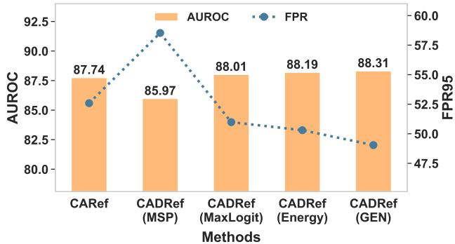  
Figure 5. The Impact of various logit-based methods on CADRef

## 5.4. Ablation Study

<table><tr><td rowspan="2">Architectures</td><td> $\ell _ { 1 } { - } D i s t a n c e$ </td><td> $\ell _ { 1 } { - } N o r m$ </td><td>CARef</td></tr><tr><td>AU↑ FP↓</td><td>AU↑ FP↓</td><td>AU↑ FP↓</td></tr><tr><td>ResNet</td><td>74.26 78.65</td><td>79.69 55.20</td><td>89.94 40.91</td></tr><tr><td>ViT</td><td>85.16 66.11</td><td>20.11 99.44</td><td>86.84 60.48</td></tr><tr><td>Swin</td><td>85.83 67.05</td><td>15.95 99.75</td><td>86.92 58.65</td></tr><tr><td>ConvNeXt</td><td>87.49 58.54</td><td>14.09 99.83</td><td>87.95 54.09</td></tr><tr><td>DenseNet</td><td>69.32 85.54</td><td>68.66 75.31</td><td>86.55 52.59</td></tr><tr><td>RegNet</td><td>77.30 76.17</td><td>65.36 86.11</td><td>88.27 50.68</td></tr><tr><td>MaxViT</td><td>85.99 64.43</td><td>22.12 99.46</td><td>87.70 50.75</td></tr><tr><td>Average</td><td>62.19 80.76 40.85</td><td>87.87</td><td>87.74 52.59</td></tr></table>

Table 5. Ablation Study of CARef. $\ell _ { 1 } { - } D i s t a n c e$ represents the negative of the $\ell _ { 1 }$ distance between the sample feature and the class-aware average feature as the score function, while $\ell _ { 1 }$ -Norm uses the $\ell _ { 1 }$ norm of the sample feature as the score function.

Ablation of CARef. In Table 5, we presents the ablation results of CARef on the ImageNet-1k benchmark, with all values averaged across multiple OOD datasets. Experiments show that using either $\ell _ { 1 } { \cdot } D i s t a n c e \mathrm { o r } \ell _ { 1 } { \cdot } N o r m$ alone results in a significant performance gap compared to the baseline. Yu et al. observe on ResNet that ID samples generally exhibit a larger feature norm than OOD samples [46]. The $\ell _ { 1 }$ -Norm is similar to their proposed FeatureNorm, with the main distinction being that FeatureNorm focuses on a specific feature layer block. However, our experiments reveal that this phenomenon does not generalize across different models. Specifically, our experiments with models including ViT, Swin, ConvNeXt, and MaxViT demonstrate contrary behavior, with $\ell _ { 1 }$ -Norm achieving AUROC scores below 30% and FPR95 values exceeding 99%. This suggests that the scoring for ID and OOD samples is reversed, meaning that in most cases, the feature norm of OOD samples is greater than that of ID samples. In contrast, CARef, as a combination of both, demonstrates significant performance improvement and robustness across multiple models.

<table><tr><td rowspan=1 colspan=1>FD</td><td rowspan=1 colspan=1> $\mathcal { E } _ { p }$ </td><td rowspan=1 colspan=1> $\overline { { \mathcal { E } _ { n } } }$ </td><td rowspan=1 colspan=1>ES</td><td rowspan=1 colspan=1>AU↑</td><td rowspan=1 colspan=1>FP↓</td></tr><tr><td rowspan=4 colspan=1>X</td><td rowspan=4 colspan=1>√X√</td><td rowspan=3 colspan=1>X√X</td><td rowspan=1 colspan=1>X</td><td rowspan=1 colspan=1>87.7482.52</td><td rowspan=2 colspan=1>52.5965.67</td></tr><tr><td rowspan=2 colspan=1>X√</td><td rowspan=2 colspan=1>87.7087.58</td><td rowspan=1 colspan=1>51.82</td></tr><tr><td rowspan=1 colspan=1>52.43</td></tr><tr><td rowspan=1 colspan=1></td><td rowspan=1 colspan=1></td><td rowspan=1 colspan=1>88.19</td><td rowspan=1 colspan=1>50.30</td></tr></table>

Table 6. Ablation Study of CADRef. FD and ES represent the Feature Decoupling and Error Scaling components, respectively. ✓ and ✗ indicate whether the component is used or not.

Ablation of CADRef. As shown in Table 6, we also conduct ablation experiments to verify the effectiveness of each module of CADRef. The first and fifth rows show the results for CARef and CADRef, respectively. The experimental results demonstrate that removing any component results in a degradation in the performance of CADRef, which validates that each component plays a crucial role. The second and third rows of the table clearly show that using the negative error significantly outperforms using the positive error. Furthermore, the AUROC result obtained by using the negative error alone is comparable to that of CARef, with even a lower FPR95. This suggests that the effect of using the positive error without Error Scaling can be considered negligible. However, once Error Scaling is applied to the positive error (the fourth row), its performance becomes comparable to that of the negative error. Note that Error Scaling cannot be applied independently of Feature Decoupling, so we can only validate their collaborative effectiveness, as reflected in the performance gap between CADRef and CARef.

## 5.5. Discussion

In this subsection, we examine the limitations of CADRef’s logit-based component through experiments on three hard OOD benchmarks: ImageNet-O [12], SSB-hard [38], and Ninco [3], which have been empirically shown to be challenging for logit-based methods. Additionally, we also include a comparative analysis between ViM and its featureonly component, Residual [39]. As shown in Table 7, the performance of Energy on ImageNet-O degrades to an AU-ROC of approximately 50%, essentially reducing to random classification. This degradation is reflected in both CADRef and ViM, which underperform their respective feature-only counterparts on this dataset. While SSB-hard and Ninco are also considered hard OOD datasets, Energy maintains discriminative capability with AUROC scores above 60%. In these cases, CADRef demonstrates superior performance compared to CARef, a pattern similarly observed in the comparison between ViM and Residual. These empirical findings lead to two key conclusions: (1) When logit-based methods encounter catastrophic failure on extremely challenging OOD datasets, their integration into CADRef becomes detrimental to overall performance; (2) However, in scenarios where logit-based methods maintain even modest discriminative power, they contribute positively to the effectiveness of CADRef.

<table><tr><td rowspan="2">Methods</td><td>ImageNet-O</td><td>SSB-hard</td><td>Ninco</td></tr><tr><td>AU↑ FP↓</td><td>AU↑ FP↓</td><td>AU↑ FP↓</td></tr><tr><td>Energy [23]</td><td>50.25 92.71</td><td>66.99 83.40</td><td>72.41 76.59</td></tr><tr><td>Residual [39]</td><td>76.37 778.99</td><td>57.06 89.05</td><td>70.47 80.18</td></tr><tr><td>ViM [39]</td><td>74.68 82.14</td><td>68.81 85.16</td><td>81.72 71.51</td></tr><tr><td>CARef</td><td>78.03 81.73</td><td>72.32 81.04</td><td>83.65 68.27</td></tr><tr><td>CADRef</td><td>75.29 85.21</td><td>74.58 78.79</td><td>85.36 64.89</td></tr></table>

Table 7. The effect of the logit-based scoring component on CADRef and ViM on three hard OOD dataset. Both CADRef and ViM use Energy as their logit-based component.

## 6. Conclusion

In this paper, we presented a novel OOD detection framework, CADRef, which leverages class-aware decoupled relative features to enhance the detection of out-of-distribution samples. Building on the class-aware relative error approach of CARef, CADRef incorporates feature decoupling and error scaling, allowing for a more nuanced separation of in-distribution and out-of-distribution samples based on their positive and negative feature contributions. Comprehensive experiments across both large-scale and small-scale benchmarks demonstrate the robustness and effectiveness of CADRef, particularly when combined with advanced logit-based scores such as GEN, yielding superior AUROC and FPR95 metrics compared to state-of-the-art baselines. Future work may investigate additional decoupling strategies and adaptive scaling techniques to further enhance detection reliability across diverse datasets and architectures.

## Acknowledgment

This work was supported in part by the National Key Research and Development Program of China under Grant 2024YFB3309400, the National Science Foundation of China (62125206, 62472375, 62472338), the Major Program of the National Natural Science Foundation of

Zhejiang (LD24F020014, LD25F020002), and the Zhejiang Pioneer (Jianbing) Project (2024C01032). Hailiang Zhao’s work was supported in part by the Zhejiang University Education Foundation Qizhen Scholar Foundation.

## References

[1] Yong Hyun Ahn, Gyeong-Moon Park, and Seong Tae Kim. Line: Out-of-distribution detection by leveraging important neurons. In Conference on Computer Vision and Pattern Recognition (CVPR), pages 19852–19862, 2023. 3

[2] Sima Behpour, Thang Long Doan, Xin Li, Wenbin He, Liang Gou, and Liu Ren. Gradorth: A simple yet efficient outof-distribution detection with orthogonal projection of gradients. In Advances in Neural Information Processing Systems (NeurIPS), 2023. 1

[3] Julian Bitterwolf, Maximilian Muller, and Matthias Hein. In¨ or out? fixing imagenet out-of-distribution detection evaluation. In International Conference on Machine Learning (ICML), volume 202, pages 2471–2506, 2023. 8

[4] Jinggang Chen, Junjie Li, Xiaoyang Qu, Jianzong Wang, Jiguang Wan, and Jing Xiao. GAIA: delving into gradientbased attribution abnormality for out-of-distribution detection. In Advances in Neural Information Processing Systems (NeurIPS), 2023. 1

[5] Mircea Cimpoi, Subhransu Maji, Iasonas Kokkinos, Sammy Mohamed, and Andrea Vedaldi. Describing textures in the wild. In Computer Vision and Pattern Recognition (CVPR), pages 3606–3613, 2014. 5

[6] Jia Deng, Wei Dong, Richard Socher, Li-Jia Li, Kai Li, and Li Fei-Fei. Imagenet: A large-scale hierarchical image database. In Computer Vision and Pattern Recognition (CVPR), pages 248–255, 2009. 4, 5

[7] Andrija Djurisic, Nebojsa Bozanic, Arjun Ashok, and Rosanne Liu. Extremely simple activation shaping for outof-distribution detection. In International Conference on Learning Representations (ICLR), 2023. 3, 5, 6

[8] Alexey Dosovitskiy, Lucas Beyer, Alexander Kolesnikov, Dirk Weissenborn, Xiaohua Zhai, Thomas Unterthiner, Mostafa Dehghani, Matthias Minderer, Georg Heigold, Sylvain Gelly, Jakob Uszkoreit, and Neil Houlsby. An image is worth 16x16 words: Transformers for image recognition at scale. In International Conference on Learning Representations (ICLR), 2021. 5

[9] Kaiming He, Xiangyu Zhang, Shaoqing Ren, and Jian Sun. Deep residual learning for image recognition. In Computer Vision and Pattern Recognition (CVPR), pages 770–778, 2016. 1, 4, 5

[10] Dan Hendrycks, Steven Basart, Mantas Mazeika, Andy Zou, Joseph Kwon, Mohammadreza Mostajabi, Jacob Steinhardt, and Dawn Song. Scaling out-of-distribution detection for real-world settings. In International Conference on Machine Learning (ICML), volume 162, pages 8759–8773, 2022. 2, 5, 6

[11] Dan Hendrycks and Kevin Gimpel. A baseline for detecting misclassified and out-of-distribution examples in neural

networks. In International Conference on Learning Representations (ICLR), 2017. 1, 2, 5, 6

[12] Dan Hendrycks, Kevin Zhao, Steven Basart, Jacob Steinhardt, and Dawn Song. Natural adversarial examples. In Computer Vision and Pattern Recognition (CVPR), pages 15262–15271, 2021. 5, 8

[13] Jens Henriksson, Christian Berger, Stig Ursing, and Markus Borg. Evaluation of out-of-distribution detection performance on autonomous driving datasets. In International Conference on Artificial Intelligence Testing (AITest), pages 74–81, 2023. 1

[14] Zesheng Hong, Yubiao Yue, Yubin Chen, Huanjie Lin, Yuanmei Luo, Mini Han Wang, Weidong Wang, Jialong Xu, Xiaoqi Yang, Zhenzhang Li, and Sihong Xie. Out-ofdistribution detection in medical image analysis: A survey. arXiv preprint arXiv:2404.18279, 2024. 1

[15] Grant Van Horn, Oisin Mac Aodha, Yang Song, Yin Cui, Chen Sun, Alexander Shepard, Hartwig Adam, Pietro Perona, and Serge J. Belongie. The inaturalist species classifi cation and detection dataset. In Computer Vision and Pattern Recognition (CVPR), pages 8769–8778, 2018. 5

[16] Gao Huang, Zhuang Liu, Laurens van der Maaten, and Kil ian Q. Weinberger. Densely connected convolutional networks. In Computer Vision and Pattern Recognition (CVPR), pages 2261–2269, 2017. 5

[17] Rui Huang and Yixuan Li. MOS: towards scaling out-ofdistribution detection for large semantic space. In Confer ence on Computer Vision and Pattern Recognition (CVPR), pages 8710–8719, 2021. 1

[18] Wenyu Jiang, Hao Cheng, Mingcai Chen, Chongjun Wang, and Hongxin Wei. DOS: diverse outlier sampling for out-ofdistribution detection. In International Conference on Learn ing Representations (ICLR), 2024. 3

[19] Alex Krizhevsky, Geoffrey Hinton, et al. Learning multiple layers of features from tiny images. 2009. 5

[20] Yann LeCun, Yoshua Bengio, and Geoffrey Hinton. Deep learning. nature, 521(7553):436–444, 2015. 1

[21] Kimin Lee, Kibok Lee, Honglak Lee, and Jinwoo Shin. A simple unified framework for detecting out-of-distribution samples and adversarial attacks. In Advances in Neural In formation Processing Systems (NeurIPS), pages 7167–7177, 2018. 3, 1

[22] Shiyu Liang, Yixuan Li, and R. Srikant. Enhancing the re liability of out-of-distribution image detection in neural networks. In International Conference on Learning Representations (ICLR), 2018. 1, 2, 5, 6

[23] Weitang Liu, Xiaoyun Wang, John D. Owens, and Yixuan Li. Energy-based out-of-distribution detection. In Conference on Neural Information Processing Systems (NeurIPS), 2020. 1, 2, 4, 5, 6, 8

[24] Xixi Liu, Yaroslava Lochman, and Christopher Zach. GEN: pushing the limits of softmax-based out-of-distribution detection. In Computer Vision and Pattern Recognition (CVPR), pages 23946–23955, 2023. 2, 4, 5, 6

[25] Ze Liu, Yutong Lin, Yue Cao, Han Hu, Yixuan Wei, Zheng Zhang, Stephen Lin, and Baining Guo. Swin transformer: Hierarchical vision transformer using shifted windows. In

International Conference on Computer Vision (ICCV), pages 9992–10002, 2021. 5

[26] Zhuang Liu, Hanzi Mao, Chao-Yuan Wu, Christoph Feichtenhofer, Trevor Darrell, and Saining Xie. A convnet for the 2020s. In Conference on Computer Vision and Pattern Recognition (CVPR), pages 11966–11976, 2022. 5

[27] Haodong Lu, Dong Gong, Shuo Wang, Jason Xue, Lina Yao, and Kristen Moore. Learning with mixture of prototypes for out-of-distribution detection. In International Conference on Learning Representations (ICLR), 2024. 1

[28] Shuo Lu, Yingsheng Wang, Lijun Sheng, Aihua Zheng, Lingxiao He, and Jian Liang. Recent advances in OOD detection: Problems and approaches. arXiv preprint arXiv:2409.11884, 2024. 1

[29] Yifei Ming, Yiyou Sun, Ousmane Dia, and Yixuan Li. How to exploit hyperspherical embeddings for out-of-distribution detection? In International Conference on Learning Representations (ICLR), 2023. 1

[30] Yuval Netzer, Tao Wang, Adam Coates, Alessandro Bissacco, Baolin Wu, Andrew Y Ng, et al. Reading digits in natural images with unsupervised feature learning. In NIPS workshop on deep learning and unsupervised feature learning, volume 2011, page 4, 2011. 5

[31] Anh Mai Nguyen, Jason Yosinski, and Jeff Clune. Deep neural networks are easily fooled: High confidence predictions for unrecognizable images. In Computer Vision and Pattern Recognition (CVPR), pages 427–436, 2015. 1

[32] Adam Paszke, Sam Gross, Francisco Massa, Adam Lerer, James Bradbury, Gregory Chanan, Trevor Killeen, Zeming Lin, Natalia Gimelshein, Luca Antiga, Alban Desmaison, Andreas Kopf, Edward Z. Yang, Zachary DeVito, Mar-¨ tin Raison, Alykhan Tejani, Sasank Chilamkurthy, Benoit Steiner, Lu Fang, Junjie Bai, and Soumith Chintala. Pytorch: An imperative style, high-performance deep learning library. In Proceedings of the Advances in Neural Information Processing Systems (NeurIPS), pages 8024–8035, 2019. 5

[33] Ilija Radosavovic, Raj Prateek Kosaraju, Ross B. Girshick, Kaiming He, and Piotr Dollar. Designing network design´ spaces. In Conference on Computer Vision and Pattern Recognition (CVPR), pages 10425–10433, 2020. 5

[34] Yiyou Sun, Chuan Guo, and Yixuan Li. React: Out-ofdistribution detection with rectified activations. In Conference on Neural Information Processing Systems (NeurIPS), pages 144–157, 2021. 1, 3, 5, 6

[35] Yiyou Sun and Yixuan Li. DICE: leveraging sparsification for out-of-distribution detection. In European Conference on Computer Vision (ECCV), volume 13684, pages 691–708, 2022. 3, 5, 6

[36] Keke Tang, Chao Hou, Weilong Peng, Runnan Chen, Peican Zhu, Wenping Wang, and Zhihong Tian. CORES: convolutional response-based score for out-of-distribution detection. In Computer Vision and Pattern Recognition (CVPR), pages 10916–10925, 2024. 6

[37] Zhengzhong Tu, Hossein Talebi, Han Zhang, Feng Yang, Peyman Milanfar, Alan Bovik, and Yinxiao Li. Maxvit: Multi-axis vision transformer. In European conference on computer vision (ECCV), pages 459–479, 2022. 5

[38] Sagar Vaze, Kai Han, Andrea Vedaldi, and Andrew Zisserman. Open-set recognition: A good closed-set classifier is all you need. In International Conference on Learning Rep resentations (ICLR), 2022. 8

[39] Haoqi Wang, Zhizhong Li, Litong Feng, and Wayne Zhang. Vim: Out-of-distribution with virtual-logit matching. In Computer Vision and Pattern Recognition (CVPR), pages 4911–4920, 2022. 3, 4, 5, 6, 8

[40] Hongxin Wei, Renchunzi Xie, Hao Cheng, Lei Feng, Bo An, and Yixuan Li. Mitigating neural network overconfidence with logit normalization. In International Conference on Machine Learning, (ICML), pages 23631–23644, 2022. 2

[41] Jianxiong Xiao, James Hays, Krista A. Ehinger, Aude Oliva, and Antonio Torralba. SUN database: Large-scale scene recognition from abbey to zoo. In Computer Vision and Pat tern Recognition (CVPR), pages 3485–3492, 2010. 4, 5

[42] Kai Xu, Rongyu Chen, Gianni Franchi, and Angela Yao. Scaling for training time and post-hoc out-of-distribution detection enhancement. In International Conference on Learn ing Representations (ICLR), 2024. 3

[43] Pingmei Xu, Krista A Ehinger, Yinda Zhang, Adam Finkel stein, Sanjeev R Kulkarni, and Jianxiong Xiao. Turkergaze: Crowdsourcing saliency with webcam based eye tracking. arXiv preprint arXiv:1504.06755, 2015. 5

[44] Feng Xue, Zi He, Yuan Zhang, Chuanlong Xie, Zhenguo Li, and Falong Tan. Enhancing the power of OOD detection via sample-aware model selection. In Computer Vision and Pattern Recognition (CVPR), pages 17148–17157, 2024. 1

[45] Fisher Yu, Ari Seff, Yinda Zhang, Shuran Song, Thomas Funkhouser, and Jianxiong Xiao. Lsun: Construction of a large-scale image dataset using deep learning with humans in the loop. arXiv preprint arXiv:1506.03365, 2015. 5

[46] Yeonguk Yu, Sungho Shin, Seongju Lee, Changhyun Jun, and Kyoobin Lee. Block selection method for using feature norm in out-of-distribution detection. In Computer Vision and Pattern Recognition (CVPR), pages 15701–15711, 2023. 7, 1

[47] Yue Yuan, Rundong He, Yicong Dong, Zhongyi Han, and Yilong Yin. Discriminability-driven channel selection for out-of-distribution detection. In Computer Vision and Pattern Recognition (CVPR), pages 26171–26180, 2024. 1

[48] Jingyang Zhang, Jingkang Yang, Pengyun Wang, Haoqi Wang, Yueqian Lin, Haoran Zhang, Yiyou Sun, Xuefeng Du, Yixuan Li, Ziwei Liu, Yiran Chen, and Hai Li. Openood v1.5: Enhanced benchmark for out-of-distribution detection. arXiv preprint arXiv:2306.09301, 2023. 1

[49] Zihan Zhang and Xiang Xiang. Decoupling maxlogit for out of-distribution detection. In Conference on Computer Vision and Pattern Recognition (CVPR), pages 3388–3397, 2023. 2

[50] Qinyu Zhao, Ming Xu, Kartik Gupta, Akshay Asthana, Liang Zheng, and Stephen Gould. Towards optimal featureshaping methods for out-of-distribution detection. In International Conference on Learning Representations (ICLR), 2024. 1, 3, 5, 6

[51] Bolei Zhou, Agata Lapedriza, Aditya Khosla, Aude Oliva,\` and Antonio Torralba. Places: A 10 million image database for scene recognition. IEEE Transactions on Pattern Analy sis and Machine Intelligence, 40(6):1452–1464, 2018. 5