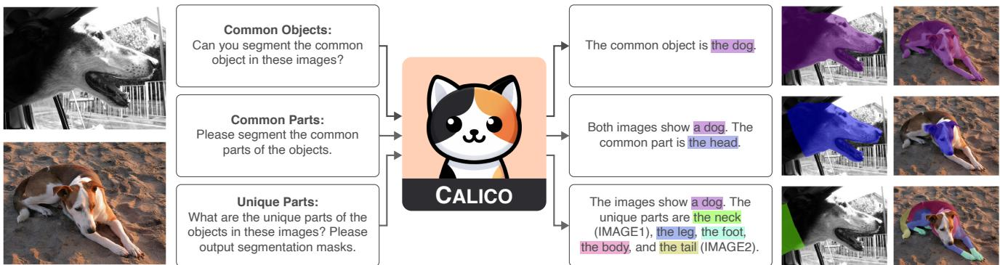
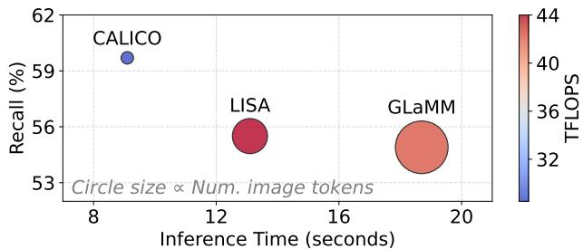
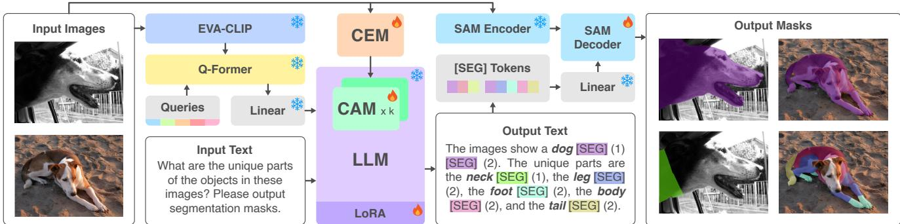
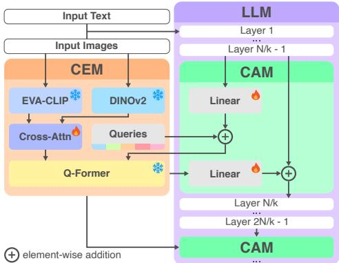
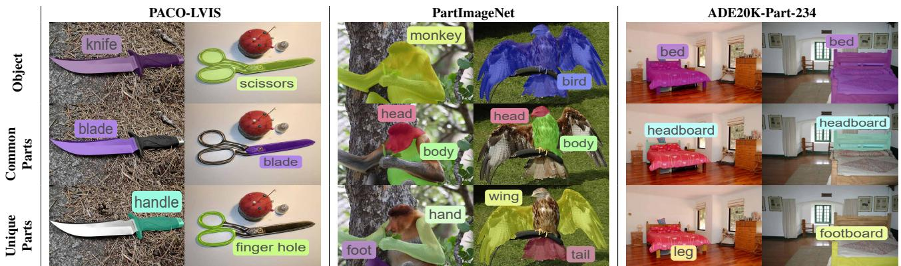
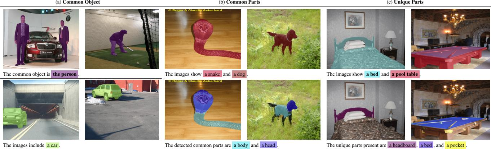
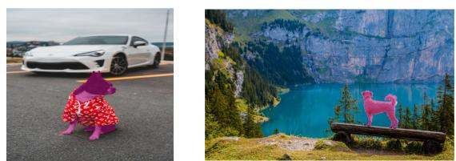
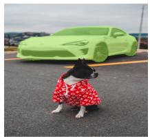
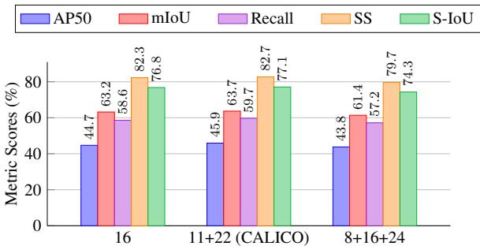

# CALICO: Part-Focused Semantic Co-Segmentation with Large Vision-Language Models

Kiet A. Nguyen Adheesh Juvekar Tianjiao Yu Muntasir Wahed Ismini Lourentzou University of Illinois Urbana-Champaign

{kietan2, adheesh2, ty41, mwahed2, lourent2}@illinois.edu https://plan-lab.github.io/calico

  
Figure 1. Multi-Image Part-focused Object Comparison with CALICO. Our pixel-grounded Large Vision-Language Model, CALICO, performs part-focused semantic co-segmentation, a newly introduced task where the goal is to identify, segment, and label common objects as well as common and unique object parts across multiple images.

## Abstract

Recent advances in Large Vision-Language Models (LVLMs) have enabled general-purpose vision tasks through visual instruction tuning. While existing LVLMs can generate segmentation masksfrom text promptsfor single images, they struggle with segmentation-grounded reasoning across images, especially atfiner granularities such as object parts. In this paper, we introduce the new task of part-focused semantic co-segmentation, which involves identifying and segmenting common objects and their constituent common and unique parts across images. To address this task, we present CALICO, the first LVLM designed for multi-image part-level reasoning segmentation. CAL-ICO features two key components, a novel Correspondence Extraction Module that identifies semantic part-level correspondences, and Correspondence Adaptation Modules that embed this information into the LVLM to facilitate multiimage understanding in a parameter-efficient manner. To support training and evaluation, we curate MIXEDPARTS, a large-scale multi-image segmentation dataset containing ∼2.4M samples across ∼44K images spanning diverse ob-

ject and part categories. Experimental results demonstrate that CALICO, with just 0.3% of its parameters finetuned, achieves strong performance on this challenging task.

## 1. Introduction

Analyzing objects by decomposing them into their constituent parts can enhance understanding of inter-object relationships both within and across categories. This partlevel reasoning is crucial for applications requiring detailed object comparisons, such as robotic manipulation, medica imaging, and educational tools. Detailed comparisons that identify shared and unique parts offer insights into the critical features and functions of objects. For example, while both spoons and forks have handles, this part is not centra to their primary functions. Instead, distinguishing the fork’s tines from the spoon’s bowl allows tasks like robotic grasping or visual comparisons to differentiate and interact with these objects based on their unique functions.

Designing effective methods to analyze multiple images featuring diverse objects by locating and identifying their shared and distinct parts presents an intriguing challenge. Given a pair of images containing similar objects, the goal is to generate segmentation masks for the shared or distinct parts (locate), establish one-to-one correspondences across images for comparative analysis (compare), and assign descriptive labels to the discovered parts (identify). We term this task part-focused semantic co-segmentation.

Existing research has explored various facets of this related granular task. Many works have investigated localized part learning [6, 7, 33, 42, 62, 67], focusing on segmenting parts within an object as a terminal task [6, 42] or as a means to support broader tasks like object or human parsing [57, 79]. However, these methods are not designed for multi-image comparisons, as the segmented parts from different images lack a consistent mapping of corresponding semantic components across images. Conversely, some research in this realm has tackled the related task of part co-segmentation, where models learn to segment objects across multiple images in a semantically consistent manner, despite variations in pose, shape, camera angle, etc. [2, 7, 16, 23, 37]. Yet, these approaches often require the number of part classes to be specified as input and struggle to identify unique parts between objects.

Recent work has shown a growing interest in leveraging LVLMs for object segmentation tasks [27, 50, 54, 64, 71, 72]. Following LISA [27], many methods introduce additional segmentation tokens [50, 54, 72], which contain mask embeddings of objects within an image. These tokens are then processed by a decoder to generate the final segmentation masks. Such methods have proven highly effective for unifying tasks like semantic segmentation and referring expression segmentation within a single architecture, thanks to the adaptability of LVLMs in handling diverse input and output types. While some of these models exhibit partial understanding of object parts [27, 50, 71], they are not designed for reasoning over parts across multiple images or for segmenting shared and unique parts between objects.

To this end, we introduce Component-Focused Adaptive Learning for Multi-Image Co-Localization of Objects (CALICO), a vision-language model designed to perform localized object comparison across image pairs. To the best of our knowledge, CALICO is the first LVLM trained for multi-image part-level co-segmentation. CAL-ICO augments a pretrained segmentation-based LVLM with parameter-efficient adapter modules to learn multi-image co-localization at multiple granularities. To extract partlevel semantic correspondence information between images, we propose a novel Correspondence Extraction Module, which employs a frozen DINOv2 encoder with strong semantic correspondence capabilities learned through selfsupervised training [5]. These correspondences are then injected into the pretrained LVLM via Correspondence Adaptation Modules applied at selected layers to facilitate interimage understanding. Due to the lightweight nature of these adaptive modules, the trainable parameters in CALICO represent only 0.3% (∼29M) of the entire architecture.

  
Figure 2. CALICO Efficiency. CALICO improves performance (e.g., recall) in part-focused co-segmentation while reducing TFLOPS by ∼32-35% and accelerating inference by ∼30-51% compared to SotA baselines, using 8-18× fewer image tokens.

To support training for this novel task, we introduce the Multi-Image Cross-Segmentation of Distinctive and Common Parts (MIXEDPARTS) dataset that contains diverse and logically comparable object pairs that enable CALICO to generalize across varied categories and visual details. Building on widely used, publicly available part segmentation datasets [18, 49, 65, 77, 78], we manually curate pairs of object classes that are logically comparable and share at least one common part. For instance, pairing a “chair” with an “ottoman” is meaningful since both belong to the category of seating furniture, making them more comparable than, e.g., a “chair” and a “microwave.” We then assemble image pairs based on these class pairings, enabling training for co-segmentation of not only the objects themselves but also their shared and unique parts across multiple images.

Since our work is the first to address part-focused semantic co-segmentation, we construct baselines by adapting publicly available pretrained models to this novel task. We conduct extensive experiments on MIXEDPARTS to evaluate the effectiveness of CALICO, including ablations to quantify the contributions of the proposed correspondence extraction and adaptation modules. CALICO outperforms all baselines on part-focused semantic co-segmentation, achieving a 6.3% relative improvement in mean IoU on MIXEDPARTS over the next best method, while using 18 times fewer image tokens, reducing TFLOPS by 32.6%, and accelerating inference by 51.3% (as shown in Figure 2). In summary, the contributions of our work are as follows:

t We introduce the novel task of part-focused semantic co-segmentation, which involves co-segmenting and labeling common and unique parts between objects across images for granular object comparison. To the best of our knowledge, this is the first work to formalize this multi-image object/part co-segmentation task.

t We propose CALICO, an LVLM for part-focused semantic co-segmentation. CALICO incorporates a novel Correspondence Extraction Module and parameterefficient Adaptation Modules to learn semantic correspondences and enable efficient co-segmentation.

t We curate MIXEDPARTS, a large-scale benchmark for part-focused semantic co-segmentation, featuring logically comparable objects and parts drawn from publicly available diverse part segmentation datasets.

t We establish strong baselines from publicly available pretrained models and conduct experiments to evaluate CALICO’s performance on MIXEDPARTS, including comprehensive ablations to analyze the contributions of our proposed modules.

## 2. Related Work

## 2.1. Prompting Image Segmentation

Image segmentation, a fundamental computer vision task, has garnered extensive research over the years, with seminal works [19, 25, 39] paving the way for modern approaches. Pretrained on large-scale data, SAM [26] has emerged as a leading foundation model for image segmentation, capable of interpreting diverse prompts and generating corresponding masks. However, despite its strong zeroshot performance, SAM lacks semantic labeling, limiting its practical use. SEEM [81] addresses this by introducing a joint image-text representation space inspired by LVLMs, enabling unified prompting and effective mask labeling. Still, both SAM and SEEM struggle with fine-grained understanding, such as object-part segmentation. Semantic-SAM [29] extends SAM by incorporating multi-level image embeddings tied to different prompt types for multigranularity understanding but, like SAM, lacks text labels. Recent works [27, 50, 54, 64] combine LVLMs with SAM to bridge language and mask understanding, achieving more robust segmentation and labeling capabilities. Building on these advances, CALICO integrates SAM with a finetuned pixel decoder to output segmentation masks with text labels. Unlike prior work focused on single-image segmentation, CALICO also enables multi-image multi-granularity understanding through object and part co-segmentation.

## 2.2. Part Segmentation

Part segmentation enables fine-grained understanding by decomposing objects into semantically meaningful parts. While numerous approaches have been proposed to address this task, many are tailored to specific domains [24, 69, 70, 80] or are constrained to closed-set vocabularies [12, 33, 42, 43]. A recent approach, VLPart [60], tackles open vocabulary part segmentation by utilizing a Mask R-CNN backbone [19] trained via contrastive learning to align predicted masks with CLIP text features [48], enabling the model to label any object-part. PartGLEE [32] adopts a Q-Former-based architecture [30] to achieve similar alignment of predicted masks with CLIP text features; however, in practice, the labels are constrained by the input to these models’ text encoders. Many recent works [27, 50, 54, 64, 71, 72] integrate the reasoning capabilities of LVLMs with segmentation models to augment visual understanding of the LVLMs. These models enable open-vocabulary object segmentation without being constrained to the input prompt. Most of these models, motivated by LISA [27], utilize LLaVA-based LVLMs [36] in tandem with a decoder to predict segmentation masks.

While several of these works can also segment object parts [27, 50, 71] – since their training data consists of large annotated datasets with part information – their part segmentation capabilities often lag behind their object segmentation capabilities. Additionally, they also require explicit mention of object parts in the input prompt for successful segmentation and fail to segment multiple parts of an object. Instead, each part must be individually specified, e.g., by requesting to “segment the leg of the chair,” to obtain the desired segmentation maps. In contrast, CAL-ICO augments a pretrained LVLM with object and part cosegmentation capabilities without the need for explicit partspecific prompts, simplifying user input requirements and allowing flexibility in instructing the model to infer and delineate various objects and parts across different images.

## 2.3. Object/Part Co-Segmentation

Co-segmentation aims to identify and segment common objects across multiple images. Early works [28, 73, 76] employ CNNs with fully supervised training or finetuning on co-segmentation datasets, while later works leverage the semantic understanding of CLIP [14] or finetune an LVLM on samples containing similar objects [47]. However, these methods do not extend to co-segmenting object parts. Conversely, part co-segmentation involves simultaneously segmenting corresponding object parts across multiple images. Previous methods tackle this task with unsupervised or selfsupervised learning [2, 7, 16, 23, 37]. DFF [8] employs matrix factorization on features from a pretrained CNN, while SCOPS [23] trains an encoder-decoder CNN with equivariance and semantic consistency losses for improved part co-segmentation. More recently, [2] shows that DINO features capture semantic and spatial correspondences useful for identifying similar parts across images.

While effective at discovering part-level correspondences, these methods lack the ability to assign semantic part labels or generate segmentation masks for unique parts. In this work, we introduce CALICO, a model that harnesses SAM’s segmentation capabilities and DINOv2’s semantic features [11, 45] to jointly perform part co-segmentation and labeling. By integrating LVLMs with co-segmentation, CALICO improves object-part reasoning across images with diverse scenes, generating both co-segmentation masks and semantic labels for unique and common parts.

  
Figure 3. Overview of the C Architecture for Part-Focused Semantic Co-Segmentation. C employs a Q-Former cross attention module to query efficient image embeddings from a pretrained image encoder, which are passed as visual tokens into a Vicunabased LLM. We extract [SEG] tokens from the output text, which are used to prompt a SAM decoder to produce corresponding segmenta tion masks. We propose two modules: the Correspondence Extraction Module (CEM), which captures semantic-rich part correspondences, and Correspondence Adaptation Modules (CAMs), which inject this information into the LVLM. CEM/CAM details in Figure 4.

## 3. Method

## 3.1. Problem Definition

In part-focused semantic co-segmentation, the objective is to generate a set of segmentation masks for a given set of input images. Here, each mask corresponds to an input image and indicates the pixels containing either the common object across all images or the shared and distinct parts belonging to semantically similar objects $( i . e . ,$ intuitively comparable objects) within these images. Formally, given $N _ { I }$ input images ${ \bf X } _ { \mathrm { i m a g e } } = \{ { \bf X } _ { \mathrm { i m a g e } 1 } , \cdot \cdot \cdot , { \bf X } _ { \mathrm { i m a g e } N _ { I } } \}$ , where each $\bar { \mathbf { X } } _ { \mathrm { i m a g e \it { i } } } \mathbf { \bar { \Pi } } \mathbf { \bar { \Pi } } \mathbf { \bar { \Pi } } \mathbf { R } ^ { 3 \times H _ { i } ^ { \circ } \times W }$ i has height H and width $W _ { i }$ , the goal is to train a co-segmentation model $\mathcal { F } : \mathbf { X } _ { \mathrm { i m a g e } } \mapsto \mathbf { M }$ to obtain a set of mask sets $\mathbf { M } = \{ \mathbf { M } _ { 1 } , \cdots , \mathbf { M } _ { N _ { I } } \}$ , with each $\mathbf { M } _ { i } = \left\{ \left( \mathbf { m } _ { i 1 } , c _ { i 1 } \right) , \cdots , \left( \mathbf { m } _ { i M _ { j } } , c _ { i M _ { j } } \right) \right\}$ containing $M _ { j }$ masks and corresponding class labels associated with image i. Here, each binary mask $\mathbf { m } _ { i k } \in \{ 0 , 1 \} ^ { H _ { i } \times W _ { i } }$ assigns each pixel to a value of 1 if it covers the visual element with semantic class label $c _ { i k }$ and 0 otherwise. We denote $\mathbf { c } _ { i } = \left\{ c _ { i 1 } , \cdot \cdot \cdot , c _ { i M _ { j } } \right\}$ as the set of class labels corresponding to image i. When generating common object or part masks across all images, we want $\bigcap _ { i = 1 } ^ { M _ { j } } \mathbf { c } _ { i } \neq \emptyset$ , whereas when obtaining unique masks, we want $\mathbf { c } _ { i } \cap \mathbf { c } _ { i ^ { \prime } } = \emptyset \ \forall i \neq$ $i ^ { \prime } , 1 \le i , i ^ { \prime } \le M _ { j }$ To learn a model $\mathcal { F }$ that can address this multifaceted task, we opt for an LVLM-based solution, leveraging LLMs’ ability to tackle multiple tasks with a single architecture and their flexibility in input/output processing. The rest of this section details our model’s architecture.

## 3.2. CALICO Architecture

CALICO is an LVLM designed to generate multiple segmentation masks per image across a series of images, highlighting both shared and distinct regions among them. In addition to its core functionality, our model incorporates modules aimed at integrating semantic correspondences between similar objects across images, alongside multi-image understanding and segmentation. As illustrated in Figure 3, the architecture is composed of a Vicuna-based LLM M in tandem with a vision module I and a vision-to-language projection layer, which projects image embeddings from I into M’s language space.

Interleaved Vision-Language Inputs. CALICO is trained to understand interleaved multi-image inputs. Given $N _ { I }$ input images $\mathbf { X } _ { \mathrm { i m a g e } } \ \in \ \mathbb { R } ^ { N _ { I } \times 3 \times H \times \bar { W } }$ and a vision module $\mathcal { T } : \mathbb { R } ^ { \bar { 3 } \times H \times W } \mapsto \mathbb { R } ^ { S _ { I } \times D _ { I } }$ , we obtain image embeddings $\mathbf { X } _ { \mathrm { e m b e d } } \in \mathbb { R } ^ { N _ { I } \times S _ { I } \times D _ { I } }$ by ${ \bf X } _ { \mathrm { e m b e d } } = \mathcal { T } \left( { \bf X } _ { \mathrm { i m a g e } } \right)$ , where $S _ { I }$ and $D _ { I }$ are the image embedding sequence length and hidden size, respectively. We then project these embeddings into the language model space with hidden size D via $\mathbf { \bar { f } _ { i m a g e } } : \mathbb { R } ^ { D _ { I } } \mapsto \mathbf { \bar { \mathbb { R } } } ^ { \mathbf { \bar { D } } }$ to get

$$
{ \bf I } ^ { 0 } = f _ { \mathrm { i m a g e } } \left( { \bf X } _ { \mathrm { e m b e d } } \right) = \left\{ { \bf I } _ { 1 } ^ { 0 } , \cdot \cdot \cdot , { \bf I } _ { N _ { I } } ^ { 0 } \right\} \in \mathbb { R } ^ { N _ { I } \times S _ { I } \times D } .\tag{1}
$$

The final input $\mathbf { T } ^ { 0 } \in \mathbb { R } ^ { S \times D }$ into M is composed of interleaved text and image tokens $\mathbf { T } ^ { 0 } = \{ \mathbf { t } _ { 1 } ^ { 0 } , \cdot \cdot \cdot , \mathbf { v } _ { 1 1 } ^ { 0 } ,$ $\cdots , { \bf v } _ { 1 S _ { I } } ^ { 0 } , \cdots , \ t _ { i } ^ { 0 } , \cdots , \bar { \bf v } _ { j 1 } ^ { 0 } , \cdots , { \bf v } _ { j S _ { I } } ^ { 0 } , \cdots , \bar { \bf t } _ { S _ { T } } ^ { 0 } \}$ , where $\mathbf { t } _ { i } ^ { 0 }$ is the ith embedded text token at layer $0 \left( 1 \leq i \leq S _ { T } \right)$ $\mathbf { I } _ { j } ^ { \mathrm { i } } = \left\{ \mathbf { v } _ { j 1 } ^ { 0 } , \cdots , \mathbf { v } _ { j S _ { I } } ^ { 0 } \right\}$ are the $S _ { I }$ tokens pertaining to the $j ^ { \mathrm { t h } }$ image, and the superscript k of $\mathbf { T } ^ { k }$ represents the LLM output at layer k or input at layer $k + 1$ . The sequence length S of $\mathbf { T } ^ { 0 }$ thus sums up the text and image lengths, i.e., $S = S _ { T } + N _ { I } \times S _ { I }$ . Finally, we obtain predicted outputs from the N-layered LLM by $\hat { \mathbf { T } } ^ { N } = \mathcal { M } \left( \mathbf { T } ^ { 0 } \right)$ . In practice, we encourage the LLM to develop comprehensive multimodal understanding through prompts such as “The <image> (IMAGE1) and <image> (IMAGE2) provide an overview of the pictures.

Can you segment the common object in these images?”, where the <image> tokens are replaced with the projected embeddings of the corresponding image. Each image is also associated with a unique identifier (e.g., IMAGE1, IMAGE2) for more convenient and clear reference, avoiding any potential ambiguity from using ordinal terms to refer to individual images in multi-image settings, e.g., “the first” or “the second” image.

Vision Module. Observing the effectiveness and efficiency of BLIP-2’s Q-Former cross-attention mechanism [30], especially in multi-image settings [31], we propose using Q-Former in tandem with a strong CLIP vision encoder [48, 61] to extract visual embeddings from the input images. Whereas projecting CLIP embeddings directly into the language model space preserves their long sequence lengths (e.g., 256 or 576 tokens [27, 50]) and thus increasing compute, Q-Former uses a much shorter set of learnable query tokens to extract visual information (e.g., 32 tokens [30, 31]). Formally, our vision module I consists of an EVA-CLIP-g model $\mathcal { C } : \mathbb { R } ^ { 3 \times H \times W } \mapsto \mathbb { R } ^ { S _ { C } \times D _ { C } }$ and a Q-Former cross-attention module Q alongside a set of learnable query tokens $\mathbf { q } ~ \in ~ \mathbb { R } ^ { S _ { I } \times D _ { I } }$ We first pass input images $\mathbf { X } _ { \mathrm { i m a g e } }$ through the EVA-CLIP global encoder to obtain $\mathbf { X } _ { \mathrm { g l o b a l } } = \mathcal { C } \left( \bar { \mathbf { X } } _ { \mathrm { i m a g e } } \right) \in \mathbb { R } ^ { N _ { I } \times S _ { C } \times D _ { C } }$ . We then obtain our final visual embeddings by querying Q using q as the query and $\mathbf { X } _ { \mathrm { g l o b a l } }$ as the key and value:

$$
\mathbf { X } _ { \mathrm { e m b e d } } = \mathcal { Q } \left( \mathbf { q } , \mathbf { X } _ { \mathrm { g l o b a l } } \right) \in \mathbb { R } ^ { N _ { I } \times S _ { I } \times D _ { I } } .\tag{2}
$$

Pixel-Grounded Outputs. To enable pixel-level grounding, we augment the model’s vocabulary with the segmentation token [SEG] and teach it to output grounding tags $\mathrm { \tt S p > }$ and $< / \mathrm { p } >$ , following recent work [50]. Through supervision, the model learns to ground a noun phrase associated with the following segmentation token by enclosing it in the grounding tags, which immediately precede the corresponding [SEG] token (e.g., “The unique parts ${ \scriptscriptstyle \bigcirc } \mathbf { \underline { { f } } }$ the objects are 
 the seat cushion $< / \mathrm { p } >$ [SEG]

[SEG] (IMAGE2).”). We append the image identifiers immediately following [SEG] tokens to distinguish between tokens belonging to different images. To transform the [SEG] tokens $\mathbf { S } ~ = ~ \{ \mathbf { S } _ { 1 } , \cdot \cdot \cdot , \mathbf { S } _ { N _ { I } } \} ~ \subset ~ \mathbf { T } ^ { K }$ , where each $\mathbf { S } _ { i } ~ \in ~ \mathbb { R } ^ { S _ { j } \times D }$ corresponds to the set of $S _ { j }$ predicted masks associated with image i, into segmentation mask sets $\hat { \mathbf { M } } = \left\{ \hat { \mathbf { M } } _ { 1 } , \cdot \cdot \cdot , \hat { \mathbf { M } } _ { N _ { I } } \right\}$ , our architecture incorporates a Transformer-based grounding model [26], composed of a grounding encoder $\mathcal { G }$ and a pixel decoder D. The input images $\mathbf { X } _ { \mathrm { i m a g e } }$ are passed through the frozen encoder to obtain grounding embeddings $\mathbf { X } _ { \mathrm { g r o u n d } }$ as the vision signal for the decoder by $\mathbf { X } _ { \mathrm { g r o u n d } } = \mathcal { G } \left( \mathbf { \bar { X } } _ { \mathrm { i m a g e } } \right) \in \mathbb { R } ^ { N _ { I } \times S _ { D } \times \mathbf { \bar { D } } _ { D } }$ For an encoded image $\mathbf { X } _ { \mathrm { g r o u n d } i }$ , the tokens in $\mathbf { S } _ { i }$ act as prompts for the finetuned pixel decoder after being passed through a projection layer $f _ { \mathrm { s e g m e n t a t i o n } } : \mathbb { R } ^ { D } \mapsto \mathbb { R } ^ { D _ { D } }$ Finally, the decoder $\mathcal { D }$ produces binary segmentation masks accordingly by:

$$
\begin{array} { r } { \hat { \bf M } _ { i } = \mathcal { D } \left( { \bf X } _ { \mathrm { g r o u n d } i } , f _ { \mathrm { s e g m e n t a t i o n } } ( { \bf S } _ { i } ) \right) . } \end{array}
$$

## 3.3. Correspondence Extraction Module (CEM)

(3)

Image features obtained from self-supervised Vision Transformers (ViTs) [5, 11, 45] have been shown to exhibit rich semantic information at part-level granularity across similar, yet distinct object categories [2, 5, 75]. Motivated by these findings, we design a fusion module to extract such semantic information and facilitate part correspondence learning within the model. We define E to be the semantic extraction process using a self-supervised ViT [5] similarly to [2], and obtain semantic embeddings $\mathbf { X } _ { \mathrm { s e m a n t i c } } \in \mathbb { R } ^ { N _ { I } \times \bar { S } _ { S } \times D _ { S } }$ where $S _ { S }$ and $D _ { S }$ are the sequence length and hidden size of the semantic image embeddings, respectively. We then use $\mathbf { X } _ { \mathrm { s e m a n t i c } }$ as the key and value for a cross-attention extraction mechanism A with the queried EVA-CLIP embedding $\mathbf { X } _ { \mathrm { g l o b a l } }$ to get semantic-rich global embeddings $\mathbf { X } _ { \mathrm { g l o b a l } } ^ { \prime } .$ This process is formalized by:

  
Figure 4. Overview of our Correspondence Extraction and Correspondence Adaptation Modules. In CALICO, k CAMs are placed at every $\frac { N } { k }$ layers in the N-layered LLM.

$$
\mathbf { X } _ { \mathrm { g l o b a l } } = \mathcal { C } \left( \mathbf { X } _ { \mathrm { i m a g e } } \right) \qquad \in \mathbb { R } ^ { N _ { I } \times S _ { C } \times D _ { C } }\tag{4}
$$

$$
\mathbf { X } _ { \mathrm { s e m a n t i c } } = { \mathcal { E } } \left( \mathbf { X } _ { \mathrm { i m a g e } } \right) \qquad \in \mathbb { R } ^ { N _ { I } \times S _ { S } \times D _ { S } }\tag{5}
$$

$$
\begin{array} { r l } { \mathbf { X } _ { \mathrm { g l o b a l } } ^ { \prime } = \mathcal { A } \left( \mathbf { X } _ { \mathrm { g l o b a l } } , \mathbf { X } _ { \mathrm { s e m a n t i c } } \right) } & { { } \in \mathbb { R } ^ { N _ { I } \times S _ { C } \times D _ { C } } } \end{array}\tag{6}
$$

This fusion process produces strong semantic embeddings $\mathbf { X } _ { \mathrm { g l o b a l } } ^ { \prime }$ , which are subsequently utilized for the visual extraction process performed by the Correspondence Adaptation Modules, detailed in the next section.

## 3.4. Correspondence Adaptation Module (CAM)

Due to the high cost of training LLMs with billions of parameters, many works have taken advantage of adaptive modules, with sizes merely a fraction of the LLMs’ original sizes, by freezing the LLMs and only training the modules for downstream tasks [20, 21, 31, 74]. These works have demonstrated strong performance and high efficiency while also avoiding catastrophic forgetting [53, 63]. In particular, VPG-C [31] effectively exhibits the capability to adapt an LLM to multi-image reasoning while only accounting for 0.09% of the entire model’s parameter count. Inspired by this finding, we leverage VPG-C for multi-image correspondence adaptation. Specifically, at select layers $l \in L ,$ we linearly project the last input token $\mathbf { t } _ { S _ { T } } ^ { l } \in \mathbb { R } ^ { D }$ via $f _ { \mathrm { a d a p t a t i o n } } : \mathbb { R } ^ { D } \to \mathbb { R } ^ { D _ { I } }$ to get an instruction-specific guidance embedding. We then use this embedding to enrich the query tokens q and obtain new query tokens by:

  
Figure 5. Example Image Pairs in MIXEDPARTS with Common Objects, Common Parts, and Unique Parts segmented and labeled. Each column represents a different image pair, derived from a set of diverse datasets with various levels of detail, PACO-LVIS, PartIma geNet, and ADE20K-Part-234, covering both rigid and non-rigid objects and parts. Each image pair is displayed across 3 rows to illustrate (i) the (possibly common or different) object(s), (ii) the common object part(s), and (iii) the unique object part(s) in each pair.

$$
\mathbf { q } ^ { \prime } = \mathbf { q } + f _ { \mathrm { a d a p t a t i o n } } \left( \mathbf { t } _ { S _ { T } } ^ { l } \right) \in \mathbb { R } ^ { S _ { I } \times D _ { I } } .\tag{7}
$$

These context-guided query tokens are finally used to extract semantic- and context-rich visual information from $\mathbf { X } _ { \mathrm { g l o b a l } } ^ { \prime }$ from the Correspondence Extraction Module via:

$$
{ \bf X } _ { \mathrm { e m b e d } } ^ { \prime } = \mathcal { Q } \left( { \bf q } ^ { \prime } , { \bf X } _ { \mathrm { g l o b a l } } ^ { \prime } \right) \in \mathbb { R } ^ { N _ { I } \times S _ { I } \times D _ { I } } .\tag{8}
$$

Finally, these embeddings are projected into the language model space via $f _ { \mathrm { i n t e g r a t i o n } } : \mathbb { R } ^ { D _ { I } } \mapsto \mathbb { R } ^ { D }$ and added into the visual portions of the input $\mathbf { T } ^ { l }$ to layer l of the LLM by:

$$
\mathbf { I } _ { \mathrm { f u s e d } } ^ { l } = \mathbf { I } ^ { l } + f _ { \mathrm { r e i n t e g r a t i o n } } \left( \mathbf { X } _ { \mathrm { e m b e d } } ^ { \prime } \right) \in \mathbb { R } ^ { N _ { I } \times S _ { I } \times D } .\tag{9}
$$

This process facilitates the integration of embeddings imbued with strong context and semantic information directly into CALICO. In practice, we inject our Correspondence Adaptation Modules to layers $l \in L = \{ 1 1 , 2 2 \}$ , which is a third and two-thirds of the way, respectively, through a 32- layer LLM, to learn semantic correspondence at multiple granularities (e.g., object and part). Ablations on different layers L in Section 5.2 validate our design choice.

## 3.5. Training Objective

Following prior work [27, 50], we optimize a combined training loss ${ \mathcal { L } } = \lambda _ { \mathrm { t e x t } } { \mathcal { L } } _ { \mathrm { t e x t } } + { \mathcal { L } } _ { \mathrm { m a s k } }$ , where $\mathcal { L } _ { \mathrm { t e x t } }$ is the nexttoken prediction loss and $\mathcal { L } _ { \mathrm { m a s k } }$ is the segmentation loss. The weights $\lambda _ { \mathrm { t e x t } } , \lambda _ { \mathrm { f o c a l } } .$ , and $\lambda _ { \mathrm { D i c e } }$ control the contribution of each loss component. Here, $\mathcal { L } _ { \mathrm { t e x t } }$ is a causal crossentropy (CE) loss computed from the predicted and rightshifted ground truth tokens $\hat { \mathbf { T } } ^ { K }$ and y,

$$
\mathcal { L } _ { \mathrm { t e x t } } = \mathrm { C E } \left( \hat { \mathbf { T } } ^ { K } , \mathbf { y } \right) ,\tag{10}
$$

while $\mathcal { L } _ { \mathrm { m a s k } }$ combines a focal loss [35] and a DICE loss [44] derived from predicted and ground truth masks Mˆ and M,

$$
\mathcal { L } _ { \mathrm { m a s k } } = \lambda _ { \mathrm { f o c a l } } \mathcal { L } _ { \mathrm { f o c a l } } \left( \hat { \mathbf { M } } , \mathbf { M } \right) + \lambda _ { \mathrm { D i c e } } \mathcal { L } _ { \mathrm { D i c e } } \left( \hat { \mathbf { M } } , \mathbf { M } \right) .\tag{11}
$$

## 4. MIXEDPARTS Dataset

Although multi-image datasets of various scales are available, they present combinations of limitations that make them unsuitable for the part-focused semantic cosegmentation task. These include the absence of finegrained masks for segmentation [22, 31, 41, 58, 59], datasets being too small or domain-specific to facilitate generalizable LVLM training despite containing localized labels [3, 15, 55, 56, 66], or the lack of part-level information altogether [47, 55]. To address these gaps, we introduce MIXEDPARTS, a new dataset curated from publicly available sources to support training and evaluation of partfocused semantic co-segmentation models. Figure 5 provides examples from our dataset, highlighting its diversity in object categories and visual details. Appendix A describes the dataset construction process and source datasets, while Appendix B summarizes dataset statistics.

## 5. Experiments

Metrics. We evaluate CALICO’s performance on the MIXEDPARTS dataset, reporting the Average Precision (AP50), mean Intersection over Union (mIoU), and Recall, which assess the model’s segmentation performance. To evaluate its semantic label generation capability, following existing works [9, 71], we employ Semantic Similarity (SS) and Semantic IoU (S-IoU). Implementation details and descriptions of the evaluation metrics can be found in Appendix C.2. We perform evaluation on ∼1K image pairs, ensuring an equal distribution of image pairs from each original dataset and maintaining equal representation across all tasks. We report performance on all three subtasks of part-focused semantic co-segmentation – common objects, common parts, unique parts – and their average, which reflects overall performance on the MIXEDPARTS test set.

  
Figure 6. Qualitative Results. CALICO can co-segment (a) common objects, (b) shared parts between objects from different classes, and (c) distinct parts unique to each object. Our model demonstrates pixel-grounded understanding of various non-rigid (e.g., humans, animals) and rigid objects (e.g., car, bed), including less common objects and their parts (e.g., the bed and pocket of a pool table).

<table><tr><td>Method</td><td>AP50</td><td>mIoU</td><td>Recall</td><td>SS</td><td>S-IoU</td></tr><tr><td>Cascade [1, 22, 27]</td><td>5.7 1.2</td><td>27.9</td><td>19.0</td><td>32.2</td><td>14.8</td></tr><tr><td>Multi-Image PartGLEE [32] Multi-Image VLPart [60]</td><td>13.4</td><td>29.3 42.8</td><td>9.7 34.6</td><td>78.5 59.1</td><td>63.3 46.5</td></tr><tr><td>Multi-Image GLaMM [50]</td><td>42.9</td><td>59.9</td><td>54.9</td><td>76.8</td><td>71.2</td></tr><tr><td>Multi-Image LISA [27]</td><td>41.4</td><td>59.7</td><td>55.5</td><td>78.7</td><td>72.5</td></tr><tr><td>CALICO (ours)</td><td>45.9</td><td>63.7</td><td>59.7</td><td>82.7</td><td>77.1</td></tr></table>

Table 1. Experimental Results on MIXEDPARTS. The first three metrics are segmentation-based, while the last two are text-based. CALICO outperforms baselines across all metrics.

Baselines. To the best of our knowledge, this is the first effort to tackle multi-image part-focused co-segmentation with part label identification. There is thus a lack of baselines for this new task, which we rectify by designing our own baselines from strong pretrained models in the semantic segmentation literature. Our baselines comprise three zero-shot approaches: one modular method (Cascade) that combines pretrained models [1, 22, 27], each excelling at a different aspect of our novel task, and two methods that leverage state-of-the-art part segmentation models to compare their outputs (PartGLEE [32] and VLPart [60]). Additionally, we report results for two finetuned segmentationbased LVLMs (GLaMM [50] and LISA [27]). Implementation details for all models are available in Appendix C.

## 5.1. Experimental Results

Table 1 presents results comparing CALICO against our baselines. CALICO demonstrates superior performance on all metrics compared to all zero-shot and finetuned approaches, achieving relative gains of 7.0%, 6.3%, and 7.6% on segmentation-based metrics AP50, mIoU, and Recall, respectively, and 5.0% and 6.3% on text-based metrics SS and S-IoU. These performance gains come with no overhead; in fact, as shown in Figure 2, CALICO demonstrates high efficiency compared to LISA and GLaMM in terms of TFLOPS and inference time. Details can be found in Appendix D.1.

The cascade method fails to perform well on our task, highlighting the task’s challenging nature and suggesting that it cannot be addressed merely by combining standalone modules. Although PartGLEE and VLPart demonstrate strong zero-shot single-image object-part segmentation performance, they struggle with our multi-image tasks. In particular, PartGLEE produces 29 object predictions per image on average, increasing its likelihood of matching ground truth labels; yet CALICO’s text scores are superior despite focusing on a single most relevant object in context. When finetuned on MIXEDPARTS, Multi-Image GLaMM and LISA exhibit performance improvements compared to the zero-shot baselines. However, GLaMM still lags behind CALICO’s performance despite both initialized from the same weights, demonstrating the effectiveness of our proposed modules, which we further ablate in Section 5.2.

Qualitative results in Figure 6 showcase CALICO’s strong pixel-level understanding across all three tasks in part-focused semantic co-segmentation. Our model effectively localizes both non-rigid objects (e.g., humans, animals) and rigid ones (e.g., cars, beds), and demonstrates part-level reasoning even for less common object classes and their parts, such as the bed and pocket of a pool table. Furthermore, Figure 7 illustrates CALICO’s contextual understanding, where different image pairings prompt the model to segment different objects accordingly, rather than defaulting to the most salient object in each image. Additional experiments are detailed in Appendix D.

## 5.2. Ablations

CALICO Components. We perform ablations to assess the contribution of each component in CALICO, including the Correspondence Extraction Module (CEM) and the Correspondence Adaptation Module (CAM), alongside Q-

The images show a dog .  

  
The images include a car .  
Figure 7. CALICO In Context. CALICO outputs are highly context-driven when distinguishing objects across images, despite variations in angle, size, saliency, etc.

Former and DINOv2. Table 2 reports results for CALICO variants: without Q-Former (w/o Q-Former), without DI-NOv2 in CEM (w/o DINO), without CEM (w/o CEM), without CAMs (w/o CAM), or removing both (w/o CEM w/o CAM). Specifically, the w/o CEM variant fuses each LVLM layer’s image embeddings with only the previous layer’s last hidden state, while w/o CAM injects CEM features without fusing them with the last hidden state. In the w/o DINO setting, no cross-attention is applied, as there are no DINOv2 features to fuse with EVA-CLIP. Since our CEM and CAM modules are designed for models with Q-Formers, we approximate the w/o Q-Former variant using a linear projection, similar to the linear ablation in [31].

Ablation results show that each proposed module contributes to CALICO’s ability to accurately co-segment and identify common objects, common parts, and unique parts. Firstly, removing Q-Former – and thus disabling most of CAM and CEM – leads to a substantial drop in performance compared to CALICO, underscoring its importance within our model architecture. Removing CEM results in a decrease in performance across all metrics relative to CAL-ICO and demonstrates comparable performance to the “w/o DINO” variant, highlighting the critical role of both DI-NOv2 and CEM in CALICO. CEM substantially contributes to segmentation performance as this module enables the model to learn semantic relationships in multi-image contexts. Excluding the CAM modules leads to a decline in labeling performance, suggesting that CAM facilitates the integration of image-derived features into the language space. Interestingly, keeping CAM while removing CEM results in worse performance than removing both, indicating that CAM may introduce redundant or uninformative features when not guided by external signals from CEM. In contrast, when CEM is present, removing CAM still outperforms the variant without both modules, and full CALICO achieves the best results. This demonstrates that CAM is most beneficial when there are external semantic signals for the part-focused semantic co-segmentation task.

  
Figure 8. Ablations on CAM layer injection.

<table><tr><td>Setting</td><td>AP50</td><td>mIoU</td><td>Recall</td><td>SS</td><td>S-IoU</td></tr><tr><td>w/o Q-Former</td><td>38.5</td><td>59.2</td><td>44.8</td><td>64.5</td><td>55.6</td></tr><tr><td>w/o DINO</td><td>43.9</td><td>61.7</td><td>57.1</td><td>80.2</td><td>74.5</td></tr><tr><td>w/o CEM</td><td>43.6</td><td>61.6</td><td>57.5</td><td>80.8</td><td>75.2</td></tr><tr><td>w/o CAM</td><td>45.9</td><td>63.3</td><td>59.7</td><td>82.0</td><td>76.5</td></tr><tr><td>w/o CEM w/o CAM</td><td>44.1</td><td>62.7</td><td>58.1</td><td>81.6</td><td>76.3</td></tr><tr><td>CALICO</td><td>45.9</td><td>63.7</td><td>59.7</td><td>82.7</td><td>77.1</td></tr></table>

Table 2. Ablations on CALICO Components, including Q-Former, DINOv2, the Correspondence Extraction Module, and the Correspondence Adaptation Modules.

CALICO Injecting CAMs. We perform further ablations to examine the efficacy of injecting 2 evenly spaced Correspondence Adaptation Modules (CAM) into our CALICO LVLM, and present results in Figure 8. Past works [31, 68] have demonstrated the effectiveness of using or injecting information at the intermediate layer $\frac { K } { 2 }$ as guidance for learning. Since our task involves multimodal understanding at multiple granularities (object and part), we use 2 evenly spaced layers to incorporate semantic features at different levels of the LVLM’s learning, encouraging the model to focus on various object-part correspondences. This results in the best segmentation and labeling performance compared to the 1-layer or 3-layer variants.

## 6. Conclusion

This paper introduces the novel task of part-focused semantic co-segmentation, which involves the segmentation of common and unique parts across multiple images, laying the groundwork for future research in enhancing the capability of Large Vision-Language Models (LVLMs) to analyze and interpret complex visual data in a granular manner. To solve this task, we propose CALICO, an LVLM that incorporates a novel correspondence extraction module and an adaptation module to handle multi-image part relationships. Experiments conducted on the newly curated MIXEDPARTS dataset demonstrate that CALICO can effectively identify and segment common/unique parts with high accuracy, outperforming existing models.

## Acknowledgments

This research is based upon work supported by U.S. DARPA ECOLE Program No. HR00112390062 and U.S. DARPA SciFy Program No. HR001125C0303. The views and conclusions contained herein are those of the authors and should not be interpreted as necessarily representing the official policies, either expressed or implied, of DARPA or the U.S. Government. The U.S. Government is authorized to reproduce and distribute reprints for governmental purposes notwithstanding any copyright annotation therein. This work used the Delta GPUs provided by the National Center for Supercomputing Applications through allocations CIS240752, CIS240817, and CIS250130 from the Advanced Cyberinfrastructure Coordination Ecosystem: Services & Support (ACCESS, Boerner et al. [4]) program, supported by National Science Foundation grants #2138259, #2138286, #2138307, #2137603, and #2138296.

## References

[1] Josh Achiam, Steven Adler, Sandhini Agarwal, Lama Ahmad, Ilge Akkaya, Florencia Leoni Aleman, Diogo Almeida, Janko Altenschmidt, Sam Altman, Shyamal Anadkat, et al. GPT-4 technical report. arXiv preprint arXiv:2303.08774, 2023. 7, 2, 5

[2] Shir Amir, Yossi Gandelsman, Shai Bagon, and Tali Dekel. Deep ViT features as dense visual descriptors. In Workshop Proceedings of the European Conference on Computer Vision (ECCVW) What is Motion For?, 2022. 2, 3, 5

[3] Dhruv Batra, Adarsh Kowdle, Devi Parikh, Jiebo Luo, and Tsuhan Chen. iCoseg: Interactive co-segmentation with intelligent scribble guidance. In Proceedings ofthe IEEE Computer Society Conference on Computer Vision and Pattern Recognition, 2010. 6

[4] Timothy J Boerner, Stephen Deems, Thomas R Furlani, Shelley L Knuth, and John Towns. ACCESS: Advancing innovation: Nsf’s advanced cyberinfrastructure coordination ecosystem: Services & support. In 2023 Practice and Experience in Advanced Research Computing, PEARC 2023, pages 173–176. Association for Computing Machinery, 2023. 9

[5] Mathilde Caron, Hugo Touvron, Ishan Misra, Herve J´ egou,´ Julien Mairal, Piotr Bojanowski, and Armand Joulin. Emerging properties in self-supervised vision transformers. In Proceedings of the IEEE/CVF International Conference on Computer Vision (CVPR), 2021. 2, 5

[6] Jang Hyun Cho, Philipp Krahenb¨ uhl, and Vignesh Ra-¨ manathan. PartDistillation: Learning parts from instance segmentation. In Proceedings of the IEEE/CVF Conference on Computer Vision and Pattern Recognition (CVPR), 2023. 2

[7] Subhabrata Choudhury, Iro Laina, Christian Rupprecht, and Andrea Vedaldi. Unsupervised part discovery from contrastive reconstruction. In Proceedings ofthe Conference on Neural Information Processing Systems (NeurIPS), 2021. 2, 3

[8] Edo Collins, Radhakrishna Achanta, and Sabine Susstrunk. Deep feature factorization for concept discovery. In Proceedings of the European Conference on Computer Vision (ECCV), 2018. 3

[9] Alessandro Conti, Enrico Fini, Massimiliano Mancini, Paolo Rota, Yiming Wang, and Elisa Ricci. Vocabulary-free image classification. In Proceedings of the Conference on Neural Information Processing Systems (NeurIPS), 2023. 6, 3

[10] Wenliang Dai, Junnan Li, Dongxu Li, Anthony Meng Huat Tiong, Junqi Zhao, Weisheng Wang, Boyang Li, Pascale Fung, and Steven Hoi. InstructBLIP: Towards generalpurpose vision-language models with instruction tuning, 2023. 2

[11] Timothee Darcet, Maxime Oquab, Julien Mairal, and Piotr´ Bojanowski. Vision transformers need registers. In Proceedings of the International Conference on Learning Representations (ICLR), 2023. 3, 5

[12] Daan de Geus, Panagiotis Meletis, Chenyang Lu, Xiaoxiao Wen, and Gijs Dubbelman. Part-aware panoptic segmenta tion. In Proceedings of the IEEE/CVF Conference on Com puter Vision and Pattern Recognition (CVPR), 2021. 3

[13] Jia Deng, Wei Dong, Richard Socher, Li-Jia Li, Kai Li, and Li Fei-Fei. Imagenet: A large-scale hierarchical image database. In Proceedings of the IEEE/CVF Conference on Computer Vision and Pattern Recognition (CVPR), 2009. 1

[14] Xin Duan, Yan Yang, Liyuan Pan, and Xiabi Liu. LCCo: Lending CLIP to co-segmentation. Pattern Recognition, page 111252, 2024. 3

[15] Alon Faktor and Michal Irani. Co-segmentation by compo sition. In Proceedings of the IEEE/CVF International Con ference on Computer Vision (ICCV), 2013. 6

[16] Qingzhe Gao, Bin Wang, Libin Liu, and Baoquan Chen. Un supervised co-part segmentation through assembly. In Pro ceedings ofthe International Conference on Machine Learn ing (ICML), 2021. 2, 3

[17] Agrim Gupta, Piotr Dollar, and Ross Girshick. LVIS: A dataset for large vocabulary instance segmentation. In Proceedings of the IEEE/CVF Conference on Computer Vision and Pattern Recognition (CVPR), 2019. 1

[18] Ju He, Shuo Yang, Shaokang Yang, Adam Kortylewski, Xiaoding Yuan, Jie-Neng Chen, Shuai Liu, Cheng Yang, Qihang Yu, and Alan Yuille. PartImageNet: A large, high quality dataset of parts. In Proceedings ofthe European Con ference on Computer Vision (ECCV), 2022. 2, 1

[19] Kaiming He, Georgia Gkioxari, Piotr Dollar, and Ross Gir-´ shick. Mask R-CNN. In Proceedings of the IEEE/CVF International Conference on Computer Vision (ICCV), 2017. 3, 2

[20] Edward J Hu, Phillip Wallis, Zeyuan Allen-Zhu, Yuanzhi Li, Shean Wang, Lu Wang, Weizhu Chen, et al. LoRA: Lowrank adaptation of large language models. In Proceedings of the International Conference on Learning Representations (ICLR), 2021. 5

[21] Chengsong Huang, Qian Liu, Bill Yuchen Lin, Chao Du, Tianyu Pang, and Min Lin. LoraHub: Efficient cross-task generalization via dynamic lora composition. In Conference on Language Modeling (COLM), 2024. 5

[22] Yupan Huang, Zaiqiao Meng, Fangyu Liu, Yixuan Su, Nigel Collier, and Yutong Lu. Sparkles: Unlocking chats across multiple images for multimodal instruction-following models. In ICLR Workshop on Navigating and Addressing Data Problemsfor Foundation Models, 2024. 6, 7, 2, 5

[23] Wei-Chih Hung, Varun Jampani, Sifei Liu, Pavlo Molchanov, Ming-Hsuan Yang, and Jan Kautz. SCOPS: Self-supervised co-part segmentation. In Proceedings of the IEEE/CVF Conference on Computer Vision and Pattern Recognition (CVPR), 2019. 2, 3

[24] Ruyi Ji, Dawei Du, Libo Zhang, Longyin Wen, Yanjun Wu, Chen Zhao, Feiyue Huang, and Siwei Lyu. Learning semantic neural tree for human parsing. In Proceedings of the European Conference on Computer Vision (ECCV), 2020. 3

[25] Alexander Kirillov, Kaiming He, Ross Girshick, Carsten Rother, and Piotr Dollar. Panoptic segmentation. In ´ Proceedings of the IEEE/CVF Conference on Computer Vision and Pattern Recognition (CVPR), 2019. 3

[26] Alexander Kirillov, Eric Mintun, Nikhila Ravi, Hanzi Mao, Chloe Rolland, Laura Gustafson, Tete Xiao, Spencer Whitehead, Alexander C Berg, Wan-Yen Lo, et al. Segment anything. In Proceedings of the IEEE/CVF International Conference on Computer Vision (ICCV), 2023. 3, 5

[27] Xin Lai, Zhuotao Tian, Yukang Chen, Yanwei Li, Yuhui Yuan, Shu Liu, and Jiaya Jia. LISA: Reasoning segmentation via large language model. In Proceedings of the IEEE/CVF Conference on Computer Vision and Pattern Recognition (CVPR), 2024. 2, 3, 5, 6, 7, 4

[28] Bo Li, Zhengxing Sun, Qian Li, Yunjie Wu, and Anqi Hu. Group-wise deep object co-segmentation with co-attention recurrent neural network. In Proceedings of the IEEE/CVF International Conference on Computer Vision (ICCV), 2019. 3

[29] Feng Li, Hao Zhang, Peize Sun, Xueyan Zou, Shilong Liu, Jianwei Yang, Chunyuan Li, Lei Zhang, and Jianfeng Gao. Semantic-SAM: Segment and recognize anything at any granularity. In Proceedings of the European Conference on Computer Vision (ECCV), 2024. 3

[30] Junnan Li, Dongxu Li, Silvio Savarese, and Steven Hoi. BLIP-2: Bootstrapping language-image pre-training with frozen image encoders and large language models. In International Conference on Machine Learning (ICML), 2023. 3, 5

[31] Juncheng Li, Kaihang Pan, Zhiqi Ge, Minghe Gao, Wei Ji, Wenqiao Zhang, Tat-Seng Chua, Siliang Tang, Hanwang Zhang, and Yueting Zhuang. Fine-tuning multimodal llms to follow zero-shot demonstrative instructions. In Proceedings of the International Conference on Learning Representations (ICLR), 2023. 5, 6, 8

[32] Junyi Li, Junfeng Wu, Weizhi Zhao, Song Bai, and Xiang Bai. PartGLEE: A foundation model for recognizing and parsing any objects. In Proceedings ofthe European Conference on Computer Vision (ECCV), 2024. 3, 7, 5

[33] Xiangtai Li, Shilin Xu, Yibo Yang, Guangliang Cheng, Yunhai Tong, and Dacheng Tao. Panoptic-PartFormer: Learning a unified model for panoptic part segmentation. In Proceedings of the European Conference on Computer Vision (ECCV), 2022. 2, 3

[34] Tsung-Yi Lin, Michael Maire, Serge Belongie, James Hays, Pietro Perona, Deva Ramanan, Piotr Dollar, and C Lawrence´ Zitnick. Microsoft COCO: Common objects in context. In Proceedings of the European Conference on Computer Vision (ECCV), 2014. 1

[35] Tsung-Yi Lin, Priya Goyal, Ross Girshick, Kaiming He, and Piotr Dollar. Focal loss for dense object detection. In´ Proceedings of the IEEE/CVF International Conference on Computer Vision (ICCV), 2017. 6

[36] Haotian Liu, Chunyuan Li, Qingyang Wu, and Yong Jae Lee. Visual instruction tuning. Proceedings of the Conference on Neural Information Processing Systems (NeurIPS), 36, 2024. 3

[37] Shilong Liu, Lei Zhang, Xiao Yang, Hang Su, and Jun Zhu. Unsupervised part segmentation through disentangling appearance and shape. In Proceedings of the IEEE/CVF Conference on Computer Vision and Pattern Recognition (CVPR), 2021. 2, 3

[38] Ze Liu, Yutong Lin, Yue Cao, Han Hu, Yixuan Wei, Zheng Zhang, Stephen Lin, and Baining Guo. Swin transformer: Hierarchical vision transformer using shifted windows. In Proceedings of the IEEE/CVF International Conference on Computer Vision (ICCV), 2021. 2

[39] Jonathan Long, Evan Shelhamer, and Trevor Darrell. Fully convolutional networks for semantic segmentation. In Pro ceedings of the IEEE/CVF Conference on Computer Vision and Pattern Recognition (CVPR), 2015. 3

[40] Ilya Loshchilov and Frank Hutter. Decoupled weight decay regularization. In Proceedings of the International Confer ence on Learning Representations (ICLR), 2018. 2

[41] Pan Lu, Liang Qiu, Jiaqi Chen, Tony Xia, Yizhou Zhao, Wei Zhang, Zhou Yu, Xiaodan Liang, and Song-Chun Zhu. IconQA: A new benchmark for abstract diagram understanding and visual language reasoning. In Proceedings of the Conference on Neural Information Processing Systems (NeurIPS) Datasets and Benchmarks Track, 2021. 6

[42] Umberto Michieli and Pietro Zanuttigh. Edge-aware graph matching network for part-based semantic segmentation. International Journal of Computer Vision (IJCV), 130(11): 2797–2821, 2022. 2, 3

[43] Umberto Michieli, Edoardo Borsato, Luca Rossi, and Pietro Zanuttigh. GMNet: Graph matching network for large scale part semantic segmentation in the wild. In Proceedings ofthe European Conference on Computer Vision (ECCV), 2020. 3

[44] Fausto Milletari, Nassir Navab, and Seyed-Ahmad Ahmadi. V-Net: Fully convolutional neural networks for volumetric medical image segmentation. In Proceedings ofthe Interna tional Conference on 3D Vision (3DV), 2016. 6

[45] Maxime Oquab, Timothee Darcet, Th´ eo Moutakanni, Huy V´ Vo, Marc Szafraniec, Vasil Khalidov, Pierre Fernandez, Daniel HAZIZA, Francisco Massa, Alaaeldin El-Nouby, et al. DINOv2: Learning robust visual features without supervision. Transactions on Machine Learning Research, 2023. 3, 5

[46] Adam Paszke, Sam Gross, Francisco Massa, Adam Lerer, James Bradbury, Gregory Chanan, Trevor Killeen, Zeming Lin, Natalia Gimelshein, Luca Antiga, et al. PyTorch: An

imperative style, high-performance deep learning library. In Proceedings of the Conference in Neural Information Processing Systems (NeurIPS), 2019. 2

[47] Shraman Pramanick, Guangxing Han, Rui Hou, Sayan Nag, Ser-Nam Lim, Nicolas Ballas, Qifan Wang, Rama Chellappa, and Amjad Almahairi. Jack of all tasks master of many: Designing general-purpose coarse-to-fine visionlanguage model. In Proceedings of the IEEE/CVF Conference on Computer Vision and Pattern Recognition (CVPR), 2024. 3, 6

[48] Alec Radford, Jong Wook Kim, Chris Hallacy, Aditya Ramesh, Gabriel Goh, Sandhini Agarwal, Girish Sastry, Amanda Askell, Pamela Mishkin, Jack Clark, et al. Learning transferable visual models from natural language supervision. In Proceedings of the International Conference on Machine Learning (ICML), 2021. 3, 5, 2

[49] Vignesh Ramanathan, Anmol Kalia, Vladan Petrovic, Yi Wen, Baixue Zheng, Baishan Guo, Rui Wang, Aaron Marquez, Rama Kovvuri, Abhishek Kadian, et al. PACO: Parts and attributes of common objects. In Proceedings of the IEEE/CVF Conference on Computer Vision and Pattern Recognition (CVPR), 2023. 2, 1

[50] Hanoona Rasheed, Muhammad Maaz, Sahal Shaji, Abdelrahman Shaker, Salman Khan, Hisham Cholakkal, Rao M Anwer, Erix Xing, Ming-Hsuan Yang, and Fahad S Khan. GLaMM: Pixel grounding large multimodal model. In Proceedings of the IEEE/CVF Conference on Computer Vision and Pattern Recognition (CVPR), 2024. 2, 3, 5, 6, 7, 4

[51] Jeff Rasley, Samyam Rajbhandari, Olatunji Ruwase, and Yuxiong He. DeepSpeed: System optimizations enable training deep learning models with over 100 billion parameters. In Proceedings of the ACM SIGKDD International Confer ence on Knowledge Discovery & Data Mining, 2020. 2

[52] Nils Reimers and Iryna Gurevych. Sentence-BERT: Sentence embeddings using Siamese BERT-networks. In Proceedings ofthe Conference on Empirical Methods in Natural Language Processing and the International Joint Conference on Natural Language Processing (EMNLP-IJCNLP), 2019. 3

[53] Weijieying Ren, Xinlong Li, Lei Wang, Tianxiang Zhao, and Wei Qin. Analyzing and reducing catastrophic forgetting in parameter efficient tuning. arXiv preprint arXiv:2402.18865, 2024. 5

[54] Zhongwei Ren, Zhicheng Huang, Yunchao Wei, Yao Zhao, Dongmei Fu, Jiashi Feng, and Xiaojie Jin. PixelLM: Pixel reasoning with large multimodal model. In Proceedings of the IEEE/CVF Conference on Computer Vision and Pattern Recognition (CVPR), 2024. 2, 3

[55] Michael Rubinstein, Armand Joulin, Johannes Kopf, and Ce Liu. Unsupervised joint object discovery and segmentation in internet images. In Proceedings ofthe IEEE/CVF Conference on Computer Vision and Pattern Recognition (CVPR), 2013. 6

[56] Jamie Shotton, John Winn, Carsten Rother, and Antonio Criminisi. TextonBoost: Joint appearance, shape and context modeling for multi-class object recognition and segmentation. In Proceedings of the European Conference on Computer Vision (ECCV), 2006. 6

[57] Rishubh Singh, Pranav Gupta, Pradeep Shenoy, and Ravikiran Sarvadevabhatla. FLOAT: Factorized learning of object attributes for improved multi-object multi-part scene parsing. In Proceedings of the IEEE/CVF Conference on Computer Vision and Pattern Recognition (CVPR), 2022. 2

[58] Alane Suhr, Mike Lewis, James Yeh, and Yoav Artzi. A corpus of natural language for visual reasoning. In Proceedings ofthe Annual Meeting ofthe Associationfor Computational Linguistics (ACL), 2017. 6

[59] Alane Suhr, Stephanie Zhou, Ally Zhang, Iris Zhang, Huajun Bai, and Yoav Artzi. A corpus for reasoning about natural language grounded in photographs. In Proceedings of the Annual Meeting of the Association for Computational Lin guistics (ACL), 2019. 6

[60] Peize Sun, Shoufa Chen, Chenchen Zhu, Fanyi Xiao, Ping Luo, Saining Xie, and Zhicheng Yan. Going denser with open-vocabulary part segmentation. In Proceedings of the IEEE/CVF International Conference on Computer Vision (ICCV), 2023. 3, 7, 2, 5

[61] Quan Sun, Yuxin Fang, Ledell Wu, Xinlong Wang, and Yue Cao. Eva-CLIP: Improved training techniques for clip at scale. arXiv preprint arXiv:2303.15389, 2023. 5

[62] Robert van der Klis, Stephan Alaniz, Massimiliano Mancini, Cassio F Dantas, Dino Ienco, Zeynep Akata, and Diego Marcos. PDiscoNet: Semantically consistent part discovery for fine-grained recognition. In Proceedings of the IEEE/CVF International Conference on Computer Vision (ICCV), 2023. 2

[63] Xiao Wang, Tianze Chen, Qiming Ge, Han Xia, Rong Bao, Rui Zheng, Qi Zhang, Tao Gui, and Xuan-Jing Huang. Orthogonal subspace learning for language model continual learning. In Findings ofthe Conference on Empirical Meth ods in Natural Language Processing (EMNLP), 2023. 5

[64] Cong Wei, Haoxian Tan, Yujie Zhong, Yujiu Yang, and Lin Ma. LaSagnA: Language-based segmentation assistant for complex queries. arXiv preprint arXiv:2404.08506, 2024. 2, 3

[65] Meng Wei, Xiaoyu Yue, Wenwei Zhang, Shu Kong, Xihui Liu, and Jiangmiao Pang. OV-PARTS: Towards open vocabulary part segmentation. In Proceedings of the Confer ence on Neural Information Processing Systems (NeurIPS), 2024. 2, 1

[66] Peter Welinder, Steve Branson, Takeshi Mita, Catherine Wah, Florian Schroff, Serge Belongie, and Pietro Perona. Caltech-UCSD birds 200. 2010. 6

[67] Tete Xiao, Yingcheng Liu, Bolei Zhou, Yuning Jiang, and Jian Sun. Unified perceptual parsing for scene understanding. In Proceedings of the European Conference on Com puter Vision (ECCV), 2018. 2

[68] Ji Xin, Raphael Tang, Jaejun Lee, Yaoliang Yu, and Jimmy Lin. DeeBERT: Dynamic early exiting for accelerating bert inference. In Proceedings of the Annual Meeting of the Associationfor Computational Linguistics (ACL), pages 2246– 2251, 2020. 8

[69] Lu Yang, Qing Song, Zhihui Wang, and Ming Jiang. Parsing R-CNN for instance-level human analysis. In Proceedings of the IEEE/CVF Conference on Computer Vision and Pattern Recognition (CVPR), 2019. 3

[70] Lu Yang, Qing Song, Zhihui Wang, Mengjie Hu, Chun Liu, Xueshi Xin, Wenhe Jia, and Songcen Xu. Renovating parsing R-CNN for accurate multiple human parsing. In Proceedings of the European Conference on Computer Vision (ECCV), 2020. 3

[71] Yuqian Yuan, Wentong Li, Jian Liu, Dongqi Tang, Xinjie Luo, Chi Qin, Lei Zhang, and Jianke Zhu. Osprey: Pixel understanding with visual instruction tuning. In Proceedings of the IEEE/CVF International Conference on Computer Vision (CVPR), 2024. 2, 3, 6

[72] Ao Zhang, Yuan Yao, Wei Ji, Zhiyuan Liu, and Tat-Seng Chua. NExT-Chat: An lmm for chat, detection and segmentation. In Proceedings of the International Conference on Machine Learning (ICML), 2024. 2, 3

[73] Chi Zhang, Guankai Li, Guosheng Lin, Qingyao Wu, and Rui Yao. CycleSegNet: Object co-segmentation with cycle refinement and region correspondence. IEEE Transactions on Image Processing, 30:5652–5664, 2021. 3

[74] Jinghan Zhang, Junteng Liu, Junxian He, et al. Composing parameter-efficient modules with arithmetic operation. In Proceedings of the Conference on Neural Information Processing Systems (NeurIPS), 2023. 5

[75] Junyi Zhang, Charles Herrmann, Junhwa Hur, Luisa Polania Cabrera, Varun Jampani, Deqing Sun, and Ming-Hsuan Yang. A tale of two features: Stable diffusion complements dino for zero-shot semantic correspondence. In Proceedings ofthe Conference on Neural Information Processing Systems (NeurIPS), 2024. 5

[76] Kaihua Zhang, Jin Chen, Bo Liu, and Qingshan Liu. Deep object co-segmentation via spatial-semantic network modulation. In Proceedings of the AAAI Conference on Artificial Intelligence, 2020. 3

[77] Bolei Zhou, Hang Zhao, Xavier Puig, Sanja Fidler, Adela Barriuso, and Antonio Torralba. Scene parsing through ADE20K dataset. In Proceedings of the IEEE/CVF Conference on Computer Vision and Pattern Recognition (CVPR), 2017. 2, 1

[78] Bolei Zhou, Hang Zhao, Xavier Puig, Tete Xiao, Sanja Fidler, Adela Barriuso, and Antonio Torralba. Semantic understanding of scenes through the ADE20K dataset. International Journal of Computer Vision (IJCV), 127:302–321, 2019. 2, 1

[79] Tianfei Zhou, Wenguan Wang, Si Liu, Yi Yang, and Luc Van Gool. Differentiable multi-granularity human representation learning for instance-aware human semantic parsing. In Proceedings of the IEEE/CVF Conference on Computer Vision and Pattern Recognition (CVPR), 2021. 2

[80] Tianfei Zhou, Yi Yang, and Wenguan Wang. Differentiable multi-granularity human parsing. IEEE Transactions on Pattern Analysis and Machine Intelligence (TPAMI), 2023. 3

[81] Xueyan Zou, Jianwei Yang, Hao Zhang, Feng Li, Linjie Li, Jianfeng Wang, Lijuan Wang, Jianfeng Gao, and Yong Jae Lee. Segment everything everywhere all at once. In Proceedings of the Conference on Neural Information Processing Systems (NeurIPS), 2024. 3