# CAP4D: Creating Animatable 4D Portrait Avatars with Morphable Multi-View Diffusion Models

Felix Taubner1,2 Ruihang Zhang1 Mathieu Tuli3 David B. Lindell1,2

1University of Toronto 2Vector Institute 3LG Electronics

https://felixtaubner.github.io/cap4d

## Abstract

Reconstructing photorealistic and dynamic portrait avatars from images is essential to many applications, including advertising, visual effects, and virtual reality. Depending on the application, avatar reconstruction involves different capture setups and constraints—for example, visual effects studios use camera arrays to capture hundreds ofreference images, while content creators may seek to animate a single portrait image downloaded from the internet. As such, there is a large and heterogeneous ecosystem of methods for avatar reconstruction. Techniques based on multi-view stereo or neural rendering achieve the highest quality results, but require hundreds ofreference images. Recent generative models produce convincing avatars from a single reference image, but visual fidelity lags behind multi-view techniques. Here, we present CAP4D: an approach that uses a morphable multi-view diffusion model to reconstruct photoreal 4D (dynamic 3D) portrait avatarsfrom any number of reference images (i.e., one to 100) and animate and render them in real time. Our approach demonstrates stateof-the-art performance for single-, few-, and multi-image 4D portrait avatar reconstruction, and takes steps to bridge the gap in visual fidelity between single-image and multiview reconstruction techniques.

## 1. Introduction

Reconstructing realistic human avatars from images is a sought-after capability for applications including advertising, cinema, content creation, teleconferencing, and virtual reality. Depending on the application, avatar reconstruction involves different capture setups and constraints— from elaborate visual effects workflows involving hundreds of reference images [2] to more constrained settings where content creators seek to animate a single “in-the-wild” image [81]. In every application, photorealism and fidelity to the subject’s likeness are paramount. In this paper, we seek a general method to reconstruct photorealistic 4D (dynamic 3D) portrait avatars consistent with the likeness of any number of input reference images—e.g., from one to 100—while enabling real-time animation and rendering.

Conventional methods for reconstructing photorealistic, animatable avatars rely on setups involving camera arrays [2, 50, 53, 58] or monocular video sequences [30, 32, 44, 93, 117]. These setups aim to capture sufficient variation in poses and expressions to enable 4D avatar reconstruction, often through multi-view stereo [29] or neural rendering techniques [86]. However, these methods struggle to produce accurate results if the captured reference images lack sufficient diversity in poses or expressions.

To address this limitation, recent techniques leverage large datasets of 2D portrait images [45, 66, 94] and 3D scans [20, 33, 101, 118] to train diffusion models that capture robust priors on human appearance, enabling the reconstruction of 2D [87], 3D [36, 70], or 4D avatars [18] from a single reference image. Still, most diffusion-based methods focus on 2D representations [17, 24, 36, 87, 95], and inference with diffusion models is computationally expensive, which is a major obstacle to real-time rendering and animation. Moreover, no existing technique for 4D avatar reconstruction scales seamlessly from one to hundreds of reference images with consistently photorealistic results.

Here, we introduce CAP4D, a method that uses a morphable multi-view diffusion model (MMDM) to reconstruct photoreal 4D avatars that are based on any number of reference images and that are animated and rendered in real time (see Fig. 1). Similar to other multi-view diffusion models [18, 31, 57, 80], MMDMs generate novel views of a scene based on reference images and pose conditioning. We use a 3D morphable model (3DMM) [9, 53] to provide pose and expression conditioning for the reference images [85] and to control the appearance of the generated images.

CAP4D reconstructs 4D avatars in two stages. In the first stage, the MMDM uses an iterated generation process to synthesize hundreds of images from novel viewpoints with a wide range of expressions. While the MMDM nominally supports only a limited number of reference and generated images, we lift this restriction through a stochastic input/output (I/O) conditioning procedure inspired by recent work on view synthesis [92] and video generation [52]. Specifically, at different steps of the reverse diffusion process [82], we condition the diffusion model on different in-

singleimageto4Davatar

multipleimagesto4Davatar

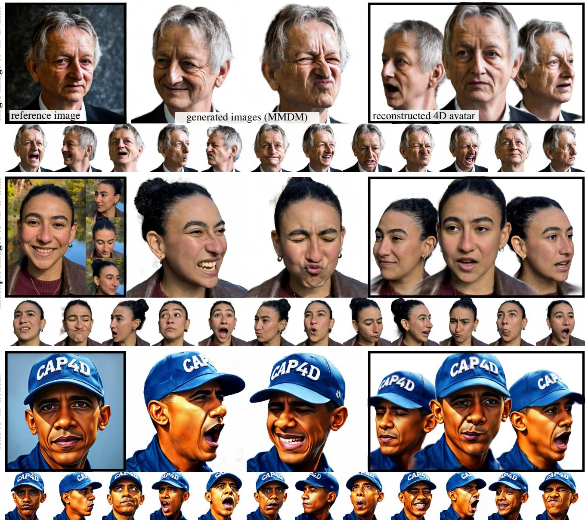  
textto4Davatar

Figure 1. We present CAP4D: a method that generates 4D portrait avatars based on an arbitrary number of reference images and animates them in real time. Our approach uses a morphable multi-view diffusion model to predict novel views with unseen expressions. For each subject, we generate hundreds of such views and train an animatable avatar using a representation based on 3D Gaussian splatting. Our method demonstrates state-of-the-art results for portrait view synthesis from a single image, monocular videos, or multi-view camera setups based on visual quality, identity consistency, 3D structure, and temporal consistency.

put reference images and noisy generated outputs, enabling the generation of hundreds of novel views based on many reference images. In the second stage, we use the generated images to train a real-time 4D avatar based on 3D Gaussian splatting [71]. We augment the representation with an expression-dependent appearance model to improve photorealism, and the resulting avatar can be animated and rendered in real time. Our approach outperforms other methods for view synthesis and animation of head avatars that use one, few, or many reference images as input, and is thus relevant to a broad range of applications.

Overall, we make the following contributions.

• We introduce an MMDM for multi-view portrait image generation with pose and expression control, and we propose a stochastic I/O conditioning procedure to generate self-consistent portrait images given an arbitrary number of input reference images and novel viewpoints.

• We develop a technique to distill generated portrait images into a 4D avatar that is animated and rendered in real time.

• We perform an extensive evaluation of our approach for self-reenactment and cross-identity reenactment from one or more reference images, and we demonstrate state-ofthe-art results for these tasks.

## 2. Related Work

Our work is connected to methods for avatar reconstruction that use different types of input data (e.g., multi-view imagery, monocular video, or single images).

Monocular and multi-view avatar reconstruction. Previous work reconstructs animatable 3D avatars from multiview images or monocular video using textured mesh models [4, 15, 35, 44, 60, 113], volumetric representations [7, 34, 117], or point-based representations [114]. Textured mesh models are efficient to render and can be animated using 3DMMs [9]; however, they often fail to represent detailed structures like hair or teeth. Alternatively, volumetric representations model fine-grained appearance and produce photoreal results, but they are more computationally expensive to render [65]. Further, they require more sophisticated dynamics models, such as conditioning on 3DMM parameters [3, 30, 112] or learned latent codes [34]. While point-based methods can be animated via deformation [114], they face a tradeoff between rendering efficiency and photorealism based on the number of points in the representation. CAP4D builds on 3D Gaussian splatting [47]— a hybrid between point-based and volumetric representations that represents scenes using Gaussian primitives, is efficient to optimize, and achieves photoreal reconstruction quality [43, 78, 93, 99]. We adapt a real-time representation based on GaussianAvatars [71], which we optimize based on the output of the MMDM.

Single image avatar reconstruction. By leveraging priors learned from large datasets, single-image methods directly regress 3D avatar representations based on textured meshes [48, 101, 118], feature grids [22, 49, 54, 62, 88, 89], or neural radiance fields [72, 116]. They perform novel view synthesis with expression control via 3DMMs, conditioning with latent codes, or predicted deformation fields [19, 26, 91, 98, 100, 102, 104]. Other approaches operate entirely in 2D, and render novel expressions and poses through learned warping and inpainting operations applied to a reference image [14, 25, 37, 73, 81, 97, 103, 105– 107]. Overall, techniques for directly regressing 3D representations require prediction in a canonical space, which can fail with extreme head poses or strong variations in appearance (e.g., non-photoreal or animated scenes). 2D techniques often fail to inpaint disoccluded regions when head pose deviates significantly from the reference image. CAP4D sidesteps the limitations of these methods by using the MMDM to generate multi-view images based on one or more reference images; then we use iterative optimization to reconstruct the 4D avatar. Thus, our approach inherits the strengths of learned priors and iterative reconstruction methods.

Multi-view diffusion models. Our work builds on rapid progress in the areas of 2D and 3D generation [12, 27, 41,

79]. We leverage latent diffusion models [74], which were developed for image and video generation [8, 11, 16, 38] and enable synthesis of 3D or 4D objects [5, 6, 69, 83] and 3D or 4D avatars [70, 108, 115]. We also build on multi-view diffusion models [80] that generate multiple images of the same scene simultaneously for 3D reconstruction. In this vein, we are inspired by CAT3D [31], which trains a multi-view diffusion model on large image datasets; at inference time, hundreds of novel views are generated from a single image to reconstruct the scene in 3D. Our approach uses a similar generate-and-reconstruct paradigm, but we generate dynamic avatars rather than static scenes, and we enable controllable real-time rendering. Close to our work, Chen et al. [18] train a morphable multi-view diffusion model conditioned on 3DMM information for singleimage 3D avatar reconstruction. Given a reference image, they generate a fixed number of novel views with controllable expressions and directly infer a 3D representation. However, their approach cannot generate consistent video frames and does not support real-time rendering.

## 3. Method

CAP4D consists of two main stages: (1) a morphable multiview diffusion model that generates a large number of novel views from input reference images, and (2) an animatable 4D representation based on a 3D Gaussian splatting representation that is reconstructed from the reference and generated images. We provide an overview of CAP4D in Fig. 2.

## 3.1. Morphable Multi-View Diffusion Model

We train an MMDM that takes a set of R reference images, $\mathbf { I } _ { \mathrm { r e f } } = \{ \mathbf { i } _ { \mathrm { r e f } } ^ { ( r ) } \} _ { r = 1 } ^ { R }$ , as input and outputs G generated images, $\mathbf { I } _ { \mathrm { g e n } } = \{ \mathbf { i } _ { \mathrm { g e n } } ^ { ( g ) } \} _ { g = 1 } ^ { G }$ . The model is conditioned on additional information including the head pose, expression, and camera view direction for each reference and generated image, given as ${ \bf C } _ { \mathrm { r e f } } = \{ { \bf c } _ { \mathrm { r e f } } ^ { ( r ) } \} _ { r = 1 } ^ { R }$ and ${ \bf C } _ { \mathrm { g e n } } = \{ { \bf c } _ { \mathrm { g e n } } ^ { ( g ) } \} _ { g = 1 } ^ { G }$ . The MMDM learns the joint probability of generated images:

$$
\begin{array} { r } { P ( \mathbf { I } _ { \mathrm { g e n } } | \mathbf { I } _ { \mathrm { r e f } } , \mathbf { C } _ { \mathrm { r e f } } , \mathbf { C } _ { \mathrm { g e n } } ) . } \end{array}\tag{1}
$$

Architecture. Our model is initialized from Stable Diffusion 2.1 [74], and we adapt the architecture for multi-view generation following previous work [31]. Specifically, we use a pre-trained image auto-encoder [74] to encode the images into a low-resolution latent space, and we use the latent diffusion model to processes R reference latent images $\mathbf { Z } _ { \mathrm { r e f } }$ and G generated latent images $\mathbf { Z } _ { \mathrm { g e n } }$ . To share information between the processed latents for each image, we replace 2D attention layers after 2D residual blocks with 3D attention (i.e., two spatial dimensions and one dimension across input images; see Appendix A.1). We remove the crossattention layers since we do not use text conditioning, and we fine-tune the model by optimizing all parameters.

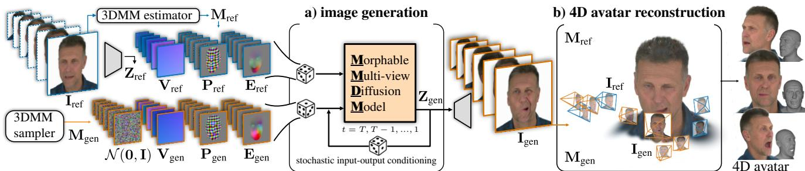  
Figure 2. Overview of CAP4D. (a) The method takes as input an arbitrary number of reference images $\mathbf { I } _ { \mathrm { r e f } }$ that are encoded into the latent space of a variational autoencoder [74]. An off-the-shelf face tracker estimates a 3DMM, $\mathbf { M } _ { \mathrm { r e f } }$ , for each reference image, from which we derive conditioning signals that describe camera view direction, $\mathbf { V } _ { \mathrm { r e f } } .$ head pose $\mathbf { P } _ { \mathrm { r e f } }$ , and expression $\mathbf { E } _ { \mathrm { r e f } }$ . We associate additional conditioning signals with each input noisy latent image based on the desired generated viewpoints, poses, and expressions (see Fig. 3). The MMDM generates images through a stochastic input–output conditioning procedure that randomly samples reference images and generated images during each step of the iterative image generation process. (b) The generated and reference images are used with the tracked and sampled 3DMMs to reconstruct a 4D avatar based on a 3D Gaussian splatting representation [47, 71].

The model is conditioned on additional images that provide the head pose, expression, camera view, and other contextual information for each reference and generated image (see Fig. 3). These conditioning images consist of (1) 3D pose maps, $\mathbf { P } _ { \mathrm { r e f / g e n } }$ , that provide the rasterized canonical 3D coordinates of the head geometry; (2) expression deformation maps, $\mathbf { E } _ { \mathrm { r e f / g e n } } .$ , containing the rasterized 3D deformations of the geometry relative to the neutral expression mesh; (3) view direction maps, $\mathbf { V } _ { \mathrm { r e f / g e n } } .$ , showing the direction of each camera ray in the first camera reference frame; and (4) binary masks $\bf { B } _ { \mathrm { { r e f / g e n } } }$ that indicate whether the input is a reference or generated image. We express the conditioning information for the reference images as $\mathbf { C } _ { \mathrm { r e f } } = \{ \mathbf { P } _ { \mathrm { r e f } } , \mathbf { E } _ { \mathrm { r e f } } , \mathbf { V } _ { \mathrm { r e f } } , \mathbf { B } _ { \mathrm { r e f } } \}$ (defined analogously for the generated images), and we concatenate them to the latent reference images, $\mathbf { Z } _ { \mathrm { r e f } } ,$ as input to the network.

3D pose map conditioning. To obtain the 3D pose maps, $\mathbf { P } _ { \mathrm { r e f / g e n } }$ , we use an off-the-shelf head tracker [85] that jointly fits a FLAME model [53] to each reference image. The tracker provides the shape, head pose, and expression blendshapes, along with camera intrinsics and extrinsics. We apply the blendshapes to a template model, T, to recover the 3D models, $\mathbf { M } _ { \mathrm { r e f } } = \{ \mathbf { m } _ { \mathrm { r e f } } ^ { ( r ) } \} _ { r = 1 } ^ { R } ,$ , corresponding to each reference image; we similarly define 3D models, $\mathbf { M } _ { \mathrm { g e n } } = \{ \mathbf { m } _ { \mathrm { g e n } } ^ { ( g ) } \} _ { g = 1 } ^ { G }$ , for the generated images based on the desired head poses, expressions, and camera positions. Finally, we assign an attribute to each vertex of $\mathbf { M } _ { \mathrm { r e f / g e n } } ,$ consisting of the 3D position of the corresponding vertex in the template mesh T.

The 3D pose map is rendered by rasterizing the attributes of $\mathbf { M } _ { \mathrm { r e f / g e n } }$ from the viewpoint of each reference and generated image:

$$
\mathbf { p } _ { \mathrm { r e f } } ^ { ( r ) } = \gamma \left[ \mathrm { R A S T E R I Z E } \left( \mathbf { m } _ { \mathrm { r e f } } ^ { ( r ) } , \mathbf { T } , \mathbf { \Pi } _ { \mathrm { T e f } } ^ { ( r ) } \right) \right] ,\tag{2}
$$

where $\mathbf { p } _ { \mathrm { r e f } } ^ { ( r ) } \in \mathbf { P } _ { \mathrm { r e f } }$ is the 3D pose map for the rth reference image, RASTERIZE performs rasterization of the reference mesh using the associated 3D vertex position attributes from the template mesh, and $\Pi _ { \mathrm { r e f } } ^ { ( r ) }$ is the camera projection matrix given by the intrinsics and extrinsics. The function $\gamma$ performs positional encoding [65] that maps the rasterized 3D vertex position at each pixel into a high-dimensional feature using sine and cosine functions (see Appendix A.2 for additional details). We render the 3D pose maps for the generated images in the same fashion.

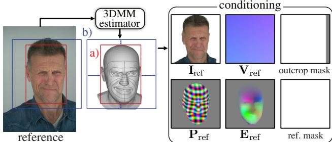  
Figure 3. MMDM conditioning. We preprocess each reference image based on the estimated 3DMM model. We obtain a tightfitting bounding box around the head region (a), which is squared and enlarged (b). We crop the image to the square bounding box and remove the background. Then, we update camera intrinsics to the updated crop and obtain the conditioning images $\mathbf { V } _ { \mathrm { r e f } }$ (ray directions), $\mathbf { P } _ { \mathrm { r e f } }$ (3D pose map), $\mathbf { E } _ { \mathrm { r e f } }$ (expression deformation map), and the reference and outcropping masks. We follow the same process for generated images.

Expression deformation map conditioning. To facilitate the generation of subtle expression changes, we explicitly condition the network with expression deformation maps, $\mathbf { E } _ { \mathrm { r e f / g e n } }$ We employ a procedure similar to that used for the 3D pose map, but we assign a different attribute to each vertex of $\mathbf { M } _ { \mathrm { r e f / g e n } }$ . Specifically, at each vertex, we calculate the 3D offset to the corresponding vertex of a 3D model that shares the same shape blendshapes, but uses the neutral expression blendshape. Then, we rasterize these vertex attributes from the camera viewpoints of the reference and generated images. We omit the positional encoding step because the expression deformations have relatively low spatial frequencies [84].

View direction map and mask conditioning. For each reference and generated image, we encode the corresponding per-pixel ray directions into images, $\mathbf { V } _ { \mathrm { r e f / g e n } } .$ . We use ray directions, expressed relative to the reference frame of the first view, based on the estimated camera intrinsics and extrinsics from the tracker. A binary mask indicates whether the input image is a reference or generated image, and an outcropping mask identifies padded regions added to the reference images after center cropping around the head (see Appendix A.2). All conditioning images are rendered at the latent image resolution and concatenated to the reference and generated latent images before input to the MMDM.

## 3.2. Generation

The first stage of our 4D avatar reconstruction procedure is an iterative image generation process. Given any number of reference images as input, we generate hundreds of novel views with a range of expressions.

Inference with stochastic I/O conditioning. The appearance of occluded head regions and expression-dependent features is ambiguous if only a few reference images are provided (e.g., hair on the back of the head, teeth covered by lips, wrinkles, etc.). Since the MMDM architecture can only take up to four reference images as input in a single forward pass, outputs of the model when using different reference images could have a very different likeness. To bypass this issue, we use a stochastic input–output (I/O) conditioning procedure where we pass a random subset of input reference images and generated images to the model at each diffusion timestep. This procedure has multiple benefits: (1) it improves the consistency of generated images; (2) it provides a mechanism to condition on tens to hundreds of reference images; and (3) it enables generating hundreds of consistent output images.

A detailed description of inference using stochastic I/O conditioning is provided in Algorithm 1. We build on conventional denoising diffusion implicit model (DDIM) sampling [82] by adding an inner loop in each diffusion timestep where we shuffle the G generated images and iterate over them in batches. Within this inner loop, we sample a batch of $G ^ { \prime }$ generated images and randomly sample (without replacement) R′ of the R reference images. Then, the model predicts the denoised generated latent images at the subsequent diffusion timestep using DDIM sampling. After iterating through all the generated images, we proceed to the next diffusion timestep and continue until all images are completely denoised. Provided sufficient diffusion steps, all reference and generated images participate jointly in the image generation process (see also Appendix A.3).

## 3.3. Robust 4D Avatar Reconstruction

Given the reference images, generated images, FLAME parameters, and camera views, we synthesize a 4D avatar.

Alg. 1: Inference with Stochastic I/O Conditioning   
Input: Reference image latents and conditioning   
$\mathbf { Z } _ { \mathrm { r e f } } , \mathbf { C } _ { \mathrm { r e f } } , \mathbf { C } _ { \mathrm { g e n } }$   
$R = | \mathbf { Z } _ { \mathrm { r e f } } | = | \mathbf { C } _ { \mathrm { r e f } } | , G = | \mathbf { C } _ { \mathrm { g e n } } |$   
$G ^ { \prime } \colon$ generated latents in each forward pass   
R′: reference latents in each forward pass   
Output: Generated image latents $\mathbf { Z } _ { \mathrm { g e n } }$   
$\mathbf { Z } _ { \mathrm { g e n } , T } \sim \mathcal { N } ( \mathbf { 0 } , \mathbf { I } ) / /$ sample noisy latents   
for t in $( T , T - 1 , \dots , 1 )$ do   
$/ /$ shuffle generated latents   
SHUFFLE $( \mathbf { Z } _ { \mathrm { g e n , t } } , \mathbf { C } _ { \mathrm { g e n } } )$   
for i in $( 0 , \ldots , G - 1 )$ do   
$/ /$ sample w/o replacement $( \boldsymbol { \mathrm { r e f . } } )$   
$( \mathbf { Z } _ { \mathrm { r e f } } ^ { \prime } , \mathbf { C } _ { \mathrm { r e f } } ^ { \prime } ) \gets \mathbf { R }$ ANDSAMPLE $( ( \mathbf { Z } _ { \mathrm { r e f } } , \mathbf { C } _ { \mathrm { r e f } } ) , R ^ { \prime } )$   
$/ / \mathrm { ~ \mathsf ~ { ~ s ~ } ~ }$ ample next batch (gen.)   
$\mathrm { i } \mathbf { d } \mathbf { x } = i G ^ { \prime } : ( i + 1 ) G ^ { \prime }$   
$( \mathbf { Z } _ { \mathrm { g e n , t } } ^ { \prime } , \mathbf { C } _ { \mathrm { g e n } } ^ { \prime } ) \gets ( \mathbf { Z } _ { \mathrm { g e n , t } } , \mathbf { C } _ { \mathrm { g e n } } ) [ \mathrm { i d x } ]$   
$/ / \mathrm { \nabla \ p r e d i c t { \mathrm {  ~ \ n o i s e } } }$   
$\epsilon _ { \mathrm { i d x } , t } = \mathrm { M M D M } \big ( \mathbf { Z } _ { \mathrm { g e n } , t } ^ { \prime } \big | \mathbf { Z } _ { \mathrm { r e f } } ^ { \prime } , \mathbf { C } _ { \mathrm { r e f } } ^ { \prime } , \mathbf { C } _ { \mathrm { g e n } } ^ { \prime } \big )$   
// apply DDIM step [82]   
$\begin{array} { r } { \mathbf { Z } _ { \mathrm { g e n } , t - 1 } [ \mathrm { i d x } ] = \sqrt { \alpha _ { t - 1 } } ( \frac { \mathbf { Z } _ { \mathrm { g e n } , t } ^ { \prime } - \sqrt { 1 - \alpha _ { t } } \epsilon _ { \mathrm { i d x } , t } } { \sqrt { \alpha _ { t } } } ) + } \end{array}$   
$\sqrt { 1 - \alpha _ { t - 1 } } \cdot \epsilon _ { \mathrm { i d x } , t }$   
return $\mathbf { Z } _ { \mathrm { g e n } } : = \mathbf { Z } _ { \mathrm { g e n } , 0 }$

We build our representation based on GaussianAvatars [71], which uses a collection of 3D Gaussian splats attached to the triangles of a FLAME head mesh. Each Gaussian is linked to a specific parent triangle, with deformations modeled by expression blendshapes that drive the mesh and triangle deformations. Additional Gaussians are added during optimization by splitting the existing Gaussians and assigning the new Gaussians to the same triangle. Different than GaussianAvatars, we remesh the FLAME head to achieve pixel-aligned vertices in UV space at 128 × 128 resolution. We capture fine-grained, expression-dependent deformations using a U-Net [75] that predicts a UV deformation map given the offsets in UV space due to the expression blendshape. We use our modified FLAME mesh, with an upper jaw mesh and an additional lower jaw mesh, which follows the design in GaussianAvatars (see Appendix C).

To optimize the representation, we use the generated images alongside the sampled expression parameters, head poses, and camera poses. Additionally, we apply Laplacian regularization on the predicted deformation map and an $L _ { 2 }$ regularization on the relative deformation and rotation of every Gaussian splat. We include an LPIPS [110] loss to improve robustness as proposed by previous work [31], where we increase $\lambda _ { \mathrm { L P I P S } }$ linearly with the number of iterations. Additional details about the optimization and regularizers are included in Appendix C.

## 4. Implementation

Training. We use a collection of monocular and multiview videos to train our model: VFHQ [94], MEAD [90], Ava-256 [64], and Nersemble [50]. This amounts to 24.6k video sequences with a total number of 41.3M frames of 6317 diverse subjects. We use an off-the-shelf multi-view head tracker [85] to obtain 3DMM parameters along with a gaze estimator [1] to obtain the eye rotation from the video sequences. We train the model with the AdamW [59] optimizer, a learning rate of $1 0 ^ { - 4 }$ , and batch size 64. We train the model for 80k iterations with $R ^ { \prime } = 1$ , then train it for an additional 20k iterations with randomly chosen $R ^ { \prime } < = 4$ for a total of 100k iterations. During training, we randomly drop out all conditioning signals with a probability of 0.1, and we apply a classifier-free guidance [40] during inference. Training takes 2 weeks on 8×H100 GPUs.

Sampling and 4D reconstruction. We generate G = 840 images with a resolution of 512×512 using 250 DDIM steps with stochastic I/O conditioning, which takes around 4 hours on 4×RTX6000 GPUs. 4D avatar reconstruction requires 100k iterations (≈4 hours on one RTX6000 GPU).

Rendering For cross-reenactment, we render the avatar with 768×768 resolution (33 fps on 1×RTX6000) to expand the field of view compared to the MMDM output. For self-reenactment, we render at 1100×1604 (the native resolution of the Nersemble dataset [50]) at 16 fps.

## 5. Experiments

We apply CAP4D to the tasks of self-reenactment and cross-reenactment and provide experimental results and comparisons to baselines. Following previous work [19, 22, 71], we evaluate the avatars on forward-facing sequences. We also conduct an extensive set of ablation studies to assess the impact of individual components of our method: the MMDM, stochastic I/O conditioning, and the 4D representation. For experiments with additional baselines, metrics, and datasets, please refer to Appendices D and E.

Baselines We implement and compare our method to baselines for single-view 4D avatar reconstruction: GAGAvatar [19], Portrait4D-v2 [23], Real3D-Portrait [102] Voodoo3D [88]. We also include several multi-view reconstruction methods: DiffusionRig [24], FlashAvatar [93], and GaussianAvatars [71]. Last, we evaluate two ablated versions of our method—one without the MMDM (“w/o MMDM”; i.e., we reconstruct the avatar directly from the reference images) and one where the MMDM directly predicts the target frames (“MMDM only”).

## 5.1. Self-reenactment

We evaluate self-reenactment on nine multi-view capture sequences from the Nersemble [50] dataset. We hold out 4 of the 16 camera viewpoints for evaluation (each with 100 frames). From the remaining viewpoints, we select one, 10, or 100 reference images. The azimuth and elevation angles of these views range from $\pm 5 5 ^ { \circ }$ and ±20◦, respectively. Given the reference images, we assess how well each method reenacts the appearance of the evaluation images.

CAP4D outperforms every baseline in the single- and 10-image reconstruction categories (Tab. 1) in terms of photometric accuracy (PSNR, LPIPS), temporal consistency [63] (JOD), and identity preservation (using cosine similarity of identity embeddings [21]; CSIM). In the 100 reference image category, CAP4D achieves significantly higher LPIPS and CSIM than previous methods, reconstructing sharper avatars with better-preserved identities. Although FlashAvatar achieves competitive PSNR, its output images are blurrier than CAP4D (see Fig. 4), and hence it has a lower LPIPS score. GaussianAvatars, FlashAvatar, and our 4D avatar trained without generated images (no-MMDM) tend to overfit to the reference views and do not generalize well to novel views. Our method improves with the number of reference images (see, e.g., CSIM). By predicting the target frames directly (MMDM only), we achieve even higher visual quality (PSNR) at the cost of temporal consistency (JOD). Qualitatively, CAP4D produces avatars with significantly higher visual fidelity than all baselines, especially for large deviations from the reference view (e.g., Fig. 4, row 1).

## 5.2. Cross-reenactment

To evaluate cross-reenactment, we select 10 reference images from the FFHQ [46] dataset. We pair five of the images with videos from VFHQ [94], which have a normal expression range, and we select five videos with more extreme expressions from Nersemble. The avatar is reconstructed from the reference image, and the video drives its expressions. We manually orbit the camera around the head in an elliptic trajectory to evaluate 3D consistency (see Appendix E.1).

We assess the results using the CSIM metric (Tab. 2) and in a user study, where 24 participants were presented with reference images, driving videos, and side-by-side videos generated with CAP4D and a baseline. Participants indicated their preference for the following criteria: visual qual ity, expression transfer accuracy, quality of 3D structure, temporal consistency, and overall preference.

The results of the user study (Tab. 2) show a clear preference toward CAP4D overall and across all other criteria. Although Real3D-Portrait [102] achieves slightly better performance in the CSIM metric, human users overwhelmingly prefer CAP4D to Real3D. Qualitative results (Fig. 5) indicate that CAP4D more faithfully captures the 3D appearance of the reference subject. Further, it preserves highfrequency detail better, is robust to large viewpoint changes, and produces 3D consistent video when other methods fail.

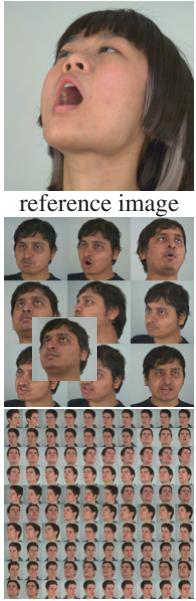  
reference images

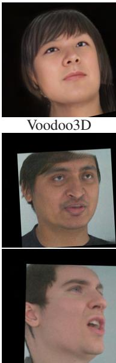  
DiffusionRig

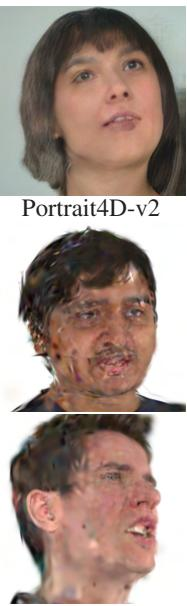  
GaussianAvatars

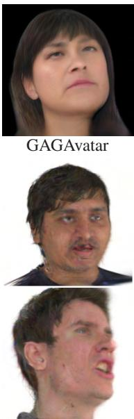  
FlashAvatar

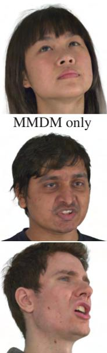  
MMDM only

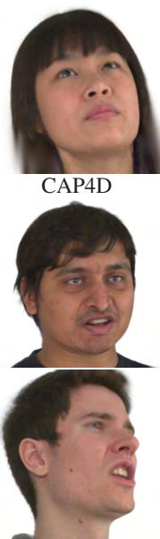  
CAP4D

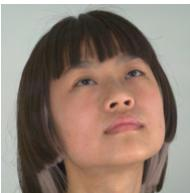

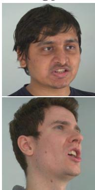  
GT

Figure 4. Self-reenactment. Our approach is more realistic than baseline methods for self-reenactment from a single reference image (row 1), 10 reference images (row 2), and 100 reference images (row 3). The MMDM output (MMDM only) produces the most realistic output at the cost of temporal consistency compared to our reconstructed 4D Avatar (CAP4D).
<table><tr><td></td><td colspan="3">single reference image</td></tr><tr><td>Method</td><td>PSNR↑</td><td>LPIPS↓ CSIM↑</td><td>JOD↑</td></tr><tr><td>Voodoo3D [88]</td><td>19.05</td><td>0.381 0.282</td><td>4.782</td></tr><tr><td>GAGAvatar [19] Real3D [102]</td><td>20.78</td><td>0.373 0.457</td><td>5.034</td></tr><tr><td></td><td>17.42</td><td>0.417 0.420</td><td>4.681</td></tr><tr><td>Portrait4D-v2 [23]</td><td>16.94</td><td>0.404 0.436</td><td>3.871</td></tr><tr><td>MMDM only</td><td>21.82</td><td>0.317 0.632</td><td>5.397</td></tr><tr><td>CAP4D</td><td>21.69</td><td>0.311 0.633</td><td>5.672</td></tr></table>

<table><tr><td></td><td colspan="3">10 reference images</td><td colspan="3">100 reference images</td></tr><tr><td>Method</td><td>|PSNR↑ LPIPS↓ CSIM↑ JOD↑|PSNR↑ LPIPS↓</td><td></td><td></td><td></td><td></td><td> CSIM↑ JOD↑</td></tr><tr><td>DiffusionRig [24]</td><td>16.55 0.450</td><td>0.475</td><td>3.89</td><td>16.61</td><td>0.446 0.435</td><td>3.86</td></tr><tr><td>FlashAvatar [93]</td><td>14.21 0.456</td><td>0.489</td><td>2.92</td><td>22.87</td><td>0.313 0.731</td><td>6.03</td></tr><tr><td>GaussianAvatars [71]</td><td>18.97 0.448</td><td>0.478</td><td>4.33</td><td>20.01</td><td>0.416 0.722</td><td>5.10</td></tr><tr><td>no MMDM</td><td>17.05 0.404</td><td>0.578</td><td>4.19</td><td>19.07</td><td>0.333 0.758</td><td>4.97</td></tr><tr><td>MMDM only</td><td>23.82 0.270</td><td>0.804</td><td>6.06</td><td>24.12</td><td>0.266 0.803</td><td>6.14</td></tr><tr><td>CAP4D</td><td>23.19 0.265</td><td>0.779</td><td>6.13</td><td>23.30</td><td>0.257 0.792</td><td>6.15</td></tr></table>

Table 1. Single-image (left) and multi-image (right) self-reenactment results. CAP4D outperforms previous methods across all metrics. Predicting images directly with the MMDM (MMDM only) trades off photometric quality (PSNR, LPIPS) and temporal consistency (JOD).

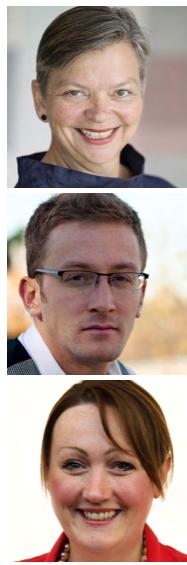  
reference image

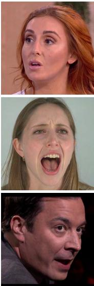  
driving image

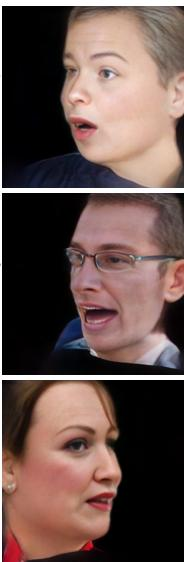  
Voodoo3D

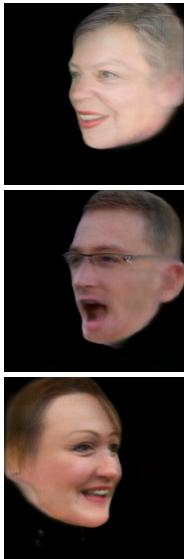  
Real3D

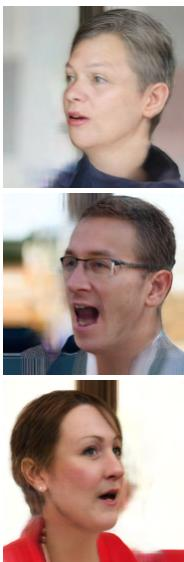  
Portrait4D-v2

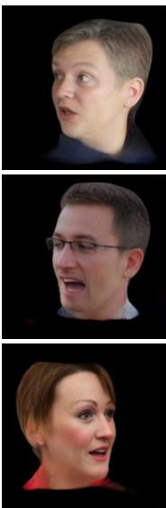  
GAGAvatar

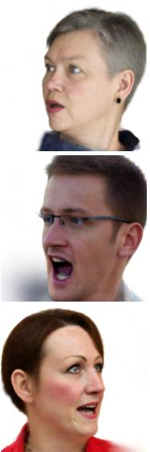  
CAP4D

Figure 5. Cross-reenactment. Avatars are reconstructed from a single reference image (col. 1), and their expressions are driven by frames of a driving video (col. 2). The camera moves according to the indicated horizontal (H) and vertical (V) view angles. CAP4D faithfully recovers the driving expression and maintains the likeness of the reference subject from challenging view directions. It generates plausible results in occluded regions based on the reference image (e.g., earrings, row 1) and recovers high-frequency details (freckles, row 1).

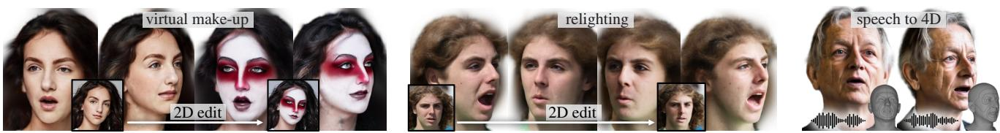

Figure 6. Extensions. We demonstrate 4D appearance editing and relighting by applying CAP4D to images edited using off-the-shelf models [68, 111]. We also animate CAP4D avatars with a method that predicts 3DMM expressions from speech [96] (see supp. videos).
<table><tr><td></td><td></td><td colspan="4">human preference</td></tr><tr><td>Method</td><td>CSIM↑</td><td>VQ</td><td>ET</td><td>3DS TC</td><td>Overall</td></tr><tr><td>Voodoo3D [88]</td><td>0.349</td><td>94%</td><td>94%</td><td>98% 99%</td><td>97%</td></tr><tr><td>Real3D [102]</td><td>0.647</td><td>97%</td><td>90% 94%</td><td>94%</td><td>96%</td></tr><tr><td>Portrait4D-v2 [23]</td><td>0.597</td><td>80%</td><td>73%</td><td>85% 89%</td><td>85%</td></tr><tr><td>GAGAvatar [19]</td><td>0.606</td><td>75%</td><td>63%</td><td>74% 77%</td><td>74%</td></tr><tr><td>CAP4D</td><td>0.634</td><td></td><td></td><td></td><td></td></tr></table>

Table 2. Cross-reenactment results. We evaluate identity similarity (CSIM) and human preference based on visual quality (VQ), expression transfer (ET), 3D structure (3DS), temporal consistency (TC), and overall preference (Overall). The table reports the percentage of users (23 participants) who preferred CAP4D over the corresponding baseline in side-by-side comparisons.
<table><tr><td>Category</td><td>Ablation</td><td>PSNR↑</td><td>LPIPS ↓</td><td>CSIM ↑</td><td>JOD↑</td></tr><tr><td rowspan="3">MMDM</td><td>w/o expr</td><td>21.64</td><td>0.320</td><td>0.669</td><td>5.43</td></tr><tr><td>w/o ray</td><td>22.66</td><td>0.315</td><td>0.665</td><td>5.59</td></tr><tr><td>Ours</td><td>22.54</td><td>0.308</td><td>0.668</td><td>5.59</td></tr><tr><td rowspan="2">sampling</td><td>w/o stochastic</td><td>23.43</td><td>0.282</td><td>0.755</td><td>5.92</td></tr><tr><td>Ours</td><td>23.82</td><td>0.270</td><td>0.779</td><td>6.06</td></tr><tr><td rowspan="3">4D rep.</td><td>w/o U-Net</td><td>21.25</td><td>0.327</td><td>0.617</td><td>5.63</td></tr><tr><td>w/o LPIPS</td><td>21.75</td><td>0.400</td><td>0.615</td><td>5.63</td></tr><tr><td>Ours</td><td>21.69</td><td>0.311</td><td>0.633</td><td>5.67</td></tr></table>

Table 3. Ablation study. We assess the impact of removing the expression maps, view ray conditioning, stochastic I/O conditioning, and the deformation U-Net and LPIPS reconstruction loss.

## 5.3. Ablations and Extensions

Ablation study. We investigate the design choices of our method relating to the MMDM, the stochastic sampling strategy, and the 4D reconstruction stage in Tab. 3. All ablations are conducted on the self-reenactment task with 10 reference images. Please refer to Appendix E.6 for more ablations and qualitative comparisons.

(MMDM) We ablate the expression deformation map (w/o expr) and view direction conditioning (w/o ray) after training the model for 30k steps. We find that the expression deformation map has a significant impact on photometric quality while the impact of view direction is less significant. (Stochastic I/O sampling) We directly predict the evaluation frames (MMDM-only) with and without stochastic sampling (w/o stochastic) with 10 reference frames. Tab. 3 shows that the stochastic sampling strategy improves the PSNR, CSIM, and JOD. (4D avatar fitting) We ablate our U-Net, which predicts expression-dependent deformations of the 3D Gaussians (“no U-Net”); without this component, we see a decrease in PSNR and LPIPS due to a reduced capability to model effects such as wrinkles. We also ablate the LPIPS loss—removing it improves PSNR but at a cost to LPIPS and perceptual image equality.

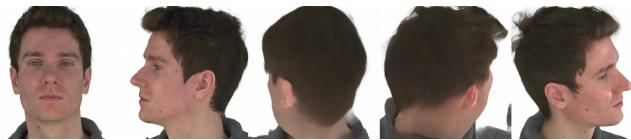  
Figure 7. MMDM-generated 360◦ views.

Extensions. We demonstrate text-to-4D avatars generation by leveraging off-the-shelf image generation models such as Midjourney (Fig. 1). Similarly, we can extend any 2D face editing model to 4D by generating avatars from an edited reference image. We show virtual make-up and relighting examples in Fig. 6. Lastly, we exhibit speechdriven animation of a CAP4D avatar using an off-the-shelf FLAME-based [96] (see videos in the supplement).

## 6. Discussion

We see multiple promising avenues for future work. Currently, generation is time-consuming (up to 8 hours), and while the 3DMM is convenient to animate the avatar, it does not model certain effects (e.g., tongue or hair motion), and so artifacts can appear in these areas (Appendix E.7). In principle, our method is compatible with synthesizing 360◦ avatars; however, we did not have access to a large dataset of 360◦ images spanning many identities, which limits the generation quality at the back of the head (Fig. 7). Future extensions could enable animation without 3DMMs and improve appearance modeling through controllable lighting (e.g., similar to Saito et al. [76]). Finally, our method could be extended to model the full body.

Ethics statement. Digital human avatars are important to many applications, but can be misused. We encourage responsible use of this technology (see Hancock and Bailenson [39] for an extended discussion).

Acknowledgments. DBL acknowledges support from LG Electronics, the Natural Sciences and Engineering Research Council of Canada (NSERC) under the RGPIN, RTI, and Alliance programs, the Canada Foundation for Innovation, and the Ontario Research Fund. The authors also acknowledge computing support provided by the Vector Institute.

## References

[1] Ahmed A. Abdelrahman, Thorsten Hempel, Aly Khalifa, Ayoub Al-Hamadi, and Laslo Dinges. L2CS-Net : Finegrained gaze estimation in unconstrained environments. In Proc. ICFSP, pages 98–102, 2023. 6, 5

[2] Oleg Alexander, Mike Rogers, William Lambeth, Jen-Yuan Chiang, Wan-Chun Ma, Chuan-Chang Wang, and Paul Debevec. The digital Emily project: Achieving a photorealistic digital actor. IEEE Comput. Graph. Appl., 30(4):20–31, 2010. 1

[3] ShahRukh Athar, Zexiang Xu, Kalyan Sunkavalli, Eli Shechtman, and Zhixin Shu. RigNeRF: Fully controllable neural 3D portraits. In Proc. CVPR, 2022. 3

[4] ShahRukh Athar, Shunsuke Saito, Zhengyu Yang, Stanislav Pidhorsky, and Chen Cao. Bridging the gap: Studio-like avatar creation from a monocular phone capture. In Proc. ECCV, 2024. 3

[5] Sherwin Bahmani, Xian Liu, Wang Yifan, Ivan Skorokhodov, Victor Rong, Ziwei Liu, Xihui Liu, Jeong Joon Park, Sergey Tulyakov, Gordon Wetzstein, et al. TC4D: Trajectory-conditioned text-to-4D generation. In Proc. ECCV, 2024. 3

[6] Sherwin Bahmani, Ivan Skorokhodov, Victor Rong, Gordon Wetzstein, Leonidas Guibas, Peter Wonka, Sergey Tulyakov, Jeong Joon Park, Andrea Tagliasacchi, and David B Lindell. 4D-fy: Text-to-4D generation using hybrid score distillation sampling. In Proc. CVPR, 2024. 3

[7] Ziqian Bai, Feitong Tan, Zeng Huang, Kripasindhu Sarkar, Danhang Tang, Di Qiu, Abhimitra Meka, Ruofei Du, Mingsong Dou, Sergio Orts-Escolano, et al. Learning personalized high quality volumetric head avatars from monocular RGB videos. In Proc. CVPR, 2023. 3

[8] Jason Baldridge, Jakob Bauer, Mukul Bhutani, Nicole Brichtova, Andrew Bunner, Kelvin Chan, Yichang Chen, Sander Dieleman, Yuqing Du, Zach Eaton-Rosen, et al. Imagen 3. arXiv preprint arXiv:2408.07009, 2024. 3

[9] Volker Blanz and Thomas Vetter. A morphable model for the synthesis of 3D faces. In Proc. SIGGRAPH, 1999. 1, 3

[10] Andreas Blattmann, Tim Dockhorn, Sumith Kulal, Daniel Mendelevitch, Maciej Kilian, Dominik Lorenz, Yam Levi, Zion English, Vikram Voleti, Adam Letts, et al. Stable video diffusion: Scaling latent video diffusion models to large datasets. arXiv preprint arXiv:2311.15127, 2023. 1, 2

[11] Andreas Blattmann, Robin Rombach, Huan Ling, Tim Dockhorn, Seung Wook Kim, Sanja Fidler, and Karsten Kreis. Align your latents: High-resolution video synthesis with latent diffusion models. In Proc. CVPR, 2023. 3

[12] Tim Brooks, Bill Peebles, Connor Holmes, Will DePue, Yufei Guo, Li Jing, David Schnurr, Joe Taylor, Troy Luhman, Eric Luhman, et al. Video generation models as world simulators, 2024. 3

[13] Adrian Bulat and Georgios Tzimiropoulos. How far are we from solving the 2D & 3D face alignment problem? (and a dataset of 230,000 3D facial landmarks). In Proc. ICCV, 2017. 6

[14] Egor Burkov, Igor Pasechnik, Artur Grigorev, and Victor Lempitsky. Neural head reenactment with latent pose descriptors. In Proc. CVPR, 2020. 3

[15] Chen Cao, Tomas Simon, Jin Kyu Kim, Gabe Schwartz, Michael Zollhoefer, Shun-Suke Saito, Stephen Lombardi, Shih-En Wei, Danielle Belko, Shoou-I Yu, et al. Authentic volumetric avatars from a phone scan. ACM Trans. Graph., 41(4):1–19, 2022. 3

[16] Haoxin Chen, Yong Zhang, Xiaodong Cun, Menghan Xia, Xintao Wang, Chao Weng, and Ying Shan. VideoCrafter2: Overcoming data limitations for high-quality video diffusion models. In Proc. CVPR, 2024. 3

[17] Ken Chen, Sachith Seneviratne, Wei Wang, Dongting Hu, Sanjay Saha, Md. Tarek Hasan, Sanka Rasnayaka, Tamasha Malepathirana, Mingming Gong, and Saman Halgamuge. Anifacediff: Animating stylized avatars via parametric conditioned diffusion models, 2024. 1

[18] Xiyi Chen, Marko Mihajlovic, Shaofei Wang, Sergey Prokudin, and Siyu Tang. Morphable Diffusion: 3Dconsistent diffusion for single-image avatar creation. In Proc. CVPR, 2024. 1, 3

[19] Xuangeng Chu and Tatsuya Harada. Generalizable and animatable Gaussian head avatar. In Proc. NeurIPS, 2024. 3, 6, 7, 8, 5

[20] Hang Dai, Nick Pears, William Smith, and Christian Duncan. Statistical modeling of craniofacial shape and texture. Int. J. Comput. Vis., 128(2):547–571, 2020. 1

[21] Jiankang Deng, Jia Guo, Jing Yang, Niannan Xue, Irene Kotsia, and Stefanos Zafeiriou. ArcFace: Additive angular margin loss for deep face recognition. IEEE Trans. Pattern Anal. Mach. Intell., 44(10):5962–5979, 2022. 6

[22] Yu Deng, Duomin Wang, Xiaohang Ren, Xingyu Chen, and Baoyuan Wang. Portrait4D: Learning one-shot 4D head avatar synthesis using synthetic data. In Proc. CVPR, 2024. 3, 6

[23] Yu Deng, Duomin Wang, and baoyuan Wang. Portrait4Dv2: Pseudo multi-view data creates better 4D head synthesizer. arXiv, 2024. 6, 7, 8, 5

[24] Zheng Ding, Xuaner Zhang, Zhihao Xia, Lars Jebe, Zhuowen Tu, and Xiuming Zhang. DiffusionRig: Learning personalized priors for facial appearance editing. In Proc. CVPR, 2023. 1, 6, 7, 5

[25] Michail Christos Doukas, Stefanos Zafeiriou, and Viktoriia Sharmanska. HeadGAN: One-shot neural head synthesis and editing. In Proc. ICCV, 2021. 3

[26] Nikita Drobyshev, Jenya Chelishev, Taras Khakhulin, Aleksei Ivakhnenko, Victor Lempitsky, and Egor Zakharov. MegaPortraits: One-shot megapixel neural head avatars. In Proc. ACM-MM, 2022. 3

[27] Patrick Esser, Sumith Kulal, Andreas Blattmann, Rahim Entezari, Jonas Muller, Harry Saini, Yam Levi, Dominik¨ Lorenz, Axel Sauer, Frederic Boesel, et al. Scaling rectified flow transformers for high-resolution image synthesis. In Proc. ICML, 2024. 3

[28] Yao Feng, Haiwen Feng, Michael J. Black, and Timo Bolkart. Learning an animatable detailed 3D face model from in-the-wild images. ACM Trans. Graph., 40(8), 2021. 3, 6

[29] Yasutaka Furukawa, Carlos Hernandez, et al. Multi-view´ stereo: A tutorial. Found. Trends Comput. Graph. Vis., 9 (1-2):1–148, 2015. 1

[30] Guy Gafni, Justus Thies, Michael Zollhofer, and Matthias Nießner. Dynamic neural radiance fields for monocular 4D facial avatar reconstruction. In Proc. CVPR, 2021. 1, 3

[31] Ruiqi Gao\*, Aleksander Holynski\*, Philipp Henzler, Arthur Brussee, Ricardo Martin-Brualla, Pratul P. Srinivasan, Jonathan T. Barron, and Ben Poole\*. Cat3d: Create anything in 3d with multi-view diffusion models. Proc. NeurIPS, 2024. 1, 3, 5, 2

[32] Pablo Garrido, Levi Valgaerts, Chenglei Wu, and Christian Theobalt. Reconstructing detailed dynamic face geometry from monocular video. ACM Trans. Graph., 32(6):1–10, 2013. 1

[33] Simon Giebenhain, Tobias Kirschstein, Markos Georgopoulos, Martin Runz, Lourdes Agapito, and Matthias¨ Nießner. Learning neural parametric head models. In Proc. CVPR, 2023. 1

[34] Simon Giebenhain, Tobias Kirschstein, Markos Georgopoulos, Martin Runz, Lourdes Agapito, and Matthias¨ Nießner. MonoNPHM: Dynamic head reconstruction from monocular videos. In Proc. CVPR, 2024. 3

[35] Philip-William Grassal, Malte Prinzler, Titus Leistner, Carsten Rother, Matthias Nießner, and Justus Thies. Neural head avatars from monocular RGB videos. In Proc. CVPR, 2022. 3

[36] Yuming Gu, Hongyi Xu, You Xie, Guoxian Song, Yichun Shi, Di Chang, Jing Yang, and Linjie Luo. DiffPortrait3D: Controllable diffusion for zero-shot portrait view synthesis. In Proc. CVPR, 2024. 1

[37] Jianzhu Guo, Dingyun Zhang, Xiaoqiang Liu, Zhizhou Zhong, Yuan Zhang, Pengfei Wan, and Di Zhang. Live-Portrait: Efficient portrait animation with stitching and retargeting control. arXiv preprint arXiv:2407.03168, 2024. 3

[38] Yuwei Guo, Ceyuan Yang, Anyi Rao, Zhengyang Liang, Yaohui Wang, Yu Qiao, Maneesh Agrawala, Dahua Lin, and Bo Dai. AnimateDiff: Animate your personalized textto-image diffusion models without specific tuning. In Proc. ICLR, 2024. 3

[39] Jeffrey T. Hancock and Jeremy N. Bailenson. The social impact of deepfakes. Cyberpsychol. Behav. Soc. Netw., 24 (3):149–152, 2021. 8

[40] Jonathan Ho and Tim Salimans. Classifier-free diffusion guidance. In NeurIPS Workshop on Deep Generative Models and Downstream Applications, 2021. 6

[41] Yicong Hong, Kai Zhang, Jiuxiang Gu, Sai Bi, Yang Zhou, Difan Liu, Feng Liu, Kalyan Sunkavalli, Trung Bui, and Hao Tan. LRM: Large reconstruction model for single image to 3D. In Proc. ICLR, 2024. 3

[42] Emiel Hoogeboom, Jonathan Heek, and Tim Salimans. simple diffusion: End-to-end diffusion for high resolution images. In Proc. ICML, 2023. 1

[43] Liangxiao Hu, Hongwen Zhang, Yuxiang Zhang, Boyao Zhou, Boning Liu, Shengping Zhang, and Liqiang Nie. GaussianAvatar: Towards realistic human avatar modeling

from a single video via animatable 3D Gaussians. In Proc. CVPR, 2024. 3

[44] Alexandru Eugen Ichim, Sofien Bouaziz, and Mark Pauly. Dynamic 3D avatar creation from hand-held video input. ACM Trans. Graph., 34(4):1–14, 2015. 1, 3

[45] Tero Karras, Samuli Laine, and Timo Aila. A style-based generator architecture for generative adversarial networks. In Proc. CVPR, 2019. 1

[46] Tero Karras, Samuli Laine, and Timo Aila. A stylebased generator architecture for generative adversarial networks. IEEE Trans. Pattern Anal. Mach. Intell., 43(12): 4217–4228, 2021. 6

[47] Bernhard Kerbl, Georgios Kopanas, Thomas Leimkuhler,¨ and George Drettakis. 3D Gaussian splatting for real-time radiance field rendering. ACM Trans. Graph., 42(4):1–14, 2023. 3, 4

[48] Taras Khakhulin, Vanessa Sklyarova, Victor Lempitsky, and Egor Zakharov. Realistic one-shot mesh-based head avatars. In Proc. ECCV, 2022. 3

[49] Taekyung Ki, Dongchan Min, and Gyeongsu Chae. Learning to generate conditional tri-plane for 3D-aware expression controllable portrait animation. In Proc. ECCV, 2024. 3

[50] Tobias Kirschstein, Shenhan Qian, Simon Giebenhain, Tim Walter, and Matthias Nießner. Nersemble: Multi-view radiance field reconstruction of human heads. ACM Trans. Graph., 42(4):1–14, 2023. 1, 6, 3, 4

[51] Tobias Kirschstein, Simon Giebenhain, and Matthias Nießner. DiffusionAvatars: Deferred diffusion for highfidelity 3D head avatars. In Proc. CVPR, 2024. 6

[52] Zhengfei Kuang, Shengqu Cai, Hao He, Yinghao Xu, Hongsheng Li, Leonidas J Guibas, and Gordon Wetzstein. Collaborative video diffusion: Consistent multi-video generation with camera control. In Proc. NeurIPS, 2024. 1

[53] Tianye Li, Timo Bolkart, Michael J Black, Hao Li, and Javier Romero. Learning a model of facial shape and expression from 4D scans. ACM Trans. Graph., 36(6):194–1, 2017. 1, 4, 3

[54] Xueting Li, Shalini De Mello, Sifei Liu, Koki Nagano, Umar Iqbal, and Jan Kautz. Generalizable one-shot 3D neural head avatar. Proc. NeurIPS, 2024. 3

[55] Shanchuan Lin, Linjie Yang, Imran Saleemi, and Soumyadip Sengupta. Robust high-resolution video matting with temporal guidance. In Proc. WACV, 2022. 1

[56] Shanchuan Lin, Bingchen Liu, Jiashi Li, and Xiao Yang. Common diffusion noise schedules and sample steps are flawed. In Proc. WACV, 2024. 1

[57] Ruoshi Liu, Rundi Wu, Basile Van Hoorick, Pavel Tokmakov, Sergey Zakharov, and Carl Vondrick. Zero-1-to-3: Zero-shot one image to 3D object. In Proc. CVPR, 2023. 1

[58] Stephen Lombardi, Tomas Simon, Gabriel Schwartz, Michael Zollhoefer, Yaser Sheikh, and Jason Saragih. Mixture of volumetric primitives for efficient neural rendering. ACM Trans. Graph., 40(4):1–13, 2021. 1

[59] Ilya Loshchilov and Frank Hutter. Decoupled weight decay regularization. In Proc. ICLR, 2019. 6

[60] Shugao Ma, Tomas Simon, Jason Saragih, Dawei Wang, Yuecheng Li, Fernando De La Torre, and Yaser Sheikh. Pixel codec avatars. In Proc. CVPR, 2021. 3

[61] Yue Ma, Hongyu Liu, Hongfa Wang, Heng Pan, Yingqing He, Junkun Yuan, Ailing Zeng, Chengfei Cai, Heung-Yeung Shum, Wei Liu, et al. Follow-your-emoji: Finecontrollable and expressive freestyle portrait animation. In Proc. SIGGRAPH Asia, 2024. 6

[62] Zhiyuan Ma, Xiangyu Zhu, Guo-Jun Qi, Zhen Lei, and Lei Zhang. OTAvatar: One-shot talking face avatar with controllable tri-plane rendering. In Proc. CVPR, 2023. 3

[63] Rafał K. Mantiuk, Gyorgy Denes, Alexandre Chapiro, Anton Kaplanyan, Gizem Rufo, Romain Bachy, Trisha Lian, and Anjul Patney. FovVideoVDP: a visible difference predictor for wide field-of-view video. ACM Trans. Graph., 40 (4), 2021. 6

[64] Julieta Martinez, Emily Kim, Javier Romero, Timur Bagautdinov, Shunsuke Saito, Shoou-I Yu, Stuart Anderson, Michael Zollhofer, Te-Li Wang, Shaojie Bai, Chenghui¨ Li, Shih-En Wei, Rohan Joshi, Wyatt Borsos, Tomas Simon, Jason Saragih, Paul Theodosis, Alexander Greene, Anjani Josyula, Silvio Mano Maeta, Andrew I. Jewett, Simon Venshtain, Christopher Heilman, Yueh-Tung Chen, Sidi Fu, Mohamed Ezzeldin A. Elshaer, Tingfang Du, Longhua Wu, Shen-Chi Chen, Kai Kang, Michael Wu, Youssef Emad, Steven Longay, Ashley Brewer, Hitesh Shah, James Booth, Taylor Koska, Kayla Haidle, Matt Andromalos, Joanna Hsu, Thomas Dauer, Peter Selednik, Tim Godisart, Scott Ardisson, Matthew Cipperly, Ben Humberston, Lon Farr, Bob Hansen, Peihong Guo, Dave Braun, Steven Krenn, He Wen, Lucas Evans, Natalia Fadeeva, Matthew Stewart, Gabriel Schwartz, Divam Gupta, Gyeongsik Moon, Kaiwen Guo, Yuan Dong, Yichen Xu, Takaaki Shiratori, Fabian Prada, Bernardo R. Pires, Bo Peng, Julia Buffalini, Autumn Trimble, Kevyn McPhail, Melissa Schoeller, and Yaser Sheikh. Codec Avatar Studio: Paired Human Captures for Complete, Driveable, and Generalizable Avatars. NeurIPS Track on Datasets and Benchmarks, 2024. 6, 4

[65] Ben Mildenhall, Pratul P Srinivasan, Matthew Tancik, Jonathan T Barron, Ravi Ramamoorthi, and Ren Ng. NeRF: Representing scenes as neural radiance fields for view synthesis. Commun. ACM., 65(1):99–106, 2021. 3, 4

[66] Arsha Nagrani, Joon Son Chung, and Andrew Zisserman. VoxCeleb: A large-scale speaker identification dataset. In Proc. Interspeech, 2017. 1

[67] Dongwei Pan, Long Zhuo, Jingtan Piao, Huiwen Luo, Wei Cheng, Yuxin Wang, Siming Fan, Shengqi Liu, Lei Yang, Bo Dai, Ziwei Liu, Chen Change Loy, Chen Qian, Wayne Wu, Dahua Lin, and Kwan-Yee Lin. RenderMe-360: A large digital asset library and benchmarks towards highfidelity head avatars. In Proc. NeurIPS, 2024. 6

[68] Puntawat Ponglertnapakorn, Nontawat Tritrong, and Supasorn Suwajanakorn. DiFaReli: Diffusion face relighting. In Proc. CVPR, 2023. 8

[69] Ben Poole, Ajay Jain, Jonathan T Barron, and Ben Mildenhall. DreamFusion: Text-to-3D using 2D diffusion. In Proc. ICLR, 2023. 3

[70] Malte Prinzler, Egor Zakharov, Vanessa Sklyarova, Berna Kabadayi, and Justus Thies. Joker: Conditional 3D head synthesis with extreme facial expressions. In Proc. 3DV, 2025. 1, 3

[71] Shenhan Qian, Tobias Kirschstein, Liam Schoneveld, Davide Davoli, Simon Giebenhain, and Matthias Nießner. GaussianAvatars: Photorealistic head avatars with rigged 3D Gaussians. In Proc. CVPR, 2024. 2, 3, 4, 5, 6, 7, 10

[72] Daniel Rebain, Mark Matthews, Kwang Moo Yi, Dmitry Lagun, and Andrea Tagliasacchi. LOLNeRF: Learn from one look. In Proc. CVPR, 2022. 3

[73] Yurui Ren, Ge Li, Yuanqi Chen, Thomas H Li, and Shan Liu. Pirenderer: Controllable portrait image generation via semantic neural rendering. In Proc. ICCV, 2021. 3

[74] Robin Rombach, Andreas Blattmann, Dominik Lorenz, Patrick Esser, and Bjorn Ommer. High-resolution image¨ synthesis with latent diffusion models. In Proc. CVPR, 2022. 3, 4

[75] Olaf Ronneberger, Philipp Fischer, and Thomas Brox. U-Net: Convolutional networks for biomedical image segmentation, 2015. 5, 3

[76] Shunsuke Saito, Gabriel Schwartz, Tomas Simon, Junxuan Li, and Giljoo Nam. Relightable Gaussian codec avatars. In Proc. CVPR, 2024. 8

[77] Shaul Salomon, Gideon Avigad, Alex Goldvard, and Oliver Schutze. PSA – a new scalable space partition based se-¨ lection algorithm for MOEAs. In Proc. EVOLVE, 2013. 3, 4

[78] Zhijing Shao, Zhaolong Wang, Zhuang Li, Duotun Wang, Xiangru Lin, Yu Zhang, Mingming Fan, and Zeyu Wang. SplattingAvatar: Realistic real-time human avatars with mesh-embedded Gaussian splatting. In Proc. CVPR, 2024. 3

[79] Ruoxi Shi, Hansheng Chen, Zhuoyang Zhang, Minghua Liu, Chao Xu, Xinyue Wei, Linghao Chen, Chong Zeng, and Hao Su. Zero123++: a single image to consistent multi-view diffusion base model. arXiv preprint arXiv:2310.15110, 2023. 3

[80] Yichun Shi, Peng Wang, Jianglong Ye, Long Mai, Kejie Li, and Xiao Yang. MVDream: Multi-view diffusion for 3D generation. In Proc. ICLR, 2023. 1, 3

[81] Aliaksandr Siarohin, Stephane Lathuili´ ere, Sergey\` Tulyakov, Elisa Ricci, and Nicu Sebe. First order motion model for image animation. Proc. NeurIPS, 2019. 1, 3

[82] Jiaming Song, Chenlin Meng, and Stefano Ermon. Denoising diffusion implicit models. In Proc. ICLR, 2020. 1, 5

[83] Jingxiang Sun, Bo Zhang, Ruizhi Shao, Lizhen Wang, Wen Liu, Zhenda Xie, and Yebin Liu. DreamCraft3D: Hierarchical 3D generation with bootstrapped diffusion prior. In Proc. ICLR, 2024. 3

[84] Matthew Tancik, Pratul Srinivasan, Ben Mildenhall, Sara Fridovich-Keil, Nithin Raghavan, Utkarsh Singhal, Ravi Ramamoorthi, Jonathan Barron, and Ren Ng. Fourier features let networks learn high frequency functions in low dimensional domains. Proc. NeurIPS, 2020. 4, 1

[85] Felix Taubner, Prashant Raina, Mathieu Tuli, Eu Wern Teh, Chul Lee, and Jinmiao Huang. 3D face tracking from 2D

video through iterative dense UV to image flow. In Proc. CVPR, 2024. 1, 4, 6, 5

[86] Ayush Tewari, Justus Thies, Ben Mildenhall, Pratul Srinivasan, Edgar Tretschk, Wang Yifan, Christoph Lassner, Vincent Sitzmann, Ricardo Martin-Brualla, Stephen Lombardi, et al. Advances in neural rendering. Comput. Graph. Forum, 41(2):703–735, 2022. 1

[87] Linrui Tian, Qi Wang, Bang Zhang, and Liefeng Bo. EMO: Emote portrait alive-generating expressive portrait videos with audio2video diffusion model under weak conditions. arXiv preprint arXiv:2402.17485, 2024. 1

[88] Phong Tran, Egor Zakharov, Long-Nhat Ho, Anh Tuan Tran, Liwen Hu, and Hao Li. VOODOO 3D: Volumetric portrait disentanglement for one-shot 3D head reenactment. Proc. CVPR, 2024. 3, 6, 7, 8, 5

[89] Alex Trevithick, Matthew Chan, Michael Stengel, Eric Chan, Chao Liu, Zhiding Yu, Sameh Khamis, Manmohan Chandraker, Ravi Ramamoorthi, and Koki Nagano. Realtime radiance fields for single-image portrait view synthesis. ACM Trans. Graph., 42(4):1–15, 2023. 3

[90] Kaisiyuan Wang, Qianyi Wu, Linsen Song, Zhuoqian Yang, Wayne Wu, Chen Qian, Ran He, Yu Qiao, and Chen Change Loy. MEAD: A large-scale audio-visual dataset for emotional talking-face generation. In Proc. ECCV, 2020. 6, 4

[91] Ting-Chun Wang, Arun Mallya, and Ming-Yu Liu. Oneshot free-view neural talking-head synthesis for video conferencing. In Proc. CVPR, 2021. 3

[92] Daniel Watson, William Chan, Ricardo Martin Brualla, Jonathan Ho, Andrea Tagliasacchi, and Mohammad Norouzi. Novel view synthesis with diffusion models. In Proc. ICLR, 2023. 1

[93] Jun Xiang, Xuan Gao, Yudong Guo, and Juyong Zhang. FlashAvatar: High-fidelity head avatar with efficient gaussian embedding. In Proc. CVPR, 2024. 1, 3, 6, 7, 5

[94] Liangbin Xie, Xintao Wang, Honglun Zhang, Chao Dong, and Ying Shan. VFHQ: A high-quality dataset and benchmark for video face super-resolution. In Proc. CVPRW, 2022. 1, 6, 4

[95] You Xie, Hongyi Xu, Guoxian Song, Chao Wang, Yichun Shi, and Linjie Luo. X-portrait: Expressive portrait animation with hierarchical motion attention. In Proc. SIG-GRAPH, 2024. 1

[96] Jinbo Xing, Menghan Xia, Yuechen Zhang, Xiaodong Cun, Jue Wang, and Tien-Tsin Wong. CodeTalker: Speechdriven 3D facial animation with discrete motion prior. In Proc. CVPR, pages 12780–12790, 2023. 8

[97] Sicheng Xu, Jiaolong Yang, Dong Chen, Fang Wen, Yu Deng, Yunde Jia, and Xin Tong. Deep 3D portrait from a single image. In Proc. CVPR, 2020. 3

[98] Sicheng Xu, Guojun Chen, Yu-Xiao Guo, Jiaolong Yang, Chong Li, Zhenyu Zang, Yizhong Zhang, Xin Tong, and Baining Guo. Vasa-1: Lifelike audio-driven talking faces generated in real time. In Proc. NeurIPS, 2024. 3

[99] Yuelang Xu, Benwang Chen, Zhe Li, Hongwen Zhang, Lizhen Wang, Zerong Zheng, and Yebin Liu. Gaussian head avatar: Ultra high-fidelity head avatar via dynamic Gaussians. In Proc. CVPR, 2024. 3

[100] Zhongcong Xu, Jianfeng Zhang, Jun Hao Liew, Wenqing Zhang, Song Bai, Jiashi Feng, and Mike Zheng Shou. PV3D: A 3D generative model for portrait video generation. In Proc. ICLR, 2023. 3

[101] Haotian Yang, Hao Zhu, Yanru Wang, Mingkai Huang, Qiu Shen, Ruigang Yang, and Xun Cao. FaceScape: a largescale high quality 3D face dataset and detailed riggable 3D face prediction. In Proc. CVPR, 2020. 1, 3

[102] Zhenhui Ye, Tianyun Zhong, Yi Ren, Jiaqi Yang, Weichuang Li, Jiawei Huang, Ziyue Jiang, Jinzheng He, Rongjie Huang, Jinglin Liu, et al. Real3D-Portrait: Oneshot realistic 3D talking portrait synthesis. In Proc. ICLR, 2024. 3, 6, 7, 8, 5

[103] Fei Yin, Yong Zhang, Xiaodong Cun, Mingdeng Cao, Yanbo Fan, Xuan Wang, Qingyan Bai, Baoyuan Wu, Jue Wang, and Yujiu Yang. StyleHEAT: One-shot highresolution editable talking face generation via pre-trained stylegan. In Proc. ECCV. Springer, 2022. 3

[104] Wangbo Yu, Yanbo Fan, Yong Zhang, Xuan Wang, Fei Yin, Yunpeng Bai, Yan-Pei Cao, Ying Shan, Yang Wu, Zhongqian Sun, et al. NOFA: NeRF-based one-shot facial avatar reconstruction. In Proc. SIGGRAPH, 2023. 3

[105] Egor Zakharov, Aliaksandra Shysheya, Egor Burkov, and Victor Lempitsky. Few-shot adversarial learning of realistic neural talking head models. In Proc. ICCV, 2019. 3

[106] Egor Zakharov, Aleksei Ivakhnenko, Aliaksandra Shysheya, and Victor Lempitsky. Fast bi-layer neural synthesis of one-shot realistic head avatars. In Proc. ECCV, 2020.

[107] Bowen Zhang, Chenyang Qi, Pan Zhang, Bo Zhang, HsiangTao Wu, Dong Chen, Qifeng Chen, Yong Wang, and Fang Wen. MetaPortrait: Identity-preserving talking head generation with fast personalized adaptation. In Proc. CVPR, 2023. 3

[108] Bowen Zhang, Yiji Cheng, Chunyu Wang, Ting Zhang, Jiaolong Yang, Yansong Tang, Feng Zhao, Dong Chen, and Baining Guo. RodinHD: High-fidelity 3D avatar generation with diffusion models. In Proc. ECCV, 2024. 3

[109] Fan Zhang, Valentin Bazarevsky, Andrey Vakunov, Andrei Tkachenka, George Sung, Chuo-Ling Chang, and Matthias Grundmann. MediaPipe hands: On-device real-time hand tracking. In Proc. CVPRW, 2020. 5

[110] Richard Zhang, Phillip Isola, Alexei A Efros, Eli Shechtman, and Oliver Wang. The unreasonable effectiveness of deep features as a perceptual metric. In Proc. CVPR, 2018. 5, 4

[111] Yuxuan Zhang, Lifu Wei, Qing Zhang, Yiren Song, Jiaming Liu, Huaxia Li, Xu Tang, Yao Hu, and Haibo Zhao. Stablemakeup: When real-world makeup transfer meets diffusion model. arXiv preprint arXiv:2403.07764, 2024. 8

[112] Xiaochen Zhao, Lizhen Wang, Jingxiang Sun, Hongwen Zhang, Jinli Suo, and Yebin Liu. HAvatar: High-fidelity head avatar via facial model conditioned neural radiance field. ACM Trans. Graph., 43(1):1–16, 2023. 3

[113] Yufeng Zheng, Victoria Fernandez Abrevaya, Marcel C´ Buhler, Xu Chen, Michael J Black, and Otmar Hilliges. I¨ M avatar: Implicit morphable head avatars from videos. In Proc. CVPR, 2022. 3

[114] Yufeng Zheng, Wang Yifan, Gordon Wetzstein, Michael J Black, and Otmar Hilliges. PointAvatar: Deformable pointbased head avatars from videos. In Proc. CVPR, 2023. 3

[115] Zhenglin Zhou, Fan Ma, Hehe Fan, and Yi Yang. Headstudio: Text to animatable head avatars with 3D Gaussian splatting. In Proc. ECCV, 2024. 3

[116] Yiyu Zhuang, Hao Zhu, Xusen Sun, and Xun Cao. Mo-FaNeRF: Morphable facial neural radiance field. In Proc. ECCV, 2022. 3

[117] Wojciech Zielonka, Timo Bolkart, and Justus Thies. Instant volumetric head avatars. Proc. CVPR, 2022. 1, 3

[118] Wojciech Zielonka, Timo Bolkart, and Justus Thies. Towards metrical reconstruction of human faces. In Proc. ECCV, 2022. 1, 3