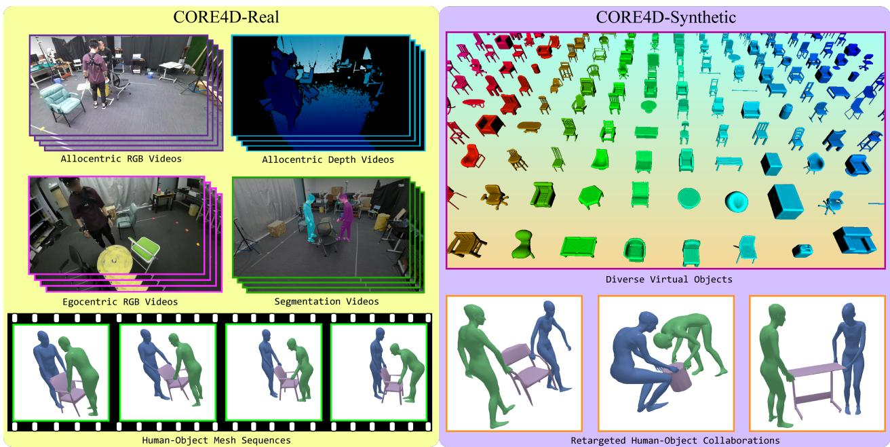
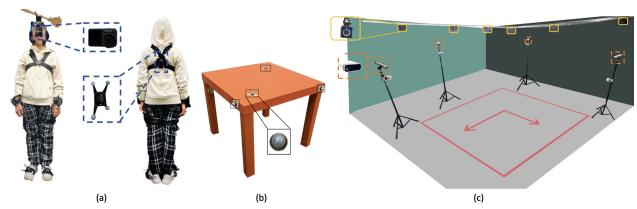
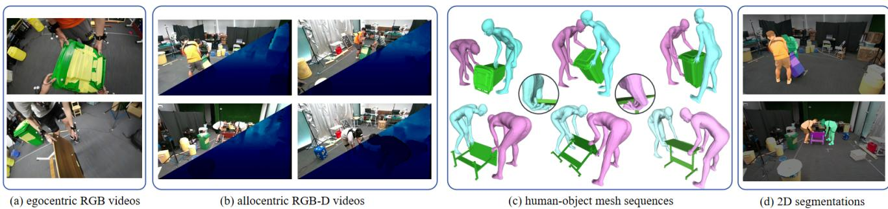
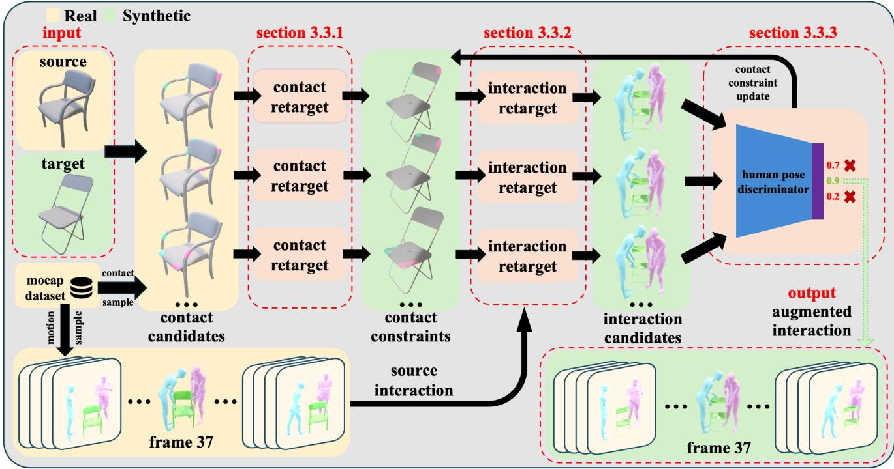
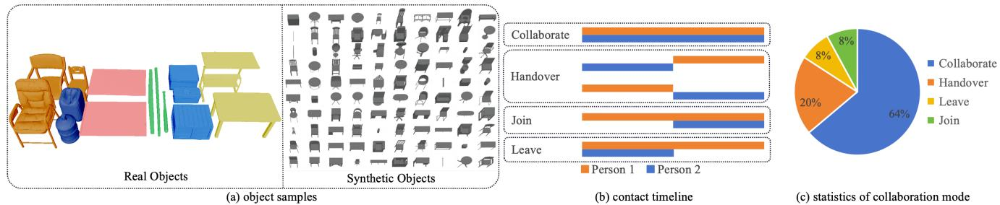
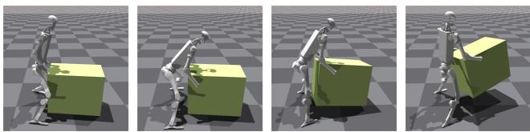

# CORE4D: A 4D Human-Object-Human Interaction Dataset for Collaborative Object REarrangement

Yun Liu1,2,3\* Chengwen Zhang4\* Ruofan Xing5 Bingda Tang1 Bowen Yang1 Li Yi1,2,3†   
1Tsinghua University 2Shanghai Artificial Intelligence Laboratory 3Shanghai Qi Zhi Institute 4Beijing University of Posts and Telecommunications 5Northeastern University https://core4d.github.io/

  
Figure 1. CORE4D is a large-scale diverse human-object-human interaction dataset for collaborative object rearrangement, encompassing real-world and synthetic branches. CORE4D-Real captures 1K human-object-human mesh sequences with allocentric and egocentric visual signals, while CORE4D-Synthetic retargets real-world data onto 3K virtual object shapes formulating 10K motion sequences.

## Abstract

Understanding how humans cooperatively rearrange household objects is critical for VR/AR and human-robot interaction. However, in-depth studies on modeling these behaviors are under-researched due to the lack of relevant datasets. We fill this gap by presenting CORE4D, a novel large-scale 4D human-object-human interaction datasetfocusing on collaborative object rearrangement, which encompasses diverse compositions of various object geometries, collaboration modes, and 3D scenes. With 1K humanobject-human motion sequences captured in the real world, we enrich CORE4D by contributing an iterative collaboration retargeting strategy to augment motions to a vari-

ety of novel objects. Leveraging this approach, CORE4D comprises a total of 11K collaboration sequences spanning 3K real and virtual object shapes. Benefiting from extensive motion patterns provided by CORE4D, we benchmark two tasks aiming at generating human-object interaction: human-object motion forecasting and interaction synthesis. Extensive experiments demonstrate the effectiveness of our collaboration retargeting strategy and indicate that CORE4D has posed new challenges to existing humanobject interaction generation methodologies.

## 1. Introduction

Humans frequently rearrange household items through multi-person collaboration , such as moving a table or picking up an overturned chair together. Analyzing and synthesizing these diverse collaborative behaviors could be widely applicable in VR/AR, human-robot interaction [68, 69, 95], dexterous manipulation [10, 96, 112, 125] and humanoid manipulation [19, 48, 66, 108]. However, understanding and modeling these interactive motions has been limited due to the lack of large-scale, richly annotated datasets. Existing human-object and hand-object interaction datasets focus on individual behaviors [3, 23, 39, 54, 56, 123] and two-person handovers [55, 100, 120]. However, these datasets typically encompass limited numbers of object instances, thus struggling to support generalizable interaction understanding across diverse object shapes. Scaling up precise humanobject interaction data is challenging. While vision-based human-object motion tracking methods [67, 105–107, 132] have advanced, they still struggle with low fidelity due to severe occlusions, which are common in multi-human collaborations. Additionally, mocap [39, 50] is expensive and hard to scale up to cover numerous objects involved in rearrangement. Our goal is to curate a large-scale categorylevel human-object-human (HOH) interaction dataset with high quality in a cost-efficient manner.

We observe that HOH collaborations mainly vary in two aspects: the temporal collaboration patterns of two humans and the spatial relations between humans and objects. The temporal collaboration patterns could vary widely depending on scene complexity, motion range, and collaboration mode. In contrast, spatial relations tend to possess strong homogeneity when facing objects from the same category, e.g., two persons holding opposite sides of a chair. This allows for retargeting interactions involving one specific instance to another using automatic algorithms, avoiding the need to capture interactions with thousands of samecategory objects in the real world. The above observations enable us to leverage expensive motion capture systems to capture only humans’ diverse temporal collaboration patterns, while relying on automatic spatial retargeting algorithms to enrich human-object spatial relations.

Using these insights, we build a novel large-scale dataset, CORE4D, encompassing a wide range of humanobject interactions for collaborative object rearrangement. CORE4D includes various types of household objects, collaboration modes, and 3D environments. Our data acquisition strategy combines mocap-based capturing and synthetic retargeting, allowing us to scale the dataset effectively. The retargeting algorithm transfers spatial relation between human and object to novel object geometries while preserving temporal pattern of human collaboration. As a result, CORE4D includes 1K real-world motion sequences (CORE4D-Real) paired with videos and 3D scenes, as well as 10K synthetic collaboration sequences (CORE4D-Synthetic) covering 3K diverse object shapes.

We benchmark two tasks for generating human-object collaboration: (1) motion forecasting [13, 110] and (2) interaction synthesis [50, 90] on CORE4D, revealing challenges in modeling human behaviors, enhancing motion naturalness, and adapting to new object geometries. Ablation studies demonstrate the effectiveness of our hybrid data acquisition strategy, and the quality and value of CORE4D-Synthetic, highlighting its role in helping to improve existing motion generation methods. We further retarget interactions in CORE4D onto Unitree H1 [93] humanoid robot and use them to train humanoid box-lifting policies, showcasing the values of CORE4D in robot interaction skill learning.

In summary, our main contributions are threefold: (1) We present CORE4D, a large-scale 4D HOH interaction dataset for collaborative object rearrangement. (2) We propose a novel hybrid data acquisition method, incorporating real-world data capture and synthetic collaboration retargeting. (3) We benchmark two tasks for collaboration generation, revealing new challenges and research opportunities.

## 2. Related Work

## 2.1. Human-object Interaction Datasets

Tremendous progress has been made in the construction of human-object interaction datasets. To study how humans interact with 3D scenes, various widely-used datasets record human movements and surrounding scenes separately, treating objects as static [2, 4, 17, 18, 29–32, 36, 40, 41, 52, 80, 89, 97, 98, 114, 115, 121, 128, 130] or partially deformable [51] without pose change. For dynamic objects, recent works [3, 5, 6, 12, 16, 37, 39, 43, 46, 50, 53, 55, 58, 86, 91, 100, 117, 126, 127, 131, 132] capture human-object interaction behaviors with varying focus. Table 1 summarizes the characteristics of 4D human-object interaction datasets. To support vision-based human-object motion tracking and shape reconstruction studies, a line of datasets [3, 16, 37, 39, 53, 126, 127, 131] annotates humanobject meshes with multi-view RGB or RGBD signals. With the rapid development of human-robot cooperation, several works [5, 55, 86, 100] focus on specific action types like grasping [86] and human-human handover [5, 55, 100]. CORE4D uniquely captures multi-person and object collaborative motions, category-level interactions, and egocentric and allocentric views, offering comprehensive features by combining real and synthetic data.

## 2.2. Human Interaction Retargeting

Human interaction retargeting focuses on applying human interactive motions to novel objects in human-object interaction scenarios. Existing methodologies [8, 38, 44, 79, 82, 102, 106, 119] are object-centric. They propose first finding contact correspondences between the source and the target objects and then adjusting human motion to touch specific regions on the target object via optimization. As crucial guidance for the result, contact correspondences are discovered by aligning either surface regions [79, 102, 106, 119], spatial maps [38, 44], distance fields [8], or neural descriptor fields [82] between the source and the target objects. These methods are all limited to objects with similar topology and scales. Our synthetic data generation strategy incorporates object-centric design [119] with novel human-centric contact selection, allowing adaptation to challenging objects using human priors.

<table><tr><td>dataset</td><td>multi- human</td><td>collaboration</td><td>category- level</td><td>egocentric</td><td>RGBD</td><td>#view</td><td>mocap</td><td>#object</td><td>#sequence</td></tr><tr><td>GRAB [86]</td><td></td><td></td><td></td><td></td><td></td><td>=</td><td>√</td><td>57</td><td>=</td></tr><tr><td>GraviCap [16]</td><td></td><td></td><td></td><td></td><td></td><td>3</td><td></td><td>4</td><td>9</td></tr><tr><td>BEHAVE [3]</td><td></td><td></td><td></td><td></td><td>√</td><td>4</td><td></td><td>20</td><td>321</td></tr><tr><td>InterCap [37]</td><td></td><td></td><td></td><td></td><td>√</td><td>6</td><td></td><td>10</td><td>223</td></tr><tr><td>CHAIRS [39]</td><td></td><td></td><td>√</td><td></td><td>√</td><td>4</td><td>√</td><td>81</td><td>1.4K</td></tr><tr><td>HODome [126]</td><td></td><td></td><td></td><td></td><td></td><td>76</td><td>√</td><td>23</td><td>274</td></tr><tr><td>Li et.al. [50]</td><td></td><td></td><td></td><td></td><td></td><td>=</td><td>√</td><td>15</td><td>6.1K</td></tr><tr><td>FORCE [131]</td><td></td><td></td><td></td><td></td><td>√</td><td>1</td><td>√</td><td>8</td><td>450</td></tr><tr><td>IMHD2 [132]</td><td></td><td></td><td></td><td></td><td></td><td>32</td><td>√</td><td>10</td><td>295</td></tr><tr><td>HIMO [58] Carfi et.al. [5]</td><td>√</td><td></td><td></td><td></td><td></td><td>=</td><td>√</td><td>53</td><td>3.4K</td></tr><tr><td></td><td>√</td><td></td><td></td><td></td><td>√</td><td>1</td><td>√</td><td>10</td><td>1.1K</td></tr><tr><td>HOH [100]</td><td>√</td><td></td><td>√</td><td></td><td>√</td><td>8</td><td></td><td>136</td><td>2.7K</td></tr><tr><td>CoChair [55]</td><td>√</td><td></td><td></td><td></td><td></td><td>=</td><td>√</td><td>8</td><td>3.0K</td></tr><tr><td>HOI-M³ [127]</td><td>√</td><td>√</td><td>√</td><td>了</td><td>√</td><td>42</td><td>√</td><td>90</td><td>199</td></tr><tr><td>CORE4D-Real CORE4D-Synthetic</td><td>√</td><td>√</td><td>√</td><td></td><td></td><td>5</td><td>√</td><td>37 3.0K</td><td>1.0K 10K</td></tr></table>

Table 1. Comparison of CORE4D with existing 4D human-object interaction datasets.

## 2.3. Human-object Interaction Generation

Human-object interaction generation is an emerging research topic that aims to synthesize realistic human-object motions conditioned on surrounding 3D scenes, known object trajectories, or action types. To generate 3D human mesh snapshots interacting with scenes, POSA [33] and COINS [133] propose to leverage CVAE [83], while DreamHOI [136] provides an iterative NeRF [64] optimization approach. To further synthesize interactive motions, a line of works [26, 47, 65, 85, 87, 103, 129, 130] present auto-regressive manners [85, 130], diffusion models [47], or two-stage designs that first generates start and end poses and then interpolates motion in-between [26, 87, 103, 129]. Beyond static objects, a line of works further model object movements and generate integrated human-object interactions using diffusion models [50, 110] and GCN [113]. To generate human-object interactions under action descriptions, recent works [21, 22, 40, 49, 76, 84, 99, 101, 104, 111, 122] extract text features with pretrained CLIP encoders [40, 77, 84, 99, 122] or LLM planners [22, 71, 92, 104], using them to guide diffusion models [35].

## 3. Constructing CORE4D

CORE4D is a large-scale 4D human-object-human interaction dataset acquired in a novel hybrid scheme, comprising CORE4D-Real and CORE4D-Synthetic. CORE4D-Real is captured (Section 3.1) and annotated (Section 3.2) from authentic collaborative scenarios. As shown in Figure 3, it provides human-object-human poses, egocentric RGB videos, allocentric RGB-D videos, and 2D segmentations across 1.0K sequences accompanied by 37 object models. To augment spacial relation between human and object, we present an innovative collaboration retargeting technique in Section 3.3. This technique integrates CORE4D-Real with CORE4D-Synthetic, thereby expanding our collection with an additional 10K sequences and 3K rigid objects. Detailed characteristics such as data diversities are discussed in Section 3.4.

## 3.1. CORE4D-Real Data Capture

  
Figure 2. CORE4D-Real data capturing system. (a) demonstrates the wearing of mocap suits and the positioning of the egocentric camera. (b) shows an object with four markers. (c) illustrates the data capturing system and camera views.

To collect precise human-object motions with visual signals, we set up a hybrid data capturing system shown in Fig. 2, consisting of an inertial-optical mocap system, four allocentric RGB-D cameras and a camera worn by participants for egocentric sensing. The system operates at 15 FPS.

Inertial-optical Mocap System. To capture human-object poses in collaboration cases precisely, often involving severe occlusion, we use an inertial-optical mocap system [70] inspired by CHAIRS [39]. This system includes 12 infrared cameras, mocap suits with 8 inertial-optical trackers and two data gloves per person, and markers of a 10mm radius. Data gloves are inertia-based and capture joint positions in wrist frames with a 1cm error. The system captures the Biovision Hierarchy (BVH) skeletons for humans, while markers attached to the objects track object motion.

  
Figure 3. CORE4D-Real data modality overview.

Visual Sensors. Kinect Azure DK cameras are integrated to capture allocentric RGB-D signals, and an Osmo Action3 is utilized to capture egocentric color videos. The resolution of all the visual signals is 1920x1080. Cameras are calibrated by the mocap system and synchronized via timestamp. Details on camera calibration and synchronization are in the appendix.

Object Model Acquisition. CORE4D-Real includes 37 3D models of rigid objects spanning six household object categories. Each object model is constructed by an industrial 3D scanner with up to 100K triangular faces. We additionally adopt manual refinements on captured object models to remove triangle outliers and improve accuracy.

Privacy Protection. To ensure participant anonymity, blurring is applied to faces [72] in RGB videos. The participants all consented to releasing CORE4D, and were notified of their right to remove their data from CORE4D at any time.

## 3.2. CORE4D-Real Data Annotation

Object Pose Tracking. To acquire the 6D pose of a rigid object, we attach four to five markers to the object’s surface. The markers formulate a virtual rigid that the mocap system can track. With accurate localization of the object manually, the object pose can be precisely determined by marker positions captured by the infrared cameras.

Human Mesh Acquisition. Aligning with existing datasets [39, 50], we retarget BVH [62] human skeletons to SMPL-X [74]. SMPL-X [74] formulates a human mesh as $D _ { \mathrm { s m p l x } } = M ( \beta , \theta )$ . The body shape $\beta \in \mathbb { R } ^ { 1 0 }$ are optimized to fit the constraints on manually measured human skeleton lengths. With $\beta$ computed, we optimize the full-body pose $\theta \in \mathbb { R } ^ { 1 5 9 }$ with the loss function:

$$
\begin{array} { r } { \mathcal { L } = \mathcal { L } _ { \mathrm { r e g } } + \mathcal { L } _ { j 3 \mathrm { D } } + \mathcal { L } _ { j \mathrm { O r i } } + \mathcal { L } _ { \mathrm { s m o o t h } } + \mathcal { L } _ { h 3 \mathrm { D } } + \mathcal { L } _ { h \mathrm { O r i } } + \mathcal { L } _ { \mathrm { c o n t a c t } } , } \\ { ( 1 ) \qquad } \end{array}
$$

where $\mathcal { L } _ { \mathrm { r e g } }$ ensures the simplicity of the results and prevents unnatural, significant twisting of the joints. $\mathcal { L } _ { j 3 \mathrm { D } }$ and $\mathcal { L } _ { j \mathrm { O r i } }$ encourage the rotation of joints and the global 3D positions to closely match the ground truth. $\mathcal { L } _ { h 3 \mathrm { D } }$ and $\mathcal { L } _ { h \mathrm { { O r i } } }$ guide the positioning and orientation of the fingers. $\mathcal { L } _ { \mathrm { { s m o o t h } } }$ promotes temporal smoothness. $\mathcal { L } _ { \mathrm { { c o n t a c t } } }$ encourages realistic contact between the hands and objects. Then using SMPL-X [74] $M ( \beta , \theta , \Phi ) : \mathbb { R } ^ { | \theta | \times | \beta | } \mapsto \mathbb { R } ^ { 3 N }$ to generate human mesh. Details on loss functions are in the appendix.

2D Mask Annotation. We offer automatic 2D segmentation for individuals and the manipulated objects to aid in predictive tasks like vision-based human-object pose estimation [3, 105]. We first use DEVA [9] to segment human and object instances in a captured interaction image with text prompts. Then, we render human and object meshes separately on each image and select the instance with the highest Intersection-over-Union (IoU) for mask annotation.

## 3.3. CORE4D-Synthetic Data Generation

In order to enrich the diversities of object geometries and human-object spatial relations, our retargeting algorithm transfers real interactions to ShapeNet [7] objects of the same category, thereby significantly expanding the dataset regarding the object’s diversity. When transferring interactions across objects, contact points are always the key and it is important to consider whether they can be properly transferred with consistent semantics on new objects [118, 135]. However, we find this insufficient when object geometries vary largely and correspondences become hard to build. We thus tackle interaction retargeting from a novel humancentric perspective where good contact points should support natural human poses and motions. We realize this idea through the pipeline depicted in Figure 4, which comprises three key components. First, object-centric contact retargeting uses whole contact knowledge from CORE4D-Real to obtain accurate contact with different objects. Second, contact-guided interaction retargeting adapts motion sequences to new object geometries while considering the contact constraints. Third, a human-centric contact selection evaluates poses from interaction candidates to select the most plausible contacts.

Object-centric Contact Retargeting. To acquire reasonable human poses, contact constraints on the target object are essential. We draw inspiration from Tink [119] and train DeepSDF on all objects’ signed distance fields (SDFs). For source object $\mathrm { { \bf S D F } } O _ { s }$ and target object SDF $O _ { t } ,$ , we first apply linear interpolation on their latent vectors $o _ { s }$ and $o _ { t }$ and obtain N intermediate vectors $\begin{array} { r } { o _ { i } = \frac { N + 1 - i } { N + 1 } o _ { s } + \frac { i } { N + 1 } o _ { t } ( 1 \leq } \end{array}$ $i \leq N )$ . We then decode $o _ { i }$ to its SDF $O _ { i }$ via the decoder of DeepSDF, and reconstruct the corresponding 3D mesh $M _ { i }$ using the Marching Cubes algorithm [57]. Thereby get mesh sequence $\mathcal { M } = [ s o u r c e , M _ { 1 } , M _ { 2 } , . . . , M _ { N } , t a r g e t ]$ and successively transfer contact positions between every two adjacent meshes in M via Nearest-neighbor searching. In addition, we leverage all contact candidates from CORE4D-Real on source to form a pool of contact candidates and transfer them to target as contact constraints.

  
Figure 4. Collaboration retargeting pipeline. We propose a collaboration retargeting algorithm by iteratively refining interaction motion The input is a source-target pair. First, we sample contact candidates from whole CORE4D-Real contact knowledge on source. For each contact candidate, we apply contact retargeting to propagate contact candidates to contact constraints on target. Sampled motion from CORE4D-Real provides a high-level collaboration pattern, together with low-level contact constraints, we obtain interaction candidates from interaction retargeting. Then, the human pose discriminator selects the optimal candidates, prompting a contact constraints update via beam search. After multiple iterations, the process yields augmented interactions. This iterative mechanism can effectively get a reasonable one from numerous contact constraints and ensures a refined interaction, enhancing the dataset’s applicability across various scenarios.

Contact-guided Interaction Retargeting. For each contact constraint, interaction retargeting aims to transfer human interaction from source to target. To greatly enforce the consistency of interaction motion, we optimize variables including the object rotations $R _ { o } \in \mathbb { R } ^ { N \times 3 }$ and translations $\boldsymbol { T _ { o } } ~ \in ~ \mathbb { R } ^ { \mathbf { \overline { { N } } } \times 3 }$ , human poses $\theta _ { 1 , 2 } ~ \in ~ \mathbb { R } ^ { 2 \times N \times 1 5 3 }$ , translation $T _ { 1 , 2 } ~ \in ~ \mathbb { R } ^ { 2 \times N \times 3 }$ and orientation $O _ { 1 , 2 } ~ \in ~ \mathbb { R } ^ { 2 \times N \times 3 }$ on the SMPL-X [74]. N is the frame number.

We first estimate the target’s motion $\{ R _ { o } , T _ { o } \}$ by solving an optimization problem as follows:

$$
R _ { o } , T _ { o } \longleftarrow \underbrace { \mathrm { a r g m i n } ( \mathcal { L } _ { f } + \mathcal { L } _ { \mathrm { s p a t } } + \mathcal { L } _ { \mathrm { s m o o t h } } ) } _ { R _ { o } , T _ { o } } ,\tag{2}
$$

where fidelity loss $\mathcal { L } _ { f }$ evaluates the difference of the target’s rotation and translation against the source, restriction loss $\mathcal { L } _ { \mathrm { s p a t } }$ penalizes target’s penetration with the ground, and smoothness loss $\mathcal { L } _ { \mathrm { { s m o o t h } } }$ constrains the target’s velocities between consecutive frames.

Given the target’s motion and contact constraints, we then transfer humans’ interactive motion $\{ \theta _ { 1 , 2 } , T _ { 1 , 2 } , O _ { 1 , 2 } \}$ from the source to the target by solving another optimization problem as follows:

$$
\theta _ { 1 , 2 } , T _ { 1 , 2 } , O _ { 1 , 2 } \longleftarrow \operatorname * { a r g m i n } _ { \theta _ { 1 , 2 } , T _ { 1 , 2 } , O _ { 1 , 2 } } ( \mathcal { L } _ { j } + \mathcal { L } _ { c } + \mathcal { L } _ { \mathrm { s p a t } } + \mathcal { L } _ { \mathrm { s m o o t h } } ) ,\tag{3}
$$

where fidelity loss $\mathcal { L } _ { \mathrm { j } }$ evaluates the difference in human joint positions before and after the transfer, contact loss $\mathcal { L } _ { c }$ computes the difference between human-object contact regions and the contact constraints, $\mathcal { L } _ { \mathrm { s p a t } }$ and $\mathcal { L } _ { \mathrm { { s m o o t h } } }$ ensures the smoothness of human motion. Details on the loss designs are in the appendix.

Human-centric Contact Selection. Selecting reasonable contact constraints efficiently is challenging due to their large scales and the time-consuming interaction retargeting. We address this challenge by developing a beam search algorithm to select contact constraints from a humancentric perspective. Specifically, we train a human pose discriminator inspired by GAN-based motion generation works [109, 116]. To train it, we build a pairwise training dataset, with each pair consisting of one positive human pose sample and one negative one. Positive samples are encouraged to get higher scores than negative ones. We use CORE4D-Real as positive samples. We add 6D pose noise $\Delta ( \alpha , \beta , \gamma , x , y , z )$ on target motion, and regard corresponding human motions generated by contact-guided interaction retargeting as negative samples. The loss function is:

$$
\mathcal { L } _ { \mathrm { r a n k i n g } } = - \log ( \sigma ( R _ { \mathrm { p o s } } - R _ { \mathrm { n e g } } - m ( S _ { \mathrm { p o s } } , S _ { \mathrm { n e g } } ) ) ) ,\tag{4}
$$

where $S _ { \mathrm { p o s } }$ and $S _ { \mathrm { n e g } }$ denote inputs for positive and negative samples respectively, with $R _ { \mathrm { p o s } }$ and $R _ { \mathrm { n e g } }$ being their corresponding discriminator scores. σ is Sigmoid function, and $m ( S _ { \mathrm { p o s } } , S _ { \mathrm { n e g } } ) = | | \Delta ( \alpha , \beta , \gamma , x , y , z ) | |$ is human-guide margin [73] between positive and negative poses. This margin could explicitly instruct the discriminator to yield more significant disparities across different poses.

To ensure the realism of human interactions, we also introduce an interpenetration penalty. We prioritize those with the highest discriminator scores while ensuring acceptable levels of interpenetration as the optimal contact constraints.

## 3.4. Dataset Characteristics

To better model collaborative object rearrangement interactions, we focus on diversifying our dataset in several vital areas: object geometries, collaboration modes, and 3D scenes. These ensure a comprehensive representation of real-world interactions.

Diversity in Object Geometries. We design six object categories to cover the main collaborative object rearrangement interaction scenarios as Fig. 5(a). Categories with relatively simple geometry, uniformity, and typically exhibiting symmetry include box, board, barrel, and stick. Categories with more complex geometries and significant individual differences include chair and desk.

Diversity in Collaboration Modes. We define five humanhuman collaboration modes in collaborative object rearrangement. Each mode represents a unique form of collaboration between two individuals, providing a new perspective and possibilities for understanding and researching collaborative behaviors. At first, we define the person with the egocentric camera as Person 2, and the other as Person 1. Collaborative carrying tasks are divided by whether Person 2 knows the goal or not. Tasks of handover and solely move alternate between the two participants. In join and leave tasks, Person 2 will either join in to help or leave halfway through, respectively.

Diversity in 3D Scenes. Surrounding scenarios are set up with varying levels of scene complexity: no obstacle, single obstacle, and many obstacles (more than one). Participants are asked to navigate through these randomly placed obstacles by their own means. We observe that this typically involved behaviors including bypassing, going through, stepping over, or moving obstacles aside.

## 4. Experiments

In this section, we first present the train-test split of CORE4D (Section 4.1). We then propose two benchmarks for generating human-object collaboration: human-object motion forecasting (Section 4.2), and interaction synthesis (Section 4.3). Finally, Section 4.4 presents extensive studies on the collaboration retargeting approach.

## 4.1. Data Split

We construct a training set from a random assortment of real objects, combining their real motions and corresponding synthetic data. We also create two test sets from CORE4D-Real for non-generalization and inner-category generalization studies. Test set S1 includes interactions with training set objects, while S2 features interactions with new objects. CORE4D-Synthetic is not included in the test set, avoiding potential biases from the retargeting algorithm. Details are shown in the appendix.

## 4.2. Human-object Motion Forecasting

Forecasting 4D human motion [27, 28, 60, 75] is a crucial problem with applications in VR/AR and embodied perception [42]. Current research [1, 14, 95, 110] is limited to individual behaviors due to data constraints. Our work expands this by using diverse multi-person collaborations, making the prediction problem both intriguing and challenging.

Task Formulation. Given the object’s 3D model and human-object poses in adjacent 15 frames, the task is to predict their subsequent poses in the following 15 frames. The human pose $\bar { P _ { h } } \in \bar { \mathbb { R } } ^ { 2 3 \times 3 }$ represents joint rotations of the SMPL-X [74] model, while the object pose $P _ { o } = \{ R _ { o } \in$ $\mathbb { R } ^ { 3 } , T _ { o } \in \mathbb { R } ^ { 3 } \}$ denotes 3D orientation and 3D translation of the rigid object model.

Evaluation Metrics. Following existing motion forecasting works [13, 94, 110], we evaluate human joints position error $J _ { e } ,$ object translation error $T _ { e } ,$ object rotation error $R _ { e } ,$ human-object contact accuracy $C _ { \mathrm { a c c } } .$ , and penetration rate $P _ { r }$ . Details are provided in the appendix.

Methods, Results, and Analysis. We evaluate three stateof-the-art motion forecasting methods, MDM [90], Inter-Diff [110], and CAHMP [13]. Table 2 quantitatively shows these methods reveal a consistent drop in performance for unseen objects (S2) versus seen ones (S1) regarding human pose prediction. Meanwhile, errors in object pose prediction remain similar. This highlights the challenges in generalizing human collaborative motion for novel object shapes.

  
Figure 5. Dataset statistics. (a) shows object samples from six categories. Bars in (b) indicate when the person is in contact with the objec during the entire collaborative object rearrangement interaction process. (c) presents the proportion of collaboration modes in the dataset.

<table><tr><td rowspan=2 colspan=1>TestSet</td><td rowspan=2 colspan=1>Method</td><td rowspan=1 colspan=1>Human</td><td rowspan=1 colspan=2>Object</td><td rowspan=1 colspan=2>Contact</td></tr><tr><td rowspan=1 colspan=1>Je (↓)</td><td rowspan=1 colspan=1>Te (↓)</td><td rowspan=1 colspan=1>Re (↓)</td><td rowspan=1 colspan=1> $\overline { { C _ { \mathrm { a c c } } \left( \uparrow \right) } }$ </td><td rowspan=1 colspan=1>Pr (↓)</td></tr><tr><td rowspan=3 colspan=1>S1</td><td rowspan=1 colspan=1>MDM [90]</td><td rowspan=1 colspan=1>170.8</td><td rowspan=1 colspan=1>136.8</td><td rowspan=1 colspan=1>10.7</td><td rowspan=1 colspan=1>84.9</td><td rowspan=1 colspan=1>0.3</td></tr><tr><td rowspan=1 colspan=1>InterDiff [110]</td><td rowspan=1 colspan=1>170.8</td><td rowspan=1 colspan=1>135.1</td><td rowspan=1 colspan=1>10.2</td><td rowspan=1 colspan=1>84.9</td><td rowspan=1 colspan=1>0.3</td></tr><tr><td rowspan=1 colspan=1>CAHMP [13]</td><td rowspan=1 colspan=1>169.4</td><td rowspan=1 colspan=1>110.3</td><td rowspan=1 colspan=1>9.0</td><td rowspan=1 colspan=1></td><td rowspan=1 colspan=1>-</td></tr><tr><td rowspan=3 colspan=1>S2</td><td rowspan=1 colspan=1>MDM [90]</td><td rowspan=1 colspan=1>186.4</td><td rowspan=1 colspan=1>136.0</td><td rowspan=1 colspan=1>11.1</td><td rowspan=1 colspan=1>88.0</td><td rowspan=1 colspan=1>0.3</td></tr><tr><td rowspan=1 colspan=1>InterDiff [110]</td><td rowspan=1 colspan=1>186.4</td><td rowspan=1 colspan=1>133.6</td><td rowspan=1 colspan=1>10.7</td><td rowspan=1 colspan=1>88.0</td><td rowspan=1 colspan=1>0.3</td></tr><tr><td rowspan=1 colspan=1>CAHMP [13]</td><td rowspan=1 colspan=1>170.5</td><td rowspan=1 colspan=1>112.9</td><td rowspan=1 colspan=1>9.5</td><td rowspan=1 colspan=1>-</td><td rowspan=1 colspan=1>-</td></tr></table>

Table 2. Quantitative results on motion forecasting.

## 4.3. Interaction Synthesis

Generating human-object interaction [21, 49, 50, 76] is an emerging research topic benefiting human avatar animation and human-robot collaboration [11, 69]. With extensive collaboration modes and various object categories, CORE4D constitutes a knowledge base for studying generalizable algorithms of human-object-human interactive motion synthesis.

Task Formulation. Following recent studies [50, 87], we define the task as object-conditioned human motion generation. Given an object geometry sequence $G _ { o } \in \mathbb { R } ^ { T \times N \times 3 }$ the aim is to generate corresponding two-person collaboration motions $\mathbf { \bar { \boldsymbol { M } } } _ { h } \in \mathbb { R } ^ { 2 \times T \times }$ ×23×3. This involves frame numbers T, object point clouds $G _ { o } ,$ and human pose parameters for the SMPL-X [74] model.

Evaluation Metrics. Following individual human-object interaction synthesis [50], we evaluate human joint position error $R . J _ { e } ,$ , object vertex position error $R . V _ { e } ,$ , and humanobject contact accuracy $C _ { \mathrm { a c c } }$ . The FID score (FID) is leveraged to quantitatively assess the naturalness of synthesized results. Details of the metric designs are in the appendix.

Methods, Results, and Analysis. We utilize three advanced diffusion models [49, 50, 90] as baselines. MDM [90] and CHOIS [49] are one-stage conditional motion diffusion models, while OMOMO is a two-stage approach with hand positions as intermediate results. Quantitative evaluations reveal larger errors in OMOMO when modeling multi-human collaboration compared to individual interaction synthesis by Li et al. [50]. Furthermore, the synthesized results have a higher FID than real motion data, indicating challenges in motion naturalness.

<table><tr><td rowspan=1 colspan=1>TestSet</td><td rowspan=1 colspan=1>Method</td><td rowspan=1 colspan=1>R.Je (↓)</td><td rowspan=1 colspan=1>R.Ve (↓)</td><td rowspan=1 colspan=1> $C _ { \mathrm { a c c } } \left( \uparrow \right)$ </td><td rowspan=1 colspan=1>FID (↓)</td></tr><tr><td rowspan=3 colspan=1>S1</td><td rowspan=1 colspan=1>MDM [90]</td><td rowspan=1 colspan=1>138.3</td><td rowspan=1 colspan=1>194.8</td><td rowspan=1 colspan=1>76.5</td><td rowspan=1 colspan=1>7.5</td></tr><tr><td rowspan=1 colspan=1>OMOMO [50]</td><td rowspan=1 colspan=1>138.0</td><td rowspan=1 colspan=1>196.9</td><td rowspan=1 colspan=1>78.0</td><td rowspan=1 colspan=1>7.8</td></tr><tr><td rowspan=1 colspan=1>CHOIS [49]</td><td rowspan=1 colspan=1>138.4</td><td rowspan=1 colspan=1>194.3</td><td rowspan=1 colspan=1>76.2</td><td rowspan=1 colspan=1>7.7</td></tr><tr><td rowspan=3 colspan=1>S2</td><td rowspan=1 colspan=1>MDM [90]</td><td rowspan=1 colspan=1>146.1</td><td rowspan=1 colspan=1>208.3</td><td rowspan=1 colspan=1>76.6</td><td rowspan=1 colspan=1>7.9</td></tr><tr><td rowspan=1 colspan=1>OMOMO [50]</td><td rowspan=1 colspan=1>145.3</td><td rowspan=1 colspan=1>209.9</td><td rowspan=1 colspan=1>77.8</td><td rowspan=1 colspan=1>7.4</td></tr><tr><td rowspan=1 colspan=1>CHOIS [49]</td><td rowspan=1 colspan=1>145.8</td><td rowspan=1 colspan=1>206.7</td><td rowspan=1 colspan=1>76.2</td><td rowspan=1 colspan=1>7.7</td></tr></table>

Table 3. Quantitative results on interaction synthesis.
<table><tr><td rowspan=3 colspan=1>Comparison</td><td rowspan=1 colspan=1>Designs</td><td rowspan=1 colspan=2>Phys. Eval.</td><td rowspan=1 colspan=2>User Preferences</td></tr><tr><td rowspan=2 colspan=1>C  D  U</td><td rowspan=2 colspan=1>P(↓)</td><td rowspan=2 colspan=1>Cacc(↑)</td><td rowspan=1 colspan=1>Contact</td><td rowspan=1 colspan=1>Motion</td></tr><tr><td rowspan=1 colspan=1>A / B / App</td><td rowspan=1 colspan=1>rox. (↑)</td></tr><tr><td rowspan=1 colspan=1>AAbl.1B</td><td rowspan=1 colspan=1>√  √</td><td rowspan=1 colspan=1>0.610.24</td><td rowspan=1 colspan=1>83.283.3</td><td rowspan=1 colspan=1>8/89/3</td><td rowspan=1 colspan=1>4/84/12</td></tr><tr><td rowspan=1 colspan=1>AAbl.2B</td><td rowspan=1 colspan=1>√√  √</td><td rowspan=1 colspan=1>0.550.24</td><td rowspan=1 colspan=1>82.983.3</td><td rowspan=1 colspan=1>1/91/8</td><td rowspan=1 colspan=1>3/85/12</td></tr><tr><td rowspan=1 colspan=1>AAbl.3B</td><td rowspan=1 colspan=1>√   *√  √</td><td rowspan=1 colspan=1>0.680.24</td><td rowspan=1 colspan=1>94.783.3</td><td rowspan=1 colspan=1>6/84/10</td><td rowspan=1 colspan=1>2/87/11</td></tr><tr><td rowspan=1 colspan=1>AAbl.4B</td><td rowspan=1 colspan=1>√   √√   √  √</td><td rowspan=1 colspan=1>0.240.23</td><td rowspan=1 colspan=1>83.385.5</td><td rowspan=1 colspan=1>5/76/19</td><td rowspan=1 colspan=1>4/69/27</td></tr></table>

Table 4. Ablation study. C, D, and U denote contact candidates, the human pose discriminator, and the contact candidate update, respectively. P is penetration distance. $C _ { a c c }$ is contact accuracy.

## 4.4. Collaboration Retargeting

User Studies. We conduct user studies to examine the quality of CORE4D-Synthetic in terms of naturalness of contact and human motion. Each study comprises two collections, each with at least 100 sequences displayed in pairs on a website. Users are instructed to assess the realism of human-object contacts and the naturalness of human motions, and then select the superior one in each pair separately. Recognizing the diversity of acceptable contacts and motions, participants are permitted to deem the performances as roughly equivalent.

Ablation on Contact Candidates. In Table 4.Abl.1, we only use the contact points from a source trajectory for retargeting to the target instead of resorting to the CORE4D-Real for many candidates, making the whole retargeting process similar to the OakInk [119] method. We observe a sharp decline in both physical plausibility and user preferences, indicating that our method compensates for OakInk’s shortcomings in retargeting objects with significant geometric and scale variations.

Ablations on Discriminator. In Table 4.Abl.2, we omit the human pose discriminator in the collaboration retargeting.

<table><tr><td rowspan=2 colspan=1>No</td><td rowspan=1 colspan=3>Train Set</td><td rowspan=1 colspan=1>Human</td><td rowspan=1 colspan=2>Object</td></tr><tr><td rowspan=1 colspan=1>Total</td><td rowspan=1 colspan=1>Real</td><td rowspan=1 colspan=1>Synthetic</td><td rowspan=1 colspan=1>Je (↓)</td><td rowspan=1 colspan=1>Te (↓)</td><td rowspan=1 colspan=1>Re (↓)</td></tr><tr><td rowspan=1 colspan=1>A</td><td rowspan=1 colspan=1>1.0K</td><td rowspan=1 colspan=1>0.1K</td><td rowspan=1 colspan=1>0.9K</td><td rowspan=1 colspan=1>127.7</td><td rowspan=1 colspan=1>121.7</td><td rowspan=1 colspan=1>8.04</td></tr><tr><td rowspan=1 colspan=1>B</td><td rowspan=1 colspan=1>1.0K</td><td rowspan=1 colspan=1>1.0K</td><td rowspan=1 colspan=1>0</td><td rowspan=1 colspan=1>127.0</td><td rowspan=1 colspan=1>120.5</td><td rowspan=1 colspan=1>9.48</td></tr><tr><td rowspan=1 colspan=1>C</td><td rowspan=1 colspan=1>5.0K</td><td rowspan=1 colspan=1>1.0K</td><td rowspan=1 colspan=1>4.0K</td><td rowspan=1 colspan=1>116.2</td><td rowspan=1 colspan=1>112.1</td><td rowspan=1 colspan=1>6.99</td></tr></table>

Table 5. Ablation on the incorporation of CORE4D-Synthetic on the motion forecasting task.

Method A randomly chooses a candidate from the contact candidates. There are obvious performance drops, demonstrating the critical role of the human pose discriminator in selecting appropriate candidates. Table 4.Abl.3 further compares the proposed discriminator against selecting the motion with the most accurate contact (method A), and user studies reveal significant superiority of the discriminator.

Ablation on Contact Candidate Update. We exclude contact candidate update process in Table 4.Abl.4 experiment. This removal has weakened our method’s ability to search for optimal solutions on objects, resulting in a modest degradation in penetration distance. The user study still exhibited a strong bias, indicating a perceived decline in the plausibility of both contact and motion. This ablation underscores the importance of the contact candidate update.

Comparing CORE4D-Synthetic with CORE4D-Real. We assess the quality of CORE4D-Synthetic by comparing it with CORE4D-Real through user study. In conclusion, there is a 43% probability that users perceive the quality of both options as comparable. Furthermore, in 14% of cases, users even exhibit a preference for synthetic data. This indicates that the quality of our synthetic data closely approximates that of real data.

## 5. Dataset Applications

## 5.1. CORE4D-Synthetic Enhances Human-object Motion Forecasting Quality

Table 5 compares the motion forecasting ability of lightweighted CAHMP [15]. The test set is S2 defined in Section 4.1. We assess the quality of CORE4D-Synthetic by comparing No.A and No.B. No.A even have better performance on object due to enriched spacial relation between human and object in CORE4D-Synthetic. No.C shows the value of the CORE4D-Synthetic by largely improving the performance. Details are in the appendix.

## 5.2. CORE4D Supports Humanoid Skill Learning

Benefitting from rapid developments of humanoid robots [24, 45, 93], tremendous progress has been made in studying versatile humanoid skills for locomotion [34, 61, 78, 88] and humanoid-object interaction [20, 63, 124]. Aiming at enabling humanoid learning skills from human data, we select human interaction motions with three large boxes from CORE4D, and retarget them onto the Unitree H1 humanoid robot [93] with object scale augmentation. With

<table><tr><td rowspan=1 colspan=1>Data</td><td rowspan=1 colspan=1>N/A</td><td rowspan=1 colspan=2>CORE4D</td></tr><tr><td rowspan=1 colspan=1>Method</td><td rowspan=1 colspan=1>PPO [81]</td><td rowspan=1 colspan=1>HumanPlus [25]</td><td rowspan=1 colspan=1>HST [25]+ ACT [134]</td></tr><tr><td rowspan=1 colspan=1>SR(↑)</td><td rowspan=1 colspan=1>0.0</td><td rowspan=1 colspan=1>21.0</td><td rowspan=1 colspan=1>26.5</td></tr></table>

Table 6. Success rates of RL and IL in humanoid box lifting.

  
Figure 6. Visualization of the humanoid box-lifting skil trained by CORE4D via imitation learning.

890 human-like humanoid-box interaction sequences, we design a box-lifting task in Isaac Gym [59], and benchmark two state-of-the-art humanoid imitation learning (IL) methodologies [25, 134] comparing to demonstration-free reinforcement learning (RL) paradigm [81].

Table 6 compares the success rates of these methods. Leveraging interaction data from CORE4D, the two IL methods [25, 134] consistently make it possible for humanoids to lift unseen boxes with visual sensor signals successfully, demonstrating that CORE4D can promote humanoid interaction skill learning. Figure 6 exemplifies a successful case of HumanPlus [25], showing that humanoids can learn from CORE4D and achieve the task in a human-like manner. As the development of multihumanoid imitation learning methods in the future, we anticipate that CORE4D can further promote collaboration skill learning. Details on task formulation, method designs, and evaluations are in the appendix.

## 6. Conclusion and Limitations

We present CORE4D, a novel large-scale 4D humanobject-human interaction dataset for collaborative object rearrangement. It comprises diverse compositions of various object geometries, collaboration modes, and surrounding 3D scenes. To efficiently enlarge the data scale, we contribute a hybrid data acquisition method involving realworld data capturing and a novel synthetic data augmentation algorithm, resulting in 11K motion sequences covering 37 real-world and 3K virtual objects. Extensive experiments demonstrate the effectiveness of the data augmentation strategy and the value of the augmented motion data. We benchmark human-object motion forecasting and interaction synthesis on CORE4D, revealing new challenges and research opportunities.

Limitations. Firstly, outdoor scenes are not incorporated in CORE4D-Real due to the usage of the mocap system. Secondly, visual signals are excluded in CORE4D-Synthetic. Transferring real-world videos onto synthesized collaboration motions could be an interesting future direction.

## References

[1] Vida Adeli, Mahsa Ehsanpour, Ian Reid, Juan Carlos Niebles, Silvio Savarese, Ehsan Adeli, and Hamid Rezatofighi. Tripod: Human trajectory and pose dynamics forecasting in the wild. In Proceedings ofthe IEEE/CVF International Conference on Computer Vision, pages 13390– 13400, 2021. 6

[2] Joao Pedro Araujo, Jiaman Li, Karthik Vetrivel, Rishi´ Agarwal, Jiajun Wu, Deepak Gopinath, Alexander William Clegg, and Karen Liu. Circle: Capture in rich contextual environments. In Proceedings of the IEEE/CVF Conference on Computer Vision and Pattern Recognition, pages 21211–21221, 2023. 2

[3] Bharat Lal Bhatnagar, Xianghui Xie, Ilya A Petrov, Cristian Sminchisescu, Christian Theobalt, and Gerard Pons-Moll. Behave: Dataset and method for tracking human object interactions. In Proceedings ofthe IEEE/CVF Conference on Computer Vision and Pattern Recognition, pages 15935– 15946, 2022. 2, 3, 4

[4] Zhe Cao, Hang Gao, Karttikeya Mangalam, Qi-Zhi Cai, Minh Vo, and Jitendra Malik. Long-term human motion prediction with scene context. In Computer Vision– ECCV 2020: 16th European Conference, Glasgow, UK, August 23–28, 2020, Proceedings, Part I 16, pages 387–404. Springer, 2020. 2

[5] Alessandro Carf\`ı, Francesco Foglino, Barbara Bruno, and Fulvio Mastrogiovanni. A multi-sensor dataset of humanhuman handover. Data in brief, 22:109–117, 2019. 2, 3

[6] Wesley P Chan, Matthew KXJ Pan, Elizabeth A Croft, and Masayuki Inaba. An affordance and distance minimization based method for computing object orientations for robot human handovers. International Journal of Social Robotics, 12(1):143–162, 2020. 2

[7] Angel X Chang, Thomas Funkhouser, Leonidas Guibas, Pat Hanrahan, Qixing Huang, Zimo Li, Silvio Savarese, Manolis Savva, Shuran Song, Hao Su, et al. Shapenet: An information-rich 3d model repository. arXiv preprint arXiv:1512.03012, 2015. 4

[8] Zoey Qiuyu Chen, Karl Van Wyk, Yu-Wei Chao, Wei Yang, Arsalan Mousavian, Abhishek Gupta, and Dieter Fox. Learning robust real-world dexterous grasping policies via implicit shape augmentation. arXiv preprint arXiv:2210.13638, 2022. 2, 3

[9] Ho Kei Cheng, Seoung Wug Oh, Brian Price, Alexander Schwing, and Joon-Young Lee. Tracking anything with decoupled video segmentation. In Proceedings of the IEEE/CVF International Conference on Computer Vision, pages 1316–1326, 2023. 4

[10] Sammy Christen, Muhammed Kocabas, Emre Aksan, Jemin Hwangbo, Jie Song, and Otmar Hilliges. D-grasp: Physically plausible dynamic grasp synthesis for handobject interactions. In Proceedings of the IEEE/CVF Conference on Computer Vision and Pattern Recognition, pages 20577–20586, 2022. 2

[11] Sammy Christen, Wei Yang, Claudia Perez-D’Arpino, Ot-´ mar Hilliges, Dieter Fox, and Yu-Wei Chao. Learning

human-to-robot handovers from point clouds. In Proceed ings ofthe IEEE/CVF Conference on Computer Vision and Pattern Recognition, pages 9654–9664, 2023. 7

[12] Francesca Cini, V Ortenzi, P Corke, and MJSR Controzzi. On the choice of grasp type and location when handing over an object. Science Robotics, 4(27):eaau9757, 2019. 2

[13] Enric Corona, Albert Pumarola, Guillem Alenya, and Francesc Moreno-Noguer. Context-aware human motion prediction. In Proceedings of the IEEE/CVF Conference on Computer Vision and Pattern Recognition, pages 6992– 7001, 2020. 2, 6, 7

[14] Enric Corona, Albert Pumarola, Guillem Alenya, and Francesc Moreno-Noguer. Context-aware human motion prediction. In Proceedings of the IEEE/CVF Conference on Computer Vision and Pattern Recognition, pages 6992– 7001, 2020. 6

[15] Enric Corona, Albert Pumarola, Guillem Alenya, and\` Francesc Moreno-Noguer. Context-aware human motion prediction, 2020. 8

[16] Rishabh Dabral, Soshi Shimada, Arjun Jain, Christian Theobalt, and Vladislav Golyanik. Gravity-aware monocular 3d human-object reconstruction. In Proceedings of the IEEE/CVF International Conference on Computer Vision, pages 12365–12374, 2021. 2, 3

[17] Yudi Dai, Yitai Lin, Chenglu Wen, Siqi Shen, Lan Xu, Jingyi Yu, Yuexin Ma, and Cheng Wang. Hsc4d: Humancentered 4d scene capture in large-scale indoor-outdoor space using wearable imus and lidar. In Proceedings of the IEEE/CVF Conference on Computer Vision and Pattern Recognition, pages 6792–6802, 2022. 2

[18] Yudi Dai, YiTai Lin, XiPing Lin, Chenglu Wen, Lan Xu, Hongwei Yi, Siqi Shen, Yuexin Ma, and Cheng Wang. Sloper4d: A scene-aware dataset for global 4d human pose estimation in urban environments. In Proceedings of the IEEE/CVF Conference on Computer Vision and Pattern Recognition, pages 682–692, 2023. 2

[19] Jeremy Dao, Helei Duan, and Alan Fern. Sim-to-real learning for humanoid box loco-manipulation. arXiv preprint arXiv:2310.03191, 2023. 2

[20] Jeremy Dao, Helei Duan, and Alan Fern. Sim-to-real learning for humanoid box loco-manipulation. In 2024 IEEE International Conference on Robotics and Automation (ICRA), pages 16930–16936. IEEE, 2024. 8

[21] Christian Diller and Angela Dai. Cg-hoi: Contact-guided 3d human-object interaction generation. arXiv preprint arXiv:2311.16097, 2023. 3, 7

[22] Siyuan Fan, Bo Du, Xiantao Cai, Bo Peng, and Longling Sun. Textim: Part-aware interactive motion synthesis from text. arXiv preprint arXiv:2408.03302, 2024. 3

[23] Zicong Fan, Omid Taheri, Dimitrios Tzionas, Muhammed Kocabas, Manuel Kaufmann, Michael J Black, and Otmar Hilliges. Arctic: A dataset for dexterous bimanual handobject manipulation. In Proceedings ofthe IEEE/CVF Conference on Computer Vision and Pattern Recognition, pages 12943–12954, 2023. 2

[24] Siyuan Feng, Eric Whitman, X Xinjilefu, and Christopher G Atkeson. Optimization based full body control for

the atlas robot. In 2014 IEEE-RAS International Conference on Humanoid Robots, pages 120–127. IEEE, 2014. 8

[25] Zipeng Fu, Qingqing Zhao, Qi Wu, Gordon Wetzstein, and Chelsea Finn. Humanplus: Humanoid shadowing and imitation from humans. arXiv preprint arXiv:2406.10454, 2024. 8

[26] Anindita Ghosh, Rishabh Dabral, Vladislav Golyanik, Christian Theobalt, and Philipp Slusallek. Imos: Intentdriven full-body motion synthesis for human-object interactions. In Computer Graphics Forum, pages 1–12. Wiley Online Library, 2023. 3

[27] Wen Guo, Xiaoyu Bie, Xavier Alameda-Pineda, and Francesc Moreno-Noguer. Multi-person extreme motion prediction. In Proceedings of the IEEE/CVF Conference on Computer Vision and Pattern Recognition, pages 13053– 13064, 2022. 6

[28] Wen Guo, Yuming Du, Xi Shen, Vincent Lepetit, Xavier Alameda-Pineda, and Francesc Moreno-Noguer. Back to mlp: A simple baseline for human motion prediction. In Proceedings of the IEEE/CVF Winter Conference on Applications of Computer Vision, pages 4809–4819, 2023. 6

[29] Vladimir Guzov, Aymen Mir, Torsten Sattler, and Gerard Pons-Moll. Human poseitioning system (hps): 3d human pose estimation and self-localization in large scenes from body-mounted sensors. In Proceedings of the IEEE/CVF Conference on Computer Vision and Pattern Recognition, pages 4318–4329, 2021. 2

[30] Vladimir Guzov, Julian Chibane, Riccardo Marin, Yannan He, Torsten Sattler, and Gerard Pons-Moll. Interaction replica: Tracking human-object interaction and scene changes from human motion. arXiv preprint arXiv:2205.02830, 2022.

[31] Mohamed Hassan, Vasileios Choutas, Dimitrios Tzionas, and Michael J Black. Resolving 3d human pose ambiguities with 3d scene constraints. In Proceedings ofthe IEEE/CVF international conference on computer vision, pages 2282– 2292, 2019.

[32] Mohamed Hassan, Duygu Ceylan, Ruben Villegas, Jun Saito, Jimei Yang, Yi Zhou, and Michael J Black. Stochastic scene-aware motion prediction. In Proceedings of the IEEE/CVF International Conference on Computer Vision, pages 11374–11384, 2021. 2

[33] Mohamed Hassan, Partha Ghosh, Joachim Tesch, Dimitrios Tzionas, and Michael J Black. Populating 3d scenes by learning human-scene interaction. In Proceedings of the IEEE/CVF Conference on Computer Vision and Pattern Recognition, pages 14708–14718, 2021. 3

[34] Tairan He, Zhengyi Luo, Xialin He, Wenli Xiao, Chong Zhang, Weinan Zhang, Kris Kitani, Changliu Liu, and Guanya Shi. Omnih2o: Universal and dexterous humanto-humanoid whole-body teleoperation and learning. arXiv preprint arXiv:2406.08858, 2024. 8

[35] Jonathan Ho, Ajay Jain, and Pieter Abbeel. Denoising diffusion probabilistic models. Advances in neural information processing systems, 33:6840–6851, 2020. 3

[36] Chun-Hao P Huang, Hongwei Yi, Markus Hoschle, Matvey¨ Safroshkin, Tsvetelina Alexiadis, Senya Polikovsky, Daniel

Scharstein, and Michael J Black. Capturing and inferring dense full-body human-scene contact. In Proceedings of the IEEE/CVF Conference on Computer Vision and Pattern Recognition, pages 13274–13285, 2022. 2

[37] Yinghao Huang, Omid Taheri, Michael J Black, and Dimitrios Tzionas. Intercap: Joint markerless 3d tracking of humans and objects in interaction. In DAGM German Conference on Pattern Recognition, pages 281–299. Springer, 2022. 2, 3

[38] Zeyu Huang, Honghao Xu, Haibin Huang, Chongyang Ma, Hui Huang, and Ruizhen Hu. Spatial and surface correspondence field for interaction transfer. arXiv preprint arXiv:2405.03221, 2024. 2, 3

[39] Nan Jiang, Tengyu Liu, Zhexuan Cao, Jieming Cui, Zhiyuan Zhang, Yixin Chen, He Wang, Yixin Zhu, and Siyuan Huang. Full-body articulated human-object interaction. In Proceedings of the IEEE/CVF International Con ference on Computer Vision, pages 9365–9376, 2023. 2, 3, 4

[40] Nan Jiang, Zimo He, Zi Wang, Hongjie Li, Yixin Chen, Siyuan Huang, and Yixin Zhu. Autonomous characterscene interaction synthesis from text instruction. arXiv preprint arXiv:2410.03187, 2024. 2, 3

[41] Nan Jiang, Zhiyuan Zhang, Hongjie Li, Xiaoxuan Ma, Zan Wang, Yixin Chen, Tengyu Liu, Yixin Zhu, and Siyuan Huang. Scaling up dynamic human-scene interaction mod eling. arXiv preprint arXiv:2403.08629, 2024. 2

[42] Shunichi Kasahara, Keina Konno, Richi Owaki, Tsubasa Nishi, Akiko Takeshita, Takayuki Ito, Shoko Kasuga, and Junichi Ushiba. Malleable embodiment: changing sense of embodiment by spatial-temporal deformation of virtual human body. In Proceedings of the 2017 CHI Conference on Human Factors in Computing Systems, pages 6438–6448, 2017. 6

[43] Parag Khanna, Marten Bj˚ orkman, and Christian Smith. A¨ multimodal data set of human handovers with design impli cations for human-robot handovers. In 2023 32nd IEEE International Conference on Robot and Human Interac tive Communication (RO-MAN), pages 1843–1850. IEEE, 2023. 2

[44] Yeonjoon Kim, Hangil Park, Seungbae Bang, and Sung-Hee Lee. Retargeting human-object interaction to virtual avatars. IEEE transactions on visualization and computer graphics, 22(11):2405–2412, 2016. 2, 3

[45] Kunio Kojima, Tatsuhi Karasawa, Toyotaka Kozuki, Eisoku Kuroiwa, Sou Yukizaki, Satoshi Iwaishi, Tatsuya Ishikawa, Ryo Koyama, Shintaro Noda, Fumihito Sugai, et al. Devel opment of life-sized high-power humanoid robot jaxon for real-world use. In 2015 IEEE-RAS 15th International Conference on Humanoid Robots (Humanoids), pages 838–843. IEEE, 2015. 8

[46] Alap Kshirsagar, Raphael Fortuna, Zhiming Xie, and Guy Hoffman. Dataset of bimanual human-to-human object handovers. Data in Brief, 48:109277, 2023. 2

[47] Nilesh Kulkarni, Davis Rempe, Kyle Genova, Abhijit Kundu, Justin Johnson, David Fouhey, and Leonidas Guibas. Nifty: Neural object interaction fields for guided

human motion synthesis. arXiv preprint arXiv:2307.07511, 2023. 3

[48] Junheng Li and Quan Nguyen. Kinodynamics-based pose optimization for humanoid loco-manipulation. arXiv preprint arXiv:2303.04985, 2023. 2

[49] Jiaman Li, Alexander Clegg, Roozbeh Mottaghi, Jiajun Wu, Xavier Puig, and C Karen Liu. Controllable human-object interaction synthesis. arXiv preprint arXiv:2312.03913, 2023. 3, 7

[50] Jiaman Li, Jiajun Wu, and C Karen Liu. Object motion guided human motion synthesis. ACM Transactions on Graphics (TOG), 42(6):1–11, 2023. 2, 3, 4, 7

[51] Zhi Li, Soshi Shimada, Bernt Schiele, Christian Theobalt, and Vladislav Golyanik. Mocapdeform: Monocular 3d human motion capture in deformable scenes. In 2022 International Conference on 3D Vision (3DV), pages 1–11. IEEE, 2022. 2

[52] Miao Liu, Dexin Yang, Yan Zhang, Zhaopeng Cui, James M Rehg, and Siyu Tang. 4d human body capture from egocentric video via 3d scene grounding. In 2021 international conference on 3D vision (3DV), pages 930–939. IEEE, 2021. 2

[53] Siqi Liu, Yong-Lu Li, Zhou Fang, Xinpeng Liu, Yang You, and Cewu Lu. Primitive-based 3d human-object interaction modelling and programming. In Proceedings of the AAAI Conference on Artificial Intelligence, pages 3711– 3719, 2024. 2

[54] Yunze Liu, Yun Liu, Che Jiang, Kangbo Lyu, Weikang Wan, Hao Shen, Boqiang Liang, Zhoujie Fu, He Wang, and Li Yi. Hoi4d: A 4d egocentric dataset for category-level human-object interaction. In Proceedings ofthe IEEE/CVF Conference on Computer Vision and Pattern Recognition, pages 21013–21022, 2022. 2

[55] Yunze Liu, Changxi Chen, and Li Yi. Interactive humanoid: Online full-body motion reaction synthesis with social affordance canonicalization and forecasting. arXiv preprint arXiv:2312.08983, 2023. 2, 3

[56] Yun Liu, Haolin Yang, Xu Si, Ling Liu, Zipeng Li, Yuxiang Zhang, Yebin Liu, and Li Yi. Taco: Benchmarking generalizable bimanual tool-action-object understanding. In Proceedings of the IEEE/CVF Conference on Computer Vision and Pattern Recognition, pages 21740–21751, 2024. 2

[57] William E Lorensen and Harvey E Cline. Marching cubes: A high resolution 3d surface construction algorithm. In Seminal graphics: pioneering efforts that shaped the field, pages 347–353. 1998. 5

[58] Xintao Lv, Liang Xu, Yichao Yan, Xin Jin, Congsheng Xu, Shuwen Wu, Yifan Liu, Lincheng Li, Mengxiao Bi, Wenjun Zeng, et al. Himo: A new benchmark for full-body human interacting with multiple objects. In European Conference on Computer Vision, pages 300–318. Springer, 2025. 2, 3

[59] Viktor Makoviychuk, Lukasz Wawrzyniak, Yunrong Guo, Michelle Lu, Kier Storey, Miles Macklin, David Hoeller, Nikita Rudin, Arthur Allshire, Ankur Handa, et al. Isaac gym: High performance gpu-based physics simulation for robot learning. arXiv preprint arXiv:2108.10470, 2021. 8

[60] Wei Mao, Richard I Hartley, Mathieu Salzmann, et al. Contact-aware human motion forecasting. Advances in

Neural Information Processing Systems, 35:7356–7367, 2022. 6

[61] Xiang Meng, Zhangguo Yu, Xuechao Chen, Zelin Huang, Fei Meng, and Qiang Huang. Online adaptive motion gen eration for humanoid locomotion on non-flat terrain via template behavior extension. IEEE Transactions on Automation Science and Engineering, 2023. 8

[62] Maddock Meredith, Steve Maddock, et al. Motion capture file formats explained. Department of Computer Science, University ofSheffield, 211:241–244, 2001. 4

[63] Josh Merel, Saran Tunyasuvunakool, Arun Ahuja, Yuval Tassa, Leonard Hasenclever, Vu Pham, Tom Erez, Greg Wayne, and Nicolas Heess. Catch & carry: reusable neural controllers for vision-guided whole-body tasks. ACM Transactions on Graphics (TOG), 39(4):39–1, 2020. 8

[64] Ben Mildenhall, Pratul P Srinivasan, Matthew Tancik, Jonathan T Barron, Ravi Ramamoorthi, and Ren Ng. Nerf: Representing scenes as neural radiance fields for view synthesis. Communications of the ACM, 65(1):99–106, 2021. 3

[65] Aymen Mir, Xavier Puig, Angjoo Kanazawa, and Gerard Pons-Moll. Generating continual human motion in diverse 3d scenes. In 2024 International Conference on 3D Vision (3DV), pages 903–913. IEEE, 2024. 3

[66] Masaki Murooka, Iori Kumagai, Mitsuharu Morisawa, Fumio Kanehiro, and Abderrahmane Kheddar. Humanoid loco-manipulation planning based on graph search and reachability maps. IEEE Robotics and Automation Letters, 6(2):1840–1847, 2021. 2

[67] Hyeongjin Nam, Daniel Sungho Jung, Gyeongsik Moon, and Kyoung Mu Lee. Joint reconstruction of 3d human and object via contact-based refinement transformer. In Proceedings of the IEEE/CVF Conference on Computer Vision and Pattern Recognition, pages 10218–10227, 2024. 2

[68] Eley Ng, Ziang Liu, and Monroe Kennedy. Diffusion co-policy for synergistic human-robot collaborative tasks. IEEE Robotics and Automation Letters, 2023. 2

[69] Eley Ng, Ziang Liu, and Monroe Kennedy. It takes two: Learning to plan for human-robot cooperative carrying. In 2023 IEEE International Conference on Robotics and Automation (ICRA), pages 7526–7532. IEEE, 2023. 2, 7

[70] INC NOITOM INTERNATIONAL. Noitom motion capture systems. https://www.noitom.com.cn/, 2024. 3

[71] OpenAI. Chatgpt. https://chat.openai.com/, 2023. 3

[72] OpenCV. opencv. https://github.com/opencv/ opencv / blob / master / data / haarcascades / haarcascade \_ frontalface \_ default . xml, 2013. 4

[73] Long Ouyang, Jeffrey Wu, Xu Jiang, Diogo Almeida, Carroll Wainwright, Pamela Mishkin, Chong Zhang, Sandhini Agarwal, Katarina Slama, Alex Ray, et al. Training language models to follow instructions with human feedback. Advances in Neural Information Processing Systems, 35: 27730–27744, 2022. 6

[74] Georgios Pavlakos, Vasileios Choutas, Nima Ghorbani, Timo Bolkart, Ahmed AA Osman, Dimitrios Tzionas, and

Michael J Black. Expressive body capture: 3d hands, face, and body from a single image. In Proceedings of the IEEE/CVF conference on computer vision and pattern recognition, pages 10975–10985, 2019. 4, 5, 6, 7

[75] Xiaogang Peng, Yaodi Shen, Haoran Wang, Binling Nie, Yigang Wang, and Zizhao Wu. Somoformer: Socialaware motion transformer for multi-person motion prediction. arXiv preprint arXiv:2208.09224, 2022. 6

[76] Xiaogang Peng, Yiming Xie, Zizhao Wu, Varun Jampani, Deqing Sun, and Huaizu Jiang. Hoi-diff: Text-driven synthesis of 3d human-object interactions using diffusion models. arXiv preprint arXiv:2312.06553, 2023. 3, 7

[77] Alec Radford, Jong Wook Kim, Chris Hallacy, Aditya Ramesh, Gabriel Goh, Sandhini Agarwal, Girish Sastry, Amanda Askell, Pamela Mishkin, Jack Clark, et al. Learning transferable visual models from natural language supervision. In International conference on machine learning, pages 8748–8763. PMLR, 2021. 3

[78] Ilija Radosavovic, Bike Zhang, Baifeng Shi, Jathushan Rajasegaran, Sarthak Kamat, Trevor Darrell, Koushil Sreenath, and Jitendra Malik. Humanoid locomotion as next token prediction. arXiv preprint arXiv:2402.19469, 2024. 8

[79] Diego Rodriguez and Sven Behnke. Transferring categorybased functional grasping skills by latent space non-rigid registration. IEEE Robotics and Automation Letters, 3(3): 2662–2669, 2018. 2, 3

[80] Manolis Savva, Angel X Chang, Pat Hanrahan, Matthew Fisher, and Matthias Nießner. Pigraphs: learning interaction snapshots from observations. ACM Transactions On Graphics (TOG), 35(4):1–12, 2016. 2

[81] John Schulman, Filip Wolski, Prafulla Dhariwal, Alec Radford, and Oleg Klimov. Proximal policy optimization algorithms. arXiv preprint arXiv:1707.06347, 2017. 8

[82] Anthony Simeonov, Yilun Du, Andrea Tagliasacchi, Joshua B Tenenbaum, Alberto Rodriguez, Pulkit Agrawal, and Vincent Sitzmann. Neural descriptor fields: Se (3)- equivariant object representations for manipulation. In 2022 International Conference on Robotics and Automation (ICRA), pages 6394–6400. IEEE, 2022. 2, 3

[83] Kihyuk Sohn, Honglak Lee, and Xinchen Yan. Learning structured output representation using deep conditional generative models. Advances in neural information processing systems, 28, 2015. 3

[84] Wenfeng Song, Xinyu Zhang, Shuai Li, Yang Gao, Aimin Hao, Xia Hou, Chenglizhao Chen, Ning Li, and Hong Qin. Hoianimator: Generating text-prompt human-object animations using novel perceptive diffusion models. In Proceedings ofthe IEEE/CVF Conference on Computer Vision and Pattern Recognition, pages 811–820, 2024. 3

[85] Sebastian Starke, He Zhang, Taku Komura, and Jun Saito. Neural state machine for character-scene interactions. ACM Trans. Graph., 38(6):209–1, 2019. 3

[86] Omid Taheri, Nima Ghorbani, Michael J Black, and Dimitrios Tzionas. Grab: A dataset of whole-body human grasping of objects. In Computer Vision–ECCV 2020: 16th European Conference, Glasgow, UK, August 23–28, 2020,

Proceedings, Part IV 16, pages 581–600. Springer, 2020. 2, 3

[87] Omid Taheri, Vasileios Choutas, Michael J Black, and Dimitrios Tzionas. Goal: Generating 4d whole-body motion for hand-object grasping. In Proceedings of the IEEE/CVF Conference on Computer Vision and Pattern Recognition, pages 13263–13273, 2022. 3, 7

[88] Annan Tang, Takuma Hiraoka, Naoki Hiraoka, Fan Shi, Kento Kawaharazuka, Kunio Kojima, Kei Okada, and Masayuki Inaba. Humanmimic: Learning natural locomotion and transitions for humanoid robot via wasserstein adversarial imitation. In 2024 IEEE International Conference on Robotics and Automation (ICRA), pages 13107–13114. IEEE, 2024. 8

[89] Julian Tanke, Oh-Hun Kwon, Felix B Mueller, Andreas Doering, and Juergen Gall. Humans in kitchens: A dataset for multi-person human motion forecasting with scene context. Advances in Neural Information Processing Systems, 36, 2024. 2

[90] Guy Tevet, Sigal Raab, Brian Gordon, Yonatan Shafir, Daniel Cohen-Or, and Amit H Bermano. Human motion diffusion model. arXiv preprint arXiv:2209.14916, 2022. 2, 6, 7

[91] Santosh Thoduka, Nico Hochgeschwender, Juergen Gall, and Paul G Ploger. A multimodal handover failure detection¨ dataset and baselines. arXiv preprint arXiv:2402.18319, 2024. 2

[92] Hugo Touvron, Louis Martin, Kevin Stone, Peter Albert, Amjad Almahairi, Yasmine Babaei, Nikolay Bashlykov, Soumya Batra, Prajjwal Bhargava, Shruti Bhosale, et al. Llama 2: Open foundation and fine-tuned chat models. arXiv preprint arXiv:2307.09288, 2023. 3

[93] Unitree. Unitree’s first universal humanoid robot. https: //www.unitree.com/h1, 2018. 2, 8

[94] Weilin Wan, Lei Yang, Lingjie Liu, Zhuoying Zhang, Ruixing Jia, Yi-King Choi, Jia Pan, Christian Theobalt, Taku Komura, and Wenping Wang. Learn to predict how hu mans manipulate large-sized objects from interactive motions. IEEE Robotics and Automation Letters, 7(2):4702– 4709, 2022. 6

[95] Weilin Wan, Lei Yang, Lingjie Liu, Zhuoying Zhang, Ruixing Jia, Yi-King Choi, Jia Pan, Christian Theobalt, Taku Komura, and Wenping Wang. Learn to predict how humans manipulate large-sized objects from interactive motions. IEEE Robotics and Automation Letters, 7(2):4702– 4709, 2022. 2, 6

[96] Weikang Wan, Haoran Geng, Yun Liu, Zikang Shan, Yaodong Yang, Li Yi, and He Wang. Unidexgrasp++: Im proving dexterous grasping policy learning via geometryaware curriculum and iterative generalist-specialist learning. In Proceedings of the IEEE/CVF International Conference on Computer Vision, pages 3891–3902, 2023. 2

[97] Zhe Wang, Daeyun Shin, and Charless C Fowlkes. Predicting camera viewpoint improves cross-dataset generalization for 3d human pose estimation. In Computer Vision–ECCV 2020 Workshops: Glasgow, UK, August 23–28, 2020, Proceedings, Part II 16, pages 523–540. Springer, 2020. 2

[98] Zan Wang, Yixin Chen, Tengyu Liu, Yixin Zhu, Wei Liang, and Siyuan Huang. Humanise: Language-conditioned human motion generation in 3d scenes. Advances in Neural Information Processing Systems, 35:14959–14971, 2022. 2

[99] Zan Wang, Yixin Chen, Baoxiong Jia, Puhao Li, Jinlu Zhang, Jingze Zhang, Tengyu Liu, Yixin Zhu, Wei Liang, and Siyuan Huang. Move as you say interact as you can: Language-guided human motion generation with scene affordance. In Proceedings of the IEEE/CVF Conference on Computer Vision and Pattern Recognition, pages 433–444, 2024. 3

[100] Noah Wiederhold, Ava Megyeri, DiMaggio Paris, Sean Banerjee, and Natasha Banerjee. Hoh: Markerless multimodal human-object-human handover dataset with large object count. Advances in Neural Information Processing Systems, 36, 2024. 2, 3

[101] Qianyang Wu, Ye Shi, Xiaoshui Huang, Jingyi Yu, Lan Xu, and Jingya Wang. Thor: Text to human-object interaction diffusion via relation intervention. arXiv preprint arXiv:2403.11208, 2024. 3

[102] Rina Wu, Tianqiang Zhu, Wanli Peng, Jinglue Hang, and Yi Sun. Functional grasp transfer across a category of objects from only one labeled instance. IEEE Robotics and Automation Letters, 8(5):2748–2755, 2023. 2, 3

[103] Yan Wu, Jiahao Wang, Yan Zhang, Siwei Zhang, Otmar Hilliges, Fisher Yu, and Siyu Tang. Saga: Stochastic wholebody grasping with contact. In European Conference on Computer Vision, pages 257–274. Springer, 2022. 3

[104] Zhen Wu, Jiaman Li, and C Karen Liu. Human-object interaction from human-level instructions. arXiv preprint arXiv:2406.17840, 2024. 3

[105] Xianghui Xie, Bharat Lal Bhatnagar, and Gerard Pons-Moll. Visibility aware human-object interaction tracking from single rgb camera. In Proceedings of the IEEE/CVF Conference on Computer Vision and Pattern Recognition, pages 4757–4768, 2023. 2, 4

[106] Xianghui Xie, Bharat Lal Bhatnagar, Jan Eric Lenssen, and Gerard Pons-Moll. Template free reconstruction of humanobject interaction with procedural interaction generation. In Proceedings of the IEEE/CVF Conference on Computer Vision and Pattern Recognition, pages 10003–10015, 2024. 2, 3

[107] Xianghui Xie, Jan Eric Lenssen, and Gerard Pons-Moll. Intertrack: Tracking human object interaction without object templates. arXiv preprint arXiv:2408.13953, 2024. 2

[108] Zhaoming Xie, Jonathan Tseng, Sebastian Starke, Michiel van de Panne, and C Karen Liu. Hierarchical planning and control for box loco-manipulation. Proceedings ofthe ACM on Computer Graphics and Interactive Techniques, 6(3):1– 18, 2023. 2

[109] Liang Xu, Ziyang Song, Dongliang Wang, Jing Su, Zhicheng Fang, Chenjing Ding, Weihao Gan, Yichao Yan, Xin Jin, Xiaokang Yang, et al. Actformer: A gan-based transformer towards general action-conditioned 3d human motion generation. In Proceedings of the IEEE/CVF International Conference on Computer Vision, pages 2228– 2238, 2023. 6

[110] Sirui Xu, Zhengyuan Li, Yu-Xiong Wang, and Liang-Yan Gui. Interdiff: Generating 3d human-object interactions with physics-informed diffusion. In Proceedings of the IEEE/CVF International Conference on Computer Vision, pages 14928–14940, 2023. 2, 3, 6, 7

[111] Sirui Xu, Ziyin Wang, Yu-Xiong Wang, and Liang-Yan Gui. Interdreamer: Zero-shot text to 3d dynamic human-object interaction. arXiv preprint arXiv:2403.19652, 2024. 3

[112] Yinzhen Xu, Weikang Wan, Jialiang Zhang, Haoran Liu, Zikang Shan, Hao Shen, Ruicheng Wang, Haoran Geng, Yijia Weng, Jiayi Chen, et al. Unidexgrasp: Universal robotic dexterous grasping via learning diverse proposal generation and goal-conditioned policy. In Proceedings of the IEEE/CVF Conference on Computer Vision and Pattern Recognition, pages 4737–4746, 2023. 2

[113] Haitao Yan, Qiongjie Cui, Jiexin Xie, and Shijie Guo. Fore casting of 3d whole-body human poses with grasping objects. In Proceedings of the IEEE/CVF Conference on Computer Vision and Pattern Recognition, pages 1726–1736, 2024. 3

[114] Ming Yan, Xin Wang, Yudi Dai, Siqi Shen, Chenglu Wen, Lan Xu, Yuexin Ma, and Cheng Wang. Cimi4d: A large multimodal climbing motion dataset under human-scene interactions. In Proceedings of the IEEE/CVF Conference on Computer Vision and Pattern Recognition, pages 12977– 12988, 2023. 2

[115] Ming Yan, Yan Zhang, Shuqiang Cai, Shuqi Fan, Xincheng Lin, Yudi Dai, Siqi Shen, Chenglu Wen, Lan Xu, Yuexin Ma, et al. Reli11d: A comprehensive multi modal human motion dataset and method. arXiv preprint arXiv:2403.19501, 2024. 2

[116] Sijie Yan, Zhizhong Li, Yuanjun Xiong, Huahan Yan, and Dahua Lin. Convolutional sequence generation for skeleton-based action synthesis. In Proceedings of the IEEE/CVF International Conference on Computer Vision, pages 4394–4402, 2019. 6

[117] Jie Yang, Xuesong Niu, Nan Jiang, Ruimao Zhang, and Siyuan Huang. F-hoi: Toward fine-grained semanticaligned 3d human-object interactions. arXiv preprint arXiv:2407.12435, 2024. 2

[118] Lixin Yang, Xinyu Zhan, Kailin Li, Wenqiang Xu, Jiefeng Li, and Cewu Lu. Cpf: Learning a contact potential field to model the hand-object interaction. In Proceedings of the IEEE/CVF International Conference on Computer Vision, pages 11097–11106, 2021. 4

[119] Lixin Yang, Kailin Li, Xinyu Zhan, Fei Wu, Anran Xu, Liu Liu, and Cewu Lu. Oakink: A large-scale knowledge repository for understanding hand-object interaction. In Proceed ings ofthe IEEE/CVF Conference on Computer Vision and Pattern Recognition, pages 20953–20962, 2022. 2, 3, 4, 7

[120] Ruolin Ye, Wenqiang Xu, Zhendong Xue, Tutian Tang, Yanfeng Wang, and Cewu Lu. H2o: A benchmark for visual human-human object handover analysis. In Proceedings of the IEEE/CVF International Conference on Computer Vision, pages 15762–15771, 2021. 2

[121] Hongwei Yi, Justus Thies, Michael J Black, Xue Bin Peng, and Davis Rempe. Generating human interac-

tion motions in scenes with text control. arXiv preprint arXiv:2404.10685, 2024. 2

[122] Hongwei Yi, Justus Thies, Michael J Black, Xue Bin Peng, and Davis Rempe. Generating human interaction motions in scenes with text control. In European Conference on Computer Vision, pages 246–263. Springer, 2025. 3

[123] Xinyu Zhan, Lixin Yang, Yifei Zhao, Kangrui Mao, Hanlin Xu, Zenan Lin, Kailin Li, and Cewu Lu. Oakink2: A dataset of bimanual hands-object manipulation in complex task completion. In Proceedings of the IEEE/CVF Conference on Computer Vision and Pattern Recognition, pages 445–456, 2024. 2

[124] Chong Zhang, Wenli Xiao, Tairan He, and Guanya Shi. Wococo: Learning whole-body humanoid control with sequential contacts. arXiv preprint arXiv:2406.06005, 2024. 8

[125] Hui Zhang, Sammy Christen, Zicong Fan, Luocheng Zheng, Jemin Hwangbo, Jie Song, and Otmar Hilliges. Artigrasp: Physically plausible synthesis of bi-manual dexterous grasping and articulation. In 2024 International Conference on 3D Vision (3DV), pages 235–246. IEEE, 2024. 2

[126] Juze Zhang, Haimin Luo, Hongdi Yang, Xinru Xu, Qianyang Wu, Ye Shi, Jingyi Yu, Lan Xu, and Jingya Wang. Neuraldome: A neural modeling pipeline on multiview human-object interactions. In Proceedings of the IEEE/CVF Conference on Computer Vision and Pattern Recognition, pages 8834–8845, 2023. 2, 3

[127] Juze Zhang, Jingyan Zhang, Zining Song, Zhanhe Shi, Chengfeng Zhao, Ye Shi, Jingyi Yu, Lan Xu, and Jingya Wang. Hoi-m3: Capture multiple humans and objects interaction within contextual environment. arXiv preprint arXiv:2404.00299, 2024. 2, 3

[128] Siwei Zhang, Qianli Ma, Yan Zhang, Zhiyin Qian, Taein Kwon, Marc Pollefeys, Federica Bogo, and Siyu Tang. Egobody: Human body shape and motion of interacting people from head-mounted devices. In European Conference on Computer Vision, pages 180–200. Springer, 2022. 2

[129] Wanyue Zhang, Rishabh Dabral, Thomas Leimkuhler,¨ Vladislav Golyanik, Marc Habermann, and Christian Theobalt. Roam: Robust and object-aware motion generation using neural pose descriptors. arXiv preprint arXiv:2308.12969, 1, 2023. 3

[130] Xiaohan Zhang, Bharat Lal Bhatnagar, Sebastian Starke, Vladimir Guzov, and Gerard Pons-Moll. Couch: Towards controllable human-chair interactions. In European Conference on Computer Vision, pages 518–535. Springer, 2022. 2, 3

[131] Xiaohan Zhang, Bharat Lal Bhatnagar, Sebastian Starke, Ilya Petrov, Vladimir Guzov, Helisa Dhamo, Eduardo Perez-Pellitero, and Gerard Pons-Moll. Force: Dataset and´ method for intuitive physics guided human-object interaction. arXiv preprint arXiv:2403.11237, 2024. 2, 3

[132] Chengfeng Zhao, Juze Zhang, Jiashen Du, Ziwei Shan, Junye Wang, Jingyi Yu, Jingya Wang, and Lan Xu. I’m hoi: Inertia-aware monocular capture of 3d human-object

interactions. In Proceedings of the IEEE/CVF Conference on Computer Vision and Pattern Recognition, pages 729– 741, 2024. 2, 3

[133] Kaifeng Zhao, Shaofei Wang, Yan Zhang, Thabo Beeler, and Siyu Tang. Compositional human-scene interaction synthesis with semantic control. In European Conference on Computer Vision, pages 311–327. Springer, 2022. 3

[134] Tony Z Zhao, Vikash Kumar, Sergey Levine, and Chelsea Finn. Learning fine-grained bimanual manipulation with low-cost hardware. arXiv preprint arXiv:2304.13705, 2023. 8

[135] Juntian Zheng, Qingyuan Zheng, Lixing Fang, Yun Liu, and Li Yi. Cams: Canonicalized manipulation spaces for category-level functional hand-object manipulation syn thesis. In Proceedings of the IEEE/CVF Conference on Computer Vision and Pattern Recognition, pages 585–594, 2023. 4

[136] Thomas Hanwen Zhu, Ruining Li, and Tomas Jakab. Dreamhoi: Subject-driven generation of 3d humanobject interactions with diffusion priors. arXiv preprint arXiv:2409.08278, 2024. 3