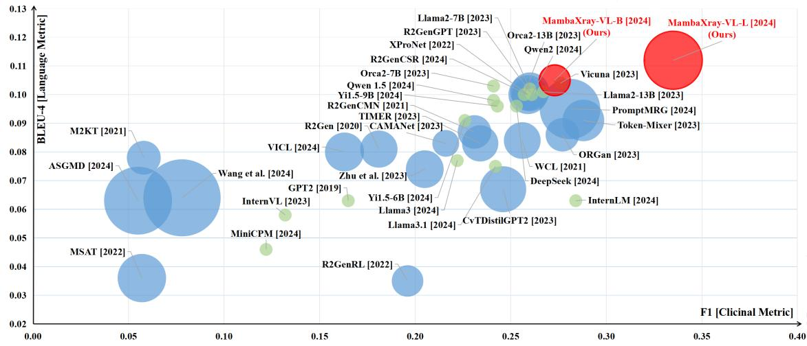
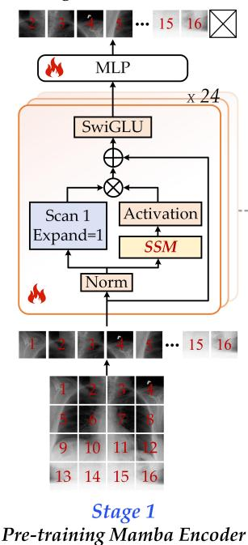
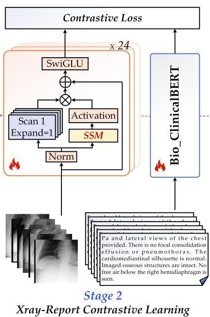
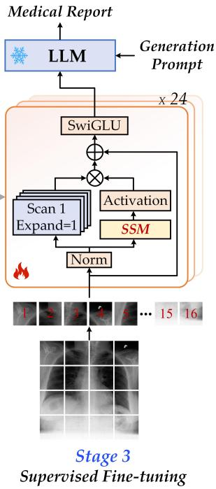

# CXPMRG-Bench: Pre-training and Benchmarking for X-ray Medical Report Generation on CheXpert Plus Dataset

Xiao Wang1, Fuling Wang1, Yuehang Li1, Qingchuan Ma1, Shiao Wang1, Bo Jiang1\*, Jin Tang1 1 School of Computer Science and Technology, Anhui University, Hefei, China {xiaowang, jiangbo, tangjin}@ahu.edu.cn

{e23201049, e23201112, e02114334}@stu.ahu.edu.cn, wsa1943230570@126.com

## Abstract

X-ray image-based medical report generation (MRG) is a pivotal area in artificial intelligence that can significantly reduce diagnostic burdens and patient wait times. Despite significant progress, we believe that the task has reached a bottleneck due to the limited benchmark datasets and the existing large models’ insufficient capability enhancements in this specialized domain. Specifically, the recently released CheXpert Plus dataset lacks comparative evaluation algorithms and their results, providing only the dataset itself. This situation makes the training, evaluation, and comparison of subsequent algorithms challenging. Thus, we conduct a comprehensive benchmarking of existing mainstream X-ray report generation models and large language models (LLMs), on the CheXpert Plus dataset. We believe that the proposed benchmark can provide a solid comparative basis for subsequent algorithms and serve as a guide for researchers to quickly grasp the state-of-the-art models in this field. More importantly, we propose a large model for the X-ray image report generation using a multi-stage pre-training strategy, including self-supervised autoregressive generation and Xray-report contrastive learning, and supervisedfine-tuning. Extensive experimental results indicate that the autoregressive pretraining based on Mamba effectively encodes X-ray images, and the image-text contrastive pre-training further aligns the feature spaces, achieving better experimental results. Source code can be found on https://github.com/ Event-AHU/Medical\_Image\_Analysis.

## 1. Introduction

X-ray image based Medical Report Generation (MRG) is a critical research problem in artificial intelligence, which targets describing thefindings or impressions from the given X-ray data using natural language. The successful implementation of this task can significantly reduce the diagnostic burden on physicians, decrease patient wait times, and foster the positive application of artificial intelligence. However, the path to progress in this direction is not smooth sailing, there remain formidable challenges that need to be overcome. The challenging issues include image interpretation, data annotation, heterogeneity issues, consistency and standardization of reports, diversity and variability of diseases, interpretability of algorithms, etc. How to address these challenges further and improve the quality of medical report generation remains an urgent research problem.

After revisiting the mainstream algorithms of X-ray image medical report generation, we find that datasets like IU X-ray and MIMIC-CXR are widely used for the training and evaluation of report generation models. However, the IU X-ray only contains 7,470 images and 3,955 radiology reports samples, which is rather limited, especially in the large model era. The recently released CheXpert Plus dataset [6] is a large-scale dataset for the X-ray report generation, however, they did not release comparative methods, making it difficult for subsequent algorithms to conduct experiments and comparisons on this dataset. Therefore, we conduct a comprehensive benchmarking of existing opensourced mainstream X-ray report generation models, Large Language Models (LLMs), and Vision-Language Models (VLMs), termed CXPMRG-Bench, on the newly released CheXpert Plus dataset, as shown in Fig. 1. The completion of this work can also help researchers identify which large models and algorithms are currently leading in the field of X-ray report generation.

On the other hand, most mainstream algorithms follow the encoder-decoder framework which usually adopts the vision encoder (e.g., ResNet [19], Transformer [42]) to process the given X-ray data and a text decoder (e.g., LSTM [21], GRU [12], Transformer [42]) for report generation. Along with the development of pre-trained LLM and VLM, the quality of medical reports is enhanced significantly. There are already some researchers who exploit the pre-training for the X-ray report generation. For example, Wang et al. [47] propose high-definition X-ray vision models using context-aware masked auto-encoder. CXR-CLIP [57] is a new pre-training method that generates more image-text pairs and introduces contrastive loss to enhance the discriminative power of images and texts, effectively learning features in the CXR domain. PTUnifier [10] proposes a simple and effective method that utilizes visual and textual prompt pools to make the model compatible with different types of inputs, thereby unifying the advantages of fusion encoders and dual encoders. However, we believe these models may be limited by the following issues: Firstly, the Transformer vision backbone brings huge computational costs O(N2), which is not hardware friendly; Secondly, many X-ray models are pre-trained in a single stage, which may constrain their overall performance. As pure X-ray images are abundant and readily collectible, paired X-ray and report data are relatively scarce. Failing to utilize these visual data resources would be a significant missed opportunity.

  
Figure 1. An overview of the benchmarked LLM/VLM-based (green circle) and mainstream MRG models (blue circle) on the CheXpert Plus dataset in this paper.

To address the issues mentioned above, in this work, we exploit multi-stage pre-training for the X-ray image MRG task and propose the MambaXray-VL large model, including self-supervised autoregressive generation and Xrayreport contrastive learning, and supervised fine-tuning on each downstream report generation datasets, as shown in Fig. 2. Specifically speaking, we first partition and feed the X-ray image into the Mamba network to predict the next tokens based on previous context tokens in an autoregressive generation manner. This will enhance the vision perception ability of X-ray significantly using the relatively low-cost Mamba network (O(N)). For the second stage, we feed the paired X-ray image and corresponding reports into the Mamba vision backbone and text encoder (Bio ClinicalBERT [2], Llama2 [41]) for contrastive learning. It will align the X-ray image and reports using the pre-trained feature space. After that, we conduct supervised fine-tuning on each downstream X-ray report generation dataset to achieve higher performance by feeding the X-ray image into the pre-trained Mamba vision backbone network and LLM decoder network. Extensive experiments on three MRG benchmark datasets demonstrate that our pre-trained MambaXray-VL model achieves stateof-the-art performance.

To sum up, the contributions of this paper can be summarized as the following three aspects:

1). We conduct a comprehensive benchmark for the newly released CheXpert Plus dataset [6], termed CXPMRG-Bench, which covers 19 mainstream X-ray medical report generation algorithms, 14 large language models, and 2 vision-language models. All algorithms undergo uniform, non-truncation processing, directly calculating accuracy against the most original, authentic reports, ensuring absolute fairness and impartiality in the evaluation. To the best of our knowledge, this benchmark is the first large-scale evaluation of the CheXpert Plus dataset, provid ing subsequent researchers in the field of X-ray report generation with important reference and comparison criteria.

2). We propose a new pre-trained large model, termed MambaXray-VL, which adopts the Mamba as the vision encoder and the large language model as the text decoder. Unlike conventional complex Transformer vision models, our Mamba architecture, which employs a multi-stage pretraining strategy, has also achieved state-of-the-art performance.

3). We extend our research to a broader scope by conducting experiments on the IU X-ray and MIMIC-CXR datasets. We perform analytical experiments and visualizations to deepen the understanding of our MambaXray-VL model’s performance and its capabilities in generating Xray medical reports, thereby enhancing the robustness and generalizability of our findings across different datasets.

## 2. Related Work

## 2.1. X-ray Medical Report Generation

In recent years, X-ray medical report generation has garnered increasing attention. To enhance model performance, researchers have pursued various improvements in different directions. Specifically, DCL [26] introduces a Dynamic Graph at the visual features of medical images, leveraging knowledge to strengthen the feature representation of these images. RGRG [40] takes a novel approach by using object detection methods to extract lesion regions and then generating text based on these extracted regions, ultimately combining all the text to form the final report. R2GenGPT [50] replaces the decoder part of the traditional medical report generation framework with a more powerful large language model, achieving improved performance. R2GenCSR [46] is a recently proposed LLM-based framework for X-ray MRG which employs the Mamba as the visual backbone and retrieves contextual samples from the training set to enhance feature representation and discriminative learning.

It is evident that the vision encoders used in these models are all conventional networks pre-trained on ImageNet [38]: DCL [26] employs ViT [14], RGRG [40] uses ResNet50 [19], R2GenGPT [50] incorporates SwinTransformer [29], and R2GenCSR [46] leverages VMamba [28]. These encoders, pre-trained on non-medical X-ray images, exhibit certain limitations when extracting features from medical X-ray images. In contrast, our proposed MambaXray-VL is pre-trained on millions of datasets and has a natural advantage in the extraction of features from medical images, especially in the task of medical report generation.

## 2.2. Pre-trained Large Models

The pre-trained language models, vision models, and vision-language models are widely exploited in nowadays. Currently, the widely used MAE [20] (Masked Autoencoders) is a self-supervised learning method for computer vision, known for its scalability and simplicity. Recently, Apple’s team proposed AIM [16], a series of vision models using autoregressive objectives for pretraining, inspired by large language models, demonstrating similar scaling properties. ARM [37] is a new self-supervised visual representation learning method based on AIM [16] and Mamba [18]. Through the autoregressive generation based pre-training, the visual capabilities of the Mamba model can be significantly enhanced, outperforming other training strategies in terms of both efficiency and performance. CLIP [36] (Contrastive Language-Image Pre-Training) jointly trains image and text encoders using contrastive learning. The key idea is to enable the model to understand and process multi-modal data (images and text) through joint training. Inspired by these works, our newly proposed MambaXray-VL utilizes autoregressive generation based pre-training, and CLIP pretraining can achieve better results on medical report generation.

## 3. MambaXray-VL Large Model

## 3.1. Overview

As shown in Fig. 2, we propose a new multi-stage pretraining strategy for the X-ray image medical report generation, including self-supervised autoregressive generation, Xray-report contrastive learning, and supervisedfinetuning. The key insight of multi-stage pre-training instead of joint training is that the aligned Xray-report data are limited, but there are more publicly available X-ray images. Thus, we first pre-train a large-scale vision backbone network on X-ray images using Mamba layers for a better balance between computational cost and accuracy. More importantly, we use ARG (autoregressive generation) for self-supervised learning on X-ray images, performing similarly or better than the widely used MAE pre-training strategy. In theory, compared to the MAE framework, ARG is better suited for handling complex X-ray images by gradually generating image features and maintaining structural consistency. Then, we transfer the Mamba vision backbone to the second stage, i.e., Xray-report contrastive learning. Specifically, we feed the paired data into the pre-trained Mamba vision backbone and language encoder for the vision-language feature extraction. This stage will project the vision and language representations into a shared feature space to bridge the vision-semantic gaps. Finally, we conduct supervised fine-tuning on the training subset of downstream datasets for the X-ray medical report generation. Compared to joint training, multi-stage training allows the model to optimize gradually, avoiding task conflicts, improving image understanding and text generation quality, and ensuring training efficiency and stability.

## 3.2. Multi-Stage Pre-training

As illustrated in Fig. 2, our proposed MambaXray-VL large model contains three training stages which will be introduced in the following paragraphs respectively.

• Stage #1: Auto-regressive Generation for Mamba Vision Encoder Pre-training. To make full use of existing X-ray images, we conduct self-supervised learning to obtain a strong vision backbone network. Different from the widely used MAE-based framework, in this work, we find that the autoregressive generation based framework works similar or even better for the X-ray images, inspired by the success of autoregressive generation in Chat-

  
Figure 2. An overview of our proposed MambaXray-VL pre-training framework. It contains three training stages, i.e., Mamba-based autoregressive generation, Xray-report based contrastive learning, and supervised fine-tuning. Specifically, the first phase mainly aims to make full use of larger-scale X-ray visual data to obtain a better visual backbone network (this paper chooses the low-complexity Mamba model). The second phase uses image-text contrastive loss to align X-ray images with medical reports. The third phase can fine-tune on various medical report generation datasets to obtain more refined X-ray report generation results. Note that the layers or modules with fire/snow symbols denote the parameters that are tuned/frozen in the training phase.

GPT [32], GPT-4 [1], and ARM [37]. Let’s denote the X-ray image as $\mathcal { T } ~ \in ~ \mathbb { R } ^ { 1 9 2 \times 1 9 2 \times 3 }$ , we first partition it into non-overlapping image patches $\mathcal { P } _ { i } \in \mathbb { R } ^ { 1 6 \times 1 6 \times 3 } , i =$ $\{ 1 , 2 , . . . , N \}$ and project them into visual tokens $\begin{array} { r l } { \mathcal { T } _ { i } } & { { } \in } \end{array}$ $\mathbb { R } ^ { 1 0 2 4 } , i = \{ 1 , 2 , . . . , N \}$ using a convolutional layer (kernel size $1 6 \times 1 6 )$ . Here, N is 144 when the resolution of the input X-ray image is set as $3 \times 1 9 2 \times 1 9 2$ . Then, we feed the visual tokens into the Vim [60] backbone network for feature extraction whose complicity O(N) is much lower than the widely used Transformer $\mathcal { O } ( N ^ { 2 } )$ . The key operation of Vim is the Mamba block (a specific variation of State Space Model [48]), as shown in Fig. 2. The visual tokens will first be normalized and fed into the SSM and scan branches. The outputs will be multiplied and added with residual connections. The SwiGLU [39] is adopted to further process output features before being fed into subsequent Mamba blocks. Finally, an MLP layer is adopted for token reconstruction using the auto-regressive generation loss function.

The objective of autoregressive pre-training is to predict the probability of the next token one by one based on the given corpus $\mathcal { T } = \{ \mathcal { T } _ { 1 } , \mathcal { T } _ { 2 } , . . . , \mathcal { T } _ { n } \}$ , which can be written

as:

$$
p ( \mathcal { T } ) = \prod _ { i = 1 } ^ { n } p ( \mathcal { T } _ { i } | \mathcal { T } _ { 1 } , . . . , \mathcal { T } _ { i - 1 } , \Theta ) .\tag{1}
$$

We can find that the likelihood of each token $\mathcal { T } _ { i }$ is computed based on the context of all the proceeding tokens $\{ \mathcal { T } _ { 1 } , . . . , \mathcal { T } _ { i - 1 } \}$ . Thus, the loss function used for stage 1 can be formulated as follows:

$$
\mathcal { L } _ { A R } = \sum _ { i = 1 } ^ { n - 1 } | V i m ( [ \mathcal { T } _ { 1 } , . . . , \mathcal { T } _ { i } ] ) - \mathcal { T } _ { i + 1 } | ^ { 2 } .\tag{2}
$$

• Stage #2: Xray-Report Contrastive Learning. We adopt the Mamba vision backbone network from the first stage and conduct contrastive learning on the paired Xrayreport samples. This will further align the dual modalities as validated in the CLIP [36]. In our implementation, we randomly sample a mini-batch and feed the X-ray images and medical reports into the Vim backbone and the language model (Bio ClinicalBERT [2], Llama2 [41]) and compute the cosine similarity between the paired and unpaired samples:

$$
\mathcal { L } _ { C T L } = S i m i l a r i t y ( V i m ( \mathbb { Z } _ { i } ) , L M ( \mathcal { R } _ { j } ) ) ,\tag{3}
$$

where i and j are the index of the X-ray image and report annotation.

• Stage #3: Supervised Fine-tuning. After the two pretraining stages, we conduct supervised fine-tuning on the training subset of X-ray image medical report generation. Similar to the first stage, we partition the given X-ray image into non-overlapping patches and project them into visual tokens. Then, the pre-trained Vim backbone network is used for the feature extraction. We concatenate the visual tokens and generation prompt as the input of a large language model for high-performance medical report generation.

In this stage, we adopt the negative log-likelihood as the loss function, i.e.,

$$
\mathcal { L } _ { N L L } = - \sum _ { i = 1 } ^ { T } l o g p _ { \theta } ( y _ { i } | P r o m p t , [ y _ { 1 } , . . . , y _ { i - 1 } ] ) ,\tag{4}
$$

where θ denotes the trainable parameters and T is the number of words the large language model predicted. P rompt is the instruction prompt which is “Generate a comprehensive and detailed diagnosis report for this chest X-ray image.” used in our experiments.

• Fine-tuning Stage implementation details. In the downstream fine-tuning stage, we tested the model’s performance on three different public datasets. On the IU-Xray [13] dataset, we set the maximum training epochs to 30 and the batch size to 20. The visual encoder used was Vim [60], loaded with weights from the second stage of pretraining, while the large language model was Qwen-1.5-1.8B [17], with max tokens output set to 60 and a validation frequency of 1, meaning we validated after each training epoch. On the MIMIC-CXR [25] and CheXpert Plus [6] datasets, we set the maximum training epochs to 6 and the batch size to 18. The visual encoder remained unchanged, while the large language model used was Llama2-7B [41], with max tokens output set to 100 and a validation frequency of 0.5, meaning we validated at both the end of each training cycle and after the training was complete. We froze the large language model and trained only the visual encoder and the visual mapper layer, by following the R2GenGPT [50].

## 4. CXPMRG-Bench

## 4.1. Mainstream MRG Algorithms

For the mainstream X-ray image MRG algorithms, as shown in Table 1, we train and test 21 open-sourced algorithms from the year 2020 to the year 2024. These models adopt the CNN (ORGan [22], M2KT [54], ASGMD [52], Token-Mixer [55], PromptMRG [24]), Transformer (R2GenRL [34], XProNet [44], MSAT [49], TIMER [51], CvT2DistilGPT2 [31], R2Gen [8], R2GenCMN [9], Zhu et al. [61], CAMANet [45], R2GenGPT [50], WCL [53], VLCI [7], Wang et al. [47]), and Mamba (R2GenCSR [46], MambaXray-VL-B, MambaXray-VL-L) as their vision backbone network, and utilize the LSTM, Transformer based model as the decoder network. Note that the MambaXray-VL-B and MambaXray-VL-L are two models introduced in the previous section of this paper.

When reproducing these X-ray based MRG models, we found that some algorithms use truncated ground truth for comparison, which we believe may not accurately reflect the true evaluation results. Therefore, we abandoned the truncation mechanism and used the complete ground truth for result evaluation, making the obtained results more accurate and reliable.

## 4.2. LLMs for MRG

We evaluate a total of 16 open-source LLMs, as shown in Table 2, including Vicuna-7B [59], QWen1.5- 7B [17], QWen2-7B-Instruct [17], InternLM-7B [5], Llama2-7B [41], Llama2-13B [41], Llama3-8B [15], Llama3.1-8B [15], GPT2-Medium [35], Orca 2-7B [30], Orca 2-13B [30], DeepSeek-LLM-7B-Chat [4], Yi-1.5- 6B-Chat [58], Yi-1.5-9B-Chat [58]. Note that part of the LLMs is selected from open-llm-leaderboard 1 and integrated with R2GenGPT [50] model by replacing the Llama2 language decoder with corresponding LLMs. In our implementation, we keep the visual encoder SwinTransformer unchanged for a fair comparison. In addition, we also test two pre-trained vision-language large models, i.e., InternVL-2 [11] and MiniCPM-V2.5 [56], to check whether a better performance can be obtained, as shown in Table 2.

## 4.3. Evaluation Results

[Mainstream MRG Models] As shown in Table 1, there are five MRG models which achieve a higher B4 metric, i.e., the XProNet [44] (0.100), R2GenGPT [50] (0.101), R2GenCSR [46] (0.100), and our newly proposed MambaXray-VL-B and MambaXray-VL-L which achieves 0.105, and 0.112, respectively. It is intuitive to find that the large language model Llama2 works well for the MRG task. For F1 in the clinical metric, the top-5 models are our newly proposed MambaXray-VL-L (0.335), Token-Mixer [55] (0.288), PromptMRG [24] (0.281), ORGan [22] (0.277) and our proposed MambaXray-VL-B (0.273). From these results, we can find that our proposed multi-stage pretraining strategy is rather effective in the disease-aware perception of the MRG.

[LLM/VLM based MRG Models] As shown in Table 2, we also report the performance of existing widely used LLMs by replacing the Llama2 based on the R2Gen-GPT framework (SwinTransformer is adopted as the vision backbone network). It is easy to find that the Vicuna-V1.5 [59] released in the year 2023 achieves the best B4 metric and the InternLM [5] performs the best on the F1 clinical metric. For the two vision-language models we evaluated, i.e., the InternVL-2 and MiniCPM-V2.5, we can find that their results are not as good as other LLM-based models, although they have similar parameters. These results demonstrate that the vision-language models pre-trained on natural image-pairs may have large gaps with the X-ray medical images. Compared with the mainstream MRG models reported in Table 1, the LLM-based MRG achieves better results than regular language decoders which demonstrates the effectiveness of pre-trained LLMs.

Table 1. Experimental Results on the CheXpert Plus Dataset using Mainstream Medical Report Generation Algorithms. B4, R-L, M, and C is short for BlEU-4, ROUGE-L, METEOR, CIDEr, respectively. P, R, and F1 is short for Precision, Recall, F1 score, respectively. min is short for minutes. The Param listed in this table denotes the parameters needed to be tuned in the training phase. The best result is highlighted in bold, and the second-best result is underlined.
<table><tr><td rowspan=1 colspan=1>Index</td><td rowspan=1 colspan=1>Algorithm</td><td rowspan=1 colspan=1>Publish</td><td rowspan=1 colspan=1>Encoder</td><td rowspan=1 colspan=1>Decoder</td><td rowspan=1 colspan=1>B4,R-L,M, C</td><td rowspan=1 colspan=1>P, R,  F1</td><td rowspan=1 colspan=1>Time (min)</td><td rowspan=1 colspan=1>Param (M)</td><td rowspan=1 colspan=1>Code</td></tr><tr><td rowspan=1 colspan=1>#01</td><td rowspan=1 colspan=1>R2Gen [8]</td><td rowspan=1 colspan=1>EMNLP20</td><td rowspan=1 colspan=1>Transformer</td><td rowspan=1 colspan=1>Transformer</td><td rowspan=1 colspan=1>0.081, 0.246, 0.113, 0.077</td><td rowspan=1 colspan=1>0.318, 0.200, 0.181</td><td rowspan=1 colspan=1>110.05</td><td rowspan=1 colspan=1>83.5</td><td rowspan=1 colspan=1>URL</td></tr><tr><td rowspan=1 colspan=1>#02</td><td rowspan=1 colspan=1>M2KT [54]</td><td rowspan=1 colspan=1>MIA21</td><td rowspan=1 colspan=1>CNN</td><td rowspan=1 colspan=1>Transformer</td><td rowspan=1 colspan=1>0.078, 0.247, 0.101, 0.077</td><td rowspan=1 colspan=1>0.044, 0.142, 0.058</td><td rowspan=1 colspan=1>22.5</td><td rowspan=1 colspan=1>69.07</td><td rowspan=1 colspan=1>URL</td></tr><tr><td rowspan=1 colspan=1>#03</td><td rowspan=1 colspan=1>R2GenCMN [9]</td><td rowspan=1 colspan=1>ACL21</td><td rowspan=1 colspan=1>Transformer</td><td rowspan=1 colspan=1>Transformer</td><td rowspan=1 colspan=1>0.087, 0.256, 0.127, 0.102</td><td rowspan=1 colspan=1>0.329, 0.241, 0.231</td><td rowspan=1 colspan=1>66.08</td><td rowspan=1 colspan=1>67.70</td><td rowspan=1 colspan=1>URL</td></tr><tr><td rowspan=1 colspan=1>#04</td><td rowspan=1 colspan=1>WCL [53]</td><td rowspan=1 colspan=1>EMNLP21</td><td rowspan=1 colspan=1>Transformer</td><td rowspan=1 colspan=1>Transformer</td><td rowspan=1 colspan=1>0.084, 0.253, 0.126, 0.103</td><td rowspan=1 colspan=1>0.335, 0.259, 0.256</td><td rowspan=1 colspan=1>24.08</td><td rowspan=1 colspan=1>81.29</td><td rowspan=1 colspan=1>URL</td></tr><tr><td rowspan=1 colspan=1>#05</td><td rowspan=1 colspan=1>R2GenRL [34]</td><td rowspan=1 colspan=1>ACL22</td><td rowspan=1 colspan=1>Transformer</td><td rowspan=1 colspan=1>Transformer</td><td rowspan=1 colspan=1>0.035, 0.186, 0.101, 0.012</td><td rowspan=1 colspan=1>0.193, 0.229, 0.196</td><td rowspan=1 colspan=1>44.33</td><td rowspan=1 colspan=1>59.87</td><td rowspan=1 colspan=1>URL</td></tr><tr><td rowspan=1 colspan=1>#06</td><td rowspan=1 colspan=1>XProNet [44]</td><td rowspan=1 colspan=1>ECCV22</td><td rowspan=1 colspan=1>Transformer</td><td rowspan=1 colspan=1>Transformer</td><td rowspan=1 colspan=1>0.100, 0.265, 0.146, 0.121</td><td rowspan=1 colspan=1>0.314, 0.247, 0.259</td><td rowspan=1 colspan=1>6.3</td><td rowspan=1 colspan=1>62.35</td><td rowspan=1 colspan=1>URL</td></tr><tr><td rowspan=1 colspan=1>#07</td><td rowspan=1 colspan=1>MSAT [49]</td><td rowspan=1 colspan=1>MICCAI22</td><td rowspan=1 colspan=1>ViT-B/16</td><td rowspan=1 colspan=1>Transformer</td><td rowspan=1 colspan=1>0.036, 0.156, 0.066, 0.018</td><td rowspan=1 colspan=1>0.044, 0.142, 0.057</td><td rowspan=1 colspan=1>5.72</td><td rowspan=1 colspan=1>141.10</td><td rowspan=1 colspan=1>URL</td></tr><tr><td rowspan=1 colspan=1>#08</td><td rowspan=1 colspan=1>ORGan [22]</td><td rowspan=1 colspan=1>ACL23</td><td rowspan=1 colspan=1>CNN</td><td rowspan=1 colspan=1>Transformer</td><td rowspan=1 colspan=1>0.086, 0.261, 0.135, 0.107</td><td rowspan=1 colspan=1>0.288, 0.287, 0.277</td><td rowspan=1 colspan=1>46.66</td><td rowspan=1 colspan=1>67.50</td><td rowspan=1 colspan=1>URL</td></tr><tr><td rowspan=1 colspan=1>#09</td><td rowspan=1 colspan=1>TIMER [51]</td><td rowspan=1 colspan=1>CHIL23</td><td rowspan=1 colspan=1>Transformer</td><td rowspan=1 colspan=1>Transformer</td><td rowspan=1 colspan=1>0.083, 0.254, 0.121, 0.104</td><td rowspan=1 colspan=1>0.345, 0.238, 0.234</td><td rowspan=1 colspan=1>26.5</td><td rowspan=1 colspan=1>79.28</td><td rowspan=1 colspan=1>URL</td></tr><tr><td rowspan=1 colspan=1>#10</td><td rowspan=1 colspan=1>CvT2DistilGPT2 [31]</td><td rowspan=1 colspan=1>AIM23</td><td rowspan=1 colspan=1>Transformer</td><td rowspan=1 colspan=1>GPT2</td><td rowspan=1 colspan=1>0.067, 0.238, 0.118, 0.101</td><td rowspan=1 colspan=1>0.285, 0.252, 0.246</td><td rowspan=1 colspan=1>13.93</td><td rowspan=1 colspan=1>128</td><td rowspan=1 colspan=1>URL</td></tr><tr><td rowspan=1 colspan=1>#11</td><td rowspan=1 colspan=1>Zhu et al. [61]</td><td rowspan=1 colspan=1>MICCAI23</td><td rowspan=1 colspan=1>Transformer</td><td rowspan=1 colspan=1>Transformer</td><td rowspan=1 colspan=1>0.074, 0.235, 0.128, 0.078</td><td rowspan=1 colspan=1>0.217, 0.308, 0.205</td><td rowspan=1 colspan=1>10.03</td><td rowspan=1 colspan=1>85.95</td><td rowspan=1 colspan=1>URL</td></tr><tr><td rowspan=1 colspan=1>#12</td><td rowspan=1 colspan=1>CAMANet [45]</td><td rowspan=1 colspan=1>IEEE JBH23</td><td rowspan=1 colspan=1>Swin-Former</td><td rowspan=1 colspan=1>Transformer</td><td rowspan=1 colspan=1>0.083, 0.249, 0.118, 0.090</td><td rowspan=1 colspan=1>0.328, 0.224, 0.216</td><td rowspan=1 colspan=1>23.08</td><td rowspan=1 colspan=1>43.22</td><td rowspan=1 colspan=1>URL</td></tr><tr><td rowspan=1 colspan=1>#13</td><td rowspan=1 colspan=1>Token-Mixer [55]</td><td rowspan=1 colspan=1>IEEE TMI23</td><td rowspan=1 colspan=1>ResNet-50</td><td rowspan=1 colspan=1>Transformer</td><td rowspan=1 colspan=1>0.091, 0.261, 0.135, 0.098</td><td rowspan=1 colspan=1>0.309, 0.270, 0.288</td><td rowspan=1 colspan=1>17.54</td><td rowspan=1 colspan=1>104.34</td><td rowspan=1 colspan=1>URL</td></tr><tr><td rowspan=1 colspan=1>#14</td><td rowspan=1 colspan=1>R2GenGPT [50]</td><td rowspan=1 colspan=1>Meta-Rad.23</td><td rowspan=1 colspan=1>Swin-Transformer</td><td rowspan=1 colspan=1>Llama2</td><td rowspan=1 colspan=1>0.101, 0.266, 0.145, 0.123</td><td rowspan=1 colspan=1>0.315, 0.244, 0.260</td><td rowspan=1 colspan=1>77.8</td><td rowspan=1 colspan=1>90.9</td><td rowspan=1 colspan=1>URL</td></tr><tr><td rowspan=1 colspan=1>#15</td><td rowspan=1 colspan=1>ASGMD [52]</td><td rowspan=1 colspan=1>ESWA24</td><td rowspan=1 colspan=1>ResNet-101Transformer</td><td rowspan=1 colspan=1>Transformer</td><td rowspan=1 colspan=1>0.063, 0.220, 0.094, 0.044</td><td rowspan=1 colspan=1>0.146, 0.108, 0.055</td><td rowspan=1 colspan=1>87.37</td><td rowspan=1 colspan=1>277.41</td><td rowspan=1 colspan=1>URL</td></tr><tr><td rowspan=1 colspan=1>#16</td><td rowspan=1 colspan=1>PromptMRG [24]</td><td rowspan=1 colspan=1>AAAI24</td><td rowspan=1 colspan=1>ResNet-101</td><td rowspan=1 colspan=1>Bert</td><td rowspan=1 colspan=1>0.095, 0.222, 0.121, 0.044</td><td rowspan=1 colspan=1>0.258, 0.265, 0.281</td><td rowspan=1 colspan=1>108.45</td><td rowspan=1 colspan=1>219.92</td><td rowspan=1 colspan=1>URL</td></tr><tr><td rowspan=1 colspan=1>#17</td><td rowspan=1 colspan=1>R2GenCSR [46]</td><td rowspan=1 colspan=1>arXiv24</td><td rowspan=1 colspan=1>VMamba</td><td rowspan=1 colspan=1>Llama2</td><td rowspan=1 colspan=1>0.100, 0.265, 0.146, 0.121</td><td rowspan=1 colspan=1>0.315, 0.247, 0.259</td><td rowspan=1 colspan=1>31.2</td><td rowspan=1 colspan=1>91.7</td><td rowspan=1 colspan=1>URL</td></tr><tr><td rowspan=1 colspan=1>#18</td><td rowspan=1 colspan=1>VLCI [7]</td><td rowspan=1 colspan=1>arXiv24</td><td rowspan=1 colspan=1>Transformer</td><td rowspan=1 colspan=1>Transformer</td><td rowspan=1 colspan=1>0.080, 0.247, 0.114, 0.072</td><td rowspan=1 colspan=1>0.341, 0.175, 0.163</td><td rowspan=1 colspan=1>123.71</td><td rowspan=1 colspan=1>91.46</td><td rowspan=1 colspan=1>URL</td></tr><tr><td rowspan=1 colspan=1>#19</td><td rowspan=1 colspan=1>Wang et al. [47]</td><td rowspan=1 colspan=1>arXiv24</td><td rowspan=1 colspan=1>ViT</td><td rowspan=1 colspan=1>Llama2</td><td rowspan=1 colspan=1>0.064, 0.220, 0.110, 0.059</td><td rowspan=1 colspan=1>0.175, 0.099, 0.078</td><td rowspan=1 colspan=1>10.82</td><td rowspan=1 colspan=1>358.80</td><td rowspan=1 colspan=1>URL</td></tr><tr><td rowspan=1 colspan=1>#20</td><td rowspan=1 colspan=1>MambaXray-VL-B</td><td rowspan=1 colspan=1>Ours</td><td rowspan=1 colspan=1>MambaXray-VL</td><td rowspan=1 colspan=1>Llama2</td><td rowspan=1 colspan=1>0.105, 0.267, 0.149, 0.117</td><td rowspan=1 colspan=1>0.333, 0.264, 0.273</td><td rowspan=1 colspan=1>50.66</td><td rowspan=1 colspan=1>57.31</td><td rowspan=1 colspan=1>URL</td></tr><tr><td rowspan=1 colspan=1>#21</td><td rowspan=1 colspan=1>MambaXray-VL-L</td><td rowspan=1 colspan=1>Ours</td><td rowspan=1 colspan=1>MambaXray-VL</td><td rowspan=1 colspan=1>Llama2</td><td rowspan=1 colspan=1>0.112, 0.276, 0.157, 0.139</td><td rowspan=1 colspan=1>0.377, 0.319, 0.335</td><td rowspan=1 colspan=1>55.18</td><td rowspan=1 colspan=1>202.32</td><td rowspan=1 colspan=1>URL</td></tr></table>

[Efficiency & Parameters] From the perspective of running efficiency, we test these models on a server with A800 GPUs (80GB). Note that, we set the batch size as large as possible to make full use of the GPU memory. As a result, we can find that MSAT [49] and XProNet [44] are the first two algorithms that only need 5.72 and 6.3 minutes for the testing subset. R2Gen [8], PromptMRG [24], and VLCI [7] are relatively slow and need more than 100 minutes on the testing subset of CheXpert Plus dataset. For the LLM-based MRG reported in Table 2, we can find that Yi-1.5 [58] with 6.1B and 8.8B achieves better efficiency which needs 43.66 and 48.50 minutes for the testing. From the Fig. 1 and Table 1, we can find that the ASGMD [52], PromptMRG [24], Wang et al. [47], and our MambaXray-VL-L contains the most parameters (larger than 200M) needed to be tuned in the training phase. However, we can find that our model runs faster than these large models which only need 55.18 minutes. It fully validated the efficiency of our proposed framework for the X-ray image based medical report generation.

## 5. Experiments

## 5.1. Dataset

In the first stage of autoregressive pre-training, we used about 1.27 million medical chest X-ray images proposed in the work [47]. In the second stage of image-text contrastive learning pre-training, we used a combination of training data from the MIMIC-CXR [25], CheXpert Plus [6], and IU X-ray [13] datasets, totaling 480k image-report pairs. Note that the CheXpert Plus dataset used here consists of images and impressions, not the image and findings combination used in the third stage. We strictly excluded any testing samples used in the third stage, resulting in a total of 210k image-impression pairs. In the third stage, We evaluate the performance of our model on three datasets, including IU X-Ray [13], MIMIC-CXR [25], and CheXpert Plus [6] dataset.

## 5.2. Evaluation Metric

For the X-ray medical report generation, we evaluate the model using widely used natural language generation (NLG) metrics, including CIDEr [43], BLEU [33], ROUGE-L [27], and METEOR [3]. To measure the accuracy of descriptions for clinical abnormalities, we also report Clinical Efficacy (CE) metrics. CE metrics require the use of the CheXpert [23] toolkit to first extract labels from predictive reports and ground truth, and then to compare the presence status of important clinical observations to capture the diagnostic accuracy of the generated reports. We use Precision, Recall, and F1 to evaluate model performance for clinical efficacy metrics. We would like to specifically emphasize that, unless otherwise stated, all CE metric values in this article are calculated using macro-average.

Table 2. Experimental Results of Medical Report Generation on the CheXpert Plus Dataset using different LLMs and VLMs based on R2Gen-GPT. The symbol † indicates that the model is a VLM. The Param listed in this table denotes the parameters of LLM/VLM.
<table><tr><td>Index</td><td>LLM/VLM</td><td>Year</td><td>B4</td><td>R-L</td><td>M</td><td>C</td><td>P</td><td>R</td><td>F1</td><td>Time (min)</td><td>Param</td><td>Code</td></tr><tr><td>#01</td><td>Vicuna-V1.5 [59]</td><td>2023</td><td>0.104</td><td>0.272</td><td>0.160</td><td>0.202</td><td>0.334</td><td>0.258</td><td>0.276</td><td>72.00</td><td>6.7B</td><td>URL</td></tr><tr><td>#02</td><td>Qwen-1.5 [17]</td><td>2024</td><td>0.098</td><td>0.262</td><td>0.139</td><td>0.139</td><td>0.303</td><td>0.233</td><td>0.241</td><td>154.25</td><td>7.7B</td><td>URL</td></tr><tr><td>#03</td><td>Qwen-2 [17]</td><td>2024</td><td>0.100</td><td>0.270</td><td>0.142</td><td>0.159</td><td>0.313</td><td>0.269</td><td>0.261</td><td>103.33</td><td>7.6B</td><td>URL</td></tr><tr><td>#04</td><td>InternLM [5]</td><td>2024</td><td>0.063</td><td>0.207</td><td>0.136</td><td>0.104</td><td>0.307</td><td>0.274</td><td>0.284</td><td>294.00</td><td>7.3B</td><td>URL</td></tr><tr><td>#05</td><td>Llama-2 [41]</td><td>2023</td><td>0.102</td><td>0.267</td><td>0.157</td><td>0.179</td><td>0.315</td><td>0.244</td><td>0.260</td><td>77.78</td><td>6.7B</td><td>URL</td></tr><tr><td>#06</td><td>Llama-2 [41]</td><td>2023</td><td>0.101</td><td>0.269</td><td>0.160</td><td>0.214</td><td>0.321</td><td>0.254</td><td>0.267</td><td>116.42</td><td>13.0B</td><td>URL</td></tr><tr><td>#07</td><td>Llama-3 [15]</td><td>2024</td><td>0.077</td><td>0.220</td><td>0.121</td><td>0.134</td><td>0.306</td><td>0.232</td><td>0.222</td><td>130.00</td><td>8.0B</td><td>URL</td></tr><tr><td>#08</td><td>Llama-3.1 [15]</td><td>2024</td><td>0.075</td><td>0.221</td><td>0.121</td><td>0.136</td><td>0.295</td><td>0.251</td><td>0.242</td><td>110.00</td><td>8.0B</td><td>URL</td></tr><tr><td>#09</td><td>GPT2-Medium [35]</td><td>2019</td><td>0.063</td><td>0.198</td><td>0.104</td><td>0.067</td><td>0.358</td><td>0.186</td><td>0.165</td><td>57.33</td><td>354M</td><td>URL</td></tr><tr><td>#10</td><td>Orca-2 [30]</td><td>2023</td><td>0.103</td><td>0.270</td><td>0.161</td><td>0.199</td><td>0.330</td><td>0.251</td><td>0.271</td><td>177.33</td><td>6.7B</td><td>URL</td></tr><tr><td>#11</td><td>Orca-2 [30]</td><td>2023</td><td>0.100</td><td>0.266</td><td>0.159</td><td>0.187</td><td>0.317</td><td>0.242</td><td>0.257</td><td>108.66</td><td>13.0B</td><td>URL</td></tr><tr><td>#12</td><td>Deepseek-LLM [4]</td><td>2024</td><td>0.096</td><td>0.268</td><td>0.137</td><td>0.150</td><td>0.336</td><td>0.256</td><td>0.253</td><td>201.30</td><td>6.9B</td><td>URL</td></tr><tr><td>#13</td><td>Yi-1.5 [58]</td><td>2024</td><td>0.091</td><td>0.263</td><td>0.131</td><td>0.136</td><td>0.322</td><td>0.229</td><td>0.226</td><td>43.66</td><td>6.1B</td><td>URL</td></tr><tr><td>#14</td><td>Yi-1.5 [58]</td><td>2024</td><td>0.096</td><td>0.269</td><td>0.138</td><td>0.155</td><td>0.336</td><td>0.241</td><td>0.243</td><td>48.50</td><td>8.8B</td><td>URL</td></tr><tr><td>#15</td><td>InternVL-2† [11]</td><td>2023</td><td>0.058</td><td>0.188</td><td>0.112</td><td>0.085</td><td>0.196</td><td>0.127</td><td>0.132</td><td>108.50</td><td>8.0B</td><td>URL</td></tr><tr><td>#16</td><td>MiniCPM-V2.5† [56]</td><td>2024</td><td>0.046</td><td>0.177</td><td>0.085</td><td>0.076</td><td>0.254</td><td>0.152</td><td>0.122</td><td>51.50</td><td>8.4B</td><td>URL</td></tr></table>

## 5.3. Comparison with SOTA Algorithms

As shown in Table 1, our model MambaXray-VL-Large achieves state-of-the-art performance in all evaluation metric species. These include NLG evaluation metrics and CE evaluation metrics. In detail, for the NLG metrics, our scores on BLEU-4, ROUGE-L, METEOR, and CIDEr are 0.112, 0.276, 0.157, and 0.139, respectively. For the CE metrics, our scores on Precision (P), Recall (R), and F1- score (F1) are 0.377, 0.319, and 0.335, respectively. These experimental results fully demonstrate the superior performance of our model on the CheXpert Plus dataset. In terms of efficiency, our method took 55.18 minutes to complete the testing subset of the CheXpert Plus dataset with a parameter size of 202.32M, showing its effectiveness and efficiency in processing X-ray images. The details of the experimental results of our model MambaXray-VL on top of two widely used public datasets, IU-XRay and Mimic-CXR, as well as the results of the comparisons with the existing methods are available inside the supplementary material and appendixes. If this section is of interest, it can be viewed in the supplementary materials and appendixes.

## 5.4. Ablation Study

• Effectiveness of Autoregressive Generation for Pretraining on X-ray Image? As shown in Table 3, in terms of specific experimental accuracy, we first compare the Autoregressive Generation (ARG) pre-training with the Masked Auto-Encoder (MAE) pre-training. From the #02 and #03 rows, it can be seen that the results achieve 0.130/0.089 on the BLEU-4 metric of the MIMIC-CXR and CheXpert Plus datasets, respectively. Note that the ARG pre-training method outperforms the MAE on all metrics, with a +45% (i.e., (0.224-0.154)/0.154) improvement on CIDEr compared to MAE. The ARG-based pre-training achieves similar performance compared with MAE-based pre-training on the CheXpert Plus dataset.

• Effectiveness of Xray-Report Contrastive Learning. In addition, we further explored the impact of contrastive learning (CTL) on the final performance. The experimental results in the #05 and #06, or #08 and #09 rows of Table 3 demonstrate its effectiveness. After introducing the CTL loss, we find that the results on the MIMIC-CXR and CheXpert Plus datasets have all received improvement. More in detail, it improves the ROUGE-L metric by over +11% on the CheXpert Plus dataset. These experiments demonstrate the positive effect of the CTL loss we used in the pre-training stage.

• Comparison between Transformer and Mamba using Autoregressive Generation. As shown in the #01 and #09 rows of Table 3, the #01 row uses a visual coder based on the Transformer architecture, while the last row uses a visual coder with auto-regressive pre-training of the Mamba architecture. It can be clearly observed that the encoder based on the Mamba architecture achieves better performance in the vast majority of metrics, both on the MIMIC-

Table 3. Component analysis of the key modules in our framework on MIMIC-CXR and CheXpert Plus dataset. The symbol † indicates that we are using the Base version of the model, while the others are the Large versions. Vim-IN1K indicates the use of weights pre-trained on ImageNet-1K; Vim-PTD indicates the use of weights pre-trained on 1.27 million X-ray images; MAE represents the Masked Auto encoders pre-training framework; ARG represents the first-stage Auto-regressive Generation pre-training framework; CTL represents the contrastive learning loss between images and text in the second stage of training; SFT represents the third stage of supervised fine-tuning
<table><tr><td rowspan="2">Index</td><td rowspan="2">Vim-IN1K</td><td rowspan="2">Vim-PTD</td><td rowspan="2">MAE</td><td rowspan="2">ARG</td><td rowspan="2">CTL</td><td rowspan="2">SFT</td><td colspan="6">MIMIC-CXR</td><td rowspan="2"></td><td colspan="7">CheXpert Plus</td></tr><tr><td>B4</td><td>R-L</td><td>M C</td><td>P</td><td>R</td><td>F1</td><td>B4</td><td>R-L</td><td>M</td><td>C</td><td>P</td><td>R</td><td>F1</td></tr><tr><td>#01</td><td>x</td><td>x</td><td>x</td><td>x</td><td>x</td><td>V</td><td>0.125</td><td>0.285</td><td>0.167</td><td>0.244</td><td>0.354</td><td>0.249</td><td>0.269</td><td>0.101</td><td>0.266</td><td>0.145</td><td>0.123</td><td>0.315</td><td>0.244</td><td>0.260</td></tr><tr><td>#02</td><td>L</td><td>V</td><td>V</td><td>x</td><td>x</td><td></td><td>0.104</td><td>0.260</td><td>0.141</td><td>0.154</td><td>0.251</td><td>0.165</td><td>0.163</td><td>0.094</td><td>0.257</td><td>0.140</td><td>0.104</td><td>0.249</td><td>0.194</td><td>0.208</td></tr><tr><td>#03</td><td></td><td></td><td>x</td><td>√</td><td>x</td><td></td><td>0.130</td><td>0.286</td><td>0.162</td><td>0.224</td><td>0.329</td><td>0.243</td><td>0.255</td><td>0.089</td><td>0.247</td><td>0.134</td><td>0.089</td><td>0.279</td><td>0.240</td><td>0.248</td></tr><tr><td>#04†</td><td></td><td>x</td><td>x</td><td></td><td>x</td><td></td><td>0.108</td><td>0.264</td><td>0.144</td><td>0.170</td><td>0.273</td><td>0.171</td><td>0.180</td><td>0.090</td><td>0.249</td><td>0.132</td><td>0.103</td><td>0.262</td><td>0.195</td><td>0.209</td></tr><tr><td>#05†</td><td></td><td></td><td>x</td><td></td><td>x</td><td></td><td>0.121</td><td>0.280</td><td>0.161</td><td>0.224</td><td>0.331</td><td>0.257</td><td>0.269</td><td>0.093</td><td>0.254</td><td>0.138</td><td>0.102</td><td>0.297</td><td>0.226</td><td>0.241</td></tr><tr><td>#06†</td><td></td><td>V</td><td>x</td><td></td><td>√</td><td></td><td>0.129</td><td>0.283</td><td>0.162</td><td>0.206</td><td>0.378</td><td>0.274</td><td>0.290</td><td>0.105</td><td>0.267</td><td>0.149</td><td>0.117</td><td>0.333</td><td>0.264</td><td>0.273</td></tr><tr><td>#07</td><td></td><td>X</td><td>X</td><td></td><td>x</td><td></td><td>0.105</td><td>0.258</td><td>0.139</td><td>0.143</td><td>0.248</td><td>0.162</td><td>0.167</td><td>0.082</td><td>0.236</td><td>0.126</td><td>0.080</td><td>0.228</td><td>0.166</td><td>0.165</td></tr><tr><td>#08</td><td></td><td></td><td>x</td><td></td><td>x</td><td></td><td>0.130</td><td>0.286</td><td>0.162</td><td>0.224</td><td>0.329</td><td>0.243</td><td>0.255</td><td>0.089</td><td>0.247</td><td>0.134</td><td>0.089</td><td>0.279</td><td>0.240</td><td>0.248</td></tr><tr><td>#09</td><td></td><td></td><td>x</td><td></td><td></td><td></td><td>0.133</td><td>0.289</td><td>0.167</td><td>0.241</td><td>0.371</td><td>0.321</td><td>0.340</td><td>0.112</td><td>0.276</td><td>0.157</td><td>0.139</td><td>0.377</td><td>0.319</td><td>0.335</td></tr></table>

Table 4. Comparison of the text encoders used in the second stage on the MIMIC-CXR and CheXpert Plus datasets.
<table><tr><td rowspan="2">LLM</td><td colspan="3">MIMIC-CXR</td><td colspan="4">CheXpert Plus</td></tr><tr><td>BLEU-4 ROUGE-L</td><td>METEOR</td><td>CIDEr</td><td>BLEU-4</td><td>ROUGE-L</td><td>METEOR</td><td>CIDEr</td></tr><tr><td>Baseline</td><td>0.125 0.285</td><td>0.167</td><td>0.244</td><td>0.101</td><td>0.266</td><td>0.145</td><td>0.123</td></tr><tr><td>Llama2 [41]</td><td>0.122 0.276</td><td>0.157</td><td>0.211</td><td>0.066</td><td>0.233</td><td>0.124</td><td>0.043</td></tr><tr><td>Bio_ClinicalBERT [2]</td><td>0.133 0.289</td><td>0.167</td><td>0.241</td><td>0.112</td><td>0.276</td><td>0.157</td><td>0.139</td></tr></table>

CXR and CheXpert Plus datasets, especially on BLEU-4 for the MIMIC-CXR data, where the Mamba architecture improves by +6% compared to the Transformer architecture. However, on the MIMIC-CXR dataset, the metric CIDEr does not score significantly better than the Transformer architecture. Overall, this series of experiments is sufficient to demonstrate the effectiveness of the auto-regressive pretrained visual coder based on the Mamba architecture.

• Clinical-BERT vs Llama2 in Xray-Report Contrastive Learning. In this work, we test two models for contrastive learning in the second stage, i.e., the Bio ClinicalBERT [2] and Llama2 [41]. As shown in Table 4, the experimental results on both MIMIC-CXR and CheXpert Plus datasets all demonstrate that the Bio ClinicalBERT [2] achieves a better performance for the X-ray report generation. We think this may be caused by the fact that the Bio ClinicalBERT [2] is an LLM pre-trained using medical data, while the Llama2 [41] is pre-trained using common text data and sensitive to parameter tuning. This experiment inspired us to consider pre-training large language models using medical data in future works.

• Analysis on Different Configurations of Mamba Vision Encoder. Intuitively, the large version of the Mamba model has better generalization and robustness compared to the base version, as it has deeper network layers or higher feature dimensions. As shown in Table 3, we can see that the results in lines #7, #8, and #9 (Vim-large) are significantly better than lines #4, #5, and #6 (Vim-base). Meanwhile, our Vim-large achieved optimal performance in experiments after equipping all modules. Thus, it is obvious that the larger version of Vim has a more stable performance on both MIMIC-CXR and CheXpert Plus datasets.

[Note] More experimental results and visualizations can be found in our Supplementary Materials.

## 6. Conclusion

In this work, we propose to benchmark the CheXpert Plus dataset by re-training the mainstream X-ray report generation models and large language models and it significantly promoting academic progress and technological development. In addition, we also propose a new Mambabased vision-language large model for the X-ray image based medical report generation. It involves three pretraining stages which make full use of auto-regressive generation loss, Xray-report contrastive learning, and supervised fine-tuning. We validate the effectiveness of our proposed pre-trained large model on IU X-ray, MIMIC-CXR, and CheXpert Plus datasets. Detailed results for the IU Xray and MIMIC-CXR datasets can be found in the supplementary materials. From the newly built benchmark, we can find that the current large language models still perform poorly on the report generation task.

Acknowledgment: This work is supported by the National Natural Science Foundation of China (No. 62102205); Anhui Provincial Natural Science Foundation 2408085Y032; Natural Science Foundation of Anhui Province 2408085J037; Key Technologies R & D Program of Anhui Province (202423k09020039); The authors acknowledge the High-performance Computing Platform of Anhui University for providing computing resources.

## References

[1] Josh Achiam, Steven Adler, Sandhini Agarwal, Lama Ahmad, Ilge Akkaya, Florencia Leoni Aleman, Diogo Almeida, Janko Altenschmidt, Sam Altman, Shyamal Anadkat, et al. Gpt-4 technical report. arXiv preprint arXiv:2303.08774, 2023.

[2] Emily Alsentzer, John Murphy, William Boag, Wei-Hung Weng, Di Jin, Tristan Naumann, and Matthew McDermott. Publicly available clinical BERT embeddings. In Proceedings of the 2nd Clinical Natural Language Processing Workshop, pages 72–78, Minneapolis, Minnesota, USA, 2019. Association for Computational Linguistics.

[3] Satanjeev Banerjee and Alon Lavie. Meteor: An automatic metric for mt evaluation with improved correlation with human judgments. In Proceedings of the acl workshop on intrinsic and extrinsic evaluation measures for machine translation and/or summarization, pages 65–72, 2005.

[4] Xiao Bi, Deli Chen, Guanting Chen, Shanhuang Chen, Damai Dai, Chengqi Deng, Honghui Ding, Kai Dong, Qiushi Du, Zhe Fu, et al. Deepseek llm: Scaling opensource language models with longtermism. arXiv preprint arXiv:2401.02954, 2024.

[5] Zheng Cai, Maosong Cao, Haojiong Chen, Kai Chen, Keyu Chen, Xin Chen, Xun Chen, Zehui Chen, Zhi Chen, Pei Chu, et al. Internlm2 technical report. arXiv preprint arXiv:2403.17297, 2024.

[6] Pierre Chambon, Jean-Benoit Delbrouck, Thomas Sounack, Shih-Cheng Huang, Zhihong Chen, Maya Varma, Steven QH Truong, Chu The Chuong, and Curtis P Langlotz. Chexpert plus: Augmenting a large chest x-ray dataset with text radiology reports, patient demographics and additional image formats. arXiv preprint arXiv:2405.19538, 2024.

[7] Weixing Chen, Yang Liu, Ce Wang, Jiarui Zhu, Shen Zhao, Guanbin Li, Cheng-Lin Liu, and Liang Lin. Cross-modal causal intervention for medical report generation. arXiv preprint arXiv:2303.09117, 2023.

[8] Zhihong Chen, Yan Song, Tsung-Hui Chang, and Xiang Wan. Generating radiology reports via memory-driven transformer. In Proceedings of the 2020 Conference on Empirical Methods in Natural Language Processing, 2020.

[9] Zhihong Chen, Yaling Shen, Yan Song, and Xiang Wan. Generating radiology reports via memory-driven transformer. In Proceedings of the Joint Conference of the 59th Annual Meeting of the Association for Computational Linguistics and the 11th International Joint Conference on Natural Language Processing, 2021.

[10] Zhihong Chen, Shizhe Diao, Benyou Wang, Guanbin Li, and Xiang Wan. Towards unifying medical vision-andlanguage pre-training via soft prompts. In 2023 IEEE/CVF International Conference on Computer Vision (ICCV), pages 23346–23356, 2023.

[11] Zhe Chen, Jiannan Wu, and Wenhai et al. Wang. Internvl: Scaling up vision foundation models and aligning for generic visual-linguistic tasks. arXiv preprint arXiv:2312.14238, 2023.

[12] Junyoung Chung, Caglar Gulcehre, Kyunghyun Cho, and Yoshua Bengio. Empirical evaluation of gated recurrent neural networks on sequence modeling. In NIPS 2014 Workshop on Deep Learning, December 2014, 2014.

[13] Dina Demner-Fushman, Marc D Kohli, Marc B Rosenman, Sonya E Shooshan, Laritza Rodriguez, Sameer Antani, George R Thoma, and Clement J McDonald. Preparing a collection of radiology examinations for distribution and retrieval. Journal of the American Medical Informatics Association, 23(2):304–310, 2016.

[14] Alexey Dosovitskiy, Lucas Beyer, and Alexander et al. Kolesnikov. An image is worth 16x16 words: Transformers for image recognition at scale. ICLR, 2021.

[15] Abhimanyu Dubey, Abhinav Jauhri, Abhinav Pandey, Abhishek Kadian, Ahmad Al-Dahle, Aiesha Letman, Akhil Mathur, Alan Schelten, Amy Yang, Angela Fan, et al. The llama 3 herd of models. arXiv preprint arXiv:2407.21783, 2024.

[16] Alaaeldin El-Nouby, Michal Klein, Shuangfei Zhai, Miguel Angel Bautista, Alexander Toshev, Vaishaal Shankar, Joshua M Susskind, and Armand Joulin. Scalable pretraining of large autoregressive image models. arXiv preprint arXiv:2401.08541, 2024.

[17] Jinze Bai et al. Qwen technical report. arXiv preprint arXiv:2309.16609, 2023.

[18] Albert Gu and Tri Dao. Mamba: Linear-time sequence modeling with selective state spaces. arXiv preprint arXiv:2312.00752, 2023.

[19] Kaiming He, Xiangyu Zhang, Shaoqing Ren, and Jian Sun. Deep residual learning for image recognition. In 2016 IEEE Conference on Computer Vision and Pattern Recognition (CVPR), pages 770–778, 2016.

[20] Kaiming He, Xinlei Chen, Saining Xie, Yanghao Li, Piotr Dollar, and Ross Girshick. Masked autoencoders are scal-´ able vision learners. In 2022 IEEE/CVF Conference on Computer Vision and Pattern Recognition (CVPR), pages 15979–15988, 2022.

[21] Sepp Hochreiter and Jurgen Schmidhuber. Long short-term¨ memory. Neural Computation, 9(8):1735–1780, 1997.

[22] Wenjun Hou, Kaishuai Xu, Yi Cheng, Wenjie Li, and Jiang Liu. ORGAN: Observation-guided radiology report generation via tree reasoning. In Proceedings of the 61st Annual Meeting of the Association for Computational Linguistics (Volume 1: Long Papers), pages 8108–8122, Toronto, Canada, 2023. Association for Computational Linguistics.

[23] Jeremy Irvin, Pranav Rajpurkar, Michael Ko, Yifan Yu, Silviana Ciurea-Ilcus, Chris Chute, Henrik Marklund, Behzad Haghgoo, Robyn Ball, Katie Shpanskaya, et al. Chexpert: A large chest radiograph dataset with uncertainty labels and expert comparison. In Proceedings of the AAAI conference on artificial intelligence, pages 590–597, 2019.

[24] Haibo Jin, Haoxuan Che, Yi Lin, and Hao Chen. Promptmrg: Diagnosis-driven prompts for medical report generation. Proceedings of the AAAI Conference on Artificial Intelligence, 38(3):2607–2615, 2024.

[25] Alistair EW Johnson, Tom J Pollard, Seth J Berkowitz, Nathaniel R Greenbaum, Matthew P Lungren, Chih-ying

Deng, Roger G Mark, and Steven Horng. Mimic-cxr, a deidentified publicly available database of chest radiographs with free-text reports. Scientific data, 6(1):317, 2019.

[26] Mingjie Li, Bingqian Lin, Zicong Chen, Haokun Lin, Xiaodan Liang, and Xiaojun Chang. Dynamic graph enhanced contrastive learning for chest x-ray report generation. In Proceedings of the IEEE/CVF Conference on Computer Vision and Pattern Recognition (CVPR), pages 3334–3343, 2023.

[27] Chin-Yew Lin. Rouge: A package for automatic evaluation of summaries. In Text summarization branches out, pages 74–81, 2004.

[28] Yue Liu, Yunjie Tian, Yuzhong Zhao, Hongtian Yu, Lingx Xie, Yaowei Wang, Qixiang Ye, and Yunfan Liu. Vmamba: Visual state space model. arXiv preprint arXiv:2401.10166 2024.

[29] Ze Liu, Yutong Lin, Yue Cao, Han Hu, Yixuan Wei, Zheng Zhang, Stephen Lin, and Baining Guo. Swin transformer: Hierarchical vision transformer using shifted windows. In 2021 IEEE/CVF International Conference on Computer Vision (ICCV), pages 9992–10002, 2021.

[30] Arindam Mitra, Luciano Del Corro, Shweti Mahajan, et al. Orca 2: Teaching small language models how to reason. arXiv preprint arXiv:2311.11045, 2023.

[31] Aaron Nicolson, Jason Dowling, and Bevan Koopman. Improving chest X-ray report generation by leveraging warm starting. Artificial Intelligence in Medicine, 144:102633, 2023.

[32] OpenAI. chatgpt, 2023.

[33] Kishore Papineni, Salim Roukos, Todd Ward, and Wei-Jing Zhu. Bleu: a method for automatic evaluation of machine translation. In Proceedings of the 40th annual meeting of the Association for Computational Linguistics, pages 311–318, 2002.

[34] Han Qin and Yan Song. Reinforced cross-modal alignment for radiology report generation. In Findings of the Association for Computational Linguistics: ACL 2022, pages 448–458, Dublin, Ireland, 2022.

[35] Alec Radford, Jeffrey Wu, Rewon Child, David Luan, Dario Amodei, Ilya Sutskever, et al. Language models are unsupervised multitask learners. OpenAI blog, 1(8):9, 2019.

[36] Alec Radford, Jong Wook Kim, and Chris et al. Hallacy. Learning transferable visual models from natural language supervision. In Proceedings of the 38th International Conference on Machine Learning, pages 8748–8763. PMLR, 2021.

[37] Sucheng Ren, Xianhang Li, Haoqin Tu, Feng Wang, Fangxun Shu, Lei Zhang, Jieru Mei, Linjie Yang, Peng Wang, Heng Wang, et al. Autoregressive pretraining with mamba in vision. arXiv preprint arXiv:2406.07537, 2024.

[38] Olga Russakovsky, Jia Deng, and Hao Su et al. ImageNet Large Scale Visual Recognition Challenge. International Journal of Computer Vision (IJCV), 115(3):211–252, 2015.

[39] Noam M. Shazeer. Glu variants improve transformer. ArXiv, abs/2002.05202, 2020.

[40] Tim Tanida, Philip Muller, Georgios Kaissis, and Daniel¨ Rueckert. Interactive and explainable region-guided radiology report generation. In Proceedings of the IEEE/CVF

Conference on Computer Vision and Pattern Recognition (CVPR), pages 7433–7442, 2023.

[41] Hugo Touvron, Louis Martin, Kevin Stone, Peter Albert, Amjad Almahairi, Yasmine Babaei, Nikolay Bashlykov, Soumya Batra, Prajjwal Bhargava, Shruti Bhosale, et al. Llama 2: Open foundation and fine-tuned chat models. arXiv preprint arXiv:2307.09288, 2023.

[42] Ashish Vaswani, Noam Shazeer, Niki Parmar, Jakob Uszkoreit, Llion Jones, Aidan N Gomez, Ł ukasz Kaiser, and Illia Polosukhin. Attention is all you need. In Advances in Neural Information Processing Systems. Curran Associates, Inc., 2017.

[43] Ramakrishna Vedantam, C Lawrence Zitnick, and Devi Parikh. Cider: Consensus-based image description evaluation. In Proceedings of the IEEE conference on computer vision and pattern recognition, pages 4566–4575, 2015.

[44] Jun Wang, Abhir Bhalerao, and Yulan He. Cross-modal prototype driven network for radiology report generation. In Computer Vision–ECCV 2022: 17th European Conference, Tel Aviv, Israel, October 23–27, 2022, Proceedings, Part XXXV, pages 563–579. Springer, 2022.

[45] Jun Wang, Abhir Bhalerao, Terry Yin, Simon See, and Yulan He. Camanet: class activation map guided attention network for radiology report generation. IEEE Journal of Biomedical and Health Informatics, 2024.

[46] Xiao Wang, Yuehang Li, Fuling Wang, Shiao Wang, Chuanfu Li, and Bo Jiang. R2gencsr: Retrieving context samples for large language model based x-ray medical report generation. arXiv preprint arXiv:2408.09743, 2024.

[47] Xiao Wang, Yuehang Li, Wentao Wu, Jiandong Jin, Yao Rong, Bo Jiang, Chuanfu Li, and Jin Tang. Pre-training on high definition x-ray images: An experimental study. arXiv preprint arXiv:2404.17926, 2024.

[48] Xiao Wang, Shiao Wang, Yuhe Ding, Yuehang Li, Wentao Wu, Yao Rong, Weizhe Kong, Ju Huang, Shihao Li, Haoxiang Yang, et al. State space model for new-generation network alternative to transformers: A survey. arXiv preprint arXiv:2404.09516, 2024.

[49] Zhanyu Wang, Mingkang Tang, Lei Wang, Xiu Li, and Luping Zhou. A medical semantic-assisted transformer for radiographic report generation. In International Conference on Medical Image Computing and Computer-Assisted Intervention, pages 655–664. Springer, 2022.

[50] Zhanyu Wang, Lingqiao Liu, Lei Wang, and Luping Zhou. R2gengpt: Radiology report generation with frozen llms. Meta-Radiology, 1(3):100033, 2023.

[51] Yuexin Wu, I-Chan Huang, and Xiaolei Huang. Token imbalance adaptation for radiology report generation. CHIL-2023, 209, 2023.

[52] Youyuan Xue, Yun Tan, Ling Tan, Jiaohua Qin, and Xuyu Xiang. Generating radiology reports via auxiliary signal guidance and a memory-driven network. Expert Systems with Applications, 237:121260, 2024.

[53] An Yan, Zexue He, Xing Lu, Jiang Du, Eric Chang, Amilcare Gentili, Julian McAuley, and Chun-Nan Hsu. Weakly supervised contrastive learning for chest X-ray report generation. In Findings of the Association for Computational

Linguistics: EMNLP 2021, pages 4009–4015, Punta Cana, Dominican Republic, 2021. Association for Computational Linguistics.

[54] Shuxin Yang, Xian Wu, Shen Ge, Zhuozhao Zheng, S. Kevin Zhou, and Li Xiao. Radiology report generation with a learned knowledge base and multi-modal alignment. Medical Image Analysis, 86:102798, 2023.

[55] Yan Yang, Jun Yu, Zhenqi Fu, Ke Zhang, Ting Yu, Xianyun Wang, Hanliang Jiang, Junhui Lv, Qingming Huang, and Weidong Han. Token-mixer: Bind image and text in one embedding space for medical image reporting. IEEE Transactions on Medical Imaging, pages 1–1, 2024.

[56] Yuan Yao, Tianyu Yu, and Ao et al. Zhang. Minicpmv: A gpt-4v level mllm on your phone. arXiv preprint 2408.01800, 2024.

[57] Kihyun You, Jawook Gu, Jiyeon Ham, Beomhee Park, Jiho Kim, Eun K. Hong, Woonhyuk Baek, and Byungseok Roh. Cxr-clip: Toward large scale chest x-ray language-image pre-training. In Medical Image Computing and Computer Assisted Intervention – MICCAI 2023, pages 101–111. Springer Nature Switzerland, 2023.

[58] Alex Young, Bei Chen, Chao Li, Chengen Huang, Ge Zhang, Guanwei Zhang, Heng Li, Jiangcheng Zhu, Jianqun Chen, Jing Chang, et al. Yi: Open foundation models by 01. ai. arXiv preprint arXiv:2403.04652, 2024.

[59] Lianmin Zheng, Wei-Lin Chiang, Ying Sheng, Siyuan Zhuang, Zhanghao Wu, Yonghao Zhuang, Zi Lin, Zhuohan Li, Dacheng Li, Eric Xing, et al. Judging llm-as-ajudge with mt-bench and chatbot arena. Advances in Neural Information Processing Systems, 36:46595–46623, 2023.

[60] Lianghui Zhu, Bencheng Liao, Qian Zhang, Xinlong Wang, Wenyu Liu, and Xinggang Wang. Vision mamba: Efficient visual representation learning with bidirectional state space model. In Forty-first International Conference on Machine Learning, 2024.

[61] Qingqing Zhu, Tejas Sudharshan Mathai, Pritam Mukherjee, Yifan Peng, Ronald M. Summers, and Zhiyong Lu. Utilizing longitudinal chest x-rays and reports to pre-fill radiology reports. In Medical Image Computing and Computer Assisted Intervention – MICCAI 2023, pages 189–198, Cham, 2023. Springer Nature Switzerland.