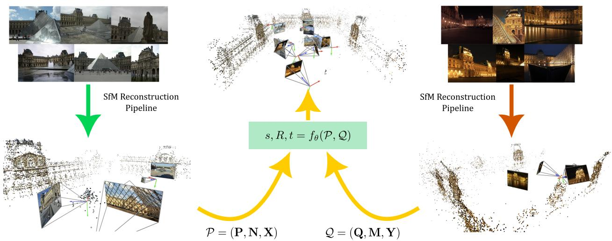
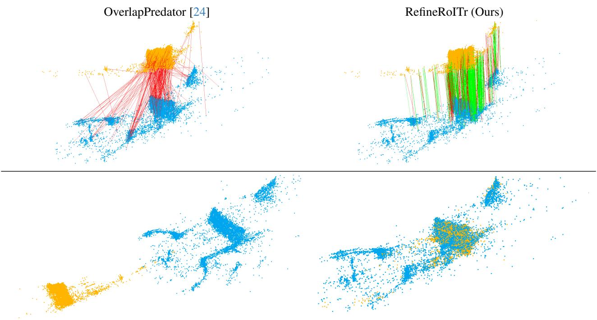
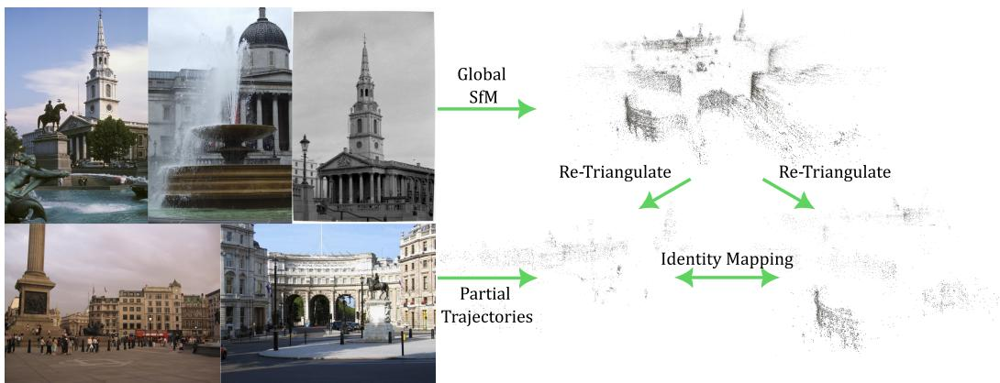
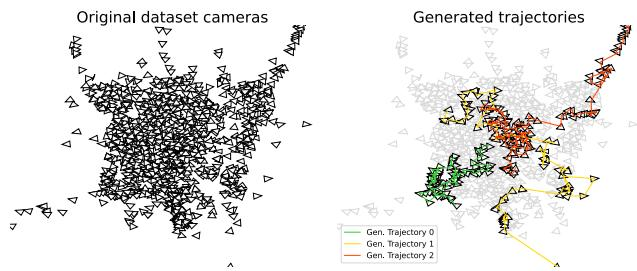
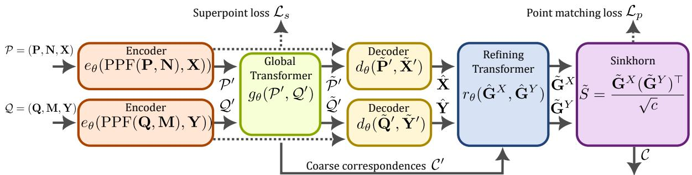

# ColabSfM: Collaborative Structure-from-Motion by Point Cloud Registration

Johan Edstedt∗1 Andre Mateus´ 2 Alberto Jaenal2

1Linkoping University¨ 2Ericsson Research, Sweden

  
Figure 1. Our proposed registration paradigm for collaborative SfM reconstructions (ColabSfM). Given two input SfM reconstruc tions P, Q of the same scene, the task is to estimate the relative similarity transform (s, R, t) between them. Our first contribution is to address this as a point cloud registration problem, using only 3D SfM tracks. For this, we do not rely on the visual descriptors, but on the 3D coordinates of the points P, Q, their normals N, M and, optionally, but not necessarily, features X, Y. To make point cloud registration methods perform well on this task, we propose as our second contribution a scalable pipeline to construct synthetic training datasets for SfM registration. Finally, we propose an improved version of RoITr [64] as registration method fθ.

## Abstract

Structure-from-Motion (SfM) is the task ofestimating 3D structure and camera posesfrom images. We define Collaborative SfM (ColabSfM) as sharing distributed SfM reconstructions. Sharing maps requires estimating a joint refer ence frame, which is typically referred to as registration. However, there is a lack of scalable methods and training datasets for registering SfM reconstructions. In this paper, we tackle this challenge by proposing the scalable task ofpoint cloud registrationfor SfM reconstructions. We find that current registration methods cannot register SfM point clouds when trained on existing datasets. To this end, we propose a SfM registration dataset generation pipeline, leveraging partial reconstructions from synthetically generated camera trajectories for each scene. Finally, we propose a simple but impactful neural refiner on top ofthe SotA registration method RoITr that yields significant improve-

ments, which we call RefineRoITr. Our extensive experimental evaluation shows that our proposed pipeline and model enables ColabSfM. Code is available at https: //github.com/EricssonResearch/ColabSfM

## 1. Introduction

For robots and extended reality (XR) devices to become ubiquitous in our lives, they must be able to accurately build and localize in maps of the environment. Most available solutions rely on visual data and onboard computing, which can limit the accuracy in the context of small devices. Thus, in the last years there has been a push from industry to move computation to the cloud (e.g. Google’s Visual Positioning System [40], Microsoft’s Azure Spatial Anchors [27], and Niantic’s Lightship [47]). However, the heterogeneous nature of these systems prevents devices of different vendors from interoperating, i.e., sharing their maps and localizing in others’ maps. If we are to make visual localization interoperable, we need ways to merge such maps. Structurefrom-Motion (SfM) [44] is the most used method to process images and produce 3D maps (scene reconstructions consisting of a set of 3D points and the poses of the images expressed in a common coordinate system). To enable localization, a visual descriptor is stored for each map point, and for localization, 2D-3D matches are found by matching the descriptors of the query image with those of the map. Typically, SfM maps are merged using these visual descriptors, by finding 3D-3D matches [22, 33], or inserting new sub-maps based on 2D-3D correspondences [50].

  
Figure 2. Qualitative comparison. We compare our approach to the previous point cloud registration method OverlapPredator [24] on the St. Peter’s Basilica test scene. Without training on our proposed SfM registration dataset (column 1), previous methods are unable to produce sufficiently good matches (top row) and accurate relative pose estimation results (bottom row). In contrast, our proposed model RefineRoITr, trained on the proposed dataset, is able to find better matches and hence register the scenes well. The source and target point clouds are depicted in yellow and blue, respectively.

However, these methods have limitations. First, different SfM pipelines tend to use different feature extractors, which yield incompatible descriptors. This is partially addressed by the cross-descriptor approach proposed in [17], but the assumption that the descriptors are computed from the same keypoints is unrealistic. Additionally, exposing visual descriptors may allow feature inversion attacks [12, 15, 38, 58], which can recover private elements from the images. The second limitation concerns scalability, since storing visual descriptors leads to a map size increase between two and three orders of magnitude [67]; and matching using a traditional pipeline [35] may suffer in performance; which can be enhanced by using learned methods [31, 43] at the cost of excessive runtimes. Visual localization without descriptors was tackled in [55, 66, 67], demonstrating competitive performance, but since they rely solely on 2D-3D geometry, which suffers from perspective distortions, their accuracy is not as high as their descriptorbased counterparts. Furthermore, they still rely on image retrieval, which again raises privacy, scalability, and interoperability concerns. Nevertheless, their results show that geometry alone could be sufficient for matching. Based on that observation, we pose the following question

## Can we merge SfM maps using only 3D geometry?

To this end, we propose to merge SfM 3D maps through 3D point cloud registration methods [1, 65], which rely solely on geometric information, see Fig. 1. We call our proposed paradigm Collaborative SfM (ColabSfM). In contrast to visual localization, which aims to localize a single image to a map, our proposed task involves registering a map to a map, and is image retrieval-free.

State of the art methods for 3D point cloud registration rely on learned features [24, 39, 64], therefore it is necessary to provide suitable datasets to train such networks. There is a wide range of datasets available [34] for the point cloud registration task. However, those mostly consist of 3D sensor data, e.g., RGB-D [65] and/or LiDAR scans [20], which differ from SfM point clouds. To the best of our knowledge, there are no large datasets for SfM point cloud registration. SfM datasets [30] provide a 3D point cloud for each scene, but since each scene is disconnected, no matching is possible between different scenes. To tackle this issue, we propose a pipeline to generate synthetic datasets for SfM point cloud registration, which generates multiple synthetic trajectories for each scene. The synthetic trajectories provide a trade-off between random internet images and sequential images (e.g., Cambridge Landmarks Dataset [28]). We apply our pipeline and generate training and benchmarks datasets from MegaDepth [30] and a benchmark dataset from Quad6k [11]. Our pipeline is presented in detail in Sec. 3.

SfM reference frames may be arbitrarily aligned relative to each other. As such, using a registration model invariant to rotation and translation SE(3), and robust to scale Sim(3), is important. To this end, we build on top of the recently proposed SotA rotation invariant model RoITr [64]. While this method already produces good results when trained on our dataset, we find that we can further improve results on ColabSfM by introducing a neural refinement stage to the model. We introduce our baseline model and our improved version, which we call RefineRoITr, in Sec. 4.

To summarize, our contributions are:

1. A simple but powerful pipeline to synthetically generate SfM registration datasets, detailed in Sec. 3.

2. An improved model for SfM Registration, detailed in Sec. 4.

3. The task of SfM point cloud registration, with extensive experiments in Sec. 5 demonstrating its potential.

## 2. Related Work

Point cloud registration is typically defined as estimating the rigid transform that aligns two 3D point clouds to a joint reference frame. The classic approach is the Iterative Closest Point (ICP) algorithm [3, 6], which estimates the pose by alternating between computing point correspondences using the current pose and estimating the pose using those correspondences. Several improvements have been proposed over the years to handle outliers and to attempt to find a global minimum [29, 60]. More recently, point cloud registration has been addressed with neural networks, such as DCP [56] and its iterative extension [57], with similar methods presented in [19, 62]. Another class of iterative methods [1, 25, 59], extract global features from each point cloud, and exploits them to regress the pose.

An alternative approach, which will be our main focus, consists of finding and extracting correspondences between the two point clouds, being those points [37, 45], planes and lines [36], and finding the pose using robust estimators such as RANSAC [18]. Several point correspondence methods have been proposed, both handcrafted [16, 41] and learned [7, 14, 21]. In [24] an overlap-attention block is proposed to improve matching of point clouds with low overlap. Overlap-aware methods are also presented in [26, 39, 63], which focus on improving the matching accuracy and thus avoid the use of RANSAC to filter outliers. The previous methods are not robust to large rotations, which are common in SfM. This issue has been tackled by proposing methods that are rotation invariant [4, 13, 64]. In this paper we will mainly consider point pair features (PPFs) [16] to ensure invariance to global rigid transformations, which have recently shown SotA performance [64].

Localization without descriptors has recently received renewed attention as a way to reduce computation, and preserve privacy. BPnPNet [5] jointly estimates the pose and the correspondences between 2D keypoints on a query image and 3D points from a scene point cloud. However, it is susceptible to outlier correspondences. This issue was tackled by Zhou et al. [67], who use only 2D keypoints and the 3D map point cloud to localize a query image to a 3D map. They do this by projecting the map point cloud into retrieved map images and estimating 2D-2D correspondences with a graph neural network. A similar method DGC-GNN [55] proposes to exploit geometry and color information to guide point matching by computing a geometric embedding of Euclidean and angular relations. These methods have the advantage of not requiring storage of descriptors. However, they still require image retrieval to get sufficiently close map images to the query. This is problematic if the map is sparse in the region of the query, and introduces additional complexity. Furthermore, the projection from 3D into 2D loses important geometrical information, which we retain by directly registering the point clouds.

Collaborative mapping is a general term, typically referring to fusion of partial 3D reconstructions. Cohen et al. [8] use the Manhattan world assumption [10] to derive geometric constraints on partial reconstructions to enable model fusion. Cohen et al. [9] fuse indoor and outdoor reconstructions by first leveraging images to obtain semantic masks with window positions. They then match the windows between the two models to solve for the pose with RANSAC [18]. This approach requires images to be stored alongside the point clouds which brings additional space constraints [67]. Strecha et al. [48] and Untzelmann et al. [54] merge multiple building reconstructions to a joint map by combining GPS coordinates and known building outlines to construct an alignment optimization objective. This has the downside of restricting the reconstructions to buildings that have previously been mapped and requires geo-tags. Dusmanu et al. [17] investigated collaborative mapping and localization by translating descriptors to a joint embedding space. They consider a closed set of descriptors and learn a common embedding space for them. Collaborative mapping is achieved through embedding the descriptors into the joint space and running feature matching on the joint space. This requires access to all features for all images, which is expensive, and the required compute scales as standard SfM with the number of images. In contrast to these methods, we make far fewer assumptions on the data available. Namely, we do not store any descriptors (neither local nor global), do not make assumptions on the structure of the scenes, and do not use any topological maps or data. Thus, we constrain ourselves to using only the geometry. Closest to our work Liu et al. [32] align line reconstructions and simulate partial reconstructions by adding noise and dropout of lines to a single reconstruction. In contrast we consider point-based reconstructions and propose a more realistic way to generate partial reconstructions through synthetic camera trajectories and retriangulation.

## 3. Pipeline for SfM Registration Dataset Generation

We find that current SotA point cloud registration models trained on 3DMatch [65], the most commonly used training set for 3D registration, are not able to register SfM reconstruction out of the box (cf. Tabs. 1, 2 and 4). Intuitively this is due to the large distribution shift between registration of RGB-D and/or LiDAR scans, and the much larger scenes covered by SfM reconstructions. However, it is not obvious how to generate a diverse dataset with multiple aligned reconstructions. Manually collecting such datasets is prohibitively expensive, and publicly available datasets typically contain a single reconstruction per scene.

To tackle this issue, we propose a pipeline to generate a large synthetic dataset for registration between SfM models from random image collection datasets, e.g., MegaDepth [30]. Our key insight is that we can leverage these models and for each scene to construct partial reconstructions by sampling subsets of images/cameras. An overview of our approach is presented in Fig. 3. In the next sections we describe our approach in more detail.

## 3.1. Creating Partial Reconstructions

We use hloc [42] with COLMAP [44] to create partial reconstructions from scenes. We use SIFT [35] and SOS-Net [51] retriangulations for training and evaluation. We consider two approaches to create partial reconstructions.

Random point sampling: In the simplest approach, we sample a set of 3D points from the scene for each partial reconstruction, and add the images in which they are visible until reaching approximately 200 images. For each scene we create 10 such partial reconstructions. We found that while this approach works well when registering reconstructions from collections of random images, it does not generalize as well to reconstructions from a single camera trajectory, which are common in real-life scenarios, $e . g .$ video. We believe that this is due to the point clouds exhibiting more significant variance when the scene is captured from different viewpoints. For example, keypoints are likely to be denser for nearby cameras, and natural occlusions will depend on viewpoints. As random image based datasets are not naturally divisible into videos, it is not obvious how to bridge this gap. We next describe our approach addressing this.

Partial Trajectories: Our approach to bridge the random image → video gap is to generate synthetic trajectories from reconstructions of random images. Concretely, we randomly pick a starting image, and then sequentially (without replacement) pick the nearest neighbour of the image using a distance metric (which we refer to as dist). In practice we found that, for each trajectory, using a randomly weighted combination of geodesic rotation distance and Euclidean distance on the translation produced satisfactory results.Each trajectory has a size between $n _ { \mathrm { l o w } } ~ = ~ 7 5$ and $n _ { \mathrm { h i g h } } = 3 0 0$ . The algorithm is presented in Algorithm 1. We show a qualitative example of three generated synthetic trajectories in Fig. 4. Running this on all scenes gave us between 5 to 20 synthetic trajectories per scene. Training is conducted on an equally weighted combination of the random point sampling approach and the synthetic trajectories.

Algorithm 1 Generation of synthetic trajectory from a set   
of posed images   
Precondition: T set of posed images, I remaining index   
set, distance function dist   
1: function GENERATETRAJECTORY(T, I)   
2: τ ← ∅   
3: i ← Random sample from I   
4: n ← Random sample from $\{ n _ { \mathrm { l o w } } , \dots , n _ { \mathrm { h i g h } } \}$   
5: $\mathbb { I }  \mathbb { I } \setminus i$   
6: τ ← τ ∪ i   
7: for $k \gets 1$ to n do   
8: i′ ← arg min ′ I dist(Ti, Ti′ )   
9: $\tau  \tau \cup i ^ { \prime }$   
10: $\mathbb { I }  \mathbb { I } \backslash i ^ { \prime }$   
11: $i \gets i ^ { \prime }$   
12: end for   
13: return $\tau , \mathbb { I }$   
14: end function

## 3.2. Pipeline and Dataset

Reconstruction Pipeline: We are interested in having good ground truth correspondences between the partial reconstructions. As the SfM pipeline accuracy usually degrades with fewer available cameras, we use fixed camera poses from the joint reconstruction using all images and simply run triangulation from feature matching. This also has the benefit of being significantly less computationally demanding than running the full reconstructions.

  
Figure 3. Overview of our pipeline. For each scene, from a random image SfM dataset, e.g., MegaDepth [30], we retriangulate partial reconstructions using partial trajectories from the scene. Since these trajectories are in the global SfM reference frame, the relative transformation is simply the identity mapping.

  
Figure 4. Example of synthetic trajectories in our proposed dataset. We start with a large scale scene, consisting of hundreds of cameras (left). From this set of cameras we run Algorithm 1 until the remaining set of cameras is small. Plotting the trajectories shows that plausible camera motion is achieved by this procedure (right). Sampling in this way bridges the gap between random image collections and video-based trajectories.

Dataset Construction: We run our pipeline on all 196 MegaDepth scenes where 10 of them are reserved for the test benchmark. We use either SIFT [35] or SOSNet [51] features for the retriangulation, however any local features could be used. We compute the overlap between all pairs of partial reconstructions. To train models we enforce the overlap to be larger than 30%. In total, after enforcing sufficient overlap, we are left with about 22000 pairs (∼20000 for training and ∼2000 for testing), which constitutes our dataset. Details on how point cloud overlap is computed are presented in the supplementary material.

## 4. RoITr and RefineRoITr for ColabSfM

In this section, we discuss our baseline and our proposed improvements for ColabSfM. An overview of the proposed registration model $f _ { \theta }$ is presented in Figure 5. For consistency we follow the notation of Yu et al. [64].

## 4.1. Preliminaries

We are interested in registration methods that are robust to the challenges posed by SfM reconstructions. In particular, one of the main challenges is that SfM reconstructions are defined up-to-scale, and the rotation and origin of the reference frame is arbitrary1. Hence, we would like the registration model to be approximately invariant to the action of the similarity group, i.e., Sim(3) = SE(3) + scale. In practice we will achieve this by using an SE(3) invariant model, and learn approximate scale invariance. We next describe our baseline, and then our proposed improvements.

## 4.2. Baseline Model

As a strong baseline, we base our approach on the SotA SE(3) invariant registration method RoITr [64]. We next give an overview of our baseline. An more thorough description of the architecture is given in the supplementary and by Yu et al. [64].

Rotation Invariance through PPFs: RoITr [64] is based on point pair features (PPFs) [16], which computes a 4D feature for point pairs by the angles between their relative position and their normals. Mathematically, the PPF is defined as ${ \mathrm { P P F } } ( p _ { 1 } , p _ { 2 } , n _ { 1 } , n _ { 2 } ) \ =$ $[ \| d \| , \angle ( n _ { 1 } , d ) , \angle ( n _ { 2 } , d ) , \angle ( n _ { 1 } , n _ { 2 } ) ]$ , where $d = p _ { 2 } - p _ { 1 }$ It can easily be shown that this construction is invariant to rotations,

$$
\begin{array} { r l } & { { \mathrm { P P F } } ( R p _ { 1 } , R p _ { 2 } , R n _ { 1 } , R n _ { 2 } ) = [ \| R d \| , \angle ( R n _ { 1 } , R d ) , } \\ & { { \angle } ( R n _ { 2 } , R d ) , { \angle } ( R n _ { 1 } , R n _ { 2 } ) ] = [ \| d \| , { \angle } ( n _ { 1 } , d ) , { \angle } ( n _ { 2 } , d ) , } \\ & { ~ { \angle } ( n _ { 1 } , n _ { 2 } ) ] = { \mathrm { P P F } } ( p _ { 1 } , p _ { 2 } , n _ { 1 } , n _ { 2 } ) , ~ ( 1 ) } \end{array}
$$

since norms and angles are invariant to rotations.

  
Figure 5. Overview of our proposed model RefineRoITr. As input we take two point clouds $\mathcal { P } = ( \mathbf { P } , \mathbf { N } , \mathbf { X } ) , \mathcal { Q } = ( \mathbf { Q } , \mathbf { M } , \mathbf { Y } )$ consisting of 3D points $\mathbf { P } / \mathbf { Q } \in \mathbb { R } ^ { n / m \times 3 }$ , and normals $\mathbf { N } / \mathbf { M } \in \mathbf { \mathbb { R } } ^ { n / m \times 3 }$ . In this work the features $\mathbf { X } / \mathbf { Y }$ are always assumed to be constant. We ensure rotation invariance by Point Pair Feature (PPF) encoding. The PPFs are fed together with the features into an encoder $e _ { \theta } ,$ producing $N ^ { \prime }$ coarse superpoints ${ \mathcal { P } } ^ { \prime } / { \mathcal { Q } } ^ { \prime }$ . These are passed through a global Transformer $g _ { \boldsymbol { \theta } } .$ , from which the top-k coarse correspondences $\mathcal { C } ^ { \prime } \in \mathbb { R } ^ { k \times 2 }$ are extracted. A decoder $d _ { \theta }$ takes the coarse features from $g _ { \theta }$ and the finer features from $e _ { \theta }$ and produces fine features Xˆ , Yˆ . Using the coarse correspondences we extract neighbourhoods $\hat { \mathbf { G } } ^ { X } , \hat { \mathbf { G } } ^ { \check { Y } } \in \mathbb { R } ^ { k \times 6 4 \times c }$ , which we feed into our proposed refinement Transformer. The refined features from the Transformer are used to construct a cost matrix, where the Sinkhorn algorithm [43, 54, 64] is used to solve the optimal transport (OT) problem, producing our final matches C. The network is trained using $\mathcal { L } _ { s } + \mathcal { L } _ { p }$

Normalization Procedure: SfM reconstructions do not in general come with metric scale. This poses several challenges for registration methods, that typically assume both point clouds to share the same scale. We tackle this by normalization. Specifically, for Sim(3) training we normalize the point clouds P, Q with $\sigma _ { \mathbf { P } } / { \sqrt { 2 } } , \sigma _ { \mathbf { Q } } / { \sqrt { 2 } } ,$ where σ is the largest singular value of the centered point cloud. For SE(3) training, we simply use $\sigma _ { \mathbf { P } }$ to normalize both P and Q. We find that this simple approach leads to models robust to scale variation, as we demonstrate in Tab. 1.

Normal Estimation: We follow RoITr [64] and use Open3D [68] with a neighborhood size of 33 for estimating normals, we found that this works well in practice. In contrast to the RGB-D scans of 3DMatch, our dataset consists of point clouds from multiple sensors. This means that the simple approach of aligning the normal orientation towards the origin of the coordinate system, as done in RoITr, will not be consistent in general. To remedy this, we use the fact that all cameras observing a 3D track will yield consistent orientation estimates. In practice, we align the orientation towards the camera center of a random image observing the track, which we found yields consistent orientation.

Overview of Architecture: RoITr consists of an encoder $e _ { \theta } .$ , a global Transformer $g _ { \boldsymbol { \theta } } .$ , and a decoder $d _ { \theta }$ . eθ and $d _ { \theta }$ take as input sets of PPF encoded local neighbourhoods (typically around 8/16 points) around each point/superpoint. In contrast, gθ performs global attention on the coarse point cloud $\hat { \mathcal { P } }$ $e _ { \theta } , d _ { \theta } , g _ { \theta }$ all use the Transformer architectures as described by Yu et al. [64]. Note that RoITr does not include the refining Transformer $r _ { \theta }$ which will be detailed in our RefineRoITr.

Losses: RoITr uses a superpoint matching loss $\mathcal { L } _ { s }$ and a point matching ${ \mathcal { L } } _ { p }$ loss for training. We follow RoITr and use their overlap-aware [39] circle loss [49] as $\mathcal { L } _ { s }$ The point matching loss ${ \mathcal { L } } _ { p }$ is the Negative Log Likelihood (NLL) of the GT correspondences after running the Sinkhorn algorithm [43] on the fine feature similarities S˜.

## 4.3. RefineRoITr (Ours)

Refinement Transformer r : The refinement in RoITr is performed by optimizing the Sinkhorn [54] distance between shallow features in a local neighbourhood around the coarse matches, denoted $\hat { \mathbf { G } } ^ { X } , \hat { \mathbf { G } } ^ { Y }$ . While this provides satisfactory results on 3DMatch, we found that we could improve results by incorporating a joint local Transformer $r _ { \theta } .$ This Transformer takes $\hat { \mathbf { G } } ^ { X } , \hat { \mathbf { G } } ^ { Y }$ as inputs and outputs enriched neighbourhoods $\tilde { \mathbf { G } } ^ { X } , \tilde { \mathbf { G } } ^ { Y }$ We found that these cross-point cloud enriched fine features from $r _ { \theta }$ yielded improved results.

Architectural Details of $\begin{array} { r l } { r _ { \theta } \colon } & { { } r _ { \theta } } \end{array}$ takes in local neighbourhoods of shape $m \times 6 4 \times c ,$ , where m is the number of neighbourhoods, 64 is the number of neighbours (identical to RoITr), and c is the feature dimensionality. We use layers of interleaved self-attention and cross-attention as in Light-Glue [31]. Note however, that in contrast to LightGlue that performs global attention, our refinement Transformer performs attention locally, which is significantly cheaper. We use an input/output dimensionality of $c _ { \mathrm { i n } } = c _ { \mathrm { o u t } } = c = 6 4$ and 4 self+cross attention layers. Each self/cross attention layer consists of single head attention, using dim $c ,$ which is stacked with the input into a 1 hidden layer MLP (input dim $2 c ,$ hidden dim $2 c .$ , output dim c) using the GELU [23] activation function, with layer normalization [2] applied before GELU. Each self/cross block is residual, i.e., the output of the block is the output of the MLP plus the input.

Table 1. Results of SfM registration on MegaDepth. We evaluate 2 different scenarios. Unknown relative orientation SO(3) + unknown relative position = SE(3), SE(3) + unknown relative scale = Sim(3). The top portion contains methods only trained on the 3DMatch (3DM) dataset, the middle portion methods trained only on our proposed dataset (Mega), while the lower portion contains methods trained on the former and fine-tuned on the latter.
<table><tr><td rowspan="2">Method</td><td colspan="3">SE(3)</td><td colspan="3">Sim(3)</td></tr><tr><td>IR</td><td>FMR</td><td>RR</td><td>IR</td><td>FMR</td><td>RR</td></tr><tr><td>OverlapPredator [24] (3DM)</td><td>6.1</td><td>35.5</td><td>10.0</td><td>3.6</td><td>21.3</td><td>2.1</td></tr><tr><td>GeoTransformer [39] (3DM)</td><td>2.1</td><td>14.6</td><td>3.3</td><td>1.3</td><td>8.6</td><td>0.4</td></tr><tr><td>PareNet [61] (3DM)</td><td>7.3</td><td>38.6</td><td>5.2</td><td>4.7</td><td>27.7</td><td>0.8</td></tr><tr><td>RoITr [64] (3DM)</td><td>3.0</td><td>12.6</td><td>0.0</td><td>1.6</td><td>7.0</td><td>0.8</td></tr><tr><td>RefineRoITr (3DM)</td><td>10.0</td><td>32.8</td><td>13.9</td><td>6.2</td><td>22.8</td><td>3.5</td></tr><tr><td>RefineRoITr (Mega)</td><td>51.0</td><td>96.5</td><td>70.2</td><td>44.6</td><td>92.8</td><td>42.7</td></tr><tr><td>OverlapPredator [24] (3DM + Mega)</td><td>21.3</td><td>74.9</td><td>35.4</td><td>11.4</td><td>56.2</td><td>10.7</td></tr><tr><td>RoITr [64] (3DM + Mega)</td><td>44.6</td><td>90.9</td><td>60.0</td><td>38.4</td><td>86.1</td><td>38.7</td></tr><tr><td>RefineRoITr (3DM + Mega)</td><td>48.7</td><td>95.1</td><td>67.7</td><td>44.6</td><td>93.9</td><td>44.3</td></tr></table>

## 5. Experiments

In this section, we evaluate the RefineRoITr model presented in Sec. 4. Three different model instances were trained: 1) pre-trained RefineRoITr on 3DMatch [65]; 2) the model in 1) fine-tuned on the dataset in Sec. 3 and; 3) RefineRoITr trained from scratch on our dataset. For comparison, we used RoITr [64]and OverlapPredator [24] , both with pre-trained weights from 3DMatch, and fine-tuned weights trained on our dataset. Additionally, we tested Geo-Transformer [39]also pre-trained on 3DMatch [65]. As we found that the performance, of fine-tuning 3DMatch trained models, on our dataset was similar for our proposed model, we did not train other models in our dataset from scratch.

Metrics: We use the standard registration metric Inlier Ratio (IR). This measures the percentage of estimated correspondences lying within a threshold distance $\tau _ { \mathrm { I R } } = 0 . 1$ from each other. We additionally measure the Feature Matching Recall (FMR), which is defined as the percentage of point cloud pairs whose IR is above a threshold $\tau _ { \mathrm { F M R } } ~ = ~ 5 \%$ . Finally, we use Registration Recall (RR), which consists of the percentage of pairs for which the rotation error and translation error are below 5◦ and 0.05, respectively. We solve for the pose using the RANSAC [18] implementation from Open3D [68] on the matches retrieved by the neural networks. Details on error computation and RANSAC can be found in the Supplemental material.

Computational cost: On a desktop machine equipped with an i9-13900K @ 3.00GHz CPU and an NVIDIA 4090 GPU, the median runtime for RoITr is 99.94 ms and for RefineRoITris 102.84, which shows that the computational burden added by the modifications described in Sec. 4.3 is around 3%.

## 5.1. MegaDepth SfM Registration Benchmark

We select 10 scenes from MegaDepth [30] dataset, which consists of 196 large scale 3D scenes reconstructed from internet images for our benchmark. The test scenes are, in order, [0008, 0015, 0019, 0021, 0022, 0024, 0025, 0032, 0063, 1589]. The average size of the pointclouds is 15.3K points, using either SIFT or SOSNet features for the retriangulation. To train and evaluate the network presented in Sec. 4 on our dataset, we define two different scenarios SE(3) and Sim(3). We define a random rotation by sampling three Euler angles $\alpha , \beta , \gamma \in [ 0 , 2 \pi ]$

The results of the RefineRoITr method and the baselines are presented in Tab. 1. As expected, the methods which are not fine-tuned in our data perform the worst in both SE(3) and Sim(3) data. This shows the lack of generalization of current registration methods on SfM point clouds. When considering FMR, the methods trained from scratch or finetuned on our data obtain high scores (>90%) on SE(3) data with slightly lower scores on Sim(3). When looking at the three variations of RefineRoITr, we see that while the version trained on 3DMatch outperforms vanilla RoITr, the major boost in performance is due to fine-tuning the model on our dataset. The best overall version is the one trained from scratch on our dataset, even though the improvement is not as significant. Qualitative results are presented in Fig. 2 and the Supplementary material.

## 5.2. Standard Benchmark: Cambridge Landmarks

The Cambridge Landmarks [28] dataset consists of 5 largescale 3D scenes recorded with a smartphone by a pedestrian in Cambridge, each of which consisting of a train and a test trajectories with camera poses. We retriangulate the train/test sequences independently, which results in two reconstructions for each scene. In this case, we evaluate the IR and number of matches. Here we only test the SE(3) case. Rotation and translation errors and qualitative results for this dataset are reported in the supplementary material. The results are presented in Tab. 2. Similar to the evaluation results in the previous section, the models trained only on 3DMatch [65] perform poorly, while the ones fine-tuned and or trained from scratch on our dataset present the highest IR and number of matches, with small differences in favor of the version trained from scratch.

## 5.3. Noisy Indoor Reconstructions: 7-Scenes

The 7-Scenes [46] dataset is an indoor RGB-D dataset. This dataset is challenging for SfM, since untextured regions lead to significantly more noisy point clouds, and less geometric features. We present results in Tab. 3. Encouragingly, we find that models trained using our pipeline perform well also on these indoor scenes, showing the generalizability of our approach.

Table 2. Results of SfM registration on Cambridge Landmarks [28]. We evaluate unknown relative orientation SO(3) + unknown relative position = SE(3). The top portion contains methods only trained on the 3DMatch (3DM) dataset, the middle portion methods trained only on our proposed dataset (Mega), while the lower portion contains methods trained on the former and fine-tuned on the latter.
<table><tr><td></td><td colspan="2">Great Court</td><td colspan="2">Kings College</td><td colspan="2">Old Hospital</td><td colspan="2">Shop Facade</td><td colspan="2">St Mary&#x27;s Church</td></tr><tr><td>Method</td><td>IR</td><td>Matches</td><td>IR</td><td>Matches</td><td>IR</td><td>Matches</td><td>IR</td><td>Matches</td><td>IR</td><td>Matches</td></tr><tr><td>OverlapPredator [24] (3DM)</td><td>1.4</td><td>356</td><td>0.5</td><td>372</td><td>0.0</td><td>363</td><td>2.5</td><td>354</td><td>0.2</td><td>382</td></tr><tr><td>GeoTransformer [39] (3DM)</td><td>0.0</td><td>382</td><td>0.1</td><td>785</td><td>0.0</td><td>438</td><td>0.1</td><td>1368</td><td>0.0</td><td>431</td></tr><tr><td>PareNet [61] (3DM)</td><td>4.3</td><td>2000</td><td>1.6</td><td>2000</td><td>0</td><td>2000</td><td>1.2</td><td>2000</td><td>6.7</td><td>2000</td></tr><tr><td>RoITr [64] (3DM)</td><td>0.0</td><td>285</td><td>0.0</td><td>447</td><td>0.0</td><td>321</td><td>0.3</td><td>959</td><td>1.5</td><td>407</td></tr><tr><td>RefineRoITr (3DM)</td><td>0.2</td><td>412</td><td>2.2</td><td>408</td><td>0.0</td><td>544</td><td>0.9</td><td>737</td><td>2.8</td><td>567</td></tr><tr><td>RefineRoITr (Mega)</td><td>70.9</td><td>4538</td><td>57.6</td><td>3977</td><td>31.5</td><td>2214</td><td>41.6</td><td>1325</td><td>81.8</td><td>5167</td></tr><tr><td>RoITr [64] (3DM + Mega)</td><td>52.1</td><td>1426</td><td>39.6</td><td>1377</td><td>21.9</td><td>603</td><td>28.0</td><td>700</td><td>64.5</td><td>2481</td></tr><tr><td>RefineRoITr (3DM + Mega)</td><td>69.4</td><td>4551</td><td>54.0</td><td>3246</td><td>28.0</td><td>1591</td><td>39.1</td><td>1342</td><td>77.8</td><td>5168</td></tr></table>

Table 3. Results of SfM registration on 7-Scenes. We evaluate unknown relative orientation SO(3) + unknown relative position = SE(3). The top portion contains methods only trained on the 3DMatch (3DM) dataset, the middle portion methods trained only on our proposed dataset (Mega), while the lower portion contains methods trained on the former and fine-tuned on the latter.
<table><tr><td></td><td colspan="2">Chess</td><td colspan="2">Fire</td><td colspan="2">Heads</td><td colspan="2">Office</td><td colspan="2">Pumpkin</td><td colspan="2">Red Kitchen</td><td colspan="2">Stairs</td></tr><tr><td>Method</td><td>IR</td><td>Matches</td><td>IR</td><td>Matches</td><td>IR</td><td>Matches</td><td>IR</td><td>Matches</td><td>IR</td><td>Matches</td><td>IR</td><td>Matches</td><td>IR</td><td>Matches</td></tr><tr><td>RoITr [64] (3DM)</td><td>0.0</td><td>307</td><td>0.0</td><td>1004</td><td>0.0</td><td>1699</td><td>0.0</td><td>1322</td><td>0.0</td><td>327</td><td>0.0</td><td>1163</td><td>0.0</td><td>730</td></tr><tr><td>RefineRoITr (3DM)</td><td>0.0</td><td>842</td><td>0.0</td><td>2204</td><td>0.0</td><td>1104</td><td>0.0</td><td>1073</td><td>0.0</td><td>1016</td><td>0.0</td><td>1721</td><td>0.0</td><td>1043</td></tr><tr><td>RefineRoITr (Mega)</td><td>23.4</td><td>6717</td><td>38.8</td><td>9043</td><td>50.6</td><td>5419</td><td>68.0</td><td>9461</td><td>14.9</td><td>2893</td><td>27.9</td><td>8050</td><td>6.2</td><td>3230</td></tr><tr><td>RoITr [64] (3DM+Mega)</td><td>20.4</td><td>2098</td><td>30.5</td><td>4165</td><td>36.4</td><td>3812</td><td>50.0</td><td>4752</td><td>7.9</td><td>1271</td><td>18.5</td><td>2438</td><td>9.1</td><td>1883</td></tr><tr><td>RefineRoITr (3DM+Mega)</td><td>23.6</td><td>5632</td><td>33.3</td><td>8339</td><td>50.5</td><td>5996</td><td>62.7</td><td>8887</td><td>8.9</td><td>2268</td><td>26.8</td><td>6616</td><td>6.4</td><td>2863</td></tr></table>

Table 4. Results of SfM registration on Quad6k [11]. We evaluate unknown relative orientation SO(3) + unknown relative position = SE(3). The top portion contains methods only trained on the 3DMatch (3DM) dataset, the middle portion methods trained only on our proposed dataset (Mega), while the lower portion contains methods trained on the former and fine-tuned on the latter.
<table><tr><td>Method</td><td>IR</td><td>FMR</td><td>Matches</td><td>RR</td></tr><tr><td>OverlapPredator [24] (3DM)</td><td>1.6</td><td>10.2</td><td>121</td><td>0.0</td></tr><tr><td>GeoTransformer [39] (3DM)</td><td>0.6</td><td>0.0</td><td>1936</td><td>0.0</td></tr><tr><td>PareNet [61] (3DM)</td><td>1.6</td><td>10.4</td><td>2000</td><td>0.0</td></tr><tr><td>RoITr [64] (3DM)</td><td>0.4</td><td>0.0</td><td>574</td><td>0.0</td></tr><tr><td>RefineRoITr (3DM)</td><td>1.7</td><td>6.1</td><td>617</td><td>2.0</td></tr><tr><td>RefineRoITr (Mega)</td><td>17.2</td><td>67.4</td><td>878</td><td>22.4</td></tr><tr><td>RoITr [64] (3DM + Mega)</td><td>14.2</td><td>63.3</td><td>492</td><td>24.5</td></tr><tr><td>RefineRoITr (3DM + Mega)</td><td>18.1</td><td>65.3</td><td>715</td><td>16.3</td></tr></table>

## 5.4. Low Overlap: Quad6k

The Quad6k dataset [11] consists of about 6500 images from the Arts Quad at Cornell University. To create partial reconstructions for testing, we first perform a full scene retriangulation using the refined poses provided by [52] and then follow the procedure in Sec. 3.1, generating a total of 24 trajectories, and 49 pairs. The results are presented in Tab. 4. Similar to the previous datasets, the performance of the methods has a substantial boost after training on the dataset presented in Sec. 3. GeoTransformer [39] trained only on 3DMatch [65] presents the most matches on average, but only a small fraction (0.6%) are inliers, and its FMR and RR are both zero. Our Quad6k benchmark is more challenging and thus the performance is lower than in Tabs. 1 and 2, due to a low overlap of 16.5%, in comparison with the 61.2% of MegaDepth. Qualitative results for this dataset are shown in the supplementary material.

## 6. Conclusion

We have proposed Collaborative Structure-from-Motion by Point Cloud Registration, ColabSfM, a challenging new task to enable scalable collaborative mapping and localization. By extensive experiments we showed that with our proposed dataset generation pipeline and SE(3) invariant model, this task is solvable, and showed that our model, while trained only on MegaDepth, is able to generalize to several challenging scenarios, such as noisy indoor reconstructions, and low-overlap registration. We believe our initial results will encourage further research on collaborative 3D reconstruction. Limitations: a) Our proposed model RefineRoITr is E(3) invariant like RoITr, and therefore can struggle with estimating correct matches in symmetric scenes. b) Our models are trained and evaluated on retriangulated partial reconstructions. In practice, issues such as drift occur, making global alignment more difficult, however we find that our model still performs well in this setting in Table 7.

## Acknowlegements

This work was supported by the strategic research environment ELLIIT, funded by the Swedish government.

## References

[1] Yasuhiro Aoki, Hunter Goforth, Rangaprasad Arun Srivatsan, and Simon Lucey. Pointnetlk: Robust & efficient point cloud registration using pointnet. In IEEE Conf. Comput. Vis. Pattern Recog., pages 7163–7172, 2019. 2, 3

[2] Jimmy Lei Ba, Jamie Ryan Kiros, and Geoffrey E Hinton. Layer normalization. arXiv preprint arXiv:1607.06450, 2016. 6

[3] Paul J. Besl and Neil D. McKay. A method for registration of 3-d shapes. IEEE Trans. Pattern Anal. Mach. Intell., 14 (2):239–256, 1992. 3

[4] Georg Bokman and Fredrik Kahl. A case for using rotation¨ invariant features in state of the art feature matchers. In IEEE Conf. Comput. Vis. Pattern Recog., pages 5110–5119, 2022. 3

[5] Dylan Campbell, Liu Liu, and Stephen Gould. Solving the blind perspective-n-point problem end-to-end with robust differentiable geometric optimization. In Eur. Conf. Comput. Vis., pages 244–261, 2020. 3

[6] Yang Chen and Gerard Medioni. Object modeling by registration of multiple range images. In IEEE Int’l Conf. Robotics and Auto., pages 2724–2729, 1991. 3

[7] Christopher Choy, Jaesik Park, and Vladlen Koltun. Fully convolutional geometric features. In Int. Conf. Comput. Vis., pages 8958–8966, 2019. 3

[8] Andrea Cohen, Torsten Sattler, and Marc Pollefeys. Merging the unmatchable: Stitching visually disconnected sfm models. In Int. Conf. Comput. Vis., pages 2129–2137, 2015. 3

[9] Andrea Cohen, Johannes L Schonberger, Pablo Speciale,¨ Torsten Sattler, Jan-Michael Frahm, and Marc Pollefeys. Indoor-outdoor 3d reconstruction alignment. In Eur. Conf. Comput. Vis., pages 285–300, 2016. 3

[10] James Coughlan and Alan L Yuille. The manhattan world assumption: Regularities in scene statistics which enable bayesian inference. Adv. Neural Inform. Process. Syst., 13, 2000. 3

[11] David Crandall, Andrew Owens, Noah Snavely, and Dan Huttenlocher. Discrete-continuous optimization for largescale structure from motion. In IEEE Conf. Comput. Vis. Pattern Recog., pages 3001–3008, 2011. 3, 8

[12] Deeksha Dangwal, Vincent T Lee, Hyo Jin Kim, Tianwei Shen, Meghan Cowan, Rajvi Shah, Caroline Trippel, Brandon Reagen, Timothy Sherwood, Vasileios Balntas, et al. Mitigating reverse engineering attacks on local feature descriptors. In Brit. Mach. Vis. Conf., 2021. 2

[13] Haowen Deng, Tolga Birdal, and Slobodan Ilic. Ppf-foldnet: Unsupervised learning of rotation invariant 3d local descrip tors. In Eur. Conf. Comput. Vis., pages 602–618, 2018. 3

[14] Haowen Deng, Tolga Birdal, and Slobodan Ilic. Ppfnet: Global context aware local features for robust 3d point matching. In IEEE Conf. Comput. Vis. Pattern Recog., pages 195–205, 2018. 3

[15] Alexey Dosovitskiy and Thomas Brox. Inverting visual representations with convolutional networks. In IEEE Conf. Comput. Vis. Pattern Recog., pages 4829–4837, 2016. 2

[16] Bertram Drost, Markus Ulrich, Nassir Navab, and Slobodan Ilic. Model globally, match locally: Efficient and robust

3d object recognition. In IEEE Conf. Comput. Vis. Pattern Recog., pages 998–1005, 2010. 3, 5

[17] Mihai Dusmanu, Ondrej Miksik, Johannes L Schonberger,¨ and Marc Pollefeys. Cross-descriptor visual localization and mapping. In Int. Conf. Comput. Vis., pages 6058–6067, 2021. 2, 3

[18] Martin A Fischler and Robert C Bolles. Random sample consensus: a paradigm for model fitting with applications to image analysis and automated cartography. Communications ofthe ACM, 24(6):381–395, 1981. 3, 7, 1

[19] Kexue Fu, Shaolei Liu, Xiaoyuan Luo, and Manning Wang. Robust point cloud registration framework based on deep graph matching. In IEEE Conf. Comput. Vis. Pattern Recog., pages 8893–8902, 2021. 3

[20] Andreas Geiger, Philip Lenz, and Raquel Urtasun. Are we ready for autonomous driving? the kitti vision benchmark suite. In IEEE Conf. Comput. Vis. Pattern Recog., pages 3354–3361, 2012. 2

[21] Zan Gojcic, Caifa Zhou, Jan D Wegner, and Andreas Wieser. The perfect match: 3d point cloud matching with smoothed densities. In IEEE Conf. Comput. Vis. Pattern Recog., pages 5545–5554, 2019. 3

[22] Michal Havlena, Akihiko Torii, and Toma´s Pajdla. Efficientˇ structure from motion by graph optimization. In Eur. Conf. Comput. Vis., pages 100–113, 2010. 2

[23] Dan Hendrycks and Kevin Gimpel. Gaussian error linear units (gelus). arXiv preprint arXiv:1606.08415, 2016. 6

[24] Shengyu Huang, Zan Gojcic, Mikhail Usvyatsov, Andreas Wieser, and Konrad Schindler. Predator: Registration of 3d point clouds with low overlap. In IEEE Conf. Comput. Vis. Pattern Recog., pages 4267–4276, 2021. 2, 3, 7, 8, 1, 4, 5

[25] Xiaoshui Huang, Guofeng Mei, and Jian Zhang. Featuremetric registration: A fast semi-supervised approach for robust point cloud registration without correspondences. In IEEE Conf. Comput. Vis. Pattern Recog., pages 11366– 11374, 2020. 3

[26] Shengze Jin, Iro Armeni, Marc Pollefeys, and Daniel Barath. Multiway point cloud mosaicking with diffusion and global optimization. In IEEE Conf. Comput. Vis. Pattern Recog., pages 20838–20849, 2024. 3

[27] Neena Kamath. Announcing azure spatial anchors for collaborative, cross-platform mixed reality apps, 2019. URL https://azure.microsoft.com/en- us/ blog / announcing - azure - spatial - anchors - for-collaborative-cross-platform-mixedreality-apps/. 1

[28] Alex Kendall, Matthew Grimes, and Roberto Cipolla. Posenet: A convolutional network for real-time 6-dof camera relocalization. In Int. Conf. Comput. Vis., pages 2938–2946, 2015. 3, 7, 8, 2, 6

[29] Hongdong Li and Richard Hartley. The 3d-3d registration problem revisited. In Int. Conf. Comput. Vis., pages 1–8, 2007. 3

[30] Zhengqi Li and Noah Snavely. Megadepth: Learning singleview depth prediction from internet photos. In IEEE Conf. Comput. Vis. Pattern Recog., pages 2041–2050, 2018. 3, 4, 5, 7

[31] Philipp Lindenberger, Paul-Edouard Sarlin, and Marc Pollefeys. LightGlue: Local Feature Matching at Light Speed. In Int. Conf. Comput. Vis., 2023. 2, 6, 1

[32] Liu Liu, Hongdong Li, Haodong Yao, and Ruyi Zha. Pluckernet: Learn to register 3d line reconstructions. In Proceedings of the IEEE/CVF Conference on Computer Vision and Pattern Recognition, pages 1842–1852, 2021. 4

[33] Alex Locher, Michal Havlena, and Luc Van Gool. Progressive structure from motion. In Eur. Conf. Comput. Vis., pages 20–35, 2018. 2

[34] Alexandre Lopes, Roberto Souza, and Helio Pedrini. A survey on rgb-d datasets. Comput. Vis. Img. Underst., 222: 103489, 2022. 2

[35] David G Lowe. Distinctive image features from scaleinvariant keypoints. Int. J. Comput. Vis., 60:91–110, 2004. 2, 4, 5

[36] Andre Mateus, Siddhant Ranade, Srikumar Ramalingam,´ and Pedro Miraldo. Fast and accurate 3d registration from line intersection constraints. Int. J. Comput. Vis., pages 1– 26, 2023. 3

[37] Pedro Miraldo, Surojit Saha, and Srikumar Ramalingam. Minimal solvers for mini-loop closures in 3d multi-scan alignment. In IEEE Conf. Comput. Vis. Pattern Recog., 2019. 3

[38] Francesco Pittaluga, Sanjeev J Koppal, Sing Bing Kang, and Sudipta N Sinha. Revealing scenes by inverting structure from motion reconstructions. In IEEE Conf. Comput. Vis. Pattern Recog., pages 145–154, 2019. 2

[39] Zheng Qin, Hao Yu, Changjian Wang, Yulan Guo, Yuxing Peng, and Kai Xu. Geometric transformer for fast and robust point cloud registration. In IEEE Conf. Comput. Vis. Pattern Recog., pages 11143–11152, 2022. 2, 3, 6, 7, 8

[40] Tilman Reinhardt. Using global localization to improve navigation, 2019. URL https : / / blog . research . google / 2019 / 02 / using - global - localization-to-improve.html. 1

[41] Radu Bogdan Rusu, Nico Blodow, and Michael Beetz. Fast point feature histograms (fpfh) for 3d registration. In IEEE Int’l Conf. Robotics and Auto., pages 3212–3217, 2009. 3

[42] Paul-Edouard Sarlin, Cesar Cadena, Roland Siegwart, and Marcin Dymczyk. From coarse to fine: Robust hierarchical localization at large scale. In IEEE Conf. Comput. Vis. Pattern Recog., pages 12716–12725, 2019. 4

[43] Paul-Edouard Sarlin, Daniel DeTone, Tomasz Malisiewicz, and Andrew Rabinovich. SuperGlue: Learning feature matching with graph neural networks. In IEEE Conf. Comput. Vis. Pattern Recog., 2020. 2, 6

[44] Johannes Lutz Schonberger and Jan-Michael Frahm.¨ Structure-from-motion revisited. In IEEE Conf. Comput. Vis. Pattern Recog., 2016. 2, 4

[45] Peter H. Schonemann. A generalized solution of the orthogonal procrustes problem. Psychometrika, 31(1):1–10, 1966. 3

[46] Jamie Shotton, Ben Glocker, Christopher Zach, Shahram Izadi, Antonio Criminisi, and Andrew Fitzgibbon. Scene coordinate regression forests for camera relocalization in rgb-d images. In Proceedings of the IEEE conference on computer vision and pattern recognition, pages 2930–2937, 2013. 7

[47] Tory Smith. Introducing lightship vps, 2022. URL https://lightship.dev/blog/introducinglightship-vps/. 1

[48] Christoph Strecha, Timo Pylvan¨ ainen, and Pascal Fua. Dy-¨ namic and scalable large scale image reconstruction. In IEEE Conf. Comput. Vis. Pattern Recog., pages 406–413, 2010. 3

[49] Yifan Sun, Changmao Cheng, Yuhan Zhang, Chi Zhang, Liang Zheng, Zhongdao Wang, and Yichen Wei. Circle loss: A unified perspective of pair similarity optimization. In IEEE Conf. Comput. Vis. Pattern Recog., pages 6398–6407, 2020. 6

[50] Chris Sweeney, Victor Fragoso, Tobias Hollerer, and¨ Matthew Turk. Large scale sfm with the distributed camera model. In Int’l Conf. 3D Vision, pages 230–238, 2016. 2

[51] Yurun Tian, Xin Yu, Bin Fan, Fuchao Wu, Huub Heijnen, and Vassileios Balntas. Sosnet: Second order similarity regularization for local descriptor learning. In IEEE Conf. Com put. Vis. Pattern Recog., pages 11016–11025, 2019. 4, 5

[52] Haithem Turki, Deva Ramanan, and Mahadev Satyanarayanan. Mega-nerf: Scalable construction of large-scale nerfs for virtual fly-throughs. In IEEE Conf. Comput. Vis. Pattern Recog., pages 12922–12931, 2022. 8

[53] Michał Tyszkiewicz, Pascal Fua, and Eduard Trulls. Disk: Learning local features with policy gradient. Adv. Neural Inform. Process. Syst., 33:14254–14265, 2020. 1

[54] Ole Untzelmann, Torsten Sattler, Sven Middelberg, and Leif Kobbelt. A scalable collaborative online system for city reconstruction. In Proceedings of the IEEE International Conference on Computer Vision Workshops, pages 644–651, 2013. 3, 6

[55] Shuzhe Wang, Juho Kannala, and Daniel Barath. Dgc-gnn: Leveraging geometry and color cues for visual descriptorfree 2d-3d matching. In Proceedings ofthe IEEE/CVF Conference on Computer Vision and Pattern Recognition, pages 20881–20891, 2024. 2, 3

[56] Yue Wang and Justin M Solomon. Deep closest point: Learning representations for point cloud registration. In Int. Conf. Comput. Vis., pages 3523–3532, 2019. 3

[57] Yue Wang and Justin M Solomon. Prnet: Self-supervised learning for partial-to-partial registration. Adv. Neural Inform. Process. Syst., 32, 2019. 3

[58] Philippe Weinzaepfel, Herve J ´ egou, and Patrick P ´ erez. Re-´ constructing an image from its local descriptors. In IEEE Conf. Comput. Vis. Pattern Recog., pages 337–344, 2011. 2

[59] Hao Xu, Shuaicheng Liu, Guangfu Wang, Guanghui Liu, and Bing Zeng. Omnet: Learning overlapping mask for partialto-partial point cloud registration. In Int. Conf. Comput. Vis., pages 3132–3141, 2021. 3

[60] Jiaolong Yang, Hongdong Li, and Yunde Jia. Go-icp: Solving 3d registration efficiently and globally optimally. In Int. Conf. Comput. Vis., pages 1457–1464, 2013. 3

[61] Runzhao Yao, Shaoyi Du, Wenting Cui, Canhui Tang, and Chengwu Yang. Pare-net: Position-aware rotationequivariant networks for robust point cloud registration. In ECCV, 2024. 7, 8, 2

[62] Zi Jian Yew and Gim Hee Lee. Rpm-net: Robust point matching using learned features. In IEEE Conf. Comput. Vis. Pattern Recog., pages 11824–11833, 2020. 3

[63] Zi Jian Yew and Gim Hee Lee. Regtr: End-to-end point cloud correspondences with transformers. In IEEE Conf. Comput. Vis. Pattern Recog., pages 6677–6686, 2022. 3

[64] Hao Yu, Zheng Qin, Ji Hou, Mahdi Saleh, Dongsheng Li, Benjamin Busam, and Slobodan Ilic. Rotation-invariant transformer for point cloud matching. In IEEE Conf. Comput. Vis. Pattern Recog., pages 5384–5393, 2023. 1, 2, 3, 5, 6, 7, 8, 4

[65] Andy Zeng, Shuran Song, Matthias Nießner, Matthew Fisher, Jianxiong Xiao, and Thomas Funkhouser. 3dmatch: Learning local geometric descriptors from rgb-d reconstructions. In IEEE Conf. Comput. Vis. Pattern Recog., pages 1802–1811, 2017. 2, 4, 7, 8, 1

[66] Yejun Zhang, Shuzhe Wang, and Juho Kannala. A2-gnn: Angle-annular gnn for visual descriptor-free camera relocalization. In International Conference on 3D Vision (3DV), 2025. arXiv preprint arXiv:2502.20036. 2

[67] Qunjie Zhou, Sergio Agostinho, Aljo´ sa Oˇ sep, and Lauraˇ Leal-Taixe. Is geometry enough for matching in visual local-´ ization? In Eur. Conf. Comput. Vis., pages 407–425, 2022. 2, 3

[68] Qian-Yi Zhou, Jaesik Park, and Vladlen Koltun. Open3D: A modern library for 3D data processing. arXiv:1801.09847, 2018. 6, 7, 1