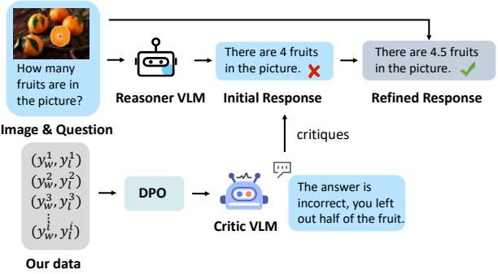
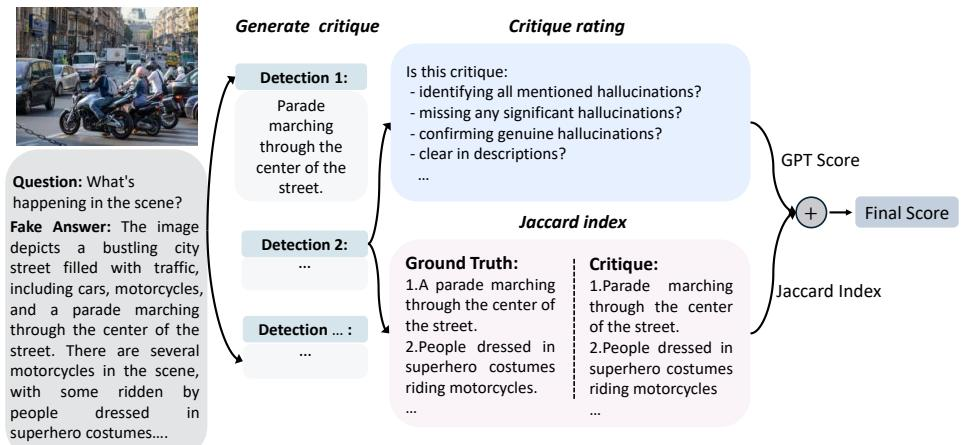
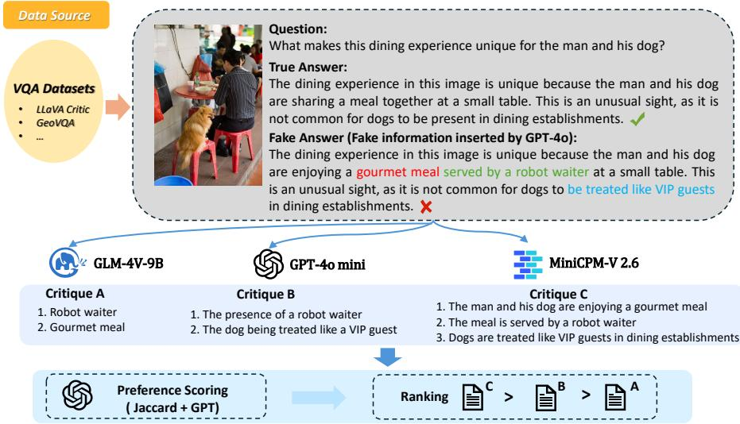
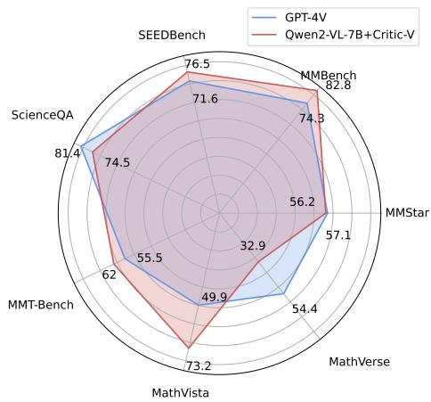
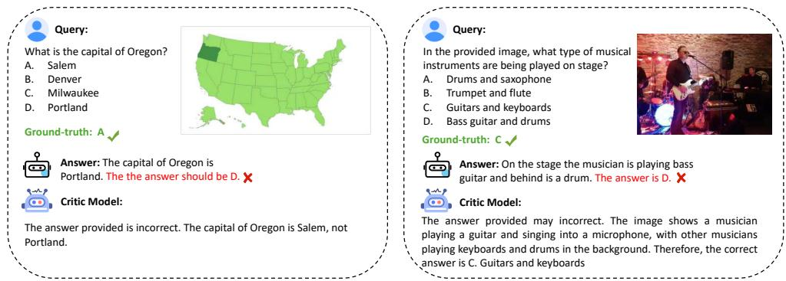

# Critic-V: VLM Critics Help Catch VLM Errors in Multimodal Reasoning

Di Zhang1,2\*†, Jingdi Lei2∗†, Junxian Li3,2∗†, Xunzhi Wang4,2∗†, Yujie Liu5,2†, Zonglin Yang6,2†, Jiatong Li7,2 Weida Wang8,2†, Suorong Yang9,2†, Jianbo Wu10, Peng Ye11, Wanli Ouyang2, Dongzhan Zhou2‡ 1Fudan University,2Shanghai Artificial Intelligence Laboratory, 3Shanghai Jiaotong University, 4Nankai University, 5Shanghai University, 6Nanyang Technological University 7Hong Kong Polytechnic University, 8Tongji University, 9Nanjing University, 10University of California, Merced, 11Chinese University of Hong Kong zhoudongzhan@pjlab.org.cn

## Abstract

Vision-language models (VLMs) have shown remarkable advancements in multimodal reasoning tasks. However, they still often generate inaccurate or irrelevant responses due to issues like hallucinated image understandings or unrefined reasoning paths. To address these challenges, we introduce Critic-V, a novel framework inspired by the Actor-Critic paradigm to boost the reasoning capability of VLMs. This framework decouples the reasoning process and critic process by integrating two independent components: the Reasoner, which generates reasoning paths based on visual and textual inputs, and the Critic, which provides constructive critique to refine these paths. In this approach, the Reasoner generates reasoning responses according to text prompts, which can evolve iteratively as a policy based on feedback from the Critic. This interaction process was theoretically driven by a reinforcement learningframework where the Critic offers natural language critiques instead of scalar rewards, enabling more nuanced feedback to boost the Reasoner’s capability on complex reasoning tasks. The Critic model is trained using Direct Preference Optimization (DPO), leveraging a preference dataset of critiques ranked by Rule-based Reward (RBR) to enhance its critic capabilities. Evaluation results show that the Critic-Vframework significantly outperforms existing methods, including GPT-4V, on 5 out of 8 benchmarks, especially regarding reasoning accuracy and efficiency. Combining a dynamic text-based policy for the Reasoner and constructive feedback from the preference-optimized Critic enables a more reliable and context-sensitive multimodal reasoning process. Our approach provides a promising solution to enhance the reliability of VLMs, improving their performance in real-world reasoning-heavy mul-

timodal applications such as autonomous driving and embodied intelligence. Our data and code are released at https://github.com/kyrieLei/Critic-V.

## 1. Introduction

  
Figure 1. Offline training of critic model and response supervision for VLM. $y _ { w } ^ { i }$ is preferred critique and $y _ { l } ^ { i }$ is disfavored critique.

In recent years, Vision-Language Models (VLMs) have achieved significant advances in multimodal understanding and reasoning [7, 9, 23, 36, 38, 50, 51]. A major breakthrough has been the alignment of language and visual modalities, facilitated by techniques such as instruction tuning [1, 2, 70]. This alignment allows VLMs to progress beyond basic image recognition, enabling them to perform dynamic content reasoning and handle complex question-answering based on visual inputs [12, 59, 64]. These advancements are pivotal for applications in embodied AI [11, 19] and autonomous driving [15, 18]. Despite this progress, VLMs still encounter challenges, including a tendency to generate errors or irrelevant outputs that are unanchored in visual content [25, 27, 42, 53]. They may also over-rely on internal knowledge, sometimes neglecting the visual context [71]. Additionally, their sequential reasoning processes can lead to cascading errors, resulting in outputs that deviate from logical expectations [4, 26].

Prior research primarily focuses on enhancing the intrinsic reasoning capabilities of VLMs through various strategies e.g. fine-tuning on curated datasets [66], refining decoding methods [16, 55], and test-time techniques like selfcorrection [14], self-consistency [8] and Self-Refine [34] to address model flaws. Additionally, Silkie [24] leverages direct preference optimization (DPO) [43] to teach VLMs reasoning strategies using pairs of positive and negative samples. While these approaches have advanced the reasoning capabilities of VLMs, they often rely heavily on the model’s internal abilities without incorporating external feedback, which may lead to erroneous or unreliable outputs. This raises a critical concern: How can we introduce high-quality supervision and feedback during the generation process of VLMs to effectively reduce errors and enhance the reliability of their reasoning path?

To address this concern, we introduce Critic-V, a novel framework based on reinforcement learning from human feedback (RLHF) [45]. As shown in Figure 1, Critic-V features a Reasoner-Critic architecture, where the Reasoner generates reasoning paths based on visual content and related questions, while the Critic provides real-time feedback to refine these paths, enabling more accurate and dynamic reasoning, especially for complex tasks.

However, the Critic evaluation capacity is still limited. To enhance the Critic’s evaluative capacity, inspired by CriticGPT [35], we introduce Vision Error inSertion Technique (VEST) which involves creating degraded versions of ground-truth VQA answers using GPT-4o1 [39] and obtaining critiques from multiple VLMs. The critic model is trained to assess these degraded answers, comparing them with the original ground truth. Additionally, we introduce a Rule-based Reward (RBR) function using the Jaccard index to detect errors and reduce biases in feedback [37].

Our experiments demonstrate that Critic-V significantly improves accuracy and reasoning efficiency compared to existing approaches like Self-Refine [34]. These results underscore the importance of integrating an external, welltrained critic model into the reasoning process. Critic-V offers a promising solution for advancing the image understanding and reasoning capabilities of VLMs in realworld reasoning-heavy multimodal applications such as autonomous driving and embodied intelligence.

Our contributions can be summarized as follows:

• Integrated Reasoner-Critic Framework: We propose a Reasoner-Critic framework that can integrate seamlessly with existing VLMs, significantly improving their performance in multimodal reasoning tasks by incorporating real-time feedback from an external Critic.

• Large-Scale Multimodal Dataset: We introduce a comprehensive dataset including 29,012 multimodal question-answer pairs with critiques generated by VEST and ranked by Rule-based Reward (RBR). This resource can be used to enhance the Critic model, improving their ability to generate high-quality feedback.

• Plug-and-play Critic model: Our critic model can effectively guide VLMs in multimodal reasoning tasks while keenly identifying potential errors in the reasoning process. It provides proactive feedback on potential biases or errors rather than passively assess the quality of inference logic of VLMs, which enhances the overall multimodal reasoning capabilities of VLMs.

## 2. Method

Multimodal reasoning remains a significant challenge for VLMs, which often struggle with inaccuracies when summarizing image content or addressing complex, reasoningintensive questions. These unintentional errors can undermine the performance of VLMs in practical applications. To address this issue, we propose an approach inspired by the Actor-Critic framework, which separates the reasoning process from quality evaluation by incorporating two distinct, complementary modules: the Reasoner and the Critic.

The Reasoner is responsible for generating reasoning paths from both visual and textual inputs. Leveraging the principles of In-Context Reinforcement Learning (ICRL) [21], it uses prompt-based parameters to adapt its reasoning strategy during inference. By integrating visual content with textual descriptions, the Reasoner produces reasoning paths that are continuously evaluated and refined based on feedback from the Critic, enabling the model to improve the quality of responses particularly when faced with complex tasks.

The Critic functions as a quality evaluator for the reasoning paths generated by the Reasoner. By providing natural language feedback, the Critic generates gradient signals that guide the Reasoner in refining its strategy. This feedback loop encourages the Reasoner to minimize errors and enhance its reasoning capabilities over time, leading to more accurate and reliable outputs.

The following subsections provide a detailed discussion of the architecture and functionality of each module.

## 2.1. Reasoner

To improve the reasoning process in reinforcement learning (RL), the Reasoner is responsible for generating reasoning actions a based on the current state s , typically via a policy function $\pi _ { \theta ^ { r e a s o n e r } } ( a | s )$ parameterized by \thea ^{\texi {reason} . The core goal is to optimize the reasoning strategy, often by adjusting these parameters through standard RL methods, such as policy gradient. As in policy gradient [47], the update rule for the reasoner’s parameters can be expressed as follows:

  
Figure 2. The scoring method combines GPT’s evaluation with several predefined rules and the Jaccard index.

$$
\delta \theta _ { t } ^ { r e a s o n e r } = \nabla _ { \theta _ { t } ^ { r e a s o n e r } } \log ( \pi _ { \theta _ { t } ^ { r e a s o n e r } } ( a | s ) ) V ( a | s ) ,\tag{1}
$$

where $V ( a | s )$ represents the value function, which estimates the expected return for taking action a in state s . This value function is typically parameterized by a critic model, which provides feedback that guides the updates to the reasoner’s policy.

However, as VLMs have become increasingly prominent in multimodal tasks, a challenge arises in adapting the traditional reinforcement learning framework to better handle these complex inputs. Specifically, rather than rely on a fixed parameterized policy, the reasoning process in VLMs can be driven by dynamic text prompts P^{\texit {reasoner} , which encapsulate the reasoning context and provide a more flexible approach to action generation. This shift allows for the integration of both visual and textual information, enabling the reasoning process to be guided by the context provided by the text prompt, instead of traditional policy parameters.

In this new approach, the reasoner’s policy update is no longer based solely on traditional parameterization but instead on the evolution of the text prompt. The update rule for the reasoner in this context can be described as follows:

$$
\delta \theta _ { t } ^ { r e a s o n e r } = \nabla _ { \theta ^ { r e a s o n e r } } \log \pi _ { \theta ^ { r e a s o n e r } } ( P _ { t } ^ { r e a s o n e r } + \delta P _ { t } ^ { r e a s o n e r } , I ) R _ { t } ,\tag{2}
$$

where $P _ { t } ^ { r e a s o n e r }$ represents the current text prompt, $\delta P _ { t } ^ { r }$ easoner is the critique (feedback) provided by the critic model, I is the input image, and $R _ { t }$ is the reward signal. This approach allows the reasoner to adaptively refine its actions through changes to the text prompt, which in turn leads to improved decision-making.

Despite the potential benefits of using text prompts, the challenge of computing stable and precise gradients for prompt updates remains. To address this, we leverage

TextGrad [61], a framework designed to provide a more intuitive and stable method for computing the gradients of text-based policies. TextGrad aims to improve the stability and accuracy of the text prompt update process, offering a more reliable alternative to traditional numerical gradient methods. The update rule for the text prompt, within the TextGrad framework, is given by:

$$
\delta P _ { t } ^ { r e a s o n e r } = \hat { \nabla } _ { P _ { t } ^ { r e a s o n e r } } ( \pi _ { P _ { t } ^ { r e a s o n e r } } ( a | s ) , V ( a | s ) ) ,\tag{3}
$$

where $\hat { \nabla }$ indicates the gradient computed using the TextGrad approach. This method significantly improves the robustness of prompt updates, ensuring that the reasoner can effectively learn from the feedback.

Nevertheless, while TextGrad improves stability, further refinement is still possible. To enhance the precision of gradient estimates, we introduce the critic model as an approximation to the optimal gradient. The critic model learns to predict the optimal updates for the text prompt by estimating the expected return of different actions in a given state. This approximation allows the reasoner to more effectively optimize its text prompts, guided by the Critic’s feedback. The Critic’s role can be described as follows:

$$
\pi _ { \theta ^ { c r i i c } } ( \delta P ^ { r e a s o n e r } | P ^ { r e a s o n e r } ) = \mathbb { E } [ \pi _ { \theta ^ { c r i i c } } ( \delta P ^ { r e a s o n e r } | P ^ { r e a s o n e r } , s , a ) ] .\tag{4}
$$

Finally, with the Critic’s guidance, the update rule for the text prompt becomes:

$$
P _ { t + 1 } ^ { r e a s o n e r } \gets U p d a t e ( P _ { t } ^ { r e a s o n e r } , \pi _ { \theta ^ { c r i i i c } } ( \delta P ^ { r e a s o n e r } ) , \eta ) ,\tag{5}
$$

where Update is a function that applies the Critic’s feedback to refine the text prompt P^{\texit {reasoner} , and \eta represents the learning rate, controlling the strength of each update.

## 2.2. Critic Model

In the Reasoner-Critic framework, the Critic serves a crucial role in providing evaluative feedback on the reasoning and generation processes of the model. Unlike traditional scalar rewards that assign a single numerical value, the Critic offers natural language feedback that is more nuanced and context-sensitive. This form of feedback is particularly valuable for complex tasks, as it enables the identification of subtle details in the reasoning process, including fine-grained errors, and logical inconsistencies. Scalar rewards, by contrast, often lack the depth needed for effective natural language reasoning, as highlighted in [13].

  
Figure 3. The annotation framework for our critique on the VisualQA (critique-VQA) dataset. We collect questions and images from various sources, then use GPT-4o to generate a fake answer and employ three different VLMs to identify incorrect elements. Finally, we apply our proposed scoring method to calculate preference between different assessments.

To update the Critic’s parameters, we start with a standard RL formulation, where the Critic’s policy is adjusted based on the feedback it provides to the reasoning model. The Critic’s policy is updated through the following equation:

$$
\begin{array} { r } { \theta _ { t + 1 } ^ { c r i t i c }  \theta _ { t } ^ { c r i t i c } + \eta \nabla _ { \theta _ { t } ^ { c r i t i c } } \log ( \pi _ { \theta _ { t } ^ { c r i t i c } } ( \delta P _ { t } ^ { r e a s o n e r } | P _ { t } ^ { r e a s o n e r } ) ) R _ { t } , } \end{array}\tag{6}
$$

where $P _ { t } ^ { r e a s o n e r }$ is the text prompt given to the VLM reasoner, and $\delta P _ { t } ^ { r e a s o n e r }$ is the critique generated by the critic model. The term $R _ { t }$ represents the reward signal.

To further enhance the Critic’s ability to generate more useful feedback, we thus shift from the scalar rewards fashion of policy gradient to preference-based training via DPO. Rather than optimizing a fixed reward, DPO focuses on training the Critic to distinguish between high-quality and low-quality critiques. This preference-based approach allows for a more subtle and context-aware form of learning, where the Critic improves by ranking critiques rather than directly optimizing for a scalar reward.

To generate preference data for training the Critic with DPO, we apply vision error insertion technique (VEST) to question-image pairs from VQA datasets which is depicted in Figure 3. For each question-image pair, we use GPT-4o to insert one to five fake details into the answer. These fake details are erroneous and can simulate imperfections or errors in the reasoning or modality understanding process, creating a ground truth for the evaluation of the critique’s quality. Several VLMs, including GLM-4V-9B [12], GPT-4o mini [40], and MiniCPM-V [59], are instructed to generate critiques that identify inaccuracies and highlight the weaknesses within the answers.

Then, we leverage a Rule-based Reward (RBR) [37] mechanism to evaluate the quality of critiques to construct the preference relationship. This reward mechanism evaluates the critique’s statements by considering coverage, accuracy, and precision, particularly in identifying and addressing errors. Specifically, we use a scoring method, to evaluate critiques based on how effectively they identify and describe inaccuracies. However, since longer critiques are more likely to contain extraneous information or “nitpicks” [35], we also incorporate the Jaccard index to adjust for potential bias towards false positives. As shown in Figure 2, the Jaccard index compares the set of errors inserted by GPT-4o (G) with the set of errors detected by the VLM (C) as follows:

$$
J a c c a r d ( G , C ) = \frac { \left| { G \cap C } \right| } { \left| { G \cup C } \right| } = \frac { \left| { G \cap C } \right| } { \left| { G } \right| + \left| { C } \right| - \left| { G \cap C } \right| } .\tag{7}
$$

The final score for a critique is a combination of both the Jaccard index and the GPT-based score, where the GPTbased score serves as a regularization term in the scoring function:

$$
S c o r e ( i ) = J a c c a r d ( i ) + \alpha \times G P T ( i ) ,\tag{8}
$$

Table 1. Main results of VLMs on various benchmarks, reported as percentage scores. The bolded scores indicate the best performance on each benchmark. Additionally, we report the score improvements of Qwen2-VL-7B and DeepSeek-VL-7B compared to their original scores with the application of our method (+Critic-V).
<table><tr><td rowspan="2">Model</td><td colspan="8">Benchmarks</td></tr><tr><td>RealWorldQA [56]</td><td>MMStar [6]</td><td>MMBench [30]</td><td>SEEDBench [22]</td><td>ScienceQA [32]</td><td>MMT-Bench [60]</td><td>MathVista [33]</td><td>MathVerse [65]</td></tr><tr><td>Llama-3.2-11B-Vision [36]</td><td>57.8</td><td>49.8</td><td>65.8</td><td>62.2</td><td>67.8</td><td>47.9</td><td>48.6</td><td>24.31</td></tr><tr><td>MiniCPM-V 2.6 [59]</td><td>65.2</td><td>57.5</td><td>78.0</td><td>71.7</td><td>90.9</td><td>56.6</td><td>60.6</td><td>24.1</td></tr><tr><td>InternVL2-8B [7]</td><td>64.4</td><td>61.5</td><td>79.4</td><td>76.2</td><td>89.2</td><td>54.8</td><td>58.3</td><td>30.3</td></tr><tr><td>GPT-4V [57]</td><td>61.4</td><td>57.1</td><td>74.3</td><td>71.6</td><td>81.4</td><td>55.5</td><td>49.9</td><td>54.4</td></tr><tr><td>GeminiPro-Vision [48]</td><td>67.5</td><td>42.6</td><td>68.1</td><td>64.3</td><td>80.6</td><td>55.1</td><td>36.0</td><td>35.3</td></tr><tr><td>LLaVA-v1.5-13B [28]</td><td>55.3</td><td>32.8</td><td>68.6</td><td>68.1</td><td>72.2</td><td>45.7</td><td>26.4</td><td>12.7</td></tr><tr><td>ShareGPT4V-7B [5]</td><td>56.9</td><td>33.0</td><td>69.5</td><td>69.4</td><td>69.4</td><td>45.1</td><td>25.7</td><td>17.4</td></tr><tr><td>InternLM2-XC2 [10]</td><td>63.8</td><td>55.4</td><td>78.1</td><td>74.9</td><td>96.7</td><td>50.0</td><td>57.4</td><td>25.9</td></tr><tr><td>Qwen2-VL-7B [50]</td><td>70.1</td><td>60.7</td><td>80.7</td><td>74.7</td><td>73.4(mm-only)</td><td>60.4</td><td>61.4</td><td>25.8</td></tr><tr><td>Qwen2-VL-7B+Critic-V</td><td>74.9(+4.8)</td><td>56.2(-4.5)</td><td>82.8(+2.1)</td><td>76.5(+1.8)</td><td>74.5(mm-only, +1.1)</td><td>62.0(+1.6)</td><td>73.2(+11.8)</td><td>32.9(+7.1)</td></tr><tr><td>DeepSeek-VL-7B [31]</td><td>58.1</td><td>37.1</td><td>73.5</td><td>70.2</td><td>61.7(mm-only)</td><td>46.5</td><td>35.3</td><td>18.4</td></tr><tr><td>DeepSeek-VL-7B+Critic-V</td><td>62.1(+4.0)</td><td>41.4(+4.3)</td><td>79.0(+5.5)</td><td>70.6(+0.4)</td><td>67.1(mm-only, +5.4)</td><td>53.6(+7.1)</td><td>53.1(+17.8)</td><td>28.9(+10.5)</td></tr><tr><td>LLaVA-v1.5-7B [28]</td><td>50.7</td><td>32.2</td><td>68.4</td><td>65.6</td><td>60.8</td><td>36.0</td><td>37.8</td><td>26.0</td></tr><tr><td>LLaVA-v1.5-7B+Critic-V</td><td>63.5(+12.8)</td><td>38.4(+6.2)</td><td>73.8(+5.4)</td><td>70.1(+4.5)</td><td>65.2(+4.4)</td><td>47.4(+11.4)</td><td>53.1(+15.3)</td><td>30.5(+4.5)</td></tr></table>

where $\alpha$ is hyperparameter to control the impact of GPT-4o’s score on the final score (the setting can refer to Appendix 10). These preference scores allow us to rank various critiques based on their quality, which we then use to construct the critique-VQA dataset. This dataset consists of pairs of critiques with associated preference scores, providing the necessary data for training the critic model. Once the preference dataset is constructed, we proceed to apply DPO to optimize the base model, Qwen2-VL-7B [50], thereby enhancing its ability to deliver more accurate and context-sensitive critiques. The dataset $\mathcal { D } _ { c r i } = \{ ( Q ^ { ( i ) } , I ^ { ( i ) } , C _ { w } ^ { ( i ) } , C _ { l } ^ { ( i ) } ) \} _ { i = 1 } ^ { N }$ consists of input questions $Q ^ { ( i ) }$ , corresponding images $I ^ { ( i ) }$ , the preferred critique $C _ { w } ^ { ( i ) }$ , and the disfavored critique $C _ { l } ^ { ( i ) }$ . The DPO loss function used to train the Critic can be defined as:

\mathc l {L}\_ DPO ( pi e ; \ { mathr f} ) = - b E \_{Q,I C w l} \sim athc {D \_ r ef [\log si ma ( p \_{ th }; \ rm ef ) ight ], (9) where $\begin{array} { r } { f ( \pi _ { \theta } ; \pi _ { \mathrm { r e f } } ) = \beta \mathrm { l o g } \frac { \pi _ { \theta } ( R _ { c } | Q , I ) } { \pi _ { \mathrm { r e f } } ( R _ { c } | Q , I ) } - \beta \mathrm { l o g } \frac { \pi _ { \theta } ( R _ { r } | Q , I ) } { \pi _ { \mathrm { r e f } } ( R _ { r } | Q , I ) } . } \end{array}$ This loss function encourages the Critic to assign higher probabilities to preferred critiques and lower probabilities to disfavored critiques. The parameter $\beta$ controls the deviation from the reference policy. Both $\pi _ { \theta }$ and $\pi _ { \mathrm { r e f } }$ are initialized with the same weights.

## 2.3. Reasoner-Critic Framework

After developing a reliable critic model, we introduce the Reasoner-Critic Framework to iteratively refine the performance of the Reasoner (the reasoning model) through alternating interactions between the Reasoner and the Critic. This framework aims to improve the Reasoner’s output by utilizing feedback from the Critic to guide its adjustments.

The process begins with the Reasoner generating an initial response to a given query based on the input prompt. The Critic then evaluates the response in the context of the query and provides feedback in the form of a critique. The Reasoner then revises its response based on the Critic’s suggestions, incorporating the critique into the new prompt for the next iteration. This cycle continues until a predefined maximum number of iterations is reached, or until the Critic determines that the Reasoner’s response meets a satisfactory level of quality.

Through this alternating feedback loop, the Reasoner is able to adjust its reasoning process with each interaction, potentially improving the accuracy of its outputs over time. This framework is designed to enhance the Reasoner’s ability to respond to more complex tasks, by incorporating nuanced, context-sensitive feedback that may help refine its reasoning process.

## 3. Evaluation

## 3.1. Evaluation Settings

Test Models. We evaluate Critic-V on two widely-used Vision-Language Models (VLMs), Qwen2-VL-7B [50] and DeepSeek-VL-7B [31], to demonstrate its critical capabilities. The comparative models include a range of state-ofthe-art VLMs with varying architectures, parameter sizes, and input modalities. This set includes closed-source models such as GeminiPro-Vision [9] and GPT-4V [38], both known for their robust multimodal understanding capabilities. Additionally, we consider open-source models of different scales, such as Llama-3.2-11B-Vision [36] and ShareGPT4V-7B [6], which provide a balance between computational efficiency and performance. For baseline comparisons, we include Qwen2-VL-7B and DeepSeek-VL-7B without any Critic modules. By selecting models across different scales and feature sets, we aim to provide a comprehensive comparison that highlights the strengths of our approach.

Evaluation Benchmarks. Our evaluation aims to demonstrate the enhanced performance achieved through the critic capabilities of Critic-V across different domains. We employ a comprehensive set of benchmarks to rigorously assess the effectiveness of our method. These benchmarks include RealWorldQA [56], which challenges models with tasks requiring real-world knowledge and multimodal reasoning; MMT-Bench [60], MMStar [6], MMBench [30], and SEEDBench [22], which evaluate a model’s robustness and performance on structured, cross-domain questions. Additionally, ScienceQA is used to assess multimodal scientific knowledge understanding. For mathematical reasoning, we utilize MathVista [33] and MathVerse [65], which are designed to test logical reasoning and arithmetic problem-solving skills. This diverse set of benchmarks provides a comprehensive evaluation of our method’s strengths across various task types, enabling thorough comparisons with other state-of-the-art models.

Evaluation Process and Settings. The evaluation process involves one Reasoner VLM and one Critic VLM, each configured with tailored generation hyperparameters optimized for the respective models. Further details are provided in Appendix 10. Notably, we set the temperature parameter to 0 or a value close to it to ensure stable results. This configuration ensures consistency in outputs while optimizing computational performance. The evaluation follows a tworound conversation process. In the first round, we design a specialized prompt for the questions (refer to Appendix 7 for details).

  
Figure 4. The comparison between GPT-4V and Qwen2-VL-7B+Critic-V across multiple benchmarks.

## 3.2. Result ans Analysis

Improvement with Critic-V. Table 1 presents the performance results of Vision-Language Models (VLMs) across several benchmarks. In 23 out of 24 comparative experiments, Critic-V consistently improves the performance of both Qwen2-VL-7B and DeepSeek-VL-7B, surpassing the original scores of their baseline versions across a wide range of tasks. Notably, with the addition of Critic-V, Qwen2-VL-7B achieves the highest score on five out of eight benchmarks. Significant improvements are especially evident in mathematics-related benchmarks, demonstrating Critic-V’s effectiveness in enhancing complex reasoning capabilities. Specifically, on the MathVista dataset, Qwen2- VL-7B shows an improvement of 11.8%, DeepSeek-VL-7B increases by 17.8%, and LLaVA-v1.5-7B improves by 15.3%. On the MathVerse dataset, Qwen2-VL-7B improves by 7.1%, DeepSeek-VL-7B by 10.5%, and LLaVA-v1.5- 7B achieves a 4.5% improvement. These results highlight Critic-V’s ability to address the unique challenges of mathematical reasoning tasks, where accurate and precise inference is crucial.

Moreover, results on LLaVA-v1.5-7B show Critic-V conducted an improvement of 11.4% and 12.8% on MMT-Bench and RealWorldQA, respectively. As shown in Figure 4, Qwen2-VL-7B with Critic-V outperforms GPT-4V in most cases. These findings suggest that Critic-V effectively guides VLMs to generate more accurate responses and may be adaptable for supporting general reasoning tasks. Overall, the experimental results indicate that Critic-V significantly enhances the reliability of large-scale VLMs, particularly in reasoning-intensive domains such as mathematics, where precise logical reasoning is essential. This demonstrates the potential of our approach to improve the robustness of VLMs in a wide range of complex tasks.

Comparison between different approaches. We compare four leading methods including POVID [68], CSR [69], SIMA [52] and SCL [14] with our Critic-V across reasoning-heavy benchmarks including RealWorldQA [56], MMStar [6], MMBench [30], SEEDBench [22], ScienceQA [32], and MMT-Bench [60]. The results from these four methods, shown in Table 2, are sourced from [14]. Critic-V consistently outperforms other approaches on most benchmarks, particularly RealWorldQA and MMT-Bench. These results underscore Critic-V’s strong potential, showcasing its superior ability to address challenges in natural language reasoning and evaluation tasks.

## 3.3. Case Study

We provide examples of interaction between our critic model and the original LLaVA-v1.5-7B model to illustrate the improvements. As shown on the left side of Figure 5, the original LLaVA-v1.5-7B produces an incorrect answer, while our Critic model correctly identifies

Table 2. Quantitative comparison of LLaVA-V1.5-7B with SCL and four baseline methods. The best results are highlighted in bold. The results underscore Critic-V’s strong reasoning capabilities.
<table><tr><td rowspan="2">Model</td><td colspan="6">Benchmarks</td></tr><tr><td>RealWorldQA [56]</td><td>MMStar [6]</td><td>MMBench [30]</td><td>SEEDBench [22]</td><td>ScienceQA [32]</td><td>MMT-Bench [60]</td></tr><tr><td>LLaVA-V1.5-7B</td><td>50.7</td><td>32.2</td><td>68.4</td><td>65.6</td><td>60.8</td><td>36.0</td></tr><tr><td>+POVID [68]</td><td>51.8</td><td>33.6</td><td>71.6</td><td>65.4</td><td>65.0</td><td>33.4</td></tr><tr><td>+CSR [69]</td><td>51.8</td><td>32.4</td><td>70.6</td><td>65.4</td><td>66.0</td><td>33.2</td></tr><tr><td>+SIMA [52]</td><td>49.3</td><td>32.6</td><td>70.6</td><td>65.2</td><td>64.2</td><td>34.0</td></tr><tr><td>+SCL [14]</td><td>53.2</td><td>35.8</td><td>70.8</td><td>68.6</td><td>67.8</td><td>39.6</td></tr><tr><td>+Critic-V(Ours)</td><td>63.5</td><td>38.4</td><td>73.8</td><td>70.1</td><td>65.2</td><td>49.7</td></tr></table>

Salem as the capital of Oregon. On the right side, Critic-V demonstrates enhanced cognitive reasoning by accurately interpreting the image content, even when faced with ambiguities in the provided options.

## 3.4. Ablation Study

Token Consumption. We investigate the consumption of tokens of our Critic-V across various benchmarks. Further details can be found in Appendix 11. The results indicate that each critique only consumes an additional few dozen tokens, which does not lead to significant computational overhead.

DPO Training for Critic Model. We further investigate the impact of Critic-V by comparing it with a Self-Refine approach, in which the critic model is not trained using DPO. As shown in Table 3, Qwen2-VL-7B with Self-Refine shows modest improvements on two datasets but experiences a slight decline in performance on MMT-Bench. In contrast, after training with the Critic-V approach, Qwen2- VL-7B consistently outperforms both the baseline and the Self-Refine approach. These results indicate that DPO training plays a key role in enhancing the effectiveness of the Critic-V framework, leading to more significant improvements on reasoning-intensive benchmarks. For settings of hyperparameters during DPO training, please refer to Appendix 9.

Evaluation Prompts. To ensure that the observed results are not influenced by the specially designed prompt discussed in Section 3.1, we conduct additional experiments using Qwen2-VL-7B with the same prompt as in our main experiment but without the inclusion of critique. The results from this ablation study, shown in Table 4, indicate that Qwen2-VL-7B does not exhibit the same level of performance improvement when only the special prompt is used, as compared to the Critic-V approach. This suggests that the performance gains can be attributed to the Critic-V framework rather than the prompt design alone.

Table 3. Comparison between Self-Refine and Baseline. We conduct a comparison of Qwen2-VL-7B using Self-Refine, Critic-V, and baseline methods. The results demonstrate the superiority of Critic-V over Self-Refine.
<table><tr><td>Model</td><td>MathVista MMT-Bench MMBench</td></tr><tr><td>Qwen2-VL-7B</td><td>61.4 60.4 80.7</td></tr><tr><td>Qwen2-VL-7B+ Self-Refine</td><td>63.4 57.8 82.1</td></tr><tr><td>Qwen2-VL-7B+Critic-V</td><td>73.2 62.0 82.8</td></tr></table>

Table 4. Ablation of different prompts. We report the scores of each method, along with the respective increases or decreases relative to the original scores.
<table><tr><td>Model</td><td colspan="3">MathVista MMT-Bench MMBench</td></tr><tr><td>Qwen2-VL-7B</td><td>61.4</td><td>60.4</td><td>80.7</td></tr><tr><td>Qwen2-VL-7B+ special-prompt-only</td><td>61.8</td><td>59.0</td><td>81.0</td></tr><tr><td>Qwen2-VL-7B+Critic-V</td><td>73.2</td><td>62.0</td><td>82.8</td></tr></table>

## 4. Related Works

Large Vision-Language Models and Preference Fine-Tuning. VLMs like GPT-4o [17], LLaVA [29], Qwen2- VL [50], and InternVL [7] integrate both visual and textual information to handle multimodal tasks, including visual question answering and image captioning. Human preference alignment techniques like reinforcement learning from human feedback (RLHF) [45], have been widely used in training VLMs to generate content aligned with human preference. LLaVA-RLHF [46] employs human-rated rankings to enhance the visual chat capabilities of VLMs, while Calibrated Self-Rewarding (CSR) [69] incorporates iterative learning and a rewarding paradigm into preference fine-tuning to improve modality alignment [69]. Preference Optimization in VLM with AI-Generated Dispreferences (POVID) leverages preference fine-tuning to reduce hallucinations [68]. Self-Improvement Modality Alignment (SIMA) [52] employs an in-context self-refine approach to improve VLM modality alignment. Self-Correcting Learning (SCL) [14] enables VLMs to learn from selfgenerated correction data through DPO [43], fostering selfimprovement without reliance on external feedback. Additionally, Li et al. [24] adopt GPT-4V [38] to assess the generated outputs from multiple aspects, subsequently distilling preferences into Qwen-VL-Chat [3] through DPO. While prior works primarily focus on improving the internal generative ability of VLMs, our study emphasizes the use of external natural language feedback to reduce errors in VLM reasoning. This approach aims to improve the reliability of VLMs in tasks demanding accurate and logical reasoning.

  
Figure 5. Case studies on evaluation samples from ScienceQA (left) and SEEDBench (right). Our Critic-V accurately identifies Salem as the capital of Oregon, unaffected by the initial incorrect answer, and correctly selects “Guitars and keyboards” as the answer in the right image.

Reasoning with Large Language Models. Reasoning in large language models (LLMs) typically involves breaking down complex questions into sequential intermediate steps to achieve the final answer, exemplified by Chain-of-Thought (CoT) [54] prompting and its variants [20, 58, 63, 67]. However, due to the LLMs’ uncertainty about answer, intermediate inference steps may be inappropriate deductions from the initial context and lead to incorrect final predictions. Even minor mistakes during the reasoning process can result in vastly different final outcomes [26, 41]. Self-Refinement techniques [34, 62, 63] have attracted considerable interest recently. Nevertheless, their effectiveness is largely constrained by their dependence on the inherent abilities of LLMs, which may limit the broader application and scalability of these methods. Tyen et al. [49] suggest that LLMs cannot find reasoning errors, but can correct them, we extend this inspiration to the area of VLMs to train a critic vision-language model to locate imperfections in visual content perception and errors in reasoning steps. CriticGPT [35], which designed mainly for programming, applies a text-only bug insertion to collect data and training via an on-policy fashion. Our work shares a similar data generation idea but differs by adopting a simpler off-policy strategy. Our dataset is specifically designed for visual question answering (VQA), leveraging it to enhance error correction in Vision-Language Models (VLMs) within the realm of multimodal reasoning.

## 5. Conclusion

We propose Critic-V, a novel framework designed to enhance feedback quality in the visual perception and reasoning processes of Vision-Language Models (VLMs). This framework introduces an external critic model that provides natural language feedback, significantly improving VLM performance, especially in complex reasoning tasks. The Critic-V framework centers around a newly constructed Visual Question Answering (VQA) dataset, which incorporates critiques from multiple VLMs. Each critique is evaluated using a novel scoring method that combines Jaccard similarity and GPT-4o summarization. In Critic-V, we formalize the interaction between the VLM reasoner and the critic model through mathematical equations, providing insights into how critique-based supervision drives improvement. These equations reveal the principles behind the critique-feedback loop and establish that the critic model can be trained using Direct Preference Optimization (DPO). This training process optimizes the guidance provided during reasoning tasks. The performance on benchmarks like MathVista and RealWorldQA indicates the welltrained critic model can significantly enhance VLM reasoning capabilities, particularly in handling complex, multimodal tasks. Experimental results indicate that incorporating an external critic model during inference surpasses several traditional methods, resulting in significant improvements in VLM performance. These findings highlight the value and potential of deploying a well-trained critic model at the inference stage.

## 6. Acknowledgements

This work is supported by the Shanghai Municipal Science and Technology Major Project. This work is also supported by Shanghai Artificial Intelligence Laboratory.

## References

[1] Jean-Baptiste Alayrac, Jeff Donahue, Pauline Luc, Antoine Miech, Iain Barr, Yana Hasson, Karel Lenc, Arthur Mensch, Katherine Millican, Malcolm Reynolds, et al. Flamingo: a visual language model for few-shot learning. Advances in neural information processing systems, 35:23716–23736, 2022. 1

[2] Anas Awadalla, Irena Gao, Josh Gardner, Jack Hessel, Yusuf Hanafy, Wanrong Zhu, Kalyani Marathe, Yonatan Bitton, Samir Gadre, Shiori Sagawa, et al. Openflamingo: An opensource framework for training large autoregressive visionlanguage models. arXiv preprint arXiv:2308.01390, 2023. 1

[3] Jinze Bai, Shuai Bai, Shusheng Yang, Shijie Wang, Sinan Tan, Peng Wang, Junyang Lin, Chang Zhou, and Jingren Zhou. Qwen-vl: A frontier large vision-language model with versatile abilities. arXiv preprint arXiv:2308.12966, 2023. 8

[4] Yejin Bang, Samuel Cahyawijaya, Nayeon Lee, Wenliang Dai, Dan Su, Bryan Wilie, Holy Lovenia, Ziwei Ji, Tiezheng Yu, Willy Chung, et al. A multitask, multilingual, multimodal evaluation of chatgpt on reasoning, hallucination, and interactivity. arXiv preprint arXiv:2302.04023, 2023. 2

[5] Lin Chen, Jinsong Li, Xiaoyi Dong, Pan Zhang, Conghui He, Jiaqi Wang, Feng Zhao, and Dahua Lin. Sharegpt4v: Improving large multi-modal models with better captions. arXiv preprint arXiv:2311.12793, 2023. 5

[6] Lin Chen, Jinsong Li, Xiaoyi Dong, Pan Zhang, Yuhang Zang, Zehui Chen, Haodong Duan, Jiaqi Wang, Yu Qiao, Dahua Lin, et al. Are we on the right way for evaluating large vision-language models? arXiv preprint arXiv:2403.20330, 2024. 5, 6, 7

[7] Zhe Chen, Jiannan Wu, Wenhai Wang, Weijie Su, Guo Chen, Sen Xing, Muyan Zhong, Qinglong Zhang, Xizhou Zhu, Lewei Lu, et al. Internvl: Scaling up vision foundation models and aligning for generic visual-linguistic tasks. In Proceedings of the IEEE/CVF Conference on Computer Vision and Pattern Recognition, pages 24185–24198, 2024. 1, 5, 7

[8] Gautier Dagan, Olga Loginova, and Anil Batra. Cast: Crossmodal alignment similarity test for vision language models. arXiv preprint arXiv:2409.11007, 2024. 2

[9] Google DeepMind. Gemini-1.5-pro, 2024. Accessed: 2024- 11-6. 1, 5

[10] Xiaoyi Dong, Pan Zhang, Yuhang Zang, Yuhang Cao, Bin Wang, Linke Ouyang, Xilin Wei, Songyang Zhang, Haodong Duan, Maosong Cao, et al. Internlm-xcomposer2: Mastering free-form text-image composition and comprehension in vision-language large model. arXiv preprint arXiv:2401.16420, 2024. 5

[11] Danny Driess, Fei Xia, Mehdi SM Sajjadi, Corey Lynch, Aakanksha Chowdhery, Brian Ichter, Ayzaan Wahid,

Jonathan Tompson, Quan Vuong, Tianhe Yu, et al. Palm e: An embodied multimodal language model. arXiv preprint arXiv:2303.03378, 2023. 1

[12] Team GLM, Aohan Zeng, Bin Xu, Bowen Wang, Chenhui Zhang, Da Yin, Diego Rojas, Guanyu Feng, Hanlin Zhao, Hanyu Lai, Hao Yu, Hongning Wang, Jiadai Sun, Jiajie Zhang, Jiale Cheng, Jiayi Gui, Jie Tang, Jing Zhang, Juanzi Li, Lei Zhao, Lindong Wu, Lucen Zhong, Mingdao Liu, Minlie Huang, Peng Zhang, Qinkai Zheng, Rui Lu, Shuaiqi Duan, Shudan Zhang, Shulin Cao, Shuxun Yang, Weng Lam Tam, Wenyi Zhao, Xiao Liu, Xiao Xia, Xiaohan Zhang, Xiaotao Gu, Xin Lv, Xinghan Liu, Xinyi Liu, Xinyue Yang, Xixuan Song, Xunkai Zhang, Yifan An, Yifan Xu, Yilin Niu, Yuantao Yang, Yueyan Li, Yushi Bai, Yuxiao Dong, Zehan Qi, Zhaoyu Wang, Zhen Yang, Zhengxiao Du, Zhenyu Hou, and Zihan Wang. Chatglm: A family of large language models from glm-130b to glm-4 all tools, 2024. 1, 4

[13] Olga Golovneva, Moya Chen, Spencer Poff, Martin Corredor, Luke Zettlemoyer, Maryam Fazel-Zarandi, and Asli Celikyilmaz. Roscoe: A suite of metrics for scoring step-bystep reasoning. arXiv preprint arXiv:2212.07919, 2022. 4

[14] Jiayi He, Hehai Lin, Qingyun Wang, Yi Fung, and Heng Ji. Self-correction is more than refinement: A learning framework for visual and language reasoning tasks. arXiv preprint arXiv:2410.04055, 2024. 2, 6, 7, 8

[15] Shengchao Hu, Li Chen, Penghao Wu, Hongyang Li, Junchi Yan, and Dacheng Tao. St-p3: End-to-end vision-based autonomous driving via spatial-temporal feature learning. In European Conference on Computer Vision, pages 533–549. Springer, 2022. 1

[16] Qidong Huang, Xiaoyi Dong, Pan Zhang, Bin Wang, Conghui He, Jiaqi Wang, Dahua Lin, Weiming Zhang, and Nenghai Yu. Opera: Alleviating hallucination in multimodal large language models via over-trust penalty and retrospection-allocation. In Proceedings of the IEEE/CVF Conference on Computer Vision and Pattern Recognition, pages 13418–13427, 2024. 2

[17] Aaron Hurst, Adam Lerer, Adam P Goucher, Adam Perelman, Aditya Ramesh, Aidan Clark, AJ Ostrow, Akila Welihinda, Alan Hayes, Alec Radford, et al. Gpt-4o system card. arXiv preprint arXiv:2410.21276, 2024. 7

[18] Bo Jiang, Shaoyu Chen, Qing Xu, Bencheng Liao, Jiajie Chen, Helong Zhou, Qian Zhang, Wenyu Liu, Chang Huang, and Xinggang Wang. Vad: Vectorized scene representation for efficient autonomous driving. In Proceedings of the IEEE/CVF International Conference on Computer Vision, pages 8340–8350, 2023. 1

[19] Yunfan Jiang, Agrim Gupta, Zichen Zhang, Guanzhi Wang, Yongqiang Dou, Yanjun Chen, Li Fei-Fei, Anima Anandkumar, Yuke Zhu, and Linxi Fan. Vima: General robot manipulation with multimodal prompts. arXiv preprint arXiv:2210.03094, 2(3):6, 2022. 1

[20] Takeshi Kojima, Shixiang Shane Gu, Machel Reid, Yutaka Matsuo, and Yusuke Iwasawa. Large language models are zero-shot reasoners. Advances in neural information pro cessing systems, 35:22199–22213, 2022. 8

[21] Michael Laskin, Luyu Wang, Junhyuk Oh, Emilio Parisotto, Stephen Spencer, Richie Steigerwald, DJ Strouse, Steven

Hansen, Angelos Filos, Ethan Brooks, et al. In-context reinforcement learning with algorithm distillation. arXiv preprint arXiv:2210.14215, 2022. 2

[22] Bohao Li, Rui Wang, Guangzhi Wang, Yuying Ge, Yixiao Ge, and Ying Shan. Seed-bench: Benchmarking multimodal llms with generative comprehension. arXiv preprint arXiv:2307.16125, 2023. 5, 6, 7

[23] Junxian Li, Di Zhang, Xunzhi Wang, Zeying Hao, Jingdi Lei, Qian Tan, Cai Zhou, Wei Liu, Yaotian Yang, Xinrui Xiong, et al. Chemvlm: Exploring the power of multimodal large language models in chemistry area. arXiv preprint arXiv:2408.07246, 2024. 1

[24] Lei Li, Zhihui Xie, Mukai Li, Shunian Chen, Peiyi Wang, Liang Chen, Yazheng Yang, Benyou Wang, and Lingpeng Kong. Silkie: Preference distillation for large visual language models. arXiv preprint arXiv:2312.10665, 2023. 2, 8

[25] Yifan Li, Yifan Du, Kun Zhou, Jinpeng Wang, Wayne Xin Zhao, and Ji-Rong Wen. Evaluating object hallucination in large vision-language models. arXiv preprint arXiv:2305.10355, 2023. 1

[26] Hunter Lightman, Vineet Kosaraju, Yura Burda, Harri Edwards, Bowen Baker, Teddy Lee, Jan Leike, John Schulman, Ilya Sutskever, and Karl Cobbe. Let’s verify step by step. arXiv preprint arXiv:2305.20050, 2023. 2, 8

[27] Fuxiao Liu, Kevin Lin, Linjie Li, Jianfeng Wang, Yaser Yacoob, and Lijuan Wang. Mitigating hallucination in large multi-modal models via robust instruction tuning. In The Twelfth International Conference on Learning Representations, 2023. 1

[28] Haotian Liu, Chunyuan Li, Yuheng Li, and Yong Jae Lee. Improved baselines with visual instruction tuning. In Proceedings of the IEEE/CVF Conference on Computer Vision and Pattern Recognition, pages 26296–26306, 2024. 5

[29] Haotian Liu, Chunyuan Li, Qingyang Wu, and Yong Jae Lee. Visual instruction tuning. Advances in neural information processing systems, 36, 2024. 7

[30] Yuan Liu, Haodong Duan, Yuanhan Zhang, Bo Li, Songyang Zhang, Wangbo Zhao, Yike Yuan, Jiaqi Wang, Conghui He, Ziwei Liu, et al. Mmbench: Is your multi-modal model an all-around player? In European Conference on Computer Vision, pages 216–233. Springer, 2025. 5, 6, 7

[31] Haoyu Lu, Wen Liu, Bo Zhang, Bingxuan Wang, Kai Dong, Bo Liu, Jingxiang Sun, Tongzheng Ren, Zhuoshu Li, Hao Yang, et al. Deepseek-vl: towards real-world visionlanguage understanding. arXiv preprint arXiv:2403.05525, 2024. 5

[32] Pan Lu, Swaroop Mishra, Tony Xia, Liang Qiu, Kai-Wei Chang, Song-Chun Zhu, Oyvind Tafjord, Peter Clark, and Ashwin Kalyan. Learn to explain: Multimodal reasoning via thought chains for science question answering. In The 36th Conference on Neural Information Processing Systems (NeurIPS), 2022. 5, 6, 7

[33] Pan Lu, Hritik Bansal, Tony Xia, Jiacheng Liu, Chunyuan Li, Hannaneh Hajishirzi, Hao Cheng, Kai-Wei Chang, Michel Galley, and Jianfeng Gao. Mathvista: Evaluating mathematical reasoning of foundation models in visual contexts. In In-

ternational Conference on Learning Representations (ICLR), 2024. 5, 6

[34] Aman Madaan, Niket Tandon, Prakhar Gupta, Skyler Hallinan, Luyu Gao, Sarah Wiegreffe, Uri Alon, Nouha Dziri, Shrimai Prabhumoye, Yiming Yang, et al. Self-refine: Iterative refinement with self-feedback. Advances in Neural Information Processing Systems, 36, 2024. 2, 8

[35] Nat McAleese, Rai Michael Pokorny, Juan Felipe Ceron Uribe, Evgenia Nitishinskaya, Maja Trebacz, and Jan Leike. Llm critics help catch llm bugs. arXiv preprint arXiv:2407.00215, 2024. 2, 4, 8

[36] Meta. Llama-3.2-11b-vision, 2024. Accessed: 2024-10-28. 1, 5

[37] Tong Mu, Alec Helyar, Johannes Heidecke, Joshua Achiam, Andrea Vallone, Ian Kivlichan, Molly Lin, Alex Beutel, John Schulman, and Lilian Weng. Rule based rewards for language model safety. arXiv preprint arXiv:2411.01111, 2024. 2, 4

[38] OpenAI. Gpt-4v(ision) system card, 2023. Accessed: 2024- 11-6. 1, 5, 8

[39] OpenAI. Hello GPT-4o. https://openai.com/ index/hello-gpt-4o/, 2024. Accessed: 2024-05-26. 2

[40] OpenAI. Gpt-4o mini: advancing cost-efficient intelligence, 2024. Accessed: 2024-11-7. 4

[41] Debjit Paul, Mete Ismayilzada, Maxime Peyrard, Beatriz Borges, Antoine Bosselut, Robert West, and Boi Faltings. Refiner: Reasoning feedback on intermediate representations. arXiv preprint arXiv:2304.01904, 2023. 8

[42] Haotong Qin, Ge-Peng Ji, Salman Khan, Deng-Ping Fan, Fa had Shahbaz Khan, and Luc Van Gool. How good is google bards visual understanding? an empirical study on open challenges. Machine Intelligence Research, 20(5):605–613, 2023. 1

[43] Rafael Rafailov, Archit Sharma, Eric Mitchell, Christopher D Manning, Stefano Ermon, and Chelsea Finn. Direct preference optimization: Your language model is secretly a reward model. Advances in Neural Information Processing Systems, 36, 2024. 2, 8

[44] Jeff Rasley, Samyam Rajbhandari, Olatunji Ruwase, and Yuxiong He. Deepspeed: System optimizations enable training deep learning models with over 100 billion parameters. In Proceedings ofthe 26th ACM SIGKDD International Conference on Knowledge Discovery & Data Mining, pages 3505–3506, 2020. 2

[45] Nisan Stiennon, Long Ouyang, Jeffrey Wu, Daniel Ziegler, Ryan Lowe, Chelsea Voss, Alec Radford, Dario Amodei, and Paul F Christiano. Learning to summarize with human feedback. Advances in Neural Information Processing Systems, 33:3008–3021, 2020. 2, 7

[46] Zhiqing Sun, Sheng Shen, Shengcao Cao, Haotian Liu, Chunyuan Li, Yikang Shen, Chuang Gan, Liang-Yan Gui, Yu-Xiong Wang, Yiming Yang, et al. Aligning large multi modal models with factually augmented rlhf. arXiv preprint arXiv:2309.14525, 2023. 7

[47] Richard S Sutton, David McAllester, Satinder Singh, and Yishay Mansour. Policy gradient methods for reinforcement

learning with function approximation. Advances in neural information processing systems, 12, 1999. 2

[48] Gemini Team, Rohan Anil, Sebastian Borgeaud, Jean-Baptiste Alayrac, Jiahui Yu, Radu Soricut, Johan Schalkwyk, Andrew M Dai, Anja Hauth, Katie Millican, et al. Gemini: a family of highly capable multimodal models. arXiv preprint arXiv:2312.11805, 2023. 5

[49] Gladys Tyen, Hassan Mansoor, Peter Chen, Tony Mak, and Victor Carbune. Llms cannot find reasoning errors, but˘ can correct them given the error location. arXiv preprint arXiv:2311.08516, 2023. 8

[50] Peng Wang, Shuai Bai, Sinan Tan, Shijie Wang, Zhihao Fan, Jinze Bai, Keqin Chen, Xuejing Liu, Jialin Wang, Wenbin Ge, Yang Fan, Kai Dang, Mengfei Du, Xuancheng Ren, Rui Men, Dayiheng Liu, Chang Zhou, Jingren Zhou, and Junyang Lin. Qwen2-vl: Enhancing vision-language model’s perception of the world at any resolution. arXiv preprint arXiv:2409.12191, 2024. 1, 5, 7

[51] Xiao Wang, Guangyao Chen, Guangwu Qian, Pengcheng Gao, Xiao-Yong Wei, Yaowei Wang, Yonghong Tian, and Wen Gao. Large-scale multi-modal pre-trained models: A comprehensive survey. Machine Intelligence Research, 20 (4):447–482, 2023. 1

[52] Xiyao Wang, Jiuhai Chen, Zhaoyang Wang, Yuhang Zhou, Yiyang Zhou, Huaxiu Yao, Tianyi Zhou, Tom Goldstein, Parminder Bhatia, Furong Huang, et al. Enhancing visuallanguage modality alignment in large vision language models via self-improvement. arXiv preprint arXiv:2405.15973, 2024. 6, 7, 8

[53] Yaoting Wang, Peiwen Sun, Dongzhan Zhou, Guangyao Li, Honggang Zhang, and Di Hu. Ref-avs: Refer and segment objects in audio-visual scenes. In European Conference on Computer Vision, pages 196–213. Springer, 2024. 1

[54] Jason Wei, Xuezhi Wang, Dale Schuurmans, Maarten Bosma, Fei Xia, Ed Chi, Quoc V Le, Denny Zhou, et al. Chain-of-thought prompting elicits reasoning in large language models. Advances in neural information processing systems, 35:24824–24837, 2022. 8

[55] Sangmin Woo, Donguk Kim, Jaehyuk Jang, Yubin Choi, and Changick Kim. Don’t miss the forest for the trees: Attentional vision calibration for large vision language models. arXiv preprint arXiv:2405.17820, 2024. 2

[56] X. Grok-1.5 vision preview, 2024. Accessed: 2024-11-06. 5, 6, 7

[57] Zhengyuan Yang, Linjie Li, Kevin Lin, Jianfeng Wang, Chung-Ching Lin, Zicheng Liu, and Lijuan Wang. The dawn of lmms: Preliminary explorations with gpt-4v (ision). arXiv preprint arXiv:2309.17421, 9(1):1, 2023. 5

[58] Shunyu Yao, Dian Yu, Jeffrey Zhao, Izhak Shafran, Tom Griffiths, Yuan Cao, and Karthik Narasimhan. Tree of thoughts: Deliberate problem solving with large language models. Advances in Neural Information Processing Systems, 36, 2024. 8

[59] Yuan Yao, Tianyu Yu, Ao Zhang, Chongyi Wang, Junbo Cui, Hongji Zhu, Tianchi Cai, Haoyu Li, Weilin Zhao, Zhihui He, et al. Minicpm-v: A gpt-4v level mllm on your phone. arXiv preprint arXiv:2408.01800, 2024. 1, 4, 5

[60] Kaining Ying, Fanqing Meng, Jin Wang, Zhiqian Li, Han Lin, Yue Yang, Hao Zhang, Wenbo Zhang, Yuqi Lin, Shuo Liu, Jiayi Lei, Quanfeng Lu, Runjian Chen, Peng Xu, Renrui Zhang, Haozhe Zhang, Peng Gao, Yali Wang, Yu Qiao, Ping Luo, Kaipeng Zhang, and Wenqi Shao. Mmt-bench: A comprehensive multimodal benchmark for evaluating large vision-language models towards multitask agi, 2024. 5, 6, 7

[61] Mert Yuksekgonul, Federico Bianchi, Joseph Boen, Sheng Liu, Zhi Huang, Carlos Guestrin, and James Zou. Textgrad: Automatic” differentiation” via text. arXiv preprint arXiv:2406.07496, 2024. 3

[62] Di Zhang, Xiaoshui Huang, Dongzhan Zhou, Yuqiang Li, and Wanli Ouyang. Accessing gpt-4 level mathemat ical olympiad solutions via monte carlo tree self-refine with llama-3 8b: A technical report. arXiv preprint arXiv:2406.07394, 2024. 8

[63] Di Zhang, Jianbo Wu, Jingdi Lei, Tong Che, Jiatong Li, Tong Xie, Xiaoshui Huang, Shufei Zhang, Marco Pavone, Yuqiang Li, et al. Llama-berry: Pairwise optimization for o1- like olympiad-level mathematical reasoning. arXiv preprint arXiv:2410.02884, 2024. 8

[64] Pan Zhang, Xiaoyi Dong, Yuhang Zang, Yuhang Cao, Rui Qian, Lin Chen, Qipeng Guo, Haodong Duan, Bin Wang, Linke Ouyang, Songyang Zhang, Wenwei Zhang, Yining Li, Yang Gao, Peng Sun, Xinyue Zhang, Wei Li, Jingwen Li, Wenhai Wang, Hang Yan, Conghui He, Xingcheng Zhang, Kai Chen, Jifeng Dai, Yu Qiao, Dahua Lin, and Jiaqi Wang. Internlm-xcomposer-2.5: A versatile large vision language model supporting long-contextual input and output. arXiv preprint arXiv:2407.03320, 2024. 1

[65] Renrui Zhang, Dongzhi Jiang, Yichi Zhang, Haokun Lin, Ziyu Guo, Pengshuo Qiu, Aojun Zhou, Pan Lu, Kai-Wei Chang, Peng Gao, et al. Mathverse: Does your multi-modal llm truly see the diagrams in visual math problems? arXiv preprint arXiv:2403.14624, 2024. 5, 6

[66] Yongting Zhang, Lu Chen, Guodong Zheng, Yifeng Gao, Ru Zheng, Jinlan Fu, Zhenfei Yin, Senjie Jin, Yu Qiao, Xuanjing Huang, et al. Spa-vl: A comprehensive safety preference alignment dataset for vision language model. arXiv preprint arXiv:2406.12030, 2024. 2

[67] Zhuosheng Zhang, Aston Zhang, Mu Li, and Alex Smola. Automatic chain of thought prompting in large language models. arXiv preprint arXiv:2210.03493, 2022. 8

[68] Yiyang Zhou, Chenhang Cui, Rafael Rafailov, Chelsea Finn, and Huaxiu Yao. Aligning modalities in vision large language models via preference fine-tuning. arXiv preprint arXiv:2402.11411, 2024. 6, 7

[69] Yiyang Zhou, Zhiyuan Fan, Dongjie Cheng, Sihan Yang, Zhaorun Chen, Chenhang Cui, Xiyao Wang, Yun Li, Linjun Zhang, and Huaxiu Yao. Calibrated self-rewarding vision language models. arXiv preprint arXiv:2405.14622, 2024. 6, 7

[70] Deyao Zhu, Jun Chen, Xiaoqian Shen, Xiang Li, and Mohamed Elhoseiny. Minigpt-4: Enhancing vision-language understanding with advanced large language models. arXiv preprint arXiv:2304.10592, 2023. 1

[71] Meng Ziyang, Yu Dai, Zezheng Gong, Shaoxiong Guo, Min glong Tang, and Tongquan Wei. VGA: Vision GUI assis-

tant - minimizing hallucinations through image-centric finetuning. In Findings of the Association for Computational Linguistics: EMNLP 2024, pages 1261–1279. Association for Computational Linguistics, 2024. 1