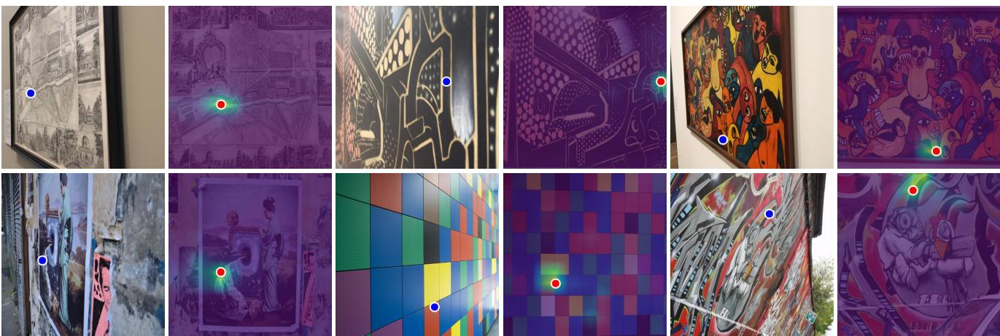
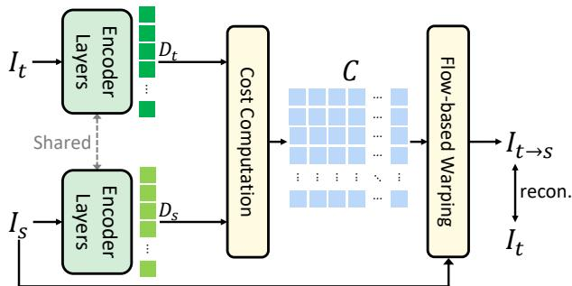
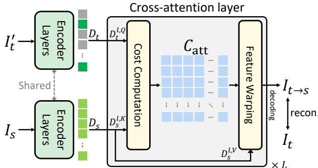
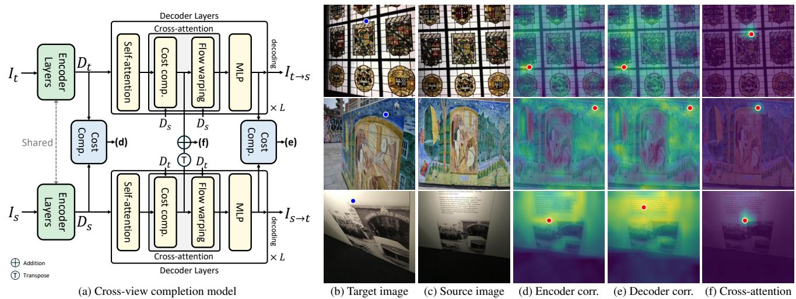
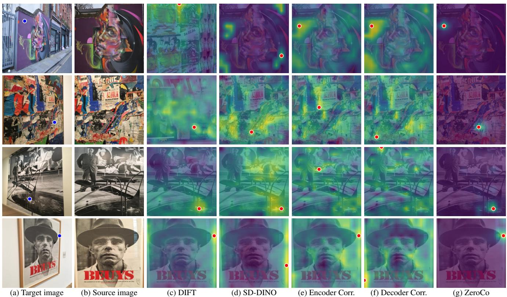

# Cross-View Completion Models are Zero-shot Correspondence Estimators

Honggyu An1∗ Jin Hyeon Kim2∗ Seonghoon Park3 Jaewoo Jung1 Jisang Han1 Sunghwan Hong2† Seungryong Kim1†

1 KAIST 2 Korea University 3 Samsung Electronics

  
Figure 1. Cross-view completion models [92, 93] are zero-shot correspondence estimators. Given a pair of images consisting of target (left) and source (right) images, we visualize the attended region in the source image corresponding to a query point marked in the target image in blue, where the point with the highest attention is marked in red. Although cross-view completion models [92, 93] are not trained with correspondence-supervision, its cross-attention map already establishes precise correspondences.

## Abstract

In this work, we explore new perspectives on crossview completion learning by drawing an analogy to selfsupervised correspondence learning. Through our analysis, we demonstrate that the cross-attention map within crossview completion models captures correspondence more effectively than other correlations derived from encoder or decoder features. We verify the effectiveness of the crossattention map by evaluating on both zero-shot matching and learning-based geometric matching and multi-frame depth estimation.

## 1. Introduction

Representation learning [33, 36, 65, 92, 93] is a foundational problem in computer vision field, as it aims to extract meaningful visual cues from image collections. This enables enhanced performance in various downstream tasks such as segmentation, detection, and optical flow through transfer learning [34, 59, 89, 102].

Recent advances in self-supervised representation learning have introduced cross-view completion [92, 93] as a powerful pretext task, which extends the masked image modeling [37] to two views, where one view is masked and reconstructed using information from the unmasked view. Cross-view completion, in essence, leverages spatial relationships between multiple views of the same scene to learn consistent geometric features. By training models to align information across views through a cross-attention layer, this approach inherently enhances structure and geometry awareness, requiring the model to capture geometric structure and maintain spatial coherence across viewpoints. This approach has thus shown notable success, with recent works such as DUSt3R [86, 92, 93] achieving state-of-the-art performance in complex geometric vision tasks across both 2D and 3D domains, such as optical flow, stereo depth, depth estimation, and 3D reconstruction [74, 86, 93].

However, much less is understood about the mechanisms through which the cross-view completion paradigm functions effectively. In this work, we aim to investigate and precisely identify which aspects of the representation are learned and how they contribute to improved performance on geometric downstream tasks. Our observations reveal that cross-view completion learning closely parallels self-supervised dense correspondence learning approaches, such as optical flow estimation [47, 57, 60, 73, 79, 88] and stereo depth estimation [26–28, 30, 46, 54], as illustrated in Fig. 2. Drawing from this analogy, we discover that the cross-attention map effectively captures geometric relationships, owing to its resemblance to conventional selfsupervised dense correspondence models.

To verify this, we analyze the learned feature representations of cross-view completion models [92, 93] by visualizing pixel-wise cosine similarity scores between encoder and decoder features from input image pairs in a dense correspondence task. Specifically, we focus on CroCo-v2 [93], and compare similarity scores calculated from encoder features, decoder features, and the cross-attention map generated within the decoder network. As shown in Fig. 3, these visualizations reveal that among the three correlations, the cross-attention map precisely highlights corresponding regions with greater sharpness and less noise compared to raw feature descriptors obtained directly from the encoder or decoder. Note that the encoder or decoder features of crossview completion models have been used in previous literature for correspondence [53] and 3D reconstruction [86].

We further examine how the cross-attention map within cross-view completion models encodes a more accurate and robust representation through the lens of dense correspondence and multi-frame depth estimation. To fully leverage the learned cross-attention map for correspondence, we propose ZeroCo, a zero-shot inference technique that enforces reciprocity by generating a pair of cross-attention maps for the target and source images. We evaluate our approach on zero-shot dense correspondence benchmarks, demonstrating that the cross-attention map encodes rich geometric representations and achieves state-of-the-art performance. Furthermore, by introducing lightweight, learnable modules on top of the cross-attention map, we achieve competitive results on standard benchmarks for dense correspondence and multi-frame depth estimation. Our extensive evaluations support these findings, showing that directly utilizing the cross-attention map significantly outperforms relying on encoder or decoder descriptors, which previous works such as DUSt3R [86] have used. Finally, we conduct comprehensive ablation studies to validate our design choices further.

In summary, our contributions are as follows:

• We reveal that the effectiveness of cross-attention maps in cross-view completion models stems from their analogy to self-supervised dense correspondence learning, as their learning process closely resembles that of self-supervised correspondence learning.

• We provide a comprehensive analysis of the learned fea ture representations in cross-view completion models, showing that cross-attention maps capture more accurate and robust geometric information than encoder or decoder descriptors.

• We demonstrate that incorporating cross-attention maps with simple, lightweight heads significantly improves performance on dense correspondence and multi-frame depth estimation, achieving state-of-the-art results validated through extensive evaluations.

## 2. Related Work

Self-supervised learning. Self-supervised learning has proven highly effective for image-level tasks, achieving strong performance in classification and various downstream applications [6, 29, 36]. Its primary advantage is the elimination of the need for ground truth data, which is hard to obtain for dense prediction tasks such as geometric matching and depth estimation. For dense prediction tasks, prior research [26, 44, 81, 82, 91] has employed strategies such as generating synthetic warps or incorporating additional information, such as temporal frames and relative pose, to create supervisory signals. More recently, drawing inspiration from BERT in natural language processing [16], the vision community has adopted masked image modeling [1, 12, 13, 33, 37] as a pretraining strategy, successfully capturing richer contextual information and finer details for fine-tuning on downstream tasks.

Cross-view completion pretraining. The pretext task of cross-view completion (CVC) [1, 33, 92] has garnered significant attention, enhancing robustness in geometric tasks. Extending traditional masked image modeling to two views, CVC enables the model to learn geometric knowledge by training the model to predict or align information across views. The effectiveness of CVC has been best demonstrated by CroCo-v2 [93], where models have achieved state-of-the-art performance in multiple downstream tasks such as visual correspondence [53] and 3D reconstruction [86]. While current approaches utilize CroCo-v2 by simply leveraging the decoder features, these works have not been fully exploiting the power of CVC as we reveal that the cross-attention map of the decoder embeds richer representations than the decoder features.

Self-supervised matching learning. Within the domain of dense correspondence, self-supervised learning approaches have reduced reliance on annotations by employing a variety of techniques. These techniques include photometric loss functions such as the Charbonnier penalty [98], census loss [60], and Structural Similarity Index Measure (SSIM) [88, 90]; homography transformations [61, 81, 82]; and the incorporation of pose information [18, 19, 83, 84] to establish dense correspondences. In self-supervised matching, source points are aligned to target points using loss functions that facilitate the refined reconstruction of the target. Here, we demonstrate that this strategy is analogous to cross-view completion pretraining, thereby enabling robust and accurate zero-shot estimation in our tasks.

Multi-frame depth estimation. Monocular depth estimation has seen extensive research, maturing models [48, 70, 95, 97] that benefit 3D vision applications, yet lack robustness without multi-view constraints, leading to issues in complex scenes. Recent work has integrated geometric cues to improve robustness, with multi-frame and multi-view cost volume methods gaining popularity. Supervised [2, 8, 22, 55, 96] and self-supervised [4, 24, 32, 45, 87, 91] approaches utilize epipolar-based cost volumes for depth cues. Unlike prior works that are rely on supervised training with direct dense flow or depth regression, we show that the cross-attention map learned from cross-view completion provides readily robust cost volumes, yielding robust performance in multi-frame depth estimation tasks.

## 3. Method

## 3.1. Cross-view Completion and Correspondence

Cross-view completion (CVC) [92, 93], first introduced in CroCo [92], is a self-supervised representation learning strategy inspired by masked image modeling [5, 23, 37, 68]. In CVC, the model is pretrained by reconstructing a masked target image, where about 90% of the content is obscured, using a reference source image. Specifically, features from the target and source images are initially extracted via a ViT encoder [17], denoted as $D _ { s } \in \mathbb { R } ^ { h \times w \times c }$ and $D _ { t } \in \mathbb { R } ^ { h \times w \times c }$ from source image $I _ { s } \in \mathbb { R } ^ { H \times W \times 3 }$ and masked target image $I _ { t } ^ { \prime } \in \mathbb { R } ^ { H \times W \times 3 }$ with height h (or H), width w (or W), and channel $c ,$ and then processed through a decoder containing subsequent self-attention layer, cross-attention layer, and multi-layer perceptron (MLP). In the decoder module, the cross-attention map selectively retrieves relevant information from the source features to guide the reconstruction of the target image. In this section, we draw connections between CVC and the broader self-supervised correspondence learning paradigm to highlight their analogy and shared objective of learning an effective cost volume.

Cross-attention map. In cross-view completion, warping is guided by the cross-attention map, generated by extracting query features $D _ { t } ^ { l , Q } \in \mathbb { R } ^ { h \times w \times d }$ with channel d, and key features $D _ { s } ^ { l , K } \in \mathbb { R } ^ { \tilde { h } \times w \times d }$ from target $D _ { t }$ and source $D _ { s }$ features through projections at each l-th layer in decoder. The cross-attention map $C _ { \mathrm { a t t } } ^ { l }$ is then computed by measuring the similarity between these query and key features:

$$
C _ { \mathrm { a t t } } ^ { l } ( i , j ) = \mathrm { s o f t m a x } ( D _ { t } ^ { l , Q } ( i ) \cdot D _ { s } ^ { l , K } ( j ) / \sqrt { d } ) ,\tag{1}
$$

where l and softmax( ) denote the layer index among L layers and softmax operation, respectively, and i and j denotes pixel positions at target and source features, respectively

  
(a) Self-supervised matching methods

  
(b) Cross-view completion methods  
Figure 2. Analogy of cross-view completion and self-supervised matching learning. The cost volume learned by (b) the crossattention layers within cross-view completion models [92, 93] closely resembles that of (a) traditional self-supervised matching methods [47, 57].

Cross-view completion learning. Based on this crossattention map $C _ { \mathrm { a t t } } ^ { l ^ { - } } \in \mathbb { R } ^ { h \times w \times h \times w }$ , the cross-attention layer warps source features into the target feature space $D _ { t  s } ^ { l } ,$ retrieving the source features most similar to the target:

$$
D _ { t \to s } ^ { l } ( i ) = \sum _ { j } C _ { \mathrm { a t t } } ^ { l } ( i , j ) \cdot \mathrm { s a m p l e r } ( D _ { s } ^ { l , V } ; j ) ,\tag{2}
$$

where $D _ { s } ^ { l , V }$ represents the value features from the source image and sampler( ) indicates a sampling operation. As the goal of CVC is to reconstruct the masked target image, an image reconstruction loss is applied to ensure that the warped features accurately reconstruct the target image:

$$
\mathcal { L } = \operatorname { r e c o n } ( \mathcal { E } ( D _ { t  s } ^ { * } ) , I _ { t } ) ,\tag{3}
$$

where $D _ { t  s } ^ { * }$ denotes the reconstructed features from the final cross-attention layer, $\mathcal { E } ( \cdot )$ is an output head that reshapes the warped features to align with the target image’s dimensions, and recon( ) indicates image reconstruction loss.

Connection to self-supervised correspondence learning. The objective of self-supervised correspondence learning is to learn the matching networks solely with input images, $I _ { s }$ and $I _ { t } ,$ , without correspondence-supervision. Correspondence methods [18, 19, 41, 42, 82–84] also extract feature descriptors, $D _ { s }$ and $D _ { t } ,$ using encoders such as CNNs [35] or Transformers [85]. Subsequently, a correlation map as a cost volume $C \in \mathbb { R } ^ { h \times w \times h \times w }$ is constructed by computing pixel-wise similarity:

  
Figure 3. Visualization of matching costs. We visualize the matching costs of the (d) encoder, (e) decoder, and (f) cross-attention maps in the (a) cross-view completion model [92, 93]. The cross-attention exhibits the sharpest attention, while the encoder and decode correlations exhibit broader attention, indicating that geometric cues are most effectively captured in the cross-attention maps.

$$
C ( i , j ) = D _ { t } ( i ) \cdot D _ { s } ( j ) .\tag{4}
$$

Following approaches in [44, 94], this cost volume is converted into a matching distribution by applying a softmax function, thereby encoding information similar to that captured in cross-view completion pretraining [92]. This matching distribution identifies the most probable correspondences, which are subsequently used in loss computation to learn correspondences. The learned matching distribution ultimately enables the model to reconstruct the target image based on the information from the source image:

$$
I _ { t \to s } ( i ) = \sum _ { j } C ( i , j ) \mathrm { s a m p l e r } ( I _ { s } ; j ) .\tag{5}
$$

The reconstructed target image obtained in this way is then used to train the model with an reconstruction loss:

$$
\begin{array} { r } { \mathcal { L } = \operatorname { r e c o n } ( I _ { t  s } , I _ { t } ) , } \end{array}\tag{6}
$$

where recon( ) could be any reconstruction loss such as Charbonnier penalty [98] or SSIM [88, 90].

Thus, the objective of cross-view completion pretraining closely aligns with establishing correspondences between input image pairs in a self-supervised manner, where the learning outcome is to warp the source view to reconstruct the target view. As shown in Fig. 2, both cost volumes undergo similar computations to reconstruct the target image by learning to find the correct correspondences to minimize the matching costs between the target and source images. This indicates the potential benefits of leveraging the crossattention map as a cost volume.

Analysis. Previous succesful works, such as CroCo-Flow [93], DUSt3R [86], and MASt3R [53], have leveraged CVC knowledge, primarily utilizing only the decoder features. However, building on the analogy discussed above, we infer that the cross-attention map is trained to learn the correspondences between two input images. As shown in Fig. 3, we visualize the attention of three correlations (d)-(f) presented in the cross-view completion model. These three correlations are derived from three components: (d) encoder features, (e) decoder features, and (f) cross-attention map of CroCo. Comparing the decoder feature (e) with the crossattention map (f), we find that, surprisingly, the decoder feature-based correlation map fails to find the correct correspondences, while the cross-attention map accurately and sharply identifies the matching point. Furthermore, compared to other correlations, the cross-attention map demonstrates superior zero-shot matching performance, precisely locating the corresponding point of the blue query in the target image, while the other correlations struggle. This result indicates that the geometric knowledge learned through cross-view completion is better embodied in the crossattention map than in the encoder and decoder features.

## 3.2. Zero-shot Correspondence

Based on these findings, we aim to fully utilize the learned cross-attention map for zero-shot correspondence estimation. We propose ZeroCo, which is a zero-shot inference technique that enforces reciprocity by generating a pair of cross-attention maps for the target and source images. Specifically, we obtain these maps by passing the original input pair $( I _ { t } , I _ { s } )$ and the swapped pair $( I _ { s } , I _ { t } )$ . However, directly combining the maps is problematic due to directional constraints from the softmax operation. Therefore, we retrieve the cross-attention maps before softmax, defined as $C ^ { l } ( i , j ) = D _ { t } ^ { l , Q } ( i ) \cdot D _ { s } ^ { l , K } ( j )$ , and then combine them to enforce reciprocity. Finally, we generate the maps $C ^ { l }$ and $C _ { \mathrm { s w a p } } ^ { l }$ from the original and swapped inputs, respectively, and fuse them as follows:

$$
C ^ { \prime } = \frac { 1 } { L } \sum _ { l } C ^ { l } + ( \frac { 1 } { L } \sum _ { l } C _ { \mathrm { s w a p } } ^ { l } ) ^ { T } ,\tag{7}
$$

where $C ^ { \prime }$ denotes the final cost volume and L denotes the number of decoder layers. From $C ^ { \prime } .$ , we can infer the final flow field $F = \mathrm { s o f t a r g m a x } ( C ^ { \prime } )$ and use this to warp the source image to the target to evaluate the correspondences.

## 3.3. Extension: Learning-based Correspondence

We conducted learning-based geometry experiments to validate the effectiveness of cross-attention maps as matching costs. While cross-attention maps demonstrate strong zeroshot performance, their implicit learning nature limits finegrained matching [49, 75]. To address this, we applied cost aggregation to refine the cross-attention maps in two settings: geometric matching and multi-frame depth estimation.

Geometric matching network. We propose two learning-based correspondence models: one that directly fine-tunes the cross-attention map and another that employs an additional learnable head on the frozen cross-attention map. We name these methods ZeroCo-finetuned and ZeroCo-flow, respectively. Analogous to previous zeroshot correspondence estimation, we incorporate reciprocity into both methods by enabling the decoder to process swapped inputs and merge the resulting cross-attention maps to ensure invariance to input swapping.

For ZeroCo-flow, we apply cost aggregation techniques to the cross-attention map such that $C ^ { \prime } = \mathcal { T } _ { c } ( C _ { \mathrm { a t t } } , D _ { t  s } ) +$ $( \mathcal { T } _ { c } ( C _ { \mathrm { a t t , s w a p } } , D _ { s  t } ) ) ^ { T }$ , where $\mathcal { T } _ { c } ( \cdot )$ is the cost aggregation module, inspired by $[ 9 \mathrm { - } 1 1 ] , C _ { \mathrm { a t t , s w a p } }$ represents the crossattention map from swapped inputs, and $C ^ { \prime }$ is the refined coarse cost volume.

However, the resulting coarse cost volume has low resolution, which hampers the detection of fine matching details. Inspired by [11], we propose an upsampling module designed to increase resolution along the target axis while avoiding interactions with the source axes to preserve information within the cost volume. This gives us $C ^ { \prime \prime } = \mathcal { U } ( C ^ { \prime } )$ , where $\mathcal { U } ( \cdot )$ is the upsampling module, consisting of shallow convolutional layers, and $C ^ { \prime \prime }$ is the upsampled cost volume. Even with these simple aggregation and upsampling modules, we achieve favorable dense geometric matching results due to the rich geometric knowledge inherent in the cross-attention map trained by crossview completion task. The final flow is estimated as follows: $F _ { \mathrm { f l o w } } = \mathrm { s o f t a r g m a x } ( C ^ { \prime \prime } )$ . For training, we use the same correspondence regression loss as in previous dense geometric matching works [82–84].

Multi-frame depth estimation network. In multi-frame depth estimation [32, 91], it is common practice to construct a cost volume based on epipolar geometry to capture multiview geometric cues that enhance depth prediction. However, this approach requires accurate pose estimation, which limits its applicability and results in poor performance in dynamic regions. In this work, we aim to leverage the crossattention map as a full cost volume for multi-frame depth estimation. However, a naive use of the cross-attention map would challenge in learning meaningful representations for depth estimation due to its high flexibility [49, 75].

To address it, we perform attention aggregation using both the cross-attention map and feature descriptors to obtain a refined cost volume, such that $C ^ { \prime } = \mathcal { T } _ { d } ( C _ { \mathrm { a t t } } , D _ { t  s } )$ where $\mathcal { T } _ { d } ( \cdot )$ denotes the aggregation module for depth estimation. To further capture fine details, we design the system to produce a refined depth map $F _ { \mathrm { d e p t h } }$ by inputting the aggregated attention map into the DPT head [72], such that $F _ { \mathrm { d e p t h } } ~ = ~ \mathrm { D P T } ( C ^ { \prime } )$ . For training, we use reprojection, and smoothing losses commonly used in multi-frame selfsupervised depth estimation works [27, 91]. Although this design is straightforward, we observe that, due to the crossattention map’s inherent rich geometric cues, our approach not only performs as well as epipolar-based cost volumes but also exhibits robustness to dynamic objects and noise. We call this model as ZeroCo-depth.

The detailed architecture and aggregation technique used for ZeroCo-finetuned, ZeroCo-flow and ZeroCo-depth are provided in Sec. A of the supplementary material.

## 4. Experiments

## 4.1. Implementation Details

We leverage pretrained weights that were trained on crossview completion for image reconstruction. Specifically, we adopt CroCo-v2 [93], where the encoder is ViT-Large [17] and consists of 24 encoder blocks, while the decoder is made up of 12 decoder blocks. Each decoder block contains both self-attention and cross-attention layers from the original transformers [85]. Further details can be found in Sec. A and B of the supplementary material.

## 4.2. Zero-shot dense geometric results

We demonstrate that the cross-attention map in cross-view completion [93] encodes rich geometric information by evaluating its zero-shot dense matching performance. Our method achieves state-of-the-art results on the HPatches dataset across various resolutions as shown in Tab. 1 and outperforms existing models, such as DIFT [80] and SD-DINO [99]. We conducted inference with DINO-v2 [65], renowned for its geometric awareness in visual foundation models [21]. These models experience significant performance drops under extreme geometric changes (i.e., scenes

<table><tr><td rowspan="3">Methods</td><td rowspan="3">Matching cost</td><td colspan="6">HPatches-240 AEPE↓</td><td colspan="6">HPatches-Original</td></tr><tr><td colspan="6"></td><td colspan="6">AEPE↓</td></tr><tr><td>I</td><td>ⅡI</td><td>IⅢI</td><td>IV</td><td></td><td></td><td>Avg.</td><td>II</td><td>III</td><td>IV</td><td>V</td><td>Avg.</td></tr><tr><td>DINOv2 [65]</td><td>Correlation</td><td>18.81</td><td>26.97</td><td>27.36</td><td>30.66</td><td>36.60</td><td>28.08</td><td>77.66</td><td>115.11</td><td>119.93</td><td>133.30</td><td>161.05</td><td>121.41</td></tr><tr><td>DIFTSD [80]</td><td>Correlation</td><td>15.89</td><td>27.08</td><td>29.25</td><td>32.76</td><td>40.34</td><td>29.06</td><td>52.85</td><td>95.69</td><td>108.90</td><td>123.72</td><td>156.31</td><td>107.49</td></tr><tr><td>DIFTADM [80]</td><td>Correlation</td><td>24.21</td><td>34.88</td><td>35.92</td><td>39.62</td><td>46.76</td><td>36.28</td><td></td><td></td><td></td><td></td><td></td><td></td></tr><tr><td>DIFTADM [80]</td><td>Correlation</td><td>13.57</td><td>24.41</td><td>26.16</td><td>31.03</td><td>35.52</td><td>26.14</td><td>52.50</td><td>92.33</td><td>101.60</td><td>113.93</td><td>143.54</td><td>100.78</td></tr><tr><td>SD-DINO [99]</td><td>Correlation</td><td>13.98</td><td>26.69</td><td>28.79</td><td>34.42</td><td>42.04</td><td>29.19</td><td>48.99</td><td>105.82</td><td>110.49</td><td>133.38</td><td>157.34</td><td>111.05</td></tr><tr><td>CroCo [93] Encoder</td><td>Correlation</td><td>39.69</td><td>47.28</td><td>47.35</td><td>48.64</td><td>54.63</td><td>47.52</td><td>168.56</td><td>201.52</td><td>197.82</td><td>206.63</td><td>234.83</td><td>201.87</td></tr><tr><td>CroCo [93] Decoder</td><td>Correlation</td><td>32.38</td><td>45.39</td><td>44.35</td><td>46.19</td><td>54.84</td><td>44.63</td><td>137.30</td><td>195.51</td><td>191.86</td><td>198.49</td><td>231.11</td><td>190.85</td></tr><tr><td>CroCo [93] Enc. + Dec.</td><td>Correlation</td><td>26.31</td><td>34.82</td><td>36.68</td><td>37.69</td><td>43.71</td><td>35.84</td><td>112.39</td><td>148.92</td><td>154.97</td><td>160.06</td><td>192.07</td><td>153.68</td></tr><tr><td>ZeroCo (Ours)</td><td>Cross-attention</td><td>5.07</td><td>7.16</td><td>10.19</td><td>11.37</td><td>13.26</td><td>9.41</td><td>20.75</td><td>27.32</td><td>39.10</td><td>43.43</td><td>46.35</td><td>35.39</td></tr></table>

Table 1. Zero-shot matching results on HPatches [3]. Zero-shot performance of pretrained models is evaluated using their cost volumes on both HPatches-240 and HPatches-Original, which represent 240 × 240 and original resolutions, respectively. A higher scene label, such as V, corresponds to a more challenging setting with extreme geometric deformation. The best result is highlighted in bold, and the second best result is marked with an underline. For the correlation map, both the CroCo Encoder and CroCo Decoder utilize all their respective encoder or decoder features. In contrast, CroCo Enc. + Dec., following CroCo-flow [93], DUSt3R [86], and MASt3R [53], uses the 23rd encoder layer and the 3rd, 7th, and 11th decoder layers. ∗: adjusted hyperparameters to account for memory constraints and suboptima performance in dense settings.

<table><tr><td rowspan="3">Methods</td><td rowspan="3">Matching cost</td><td colspan="8">ETH3D</td></tr><tr><td colspan="8">AEPE↓</td></tr><tr><td>rate=3</td><td>rate=5</td><td>rate=7</td><td>rate=9</td><td>rate=11</td><td>rate=13</td><td>rate=15</td><td>Avg.</td></tr><tr><td>DINOv2 [65]</td><td>Correlation</td><td>21.02</td><td>27.38</td><td>34.85</td><td>42.63</td><td>49.80</td><td>57.94</td><td>64.84</td><td>42.64</td></tr><tr><td>DIFTSD [80]</td><td>Correlation</td><td>9.93</td><td>12.80</td><td>17.66</td><td>24.05</td><td>30.01</td><td>38.54</td><td>46.83</td><td>25.69</td></tr><tr><td>DIFTADM [80]</td><td>Correlation</td><td>11.20</td><td>15.24</td><td>20.81</td><td>27.30</td><td>33.38</td><td>40.40</td><td>47.61</td><td>27.99</td></tr><tr><td>SD-DINO [99]</td><td>Correlation</td><td>15.13</td><td>21.43</td><td>28.65</td><td>36.54</td><td>43.59</td><td>51.48</td><td>57.59</td><td>31.63</td></tr><tr><td>CroCo [93] Encoder</td><td>Correlation</td><td>57.64</td><td>66.07</td><td>71.78</td><td>78.05</td><td>81.24</td><td>88.10</td><td>92.78</td><td>76.52</td></tr><tr><td>CroCo [93] Decoder</td><td>Correlation</td><td>30.93</td><td>40.69</td><td>48.58</td><td>56.29</td><td>60.54</td><td>68.29</td><td>77.76</td><td>54.73</td></tr><tr><td>CroCo [93] Enc. + Dec.</td><td>Correlation</td><td>42.15</td><td>51.56</td><td>56.08</td><td>58.03</td><td>64.41</td><td>68.23</td><td>75.24</td><td>59.39</td></tr><tr><td>ZeroCo (Ours)</td><td>Cross-attention</td><td>11.64</td><td>11.88</td><td>12.00</td><td>12.31</td><td>12.52</td><td>13.69</td><td>14.99</td><td>12.72</td></tr></table>

Table 2. Zero-shot matching results on ETH3D [78]. Zero-shot performance of pretrained models by evaluating their cost volumes at the original resolutions of ETH3D. A higher scene rate, such as 15, corresponds to a more challenging setting with extreme geometric deformation. The best result is highlighted in bold, and the second best result is marked with an underline. For the correlation map, both the CroCo Encoder and CroCo Decoder utilize all their respective encoder or decoder features. In contrast, CroCo Enc. + Dec., following CroCo-flow [93], DUSt3R [86], and MASt3R [53], uses only the 23rd encoder layer and the 3rd, 7th, and 11th decoder layers. ∗: adjusted hyperparameters to account for memory constraints and suboptimal performance in dense settings.
<table><tr><td rowspan="3">Methods</td><td rowspan="3">Training dataset</td><td colspan="6">HPatches-Original</td><td colspan="8">ETH3D</td></tr><tr><td colspan="2"></td><td colspan="2">AEPE↓</td><td colspan="2"></td><td colspan="2"></td><td colspan="2">AEPE↓</td><td colspan="2"></td><td colspan="2"></td></tr><tr><td>I</td><td>ⅡI</td><td>ⅢII</td><td>IV</td><td>V</td><td>Avg.</td><td>rate=3</td><td>rate=5</td><td>rate=7</td><td>rate=9</td><td>rate=11</td><td>rate=13</td><td>rate=15</td><td>Avg.</td></tr><tr><td>DGC-Net [61]</td><td>C</td><td>5.71</td><td>20.48</td><td>34.15</td><td>43.94</td><td>62.01</td><td>33.26</td><td>2.49</td><td>3.28</td><td>4.18</td><td>5.35</td><td>6.78</td><td>9.02</td><td>12.25</td><td>6.19</td></tr><tr><td>GLU-Net [82]</td><td> $\mathcal { D }$ </td><td>1.55</td><td>12.66</td><td>27.54</td><td>32.04</td><td>52.47</td><td>25.05</td><td>1.98</td><td>2.54</td><td>3.49</td><td>4.24</td><td>5.61</td><td>7.55</td><td>10.78</td><td>5.17</td></tr><tr><td>GLU-Net-GOCor [81]</td><td> $\mathcal { D } ^ { * }$ </td><td>1.29</td><td>10.07</td><td>23.86</td><td>27.17</td><td>38.41</td><td>20.16</td><td>1.93</td><td>2.28</td><td>2.64</td><td>3.01</td><td>3.62</td><td>4.79</td><td>7.80</td><td>3.72</td></tr><tr><td>DMP [40]</td><td></td><td>3.21</td><td>15.54</td><td>32.54</td><td>38.62</td><td>63.43</td><td>30.64</td><td>2.43</td><td>3.31</td><td>4.41</td><td>5.56</td><td>6.93</td><td>9.55</td><td>14.20</td><td>6.62</td></tr><tr><td>PDCNet [83]</td><td> ${ \mathcal { D } } ^ { * } , { \mathcal { M } }$ </td><td>1.30</td><td>11.92</td><td>28.60</td><td>35.97</td><td>42.41</td><td>24.04</td><td>1.77</td><td>2.10</td><td>2.50</td><td>2.88</td><td>3.47</td><td>4.88</td><td>7.57</td><td>3.60</td></tr><tr><td>PDCNet+ [84]</td><td> $\mathcal { D } ^ { * } , \mathcal { M }$ </td><td>1.44</td><td>8.97</td><td>22.24</td><td>30.13</td><td>31.77</td><td>18.91</td><td>1.70</td><td>1.96</td><td>2.24</td><td>2.57</td><td>3.04</td><td>4.20</td><td>6.25</td><td>3.14</td></tr><tr><td>DiffMatch [64]</td><td> $\mathcal { D } ^ { * }$ </td><td>1.85</td><td>10.83</td><td>19.18</td><td>26.38</td><td>35.96</td><td>18.84</td><td>2.08</td><td>2.30</td><td>2.59</td><td>2.94</td><td>3.29</td><td>3.86</td><td>4.54</td><td>3.12</td></tr><tr><td>DUSt3R [86]</td><td> $\mathrm { M I X } _ { 8 }$ </td><td>10.11</td><td>13.19</td><td>15.28</td><td>18.44</td><td>30.78</td><td>17.56</td><td>8.16</td><td>8.93</td><td>9.59</td><td>10.06</td><td>10.77</td><td>11.66</td><td>13.57</td><td>10.39</td></tr><tr><td>MASt3R [53]</td><td> $\mathrm { M I X } _ { 1 4 }$ </td><td>13.07</td><td>11.58</td><td>20.74</td><td>15.18</td><td>24.49</td><td>17.01</td><td>1.98</td><td>2.14</td><td>2.31</td><td>2.48</td><td>2.63</td><td>2.85</td><td>3.93</td><td>2.62</td></tr><tr><td>ZeroCo-finetuned (Ours)</td><td>D*, M</td><td>5.15</td><td>11.55</td><td>18.59</td><td>20.86</td><td>22.72</td><td>15.77</td><td>3.00</td><td>3.49</td><td>3.66</td><td>4.50</td><td>5.07</td><td>6.01</td><td>7.48</td><td>4.74</td></tr><tr><td>ZeroCo-flow (Ours)</td><td> ${ \mathcal { D } } ^ { * } , { \mathcal { M } }$ </td><td>1.51</td><td>9.09</td><td>15.62</td><td>21.07</td><td>20.73</td><td>13.61</td><td>1.80</td><td>2.06</td><td>2.39</td><td>2.65</td><td>2.99</td><td>3.60</td><td>4.69</td><td>2.88</td></tr></table>

Table 3. Learning-based matching results on both HPatches [3] and ETH3D [78]. A higher scene label or rate, such as V or 15, corresponds to more challenging settings with extreme geometric deformations. The best result is highlighted in bold, and the second best result is marked with an underline. The following notations are used for the training datasets: C: Citycam, D: DPED-CityScapes-ADE, D∗: COCO-augmented DPED-CityScapes-ADE, M: Megadepth, MIX8: eight mixed dataset used in DUSt3R [86], MIX14: 14 mixed dataset used in MASt3R [53].

Figure 4. Visualization of matching costs in previous zero-shot matching methods [80, 99], encoder and decoder features within cross-view completion models, and our ZeroCo.
<table><tr><td>Method</td><td>Additional network</td><td>Test frames</td><td>AbsRel↓</td><td>SqRel↓</td><td>RMSE↓</td><td>RMSElog↓</td><td>δ1↑</td><td>δ2↑</td><td>δ3↑</td></tr><tr><td>Monodepth2 [27]</td><td></td><td>1</td><td>0.115</td><td>0.903</td><td>4.863</td><td>0.193</td><td>0.877</td><td>0.959</td><td>0.981</td></tr><tr><td>Packnet-SFM [30]</td><td></td><td>1</td><td>0.111</td><td>0.785</td><td>4.601</td><td>0.189</td><td>0.878</td><td>0.960</td><td>0.982</td></tr><tr><td>MonoViT [100]</td><td></td><td>1</td><td>0.099</td><td>0.708</td><td>4.372</td><td>0.175</td><td>0.900</td><td>0.967</td><td>0.984</td></tr><tr><td>DualRefine [4]</td><td></td><td>1</td><td>0.103</td><td>0.776</td><td>4.491</td><td>0.181</td><td>0.894</td><td>0.965</td><td>0.983</td></tr><tr><td>GUDA [31]</td><td></td><td>1</td><td>0.107</td><td>0.714</td><td>4.421</td><td></td><td>0.883</td><td></td><td></td></tr><tr><td>RA-Depth [38]</td><td></td><td>1</td><td>0.096</td><td>0.632</td><td>4.216</td><td>0.171</td><td>0.903</td><td>0.968</td><td>0.985</td></tr><tr><td>Patil et al. [69]</td><td>=</td><td>N</td><td>0.111</td><td>0.821</td><td>4.650</td><td>0.187</td><td>0.883</td><td>0.961</td><td>0.982</td></tr><tr><td>ManyDepth [91]</td><td>M</td><td>2 (-1, 0)</td><td>0.098</td><td>0.770</td><td>4.459</td><td>0.176</td><td>0.900</td><td>0.965</td><td>0.983</td></tr><tr><td>TC-Depth [77]</td><td>M</td><td>3 (-1, 0, 1)</td><td>0.103</td><td>0.746</td><td>4.483</td><td>0.185</td><td>0.894</td><td></td><td>0.983</td></tr><tr><td>DynamicDepth [24]</td><td>M,S</td><td>2 (-1, 0)</td><td>0.096</td><td>0.720</td><td>4.458</td><td>0.175</td><td>0.897</td><td>0.964</td><td>0.984</td></tr><tr><td>DepthFormer [32]</td><td>M</td><td>2 (-1, 0)</td><td>0.090</td><td>0.661</td><td>4.149</td><td>0.175</td><td>0.905</td><td>0.967</td><td>0.984</td></tr><tr><td>MOVEDepth [87]</td><td>M</td><td>2 (-1, 0)</td><td>0.094</td><td>0.704</td><td>4.389</td><td>0.175</td><td>0.902</td><td>0.965</td><td>0.983</td></tr><tr><td>DualRefine [4]</td><td>M</td><td>2 (-1, 0)</td><td>0.087</td><td>0.698</td><td>4.234</td><td>0.170</td><td>0.914</td><td>0.967</td><td>0.983</td></tr><tr><td>ZeroCo-depth (Ours)</td><td>=</td><td>2 (-1, 0)</td><td>0.090</td><td>0.637</td><td>4.128</td><td>0.169</td><td>0.915</td><td>0.968</td><td>0.984</td></tr></table>

Table 4. Depth estimation results on the Eigen split [20] of KITTI [25]. We compare our model with previous single- and multi-frame depth estimation networks. The best result is highlighted in bold, and the second best result is marked with an underline. M: monocular depth network [27], S: segmentation network.

IV and V). Fig. 4 presents a visualization of matching costs from previous zero-shot matching methods, along with the three components in the cross-view completion model. This suggests that CVC encodes richer geometric information compared to diffusion models [76] or DINOv2 [65]. Additionally, Table 2 shows that our model can maintain robust performance on the ETH3D [78] dataset, which also contains scenes with extreme viewpoint differences.

The result table indicates that the essential geometric knowledge of CVC is contained in the cross-attention map rather than in the encoder and decoder features. This is further demonstrated by comparing it with zero-shot matching methods such as DINOv2 and diffusion models.

<table><tr><td>Method</td><td>Additional networks</td><td>Test frames</td><td>AbsRel.↓</td><td>SqRel↓</td><td>RMSE↓</td><td>δ1↑</td></tr><tr><td>Monodepth2 [27]</td><td>=</td><td>1</td><td>0.159</td><td>1.937</td><td>6.363</td><td>0.816</td></tr><tr><td>ManyDepth [91]</td><td>M</td><td>2 (-1, 0)</td><td>0.169</td><td>2.175</td><td>6.634</td><td>0.789</td></tr><tr><td>DynamicDepth† [24]</td><td>M,S</td><td>2 (-1, 0)</td><td>0.143</td><td>1.497</td><td>4.971</td><td>0.841</td></tr><tr><td>ZeroCo-depth (Ours)</td><td>=</td><td>2 (-1, 0)</td><td>0.127</td><td>1.322</td><td>5.058</td><td>0.860</td></tr></table>

Table 5. Depth estimation results for dynamic objects in Cityscapes [14]. We compare our model with previous singleand multi-frame depth estimation networks on dynamic objects as defined in DynamicDepth [24]. The best result is in bold, and the second best result is marked with an underline. †: reproduced results from the official repository. M: monocular depth network [27], S: segmentation network.
<table><tr><td>Method</td><td>Additional network</td><td>Noise frame</td><td>mDEE↓</td><td>mRR↑</td></tr><tr><td>Manydepth [91]</td><td>M</td><td>0</td><td>0.277</td><td>0.803</td></tr><tr><td>DualRefine [4]</td><td>M</td><td>0</td><td>0.268</td><td>0.801</td></tr><tr><td>ZeroCo-depth (Ours)</td><td>-</td><td>0</td><td>0.118</td><td>0.967</td></tr><tr><td>Manydepth [91]</td><td>M</td><td>-1</td><td>0.118</td><td>0.979</td></tr><tr><td>DualRefine [4]</td><td>M</td><td>-1</td><td>0.102</td><td>0.983</td></tr><tr><td>ZeroCo-depth (Ours)</td><td>-</td><td>-1</td><td>0.100</td><td>0.986</td></tr><tr><td>Manydepth [91]</td><td>M</td><td>0,-1</td><td>0.262</td><td>0.819</td></tr><tr><td>DualRefine [4]</td><td>M</td><td>0,-1</td><td>0.265</td><td>0.805</td></tr><tr><td>ZeroCo-depth (Ours)</td><td></td><td></td><td></td><td></td></tr><tr><td></td><td>-</td><td>0,-1</td><td>0.161</td><td>0.920</td></tr></table>

Table 6. Depth estimation results in a practical image noise setting on KITTI [25]. We follow the evaluation protocol of Robodepth [51] to assess noise robustness. We measured metrics for three different scenarios: when noise is present only in the current frame, only in the previous frame, and in both frames simultaneously. M: monocular depth network [27].
<table><tr><td></td><td>Matching cost</td><td>Norm.</td><td>Reciprocity</td><td>Dense zoom-in</td><td>AEPE↓</td></tr><tr><td>(I)</td><td>Encoder-corr</td><td>x</td><td>x</td><td>x</td><td>47.52</td></tr><tr><td>(II)</td><td>Decoder-corr</td><td>x</td><td>x</td><td>x</td><td>44.63</td></tr><tr><td>(III)</td><td>Cross-attn.</td><td>x</td><td>x</td><td>x</td><td>10.85</td></tr><tr><td>(IV)</td><td>Cross-attn.</td><td>x</td><td>√</td><td>x</td><td>10.24</td></tr><tr><td>(V)</td><td>Cross-attn.</td><td>L2-Norm</td><td>x</td><td>x</td><td>10.66</td></tr><tr><td>(VI)</td><td>Cross-attn.</td><td>Softmax</td><td>x</td><td>x</td><td>10.53</td></tr><tr><td>(VII)</td><td>Cross-attn.</td><td>L2-Norm</td><td>√</td><td>x</td><td>10.34</td></tr><tr><td>(VIII)</td><td>Cross-attn.</td><td>Softmax</td><td>√</td><td>x</td><td>10.45</td></tr><tr><td>(IX)</td><td>Cross-attn.</td><td>x</td><td>√</td><td>√</td><td>9.41</td></tr></table>

Table 7. Ablation Studies on HPatches-240 [3] dataset.

## 4.3. Learning-based matching results

Geometric matching results. Given the strong zero-shot matching performance of CVC’s cross-attention map, we hypothesized that providing an additional matching signal would further boost dense matching performance. Tab. 3 demonstrates that simply incorporating a cost aggregation and upsampling module, ZeroCo-flow achieves state-ofthe-art results on the HPatches dataset [3], outperforming existing dense matching models [40, 64, 81–84]. In contrast, models like DUSt3R [86] and MASt3R [53], which depend on extensive pretraining and decoder descriptors, fail to fully exploit CVC’s geometric information. Additionally, our model shows competitive performance against MASt3R on the ETH3D dataset [78], even though it was

trained on a smaller dataset.

Multi-frame depth results. As shown in Tab. 4, epipolarbased volumes also underperform against our method. By combining our high-quality cost volume with an upsampling head, we achieved state-of-the-art results on the KITTI [25] dataset. This demonstrates that our approach overcomes the limitations of epipolar-based methods while leveraging the geometric information encoded in the crossattention map for superior depth estimation accuracy.

We hypothesized that CVC’s well-trained cross-attention map could replace epipolar-based cost volumes, offering improved robustness against dynamic objects and noise. Tab. 5 shows that epipolar-based cost volumes struggle with dynamic objects, leading previous methods to rely on monocular depth estimation teachers [27] or segmentation maps [24]. Additionally, Tab. 6 highlights how noise disrupts epipolar constraints, affecting cost volume estimation. In contrast, ZeroCo-depth captures geometric relationships across all pixels, not limited to the epipolar line, thereby enhancing robustness in dynamic and noisy scenarios. Further results on multi-frame depth estimation are provided in Sec. D.3 of the supplementary material.

## 4.4. Ablation studies

We conduct an ablation study on HPatches-240 [3] to assess each component’s contribution to zero-shot dense matching in Tab. 7. The baseline (III) using averaged cross-attention maps as matching costs without any additional components, outperforms both encoder- (I) and decoder-correlation (II) when used as matching costs, highlighting the superior effectiveness of cross-attention maps. (IV) to (IX) assess the impact of specific modifications to the baseline. Specifically, (IV) underscores the importance of reciprocity enforcement, showing that incorporating swapped inputs is more effective than relying on a single input direction. (V) to (VIII) examine the impact of attention map normalization, which improves performance without reciprocity enforcement but degrades it when reciprocity is enforced. Finally, (IX), incorporating the dense zoom-in approach [43], significantly enhances zero-shot performance.

## 5. Conclusion

In this work, we have analyzed the aspects of cross-view completion learning, especially by bringing analogies from the self-supervised correspondence learning paradigm. Our extensive experiments and analysis demonstrate that the cross-attention map best embeds the strong correspondence information when compared to previously utilized decoder features [74, 86, 93]. We believe that our findings will better facilitate the training of various geometric downstream tasks, by effectively utilizing the cross-attention map of cross-view completion model.

## Acknowledgements

This research was supported by Institute of Information & communications Technology Planning & Evaluation (IITP) grant funded by the Korea government (MSIT) (RS-2019- II190075, RS-2024-00509279, RS-2025-II212068, RS-2023-00227592) and the Culture, Sports, and Tourism R&D Program through the Korea Creative Content Agency grant funded by the Ministry of Culture, Sports and Tourism (RS-2024-00345025, RS-2024-00333068), and National Research Foundation of Korea (RS-2024-00346597).

## References

[1] Roman Bachmann, David Mizrahi, Andrei Atanov, and Amir Zamir. Multimae: Multi-modal multi-task masked autoencoders. In European Conference on Computer Vision, pages 348–367. Springer, 2022. 2

[2] Gwangbin Bae, Ignas Budvytis, and Roberto Cipolla. Multi-view depth estimation by fusing single-view depth probability with multi-view geometry. In Proceedings of the IEEE/CVF Conference on Computer Vision and Pattern Recognition, pages 2842–2851, 2022. 3

[3] Vassileios Balntas, Karel Lenc, Andrea Vedaldi, and Krystian Mikolajczyk. Hpatches: A benchmark and evaluation of handcrafted and learned local descriptors. In Proceedings ofthe IEEE conference on computer vision andpattern recognition, pages 5173–5182, 2017. 6, 8, 16, 17, 19, 20, 21, 22

[4] Antyanta Bangunharcana, Ahmed Magd, and Kyung-Soo Kim. Dualrefine: Self-supervised depth and pose estimation through iterative epipolar sampling and refinement toward equilibrium. In Proceedings of the IEEE/CVF Conference on Computer Vision and Pattern Recognition, pages 726–738, 2023. 3, 7, 8, 17, 31

[5] Hangbo Bao, Li Dong, and Furu Wei. Beit: Bert pretraining of image transformers. arXiv, 2021. 3

[6] Mathilde Caron, Ishan Misra, Julien Mairal, Priya Goyal, Piotr Bojanowski, and Armand Joulin. Unsupervised learning of visual features by contrasting cluster assignments. Advances in neural information processing systems, 33: 9912–9924, 2020. 2

[7] Vincent Casser, Soeren Pirk, Reza Mahjourian, and Anelia Angelova. Unsupervised monocular depth and ego-motion learning with structure and semantics. In Proceedings of the IEEE/CVF Conference on Computer Vision and Pattern Recognition Workshops, pages 0–0, 2019. 23

[8] Junda Cheng, Wei Yin, Kaixuan Wang, Xiaozhi Chen, Shijie Wang, and Xin Yang. Adaptive fusion of single-view and multi-view depth for autonomous driving. In Proceedings ofthe IEEE/CVF Conference on Computer Vision and Pattern Recognition, pages 10138–10147, 2024. 3

[9] Seokju Cho, Sunghwan Hong, Sangryul Jeon, Yunsung Lee, Kwanghoon Sohn, and Seungryong Kim. Cats: Cost aggregation transformers for visual correspondence. Advances in Neural Information Processing Systems, 34: 9011–9023, 2021. 5, 33

[10] Seokju Cho, Sunghwan Hong, and Seungryong Kim. Cats++: Boosting cost aggregation with convolutions and transformers. IEEE Transactions on Pattern Analysis and Machine Intelligence, 45(6):7174–7194, 2022. 33

[11] Seokju Cho, Heeseong Shin, Sunghwan Hong, Anurag Arnab, Paul Hongsuck Seo, and Seungryong Kim. Catseg: Cost aggregation for open-vocabulary semantic segmentation. In Proceedings of the IEEE/CVF Conference on Computer Vision and Pattern Recognition, pages 4113– 4123, 2024. 5

[12] Hyesong Choi, Hunsang Lee, Seyoung Joung, Hyejin Park, Jiyeong Kim, and Dongbo Min. Emerging property of masked token for effective pre-training. In European Conference on Computer Vision, pages 272–289. Springer, 2025. 2

[13] Hyesong Choi, Hyejin Park, Kwang Moo Yi, Sungmin Cha, and Dongbo Min. Salience-based adaptive masking: revisiting token dynamics for enhanced pre-training. In Eu ropean Conference on Computer Vision, pages 343–359. Springer, 2025. 2

[14] Marius Cordts, Mohamed Omran, Sebastian Ramos, Timo Rehfeld, Markus Enzweiler, Rodrigo Benenson, Uwe Franke, Stefan Roth, and Bernt Schiele. The cityscapes dataset for semantic urban scene understanding. In Proceedings of the IEEE conference on computer vision and pattern recognition, pages 3213–3223, 2016. 8, 16, 17, 23, 24, 32

[15] Timothee Darcet, Maxime Oquab, Julien Mairal, and Pi-´ otr Bojanowski. Vision transformers need registers. arXiv preprint arXiv:2309.16588, 2023. 14

[16] Jacob Devlin. Bert: Pre-training of deep bidirectional transformers for language understanding. arXiv preprint arXiv:1810.04805, 2018. 2

[17] Alexey Dosovitskiy. An image is worth 16x16 words: Transformers for image recognition at scale. arXiv preprint arXiv:2010.11929, 2020. 3, 5, 14, 15

[18] Johan Edstedt, Ioannis Athanasiadis, Marten Wadenb˚ ack,¨ and Michael Felsberg. Dkm: Dense kernelized feature matching for geometry estimation. In Proceedings of the IEEE/CVF Conference on Computer Vision and Pattern Recognition, pages 17765–17775, 2023. 2, 3

[19] Johan Edstedt, Qiyu Sun, Georg Bokman, M ¨ arten ˚ Wadenback, and Michael Felsberg. Roma: Robust dense¨ feature matching. In Proceedings ofthe IEEE/CVF Confer ence on Computer Vision and Pattern Recognition, pages 19790–19800, 2024. 2, 3

[20] David Eigen and Rob Fergus. Predicting depth, surface normals and semantic labels with a common multi-scale convolutional architecture. In Proceedings of the IEEE international conference on computer vision, pages 2650–2658, 2015. 7, 17

[21] Mohamed El Banani, Amit Raj, Kevis-Kokitsi Maninis, Abhishek Kar, Yuanzhen Li, Michael Rubinstein, Deqing Sun, Leonidas Guibas, Justin Johnson, and Varun Jampani. Probing the 3d awareness of visual foundation models. In Proceedings of the IEEE/CVF Conference on Computer Vision and Pattern Recognition, pages 21795–21806, 2024. 5

[22] Jose M F´ acil, Alejo Concha, Luis Montesano, and Javier´ Civera. Single-view and multi-view depth fusion. IEEE Robotics and Automation Letters, 2(4):1994–2001, 2017. 3

[23] Yuxin Fang, Li Dong, Hangbo Bao, Xinggang Wang, and Furu Wei. Corrupted image modeling for self-supervised visual pre-training. arXiv preprint arXiv:2202.03382, 2022. 3

[24] Ziyue Feng, Liang Yang, Longlong Jing, Haiyan Wang, YingLi Tian, and Bing Li. Disentangling object motion and occlusion for unsupervised multi-frame monocular depth. In European Conference on Computer Vision, pages 228– 244. Springer, 2022. 3, 7, 8, 17, 23, 32

[25] Andreas Geiger, Philip Lenz, Christoph Stiller, and Raquel Urtasun. Vision meets robotics: The kitti dataset. The International Journal ofRobotics Research, 32(11):1231–1237, 2013. 7, 8, 16, 17, 23, 24, 31

[26] Clement Godard, Oisin Mac Aodha, and Gabriel J Bros-´ tow. Unsupervised monocular depth estimation with leftright consistency. In Proceedings of the IEEE conference on computer vision and pattern recognition, pages 270–279, 2017. 2

[27] Clement Godard, Oisin Mac Aodha, Michael Firman, and´ Gabriel J Brostow. Digging into self-supervised monocular depth estimation. In Proceedings of the IEEE/CVF international conference on computer vision, pages 3828–3838, 2019. 5, 7, 8, 16, 17, 23

[28] Ariel Gordon, Hanhan Li, Rico Jonschkowski, and Anelia Angelova. Depth from videos in the wild: Unsupervised monocular depth learning from unknown cameras. In Proceedings of the IEEE/CVF international conference on computer vision, pages 8977–8986, 2019. 2, 23

[29] Jean-Bastien Grill, Florian Strub, Florent Altche, Corentin´ Tallec, Pierre Richemond, Elena Buchatskaya, Carl Doersch, Bernardo Avila Pires, Zhaohan Guo, Mohammad Gheshlaghi Azar, et al. Bootstrap your own latent-a new approach to self-supervised learning. Advances in neural information processing systems, 33:21271–21284, 2020. 2

[30] Vitor Guizilini, Rares Ambrus, Sudeep Pillai, Allan Raventos, and Adrien Gaidon. 3d packing for self-supervised monocular depth estimation. In Proceedings of the IEEE/CVF conference on computer vision and pattern recognition, pages 2485–2494, 2020. 2, 7, 17

[31] Vitor Guizilini, Jie Li, Rares Ambrus, and Adrien Gaidon. Geometric unsupervised domain adaptation for semantic segmentation. In Proceedings of the IEEE/CVF international conference on computer vision, pages 8537–8547, 2021. 7, 17

[32] Vitor Guizilini, Rares, Ambrus, , Dian Chen, Sergey Zakharov, and Adrien Gaidon. Multi-frame self-supervised depth with transformers. In Proceedings of the IEEE/CVF Conference on Computer Vision and Pattern Recognition, pages 160–170, 2022. 3, 5, 7, 17

[33] Agrim Gupta, Jiajun Wu, Jia Deng, and Fei-Fei Li. Siamese masked autoencoders. Advances in Neural Information Processing Systems, 36:40676–40693, 2023. 1, 2

[34] Guangxing Han and Ser-Nam Lim. Few-shot object detection with foundation models. In Proceedings of the

IEEE/CVF Conference on Computer Vision and Pattern Recognition, pages 28608–28618, 2024. 1

[35] Kaiming He, Xiangyu Zhang, Shaoqing Ren, and Jian Sun. Deep residual learning for image recognition. In Proceed ings ofthe IEEE conference on computer vision andpattern recognition, pages 770–778, 2016. 4

[36] Kaiming He, Haoqi Fan, Yuxin Wu, Saining Xie, and Ross Girshick. Momentum contrast for unsupervised visual representation learning. In Proceedings ofthe IEEE/CVF conference on computer vision and pattern recognition, pages 9729–9738, 2020. 1, 2

[37] Kaiming He, Xinlei Chen, Saining Xie, Yanghao Li, Piotr Dollar, and Ross Girshick. Masked autoencoders are scal-´ able vision learners. In Proceedings of the IEEE/CVF con ference on computer vision and pattern recognition, pages 16000–16009, 2022. 1, 2, 3

[38] Mu He, Le Hui, Yikai Bian, Jian Ren, Jin Xie, and Jian Yang. Ra-depth: Resolution adaptive self-supervised monocular depth estimation. In European Conference on Computer Vision, pages 565–581. Springer, 2022. 7, 17

[39] Heiko Hirschmuller. Stereo processing by semiglobal matching and mutual information. IEEE Transactions on pattern analysis and machine intelligence, 30(2):328–341, 2007. 17

[40] Sunghwan Hong and Seungryong Kim. Deep matching prior: Test-time optimization for dense correspondence. In Proceedings ofthe IEEE/CVF International Conference on Computer Vision, pages 9907–9917, 2021. 6, 8

[41] Sunghwan Hong, Seokju Cho, Jisu Nam, Stephen Lin, and Seungryong Kim. Cost aggregation with 4d convolutional swin transformer for few-shot segmentation. In European Conference on Computer Vision, pages 108–126. Springer, 2022. 3

[42] Sunghwan Hong, Jisu Nam, Seokju Cho, Susung Hong, Sangryul Jeon, Dongbo Min, and Seungryong Kim. Neural matching fields: Implicit representation of matching fields for visual correspondence. Advances in Neural Information Processing Systems, 35:13512–13526, 2022. 3

[43] Sunghwan Hong, Jaewoo Jung, Heeseong Shin, Jiaolong Yang, Seungryong Kim, and Chong Luo. Unifying correspondence, pose and nerf for pose-free novel view synthesis from stereo pairs. arXiv preprint arXiv:2312.07246, 2023. 8

[44] Sunghwan Hong, Seokju Cho, Seungryong Kim, and Stephen Lin. Unifying feature and cost aggregation with transformers for semantic and visual correspondence. In The Twelfth International Conference on Learning Repre sentations, 2024. 2, 4, 15

[45] Sunghwan Hong, Jaewoo Jung, Heeseong Shin, Jiaolong Yang, Seungryong Kim, and Chong Luo. Unifying correspondence pose and nerf for generalized pose-free novel view synthesis. In Proceedings of the IEEE/CVF Confer ence on Computer Vision and Pattern Recognition, pages 20196–20206, 2024. 3

[46] Adrian Johnston and Gustavo Carneiro. Self-supervised monocular trained depth estimation using self-attention and discrete disparity volume. In Proceedings of the ieee/cvf

conference on computer vision and pattern recognition, pages 4756–4765, 2020. 2

[47] Rico Jonschkowski, Austin Stone, Jonathan T. Barron, Ariel Gordon, Kurt Konolige, and Anelia Angelova. What matters in unsupervised optical flow, 2020. 2, 3

[48] Bingxin Ke, Anton Obukhov, Shengyu Huang, Nando Metzger, Rodrigo Caye Daudt, and Konrad Schindler. Repurposing diffusion-based image generators for monocular depth estimation. In Proceedings ofthe IEEE/CVF Conference on Computer Vision and Pattern Recognition, pages 9492–9502, 2024. 3

[49] Seungryong Kim, Stephen Lin, Sang Ryul Jeon, Dongbo Min, and Kwanghoon Sohn. Recurrent transformer networks for semantic correspondence. Advances in neural information processing systems, 31, 2018. 5, 33

[50] Diederik P Kingma and Jimmy Ba. Adam: A method for stochastic optimization. arXiv preprint arXiv:1412.6980, 2014. 15, 16

[51] Lingdong Kong, Shaoyuan Xie, Hanjiang Hu, Lai Xing Ng, Benoit R. Cottereau, and Wei Tsang Ooi. Robodepth: Robust out-of-distribution depth estimation under corruptions. In Advances in Neural Information Processing Systems, 2023. 8, 17

[52] Junghyup Lee, Dohyung Kim, Jean Ponce, and Bumsub Ham. Sfnet: Learning object-aware semantic correspondence. In Proceedings of the IEEE/CVF Conference on Computer Vision and Pattern Recognition, pages 2278– 2287, 2019. 14

[53] Vincent Leroy, Yohann Cabon, and Jer´ ome Revaud.ˆ Grounding image matching in 3d with mast3r. arXiv preprint arXiv:2406.09756, 2024. 2, 4, 6, 8, 17, 19, 21, 22, 24, 28, 29

[54] Hanhan Li, Ariel Gordon, Hang Zhao, Vincent Casser, and Anelia Angelova. Unsupervised monocular depth learning in dynamic scenes. In Conference on Robot Learning, pages 1908–1917. PMLR, 2021. 2, 23

[55] Rui Li, Dong Gong, Wei Yin, Hao Chen, Yu Zhu, Kaixuan Wang, Xiaozhi Chen, Jinqiu Sun, and Yanning Zhang. Learning to fuse monocular and multi-view cues for multiframe depth estimation in dynamic scenes. In Proceedings ofthe IEEE/CVF Conference on Computer Vision and Pattern Recognition, pages 21539–21548, 2023. 3

[56] Zhengqi Li and Noah Snavely. Megadepth: Learning single-view depth prediction from internet photos. In Proceedings of the IEEE conference on computer vision and pattern recognition, pages 2041–2050, 2018. 15, 17, 21, 22

[57] Pengpeng Liu, Michael Lyu, Irwin King, and Jia Xu. Selflow: Self-supervised learning of optical flow. In Proceedings of the IEEE/CVF conference on computer vision and pattern recognition, pages 4571–4580, 2019. 2, 3

[58] Ze Liu, Yutong Lin, Yue Cao, Han Hu, Yixuan Wei, Zheng Zhang, Stephen Lin, and Baining Guo. Swin transformer: Hierarchical vision transformer using shifted windows. In Proceedings of the IEEE/CVF international conference on computer vision, pages 10012–10022, 2021. 14

[59] Ao Luo, Xin Li, Fan Yang, Jiangyu Liu, Haoqiang Fan, and Shuaicheng Liu. Flowdiffuser: Advancing optical flow

estimation with diffusion models. In Proceedings of the IEEE/CVF Conference on Computer Vision and Pattern Recognition, pages 19167–19176, 2024. 1

[60] Simon Meister, Junhwa Hur, and Stefan Roth. Unflow: Unsupervised learning of optical flow with a bidirectional census loss. In Proceedings ofthe AAAI conference on artificial intelligence, 2018. 2

[61] Iaroslav Melekhov, Aleksei Tiulpin, Torsten Sattler, Marc Pollefeys, Esa Rahtu, and Juho Kannala. Dgc-net: Dense geometric correspondence network. In 2019 IEEE Winter Conference on Applications of Computer Vision (WACV), pages 1034–1042. IEEE, 2019. 2, 6, 16

[62] Juhong Min, Dahyun Kang, and Minsu Cho. Hypercorrelation squeeze for few-shot segmentation. In Proceedings of the IEEE/CVF International Conference on Computer Vision (ICCV), 2021. 15

[63] Rohit Mohan and Abhinav Valada. Efficientps: Efficient panoptic segmentation. International Journal ofComputer Vision, 129(5):1551–1579, 2021. 17

[64] Jisu Nam, Gyuseong Lee, Sunwoo Kim, Hyeonsu Kim, Hyoungwon Cho, Seyeon Kim, and Seungryong Kim. Diffusion model for dense matching. In The Twelfth Interna tional Conference on Learning Representations. 6, 8, 15, 17, 30

[65] Maxime Oquab, Timothee Darcet, Theo Moutakanni,´ Huy V. Vo, Marc Szafraniec, Vasil Khalidov, Pierre Fernan dez, Daniel Haziza, Francisco Massa, Alaaeldin El-Nouby, Russell Howes, Po-Yao Huang, Hu Xu, Vasu Sharma, Shang-Wen Li, Wojciech Galuba, Mike Rabbat, Mido Ass ran, Nicolas Ballas, Gabriel Synnaeve, Ishan Misra, Herve Jegou, Julien Mairal, Patrick Labatut, Armand Joulin, and Piotr Bojanowski. Dinov2: Learning robust visual features without supervision, 2023. 1, 5, 6, 7, 16, 21, 22

[66] Adam Paszke, Sam Gross, Soumith Chintala, Gregory Chanan, Edward Yang, Zachary DeVito, Zeming Lin, Alban Desmaison, Luca Antiga, and Adam Lerer. Automatic differentiation in pytorch. 2017. 15

[67] Adam Paszke, Sam Gross, Francisco Massa, Adam Lerer, James Bradbury, Gregory Chanan, Trevor Killeen, Zeming Lin, Natalia Gimelshein, Luca Antiga, et al. Pytorch: An imperative style, high-performance deep learning library. Advances in neural information processing systems, 32, 2019. 16

[68] Deepak Pathak, Philipp Krahenbuhl, Jeff Donahue, Trevor Darrell, and Alexei A Efros. Context encoders: Feature learning by inpainting. In Proceedings of the IEEE conference on computer vision and pattern recognition, pages 2536–2544, 2016. 3

[69] Vaishakh Patil, Wouter Van Gansbeke, Dengxin Dai, and Luc Van Gool. Don’t forget the past: Recurrent depth estimation from monocular video. IEEE Robotics and Automation Letters, 5(4):6813–6820, 2020. 7, 17

[70] Luigi Piccinelli, Yung-Hsu Yang, Christos Sakaridis, Mattia Segu, Siyuan Li, Luc Van Gool, and Fisher Yu. Unidepth: Universal monocular metric depth estimation. In Proceedings of the IEEE/CVF Conference on Computer Vision and Pattern Recognition, pages 10106–10116, 2024. 3

[71] Adam Polyak, Amit Zohar, Andrew Brown, Andros Tjandra, Animesh Sinha, Ann Lee, Apoorv Vyas, Bowen Shi, Chih-Yao Ma, Ching-Yao Chuang, et al. Movie gen: A cast of media foundation models. arXiv preprint arXiv:2410.13720, 2024. 14

[72] Rene Ranftl, Alexey Bochkovskiy, and Vladlen Koltun. Vi-´ sion transformers for dense prediction. In Proceedings of the IEEE/CVF international conference on computer vision, pages 12179–12188, 2021. 5, 15, 16

[73] Zhe Ren, Junchi Yan, Bingbing Ni, Bin Liu, Xiaokang Yang, and Hongyuan Zha. Unsupervised deep learning for optical flow estimation. In Proceedings of the AAAI conference on artificial intelligence, 2017. 2

[74] Jerome Revaud, Yohann Cabon, Romain Bregier, JongMin´ Lee, and Philippe Weinzaepfel. Sacreg: Scene-agnostic coordinate regression for visual localization. In Proceedings ofthe IEEE/CVF Conference on Computer Vision and Pattern Recognition, pages 688–698, 2024. 1, 8

[75] Ignacio Rocco, Mircea Cimpoi, Relja Arandjelovic, Aki-´ hiko Torii, Tomas Pajdla, and Josef Sivic. Neighbourhood consensus networks. Advances in neural information processing systems, 31, 2018. 5

[76] Robin Rombach, Andreas Blattmann, Dominik Lorenz, Patrick Esser, and Bjorn Ommer. High-resolution image¨ synthesis with latent diffusion models. In Proceedings of the IEEE/CVF conference on computer vision and pattern recognition, pages 10684–10695, 2022. 7

[77] Patrick Ruhkamp, Daoyi Gao, Hanzhi Chen, Nassir Navab, and Beniamin Busam. Attention meets geometry: Geometry guided spatial-temporal attention for consistent selfsupervised monocular depth estimation. In 2021 International Conference on 3D Vision (3DV), pages 837–847. IEEE, 2021. 7, 17

[78] Thomas Schops, Johannes L Schonberger, Silvano Galliani, Torsten Sattler, Konrad Schindler, Marc Pollefeys, and Andreas Geiger. A multi-view stereo benchmark with highresolution images and multi-camera videos. In Proceedings of the IEEE conference on computer vision and pattern recognition, pages 3260–3269, 2017. 6, 7, 8, 16, 17

[79] Xi Shen, Franc¸ois Darmon, Alexei A Efros, and Mathieu Aubry. Ransac-flow: generic two-stage image alignment. In Computer Vision–ECCV 2020: 16th European Conference, Glasgow, UK, August 23–28, 2020, Proceedings, Part IV 16, pages 618–637. Springer, 2020. 2

[80] Luming Tang, Menglin Jia, Qianqian Wang, Cheng Perng Phoo, and Bharath Hariharan. Emergent correspondence from image diffusion. Advances in Neural Information Processing Systems, 36:1363–1389, 2023. 5, 6, 7, 16, 21, 22, 25, 26, 27

[81] Prune Truong, Martin Danelljan, Luc V Gool, and Radu Timofte. Gocor: Bringing globally optimized correspondence volumes into your neural network. Advances in Neural Information Processing Systems, 33:14278–14290, 2020. 2, 6, 8, 17, 30

[82] Prune Truong, Martin Danelljan, and Radu Timofte. Glunet: Global-local universal network for dense flow and correspondences. In Proceedings ofthe IEEE/CVF conference

on computer vision and pattern recognition, pages 6258– 6268, 2020. 2, 3, 5, 6, 15, 16, 17

[83] Prune Truong, Martin Danelljan, Luc Van Gool, and Radu Timofte. Learning accurate dense correspondences and when to trust them. In Proceedings of the IEEE/CVF conference on computer vision and pattern recognition, pages 5714–5724, 2021. 2, 6, 15, 17

[84] Prune Truong, Martin Danelljan, Radu Timofte, and Luc Van Gool. Pdc-net+: Enhanced probabilistic dense correspondence network. IEEE Transactions on Pattern Analysis and Machine Intelligence, 45(8):10247–10266, 2023. 2, 3, 5, 6, 8, 15, 17, 30

[85] A Vaswani. Attention is all you need. Advances in Neural Information Processing Systems, 2017. 4, 5, 14, 15

[86] Shuzhe Wang, Vincent Leroy, Yohann Cabon, Boris Chidlovskii, and Jerome Revaud. Dust3r: Geometric 3d vision made easy. In Proceedings ofthe IEEE/CVF Conference on Computer Vision and Pattern Recognition, pages 20697–20709, 2024. 1, 2, 4, 6, 8, 17, 19, 21, 22, 24, 28, 29

[87] Xiaofeng Wang, Zheng Zhu, Guan Huang, Xu Chi, Yun Ye, Ziwei Chen, and Xingang Wang. Crafting monocular cues and velocity guidance for self-supervised multi-frame depth learning. In Proceedings of the AAAI Conference on Artificial Intelligence, pages 2689–2697, 2023. 3, 7, 17

[88] Yang Wang, Peng Wang, Zhenheng Yang, Chenxu Luo, Yi Yang, and Wei Xu. Unos: Unified unsupervised opticalflow and stereo-depth estimation by watching videos. In Proceedings of the IEEE/CVF conference on computer vision and pattern recognition, pages 8071–8081, 2019. 2, 4

[89] Yihan Wang, Lahav Lipson, and Jia Deng. Sea-raft: Simple, efficient, accurate raft for optical flow. In European Con ference on Computer Vision, pages 36–54. Springer, 2025. 1

[90] Zhou Wang, Alan C Bovik, Hamid R Sheikh, and Eero P Simoncelli. Image quality assessment: from error visibility to structural similarity. IEEE transactions on image processing, 13(4):600–612, 2004. 2, 4

[91] Jamie Watson, Oisin Mac Aodha, Victor Prisacariu, Gabriel Brostow, and Michael Firman. The temporal opportunist: Self-supervised multi-frame monocular depth. In Proceedings of the IEEE/CVF conference on computer vision and pattern recognition, pages 1164–1174, 2021. 2, 3, 5, 7, 8, 16, 17, 23, 31, 32

[92] Philippe Weinzaepfel, Vincent Leroy, Thomas Lucas, Romain Bregier, Yohann Cabon, Vaibhav Arora, Leonid Ants-´ feld, Boris Chidlovskii, Gabriela Csurka, and Jer´ ome Re-ˆ vaud. Croco: Self-supervised pre-training for 3d vision tasks by cross-view completion. Advances in Neural Information Processing Systems, 35:3502–3516, 2022. 1, 2, 3, 4, 20, 21

[93] Philippe Weinzaepfel, Thomas Lucas, Vincent Leroy, Yohann Cabon, Vaibhav Arora, Romain Bregier, Gabriela´ Csurka, Leonid Antsfeld, Boris Chidlovskii, and Jer´ omeˆ Revaud. Croco v2: Improved cross-view completion pretraining for stereo matching and optical flow. In Proceedings of the IEEE/CVF International Conference on Com-

puter Vision, pages 17969–17980, 2023. 1, 2, 3, 4, 5, 6, 8, 14, 17, 19, 20, 21, 22, 23, 24, 28, 29

[94] Haofei Xu, Jing Zhang, Jianfei Cai, Hamid Rezatofighi, and Dacheng Tao. Gmflow: Learning optical flow via global matching. In Proceedings of the IEEE/CVF conference on computer vision and pattern recognition, pages 8121–8130, 2022. 4

[95] Lihe Yang, Bingyi Kang, Zilong Huang, Xiaogang Xu, Jiashi Feng, and Hengshuang Zhao. Depth anything: Unleashing the power of large-scale unlabeled data. In Proceedings of the IEEE/CVF Conference on Computer Vision and Pattern Recognition, pages 10371–10381, 2024. 3

[96] Zhenpei Yang, Zhile Ren, Qi Shan, and Qixing Huang. Mvs2d: Efficient multi-view stereo via attention-driven 2d convolutions. In Proceedings of the IEEE/CVF conference on computer vision and pattern recognition, pages 8574– 8584, 2022. 3

[97] Wei Yin, Chi Zhang, Hao Chen, Zhipeng Cai, Gang Yu, Kaixuan Wang, Xiaozhi Chen, and Chunhua Shen. Metric3d: Towards zero-shot metric 3d prediction from a single image. In Proceedings of the IEEE/CVF International Conference on Computer Vision, pages 9043–9053, 2023. 3

[98] Jason J Yu, Adam W Harley, and Konstantinos G Derpanis. Back to basics: Unsupervised learning of optical flow via brightness constancy and motion smoothness. In Computer Vision–ECCV 2016 Workshops: Amsterdam, The Netherlands, October 8-10 and 15-16, 2016, Proceedings, Part III 14, pages 3–10. Springer, 2016. 2, 4

[99] Junyi Zhang, Charles Herrmann, Junhwa Hur, Luisa Polania Cabrera, Varun Jampani, Deqing Sun, and Ming-Hsuan Yang. A tale of two features: Stable diffusion complements dino for zero-shot semantic correspondence. Advances in Neural Information Processing Systems, 36, 2024. 5, 6, 7, 16, 21, 22, 25, 26, 27

[100] Chaoqiang Zhao, Youmin Zhang, Matteo Poggi, Fabio Tosi, Xianda Guo, Zheng Zhu, Guan Huang, Yang Tang, and Stefano Mattoccia. Monovit: Self-supervised monocular depth estimation with a vision transformer. In 2022 international conference on 3D vision (3DV), pages 668–678. IEEE, 2022. 7, 17

[101] Tinghui Zhou, Matthew Brown, Noah Snavely, and David G Lowe. Unsupervised learning of depth and egomotion from video. In Proceedings of the IEEE conference on computer vision and pattern recognition, pages 1851– 1858, 2017. 17

[102] Chaoyang Zhu and Long Chen. A survey on openvocabulary detection and segmentation: Past, present, and future. IEEE Transactions on Pattern Analysis and Machine Intelligence, 2024. 1