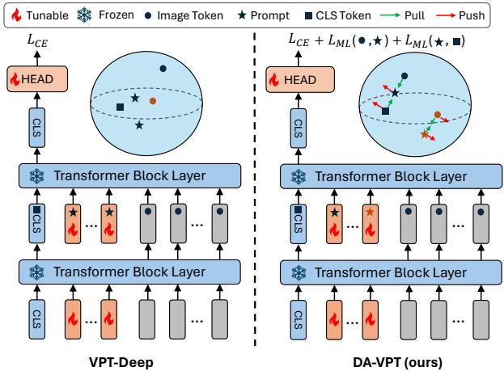
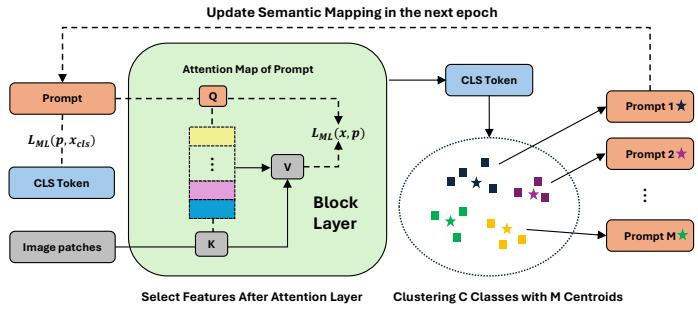
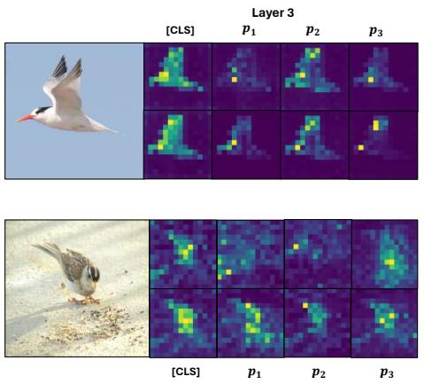
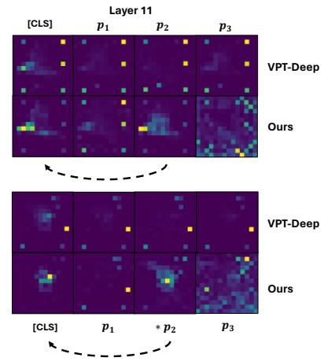
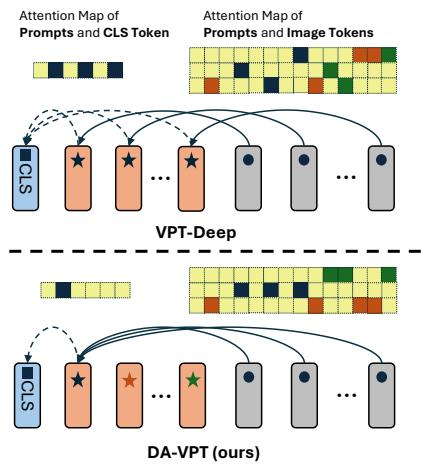
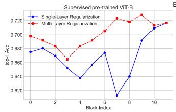
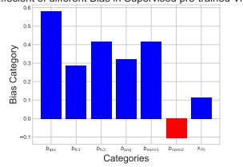
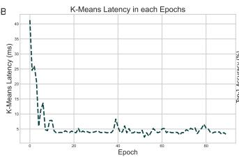
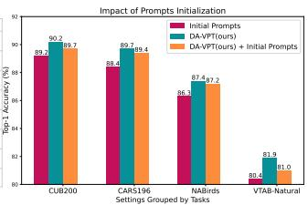

# DA-VPT: Semantic-Guided Visual Prompt Tuning for Vision Transformers

Li Ren, Chen Chen, Liqiang Wang, Kien Hua Department of Computer Science University of Central Florida, USA

{Li.Ren, Chen.Chen, Liqiang.Wang, Kien.Hua}@ucf.edu

## Abstract

Visual Prompt Tuning (VPT) has become a promising solution for Parameter-Efficient Fine-Tuning (PEFT) approach for Vision Transformer (ViT) models by partially fine-tuning learnable tokens while keeping most model parameters frozen. Recent research has explored modifying the connection structures of the prompts. However, the fundamental correlation and distribution between the prompts and image tokens remain unexplored. In this paper, we leverage metric learning techniques to investigate how the distribution of prompts affects fine-tuning performance. Specifically, we propose a novel framework, Distribution Aware Visual Prompt Tuning (DA-VPT), to guide the distributions of the prompts by learning the distance metric from their class-related semantic data. Our method demonstrates that the prompts can serve as an effective bridge to share semantic information between image patches and the class token. We extensively evaluated our approach on popular benchmarks in both recognition and segmentation tasks. The results demonstrate that our approach enables more effective and efficientfine-tuning ofViT models by leveraging semantic information to guide the learning of the prompts, leading to improved performance on various downstream vision tasks. The code is released on https://github.com/Noahsark/DA-VPT.

## 1. Introduction

Recent advances in model scaling and dataset expansion [10, 36, 50] have led to powerful vision foundation models, particularly those based on Vision Transformer (ViT) architectures [11]. These models have demonstrated exceptional performance across various computer vision tasks [19, 20, 44]. While fine-tuning these models for downstream tasks like visual recognition [11] or semantic segmentation [27] has become standard practice, the conventional full finetuning approach faces significant challenges, including high computational costs, overfitting, and catastrophic forgetting [28, 39]. These challenges have motivated the development of Parameter-Efficient Fine-Tuning (PEFT) methods that selectively update a small subset of model parameters while keeping the majority frozen [3, 23, 25, 28, 32, 42, 47, 63].

  
Figure 1. Comparison between VPT-Deep and DA-VPT. Left (VPT-Deep): Prompts are guided solely by the recognition task, leading to unconstrained distributions between prompts and visual tokens. This allows prompts to attract features from arbitrary classes, potentially hindering the class token’s ability to aggregate class-specific information. Right (DA-VPT): Prompts are jointly optimized by the main task and semantic metric learning objectives. The semantic clustering aligns the distributions of prompts, visual tokens, and class tokens, enabling more effective class-specific information aggregation through semantically-guided attention.

Initially emerging from the NLP domain, Houlsby et al. [23] and subsequent works [24, 42] demonstrated that updating a minimal number of parameters could achieve performance comparable to full fine-tuning. These techniques were later adapted to computer vision by Chen et al. [3], who introduced parallel residual networks alongside the ViT backbone. A significant advancement came from Jia et al. [25], who proposed Visual Prompt Tuning (VPT). This method introduces learnable tokens called visual prompts at the input level of each ViT layer, effectively aligning downstream task distributions with pre-training data distributions through learnable data-level representations. Building on this foundation, Yoo et al. [62] and Han et al. [17] further enhanced VPT by implementing cross-layer prompt connections with dynamic gating mechanisms, enabling adaptive control of prompt positioning and quantity.

However, existing VPT approaches primarily focus on manipulating prompt connections and structure, while overlooking the intrinsic relationship between prompts and data representations. Specifically, current VPT and its related methods [17, 25, 41, 62] initialize prompts randomly and optimize them solely through downstream task objectives. Although recent work [60] demonstrates improved learning efficiency through data-driven prompt initialization, the potential of leveraging discriminative and class-aware information remains largely unexplored. To deepen our understanding of prompt functionality and distribution, we investigate prompt-token relationships by addressing a fundamental question: Could prompts be guided to facilitate information flow between image and class tokens to enhance representation learning?

To address this question, we introduce a novel method that guides VPT optimization by leveraging semantic connections between visual prompts, visual tokens, and class tokens. We propose connecting prompts and visual data by constructing and learning a semantic metric between them in the deep layers of the ViT. For each prompt in these layers, we establish a semantic connection with its closest labeled class. As illustrated in Figure 1, we construct a semantic metric in the latent space by comparing prompts with corresponding image patches. Specifically, we aim to minimize the distance between visual prompts and visual tokens of the same class while maximizing separation from the visual tokens of different classes. We also apply a similar semantic metric between class tokens and prompts.

Our key insight is to increase the likelihood that prompts capture semantic information from same-class visual tokens while filtering out unrelated information. Through semantic metrics in both visual feature and prompt spaces, we demonstrate the effective transfer of relevant semantic information from visual tokens to class tokens via class-specific prompts. In other words, our framework employs related prompts as a bridge to connect class tokens and image patch semantic information through guided attention maps.

Extensive experiments across 24 visual recognition tasks in both Fine-Grained Visual Classification (FGVC) [25] and Visual Task Adaptation Benchmark (VTAB-1k) [64] demonstrate substantial improvements over standard VPT. Our method shows consistent effectiveness with both supervised and self-supervised pre-trained models, including MoCo and MAE. Additional evaluations on segmentation tasks further confirm that our approach significantly improves prompt learning efficiency and downstream task performance while requiring fewer prompts and learnable parameters compared to baseline VPT and its related state-of-the-art methods. Our

main contributions are:

• We propose Distribution Aware Visual Prompt Tuning (DA-VPT), a novel framework that enhances prompt learning by constructing semantic metrics between prompts and corresponding image feature patches in deep ViT layers.

• We demonstrate that prompts can effectively bridge semantic information between image patches and class tokens through the attention mechanism, highlighting the importance of guided prompt learning.

• We validate our method’s effectiveness through extensive experiments on 24 visual recognition tasks and 2 segmentation tasks, showing significant improvements over vanilla VPT and its related works for both supervised and selfsupervised pre-trained vision models.

## 2. Related Works

## Parameter-Efficient Fine-Tuning (PEFT)

Transformers, initially introduced by Vaswani et al. [55], have revolutionized various domains through pre-training, from natural language processing (e.g., LLaMA [52], GPT [1]) to computer vision (e.g., MAE [21], CLIP [43], ViT-22b [9]). PEFT approaches have emerged to address the computational challenges of fine-tuning these large models by selectively updating only a subset of parameters. Early work by Kornblith et al. [28] focused on training only the classification head, while Zaken et al. [63] demonstrated significant improvements by tuning bias terms alone. Lian et al. [33] and Xie et al. [61] further refined these approaches by introducing adjustable shifting and scaling factors. Another significant direction in PEFT, pioneered by Houlsby et al. [23], involves incorporating lightweight adapter modules alongside Transformer backbones.

Visual Prompt Tuning (VPT) As a prominent branch of PEFT, prompt tuning introduces learnable tokens alongside input data to incorporate task-specific information [31, 32, 34, 35]. Jia et al. [25] pioneered the application of prompts in Vision Transformers (ViT), introducing VPT-Shallow for input layer modification and VPT-Deep for crosslayer integration. This foundational work catalyzed numerous developments in the field: Gao et al. [15] adapted visual prompts for test-time domain adaptation, while Gao et al. [13] extended the approach to video recognition. Subsequent studies enhanced VPT’s capabilities through dynamic mechanisms for optimizing prompt quantity and placement [17, 62], direct connections between intermediate layers and task-specific heads [54], and spatial selection mechanisms for coordinating attention between image patches and visual prompts [41].

Integration of PEFT Approaches While recent comprehensive approaches have demonstrated success in combining multiple PEFT methods [2, 66], our work focuses specifically on integrating bias optimization with VPT, which we empirically found to be sufficiently effective for demonstrating our method’s capabilities. A comprehensive evaluation of combinations with other PEFT methods lies beyond the scope of this work.

Metric Learning (ML) Metric Learning focuses on learning representations that effectively capture similarities and differences between data samples in the embedding space. Early approaches employed contrastive loss to differentiate between class samples [6, 16]. This evolved into triplet loss methods that introduce an anchor point as a proxy to simultaneously compare positive and negative samples with specified margins [5, 26, 46].

Advanced metric learning techniques have incorporated Neighbourhood Components Analysis (NCA) to better understand data distributions and class relationships [26, 38, 48, 49, 51, 57]. Recent studies have demonstrated particular success in applying NCA-based metric learning to Vision Transformer architectures [12, 29, 40], emphasizing the crucial role of data distributions in learning discriminative representations [30, 45, 46, 58]. Further investigations by Tsai et al. [53] and Ren et al. [47] have explored the integration of visual prompts with robust visual perception and deep metric learning.

Building on metric learning, our work examines the interactions between visual prompts, visual tokens, and class tokens within ViTs. We bridge the gap between traditional metric learning techniques and modern visual prompt tuning methods, offering a more principled way to optimize prompt-based transfer learning.

## 3. Methodology

## 3.1. Preliminary

The Vision Transformer (ViT) [11] is a fundamental model architecture that applies the original Transformer model [56] to computer vision tasks. Given an input image $\mathbf { I } \ { \overset { \cdot } { \in } } \ { \overset { \cdot } { \mathbb { R } ^ { H \times W \times C } } }$ , ViT divides it into a sequence of N flattened 2D patches, which are then linearly projected into a D-dimensional embedding space. A learnable [CLS] (Class) token $\mathbf { x } _ { \mathrm { c l s } } ~ \in ~ \mathbb { R } ^ { D }$ is prepended to the patch embeddings, serving as a global representation for classification tasks. The resulting sequence of embeddings $\mathbf { X } \in \mathbb { R } ^ { ( N + 1 ) \times D }$ is then passed through L Transformer block layers, where $l \in$ $\{ 1 , \ldots , L \}$ denotes the layer index. Each layer consists of a Multi-Head Self-Attention (MHSA) mechanism defined as $\mathbf { M H S A } ( \mathbf { X } ^ { l } ) = \operatorname { C o n c a t } ( \mathbf { H } _ { 1 } , \cdot \cdot \cdot , \mathbf { H } _ { h } )$ , where each head H computes a scaled dot-product attention softmax( $\textstyle \frac { \mathbf { Q } \mathbf { K } ^ { T } } { \sqrt { d } } \mathbf { V } )$ with subspaces of Query (Q), Key (K), and Value (V) matrices projected from input embedding $\mathbf { X } ^ { l - 1 }$ in the previous layer. The final output is the [CLS] token $\mathbf { x } _ { \mathrm { c l s } } ^ { L }$ , used for downstream classification tasks.

Visual Prompt Tuning (VPT) [25] presents a promising PEFT technique for ViT that adapts the pre-trained model to downstream tasks by introducing a small set of learnable parameters, namely visual prompts. In a specific ViT block layer, a sequence of M learnable prompt tokens $\mathbf { P } = \{ \mathbf { p } _ { 1 } , \hdots , \mathbf { p } _ { M } \} \stackrel { \cdot } { \in } \mathbb { R } ^ { M \times D }$ is concatenated with the patch embeddings $\dot { \mathbf { X } } = \{ \mathbf { x } _ { 1 } , \hdots , \mathbf { x } _ { N } \} \in \mathbb { R } ^ { N \times D }$ . Jia et al. [25] propose two VPT settings: VPT-Shallow where the prompts are only inserted into the first ViT layer, and VPT-Deep where the prompts are appended into every ViT layer. We follow the VPT-Deep setting since it has a higher capacity and aligns with our proposed method. The resulting sequence of embeddings $[ \mathbf { \bar { x } } _ { \mathrm { c l s } } , \mathbf { P } , \mathbf { X } ] \ \in \ \mathbb { R } ^ { ( M + N + 1 ) \times D }$ is then processed by the next ViT encoder layers. For layer l, the output of the (l + 1)-th layer can be described as:

$$
\begin{array} { r } { [ { \bf x } _ { \mathrm { c l s } } ^ { l + 1 } , [ \mathrm {  ~ \xi ~ } ] , { \bf x } _ { 1 } ^ { l + 1 } \ldots { \bf x } _ { N } ^ { l + 1 } ] = { \cal B } { \cal L } { \cal K } ( [ { \bf x } _ { \mathrm { c l s } } ^ { l } , { \bf p } _ { 1 } ^ { l } \ldots { \bf p } _ { M } ^ { l } , { \bf x } _ { 1 } ^ { l } \ldots { \bf x } _ { N } ^ { l } ] ) , } \end{array}\tag{1}
$$

where $\mathbf { p } _ { 1 } ^ { l } \ldots \mathbf { p } _ { M } ^ { l }$ are the M prompts in layer l, BLK represents the transformer block, and [ ] represents the position reserved for prompts in the next layer. During finetuning, only the visual prompts P and the linear classification head are updated.

Metric Learning (ML) aims to learn a distance metric that captures semantic similarity between data points. The Neighborhood Component Analysis (NCA) [49] encourages learned embeddings to have a higher probability of correct classification by nearest neighbor classifiers. Given a set of N labeled data points $\{ ( \mathbf { x } _ { i } , y _ { i } ) \} _ { i = 1 } ^ { N }$ , where $\mathbf { x } _ { i } \in \mathbb { R } ^ { D }$ is the input feature vector and $y _ { i } \in \{ 1 , \ldots , C \}$ is the corresponding class label from C classes, the NCA objective is:

$$
\mathcal { L } _ { \mathrm { N C A } } = - \sum _ { i = 1 } ^ { N } \log \frac { \sum _ { j \in \mathcal { N } _ { i } } \exp ( - D ( \mathbf { x } _ { i } , \mathbf { x } _ { j } ) / \tau ) } { \sum _ { k \ne i } \exp ( - D ( \mathbf { x } _ { i } , \mathbf { x } _ { k } ) / \tau ) } ,\tag{2}
$$

where $\mathcal { N } _ { i } = \{ j \ | \ y _ { j } = y _ { i } , j \neq i \}$ denotes the set of neighboring points with the same class, $\tau > 0$ is the temperature parameter, and $D ( \cdot , \cdot )$ represents the cosine similarity: $D ( \mathbf { x } _ { i } , \mathbf { x } _ { j } ) = \hat { \mathbf { x } } _ { i } \cdot \hat { \mathbf { x } } _ { j }$ where $\hat { \textbf { x } } = \mathbf { \frac { x } { \| \mathbf { x } \| _ { 2 } } }$ represents the L2- normalized vector. Following NCA, recent works [26, 51] introduce learnable class representations ${ \bf P } = \{ { \bf p } _ { i } \in \mathbb { R } ^ { D } \} _ { i = 1 } ^ { C } ,$ named proxies, to represent the C classes. In our work, we propose using prompts in deep layers as proxies for subsets of semantically similar classes.

## 3.2. Metric Learning on the Learnable Prompts

Our objective is to establish a metric in the feature space that quantifies the distance between learnable prompts and either visual tokens or the [CLS] token. We hypothesize that within each layer, a specific prompt should selectively capture information from a subset of relevant classes rather than searching indiscriminately across the entire class space. This targeted approach enables prompts to become more discriminative in their feature extraction while optimizing the [CLS] token’s ability to aggregate task-specific information from each class effectively. While this structured information capture may differ from the emergent behavior of standard visual prompts, our empirical results demonstrate that metric learning guidance enhances model transferability, particularly when applied to deeper layers.

  
Figure 2. Framework Overview. Our method establishes semantic prompt-class mappings by clustering class representations into M clusters (M = number of prompts). Prompts are guided through a metric space using smoothed proxy NCA loss ${ \mathcal { L } } _ { \mathrm { M L } }$ between prompts and attention-based output tokens, enabling each prompt to capture information from its assigned semantic cluster. A similar metric guides [CLS] token-prompt relationships. The semantic mapping updates after each epoch, optimizing prompt distribution to capture fine-grained class-specific features.

For a ViT block $B L K _ { l }$ at layer $l \ : ( l > 0 )$ , we regularize the learning of prompts $\mathbf { P } ^ { l }$ by constructing a space metric between the normalized prompts $\hat { \mathbf { p } } _ { k } ^ { l }$ and normalized visual tokens $\hat { \mathbf { x } } _ { i } ^ { l }$ . For each prompt $\hat { \mathbf { p } } _ { k } ^ { l } \in \mathbf { P } ^ { l }$ with assigned class label $y _ { k }$ , we aim to satisfy the following constraint for visual token samples $\hat { \mathbf { x } } _ { i } ^ { l }$ and $\hat { \mathbf { x } } _ { j } ^ { l }$ in the same batch with class different labels $y _ { i }$ and $y _ { j }$ respectively, where $\hat { \mathbf { x } } _ { i } ^ { l }$ shares the same class label $y _ { i } = y _ { k }$ with $\hat { \mathbf { p } } _ { k } ^ { l }$ :

$$
\hat { \bf p } _ { k } ^ { l } \cdot \hat { \bf x } _ { i } ^ { l } - \delta \ge \hat { \bf p } _ { k } ^ { l } \cdot \hat { \bf x } _ { j } ^ { l } + \delta \quad \forall i , j , k , y _ { k } = y _ { i } \ne y _ { j } ,\tag{3}
$$

where · denotes the dot product and $\delta > 0$ is the predefined margin. This constraint ensures that the cosine similarity between a prompt and tokens of the same class is greater than the similarity with tokens of different classes. Since cosine similarity naturally aligns with attention map comparison between Query and Key vectors, we argue that pairs $\left( \mathbf { p } _ { k } , \mathbf { x } _ { i } \right)$ that are closer in the spherical space will have higher probability of matching in the optimized attention map.

To efficiently build a metric space satisfying this constraint, we adopt the ML loss from Kim et al. [26], comparing learnable prompts with visual tokens using smoothed NCA loss (Proxy-Anchor loss). Our metric guidance objective between visual tokens $\mathbf { X } ^ { l }$ and prompts $\mathbf { P } ^ { l }$ is:

$$
\begin{array} { r l } & { \mathcal { L } _ { \mathrm { M L } } ( { \bf X } , { \bf P } ) = \displaystyle \frac { 1 } { | \mathcal { P } ^ { + } | } \sum _ { { \bf p } _ { k } \in \mathcal { P } ^ { + } } \left[ \mathrm { L S E } _ { 0 } ^ { + } \left( - \left( \hat { { \bf p } } _ { k } \cdot \hat { { \bf x } } _ { i } - \delta \right) / \tau \right) \right] + } \\ & { \quad \quad \quad \quad \frac { 1 } { | \mathcal { P } | } \displaystyle \sum _ { { \bf p } _ { k } \in \mathcal { P } } \left[ \mathrm { L S E } _ { 0 } ^ { + } \left( \left( \hat { { \bf p } } _ { k } \cdot \hat { { \bf x } } _ { j } + \delta \right) / \tau \right) \right] , } \end{array}\tag{4}
$$

where $\begin{array} { r } { \mathrm { L S E } _ { 0 } ^ { + } ( x ) = \log ( 1 + \sum _ { i = 1 } ^ { N } e ^ { x _ { i } } ) } \end{array}$ is the smoothed LogSumExp with first argument set to 1, P denotes the set of all prompts, ${ \mathcal { P } } ^ { + }$ denotes the set of positive prompts where same-class data exists in the minibatch, $\mathcal { X } _ { p } ^ { + }$ denotes the set of visual tokens with the same label as the selected prompt $\mathbf { p } ,$ and ${ \ X } _ { p } ^ { - }$ is its complement set. In practice, we found that comparing the projected Query vector $\mathbf { Q } = \mathbf { P } ^ { l } \mathbf { W } _ { Q } ^ { l }$ yields better performance, where $\mathbf { W } _ { Q } ^ { l } \in \mathbb { R } ^ { D \times D }$ is the Query projection matrix at layer l.

We also propose a similar loss $\mathcal { L } _ { \mathrm { M L } } ( \mathbf { P } , \mathbf { x } _ { \mathrm { c l s } } )$ that pulls the [CLS] token closer to corresponding prompts while pushing it away from prompts of different classes. The overall loss becomes:

$$
\begin{array} { r } { \mathcal { L } = \mathcal { L } _ { \mathrm { C E } } + \beta \mathcal { L } _ { \mathrm { M L } } ( \mathbf { X } , \mathbf { P } ) + \lambda \mathcal { L } _ { \mathrm { M L } } ( \mathbf { P } , \mathbf { x } _ { \mathrm { c l s } } ) , } \end{array}\tag{5}
$$

where $\beta , \lambda > 0$ are hyperparameters. By jointly optimizing both metric learning terms, our method encourages prompts to capture class-specific information and aligns the [CLS] token with relevant prompts.

## 3.3. Projection and Saliency Patch Selection

To ensure prompts effectively focus on critical image information while filtering out false positive visual tokens, we propose selecting saliency information from visual tokens as positive and negative samples for prompt comparison in $\mathcal { L } _ { \mathrm { M L } } ( \mathbf { X } , \mathbf { P } )$ . While extracting saliency patches directly from attention maps is straightforward, it can be computationally intensive, especially with optimized attention mechanisms like Flash Attention. Instead, as shown in Figure 2, we use the output representation immediately following the attention layer. The output representation $\mathbf { X } ^ { l } = \bar { \mathbf { M H S A } } ( \mathbf { X } ^ { l } ) \in \mathbb { R } ^ { N \times \bar { D } }$ then concatenates representations from each head, serving as a saliency aggregation of visual tokens.

## 3.4. Dynamically Mapping Classes and Prompts

We set M learnable prompts in each layer where $M ~ \ll$ C to avoid optimization difficulties and unequal training opportunities. We develop a semantic mapping strategy to map $C$ classes to M prompts. Before training, we run an additional epoch to obtain class representations $\mathbf { S } \in \mathbb { R } ^ { C \times D }$ by mean-pooling the [CLS] token for each class using the pre-trained ViT. We then use k-means clustering to group these representations into M clusters, assigning classes to prompts based on cluster membership, as shown in Figure 2.

To maintain semantic mapping accuracy, we update the mapping after each epoch. During training, we collect and calculate updated class representations S, then update kmeans using previous epoch centroids as initialization to adjust the class-prompt mapping.

## 3.5. Efficient Bias Tuning

To further improve the flexibility in the distribution of visual tokens, we investigate the partial release of ViT backbone bias terms as suggested by Zaken et al. [63]. We found that fine-tuning performance significantly improves when bias terms are partially enabled with our metric guidance loss. The most efficient components are the bias terms $\mathbf { b } _ { K } , \mathbf { b } _ { V } \in \mathbb { R } ^ { D }$ in the Key and Value linear projections of the self-attention mechanism (Figure 4b). This observation aligns with findings from Zaken et al. [63] and Cordonnier et al. [7]. Partially allowing bias terms to adapt provides additional flexibility in adjusting visual token distributions and capturing task-specific information under metric guidance.

## 4. Technical Discussion

## 4.1. Connection Between Similarity and Attention

In this section, we analyze how changes in token similarity influence attention weights through gradient updates. Specifically, we examine how a small change in the similarity between a prompt p and a visual token $\mathbf { x } _ { i }$ affects the corresponding attention weight $a _ { i }$ . Let $\Delta \mathbf { p }$ represent a small perturbation that brings p closer to $\mathbf { x } _ { i }$ in the embedding space. We formalize this relationship in the following theorem:

Theorem 1 (Attention-Similarity Relationship). For an attention weight perturbation $\Delta a _ { i }$ computed using the softmax function, thefollowing approximation holds:

$$
\Delta a _ { i } \approx a _ { i } ( 1 - a _ { i } ) \Delta s _ { i } ,\tag{6}
$$

where $\Delta { } s _ { i }$ represents the change in attention score $s _ { i } ,$ given by $\begin{array} { r } { \Delta s _ { i } = \frac { \Delta \mathbf { p } ^ { \top } \mathbf { x } _ { i } } { \sqrt { d } } } \end{array}$ , and d is the dimension of the attention head.

This approximation reveals that a positive gradient change in attention weight $( \Delta a _ { i } > 0 )$ occurs when:

$$
a _ { i } ( 1 - a _ { i } ) \Delta s _ { i } = a _ { i } ( 1 - a _ { i } ) \frac { \Delta \mathbf { p } ^ { \top } \mathbf { x } _ { i } } { \sqrt { d } } > 0\tag{7}
$$

This condition is satisfied when p moves closer to $\mathbf { x } _ { i }$ in the embedding space. Conversely, when p moves away from $\mathbf { x } _ { i } , \Delta a _ { i }$ decreases. This theorem establishes a direct connection between token similarity and attention mapping, demonstrating how our metric learning guidance influences attention through token distribution. The complete proof is provided in the Appendix.

## 4.2. Analysis of Guided Attention Maps

To further analyze the impact of our metric guidance loss on fine-tuning, we visualize attention maps between visual tokens and prompts across different layers (Figure 3a). Our analysis reveals distinct patterns:

(1) In Shallow Layers:

• Both VPT-Deep and our method show prompts attending to different object subregions

• Our method demonstrates enhanced diversity and precision in information capture

(2) In Deep Layers:

• Attention maps become sparser as token representations become more abstract

• Standard VPT-Deep prompts show limited information selection compared to the [CLS] token

• Our positive prompt (∗p) successfully identifies informative patches that are subsequently selected by the [CLS] token

These visualizations demonstrate that positively labeled prompts serve as effective "bridges" for semantic information flow to the [CLS] token in deep layers. As shown in Figure 3b, our DA-VPT enables prompts to aggregate discriminative features from same-class data, resulting in more fine-grained attention patterns compared to the baseline. This enhanced information routing significantly improves the model’s discriminative capability during fine-tuning.

Artifact Consideration: Recent work by Darcet et al. [8] revealed the existence of attention artifacts in vision transformers, which we also observe in our prompt attention maps (Figure 3a). While they demonstrate that training with registers (analogous to learnable prompts) from scratch can eliminate these artifacts, both standard VPT and our method exhibit them due to prompt introduction during fine-tuning rather than pre-training. Nevertheless, our comparative analysis shows that the proposed guidance mechanism reduces both the frequency and spread of artifacts, constraining them more effectively within semantic object boundaries. While our method achieves better alignment between attention patterns and object semantics, the nature and impact of these artifacts on model performance presents an intriguing avenue for future investigation.

## 4.3. Compatibility with Metric Learning Methods

Our selection of the Proxy-Anchor method [26] is motivated by its natural alignment with our hypothesized role of visual prompts, where both proxies and prompts serve as class representatives and comparative anchors for data tokens. Alternative metric learning approaches, such as Proxy-NCA [51] and conventional triplet loss [5, 22], treat all representations as equal data points. These approaches are less suitable for our framework because the significant disparity between the number of visual prompts (M) and data tokens (N, where $M \ll N )$ creates an unbalanced optimization problem. Our empirical studies further confirm this theoretical intuition: attempting to fine-tune with conventional metric learning methods leads to training instability, whereas the Proxy-Anchor formulation maintains stable optimization by explicitly accounting for the asymmetric nature of prompt-token relationships.

  
(a)

  
(b)  
Figure 3. Comparison of attention patterns between VPT-Deep and our method on CUB dataset samples. (a) Attention maps in shallow (layer 3) and deep (layer 11) layers, showing CLS token and sampled prompt attention patterns. In layer 11, ∗p indicates the prompt guided as positive to the CLS token, while others represent negative prompts. Additional visualization examples are provided in Appendix. (b) Information flow comparison between baseline VPT-Deep and our DA-VPT. Our method enables selected prompts to aggregate and transfer fine-grained details from same-class visual tokens to the [CLS] token more effectively.

## 5. Experiments

## 5.1. Experimental Setup

Datasets. We evaluate our method on three types of visual transfer learning tasks. For visual recognition, we use the Fine-Grained Visual Classification (FGVC) benchmark [25] comprising 5 datasets. For few-shot transfer learning, we employ the Visual Task Adaptation Benchmark (VTAB-1K) [64] containing 19 datasets. Additionally, we evaluate dense prediction tasks on ADE20K [67] and PASCAL Context [37]. Detailed dataset characteristics and experimental settings are provided in the Appendix.

Model Architecture. We employ Vision Transformer (ViT) [11] as our backbone, using the base model ViT-B (12 layers) for visual classification tasks and the large model ViT-L (24 layers) for semantic segmentation. To evaluate generalization, we initialize the backbone using either supervised pre-training on ImageNet-21K [10] or self-supervised pre-training on ImageNet-1K using methods such as MoCo v3 [4] and MAE [20].

Method Variants. We evaluate two versions of our approach. Our primary method, DA-VPT, builds on VPT-Deep [25] while incorporating our proposed metric learning losses $\mathcal { L } _ { \mathrm { M L } } ( \mathbf { X } , \mathbf { P } )$ and $\mathcal { L } _ { \mathrm { M L } } ( \mathbf { P } , \mathbf { x } _ { \mathrm { c l s } } )$ . The enhanced version, DA-VPT+, further incorporates efficient bias tuning as detailed in Section 3.5.

Implementation Details. For all experiments, we conduct extensive hyperparameter optimization, including learning rate, parameter decays, and the number of visual prompts for layers both with and without our metric learning guidance. Through this empirical investigation, we identified that the optimal number of prompts for most downstream tasks is approximately 20. For metric learning parameters, we adopt the Proxy-Anchor defaults with margin δ = 32 and temperature τ = 10. Extended experimental details, including hyperparameter studies and ablation analyses, are provided in the Appendix.

## 5.2. Result Comparison with the State-of-the-Art

We evaluate our method against existing VPT-based and recent related approaches across 24 vision tasks. As shown in Table 1, our DA-VPT+ consistently achieves superior performance over VPT-related methods on both supervised ViT and self-supervised backbones. On ViT-B, DA-VPT+ improves over the VPT-Deep baseline by 2.83 and 4.18 percentage points (pp) on FGVC and VTAB-1K, respectively, and outperforms E2VPT by 2.72 pp and 2.20 pp on these tasks. Notably, even without bias tuning, DA-VPT maintains strong results across major benchmarks. The improvements are particularly pronounced with self-supervised backbones, where our method also surpasses full fine-tuning on all backbones while using fewer parameters. These results highlight the effectiveness and generalizability of our approach across diverse downstream tasks compared to other VPT-based methods.

Table 2 demonstrates our proposed methods, DA-VPT and DA-VPT+, achieve significant improvements over existing baselines and recent competitive methods in semantic segmentation tasks on both the ADE20K and PASCAL Context datasets. Compared to classification tasks, dense prediction tasks such as segmentation are much more challenging. Notably, lightweight PEFT methods like Linear or Bias exhibit low efficiency compared to full fine-tuning. In such challenging tasks, our proposed DA-VPT+ still achieves comparable performance while using only 4.3% of the tunable parameters, demonstrating both high parameter efficiency and effectiveness across both datasets.

<table><tr><td>Methods</td><td>Mean Param (M)</td><td>FGVC Mean Acc (5)</td><td colspan="3">VTAB-1K Natural (7) Specialized (4) Structured (8) Mean Acc</td></tr><tr><td colspan="7">ViT-B with Supervised pretrained on ImageNet-21k</td></tr><tr><td>Full</td><td>85.98</td><td>88.54</td><td>75.88</td><td>83.36</td><td>47.64</td><td>68.96</td></tr><tr><td>VPT-Shallow</td><td>0.11</td><td>84.62</td><td>76.81</td><td>79.68</td><td>46.98</td><td>67.82</td></tr><tr><td>VPT-Deep</td><td>0.64</td><td>89.11</td><td>78.48</td><td>82.43</td><td>54.98</td><td>71.96</td></tr><tr><td>E2VPT [17]</td><td>0.33</td><td>89.22</td><td>80.01</td><td>84.43</td><td>57.39</td><td>73.94</td></tr><tr><td>DA-VPT (ours)</td><td>0.21</td><td>91.22</td><td>80.25</td><td>85.12</td><td>58.71</td><td>74.69</td></tr><tr><td>DA-VPT+ (ours)</td><td>0.24</td><td>91.94</td><td>81.98</td><td>86.47</td><td>59.96</td><td>76.14</td></tr><tr><td colspan="7">ViT-B with MAE pretrained on ImageNet-1K</td></tr><tr><td>Full VPT-Shallow</td><td>85.8</td><td>82.80</td><td>59.31</td><td>79.68</td><td>53.82</td><td>64.27</td></tr><tr><td></td><td>0.10</td><td>57.84</td><td>39.96</td><td>69.65</td><td>27.50</td><td>45.70</td></tr><tr><td>VPT-Deep</td><td>0.20</td><td>72.02</td><td>36.02</td><td>60.61</td><td>26.57</td><td>41.73</td></tr><tr><td>GateVPT [62]</td><td>0.17</td><td>73.39</td><td>47.61</td><td>76.86</td><td>36.80</td><td>53.09</td></tr><tr><td>E2VPT [17]</td><td>0.06</td><td></td><td>59.52</td><td>77.80</td><td>44.65</td><td>60.66</td></tr><tr><td>DA-VPT (ours)</td><td>0.20</td><td>82.17</td><td>62.14</td><td>79.14</td><td>54.31</td><td>65.19</td></tr><tr><td>DA-VPT+ (ours)</td><td>0.22</td><td>83.20</td><td>66.59</td><td>82.96</td><td>59.28</td><td>69.61</td></tr><tr><td colspan="7">ViT-B with MoCo-V3 pretrained on ImageNet-1K</td></tr><tr><td>Full</td><td>85.8</td><td>84.25</td><td>71.95</td><td>84.72</td><td>51.98</td><td>69.55</td></tr><tr><td>VPT-Shallow</td><td>0.11</td><td>79.26</td><td>67.34</td><td>82.26</td><td>37.55</td><td>62.38</td></tr><tr><td>VPT-Deep</td><td>0.20</td><td>83.12</td><td>70.27</td><td>83.04</td><td>42.38</td><td>65.90</td></tr><tr><td>GateVPT [62]</td><td>0.17</td><td>83.00</td><td>74.84</td><td>83.38</td><td>49.10</td><td>69.11</td></tr><tr><td>E2VPT [17]</td><td>0.11</td><td></td><td>76.47</td><td>87.28</td><td>54.91</td><td>72.88</td></tr><tr><td>DA-VPT (ours)</td><td>0.21</td><td>85.02</td><td>74.24</td><td>83.21</td><td>55.23</td><td>70.90</td></tr><tr><td>DA-VPT+ (ours)</td><td>0.24</td><td>86.16</td><td>76.86</td><td>84.71</td><td>58.98</td><td>73.53</td></tr></table>

Table 1. Comparison of Fine-tuning Methods. Performance evaluation across 24 vision tasks (5 FGVC and 19 VTAB-1K) using supervised ViT and self-supervised backbones (MAE [20], MoCo-v3 [4]). Detailed per-task results for VTAB-1K are provided in Appendix.

<table><tr><td rowspan="2">Method</td><td rowspan="2">#Param</td><td colspan="2">ADE20K</td><td colspan="2">PASCAL Context</td></tr><tr><td>mIoU-SS</td><td>mIoU-Ms</td><td>mIoU-SS</td><td>mIoU-Ms</td></tr><tr><td>Full-Tuning</td><td>317.3M</td><td>47.60</td><td>49.18</td><td>53.69</td><td>55.21</td></tr><tr><td>Linear</td><td>13.1M</td><td>38.09</td><td>39.16</td><td>46.06</td><td>48.13</td></tr><tr><td>Bias</td><td>13.2M</td><td>43.61</td><td>45.73</td><td>45.15</td><td>46.47</td></tr><tr><td>VPT (baseline)</td><td>13.6M</td><td>44.08</td><td>46.01</td><td>49.51</td><td>50.46</td></tr><tr><td>SPT-LoRA [18]</td><td>14.6M</td><td>45.40</td><td>47.50</td><td>=</td><td>一</td></tr><tr><td>SPT-Adapter [18]</td><td>14.6M</td><td>45.20</td><td>47.20</td><td></td><td></td></tr><tr><td>DA-VPT (ours)</td><td>13.6M</td><td>45.10</td><td>47.07</td><td>50.15</td><td>51.04</td></tr><tr><td>DA-VPT+ (ours)</td><td>13.7M</td><td>46.47</td><td>47.21</td><td>50.40</td><td>51.28</td></tr></table>

Table 2. Results of Semantic Segmentation on ADE20K and PASCAL Context. We report mIoU-SS (single-scale inference) and mIoU-MS (multi-scale inference). All experiments use the ViT-L backbone pre-trained on ImageNet-21K. The #Param column indicates the total number of tunable parameters in the entire framework. For SPT [18], we report the results from the original paper, while for other settings and our baseline, we provide our reproduced results. We highlight the best results other than the full fine-tuning.

Table 3 compares state-of-the-art PEFT methods on FGVC [25] using ImageNet-21K pre-trained ViT-B. Our DA-VPT+ achieves the highest mean accuracy of 91.94% across all datasets, surpassing previous SOTA methods SNF [59] and MoSA [65] on FGVC. Notable improvements include gains of 0.6 and 1.8 percentage points on CUB and Cars datasets respectively. Both DA-VPT and DA-VPT+ outperform the VPT baseline and full fine-tuning with significant margin while using fewer parameters, demonstrating superior accuracy-efficiency trade-off compared to full finetuning and existing PEFT methods.

<table><tr><td> $\widehat { \textbf { M e t h o d } } \widehat { } ^ { \mathrm { D a t a s e t } }$ </td><td>CUB-200 -2011</td><td>NABirds</td><td>Oxford Flowers</td><td>Stanford Dogs</td><td>Stanford Cars</td><td>Mean Acc (%)</td><td>Mean Params (M)</td></tr><tr><td>Full fine-tuning [25] Linear Probing [25]</td><td>87.3</td><td>82.7</td><td>98.8</td><td>89.4</td><td>84.5</td><td>88.54</td><td>85.98</td></tr><tr><td>Adapter [23] Bias [63]</td><td>85.3 87.1</td><td>75.9 84.3</td><td>97.9 98.5</td><td>86.2 89.8</td><td>51.3 68.6</td><td>79.32 85.67</td><td>0.18 0.41</td></tr><tr><td rowspan="8">AdaptFormer [3] VPT-Shallow [25] VPT-Deep [25] SSF [33] SNF [59]</td><td>88.4 87.4</td><td>84.2</td><td>98.8</td><td>91.2</td><td>79.4</td><td>88.41</td><td>0.28</td></tr><tr><td></td><td>84.8</td><td>99.0</td><td>90.7</td><td>81.0</td><td>88.58</td><td>1.54</td></tr><tr><td>86.7</td><td>78.8</td><td>98.4</td><td>90.7</td><td>68.7</td><td>84.62</td><td>0.25</td></tr><tr><td>88.5</td><td>84.2</td><td>99.0</td><td>90.2</td><td>83.6</td><td>89.11</td><td>0.85</td></tr><tr><td>89.5</td><td>85.7</td><td>99.6</td><td>89.6</td><td>89.2</td><td>90.72</td><td>0.39</td></tr><tr><td>90.2</td><td>87.4</td><td>99.7</td><td>89.5</td><td>86.9</td><td>90.74</td><td>0.25</td></tr><tr><td>89.3</td><td>84.9</td><td>99.6</td><td>89.5</td><td>83.6</td><td>89.38</td><td>1.20</td></tr><tr><td>89.1</td><td>84.6</td><td>99.1</td><td>90.5</td><td>82.8</td><td>89.22</td><td>0.65</td></tr><tr><td rowspan="3">VPT (Baseline)</td><td>89.3</td><td>85.7</td><td>99.2</td><td>91.9</td><td>83.4</td><td>89.90</td><td>1.54</td></tr><tr><td>88.6</td><td>85.7</td><td>99.2</td><td>89.0 89.4</td><td>87.4 89.7</td><td>90.14</td><td>0.36</td></tr><tr><td>90.2 90.8</td><td>87.4 88.3</td><td>99.4 99.8</td><td>89.8</td><td>91.0</td><td>91.22 91.94</td><td>0.30 0.32</td></tr></table>

Table 3. Comparison of various fine-tuning methods on different downstream tasks. The ViT-B model pre-trained on ImageNet-21K is used as basic backbone. Top-1 accuracy (%) is reported and the best result is in bold.

## 5.3. Ablation Studies and Discussion

## 5.3.1. Ablation Study

The ablation study demonstrates the individual and collective contributions of each component in our proposed DA-VPT method on the CUB dataset from the FGVC benchmark and the Natural task category from the VTAB-1k benchmark. The metric learning losses, LML(x, p) and $\mathcal { L } _ { \mathrm { M L } } ( \bf p , x _ { \mathrm { c l s } } )$ lead to accuracy improvements of 1.08 pp on VTAB-1k Natural and 1.22 pp on CUB over the baseline. The integration of Efficient Bias further enhances the performance, contributing to an additional 0.97 pp and 1.03 pp improvement on the respective datasets. When all three components are combined, our DA-VPT method achieves the highest performance, with total accuracy improvements of 2.05 pp on VTAB-1k Natural and 2.25 pp on CUB.

While the incorporation of these components introduces a minimal increase in latency and memory usage, the gained accuracy far outweighs this slight trade-off. Note that the combination of $\mathcal { L } _ { \mathrm { M L } } ( \mathbf { x } , \mathbf { p } ) , \mathcal { L } _ { \mathrm { M L } } ( \mathbf { p } , \mathbf { x } _ { \mathrm { c l s } } )$ and Efficient Bias yields substantial improvements with only a modest increase in parameters. This highlights the efficiency of our method in achieving significant performance gains with minimal parameter overhead.

## 5.3.2. Analysis of Parameter Impacts

Layer-wise Impact. We first examine the effectiveness of our metric learning loss when applied to different layers. As shown by the blue line in Figure 4a, applying the loss to the final layer yields optimal results in most cases, likely due to the presence of higher-level semantic features in deeper layers. We further investigate the effect of applying our loss across multiple consecutive layers, represented by the red line, which shows the performance when applying the loss from a specific layer through to the final layer. The impact varies notably across different pre-trained models, with detailed results for MAE and MoCo provided in the Appendix.

Table 4. Ablation study on different components in our DA-VPT on two datasets: CUB-200-2011 in FGVC and Natural in VTAB-1k. For each ${ \mathcal { L } } _ { \mathrm { M L } }$ component, we also search for its optimal hyperparameter. The learnable [CLS] token is combined with Efficient Bias for simplicity. The latency and memory are tested in the same server with RTX4090 GPU.
<table><tr><td rowspan=1 colspan=3>Components of our Techniques</td><td rowspan=1 colspan=2>VTAB-1k Natural (7)</td><td rowspan=1 colspan=2>FGVC CUB-200</td><td rowspan=1 colspan=1>Latency</td><td rowspan=2 colspan=1>Memory(GB)</td></tr><tr><td rowspan=1 colspan=1>LML(x, p)</td><td rowspan=1 colspan=1>LML(p, Xcls)</td><td rowspan=1 colspan=1>Efficient Bias</td><td rowspan=1 colspan=1>Param</td><td rowspan=1 colspan=1>Accuracy</td><td rowspan=1 colspan=1>Param</td><td rowspan=1 colspan=1>Accuracy</td><td rowspan=1 colspan=1>(ms/img)</td></tr><tr><td rowspan=7 colspan=1>√√√√</td><td rowspan=7 colspan=1>√√√√</td><td rowspan=7 colspan=1>√√√√</td><td rowspan=4 colspan=1>0.14M(0.16%)</td><td rowspan=4 colspan=1>79.45 (base)79.47 (+0.02)79.51 (+0.06)80.53 (+1.08)</td><td rowspan=2 colspan=1>0.20M</td><td rowspan=1 colspan=1>88.64 (base)</td><td rowspan=1 colspan=1>1.41</td><td rowspan=1 colspan=1>2.41</td></tr><tr><td rowspan=1 colspan=1>89.24 (+0.60)</td><td rowspan=1 colspan=1>1.51</td><td rowspan=1 colspan=1>2.41</td></tr><tr><td rowspan=1 colspan=1>(0.24%)</td><td rowspan=1 colspan=1>89.06 (+0.42)</td><td rowspan=1 colspan=1>1.52</td><td rowspan=1 colspan=1>2.41</td></tr><tr><td rowspan=1 colspan=1></td><td rowspan=1 colspan=1>89.86 (+1.22)</td><td rowspan=1 colspan=1>1.54</td><td rowspan=1 colspan=1>2.41</td></tr><tr><td rowspan=3 colspan=1>0.16M(0.19%)</td><td rowspan=3 colspan=1>80.06 (+0.61)81.02 (+1.57)81.50 (+2.05)81.98 (+2.53)</td><td rowspan=3 colspan=1>0.23M(0.27%)</td><td rowspan=1 colspan=1>89.55 (+0.91)</td><td rowspan=1 colspan=1>1.45</td><td rowspan=1 colspan=1>2.76</td></tr><tr><td rowspan=1 colspan=1>90.41 (+1.77)</td><td rowspan=2 colspan=1>1.531.56</td><td rowspan=1 colspan=1>2.76</td></tr><tr><td rowspan=1 colspan=1>90.54 (+1.90)90.89 (+2.25)</td><td rowspan=1 colspan=1>2.762.76</td></tr></table>

  
(a)

  
(b)

  
(c)

  
(d)  
Figure 4. 4a Illustrates the impact of the number and position of the layers to which the proposed metric learning loss is applied. 4c This figure shows the latency of the k-means calculation in each epoch. 4b Illustrates the importance of each category of efficient bias measured on the CUB-200-2011 dataset. 4d This figure shows the comparison of the performance with or without the prompts initialization with data mean value.

Efficient Bias Components. Figure 4b demonstrates that specific categories of efficient bias contribute disproportionately to performance improvements. This observation underscores the importance of selective optimization of bias components rather than uniform adjustment across all parameters.

Semantic Mapping Updates. The computational cost of k-means clustering for semantic mapping updates is illustrated in Figure 4c. Notably, while the initial epochs incur higher computational overhead, the latency decreases significantly in later epochs as class representations stabilize. This suggests that the computational cost of maintaining dynamic class-prompt mappings becomes negligible as training progresses.

Prompt Initialization. We investigate the impact of prompt initialization by comparing mean value initialization on both baseline VPT and our proposed DA-VPT, following the methodology of Wang et al. [60], where prompts are initialized with mean pooling values from the dataset at each layer. As shown in Figure 4d, our analysis reveals that such initialization actually impedes our method’s effectiveness. We attribute this to the increased difficulty in guiding prompts to capture discriminative information when initialized with homogeneous content from the mean value. Additional parameter impact analyses are provided in the Appendix.

## 6. Conclusion

This paper introduces Distribution-Aware Visual Prompt Tuning (DA-VPT), a novel framework that improves visual prompt learning in Vision Transformers (ViT) through semantic metric construction between prompts and image features. Our method guides prompts to serve as effective bridges for semantic information flow between image patches and class tokens via the attention mechanism. Extensive evaluations across 24 visual recognition and 2 segmentation tasks demonstrate that DA-VPT significantly outperforms vanilla VPT and other related methods while using fewer prompts and parameters. Our results highlight the importance of considering the intrinsic connection between visual prompts and data samples and showcase the potential of our approach to enhance the transfer learning capabilities of pre-trained vision models. We believe that our findings can inspire further research on parameter-efficient fine-tuning strategies and contribute to the development of more effective and efficient vision foundation models.

## References

[1] Tom Brown, Benjamin Mann, Nick Ryder, Melanie Subbiah, Jared D Kaplan, Prafulla Dhariwal, Arvind Neelakantan, Pranav Shyam, Girish Sastry, Amanda Askell, et al. Language models are few-shot learners. NeurIPS, 33:1877–1901, 2020. 2

[2] Arnav Chavan, Zhuang Liu, Deepak Gupta, Eric Xing, and Zhiqiang Shen. One-for-all: Generalized lora for parameterefficient fine-tuning. arXiv preprint arXiv:2306.07967, 2023. 2

[3] Shoufa Chen, Chongjian Ge, Zhan Tong, Jiangliu Wang, Yibing Song, Jue Wang, and Ping Luo. Adaptformer: Adapting vision transformers for scalable visual recognition. NeurIPS, 2022. 1, 7

[4] Xinlei Chen, Saining Xie, and Kaiming He. An empirical study of training self-supervised vision transformers. In CVPR, pages 9640–9649, 2021. 6, 7

[5] De Cheng, Yihong Gong, Sanping Zhou, Jinjun Wang, and Nanning Zheng. Person re-identification by multi-channel parts-based cnn with improved triplet loss function. In CVPR, pages 1335–1344, 2016. 3, 5

[6] Sumit Chopra, Raia Hadsell, and Yann LeCun. Learning a similarity metric discriminatively, with application to face verification. In CVPR. IEEE, 2005. 3

[7] Jean-Baptiste Cordonnier, Andreas Loukas, and Martin Jaggi. Multi-head attention: Collaborate instead of concatenate. arXiv preprint arXiv:2006.16362, 2020. 5

[8] Timothée Darcet, Maxime Oquab, Julien Mairal, and Piotr Bojanowski. Vision transformers need registers. ICLR, 2024. 5

[9] Mostafa Dehghani, Josip Djolonga, Basil Mustafa, Piotr Padlewski, Jonathan Heek, Justin Gilmer, Andreas Peter Steiner, Mathilde Caron, Robert Geirhos, Ibrahim Alabdulmohsin, et al. Scaling vision transformers to 22 billion parameters. In ICML, pages 7480–7512. PMLR, 2023. 2

[10] Jia Deng, Wei Dong, Richard Socher, Li-Jia Li, Kai Li, and Li Fei-Fei. Imagenet: A large-scale hierarchical image database. In CVPR, pages 248–255. Ieee, 2009. 1, 6

[11] Alexey Dosovitskiy, Lucas Beyer, Alexander Kolesnikov, Dirk Weissenborn, Xiaohua Zhai, Thomas Unterthiner, Mostafa Dehghani, Matthias Minderer, Georg Heigold, Sylvain Gelly, et al. An image is worth 16x16 words: Transformers for image recognition at scale. arXiv preprint arXiv:2010.11929, 2020. 1, 3, 6

[12] Aleksandr Ermolov, Leyla Mirvakhabova, Valentin Khrulkov, Nicu Sebe, and Ivan Oseledets. Hyperbolic vision transformers: Combining improvements in metric learning. In CVPR, pages 7409–7419, 2022. 3

[13] Kaifeng Gao, Long Chen, Hanwang Zhang, Jun Xiao, and Qianru Sun. Compositional prompt tuning with motion cues for open-vocabulary video relation detection. ICLR, 2023. 2

[14] Mingze Gao, Qilong Wang, Zhenyi Lin, Pengfei Zhu, Qinghua Hu, and Jingbo Zhou. Tuning pre-trained model via moment probing. In CVPR, pages 11803–11813, 2023. 7

[15] Yunhe Gao, Xingjian Shi, Yi Zhu, Hao Wang, Zhiqiang Tang, Xiong Zhou, Mu Li, and Dimitris N Metaxas. Vi-

sual prompt tuning for test-time domain adaptation. arXiv preprint arXiv:2210.04831, 2022. 2

[16] Raia Hadsell, Sumit Chopra, and Yann LeCun. Dimensionality reduction by learning an invariant mapping. In CVPR. IEEE, 2006. 3

[17] Cheng Han, Qifan Wang, Yiming Cui, Zhiwen Cao, Wenguan Wang, Siyuan Qi, and Dongfang Liu. Eˆ 2vpt: An effective and efficient approach for visual prompt tuning. arXiv preprint arXiv:2307.13770, 2023. 2, 7

[18] Haoyu He, Jianfei Cai, Jing Zhang, Dacheng Tao, and Bohan Zhuang. Sensitivity-aware visual parameter-efficient finetuning. In CVPR, pages 11825–11835, 2023. 7

[19] Kaiming He, Haoqi Fan, Yuxin Wu, Saining Xie, and Ross Girshick. Momentum contrast for unsupervised visual representation learning. In CVPR, pages 9729–9738, 2020. 1

[20] Kaiming He, Xinlei Chen, Saining Xie, Yanghao Li, Piotr Dollár, and Ross Girshick. Masked autoencoders are scalable vision learners. In CVPR, pages 16000–16009, 2022. 1, 6, 7

[21] Kaiming He, Xinlei Chen, Saining Xie, Yanghao Li, Piotr Dollár, and Ross Girshick. Masked autoencoders are scalable vision learners. In CVPR, pages 16000–16009, 2022. 2

[22] Alexander Hermans, Lucas Beyer, and Bastian Leibe. In defense of the triplet loss for person re-identification. arXiv preprint arXiv:1703.07737, 2017. 5

[23] Neil Houlsby, Andrei Giurgiu, Stanislaw Jastrzebski, Bruna Morrone, Quentin De Laroussilhe, Andrea Gesmundo, Mona Attariyan, and Sylvain Gelly. Parameter-efficient transfer learning for nlp. In ICML, pages 2790–2799. PMLR, 2019. 1, 2, 7

[24] Edward J Hu, Yelong Shen, Phillip Wallis, Zeyuan Allen-Zhu, Yuanzhi Li, Shean Wang, Lu Wang, and Weizhu Chen. Lora: Low-rank adaptation of large language models. arXiv preprint arXiv:2106.09685, 2021. 1

[25] Menglin Jia, Luming Tang, Bor-Chun Chen, Claire Cardie, Serge Belongie, Bharath Hariharan, and Ser-Nam Lim. Visual prompt tuning. In ECCV, pages 709–727. Springer, 2022. 1, 2, 3, 6, 7

[26] Sungyeon Kim, Dongwon Kim, Minsu Cho, and Suha Kwak. Proxy anchor loss for deep metric learning. In CVPR, pages 3238–3247, 2020. 3, 4, 5

[27] Alexander Kirillov, Eric Mintun, Nikhila Ravi, Hanzi Mao, Chloe Rolland, Laura Gustafson, Tete Xiao, Spencer Whitehead, Alexander C Berg, Wan-Yen Lo, et al. Segment anything. In CVPR, pages 4015–4026, 2023. 1

[28] Simon Kornblith, Jonathon Shlens, and Quoc V Le. Do better imagenet models transfer better? In CVPR, pages 2661–2671, 2019. 1, 2

[29] Dmytro Kotovenko, Pingchuan Ma, Timo Milbich, and Björn Ommer. Cross-image-attention for conditional embeddings in deep metric learning. In CVPR, pages 11070–11081, 2023. 3

[30] Issam H Laradji and Reza Babanezhad. M-adda: Unsupervised domain adaptation with deep metric learning. Domain adaptationfor visual understanding, pages 17–31, 2020. 3

[31] Brian Lester, Rami Al-Rfou, and Noah Constant. The power of scale for parameter-efficient prompt tuning. arXiv preprint arXiv:2104.08691, 2021. 2

[32] Xiang Lisa Li and Percy Liang. Prefix-tuning: Optimizing continuous prompts for generation. arXiv preprint arXiv:2101.00190, 2021. 1, 2

[33] Dongze Lian, Daquan Zhou, Jiashi Feng, and Xinchao Wang. Scaling & shifting your features: A new baseline for efficient model tuning. Neurips, 35:109–123, 2022. 2, 7

[34] Pengfei Liu, Weizhe Yuan, Jinlan Fu, Zhengbao Jiang, Hiroaki Hayashi, and Graham Neubig. Pre-train, prompt, and predict: A systematic survey of prompting methods in natural language processing. ACM Computing Surveys, 55(9):1–35, 2023. 2

[35] Xiao Liu, Kaixuan Ji, Yicheng Fu, Weng Lam Tam, Zhengxiao Du, Zhilin Yang, and Jie Tang. P-tuning v2: Prompt tuning can be comparable to fine-tuning universally across scales and tasks. arXiv preprint arXiv:2110.07602, 2021. 2

[36] Dhruv Mahajan, Ross Girshick, Vignesh Ramanathan, Kaiming He, Manohar Paluri, Yixuan Li, Ashwin Bharambe, and Laurens Van Der Maaten. Exploring the limits of weakly supervised pretraining. In ECCV, pages 181–196, 2018. 1

[37] Roozbeh Mottaghi, Xianjie Chen, Xiaobai Liu, Nam-Gyu Cho, Seong-Whan Lee, Sanja Fidler, Raquel Urtasun, and Alan Yuille. The role of context for object detection and semantic segmentation in the wild. In CVPR, pages 891–898, 2014. 6

[38] Yair Movshovitz-Attias, Alexander Toshev, Thomas K Leung, Sergey Ioffe, and Saurabh Singh. No fuss distance metric learning using proxies. In CVPR, pages 360–368, 2017. 3

[39] Cuong V Nguyen, Alessandro Achille, Michael Lam, Tal Hassner, Vijay Mahadevan, and Stefano Soatto. Toward understanding catastrophic forgetting in continual learning. arXiv preprint arXiv:1908.01091, 2019. 1

[40] Yash Patel, Giorgos Tolias, and Jiˇrí Matas. Recall@ k surrogate loss with large batches and similarity mixup. In CVPR, pages 7502–7511, 2022. 3

[41] Wenjie Pei, Tongqi Xia, Fanglin Chen, Jinsong Li, Jiandong Tian, and Guangming Lu. Sa2vp: Spatially aligned-andadapted visual prompt. In AAAI, 2024. 2

[42] Jonas Pfeiffer, Andreas Rücklé, Clifton Poth, Aishwarya Kamath, Ivan Vulic, Sebastian Ruder, Kyunghyun Cho, and´ Iryna Gurevych. Adapterhub: A framework for adapting transformers. arXiv preprint arXiv:2007.07779, 2020. 1

[43] Alec Radford, Jong Wook Kim, Chris Hallacy, Aditya Ramesh, Gabriel Goh, Sandhini Agarwal, Girish Sastry, Amanda Askell, Pamela Mishkin, Jack Clark, et al. Learning transferable visual models from natural language supervision. In ICML, pages 8748–8763. PMLR, 2021. 2

[44] Alec Radford, Jong Wook Kim, Chris Hallacy, Aditya Ramesh, Gabriel Goh, Sandhini Agarwal, Girish Sastry, Amanda Askell, Pamela Mishkin, Jack Clark, et al. Learning transferable visual models from natural language supervision. In ICML, pages 8748–8763. PMLR, 2021. 1

[45] Li Ren, Kai Li, LiQiang Wang, and Kien Hua. Beyond the deep metric learning: enhance the cross-modal matching with adversarial discriminative domain regularization. In ICPR, pages 10165–10172. IEEE, 2021. 3

[46] Li Ren, Chen Chen, Liqiang Wang, and Kien Hua. Towards improved proxy-based deep metric learning via dataaugmented domain adaptation. In AAAI, 2024. 3

[47] Li Ren, Chen Chen, Liqiang Wang, and Kien A. Hua. Learning semantic proxies from visual prompts for parameterefficient fine-tuning in deep metric learning. In ICLR, 2024. 1, 3

[48] Karsten Roth, Oriol Vinyals, and Zeynep Akata. Non-isotropy regularization for proxy-based deep metric learning. In CVPR, pages 7420–7430, 2022. 3

[49] Sam Roweis, Geoffrey Hinton, and Ruslan Salakhutdinov. Neighbourhood component analysis. NeurIPS, 2004. 3

[50] Chen Sun, Abhinav Shrivastava, Saurabh Singh, and Abhinav Gupta. Revisiting unreasonable effectiveness of data in deep learning era. In ICCV, pages 843–852, 2017. 1

[51] Eu Wern Teh, Terrance DeVries, and Graham W Taylor. Proxynca++: Revisiting and revitalizing proxy neighborhood component analysis. In ECCV, pages 448–464. Springer, 2020. 3, 5

[52] Hugo Touvron, Louis Martin, Kevin Stone, Peter Albert, Amjad Almahairi, Yasmine Babaei, Nikolay Bashlykov, Soumya Batra, Prajjwal Bhargava, Shruti Bhosale, et al. Llama 2: Open foundation and fine-tuned chat models. arXiv preprint arXiv:2307.09288, 2023. 2

[53] Yun-Yun Tsai, Chengzhi Mao, and Junfeng Yang. Convolutional visual prompt for robust visual perception. Advances in Neural Information Processing Systems, 36, 2024. 3

[54] Cheng-Hao Tu, Zheda Mai, and Wei-Lun Chao. Visual query tuning: Towards effective usage of intermediate representations for parameter and memory efficient transfer learning. In CVPR, pages 7725–7735, 2023. 2

[55] Ashish Vaswani, Noam Shazeer, Niki Parmar, Jakob Uszkoreit, Llion Jones, Aidan N Gomez, Łukasz Kaiser, and Illia Polosukhin. Attention is all you need. NeurIPS, 30, 2017. 2

[56] Ashish Vaswani, Noam Shazeer, Niki Parmar, Jakob Uszkoreit, Llion Jones, Aidan N Gomez, Łukasz Kaiser, and Illia Polosukhin. Attention is all you need. Neurips, 30, 2017. 3

[57] Shashanka Venkataramanan, Bill Psomas, Yannis Avrithis, Ewa Kijak, Laurent Amsaleg, and Konstantinos Karantzalos. It takes two to tango: Mixup for deep metric learning. ICLR, 2022. 3

[58] Bokun Wang, Yang Yang, Xing Xu, Alan Hanjalic, and Heng Tao Shen. Adversarial cross-modal retrieval. In Multimedia, pages 154–162, 2017. 3

[59] Yaoming Wang, Bowen Shi, Xiaopeng Zhang, Jin Li, Yuchen Liu, Wenrui Dai, Chenglin Li, Hongkai Xiong, and Qi Tian. Adapting shortcut with normalizing flow: An efficient tuning framework for visual recognition. In CVPR. IEEE, 2023. 7

[60] Yuzhu Wang, Lechao Cheng, Chaowei Fang, Dingwen Zhang, Manni Duan, and Meng Wang. Revisiting the power of prompt for visual tuning. arXiv preprint arXiv:2402.02382, 2024. 2, 8

[61] Enze Xie, Lewei Yao, Han Shi, Zhili Liu, Daquan Zhou, Zhaoqiang Liu, Jiawei Li, and Zhenguo Li. Difffit: Unlocking transferability of large diffusion models via simple parameterefficient fine-tuning. In CVPR, pages 4230–4239, 2023. 2

[62] Seungryong Yoo, Eunji Kim, Dahuin Jung, Jungbeom Lee, and Sungroh Yoon. Improving visual prompt tuning for selfsupervised vision transformers. In ICML, pages 40075–40092. PMLR, 2023. 2, 7

[63] Elad Ben Zaken, Shauli Ravfogel, and Yoav Goldberg. Bitfit: Simple parameter-efficient fine-tuning for transformer-based masked language-models. arXiv preprint arXiv:2106.10199, 2021. 1, 2, 5, 7

[64] Xiaohua Zhai, Joan Puigcerver, Alexander Kolesnikov, Pierre Ruyssen, Carlos Riquelme, Mario Lucic, Josip Djolonga, Andre Susano Pinto, Maxim Neumann, Alexey Dosovitskiy, et al. A large-scale study of representation learning with the visual task adaptation benchmark. arXiv preprint arXiv:1910.04867, 2019. 2, 6

[65] Qizhe Zhang, Bocheng Zou, Ruichuan An, Jiaming Liu, and Shanghang Zhang. Mosa: Mixture of sparse adapters for visual efficient tuning. arXiv preprint arXiv:2312.02923, 2024. 7

[66] Yuanhan Zhang, Kaiyang Zhou, and Ziwei Liu. Neural prompt search. arXiv preprint arXiv:2206.04673, 2022. 2

[67] Bolei Zhou, Hang Zhao, Xavier Puig, Tete Xiao, Sanja Fidler, Adela Barriuso, and Antonio Torralba. Semantic understanding of scenes through the ade20k dataset. IJCV, 127:302–321, 2019. 6