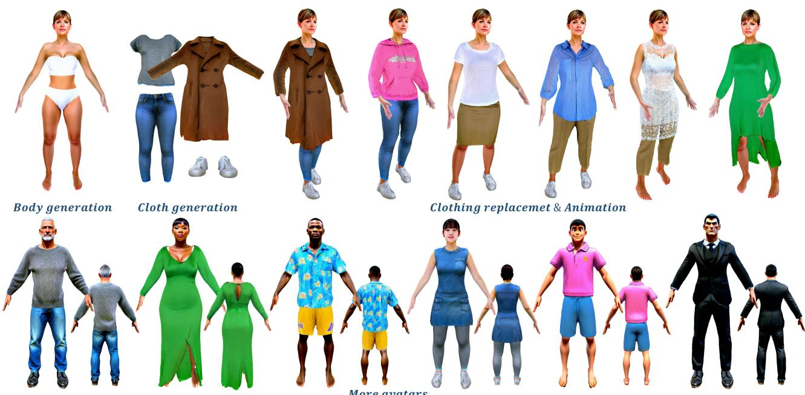
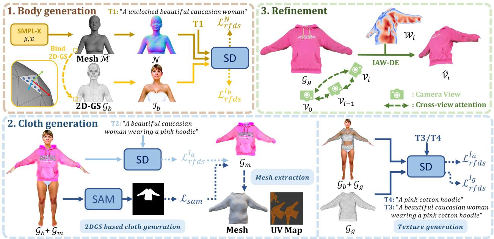
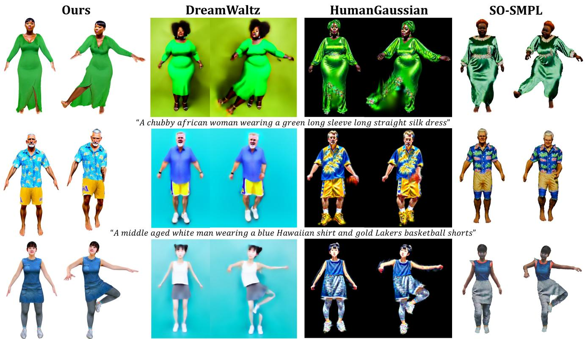
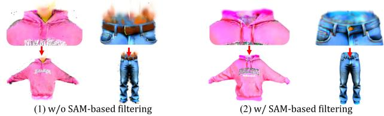
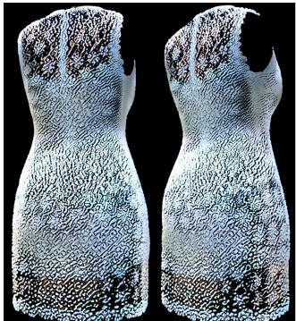
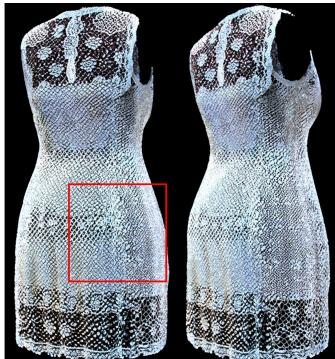
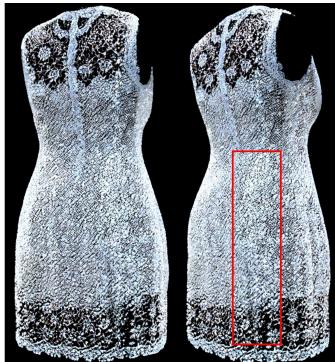
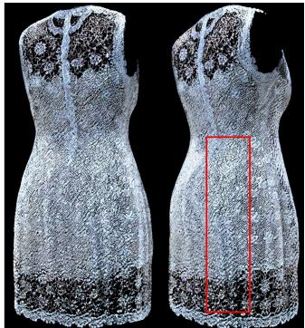
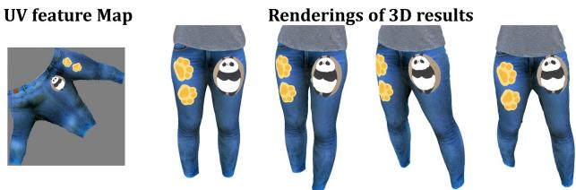
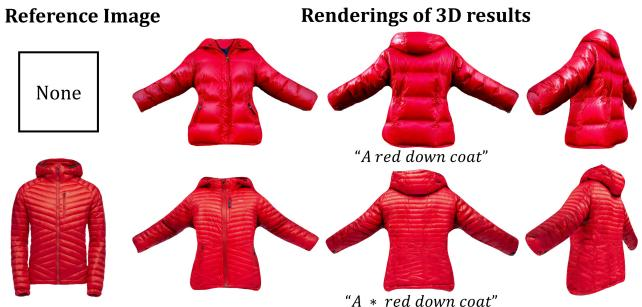

# DAGSM: Disentangled Avatar Generation with GS-enhanced Mesh

Jingyu Zhuang1,2 Di Kang2 Linchao Bao2 Liang Lin1,3,4\* Guanbin Li1,3,4 1Sun Yat-sen University 2Tencent 3 Peng Cheng Laboratory 4Guangdong Key Laboratory of Big Data Analysis and Processing   
zhuangjy6@mail2.sysu.edu.cn, di.kang@outlook.com, linchaobao@gmail.com, linliang@ieee.org, liguanbin@mail.sysu.edu.cn

Figure 1. Given text prompts, our method DAGSM allows the users to generate disentangled avatars in diverse styles (e.g., real, cartoon) with various garments. Our method separately generates the human body and garments for disentanglement, so our method naturally supports clothing replacement. We represent every single part (e.g., body, upper/lower clothes) using a hybrid GS-enhanced mesh, where the 2D Gaussians are attached on a proxy mesh to better handle complicated cloth texture (e.g., cotton, woolen, and transparent fabric in row 1, left 2) and produce realistic animations.

## Abstract

Text-driven avatar generation has gained significant attention owing to its convenience. However, existing methods typically model the human body with all garments as a single 3D model, limiting its usability, such as clothing replacement, and reducing user control over the generation process. To overcome the limitations above, we propose DAGSM, a novel pipeline that generates disentangled human bodies and garments from the given text prompts. Specifically, we model each part (e.g., body, upper/lower clothes) of the clothed human as one GS-enhanced mesh (GSM), which is a traditional mesh attached with 2D Gaus-

sians to better handle complicated textures (e.g., woolen, translucent clothes) and produce realistic cloth animations. During the generation, we first create the unclothed body, followed by a sequence ofindividual cloth generation based on the body, where we introduce a semantic-based algorithm to achieve better human-cloth and garment-garment separation. To improve texture quality, we propose a viewconsistent texture refinement module, including a crossview attention mechanism for texture style consistency and an incident-angle-weighted denoising (IAW-DE) strategy to update the appearance. Extensive experiments have demonstrated that DAGSM generates high-quality disentangled avatars, supports clothing replacement and realistic animation, and outperforms the baselines in visual quality.

## 1. Introduction

High-quality digital humans are essential for many applications, such as VR, immersive telepresence, virtual tryons, and video games. For better interaction and immersion, it would be necessary to provide users with animatable high-quality avatars that support customizable and flexible clothes combinations according to user wishes.

Although avatars created following the traditional pipeline fulfill all the aforementioned requirements, they involve too much manual work and are thus very timeconsuming and expensive. The industry demands a faster and easier avatar creation pipeline to make it available for both professional users and novices. Recently, DreamFusion [54] proposed SDS loss to enable text-to-3D generation based on text-to-image diffusion models, significantly reducing the complexity of generating 3D models. Based on SDS, dedicated human generation methods [8, 22, 34] usually introduce parameter human models (e.g., SMPL [52]) to improve the geometry quality and, most importantly, to animate the generated human model.

However, these methods have two major drawbacks that significantly limit the application of the generated 3D models. First, these methods generate a single model containing both the body and all garments in a single-stage optimization, which prevents clothing replacement, results in unrealistic animation due to clothes adhering to the body, and reduces user control over complex garment combinations. This significantly limits the application of the generated avatars in virtual try-on and video games. Second, the texture generated directly by SDS is usually of low quality (e.g., overly smoothed, over-saturated colors), reducing visual appeal and immersion in the user experience.

To alleviate the above issues, we present DAGSM, which sequentially generates the human body and various garments as individual models represented by GS-enhanced meshes, enabling flexible garment combinations and easier editing. Due to the involvement of meshes, we can utilize physical simulation to animate the generated avatars and clothes, significantly improving the realism. Specifically, our method achieves such capabilities through three crucial designs. (1) A sequential generation pipeline that first generates the unclothed human body, followed by garment generation (conditioned on the human body) and texture refinement. (2) A GS-enhanced mesh (GSM) representation that binds 2DGS [23] onto a mesh to guide the deformation of the Gaussians in animation. Naturally, we can utilize cloth simulation techniques to obtain more convincing animations. (3) Two crucial techniques enabling flexible garment combinations and high-quality texture: SAM-based filtering for better cloth separation (i.e., clearer body-garment and garment-garment boundaries) and view-consistent refinement with a cross-view attention mechanism for enhancing texture quality.

We conduct extensive experiments, demonstrating that DAGSM generates higher-quality avatars with disentangled garments and supports more features, including clothing replacement, manual texture editing, and realistic animation. As illustrated in Fig. 1 and Fig. 3, DAGSM supports clothing replacement and realistic animation with natural clothing motion. Moreover, our method allows precise appearance control by providing a reference image (Fig. 7).

Our contributions are summarized as follows:

• We present DAGSM, a text-driven framework that includes sequential body/cloth generation and refinement stages to produce high-quality animatable avatars with decoupled bodies and garments.

• We adopt a hybrid GS-mesh representation (GSM), enabling physical simulation for more realistic animation.

• We propose two crucial techniques for convincing results: SAM-based filtering for better cloth separation and viewconsistent refinement for enhancing texture quality.

• Experiments demonstrate that, compared to the existing method, our DAGSM generates higher-quality, disentangled avatars with more realistic animations.

## 2. Related Works

## 2.1. Digital human representations

Early works [2, 4, 44] usually combine parametric human meshes (e.g., SMPL [52]) with vertex offsets to model clothed humans. PIFu [58] first introduces the implici function for modeling, which is widely adopted by many subsequent methods [7, 20, 25, 59, 72, 73, 83]. With the rapid development of neural radiance fields, many methods [40, 53, 70, 75] have adopted NeRF [48] to represent the human body. Recently, the explicit radiance field 3DGS [30] quickly draws tremendous attention due to its high rendering quality and efficiency, and some methods [21, 36, 42, 74] apply 3DGS in human reconstruction to enhance training efficiency. Moreover, some methods combine different representations to model the human body. SelfRecon [2] combines explicit SMPL+D [48] and implicit IDR [78] to obtain coherent geometry. DoubleField [60] combines Neural Surface Field [45] and NeRF at the feature level in an implicit manner. Some methods [55, 61, 69, 82] use a hybrid representation that binds 3DGS to a single mesh achieving deformation of the avatar. However, these methods only reconstruct a single-model clothed human from videos and do not support clothing replacement.

## 2.2. Text-guided 3D content generation

Text-to-3D generation methods, which have been largely advanced by the rapid development of the large Text-to-Image (T2I) generative models, can be categorized into two groups, i.e., feedforward generation and optimization-based generation. In feedforward generation methods, Brock et al. [5], SDM-Net [17], and SetVAE [32] train variational autoencoders to generate voxels, meshes, and point clouds, respectively. Some methods marry GANs [19] with various 3D representations, such as point cloud [1, 1, 62], voxel grid [71], mesh [13], and implicit radiance field [3, 9]. Recently, some methods [29, 35, 43, 51, 51, 63] propose to train diffusion models for 3D generation. In optimizationbased generation methods, early works use the CLIP [56] to optimize mesh [47, 49] or neural fields [27]. DreamFusion [54] proposes score distillation sampling (SDS) loss to distill the knowledge in Text-to-Image diffusion models for text-to-3D generation and editing [84, 85]. Most of the subsequent works [11, 12, 39, 46, 64, 66, 68, 79] adopt SDSbased optimization pipeline due to its ability to align the generated appearance with the input text. However, without human body priors, these methods struggle to generate a detailed 3D human body with complex joint structures.

## 2.3. Text-guided 3D human generation

Generating 3D humans rather than generic objects is one most important sub-task and has drawn great attention [8, 15, 24, 28, 34, 38, 41, 47, 67, 81]. Text2Mesh [47] and CLIP-Actor [81] use the CLIP model to optimize mesh deformation and generate vertex colors for textures. With CLIP loss, AvatarCLIP [22] and NeRF-Art [65] adopt NeRF representation for photo-realistic rendering. With the emergence of powerful T2I diffusion models, some methods employ SDS loss to optimize 3D human in dif ferent representations, such as mesh (TADA [38]), NeRF (Avatarcraft [28], Dreamhuman [34], Dreamavatar [8], and Dreamwaltz [24]) and 3DGS (HumanGaussian [41]). However, the above methods represent the clothed human as a holistic model, making clothing replacement infeasible. Recently, a few methods have been proposed to decou ple the human body and garments during the generation. For example, SO-SMPL [67] cut off some regions from the body mesh and used them for garment optimization. However, limited by the predefined mesh topology, it struggles to generate loose clothes, especially those with a different topology to the body (e.g., dresses). TELA [15] uses multiple NeRFs to represent the body and garments, respectively. However, the implicit representation hinders garment deformation in animation and reduces animation realism.

## 3. Preliminaries

3D Gaussian Splatting (3DGS) [30] utilizes a set of pointlike anisotropic Gaussians $g _ { i }$ to represent a 3D scene: $\mathcal { G } =$ $\left\{ g _ { 1 } , g _ { 2 } , . . . , g _ { N } \right\}$ . Each $g _ { i }$ contains a series of optimizable attributes, including center position $\mu ,$ opacity $\alpha ,$ 3D covariance matrix $\Sigma ,$ and color $c .$ The differentiable splatting

rendering process is:

$$
C = \sum _ { i \in \mathcal { N } } c _ { i } \sigma _ { i } \prod _ { i = 1 } ^ { j = 1 } ( 1 - \sigma _ { j } ) , \quad \sigma _ { i } = \alpha _ { i } e ^ { - \frac { 1 } { 2 } ( x ) ^ { T } \Sigma ^ { - 1 } ( x ) }\tag{1}
$$

where $j$ indexes the Gaussians in front of $g _ { i }$ according to their distances to the camera center (i.e. depth), $\mathcal { N }$ is the number of Gaussians contributed to the ray, and $c _ { i } , \alpha _ { i } ,$ and $x _ { i }$ represent the color, density, and distance of the sampling point to the center point of the i-th Gaussian.

In this paper, we employ a variant of 3DGS, i.e. 2DGS [23], which compresses the 3D volume into 2Doriented Gaussian disks for better surface. This approach reduces multi-view inconsistency in 3DGS, enhancing reconstruction quality.

Optimizing Radiance Fields with RFDS Loss. Dream-Fusion [54] proposes Score distillation sampling (SDS) to distill the priors from a Text-to-Image (T2I) diffusion model for 3D generation. [77] extends this method to the rectifiedflow-based T2I models (e.g. Stable Diffusion 3 [16]) and proposes RFDS loss:

$$
\nabla _ { \mathcal { G } } \mathcal { L } _ { r f d s } ( \phi , x ) = \mathbb { E } _ { \epsilon , t } \biggl [ w ( t ) ( x - \epsilon - v _ { \phi } ( x _ { t } , y , t ) ) \frac { \partial x } { \partial \mathcal { G } } \biggr ]\tag{2}
$$

where $w ( t )$ represents a positive value related to timestep $t \in [ 0 , 1 ]$ , x is the image rendered from the radiance field ${ \mathcal { G } } ,$ y represents the embedding of condition. The rectified flow network parameter ϕ is fixed and ϵ is the random noise.

## 4. Method

Given the text prompts describing a human body and the wearing clothes, our goal is to generate a disentangled avatar with high-quality texture, where each garment and the body are decoupled and modeled separately using GSenhanced meshes (GSM, Sec. 4.1).

To obtain a disentangled avatar, DAGSM generates the unclothed human body and garments in different stages, followed by a refinement step (Fig. 2). DAGSM contains three major stages: (1) We first generate a body in underwear (Sec. 4.2). (2) In the following cloth generation stage (Sec. 4.3), we first generate the mesh proxy of the GSMbased garment, and then optimize the 2DGS of GSM to obtain the garment texture. Utilizing such a mesh-based representation enables physics-based cloth simulation and makes clothes editing easier. (3) Finally, we propose a view-consistent refinement stage (Sec. 4.4) to improve the texture quality of the body and garment.

## 4.1. GSM representation

We propose to represent each model with a GS-enhanced mesh (GSM), where the 2DGS are attached to the mesh faces (Fig. 2, top-left). The advantages of GSM are twofold: (1) significantly enhancing the realism of clothing movement when driving the avatar with the help of a clothes simulator. (2) enabling easier and more accurate cloth editing via direct texture map modification.

  
Figure 2. Method overview. Given text prompts, DAGSM generates disentangle digital humans whose bodies and clothes are represented as multiple individual GSM (Sec. 4.1). The generation process includes three stages: 1) a body generation stage that generates an unclothed body with the human priors SMPL-X [52] from the guidance of text-to-image model SD [16] (Sec. 4.2); 2) a cloth generation stage tha first creates the cloth’s mesh proxy. Then 2DGS Gb is bound to the mesh for generating a garment with texture (Sec. 4.3); and 3) a view-consistent refinement stage, where we propose a cross-view attention mechanism for texture style consistency and an incident-angle weighted denoising (IAW-DE) strategy to enhance the appearance image $\hat { \mathcal { V } } _ { i }$ (Sec. 4.4).

Specifically, the 2DGS are attached to the mesh triangles to follow the mesh transformation during animation/simulation similar to [55]. The 2DGS are defined in a local coordinate system derived from its bind triangle (Fig. 2, top-left), where we use its centroid position $_ { \mathbf { T } }$ as the origin of the local coordinate. The direction of one edge, the triangle’s normal $\vec { n } ,$ and their cross-product define the three coordinate axes’ directions R. In the local coordinate system, we define the position of the 2DGS using the barycentric coordinates $( \lambda _ { 1 } , \lambda _ { 2 } )$ and height offset z along the normal direction $( { \mathrm { i . e . , } } \mu = \{ \lambda _ { 1 } , \lambda _ { 2 } , z \} )$ ). During rendering, the geometry attributes of a GS change with its attached triangle’s state as follows:

$$
\begin{array} { l } { \hat { \pmb { \mu } } = \lambda _ { 1 } \pmb { x } _ { A } + \lambda _ { 2 } \pmb { x } _ { B } + ( 1 - \lambda _ { 1 } - \lambda _ { 2 } ) \pmb { x } _ { C } + z \vec { n } , } \\ { \hat { \pmb { r } } = \pmb { R } \pmb { r } , \quad \hat { \pmb { s } } = k \pmb { s } } \end{array}\tag{3}
$$

where $x _ { A } , x _ { B } , x _ { C }$ denote the world coordinates of the triangle’s three vertices, ⃗n is the unit normal vector of this triangle, and scaling factor k is calculated as the ratio of a triangle’s current area to its original area. Note that the GS deforms with SMPL-X mesh’s deformation in animation.

Different from [55], we utilize two UV feature maps $( { { \mathcal { U } } _ { c } } , { { \mathcal { U } } _ { \alpha } } )$ to store the RGB color and opacity information of the 2DGS to facilitate later editing (Fig. 6). During rendering, the color and opacity information is sampled from the UV maps according to UV mapping and the barycentric coordinates $( \lambda _ { 1 } , \lambda _ { 2 } )$

Note that geometry attributes belonging to GS (i.e. $\lambda _ { 1 } , \lambda _ { 2 } , z ,$ orientation r, and scale s) are optimizable. In contrast, ${ \pmb x } _ { A } , { \pmb x } _ { B } , { \pmb x } _ { C }$ , orientations of the local coordinate’s axes R, normal vector n⃗, and scaling scalar k are calculated according to the transformed mesh vertices.

## 4.2. Body generation

We first generate a human body only in underwear represented by GSM. As shown in Fig. 2, the geometry branch and color branch are optimized alternatively by the RFDS loss calculated according to the given text prompt $T _ { 1 }$

Similar to previous work [38], we utilize SMPL-X [52], a deformable parametric 3D human body mesh model with predefined topology. We add optimizable per-vertex displacement D to SMPL-X mesh M to obtain Mˆ . To increase the density of 2DGS, we attach $( n ^ { 2 } / 2 )$ on-surface (i.e. 0 offsets along the normal vector) 2DGS uniformly distributed on every triangle.

Geometry branch. Optimizable parameters $\theta _ { 1 } = \{ \beta , { \mathcal { D } } \}$ are SMPL-X shape $\beta$ and vertex displacement D, which are transformed to a mesh $\hat { \mathcal { M } } = \mathcal { M } ( \beta ) + \mathcal { D }$ . We fix other SMPL-X parameters (θ) and omit them for clarity. Then $\hat { \mathcal { M } }$ is rendered as a normal image $\mathcal { N }$ for loss calculation.

$$
\nabla _ { \theta _ { 1 } } \mathcal { L } _ { r f d s } ^ { N } ( \phi , \mathcal { N } ) = \mathbb { E } _ { \epsilon , t } \left[ w ( t ) ( x - \epsilon - v _ { \phi } ( \mathcal { N } _ { t } , y , t ) ) \frac { \partial \mathcal { N } } { \partial \theta _ { 1 } } \right]\tag{4}
$$

Color branch. The optimizable parameters $\theta _ { 2 }$ include the attributes $\theta _ { 2 } = \{ { \pmb u } , s , r , \mathcal { U } _ { c } , \mathcal { U } _ { \alpha } \}$ of 2DGS. Note that the geometry attributes $( \{ u , s , r \} )$ of the 2DGS are also updated for local shape refinement. According to Eq. 1 & Eq. 3 , we render the RGB image $\mathcal { T } _ { b }$ of $\mathcal { G } _ { b }$ for loss calculation.

$$
\nabla _ { \theta _ { 2 } } \mathcal { L } _ { r f d s } ^ { I _ { b } } ( \phi , \mathcal { T } _ { b } ) = \mathbb { E } _ { \epsilon , t } \bigg [ w ( t ) ( x - \epsilon - v _ { \phi } ( \mathcal { T } _ { b t } , y , t ) ) \frac { \partial \mathcal { T } _ { b } } { \partial \theta _ { 2 } } \bigg ]\tag{5}
$$

Regularizations on the positions $( \mathcal { L } _ { p } )$ , scales $( \mathcal { L } _ { s } )$ , and rotations $( \mathcal { L } _ { r } )$ of the GS are applied to constrain the movement of the Gaussians, resulting in fewer artifacts [55]. The total loss for the color branch is:

$$
\mathcal { L } _ { \mathcal { G } _ { b } } = \mathcal { L } _ { r f d s } ^ { I _ { b } } + \lambda _ { p } \mathcal { L } _ { p } + \lambda _ { s } \mathcal { L } _ { s } + \lambda _ { r } \mathcal { L } _ { r }\tag{6}
$$

## 4.3. Cloth generation

Thanks to the disentangled pipeline, we can sequentially generate garments, similar to the body generation process, with only one crucial difference. We introduce an additional mesh generation step since using a mesh with a predefined topology cannot handle clothes with drastically different topologies (e.g. dress vs trousers).

The garment, which is represented by the original 2DGS $\mathcal { G } _ { m }$ , is optimized using RFDS loss along with the human body $\mathcal { G } _ { b }$ (fixed). We propose a SAM-based filtering operation to remove noisy Gaussians unrelated to the garment, facilitating human-garment separation. When the optimization is finished, we extract its mesh using the TSDF algorithm [50] from the rendered multiview depth image. We fix the mesh topology of the generated garment after mesh simplification [18] and bind 2DGS on it for later garment texture generation.

2DGS based cloth generation for mesh extraction. We first represent the garment using the original 2DGS representation (i.e. not bound to a mesh) for optimization so that we can generate garments of diverse types without topology constraints. Specifically, we initialize a set of 2D Gaussians $\mathcal { G } _ { m }$ from selected body regions to represent the garment (see supplementary for the initialization details). Unlike $\mathcal { G } _ { b }$ in the body GSM, the Gaussians $\mathcal { G } _ { m }$ are not bound to the mesh, each assigned a color attribute c and opacity attribute α. We merge $\mathcal { G } _ { m }$ with the body $\mathcal { G } _ { b }$ to render the clothed human image $\mathcal { T } _ { a } .$ . Using RFDS loss $\mathcal { L } _ { r f d s } ^ { I _ { a } }$ on $\mathcal { T } _ { a }$ , we only optimize $\mathcal { G } _ { m }$ to align with the text prompt $T _ { 2 }$

To improve the geometry quality, we introduce two regularization terms. First, we constrain a 2D Gaussian’s distance to the mesh surface (i.e. point-to-surface distance) as:

$$
\mathcal { L } _ { d i s } = | | \hat { \boldsymbol { \mu } } - \boldsymbol { p } _ { m } | | _ { 2 }\tag{7}
$$

where $p _ { m }$ is the projection point on the body mesh of a Gaussian’s center ${ \hat { \mu } } .$ . Second, we apply a regularization on the rendered normal image $\mathcal { I } _ { n }$ (of $\mathcal { G } _ { m } )$ and its Gaussian blurred image $G ( \mathcal { T } _ { n } )$ , ensuring a smooth cloth surface:

$$
\mathcal { L } _ { s m o o t h } = | | G ( \mathcal { T } _ { n } ) - \mathcal { T } _ { n } | | _ { 2 } ^ { 2 }\tag{8}
$$

SAM-basedfiltering. As shown in Fig. 2, the generated $\mathcal { G } _ { m }$ inevitably includes parts of the body. To decouple the body and garment, we utilize SAM [33] to filter out non-garment Gaussians. Specifically, each Gaussian is assigned an extra class attribute o (0 for $\mathcal { G } _ { b }$ and 1 for $\mathcal { G } _ { m }$ initially) to render a semantic image $\mathcal { T } _ { o }$ with Eq. 1. We use SAM to obtain the semantic mask $\mathcal { M }$ (detailed in the supplementary) of the clothed human image $\mathcal { T } _ { a }$ as the label and calculate the MSE loss $\mathcal { L } _ { s a m }$ between M and $\mathcal { T } _ { o }$ to optimize o of $\mathcal { G } _ { m }$ During $\mathcal { G } _ { m }$ generation, we remove Gaussians whose o are below 0.5 (i.e., non-garment 2DGS) every 500 iterations.

In summary, the optimizable parameters of $\mathcal { G } _ { m }$ are $\{ u , s , r , c , \alpha , o \}$ and the full loss for optimization is:

$$
\begin{array} { r } { \mathcal { L } _ { \mathcal { G } _ { m } } = \mathcal { L } _ { r f d s } ^ { I _ { a } } + \mathcal { L } _ { s a m } + \lambda _ { d i s } \mathcal { L } _ { d i s } + \lambda _ { s m o o t h } \mathcal { L } _ { s m o o t h } } \end{array}\tag{9}
$$

Mesh extraction. Following [23], we reconstruct the garment mesh using the TSDF algorithm from multiview rendered depth images of $\mathcal { G } _ { m }$ . We remove the garment’s invisible faces inside the body mesh and simplify the mesh to 10k faces through the mesh simplification algorithm [18], followed by Laplacian smoothing. UV mapping can be obtained either automatically via the UV-Atlas [80] or manually by defining cutting seams in modeling software [14].

Texture generation. We bind 2D Gaussians $\mathcal { G } _ { g }$ to the extracted mesh and optimize them to generate the garment texture. In this step, we add detailed material descriptions in the text prompt to generate the texture of the different materials (such as lace, denim, wool). We obtain the garmentonly image $\mathcal { T } _ { g }$ by only rendering $\mathcal { G } _ { b }$ and obtain the clothed human image $\mathcal { T } _ { \dot { a } }$ by rendering $\mathcal { G } _ { b }$ and $\mathcal { G } _ { g }$ together. We calculate RFDS losses $\mathcal { L } _ { r f d s } ^ { I _ { g } }$ on $\mathcal { T } _ { g }$ and $\mathcal { L } _ { r f d s } ^ { I _ { \dot { a } } }$ on $\mathcal { T } _ { \dot { a } }$ based on the respective text prompts, optimizing $\mathcal { G } _ { m }$ while keeping $\mathcal { G } _ { b }$ unchanged. The optimizable parameters are u, s, r, Uc, $\mathcal { U } _ { \alpha }$ of $\mathcal { G } _ { g }$ . Similarly, we add regularization terms $\mathcal { L } _ { p } , \mathcal { L } _ { s } ,$ and $\mathcal { L } _ { r }$ to reduce the artifacts and the total loss is:

$$
\mathcal { L } _ { \mathcal { G } _ { g } } = \mathcal { L } _ { r f d s } ^ { I _ { g } } + \mathcal { L } _ { r f d s } ^ { I _ { i } } + \lambda _ { p } \mathcal { L } _ { p } + \lambda _ { s } \mathcal { L } _ { s } + \lambda _ { r } \mathcal { L } _ { r }\tag{10}
$$

## 4.4. view-consistent refinement

In this section, we propose view-consistent refinement, including a cross-view attention mechanism and a weighted denoising strategy based on a surface point’s (viewing) incident angle to achieve consistent texture enhancement across views (Fig. 2). Directly using SDEdit to improve the texture as in [85] often results in sharper but inconsistent results, as the lower-quality texture generated by SDS/RFDS loss requires adding stronger noise and more denoising steps, thereby increasing the cross-view inconsistency.

Our view-consistent refinement contains two critical improvements compared to a naive pixel-level refinement using SDEdit. First, a cross-view attention mechanism ensures the consistency of texture style across views. Second, incident-angle-weighted denoising (IAW-DE) adjusts the pixel noise levels in the denoising process based on an incident-angle weight map, thereby focusing the texture refinement in regions that are “better” observed (i.e. closer to perpendicular to the camera) and thus more confident to update. Specifically, we define a view sequence surrounding the object (body/garment) and progressively optimize its texture from each view. Starting from a predefined canonical view, we apply IAW-DE to enhance the texture image as the pseudo label to supervise the 2DGS rendered image. This process is repeated for each view, with a cross-view attention mechanism to ensure a consistent texture style.

Cross-view attention. To maintain the consistent texture style across the views, we replace the self-attention in SD3 with cross-view attention during the denoising process inspired by video diffusion models [31, 76]. We use the canonical and previous views $( \gamma _ { 0 } , \gamma _ { i - 1 } )$ as the reference to maintain texture style consistency by concatenating their features into the calculation of key $\mathbf { K } ^ { \prime }$ and value $\mathbf { V } ^ { \prime }$

$$
\mathbf { K } ^ { \prime } = \mathbf { W } ^ { K } [ z \nu _ { 0 } ; z \nu _ { i - 1 } ; z \nu _ { i } ] \quad \mathbf { V } ^ { \prime } = \mathbf { W } ^ { V } [ z \nu _ { 0 } ; z \nu _ { i - 1 } ; z \nu _ { i } ]\tag{11}
$$

where $\mathbf { W } ^ { K } , \mathbf { W } ^ { V }$ are the pre-trained parameters; $z _ { ( \cdot ) }$ the latent feature from corresponding views.

IAW-DE. As [6, 10, 57] point out, the texture of a region should be determined by the view that observes it most directly. Given a rendered view, we thus enhance textures in regions most directly observed, leaving less observed regions (e.g. boundaries) unchanged. We use a weight map $\mathcal { W } _ { i }$ (Fig. 2, top-right) to measure the observation directness of each pixel in the i-th rendered image $\nu _ { i } .$ . Each pixel in $\mathcal { W } _ { i }$ denotes the cosine similarity between the surface normal of point $p _ { j } \ ( \mathrm { i . e . }$ , the intersection of the pixel ray with the mesh) and the reversed view direction. Since $p _ { j }$ may be visible from multiple views, we aggregate its corresponding pixel values across all visible views and normalize them using temperature-scaled Softmax. The weight map $\mathcal { W } _ { i }$ is then resized to match the feature size in the diffusion model. According to W , IAW-DE adds more noise to the higherweighted feature pixels and performs more denoising iterations to obtain the refinement image $\hat { \mathcal { V } } _ { i }$ (see Algorithm.1 in the supplementary for detail). A weighted MSE loss is applied between the rendered image $\nu _ { i }$ and the refinement image $\hat { \mathcal { V } } _ { i } , \mathrm { i . e . , } \mathcal { L } _ { r e f } = | | \mathcal { W } _ { i } ( \hat { \mathcal { V } } _ { i } - \mathcal { V } _ { i } ) | | _ { 2 } ^ { 2 }$

## 5. Experiments

Implementation Details. We use the official code [23] to implement 2D Gaussian Splatting. We set $\lambda _ { p } = \lambda _ { s } = 1 0 , \lambda _ { r } = 1$ in Eq. 6&10 and $\lambda _ { d i s } { = } 1 , \lambda _ { s m o o t h } { = } 1 0 0$ in Eq. 9. The rendered size is 1024×1024 and the RFDS loss is calculated on Stable Diffusion 3 [16]. All experiments are conducted on an NVIDIA A100 (40 GB). The body generation takes 3K iterations, consuming roughly 60 minutes. In the cloth generation, original 2DGS generation and texture generation require 2K iterations each, taking 30 and 20 minutes, respectively. View-consistent refinement takes 16 minutes, with 8 views around the object at $4 5 ^ { \circ }$ intervals, and the $0 ^ { \circ }$ view is the canonical view. More details (e.g., optimizer, learning rate) can be found in the supplementary.

Table 1. Quantitative comparisons (rows 1-2) and user study (rows 3-5). Human-G denotes HumanGaussian.
<table><tr><td></td><td>Metric |DreamWaltz Human-G SO-SMPL</td><td></td><td></td><td>Ours</td></tr><tr><td>ViT-L/14 ↑</td><td>24.2</td><td>27.3</td><td>25.6</td><td>28.8</td></tr><tr><td>ViTbigG-14↑</td><td>41.9</td><td>43.9</td><td>42.0</td><td>45.8</td></tr><tr><td>Visual Quality ↑</td><td>1.0%</td><td>8.4%</td><td>16.6%</td><td>74.0%</td></tr><tr><td>Text Alignment ↑</td><td>2.4%</td><td>9.2%</td><td>11.6%</td><td>76.8%</td></tr><tr><td>Animation Realism ↑</td><td>2.6%</td><td>8.6%</td><td>20.4%</td><td>68.4%</td></tr></table>

Baselines. We compare our method with three baselines, including three representative 3D representations. (1) Dreamwaltz [24], which uses single NeRF [48] representation and SDS loss for optimizing. (2) HumanGaussian [41], which models the whole clothed human with a set of 3DGS and using SD fine-tuned with depth maps as guidance. and (3) SO-SMPL [67], a disentangled method that uses SDSoptimized traditional meshes (with predefined fixed topol-$\mathbf { o g y } )$ to represent body and garments. All methods adopt SMPL-X [52] as the body shape prior. We implement all methods using their official codes.

## 5.1. Comparisons with Baselines

Qualitative comparisons. Fig. 3 shows visual comparisons of avatars generated by our method and the baselines at the same pose. Obviously, our method generates higher texture quality results, more accurate adherence to the input text prompt, and more realistic animation (e.g., the deformation of the green dress). In contrast, due to the limitations of the 3D representation and training pipelines, baselines generate suboptimal results and encounter challenges in animation.

DreamWaltz and HumanGaussian results usually do not follow the provided text prompts accurately, possibly because they generate all the clothes at once from much more complicated text descriptions. In contrast, we only need to provide detailed descriptions for generating the current cloth. For example, HumanGaussian generates unintended basketballs and sneakers (Fig. 3, row 2), while DreamWaltz inaccurately generates white vests (row 3). Moreover, DreamWaltz uses implicit NeRF, resulting in low-resolution results (due to slow rendering) and broken body integrity in animation. Results from HumanGaussian fail to maintain cloth integrity during the animation (e.g., tearing of dresses) since the garment 3DGS are also attached to the SMPL body mesh for movement. SO-SMPL can not generate clothes (e.g., dresses) beyond SMPL-X’s topological structure, limiting its applicability. See the animation videos of all methods in our supplementary for clearer comparisons.

  
"A chinese teenage girl wearing a crew neck blue denim sleeveless A — skirt, gray leggings and white board shoes'  
Figure 3. Visual comparisons. Results generated by our method have significantly higher visual quality, accurately follow the input text prompt, and can be naturally animated. In contrast, results from DreamWaltz are in low-resolution and contain obvious structural problems. HumanGaussian produces unexpected results (e.g., basketball), with issues such as a split skirt in the animation. SO-SMPL is limited by its inability to generate clothing beyond the body’s topology (e.g., dresses), restricting its applicability.

Quantitative comparisons. We adopt CLIP [56] similarity to assess the alignment of 10 generated avatars with their corresponding text prompts. We render 120 images per avatar in different views and poses. Specifically, the elevation angle ranges from 0° to 30°, while the azimuth angle ranges from -60° to 60. The poses include A-pose and random dance pose. Tab. 1 shows the CLIP similarity scores using two backbones, i.e. ViT-L/14 [56] and ViTbigG-14 [26]. These results demonstrate the superiority of our method in both CLIP metrics, indicating that our generated avatars align better with the text prompts.

User study. We conduct a user study with 50 participants to evaluate the 10 generated avatars according to three aspects, including visual quality, alignment to the text prompts, and animation quality. We adopt the same dance pose sequence to drive each method and show the rendered animation videos to the participants (see our supplementary). As shown in Tab. 1, our method outperforms the baselines with a significant margin, receiving 74% votes for visual quality, 76.8% for alignment, and 68.4% for animation quality.

## 5.2. Ablation Studies

Ablation studies on SAM-based filtering. Fig. 4 demonstrates the benefit of SAM-based filtering in cloth generation (Sec.4.3). Without SAM-based filtering, the generated garment 2DGS always contains obvious noise from its adjacent part (e.g., body parts indicated by the arrow). Introducing SAM-based filtering effectively handles the noise, resulting in better body-garment separation.

  
Figure 4. Ablation study on SAM-based filtering. The results demonstrate its effectiveness in filtering out the noise belonging to the body, achieving better body-garment separation.

Ablation studies on the view-consistent refinement. We conduct ablative experiments to verify the effects of viewconsistent refinement and its key components: cross-view attention and IAW-DE. To better demonstrate the texture details, we render a single-layer white lace dress (i.e., the layer not occluded by the body) on a black background. Fig. 5 (1)&(4) show the suboptimal textures generated by the RFDS loss and the improved textures by our viewconsistent refinement, respectively. Our view-consistent refinement significantly enhances the texture quality while maintaining the consistency of the texture style.

  
(1) w/o refinement stage

  
(2) w/o cross view attention

  
(3) w/o IAW-DE

Figure 5. Ablation study on view-consistent refinement. To better demonstrate the texture, we render a single layer of the white lace dress (i.e., the layer not occluded by the body) on a black background. Our view-consistent refinement (4) effectively improves the suboptima textures generated by RFDS loss (1). This refinement includes two key components: cross-view attention, which ensures texture style consistency across views (2 vs. 4); and IAW-DE, which reduces the blurriness of the texture caused by view inconsistency (3 vs. 4).  
  
Figure 6. Manual texture editing by modifying Uc.

Fig. 5 (2)&(3) demonstrate the benefit of cross-view attention and IAW-DE in view-consistent refinement. Without cross-view attention, the consistency of the texture decreases after enhancement. Without IAW-DE, the overlapping texture regions of two rendered views can easily get blurred even if their textures are slightly inconsistent. IAW-DE allows each view to focus on enhancing the most directly observed regions, thereby reducing texture blurriness caused by view inconsistency.

## 5.3. Applications

Clothing replacement and Animation. As presented in Fig. 1, our method allows the users to alter the clothes of the generated avatars without changing the body appearance, which is an essential feature for virtual try-on applications. In animation, we use SMPL-X parameters from AIST++ [37] to drive the body mesh and simulate garment mesh deformation in Blender [14]. Fig. 1& 3 show our avatars in different poses, demonstrating realistic garmentbody interactions due to our decoupled mesh-based representation. Videos are provided in the supplementary.

Manual texture editing. Thanks to the UV color maps Uc, we can directly modify $\mathcal { U } _ { c }$ to edit the model’s texture. In Fig. 6, we add a logo to the cloth by copying it into ${ { \mathcal { U } } _ { c } } .$ The pattern in the rendered image is clear and deforms naturally in cloth animation.

  
Figure 7. Reference image guided generation for better appearance control. “∗” denotes the special token.

Generating with a reference image. Our approach also supports more accurate and user-friendly appearance control via a reference image as a prompt. Using TIP-Editor [85], we encode the reference image as a special token and integrate it into the text prompt. As shown in Fig. 7, compared to only using text prompts, the generated clothes with the reference image exhibit high consistency with the reference, significantly improving appearance control.

## 6. Conclusion and Limitations

In this paper, our proposed DAGSM allows the users to generate digital humans with decoupled bodies and garments from text prompts. We separately generate the human body and garments represented by different GSMs, which is a hybrid representation binding 2DGS with a mesh. Thanks to our disentangled generation pipeline and GSM representation, DAGSM naturally enables clothing replacement and transparent fabric generation, and supports clothing simulation in animation. Extensive experiments demonstrate that DAGSM outperforms existing methods, generating higher visual quality, supporting more features, and enabling more realistic animations. One limitation of DAGSM is that the TSDF algorithm for mesh extraction only reconstructs the garment surface, omitting internal structures like pockets.

## Acknowledgement

This work is supported in part by the National Key R&D Program of China under Grant No.2024YFB3908503, in part by the National Natural Science Foundation of China under Grant NO. 62322608 and NO. 62325605.

## References

[1] Panos Achlioptas, Olga Diamanti, Ioannis Mitliagkas, and Leonidas Guibas. Learning representations and generative models for 3d point clouds. In International conference on machine learning, pages 40–49. PMLR, 2018. 3

[2] Thiemo Alldieck, Marcus Magnor, Weipeng Xu, Christian Theobalt, and Gerard Pons-Moll. Video based reconstruction of 3d people models. In Proceedings ofthe IEEE Conference on Computer Vision and Pattern Recognition, pages 8387– 8397, 2018. 2

[3] Sizhe An, Hongyi Xu, Yichun Shi, Guoxian Song, Umit Y Ogras, and Linjie Luo. Panohead: Geometry-aware 3d fullhead synthesis in 360deg. In Proceedings of the IEEE/CVF conference on computer vision and pattern recognition, pages 20950–20959, 2023. 3

[4] Bharat Lal Bhatnagar, Garvita Tiwari, Christian Theobalt, and Gerard Pons-Moll. Multi-garment net: Learning to dress 3d people from images. In Proceedings of the IEEE/CVF international conference on computer vision, pages 5420– 5430, 2019. 2

[5] Andrew Brock, Theodore Lim, James M Ritchie, and Nick Weston. Generative and discriminative voxel modeling with convolutional neural networks. arXiv preprint arXiv:1608.04236, 2016. 3

[6] Tianshi Cao, Karsten Kreis, Sanja Fidler, Nicholas Sharp, and Kangxue Yin. Texfusion: Synthesizing 3d textures with text-guided image diffusion models. In Proceedings of the IEEE/CVF International Conference on Computer Vision, pages 4169–4181, 2023. 6

[7] Yukang Cao, Kai Han, and Kwan-Yee K Wong. Sesdf: Selfevolved signed distance field for implicit 3d clothed human reconstruction. In Proceedings of the IEEE/CVF Conference on Computer Vision and Pattern Recognition, pages 4647– 4657, 2023. 2

[8] Yukang Cao, Yan-Pei Cao, Kai Han, Ying Shan, and Kwan-Yee K Wong. Dreamavatar: Text-and-shape guided 3d human avatar generation via diffusion models. In Proceedings of the IEEE/CVF Conference on Computer Vision and Pattern Recognition, pages 958–968, 2024. 2, 3

[9] Eric R Chan, Connor Z Lin, Matthew A Chan, Koki Nagano, Boxiao Pan, Shalini De Mello, Orazio Gallo, Leonidas J Guibas, Jonathan Tremblay, Sameh Khamis, et al. Efficient geometry-aware 3d generative adversarial networks. In Proceedings of the IEEE/CVF conference on computer vision and pattern recognition, pages 16123–16133, 2022. 3

[10] Dave Zhenyu Chen, Yawar Siddiqui, Hsin-Ying Lee, Sergey Tulyakov, and Matthias Nießner. Text2tex: Text-driven texture synthesis via diffusion models. In Proceedings of the IEEE/CVF International Conference on Computer Vision, pages 18558–18568, 2023. 6

[11] Rui Chen, Yongwei Chen, Ningxin Jiao, and Kui Jia. Fantasia3d: Disentangling geometry and appearance for high quality text-to-3d content creation. In Proceedings of the IEEE/CVF international conference on computer vision, pages 22246–22256, 2023. 3

[12] Zilong Chen, Feng Wang, Yikai Wang, and Huaping Liu. Text-to-3d using gaussian splatting. In Proceedings of the IEEE/CVF Conference on Computer Vision and Pattern Recognition, pages 21401–21412, 2024. 3

[13] Shiyang Cheng, Michael Bronstein, Yuxiang Zhou, Irene Kotsia, Maja Pantic, and Stefanos Zafeiriou. Meshgan: Non-linear 3d morphable models of faces. arXiv preprint arXiv:1903.10384, 2019. 3

[14] Blender Online Community. Blender - a 3d modelling and rendering package, 2018. 5, 8

[15] Junting Dong, Qi Fang, Zehuan Huang, Xudong Xu, Jingbo Wang, Sida Peng, and Bo Dai. Tela: Text to layer-wise 3d clothed human generation. arXiv preprint arXiv:2404.16748, 2024. 3

[16] Patrick Esser, Sumith Kulal, Andreas Blattmann, Rahim Entezari, Jonas Muller, Harry Saini, Yam Levi, Dominik¨ Lorenz, Axel Sauer, Frederic Boesel, et al. Scaling recti fied flow transformers for high-resolution image synthesis. In Forty-first International Conference on Machine Learn ing, 2024. 3, 4, 6

[17] Lin Gao, Jie Yang, Tong Wu, Yu-Jie Yuan, Hongbo Fu, Yu-Kun Lai, and Hao Zhang. Sdm-net: Deep generative network for structured deformable mesh. ACM Transactions on Graphics (TOG), 38(6):1–15, 2019. 3

[18] Michael Garland and Paul S Heckbert. Surface simplification using quadric error metrics. In Proceedings of the 24th an nual conference on Computer graphics and interactive tech niques, pages 209–216, 1997. 5

[19] Ian Goodfellow, Jean Pouget-Abadie, Mehdi Mirza, Bing Xu, David Warde-Farley, Sherjil Ozair, Aaron Courville, and Yoshua Bengio. Generative adversarial nets. Advances in neural information processing systems, 27, 2014. 3

[20] Tong He, John Collomosse, Hailin Jin, and Stefano Soatto. Geo-pifu: Geometry and pixel aligned implicit functions for single-view human reconstruction. Advances in Neural In formation Processing Systems, 33:9276–9287, 2020. 2

[21] Zijian He, Yuwei Ning, Yipeng Qin, Wangrun Wang, Sibei Yang, Liang Lin, and Guanbin Li. Vton 360: High-fidelity virtual try-on from any viewing direction. arXiv:2503.12165, 2025. 2

[22] Fangzhou Hong, Mingyuan Zhang, Liang Pan, Zhongang Cai, Lei Yang, and Ziwei Liu. Avatarclip: Zero-shot textdriven generation and animation of 3d avatars. arXiv preprint arXiv:2205.08535, 2022. 2, 3

[23] Binbin Huang, Zehao Yu, Anpei Chen, Andreas Geiger, and Shenghua Gao. 2d gaussian splatting for geometrically accurate radiance fields. In ACM SIGGRAPH 2024 Conference Papers, pages 1–11, 2024. 2, 3, 5, 6

[24] Yukun Huang, Jianan Wang, Ailing Zeng, He Cao, Xianbiao Qi, Yukai Shi, Zheng-Jun Zha, and Lei Zhang. Dreamwaltz: Make a scene with complex 3d animatable avatars. Advances in Neural Information Processing Systems, 36, 2024. 3, 6

[25] Zeng Huang, Yuanlu Xu, Christoph Lassner, Hao Li, and Tony Tung. Arch: Animatable reconstruction of clothed humans. In Proceedings ofthe IEEE/CVF Conference on Computer Vision and Pattern Recognition, pages 3093–3102, 2020. 2

[26] Gabriel Ilharco, Mitchell Wortsman, Ross Wightman, Cade Gordon, Nicholas Carlini, Rohan Taori, Achal Dave, Vaishaal Shankar, Hongseok Namkoong, John Miller, Hannaneh Hajishirzi, Ali Farhadi, and Ludwig Schmidt. Open clip, 2021. If you use this software, please cite it as below. 7

[27] Ajay Jain, Ben Mildenhall, Jonathan T Barron, Pieter Abbeel, and Ben Poole. Zero-shot text-guided object generation with dream fields. In Proceedings ofthe IEEE/CVF conference on computer vision and pattern recognition, pages 867–876, 2022. 3

[28] Ruixiang Jiang, Can Wang, Jingbo Zhang, Menglei Chai, Mingming He, Dongdong Chen, and Jing Liao. Avatarcraft: Transforming text into neural human avatars with parameterized shape and pose control. In Proceedings of the IEEE/CVF International Conference on Computer Vision, pages 14371–14382, 2023. 3

[29] Heewoo Jun and Alex Nichol. Shap-e: Generating conditional 3d implicit functions. arXiv preprint arXiv:2305.02463, 2023. 3

[30] Bernhard Kerbl, Georgios Kopanas, Thomas Leimkuhler,¨ and George Drettakis. 3d gaussian splatting for real-time radiance field rendering. ACM Trans. Graph., 42(4):139–1, 2023. 2, 3

[31] Levon Khachatryan, Andranik Movsisyan, Vahram Tadevosyan, Roberto Henschel, Zhangyang Wang, Shant Navasardyan, and Humphrey Shi. Text2video-zero: Textto-image diffusion models are zero-shot video generators. In Proceedings of the IEEE/CVF International Conference on Computer Vision, pages 15954–15964, 2023. 6

[32] Jinwoo Kim, Jaehoon Yoo, Juho Lee, and Seunghoon Hong. Setvae: Learning hierarchical composition for generative modeling of set-structured data. In Proceedings of the IEEE/CVF Conference on Computer Vision and Pattern Recognition, pages 15059–15068, 2021. 3

[33] Alexander Kirillov, Eric Mintun, Nikhila Ravi, Hanzi Mao, Chloe Rolland, Laura Gustafson, Tete Xiao, Spencer Whitehead, Alexander C. Berg, Wan-Yen Lo, Piotr Dollar, and´ Ross Girshick. Segment anything. arXiv:2304.02643, 2023. 5

[34] Nikos Kolotouros, Thiemo Alldieck, Andrei Zanfir, Eduard Bazavan, Mihai Fieraru, and Cristian Sminchisescu. Dreamhuman: Animatable 3d avatars from text. Advances in Neural Information Processing Systems, 36, 2024. 2, 3

[35] Muheng Li, Yueqi Duan, Jie Zhou, and Jiwen Lu. Diffusionsdf: Text-to-shape via voxelized diffusion. In Proceedings ofthe IEEE/CVF conference on computer vision and pattern recognition, pages 12642–12651, 2023. 3

[36] Mingwei Li, Jiachen Tao, Zongxin Yang, and Yi Yang. Human101: Training 100+ fps human gaussians in 100s from 1 view. arXiv preprint arXiv:2312.15258, 2023. 2

[37] Ruilong Li, Shan Yang, David A Ross, and Angjoo Kanazawa. Learn to dance with aist++: Music conditioned

3d dance generation. arXiv preprint arXiv:2101.08779, 2(3), 2021. 8

[38] Tingting Liao, Hongwei Yi, Yuliang Xiu, Jiaxiang Tang, Yangyi Huang, Justus Thies, and Michael J Black. Tada! text to animatable digital avatars. In 2024 International Conference on 3D Vision (3DV), pages 1508–1519. IEEE, 2024. 3, 4

[39] Chen-Hsuan Lin, Jun Gao, Luming Tang, Towaki Takikawa, Xiaohui Zeng, Xun Huang, Karsten Kreis, Sanja Fidler, Ming-Yu Liu, and Tsung-Yi Lin. Magic3d: High-resolution text-to-3d content creation. In Proceedings of the IEEE/CVF Conference on Computer Vision and Pattern Recognition, pages 300–309, 2023. 3

[40] Jia-Wei Liu, Yan-Pei Cao, Tianyuan Yang, Zhongcong Xu, Jussi Keppo, Ying Shan, Xiaohu Qie, and Mike Zheng Shou. Hosnerf: Dynamic human-object-scene neural ra diance fields from a single video. In Proceedings of the IEEE/CVF International Conference on Computer Vision, pages 18483–18494, 2023. 2

[41] Xian Liu, Xiaohang Zhan, Jiaxiang Tang, Ying Shan, Gang Zeng, Dahua Lin, Xihui Liu, and Ziwei Liu. Humangaussian: Text-driven 3d human generation with gaussian splatting. In Proceedings of the IEEE/CVF Conference on Computer Vision and Pattern Recognition, pages 6646–6657, 2024. 3, 6

[42] Yang Liu, Xiang Huang, Minghan Qin, Qinwei Lin, and Haoqian Wang. Animatable 3d gaussian: Fast and high quality reconstruction of multiple human avatars. arXiv preprint arXiv:2311.16482, 2023. 2

[43] Zhen Liu, Yao Feng, Michael J Black, Derek Nowrouzezahrai, Liam Paull, and Weiyang Liu. Meshdiffusion: Score-based generative 3d mesh modeling. arXiv preprint arXiv:2303.08133, 2023. 3

[44] Qianli Ma, Jinlong Yang, Anurag Ranjan, Sergi Pujades, Gerard Pons-Moll, Siyu Tang, and Michael J Black. Learn ing to dress 3d people in generative clothing. In Proceedings of the IEEE/CVF Conference on Computer Vision and Pat tern Recognition, pages 6469–6478, 2020. 2

[45] Lars Mescheder, Michael Oechsle, Michael Niemeyer, Sebastian Nowozin, and Andreas Geiger. Occupancy networks: Learning 3d reconstruction in function space. In Proceedings of the IEEE/CVF conference on computer vision and pattern recognition, pages 4460–4470, 2019. 2

[46] Gal Metzer, Elad Richardson, Or Patashnik, Raja Giryes, and Daniel Cohen-Or. Latent-nerf for shape-guided generation of 3d shapes and textures. In Proceedings of the IEEE/CVF Conference on Computer Vision and Pattern Recognition, pages 12663–12673, 2023. 3

[47] Oscar Michel, Roi Bar-On, Richard Liu, Sagie Benaim, and Rana Hanocka. Text2mesh: Text-driven neural stylization for meshes. In Proceedings of the IEEE/CVF Conference on Computer Vision and Pattern Recognition, pages 13492– 13502, 2022. 3

[48] Ben Mildenhall, Pratul P Srinivasan, Matthew Tancik, Jonathan T Barron, Ravi Ramamoorthi, and Ren Ng. Nerf: Representing scenes as neural radiance fields for view synthesis. Communications ofthe ACM, 65(1):99–106, 2021. 2, 6

[49] Nasir Mohammad Khalid, Tianhao Xie, Eugene Belilovsky, and Tiberiu Popa. Clip-mesh: Generating textured meshes from text using pretrained image-text models. In SIGGRAPH Asia 2022 conference papers, pages 1–8, 2022. 3

[50] Richard A Newcombe, Shahram Izadi, Otmar Hilliges, David Molyneaux, David Kim, Andrew J Davison, Pushmeet Kohi, Jamie Shotton, Steve Hodges, and Andrew Fitzgibbon. Kinectfusion: Real-time dense surface mapping and tracking. In 2011 10th IEEE international symposium on mixed and augmented reality, pages 127–136. Ieee, 2011. 5

[51] Alex Nichol, Heewoo Jun, Prafulla Dhariwal, Pamela Mishkin, and Mark Chen. Point-e: A system for generating 3d point clouds from complex prompts. arXiv preprint arXiv:2212.08751, 2022. 3

[52] Georgios Pavlakos, Vasileios Choutas, Nima Ghorbani, Timo Bolkart, Ahmed AA Osman, Dimitrios Tzionas, and Michael J Black. Expressive body capture: 3d hands, face, and body from a single image. In Proceedings of the IEEE/CVF conference on computer vision and pattern recognition, pages 10975–10985, 2019. 2, 4, 6

[53] Sida Peng, Yuanqing Zhang, Yinghao Xu, Qianqian Wang, Qing Shuai, Hujun Bao, and Xiaowei Zhou. Neural body: Implicit neural representations with structured latent codes for novel view synthesis of dynamic humans. In Proceedings of the IEEE/CVF Conference on Computer Vision and Pattern Recognition, pages 9054–9063, 2021. 2

[54] Ben Poole, Ajay Jain, Jonathan T Barron, and Ben Mildenhall. Dreamfusion: Text-to-3d using 2d diffusion. arXiv preprint arXiv:2209.14988, 2022. 2, 3

[55] Shenhan Qian, Tobias Kirschstein, Liam Schoneveld, Davide Davoli, Simon Giebenhain, and Matthias Nießner. Gaussianavatars: Photorealistic head avatars with rigged 3d gaussians. In Proceedings ofthe IEEE/CVF Conference on Computer Vision and Pattern Recognition, pages 20299–20309, 2024. 2, 4, 5

[56] Alec Radford, Jong Wook Kim, Chris Hallacy, Aditya Ramesh, Gabriel Goh, Sandhini Agarwal, Girish Sastry, Amanda Askell, Pamela Mishkin, Jack Clark, et al. Learning transferable visual models from natural language supervision. In International conference on machine learning, pages 8748–8763. PMLR, 2021. 3, 7

[57] Elad Richardson, Gal Metzer, Yuval Alaluf, Raja Giryes, and Daniel Cohen-Or. Texture: Text-guided texturing of 3d shapes. In ACM SIGGRAPH 2023 conference proceedings, pages 1–11, 2023. 6

[58] Shunsuke Saito, Zeng Huang, Ryota Natsume, Shigeo Morishima, Angjoo Kanazawa, and Hao Li. Pifu: Pixel-aligned implicit function for high-resolution clothed human digitization. In Proceedings of the IEEE/CVF international conference on computer vision, pages 2304–2314, 2019. 2

[59] Shunsuke Saito, Tomas Simon, Jason Saragih, and Hanbyul Joo. Pifuhd: Multi-level pixel-aligned implicit function for high-resolution 3d human digitization. In Proceedings of the IEEE/CVF conference on computer vision and pattern recognition, pages 84–93, 2020. 2

[60] Ruizhi Shao, Hongwen Zhang, He Zhang, Mingjia Chen, Yan-Pei Cao, Tao Yu, and Yebin Liu. Doublefield: Bridging the neural surface and radiance fields for high-fidelity

human reconstruction and rendering. In Proceedings of the IEEE/CVF Conference on Computer Vision and Pattern Recognition, pages 15872–15882, 2022. 2

[61] Zhijing Shao, Zhaolong Wang, Zhuang Li, Duotun Wang, Xiangru Lin, Yu Zhang, Mingming Fan, and Zeyu Wang. Splattingavatar: Realistic real-time human avatars with mesh-embedded gaussian splatting. In Proceedings of the IEEE/CVF Conference on Computer Vision and Pattern Recognition, pages 1606–1616, 2024. 2

[62] Dong Wook Shu, Sung Woo Park, and Junseok Kwon. 3d point cloud generative adversarial network based on tree structured graph convolutions. In Proceedings of the IEEE/CVF international conference on computer vision, pages 3859–3868, 2019. 3

[63] J Ryan Shue, Eric Ryan Chan, Ryan Po, Zachary Ankner, Jiajun Wu, and Gordon Wetzstein. 3d neural field generation using triplane diffusion. In Proceedings of the IEEE/CVF Conference on Computer Vision and Pattern Recognition, pages 20875–20886, 2023. 3

[64] Jiaxiang Tang, Jiawei Ren, Hang Zhou, Ziwei Liu, and Gang Zeng. Dreamgaussian: Generative gaussian splatting for effi cient 3d content creation. arXiv preprint arXiv:2309.16653, 2023. 3

[65] Can Wang, Ruixiang Jiang, Menglei Chai, Mingming He, Dongdong Chen, and Jing Liao. Nerf-art: Text-driven neural radiance fields stylization. IEEE Transactions on Visualization and Computer Graphics, 2023. 3

[66] Haochen Wang, Xiaodan Du, Jiahao Li, Raymond A Yeh, and Greg Shakhnarovich. Score jacobian chaining: Lifting pretrained 2d diffusion models for 3d generation. In Proceedings of the IEEE/CVF Conference on Computer Vision and Pattern Recognition, pages 12619–12629, 2023. 3

[67] Jionghao Wang, Yuan Liu, Zhiyang Dou, Zhengming Yu, Yongqing Liang, Xin Li, Wenping Wang, Rong Xie, and Li Song. Disentangled clothed avatar generation from text descriptions. arXiv preprint arXiv:2312.05295, 2023. 3, 6

[68] Zhengyi Wang, Cheng Lu, Yikai Wang, Fan Bao, Chongxuan Li, Hang Su, and Jun Zhu. Prolificdreamer: High-fidelity and diverse text-to-3d generation with variational score distillation. Advances in Neural Information Processing Systems, 36, 2024. 3

[69] Jing Wen, Xiaoming Zhao, Zhongzheng Ren, Alexander G Schwing, and Shenlong Wang. Gomavatar: Efficient animatable human modeling from monocular video using gaussians-on-mesh. In Proceedings of the IEEE/CVF Conference on Computer Vision and Pattern Recognition, pages 2059–2069, 2024. 2

[70] Chung-Yi Weng, Brian Curless, Pratul P Srinivasan, Jonathan T Barron, and Ira Kemelmacher-Shlizerman. Hu mannerf: Free-viewpoint rendering of moving people from monocular video. In Proceedings of the IEEE/CVF conference on computer vision and pattern Recognition, pages 16210–16220, 2022. 2

[71] Jiajun Wu, Chengkai Zhang, Tianfan Xue, Bill Freeman, and Josh Tenenbaum. Learning a probabilistic latent space of object shapes via 3d generative-adversarial modeling. Advances in neural information processing systems, 29, 2016. 3

[72] Yuliang Xiu, Jinlong Yang, Dimitrios Tzionas, and Michael J Black. Icon: Implicit clothed humans obtained from normals. In 2022 IEEE/CVF Conference on Computer Vision and Pattern Recognition (CVPR), pages 13286–13296. IEEE, 2022. 2

[73] Yuliang Xiu, Jinlong Yang, Xu Cao, Dimitrios Tzionas, and Michael J Black. Econ: Explicit clothed humans optimized via normal integration. In Proceedings ofthe IEEE/CVF conference on computer vision and pattern recognition, pages 512–523, 2023. 2

[74] Yuelang Xu, Benwang Chen, Zhe Li, Hongwen Zhang, Lizhen Wang, Zerong Zheng, and Yebin Liu. Gaussian head avatar: Ultra high-fidelity head avatar via dynamic gaussians. In Proceedings of the IEEE/CVF Conference on Computer Vision and Pattern Recognition, pages 1931–1941, 2024. 2

[75] Yichao Yan, Zanwei Zhou, Zi Wang, Jingnan Gao, and Xiaokang Yang. Dialoguenerf: Towards realistic avatar faceto-face conversation video generation. Visual Intelligence, 2 (1):24, 2024. 2

[76] Shuai Yang, Yifan Zhou, Ziwei Liu, and Chen Change Loy. Rerender a video: Zero-shot text-guided video-to-video translation. In SIGGRAPH Asia 2023 Conference Papers, pages 1–11, 2023. 6

[77] Xiaofeng Yang, Cheng Chen, Xulei Yang, Fayao Liu, and Guosheng Lin. Text-to-image rectified flow as plug-and-play priors. arXiv preprint arXiv:2406.03293, 2024. 3

[78] Lior Yariv, Yoni Kasten, Dror Moran, Meirav Galun, Matan Atzmon, Basri Ronen, and Yaron Lipman. Multiview neural surface reconstruction by disentangling geometry and appearance. Advances in Neural Information Processing Systems, 33:2492–2502, 2020. 2

[79] Taoran Yi, Jiemin Fang, Guanjun Wu, Lingxi Xie, Xiaopeng Zhang, Wenyu Liu, Qi Tian, and Xinggang Wang. Gaussiandreamer: Fast generation from text to 3d gaussian splatting with point cloud priors. arXiv preprint arXiv:2310.08529, 2023. 3

[80] Jonathan Young. xatlas, 2018. 5

[81] Kim Youwang, Kim Ji-Yeon, and Tae-Hyun Oh. Clip-actor: Text-driven recommendation and stylization for animating human meshes. In European Conference on Computer Vision, pages 173–191. Springer, 2022. 3

[82] Zhongyuan Zhao, Zhenyu Bao, Qing Li, Guoping Qiu, and Kanglin Liu. Psavatar: A point-based morphable shape model for real-time head avatar creation with 3d gaussian splatting. arXiv preprint arXiv:2401.12900, 2024. 2

[83] Zerong Zheng, Tao Yu, Yebin Liu, and Qionghai Dai. Pamir: Parametric model-conditioned implicit representation for image-based human reconstruction. IEEE transactions on pattern analysis and machine intelligence, 44(6): 3170–3184, 2021. 2

[84] Jingyu Zhuang, Chen Wang, Liang Lin, Lingjie Liu, and Guanbin Li. Dreameditor: Text-driven 3d scene editing with neural fields. In SIGGRAPH Asia 2023 Conference Papers, pages 1–10, 2023. 3

[85] Jingyu Zhuang, Di Kang, Yan-Pei Cao, Guanbin Li, Liang Lin, and Ying Shan. Tip-editor: An accurate 3d editor following both text-prompts and image-prompts. ACM Transactions on Graphics (TOG), 43(4):1–12, 2024. 3, 5, 8