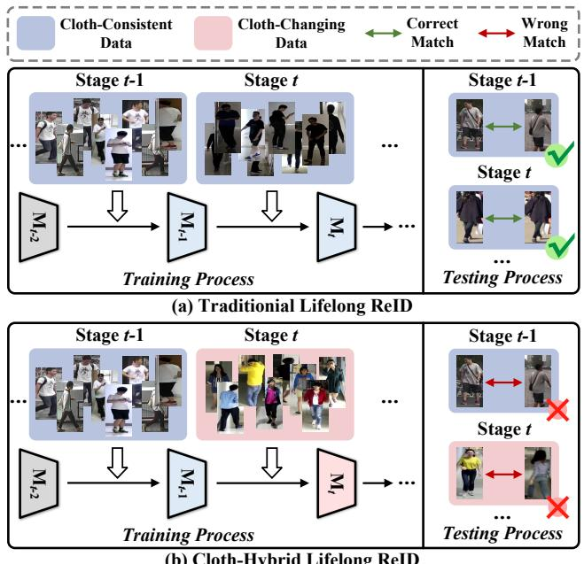

# DKC: Differentiated Knowledge Consolidation for Cloth-Hybrid Lifelong Person Re-identification

Zhenyu Cui, Jiahuan Zhou, Yuxin Peng Wangxuan Institute of Computer Technology, Peking University cuizhenyu@stu.pku.edu.cn, {jiahuanzhou,pengyuxin}@pku.edu.cn

## Abstract

Lifelong person re-identification (LReID) aims to match the same person using sequentially collected data. However, due to the long-term nature of lifelong learning, the inevitable changes in human clothes prevent the modelfrom relying on unified discriminative information (e.g., clothing style) to match the same person in the streaming data, demanding differentiated cloth-irrelevant information. Unfortunately, existing LReID methods typically fail to leverage such knowledge resulting in the exacerbation of catastrophic forgetting issues. Therefore, in this paper, we focus on a challenging practical task called Cloth-Hybrid Lifelong Person Re-identification (CH-LReID), which requires matching the same person wearing different clothes using sequentially collected data. A Differentiated Knowledge Consolidation (DKC) framework is designed to unify and balance distinct knowledge across streaming data. The core idea is to adaptively balance differentiated knowledge and compatibly consolidate cloth-relevant and cloth-irrelevant information. To this end, a Differentiated Knowledge Transfer (DKT) module and a Latent Knowledge Consolidation (LKC) module are designed to adaptively discover differentiated new knowledge, while eliminating the derived domain shift of old knowledge via reconstructing the old latent feature space, respectively. Then, to further alleviate the catastrophic conflict between differentiated new and old knowledge, we further propose a Dual-level Distribution Alignment (DDA) module to align the distribution of discriminative knowledge at both the instance level and the fine-grained level. Extensive experiments on multiple benchmarks demonstrate the superiority of our method against existing methods in both CH-LReID and traditional LReID tasks. The source code of this paper is available at https://github.com/PKU-ICST-MIPL/DKC-CVPR2025.

(b) Cloth-Hybrid Lifelong ReID

Figure 1. Comparison of (a) the traditional Lifelong Person Reidentification (LReID) task and (b) the Cloth-Hybrid Lifelong Person Re-identification (CH-LReID) task.

## 1. Introduction

Lifelong person re-identification (LReID) aims to match the same person by continuously learning from sequentially collected data [17, 31, 32]. Similar to most lifelong learning methods [39, 43], LReID typically suffers from the catastrophic forgetting problem [5, 15]. To this end, reply-based LReID methods [29, 41] preserve old knowledge by rehearsing historical data, while non-exemplar LReID methods [17, 22, 33, 34] employ knowledge distillation [6] to avoid the involvement of historical data due to the data privacy issue [4], aiming to balance the discriminative identity features across streaming data, e.g., clothing style and body shape information.

However, considering the long-term nature of LReID, human clothing often changes irregularly [20, 37] throughout the lifelong learning process, which hinders the LReID model from balancing the discriminative identity information of each person. As shown in Fig. 1, the appearance variety of the same person due to the cloth-changing issue requires the acquisition and anti-forgetting of identity discriminative knowledge from both cloth-consistent and cloth-changing data, termed the cloth-hybrid scenario. Specifically, while cloth-relevant information (e.g., clothing style) is often discriminative in the cloth-consistent data, it is not always effective or even harmful in the clothchanging one. As Fig. 2(a) shows, variant appearance brought by distinct clothes makes it difficult to continuously match the same person in both scenarios and vice versa, which requires accumulating cloth-relevant knowledge as well as cloth-irrelevant knowledge, e.g., the body, figure, and shape. Unfortunately, existing methods fail to balance such significantly differentiated knowledge since they typically exacerbate the catastrophic knowledge conflict challenge that demands balancing between cloth-relevant and cloth-irrelevant discriminative knowledge. Although the recent study [36] attempts to introduce the cloth-changing data during lifelong learning, its practicality in ReID scenarios with privacy requirements is severely limited due to its heavy reliance on old data and clothing labels.

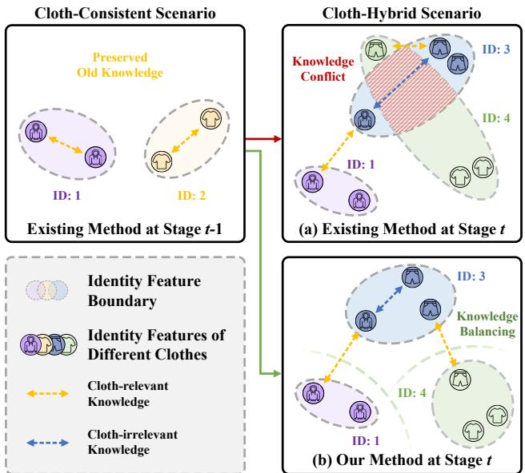  
Figure 2. Comparison of different LReID methods when facing the cloth-hybrid scenario. Existing methods(a) indiscriminately capture and preserve conflict discriminative information, while our method(b) adaptively unifies such knowledge across streaming data, achieving differentiated knowledge balancing.

Inspired by the above observations, in this paper, we focus on a practical but challenging task, called Cloth-Hybrid Lifelong Person Re-identification (CH-LReID), which aims to employ streaming cloth-consistent and cloth-changing data to perform lifelong learning in both scenarios. Its core challenge is how to balance cloth-relevant and clothirrelevant knowledge in the lifelong process and alleviate the derived knowledge conflicts in a compatible way. To this end, we proposed a Differentiated Knowledge Consolidation (DKC) framework for the CH-LReID task, which aims to balance the differentiated discriminative information in the cloth-hybrid scenario, as shown in Fig. 2(b). Specifically, to adaptively discover new cloth-relevant and cloth-irrelevant knowledge from streaming data, we first proposed a Differentiated Knowledge Transfer (DKT) module and selectively combine them based on the clustered fine-grained label. Besides, we further designed a Latent Knowledge Consolidation (LKC) module to eliminate the derived domain shift problem by reconstructing the old latent feature space. Finally, a Dual-level Distribution Alignment (DDA) module is proposed to unify the differentiated knowledge at different levels in a compatible way.

In summary, the main contributions of this paper are as follows: (1) A Differentiated Knowledge Consolidation (DKC) framework is proposed to solve the Cloth-Hybrid Lifelong Person re-identification task, which requires matching the same person using streaming clothconsistent and cloth-changing data collected from clothhybrid scenarios. (2) To continuously capture new discriminative knowledge, a Differentiated Knowledge Transfer (DKT) module is proposed to adaptively combine the clothrelevant and cloth-irrelevant knowledge by fine-grained clustering. (3) A Latent Knowledge Consolidation is designed to consolidate the learned knowledge by reconstructing the old latent feature space using the combined knowledge. (4) A Dual-level Distribution Alignment (DDA) module is proposed to balance conflict knowledge distribution compatibly at both the instance level and fine-grained level.

## 2. Related work

## 2.1. Lifelong Person Re-identification

Different from other recognition tasks [3, 23, 42, 44, 47– 49], Lifelong person Re-IDentification (LReID) pursues the overall performance of multiple datasets by continuously training on them sequentially [19, 33, 41]. Its core challenge is avoiding severe performance degradation on historical data when adapting to new data due to the catastrophic forgetting problem. To this end, exemplar replybased methods [29, 41] employ a historical data memory to rehearse old data when training on the new data. However, despite some progress, these methods often exhibit a significant performance decline in the data privacy scenario [4] that prohibits data replay. Therefore, non-exemplar LReID methods [18, 22, 33] aim to utilize old models or prototypes for knowledge distillation to promote the preservation of old knowledge, which have demonstrated impressive performance in the clothing-consistent scenario through affinity rectification [34] and distribution-aware prototyping [33]. Despite some preliminary attempts [26, 36] in cloth-changing data, their privacy and practicality are severely limited due to their heavy reliance on historical data, additional models, and clothing labels.

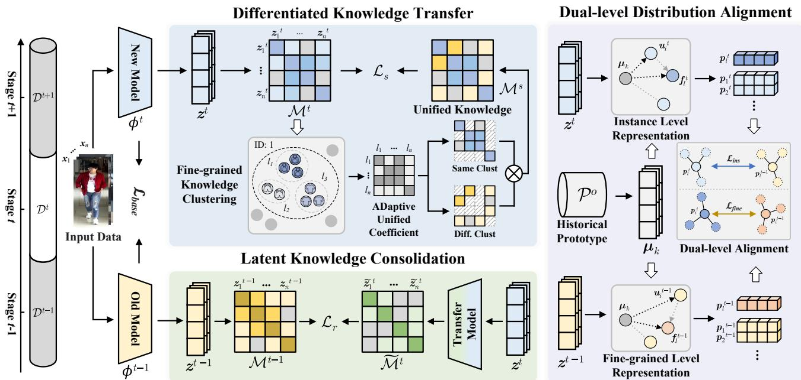  
Figure 3. The pipeline of our proposed Differentiated Knowledge Consolidation (DKC) method, which consists of a Differentiated Knowledge Adaptation (DKA) network, a Latent Knowledge Consolidation (LKC) module, and a Dual-level Distribution Alignment (DDA) module. During the training phase, all the above components are employed, while only the latest backbone network is retained during the inference phase for ReID in both cloth-consistent and cloth-hybrid scenarios.

## 2.2. Cloth-changing Person Re-identification

Cloth-changing Person Re-identification (CC-ReID) aims to match the same person wearing different clothes [20, 35]. Its key challenge is how to distinguish distinct people wearing similar clothes while matching the same person wearing various ones. To tackle the above issue, existing methods [2, 7, 27] typically disentangle clothes-irrelevant information (e.g., face, shape) from the interference of clothing style. Among them, some methods [2, 14, 38] introduce external knowledge (e.g., clothing label, silhouette, body component annotations, etc.) to force the model to extract discriminative information irrelevant to clothing styles. Despite some progress, the practicality of these methods is limited due to the heavy dependence on massive extra data. Therefore, other methods [11, 27, 40] are devoted to performing disentangling from the original image without any auxiliary information, achieving compatible performance while improving the applicability. However, though existing CC-ReID methods demonstrate their superiority on single, static datasets, they usually suffer from severe performance degradation when continuously learning multiple streaming datasets [17, 43], primarily due to the wellknown catastrophic forgetting challenge [43]. Different from the above methods, we propose a differentiated knowledge consolidation method for cloth-hybrid LReID scenarios, which requires balancing both cloth-relevant and clothirrelevant knowledge when training on cloth-consistent or cloth-changing data sequentially.

## 3. Method

## 3.1. Preliminary

This paper focuses on cloth-hybrid lifelong person reidentification (CH-LReID) task, which aims to sequentially learn on T datasets $\mathcal { D } = \{ \mathcal { D } ^ { 1 } , \mathcal { D } ^ { 2 } , . . . , \mathcal { D } ^ { T } \}$ , where each dataset can be either cloth-consistent or cloth-changing data collected from cloth-hybrid scenario. When learning on the Dt dataset, the previous t−1 datasets are unavailable, while the images with the corresponding identity labels of the current t-th dataset are only available, considering the agnostic nature of clothing labels since cloth-consistent and clothchanging data are typically collected in a uniform manner in practice. During the inference phase, both cloth-consistent and cloth-hybrid scenarios are considered to evaluate the overall performance of the LReID model.

## 3.2. Overview of DKC

The pipeline of our proposed DKC is shown in Fig. 3, which consists of a Differentiated Knowledge Transfer (DKT) module, a Latent Knowledge Consolidation (LKC) module and a Dual-level Distribution Alignment (DDA) module.

## 3.3. Baseline Method

The baseline method of our DKC is derived from traditional LReID methods [22, 34], which extract features for each input image and utilize a classifier to predict each identity. Formally, given a set of the input image $\{ x _ { i } , y _ { i } \} _ { i = 1 } ^ { B } \in { \mathcal { D } } ^ { t }$ with batch size of $B ,$ , a backbone network $\phi ^ { t } ( \cdot )$ is utilized to extract the deep feature $z _ { i }$ for each $x _ { i }$ . Then, a classifier head $\psi ^ { t } ( \cdot )$ with an average pooling layer and a batch normalization [10] layer is employed to predict the probability $y _ { i } ^ { \prime }$ for each identity.

To achieve a preliminary balance between knowledge acquisition and anti-forgetting, we introduce a distributionaware prototyping method [33] to construct a baseline model for our DKC to model both old and new knowledge in streaming datasets. Specifically, a distributionaware cross-entropy loss $\mathcal { L } _ { c e - d }$ and triplet loss $\mathcal { L } _ { t r i p - d }$ is employed to learn distribution knowledge in $\mathcal { D } ^ { t }$ , while a prototype knowledge transfer loss $\mathcal { L } _ { p r o t o - d }$ is used to alleviate the catastrophic forgetting problem on the previous $t - 1$ datasets. Therefore, the overall loss function $\mathcal { L } _ { b a s e }$ of our baseline model can be formulated as follows:

$$
\mathcal { L } _ { b a s e } = \mathcal { L } _ { c e - d } + \mathcal { L } _ { t r i p - d } + \mathcal { L } _ { p r o t o - d } .\tag{1}
$$

Despite some progress in the cloth-consistent scenario, the performance of the baseline method usually degrades severely in cloth-hybrid scenarios when it comes to the catastrophic knowledge conflict between cloth-relevant and cloth-irrelevant knowledge. To this end, we further propose the Differentiated Knowledge Transfer (DKT) module, the Latent Knowledge Consolidation (LKC) module, and the Dual-level Distribution Alignment (DDA) module which will be detailed in the following sections.

## 3.4. Differentiated Knowledge Transfer

Differentiated Knowledge Transfer (DKT) aims to automatically discover and adaptively learn new knowledge. To this end, when training on the t-th stage, we first use DB-SCAN to cluster the fine-grained features of each person in $\mathcal { D } ^ { t }$ and obtain the fine-grained labels $l _ { i }$ of each input image $x _ { i } .$ , where images with the same label share similar clothrelevant information (e.g., clothing style). Note that different people do not share the same fine-grained clothing label. Therefore, image pairs of the same person with different $l _ { i }$ represent potentially conflicting knowledge which has not been learned well by the old model. As a result, DKC can dynamically learn each dataset based on whether there are people with different clothes, alleviating the underfitting of the cloth-consistent scenario.

To balance the new cloth-irrelevant knowledge and the old cloth-relevant knowledge, DKC first transfers the old knowledge into the new feature space by distilling sample pairs with different fine-grained clothing labels differently.

Specifically, given the deep feature $z _ { i } ^ { t } = \phi ^ { t } ( x _ { i } )$ extracted by the model training on the t-th stage, the pair-wise similarity matrix $\mathcal { M } ^ { t }$ can be calculated as follows:

$$
\mathcal { M } _ { i , j } ^ { t } = \frac { \exp ( c o s ( z _ { i } ^ { t } , z _ { j } ^ { t } ) ) } { \sum _ { k = 1 } ^ { B } \exp ( c o s ( z _ { i } ^ { t } , z _ { k } ^ { t } ) ) } ,\tag{2}
$$

where $c o s ( \cdot )$ denotes the cosine similarity. Similarly, a similarity matrix $\mathcal { M } ^ { t - 1 }$ based on the old model $\phi ^ { t - 1 } ( \cdot )$ is employed to represent the old relationship within the old feature space. Then, a fused matrix $\mathcal { M } ^ { s }$ is employed to unify the old knowledge and the differentiated new knowledge:

$$
\begin{array} { r } { \mathcal { M } ^ { s } = \left\{ \begin{array} { l c l } { \alpha \mathcal { M } _ { i , j } ^ { t - 1 } + ( 1 - \alpha ) \mathcal { M } _ { i , j } ^ { t } , } & { l _ { i } \neq l _ { j } \& y _ { i } = y _ { j } } \\ { ( 1 - \alpha ) \mathcal { M } _ { i , j } ^ { t - 1 } + \alpha \mathcal { M } _ { i , j } ^ { t } , } & { l _ { i } = l _ { j } \& y _ { i } = y _ { j } , } \\ { \mathcal { M } _ { i , j } ^ { t - 1 } , } & { y _ { i } \neq y _ { j } } \end{array} \right. } \end{array}\tag{3}
$$

where $\alpha$ is an adaptive unified coefficient. When learning on two instances of the same identity have the same $l _ { i } ,$ , the learned new knowledge derived from the old model typically has limited variation. Therefore, explicitly learning new knowledge with a high ratio(α) can facilitate adaptation to new data regardless of knowledge conflicts. In contrast, $\mathcal { M } ^ { s }$ moderately transfers the differentiated new knowledge to alleviate the forgetting of conflict old knowledge by leveraging a low-level coefficient( $1 - \alpha )$ for the relationship with distinct $l _ { i } .$ Therefore, $\mathcal { M } ^ { s }$ adaptively balances the discrepancy between cloth-relevant and clothirrelevant knowledge by dynamically adjusting the learning degree to new knowledge.

Then, to facilitate the combined knowledge to guide the learning of the new model, a Kullback-Leibler (KL) divergence-based knowledge distillation loss $\mathcal { L } _ { s }$ is imposed to optimize the affinity matrix output by the new model:

$$
\mathcal { L } _ { s } = - \sigma ( \mathcal { M } ^ { s } ) \cdot l o g \left( \frac { \sigma ( \mathcal { M } ^ { s } ) } { \sigma ( \mathcal { M } ^ { t } ) } \right) ,\tag{4}
$$

where $\sigma ( \cdot )$ denotes L1-normalization.

## 3.5. Latent Knowledge Consolidation

Despite the adaptive unified differentiated knowledge, severe knowledge changes in different scenarios inevitably aggravate the domain gap, exacerbating the catastrophic forgetting problem. Therefore, we further consolidate the discrimination of old features by reconstructing the old feature space. Specifically, given the deep feature $z _ { i } ^ { t }$ extracted by the new model, a transfer network $g _ { t } ( \cdot )$ consists of RBT blocks [25] is designed to map $\boldsymbol { z } _ { i } ^ { t }$ to the old feature space, which consists of linear layers, batch normalization [10] and activation function [8]. Therefore, the reconstructed features $\widetilde { z } ^ { t }$ can be calculated by $\widetilde { z } ^ { t } = g _ { t } ( z ^ { t } )$

Then, to further reduce the domain gap before and after the knowledge transfer, we impose the reconstructed features to have exactly similar discrimination as the old features to constrain the old feature space to become a subset of the new feature space. Therefore, the reconstruction loss $\mathcal { L } _ { r }$ can be estimated as follows:

$$
\mathcal { L } _ { r } = - \sigma ( \mathcal { M } ^ { t - 1 } ) \cdot l o g \left( \frac { \sigma ( \mathcal { M } ^ { t - 1 } ) } { \sigma ( \widetilde { \mathcal { M } } ^ { t } ) } \right) ,\tag{5}
$$

where the reconstructed matrix $\widetilde { \mathcal { M } } ^ { t }$ is calculated using $\widetilde { z } ^ { t }$

Therefore, the discrepancy between new and old knowledge can be formally calculated as follows:

$$
\begin{array} { r } { \mathcal { L } _ { s r } = \mathcal { L } _ { s } + \mathcal { L } _ { r } . } \end{array}\tag{6}
$$

In this way, new differential knowledge can be accumulated continuously in a progressive way and keep the old knowledge from catastrophic forgetting in the consolidated new feature space.

## 3.6. Dual-level Distribution Alignment

Although the aforementioned DKT and LKC modules achieve adaptively discovering and balancing new differentiated knowledge with the old one, the discriminability of the transferred new knowledge in new data is sacrificed due to the compromised merging. Specifically, considering that both new and old knowledge is merely combined at the instance level, the consistency of the same person with different or similar clothes is inevitably traded off by the mutual influence of differentiated knowledge thus sacrificing its discriminability. To this end, we further proposed the Dual-level Distribution Alignment (DDA) module to align the differentiated distributions at different levels.

Formally, we start by using the final model $\phi ^ { t - 1 } ( \cdot )$ trained in the (t − 1)-th stage to extract the old prototype $\mathcal { P } ^ { o } ~ = ~ \{ \mu _ { k } \} _ { k = 1 } ^ { n _ { o } }$ of samples in $\mathcal { D } _ { t - 1 }$ to construct the old knowledge in the t-th stage, where $n _ { o }$ is the number of the identity. Then, let $\{ { \pmb u } _ { i } ^ { t } \} _ { i = 1 } ^ { n _ { l } }$ be $n _ { l }$ features of the fine-grained label l extracted by $\phi ^ { t } ( \cdot )$ in a batch, the fine-grained feature center can be calculated as follows:

$$
\mathbf { \Delta } f _ { l } ^ { t } = - \frac { 1 } { n _ { l } } \sum _ { i = 1 } ^ { n _ { l } } \mathbf { \Delta } u _ { i } ^ { t } .\tag{7}
$$

Then, the fine-grained level representation of new knowledge $p _ { l } ^ { t } \in \mathbb { R } ^ { n _ { l } ^ { \bar { t } } \times n _ { o } }$ in the t-th stage can be calculated by the high dimensional scalar product:

$$
\pmb { p } _ { l } ^ { t } = S o f t m a x ( \pmb { f } _ { l } ^ { t } \cdot \pmb { \mu } _ { k } ^ { \top } / \tau ) ,\tag{8}
$$

where τ is a temperature coefficient. Similarly, based on the features extracted by $\phi ^ { t - 1 } ( \cdot )$ , we can get the representation of the old knowledge $\pmb { p } _ { l } ^ { t - 1 } \in \mathbb { R } ^ { n _ { l } ^ { t - 1 } \times n _ { c } }$ in the old feature space. Then, to ensure the consistency between the new and old knowledge at the fine-grained level, we employ Eq. (2) to calculate the self-similarity matrices $\mathcal { M } _ { p } ^ { t } , \bar { \mathcal { M } } _ { p } ^ { t - 1 }$ based on ${ \mathbf { } } p _ { l } ^ { t } , { \mathbf { } } p _ { l } ^ { t - 1 }$ , and align the above distributions by optimizing the fine-grained level alignment loss $\mathcal { L } _ { f i n e } \mathrm { : }$

$$
\mathcal { L } _ { f i n e } = - \sigma ( \mathcal { M } _ { p } ^ { t - 1 } ) \cdot l o g \left( \frac { \sigma ( \mathcal { M } _ { p } ^ { t - 1 } ) } { \sigma ( \mathcal { M } _ { p } ^ { t } ) } \right) .\tag{9}
$$

The above fine-grained level distribution alignment sacrifices cloth-irrelevant knowledge while emphasizing clothconsistent knowledge. Therefore, to avoid the above conflict knowledge, instance level alignment loss is introduced to enable cloth-irrelevant and cloth-relevant knowledge to coexist in a compatible manner. Specifically, we model the distribution of old features $\displaystyle \boldsymbol { \mathbf { \mathit { u } } } _ { i } ^ { t - 1 }$ through Eq. (7) and Eq. (8), and obtain the instance level alignment loss $\mathcal { L } _ { i n s } .$ thus balancing the discriminative cloth-irrelevant knowledge.

To sum up, the total loss for the DDA module can be calculated as follows:

$$
\mathcal { L } _ { d d a } = \beta \mathcal { L } _ { i n s } + ( 1 - \beta ) \mathcal { L } _ { f i n e } ,\tag{10}
$$

where $\beta$ is an alignment coefficient.

## 3.7. Objective Function

In all, the total loss L of our DKC is formulated as follows:

$$
\mathcal { L } = \mathcal { L } _ { b a s e } + \mu _ { 1 } \mathcal { L } _ { s r } + \mu _ { 2 } \mathcal { L } _ { d d a } .\tag{11}
$$

where $\mu _ { 1 }$ and $\mu _ { 2 }$ denote two hyper-parameters.

## 4. Experiments

## 4.1. Datasets and Evaluation Metrics

Datasets. To verify the effectiveness of our method, we construct two benchmarks for cloth-hybrid lifelong person ReID task based on 5 popular cloth-consistent datasets, including Market-1501 (Market) [45], CUHK-SYSU [30], DukeMTMC-ReID (Duke) [46], MSMT17-V2 (MSMT17) [28] and CUHK03 [13], and 2 cloth-changing datasets, including LTCC [20] and PRCC [37]. To comprehensively verify the performance in cloth-hybrid scenarios, two training orders for CH-LReID are conducted as Order-1: Market→LTCC→PRCC→MSMT17→CUHK03 and Order-2: MSMT17→PRCC→Market→CUHK03→LTCC. Additionally, two existing cloth-consistent orders [17], marked as Order-3: Market→CUHK-SYSU→ Duke→MSMT17→CUHK03 and Order-4: Duke→MSMT17→Market→CUHK-SYSU →CUHK03 are also adopted to verify the generalization and robustness of the proposed method in real scenarios.

Evaluation Metrics. We employ three metrics, including Rank-1 accuracy (R1) [16], mean Average Precision (mAP) [45], and Average Forgetting (AF) [1] score to evaluate the effectiveness of our method on all datasets, where both cloth-consistent and cloth-changing performance are reported after sequential training on each dataset.

<table><tr><td rowspan=2 colspan=2>Method</td><td rowspan=1 colspan=6>Cloth-Consistent</td><td rowspan=1 colspan=3>Cloth-Changing</td><td rowspan=2 colspan=1>Average</td></tr><tr><td rowspan=1 colspan=1>od</td><td rowspan=1 colspan=1>Market</td><td rowspan=1 colspan=1>LTCC</td><td rowspan=1 colspan=1>PRCC</td><td rowspan=1 colspan=1>MSMT17</td><td rowspan=1 colspan=1>CUHK03</td><td rowspan=1 colspan=1>Average</td><td rowspan=1 colspan=1>LTCC</td><td rowspan=1 colspan=1>PRCC</td><td rowspan=1 colspan=1>Average</td></tr><tr><td rowspan=1 colspan=2></td><td rowspan=1 colspan=1>mAP R1</td><td rowspan=1 colspan=1>mAP R1</td><td rowspan=1 colspan=1>mAP R1</td><td rowspan=1 colspan=1>mAP R1</td><td rowspan=1 colspan=1>mAP R1</td><td rowspan=1 colspan=1>mAP R1</td><td rowspan=1 colspan=1>mAP R1</td><td rowspan=1 colspan=1>mAP R1</td><td rowspan=1 colspan=1>mAP R1</td><td rowspan=1 colspan=1>mAP R1</td></tr><tr><td rowspan=1 colspan=2>Joint</td><td rowspan=1 colspan=1>64.1 82.5</td><td rowspan=1 colspan=1>42.6 62.1</td><td rowspan=1 colspan=1>94.6 98.7</td><td rowspan=1 colspan=1>18.4 40.8</td><td rowspan=1 colspan=1>44.4 46.4</td><td rowspan=1 colspan=1>52.8 66.1</td><td rowspan=1 colspan=1>10.1 23.0</td><td rowspan=1 colspan=1>32.7 33.8</td><td rowspan=1 colspan=1>21.4 28.4</td><td rowspan=1 colspan=1>43.8 55.3</td></tr><tr><td rowspan=1 colspan=2>+DSIFLF [14]</td><td rowspan=1 colspan=1>44.872.5</td><td rowspan=1 colspan=1>26.1 53.7</td><td rowspan=1 colspan=1>95.6 99.6</td><td rowspan=1 colspan=1>7.1 24.7</td><td rowspan=1 colspan=1>5.2 6.9</td><td rowspan=1 colspan=1>35.851.5</td><td rowspan=1 colspan=1>7.417.3</td><td rowspan=1 colspan=1>44.546.7</td><td rowspan=1 colspan=1>26.032.0</td><td rowspan=1 colspan=1>33.045.9</td></tr><tr><td rowspan=1 colspan=2>SFT</td><td rowspan=1 colspan=1>28.5 52.0</td><td rowspan=1 colspan=1>28.5 49.3</td><td rowspan=1 colspan=1>92.5 97.3</td><td rowspan=1 colspan=1>7.019.6</td><td rowspan=1 colspan=1>44.045.6</td><td rowspan=1 colspan=1>40.1 52.8</td><td rowspan=1 colspan=1>6.915.3</td><td rowspan=1 colspan=1>21.8 21.2</td><td rowspan=1 colspan=1>14.4 18.3</td><td rowspan=1 colspan=1>32.7 42.9</td></tr><tr><td rowspan=1 colspan=2>+DSIFLF [14]</td><td rowspan=1 colspan=1>7.035.5</td><td rowspan=1 colspan=1>9.441.0</td><td rowspan=1 colspan=1>91.7 96.1</td><td rowspan=1 colspan=1>0.50.8</td><td rowspan=1 colspan=1>3.5 3.5</td><td rowspan=1 colspan=1>22.435.4</td><td rowspan=1 colspan=1>3.812.8</td><td rowspan=1 colspan=1>34.337.1</td><td rowspan=1 colspan=1>19.1 25.0</td><td rowspan=1 colspan=1>21.532.4</td></tr><tr><td rowspan=1 colspan=2>LwF[12]</td><td rowspan=1 colspan=1>44.5 65.8</td><td rowspan=1 colspan=1>21.6 40.0</td><td rowspan=1 colspan=1>87.4 91.3</td><td rowspan=1 colspan=1>4.011.6</td><td rowspan=1 colspan=1>25.5 25.0</td><td rowspan=1 colspan=1>36.646.7</td><td rowspan=1 colspan=1>5.912.5</td><td rowspan=1 colspan=1>25.9 26.7</td><td rowspan=1 colspan=1>15.9 19.6</td><td rowspan=1 colspan=1>30.7 39.0</td></tr><tr><td rowspan=1 colspan=2>AKA [17]</td><td rowspan=1 colspan=1>48.069.5</td><td rowspan=1 colspan=1>25.445.1</td><td rowspan=1 colspan=1>88.1 93.3</td><td rowspan=1 colspan=1>4.212.0</td><td rowspan=1 colspan=1>31.231.2</td><td rowspan=1 colspan=1>39.4 50.2</td><td rowspan=1 colspan=1>6.512.8</td><td rowspan=1 colspan=1>26.526.7</td><td rowspan=1 colspan=1>16.519.8</td><td rowspan=1 colspan=1>32.841.5</td></tr><tr><td rowspan=1 colspan=2>PatchKD [22]</td><td rowspan=1 colspan=1>68.0 85.5</td><td rowspan=1 colspan=1>30.854.7</td><td rowspan=1 colspan=1>93.5 96.5</td><td rowspan=1 colspan=1>5.7 15.6</td><td rowspan=1 colspan=1>33.2 32.9</td><td rowspan=1 colspan=1>46.2 57.0</td><td rowspan=1 colspan=1>7.217.9</td><td rowspan=1 colspan=1>26.1 26.0</td><td rowspan=1 colspan=1>16.722.0</td><td rowspan=1 colspan=1>37.8 47.0</td></tr><tr><td rowspan=1 colspan=2>LSTKC [34]</td><td rowspan=1 colspan=1>39.9 63.4</td><td rowspan=1 colspan=1>39.6 65.4</td><td rowspan=1 colspan=1>95.9 98.9</td><td rowspan=1 colspan=1>11.529.2</td><td rowspan=1 colspan=1>48.1 50.1</td><td rowspan=1 colspan=1>47.061.4</td><td rowspan=1 colspan=1>8.319.4</td><td rowspan=1 colspan=1>24.022.9</td><td rowspan=1 colspan=1>16.2 21.2</td><td rowspan=1 colspan=1>38.2 49.9</td></tr><tr><td rowspan=1 colspan=2>USP [36]</td><td rowspan=1 colspan=1>66.3 74.9</td><td rowspan=1 colspan=1>37.2 49.6</td><td rowspan=1 colspan=1>88.8 92.6</td><td rowspan=1 colspan=1>6.614.6</td><td rowspan=1 colspan=1>38.7 33.9</td><td rowspan=1 colspan=1>47.5 53.1</td><td rowspan=1 colspan=1>7.817.3</td><td rowspan=1 colspan=1>25.7 23.6</td><td rowspan=1 colspan=1>16.8 20.5</td><td rowspan=1 colspan=1>38.7 43.8</td></tr><tr><td rowspan=1 colspan=2>DKP [33]</td><td rowspan=1 colspan=1>51.3 73.0</td><td rowspan=1 colspan=1>44.2 68.6</td><td rowspan=1 colspan=1>98.4 99.4</td><td rowspan=1 colspan=1>13.531.6</td><td rowspan=1 colspan=1>39.5 40.6</td><td rowspan=1 colspan=1>49.4 62.6</td><td rowspan=1 colspan=1>9.321.4</td><td rowspan=1 colspan=1>35.534.8</td><td rowspan=1 colspan=1>22.4 28.1</td><td rowspan=1 colspan=1>41.7 52.8</td></tr><tr><td rowspan=1 colspan=2>Ours</td><td rowspan=1 colspan=1>57.9 78.5</td><td rowspan=1 colspan=1>49.2 72.4</td><td rowspan=1 colspan=1>98.6 99.5</td><td rowspan=1 colspan=1>16.2 36.7</td><td rowspan=1 colspan=1>40.7 42.4</td><td rowspan=1 colspan=1>52.5 65.9</td><td rowspan=1 colspan=1>10.1 25.5</td><td rowspan=1 colspan=1>36.9 35.5</td><td rowspan=1 colspan=1>23.5 30.5</td><td rowspan=1 colspan=1>44.2 55.8</td></tr></table>

Table 1. Performance on training Order-1: Market→LTCC→PRCC→MSMT17→CUHK03.

<table><tr><td rowspan=3 colspan=5>Method</td><td rowspan=1 colspan=6>Cloth-Consistent</td><td rowspan=1 colspan=3>Cloth-Changing</td><td rowspan=2 colspan=1>Average</td></tr><tr><td rowspan=1 colspan=3>d</td><td rowspan=1 colspan=1>MSMT17</td><td rowspan=1 colspan=1>PRCC</td><td rowspan=1 colspan=1>Market</td><td rowspan=1 colspan=1>CUHK03</td><td rowspan=1 colspan=1>LTCC</td><td rowspan=1 colspan=1>Average</td><td rowspan=1 colspan=1>PRCC</td><td rowspan=1 colspan=1>LTCC</td><td rowspan=1 colspan=1>Average</td></tr><tr><td rowspan=1 colspan=1>mAP R1</td><td rowspan=1 colspan=1>mAP R1</td><td rowspan=1 colspan=1>mAP R1</td><td rowspan=1 colspan=1>mAP R1</td><td rowspan=1 colspan=1>mAP R1</td><td rowspan=1 colspan=1>mAP R1</td><td rowspan=1 colspan=1>mAP R1</td><td rowspan=1 colspan=1>mAP R1</td><td rowspan=1 colspan=1>mAP R1</td><td rowspan=1 colspan=1>mAP R1</td></tr><tr><td rowspan=1 colspan=5>Joint</td><td rowspan=1 colspan=1>18.4 40.8</td><td rowspan=1 colspan=1>94.6 98.7</td><td rowspan=1 colspan=1>64.1 82.5</td><td rowspan=1 colspan=1>44.4 46.4</td><td rowspan=1 colspan=1>42.6 62.1</td><td rowspan=1 colspan=1>52.8 66.1</td><td rowspan=1 colspan=1>32.7 33.8</td><td rowspan=1 colspan=1>10.1 23.0</td><td rowspan=1 colspan=1>21.4 28.4</td><td rowspan=1 colspan=1>43.8 55.3</td></tr><tr><td rowspan=1 colspan=5>+DSIFLF [14]</td><td rowspan=1 colspan=1>7.1 24.7</td><td rowspan=1 colspan=1>95.6 99.6</td><td rowspan=1 colspan=1>44.872.5</td><td rowspan=1 colspan=1>5.26.9</td><td rowspan=1 colspan=1>26.153.7</td><td rowspan=1 colspan=1>35.851.5</td><td rowspan=1 colspan=1>44.546.7</td><td rowspan=1 colspan=1>7.417.3</td><td rowspan=1 colspan=1>26.032.0</td><td rowspan=1 colspan=1>33.045.9</td></tr><tr><td rowspan=2 colspan=5>SFT+DSIFLF [14]</td><td rowspan=1 colspan=1>2.49.1</td><td rowspan=1 colspan=1>84.5 95.9</td><td rowspan=1 colspan=1>16.9 37.2</td><td rowspan=1 colspan=1>8.28.8</td><td rowspan=1 colspan=1>37.9 57.6</td><td rowspan=1 colspan=1>30.0 41.7</td><td rowspan=1 colspan=1>21.9 24.3</td><td rowspan=1 colspan=1>9.120.9</td><td rowspan=1 colspan=1>15.5 22.6</td><td rowspan=1 colspan=1>25.8 36.3</td></tr><tr><td rowspan=1 colspan=2>E[1</td><td rowspan=1 colspan=2>[14]</td><td rowspan=1 colspan=1>2.914.2</td><td rowspan=1 colspan=1>94.7 98.8</td><td rowspan=1 colspan=1>9.1 37.8</td><td rowspan=1 colspan=1>3.05.0</td><td rowspan=1 colspan=1>1.3 4.8</td><td rowspan=1 colspan=1>22.232.1</td><td rowspan=1 colspan=1>34.837.3</td><td rowspan=1 colspan=1>2.22.8</td><td rowspan=1 colspan=1>18.5 20.1</td><td rowspan=1 colspan=1>21.1 28.7</td></tr><tr><td rowspan=1 colspan=2>LwF[12]</td><td rowspan=1 colspan=3></td><td rowspan=1 colspan=1></td><td rowspan=1 colspan=1>12.7 28.8</td><td rowspan=1 colspan=1>91.3 95.5</td><td rowspan=1 colspan=1>25.2 49.0</td><td rowspan=1 colspan=1>8.68.0</td><td rowspan=1 colspan=1>41.9 63.3</td><td rowspan=1 colspan=1>35.9 48.9</td><td rowspan=1 colspan=1>27.9 28.3</td><td rowspan=1 colspan=1>8.718.4</td><td rowspan=1 colspan=1>18.3 23.4</td></tr><tr><td rowspan=1 colspan=5>AKA [17]</td><td rowspan=1 colspan=1>15.032.4</td><td rowspan=1 colspan=1>93.097.0</td><td rowspan=1 colspan=1>26.651.0</td><td rowspan=1 colspan=1>13.4 11.6</td><td rowspan=1 colspan=1>43.464.0</td><td rowspan=1 colspan=1>38.351.2</td><td rowspan=1 colspan=1>28.2 27.7</td><td rowspan=1 colspan=1>8.4 15.8</td><td rowspan=1 colspan=1>18.3 21.8</td><td rowspan=1 colspan=1>32.642.8</td></tr><tr><td rowspan=1 colspan=5>PatchKD [22]</td><td rowspan=1 colspan=1>22.6 47.9</td><td rowspan=1 colspan=1>95.098.5</td><td rowspan=1 colspan=1>38.2 64.2</td><td rowspan=1 colspan=1>21.823.1</td><td rowspan=1 colspan=1>45.870.0</td><td rowspan=1 colspan=1>44.760.7</td><td rowspan=1 colspan=1>28.1 27.6</td><td rowspan=1 colspan=1>9.3 21.7</td><td rowspan=1 colspan=1>18.724.7</td><td rowspan=1 colspan=1>37.3 50.4</td></tr><tr><td rowspan=1 colspan=5>LSTKC [34]</td><td rowspan=1 colspan=1>6.920.492.8</td><td rowspan=1 colspan=1>97.0</td><td rowspan=1 colspan=1>39.8 64.3</td><td rowspan=1 colspan=1>25.2 26.0</td><td rowspan=1 colspan=1>51.1 65.5</td><td rowspan=1 colspan=1>43.254.6</td><td rowspan=1 colspan=1>27.327.0</td><td rowspan=1 colspan=1>10.922.4</td><td rowspan=1 colspan=1>19.1 24.7</td><td rowspan=1 colspan=1>36.346.1</td></tr><tr><td rowspan=1 colspan=5>USP [36]</td><td rowspan=1 colspan=1>22.7 37.2</td><td rowspan=1 colspan=1>92.5 95.9</td><td rowspan=1 colspan=1>37.853.5</td><td rowspan=1 colspan=1>17.314.6</td><td rowspan=1 colspan=1>63.572.4</td><td rowspan=1 colspan=1>46.854.7</td><td rowspan=1 colspan=1>28.7 29.4</td><td rowspan=1 colspan=1>11.9 26.0</td><td rowspan=1 colspan=1>20.327.7</td><td rowspan=1 colspan=1>39.2 47.0</td></tr><tr><td rowspan=1 colspan=5>DKP [33]</td><td rowspan=1 colspan=1>11.8 29.0|</td><td rowspan=1 colspan=1>96.7 98.8</td><td rowspan=1 colspan=1>46.0 69.8</td><td rowspan=1 colspan=1>29.9 30.9</td><td rowspan=1 colspan=1>55.8 75.8</td><td rowspan=1 colspan=1>48.0 60.9</td><td rowspan=1 colspan=1>34.1 34.6</td><td rowspan=1 colspan=1>11.6 24.2</td><td rowspan=1 colspan=1>22.929.4</td><td rowspan=1 colspan=1>40.8 51.9</td></tr><tr><td rowspan=1 colspan=5>Ours</td><td rowspan=1 colspan=1>15.4 35.3</td><td rowspan=1 colspan=1>98.1 99.0</td><td rowspan=1 colspan=1>51.8 72.7</td><td rowspan=1 colspan=1>31.9 32.1</td><td rowspan=1 colspan=1>57.2 77.9</td><td rowspan=1 colspan=1>50.9 63.4</td><td rowspan=1 colspan=1>38.2 37.9</td><td rowspan=1 colspan=1>13.0 27.0</td><td rowspan=1 colspan=1>25.6 32.5</td><td rowspan=1 colspan=1>43.7 54.6</td></tr></table>

Table 2. Performance on training Order-2: MSMT17→PRCC→Market→CUHK03→LTCC.

## 4.2. Implementation Details

We train our proposed DKC on NVIDIA A40 GPUs. In the training phase, we use the ResNet-50 [9] pre-trained on ImageNet [21] to initialize our backbone network. The SGD optimizer with a learning rate of $3 . 5 \times 1 0 ^ { - 4 }$ is used to optimize the whole model. Following [33], we train the model for 80 epochs in the first dataset and 60 epochs for the remains, where the iterations depend on the length of each dataset. The batch size is set to 128, where each identity has 4 images. We randomly sample 500 identities for each dataset during training, where insufficient datasets sample all identities. The hyper-parameters µ1, µ2 and coefficients α, β are set as 0.1, 0.1, 0.7 and 0.05, respectively.

## 4.3. Comparison with State-of-the-arts Methods

To verify the effectiveness of our method, we compared the proposed DKC to multiple SOTA methods on both CH-LReID and traditional LReID tasks, including LwF [12], AKA [17], PatchKD [22], LSTKC [34], USP [36], and DKP [33]. The latest CC-ReID method DSIFLF [14] is also employed with joint training (Joint) and sequential finetuning (SFT) settings. Note that the best results are bolded, while the sub-optimal results are underlined.

Comparison on the CH-LReID task. As shown in Tab. 1 and Tab. 2, our DKC achieves the SOTA performance on both cloth-consistent and cloth-changing datasets, finally achieving 44.2%/55.8% (Order-1) and 43.7%/54.6% (Order-2) on the average mAP/R1 accuracy, respectively. The above results support that our DKC can continuously discover and consolidate differentiated knowledge from cloth-consistent and cloth-changing data by adaptively learning new knowledge while consolidating old knowledge, thus effectively alleviating the catastrophic forgetting problem. In addition, as reported in Tab. 3, our DKC achieves the best average anti-forgetting performance, reaching 3.9%/4.3% on the average AF(mAP/R1) score. This is because our DKC mitigates the catastrophic conflict by compatibly aligning differentiated new and old knowledge distribution at different levels, thereby significantly enhancing the balance between the discriminative clothrelevant and cloth-irrelevant knowledge.

Comparison on the LReID task. To further verify the generalizability of our DKC in cloth-consistent scenarios, we conduct additional experiments on the traditional

<table><tr><td rowspan="2">Method</td><td>Cloth-Consistent</td><td>Cloth-Changing</td><td>Average</td></tr><tr><td>AF(mAP/R1)↓</td><td>AF(mAP/R1)↓</td><td>AF(mAP/R1)↓</td></tr><tr><td>LwF [12]</td><td>13.6/16.4</td><td>4.7/6.8</td><td>10.6/13.2</td></tr><tr><td>AKA [17]</td><td>12.9/13.8</td><td>5.0/6.8</td><td>10.2/11.4</td></tr><tr><td>LSTKC [34]</td><td>15.9/13.0</td><td>7.5/9.3</td><td>13.1/11.7</td></tr><tr><td>USP [36]</td><td>13.6/11.8</td><td>5.6/7.3</td><td>10.9/10.3</td></tr><tr><td>PatchKD [22]</td><td>6.3/6.3</td><td>4.5/5.4</td><td>5.7/6.0</td></tr><tr><td>DKP [33]</td><td>7.8/6.2</td><td>3.0/4.8</td><td>6.2/5.8</td></tr><tr><td>Ours</td><td>5.0/4.8</td><td>1.7/3.4</td><td>3.9/4.3</td></tr></table>

Table 3. AF performance on training Order-1.

<table><tr><td rowspan="2">Method</td><td colspan="2">Order-3</td><td colspan="2">Order-4</td><td colspan="2">Average</td></tr><tr><td>mAP</td><td>R1</td><td>mAP</td><td>R1</td><td>mAP</td><td>R1</td></tr><tr><td>LwF [12]</td><td>40.2</td><td>50.6</td><td>37.2</td><td>48.4</td><td>38.7</td><td>49.5</td></tr><tr><td>CRL [24]</td><td>40.5</td><td>50.8</td><td>37.6</td><td>49.2</td><td>39.1</td><td>50.0</td></tr><tr><td>AKA [17]</td><td>40.8</td><td>50.8</td><td>38.6</td><td>49.4</td><td>39.7</td><td>50.1</td></tr><tr><td>PatchKD [22]</td><td>43.7</td><td>53.7</td><td>43.2</td><td>54.1</td><td>43.5</td><td>53.9</td></tr><tr><td>LSTKC [34]</td><td>50.0</td><td>63.1</td><td>49.6</td><td>62.1</td><td>49.8</td><td>62.6</td></tr><tr><td>DKP [33]</td><td>51.8</td><td>64.1</td><td>51.3</td><td>63.2</td><td>51.6</td><td>63.7</td></tr><tr><td>Ours</td><td>51.6</td><td>64.1</td><td>51.6</td><td>63.5</td><td>51.6</td><td>63.8</td></tr></table>

Table 4. Performance on traditional LReID benchmarks.

LReID benchmarks. Tab. 4 shows that our method stably achieves SOTA lifelong learning performance in clothconsistent scenarios, achieving an average mAP/R1 accuracy of 51.6%/64.1% and 51.6%/63.5% on Order-3 and Order-4. It indicates that our DKC can adaptively learn discriminative knowledge in both scenarios through differentiated knowledge clustering instead of sacrificing key clothing information, thereby enabling stronger generalizability no matter whether the clothing changes in the real scenario.

## 4.4. Ablation Studies

In this section, ablation studies on training Order-1 are conducted to verify the effectiveness of each DKC component. Effectiveness of DKT module. Differentiated Knowledge Transfer (DKT) plays an important role in learning diverse new knowledge. As shown in Tab. 5, the utilization of the DKT module brings 1.4% and 2.1% performance improvements in both average mAP and R1 accuracy. This implies that our adaptive modeling strategy based on finegrained new knowledge can dynamically capture new clothirrelevant knowledge, while preserving old knowledge by moderately transferring the new knowledge, thereby facilitating adaptability to various discriminative information.

Effectiveness of LKC module. In Tab. 5, we also report the performance after using our proposed Latent Knowledge Consolidation (LKC). It shows that our LKC can achieve consistent improvement on both averaged criteria. Especially when together using DKT and LKC modules, our DKC further achieved an improvement of 2.0% and 2.2% compared with the Base method. It indicates that our DKC can effectively alleviate the domain shift in the new space by reconstructing old features in the latent space, where the reconstruction-based knowledge consolidation promotes the old feature space to become a latent subspace in the new feature space, thereby balancing the anti-forgetting of the old knowledge system based on the transferred new knowledge, verifying its effectiveness.

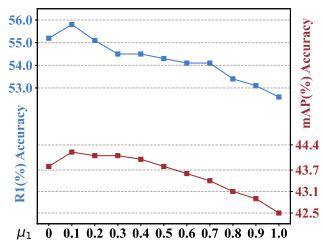  
(a) The weight for µ1

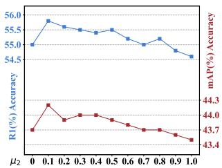  
(b) The weight for µ2

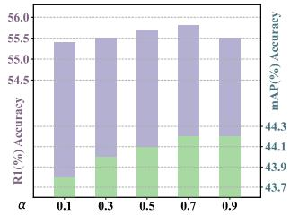  
(c) The weight for α

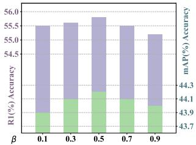  
(d) The weight for β

Figure 4. The influence of hyper-parameters in our DKC.
<table><tr><td>Base</td><td>DKT</td><td>LKC</td><td>DDA</td><td>mAP</td><td>R1</td></tr><tr><td>√ √</td><td>- √</td><td>- -</td><td>一 1</td><td>41.7 43.1</td><td>52.8 54.9</td></tr><tr><td>√</td><td>-</td><td>√</td><td>-</td><td>42.6</td><td>53.8</td></tr><tr><td>√</td><td>√</td><td>√</td><td>-</td><td>43.7</td><td>55.0</td></tr><tr><td> $\checkmark$ </td><td>√</td><td>√</td><td>√</td><td>44.2</td><td>55.8</td></tr></table>

Table 5. Ablation study of each module in DKC.

Effectiveness of DDA module. We further evaluate the impact of our proposed Dual-level Distribution Alignment (DDA). As Tab. 5 shows, the performance of our DKC further improved and achieved 44.2%/55.8% on average mAP/R1 by utilizing the DDA module. The above results illustrate that by explicitly aligning the differentiated knowledge at the instance level and the fine-grained level, the originally conflicting cloth-relevant knowledge and the cloth-irrelevant knowledge are finally resolved and reformed by the more discriminative identity representation, which significantly improves the adaptive balancing capacity of differentiated knowledge in cloth-consistent and cloth-changing scenarios.

Hyper-parameter Analysis. Our proposed DKC involves 4 hyper-parameters: $\mu _ { 1 } , \mu _ { 2 }$ in Eq. (11), α in Eq. (3), and $\beta$ in Eq. (10). We individually analyze their effects as shown in Fig. 4. Specifically, when $\mu _ { 1 }$ and $\mu _ { 2 }$ are set to 0.1, our DKC achieves an optimal balance between the new and old knowledge. In addition, as the α and $\beta$ increase, the performance continued to improve until reaching 0.7 and 0.5, respectively. However, excessively large parameters eliminate the balance between cloth-relevant and cloth-irrelevant knowledge and thus inhibit the overall performance. Therefore, we selected a set of moderate parameters, where $\mu _ { 1 }$ µ2, α, and $\beta$ are set to 0.1, 0.1, 0.7, and 0.5, respectively.

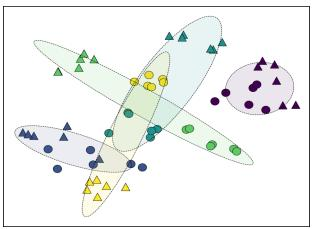

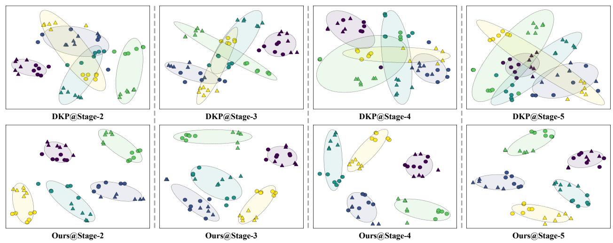

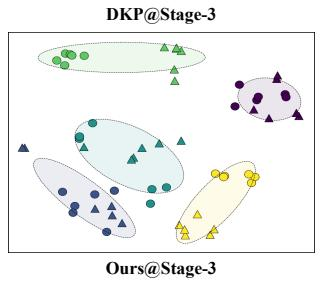  
Figure 5. The t-SNE visualization of different training stages, where different colours represent different identities and △, ⃝ represent two randomly sampled different clothes.

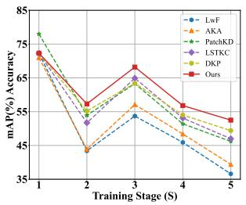

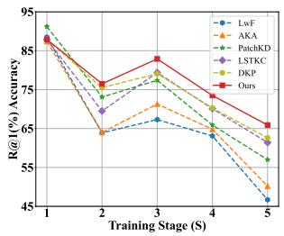

(a) Performance in cloth-consistent scenario  
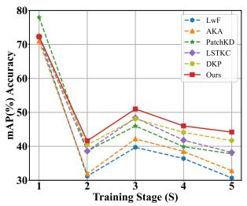

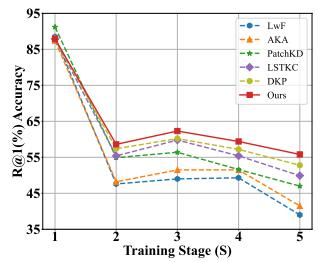  
(b) Performance in cloth-hybrid scenario  
Figure 6. Performance tendency at different training stages.

## 4.5. Visualization

To intuitively evaluate the effectiveness of our DKC method, we conducted more visualization experiments on training Order-1. The average performance tendency at different training stages is shown in Fig. 6. It can be seen that although PatchKD [22] exhibits compatible performance in the first stage, its performance is severely degraded in the subsequent stages due to the limitation of learning differentiated new knowledge. In contrast, our DKC surpasses all other methods since the second stage, which strongly supports that our method can achieve a better balance between the acquisition and anti-forgetting of cloth-relevant and cloth-irrelevant knowledge. Additionally, Fig. 5 visual izes the feature distribution extracted by our DKC compared to DKP [33] in the above stages. It shows that our DKC can promote intra-class consistency whether wearing the same or different clothes, and retain more discriminative information between different people. The above results intuitively illustrate the superior differentiated knowledge balancing capacity of our DKC, achieving consistent improvements in both cloth-consistent and cloth-hybrid scenarios.

## 5. Conclusion

In this paper, we explore a practical and challenging problem called Cloth-Hybrid Lifelong Person Re-identification (CH-LReID), which requires retrieving the same person based on sequentially collected cloth-consistent and clothchanging data. To tackle the above issue, we propose a Differentiated Knowledge Consolidation (DKC) to balance cloth-relevant and cloth-irrelevant knowledge. Specifically, a Differentiated Knowledge Transfer (DKT) module and a Latent Knowledge Consolidation (LKC) module are designed to dynamically exploit differentiated new knowledge while eliminating the derived domain shift of old knowledge. Additionally, a Dual-level Distribution Alignment (DDA) module is designed to alleviate the knowledge conflict between differentiated knowledge by aligning their distribution at different levels. Extensive experimental results illustrate our DKC outperforms existing methods in both cloth-hybrid and traditional LReID scenarios.

## Ackowledgements

This work was supported by the grants from the National Natural Science Foundation of China (61925201, 62132001, 62432001) and Beijing Natural Science Foundation (L247006).

## References

[1] Arslan Chaudhry, Puneet K Dokania, Thalaiyasingam Ajanthan, and Philip HS Torr. Riemannian walk for incremental learning: Understanding forgetting and intransigence. In Proceedings of the European Conference on Computer Vision, pages 532–547, 2018. 5

[2] Zhenyu Cui, Jiahuan Zhou, Yuxin Peng, Shiliang Zhang, and Yaowei Wang. Dcr-reid: Deep component reconstruction for cloth-changing person re-identification. IEEE Transactions on Circuits and Systems for Video Technology, 33(8):4415– 4428, 2023. 3

[3] Zhenyu Cui, Jiahuan Zhou, and Yuxin Peng. Dma: Dual modality-aware alignment for visible-infrared person reidentification. IEEE Transactions on Information Forensics and Security, 19:2696–2708, 2024. 2

[4] Zhenyu Cui, Jiahuan Zhou, Xun Wang, Manyu Zhu, and Yuxin Peng. Learning continual compatible representation for re-indexing free lifelong person re-identification. In Proceedings of the IEEE/CVF Conference on Computer Vision and Pattern Recognition, pages 16614–16623, 2024. 1, 2

[5] Matthias De Lange, Rahaf Aljundi, Marc Masana, Sarah Parisot, Xu Jia, Ales Leonardis, Gregory Slabaugh, andˇ Tinne Tuytelaars. A continual learning survey: Defying forgetting in classification tasks. IEEE Transactions on Pattern Analysis and Machine Intelligence, 44(7):3366–3385, 2021. 1

[6] Jianping Gou, Baosheng Yu, Stephen J Maybank, and Dacheng Tao. Knowledge distillation: A survey. International Journal ofComputer Vision, 129(6):1789–1819, 2021. 1

[7] Xinqian Gu, Hong Chang, Bingpeng Ma, Shutao Bai, Shiguang Shan, and Xilin Chen. Clothes-changing person re-identification with rgb modality only. In Proceedings of the IEEE/CVF Conference on Computer Vision and Pattern Recognition, pages 1060–1069, 2022. 3

[8] Kaiming He, Xiangyu Zhang, Shaoqing Ren, and Jian Sun. Delving deep into rectifiers: Surpassing human-level performance on imagenet classification. In Proceedings of the IEEE International Conference on Computer Vision, pages 1026–1034, 2015. 4

[9] Kaiming He, Xiangyu Zhang, Shaoqing Ren, and Jian Sun. Deep residual learning for image recognition. In Proceedings ofthe IEEE Conference on Computer Vision and Pattern Recognition, pages 770–778, 2016. 6

[10] Sergey Ioffe and Christian Szegedy. Batch normalization: Accelerating deep network training by reducing internal covariate shift. In International Conference on Machine Learning, pages 448–456. pmlr, 2015. 4

[11] Xuemei Jia, Xian Zhong, Mang Ye, Wenxuan Liu, and Wenxin Huang. Complementary data augmentation for cloth-changing person re-identification. IEEE Transactions on Image Processing, 31:4227–4239, 2022. 3

[12] Dangwei Li, Xiaotang Chen, Zhang Zhang, and Kaiqi Huang. Learning deep context-aware features over body and latent parts for person re-identification. In Proceedings of the IEEE Conference on Computer Vision and Pattern Recognition, pages 384–393, 2017. 6, 7

[13] Wei Li, Rui Zhao, Tong Xiao, and Xiaogang Wang. Deepreid: Deep filter pairing neural network for person reidentification. In Proceedings of the IEEE Conference on Computer Vision and Pattern Recognition, pages 152–159, 2014. 5

[14] Yubo Li, De Cheng, Chaowei Fang, Changzhe Jiao, Nannan Wang, and Xinbo Gao. Disentangling identity fea tures from interference factors for cloth-changing person reidentification. In Proceedings ofthe 32ndACM International Conference on Multimedia, pages 2252–2261, 2024. 3, 6

[15] Marc Masana, Xialei Liu, Bartłomiej Twardowski, Mikel Menta, Andrew D Bagdanov, and Joost Van De Weijer. Class-incremental learning: Survey and performance evaluation on image classification. IEEE Transactions on Pattern Analysis and Machine Intelligence, 45(5):5513–5533, 2022. 1

[16] Hyeonjoon Moon and P Jonathon Phillips. Computational and performance aspects of pca-based face-recognition algorithms. Perception, 30(3):303–321, 2001. 5

[17] Nan Pu, Wei Chen, Yu Liu, Erwin M Bakker, and Michael S Lew. Lifelong person re-identification via adaptive knowledge accumulation. In Proceedings of the IEEE/CVF Conference on Computer Vision and Pattern Recognition, pages 7901–7910, 2021. 1, 3, 5, 6, 7

[18] Nan Pu, Yu Liu, Wei Chen, Erwin M Bakker, and Michael S Lew. Meta reconciliation normalization for lifelong person re-identification. In Proceedings of the 30th ACM International Conference on Multimedia, pages 541–549, 2022. 2

[19] Nan Pu, Zhun Zhong, Nicu Sebe, and Michael S Lew. A memorizing and generalizing framework for lifelong person re-identification. IEEE Transactions on Pattern Analysis and Machine Intelligence, 2023. 2

[20] Xuelin Qian, Wenxuan Wang, Li Zhang, Fangrui Zhu, Yan wei Fu, Tao Xiang, Yu-Gang Jiang, and Xiangyang Xue. Long-term cloth-changing person re-identification. In Proceedings ofthe Asian Conference on Computer Vision, 2020. 1, 3, 5

[21] Olga Russakovsky, Jia Deng, Hao Su, Jonathan Krause, Sanjeev Satheesh, Sean Ma, Zhiheng Huang, Andrej Karpathy, Aditya Khosla, Michael Bernstein, et al. Imagenet large scale visual recognition challenge. International Journal of Computer Vision, 115:211–252, 2015. 6

[22] Zhicheng Sun and Yadong Mu. Patch-based knowledge distillation for lifelong person re-identification. In Proceedings of the 30th ACM International Conference on Multimedia, pages 696–707, 2022. 1, 2, 4, 6, 7, 8

[23] Minli Tang, Shaomin Xie, and Xiangrong Liu. Ancient character recognition: a novel image dataset of shui manuscript characters and classification model. Chinese Journal ofElectronics, 32(1):64–75, 2023. 2

[24] Frederick Tung and Greg Mori. Similarity-preserving knowledge distillation. In Proceedings of the IEEE/CVF International Conference on Computer Vision, pages 1365–1374, 2019. 7

[25] Chien-Yi Wang, Ya-Liang Chang, Shang-Ta Yang, Dong Chen, and Shang-Hong Lai. Unified representation learning for cross model compatibility. arXiv preprint arXiv:2008.04821, 2020. 4

[26] Qizao Wang, Xuelin Qian, Bin Li, Yanwei Fu, and Xiangyang Xue. Image-text-image knowledge transferring for lifelong person re-identification with hybrid clothing states. arXiv preprint arXiv:2405.16600, 2024. 3

[27] Qizao Wang, Xuelin Qian, Bin Li, Xiangyang Xue, and Yanwei Fu. Exploring fine-grained representation and recomposition for cloth-changing person re-identification. IEEE Transactions on Information Forensics and Security, 2024. 3

[28] Longhui Wei, Shiliang Zhang, Wen Gao, and Qi Tian. Person transfer gan to bridge domain gap for person reidentification. In Proceedings of the IEEE Conference on Computer Vision and Pattern Recognition, pages 79–88, 2018. 5

[29] Guile Wu and Shaogang Gong. Generalising without forgetting for lifelong person re-identification. In Proceedings of the AAAI Conference on Artificial Intelligence, pages 2889– 2897, 2021. 1, 2

[30] Tong Xiao, Shuang Li, Bochao Wang, Liang Lin, and Xiaogang Wang. End-to-end deep learning for person search. arXiv preprint arXiv:1604.01850, 2(2):4, 2016. 5

[31] Kunlun Xu, Chenghao Jiang, Peixi Xiong, Yuxin Peng, and Jiahuan Zhou. Dask: Distribution rehearsing via adaptive style kernel learning for exemplar-free lifelong person reidentification. arXiv preprint arXiv:2412.09224, 2024. 1

[32] Kunlun Xu, Haozhuo Zhang, Yu Li, Yuxin Peng, and Jiahuan Zhou. Mitigate catastrophic remembering via continual knowledge purification for noisy lifelong person reidentification. In Proceedings ofthe 32ndACM International Conference on Multimedia, pages 5790–5799, 2024. 1

[33] Kunlun Xu, Xu Zou, Yuxin Peng, and Jiahuan Zhou. Distribution-aware knowledge prototyping for non-exemplar lifelong person re-identification. In Proceedings of the IEEE/CVF Conference on Computer Vision and Pattern Recognition, pages 16604–16613, 2024. 1, 2, 3, 4, 6, 7, 8

[34] Kunlun Xu, Xu Zou, and Jiahuan Zhou. Lstkc: Long short-term knowledge consolidation for lifelong person reidentification. In Proceedings of the AAAI Conference on Artificial Intelligence, pages 16202–16210, 2024. 1, 3, 4, 6, 7

[35] Peng Xu and Xiatian Zhu. Deepchange: A long-term person re-identification benchmark with clothes change. In Proceedings of the IEEE/CVF International Conference on Computer Vision, pages 11196–11205, 2023. 3

[36] Yuming Yan, Huimin Yu, Yubin Wang, Shuyi Song, Weihu Huang, and Juncan Jin. Unified stability and plasticity for lifelong person re-identification in cloth-changing and clothconsistent scenarios. IEEE Transactions on Circuits and Systemsfor Video Technology, 2024. 2, 3, 6, 7

[37] Qize Yang, Ancong Wu, and Wei-Shi Zheng. Person reidentification by contour sketch under moderate clothing change. IEEE Transactions on Pattern Analysis and Machine Intelligence, 43(6):2029–2046, 2019. 1, 5

[38] Zhengwei Yang, Meng Lin, Xian Zhong, Yu Wu, and Zheng Wang. Good is bad: Causality inspired cloth-debiasing for cloth-changing person re-identification. In Proceedings of the IEEE/CVF Conference on Computer Vision and Pattern Recognition, pages 1472–1481, 2023. 3

[39] Zexian Yang, Dayan Wu, Wanqian Zhang, Bo Li, and Weipinng Wang. Handling label uncertainty for camera incremental person re-identification. In Proceedings of the 31st ACM International Conference on Multimedia, pages 6253–6263, 2023. 1

[40] Zhengwei Yang, Xian Zhong, Zhun Zhong, Hong Liu, Zheng Wang, and Shin’Ichi Satoh. Win-win by competition: Auxiliary-free cloth-changing person re-identification. IEEE Transactions on Image Processing, 32:2985–2999, 2023. 3

[41] Chunlin Yu, Ye Shi, Zimo Liu, Shenghua Gao, and Jingya Wang. Lifelong person re-identification via knowledge refreshing and consolidation. In Proceedings of the AAAI Con ference on Artificial Intelligence, pages 3295–3303, 2023. 1, 2

[42] Jun Zhang, Longlong Qiu, Fanfan Shen, Yueshun He, Hai Tan, and Yanxiang He. Rating text classification with weighted negative supervision on classifier layer. Chinese Journal ofElectronics, 32(6):1304–1318, 2023. 2

[43] Bo Zhao, Shixiang Tang, Dapeng Chen, Hakan Bilen, and Rui Zhao. Continual representation learning for biometric identification. In Proceedings ofthe IEEE/CVF Winter Conference on Applications of Computer Vision, pages 1198– 1208, 2021. 1, 3

[44] Huijuan Zhao, Ning YE, and Ruchuan Wang. Improved cross-corpus speech emotion recognition using deep local domain adaptation. Chinese Journal of Electronics, 32(3): 640–646, 2023. 2

[45] Liang Zheng, Liyue Shen, Lu Tian, Shengjin Wang, Jing dong Wang, and Qi Tian. Scalable person re-identification: A benchmark. In Proceedings of the IEEE International Conference on Computer Vision, pages 1116–1124, 2015. 5

[46] Zhedong Zheng, Liang Zheng, and Yi Yang. Unlabeled sam ples generated by gan improve the person re-identification baseline in vitro. In Proceedings of the IEEE International Conference on Computer Vision, pages 3754–3762, 2017. 5

[47] Jiahuan Zhou, Pei Yu, Wei Tang, and Ying Wu. Efficient online local metric adaptation via negative samples for person re-identification. In Proceedings of the IEEE International Conference on Computer Vision, pages 2420–2428, 2017. 2

[48] Jiahuan Zhou, Bing Su, and Ying Wu. Easy identification from better constraints: Multi-shot person re-identification from reference constraints. In Proceedings of the IEEE Conference on Computer Vision and Pattern Recognition, pages 5373–5381, 2018.

[49] Jiahuan Zhou, Bing Su, and Ying Wu. Online joint multimetric adaptation from frequent sharing-subset mining for person re-identification. In Proceedings of the IEEE/CVF Conference on Computer Vision and Pattern Recognition, pages 2909–2918, 2020. 2