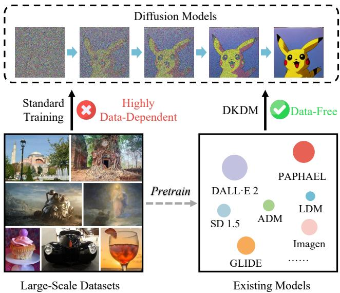
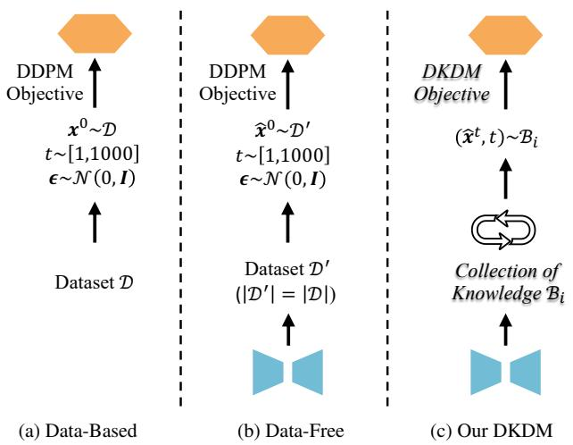
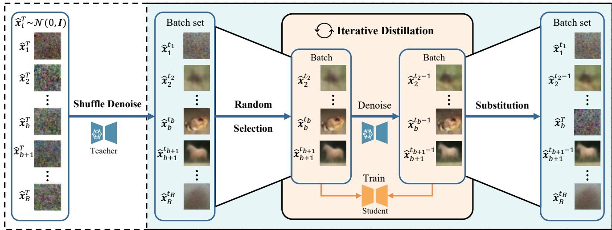
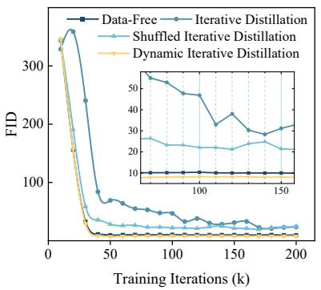
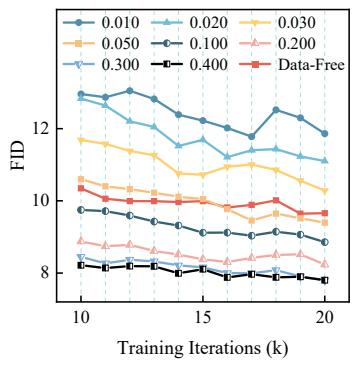
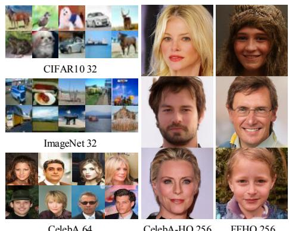

# DKDM: Data-Free Knowledge Distillation for Diffusion Models with Any Architecture

Qianlong Xiang1, Miao Zhang1,†, Yuzhang Shang2, Jianlong Wu1, Yan Yan3, Liqiang Nie1,† 1Harbin Institute of Technology (Shenzhen) 2Illinois Institute of Technology 3University of Illinois Chicago https://github.com/qianlong0502/DKDM

## Abstract

Diffusion models (DMs) have demonstrated exceptional generative capabilities across various domains, including image, video, and so on. A key factor contributing to their effectiveness is the high quantity and quality of data used during training. However, mainstream DMs now consume increasingly large amounts of data. For example, training a Stable Diffusion model requires billions ofimage-text pairs. This enormous data requirement poses significant challengesfor training large DMs due to high data acquisition costs and storage expenses. To alleviate this data burden, we propose a novel scenario: using existing DMs as data sources to train new DMs with any architecture. We refer to this scenario as Data-Free Knowledge Distillation for Diffusion Models (DKDM), where the generative ability of DMs is transferred to new ones in a data-free manner. To tackle this challenge, we make two main contributions. First, we introduce a DKDM objective that enables the training of new DMs via distillation, without requiring access to the data. Second, we develop a dynamic iterative distillation method that efficiently extracts time-domain knowledge from existing DMs, enabling direct retrieval of training data without the need for a prolonged generative process. To the best ofour knowledge, we are thefirst to explore this scenario. Experimental results demonstrate that our data-free approach not only achieves competitive generative performance but also, in some instances, outperforms models trained with the entire dataset.

## 1. Introduction

The advent of Diffusion Models (DMs) [16, 51, 53] heralds a new era in the generative domain, garnering widespread acclaim for their exceptional capability in producing samples of remarkable quality [8, 36, 44]. These models have rapidly ascended to a pivotal role across a spectrum of generative applications, notably in the fields of image, video and audio [4, 17, 61]. One reason for their superior performance is their training on large-scale, high-quality datasets. However, this advantage also entails a drawback: training DMs requires substantial storage capacity, as shown in Tab. 1. For instance, training a Stable Diffusion model necessitates the use of billions of image-text pairs [44].

  
Figure 1. Illustration of our DKDM concept: utilizing pretrained diffusion models to train new ones, thus avoiding the high costs associated with increasingly large datasets.

To alleviate this data burden, considering that numerous pretrained DMs have been trained and released by various organizations, we pose a novel question:

Can we train new diffusion models by using existing pretrained diffusion models as the data source, thereby eliminating the need to access or store any dataset?

Fig. 1 illustrates the concept of this scenario. Traditionally, training DMs requires access to large datasets. In contrast, in this paper, we explore how to utilize existing DMs to train new models without any data. We formalize this scenario as the Data-Free Knowledge Distillation for Diffusion

<table><tr><td>Model</td><td>#Param.</td><td>#Images</td></tr><tr><td>GLIDE [35]</td><td>5.0B</td><td>5.94B</td></tr><tr><td>LDM [44]</td><td>1.5B</td><td>0.27B</td></tr><tr><td>DALL·E 2 [40]</td><td>5.5B</td><td>5.63B</td></tr><tr><td>Imagen [45]</td><td>3.0B</td><td>15.36B</td></tr><tr><td>eDiff-I [2]</td><td>9.1B</td><td>11.47B</td></tr><tr><td>Stable Diffusion v1.5 [44]</td><td>0.9B</td><td>3.16B</td></tr></table>

Table 1. Comparison of prominent diffusion models on parameter count and training dataset size, sourced from Kang et al. [19].

Models (DKDM) paradigm, which aims at transferring the generative ability of the pretrained DMs towards new ones.

Compared with previous work, our proposed DKDM paradigm imposes strict requirements in three aspects. ∂ Data. Previous work usually requires access to datasets to train DMs for purposes such as model compression [62, 66] and reducing denoising steps [46, 54]. In contrast, DKDM mandates that the entire training process must not access any datasets. This constraint eliminates the need to spend significant time downloading and storing datasets and helps circumvent data privacy issues, especially when training data is not released [69]. ∑ Architecture. We observe that previous work on knowledge distillation for DMs often initializes student models with the architectures and weights of teacher models, limiting architectural flexibility. One reason for this is to improve performance. For example, Xie et al. [58] proposed a distillation method for DMs and found that the performance will degrade when the student model is randomly initialized. On the contrary, DKDM calls for training DMs with any architecture. ∏ Knowledge Form. Leveraging deep generative models to synthesize high-quality samples [1, 34, 57] for performance enhancement on downstream tasks [25, 26, 42, 55, 56, 67, 68] is a common practice. However, we argue that in DKDM, the knowledge form should not be realistic samples, because generating and storing such samples requires enormous space and time. For instance, to train a model like Stable Diffusion in this way, we would need to use the teacher model to synthesize billions of image-text pairs in advance and then use this massive synthetic dataset to train the new model, which is impractical. Therefore, the knowledge form in DKDM should be carefully designed.

Based on the above considerations, we summarize the requirements brought by the DKDM paradigm into two key challenges and solve them separately. The first challenge involves training DMs with any architecture, while not accessing the dataset. The second challenge involves efficiently designing the knowledge form for distillation, preventing it from becoming the main bottleneck in slowing the training process, as the generation of DMs is inherently slow. For the former, the optimization objective used in traditional DMs, as described by Ho et al. [16], is inappropriate due to the absence of the data. To address this, we specially design a DKDM objective that aligns closely with the original DM optimization objective, while the architecture of the model is no longer limited as in other distillation methods. For the latter, we observe that compared to realistic samples, time-domain ones corrupted by certain noise are more relevant to the optimization objective for DMs. Therefore, we define the knowledge form in DKDM as these noisy samples, enabling direct learning from each denoising step of pretrained DMs, without the need for a time-consuming generative process to obtain realistic samples. In other words, the student model learns from the generative process of the pretrained DMs rather than from their final generative outputs. Based on this definition, we propose a dynamic iterative distillation method that generates substantial and diverse knowledge to enhance the training of the student.

To sum up, this paper introduces a novel method for training DMs without the need for datasets, by leveraging existing pretrained DMs as the data source. Experimental results indicate that models trained with our approach demonstrate competitive generative performance. Furthermore, in some cases, our data-free method even outperforms models trained with the entire dataset.

## 2. Preliminaries on Diffusion Models

In diffusion models [16], a Markov chain is defined to add noises to data, and then diffusion models learn the reverse process to generate data from noises.

Forward Process. Given a sample $\pmb { x } ^ { 0 } \sim q \left( \pmb { x } ^ { 0 } \right)$ from the data distribution, the forward process iteratively adds Gaussian noise for $T$ diffusion steps with the predefined noise schedule $( \beta _ { 1 } , \dots , \beta _ { T } )$

$$
\begin{array} { r } { q \left( { \pmb x } ^ { t } | { \pmb x } ^ { t - 1 } \right) = \mathcal { N } \left( { \pmb x } ^ { t } ; \sqrt { 1 - \beta _ { t } } { \pmb x } ^ { t - 1 } , \beta _ { t } { \pmb I } \right) , } \end{array}\tag{1}
$$

$$
q \left( \mathbf { x } ^ { 1 : T } | \mathbf { x } ^ { 0 } \right) = \prod _ { t = 1 } ^ { T } q \left( \mathbf { x } ^ { t } | \mathbf { x } ^ { t - 1 } \right) ,\tag{2}
$$

until a completely noise $\pmb { x } ^ { T } \sim \mathcal { N } ( \mathbf { 0 } , T )$ is obtained. According to Ho et al. [16], adding noise t times sequentially to the original sample $\mathbf { \boldsymbol { x } } ^ { 0 }$ to generate a noisy sample $\mathbf { \boldsymbol { x } } ^ { t }$ can be simplified to a one-step calculation as follows:

$$
\begin{array} { r } { q \left( \mathbf { x } ^ { t } \vert \mathbf { x } ^ { 0 } \right) = \mathcal { N } \left( \mathbf { x } ^ { t } ; \sqrt { \bar { \alpha } _ { t } } \mathbf { x } ^ { 0 } , \left( 1 - \bar { \alpha } _ { t } \right) \pmb { I } \right) , } \end{array}\tag{3}
$$

$$
{ \pmb x } ^ { t } = \sqrt { \bar { \alpha } _ { t } } { \pmb x } ^ { 0 } + \sqrt { 1 - \bar { \alpha } _ { t } } { \pmb \epsilon } ,\tag{4}
$$

where $\begin{array} { r } { \alpha _ { t } : = 1 - \beta _ { t } , \bar { \alpha } _ { t } : = \prod _ { s = 0 } ^ { t } \alpha _ { s } } \end{array}$ and $\epsilon \sim \mathcal { N } ( 0 , I )$

Reverse Process. The posterior $q ( \pmb { x } ^ { t - 1 } | \pmb { x } ^ { t } )$ depends on the data distribution, which is tractable conditioned on $\mathbf { \boldsymbol { x } } ^ { 0 }$

$$
q \left( { \pmb x } ^ { t - 1 } | { \pmb x } ^ { t } , { \pmb x } ^ { 0 } \right) = \mathcal { N } \left( { \pmb x } ^ { t - 1 } ; \tilde { \mu } \left( { \pmb x } ^ { t } , { \pmb x } ^ { 0 } \right) , \tilde { \beta } _ { t } { \pmb I } \right) ,\tag{5}
$$

where $\tilde { \mu } _ { t } \left( \boldsymbol { x } ^ { t } , \boldsymbol { x } ^ { 0 } \right)$ and $\tilde { \beta } _ { t }$ can be calculated by:

$$
\tilde { \beta } _ { t } : = \frac { 1 - \bar { \alpha } _ { t - 1 } } { 1 - \bar { \alpha } _ { t } } \beta _ { t } ,\tag{6}
$$

$$
\tilde { \mu } _ { t } \left( \boldsymbol { x } ^ { t } , \boldsymbol { x } ^ { 0 } \right) : = \frac { \sqrt { \bar { \alpha } _ { t - 1 } } \beta _ { t } } { 1 - \bar { \alpha } _ { t } } \boldsymbol { x } ^ { 0 } + \frac { \sqrt { \alpha _ { t } } \left( 1 - \bar { \alpha } _ { t - 1 } \right) } { 1 - \bar { \alpha } _ { t } } \boldsymbol { x } ^ { t } .\tag{7}
$$

Since $\mathbf { x } ^ { 0 }$ in the data is not accessible during generation, a neural network parameterized by ✓ is used for approximation:

$$
p _ { \theta } \left( { { { x } ^ { t - 1 } } | { x } ^ { t } } \right) = \mathcal { N } \left( { { { x } ^ { t - 1 } } ; \mu _ { \theta } \left( { { x } ^ { t } } , t \right) , \Sigma _ { \theta } \left( { { x } ^ { t } } , t \right) I } \right) .\tag{8}
$$

Optimization. To optimize this network, the variational bound on negative log likelihood E[ log p✓] is estimated by:

$$
L _ { \mathrm { v l b } } = \mathbb { E } _ { \pmb { x } ^ { 0 } , \epsilon , t } \left[ D _ { K L } ( q ( \pmb { x } ^ { t - 1 } | \pmb { x } ^ { t } , \pmb { x } ^ { 0 } ) | | p _ { \theta } ( \pmb { x } ^ { t - 1 } | \pmb { x } ^ { t } ) \right] .\tag{9}
$$

Ho et al. [16] found that predicting ✏ is a more efficient way when parameterizing $\mu _ { \boldsymbol { \theta } } ( \boldsymbol { x } ^ { t } , t )$ in practice, which can be derived by Eqs. (4) and (7):

$$
\mu _ { \theta } \left( x ^ { t } , t \right) = \frac { 1 } { \sqrt { \alpha _ { t } } } \left( x ^ { t } - \frac { \beta _ { t } } { \sqrt { 1 - \bar { \alpha } _ { t } } } \epsilon _ { \theta } \left( x ^ { t } , t \right) \right) .\tag{10}
$$

Thus, a reweighted loss function is designed as the objective to optimize $L _ { \mathrm { v l b } }$

$$
L _ { \mathrm { s i m p l e } } = \mathbb { E } _ { \mathbf { x } ^ { 0 } , \epsilon , t } \left[ \left\| \epsilon - \epsilon _ { \theta } \left( \mathbf { x } ^ { t } , t \right) \right\| ^ { 2 } \right] .\tag{11}
$$

Improvement. In original DDPMs, $L _ { \mathrm { s i m p l e } }$ offers no signal for learning $\Sigma _ { \theta } ( { \pmb x } ^ { t } , t )$ and Ho et al. [16] fixed it to $\beta _ { t }$ or $\tilde { \beta } _ { t }$ . Nichol and Dhariwal [36] found it to be sub-optimal and proposed to parameterize $\Sigma _ { \theta } \left( \boldsymbol { x } ^ { t } , t \right)$ as a neural network whose output v is interpolated as:

$$
\Sigma _ { \pmb { \theta } } \left( \pmb { x } ^ { t } , t \right) = \mathrm { e x p } \left( v \log \beta _ { t } + \left( 1 - v \right) \log \tilde { \beta } _ { t } \right) .\tag{12}
$$

To optimize $\Sigma _ { \theta } \left( \boldsymbol { x } ^ { t } , t \right)$ , Nichol and Dhariwal [36] use $L _ { \mathrm { v l b } }$ , in which a stop-gradient is applied to the $\mu _ { \boldsymbol { \theta } } ( \boldsymbol { x } ^ { t } , t )$ because it is optimized by $L _ { \mathrm { s i m p l e } }$ . The final hybrid objective is defined as:

$$
L _ { \mathrm { h y b r i d } } = L _ { \mathrm { s i m p l e } } + \lambda L _ { \mathrm { v l b } } ,\tag{13}
$$

where  is used for balance between the two objectives. The process of training and sampling are guided by Eq. (13), cf . Algorithms 2 and 3 in Sec. 7.

## 3. Data-Free Knowledge Distillation for Diffusion Models

In this section, we introduce a novel paradigm, termed Data-Free Knowledge Distillation for Diffusion Models

Student DMs with any architecture

Pre-trained DMs

  
Figure 2. Illustration of our DKDM Paradigm. (a): standard databased training of DMs. (b): a straightforward data-free training approach. (c): our proposed framework for DKDM.

(DKDM). Sec. 3.1 details the DKDM paradigm, focusing on two principal challenges: the formulation of the optimization objective and the acquisition of knowledge for distillation. Sec. 3.2 describes our proposed optimization objective tailored for DKDM. Sec. 3.3 details our proposed method for efficient retrieval of knowledge.

## 3.1. DKDM Paradigm

The DKDM paradigm represents a novel scenario for training DMs. Unlike traditional methods, DKDM aims to leverage existing DMs as the data source to train new ones with any architecture, which eliminates the need for access to large or proprietary datasets.

In standard data-based training of DMs, as depicted in Fig. 2a, a sample $\mathbf { x } ^ { 0 } \sim \mathcal { D }$ is selected along with a timestep $t \sim [ 1 , 1 0 0 0 ]$ and random noise $\epsilon \sim \mathcal { N } ( 0 , I )$ The input $\mathbf { \boldsymbol { x } } ^ { t }$ is computed using Eq. (4), and the denoising network is optimized according to Eq. (13) to generate outputs close to ✏. However, without dataset access, DKDM cannot obtain training data $( x ^ { t } , t , \epsilon )$ to employ this standard method. A straightforward data-free training approach, depicted in Fig. 2b, involves using DMs pretrained on  to generate a synthetic dataset 0, which is then used to train new DMs with varying architectures. Despite its simplicity, creating $\mathcal { D } ^ { \prime }$ is time-intensive and impractical for large datasets.

While data-based training necessitates access to largescale datasets, data-free training incurs significant costs in generating synthetic datasets. To address these challenges, we propose an effective and efficient framework for DKDM, outlined in Fig. 2c, which incorporates a DKDM Objective (described in Sec. 3.2) and a strategy for collecting knowledge $B _ { i }$ (detailed in Sec. 3.3). This framework mitigates the challenges of distillation without datasets and reduces the costs associated with data-free training.

## 3.2. DKDM Objective

Given a dataset , the original optimization objective for a DM with parameters ✓ involves minimizing the KL divergence $\bar { \mathbb { E } } _ { \mathbf { x } ^ { 0 } , \epsilon , t } \big [ D _ { K L } \big ( q ( \mathbf { x } ^ { t - 1 } | \mathbf { x } ^ { t } , \pmb { x } ^ { 0 } ) \big | \big | p _ { \theta } ( \pmb { x } ^ { t - 1 } | \pmb { x } ^ { t } ) \big ) \big ]$ Our proposed DKDM objective comprises two primary goals: (1) eliminating the diffusion posterior $q ( \mathbf { x } ^ { t - 1 } | \mathbf { x } ^ { t } , \mathbf { \bar { x } } ^ { 0 } )$ and (2) removing the diffusion prior $\mathbf { \boldsymbol { x } } ^ { t } \sim \boldsymbol { q } ( \mathbf { \boldsymbol { x } } ^ { t } | \mathbf { \boldsymbol { x } } ^ { 0 } )$ from the KL divergence, since they both are dependent on $\mathbf { \boldsymbol { x } } ^ { 0 } \sim \mathcal { D }$

Eliminating the diffusion posterior $q ( x ^ { t - 1 } | x ^ { t } , x ^ { 0 } )$ In our framework, we introduce a teacher DM with parameters $\pmb { \theta } _ { T }$ , trained on dataset . This model can generate samples that conform to the learned distribution $\mathcal { D } ^ { \prime }$ . Optimized with the objective Eq. (13), the distribution $\mathcal { D } ^ { \prime }$ within a well-learned teacher DM closely matches . Our goal is for a student, parameterized by $\theta _ { S }$ , to replicate $\mathcal { D } ^ { \prime }$ instead of , thereby obviating the need for q during optimization.

Specifically, the pretrained teacher DM was optimized via the hybrid objective Eq. (13), which indicates that both the KL divergence $\smash { D _ { K L } \bar { ( \boldsymbol { q } ( \mathbf { x } ^ { t - 1 } | \mathbf { x } ^ { t } , \mathbf { x } ^ { 0 } ) \| \boldsymbol { p } _ { \theta _ { T } } ( \mathbf { x } ^ { t - 1 } | \mathbf { x } ^ { t } ) ) } }$ and the mean squared error $\mathbb { E } _ { \pmb { x } ^ { t } , \epsilon , t } [ \| \pmb { \epsilon } - \textup { \texttt { \epsilon } } _ { \pmb { \theta } _ { T } } ( \pmb { x } ^ { t } , t ) \| ^ { 2 } ]$ are minimized. Given the similarity in distribution between the teacher model and the dataset, we propose a DKDM objective that optimizes the student model through minimizing $D _ { K L } ( \bar { p } _ { \pmb { \theta } _ { T } } ( \pmb { x } ^ { t - 1 } | \pmb { x } ^ { t } ) | | p _ { \pmb { \theta } _ { S } } ( \pmb { x } ^ { t - 1 } | \pmb { x } ^ { t } ) )$ and $\mathbb { E } _ { \pmb { x } ^ { t } } [ \| \epsilon _ { \pmb { \theta } _ { T } } ( \pmb { x } ^ { t } , t ) - \epsilon _ { \pmb { \theta } _ { S } } ( \pmb { x } ^ { t } , t ) \| ^ { 2 } ]$ . This objective indirectly minimizes $D _ { K L } ( q ( \tilde { \mathbf { x } } ^ { t - 1 } | \tilde { \mathbf { x } } ^ { t } , \tilde { \mathbf { x } ^ { 0 } } ) | | p _ { \theta _ { S } } ( \tilde { \mathbf { x } ^ { t - 1 } } | \tilde { \mathbf { x } ^ { t } } ) )$ and $\mathbb { E } _ { { \pmb x } ^ { 0 } , { \pmb \epsilon } , t } [ \| { \pmb \epsilon } - { \pmb \epsilon } _ { { \pmb \theta } _ { S } } ( { \pmb x } ^ { t } , t ) \| ^ { 2 } ]$ , despite the inaccessibility of the posterior. The proposed DKDM objective is as follows:

$$
L _ { \mathrm { D K D M } } = L _ { \mathrm { s i m p l e } } ^ { \prime } + \lambda L _ { \mathrm { v l b } } ^ { \prime } ,\tag{14}
$$

where $L _ { \mathrm { s i m p l e } } ^ { \prime }$ guides the learning of $\mu _ { \pmb { \theta } _ { S } }$ and $L _ { \mathrm { v l b } } ^ { \prime }$ optimizes $\Sigma _ { \theta _ { S } }$ , as defined in following equations:

$$
L _ { \mathrm { s i m p l e } } ^ { \prime } = \mathbb { E } _ { \pmb { x } ^ { 0 } , \epsilon , t } \left[ \| \epsilon _ { \pmb { \theta } _ { T } } ( \pmb { x } ^ { t } , t ) - \epsilon _ { \pmb { \theta } _ { S } } ( \pmb { x } ^ { t } , t ) \| ^ { 2 } \right] ,\tag{15}
$$

$$
L _ { \mathrm { v l b } } ^ { \prime } = \mathbb { E } _ { \pmb { x } ^ { 0 } , \epsilon , t } \left[ D _ { K L } \big ( p _ { \pmb { \theta } _ { T } } ( \pmb { x } ^ { t - 1 } | \pmb { x } ^ { t } ) \big | | p _ { \pmb { \theta } _ { S } } ( \pmb { x } ^ { t - 1 } | \pmb { x } ^ { t } ) \big ] \right.\tag{16}
$$

where $q ( \pmb { x } ^ { t - 1 } | \pmb { x } ^ { t } , \pmb { x } ^ { 0 } )$ is eliminated whereas the term $x ^ { t } \sim$ $q ( \pmb { x } ^ { t } | \pmb { x } ^ { 0 } )$ remains to be removed.

Removing the diffusion prior $\scriptstyle q ( x ^ { t } | x ^ { 0 } )$ . Considering the generative ability of the teacher model, we utilize it to generate ${ \hat { x } } ^ { t }$ as a substitute for $\mathbf { \boldsymbol { x } } ^ { t } \sim q ( \mathbf { \boldsymbol { x } } ^ { t } | \mathbf { \boldsymbol { x } } ^ { 0 } )$ . We define a reverse diffusion step $\hat { \pmb x } ^ { t - 1 } \sim p \pmb \theta _ { T } ( \hat { \pmb x } ^ { t - 1 } | \pmb x ^ { t } )$ through the equation $\hat { \pmb x } ^ { t - 1 } = g _ { \pmb { \theta } _ { T } } ( { \pmb x } ^ { t } , t )$ . Next, we represent a sequence of t reverse diffusion steps starting from $T$ as $G _ { \theta _ { T } } ( t )$ . Note that $G _ { \pmb { \theta } _ { T } } ( 0 ) = \epsilon$ where $\epsilon \sim \mathcal { N } ( 0 , I )$ . For instance, $G _ { \pmb { \theta } _ { T } } ( 2 )$ yields $\bar { \pmb { x } } ^ { T - 2 } = g _ { \pmb { \theta } _ { T } } ( g _ { \pmb { \theta } _ { T } } ( \epsilon , T ) , T - 1 )$ . Consequently, $\hat { \mathbf { x } } ^ { t }$ is obtained by $\hat { \pmb { x } } ^ { t } = G _ { \pmb { \theta } _ { T } } ( T - t )$ and the objectives $L _ { \mathrm { s i m p l e } } ^ { \prime }$ and $L _ { \mathrm { v l b } } ^ { \prime }$ are reformulated as follows:

$$
L _ { \mathrm { s i m p l e } } ^ { \prime } = \mathbb { E } _ { \hat { \pmb { x } } ^ { t } , t } \left[ \| \pmb { \epsilon _ { \pmb { \theta } _ { T } } } ( \hat { \pmb { x } } ^ { t } , t ) - \pmb { \epsilon _ { \pmb { \theta } _ { S } } } ( \hat { \pmb { x } } ^ { t } , t ) \| ^ { 2 } \right] ,\tag{17}
$$

$$
L _ { \mathrm { v l b } } ^ { \prime } = \mathbb { E } _ { \hat { \pmb { x } } ^ { t } , t } \left[ D _ { K L } \big ( p _ { \pmb { \theta } _ { T } } ( \hat { \pmb { x } } ^ { t - 1 } | \hat { \pmb { x } } ^ { t } ) \| p _ { \pmb { \theta } _ { S } } ( \hat { \pmb { x } } ^ { t - 1 } | \hat { \pmb { x } } ^ { t } ) \big ] \right.\tag{18}
$$

By this formulation, the need for $\mathbf { \boldsymbol { x } } ^ { 0 }$ in LDKDM is removed by naturally leveraging the generative ability of the teacher. Optimized by the proposed $L _ { \mathrm { D K D M } }$ , the student progressively learns the entire reverse diffusion process from the teacher without reliance on the source datasets.

However, the removal of the diffusion posterior and prior in the DKDM objective introduces a significant bottleneck, resulting in notably slow learning rates. As depicted in Fig. $^ { 2 \mathrm { a } , }$ standard training for DMs enables straightforward acquisition of noisy samples $\boldsymbol { x } _ { i } ^ { t _ { i } }$ at an arbitrary diffusion step $t \sim [ 1 , T ]$ using Eq. (4). These samples are compiled into a batch $B _ { j } = \{ { \pmb x } _ { i } ^ { t _ { i } } \}$ , with $j$ representing the training iteration. Conversely, our DKDM objective requires obtaining a noisy sample $\hat { \pmb { x } } _ { i } ^ { t } = G _ { \pmb { \theta } _ { T } } ( T - t _ { i } )$ through $T - t _ { i }$ denoising steps. Consequently, by considering the denoising steps as the primary computational expense, the worstcase time complexity of assembling a batch $\hat { B } _ { j } = \{ \hat { x } _ { i } ^ { t _ { i } } \}$ for distillation is $\mathcal { O } ( T b )$ , where b denotes the batch size. This complexity significantly hinders the training process. To address this issue, we introduce a method called dynamic iterative distillation, detailed in Sec. 3.3.

## 3.3. Efficient Collection of Knowledge

In this section, we present our efficient strategy for gathering knowledge for distillation, illustrated in Fig. 3. We begin by introducing a basic iterative distillation method that allows the student to learn from the teacher at each denoising step, instead of requiring the teacher to denoise multiple times within every training iteration to create a batch of noisy samples. Subsequently, to enhance the diversity of noise levels within the batch samples, we develop an advanced method termed shuffled iterative distillation, which allows the student to learn denoising patterns across varying time steps. Lastly, we refine our approach to dynamic iterative distillation, significantly augmenting the diversity of data in the batch. This adaptation ensures that the student acquires knowledge from a broader array of samples over time, avoiding repetitive learning from identical samples.

Iterative Distillation. We introduce a method called iterative distillation, which closely aligns the optimization process with the generation procedure. In this approach, the teacher model consistently denoises, while the student model continuously learns from this denoising. Each output from the teacher’s denoising step is incorporated into some batch for optimization, ensuring the student model learns from every output. Specifically, during each training iteration, the teacher performs $g _ { \pmb { \theta } _ { T } } ( \pmb { x } ^ { t } , t )$ , which is a single-step denoising, instead of $G _ { \theta _ { T } } ( t )$ , which would involve t-step denoising. Initially, a batch $\hat { B } _ { 1 } = \{ \hat { \pmb { x } } _ { i } ^ { T } \}$ is formed from a set of sampled noises $\hat { \pmb { x } } _ { i } ^ { T } \sim \mathcal { N } ( \mathbf { 0 } , \bar { \pmb { I } } )$ . After one step of distillation, the batch $\hat { B } _ { 2 } ~ = ~ \{ \hat { \pmb { x } } _ { i } ^ { T - 1 } \}$ is used for training. This process is iterated until $\hat { B } _ { T } = \{ \hat { \pmb { x } } _ { i } ^ { 1 } \}$ is reached, indicating that the batch has nearly become real samples with no noise. The cycle then restarts with the resampling of noise to form a new batch $\hat { B } _ { T + 1 } = \{ \hat { \pmb { x } } _ { i } ^ { T } \}$ . This method allows the teacher model to provide an endless stream of data for distillation. To further improve the diversity of the synthetic batch $\hat { B } _ { j } = \{ \hat { x } _ { i } ^ { t _ { i } } \}$ , we investigate it from the perspectives of noise level $t _ { i }$ and sample $\hat { \mathbf { x } } _ { i }$

  
Figure 3. Dynamic Iterative Distillation: An enlarged batch set is initially constructed by sampling from a Gaussian distribution. Next, shuffle denoise is applied, wherein each sample is denoised random times. A batch is then randomly selected from this enlarged set fo training the student with the denoised results substituting for their counterparts in the batch set. This process is repeated iteratively.

Shuffled Iterative Distillation. Unlike the standard data-based training, the t values in an iterative distillation batch remain the same and do not follow a uniform distribution, resulting in significant instability during distillation. To mitigate this issue, we integrate a method termed shuffle denoise into our iterative distillation. Initially, a batch $\hat { B } _ { 0 } ^ { s } = \{ \hat { { \pmb x } } _ { i } ^ { T } \}$ is sampled from a Gaussian distribution. Subsequently, each sample undergoes random denoising steps, resulting in $\hat { B } _ { 1 } ^ { s } = \{ \hat { \pmb { x } } _ { i } ^ { t _ { i } } \}$ , with $t _ { i }$ following a uniform distribution. This batch, $\hat { B } _ { 1 } ^ { s }$ , then initiates the iterative distillation process. By enhancing the diversity in the $t _ { i }$ values within the batch, this method balances the impact of different t values during distillation.

Dynamic Iterative Distillation. There is a notable distinction between standard training and iterative distillation regarding the flexibility in batch composition. Consider two samples, $\hat { \pmb x } _ { 1 }$ and ${ \hat { \mathbf { x } } } _ { 2 }$ , within a batch without differentiating their noise level. During standard training, the pairing of $\hat { \pmb x } _ { 1 }$ and ${ \hat { \mathbf { x } } } _ { 2 }$ is entirely random. Conversely, in iterative distillation, batches containing $\hat { \pmb x } _ { 1 }$ almost always include ${ \hat { \mathbf { x } } } _ { 2 }$ . This departure from the principle of independent and identically distributed samples in a batch can potentially diminish the model’s generalization ability.

To better align the distribution of the denoising data with that of the standard training batch, we propose a method named dynamic iterative distillation. As shown in Fig. 3, this method employs shuffle denoise to construct an enlarged batch set $\mathbf { \hat { { B } } _ { 1 } ^ { + } } = \{ \hat { { \mathbf { x } } } _ { i } ^ { t _ { i } } \}$ , where size $| \hat { B } _ { j } ^ { + } | = \rho T | \hat { B } _ { j } ^ { s } |$ where $\rho$ is a scaling factor. During distillation, a subset $\hat { B } _ { j } ^ { s }$ is sampled from $\hat { B } _ { j } ^ { + }$ through random selection for optimization. The one-step denoised samples replace their counterparts in $\hat { B } _ { j + 1 } ^ { + }$ . This method only has a time complexity of $\mathcal { O } ( b )$ and significantly improves distillation performance. The final DKDM objective is defined as:

Algorithm 1 Dynamic Iterative Distillation   
Require: $\hat { B } _ { 0 } ^ { + } = \{ \hat { \pmb { x } } _ { i } ^ { T } \}$   
1: Get $\hat { B } _ { 1 } ^ { + } = \{ \hat { { \pmb x } } _ { i } ^ { t _ { i } } \}$ with shuffle denoise, $j = 0$   
2: repeat   
3: $j = j + 1$   
4: get $\hat { B } _ { j } ^ { s }$ from $\hat { B } _ { j } ^ { + }$ through random selection   
5: compute $L _ { \mathrm { s i m p l e } } ^ { \star }$ using Eq. (20)   
6: compute $L _ { \mathrm { v l b } } ^ { \star }$ using Eqs. (12) and (21)   
7: take a gradient descent step on $\nabla _ { \boldsymbol { \theta } } L$ DKDM   
8: update $\hat { B } _ { j + 1 } ^ { + }$   
9: until converged

$$
L _ { \mathrm { D K D M } } ^ { \star } = L _ { \mathrm { s i m p l e } } ^ { \star } + \lambda L _ { \mathrm { v l b } } ^ { \star } ,\tag{19}
$$

$$
L _ { \mathrm { s i m p l e } } ^ { \star } = \mathbb { E } _ { ( \hat { \pmb { x } } ^ { t } , t ) \sim \hat { \pmb { B } } ^ { + } } \left[ \| \pmb { \epsilon _ { \theta _ { T } } } ( \hat { \pmb { x } } ^ { t } , t ) - \pmb { \epsilon _ { \theta _ { S } } } ( \hat { \pmb { x } } ^ { t } , t ) \| ^ { 2 } \right]\tag{20}
$$

$$
L _ { \mathrm { v l b } } ^ { \star } = \mathbb { E } _ { ( \hat { \pmb { x } } ^ { t } , t ) \sim \hat { \pmb { B } } ^ { + } } \left[ D _ { K L } \big ( p _ { \pmb { \theta } _ { T } } ( \hat { \pmb { x } } ^ { t - 1 } | \hat { \pmb { x } } ^ { t } ) \| p _ { \pmb { \theta } _ { S } } ( \hat { \pmb { x } } ^ { t - 1 } | \hat { \pmb { x } } ^ { t } ) \big ] \right.\tag{21}
$$

where $\hat { \mathbf { x } } ^ { t }$ and t are produced by our proposed dynamic iterative distillation. The complete algorithm is detailed in Algorithm 1.

<table><tr><td rowspan="2">Method</td><td colspan="3">CIFAR10 32x32</td><td colspan="3">CelebA 64x64</td><td colspan="3">ImageNet 32x32</td></tr><tr><td>IS↑</td><td>FID↓</td><td>sFID↓</td><td>IS↑</td><td>FID↓</td><td>sFID↓</td><td>IS↑</td><td>FID↓</td><td>sFID↓</td></tr><tr><td>Teacher</td><td>9.52</td><td>4.45</td><td>7.09</td><td>3.08</td><td>4.43</td><td>6.10</td><td>13.63</td><td>4.67</td><td>4.03</td></tr><tr><td>Data-Based Training</td><td>8.73</td><td>7.84</td><td>7.38</td><td>3.04</td><td>5.39</td><td>7.23</td><td>9.99</td><td>10.56</td><td>5.24</td></tr><tr><td>Data-Limited Training (20%)</td><td>8.49</td><td>9.76</td><td>11.30</td><td>2.86</td><td>9.52</td><td>11.55</td><td>10.48</td><td>12.62</td><td>9.70</td></tr><tr><td>Data-Limited Training (15%)</td><td>8.44</td><td>11.07</td><td>12.47</td><td>2.84</td><td>9.60</td><td>11.48</td><td>10.43</td><td>13.50</td><td>10.76</td></tr><tr><td>Data-Limited Training (10%)</td><td>8.40</td><td>11.06</td><td>11.98</td><td>3.04</td><td>8.20</td><td>10.65</td><td>10.39</td><td>14.23</td><td>12.63</td></tr><tr><td>Data-Limited Training (5%)</td><td>8.39</td><td>10.91</td><td>11.99</td><td>2.86</td><td>9.64</td><td>11.27</td><td>10.48</td><td>13.63</td><td>10.62</td></tr><tr><td>Data-Free Training (0%)</td><td>8.28</td><td>12.06</td><td>13.23</td><td>2.87</td><td>10.66</td><td>12.71</td><td>10.47</td><td>13.20</td><td>9.56</td></tr><tr><td>Dynamic Iterative Distillation (Ours)</td><td>8.60</td><td>9.56</td><td>11.77</td><td>2.91</td><td>7.07</td><td>8.78</td><td>10.50</td><td>11.33</td><td>4.80</td></tr></table>

Table 2. Pixel-space performance comparison between data-limited training, data-free training and our dynamic iterative distillation on CIFAR10 32 32 [22], CelebA 64 64 [27] and ImageNet $3 2 \times 3 2 [ 7 ]$ . The term (P%) denotes the percentage of real data included in the synthetic dataset. The best performance is indicated by boldface, while the second-best is denoted by underlining. Results from the ‘Teacher’ and ‘Data-Based Training’ are provided for reference only and are not included in the comparison.

## 4. Experiments

This section presents a series of experiments designed to validate the efficacy of our proposed dynamic iterative distillation. In Sec. 4.1, we introduce our experimental setting and establish relevant baselines for comparative analysis from a data-centric perspective. Sec. 4.2 provides a comparison between these baselines and our method, assessing performance separately in pixel and latent spaces. We also demonstrate the capability of our approach to train models across different architectures. Lastly, Sec. 4.3 includes an ablation study to solidify the validation of our method.

## 4.1. Experiment Setting

Datasets, teachers and students. The training of highresolution diffusion models typically requires substantial time, so these models are often developed in latent space to expedite the process [44]. To assess our method, we conduct experiments in both pixel and latent spaces, focusing on low and high-resolution generation, respectively.

• Pixel space. We utilize three pretrained DMs as teacher models, following the configurations introduced by Ning et al. [37]. These models were trained separately on CI-FAR10 at a resolution of 32 32 [22], CelebA at $6 4 \times 6 4$ [27] and ImageNet at $3 2 \times 3 2 [ 7 ]$

• Latent space. We adopt two different DMs as teacher models, adhering to the configurations proposed by Rombach et al. [44]. These models were trained on CelebA-HQ $2 5 6 \times 2 5 6$ [20] and FFHQ $2 5 6 \times 2 5 6$ [21]. It is important to note that the pre-trained models in the latent space were typically trained using a simpler loss function, denoted as $L _ { \mathrm { s i m p l e } } \ ( 1 1 )$ , without incorporating the KL divergence $L _ { \mathrm { v l b } } \ ( 9 )$ . For our experiments, we adopt $L _ { \mathrm { s i m p l e } } ^ { \star } \left( 2 0 \right)$ as the DKDM objective. This approach allows us to investigate the effectiveness of dynamic iterative distillation under different training conditions.

All the teacher models employ Convolutional Neural Networks (CNNs). For the student models, we maintain the same architecture but reduce the scale. Additionally, we conduct cross-architecture experiments between CNNbased and ViT-based (Vision Transformer [9, 39]) DMs on CIFAR10. Details of the architecture are listed in Sec. 8.

Metrics. The distance between the generated samples and the reference samples can be estimated by the Frechet´ Inception Distance (FID) score [14]. In our experiments, we utilize the FID score as the primary metric for evaluation. Additionally, we report sFID [32] and Inception Score (IS) [47] as secondary metrics. Following previous work [16, 36, 37], we generate 50K samples for DMs, and we use the full training set in the corresponding dataset to compute the metrics. Without additional contextual states, all the samples are generated through 50 Improved DDPM sampling steps [36] in pixel space and 200 DDIM sampling steps [52] in latent space. All of our metrics are calculated by ADM TensorFlow evaluation suite [8].

Baselines. As DKDM is a new paradigm proposed in this paper, traditional distillation methods are not suitable to serve as baselines. Therefore, we establish two kinds of baselines from a data-centric perspective.

• Data-Free Training, which is depicted in Fig. 2b, involves a teacher model generating a large quantity of high-quality synthetic samples, matching the size of the original dataset. These synthetic samples form the training set $\mathcal { D } ^ { \prime }$ for the student models, which are initialized randomly and trained according to the standard procedure, cf. Algorithm 2 in Sec. 7. Details about our synthetic datasets can be found in Tab. 4.

• Data-Limited Training integrates a fixed proportion (ranging from 5% to 20%) of the original dataset samples with the synthetic dataset $\mathcal { D } ^ { \prime }$ used in data-free training.

<table><tr><td rowspan="2">Method</td><td colspan="2">CelebA-HQ 256</td><td colspan="2">FFHQ 256</td></tr><tr><td>FID↓</td><td>sFID↓</td><td>FID↓</td><td>sFID↓</td></tr><tr><td>Teacher</td><td>5.69</td><td>10.02</td><td>5.93</td><td>7.52</td></tr><tr><td>Data-Based</td><td>9.09</td><td>12.10</td><td>8.91</td><td>8.75</td></tr><tr><td>Data-Limited (20%)</td><td>14.49</td><td>17.08</td><td>15.43</td><td>12.25</td></tr><tr><td>Data-Limited (15%)</td><td>14.89</td><td>16.98</td><td>16.02</td><td>12.48</td></tr><tr><td>Data-Limited (10%)</td><td>15.23</td><td>17.53</td><td>16.00</td><td>12.47</td></tr><tr><td>Data-Limited (5%)</td><td>15.07</td><td>17.64</td><td>15.86</td><td>12.56</td></tr><tr><td>Data-Free (0%)</td><td>15.36</td><td>17.56</td><td>16.32</td><td>12.75</td></tr><tr><td>Ours</td><td>8.69</td><td>12.50</td><td>11.53</td><td>10.29</td></tr></table>

Table 3. Latent-space performance comparison between datalimited training, data-free training and our dynamic iterative distillation on CelebA-HQ 256 256 [20] and FFHQ 256 256 [21]. The term (P%) denotes the percentage of real data included in the synthetic dataset. The best performance is indicated by boldface, while the second-best is denoted by underlining. Results from the ‘Teacher’ and ‘Data-Based Training’ are provided for reference only and are not included in the comparison.
<table><tr><td>Dataset</td><td>#Images</td><td>Method</td></tr><tr><td colspan="3">Pixel Space</td></tr><tr><td>CIFAR10 32 [22] CelebA 64 [27]</td><td>50,000 202,599</td><td>IDDPM-1000 [36] IDDPM-100 [36]</td></tr><tr><td>ImageNet 32 [7]</td><td>1,281,167 Latent Space</td><td>IDDPM-100 [36]</td></tr><tr><td>CelebA-HQ 256 [20]</td><td>25,000</td><td>DDIM-100 [52]</td></tr><tr><td>FFHQ 256 [21]</td><td>60,000</td><td>DDIM-100 [52]</td></tr></table>

Table 4. Image counts and generation methods for our baselines, which match the training set sizes of their respective teachers. The notation N indicates that the synthetic dataset is generated using N sampling steps with the method.

It facilitates a comparative analysis between our purely data-free method and those able to partially access to the original dataset.

Additionally, we also report performance of data-based training, illustrated in Fig. 2a, which serves as an upper performance limit for our analysis.

## 4.2. Main Results

Effectiveness. Tabs. 2 and 3 present the performance comparison between our dynamic iterative distillation method and baseline models in pixel and latent spaces, respectively. Our trained students consistently outperform baselines across various datasets and metrics, demonstrating the efficacy of our proposed DKDM objective and dynamic iterative distillation approach. These results validate our initial hypothesis posited in Sec. 1 and confirm that leveraging existing diffusion models to train new ones is an effective strategy to mitigate the costs associated with largescale datasets. Additionally, we observe instances where our method outperforms traditional data-based training approaches, exemplified by the IS score on CIFAR10 and the FID score on CelebA-HQ. This outcome indicates that, to some extent, neural networks face challenges in learning the complex reverse diffusion processes inherent in data-based training, whereas the knowledge from pretrained teacher models is easier to learn. This insight further highlights an additional benefit: our method not only reduces the reliance on extensive datasets but also potentially yields models with superior performance. Moreover, we found our method only consumes minor extra GPU memory while achieving faster training speed in latent space, cf . Sec. 10. Some generated results are visualized in Fig. 5.

<table><tr><td></td><td>CNN T.</td><td>ViT T.</td></tr><tr><td>CNN S.</td><td></td><td></td></tr><tr><td>Data-Free Training</td><td>9.64</td><td>44.62</td></tr><tr><td>Dynamic Iterative Distillation</td><td>6.85</td><td>13.17</td></tr><tr><td>ViT S.</td><td></td><td></td></tr><tr><td>Data-Free Training</td><td>17.11</td><td>63.15</td></tr><tr><td>Dynamic Iterative Distillation</td><td>17.11</td><td>17.86</td></tr></table>

Table 5. FID scores on CIFAR10 for cross-architecture distillation between CNN and ViT models. The FID score for the CNN teacher model is 4.45, and that of the ViT teacher is 11.30. Abbreviations used: ‘T.’ stands for teacher, ‘S.’ stands for student.

Cross-Architecture Distillation. Our method transcends specific model architectures, enabling distillation from CNN-based DMs to ViT-based ones and vice versa. As shown in Tab. 5, our method effectively facilitates cross-architecture distillation, yielding superior performance compared to baselines. Additionally, our results suggest that CNNs are more effective as compressed DMs.

## 4.3. Ablation Study

To validate our approach, we tested the FID score of our progressively designed methods, including iterative, shuffled iterative, and dynamic iterative distillation, over 200K training iterations without early stop. The results, shown in Fig. 4a, demonstrate that our dynamic iterative distillation strategy not only converges more rapidly but also delivers superior performance. The convergence curve for our method closely matches that of the baseline, which confirms the effectiveness of the DKDM objective in alignment with the standard optimization objective Eq. (13).

Further experiments explored the effects of varying ⇢ on the performance of dynamic iterative distillation. As depicted in Fig. 4b, higher ⇢ values enhance the distillation process up to a point, beyond which performance gains diminish. This outcome supports our hypothesis that dynamic iterative distillation enhances batch construction flexibility, thereby improving distillation efficiency. Beyond a certain level of flexibility, further increases in ⇢ yield no significant benefit to the distillation process. For information regarding GPU memory consumption with varying ⇢, cf . Sec. 10. Additional discussion and analytical experiments are available in Secs. 11 and 12.

CelebA-HQ 256 FFHQ 256  
  
(a) Ablation

  
(b) Effect of ⇢  
Figure 4. FID scores of analytical experiments on CIFAR10. (a): Ablation on dynamic iterative distillation with ⇢ = 0.4. (b): Effect of different ⇢.

## 5. Related Work

Knowledge Distillation for Diffusion Models. Knowledge Distillation (KD) [12, 15, 24, 59] is an effective method for transferring the capabilities from teacher models to students for model compression [18, 23, 38, 41, 43, 48, 60]. In the context of diffusion models, KD is usually adopted to accelerate the inherently slow generation process, which involves multiple sampling steps. Approaches in this domain generally fall into two categories: 1) reducing model size [62, 66] and 2) decreasing sampling steps [13, 28, 30, 46, 49, 50, 54, 58]. The first strategy focuses on distilling smaller models to reduce inference time, while the second distills the multi-step sampling behavior of teacher models into fewer steps for the student, thereby accelerating generation. Distinct from these conventional acceleration-oriented KD methods, our approach shifts focus towards the data perspective, aiming to mitigate the extensive data requirements of training diffusion models by distilling knowledge from teacher models to randomly initialized student models in a data-free manner. Among existing methods, the BOOT method [13] is most closely related to our work and is also a data-free KD approach. While its codebase remains entirely closed, the primary difference between BOOT and ours lies in the architecture of the student model. The BOOT method retains both the structure and weights from the teacher, thereby limiting the flexibility of the student. In contrast, our method permits any student architecture.

  
CelebA 64  
Figure 5. Selected samples generated by our student models across five datasets.

Data-Free Knowledge Distillation. Traditional datafree knowledge distillation typically transfers knowledge from a slow teacher model to a lightweight student without needing access to the original training dataset, addressing privacy concerns. Early methods optimized randomly initialized noise to produce synthetic data [3, 33, 63] for distillation. Owing to the slow nature of this optimization, subsequent studies have employed generative models to synthesize training data [5, 6, 10, 11, 29, 31, 64, 65]. These efforts primarily distilled knowledge for non-generative models, such as classification networks. In contrast, this paper focuses on the distillation of generative diffusion models themselves. We deeply dive into the generation mechanism of diffusion models and design an effective and efficient method to produce synthetic data for distillation.

## 6. Conclusion

In this paper, we aim at addressing rapidly increasing cost associated with the demand for large-scale datasets in training diffusion models. To mitigate this data burden, we introduce Data-Free Knowledge Distillation for Diffusion Models (DKDM), a novel scenario that utilizes pretrained diffusion models to train new ones with any architecture, while not requiring access to the original training dataset. To achieve this, we carefully design a DKDM objective and dynamic iterative distillation method, which separately guarantees effectiveness and efficiency in the training process of the student model. To the best of our knowledge, we are the first to explore this scenario and make initial efforts. Our experiments show superior performance across five datasets, including both pixel and latent spaces. Furthermore, in some cases, our data-free method even outperforms models trained with the entire dataset. This offers a more efficient direction for training diffusion models from a data perspective, providing a valuable insight for future advancements.

## Acknowledgment

This work was partially sponsored by the National Natural Science Foundation of China under Grant 62306084 and U23B2051, and Shenzhen Science and Technology Program under Grant KQTD20240729102207002, GXWD20231128102243003, KJZD20230923115113026, ZDSYS20230626091203008.

## References

[1] Shekoofeh Azizi, Simon Kornblith, Chitwan Saharia, Mohammad Norouzi, and David J. Fleet. Synthetic data from diffusion models improves imagenet classification. Transactions on Machine Learning Research, 2023. 2

[2] Yogesh Balaji, Seungjun Nah, Xun Huang, Arash Vahdat, Jiaming Song, Qinsheng Zhang, Karsten Kreis, Miika Aittala, Timo Aila, Samuli Laine, et al. ediff-i: Text-to-image diffusion models with an ensemble of expert denoisers. arXiv preprint arXiv:2211.01324, 2022. 2

[3] Kuluhan Binici, Shivam Aggarwal, Nam Trung Pham, Karianto Leman, and Tulika Mitra. Robust and resourceefficient data-free knowledge distillation by generative pseudo replay. In Proceedings of the AAAI Conference on Artificial Intelligence, pages 6089–6096, 2022. 8

[4] Andreas Blattmann, Robin Rombach, Huan Ling, Tim Dockhorn, Seung Wook Kim, Sanja Fidler, and Karsten Kreis. Align your latents: High-resolution video synthesis with latent diffusion models. In Proceedings ofthe IEEE/CVF Conference on Computer Vision and Pattern Recognition, pages 22563–22575, 2023. 1

[5] Hanting Chen, Yunhe Wang, Chang Xu, Zhaohui Yang, Chuanjian Liu, Boxin Shi, Chunjing Xu, Chao Xu, and Qi Tian. Data-free learning of student networks. In Proceedings ofthe IEEE/CVF international conference on computer vision, pages 3514–3522, 2019. 8

[6] Yoojin Choi, Jihwan Choi, Mostafa El-Khamy, and Jungwon Lee. Data-free network quantization with adversarial knowledge distillation. In Proceedings of the IEEE/CVF Conference on Computer Vision and Pattern Recognition Workshops, pages 710–711, 2020. 8

[7] Patryk Chrabaszcz, Ilya Loshchilov, and Frank Hutter. A downsampled variant of imagenet as an alternative to the cifar datasets. arXiv preprint arXiv:1707.08819, 2017. 6, 7

[8] Prafulla Dhariwal and Alexander Nichol. Diffusion models beat gans on image synthesis. Advances in Neural Information Processing Systems, 34:8780–8794, 2021. 1, 6

[9] Alexey Dosovitskiy, Lucas Beyer, Alexander Kolesnikov, Dirk Weissenborn, Xiaohua Zhai, Thomas Unterthiner, Mostafa Dehghani, Matthias Minderer, Georg Heigold, Sylvain Gelly, Jakob Uszkoreit, and Neil Houlsby. An image is worth 16x16 words: Transformers for image recognition at scale. In International Conference on Learning Representations, 2021. 6

[10] Gongfan Fang, Jie Song, Xinchao Wang, Chengchao Shen, Xingen Wang, and Mingli Song. Contrastive model inversion for data-free knowledge distillation. arXiv preprint arXiv:2105.08584, 2021. 8

[11] Gongfan Fang, Kanya Mo, Xinchao Wang, Jie Song, Shitao Bei, Haofei Zhang, and Mingli Song. Up to 100x faster datafree knowledge distillation. In Proceedings ofthe AAAI Con ference on Artificial Intelligence, pages 6597–6604, 2022. 8

[12] Jianping Gou, Baosheng Yu, Stephen J Maybank, and Dacheng Tao. Knowledge distillation: A survey. International Journal ofComputer Vision, 129(6):1789–1819, 2021. 8

[13] Jiatao Gu, Shuangfei Zhai, Yizhe Zhang, Lingjie Liu, and Josh Susskind. Boot: Data-free distillation of denoising diffusion models with bootstrapping. arXiv preprint arXiv:2306.05544, 2023. 8

[14] Martin Heusel, Hubert Ramsauer, Thomas Unterthiner, Bernhard Nessler, and Sepp Hochreiter. Gans trained by a two time-scale update rule converge to a local nash equilibrium. Advances in Neural Information Processing Systems, 30, 2017. 6

[15] Geoffrey Hinton, Oriol Vinyals, and Jeff Dean. Distilling the knowledge in a neural network. arXiv preprint arXiv:1503.02531, 2015. 8

[16] Jonathan Ho, Ajay Jain, and Pieter Abbeel. Denoising diffusion probabilistic models. Advances in Neural Information Processing Systems, 33:6840–6851, 2020. 1, 2, 3, 6

[17] Qingqing Huang, Daniel S Park, Tao Wang, Timo I Denk, Andy Ly, Nanxin Chen, Zhengdong Zhang, Zhishuai Zhang, Jiahui Yu, Christian Frank, et al. Noise2music: Textconditioned music generation with diffusion models. arXiv preprint arXiv:2302.03917, 2023. 1

[18] Xiaoqi Jiao, Yichun Yin, Lifeng Shang, Xin Jiang, Xiao Chen, Linlin Li, Fang Wang, and Qun Liu. Tinybert: Distilling bert for natural language understanding. arXiv preprint arXiv:1909.10351, 2019. 8

[19] Minguk Kang, Jun-Yan Zhu, Richard Zhang, Jaesik Park, Eli Shechtman, Sylvain Paris, and Taesung Park. Scaling up gans for text-to-image synthesis. In Proceedings of the IEEE/CVF Conference on Computer Vision and Pattern Recognition, pages 10124–10134, 2023. 2

[20] Tero Karras, Timo Aila, Samuli Laine, and Jaakko Lehtinen. Progressive growing of GANs for improved quality, stabil ity, and variation. In International Conference on Learning Representations, 2018. 6, 7

[21] Tero Karras, Samuli Laine, and Timo Aila. A style-based generator architecture for generative adversarial networks. In Proceedings of the IEEE/CVF conference on computer vision and pattern recognition, pages 4401–4410, 2019. 6, 7

[22] Alex Krizhevsky, Geoffrey Hinton, et al. Learning multiple layers of features from tiny images. 2009. 6, 7

[23] Xiaojie Li, Jianlong Wu, Hongyu Fang, Yue Liao, Fei Wang, and Chen Qian. Local correlation consistency for knowl edge distillation. In European conference on computer vision, pages 18–33. Springer, 2020. 8

[24] Xiaojie Li, Shaowei He, Jianlong Wu, Yue Yu, Liqiang Nie, and Min Zhang. Mask again: Masked knowledge distillation for masked video modeling. In Proceedings ofthe ACM International Conference on Multimedia, page 2221–2232. ACM, 2023. 8

[25] Xiaojie Li, Yibo Yang, Xiangtai Li, Jianlong Wu, Yue Yu, Bernard Ghanem, and Min Zhang. Genview: Enhancing view quality with pretrained generative model for selfsupervised learning. In Proceedings of the European Conference on Computer Vision. Springer, 2024. 2

[26] Zaijing Li, Yuquan Xie, Rui Shao, Gongwei Chen, Dongmei Jiang, and Liqiang Nie. Optimus-1: Hybrid multimodal memory empowered agents excel in long-horizon tasks. In The Thirty-eighth Annual Conference on Neural Information Processing Systems, 2024. 2

[27] Ziwei Liu, Ping Luo, Xiaogang Wang, and Xiaoou Tang. Deep learning face attributes in the wild. In Proceedings of the IEEE international conference on computer vision, pages 3730–3738, 2015. 6, 7

[28] Eric Luhman and Troy Luhman. Knowledge distillation in iterative generative models for improved sampling speed. arXiv preprint arXiv:2101.02388, 2021. 8

[29] Liangchen Luo, Mark Sandler, Zi Lin, Andrey Zhmoginov, and Andrew Howard. Large-scale generative data-free distillation. arXiv preprint arXiv:2012.05578, 2020. 8

[30] Chenlin Meng, Robin Rombach, Ruiqi Gao, Diederik Kingma, Stefano Ermon, Jonathan Ho, and Tim Salimans. On distillation of guided diffusion models. In Proceedings of the IEEE/CVF Conference on Computer Vision and Pattern Recognition, pages 14297–14306, 2023. 8

[31] Paul Micaelli and Amos J Storkey. Zero-shot knowledge transfer via adversarial belief matching. Advances in Neural Information Processing Systems, 32, 2019. 8

[32] Charlie Nash, Jacob Menick, Sander Dieleman, and Peter W. Battaglia. Generating images with sparse representations. In International Conference on Machine Learning, 2021. 6

[33] Gaurav Kumar Nayak, Konda Reddy Mopuri, Vaisakh Shaj, Venkatesh Babu Radhakrishnan, and Anirban Chakraborty. Zero-shot knowledge distillation in deep networks. In International Conference on Machine Learning, pages 4743– 4751. PMLR, 2019. 8

[34] Quang Nguyen, Truong Vu, Anh Tran, and Khoi Nguyen. Dataset diffusion: Diffusion-based synthetic data generation for pixel-level semantic segmentation. Advances in Neural Information Processing Systems, 36, 2024. 2

[35] Alex Nichol, Prafulla Dhariwal, Aditya Ramesh, Pranav Shyam, Pamela Mishkin, Bob McGrew, Ilya Sutskever, and Mark Chen. Glide: Towards photorealistic image generation and editing with text-guided diffusion models. arXiv preprint arXiv:2112.10741, 2021. 2

[36] Alexander Quinn Nichol and Prafulla Dhariwal. Improved denoising diffusion probabilistic models. In International Conference on Machine Learning, 2021. 1, 3, 6, 7

[37] Mang Ning, Enver Sangineto, Angelo Porrello, Simone Calderara, and Rita Cucchiara. Input perturbation reduces exposure bias in diffusion models. In International Conference on Machine Learning, 2023. 6, 1

[38] Wonpyo Park, Dongju Kim, Yan Lu, and Minsu Cho. Relational knowledge distillation. In Proceedings of the IEEE/CVF conference on computer vision and pattern recognition, pages 3967–3976, 2019. 8

[39] William Peebles and Saining Xie. Scalable diffusion models with transformers. In International Conference on Computer Vision, pages 4172–4182, 2023. 6, 1

[40] Aditya Ramesh, Prafulla Dhariwal, Alex Nichol, Casey Chu, and Mark Chen. Hierarchical text-conditional image generation with clip latents. arXiv preprint arXiv:2204.06125, 2022. 2

[41] Jun Rao, Liang Ding, Shuhan Qi, Meng Fang, Yang Liu, L Shen, and Dacheng Tao. Dynamic contrastive distillation for image-text retrieval. IEEE Transactions on Multimedia, 25: 8383–8395, 2023. 8

[42] Jun Rao, Xuebo Liu, Lian Lian, Shengjun Cheng, Yunjie Liao, and Min Zhang. Commonit: Commonality-aware instruction tuning for large language models via data partitions. In EMNLP, 2024. 2

[43] Jun Rao, Xv Meng, Liang Ding, Shuhan Qi, Xuebo Liu, Min Zhang, and Dacheng Tao. Parameter-efficient and studentfriendly knowledge distillation. IEEE Transactions on Multimedia, 26:4230–4241, 2024. 8

[44] Robin Rombach, Andreas Blattmann, Dominik Lorenz, Patrick Esser, and Bjorn Ommer. High-resolution image ¨ synthesis with latent diffusion models. In Proceedings of the IEEE/CVF conference on computer vision and pattern recognition, pages 10684–10695, 2022. 1, 2, 6

[45] Chitwan Saharia, William Chan, Saurabh Saxena, Lala Li, Jay Whang, Emily L Denton, Kamyar Ghasemipour, Raphael Gontijo Lopes, Burcu Karagol Ayan, Tim Salimans, et al. Photorealistic text-to-image diffusion models with deep language understanding. Advances in Neural Information Processing Systems, 35:36479–36494, 2022. 2

[46] Tim Salimans and Jonathan Ho. Progressive distillation for fast sampling of diffusion models. In International Conference on Learning Representations, 2022. 2, 8

[47] Tim Salimans, Ian Goodfellow, Wojciech Zaremba, Vicki Cheung, Alec Radford, Xi Chen, and Xi Chen. Improved techniques for training gans. In Advances in Neural Information Processing Systems, 2016. 6

[48] V Sanh. Distilbert, a distilled version of bert: smaller, faster, cheaper and lighter. arXiv preprint arXiv:1910.01108, 2019. 8

[49] Axel Sauer, Dominik Lorenz, Andreas Blattmann, and Robin Rombach. Adversarial diffusion distillation. arXiv preprint arXiv:2311.17042, 2023. 8

[50] Axel Sauer, Frederic Boesel, Tim Dockhorn, Andreas Blattmann, Patrick Esser, and Robin Rombach. Fast high resolution image synthesis with latent adversarial diffusion distillation. arXiv preprint arXiv:2403.12015, 2024. 8

[51] Jascha Sohl-Dickstein, Eric Weiss, Niru Maheswaranathan, and Surya Ganguli. Deep unsupervised learning using nonequilibrium thermodynamics. In International Confer ence on Machine Learning, 2015. 1

[52] Jiaming Song, Chenlin Meng, and Stefano Ermon. Denoising diffusion implicit models. In International Conference on Learning Representations,, 2021. 6, 7

[53] Yang Song, Jascha Sohl-Dickstein, Diederik P Kingma, Ab hishek Kumar, Stefano Ermon, and Ben Poole. Score-based

generative modeling through stochastic differential equations. In International Conference on Learning Representations, 2021. 1

[54] Yang Song, Prafulla Dhariwal, Mark Chen, and Ilya Sutskever. Consistency models. In International Conference on Machine Learning, 2023. 2, 8

[55] Yonglong Tian, Lijie Fan, Phillip Isola, Huiwen Chang, and Dilip Krishnan. Stablerep: Synthetic images from text-toimage models make strong visual representation learners. Advances in Neural Information Processing Systems, 36, 2024. 2

[56] Kun Wang, Hao Liu, Lirong Jie, Zixu Li, Yupeng Hu, and Liqiang Nie. Explicit granularity and implicit scale correspondence learning for point-supervised video moment localization. In Proceedings of the 32nd ACM International Conference on Multimedia, pages 9214–9223, 2024. 2

[57] Weijia Wu, Yuzhong Zhao, Hao Chen, Yuchao Gu, Rui Zhao, Yefei He, Hong Zhou, Mike Zheng Shou, and Chunhua Shen. Datasetdm: Synthesizing data with perception annotations using diffusion models. Advances in Neural Information Processing Systems, 36:54683–54695, 2023. 2

[58] Sirui Xie, Zhisheng Xiao, Diederik P Kingma, Tingbo Hou, Ying Nian Wu, Kevin Patrick Murphy, Tim Salimans, Ben Poole, and Ruiqi Gao. Em distillation for one-step diffusion models. arXiv preprint arXiv:2405.16852, 2024. 2, 8

[59] Chuanguang Yang, Helong Zhou, Zhulin An, Xue Jiang, Yongjun Xu, and Qian Zhang. Cross-image relational knowledge distillation for semantic segmentation. In Proceedings ofthe IEEE/CVF conference on computer vision and pattern recognition, pages 12319–12328, 2022. 8

[60] Chuanguang Yang, Zhulin An, Libo Huang, Junyu Bi, Xinqiang Yu, Han Yang, Boyu Diao, and Yongjun Xu. Clip-kd: An empirical study of clip model distillation. In Proceedings of the IEEE/CVF Conference on Computer Vision and Pattern Recognition, pages 15952–15962, 2024. 8

[61] Ling Yang, Zhilong Zhang, Yang Song, Shenda Hong, Runsheng Xu, Yue Zhao, Wentao Zhang, Bin Cui, and Ming-Hsuan Yang. Diffusion models: A comprehensive survey of methods and applications. ACM Computing Surveys, 56(4): 1–39, 2023. 1

[62] Xingyi Yang, Daquan Zhou, Jiashi Feng, and Xinchao Wang. Diffusion probabilistic model made slim. In Proceedings of the IEEE/CVF Conference on computer vision and pattern recognition, pages 22552–22562, 2023. 2, 8

[63] Hongxu Yin, Pavlo Molchanov, Jose M Alvarez, Zhizhong Li, Arun Mallya, Derek Hoiem, Niraj K Jha, and Jan Kautz. Dreaming to distill: Data-free knowledge transfer via deepinversion. In Proceedings of the IEEE/CVF conference on computer vision and pattern recognition, pages 8715–8724, 2020. 8

[64] Jaemin Yoo, Minyong Cho, Taebum Kim, and U Kang. Knowledge extraction with no observable data. Advances in Neural Information Processing Systems, 32, 2019. 8

[65] Shikang Yu, Jiachen Chen, Hu Han, and Shuqiang Jiang. Data-free knowledge distillation via feature exchange and activation region constraint. In Proceedings ofthe IEEE/CVF Conference on Computer Vision and Pattern Recognition, pages 24266–24275, 2023. 8

[66] Dingkun Zhang, Sijia Li, Chen Chen, Qingsong Xie, and Haonan Lu. Laptop-diff: Layer pruning and normalized distillation for compressing diffusion models. arXiv preprint arXiv:2404.11098, 2024. 2, 8

[67] Haoyu Zhang, Meng Liu, Yuhong Li, Ming Yan, Zan Gao, Xiaojun Chang, and Liqiang Nie. Attribute-guided collab orative learning for partial person re-identification. IEEE Transactions on Pattern Analysis and Machine Intelligence, 45(12):14144–14160, 2023. 2

[68] Haoyu Zhang, Meng Liu, Zixin Liu, Xuemeng Song, Yaowei Wang, and Liqiang Nie. Multi-factor adaptive vision selection for egocentric video question answering. In Proceedings of the 41st International Conference on Machine Learning, pages 59310–59328. PMLR, 2024. 2

[69] Yang Zhao, Yanwu Xu, Zhisheng Xiao, and Tingbo Hou. Mobilediffusion: Subsecond text-to-image generation on mobile devices. arXiv preprint arXiv:2311.16567, 2023. 2