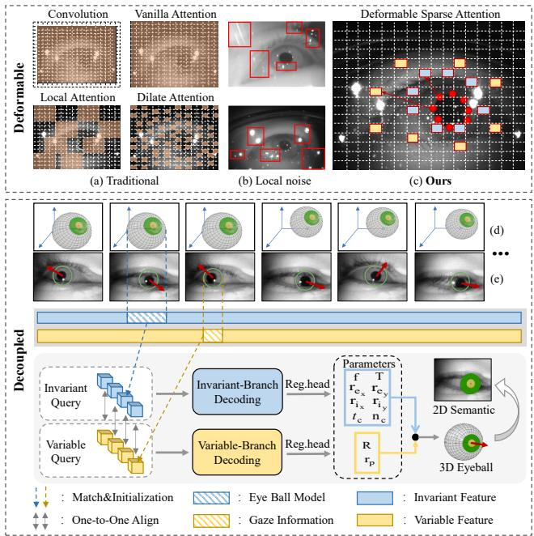
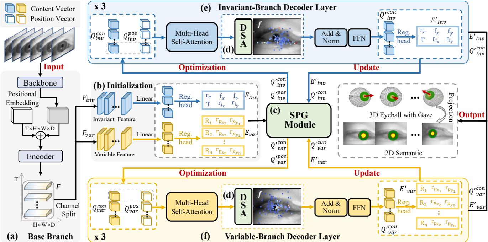
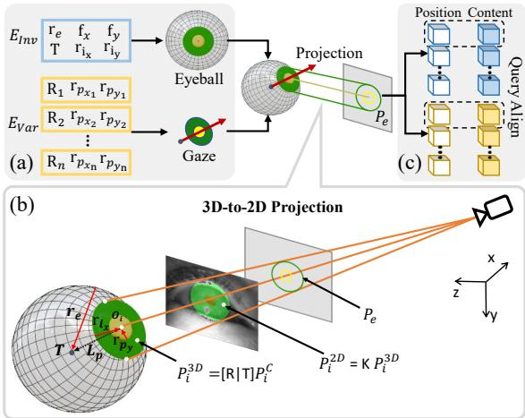
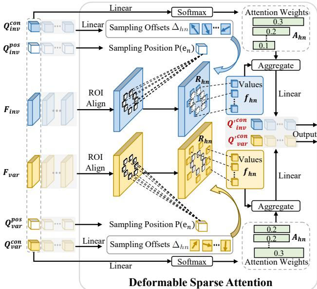
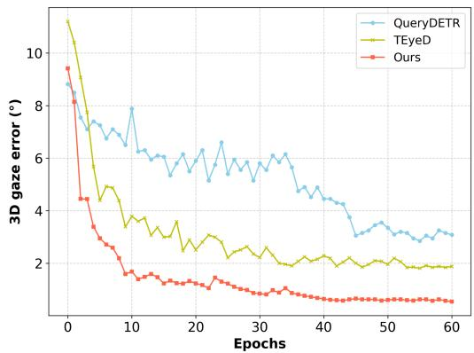
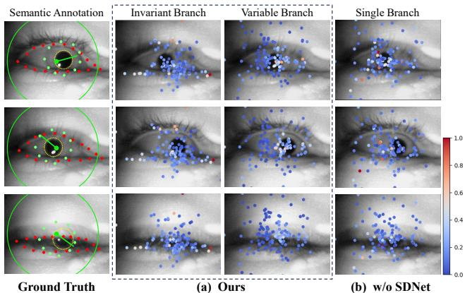
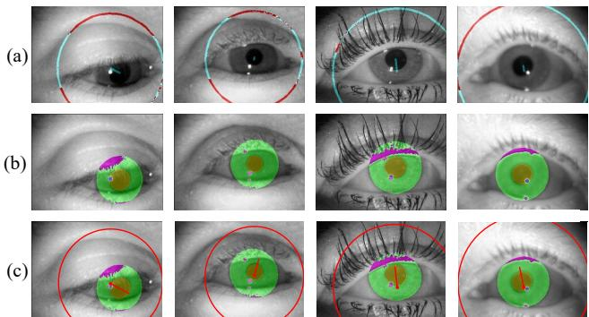

# De2Gaze: Deformable and Decoupled Representation Learning for 3D Gaze Estimation

Yunfeng Xiao1,4,† Xiaowei Bai2,4,† Baojun Chen1 Hao Su2,3,4 Hao He2,4 Liang Xie2,4,\* Erwei Yin2,4,\* 1Tianjin University, China 2Academy of Military Sciences (AMS), China 3Zhengzhou University, China 4Tianjin Artificial Intelligence Innovation Center, China {xyf0701, baojun chen}@tju.edu.cn, {xielnudt, yinerwei1985}@gmail.com bxw1992@mail.ustc.edu.cn, hehao209@126.com, iesuhao@zzu.edu.cn

## Abstract

3D Gaze estimation is a challenging task due to two main issues. First, existing methodsfocus on analyzing densefeatures (e.g., large pixel regions), which are sensitive to local noise (e.g., light spots, blurs) and result in increased computational complexity. Second, an eyeball model can correspond multiple gaze directions, and the entangled representation between gazes and models increases the learning difficulty. To address these issues, we propose De2Gaze, a lightweight and accurate model-aware 3D gaze estimation method. In De2Gaze, we introduce two key innovations for deformable and decoupled representation learning. Specifically, first, we propose a deformable sparse attention mechanism that can adapt sparse sampling points to attention areas to avoid local noise influences. Second, we propose a spatial decoupling network with a dual-branch decoding architecture to disentangle invariant (e.g., eyeball radius, position) and variable (e.g., gaze, pupil, iris) features from the latent space. Compared to existing methods, De2Gaze requires fewer sparse features, and achieves faster convergence speed, lower computational complexity, and higher accuracy in 3D gaze estimation. Qualitative and quantitative experiments demonstrate that De2Gaze achieves stateof-the-art accuracy and high-quality semantic segmentation for 3D gaze estimation on the TEyeD dataset.

## 1. Introduction

Gaze estimation is a crucial task that is widely applied in fields of human-computer interaction [1, 38, 41], medical analysis [5], virtual or augmented reality [3, 24, 43], psychological research [23], and so on. In contrast to 2D gaze, 3D gaze contains richer spatial information [35] and is more challenging to predict accurately. The key challenge lies in two aspects. First, as shown in Fig. 1(a)(b), existing gaze estimation methods focus on analyzing dense features (e.g., large pixel regions) [29, 34, 46] that are sensitive to local noise (e.g., light spots, blurs) and lead to increased computational complexity. Second, an eyeball model has various gaze directions, and the coupled representation between gazes and eyeball models increases learning difficulty [12].

  
Figure 1. De2Gaze introduces two key innovations for deformable and decoupled representation learning. Top: (a) Traditional methods focus on dense features (e.g., large pixel regions) that are sensitive to local noise (b) (e.g., light spots, blurs). (c) The deformable sparse attention mechanism adeptly samples attention areas to avoid local noise effects. Bottom: We propose a spatial decoupling network with a dual-branch decoding architecture to disentangle invariant (e.g., eyeball radius, position) level (d) and variable (e.g., gaze, pupil, iris) level (e) features from latent space.

To address these issues, we propose De2Gaze, a lightweight and accurate model-aware 3D gaze estimation method. De2Gaze introduces two innovations for deformable and decoupled representation learning. First, as shown in Fig. 1 top, we propose a deformable sparse attention (DSA) mechanism that adapts sparse sampling positions to attention areas, focusing on salient features and avoiding the influence of local noise. Specifically, DSA generates sampling positions by projecting and aligning a learnable 3D eyeball model onto 2D eye images, which improves gaze estimation accuracy by prior geometric constraints from the eyeball. Second, as shown in Fig. 1 bottom, we propose a spatial decoupling network called SD-Net, SDNet employs a dual-branch decoding architecture to disentangle invariant (e.g., eyeball radius, eyeball center) and variable (e.g., gaze, pupil and iris position) features.

In De2Gaze, we input a sequence of infrared near-eye frames into our tailored network with deformable and decoupled representation learning, and finally output a predicted 3D eyeball with gaze and iris/pupil segmentation results. Compared to existing methods, De2Gaze requires fewer sparse features while achieving faster convergence speed, lower computational complexity, and higher accuracy in 3D gaze estimation. Qualitative and quantitative experiments show that our De2Gaze achieves state-of-the-art performance in 3D gaze estimation accuracy and semantic segmentation on the TEyeD dataset.

To summarize, our main contributions are three-fold:

• We propose De2Gaze, a novel lightweight and accurate model-aware 3D gaze estimation method. Compared to existing 3D gaze estimation methods, De2Gaze requires fewer sparse features while achieving faster convergence, lower computational complexity and higher accuracy.

• We introduce an approach for deformable and decoupled representation learning. First, we propose a DSA mechanism to avoid the effects of local noise. Second, we propose SDNet, a dual-branch decoding network designed to decouple the invariant and variable features from the latent space. Moreover, we propose an edge projection method to incorporate geometric constraints of 3D eyeball to enhance gaze estimation accuracy.

• Extensive experiments demonstrate that De2Gaze produces impressive results, and achieves state-of-the-art accuracy and high-quality semantic segmentation performance for 3D gaze estimation on the TEyeD dataset.

## 2. Related Work

Appearance-Based Gaze Estimation. Appearance-based methods usually use face or eye images to extract highdimensional features and learn the mapping from features to gaze direction. The rise of these methods is mainly supported by deep learning and large-scale datasets [17, 19, 22]. In the early days, Xu et al. [47] introduced the monocular image into VGG16, connected the head pose with the convolved features, and finally obtained the gaze direction mapping through the full connection layer. In the research of Chen and Shi [8], Biswas et al. [2], Chen and Shi [9], dilated convolution layers was used to replace ordinary convolution layers and pooling layers to enlarge the receptive field. Some works make efforts to eliminate the influence of factors other than gaze. Zhang et al. [46] reduced the influence of head pose by normalizing the eyes images according to the rotating a virtual cameras [36]. Deng et al. [48] learned head poses, gaze directions in different coordinate systems, and the transformation between them.

Model-Based Gaze Estimation. We refer to the gaze estimation methods which reconstruct a 3D parametric eyeball model as model-based methods. Traditional approaches [6, 21] rely on the detection and tracking of glints in infrared images, which are the reflection of light sources on the cornea. Swirski et al.[37] introduced a simplified glintfree 3D eyeball model where images from a single camera were used as input. The algorithm fits the pupil motion observed in the images, and the resulting eyeball model can be directly used to calculate gaze vectors. Corneal refraction is considered in follow-up works [10, 11] to further improve estimation accuracy. Liu Jiahui et al [28] proposed a 3D gaze estimation method based on iris features. According to iris features and calibrated iris radius, the optical axis of user’s eyes is reconstructed. Kuang et al. [26] used stereo images to construct deformable eyeball models. Recently, Nikola Popovic et al. [12] predict gaze directions by predicting a fully differentiable 3D eyeball model which can additionally be weakly supervised with semantics.

Model-based methods exhibit good generalization, but the 3D eyeball modeling is treated as a whole, without decoupling the features, which leads to performance bottlenecks and poor interpretability. Most methods extract eye features and then fit the model. However, these models are non-differentiable, making integration with deep learning frameworks difficult and preventing end-to-end training. Appearance-based learning methods rely on rely on imageextracted 2D features without leveraging 3D geometric information. We decouple 3D eyeball features into invariant and variable components, and construct a fully differentiable 3D eyeball model using a spatial decoupling structure to estimate 3D gaze or perform eye feature segmentation.

## 3. Methodology

## 3.1. Preliminaries

Query-Based 3D Object Detection. Query-based 3D object detection [7, 27, 31, 32, 42] is inspired by the success of

  
Figure 2. System pipeline of $\mathrm { D e ^ { 2 } G a z e }$ . Given a sequence of near-eye frames I, our De2Gaze is modeled as a function Φ to predict a 3D eyeball model $e ^ { m }$ , 3D gaze $e ^ { g }$ , and 2D semantics $e ^ { s }$ , formalized as $\{ e ^ { m } , e ^ { g } , e ^ { s } \} = \Phi ( { \mathcal { T } } )$

DETR [4], extending it to 3D object detection in complex scenes. DETR3D leverages a transformer architecture [40] and employs $N _ { q }$ learnable object queries to represent highlevel object candidates. These object queries are explicitly positioned in 3D space, enabling the model to predict 3D bounding boxes for objects in the scene. The 3D queries are updated through self-attention and cross-attention mechanisms, refining both object-level relationships and interactions with the multi-view image features. The main advantage of DETR3D is its ability to predict sparse, accurate 3D object detections without complex post-processing, such as Non-Maximum Suppression (NMS).

Deformable Attention. Deformable attention [49] is introduced to address the computational inefficiency and slow convergence of traditional multi-head self-attention mechanisms. Given the query feature $\mathbf { z } _ { q }$ , q indexs a query element, sampling point $p _ { q }$ , and the input feature map ${ \textbf { X } } \in$ $\mathbb { R } ^ { C \times H \times W }$ , the deformable attention is calculated as:

## 3.2. Overview

$$
\begin{array} { l } { { \displaystyle { \cal D } \mathrm { e f o r m } { \cal A } \mathrm { t t n } ( { \bf z } _ { q } , p _ { q } , { \bf X } ) = } \ ~ } \\ { { \displaystyle \sum _ { m = 1 } ^ { M } W _ { m } \left[ \sum _ { k = 1 } ^ { K } A _ { m q k } \cdot { \bf W } _ { m } ^ { \prime } { \bf X } ( p _ { q } + \Delta p _ { m q k } ) \right] } , } \end{array}\tag{1}
$$

where $m$ and k index the attention head and sampled keys, M and K denote the total number of attention heads and sampling points. $\Delta p _ { m q k }$ and $A _ { m q k }$ denote the sampling offset and attention weight of the k-th sampling point in the m-th attention head. $A _ { m q k } = \mathrm { S o f t M a x } ( \mathrm { L i n e a r } ( \mathbf { z } _ { q } ) )$ .

The overall pipeline is shown in Fig. 2. Given a sequence of near-eye frames $\mathcal { T } = \{ I _ { 1 } , I _ { 2 } , \ldots , I _ { n } \}$ , De2Gaze is modeled as a function Φ to predict 3D eyeball model $e ^ { m }$ , 3D gaze $e ^ { g }$ and 2D semantics $e ^ { s }$ , formalized as $\{ e ^ { m } , e ^ { g } , e ^ { s } \} = \Phi ( { \cal T } )$

Our method Φ consists of three main components: a base branch $\Phi _ { b a s } \ [ \mathrm { F i g . \ 2 ( a ) } ]$ , a initialization module $\Phi _ { i n t }$ [Fig. 2(b)], and a SDNet $\Phi _ { s d }$ [Fig. $2 ( \mathrm { c } ) ( \mathrm { d } ) ( \mathrm { e } ) ]$ . First, as shown in Fig. 2(a), we input I to $\Phi _ { b a s }$ with a backbone feature extractor B (e.g., ResNet-18 [20]) and a transformer encoder $T .$ , and the variable features $\mathcal { F } _ { v a r }$ and invariant features $\mathcal { F } _ { i n v }$ are extracted from I, represented as $\{ \mathcal { F } _ { v a r } ,$ ${ \mathcal { F } } _ { i n v } \} = T ( B ( { \mathcal { T } } ) )$ . Then, as shown in Fig. 2(b), in initialization module, $\mathcal { F } _ { v a r } \left( \mathrm { o r } \mathcal { F } _ { i n v } \right)$ is linearized to content vector $Q _ { v a r } ^ { c o n }$ (or $Q _ { i n v } ^ { c o n } )$ ), and then obtain eye variable parameters $E _ { v a r }$ (or invariant parameters $E _ { i n v } )$ by regressed head.

Please note that our SDNet is an iterative process. For each iteration, in both variable [Fig. 2(e)] and invariable [Fig. 2(f)] branches, we optimize position/content vectors by the DSA module [Fig. 2(d)], and update eye parameters $E _ { v a r }$ and $E _ { i n v }$ to the sampling point generation (SPG) module $[ \mathrm { F i g . 2 ( c ) } ]$ . Next, as shown in Fig. 3, the SPG module constructs a 3D eyeball model with gaze according to $E _ { v a r }$ and $E _ { i n v }$ , and predicts sampling positions and corresponding position vectors $Q _ { v a r } ^ { p o s }$ and $Q _ { i n v } ^ { p o s }$ . In each iteration, the eye model $e ^ { m }$ and gaze $e ^ { s }$ are optimized to be more accurate, and after n-times iterations (empirically, $n = 3 )$ , we output the finally optimized $e ^ { m } , e ^ { g }$ , and projected semantics $e ^ { s }$ with high accuracy.

We will detail the SPG Module, DSA module, and SD-

Net in Section 3.3, Section 3.4 and Section 3.5 respectively.

## 3.3. Sampling Point Generation

Learnable 3D Eyeball Model. Similar to previous work [10, 12, 37] that model the eyeball as a sphere defined by its center $o _ { e }$ and radius $r _ { e }$ . Then, we model the pupil and iris as ellipses with separate horizontal and vertical radii to better capture the natural asymmetry of the human eye. For each frame $I _ { n }$ , the estimated eye parameters are:

$$
E _ { i n v } = \{ r _ { e } , r _ { i _ { x } } , r _ { i _ { y } } , T \}\tag{2}
$$

and

$$
E _ { v a r } = \{ r _ { p _ { x _ { n } } } , r _ { p _ { y _ { n } } } , R _ { n } \} ,\tag{3}
$$

where the eyeball radius $r _ { e }$ and iris radii $r _ { i _ { x } } , r _ { i _ { y } }$ remain constant throughout the sequence. The pupil radius $r _ { p _ { x _ { n } } } , r _ { p _ { y _ { n } } }$ and eyeball rotation $R _ { n }$ vary for each frame. The translation vector $T$ represents the position of the eyeball center in camera coordinates, while the rotation matrix $R _ { n }$ describes the frame-specific rotation of the eyeball. The normalized optical axis $g$ is defined as the vector from the eyeball center $o _ { e }$ to the iris center $\begin{array} { r } { o _ { i } , g = \frac { o _ { i } - o _ { e } } { \left\| o _ { i } - o _ { e } \right\| } } \end{array}$ . In addition, we also estimate the camera’s intrinsic parameters and use the pinhole camera model with the focal length $f _ { x }$ and $f _ { y }$ . We assume the camera center to be $\textstyle ( c _ { x } , c _ { y } ) = ( { \frac { \dot { W } } { 2 } } , { \frac { H } { 2 } } )$

Our model remains fully learnable, allowing it to be trained end-to-end. For each frame $I _ { n } .$ , we estimate the eyeball parameters $E _ { v a r }$ and $E _ { i n v } ,$ , and apply them to deform a canonical eye model in camera coordinates. The described eye model can be observed in Fig. 3(a).

Pupil Clouds and Iris Clouds Generation. After reconstructing the learnable 3D eyeball model, we generate a discrete point cloud for the pupil circle and iris disk:

$$
\begin{array} { r l } & { P _ { p } ^ { C } = \{ ( r _ { p _ { x } } \rho \cos ( \theta ) , r _ { p _ { y } } \rho \sin ( \theta ) , } \\ & { ~ - \ L _ { p } ) \mid \rho \in [ 0 , 1 ] , \theta \in [ 0 , 2 \pi ] \} } \end{array}\tag{4}
$$

and

$$
\begin{array} { r l } & { P _ { i } ^ { C } = \{ ( r _ { x } \cos ( \theta ) , r _ { y } \sin ( \theta ) , \ - L _ { p } ) \ | } \\ & { \quad r _ { x } = r _ { p _ { x } } + \rho ( r _ { i _ { x } } - r _ { p _ { x } } ) , } \\ & { \quad r _ { y } = r _ { p _ { y } } + \rho ( r _ { i _ { y } } - r _ { p _ { y } } ) , \rho \in [ 0 , 1 ] , \theta \in [ 0 , 2 \pi ] \} , } \end{array}\tag{5}
$$

where $r _ { p _ { x } }$ and $r _ { p _ { y } }$ are the horizontal and vertical radii of the pupil, ${ r } _ { i _ { x } }$ and $r _ { i _ { x } }$ are the varying horizontal and vertical radii of the iris. And $L _ { p } = \sqrt { r _ { e } ^ { 2 } - r _ { i } ^ { 2 } }$ represents the distance from the center of the eyeball to the iris center.

3D-to-2D Projection. Different from the existing object detection based on 3D random points projection sampling [27, 31, 33, 42], we project the geometrically significant points, such as the edges of the pupil and iris, onto the 2D image plane using a camera projection matrix for eyeball reconstruction. Refer to the previous work [12], we obtain the deformed 3D point clouds in the camera coordinate system and project them onto the 2D camera screen:

  
Figure 3. Sampling Point Generation Module. (a) Reconstruction of learnable 3D eyeball model with parameters. (b) Differentiable operations of 3D eyeball projection to 2D plane. (c) Alignment of content vector $Q ^ { c o n }$ and position vector $\bar { Q } ^ { p o s }$ of two branches.

$$
P _ { p } ^ { 3 D } = [ R | T ] P _ { p } ^ { C }\tag{6}
$$

and

$$
P _ { p } ^ { 2 D } = K P _ { p } ^ { 3 D } = \left[ \begin{array} { c c c } { { f _ { x } } } & { { 0 } } & { { W / 2 } } \\ { { 0 } } & { { f _ { y } } } & { { H / 2 } } \\ { { 0 } } & { { 0 } } & { { 1 } } \end{array} \right] P _ { p } ^ { 3 D } ,\tag{7}
$$

[R|T] is the rotation and translation matrix, K is the camera projection matrix. The same equation is applied to $P _ { i } ^ { 2 D }$

As shown in Fig. 3(b), we only use the projected edge points $P ( e )$ as the initial reference points of deformable sparse attention, which ensures the sparsity of feature sampling and the high efficiency of attention calculation.

## 3.4. Deformable Sparse Attention

To avoid interference information (e.g., light spots, blurs) and the computational complexity caused by dense sampling, we propose a novel attention mechanism named Deformable Sparse Attention (DSA). As shown in Fig. 4, this mechanism takes advantage of both the prior position of 3D model projection and deformable sampling on 2D image plane, enabling more accurate feature extraction for the task of 3D eyeball parameter prediction.

Sampling Offset and Bilinear Interpolation. For each sampling point $P ( e _ { n } )$ generated by projection edge, we generate learnable offsets $\Delta _ { h n }$ to allow flexible sampling around the reference point in the 2D feature map, ensuring that the sampling points align more accurately with the 3D structure of the eyeball. Deformable reference points are generated as:

$$
R _ { h n } = P ( e _ { n } ) + \Delta _ { h n } ,\tag{8}
$$

  
Figure 4. Deformable Sparse Attention (DSA) uses 3D eyeball model projection and flexible sampling on 2D image plane to accurately extract features and reduce computational complexity.

where n denotes the number of reference points and h denotes the number of attention heads. We perform bilinear interpolation to extract features from the 2D feature map $\mathcal { F }$ The interpolated features $f _ { h n }$ are computed as follows:

$$
f _ { h n } = W _ { h } \cdot \mathrm { b i l i n e a r } ( \mathcal { F } , R _ { h n } ) ,\tag{9}
$$

where $R _ { h n }$ represents the reference points after 3D-to-2D projection, and $W _ { h }$ denotes the learnable bilinear interpolation weights of the value projection.

Attention Weighting and Output. We compute attention weights $A _ { h n }$ based on the query content vector $Q ^ { c o n }$ . These attention weights are used to aggregate the sampled and fused features, producing the final output:

$$
\mathrm { D S A } ( Q ^ { c o n } , R _ { h n } , \mathcal { F } ) = \sum _ { h = 1 } ^ { H } W _ { h } ^ { ' } \sum _ { n = 1 } ^ { N } A _ { h n } \cdot f _ { h n } .\tag{10}
$$

The DSA mechanism guides the region of interest (ROI) based on the edge of semantic projection, captures accurate features and reduces the computational complexity. Moreover, our deformable sparse attention can be easily extended to leverage multiscale image features following the practice of deformable attention [49].

## 3.5. Spatial Decoupling Network

Decoupled Query Construction. In our proposed method, we decouple the task of regressing 3D eyeball parameters into two distinct query groups: one for variable parameters $E _ { v a r }$ and the other for invariant parameters $E _ { i n v }$ . Similar to previous work[18, 30, 45], formally, the query group for variable parameters, denoted as $Q _ { v a r }$ , consists of content matrix $\dot { Q } _ { v a r } ^ { c o n } \in \mathbb { R } ^ { N _ { q } \times \frac { D } { 2 } }$ and position matrix $Q _ { v a r } ^ { p o s } \in$ $\begin{array} { r } { \mathbb { R } ^ { N _ { q } \times \frac { D } { 2 } } } \end{array}$ , the query group for invariant parameters denoted as $Q _ { i n v } ,$ , represented by the content matrix $Q _ { i n v } ^ { c o n } \in \mathbb { R } ^ { N _ { q } \times \frac { D } { 2 } }$ and position matrix $Q _ { i n v } ^ { \bar { p } o s } \in \mathbb R ^ { N _ { q } \times \frac { D } { 2 } }$ , where $N _ { q }$ is the number of queries and D denotes the feature dimension.

During the decoding process, we initialize the position vectors with the edge point projected by 3D eyeball, and the position vectors serve as reference points for sampling guidance. In addition, content vectors captures high-level semantic information to guide the query relation modeling in self-attention and the weight calculation in cross-attention.

Query Alignment with Joint Initialization. After constructing both query groups, it is essential to align the queries for iterative updating of the 3D eyeball parameters across frames. We adopt a joint query initialization strategy to ensure that variable and invariant queries contribute synergistically to the decoding process.

Specifically, we match the k-th variable query $Q _ { v a r , k } =$ $\{ Q _ { v a r , k } ^ { p o s } , Q _ { v a r , k } ^ { c o n } \}$ with the corresponding invariant query $Q _ { i n v , k } = \{ Q _ { i n v , k } ^ { p o s } , Q _ { i n v , k } ^ { c o n } \}$ . This one-to-one matching ensures that variable and invariant query groups are aligned at the same reference point, thus better capturing the global and local features of 3D eyeball model during decoding.

Spatial Decoupling Decoding. We partition the encoder feature map $\mathcal { F }$ into two levels: the variable-level feature $\mathcal { F } _ { v a r } \in \bar { \mathbb { R } ^ { T \times ( D / 2 ) } }$ and the instance-level feature $\mathcal { F } _ { i n v } ~ \in$ $\mathbb { R } ^ { T \times ( D / 2 ) }$ . This partition allows the queries from each level to focus on the specific semantics relevant to their respective levels. The decoder layers for both levels consist of a self-attention module, a deformable sparse attention module (DSA), and a feed-forward network (FFN):

$$
Q ^ { c o n } = \mathrm { s e l f - A t t e n t i o n } ( Q ^ { c o n } , Q ^ { p o s } )\tag{11}
$$

and

$$
Q ^ { c o n ^ { \prime } } = \mathrm { F F N } ( \mathrm { D S A } ( Q ^ { c o n } , Q ^ { p o s } , \mathcal { F } ) ) .\tag{12}
$$

The decoder layer takes the feature maps ${ \mathcal F } ,$ the content query vectors $Q ^ { c o n }$ and the position query vectors $Q ^ { p o s }$ as input. After the self-attention step, we employ DSA mechanism to attend to the semantic boundaries. Specifically, we use the 2D projection edge points $P _ { p u p i l } , P _ { i r i s }$ as reference points, which include the whole pupil contour area and part of iris contour area. The DSA attends to a small set of key sampling points around each reference point.

## 3.6. Loss Function

To improve the accuracy of 3D eyeball reconstruction, we define three primary loss functions:

Edge point projection loss measures the Euclidean distance between predicted sparse edge points and ground-

<table><tr><td rowspan="2">Methods</td><td rowspan="2">Backbone</td><td rowspan="2">Params FLOPs /(M)</td><td rowspan="2">/(G)</td><td rowspan="2">Loss</td><td colspan="4">TEyeD-subset_A Sem.</td><td colspan="4">TEyeD-subset_B</td></tr><tr><td>3D gaze [°]↓</td><td>2D gaze []↓</td><td>Iou</td><td> $\overline { { 2 \mathrm { { D } } \mathrm { { e y e } } } }$  cent.[px]↓</td><td>3D gaze [°]↓</td><td>2D gaze [°]↓</td><td>Sem. Iou</td><td>2D eye cent.[px]↓</td></tr><tr><td>TEyeD [17]</td><td>ResNet50</td><td>26.08</td><td>24.97</td><td>Gaze</td><td>1.88</td><td>6.90</td><td>N/A</td><td>N/A</td><td>4.80</td><td>17.17</td><td>N/A</td><td>N/A</td></tr><tr><td>NVGaze [22]</td><td>CNN</td><td>0.16</td><td>0.14</td><td>Gaze</td><td>3.65</td><td>8.34</td><td>N/A</td><td>N/A</td><td>8.37</td><td>23.73</td><td>N/A</td><td>N/A</td></tr><tr><td rowspan="2">Transformer-based [40]</td><td>ResNet18</td><td>15.53</td><td>14.83</td><td>Gaze</td><td>1.57</td><td>6.36</td><td>N/A</td><td>N/A</td><td>3.54</td><td>17.37</td><td>N/A</td><td>N/A</td></tr><tr><td>ResNet50</td><td>27.66</td><td>24.98</td><td>Gaze</td><td>1.77</td><td>6.40</td><td>N/A</td><td>N/A</td><td>3.56</td><td>16.25</td><td>N/A</td><td>N/A</td></tr><tr><td rowspan="2">QueryDETR [4]</td><td>ResNet18</td><td>16.36</td><td>18.33</td><td>Gaze</td><td>3.12</td><td>8.01</td><td>N/A</td><td>N/A</td><td>3.73</td><td>15.89</td><td>N/A</td><td>N/A</td></tr><tr><td>ResNet50</td><td>29.89</td><td>28.42</td><td>Gaze</td><td>3.08</td><td>7.86</td><td>N/A</td><td>N/A</td><td>3.40</td><td>15.14</td><td>N/A</td><td>N/A</td></tr><tr><td rowspan="3">Nikola et al. [12]</td><td>ResNet50</td><td>28.56</td><td>26.44</td><td>Gaze</td><td>1.04</td><td>7.40</td><td>N/A</td><td>N/A</td><td>3.03</td><td>17.07</td><td>N/A</td><td>N/A</td></tr><tr><td>ResNet50</td><td>28.56</td><td>26.44</td><td>Sem.</td><td>20.16</td><td>39.10</td><td>92.5%</td><td>11.41</td><td>22.56</td><td>40.10</td><td>86.6%</td><td>14.30</td></tr><tr><td>ResNet50</td><td>28.56</td><td>26.44</td><td> $\mathrm { S e m . + G a z e + C e n t . }$ </td><td>1.21</td><td>10.39</td><td>91.4%</td><td>2.02</td><td>4.66</td><td>24.71</td><td>85.7%</td><td>10.74</td></tr><tr><td rowspan="3">De²Gaze (Ours)</td><td>ResNet18</td><td>14.48</td><td>13.56</td><td>Gaze</td><td>0.54</td><td>5.43</td><td>N/A</td><td>N/A</td><td>2.61</td><td>14.02</td><td>N/A</td><td>N/A</td></tr><tr><td>ResNet18</td><td>14.48</td><td>13.56</td><td>Sem.</td><td>20.12</td><td>39.09</td><td>94.2%</td><td>9.24</td><td>21.41</td><td>39.10</td><td>90.5%</td><td>10.62</td></tr><tr><td>ResNet18</td><td>14.48</td><td>13.56</td><td> $\mathrm { S e m . + G a z e + C e n t . }$ </td><td>0.96</td><td>7.6</td><td>93.4%</td><td>1.52</td><td>3.36</td><td>15.71</td><td>88.7%</td><td>8.89</td></tr></table>

Table 1. Performance comparison of our proposed method $( \mathrm { D e ^ { 2 } G a z e } )$ with various advanced approaches on the TEyeD dataset. The table reports the results for both subsets A and B, highlighting the backbone architectures, parameter counts, and computational costs (FLOPs). The losses applied include Gaze, Semantic (Sem.), Eye Center (Cent.), and combined losses. Our approach demonstrates superior performance across all metrics, achieving a significant reduction in gaze error and improved semantic segmentation accuracy.

truth 2D edge points. For each edge point cloud $P _ { n k } ^ { 2 D }$ :

$$
\begin{array} { c } { { \displaystyle { \cal L } _ { \mathrm { e d g e } } = w _ { \mathrm { p r o j e c t i o n } } \frac { 1 } { N K } \sum _ { n = 1 } ^ { N } \sum _ { k = 1 } ^ { K _ { \mathrm { e d g e } } } \| P _ { n k } ^ { \mathrm { 2 D e d g e } } - } } \\ { { \displaystyle P _ { n a r g m i n _ { j } } ^ { \mathrm { G T , 2 D e d g e } } \| P _ { n k } ^ { \mathrm { 2 D e d g e } } - P _ { n j } ^ { \mathrm { G T , 2 D e d g e } } \| } , } \end{array}\tag{13}
$$

where $K _ { \mathrm { e d g e } }$ and $N$ are the total number of edge points and frames. $w _ { p r o j e c t i o n }$ is the loss weight.

Gaze vector loss measures the difference between the predicted gaze direction and the ground-truth gaze direction, we use the mean square error loss with weight $w _ { g a z e }$ .

$$
L _ { \mathrm { g a z e } } = w _ { \mathrm { g a z e } } \frac { 1 } { N } \sum _ { n = 1 } ^ { N } \left. g _ { n } - g _ { n } ^ { \mathrm { G T } } \right. .\tag{14}
$$

Eye center loss supervises the projected eyeball center $o _ { e } ^ { 2 D }$ $= K o _ { e } ^ { 3 D }$ with weighted Euclidean distance loss.

$$
L _ { \mathrm { c e n t e r } } ^ { \mathrm { 2 D } } = w _ { \mathrm { c e n t e r } } \frac { 1 } { N } \sum _ { n = 1 } ^ { N } \left. \partial _ { e } ^ { 2 D , n } - o _ { e } ^ { G T , 2 D , n } \right. .\tag{15}
$$

## 4. Experiments

## 4.1. Dataset and Setup

Dataset. TEyeD [17] is the largest image dataset in the world, which is shot by seven different head-mounted eye tracker. The dataset contains more than 20 million images, composed of 132 participants, obtained in different mission scenarios. The human eye images in the dataset include 2D and 3D feature points, semantic segmentation, 3D eyeball annotation, gaze vectors and eye movement types. TEyeD integrates the previous six public datasets(NNGaze [22], LPW [39], GIW [25], ElSe [15], ExCuSe [13] and PNET [14, 16]), and divides them into several subsets. We randomly selected about 348K images for training and about 36k images for testing from a subset of 16 participants. To verify the ability of the algorithm to cross subjects, about 16k images randomly selected from other 12 participants are also used for testing. The environmental conditions such as lighting and head positioning also differed from the original training setup, ensuring that our evaluation tested the cross-subject capabilities of the model. In addition, temporal downsampling is applied to reduce the frame rate from 25 Hz to 6.25 Hz, so that there is significant eye movements and the same eye images are avoided.

Implementation Details. Our experiment focuses on flicker-free gaze estimation and semantic segmentation of infrared near-eye video frames. Firstly, to mitigate overfitting, the training data set is additionally augmented by applying 1.0-2.0 standard deviation ambiguity, 0-30% random noise and a horizontal flip of the eye image with 20% probability. The transformer encoder has 3 encoder blocks with an embedding dimension of 256, 8 attention heads, an MLP expansion ratio of 2, and no dropout, while the decoder only changes the embedding dimension to 128, and the rest remain the same. The experiments use a batch size of 128, where each batch contains 4 consecutive eye video frames. In addition, we use LAMB optimizer [44] and cosine learning rate scheduler to optimize our model and preheat four epoch. The initial learning rate is 2e-3, and the weight attenuation is 0.02. The cosine scheduler gradually drops to 2e-5 after 320k training iterations. For the outermost radius value within the range $\rho \in [ 0 , 1 ]$ , we uniformly sample 26 angles in the range $\theta \in [ 0 , \bar { 0 . 1 } \pi ] \overset { \cdot } { \cup } [ 0 . 9 \pi , 1 . 1 \pi ] \cup [ 1 . 9 \pi , 2 \pi ]$ to form the iris edge template consisting of 26 points. We uniformly sample 128 angles in the range $\theta \in [ 0 , 2 \pi ]$ to form the pupil edge template consisting of 128 points.

<table><tr><td rowspan="3">Settings</td><td rowspan="3">Loss</td><td colspan="5">TEyeD-subset_A</td><td colspan="5">TEyeD-subset_B</td></tr><tr><td>[°]↓</td><td>3D gaze 2D gaze [°]↓</td><td>Sem. Iou</td><td>2D pupil</td><td> $\overline { { 2 \mathrm { D } \mathrm { e y e } } }$  cent.[px]↓ cent.[px]↓</td><td>3D gaze 2D gaze [°]↓</td><td>[°]↓</td><td>Sem. Iou</td><td>2D pupil cent.[px]↓</td><td>2D eye cent.[px]↓</td></tr><tr><td rowspan="2">w/o SDNet</td><td>Gaze</td><td>1.18</td><td>6.98</td><td>N/A</td><td>N/A</td><td>N/A</td><td>3.06</td><td>17.89</td><td>N/A</td><td>N/A</td><td>N/A</td></tr><tr><td>Sem. + Gaze + Cent.</td><td>1.31</td><td>7.86</td><td>91.7%</td><td>1.24</td><td>1.57</td><td>3.65</td><td>16.06</td><td>83.5%</td><td>10.24</td><td>11.57</td></tr><tr><td>w/o Learnable 3D Eye Model</td><td>Gaze</td><td>1.54</td><td>7.88</td><td>N/A</td><td>N/A</td><td>N/A</td><td>4.66</td><td>18.75</td><td>N/A</td><td>N/A</td><td>N/A</td></tr><tr><td rowspan="2">w/o SPG Module</td><td>Gaze</td><td>0.98</td><td>8.24</td><td>N/A</td><td>N/A</td><td>N/A</td><td>2.98</td><td>15.54</td><td>N/A</td><td>N/A</td><td>N/A</td></tr><tr><td>Sem. + Gaze + Cent.</td><td>1.23</td><td>8.69</td><td>90.9%</td><td>0.66</td><td>1.19</td><td>3.64</td><td>18.85</td><td>83.2%</td><td>9.66</td><td>11.29</td></tr><tr><td rowspan="2">w/o DSA</td><td>Gaze</td><td>1.11</td><td>7.96</td><td>N/A</td><td>N/A</td><td>N/A</td><td>2.93</td><td>15.12</td><td>N/A</td><td>N/A</td><td>N/A</td></tr><tr><td>Sem. + Gaze + Cent.</td><td>1.42</td><td>8.328</td><td>91.9%</td><td>1.29</td><td>1.27</td><td>3.44</td><td>17.22</td><td>84.1%</td><td>9.63</td><td>13.27</td></tr><tr><td rowspan="2">De²Gaze (Ours)</td><td>Gaze</td><td>0.54</td><td>5.43</td><td>N/A</td><td>N/A</td><td>N/A</td><td>2.61</td><td>14.02</td><td>N/A</td><td>N/A</td><td>N/A</td></tr><tr><td>Sem. + Gaze + Cent.</td><td>0.96</td><td>7.6</td><td>93.4%</td><td>0.44</td><td>1.52</td><td>3.36</td><td>15.71</td><td>88.7%</td><td>7.44</td><td>8.89</td></tr></table>

Table 2. Quantitative results of ablation research on two subsets of TEyeD dataset. In each index, the performance of the complete method is compared with that of different settings such as removing SDNet module, removing learnable 3D eye model, removing QA\$SPG module and removing DSA module respectively. The results show that our complete model $\mathrm { ( D e ^ { 2 } G a z e ) }$ is superior to the ablation version in most indicators, which highlights the positive contribution of each module to the overall performance

## 4.2. Main Results

Comparison with Other Methods. First of all, we use the whole training segmentation of TEyeD subset A to perform supervision. Tab. 1 shows our main results on test set of subset A. We compare our work with various methods, including TEyD [17] splicing the image sequence directly and sending it to ResNet-50 network, lightweight network NVGaze [22], transformer-based network [40], query-based encoder and decoder architecture [4], and the state-of-theart method Model-aware 3D Gaze [12]. Our $\mathrm { D e ^ { 2 } G a z e }$ is obviously superior to all previous methods. Compared with the previous best method, when only the gaze tag is used for supervision, our gaze error is reduced by 48%. When only semantic loss is used, our method can get very accurate semantic regions, and IoU is improved by 1.7%. However, the quality of the estimated gaze vector and the projected eyeball center is not good, because there are many configurations of eyes presenting the same 2D semantics in 3D. Therefore, a good learning strategy must impose more constraints and supervision on 3D models. When gaze, semantics and eyeball center are supervised simultaneously, an excellent 3D eyeball model can be reconstructed.

Cross-Subject Evaluation. To evaluate the robustness of our proposed method across different subjects, we conducted experiments on another subset B of the TEyeD dataset. The results are summarized in Tab. 1. Our method demonstrated a strong ability to generalize across subjects, achieving an average gaze estimation error of $2 . 6 1 ^ { \circ }$ on the new subset. This represents a relative increase in error compared to the within-subject performance, but still remains competitive with existing state-of-the-art methods. The consistent performance across subjects shows that our approach effectively decouples invariant and variable gazerelated features, improving the generalization.

Convergence Speed. Compared to dense prediction methods, one of the common challenges with sparse query-based methods [4, 49] is their slow convergence issues. To evaluate the convergence speed of our proposed method, we compare it with both query-based and dense prediction methods. In Fig. 5, We plot the 3D gaze error curves of all three methods. Remarkably, our $\mathrm { D e ^ { 2 } G a z e }$ achieves a stable 3D gaze error much earlier than the purely query-based method (QueryDETR [4]), and exceeds the performance of dense prediction method (TEyeD [17]) after several epochs. This highlights the efficiency of our spatial decoupling network, and the contribution of the deformable sparse attention mechanism in improving convergence speed.

  
Figure 5. Compare the 3D gaze error curves of the three models during training to measure the convergence speed.

## 4.3. Ablation Study

As shown in Tab. 2, by selectively removing or replacing individual components, we conduct a comprehensive analysis of each component in our $\mathrm { D e ^ { 2 } G a z e }$ on two subsets of TEyeD, and assess its impact on the final results.

Impact of Spatial Decoupling Network. We use a singlebranch decoding structure instead of double-branch decoding structure (denoted as $w / o$ SDNet), which will lead to an increase in gaze estimation error. The result indicates that decoupling eyeball and gaze features is very important to avoid the conflict between short-term and long-term time scales, and help to optimize each feature independently.

  
Figure 6. Visualization of sampling position and attention map. (a) Invariant branch focuses on the stable geometric features of the eyeball, which are consistent from frame to frame. Variable branch focuses on pupil movement and gaze shift. (b) The attention area of the single branch is not clear enough.

Impact of Learnable 3D Eye Model. In the case of removing the differentiable 3D eyeball model (denoted as w/o Learnable 3D Eye Model), we observe the difficulty in endto-end optimization, and there is no geometric constraint leading to poor gaze estimation accuracy. This highlights the importance of learnable geometric model in achieving smooth integration with deep learning framework.

Impact of Sampling Position Generation. We use the method of randomly initializing query vectors and reference points (denoted as w/o SPG Module), which leads to unstable training and poor convergence. This shows that De2Gaze uses the prior semantics and position of edge points of 3D projection to provide additional constraints on double-branch queries, so that excellent prediction can be achieved with only a few decoder layers.

Impact of Deformable Sparse Attention. Standard cross attention [40] is used to replace DSA (denoted as w/o DSA). Experimental results show that standard attention is not effective in dynamically selecting important 2D feature points for feature aggregation. Our DSA mechanism solves the problems of interference by non-significant region information in traditional attention mechanism.

The full model outperforms all ablated configurations, which proves the necessity of each component to improve robustness and 3D gaze estimation accuracy.

## 4.4. Qualitative Results

Deformable and Decoupled Representation Learning. As shown in Fig. 6, we visualize the deformable sparse sampling points of the SDNet and the average weight of eight cross-attention heads. The spatial attention maps demonstrate that the invariant eyeball features pay more attention to the eyelid region, while the variable gaze features pay more attention to the pupil and iris region, which supports our hypothesis that the features in different positions have different contributions. By decoupling two branches, each one has more flexibility to capture its unique information.

  
Figure 7. Prediction results visualization of our method. (a) Visu alization of predicted eyeball and gaze vectors. (b) Projection of the reconstructed 3D eyeball model on the 2D plane is consistent with the pupil and iris positions. (c) Ground truth.

Prediction Visualization. Predicted gaze direction and 3D eye model are projected onto the 2D image plane for visualization. The results in Fig. 7 demonstrate that the predicted gaze vectors (Fig. 7(a)) are geometrically consistent with the eye’s appearance in each frame, while the reconstructed 3D eyeball model (Fig. 7(b)) aligns well with the overall shape and position of the pupil and iris after 2D rendering.

## 4.5. Discussion

Please note that we do not model the kappa angle offset between optical and visual axes. In Tab. 1, we put more 2D supervision on eyeball, such as the center of the eyeball and pupil, as well as the edge of the projection. However, the accuracy has declined. In supplementary, we have evaluated five subjects separately to eliminate the impact of Kappa angles, which shows that adding more 2D supervision on the same subject can improve 3D gaze accuracy.

## 5. Conclusion

In this paper, we present the deformable and decoupled representation learning for 3D gaze estimation. De2Gaze adopts a spatial decoupling network, which can distinctly capture the variable and invariant features of eyeball, and improve the model’s ability to capture features in different periods. To facilitate effective feature aggregation, we introduce a projective deformable sparse attention mechanism that focuses on key spatial locations, enhancing the model’s efficiency and convergence speed. Additionally, our approach leverages a learnable 3D eyeball model to impose geometric constraints, significantly improving gaze estimation accuracy. Extensive experiments demonstrate that our method enhances the robustness of 3D eyeball model reconstruction and gaze estimation accuracy, effectively balancing computational efficiency and generalization capability.

## Acknowledgment

This work was supported in part by the grants from the National Natural Science Foundation of China under Grant 62332019, the National Key Research and Development Program of China (2023YFF1203900, 2023YFF1203903). Sponsored by Beijing Nova Program (20240484513).

## References

[1] Henny Admoni and Brian Scassellati. Social eye gaze in human-robot interaction: a review. Journal ofHuman-Robot Interaction, 6(1):25–63, 2017. 1

[2] Pradipta Biswas et al. Appearance-based gaze estimation using attention and difference mechanism. In Proceedings ofthe IEEE/CVF conference on computer vision and pattern recognition, pages 3143–3152, 2021. 2

[3] Alisa Burova, John Makel¨ a, Jaakko Hakulinen, Tuuli Keski-¨ nen, Hanna Heinonen, Sanni Siltanen, and Markku Turunen. Utilizing vr and gaze tracking to develop ar solutions for industrial maintenance. In Proceedings of the 2020 CHI conference on humanfactors in computing systems, pages 1–13, 2020. 1

[4] Nicolas Carion, Francisco Massa, Gabriel Synnaeve, Nicolas Usunier, Alexander Kirillov, and Sergey Zagoruyko. End-toend object detection with transformers. In European conference on computer vision, pages 213–229. Springer, 2020. 3, 6, 7

[5] Nora Castner, Thomas C Kuebler, Katharina Scheiter, Juliane Richter, Ther´ ese Eder, Fabian H ´ uttig, Constanze Keu-¨ tel, and Enkelejda Kasneci. Deep semantic gaze embedding and scanpath comparison for expertise classification during opt viewing. In ACM symposium on eye tracking research and applications, pages 1–10, 2020. 1

[6] Jixu Chen, Yan Tong, Wayne Gray, and Qiang Ji. A robust 3d eye gaze tracking system using noise reduction. In Proceedings ofthe 2008 symposium on Eye tracking research & applications, pages 189–196, 2008. 2

[7] Shaoyu Chen, Xinggang Wang, Tianheng Cheng, Qian Zhang, Chang Huang, and Wenyu Liu. Polar parametrization for vision-based surround-view 3d detection. arXiv preprint arXiv:2206.10965, 2022. 2

[8] Zhaokang Chen and Bertram E Shi. Appearance-based gaze estimation using dilated-convolutions. In Asian Conference on Computer Vision, pages 309–324. Springer, 2018. 2

[9] Zhaokang Chen and Bertram E Shi. Towards high perfor mance low complexity calibration in appearance based gaze estimation. IEEE transactions on pattern analysis and machine intelligence, 45(1):1174–1188, 2022. 2

[10] Kai Dierkes, Moritz Kassner, and Andreas Bulling. A novel approach to single camera, glint-free 3d eye model fitting including corneal refraction. In Proceedings of the 2018 ACM Symposium on Eye Tracking Research & Applications, pages 1–9, 2018. 2, 4

[11] Kai Dierkes, Moritz Kassner, and Andreas Bulling. A fast approach to refraction-aware eye-model fitting and gaze prediction. In Proceedings of the 11th ACM Symposium on Eye Tracking Research & Applications, pages 1–9, 2019. 2

[12] Nikola et al. Model-aware 3d eye gaze from weak and fewshot supervisions. In 2023 ISMAR-Adjunct. 2, 4, 6, 7

[13] Wolfgang Fuhl, Thomas Kubler, Katrin Sippel, Wolfgang ¨ Rosenstiel, and Enkelejda Kasneci. Excuse: Robust pupil detection in real-world scenarios. In Computer Analysis of Images and Patterns: 16th International Conference, CAIP 2015, Valletta, Malta, September 2-4, 2015 Proceedings, Part I 16, pages 39–51. Springer, 2015. 6

[14] Wolfgang Fuhl, Thiago Santini, Gjergji Kasneci, and Enkelejda Kasneci. Pupilnet: Convolutional neural networks for robust pupil detection. arXivpreprint arXiv:1601.04902, 2016. 6

[15] Wolfgang Fuhl, Thiago C Santini, Thomas Kubler, and¨ Enkelejda Kasneci. Else: Ellipse selection for robust pupil detection in real-world environments. In Proceedings of the ninth biennial ACM symposium on eye tracking research & applications, pages 123–130, 2016. 6

[16] Wolfgang Fuhl, Thiago Santini, Gjergji Kasneci, Wolfgang Rosenstiel, and Enkelejda Kasneci. Pupilnet v2. 0: Convolutional neural networks for cpu based real time robust pupil detection. arXiv preprint arXiv:1711.00112, 2017. 6

[17] Wolfgang Fuhl, Gjergji Kasneci, and Enkelejda Kasneci. Teyed: Over 20 million real-world eye images with pupil, eyelid, and iris 2d and 3d segmentations, 2d and 3d landmarks, 3d eyeball, gaze vector, and eye movement types. In 2021 IEEE International Symposium on Mixed and Augmented Reality (ISMAR), pages 367–375. IEEE, 2021. 2, 6, 7

[18] Ziteng Gao, Limin Wang, Bing Han, and Sheng Guo. Adamixer: A fast-converging query-based object detector. In Proceedings of the IEEE/CVF Conference on Computer Vision and Pattern Recognition, pages 5364–5373, 2022. 5

[19] Stephan J Garbin, Yiru Shen, Immo Schuetz, Robert Cavin, Gregory Hughes, and Sachin S Talathi. Openeds: Open eye dataset. arXiv preprint arXiv:1905.03702, 2019. 2

[20] Kaiming He, Xiangyu Zhang, Shaoqing Ren, and Jian Sun. Deep residual learning for image recognition. In Proceed ings ofthe IEEE conference on computer vision and pattern recognition, pages 770–778, 2016. 3

[21] Craig Hennessey, Borna Noureddin, and Peter Lawrence. A single camera eye-gaze tracking system with free head motion. In Proceedings ofthe 2006 symposium on Eye tracking research & applications, pages 87–94, 2006. 2

[22] Joohwan Kim, Michael Stengel, Alexander Majercik, Shalini De Mello, David Dunn, Samuli Laine, Morgan McGuire, and David Luebke. Nvgaze: An anatomically-informed dataset for low-latency, near-eye gaze estimation. In Proceedings of the 2019 CHI conference on human factors in computing systems, pages 1–12, 2019. 2, 6, 7

[23] Chris L Kleinke. Gaze and eye contact: a research review. Psychological bulletin, 100(1):78, 1986. 1

[24] Robert Konrad, Anastasios Angelopoulos, and Gordon Wetzstein. Gaze-contingent ocular parallax rendering for virtual reality. ACM Transactions on Graphics (TOG), 39(2):1–12, 2020. 1

[25] Rakshit Kothari, Zhizhuo Yang, Christopher Kanan, Reynold Bailey, Jeff B Pelz, and Gabriel J Diaz. Gaze-in-wild: A

dataset for studying eye and head coordination in everyday activities. Scientific reports, 10(1):2539, 2020. 6

[26] Chenyi Kuang, Jeffery O Kephart, and Qiang Ji. Towards an accurate 3d deformable eye model for gaze estimation. In International Conference on Pattern Recognition, pages 109–123. Springer, 2022. 2

[27] Zhiqi Li, Wenhai Wang, Hongyang Li, Enze Xie, Chonghao Sima, Tong Lu, Yu Qiao, and Jifeng Dai. Bevformer: Learning bird’s-eye-view representation from multi-camera images via spatiotemporal transformers. In European conference on computer vision, pages 1–18. Springer, 2022. 2, 4

[28] Jiahui Liu, Jiannan Chi, Wenxue Hu, and Zhiliang Wang. 3d model-based gaze tracking via iris features with a single camera and a single light source. IEEE Transactions on Human-Machine Systems, 51(2):75–86, 2020. 2

[29] Song Liu, Danping Liu, and Haiyang Wu. Gaze estimation with multi-scale channel and spatial attention. In Proceedings ofthe 2020 9th International Conference on Computing and Pattern Recognition, pages 303–309, 2020. 1

[30] Shilong Liu, Feng Li, Hao Zhang, Xiao Yang, Xianbiao Qi, Hang Su, Jun Zhu, and Lei Zhang. Dab-detr: Dynamic anchor boxes are better queries for detr. arXiv preprint arXiv:2201.12329, 2022. 5

[31] Yingfei Liu, Tiancai Wang, Xiangyu Zhang, and Jian Sun. Petr: Position embedding transformation for multi-view 3d object detection. In European Conference on Computer Vision, pages 531–548. Springer, 2022. 2, 4

[32] Yingfei Liu, Junjie Yan, Fan Jia, Shuailin Li, Aqi Gao, Tiancai Wang, and Xiangyu Zhang. Petrv2: A unified framework for 3d perception from multi-camera images. In Proceedings ofthe IEEE/CVF International Conference on Computer Vision, pages 3262–3272, 2023. 2

[33] Zhipeng Luo, Changqing Zhou, Gongjie Zhang, and Shijian Lu. Detr4d: Direct multi-view 3d object detection with sparse attention. arXiv preprint arXiv:2212.07849, 2022. 4

[34] Bhanuka Mahanama, Yasith Jayawardana, and Sampath Jayarathna. Gaze-net: Appearance-based gaze estimation using capsule networks. In Proceedings of the 11th augmented human international conference, pages 1–4, 2020. 1

[35] Stefan Stojanov, Sachin S Talathi, and Abhishek Sharma. The benefits of depth information for head-mounted gaze estimation. In 2022 Symposium on Eye Tracking Research and Applications, pages 1–7, 2022. 1

[36] Yusuke Sugano, Yasuyuki Matsushita, and Yoichi Sato. Learning-by-synthesis for appearance-based 3d gaze estimation. In Proceedings of the IEEE conference on computer vision and pattern recognition, pages 1821–1828, 2014. 2

[37] Lech Swirski and Neil A Dodgson. A fully-automatic, tem-´ poral approach to single camera, glint-free 3d eye model fitting. Proceedings ofECEM, 2013, 2013. 2, 4

[38] Yunus Terzioglu, Bilge Mutlu, and Erol S¸ahin. Designing so-˘ cial cues for collaborative robots: the role of gaze and breathing in human-robot collaboration. In Proceedings ofthe 2020 ACM/IEEE international conference on human-robot interaction, pages 343–357, 2020. 1

[39] Marc Tonsen, Xucong Zhang, Yusuke Sugano, and Andreas Bulling. Labelled pupils in the wild: a dataset for studying

pupil detection in unconstrained environments. In Proceedings of the ninth biennial ACM symposium on eye tracking research & applications, pages 139–142, 2016. 6

[40] A Vaswani. Attention is all you need. Advances in Neural Information Processing Systems, 2017. 3, 6, 7, 8

[41] Haofei Wang, Xujiong Dong, Zhaokang Chen, and Bertram E Shi. Hybrid gaze/eeg brain computer interface for robot arm control on a pick and place task. In 2015 37th Annual International Conference of the IEEE Engineering in Medicine and Biology Society (EMBC), pages 1476–1479. IEEE, 2015. 1

[42] Yue Wang, Vitor Campagnolo Guizilini, Tianyuan Zhang, Yilun Wang, Hang Zhao, and Justin Solomon. Detr3d: 3d object detection from multi-view images via 3d-to-2d queries. In Conference on Robot Learning, pages 180–191. PMLR, 2022. 2, 4

[43] Zhimin Wang, Huangyue Yu, Haofei Wang, Zongji Wang, and Feng Lu. Comparing single-modal and multimodal interaction in an augmented reality system. In 2020 IEEE In ternational Symposium on Mixed andAugmented Reality Ad junct (ISMAR-Adjunct), pages 165–166. IEEE, 2020. 1

[44] Yang You, Jing Li, Sashank Reddi, Jonathan Hseu, Sanjiv Kumar, Srinadh Bhojanapalli, Xiaodan Song, James Demmel, Kurt Keutzer, and Cho-Jui Hsieh. Large batch optimization for deep learning: Training bert in 76 minutes. arXiv preprint arXiv:1904.00962, 2019. 6

[45] Hao Zhang, Feng Li, Shilong Liu, Lei Zhang, Hang Su, Jun Zhu, Lionel M Ni, and Heung-Yeung Shum. Dino: Detr with improved denoising anchor boxes for end-to-end object detection. arXiv preprint arXiv:2203.03605, 2022. 5

[46] Xucong Zhang, Yusuke Sugano, Mario Fritz, and Andreas Bulling. Appearance-based gaze estimation in the wild. In Proceedings ofthe IEEE conference on computer vision and pattern recognition, pages 4511–4520, 2015. 1, 2

[47] Xucong Zhang, Yusuke Sugano, Mario Fritz, and Andreas Bulling. Mpiigaze: Real-world dataset and deep appearancebased gaze estimation. IEEE transactions on pattern analy sis and machine intelligence, 41(1):162–175, 2017. 2

[48] Wangjiang Zhu and Haoping Deng. Monocular free-head 3d gaze tracking with deep learning and geometry constraints. In Proceedings of the IEEE International Conference on Computer Vision, pages 3143–3152, 2017. 2

[49] Xizhou Zhu, Weijie Su, Lewei Lu, Bin Li, Xiaogang Wang, and Jifeng Dai. Deformable detr: Deformable transformers for end-to-end object detection. arXiv preprint arXiv:2010.04159, 2020. 3, 5, 7