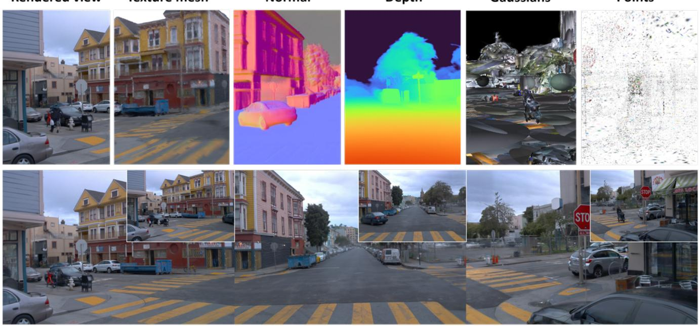
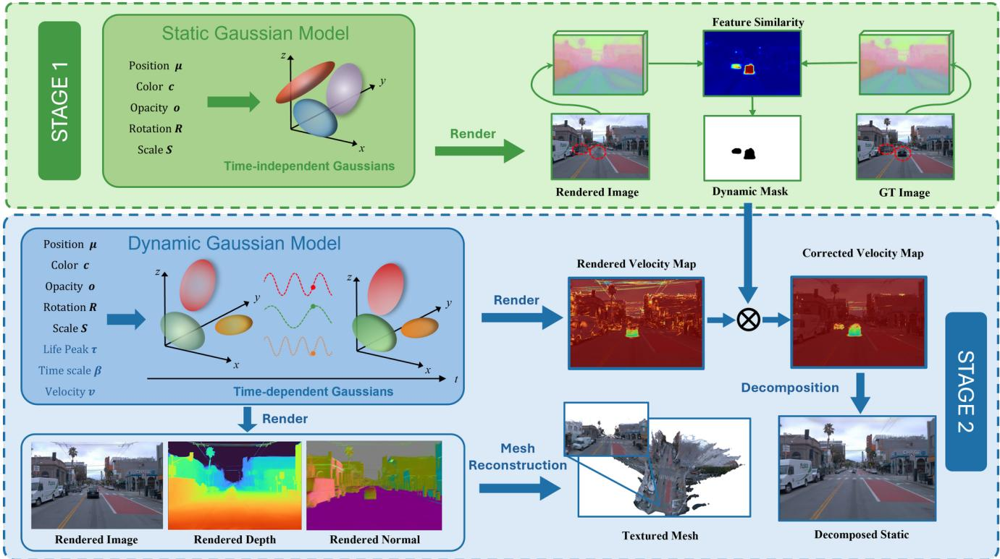
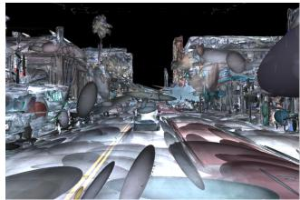
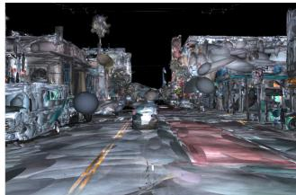
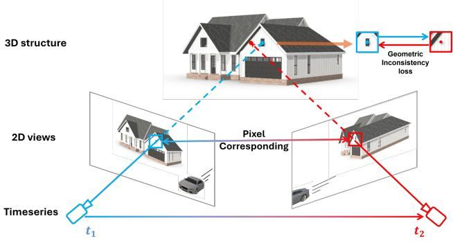
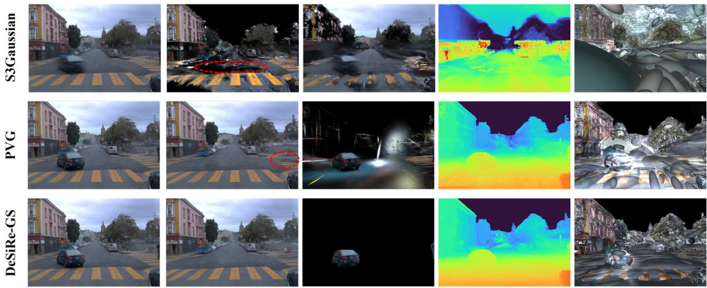
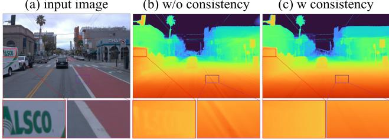

# DeSiRe-GS: 4D Street Gaussians for Static-Dynamic Decomposition and Surface Reconstruction for Urban Driving Scenes

Chensheng Peng∗ Chengwei Zhang∗ Yixiao Wang Chenfeng Xu Yichen Xie Wenzhao Zheng Kurt Keutzer Masayoshi Tomizuka Wei Zhan

UC Berkeley

Rendered view  
Texture mesh  
Normal  
Depth  
Gaussians  
  
Front  
Front Right  
Figure 1. DeSiRe-GS. We present a 4D street gaussian splatting representation for self-supervised static-dynamic decomposition and high-fidelity surface reconstruction without the requirement for extra 3D annotations such as bounding boxes.

## Abstract

We present DeSiRe-GS, a self-supervised gaussian splatting representation, enabling effective static-dynamic decomposition and high-fidelity surface reconstruction in complex driving scenarios. Our approach employs a two-stage optimization pipeline of dynamic street Gaussians. In the first stage, we extract 2D motion masks based on the observation that 3D Gaussian Splatting inherently can reconstruct only the static regions in dynamic environments. These extracted 2D motion priors are then mapped into the Gaussian space in a differentiable manner, leveraging an efficientformulation ofdynamic Gaussians in the second stage. Combined with

the introduced geometric regularizations, our method are able to address the over-fitting issues caused by data sparsity in autonomous driving, reconstructing physically plausible Gaussians that align with object surfaces rather thanfloating in air. Furthermore, we introduce temporal cross-view consistency to ensure coherence across time and viewpoints, resulting in high-quality surface reconstruction. Comprehensive experiments demonstrate the efficiency and effectiveness of DeSiRe-GS, surpassing prior self-supervised arts and achieving accuracy comparable to methods relying on external 3D bounding box annotations. Code is available at https://github.com/chengweialan/DeSiRe-GS

## 1. Introduction

Modeling driving scenes [11, 28] is essential for autonomous driving applications, as it facilitates real-world simulation and supports scene understanding [46]. An effective scene representation enables a system to efficiently perceive and reconstruct dynamic driving environments. Recent 3D Gaussian Splatting (3DGS) [16] has emerged as a prominent 3D representation that can be optimized through 2D supervision. It has gained popularity due to its explicit nature, high efficiency, and rendering speed.

While 3D Gaussian Splatting (3DGS) has demonstrated strong performance in static object-centric reconstructions, the original 3DGS struggles to handle dynamic objects in unbounded street views, which are common in real-world scenarios, particularly for autonomous driving applications. It is unable to effectively model dynamic regions, leading to blurring artifacts due to the Gaussian model’s time-independent parameterization. As a result, 4D-GS [35] is proposed, modeling the dynamics with a Hexplane encoder. The Hexplane [1] works well on object-level datasets, but struggles with driving scenes because of the unbounded areas in outdoor environments. Instead, we choose to reformulate the original static Gaussian model as time-dependent variables with minor changes, ensuring the efficiency of handling large-scale driving scenes.

In this paper, we present DeSiRe-GS, a purely Gaussian Splatting-based representation, which facilitates selfsupervised static-dynamic decomposition and high-quality surface reconstruction in driving scenarios. For staticdynamic decomposition, existing methods such as Driving-Gaussian [47] and Street Gaussians [38], rely on explicit 3D bounding boxes, which significantly simplifies the decomposition problem, since dynamic Gaussians in a moving bounding box can be simply removed. Without the 3D annotations, some recent self-supervised methods like PVG [5] and S3Gaussian [15] have attempted to achieve decomposition but fall short in performance, as they treat all Gaussians as dynamic, relying on indirect supervision to learn motion patterns. However, our proposed method can achieve effective self-supervised decomposition, based on a simple observation that dynamic regions reconstructed from 3DGS are blurry—quite different from the ground truth images. Despite the absence of 3D annotations, DeSiRe-GS produces results comparable to, or better than, approaches that use explicit bounding boxes for decomposition.

Another challenge in applying 3D Gaussian Splatting (3DGS) to autonomous driving is the sparse nature of images, which is more pronounced compared to object-centric reconstruction tasks. This sparsity often leads 3DGS to overfit on the limited number of observations, resulting in inaccurate geometry learning. Inspired by 2D Gaussian Splatting (2DGS) [14], we aim to generate flatter, disk-shaped Gaussians to better align with the surfaces of objects like roads and walls. We also couple the normal and scale of each Gaussian, which can be optimized jointly to improve surface reconstruction quality.

To further address the overfitting issue, we propose temporal geometrical cross-view consistency, which significantly enhances the model’s geometric awareness and accuracy by aggregating information from different views across time. These strategies allow us to achieve state-of-the-art reconstruction quality, surpassing other Gaussian splatting approaches in the field of autonomous driving.

Overall, DeSiRe-GS makes the following contributions:

• We propose to extract motion information easily from appearance differences based on a simple observation that 3DGS cannot successfully model the dynamic regions.

• We then distill the extracted 2D motion priors in local frames into global gaussian space, using time-varying Gaussians in a differentiable manner.

• We introduce effective 3D regularizations and temporal cross-view consistency to generate physically reasonable Gaussian ellipsoids, further enhancing high-quality decomposition and reconstruction.

We demonstrate DeSiRe-GS’s capability of effective static-dynamic decomposition and high-fidelity surface reconstruction across various challenging datasets [11, 28].

## 2. Related Work

Urban Scene Reconstruction. Recent advancements in novel view synthesis, such as Neural Radiance Field (NeRF) [21] and 3D Gaussian Splatting (3DGS) [16], have significantly advanced urban scene reconstruction. Many studies [22, 24, 27, 29, 30, 36, 39] have integrated NeRF into workflows for autonomous driving. Urban Radiance Fields [27] combine lidar and RGB data, while Block-NeRF [29] and Mega-NeRF [30] partition large scenes for parallel training. However, dynamic environments pose challenges. NSG [24], use neural scene graphs to decompose dynamic scenes, and SUDS [31] introduces a multi-branch hash table for 4D scene representation. Self-supervised approaches like EmerNeRF [39] and RoDUS [22] can effectively address dynamic scene challenges. EmerNeRF capturing object correspondences via scene flow estimation, and RoDUS utilizes a robust kernel-based training strategy combined with semantic supervision.

In 3DGS-based urban reconstruction, recent works [5, 6, 15, 38, 46, 47] have gained attention. StreetGaussians [38] models static and dynamic scenes separately using spherical harmonics, while DrivingGaussian [47] introduces specific modules for static background and dynamic object reconstruction. OmniRe [6] unifies static and dynamic object reconstruction via dynamic Gaussian scene graphs. However, [6, 38, 46] all require additional 3D bounding boxes which are sometimes difficult to obtain.

  
Figure 2. Pipeline of DeSiRe-GS. To tackle the challenges in self-supervised street scene decomposition. The entire pipeline is optimized without extra annotations in a self-supervised manner, leading to superior scene decomposition ability and rendering quality.

Static Dynamic Decomposition. Several approaches seek to model the deformation of dynamic and static components. D-NeRF [26], Nerfiles [25], Deformable GS [40] and 4D-GS [35] extend the vanilla NeRF or 3DGS by incorporating a deformation field. They compute the canonical-toobservation transformation and separate static and dynamic components through the deformation network. However, applying such methods to large-scale driving scenarios is challenging due to the substantial computational resources needed for learning dense deformation parameters, and the inaccurate decomposition leads to suboptimal peformance.

For autonomous driving scenarios, NSG [24] models dynamic and static parts as nodes in neural scene graphs but requires additional 3D annotations. Other NeRF-based methods [22, 31, 39] leverage a multi-branch structure to train time-dependent and time-invariant features separately. 3DGS-based methods, such as [5, 15, 38, 47], also focus on static-dynamic separation but still face limitations. [15] utilizes a deformation network with a hexplane temporalspatial encoder, requiring extensive computation. PVG [5] assigns attributes like velocity and lifespan to each Gaussian, distinguishing static from dynamic ones. Yet, the separation remains incomplete and lacks thoroughness.

Neural Surface Reconstruction. Traditional methods for Neural Surface Reconstruction focus more on real geometry structures. With the rise of neural radiance field (NeRF)

technologies, neural implicit representations have shown promise for high-fidelity surface reconstruction. Approaches like [19, 33, 41, 43] train neural signed distance functions (SDF) to represent scenes. StreetSurf [13] proposes disentangling close and distant views for better implicit surface reconstruction in urban settings, while [27] steps further using sparse lidar to enhance depth details.

3D GS has renewed interest in explicit geometric reconstruction, with recent works [2, 3, 9, 12, 14, 32, 42] focusing on geometric regularization techniques. SuGaR [12] aligns Gaussian ellipsoids to object surfaces through introducing and additional regularization term, while 2DGS [14] directly replaces 3D ellipsoids with 2D discs and utilizes the truncated signed distance function (TSDF) to fuse depth maps, enabling noise-free surface reconstruction. PGSR [2] introduces single- and multi-view regularization for multi-view consistency. GSDF [42] and NeuSG [3] combine 3D Gaussians with neural implicit SDFs to enhance surface details. TrimGS [9] refines surface structures by trimming inaccurate geometry, maintaining compatibility with earlier methods like 3DGS and 2DGS. While these approaches excel in small-scale reconstruction, newer works like [4, 7, 10] aim to address large-scale urban scenes. [4] adopts a large-scene partitioning strategy for reconstruction, while RoGS [10] proposes 2D Gaussian surfel representation which aligns with physical characteristics of road surfaces.

## 3. Preliminary

3D Gaussian Splatting: 3D Gaussian Splatting (3DGS) [16] employs a collection of colored ellipsoids, $G = \{ g \}$ to explicitly represent 3D scenes. Each Gaussian $g \ =$ $\{ \mu , s , r , o , c \}$ is defined by the following learnable attributes: a position center $\pmb { \mu } \in \mathbb { R } ^ { 3 }$ , a covariance matrix $\pmb { \Sigma } \in \mathbb { R } ^ { 3 \times 3 }$ , an opacity scalar o , and a color vector $^ { c , }$ which is modeled using spherical harmonics. The distribution of 3D Gaussians is mathematically described as:

$$
G ( \pmb { x } ) = \exp \left\{ - \frac { 1 } { 2 } ( \pmb { x } - \pmb { \mu } ) ^ { \top } \pmb { \Sigma } ^ { - 1 } ( \pmb { x } - \pmb { \mu } ) \right\} .\tag{1}
$$

The covariance matrix \protec \bm {\Sigma } can be formulated as follows: $\pmb { \Sigma } = \mathbf { R } \mathbf { S } \mathbf { S } ^ { \top } \mathbf { R } ^ { \top }$ , where \protec \mathbf {S} denotes a diagonal scaling matrix, while \mathbf {R} is a rotation matrix, parameterized as a scaling vector \boldsymbol {s} and a quaternion $\pmb { r } \in \mathbb { R } ^ { 4 }$ , respectively.

To generate images from a specific viewpoint, 3D gaussian ellipsoids are projected onto a 2D image plane to form 2D ellipses for rendering. For each pixel, a sequence of Gaussians $\mathcal { N }$ is sorted in ascending order based on depth. The color is then rendered through alpha blending:

$$
C = \sum _ { i \in \mathcal { N } } c _ { i } \alpha _ { i } \prod _ { j = 1 } ^ { i - 1 } ( 1 - \alpha _ { j } ) ,\tag{2}
$$

where $\alpha _ { i }$ and $c _ { i }$ denote the density and color of the i-th Gaussian, respectively, derived from the learned opacity and SH coefficients of the corresponding Gaussian.

Periodic Vibration Gaussian (PVG): PVG [5] reshapes the original Gaussian model by introducing time-dependent adjustments to the position mean $\pmb { \mu }$ and opacity o. The modified model is represented as follows:

$$
\tilde { \pmb { \mu } } ( t ) = \pmb { \mu } + \frac { l } { 2 \pi } \cdot \sin \left( \frac { 2 \pi ( t - \tau ) } { l } \right) \cdot \pmb { v } ,\tag{3}
$$

$$
\widetilde { o } ( t ) = o \cdot e ^ { - \frac { 1 } { 2 } ( t - \tau ) ^ { 2 } \beta ^ { - 2 } } ,\tag{4}
$$

where $\tilde { \pmb { \mu } } ( t )$ denotes vibrating position centered at $\pmb { \mu }$ occurring around life peak $\tau ,$ and $\tilde { o } ( t )$ represents the timedependent opacity which undergoes exponential decay as time deviates from the life peak $\tau , \beta$ and \protec \bm {v} determine the decay rate and the instant velocity at the life peak $\tau$ , respectively, and are both learnable parameters. l, as a pre-defined parameter of the scene, represents the oscillation period. Thus, the PVG model is expressed as:

$$
\mathscr { G } ( t ) = \{ \tilde { \mu } ( t ) , s , r , \tilde { o } ( t ) , c , \tau , \beta , { \pmb v } \} ,\tag{5}
$$

We adopt PVG as the dynamic representation for autonomous driving scenes, because PVG model preserves the structure of the original 3D GS model at any given time t, enabling it to be rendered using the standard 3D GS pipeline to reconstruct the dynamic scene. For further details about $\mathrm { P V G }$ , we refer the readers to [5].

## 4. DeSiRe-GS

As shown in Fig. 2, the training process is divided into two stages. We first extract 2D motion masks by calculating the feature difference between the rendered image and GT image. In the second stage, we distill the 2D motion information into Gaussian space using PVG [5], enabling the rectification of inaccurate attributes for each Gaussian in a differentiable manner.

## 4.1. Dynamic Mask Extraction (stage I)

During the first stage, we observe that 3D Gaussian Splatting (3DGS) performs effectively in reconstructing static elements, such as parked cars and buildings in a driving scene. However, it struggles to accurately reconstruct dynamic regions, as the original 3DGS does not incorporate temporal information. This limitation results in artifacts such as ghost-like floating points in the rendered images, as illustrated in Fig. 2 (stage 1). To address this issue, we leverage the significant differences between static and dynamic regions to develop an efficient method for extracting segmentation masks that encode motion information.

Initially, a pretrained foundation model is employed to extract features from both the rendered image and the ground truth (GT) image used for supervision. Let $\hat { F }$ denote the features extracted from the rendered image ${ \hat { I } } ,$ and F represent the features extracted from the GT image I. To distinguish dynamic and static regions, we compute the per-pixel dissimilarity D between the corresponding features. The dissimilarity metric D approaches 0 for similar features, indicating static regions, and nears 1 for dissimilar features, corresponding to dynamic regions.

$$
D = \left( 1 - \cos ( \hat { F } , F ) \right) / 2 .\tag{6}
$$

As the pretrained model is frozen, the resulting dissimilarity score $D \in R ^ { H \times W }$ is computed without involving any learnable parameters. Rather than applying a simple threshold to D to generate a motion segmentation mask, we propose a multi-layer perceptron (MLP) decoder to predict the dynamicness $\dot { \delta } \in \mathsf { R } ^ { H \times } \dot { \boldsymbol { W } }$ . This decoder leverages the extracted features, which contain rich semantic information, while the dissimilarity score is employed to guide and optimize the learning process of the decoder.

$$
\mathcal { L } _ { d y n } = \delta \odot D ,\tag{7}
$$

where $\odot$ refers to the element-wise multiplication.

By employing the loss function $\mathcal { L } _ { d y n }$ defined in Eq. 7, the decoder is optimized to predict lower values in regions where D is high, corresponding to dynamic regions, thereby minimizing the loss. We can then obtain the binary mask encoding motion information (ε is a fixed threshold):

$$
M = \mathbb { I } \left( \delta > \varepsilon \right) .\tag{8}
$$

During training, the joint optimization of image rendering and mask prediction mutually benefits each other. By excluding dynamic regions during supervision, the differences between rendered images and GT images become more noticeable, facilitating the extraction of motion masks.

$$
\mathcal { L } _ { m a s k e d - r e n d e r } = M \odot \| \hat { I } - I \| .\tag{9}
$$

## 4.2. Static Dynamic Decomposition (stage II)

While stage I provides effective dynamic masks, these masks are confined to the image space rather than the 3D Gaussian space and depend on ground truth images. This reliance limits their applicability in novel view synthesis, where supervised images may not be available.

To bridge the 2D motion information from stage I to the 3D Gaussian space, we adopt PVG, a unified representation for dynamic scenes (Section 3). However, PVG’s reliance on image and sparse depth map supervision introduces challenges, as accurate motion patterns are difficult to learn from indirect supervision signals. Consequently, the rendered velocity map $\mathbf { \bar { V } } \in R ^ { H \times \mathbf { \breve { W } } }$ , as shown in Fig. 2 (stage 2), often contains noisy outliers. For example, static regions such as roads and buildings, where the velocity should be zero, are not handled effectively. This results in unsatisfactory scene decomposition, with PVG frequently misclassifying regions where zero velocity is expected.

To mitigate this issue and generate more accurate Gaussian representations, we incorporate the segmentation masks obtained from stage I to regularize the 2D velocity map V, which is rendered from Gaussians in the 3D space.

$$
\begin{array} { r } { \mathcal { L } _ { v } = \mathbf { V } \odot M . } \end{array}\tag{10}
$$

Minimizing $\mathcal { L } _ { v }$ penalizes regions where velocity should be zero, effectively eliminating noisy outliers produced by the original PVG. This process propagates motion information from the 2D local frame to the global Gaussian space. With the refined velocity v for each Gaussian, dynamic and static Gaussians can be distinguished by applying a simple threshold. This approach achieves superior self-supervised decomposition compared to PVG [5] and S3Gaussian [15], without requiring additional 3D annotations such as bounding boxes used in previous methods [6, 38, 46].

## 4.3. Surface Reconstruction

## 4.3.1. Geometric Regularization

Flattening 3D Gaussian: Inspired by 2D Gaussian Splatting (2DGS) [14], we aim to flatten 3D ellipsoids into 2D disks, allowing the optimized Gaussians to better conform to object surfaces and enabling high-quality surface reconstruction. The scale $\boldsymbol { s } = ( s _ { 1 } , s _ { 2 } , s _ { 3 } )$ of 3DGS defines the ellipsoid’s size along three orthogonal axes. Minimizing the scale along the shortest axis effectively transforms 3D ellipsoids into 2D disks. The scaling regularization loss is:

  
(a) w/o regularization

  
(b) w regularization  
Figure 3. Gaussian Scale Regularization.

$$
\mathcal { L } _ { s } = \| \operatorname* { m i n } ( s _ { 1 } , s _ { 2 } , s _ { 3 } ) \| .\tag{11}
$$

Normal Derivation: Surface normals are critical for surface reconstruction. Previous methods incorporate normals by appending a normal vector $n _ { i } \in R ^ { 3 }$ to each Gaussian, which is then used to render a normal map $\mathcal { N } \in R ^ { H \times W }$ . The ground truth normal map is employed to supervise the optimization of the Gaussian normals. However, these approaches often fail to achieve accurate surface reconstruction, as they overlook the inherent relationship between the scale and the normal. Instead of appending a separate normal vector, we derive the normal n directly from the scale vector s. The normal direction naturally aligns with the axis corresponding to the smallest scale component, as the Gaussians are shaped like a disk after flattening regularization.

$$
n = R \cdot \arg \operatorname* { m i n } ( s _ { 1 } , s _ { 2 } , s _ { 3 } ) .\tag{12}
$$

With such formulation of the normal, the gradient can be back-propagated to the scale vector, rather than the appended normal vector, thereby facilitating better optimization of the Gaussian parameters. The normal loss is:

$$
\begin{array} { r } { \mathscr { L } _ { n } = \| \mathcal { N } - \hat { \mathcal { N } } \| _ { 2 } . } \end{array}\tag{13}
$$

Giant Gaussian Regularization: We observed that both 3DGS and PVG could produce oversized Gaussian ellipsoids without additional regularization, particularly in unbounded driving scenarios, as illustrated in Fig. 3 (a).

Our primary objective is to fit appropriately scaled Gaussians that support accurate image rendering and surface reconstruction. While oversized Gaussian ellipsoids with low opacity may have minimal impact on the rendered image, they can significantly impair surface reconstruction. This is a limitation often overlooked in existing methods focused solely on 2D image rendering. To address this issue, we introduce a penalty term for each Gaussian:

$$
s _ { g } = \operatorname* { m a x } ( s _ { 1 } , s _ { 2 } , s _ { 3 } ) ; \quad \mathcal { L } _ { g } = s _ { g } \cdot \mathbb { I } ( s _ { g } > \epsilon ) ,\tag{14}
$$

where $s _ { g }$ is the largest scale direction and ϵ is a predefined threshold for huge gaussians.

  
Figure 4. Cross-view consistency

## 4.3.2. Temporal Spatial Consistency

In driving scenarios, the sparse nature of views often leads to overfitting to the training views during the optimization of Gaussians. Single-view image loss is particularly susceptible to challenges in texture-less regions at far distances. As a result, relying on photometric supervision from images and sparse depth map is not reliable. To address this, we propose enhancing geometric consistency by leveraging temporal cross-view information.

Under the assumption that the depth of static regions remains consistent over time across varying views, we introduce a cross-view temporal-spatial consistency module. For a static pixel $( u _ { r } , v _ { r } )$ in the reference frame with a depth value $d _ { r }$ , we project it to the nearest neighboring view—the view with the largest overlap. Using the camera intrinsics K and extrinsics $T _ { r } , T _ { n }$ , the corresponding pixel location in the neighboring view is calculated as:

$$
[ u _ { n } , v _ { n } , 1 ] ^ { T } = K T _ { n } T _ { r } ^ { - 1 } \left( d _ { r } \cdot K ^ { - 1 } [ u _ { r } , v _ { r } , 1 ] ^ { T } \right) .\tag{15}
$$

We then query the depth value $d _ { n }$ at $( u _ { n } , v _ { n } )$ in the neighboring view. Projecting this back into 3D space, the resulting position should align with the position obtained by backprojecting $( u _ { r } , v _ { r } , d _ { r } )$ to the reference frame:

$$
\begin{array} { r } { [ u _ { n r } , v _ { n r } , 1 ] ^ { T } = K T _ { r } T _ { n } ^ { - 1 } \left( d _ { n } \cdot K ^ { - 1 } [ u _ { n } , v _ { n } , 1 ] ^ { T } \right) . } \end{array}\tag{16}
$$

To enforce cross-view depth consistency, we apply a geometric loss to optimize the Gaussians, defined as:

$$
\mathcal { L } _ { u v } = \| ( u _ { r } , v _ { r } ) - ( u _ { n r } , v _ { n r } ) \| _ { 2 } .\tag{17}
$$

This loss encourages the Gaussians to produce geometrically consistent depth across views over time.

## 4.4. Optimization

Stage I: During Stage I, our objective is to leverage the joint optimization of motion masks and rendered images to effectively learn the motion masks. Therefore, we only use the masked image losses $\mathcal { L } _ { I }$

$$
\mathcal { L } _ { I } = ( 1 - \lambda _ { s s i m } ) \| I - \tilde { I } \| _ { 1 } + \lambda _ { s s i m } \mathrm { S S I M } ( I , \tilde { I } ) .\tag{18}
$$

Combined with the motion loss from Eq.7, we can get:

$$
\mathcal { L } _ { s t a g e 1 } = M \odot \mathcal { L } _ { I } + \mathcal { L } _ { d y n } .\tag{19}
$$

Stage II: We use the alpha-blending to render the depth map, normal map and velocity map as follows:

$$
\{ \mathcal { D } , \mathcal { N } , \mathcal { V } \} = \sum _ { i \in N } \alpha _ { i } \prod _ { j = 1 } ^ { i - 1 } ( 1 - \alpha _ { j } ) \{ d _ { i } , n _ { i } , v _ { i } \} .\tag{20}
$$

For stage II, we use the projected sparse depth map $D _ { g t }$ from LiDAR as the supervision label.

$$
\mathcal { L } _ { D } = \Vert \mathcal { D } - D _ { g t } \Vert _ { 1 } .\tag{21}
$$

Together with the static velocity regularization (Eq. 10), flattened gaussian (Eq. 11), normal supervision (Eq. 13), giant gaussian regularization (Eq. 14), geometric consistency loss (Eq. 17), etc., the loss for stage II is:

$$
\mathcal { L } _ { s t a g e 2 } = \mathcal { L } _ { I } + \mathcal { L } _ { D } + \mathcal { L } _ { n } + \mathcal { L } _ { v } + \mathcal { L } _ { s } + \mathcal { L } _ { g } + \mathcal { L } _ { u v } .\tag{22}
$$

## 5. Experiments

## 5.1. Experimental Setups

Datasets. We conduct our experiments on the Waymo Open Dataset [28] and KITTI Dataset [11], both consisting of real-world autonomous driving scenarios. For the Waymo Open Dataset, we use the subset from PVG [5]. For a more complete comparison with non self-supervised methods, we also conduct experiments on the subset provided by OmniRe [6], which contains a large amount of highly dynamic scenes. We use the frontal three cameras (FRONT LEFT, FRONT, FRONT RIGHT) for Waymo Open Dataset, and the left and right cameras for KITTI dataset.

Evaluation Metrics. We adopt PSNR, SSIM [34] and LPIPS [45] as metrics for the evaluation of image reconstruction and novel view synthesis. Following [15, 38, 39], we also include DPSNR and DSSIM to assess the rendering quality at dynamic regions. Additionally, we introduce depth L1, which measures the L1 error between the rendered depth map and the ground truth depth map obtained from LiDAR point clouds, as an evaluation metric for the quality of geometric reconstruction.

Baselines. We benchmark DeSiRe-GS against the following approaches: 3DGS [16], StreetSurf [13], Mars [36], SUDS [31], EmerNeRF [39], S3Gaussian [15], PVG [5], OmniRe [6], StreetGS [38] and HUGS[46]. Among these methods, SUDS and EmerNeRF are NeRF-based self-supervised approaches. S3Gaussian and PVG are both 3DGS-based selfsupervised methods, the closest to our approach. To further highlight the superiority of DeSiRe-GS, we also compare it with OmniRe, StreetGS, and HUGS, all of which require additional bounding box information.

<table><tr><td rowspan="3">Method</td><td colspan="6">Waymo Open Dataset</td><td rowspan="2"></td><td colspan="6">KITTI</td><td rowspan="2"></td></tr><tr><td colspan="3">Image reconstruction</td><td colspan="3">Novel view synthesis</td><td colspan="3">Image reconstruction</td><td colspan="3">Novel view synthesis FPS</td></tr><tr><td></td><td></td><td></td><td></td><td>PSNR ↑ SSIM ↑ LPIPS ↓ PSNR ↑ SSIM ↑ LPIPS ↓</td><td></td><td>FPS</td><td></td><td></td><td></td><td></td><td>PSNR ↑ SSIM ↑ LPIPS ↓ PSNR ↑ SSIM ↑ LPIPS ↓</td><td></td><td></td></tr><tr><td>S-NeRF [37]</td><td>19.67</td><td>0.528</td><td>0.387</td><td>19.22</td><td>0.515</td><td>0.400</td><td>0.0014</td><td>19.23</td><td>0.664</td><td>0.193</td><td>18.71</td><td>0.606</td><td>0.352</td><td>0.0075</td></tr><tr><td>StreetSurf [13]</td><td>26.70</td><td>0.846</td><td>0.3717</td><td>23.78</td><td>0.822</td><td>0.401</td><td>0.097</td><td>24.14</td><td>0.819</td><td>0.257</td><td>22.48</td><td>0.763</td><td>0.304</td><td>0.37</td></tr><tr><td>3DGS [16]</td><td>27.99</td><td>0.866</td><td>0.293</td><td>25.08</td><td>0.822</td><td>0.319</td><td>63</td><td>21.02</td><td>0.811</td><td>0.202</td><td>19.54</td><td>0.776</td><td>0.224</td><td>125</td></tr><tr><td>NSG [24]</td><td>24.08</td><td>0.656</td><td>0.441</td><td>21.01</td><td>0.571</td><td>0.487</td><td>0.032</td><td>19.19</td><td>0.683</td><td>0.189</td><td>17.78</td><td>0.645</td><td>0.312</td><td>0.19</td></tr><tr><td>Mars [36]</td><td>21.81</td><td>0.681</td><td>0.430</td><td>20.69</td><td>0.636</td><td>0.453</td><td>0.030</td><td>27.96</td><td>0.900</td><td>0.185</td><td>24.31</td><td>0.845</td><td>0.160</td><td>0.31</td></tr><tr><td>SUDS [31]</td><td>28.83</td><td>0.805</td><td>0.317</td><td>25.36</td><td>0.783</td><td>0.384</td><td>0.008</td><td>28.83</td><td>0.917</td><td>0.147</td><td>26.07</td><td>0.797</td><td>0.131</td><td>0.29</td></tr><tr><td>EmerNeRF [39]</td><td>28.11</td><td>0.786</td><td>0.373</td><td>25.92</td><td>0.763</td><td>0.384</td><td>0.053</td><td>26.95</td><td>0.828</td><td>0.218</td><td>25.24</td><td>0.801</td><td>0.237</td><td>0.28</td></tr><tr><td>PVG [5]</td><td>32.46</td><td>0.910</td><td>0.229</td><td>28.11</td><td>0.849</td><td>0.279</td><td>50</td><td>32.83</td><td>0.937</td><td>0.070</td><td>27.43</td><td>0.896</td><td>0.114</td><td>59</td></tr><tr><td>Ours</td><td>33.61</td><td>0.919</td><td>0.204</td><td>29.75</td><td>0.878</td><td>0.213</td><td>36</td><td>33.94</td><td>0.949</td><td>0.04</td><td>28.87</td><td>0.901</td><td>0.106</td><td>41</td></tr></table>

Table 1. Comparison of methods on the Waymo Open Dataset and KITTI dataset. FPS refers to frames per second.

Rendered image  
Decomposed static  
Decomposed dynamic  
Rendered depth  
Gaussians  
  
Figure 5. Qualitative comparison with self-supervised S3Gaussian [15] and PVG [5]

<table><tr><td>Methods</td><td>Box</td><td>PSNR (reconst) ↑</td><td>PSNR (nvs) ↑</td></tr><tr><td>EmerNeRF [39]</td><td></td><td>31.93</td><td>29.67</td></tr><tr><td>3DGS [39]</td><td></td><td>26.00</td><td>25.57</td></tr><tr><td>DeformGS [40]</td><td></td><td>28.40</td><td>27.72</td></tr><tr><td>PVG [5]</td><td></td><td>32.37</td><td>30.19</td></tr><tr><td>HUGS [46]</td><td>√</td><td>28.26</td><td>27.65</td></tr><tr><td>StreetGS [38]</td><td>√</td><td>29.08</td><td>28.54</td></tr><tr><td>OmniRe [6]</td><td>√</td><td>34.25</td><td>32.57</td></tr><tr><td>Ours</td><td></td><td>33.82</td><td>31.49</td></tr></table>

Table 2. Comparison of rendering quality against recent SOTA methods with or without 3D bbox annotations. ‘reconst’ refers to reconstruction and ‘nvs’ refers to novel view synthesis.

Implementation Details. All experiments are conducted on NVIDIA RTX A6000. We sample a total of $1 \times 1 0 ^ { 6 }$ points for initialization, with $6 \times 1 0 ^ { 5 }$ from LiDAR point cloud, and $4 \times 1 0 ^ { 5 }$ randomly sampled points. In the first stage, we train for a total of 30,000 iterations. We start to train the motion decoder after 6,000 iterations. For the second stage, we train the model for 50,000 iterations. Multiview temporal consistency regularization begins after 20,000 iterations. The motion masks, obtained from stage I, are employed after 30000 iterations to supervise the optimization of velocity \protec \bm {v}. We use Adam [17] as our optimizer with $\beta _ { 1 } = 0 . 9 , \beta _ { 2 } = 0 . 9 9 9$

## 5.2. Quantitative Results

Following PVG [5], we evaluate our method on two tasks: image reconstruction and novel view synthesis, using the Waymo Open Dataset [28] and the KITTI dataset [11]. As shown in Tab. 1, our approach achieves state-of-the-art performance across all rendering metrics for both reconstruction and synthesis tasks. In terms of rendering speed, our method reaches approximately 40 FPS. While slightly slower than the 3DGS [16] and PVG [5] baselines due to rendering additional attributes such as normals, our approach delivers over a 1.1 PSNR improvement.

<table><tr><td>Setting</td><td>PSNR ↑</td><td>SSIM↑</td><td>LPIPS↓</td><td>DPSNR ↑</td><td>DSSIM↑</td><td>Depth L1↓</td></tr><tr><td>(a) w/o stage I motion mask</td><td>34.7063</td><td>0.9570</td><td>0.1098</td><td>34.7183</td><td>0.9570</td><td>0.1017</td></tr><tr><td>(b) w/o FiT3D model (w DINOv2)</td><td>34.9551</td><td>0.9559</td><td>0.1027</td><td>34.9734</td><td>0.9602</td><td>0.0977</td></tr><tr><td>(c) w/o gt normal supervision</td><td>35.4469</td><td>0.9625</td><td>0.0967</td><td>35.4876</td><td>0.9626</td><td>0.0913</td></tr><tr><td>(d) w/o gt normal (w normal from depth)</td><td>35.2357</td><td>0.9509</td><td>0.1436</td><td>35.5312</td><td>0.9512</td><td>0.0847</td></tr><tr><td>(e) w/o min scale regularization</td><td>35.2863</td><td>0.9616</td><td>0.0989</td><td>35.3275</td><td>0.9617</td><td>0.0935</td></tr><tr><td>(f) w/o max scale regularization</td><td>35.6911</td><td>0.9622</td><td>0.0970</td><td>35.7306</td><td>0.9623</td><td>0.0802</td></tr><tr><td>(g) w/o multi-view consistency</td><td>35.3325</td><td>0.9618</td><td>0.0983</td><td>35.3731</td><td>0.9619</td><td>0.1154</td></tr><tr><td>Full model</td><td>35.7598</td><td>0.9631</td><td>0.0956</td><td>35.7820</td><td>0.9632</td><td>0.0713</td></tr></table>

Table 3. Ablations Studies.

(b) w/o consistency  
  
(c) w consistency  
Figure 6. Multi-view consistency depth (Better viewed zoom-in)

In addition to comparisons with self-supervised methods, we evaluate against approaches that rely on 3D annotations. The results, detailed in Table 2, show that our method achieves comparable, if not superior, performance to baselines like HUGS [46] and StreetGS [38], while outperforming self-supervised baselines [5, 39].

## 5.3. Qualitative Analysis

We provide visualizations of static-dynamic decomposition and depth prediction in Fig. 5. S3Gaussian [15] fails to generate satisfactory depth maps or achieve effective staticdynamic decomposition. Similarly, PVG [5] produces only blurry and suboptimal decomposition results.

## 5.4. Ablation Studies

To verify the effectiveness of our proposed components, we conduct ablation studies on Waymo Open Dataset. The results are listed in Tab. 3.

Motion mask. We train our model from scratch at stage II without using the motion masks obtained from stage I for regularization. As shown in Tab.3 (a), the motion masks from Stage I improve both the rendering and reconstruction quality by a large margin.

We also ablate on different foundation models as the feature extractor. As shown in Tab.3 (b), the FiT3D model [44] outperforms DINOv2, producing much better results.

Normal Supervision. For normal supervision, we explored two approaches. The first approach utilizes powerful pretrained models, such as OmniData [8], to predict pseudonormal maps $\hat { \mathcal { N } }$ from the input monocular images. The second approach employs the depth gradient as the pseudonormal map $\hat { \mathcal { N } } _ { D }$ for supervision [20].

As shown in Tab. 3 (c)(d), we found that pseudo-normals predicted from Omnidata produce the best overall results. While using $\hat { \mathcal { N } } _ { D }$ slightly improves depth accuracy, it leads to suboptimal rendering quality. We attribute this to the reliance on sparse depth maps projected from LiDAR point clouds for supervision. Although our rendered depth maps and the corresponding normal maps (derived from depth gradients) are dense, the supervision remains incomplete due to the inherent sparsity of the LiDAR points.

Scale Regularization. We also impose constraints on the size of the Gaussians, ensuring their scale remains within a reasonable range. As shown in Tab. 3 (e)(f), the improvements in rendering metrics are not particularly significant. We attribute this to the strong overfitting capability of Gaussians. Despite the presence of some oversized Gaussian outliers, the final rendering results remain visually satisfactory. However, as illustrated in Figure 3, the Gaussians produced with regularization exhibit improved 3D structure, enabling more effective decomposition.

Cross-view Consistency. As shown in Tab. 3 (g), the proposed cross-view consistency significantly enhances the geometric metrics. Fig. 6 demonstrates that, without our method, Gaussians tend to overfit to textured areas in the image, such as the slogan and white line, resulting in unexpected large depth variations. With our multi-view consistency module, this overfitting issue is effectively mitigated.

## 6. Conclusion

In this paper, we propose DeSiRe-GS, a self-supervised approach for static-dynamic decomposition and high-quality surface reconstruction in driving scenes. By introducing a motion mask module and leveraging temporal geometrical consistency, DeSiRe-GS addresses key challenges such as dynamic object modeling and data sparsity.

## Achknowledgements

This work was supported by Berkeley DeepDrive.

## References

[1] Ang Cao and Justin Johnson. Hexplane: A fast representation for dynamic scenes. In Proceedings ofthe IEEE/CVF Conference on Computer Vision and Pattern Recognition, pages 130–141, 2023. 2

[2] Danpeng Chen, Hai Li, Weicai Ye, Yifan Wang, Weijian Xie, Shangjin Zhai, Nan Wang, Haomin Liu, Hujun Bao, and Guofeng Zhang. Pgsr: Planar-based gaussian splatting for efficient and high-fidelity surface reconstruction. arXiv preprint arXiv:2406.06521, 2024. 3

[3] Hanlin Chen, Chen Li, and Gim Hee Lee. Neusg: Neural implicit surface reconstruction with 3d gaussian splatting guidance, 2023. 3

[4] Junyi Chen, Weicai Ye, Yifan Wang, Danpeng Chen, Di Huang, Wanli Ouyang, Guofeng Zhang, Yu Qiao, and Tong He. Gigags: Scaling up planar-based 3d gaussians for large scene surface reconstruction. arXiv preprint arXiv:2409.06685, 2024. 3

[5] Yurui Chen, Chun Gu, Junzhe Jiang, Xiatian Zhu, and Li Zhang. Periodic vibration gaussian: Dynamic urban scene reconstruction and real-time rendering. arXiv preprint arXiv:2311.18561, 2023. 2, 3, 4, 5, 6, 7, 8, 1

[6] Ziyu Chen, Jiawei Yang, Jiahui Huang, Riccardo de Lutio, Janick Martinez Esturo, Boris Ivanovic, Or Litany, Zan Gojcic, Sanja Fidler, Marco Pavone, et al. Omnire: Omni urban scene reconstruction. arXiv preprint arXiv:2408.16760, 2024. 2, 5, 6, 7, 4

[7] Kai Cheng, Xiaoxiao Long, Kaizhi Yang, Yao Yao, Wei Yin, Yuexin Ma, Wenping Wang, and Xuejin Chen. Gaussianpro: 3d gaussian splatting with progressive propagation. In Fortyfirst International Conference on Machine Learning, 2024. 3

[8] Ainaz Eftekhar, Alexander Sax, Jitendra Malik, and Amir Zamir. Omnidata: A scalable pipeline for making multi-task mid-level vision datasets from 3d scans. In Proceedings of the IEEE/CVF International Conference on Computer Vision, pages 10786–10796, 2021. 8

[9] Lue Fan, Yuxue Yang, Minxing Li, Hongsheng Li, and Zhaoxiang Zhang. Trim 3d gaussian splatting for accurate geometry representation, 2024. 3

[10] Zhiheng Feng, Wenhua Wu, and Hesheng Wang. Rogs: Large scale road surface reconstruction based on 2d gaussian splatting, 2024. 3

[11] Andreas Geiger, Philip Lenz, and Raquel Urtasun. Are we ready for autonomous driving? the kitti vision benchmark suite. In Conference on Computer Vision and Pattern Recognition (CVPR), 2012. 2, 6, 7, 4

[12] Antoine Guédon and Vincent Lepetit. Sugar: Surface-aligned gaussian splatting for efficient 3d mesh reconstruction and high-quality mesh rendering. In Proceedings ofthe IEEE/CVF Conference on Computer Vision and Pattern Recognition, pages 5354–5363, 2024. 3

[13] Jianfei Guo, Nianchen Deng, Xinyang Li, Yeqi Bai, Botian Shi, Chiyu Wang, Chenjing Ding, Dongliang Wang, and Yikang Li. Streetsurf: Extending multi-view implicit surface reconstruction to street views. arXiv preprint arXiv:2306.04988, 2023. 3, 6, 7, 4

[14] Binbin Huang, Zehao Yu, Anpei Chen, Andreas Geiger, and Shenghua Gao. 2d gaussian splatting for geometrically accurate radiance fields. In ACM SIGGRAPH 2024 Conference Papers, pages 1–11, 2024. 2, 3, 5

[15] Nan Huang, Xiaobao Wei, Wenzhao Zheng, Pengju An, Ming Lu, Wei Zhan, Masayoshi Tomizuka, Kurt Keutzer, and Shanghang Zhang. S3gaussian: Self-supervised street gaussians for autonomous driving. CoRR, 2024. 2, 3, 5, 6, 7, 8, 1, 4

[16] Bernhard Kerbl, Georgios Kopanas, Thomas Leimkühler, and George Drettakis. 3d gaussian splatting for real-time radiance field rendering. ACM Trans. Graph., 42(4):139–1, 2023. 2, 4, 6, 7, 5

[17] Diederik P. Kingma and Jimmy Ba. Adam: A method for stochastic optimization, 2017. 7, 1

[18] Jonas Kulhanek, Songyou Peng, Zuzana Kukelova, Marc Pollefeys, and Torsten Sattler. WildGaussians: 3D gaussian splatting in the wild. arXiv, 2024. 1

[19] Zhaoshuo Li, Thomas Müller, Alex Evans, Russell H. Taylor, Mathias Unberath, Ming-Yu Liu, and Chen-Hsuan Lin. Neuralangelo: High-fidelity neural surface reconstruction, 2023. 3

[20] Zhihao Liang, Qi Zhang, Ying Feng, Ying Shan, and Kui Jia. Gs-ir: 3d gaussian splatting for inverse rendering. In Proceedings of the IEEE/CVF Conference on Computer Vision and Pattern Recognition, pages 21644–21653, 2024. 8

[21] Ben Mildenhall, Pratul P. Srinivasan, Matthew Tancik, Jonathan T. Barron, Ravi Ramamoorthi, and Ren Ng. Nerf: Representing scenes as neural radiance fields for view synthesis, 2020. 2

[22] Thang-Anh-Quan Nguyen, Luis Roldão, Nathan Piasco, Moussab Bennehar, and Dzmitry Tsishkou. Rodus: Robust decomposition of static and dynamic elements in urban scenes. arXiv preprint arXiv:2403.09419, 2024. 2, 3

[23] Maxime Oquab, Timothée Darcet, Théo Moutakanni, Huy Vo, Marc Szafraniec, Vasil Khalidov, Pierre Fernandez, Daniel Haziza, Francisco Massa, Alaaeldin El-Nouby, et al. Dinov2: Learning robust visual features without supervision. arXiv preprint arXiv:2304.07193, 2023. 1, 2

[24] Julian Ost, Fahim Mannan, Nils Thuerey, Julian Knodt, and Felix Heide. Neural scene graphs for dynamic scenes. In Proceedings ofthe IEEE/CVF Conference on Computer Vision and Pattern Recognition, pages 2856–2865, 2021. 2, 3, 7

[25] Keunhong Park, Utkarsh Sinha, Jonathan T. Barron, Sofien Bouaziz, Dan B Goldman, Steven M. Seitz, and Ricardo Martin-Brualla. Nerfies: Deformable neural radiance fields, 2021. 3

[26] Albert Pumarola, Enric Corona, Gerard Pons-Moll, and Francesc Moreno-Noguer. D-nerf: Neural radiance fields for dynamic scenes, 2020. 3

[27] Konstantinos Rematas, Andrew Liu, Pratul P Srinivasan, Jonathan T Barron, Andrea Tagliasacchi, Thomas Funkhouser,

and Vittorio Ferrari. Urban radiance fields. In Proceedings of the IEEE/CVF Conference on Computer Vision and Pattern Recognition, pages 12932–12942, 2022. 2, 3

[28] Pei Sun, Henrik Kretzschmar, Xerxes Dotiwalla, Aurelien Chouard, Vijaysai Patnaik, Paul Tsui, James Guo, Yin Zhou, Yuning Chai, Benjamin Caine, et al. Scalability in perception for autonomous driving: Waymo open dataset. In Proceedings of the IEEE/CVF conference on computer vision and pattern recognition, pages 2446–2454, 2020. 2, 6, 7, 4

[29] Matthew Tancik, Vincent Casser, Xinchen Yan, Sabeek Pradhan, Ben Mildenhall, Pratul P. Srinivasan, Jonathan T. Barron, and Henrik Kretzschmar. Block-nerf: Scalable large scene neural view synthesis, 2022. 2

[30] Haithem Turki, Deva Ramanan, and Mahadev Satyanarayanan. Mega-nerf: Scalable construction of large-scale nerfs for virtual fly-throughs, 2022. 2

[31] Haithem Turki, Jason Y Zhang, Francesco Ferroni, and Deva Ramanan. Suds: Scalable urban dynamic scenes. In Proceedings ofthe IEEE/CVF Conference on Computer Vision and Pattern Recognition, pages 12375–12385, 2023. 2, 3, 6, 7, 4

[32] Matias Turkulainen, Xuqian Ren, Iaroslav Melekhov, Otto Seiskari, Esa Rahtu, and Juho Kannala. Dn-splatter: Depth and normal priors for gaussian splatting and meshing, 2024. 3

[33] Peng Wang, Lingjie Liu, Yuan Liu, Christian Theobalt, Taku Komura, and Wenping Wang. Neus: Learning neural implicit surfaces by volume rendering for multi-view reconstruction. arXiv preprint arXiv:2106.10689, 2021. 3

[34] Zhou Wang, A.C. Bovik, H.R. Sheikh, and E.P. Simoncelli. Image quality assessment: from error visibility to structural similarity. IEEE Transactions on Image Processing, 13(4): 600–612, 2004. 6, 1

[35] Guanjun Wu, Taoran Yi, Jiemin Fang, Lingxi Xie, Xiaopeng Zhang, Wei Wei, Wenyu Liu, Qi Tian, and Xinggang Wang. 4d gaussian splatting for real-time dynamic scene rendering, 2024. 2, 3

[36] Zirui Wu, Tianyu Liu, Liyi Luo, Zhide Zhong, Jianteng Chen, Hongmin Xiao, Chao Hou, Haozhe Lou, Yuantao Chen, Runyi Yang, et al. Mars: An instance-aware, modular and realistic simulator for autonomous driving. In CAAI International Conference on Artificial Intelligence, pages 3–15. Springer, 2023. 2, 6, 7, 4, 5

[37] Ziyang Xie, Junge Zhang, Wenye Li, Feihu Zhang, and Li Zhang. S-nerf: Neural radiance fields for street views. arXiv preprint arXiv:2303.00749, 2023. 7

[38] Yunzhi Yan, Haotong Lin, Chenxu Zhou, Weijie Wang, Haiyang Sun, Kun Zhan, Xianpeng Lang, Xiaowei Zhou, and Sida Peng. Street gaussians for modeling dynamic urban scenes. arXiv preprint arXiv:2401.01339, 2024. 2, 3, 5, 6, 7, 8, 1, 4

[39] Jiawei Yang, Boris Ivanovic, Or Litany, Xinshuo Weng, Seung Wook Kim, Boyi Li, Tong Che, Danfei Xu, Sanja Fidler, Marco Pavone, et al. Emernerf: Emergent spatial-temporal scene decomposition via self-supervision. arXiv preprint arXiv:2311.02077, 2023. 2, 3, 6, 7, 8, 1, 4, 5

[40] Ziyi Yang, Xinyu Gao, Wen Zhou, Shaohui Jiao, Yuqing Zhang, and Xiaogang Jin. Deformable 3d gaussians for high-

fidelity monocular dynamic scene reconstruction. In Proceedings ofthe IEEE/CVF Conference on Computer Vision and Pattern Recognition, pages 20331–20341, 2024. 3, 7

[41] Lior Yariv, Jiatao Gu, Yoni Kasten, and Yaron Lipman. Volume rendering of neural implicit surfaces, 2021. 3

[42] Mulin Yu, Tao Lu, Linning Xu, Lihan Jiang, Yuanbo Xiangli, and Bo Dai. Gsdf: 3dgs meets sdf for improved rendering and reconstruction, 2024. 3

[43] Zehao Yu, Songyou Peng, Michael Niemeyer, Torsten Sattler, and Andreas Geiger. Monosdf: Exploring monocular geometric cues for neural implicit surface reconstruction, 2022. 3

[44] Yuanwen Yue, Anurag Das, Francis Engelmann, Siyu Tang, and Jan Eric Lenssen. Improving 2d feature representations by 3d-aware fine-tuning. In ECCV, 2024. 8, 1, 2

[45] Richard Zhang, Phillip Isola, Alexei A. Efros, Eli Shechtman, and Oliver Wang. The unreasonable effectiveness of deep features as a perceptual metric, 2018. 6, 1

[46] Hongyu Zhou, Jiahao Shao, Lu Xu, Dongfeng Bai, Weichao Qiu, Bingbing Liu, Yue Wang, Andreas Geiger, and Yiyi Liao. Hugs: Holistic urban 3d scene understanding via gaussian splatting. In Proceedings of the IEEE/CVF Conference on Computer Vision and Pattern Recognition, pages 21336– 21345, 2024. 2, 5, 6, 7, 8, 3, 4

[47] Xiaoyu Zhou, Zhiwei Lin, Xiaojun Shan, Yongtao Wang, Deqing Sun, and Ming-Hsuan Yang. Drivinggaussian: Composite gaussian splatting for surrounding dynamic autonomous driving scenes. In Proceedings ofthe IEEE/CVF Conference on Computer Vision and Pattern Recognition, pages 21634– 21643, 2024. 2, 3