# DeepLA-Net: Very Deep Local Aggregation Networks for Point Cloud Analysis

Ziyin Zeng1, Mingyue Dong1, Jian Zhou1\*, Huan Qiu1, Zhen Dong1, Man Luo2 and Bijun Li1 1Wuhan University, 2 Dongfeng USharing Technology Co.

{zengziyin, dongmy, jianzhou, huanqiu, dongzhenwhu, lee}@whu.edu.cn, tc-luoman@dfmc.com.cn

## Abstract

Due to the irregular and disordered data structure in 3D point clouds, prior works have focused on designing more sophisticated local representation methods to capture these complex local patterns. However, the recognition performance has saturated over the past few years, indicating that increasingly complex and redundant designs no longer make improvements to local learning. This phenomenon prompts us to diverge from the trend in 3D vision and instead pursue an alternative and successful solution: deeper neural networks. In this paper, we propose DeepLA-Net, a series of very deep networks for point cloud analysis. The key insight of our approach is to exploit a small but mighty local learning block, which uses 10× fewer FLOPs, enabling the construction of very deep networks. Furthermore, we design a training supervision strategy to ensure smooth gradient backpropagation and optimization in very deep networks. We construct the DeepLA-Net family with a depth of up to 120 blocks — at least 5× deeper than recent methods — trained on a single RTX 3090. An ensemble of the DeepLA-Net achieves state-of-the-art performance on classification and segmentation tasks ofS3DIS Area5 (+2.2% mIoU), ScanNet test set (+1.6% mIoU), ScanObjectNN (+2.1% OA), and ShapeNet-Part (+0.9% cls.mIoU). The code are released at https: //github.com/zeng-ziyin/DeepLA-Net.

## 1. Introduction

Thanks to the significant development of 3D sensors, 3D point cloud analysis has garnered increasing attention in recent years and is widely applied in autonomous driving, smart cities, and robotics [18, 84]. However, 3D point clouds consist of sparse, discrete, and non-uniform point sets embedded in continuous space [46]. This complex structure poses challenges to local pattern learning.

In order to solve this problem, extensive explorations have been conducted on the local pattern of point clouds to enable fine-grained analysis. Inspired by CNNs, they introduce two robust inductive biases: locality and weight sharing, which promote the development of neural networks for analyzing 3D point clouds [47]. Specifically, these studies [10, 20, 33, 48, 56, 83, 85, 86] employ MLPs with shared weights to capture local features from neighbors. We collectively refer to them as local aggregation networks (LANets) in this paper. It is noteworthy that most LANets primarily focus on developing intricate local representation methods to explicitly explore the local patterns of point clouds, achieving success due to the robust inductive biases. However, the performance of increasingly sophisticated LANets on popular benchmarks [1, 9, 64, 80] has gradually saturated, as evidenced by minimal gains compare to Point-NeXt [48] over the past few years, such as ScanObjectNN [64] (OA +0.4%, mAcc +0.5%, in Tab. 3) and ShapeNetPart [80] (cls.mIoU +0.4%, Ins.mIoU +0.2%, in Tab. 4). Particularly, the performance of most existing methods on S3DIS [1] has saturated around 73% [62, 70], as shown in Figure 1. The primary reason is that they already adequately describe the local geometric properties of point clouds, and more complex designs no longer contribute to capturing additional local patterns [39, 48]. This phenomenon prompts us to rethink the design of LANets.

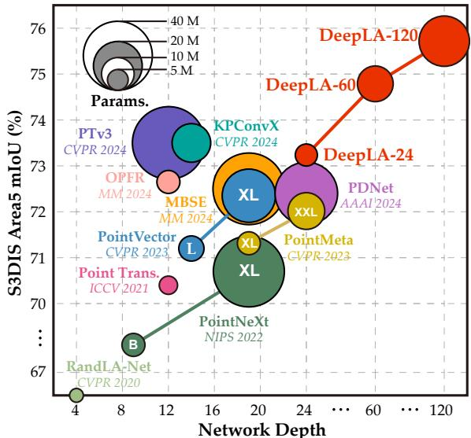  
Figure 1. Illustration of segmentation performance, model efficiency and network depth on S3DIS Area5. DeepLA-24 has already achieved SOTA-equivalent performance with minimal parameters. The deeper architecture DeepLA-120 achieves a milestone (75.7%) by exceeding 75% threshold for the first time, and outperforms Point Transformer v3 [70] with fewer parameters.

Interestingly, the development of 3D point cloud analysis is closely related to the evolution of 2D image processing networks [39, 47]. We observe that the design of 2D CNNs shifted towards deeper with the residual connections [19], making deep networks the mainstream backbone for feature extraction with successful performance [2, 35, 52]. Given that LANets for point clouds share similar inductive biases with CNNs, we cannot help but wonder: can we explore an alternative path by leveraging the success of deep CNNs for LANets? Unfortunately, to the best of our knowledge, there has been limited systematic exploration of deepening LANets. Therefore, in this paper, instead of following the tendency to explore sophisticated details, we are in pursuit of very deep LANets for point cloud analysis. For this purpose, we encounter two key challenges: (1) high computational cost, and (2) difficult training optimization.

Obviously, the prevailing philosophy of sophisticated and redundant local learning has significantly increased computational complexity. To circumvent the prohibitive computations, we propose a residual local feature extraction (ResLFE) block that ensures minimal computational cost. Specifically, we first employ stage-level positional embedding instead of redundant and high latency layer-level. We then introduce an efficient vector feature representation and a robust modernization structure that significantly reduces FLOPs while preserving local information interactions. As shown in Figure 2, the proposed ResLFE block shows significant computational efficiency (10× fewer FLOPs) and commendable performance improvements (+1.1% mIoU). In particular, this remarkable computational efficiency enables the construction of very deep networks.

Furthermore, very deep networks are difficult to optimize [19, 72], and the complex geometric patterns of point clouds further exacerbate the difficulty of optimization [16, 44, 58]. To address these issues, we introduce a hybrid deep supervision (HDS) strategy to facilitate learning and optimization. We employ two forms of supervision to the outputs of the encoder at each stage. Specifically, we align each output with the ground truth using cross-entropy loss, which promotes smooth gradient propagation. Meanwhile, we also align the outputs with the spatial distribution of the point cloud using mean squared error loss, which benefits in fitting the complex geometric patterns to simplify network optimization. We demonstrate in experiments that the proposed HDS strategy optimizes network training by accelerating model convergence and achieves significant performance improvements (+3.1% mIoU).

Overall, we propose very Deep Local Aggregation Networks (DeepLA-Net), constructed from the ResLFE block for lightweight design and the HDS strategy for optimization. In particular, we have successfully trained DeepLA-120—a representative deep network comprising up to 120 ResLFE blocks—on a single RTX 3090 with 24GB memory. The DeepLA-Net family outperforms the SOTA methods across various tasks, including S3DIS [1] and ScanNetV2 [9] for semantic segmentation, ScanObjectNN [64] for object classification, and ShapeNetPart [80] for part segmentation. Figure 1 highlights the superior performance and efficiency of our DeepLA-Net family on S3DIS Area5. Moreover, a step-by-step procedure of constructing the DeepLA-Net and the corresponding results are shown in Figure 2. Our key contributions are:

• We propose a residual local feature extraction block from the perspective of efficiency and performance, enabling the construction of deeper LANets.

• We propose a hybrid deep supervision strategy from the perspective of optimization and learning to ensure smooth gradient backpropagation in deeper LANets.

• We propose DeepLA-Net, a series of very deep local aggregation networks, surpassing SOTA in classification, part segmentation, and semantic segmentation.

## 2. Related Work

## 2.1. Deep Learning on Point Clouds

Given the disordered and unstructured nature of 3D poin clouds, directly applying traditional CNNs to them remains a challenge. Therefore, some methods firstly transform point clouds into intermediate representations such as 2D images [3, 26, 42, 73, 82] or 3D voxels [5, 7, 17, 27, 41, 93] through projection or voxelization, and subsequently employ 2D/3D CNNs to process these structured data. Although promising results have been shown in certain scenarios, the intermediate transformation steps may introduce information loss and computation costs [14, 51, 86]. In contrast, point-based methods [14, 20, 31, 46, 47, 51, 69, 83, 85, 86, 91] are specifically designed to perform feature learning directly on point clouds without using intermediate representations. Moreover, some noteworthy research has leveraged techniques like Recurrent Neural Networks (RNNs) [21, 34, 79], Graph Neural Networks (GNNs) [25, 28, 66, 75, 87], point-voxel hybrid representation [36, 37, 53, 74, 88], and sparse voxel [4, 8, 55, 59, 60], achieving significant performance in various tasks.

## 2.2. Local Aggregation Networks for Point Clouds

The pioneering PointNet [46] uses point-wise MLPs to learn per-point features, however, it has limitations in capturing local details. To overcome this, PointNet++ [47] improves PointNet by employing shared-weight MLPs in local neighbors, aligning with the inductive biases in CNNs:

localization and weight sharing. Along this direction, numerous subsequent studies [30, 40, 63, 67, 69, 90] have employed the above two inductive biases by local feature aggregation operations. We summarize them as local aggregation networks (LANets). Recent LANets [10, 14, 20, 33, 43, 48, 51, 54, 83, 85, 86] have primarily focused on exploring more robust local representations. For example, Point Transformer [92] designs a local transformer layer based on vector self-attention in local neighbors. PointVector [10] improves local extractor by transforming relative features and positions of input into representative vectors. ConDaFormer [13] enhances local geometric modeling by depth-wise convolutions, capturing both long-range contextual information and local priors. However, with the development of LANets, merely development of more complex LANets is insufficient for further capturing the local patterns. In this paper, we demonstrate that without relying on intricate and complex local representations, designing very deep hierarchical architectures for LANets can also achieve significant breakthroughs in performance.

## 3. Preliminary

In this section, we introduce the preliminary implementation of DeepLA-Net. Most existing LANets have focused on robust local representation to effectively capture the complex local patterns of sparse and discrete point clouds. However, this focus makes them difficult to deepen due to the high computational cost. Therefore, we consider building deep networks based on the simplest PointNet++ [47].

PointNet++ [47], the pioneering LANet for point cloud analysis, can be summarized in two phases: position embedding and feature representation. In the position embedding phase, PointNet++ employs ball query to group points, and then uses relative position differences as position embedding. Subsequently, in the feature representation phase, PointNet++ concatenates position embedding and grouped features to represent local features, and then aggregates them to centroid points by using max pooling. This can be formulated as:

$$
\begin{array} { r l } { \{ p _ { i } ^ { k } = G r o u p ( p _ { i } ) \qquad } & { { } \mathit { \{ F _ { N } = \mathcal { M } [ f _ { i } ^ { k } \oplus P E ] }  }  \\ { P E = \mathcal { M } ( p _ { i } - p _ { i } ^ { k } ) \qquad } & { { } \mathit { F _ { o u t } = m a x ( F _ { N } ) } } \end{array}\tag{1}
$$

where $p _ { i }$ denotes the centroid points, $p _ { i } ^ { k }$ denotes the grouped points, M denotes the multi-layer perceptron, $\oplus$ denotes the concatenation, max denotes the max-pooling, and $f _ { i } ^ { k }$ denotes the grouped features.

Implementation. Due to its simplicity, we employ Point-Net++ [47] as the baseline and demonstrate the step-by-step ”modernization” into DeepLA-Net. Firstly, we follow the PointNeXt [48] configuration, incorporating data augmentation and optimization techniques such as random height and color dropout. The baseline model achieves 63.4% mIoU and 11.3G FLOPs1. Subsequently, we directly extend the baseline to 24-block model, following [35] with a block ratio of [1:1:3:1]. This plain-24 model achieves 69.0% mIoU and 92.2G FLOPs. Despite achieving a respectable mIoU score, the huge FLOPs prevent us from further deepening the network. In addition, deep network poses optimization challenges. Therefore, to construct LANets as deep as possible, we propose the ResLFE block which significantly reduces the computation cost while preserving reliable accuracy. Subsequently, we propose the HDS strategy to ensure smooth gradient backpropagation in deep networks and mitigate training optimization challenges.

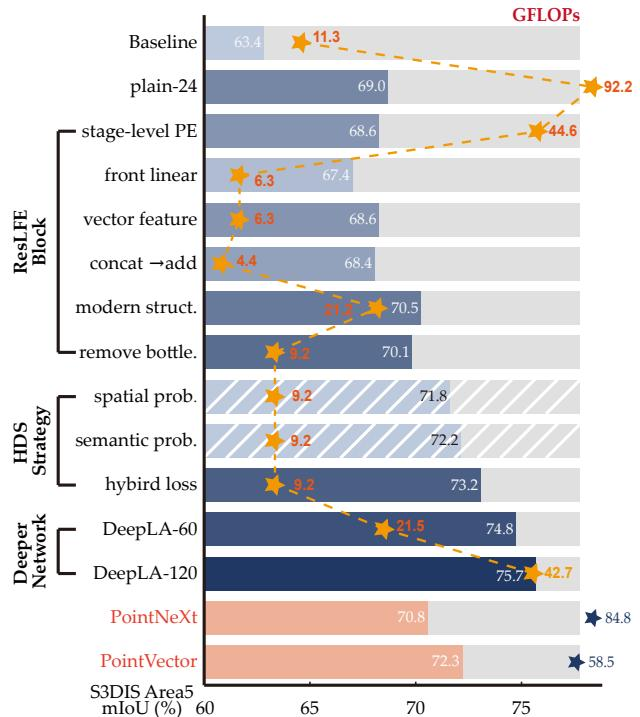  
Figure 2. Illustration of the designs and results of our improvements on S3DIS [1] Area5 step-by-step. The foreground bars denote model accuracy, the stars denote model FL ${ \cal O } \mathrm { P s } ,$ and hatched bars mean the modification is not adopted solely.

## 4. Methodology

In this section, we introduce the key components of our DeepLA-Net: residual local feature extraction (ResLFE) block and hybrid deep supervision (HDS) strategy. To intuitively and clearly demonstrate the role of each design, we illustrate each step of improvement in Figure 2, with all models evaluated on S3DIS Area 5 [1].

## 4.1. Residual Local Feature Extraction Block

To enable the construction of deeper networks, we propose the ResLFE block, as shown in Figure 3, which significantly reduces computational cost. The ResLFE block comprises three key aspects: (1) stage-level position embedding, (2) efficient vector feature representation module, and (3) powerful modernization structure.

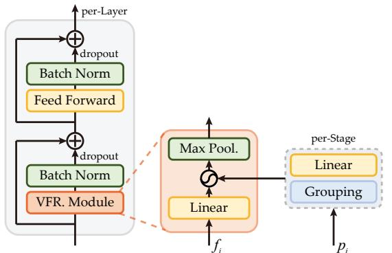

Figure 3. Illustration of the proposed ResLFE block. Right: stagelevel position embedding. Middle: Vector Feature Representation (VFR.) module. Left: modernization structure.  
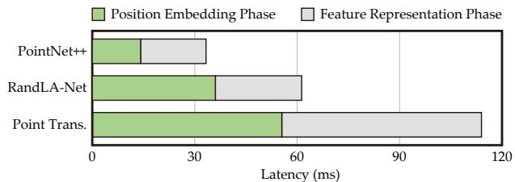  
Figure 4. Illustration of the computational latency of position embedding and feature representation phases in different LANets.

Stage-Level Position Embedding: Existing LANets typically implement position embedding at each learning layer, resulting in high computational costs. As shown in Figure 4, the computational latency of the positional embedding phase constitutes approximately half of the total for each layer, which is unacceptable in deeper networks. As indicated by Eq. 1, we observe that the computation of position embedding relies solely on point coordinates. Considering that the resolution of points remains constant within each stage, layers in the same stage can share an identical position embedding. Therefore, we suggest pre-calculate the position embedding at the beginning of each stage, saving it to cache and reusing it per-layer in that stage to avoid subsequent real-time computations. This approach ensures that the computational costs of position embedding depend solely on the number of stages, rather than the depth of the network, thereby facilitating the efficient application of very deep networks. Our implementation of position embedding is the same as PointNet++. This operation approximately halves the FLOPs (92.2G → 44.6G), with only a minimal decrease in performance (69.0% → 68.6%).

Vector Feature Representation Module: First, we consider further improvements in computational efficiency during the feature representation phase. We observe that, in most existing LANets, feature abstraction (linear layers in Eq. 1) is typically performed after grouping the features into $f _ { i } ^ { \bar { k } } \in \mathbb { R } ^ { \bar { N } \times K \times \bar { C } }$ , which incurs substantial computational costs. To address this issue, we suggest conducting feature abstraction before grouping on $f _ { i } \in \mathbb { R } ^ { N \times C }$ (front-linear). Although this approach may limit local information interactions, it allows for a reduction in FLOPs by K times theoretically, leading to significant efficiency gains. Practically, this operation reduces the 7× FLOPs (44.6G → 6.3G), with a performance degradation of only 1.2% (68.6% → 67.4%).

Moreover, we suggest employing the vector feature $f _ { i } -$ $f _ { i } ^ { k }$ instead of the grouped feature $f _ { i } ^ { \bar { k } }$ . On the one hand, this approach achieves cost-effective local interaction, which can enhance relation learning. On the other hand, it aligns with the relative position embedding $p _ { i } - p _ { i } ^ { k }$ , mitigating the potential semantic gap between position embedding and feature representation. This operation improves performance by 1.2% (67.4% → 68.6%) without incurring additional computation costs.

Furthermore, when combining the vector feature with the relative position embedding, we replace concatenation (⊕) with simple addition (+), avoiding duplicating channels, which further reduces computational demands. This operation reduces computation (6.3G → 4.4G) while only marginally decreasing performance (68.6% → 68.4%). Finally, we employ the simple but effective max pooling for aggregation. The vector feature representation (VFR) module can be formulated as follows:

$$
\left\{ \begin{array} { l l } { f _ { i } ^ { \prime } = \mathcal { M } ( f _ { i } ) } \\ { F _ { i } ^ { k } = f _ { i } ^ { \prime } - { f ^ { \prime } } _ { i } ^ { k } } \\ { F _ { o u t } = m a x ( F _ { i } ^ { k } + P E ) } \end{array} \right.\tag{2}
$$

Modernization Structure: Inspired by powerful Transformers [12, 65], we adopt a modernization structure, as shown in Figure 3-(a). Similar to the Transformer block, we employ a dropout path after normalization to mitigate overfitting in deep networks. Notably, unlike the 4× Inverted Bottleneck Feed Forward Network in Transformer, which increases the channel dimension, our implementation maintains the same dimensions in the two linear layers of the FFN to conserve computational resources. We can observe that the vanilla modern structure improves performance by 2.1% (68.4% → 70.5%), but incurs significant additional computations (4.4G → 21.2G). By removing the 4× inverted bottleneck, we reduce the FLOPs by approximately half (21.2G → 9.2G), with only a 0.4% decrease in performance (70.5% → 70.1%).

At this point, we have construct the vanilla DeepLA-24. Compare to the plain-24 model, the vanilla DeepLA-24 improves performance by 1.1% (69.0% → 70.1%) while using only 10% FLOPs (92.2G → 9.2G). This small but mighty design enables the construction of deeper networks.

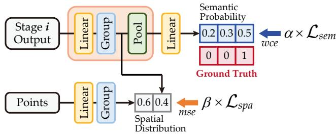  
Figure 5. Illustration of the proposed HDS strategy.

## 4.2. Hybrid Deep Supervision Strategy

In this section, we propose the HDS strategy, as illustrated in Figure 5. By incorporating supervision signals at each encoding stage, we facilitate smoother gradient propagation and simplify network optimization. The HDS strategy comprises two key aspects: (1) semantic probability supervision, and (2) spatial distribution supervision.

Semantic Probability Supervision: Despite employing techniques such as residual connections, normalization, and dropout, optimizing very deep networks remains a challenge. The proposed semantic probability supervision encourages hidden layers to learn discriminative features, which facilitates faster convergence and regularization of the network. Specifically, the outputs of each stage are fed into a VFR module without position embedding, ensuring that the supervised signals closely reflect our training process. Then, they are processed by a plain linear layer to align with the ground truth labels. Finally, we use the widely-used weighted cross-entropy loss to calculate the loss at each stage. The loss for semantic probability supervision $( \mathcal { L } _ { s e m } )$ is defined as the average of all stages, which can be formulated as follows:

$$
\mathcal { L } _ { s e m } ( Y , P ) = - \frac { 1 } { N } \sum _ { i = 0 } ^ { N } \sum _ { c = 0 } ^ { C } y _ { i } ^ { c } \log p _ { i } ^ { c }\tag{3}
$$

where $y _ { i } ^ { c }$ denotes the label vector of the i-stage, $p _ { i } ^ { c }$ denotes the predicted vector of the i-stage, $C$ is the number of label categories, and N denotes the number of stages. This operation improves performance by 2.1% (70.1% → 72.2%) without additional inference computational costs.

Spatial Distribution Supervision: The sparsity and discreteness of point clouds lead to intricate complex local geometric patterns, which further exacerbate the challenges of optimizing very deep networks. To address this issue, we assume that the feature distribution is potentially consistent with the spatial distribution of the point clouds. In the early epochs of training, feature learning should trend toward fitting these geometric structures. Therefore, we propose the spatial distribution supervision that serves as a manual prior for convergence, explicitly guiding feature learning towards geometric structures during the early epochs of training.

Specifically, we represent the spatial distribution by calculating the grouped points with a learnable linear layer. The weights are initialized as an identity matrix and without bias, while the input and output channels are set to 3. Subsequently, we use this spatial distribution to constrain the grouped features obtained during semantic probability supervision. Finally, we adopt the mean squared error (MSE) loss to minimize the discrepancy between the spatial supervision signals and the grouped features. The loss of spatial distribution supervision $( \mathcal { L } _ { s p a } )$ is defined as the average of all stages, which can be formulated as follows:

$$
\mathcal { L } _ { s p a } ( Y , P ) = - \frac { 1 } { N } \sum _ { i = 0 } ^ { N } ( p _ { i } - y _ { i } ) ^ { 2 }\tag{4}
$$

where $y _ { i }$ denotes the spatial supervision signals of the i-stage, $p _ { i }$ denotes the predicted results from feature relative differences of the i-stage, and N denotes the number of encoder stages. This operation improves performance by 1.7% (70.1% → 71.8%).

Hybrid Loss: The loss function of the network integrates $L _ { s e m } , L _ { s p a }$ , and the segmentation loss of final prediction $( L _ { p r e d } )$ , which is calculated via cross-entropy loss. Furthermore, we implement different training weights with exponential decay for $L _ { s e m }$ and $L _ { s p a }$ , where the decay factor is defined as the reciprocal of the current epoch number. This strategy ensures that deep supervision provides significant guidance in the early training phases, while gradually diminishes its influence to avoid hindering the primary learning path as training progresses. The hybrid loss can be formulated as:

$$
\mathcal { L _ { H } } = \alpha ^ { n } \mathcal { L } _ { s e m } + \beta ^ { n } \mathcal { L } _ { s p a } + ( 1 - \alpha ^ { n } - \beta ^ { n } ) \mathcal { L } _ { p r e d }\tag{5}
$$

where α and $\beta$ are the training weights for supervision, n denotes reciprocal of the current epoch number. This hybrid loss improves performance by 3.1% (70.1% → 73.2%).

## 4.3. DeepLA-Net Implementation

We construct a series of DeepLA-Net with different depths: DeepLA-24/60/120. Following successful previous works [12, 35, 92], the block ratio within each stage is set to [1:1:3:1], and the number of channels doubles in the subsequent stage. The configuration of DeepLA-Net is summarized as follows:

C = [64, 128, 256, 512]

• DeepLA-24: B = [4, 4, 12, 4]

• DeepLA-60: B = [10, 10, 30, 10]

• DeepLA-120: B = [20, 20, 60, 20]

where C refers to the channels of the output and B denotes the number of ResLFE blocks in each stage. Note that, in this paper, the term ”depth” specifically refers to the number of blocks rather than linear layers. The network architecture details can be found in Appendix.

Table 1. Quantitative comparisons of semantic segmentation with the SOTA methods on S3DIS in terms of mIoU.
<table><tr><td>Year</td><td>Method</td><td>6-flod (%)</td><td>Area5 (%)</td></tr><tr><td>NIPS 2017</td><td>PointNet++ [47]</td><td>83.0</td><td>53.5</td></tr><tr><td>NIPS 2018</td><td>PointCNN [30]</td><td>65.4</td><td>57.3</td></tr><tr><td>CVPR 2019</td><td>KPConv [61]</td><td>70.6</td><td>67.1</td></tr><tr><td>CVPR 2020</td><td>RandLA-Net [20]</td><td>70.0</td><td>62.5</td></tr><tr><td>CVPR 2021</td><td>Point Trans. [92]</td><td>73.5</td><td>70.4</td></tr><tr><td>NIPS 2022</td><td>PointNeXt [48]</td><td>74.9</td><td>70.8</td></tr><tr><td>CVPR 2023</td><td>AF-GCN [89]</td><td>77.7</td><td>72.3</td></tr><tr><td>CVPR 2023</td><td>PointVector [10]</td><td>78.4</td><td>72.3</td></tr><tr><td>CVPR 2023</td><td>PointMeta [33]</td><td>77.0</td><td>72.0</td></tr><tr><td>AAAI 2024</td><td>PDNet [81]</td><td>78.3</td><td>72.3</td></tr><tr><td>CVPR 2024</td><td>KPConvX [62]</td><td></td><td>73.5</td></tr><tr><td>CVPR 2024</td><td>OneFormer3D [23]</td><td>75.0</td><td>72.4</td></tr><tr><td>CVPR 2024</td><td>Point Trans. v3 [70]</td><td>77.7</td><td>73.4</td></tr><tr><td>ACM MM 2024</td><td>OPFR [22]</td><td>76.9</td><td>72.6</td></tr><tr><td>ACM MM 2024</td><td>LDCNet [38]</td><td>75.4</td><td>71.8</td></tr><tr><td>ACM MM 2024</td><td>MBSE [68]</td><td>77.8</td><td>72.4</td></tr><tr><td>Ours 2024</td><td>DeepLA-24</td><td>77.9</td><td>73.2</td></tr><tr><td>Ours 2024</td><td>DeepLA-60</td><td>79.0</td><td>74.8</td></tr><tr><td>Ours 2024</td><td>DeepLA-120</td><td>79.8</td><td>75.7</td></tr></table>

## 5. Experiments

## 5.1. Experiment Setup

To comprehensively evaluate the effectiveness of the proposed DeepLA-Net, we conduct experiments on S3DIS [1] and ScanNet v2 [9] for semantic segmentation, ScanObjectNN [64] for object classification, and ShapeNetPart [80] for object part segmentation. We use the following quantitative metrics for evaluation: mean Intersection over Union (mIoU), Overall Accuracy (OA), and mean Accuracy (mAcc). In result tables, Bold indicates the best result, underline indicates the best result excluding ours.

In the position embedding phase, we employ the KNN for grouping, with the K specified as 24. For hybrid deep supervision, α and β are set to 0.3 and 0.005, respectively. All experiments are performed on a Nvidia RTX 3090 GPU with 24GB memory. To ensure a fair comparison, the reported performance for both ours and the compared methods excludes the use of voting, pre-trained model, and testtime augmentation strategies. The implementation details and dataset description can be found in Appendix.

## 5.2. Experiment Results

Semantic Segmentation. We show the results of our DeepLA-Net, including DeepLA-24/60/120, compared with previous state-of-the-art methods on S3DIS and Scan-Net v2. In Table 1, for S3DIS, our DeepLA-60 has already surpassed previous methods. Particularly, our DeepLA-120 achieves a more significant breakthrough with an mIoU of 79.8% in 6-fold (+1.4%) and 75.7% (+2.2%) in Area5, surpassing the 75% threshold for the first time. In Table 2, for ScanNet v2, our DeepLA-24/60 achieve competitive performance, while DeepLA-120 significantly outperforms previous methods, achieving 77.6% (+1.0%) on the validation set and 77.2% (+1.6%) on the test sets. Note that, due to the submission policy of the ScanNet v2 online test set, we only report the best model on the validation set, i.e., DeepLA-120. Additionally, results on the ScanNet test set have been reported less in recent years because fully supervised methods have not achieved substantial breakthroughs in this dataset. The result of the efficient DeepLA-24 demonstrates the rationality and effectiveness of our design. Furthermore, reasonably deepening the network can significantly improve performance. More detailed per-class results and visualizations can be found in Appendix.

Table 2. Quantitative comparisons of semantic segmentation with the SOTA methods on ScanNet v2 in terms of mIoU.
<table><tr><td>Year</td><td>Method</td><td>val (%)</td><td>test (%)</td></tr><tr><td>NIPS 2017</td><td>PointNet++ [47]</td><td>53.5</td><td>55.7</td></tr><tr><td>NIPS 2018</td><td>PointCNN [30]</td><td></td><td>45.8</td></tr><tr><td>CVPR 2019</td><td>KPConv [61]</td><td>69.2</td><td>68.6</td></tr><tr><td>CVPR 2022</td><td>Stra. Trans. [24]</td><td>74.3</td><td>73.7</td></tr><tr><td>NIPS 2022</td><td>PointNeXt [48]</td><td>71.5</td><td>71.2</td></tr><tr><td>CVPR 2023</td><td>LRPNet [29]</td><td>75.0</td><td>74.2</td></tr><tr><td>ICCV 2023</td><td>Retro-FPN [71]</td><td>74.0</td><td>74.4</td></tr><tr><td>NIPS 2023</td><td>ConDaFormer [13]</td><td>75.1</td><td>75.5</td></tr><tr><td>AAAI 2024</td><td>HPENet [94]</td><td>74.0</td><td></td></tr><tr><td>ICLR 2024</td><td>MVNet [76]</td><td>75.2</td><td></td></tr><tr><td>CVPR 2024</td><td>KPConvX [62]</td><td>76.3</td><td></td></tr><tr><td>CVPR 2024</td><td>OneFormer3D [23]</td><td>76.6</td><td></td></tr><tr><td>CVPR 2024</td><td>OA-CNN [45]</td><td>76.1</td><td>75.6</td></tr><tr><td>CVPR 2024</td><td>MirageRoom [57]</td><td>74.9</td><td></td></tr><tr><td>ACM MM 2024</td><td>LDCNet [38]</td><td>73.3</td><td>一</td></tr><tr><td>Ours 2024</td><td>DeepLA-24</td><td>74.1</td><td>一</td></tr><tr><td>Ours 2024</td><td>DeepLA-60</td><td>75.9</td><td></td></tr><tr><td>Ours 2024</td><td>DeepLA-120</td><td>77.6</td><td>77.2</td></tr></table>

Table 3. Quantitative comparisons of classification with the SOTA methods on ScanObjectNN (PB T50 RS).
<table><tr><td>Year</td><td>Method</td><td>OA (%)</td><td>mAcc (%)</td></tr><tr><td>CVPR 2017</td><td>PointNet [46]</td><td>68.2</td><td>63.4</td></tr><tr><td>NIPS 2018</td><td>PointCNN [30]</td><td>78.5</td><td>75.1</td></tr><tr><td>TOG 2019</td><td>DGCNN [67]</td><td>78.1</td><td>73.6</td></tr><tr><td>TMM 2021</td><td>GBNet [50]</td><td>80.5</td><td>77.8</td></tr><tr><td>TIP 2021</td><td>PRANet [6]</td><td>82.1</td><td>79.1</td></tr><tr><td>ICLR 2022</td><td>PointMLP [39]</td><td>85.7</td><td>84.4</td></tr><tr><td>NIPS 2022</td><td>PointNeXt [48]</td><td>88.1</td><td>86.4</td></tr><tr><td>PAMI 2023</td><td>GSLCN [32]</td><td>85.8</td><td>84.1</td></tr><tr><td>ICLR 2023</td><td>ACT [11]</td><td>88.2</td><td></td></tr><tr><td>CVPR 2023</td><td>NLGAT [49]</td><td>88.4</td><td></td></tr><tr><td>CVPR 2023</td><td>PointVector [10]</td><td>88.2</td><td>86.7</td></tr><tr><td>CVPR 2023</td><td>PointMeta [33]</td><td>88.1</td><td>86.9</td></tr><tr><td>AAAI 2024</td><td>PDNet [81]</td><td>88.5</td><td>86.8</td></tr><tr><td>AAAI 2024</td><td>Interpretable3D [15]</td><td>88.0</td><td>86.5</td></tr><tr><td>ICLR 2024</td><td>MaskFeat3D [77]</td><td>88.4</td><td></td></tr><tr><td>ACM MM 2024</td><td>OPFR [22]</td><td>88.1</td><td>86.3</td></tr><tr><td>Ours 2024</td><td>DeepLA-24</td><td>90.6</td><td>89.5</td></tr></table>

Table 4. Quantitative comparisons of part segmentation with the SOTA methods on ShapeNetPart.
<table><tr><td>Year</td><td>Method</td><td>Cls. mIoU (%)</td><td>Ins. mIoU (%)</td></tr><tr><td>CVPR 2017</td><td>PointNet [46]</td><td>80.4</td><td>83.7</td></tr><tr><td>NIPS 2018</td><td>PointCNN [30]</td><td>84.6</td><td>86.1</td></tr><tr><td>TOG 2019</td><td>DGCNN [67]</td><td>82.3</td><td>85.1</td></tr><tr><td>CVPR 2020</td><td>PointASNL [78]</td><td></td><td>86.1</td></tr><tr><td>CVPR 2021</td><td>Point Trans. [92]</td><td>83.7</td><td>86.6</td></tr><tr><td>ICLR 2022</td><td>PointMLP [39]</td><td>84.6</td><td>86.1</td></tr><tr><td>NIPS 2022</td><td>PointNeXt [48]</td><td>85.2</td><td>87.0</td></tr><tr><td>ICLR 2023</td><td>ACT [11]</td><td>84.7</td><td>86.1</td></tr><tr><td>CVPR 2023</td><td>PointVector [10]</td><td>85.1</td><td>86.9</td></tr><tr><td>CVPR 2023</td><td>PointMeta [33]</td><td>85.1</td><td>87.1</td></tr><tr><td>CVPR 2023</td><td>AF-GCN [89]</td><td>85.3</td><td>87.0</td></tr><tr><td>NIPS 2023</td><td>ConDaFormer [13]</td><td>84.6</td><td>86.8</td></tr><tr><td>AAAI 2024</td><td>HPENet [94]</td><td>85.5</td><td>87.1</td></tr><tr><td>AAAI 2024</td><td>PDNet [81]</td><td>85.4</td><td>87.2</td></tr><tr><td>AAAI 2024</td><td>Interpretable3D [15]</td><td>85.6</td><td>87.2</td></tr><tr><td>ICLR 2024</td><td>MVNet [76]</td><td>85.2</td><td>86.8</td></tr><tr><td>ICLR 2024</td><td>MaskFeat3D [77]</td><td>85.5</td><td>87.0</td></tr><tr><td>Ours 2024</td><td>DeepLA-24</td><td>86.5</td><td>88.0</td></tr></table>

Object Classification. As shown in Table 3, DeepLA-24 outperforms all baselines with OA of 90.6% and mAcc of 89.5% (+2.1% OA, +2.6% mAcc). DeepLA-24 is the first method to surpass 90% on OA, with the performance of others stagnating around 88% for several years. This result indicates that merely developing more complex local representation methods is not sufficient for further advancement in shape recognition. In contrast, deeper networks can make significant contributions to capturing local patterns.

Part Segmentation. The results are reported in Table 4, where we evaluate the performance with the mean class IoU (Cls. mIoU) and mean instance IoU (Ins. mIoU). DeepLA-24 outperforms all baselines with the Cls. mIoU of 86.5% (+1.0%) and the Ins. mIoU of 88.0% (+0.8%) without voting. It is noteworthy that we do not experiment with the deeper variants of DeepLA-Net on object classification and part segmentation datasets due to the limited dataset scale.

## 5.3. Ablation Studies

In this section, we conduct ablation studies on the proposed DeepLA-Net. All the ablation models are evaluated on S3DIS Area5 [1]. If not specified, the DeepLA-24 is employed as the default model.

Hyperparameter settings. We analyze the impact of hyperparamter settings including the bottleneck in ResLFE block, the training weights in HDS strategy, the initial feature channel, and the grouping range K. Table 5 explores different bottleneck settings in ResLFE block. The results illustrate that inverted bottlenecks larger than 1× marginally improve performance but significantly increase computation costs. Meanwhile, bottlenecks less than 1× slightly reduce computation while causing a more pronounced degradation in performance. Therefore, to balance efficiency and performance, we employ the 1× bottleneck. Table 6 shows that the setting of training weights in HDS strategy is generally insensitive, as long as they are neither too large to hinder fitting nor too small to be ineffective. Notably, the training weight for spatial distribution is much smaller than that for semantic probability. This is mainly because spatial distribution supervision encourages the network to focus more on local details rather than abstract semantics, which are more crucial for feature classification. Figure 6 illustrates the impact of different initial feature channel and grouping range K. The results demonstrate that small channel and grouping range lead to limited performance, due to inadequacy in capturing local patterns. Meanwhile, excessively large channel and grouping range tend to overfit the training examples, resulting in poor generalization and a decline in performance.

Table 5. Ablation results of the bottleneck in ResLFE block in DeepLA-24 on S3DIS Area5.
<table><tr><td>Model</td><td>mIoU (%)</td><td> $\overline { { \triangle } }$  (%)</td><td>FLOPs (G)</td><td>△ (G)</td></tr><tr><td>1× bottleneck</td><td>73.2</td><td>-</td><td>9.3</td><td>-</td></tr><tr><td>0.5× bottleneck</td><td>72.5</td><td>-0.7</td><td>7.4</td><td>-1.9</td></tr><tr><td>2× bottleneck</td><td>73.4</td><td>+0.2</td><td>13.4</td><td>+4.1</td></tr><tr><td>4× bottleneck</td><td>73.5</td><td>+0.3</td><td>21.3</td><td>+13.0</td></tr></table>

Table 6. Ablation results of training weights in HDS strategy in DeepLA-24 on S3DIS Area5.
<table><tr><td rowspan=1 colspan=1>βα</td><td rowspan=1 colspan=1>0</td><td rowspan=1 colspan=1>3e-3</td><td rowspan=1 colspan=1>5e-3</td><td rowspan=1 colspan=1>7e-3</td><td rowspan=1 colspan=1>1e-2</td></tr><tr><td rowspan=1 colspan=1>0</td><td rowspan=1 colspan=1>70.1</td><td rowspan=1 colspan=1>71.0</td><td rowspan=1 colspan=1>71.8</td><td rowspan=1 colspan=1>71.3</td><td rowspan=1 colspan=1>70.6</td></tr><tr><td rowspan=1 colspan=1>0.2</td><td rowspan=1 colspan=1>71.8</td><td rowspan=1 colspan=1>72.3</td><td rowspan=1 colspan=1>72.5</td><td rowspan=1 colspan=1>72.9</td><td rowspan=1 colspan=1>72.0</td></tr><tr><td rowspan=1 colspan=1>0.3</td><td rowspan=1 colspan=1>72.2</td><td rowspan=1 colspan=1>72.5</td><td rowspan=1 colspan=1>73.2</td><td rowspan=1 colspan=1>72.8</td><td rowspan=1 colspan=1>72.4</td></tr><tr><td rowspan=1 colspan=1>0.4</td><td rowspan=1 colspan=1>72.0</td><td rowspan=1 colspan=1>72.6</td><td rowspan=1 colspan=1>72.4</td><td rowspan=1 colspan=1>72.4</td><td rowspan=1 colspan=1>72.1</td></tr><tr><td rowspan=1 colspan=1>0.5</td><td rowspan=1 colspan=1>71.5</td><td rowspan=1 colspan=1>72.0</td><td rowspan=1 colspan=1>72.1</td><td rowspan=1 colspan=1>72.2</td><td rowspan=1 colspan=1>71.7</td></tr></table>

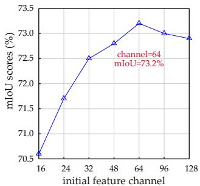  
(a)

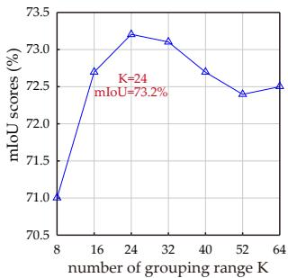  
(b)  
Figure 6. Ablation results of hyperparameters in DeepLA-24 on S3DIS Area5. (a) initial feature dimension. (b) grouping range K.

Ablation of Deep Supervision for Training Process. We demonstrate the performance and segmentation loss values $( L _ { p r e d }$ in Eq. 5) of the network with different deep supervision strategies across training epochs, as shown in Figure 7. It is evident that the network without deep supervision exhibits a slow decline in loss, with almost no further decrease after 60 epochs. In contrast, networks using deep supervision consistently achieve higher performance and a rapid convergence in loss. Notably, the network employing the HDS strategy achieves the most reasonable and effective convergence. This result demonstrates that our HDS strategy significantly optimizes network training, facilitating a robust and substantial decline in loss.

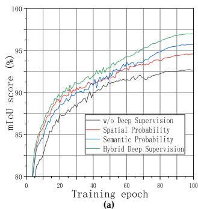

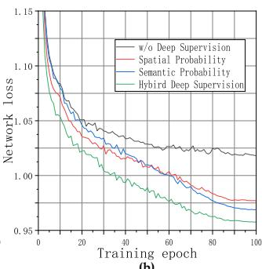  
Figure 7. Training performance and loss value across training epochs in DeepLA-24 with different deep supervision strategies. (a) mIoU score, and (b) loss value.

Ablation of Network Depth for Feature Learning. We visualize the feature similarity matrix of DeepLA-Net with different depths in Figure 8. The matrix is obtained by calculating the cosine similarities of the point features in the final layer, which are then sorted according to the predicted categories. The results indicate that the feature learning of DeepLA-6 is not robust, resulting in numerous recognition errors during segmentation. In contrast, DeepLA-24 demonstrates stronger feature learning capabilities, though the feature differences between classes are not sufficiently distinct, potentially causing blurred boundaries. DeepLA-120 demonstrates the highest confidence in class distinction, showcasing the most powerful feature learning abilities among the three networks. This result demonstrates that deeper networks possess more powerful learning capabilities, enhancing segmentation performance.

Analysis on Complexity and Latency. We report the performance, model complexity, and latency using the same settings of DeepLA-Net family and previous SOTA methods [10, 48, 62, 81] in Table 7. From the results, the baseline exhibits the fastest inference speed but the lowest performance. Simply deepening the baseline (Plain-24) enhances performance but significantly increases FLOPs (9× higher) and decreases inference speed (4.7× slower). In contrast, DeepLA-24, equipped with the ResLFE block achieves performance improvements while substantially reducing FLOPs (10× fewer) and increasing inference speed (3.75× faster). The reduction in FLOPs enables the training of deeper networks. In particular, our DeepLA-120 achieves state-of-the-art performance with an inference speed comparable to Plain-24 and the previous SOTA works [10, 48, 62]. More ablation analysis and discussion details can be found in Appendix.

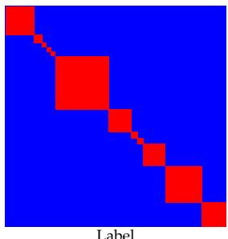

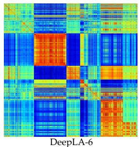

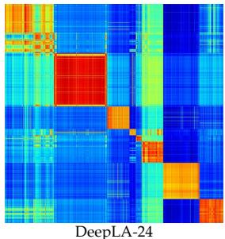

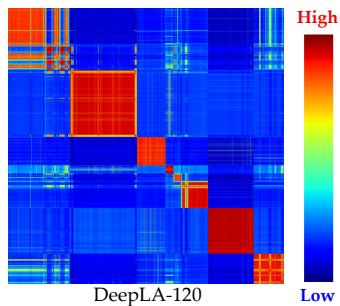  
Figure 8. Visual comparison of interpreting feature similarity matrix with different network depth of the DeepLA-6 (6-block network follows [1:1:3:1] ratio), DeepLA-24, and DeepLA-120.

Table 7. Quantitative comparisons of performance, model com plexity, and latency on S3DIS Area5.
<table><tr><td>Method</td><td>mIoU (%)</td><td>Params. (M)</td><td>FLOPs (G)</td><td>Thr. Put (ins./sec.)</td></tr><tr><td>PointNeXt-XL [48]</td><td>70.8</td><td>46.1</td><td>84.8</td><td>43</td></tr><tr><td>PointVector-XL [10]</td><td>72.3</td><td>24.1</td><td>58.5</td><td>40</td></tr><tr><td>KPConvX-L [62]</td><td>73.5</td><td>13.5</td><td></td><td>47</td></tr><tr><td>PDNet-XXL [81]</td><td>72.3</td><td>35.6</td><td>12.0</td><td></td></tr><tr><td>Baseline</td><td>63.4</td><td>3.1</td><td>11.3</td><td>207</td></tr><tr><td>Plain-24</td><td>69.0</td><td>9.7</td><td>92.2</td><td>44</td></tr><tr><td>DeepLA-24</td><td>73.2</td><td>6.4</td><td>9.2</td><td>165</td></tr><tr><td>DeepLA-60</td><td>74.8</td><td>15.8</td><td>21.5</td><td>78</td></tr><tr><td>DeepLA-120</td><td>75.7</td><td>30.3</td><td>42.7</td><td>42</td></tr></table>

## 6. Conclusions

In this study, we demonstrate the efficiency and effectiveness of very deep local aggregation networks for point cloud analysis, addressing two primary challenges: computationa cost and training optimization. In contrast to most current approaches that rely on expensive and redundant local representation, we propose a lightweight ResLFE block to significantly reduce the computational cost (10× fewer FLOPs), and make it possible to construct very deep LANets. Furthermore, the HDS strategy is also introduced to ensure smooth gradient backpropagation and mitigate optimization challenges in deep networks. The DeepLA-Net achieves SOTA performance with high efficiency across segmentation and classification tasks on four benchmarks: S3DIS, ScanNet v2, ScanObjectNN, and ShapeNetPart.

## References

[1] Iro Armeni, Ozan Sener, Amir R. Zamir, Helen Jiang, Ioannis Brilakis, Martin Fischer, and Silvio Savarese. 3D semantic parsing of large-scale indoor spaces. In IEEE/CVF Conference on Computer Vision and Pattern Recognition (CVPR), 2016. 1, 2, 3, 6, 7

[2] Liang-Chieh Chen, Yukun Zhu, George Papandreou, Florian Schroff, and Hartwig Adam. Encoder-decoder with atrous separable convolution for semantic image segmentation. In European conference on computer vision (ECCV), 2018. 2

[3] Xiaozhi Chen, Huimin Ma, Ji Wan, Bo Li, and Tian Xia. Multi-view 3D object detection network for autonomous driving. In IEEE/CVF Conference on Computer Vision and Pattern Recognition (CVPR), 2017. 2

[4] Yukang Chen, Yanwei Li, Xiangyu Zhang, Jian Sun, and Jiaya Jia. Focal sparse convolutional networks for 3d object detection. In IEEE/CVF Conference on Computer Vision and Pattern Recognition (CVPR), 2022. 2

[5] Ran Cheng, Ryan Razani, Ehsan Taghavi, Enxu Li, and Bingbing Liu. (af)2-s3net: Attentive feature fusion with adaptive feature selection for sparse semantic segmentation network. In IEEE/CVF Conference on Computer Vision and Pattern Recognition (CVPR), 2021. 2

[6] Silin Cheng, Xiwu Chen, Xinwei He, Zhe Liu, and Xiang Bai. Pra-net: Point relation-aware network for 3d point cloud analysis. IEEE Transactions on Image Processing, 30:4436– 4448, 2021. 6

[7] Christopher Choy, JunYoung Gwak, and Silvio Savarese. 4D spatio-temporal convnets: Minkowski convolutional neural networks. In IEEE/CVF Conference on Computer Vision and Pattern Recognition (CVPR), 2019. 2

[8] Christopher Choy, JunYoung Gwak, and Silvio Savarese. 4d spatio-temporal convnets: Minkowski convolutional neural networks. In IEEE/CVF Conference on Computer Vision and Pattern Recognition (CVPR), 2019. 2

[9] Angela Dai, Angel X. Chang, Manolis Savva, Maciej Halber, Thomas Funkhouser, and Matthias Nießner. Scannet: Richly-annotated 3d reconstructions of indoor scenes. In IEEE/CVF Conference on Computer Vision and Pattern Recognition (CVPR), 2017. 1, 2, 6

[10] Xin Deng, WenYu Zhang, Qing Ding, and XinMing Zhang. Pointvector: A vector representation in point cloud analysis. In IEEE/CVF Conference on Computer Vision and Pattern Recognition (CVPR), 2023. 1, 3, 6, 7, 8

[11] Runpei Dong, Zekun Qi, Linfeng Zhang, Junbo Zhang, Jianjian Sun, Zheng Ge, Li Yi, and Kaisheng Ma. Autoencoders as cross-modal teachers: Can pretrained 2d image transformers help 3d representation learning? In International Conference on Learning Representations (ICLR), 2023. 6, 7

[12] Alexey Dosovitskiy, Lucas Beyer, Alexander Kolesnikov, Dirk Weissenborn, Xiaohua Zhai, Thomas Unterthiner, Mostafa Dehghani, Matthias Minderer, Georg Heigold, and Sylvaing Gelly. An image is worth 16x16 words: Transformers for image recognition at scale. In International Conference on Learning Representations (ICLR), 2020. 4, 5

[13] Lunhao Duan, Shanshan Zhao, Nan Xue, Mingming Gong, Xia Gui-Song, and Dacheng Tao. Condaformer: Disassem-

bled transformer with local structure enhancement for 3d point cloud understanding. In Neural Information Processing Systems (NeurIPS), 2023. 3, 6, 7

[14] Siqi Fan, Qiulei Dong, Fenghua Zhu, Yisheng Lv, Peijun Ye, and Fei-Yue Wang. Scf-net: Learning spatial contextual features for large-scale point cloud segmentation. In IEEE/CVF Conference on Computer Vision and Pattern Recognition (CVPR), 2021. 2, 3

[15] Tuo Feng, Ruijie Quan, Xiaohan Wang, Wenguan Wang, and Yi Yang. Interpretable3d: An ad-hoc interpretable classifier for 3d point clouds. In AAAI Conference on Artificial Intelligence, 2024. 6, 7

[16] Edgar Galvan and Peter Mooney. Neuroevolution in deep´ neural networks: Current trends and future challenges. IEEE Transactions on Artificial Intelligence, 2(6):476–493, 2021. 2

[17] Benjamin Graham, Martin Engelcke, and Laurens Van Der Maaten. 3D semantic segmentation with submanifold sparse convolutional networks. In IEEE/CVF Conference on Computer Vision and Pattern Recognition (CVPR), 2018. 2

[18] Yulan Guo, Hanyun Wang, Qingyong Hu, Hao Liu, Li Liu, and Mohammed Bennamoun. Deep learning for 3D point clouds: A survey. IEEE Transactions on Pattern Analysis and Machine Intelligence, 43(12):4338–4364, 2020. 1

[19] Kaiming He, Xiangyu Zhang, Shaoqing Ren, and Jian Sun. Deep residual learning for image recognition. In IEEE/CVF Conference on Computer Vision and Pattern Recognition (CVPR), 2016. 2

[20] Qingyong Hu, Bo Yang, Linhai Xie, Stefano Rosa, Yulan Guo, Zhihua Wang, Niki Trigoni, and Andrew Markham. Randla-net: Efficient semantic segmentation of large-scale point clouds. In IEEE/CVF Conference on Computer Vision and Pattern Recognition (CVPR), 2020. 1, 2, 3, 6

[21] Qiangui Huang, Weiyue Wang, and Ulrich Neumann. Recurrent slice networks for 3D segmentation of point clouds. In IEEE/CVF Conference on Computer Vision and Pattern Recognition (CVPR), 2018. 2

[22] Wang Jiangyi, Zhongyao Cheng, Na Zhao, Jun Cheng, and Xulei Yang. On-the-fly point feature representation for point clouds analysis. In ACM International Conference on Multimedia, 2024. 6

[23] Maxim Kolodiazhnyi, Anna Vorontsova, Anton Konushin, and Danila Rukhovich. Oneformer3d: One transformer for unified point cloud segmentation. In IEEE/CVF Conference on Computer Vision and Pattern Recognition (CVPR), 2024. 6

[24] Xin Lai, Jianhui Liu, Li Jiang, Liwei Wang, Hengshuang Zhao, Shu Liu, Xiaojuan Qi, and Jiaya Jia. Stratified transformer for 3d point cloud segmentation. In IEEE/CVF Conference on Computer Vision and Pattern Recognition (CVPR), 2022. 6

[25] Loic Landrieu and Martin Simonovsky. Large-scale point cloud semantic segmentation with superpoint graphs. In IEEE/CVF Conference on Computer Vision and Pattern Recognition (CVPR), 2018. 2

[26] Alex H Lang, Sourabh Vora, Holger Caesar, Lubing Zhou, Jiong Yang, and Oscar Beijbom. Pointpillars: Fast en coders for object detection from point clouds. In IEEE/CVF Conference on Computer Vision and Pattern Recognition

(CVPR), 2019. 2

[27] Truc Le and Ye Duan. Pointgrid: A deep network for 3D shape understanding. In IEEE/CVF Conference on Computer Vision and Pattern Recognition (CVPR), 2018. 2

[28] Guohao Li, Matthias Muller, Ali Thabet, and Bernard Ghanem. Deepgcns: Can gcns go as deep as cnns? In IEEE/CVF International Conference on Computer Vision (ICCV), 2019. 2

[29] Xiang-Li Li, Meng-Hao Guo, Tai-Jiang Mu, Ralph R Martin, and Shi-Min Hu. Long range pooling for 3d largescale scene understanding. In IEEE/CVF Conference on Computer Vision and Pattern Recognition (CVPR), 2023. 6

[30] Yangyan Li, Rui Bu, Mingchao Sun, Wei Wu, Xinhan Di, and Baoquan Chen. Pointcnn: Convolution on x-transformed points. Neural Information Processing Systems (NeurIPS), 31, 2018. 3, 6, 7

[31] Ying Li, Lingfei Ma, Zilong Zhong, Dongpu Cao, and Jonathan Li. TGNet: Geometric Graph CNN on 3-D Point Cloud Segmentation. In IEEE Transactions on Geoscience and Remote Sensing, 2020. 2

[32] Jiye Liang, Zijin Du, Jianqing Liang, Kaixuan Yao, and Feilong Cao. Long and short-range dependency graph structure learning framework on point cloud. IEEE Transactions on Pattern Analysis and Machine Intelligence, 45(12):14975– 14989, 2023. 6

[33] Haojia Lin, Xiawu Zheng, Lijiang Li, Fei Chao, Shanshan Wang, Yan Wang, Yonghong Tian, and Rongrong Ji. Meta architecture for point cloud analysis. In IEEE/CVF Conference on Computer Vision and Pattern Recognition (CVPR), 2023. 1, 3, 6, 7

[34] Xinhai Liu, Zhizhong Han, Yu-Shen Liu, and Matthias Zwicker. Point2sequence: Learning the shape representation of 3d point clouds with an attention-based sequence to sequence network. In AAAI conference on artificial intelligence, 2019. 2

[35] Zhuang Liu, Hanzi Mao, Chao-Yuan Wu, Christoph Feichtenhofer, Trevor Darrell, and Saining Xie. A convnet for the 2020s. In IEEE/CVF Conference on Computer Vision and Pattern Recognition (CVPR), 2022. 2, 3, 5

[36] Zhijian Liu, Haotian Tang, Yujun Lin, and Song Han. Point-voxel cnn for efficient 3D deep learning. In Neural Information Processing Systems (NeurIPS), 2019. 2

[37] Zhijian Liu, Haotian Tang, Shengyu Zhao, Kevin Shao, and Song Han. Pvnas: 3d neural architecture search with pointvoxel convolution. IEEE Transactions on Pattern Analysis and Machine Intelligence, 44(11):8552–8568, 2022. 2

[38] Shoutong Luo, Zhengxing Sun, Yi Wang, Yunhan Sun, and Chendi Zhu. Ldcnet: Long-distance context modeling for large-scale 3d point cloud scene semantic segmentation. In ACM International Conference on Multimedia, 2024. 6

[39] Xu Ma, Can Qin, Haoxuan You, Haoxi Ran, and Yun Fu. Rethinking network design and local geometry in point cloud: A simple residual mlp framework. In International Conference on Learning Representations (ICLR), 2022. 2, 6, 7

[40] Yanni Ma, Yulan Guo, Hao Liu, Yinjie Lei, and Gongjian Wen. Global context reasoning for semantic segmentation of 3D point clouds. In IEEE/CVF Winter Conference on Applications of Computer Vision, 2020. 3

[41] Daniel Maturana and Sebastian Scherer. Voxnet: A 3D con volutional neural network for real-time object recognition. In IEEE/RSJ International Conference on Intelligent Robots and Systems (IROS), 2015. 2

[42] Andres Milioto, Ignacio Vizzo, Jens Behley, and Cyrill Stachniss. Rangenet ++: Fast and accurate lidar semantic segmentation. In IEEE/RSJ International Conference on Intelligent Robots and Systems (IROS), 2019. 2

[43] Dong Nie, Rui Lan, Ling Wang, and Xiaofeng Ren. Pyramid architecture for multi-scale processing in point cloud segmentation. In IEEE/CVF Conference on Computer Vision and Pattern Recognition (CVPR), 2022. 3

[44] Amanda Olmin and Fredrik Lindsten. Robustness and reliability when training with noisy labels. In International Conference on Artificial Intelligence and Statistics, 2022. 2

[45] Bohao Peng, Xiaoyang Wu, Li Jiang, Yukang Chen, Heng shuang Zhao, Zhuotao Tian, and Jiaya Jia. Oa-cnns: Omniadaptive sparse cnns for 3d semantic segmentation. In IEEE/CVF Conference on Computer Vision and Pattern Recognition (CVPR), 2024. 6

[46] Charles Ruizhongtai Qi, Hao Su, Kaichun Mo, and Leonidas J Guibas. Pointnet: Deep learning on point sets for 3D classification and segmentation. In IEEE/CVF Conference on Computer Vision and Pattern Recognition (CVPR), 2017. 1, 2, 6, 7

[47] Charles Ruizhongtai Qi, Li Yi, Hao Su, and Leonidas J Guibas. Pointnet++: Deep hierarchical feature learning on point sets in a metric space. In Neural Information Processing Systems (NeurIPS), 2018. 1, 2, 3, 6

[48] Guocheng Qian, Yuchen Li, Houwen Peng, Jinjie Mai, Hasan Abed Al Kader Hammoud, Mohamed Elhoseiny, and Bernard Ghanem. Pointnext: Revisiting pointnet++ with improved training and scaling strategies. Neural Information Processing Systems (NeurIPS), 35:23192–23204, 2022. 1, 2, 3, 6, 7, 8

[49] Shengwei Qin, Zhong Li, and Ligang Liu. Robust 3d shape classification via non-local graph attention network. In IEEE/CVF Conference on Computer Vision and Pattern Recognition (CVPR), 2023. 6

[50] Shi Qiu, Saeed Anwar, and Nick Barnes. Geometric backprojection network for point cloud classification. IEEE Transactions on Multimedia, 24:1943–1955, 2021. 6

[51] Shi Qiu, Saeed Anwar, and Nick Barnes. Semantic segmen tation for real point cloud scenes via bilateral augmentation and adaptive fusion. In IEEE/CVF Conference on Computer Vision and Pattern Recognition (CVPR), 2021. 2, 3

[52] Mark Sandler, Andrew Howard, Menglong Zhu, Andrey Zh moginov, and Liang-Chieh Chen. Mobilenetv2: Inverted residuals and linear bottlenecks. In IEEE/CVF Conference on Computer Vision and Pattern Recognition (CVPR), 2018. 2

[53] Shaoshuai Shi, Chaoxu Guo, Li Jiang, Zhe Wang, Jianping Shi, Xiaogang Wang, and Hongsheng Li. Pv-rcnn: Point-voxel feature set abstraction for 3d object detection. In IEEE/CVF Conference on Computer Vision and Pattern Recognition (CVPR), 2020. 2

[54] Hui Shuai, Xiang Xu, and Qingshan Liu. Backward attentive fusing network with local aggregation classifier for 3D point cloud semantic segmentation. IEEE Transactions on Image

Processing, 30:4973–4984, 2021. 3

[55] Hang Su, Varun Jampani, Deqing Sun, Subhransu Maji, Evangelos Kalogerakis, Ming-Hsuan Yang, and Jan Kautz. Splatnet: Sparse lattice networks for point cloud processing. In IEEE/CVF Conference on Computer Vision and Pattern Recognition (CVPR), 2018. 2

[56] Yanfei Su, Weiquan Liu, Zhimin Yuan, Ming Cheng, Zhihong Zhang, Xuelun Shen, and Cheng Wang. Dla-net: Learning dual local attention features for semantic segmentation of large-scale building facade point clouds. Pattern Recognition, 123:108372, 2022. 1

[57] Haowen Sun, Yueqi Duan, Juncheng Yan, Yifan Liu, and Jiwen Lu. Mirageroom: 3d scene segmentation with 2d pre-trained models by mirage projection. In IEEE/CVF Conference on Computer Vision and Pattern Recognition (CVPR), 2024. 6

[58] Ilya Sutskever, James Martens, George Dahl, and Geoffrey Hinton. On the importance of initialization and momentum in deep learning. In International Conference on Machine Learning (ICML), 2013. 2

[59] Haotian Tang, Zhijian Liu, Shengyu Zhao, Yujun Lin, Ji Lin, Hanrui Wang, and Song Han. Searching efficient 3d architectures with sparse point-voxel convolution. In European conference on computer vision (ECCV), 2020. 2

[60] Haotian Tang, Shang Yang, Zhijian Liu, Ke Hong, Zhongming Yu, Xiuyu Li, Guohao Dai, Yu Wang, and Song Han. Torchsparse++: Efficient point cloud engine. In IEEE/CVF Conference on Computer Vision and Pattern Recognition (CVPR), 2023. 2

[61] Hugues Thomas, Charles R. Qi, Jean-Emmanuel Deschaud, Beatriz Marcotegui, Franc¸ois Goulette, and Leonidas Guibas. Kpconv: Flexible and deformable convolution for point clouds. In IEEE/CVF International Conference on Computer Vision (ICCV), 2019. 6

[62] Hugues Thomas, Yao-Hung Hubert Tsai, Timothy D Barfoot, and Jian Zhang. Kpconvx: Modernizing kernel point convolution with kernel attention. In IEEE/CVF Conference on Computer Vision and Pattern Recognition (CVPR), 2024. 1, 6, 8

[63] Giang Truong, Syed Zulqarnain Gilani, Syed Mohammed Shamsul Islam, and David Suter. Fast point cloud registration using semantic segmentation. In Digital Image Computing: Techniques and Applications, 2019. 3

[64] Mikaela Angelina Uy, Quang-Hieu Pham, Binh-Son Hua, Duc Thanh Nguyen, and Sai-Kit Yeung. Revisiting point cloud classification: A new benchmark dataset and classification model on real-world data. In IEEE/CVF International Conference on Computer Vision (ICCV), 2019. 1, 2, 6

[65] Ashish Vaswani, Noam Shazeer, Niki Parmar, Jakob Uszkoreit, Llion Jones, Aidan N Gomez, Łukasz Kaiser, and Illia Polosukhin. Attention is all you need. In Neural Information Processing Systems (NeurIPS), 2017. 4

[66] Lei Wang, Yuchun Huang, Yaolin Hou, Shenman Zhang, and Jie Shan. Graph attention convolution for point cloud semantic segmentation. In IEEE/CVF Conference on Computer Vision and Pattern Recognition (CVPR), 2019. 2

[67] Yue Wang, Yongbin Sun, Ziwei Liu, Sanjay E Sarma, Michael M Bronstein, and Justin M Solomon. Dynamic graph cnn for learning on point clouds. ACM Transactions

On Graphics, 38(5):1–12, 2019. 3, 6, 7

[68] Ziming Wang, Boxiang Zhang, Ming Ma, Yue Wang, Taoli Du, and Wenhui Li. Multi-fineness boundaries and the shifted ensemble-aware encoding for point cloud semantic segmentation. In ACM International Conference on Multimedia, 2024. 6

[69] Wenxuan Wu, Zhongang Qi, and Li Fuxin. Pointconv: Deep convolutional networks on 3d point clouds. In IEEE/CVF Conference on Computer Vision and Pattern Recognition (CVPR), 2019. 2, 3

[70] Xiaoyang Wu, Li Jiang, Peng-Shuai Wang, Zhijian Liu, Xihui Liu, Yu Qiao, Wanli Ouyang, Tong He, and Hengshuang Zhao. Point transformer v3: Simpler faster stronger. In IEEE/CVF Conference on Computer Vision and Pattern Recognition (CVPR), pages 4840–4851, 2024. 1, 6

[71] Peng Xiang, Xin Wen, Yu-Shen Liu, Hui Zhang, Yi Fang, and Zhizhong Han. Retro-fpn: Retrospective feature pyramid network for point cloud semantic segmentation. In IEEE/CVF Conference on Computer Vision and Pattern Recognition (CVPR), 2023. 6

[72] Saining Xie, Ross Girshick, Piotr Dollar, Zhuowen Tu, and´ Kaiming He. Aggregated residual transformations for deep neural networks. In IEEE/CVF Conference on Computer Vision and Pattern Recognition (CVPR), 2017. 2

[73] Chenfeng Xu, Bichen Wu, Zining Wang, Wei Zhan, Peter Vajda, Kurt Keutzer, and Masayoshi Tomizuka. Squeezesegv3: Spatially-adaptive convolution for efficient pointcloud segmentation. In European Conference on Computer Vision (ECCV), 2020. 2

[74] Jianyun Xu, Ruixiang Zhang, Jian Dou, Yushi Zhu, Jie Sun, and Shiliang Pu. Rpvnet: A deep and efficient range-point voxel fusion network for lidar point cloud segmentation. In IEEE/CVF International Conference on Computer Vision (ICCV), 2021. 2

[75] Qiangeng Xu, Xudong Sun, Cho-Ying Wu, Panqu Wang, and Ulrich Neumann. Grid-gcn for fast and scalable point cloud learning. In IEEE/CVF Conference on Computer Vision and Pattern Recognition (CVPR), 2020. 2

[76] Siming Yan, Chen Song, Youkang Kong, and Qixing Huang. Multi-view representation is what you need for point-cloud pre-training. In International Conference on Learning Representations (ICLR), 2024. 6, 7

[77] Siming Yan, Yuqi Yang, Yuxiao Guo, Hao Pan, Peng shuai Wang, Xin Tong, Yang Liu, and Qixing Huang. 3d feature prediction for masked-autoencoder-based point cloud pretraining. In International Conference on Learning Representations (ICLR), 2024. 6, 7

[78] Xu Yan, Chaoda Zheng, Zhen Li, Sheng Wang, and Shuguang Cui. Pointasnl: Robust point clouds processing using nonlocal neural networks with adaptive sampling. In IEEE/CVF Conference on Computer Vision and Pattern Recognition (CVPR), 2020. 7

[79] Xiaoqing Ye, Jiamao Li, Hexiao Huang, Liang Du, and Xi aolin Zhang. 3D recurrent neural networks with context fu sion for point cloud semantic segmentation. In European Conference on Computer Vision (ECCV), 2018. 2

[80] Li Yi, Vladimir G. Kim, Duygu Ceylan, I-Chao Shen, Mengyan Yan, Hao Su, Cewu Lu, Qixing Huang, Alla Sheffer, and Leonidas Guibas. A scalable active framework for

region annotation in 3d shape collections. ACM Transactions on Graphics, 35(6):1–12, 2016. 1, 2, 6

[81] Xingyilang Yin, Xi Yang, Liangchen Liu, Nannan Wang, and Xinbo Gao. Point deformable network with enhanced normal embedding for point cloud analysis. In AAAI Conference on Artificial Intelligence, 2024. 6, 7, 8

[82] Tan Yu, Jingjing Meng, and Junsong Yuan. Multi-view harmonized bilinear network for 3D object recognition. In IEEE/CVF Conference on Computer Vision and Pattern Recognition (CVPR), 2018. 2

[83] Ziyin Zeng, Qingyong Hu, Zhong Xie, Bijun Li, Jian Zhou, and Yongyang Xu. Small but mighty: Enhancing 3d point clouds semantic segmentation with u-next framework. International Journal of Applied Earth Observation and Geoinformation, 2025. 1, 2, 3

[84] Ziyin Zeng, Huan Qiu, Jian Zhou, Zhen Dong, Jinsheng Xiao, and Bijun Li. Pointnat: Large scale point cloud semantic segmentation via neighbor aggregation with transformer. IEEE Transactions on Geoscience and Remote Sensing, 62:1–18, 2024. 1

[85] Ziyin Zeng, Yongyang Xu, Zhong Xie, Wei Tang, Jie Wan, and Weichao Wu. Leard-net: Semantic segmentation for large-scale point cloud scene. International Journal of Applied Earth Observation and Geoinformation, 112:102953, 2022. 1, 2, 3

[86] Ziyin Zeng, Yongyang Xu, Zhong Xie, Wei Tang, Jie Wan, and Weichao Wu. Large-scale point cloud semantic segmentation via local perception and global descriptor vector. Expert Systems with Applications, 2024. 1, 2, 3

[87] Ziyin Zeng, Yongyang Xu, Zhong Xie, Jie Wan, Weichao Wu, and Wenxia Dai. Rg-gcn: A random graph based on graph convolution network for point cloud semantic segmentation. Remote Sensing, 14(16):4055, 2022. 2

[88] Cheng Zhang, Haocheng Wan, Xinyi Shen, and Zizhao Wu. Pvt: Point-voxel transformer for point cloud learning. International Journal of Intelligent Systems, 37(12):11985– 12008, 2022. 2

[89] Nan Zhang, Zhiyi Pan, Thomas H Li, Wei Gao, and Ge Li. Improving graph representation for point cloud segmentation via attentive filtering. In IEEE/CVF Conference on Computer Vision and Pattern Recognition (CVPR), 2023. 6, 7

[90] Zhiyuan Zhang, Binh-Son Hua, and Sai-Kit Yeung. Shellnet: Efficient point cloud convolutional neural networks using concentric shells statistics. In IEEE/CVF International Conference on Computer Vision (ICCV), 2019. 3

[91] Hengshuang Zhao, Li Jiang, Chi-Wing Fu, and Jiaya Jia. Pointweb: Enhancing local neighborhood features for point cloud processing. In IEEE/CVF Conference on Computer Vision and Pattern Recognition (CVPR), 2019. 2

[92] Hengshuang Zhao, Li Jiang, Jiaya Jia, Philip H.S. Torr, and Vladlen Koltun. Point transformer. In IEEE/CVF International Conference on Computer Vision (ICCV), 2021. $3 , 5 , 6 , 7$

[93] Xinge Zhu, Hui Zhou, Tai Wang, Fangzhou Hong, Yuexin Ma, Wei Li, Hongsheng Li, and Dahua Lin. Cylindrical and asymmetrical 3d convolution networks for lidar segmentation. In IEEE/CVF Conference on Computer Vision and Pattern Recognition (CVPR), 2021. 2

[94] Yanmei Zou, Hongshan Yu, Zhengeng Yang, Zechuan Li, and Naveed Akhtar. Improved mlp point cloud processing with high-dimensional positional encoding. In AAAI Conference on Artificial Intelligence, 2024. 6, 7