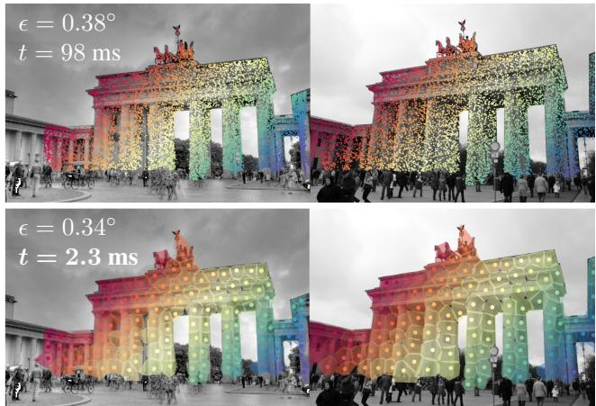
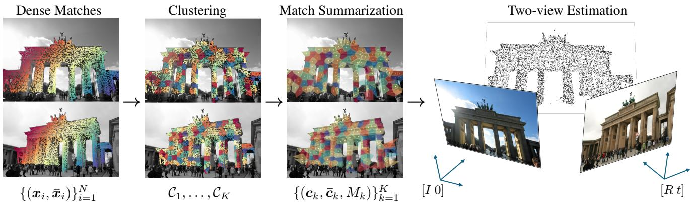
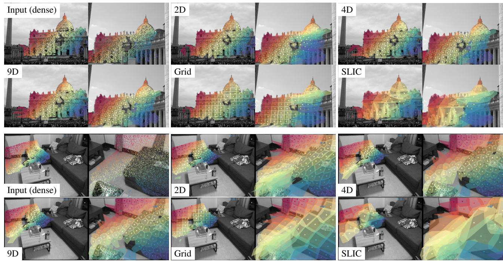
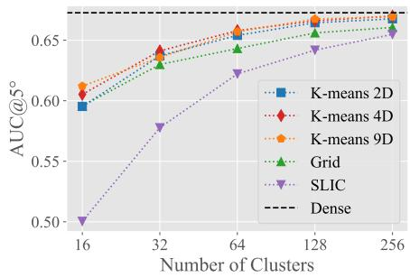
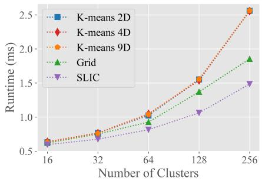
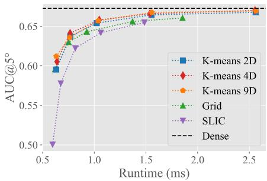
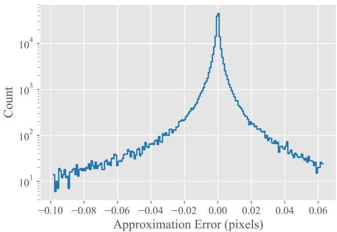
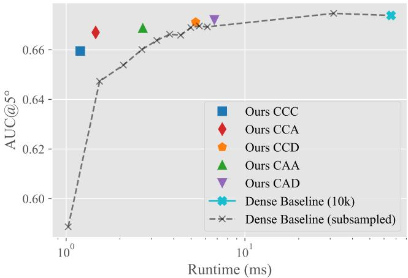

# Dense Match Summarization for Faster Two-view Estimation

Jonathan Astermark, Anders Heyden, and Viktor Larsson Centre for Mathematical Sciences, Lund University

{jonathan.astermark, anders.heyden, viktor.larsson}@math.lth.se

## Abstract

In this paper, we speed up robust two-view relative pose from dense correspondences. Previous work has shown that dense matchers can significantly improve both accuracy and robustness in the resulting pose. However, the large number of matches comes with a significantly increased runtime during robust estimation in RANSAC. To avoid this, we propose an efficient match summarization scheme which provides comparable accuracy to using thefull set ofdense matches, while having 10-100x faster runtime. We validate our approach on standard benchmark datasets together with multiple state-of-the-art dense matchers.

## 1. Introduction

Determining the two-view camera geometry is an important sub-task in many computer vision problems, e.g. for Simultaneous Localization and Mapping or Structure-from-Motion. The most common approach is to first detect corresponding points in the two views, followed by robust estimation using RANdom Sample Consensus (RANSAC) [18] which both estimates the relative pose and identifies potential outlier matches. Traditionally, keypoint matching is performed by independently detecting keypoints in each view, followed by a matching step, either directly comparing descriptor similarity or using a learned matcher.

Recently, a lot of attention has been given to so-called detector-free matching, which takes the images as input and directly establishes (semi-)dense correspondences. These matchers produce significantly more matches, compared to the detector-based counterparts, especially in weakly textured image regions, such as walls, floors, and ceilings. Dense matching shows great promise and currently achieves the most accurate two-view estimates in standard benchmarks. However, this comes with a trade-off in runtime, both for running the matching and in the subsequent robust estimation (i.e. RANSAC).

In this paper, we aim to improve the runtime of the robust estimation step. We show that when using dense matchers, most of the matches provide redundant geometric constraints, and we present an efficient match summarization scheme that selects a subset of ≈ 1% of the matches, which we call representative matches, that are used for robust estimation. Using this smaller set of matches, we can obtain a 10-100x speedup with a marginal loss in pose accuracy. In addition, we present an approximation approach for enriching each representative match to capture the geometric constraints of nearby correspondences in a single 9×9-matrix (regardless of how many neighboring matches are included). This enrichment allows for an even smaller loss of pose accuracy, while still being significantly faster compared to dense correspondence. In Figure 1 we visualize one example from MegaDepth [26].

  
Figure 1. Relative Pose Estimation from Dense Matches. The top images show 10,000 semi-dense matches from DKM [15] with same colors indicating corresponding points. The large number of matches makes robust estimation with RANSAC accurate (pose error ϵ = 0.38◦) but slow (runtime t = 98 ms). In this paper we show that we can get comparable accuracy with significantly lower runtime by sparsifying the dense matches (bottom images). Each sparsified match is represented by a 9×9-matrix that summarizes the geometric constraints from nearby matches.

We validate our claims and our approach with extensive experiments and ablation studies on standard benchmarks with different state-of-the-art dense matchers.

In summary, our contributions are:

• A scheme for summarizing any dense matches into sparse representative matches, which speeds up the robust estimation by a factor 10-100x, with only a very small loss in accuracy.

• An approximation-based approach to summarize the contributions of each cluster, which we use to refine the output from RANSAC. This lets us maintain the high accuracy from dense matches, with only a small increase in runtime compared to the approach above.

• In experiments on standard benchmarks, with multiple state-of-the-art dense matchers, we are able to consistently show a significant speedup. Furthermore, our experiments show that sparsified dense matches outperform state-of-the-art sparse matches in terms of accuracy.

## 1.1. Related Work

Matching and Correspondences. Image correspondence for geometric estimation traditionally works with a detect-then-match paradigm that first identifies keypoints (e.g. SIFT [28], SuperPoint [12]) independently in each image, followed by a matching step. The matching is either done by comparing descriptor similarity ([12, 14, 28]) or more recently via learned matchers ([27, 35]). In [36] the authors instead proposed to perform detection-free matching, which takes an image pair as input and directly regresses semi-dense pixel correspondences. This started a series of work on dense matching ([7, 15, 16, 20]) which improved on the initial work. Common for all dense methods is that they produce significantly more matches compared to classical detector-based methods. By considering both images jointly, the methods are able to propagate strong matches to weaker ones, allowing for even weakly textured regions to be matched between images.

In benchmarks for two-view relative pose estimation, these methods significantly improve the results in terms of pose accuracy. However, this comes at a trade-off with runtime, as the large number of matches makes robust estimation more costly. In this work, we offset some of this cost by speeding up the robust estimation. Our method is not specific to a particular matcher and can be applied to any dense correspondences.

Robust Estimation. For robust geometric estimation problems in computer vision, the RANSAC algorithm, originally introduced by Fischler and Bolles [18] in 1981, is the de facto standard. Modern RANSAC variants, while still working with similar principles as the original, usually incorporate some form of local optimization (LO-RANSAC [10, 24]) as well a more complex scoring beyond simple inlier counting, $e . g$ . MSAC [37] or MAGSAC [3]. Other works improve by integrating various learned components in the pipeline, see e.g. [4, 6, 39]. There are also several works which focus on making RANSAC faster. In [9], the authors propose a probabilistic method (SPRT) for deciding when to early exit. In [22], the authors propose to only perform scoring once two similar models are found. Rais et al. [32] instead aggregate multiple model hypotheses to form the final output. Barath et al. [2] speed up scoring by filtering out regions of the matches which cannot contain inlier correspondences for the current model. PROSAC [8] leverages per-match confidences to sample good models earlier, to speed up convergence. Ni et al. [30] group correspondences and model different inlier ratios for each cluster, which is used both for sampling and stopping criterion.

The match summarization method proposed in this paper is orthogonal (and could be combined) with the improvements in the above methods. In particular, most prior work focus on either speeding up the scoring or reducing the number of iterations, but do not consider refinement which is particularly costly with a large number of matches.

Richer Correspondences. For affine-correspondences (ACs) each match is associated with a $2 \times 2$ matrix representing a local transformation around the keypoints. These matrices can be interpreted as a linearization of the local planar homography [33]. Affine correspondences have been used to derive more efficient minimal estimators ([5, 17, 33, 38]) as well as provide constraints for normal estimation [19]. In this paper, we derive a summarized correspondence expressed with a 9 × 9-matrix. While this matrix is similar to ACs in that it encodes additional local geometric constraints, it does not make assumption on local planarity and yields stronger geometric constraints, even allowing estimation from a single correspondence (see Section 4.4).

## 2. Background

Each 2D-point correspondence $( \pmb { x } , \pmb { \bar { x } } ) \in \mathbb { R } ^ { 3 } \times \mathbb { R } ^ { 3 }$ (in homogeneous coordinates) constrain the relative pose by

$$
\bar { \pmb { x } } ^ { T } E { \pmb x } = 0 ,\tag{1}
$$

where $E = [ \pmb { t } ] _ { \times } R$ is the essential matrix. As the points $( x , { \bar { x } } )$ are measurements from the images, they will contain noise and will not satisfy (1) exactly, even if the match is correct. Thus, in the optimization, a residual such as the Sampson error is commonly used instead,

$$
\mathcal { E } ( E , \pmb { x } , \bar { \pmb { x } } ) = \frac { ( \bar { \pmb { x } } ^ { T } E \pmb { x } ) ^ { 2 } } { \| E _ { 1 2 } \pmb { x } \| ^ { 2 } + \| ( E ^ { T } ) _ { 1 2 } \bar { \pmb { x } } \| ^ { 2 } } ,\tag{2}
$$

where $E _ { 1 2 }$ is the first two rows of $E .$ The Sampson error approximates the squared reprojection error, and is used to determine match correctness (inlier or outlier). Most RANSAC-variants additionally use some form of MSACscoring [37] for the models, $i . e .$ . the essential matrix is chosen by minimizing the sum of truncated residuals

$$
f ( E ) = \sum _ { i = 1 } ^ { N } \operatorname* { m i n } \left\{ \mathcal { E } ( E , \pmb { x } _ { i } , \bar { \pmb { x } } _ { i } ) , \tau ^ { 2 } \right\} ,\tag{3}
$$

where N denotes the number of matches and $\tau \in \mathbb { R } _ { + }$ is the inlier threshold. The model-scoring function $f ( E )$ is used both for selecting the best model, and for non-linear refinement. As the number of matches N grows large, evaluating $f ( E )$ will dominate the runtime cost in RANSAC.

## 3. Method

In this section, we present a method for efficiently summarizing the geometric constraints given by the dense matches. The idea is to first cluster the correspondences into subsets that yield similar geometric constraints, and replace each cluster with a single representative match used in robust estimation. Next, we compute a proxy residual that summarizes the geometric constraints from each cluster into a 9×9- matrix, irrespective of cluster size. This allows us to refine the pose without evaluating the full residual (3) in each step of the optimization. Figure 2 shows an overview of our method. In Section 3.1 we discuss different approaches for performing the clustering and selecting representative matches, and in Section 3.2 we derive the proxy residual.

In the paper we focus the presentation on the calibrated case (essential matrix), but the approach is directly applicable to the uncalibrated (fundamental matrix) setting as well.

## 3.1. Clustering and Representative Matches

Given a set of dense matches, our goal is to find a sparse subset of representative matches that capture the same geometric constraints as the full set. To do this, we begin by clustering correspondences that contribute with similar residuals. From each cluster, we then select a single match which serves as a representative of that cluster.

We base our clustering on the assumption that matches close to each other should lead to similar residuals in (3). This motivates us to group matches based on their position in the two images. A simple approach is to use a standard clustering method, $e . g$ . K-means, applied on the 4- dimensional match vectors (i.e. concatenated keypoint coordinates from both images). Alternatively, matches could be clustered based on the images, e.g. using superpixels. In Section 4.2, we discuss and compare different approaches for clustering and their trade-off in terms of runtime and accuracy for our method.

For each cluster, we then select the match closest to the cluster centroid (in 4D match space) as the representative match. The set of representative matches $\{ ( \pmb { c } _ { i } , \pmb { \bar { c } } _ { i } ) \} _ { i = 1 } ^ { K } \subset$ $\{ ( \pmb { x } _ { i } , \pmb { \bar { x } } _ { i } ) \} _ { i = 1 } ^ { N }$ , where K is the number of clusters, can be used directly in RANSAC to estimate the relative pose, using the sub-sampled cost

$$
f _ { c } ( E ) = \sum _ { i = 1 } ^ { K } \operatorname* { m i n } \left\{ \mathcal { E } ( E , \pmb { c } _ { i } , \bar { \pmb { c } } _ { i } ) , \tau ^ { 2 } \right\} .\tag{4}
$$

Since the runtime of RANSAC is generally dominated by scoring and refinement, which grows linearly with the number of matches, significant subsampling can drastically reduce the runtime. In our experiments (Section 4) we show that even when severely subsampling $( K \approx N / 8 0 )$ , leading to 55x speedup, we can still obtain good relative pose estimates when using this method. This highlights that most constraints in the dense matches are redundant. However, the sparsified matches still will lead to a slight drop in accuracy. In the next section, we propose an approximation which enriches each of the matches to also encode the geometric constraints from the full cluster.

## 3.2. Dense Match Summarization

We now present a method for approximating the full cost in (3) using the clustering. The idea is to replace the dense matches in each cluster with a more computationally efficient proxy residual. While we in the previous section reduced the number of residuals from N to K by only considering the representative matches, in this section we will capture more of the geometry per cluster by increasing this number to 9K. We do this in two steps; first by assuming that each cluster is either all-inlier or all-outler, and second by approximating the Sampson error in each cluster.

Let $\mathcal { M } \subset \mathbb { R } ^ { 3 } \times \mathbb { R } ^ { 3 }$ be the set of dense input matches, and let $\mathcal { C } _ { 1 } , \ldots , \mathcal { C } _ { K } \subset \mathcal { M }$ be a disjoint clustering of these with associated representative matches $\{ ( c _ { k } , \bar { c } _ { k } ) \} _ { k = 1 } ^ { K }$ . By assuming that the matches in each cluster are either all inliers or all outliers, (3) can be rewritten as

$$
f ( E ) = \sum _ { k = 1 } ^ { K } \sum _ { ( { \pmb x } , { \bar { \pmb x } } ) \in \mathcal { C } _ { k } } \operatorname* { m i n } \left. \mathcal { E } ( E , { \pmb x } , { \bar { \pmb x } } ) , \tau ^ { 2 } \right.\tag{5}
$$

$$
\approx \sum _ { k = 1 } ^ { K } \operatorname* { m i n } \left\{ \sum _ { ( \pmb { x } , \bar { \pmb { x } } ) \in \mathcal { C } _ { k } } \mathcal { E } ( E , \pmb { x } , \bar { \pmb { x } } ) , | \mathcal { C } _ { k } | \tau ^ { 2 } \right\} ,\tag{6}
$$

where $\vert \mathcal { C } _ { k } \vert$ denotes the number of matches in cluster $\mathcal { C } _ { k }$ This means that each cluster either contributes the sum of all its dense residuals, or the constant factor $| { \mathcal C } _ { k } | \tau ^ { 2 } -$ whichever is smallest.

Now, consider a single cluster C with representative match $( c , { \bar { c } } )$ . The sum of all its dense residuals is

$$
f _ { c l } ( E ; \mathcal { C } ) = \sum _ { ( \pmb { x } , \bar { \pmb { x } } ) \in \mathcal { C } } \mathcal { E } ( E , \pmb { x } , \bar { \pmb { x } } ) ,\tag{7}
$$

i.e. the inner sum in (6). By construction, each match $( { \pmb x } , { \pmb \bar { x } } ) \in \mathcal { C }$ will lie relatively close to the cluster’s representative match $( c , { \bar { c } } )$ . This motivates us to approximate the Sampson error (2) for each dense match as

$$
\mathcal { E } ( E , \pmb { x } , \bar { \pmb { x } } ) \approx \frac { ( \bar { \pmb { x } } ^ { T } E \pmb { x } ) ^ { 2 } } { \| E _ { 1 2 } \pmb { c } \| ^ { 2 } + \| ( E ^ { T } ) _ { 1 2 } \bar { \pmb { c } } \| ^ { 2 } } ,\tag{8}
$$

i.e. by replacing $( x , { \bar { x } } )$ in the denominator with $( c , { \bar { c } } )$ . For brevity, we introduce $\begin{array} { r } { \dot { \boldsymbol \alpha } ( { \boldsymbol E } ; { \mathcal C } ) = \| { \boldsymbol E } _ { 1 2 } { \boldsymbol c } \| ^ { 2 } + \| ( \dot { \boldsymbol E } ^ { T } ) _ { 1 2 } \bar { \boldsymbol { c } } \| ^ { 2 } } \end{array}$

  
Figure 2. Overview of our Summarization Scheme. As input, our method takes a set of dense matches $\{ ( \pmb { x } _ { i } , \bar { \pmb { x } } _ { i } ) \} _ { i = 1 } ^ { N }$ , where typically $N = 1 0 0 0 0$ . Through clustering, the matches are grouped into clusters $\mathcal { C } _ { 1 } , \ldots , \mathcal { C } _ { K } , K \ll N$ , which yield approximately the same geometric constraints on the relative pose. For each cluster, we then perform match summarization, which replaces each group of matches with a representative match $\left( c _ { k } , \overline { { c } } _ { k } \right)$ and $\mathrm { ~ a ~ 9 ~ } \times \mathrm { ~ 9 - m a t r i x ~ } M _ { k }$ that encodes the geometric constraints. These summarized metamatches can then used for robust two-view estimation with significant speedup for a very small accuracy loss.

Then the approximation in (8) lets us write the sum of residuals for a cluster more compactly as

$$
\begin{array} { l } { \displaystyle { f _ { \mathrm { c l } } ( E ; \mathcal { C } ) \approx \sum _ { ( \pmb { x } , \bar { \boldsymbol { x } } ) \in \mathcal { C } } \frac { ( \bar { \boldsymbol { x } } ^ { T } E \boldsymbol { x } ) ^ { 2 } } { \alpha ( E ; \mathcal { C } ) } } \qquad \mathrm { ( 9 ) } } \\ { \displaystyle = \frac { 1 } { \alpha ( E ; \mathcal { C } ) } \left\| \left( \boldsymbol { \bar { x } } _ { 1 } ^ { T } E \boldsymbol { x } _ { 1 } \right) \right\| ^ { 2 } = \frac { 1 } { \alpha ( E ; \mathcal { C } ) } \| A e \| ^ { 2 } , } \end{array}\tag{10}
$$

where $n = | \mathcal { C } _ { k } | ; e \in \mathbb { R } ^ { 9 }$ is a vector containing the elements of $E ,$ and $\textit { A } \in \mathbb { R } ^ { n \times 9 }$ is the matrix with rows $A _ { i } = ( \mathbf { x } _ { i } \otimes \bar { \mathbf { x } } _ { i } ) ^ { T }$ for all $( { \pmb x } _ { i } , { \pmb \bar { x } } _ { i } ) \in \mathcal { C }$ . Here, ⊗ denotes the Kronecker product. The trick to efficiently evaluating (10) is that the large matrix A can be replaced with the reduced measurement matrix [34] $M \in \mathbb { R } ^ { 9 \times 9 }$ using Cholesky factorization $A ^ { T } A = M ^ { T } M$ , since

$$
\| A e \| ^ { 2 } = e ^ { T } A ^ { T } A e = e ^ { T } M ^ { T } M e = \| M e \| ^ { 2 } .\tag{11}
$$

Note that this is very fast to compute (in our experiments a total of 0.2 ms for 128 clusters with $N = 1 0 , 0 0 0 )$ and only needs to be done once for each clustering.

The final approximate cost function for all matches, to be evaluated in each step of the optimization, is

$$
f _ { a p p r o x } ( E ) = \sum _ { k = 1 } ^ { K } \operatorname* { m i n } \left\{ \frac { 1 } { \alpha ( E ; \mathcal C _ { k } ) } \| M _ { k } e \| ^ { 2 } , | \mathcal C _ { k } | \tau ^ { 2 } \right\} .\tag{12}
$$

In our experiments (Section 4.3) we show that this provides a tight approximation to the sum of Sampson errors, while being significantly faster to compute.

Above, the approximation was applied to the Sampson residual, but it is in principle also applicable to residuals

with similar form, $e . g . \mathrm { S y }$ mmetric Epipolar Distance:

$$
\begin{array} { r } { \displaystyle \sum _ { ( \pmb { x } , \bar { \pmb { x } } ) } \left( \frac { ( \bar { \pmb { x } } ^ { T } E \pmb { x } ) ^ { 2 } } { \| E _ { 1 2 } \pmb { x } \| ^ { 2 } } + \frac { ( \bar { \pmb { x } } ^ { T } E \pmb { x } ) ^ { 2 } } { \| E _ { 1 2 } ^ { T } \bar { \pmb { x } } \| ^ { 2 } } \right) \approx \frac { \| A e \| ^ { 2 } } { \| E _ { 1 2 } \pmb { c } \| ^ { 2 } } + \frac { \| A e \| ^ { 2 } } { \| E _ { 1 2 } ^ { T } \bar { \pmb { c } } \| ^ { 2 } } . } \end{array}
$$

## 4. Experiments

In this section, we evaluate the match clustering and summarization scheme presented in Section 3, through experiments on real image pairs. First, in Section 4.2, we compare clustering methods and perform an ablation study on both the clustering method and number of clusters. In Section 4.3, this is followed by an evaluation of the approximation error of our summarization scheme. Next, in Section 4.4, we perform an ablation study on the integration of our summarization scheme in RANSAC.

We use two standard benchmarks for relative pose estimation, ScanNet-1500 [11, 35] and MegaDepth-1500 [26, 36], which each contain 1500 image pairs of indoor and outdoor scenes, respectively. For inlier thresholds, we use 1.0 pixels in MegaDepth-1500, and 2.5 pixels in ScanNet-1500. Following prior work, we report the pose error (max of rotation and translation error in degrees) with the Area Under Curve (AUC) up to some threshold. For our ablations and approximation evaluation, we evaluate on MegaDepth-1500, using $N = 1 0 0 0 0$ dense matches from DKM [15]. Finally, in Section 4.5 we show that our results generalize to other state-of-the-art dense matchers and other datasets. We also present results on estimation of the fundamental matrix on the challenging WxBS dataset [29].

## 4.1. Implementation Details

We implement our approximate residual in an LO-RANSAC framework building on PoseLib [23], which is a state-of-the-art robust estimation library in C++. To get a fair comparison with the dense and subsampled methods, we implement the standard Sampson residual in the same framework. For the ablations and evaluations in the following sections, our method runs RANSAC using the representative matches from Section 3.1, followed by refinement using the approximate residuals described in Section 3.2. All timings are measured on a modern desktop CPU.

## 4.2. Ablation on Clustering

First, we explore different approaches for performing the match clustering. We explore both keypoint-based and image-based clustering methods. For the keypoint-based methods, we evaluate K-means clustering on both the 4- dimensional match vectors and the 2-dimensional keypoints from one of the images. Motivated by the geometric constraints in (10), we also evaluate clustering in the 9- dimensional constraint vectors $A _ { i } = \pmb { x } _ { i } \otimes \bar { \pmb { x } } _ { i } \in \mathbb { R } ^ { 9 }$ . For the K-means clustering experiments we use FAISS [13] on a CPU, running a maximum of 5 iterations.

For image-based clustering, we first segment one of the images, then consider all matches within the same segment as a cluster. We evaluate both a simple 2D-grid segmentation, and a more sophisticated superpixel detection. The 2D grid is created by dividing the image region between the minimum and maximum keypoint coordinates into $m ^ { 2 }$ equally sized rectangles, where $\bar { m } = \lceil \sqrt { K } \rceil$ . For the superpixel detection, we use SLIC [1, 21]. For each clustering method, we select the representative match by finding the match closest to the centroid.

In Figure 3, we show some qualitative examples of the different clusterings on two example image pairs from MegaDepth-1500 and ScanNet-1500, respectively. In the top example, we see that the keypoint-based methods (2D, 4D, 9D) all give similar clustering patterns, while in the bottom example 2D clustering leads to a coarser clustering in the second image. This is explained by the smaller image overlap; while 4D and 9D clustering takes the keypoint density in both images into account, 2D clustering only sees the keypoints from one of the images. The image-based methods (Grid and SLIC), on the other hand, lead to larger clusters in both of the image pairs. This is because the segmentation is not proportional to the match density, so they may “waste” clusters on image regions with few or no matches.

In Table 1, we compare the errors and runtimes for different clustering methods on MegaDepth-1500, using a cluster size of 128. We report both the time for clustering, and for estimation using the clusters. We assume that gridclustering can be done at negligible runtime with an efficient implementation. In the table, we see that the difference between clustering methods is quite small, except for SLIC which is markedly more expensive to calculate. A key difference with image-based clustering, however, is that it only needs to be done once per image. Keypoint-based clustering, on the other hand, needs to be done once per image pair, which can lead to many more total evaluations. For large datasets with high co-visibility, this may be important to consider.

<table><tr><td colspan="3"></td><td colspan="2">Runtime</td></tr><tr><td>Method</td><td> $\mathrm { A U C } @ 5 ^ { \circ }$ </td><td> $\epsilon _ { a v g }$ </td><td>Clustering</td><td>RANSAC</td></tr><tr><td>K-means 2D</td><td>66.4</td><td>3.62</td><td>1.53 ms</td><td>1.46 ms</td></tr><tr><td>K-means 4D</td><td>66.9</td><td>3.28</td><td>1.22 ms</td><td>1.44 ms</td></tr><tr><td>K-means 9D</td><td>66.6</td><td>3.25</td><td>1.38 ms</td><td>1.43 ms</td></tr><tr><td>Grid</td><td>65.9</td><td>3.73</td><td>≈ 0 ms</td><td>1.34 ms</td></tr><tr><td>SLIC [21]</td><td>64.5</td><td>4.07</td><td>22.38 ms</td><td>0.97 ms</td></tr></table>

Table 1. Clustering Method Ablation. The table shows the pose errors for each clustering approach on MegaDepth-1500, as well as the average runtime for each clustering strategy.

Next, we evaluate the impact of the number of clusters. Figure 4 shows the $\mathrm { A U C @ 5 ^ { \circ } }$ (left) and runtime (center) plotted against the number of clusters, as well as $\mathrm { A U C } @ 5 ^ { \circ }$ vs. runtime (right). We also include the dense baseline (dashed). The results further indicate that all K-means clustering variants perform similarly, and that the performance gets close to the dense baseline as number of clusters increases. Based on these results, we select K-means 4D with $K = 1 2 8$ as our main clustering method to be used in the experiments, but note that other choices are viable as well.

## 4.3. Evaluation of Approximation Error

In Section 3.2, we introduced a proxy residual to approximate the sum of squared Sampson residuals for a cluster. In this section, we experimentally validate this approximation and show that it provides a tight approximation of the true residual. We use 128 clusters per image pair obtained via Kmeans-9D, as defined in the previous section. For each cluster C, we compute the per-cluster average Sampson residuals exactly as

$$
\varepsilon _ { S } ^ { 2 } = \frac { 1 } { \vert \mathcal { C } \vert } \sum _ { ( \pmb { x } , \bar { \pmb { x } } ) \in \mathcal { C } } \mathcal { E } ( E _ { g t } , \pmb { x } , \bar { \pmb { x } } ) ,\tag{13}
$$

and the squared approximate cluster residual as

$$
\varepsilon _ { a } ^ { 2 } = \frac { 1 } { | \mathcal { C } | } \frac { \| M \mathrm { v e c } ( E _ { g t } ) \| ^ { 2 } } { \| ( E _ { g t } ) _ { 1 2 } \pm \| ( E _ { g t } ^ { T } ) _ { 1 2 } \pmb { \bar { c } } \| ^ { 2 } } .\tag{14}
$$

In Figure 5 we show the distribution of the difference $\varepsilon _ { S } - \varepsilon _ { a }$ between the true residual and the approximation, computed on the 1500 image pairs from MegaDepth-1500 with 10 000 DKM matches. The residuals are evaluated for the ground truth essential matrix $E _ { g t } = [ \pmb { t } _ { g t } ] _ { \times } R _ { g t }$ . Note that positive values indicate that the approximation gives too small residuals, while negative values correspond to the approximation giving too large residuals. We plot residuals between the $1 ^ { \mathrm { s t } }$ and $9 9 ^ { \mathrm { t h } }$ percentile. Thus we see that more than 98 % of the residuals have an absolute approximation error of less than 0.1 pixels, with a small bias towards getting too large residuals.

  
Figure 3. Qualitative Comparison of Clustering Methods. We compare different clustering methods on a single image pair from MegaDepth-1500 (top 2 rows) and ScanNet-1500 (bottom 2 rows), respectively. Dense matches from DKM are clustered using three keypoint-based methods (2D, 3D, 9D) and two image-based methods (Grid, SLIC).

  
Figure 4. Clustering Method and Hyperparameter Ablation. The plots show AUC@5◦ (left), runtime (middle) and AUC-runtime tradeoff (right) for different clustering methods and number of clusters K. We include AUC@5◦ for the dense baseline as reference.

In Table 2 we compare the inlier ratios obtained through exact and approximate residuals, using the ground-truth pose. We compute average inlier ratios for each of the 1500 image pairs in MegaDepth-1500. Note that we compute the ratio of inlier clusters for $\varepsilon _ { a } ,$ while for the exact residual εS the inlier ratio is computed per match. We also include the runtime for computing the two residuals for an image pair (equivalent to scoring a model in RANSAC). We see that the approximated residual gives slightly lower inlier ratios, which decrease slowly for coarser clustering, while the speedup in computing time is significant.

## 4.4. Ablation on Integration in RANSAC

In this section, we explore different ways of integrating our method in robust estimation with RANSAC. Robust estimation is typically done in two stages: the hypothesize-andverify loop, which alternates between estimating and scoring models, and model refinement, which is done on the best model after the stop criterion is reached.

We evaluate the effect of our summarization scheme both on the model scoring and refinement stages of the estimation. For both stages, we evaluate usage of the representative match residuals (4), and the approximate residuals (12). We will refer to these methods as Center and Approximate, respectively. For the refinement stage, we also evaluate usage of the original residuals (3), referred to as the Dense method. With two model scoring costs to evaluate (Center and Approximate) and three refinement costs (Center, Approximate, and Dense) this results in 6 possible combinations for our ablation study, in addition to the fully dense baseline. However, we omit Approximate scoring followed by Center refinement, since this would use less information in the refinement than what was used for the model scoring.

  
Figure 5. Histogram over Approximation Error. The graph shows the distribution of differences between the true and approximated residuals, $i . e . , \varepsilon _ { S } - \varepsilon _ { a } .$ , scaled with focal length. Statistic taken over all clusters from all image pairs in MegaDepth-1500.

<table><tr><td rowspan="2">Type of residual</td><td colspan="2">Inlier ratio</td><td colspan="2">Runtime (µs)</td></tr><tr><td>Med.</td><td>Avg.</td><td>Avg.</td><td>Speedup</td></tr><tr><td>Exact</td><td>0.87</td><td>0.82</td><td>155.8</td><td>1.0x</td></tr><tr><td>Approx. K = 1024</td><td>0.85</td><td>0.80</td><td>31.1</td><td>5.0x</td></tr><tr><td>Approx. K = 512</td><td>0.84</td><td>0.80</td><td>14.8</td><td>10.5x</td></tr><tr><td>Approx. K = 256</td><td>0.84</td><td>0.79</td><td>7.1</td><td>21.9x</td></tr><tr><td>Approx. K = 128</td><td>0.82</td><td>0.78</td><td>3.2</td><td>48.7x</td></tr><tr><td>Approx. K = 64</td><td>0.80</td><td>0.76</td><td>1.3</td><td>119.8x</td></tr></table>

Table 2. Comparison of RANSAC Scoring. We compare the inlier ratios when calculating exact and approximate residuals for different numbers of clusters K, using the ground-truth essential matrix on all image pairs in MegaDepth-1500. The average and median ratios over all image pairs is reported. Note that inlier ratios are calculated per match for the exact residuals, and per cluster for approximate residuals. The runtime shows the average cost of scoring a model with MSAC in RANSAC.

For all of the above methods, we perform model estimation using the 5-point solver [31], sampling from the representative matches. Note that this sampling has no effect on runtime compared to sampling from the dense matches, since convergence of RANSAC is only based on the scoring. Since we get up to 9 constraints from each $M _ { k }$ matrix, it is in principle also possible to estimate a model from a single summarized correspondence. However, we found that this generally gives worse performance, see suppl. material.

In Table 3, we show AUC@5◦ and median runtime for the different combinations of model scoring and refinement costs, compared with a fully dense baseline. We report the average and standard deviation of the AUC for 10 runs using different seeds. In the table, we abbreviate the methods using a three letter combination, where the first letter denotes sampling method, the second letter denotes scoring method, and the third letter denotes refinement method. We see that scoring using Approximate or Center residuals are both significantly faster than Dense. Center scoring is the fastest while not significantly less accurate than Approximate. For refinement, however, Approximate residuals give a small but significant improvement in score over Center, but at an increased runtime. This gives us a possible trade-off, where we can sacrifice some runtime for better accuracy.

We also compare our ablated methods with a dense baseline on subsampled DKM-matches, obtained by querying the balanced DKM sampler for a lower number of correspondences. In Figure 6, we plot AUC@5◦ vs. runtime for our methods and different number of DKM matches. We see that compared to subsampling, most of our methods give shorter runtime for the same performance; in particular CCC and CCA. This indicates that our summarization better preserves the geometric constraints, compared to reducing the number of correspondences extracted from the matcher.

<table><tr><td>Method</td><td>AUC@5°</td><td>RT (ms)</td><td>Speedup</td></tr><tr><td>DDD (baseline)</td><td>67.38±0.10</td><td>66.0</td><td>1.0x</td></tr><tr><td>CAD</td><td>67.21±0.08</td><td>6.8</td><td>9.8x</td></tr><tr><td>CCD</td><td>67.12±0.08</td><td>5.3</td><td>12.3x</td></tr><tr><td>CAA</td><td>66.87±0.07</td><td>2.7</td><td>24.6x</td></tr><tr><td>CCA</td><td>66.70±0.06</td><td>1.5</td><td>45.2x</td></tr><tr><td>CCC</td><td> $6 5 . 9 5 { \scriptstyle \pm 0 . 1 0 }$ </td><td>1.2</td><td>55.0x</td></tr></table>

Table 3. Ablation on RANSAC Integration. We compare usage of our two summarization schemes in different stages of the estimation. Method names denote the what data is used in sampling, scoring, and refinement. For example, “CAD” means sampling from representative matches (C), scoring with the summarized approximation (A), and refinement with the dense matches (D).

## 4.5. Comparative Evaluation in RANSAC

We evaluate our match summarization scheme on robust estimation using different dense matchers. We run both the CCC- and CCA-methods, since they represent a possible trade-off between accuracy and runtime. We compare with a fully dense baseline on the full set of matches. To show that our results do not depend on the dense matcher, we report results using DKM [15], RoMA [16], and ASpanFormer [7]. From DKM and RoMA, we always sample 10 000 matches, while ASpanFormer gives a variable amount of matches. For image pairs where ASpanFormer gives less than 128 matches, we fall back to using dense estimation. The average results from 10 different seeds are shown in Table 4. The reported runtime is the median over all image pairs. For the convenience of the reader, we have also included estimation from sparse SuperPoint [12] + LightGlue [27] keypoints. In summary, we see that our summarization scheme achieves comparable accuracy to the dense baseline at a fraction of the runtime, irrespective of the dense keypoint matcher used.

<table><tr><td></td><td></td><td colspan="5">MegaDepth-1500</td><td colspan="5">ScanNet-1500</td></tr><tr><td>Matches</td><td>Estimator</td><td>AUC@5°</td><td>AUC@10°</td><td>AUC@20°</td><td>RT (ms)</td><td>Speedup</td><td>AUC@5°</td><td>AUC@10°</td><td>AUC@20°</td><td>RT (ms)</td><td>Speedup</td></tr><tr><td></td><td>Dense</td><td>67.4</td><td>79.6</td><td>88.0</td><td>66.6</td><td>1.0x</td><td>31.3</td><td>52.6</td><td>69.9</td><td>68.8</td><td>1.0x</td></tr><tr><td>DKM</td><td>Ours CCA</td><td>66.7</td><td>79.1</td><td>87.5</td><td>1.5</td><td>45.2x</td><td>30.9</td><td>52.1</td><td>69.6</td><td>1.5</td><td>46.7x</td></tr><tr><td></td><td>Ours CCC</td><td>66.0</td><td>78.7</td><td>87.3</td><td>1.2</td><td>55.0x</td><td>30.4</td><td>51.7</td><td>69.3</td><td>1.2</td><td>58.6x</td></tr><tr><td></td><td>Dense</td><td>70.1</td><td>81.5</td><td>89.3</td><td>60.6</td><td>1.0x</td><td>33.3</td><td>55.2</td><td>72.2</td><td>64.6</td><td>1.0x</td></tr><tr><td>RoMA</td><td>Ours CCA</td><td>70.1</td><td>81.6</td><td>89.4</td><td>1.4</td><td>42.2x</td><td>33.0</td><td>54.9</td><td>72.0</td><td>1.4</td><td>46.3x</td></tr><tr><td></td><td>Ours CCC</td><td>69.3</td><td>81.1</td><td>89.2</td><td>1.2</td><td>52.1x</td><td>32.8</td><td>54.7</td><td>71.8</td><td>1.1</td><td>58.3x</td></tr><tr><td></td><td>Dense</td><td>66.3</td><td>78.8</td><td>87.5</td><td>14.4</td><td>1.0x</td><td>30.3</td><td>50.5</td><td></td><td>15.2</td><td>1.0x</td></tr><tr><td>ASpan-</td><td>Ours CCA</td><td>65.8</td><td>78.5</td><td>87.4</td><td>1.5</td><td>9.6x</td><td>29.7</td><td>49.9</td><td>66.5 66.1</td><td>1.5</td><td>10.3x</td></tr><tr><td>Former</td><td>Ours CCC</td><td>64.1</td><td>77.4</td><td>86.8</td><td>1.2</td><td>12.1x</td><td>28.9</td><td>49.2</td><td>65.7</td><td>1.2</td><td>13.0x</td></tr><tr><td>SP+LG</td><td>Dense</td><td>63.7</td><td>77.2</td><td>86.5</td><td>5.0</td><td>N/A</td><td>21.8</td><td>39.6</td><td>55.6</td><td>3.0</td><td>N/A</td></tr></table>

Table 4. Comparison with State-of-the-art. We compare our method with a dense baseline for several dense matchers on both MegaDepth-1500 and ScanNet-1500. For comparison, we also include AUC and runtime for state-of-the-art sparse matches (SP+LG).

  
Figure 6. AUC-Runtime Trade-off in Ablation Study. The methods in Table 3 are plotted together with dense baseline for different samplings from DKM.

Finally, we present an experiment on the WxBS benchmark [29]. This benchmark contains extremely challenging wide-baseline image pairs, where GT-correspondences are provided. As it does not provide intrinsics, we evaluate fundamental matrix estimation. The metrics are computed by checking consistency of the estimated F with the GT matches. For comparison, we also run on dense matches extracted with MASt3R [25], where we disabled subsampling in the fast reciprocal matching. The results in Table 5 are qualitatively similar to the calibrated setting, showing that our method significantly speeds up the robust estimation with a marginal loss in accuracy.

<table><tr><td>Matches</td><td>Estimator</td><td>Recall (10px)↑</td><td>RT (ms)↓</td><td>Speedup↑</td></tr><tr><td rowspan="3">RoMa</td><td>Dense</td><td>86.3</td><td>63.0</td><td>1.0x</td></tr><tr><td>Ours CCA</td><td>85.1</td><td>1.45</td><td>43.3x</td></tr><tr><td>Ours CCC</td><td>83.8</td><td>0.82</td><td>77.0x</td></tr><tr><td rowspan="3">MASt3R</td><td>Dense</td><td>63.4</td><td>37.1</td><td>1.0x</td></tr><tr><td>Ours CCA</td><td>63.2</td><td>1.43</td><td>25.8x</td></tr><tr><td>Ours CCC</td><td>61.6</td><td>0.76</td><td>49.6x</td></tr></table>

Table 5. Fundamental Matrix Estimation on WxBS.

## 5. Conclusion

In this work, we have shown that dense keypoint matches, while they improve estimation compared to sparse matches, contain significant redundancies. This redundancy makes it possible to heavily subsample the matches while keeping most of the geometric constraints. We demonstrated a method to significantly speed up geometric estimation with little effect on the estimation accuracy. We additionally showed that this reduction in accuracy can be partially recovered by using our proposed summarized metacorrespondences. With this scheme, we were able to reduce the number of residuals per image pair from the number of matches N, to 9K where K is the number of clusters – a hyperparameter we can choose such that $N \ll 9 K$ . We also get a potential compression ratio in terms of storage, since the constraints from each cluster is entirely contained in a 9 × 9-matrix, plus a single correspondence. A limitation is that the method only makes sense if the original number of matches is very large. Another limitation of the paper is that we have only focused on speeding up the robust estimation step, while a large part of the total runtime comes from the dense matcher itself.

Acknowledgments. The project was supported by ELLIIT and the Swedish Research Council (Grant No. 2023-05424).

## References

[1] Radhakrishna Achanta, Appu Shaji, Kevin Smith, Aurelien Lucchi, Pascal Fua, and Sabine Susstrunk. Slic superpix-¨ els compared to state-of-the-art superpixel methods. IEEE Transactions on Pattern Analysis and Machine Intelligence, 34(11):2274–2282, 2012. 5

[2] Daniel Barath and Gabor Valasek. Space-partitioning ransac.´ In European Conference on Computer Vision (ECCV), 2022. 2

[3] Daniel Barath, Jiri Matas, and Jana Noskova. MAGSAC: marginalizing sample consensus. In Computer Vision and Pattern Recognition (CVPR), 2019. 2

[4] Axel Barroso-Laguna, Eric Brachmann, Victor Adrian Prisacariu, Gabriel J Brostow, and Daniyar Turmukhambetov. Two-view geometry scoring without correspondences. In Computer Vision and Pattern Recognition (CVPR), 2023. 2

[5] Jacob Bentolila and Joseph M Francos. Conic epipolar constraints from affine correspondences. Computer Vision and Image Understanding (CVIU), 2014. 2

[6] Luca Cavalli, Daniel Barath, Marc Pollefeys, and Viktor Larsson. Consensus-adaptive ransac. arXiv preprint arXiv:2307.14030, 2023. 2

[7] Hongkai Chen, Zixin Luo, Lei Zhou, Yurun Tian, Mingmin Zhen, Tian Fang, David McKinnon, Yanghai Tsin, and Long Quan. Aspanformer: Detector-free image matching with adaptive span transformer. European Conference on Computer Vision (ECCV), 2022. 2, 7

[8] O. Chum and J. Matas. Matching with prosac - progressive sample consensus. In Computer Vision and Pattern Recognition (CVPR), 2005. 2

[9] Ondˇrej Chum and Jiˇr´ı Matas. Optimal randomized ransac. IEEE Trans. Pattern Analysis and Machine Intelligence (PAMI), 2008. 2

[10] Ondˇrej Chum, Jiˇr´ı Matas, and Josef Kittler. Locally optimized ransac. In Pattern Recognition, pages 236–243, Berlin, Heidelberg, 2003. Springer Berlin Heidelberg. 2

[11] Angela Dai, Angel X. Chang, Manolis Savva, Maciej Halber, Thomas Funkhouser, and Matthias Nießner. Scannet: Richly-annotated 3d reconstructions of indoor scenes. In Computer Vision and Pattern Recognition (CVPR), 2017. 4

[12] Daniel DeTone, Tomasz Malisiewicz, and Andrew Rabinovich. Superpoint: Self-supervised interest point detection and description. In Computer Vision and Pattern Recognition Workshops (CVPRW), 2018. 2, 8

[13] Matthijs Douze, Alexandr Guzhva, Chengqi Deng, Jeff Johnson, Gergely Szilvasy, Pierre-Emmanuel Mazare, Maria´ Lomeli, Lucas Hosseini, and Herve J ´ egou. The faiss library.´ arXiv preprint arXiv:2401.08281, 2024. 5

[14] Mihai Dusmanu, Ignacio Rocco, Tomas Pajdla, Marc Pollefeys, Josef Sivic, Akihiko Torii, and Torsten Sattler. D2- net: A trainable cnn for joint description and detection of local features. In Computer Vision and Pattern Recognition (CVPR), 2019. 2

[15] Johan Edstedt, Ioannis Athanasiadis, Marten Wadenb˚ ack,¨ and Michael Felsberg. DKM: Dense kernelized feature

matching for geometry estimation. In Computer Vision and Pattern Recognition (CVPR), 2023. 1, 2, 4, 7

[16] Johan Edstedt, Qiyu Sun, Georg Bokman, M¨ arten˚ Wadenback, and Michael Felsberg. RoMa: Robust Dense¨ Feature Matching. Computer Vision and Pattern Recogni tion (CVPR), 2024. 2, 7

[17] Ivan Eichhardt and Dmitry Chetverikov. Affine correspon-´ dences between central cameras for rapid relative pose estimation. In European Conference on Computer Vision (ECCV), 2018. 2

[18] Martin A Fischler and Robert C Bolles. Random sample consensus: a paradigm for model fitting with applications to image analysis and automated cartography. Communications ofthe ACM, 24(6):381–395, 1981. 1, 2

[19] Levente Hajder, Lajos Loczi, and Daniel Barath. Fast glob-´ ally optimal surface normal estimation from an affine correspondence. In International Conference on Computer Vision (ICCV), 2023. 2

[20] Wei Jiang, Eduard Trulls, Jan Hosang, Andrea Tagliasac chi, and Kwang Moo Yi. Cotr: Correspondence transformer for matching across images. In International Conference on Computer Vision (ICCV), 2021. 2

[21] Alchan Kim. Fast-slic. https://github.com/Algy/ fast-slic, 2019. 5

[22] Simon Korman and Roee Litman. Latent ransac. In Com puter Vision and Pattern Recognition (CVPR), 2018. 2

[23] Viktor Larsson and contributors. PoseLib - Minimal Solvers for Camera Pose Estimation. https://github.com/ vlarsson/PoseLib, 2020. 4

[24] Karel Lebeda, Jirı Matas, and Ondrej Chum. Fixing the locally optimized ransac–full experimental evaluation. In British Machine Vision Conference (BMVC), 2012. 2

[25] Vincent Leroy, Yohann Cabon, and Jer´ ome Revaud. Ground-ˆ ing image matching in 3d with mast3r. In European Confer ence on Computer Vision (ECCV), 2024. 8

[26] Zhengqi Li and Noah Snavely. Megadepth: Learning singleview depth prediction from internet photos. In Computer Vision and Pattern Recognition (CVPR), 2018. 1, 4

[27] Philipp Lindenberger, Paul-Edouard Sarlin, and Marc Pollefeys. LightGlue: Local Feature Matching at Light Speed. In International Conference on Computer Vision (ICCV), 2023. 2, 8

[28] David G Lowe. Distinctive image features from scaleinvariant keypoints. International Journal of Computer Vision (IJCV), 60:91–110, 2004. 2

[29] Dmytro Mishkin, Jiri Matas, Michal Perdoch, and Karel Lenc. WxBS: Wide baseline stereo generalizations. In British Machine Vision Conference (BMVC), 2015. 4, 8

[30] Kai Ni, Hailin Jin, and Frank Dellaert. Groupsac: Efficient consensus in the presence of groupings. In International Conference on Computer Vision (ICCV), 2009. 2

[31] David Nister. An efficient solution to the five-point relative´ pose problem. IEEE Trans. Pattern Analysis and Machine Intelligence (PAMI), 2004. 7

[32] Martin Rais, Gabriele Facciolo, Enric Meinhardt-Llopis, Jean-Michel Morel, Antoni Buades, and Bartomeu Coll. Accurate motion estimation through random sample aggregated consensus. arXiv preprint arXiv:1701.05268, 2017. 2

[33] Carolina Raposo and Joao P Barreto. Theory and practice of structure-from-motion using affine correspondences. In Computer Vision and Pattern Recognition (CVPR), 2016. 2

[34] A. L. Rodr´ıguez, P. E. Lopez-de Teruel, and A. Ruiz. Re-´ duced epipolar cost for accelerated incremental SfM. In Computer Vision and Pattern Recognition (CVPR), 2011. 4

[35] Paul-Edouard Sarlin, Daniel DeTone, Tomasz Malisiewicz, and Andrew Rabinovich. Superglue: Learning feature matching with graph neural networks. In Computer Vision and Pattern Recognition (CVPR), 2020. 2, 4

[36] Jiaming Sun, Zehong Shen, Yuang Wang, Hujun Bao, and Xiaowei Zhou. LoFTR: Detector-free local feature matching with transformers. Computer Vision and Pattern Recognition (CVPR), 2021. 2, 4

[37] P.H.S. Torr and A. Zisserman. MLESAC: A New Robust Estimator with Application to Estimating Image Geometry. Computer Vision and Image Understanding (CVIU), 78(1): 138–156, 2000. 2

[38] Jonathan Ventura, Zuzana Kukelova, Torsten Sattler, and Daniel Bar ´ ath. P1ac: Revisiting absolute pose from a sin-´ gle affine correspondence. In International Conference on Computer Vision (ICCV), 2023. 2

[39] Tong Wei, Jiri Matas, and Daniel Barath. Adaptive reordering sampler with neurally guided magsac. In International Conference on Computer Vision (ICCV), 2023. 2