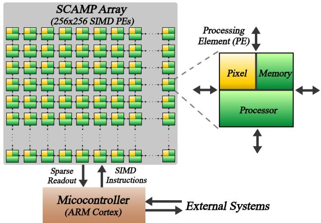
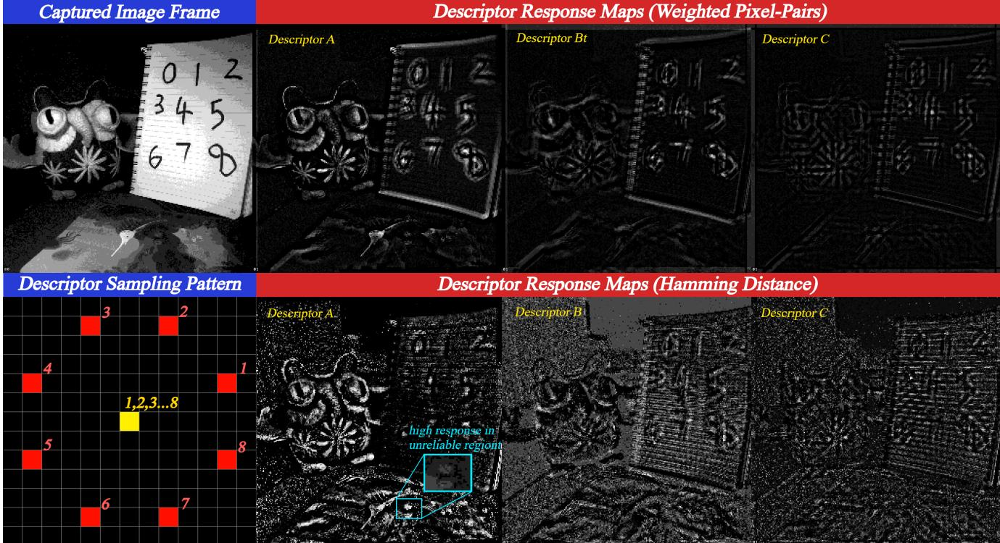
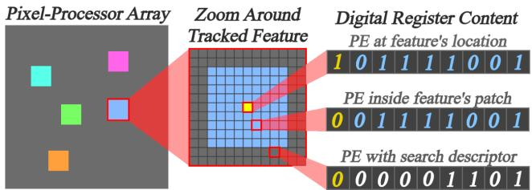
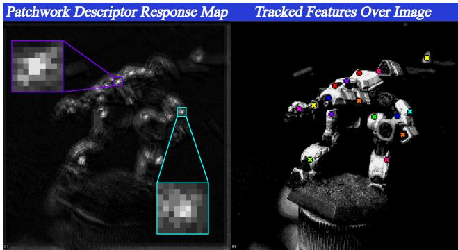
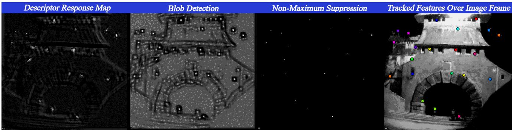
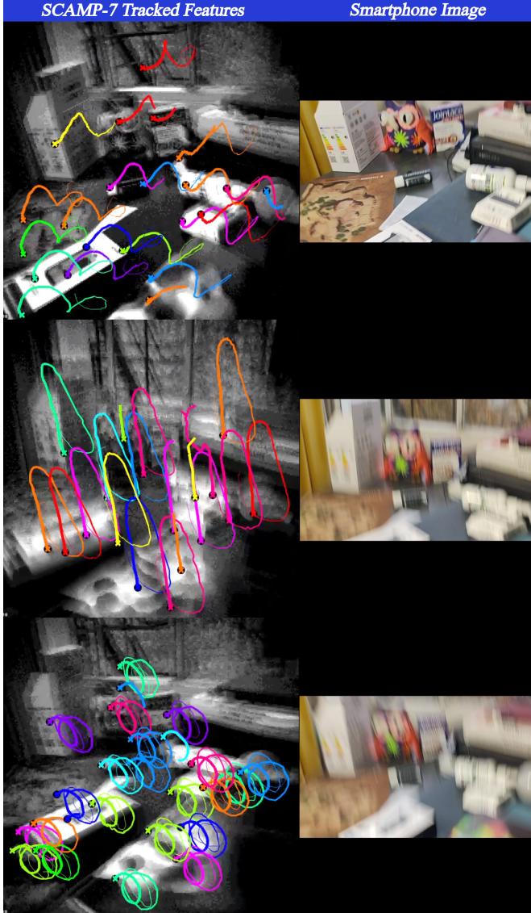
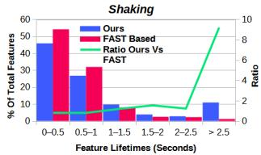
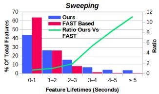
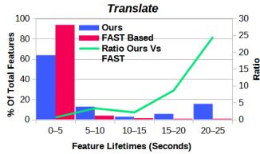
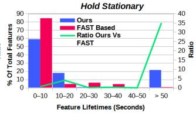

# Descriptor-In-Pixel : Point-Feature Tracking for Pixel Processor Arrays

Laurie Bose1,2 Jianing Chen1,2 Piotr Dudek1,2

1The University of Manchester, Department of EEE, Manchester, United Kingdom 2Visionchip Limited, Manchester, United Kingdom https://lauriebose.github.io/DIP

## Abstract

This paper presents a novel approach for joint pointfeature detection and tracking, designed specifically for Pixel Processor Array (PPA) vision sensors. Instead of standard pixels, PPA sensors consist of thousands of “pixelprocessors”, enabling massive parallel computation of visual data at the point of light capture. Our approach performs all computation entirely in-pixel, meaning no raw image data need ever leave the sensor for external processing. We introduce a Descriptor-In-Pixel paradigm, in which a feature descriptor is held within the memory of each pixelprocessor. The PPA’s architecture enables the response of every processor’s descriptor, upon the current image, to be computed in parallel. This produces a“descriptor response map” which, by generating the correct layout of descriptors across the pixel-processors, can be usedfor both point feature detection and tracking. This reduces sensor output to just sparse feature locations and descriptors, read-out via an address-event interface, giving a greater than 1000× reduction in data transfer compared to raw image output. The sparse readout and complete utilization of all pixelprocessors makes our approach very efficient. Our imple mentation upon the SCAMP-7 PPA prototype runs at over 3000 FPS (Frames Per Second), tracking point-features reliably under violent motion. This is the first work performing point-feature detection and tracking entirely in-pixel. 1

## 1. Introduction

Point-features are distinct points within an image, chosen to be clearly identifiable within multiple images of the same scene, even under changes such as scale, lighting, and perspective. The various methods of point-feature detection and tracking are some of the most widespread tools in computer vision, playing a vital role in Visual Odometry and Simultaneous Localisation and Mapping (SLAM). Many mobile systems such as virtual-reality headsets and unmanned aerial vehicles rely extensively on point-features, often from multiple cameras, to continuously estimate the system’s pose. Such systems have limited on-board computational power, limited battery life, and often require low-latency response due to rapid motion. This has pushed the need for computational efficiency, but despite many advancements, the basic task of image transfer from sensor to processor remains a significant time and power bottleneck.

  
Figure 1. A smartphone and SCAMP-7 PPA are strapped together and shaken violently. The frames are not fully synchronised, but it is clear the smartphone’s 60 FPS image is unusable, while at 3000 FPS our approach continues tracking features without issue.

This issue ultimately reflects the dominant paradigm in electronic imaging, where sensors are primarily built to capture images for a human observer, rather than efficient visual computing. In the context of point-feature detection and tracking, whole images are distilled down to a sparse handful of key-points and descriptors. This is a tiny amount of data compared to the original image, yet standard cameras must still transfer whole images to external processing, repeatedly every frame. This paper presents an alternative, a novel implementation of point-feature detection and tracking for an emerging sensor paradigm, the Pixel-Processor Array (PPA) [9]. Traditional cameras consist of an array of light capture elements, while PPAs are an array of programmable pixel-processors or “Processing Elements” (PEs). Each of these processors has its own local memory on which it can perform various computations, and communication with neighbouring processors enabling data transfer across the array. Images are captured directly into the array, with each PE capturing a single pixel of the whole image into its local memory. This sensor architecture enables massively parallel “in-pixel” computation upon the focal plane, with the PE array operating as a Single Instruction Multiple Data (SIMD) computer. Such a sensor can capture visual data, extract high level information, and then output only this sparse data, thereby removing the image output bottleneck.

Our in-pixel approach for point-feature detection and tracking is designed specifically for the PPA’s architecture, providing high pixel-processor compute resource utilisation, and minimizing data transfer between sensor and external processing. The core of our approach is based around the concept of “Descriptor-In-Pixel”, whereby each PE holds a complete point-feature descriptor within its own local memory. The PPA computes in parallel the response of every PE’s descriptor upon a captured image. By generating the correct layout of descriptors every frame across the PE array, the computed “response map” can be used for both point-feature detection and tracking. All computation is performed within the PPA’s pixel-processors (the PE array), without any additional external processing on PC or microcontroller. Therefore, dense sensor output, such as images, is no longer necessary. Instead, only the coordinates of tracked point-features and the descriptors of newly initialized point-features are output, providing a greater than 1000× data reduction compared to whole images. Any additional image data in this paper is output purely for visualization purposes, and is not required for our approach to operate. Our implementation upon the SCAMP-7 PPA prototype [6] achieves speeds just above 3000 frames per second (FPS), with an average sensor output of just 2 bytes per feature, per frame, demonstrating the PPAs potential in high-speed applications (Figure 1).

## 2. Related Works

Prior PPA Based Works: At the time of writing there are few other works regarding point-feature detection and tracking for PPAs. The early work of [8] demonstrated an implementation of the FAST corner detector [17] at 2300 FPS on SCAMP-5. This work does not perform any form of tracking, and simply outputs the coordinates of detected corner points from the sensor. Performing feature tracking/correspondence using nothing but point coordinates is very challenging, especially as FAST uses no information from previous frames to inform detection, leading to poor temporal stability of detected points between frames. BIT-VO [16] took steps to address this by outputting a binary edge image alongside the corner points detected by FAST. From these edge images corner descriptors are computed, which are then used in tracking corner points between frames. While this improves tracking quality, the need to output a full resolution binary image to external processing introduces a significant bottleneck, limiting performance to 300 FPS. The solution to this is performing both detection and tracking entirely on-sensor, avoiding the need to output dense visual information to external processing. This is the motivation behind our approach, which uses purely onsensor compute to detect and track point-features at thousands of frames per second.

Event Cameras: Event cameras are another alternative visual sensor [10], outputting a stream of “events” which encode time, location and polarity of brightness changes at the per-pixel level. Many works have demonstrated pointfeatures upon event cameras, some using just the raw event stream [15], others incorporating image data into their approach [20], [11], [14]. With the event camera’s very high dynamic range and temporal resolution, many of these works produce impressive results, tracking features in rapid motion and challenging lighting conditions. One drawback of event cameras is the complexity involved in dealing with their sparse asynchronous event data (a price paid in exchange for the sensor’s very high temporal resolution). This can lead to significant computational costs, and while earlier works may use only a standard desktop CPU [20], recent works require a high-end 300 watt GPU for close to real-time performance [14]. In contrast, a strength of the PPA is that it still allows visual computation to be performed upon captured image frames, instead of complex asynchronous event data. By performing all computation in-pixel, temporal resolutions and latencies comparable to event camera based methods can be achieved, but at a reduced total energy cost.

Traditional Point-Feature Tracking: Many traditional point-feature approaches such as ORB [18] work by locating salient points (using methods such as FAST [17]), and building descriptors for each of these points. Point-features are then tracked by matching their descriptors against those of salient points detected in the current frame. However, separating detection and tracking into two disjoint processes allows a tracked feature’s associated salient point to be missed in detection, potentially replaced by a different salient point in close proximity. This can result in tracked features “flickering” as their salient points are temporarily lost. By contrast our approach uses the same mechanism (descriptor response) for both detection and tracking for reliable re-detection of existing features.

## 3. SCAMP Overview

We demonstrate an implementation of our approach upon the SCAMP-7 PPA system [6]. Shown in Figure 2, this vision sensor device has an image resolution of 256×256, giving a total of 65,536 pixel-processors (PEs). Each processor is connected to its four immediate neighbours, forming a network for data transfer across the array. For local memory, each pixel-processor has 23 1-bit digital registers, and 7 analogue registers which store continuous values. Various operations upon local memory are supported, such as addition and subtraction of analogue registers, boolean logic between digital registers, and thresholding of analogue values to digital results. Light is captured separately by each processor, and with each frame trigger, converted to analogue values. Thus each processor captures one pixel of an image that spans the whole array.

Each pixel-processor does not store and execute its own program instructions, instead a centralised controller broadcasts identical instructions to all 65,536 processors in parallel, which then execute each instruction concurrently. Thus the array operates in a Single Instruction Multiple Data (SIMD) mode, similar to GPU compute. Importantly each pixel-processor contains a 1-bit “activity flag” register for enabling and disabling the execution of instructions, allowing for per-pixel conditional execution. By writing programs for the controller, the processor array can be made to execute entire vision applications in-pixels, and output only specific extracted information. Various tasks have been demonstrated on this architecture including neural networks [4],[19],[21],[3], visual odometry [16],[2],[12], and eye tracking [5].

## 4. Approach Overview

Our approach uses a novel Descriptor In-Pixel paradigm de signed specifically to exploit the PPA’s massively parallel, on-sensor computation. Three key components enabled by the PPA’s architecture are as follows.

1. In-Pixel Descriptors. Our approach involves storing a complete point-feature descriptor within each PE’s local digital memory, essentially storing a descriptor at each pixel location.

2. Parallel Descriptor Computation. The PPA captures image frames directly into the PE array, with each PE capturing one pixel into its local analogue memory. By examining the pixel data of surrounding PEs, each PE can compute a descriptor for its local image content. This descriptor computation can be performed for every PE (i.e. every pixel location) simultaneously in parallel.

3. Parallel Descriptor Response Computation. Comparison between stored descriptors and those computed from captured image can be performed in parallel across all PEs. This generates a “response map”, indicating how strongly the stored descriptors correlate or “match” with the captured image content.

The descriptors distributed across the PE array follow a specific layout, surrounding each tracked point-feature’s location with PEs storing its descriptor. This descriptor layout is generated every frame by spreading the descriptors of tracked features into nearby PEs. After computing the response of these stored descriptors on the current image frame, each tracked feature will be surrounded by a patch of response from its own descriptor. These response patches are analysed in parallel, determining the new location of each tracked feature. This tracking requires that features do not move further than the predetermined patch area between frames. However, our approach can operate at thousands of frames per second, allowing patch areas to be very small (9 × 9) and still facilitate reliable tracking. New pointfeatures are detected and initialized by analysing the responses of those PEs not inside the patch of any tracked feature. These aspects will be described later in detail.

  
Figure 2. SCAMP-7 has 256x256 pixel-processors, each which can capture light, store and process data within its local memory registers, and transfer data to neighbouring processors. A controller sequentially transmits SIMD instructions to the processor array for execution.

In summary, our approach performs all necessary computation within the PE array, each feature is tracked between frames using pixel-processors surrounding its location, while all remaining pixel-processors perform a search to detect new features. This approach is very efficient essentially utilizing 100% of the PPA’s compute, and also allows sensor output to be reduced to simply the locations and descriptors of tracked features. As a result, our approach can operate at thousands of frames per second upon SCAMP-7.

## 5. In-Pixel Descriptors

We make use of simple binary point descriptors, similar to the well known BRIEF descriptor [7]. Such descriptors are stored as binary strings within each PE, occupying multiple digital registers (1 bit per register). Computing a PE’s descriptor for a given image involves comparing pairs of pixel data around its location, each comparison generating 1 bit of the descriptor’s string. Specifically, the $\cdot \overline { { t } } h$ bit of the de-

  
Figure 3. Examples of simple descriptor response maps, where the same 8-bit descriptor is stored inside all PEs. Maps are generated for three example descriptors, all using the same sampling pattern (Bottom Left), and input image (Top Left). For comparison we generate response maps using both our weight pixel-pairs method, and the Hamming distance. High response ”blobs” pinpoint certain visual structures, but those from the Hamming distance can be unreliable for tracking, as illustrated in Teal.

scriptor, $d _ { i } ,$ is computed as

$$
d _ { i } = { \left\{ \begin{array} { l l } { 0 , } & { { \mathrm { i f ~ } } p _ { i ( 1 ) } < p _ { i ( 2 ) } } \\ { 1 , } & { { \mathrm { i f ~ } } p _ { i ( 1 ) } \geq p _ { i ( 2 ) } } \end{array} \right. }\tag{1}
$$

where $p _ { i ( 1 ) } , p _ { i ( 2 ) }$ are a pair of pixel values at locations relative to the PE’s location, according to some predetermined sampling pattern.

Descriptor Size: For maximum efficiency, an entire descriptor should be stored within each PE (i.e. one descriptor per pixel location). However, PE local memory on SCAMP-7 is very limited, restricting this first demonstration of our approach to tiny 8-bit descriptors, performing just eight local pixel pair comparisons. Due to how our approach operates, these are still sufficient for reliable high-speed feature tracking. Larger descriptors could be utilized on future PPA hardware, with greater memory per PE. Note, using significantly larger descriptors (128+ bit) would likely not improve tracking in our approach, but these would be better suited to long term tasks such as re-localisation.

Descriptor Sampling Pattern: Computing the binary descriptor for a specific pixel location involves comparing pairs of pixels, sampled in a given pattern about that location. This “sampling pattern”, is chosen with the aim to compress the local image into a compact bit string, capturing any discriminative structures within the local image content. BRIEF [7] uses fixed random sampling patterns, which are too large (128+ bit) to use for in-pixel descriptors. Instead we use fixed sampling patterns similar to the BRISK [13] & FREAK [1] descriptors. We only use a single sampling pattern during operation, for all descriptors across all PEs, as this enables us to fully exploit the PPA’s parallel SIMD compute. We opted for a ‘compare-to-center’ sampling pattern (see Figure 3) due to its simplicity and low computational cost, though many other patterns could be used.

## 6. Descriptor Response-Maps

With each new image frame our approach generates a layout of descriptors stored across the PE array, and then computes the “response” of each PE’s stored descriptor. Descriptor response refers to how strongly the visual features represented by a specific descriptor are present at a certain location within an image. Measuring the response of a PE’s stored descriptor first involves computing the descriptor for the image at that PE’s location. The computed image descriptor is then compared to the PE’s stored descriptor. A higher similarity between the two indicates that the stored descriptor more accurately represents the local image content. Thus, as will be described, descriptor response should correlate to a measurement of this similarity.

  
Figure 4. Descriptor layout described in Section 7. Each PE stores an 8-bit descriptor within its digital registers. Tracked features are surrounded by patches of PEs storing their descriptor (shown by various colours). PEs outside such patches store the current search descriptor. Additionally, 1 digital register in each PE indicates if tracked feature is located there (shown in yellow).

  
Figure 5. Left : A “patchwork” response map computed using the descriptor layout of Section 7. Right: Corresponding captured image & tracked features. Two response patches (9 × 9 PEs) from different features are shown in detail.

The PPA architecture enables the response of every PEs stored descriptor to be computed in parallel, and placed into local analogue memory, forming a “descriptor response map” spread across the PE array. Figure 3 shows simple response maps, with all PEs storing the same descriptor.

Measuring Descriptor Similarity and Response: A simple measure of similarity between binary descriptors is to compute the number of matching bits between their bit strings (i.e. Hamming distance), a common choice on traditional digital processing, being very cheap to compute. SCAMP-7 however has analogue computation capability, and captures images directly into its PE array as analogue data. For almost no additional cost, this analogue compute allows to also account for the raw pixel data when computing descriptor response. This is very useful for handling image regions that will not provide reliable point-feature tracking, such as low texture or highly repetitive texture regions. Descriptors inside such “ambiguous” regions will have poor temporal stability, as very slight image changes (from noise or lighting) will produce radically different descriptors from one frame to the next. Thus we do not simply measure the number of matching bits between descriptors, but also weight these matches (and penalize misses) by the magnitude of the pixel pair comparison results associated with each bit. Specifically, we compute the response R of a stored descriptor at a certain image location as follows:

$$
R = \sum _ { i = 1 } ^ { 8 } ( 2 d _ { i } - 1 ) ( p _ { i ( 1 ) } - p _ { i ( 2 ) } )\tag{2}
$$

where $d _ { i } ~ \in ~ \{ 0 , 1 \}$ , is the $i ^ { t h }$ bit of the descriptor, and $p _ { i ( 1 ) } , p _ { i ( 2 ) } \in \mathfrak { R }$ are the pixel values for the $i ^ { t h }$ pair of pixels, selected according to the descriptor’s sampling pattern. This ensures high descriptor response is only produced in image regions which can provide reliable tracking. Figure 3 shows example response maps generated using both this weighted pixel-pairs method, and the Hamming distance.

## 7. Descriptor Layout

The response maps of Figure 3 are simple examples, with the same descriptor being stored inside every PE. In practice, with every captured frame, our approach generates a layout of various descriptors across the PE array. This descriptor layout enables the computed response maps to be used for both point-feature tracking and detection. Generation of this layout splits all PEs into one of two categories.

1. PEs Located Near Tracked Point-Features. Each tracked point-feature’s descriptor is spread into a local “patch” of PEs surrounding its location (i.e. around the PE the feature currently resides in). The computed response map will then have each tracked feature surrounded by responses from its own descriptor, from which the feature’s new location can be determined.

2. All Remaining PEs. A single “search descriptor” is loaded into all remaining PEs, not located close to any tracked feature. The responses from this descriptor are examined to detect new point-features. To detect different features, the search descriptor itself is randomized every frame.

To generate this descriptor layout, the search descriptor is first loaded into all PEs in parallel, excluding PEs containing tracked point-features. Next the descriptors of tracked point-features are spread out from their containing PEs, across a small local patch of PEs (9 × 9). This descriptor spreading is also performed for every tracked point-feature in parallel. Figure 4 illustrates this layout, and the digital registers used with each PE for descriptor storage, and indication of a tracked feature’s location.

## 8. Patchwork Response Map

The descriptor layout described in Section 7 generates response maps which have distinct patches of response, one for each tracked point-feature. Each feature’s patch is centred upon its last known location, and contains responses from its descriptor. PEs outside these patches will contain responses from the current search descriptor. When visualized these response maps have a “patchwork” like appearance as shown in Figure 5. These patchwork response maps contain sufficient information to both detect reliable new point-features, and update the locations of existing tracked point-features. They also require no additional computation: by simply storing different descriptors across the PE array, the responses used for both tracking and detecting point-features are all computed in parallel.

  
Figure 6. Steps for updating locations of tracked features, computation of the patchwork descriptor response map, blob-detection & NMS.

## 9. Point-Feature Detection

Descriptor response is the mechanism by which our approach both detects and tracks point-features. With each new frame a patchwork response map (as described in Section 8) is computed. Feature detection involves searching for any locations where the search descriptor’s response strongly identifies some underlying visual point-feature. These locations appear as small distinct regions of high response, surrounded by low response. High response indicates the strong presence of visual features matching the search descriptor, while the surrounding low response indicates these features are distinct to a specific location (i.e. a point-feature). These high response “blobs” (such as shown in Figure 6), are prime candidates at which to initialize new point-features, as their location can be reliably tracked by the descriptor’s local response.

Blob Detection: To locate new point-feature candidates (and also track existing features), blob detection is performed upon each frame’s response map, at a scale of the descriptor sampling patterns size. Strong blob detection responses then represent reliable point-feature candidates. Figure 6 illustrates this process: from image, to response map, to blob detection result.

Point-Feature Initialization: Our approach uses one digital register within each PE to signify if there is a tracked point-feature at its location, with PEs containing tracked features then also storing the descriptor of that feature (see Figure 4). This scheme, storing point-features within local PE memory, enables all features to be tracked in parallel.

To initialize new features, thresholding is performed upon the blob detection result. This is used to identify the PEs located at the centres of the strongest blobs, which are the best candidates for new point-features. New features are then added by simply setting the digital register to signify the presence of a tracked point-feature within each of these PEs.

Descriptor Readout: Whenever a new point-feature is initialized, we can optionally read out its descriptor from the sensor. This is unnecessary for feature tracking, but could be used for additional tasks or simply for visualization. The descriptor readout is performed sequentially over multiple frames, 1 bit per frame. This still allows hundreds of 8-bit descriptors to be read out per second, but minimizes spikes in the processing time per frame (< 1µs).

It is also possible to generate and read out longer descriptors for each new feature (instead of the short 8-bit descriptors used for in-pixel tracking). These could be used by external off-sensor processing to re-identify past features, which left the sensor’s view, such as for SLAM system loop-closure/relocalisation. This is beyond the scope of this paper, but should be a relatively straightforward extension.

## 10. Feature Tracking

With each new captured frame the locations of tracked point-features must be updated. This is done by finding the local maximum of each feature’s descriptor response, around that feature’s previous location. The PE containing this maximum is then taken to be that of the feature’s new location. This can be viewed as similar to a gradient descent process, with each feature’s location following the local maxima of its descriptor response, which evolves in time with each captured frame. For each frame, the descriptor layout of Section 7 is generated, and used to compute the patchwork response maps of Section 8. These response maps have each tracked feature surrounded by a patch of response from its own descriptor. After performing blob detection upon this response map, a patch-wise, nonmaximum-suppression (NMS) routine is performed. This identifies the PEs of highest response within every feature’s patch, which are taken to represent each feature’s new location. This process is illustrated in Figure 6. It should be noted, that point-features are typically considered to be 1- pixel in size. In practice, however, it is not necessary to ensure the NMS routine produces single pixels, just welllocated, distinct, and small cluster of pixels.

  
Figure 7. Examples of feature tracking on SCAMP-7. Left Column: Trails of point-features tracked by SCAMP-7, with thickness representing age. Right Column: 60 FPS video from smartphone mounted alongside SCAMP-7. Our approach tracks features reliably under motion that renders the smartphone’s image near unusable. Here SCAMP-7 also outputs an image temporally $( 1 / 1 6 ^ { t h }$ per frame) for visualization, limiting performance to around 850 FPS. The motion blur in SCAMP-7 images shown is an artefact of this image readout scheme, and is not present internally.

Dropping Weak Features: After computing the descriptor response map for a new frame, there may exist some tracked features with no high values in their associated descriptor response patches. This indicates the visual feature associated with that point-feature’s descriptor is no longer clearly identifiable due to occlusion, lighting, or perspective changes. Such features can no longer be reliably tracked by descriptor response. The PEs containing such features are located by thresholding the response map, and their features removed by setting the digital register signifying feature presence to false.

Benefits From High Frame-Rate: The very high speed at which our approach operates significantly simplifies feature tracking. Captured images will barely change from one frame to the next, and the motion of point-features is reduced to a gradual crawl across the PE array. Specifically two major benefits are:

1. Reduced Motion Blur. Motion blur in captured images is reduced significantly, if not entirely eliminated, even under violent sensor motion. This helps ensure the visual features underlying each tracked point-feature remain clear and consistent from one image to the next.

2. Reduced Feature Location Search. As captured image will change very little from one frame to the next, so to will the locations of any tracked point-features. This allows the search for each tracked point-feature’s new location to be limited to a small region around its previous location, 9 × 9 PEs in SCAMP-7.

## 11. SCAMP Implementation

The current implementation of our approach on SCAMP-7 can run at just over 3000 FPS. While optimized, further code improvements may still exist . A breakdown of the total computation time per frame is given in Table 1. To put these numbers into perspective, the time taken to output a full uncompressed image from the sensor is well over 20000 µs, and even a 4-bit image requires 2700 µs. Our approach avoids such bottlenecks by performing all necessary computation entirely on-sensor, and outputting only sparse feature locations and descriptors. Examples of realtime output are shown in Figure 7, showcasing point-feature tracking under rapid motion to a degree not possible with a traditional camera sensor. It is worth noting that the SCAMP-7 chip is a research prototype, created using an old 180nm CMOS manufacturing process, with relatively low clock speeds, very restrictive memory per PE, and significantly higher power usage than what is possible using today’s state-of-the art semiconductor technology. That our approach can achieve such performance upon this device is an indication of the potential of the PPA sensor paradigm.

## 12. Evaluation

An exact evaluation of our approach against traditional methods is difficult for a number of reasons. Firstly to reach its full potential, our approach must operate at very high frame-rates to ensure small inter-frame motion (at a minimum 500 FPS). This is no issue for our PPA implementation, which can capture and process images at thousands of frames per second, but the number of datasets applicable to feature-tracking captured at such frame rates is very limited. Further testing our PPA implementation upon any such dataset would involve uploading each video frame sequentially into the PPA’s PE array to emulate image capture. SCAMP-7 was never designed with this in mind, and uploading such large quantities of data is not efficient and prone to errors. As such we deemed evaluation using high frame rate datasets that would involve uploading thousands of sequential images not feasible.

We instead performed a comparison against feature tracking using a SCAMP-7 implementation of FAST keypoint detector. This is chosen also because it has speed comparable to our approach, and thus potentially able to track features under the same rapid motion. A modified implementation of [8] was used, which outputs corner point coordinates from the SCAMP-7. Simple point-feature tracking is then performed by matching each corner point with its closest corner point from the previous frame. To match corner points purely by frame-to-frame location (proximity), they must be within a small threshold distance (e.g. 5 pixels). We compare our approach against this FAST based tracking by recording the output of both approaches, viewing the same scenes, running at the same speed of 1000 FPS, using a very similar sequences of sensor motions for both approaches. Some of these motions keep parts of the scene in constant view, allowing some features to be tracked throughout the entire motion. We record how long every feature is tracked for before it is lost, with results for each motion sequence shown in Figure 8. Note, we also do not count any “poor quality” features from the FAST approach, which have lifetimes of less than 0.25 seconds. The distribution of feature lifetimes in these histograms give a sense of how reliable the approaches are comparatively. For example, under the ‘Translate’ motion, 90% of features using FAST based tracking were lost within 5 seconds, and 0% of features were tracked for over 15 seconds, compared to around 20% with our approach. It is clear from the ratio of feature lifetimes that our approach is far more reliable at tracking features for any significant length of time.

Limitations In our current implementation, only the locations and descriptors of tracked features are represented inpixel. Consequently, feature tracking has no concept of orientation and scale, making it non-invariant to rotation and scaling. While this is a significant limitation, we argue that it is not a fundamental drawback of the Descriptor-In-Pixel approach but rather a constraint imposed by the current state of PPA hardware, which remains in the early stages of development. Specifically, the limited memory within each PE makes storing additional information, such as a feature’s orientation, challenging. We expect that as future PPA devices increase memory capacity per PE, our method can be extended to support rotational and scale-invariant tracking.

Table 1. SCAMP-7 Computation Time Breakdown.
<table><tr><td rowspan=1 colspan=1>Task</td><td rowspan=1 colspan=1>Compute Time µs</td><td rowspan=1 colspan=1>%</td></tr><tr><td rowspan=1 colspan=1>Descriptor Response Map</td><td rowspan=1 colspan=1>192</td><td rowspan=1 colspan=1>60</td></tr><tr><td rowspan=1 colspan=1>Feature Initialization</td><td rowspan=1 colspan=1>31</td><td rowspan=1 colspan=1>10</td></tr><tr><td rowspan=1 colspan=1>Feature-Wise NMS</td><td rowspan=1 colspan=1>41</td><td rowspan=1 colspan=1>13</td></tr><tr><td rowspan=1 colspan=1>Misc/Other Computation</td><td rowspan=1 colspan=1>57</td><td rowspan=1 colspan=1>17</td></tr><tr><td rowspan=1 colspan=1>Total</td><td rowspan=1 colspan=1>321</td><td rowspan=1 colspan=1>-</td></tr></table>

  
Figure 8. Comparison of feature lifetime histograms, our approach vs tracking based on FAST keypoints, under different sensor motions. Both approaches are run at 1000 FPS on SCAMP-7 for comparison. Features tracked using our approach have significantly longer lifespans in general as shown by the ratio.

## 13. Conclusion

This paper presented a novel approach for performing pointfeature detection and tracking on PPA architectures, demonstrated upon the SCAMP-7 system. Our approach is entirely performed within the pixel-processors of the PPA, and does not require external PC or micro-controller processing. We introduce the concept of Descriptor-In-Pixel which enables our approach to detect and track features by parallel computation of descriptor response across the processing array. This brings major performance benefits allowing our approach to operate at 3000 FPS, on a portable “smart camera” vision system, using around 1 watt of power, reliably tracking point-features under violent motion which renders traditional sensors unusable.

## References

[1] Alexandre Alahi, Raphael Ortiz, and Pierre Vandergheynst. FREAK: Fast retina keypoint. In 2012 IEEE conference on computer vision and pattern recognition, pages 510–517. IEEE, 2012. 4

[2] Laurie Bose, Jianing Chen, Stephen J Carey, Piotr Dudek, and Walterio Mayol-Cuevas. Visual odometry for pixel processor arrays. In Proceedings of the IEEE International Conference on Computer Vision, pages 4604–4612, 2017. 3

[3] Laurie Bose, Jianing Chen, Stephen J. Carey, Piotr Dudek, and Walterio Mayol-Cuevas. A camera that CNNs: Towards embedded neural networks on pixel processor arrays. In Proceedings of the IEEE/CVF International Conference on Computer Vision (ICCV), 2019. 3

[4] Laurie Bose, Piotr Dudek, Jianing Chen, Stephen J Carey, and Walterio W Mayol-Cuevas. Fully embedding fast convolutional networks on pixel processor arrays. In Computer Vision–ECCV 2020: 16th European Conference, Glasgow, UK, August 23–28, 2020, Proceedings, Part XXIX 16, pages 488–503. Springer, 2020. 3

[5] Laurie Bose, Jianing Chen, Stephen J Carey, and Piotr Dudek. Pixel processor arrays for low latency gaze estimation. In 2022 IEEE Conference on Virtual Reality and 3D User Interfaces Abstracts and Workshops (VRW), pages 970–971. IEEE, 2022. 3

[6] Laurie Bose, Piotr Dudek, Stephen J Carey, and Jianing Chen. Live demonstration: Scamp-7. In Proceedings of the IEEE/CVF Conference on Computer Vision and Pattern Recognition, pages 3995–3996, 2023. 2

[7] Michael Calonder, Vincent Lepetit, Mustafa Ozuysal, Tomasz Trzcinski, Christoph Strecha, and Pascal Fua. BRIEF: computing a local binary descriptor very fast. IEEE transactions on pattern analysis and machine intelligence, 34(7):1281–1298, 2011. 3, 4

[8] Jianing Chen, Stephen J Carey, and Piotr Dudek. Feature extraction using a portable vision system. In IEEE/RSJ Int. Conf. Intell. Robots Syst., Workshop Vis.-based Agile Auton. Navigation UAVs, 2017. 2, 8

[9] Piotr Dudek, Thomas Richardson, Laurie Bose, Stephen Carey, Jianing Chen, Colin Greatwood, Yanan Liu, and Walterio Mayol-Cuevas. Sensor-level computer vision with pixel processor arrays for agile robots. Science Robotics, 7(67): eabl7755, 2022. 1

[10] Guillermo Gallego, Tobi Delbruck, Garrick Orchard, Chiara¨ Bartolozzi, Brian Taba, Andrea Censi, Stefan Leutenegger, Andrew J Davison, Jorg Conradt, Kostas Daniilidis, et al.¨ Event-based vision: A survey. IEEE transactions on pattern analysis and machine intelligence, 44(1):154–180, 2020. 2

[11] Daniel Gehrig, Henri Rebecq, Guillermo Gallego, and Davide Scaramuzza. Asynchronous, photometric feature tracking using events and frames. In Proceedings of the European Conference on Computer Vision (ECCV), pages 750– 765, 2018. 2

[12] Colin Greatwood, Laurie Bose, Thomas Richardson, Walterio Mayol-Cuevas, Jianing Chen, Stephen J Carey, and Piotr Dudek. Perspective correcting visual odometry for agile MAVs using a pixel processor array. In 2018 IEEE/RSJ

International Conference on Intelligent Robots and Systems (IROS), pages 987–994. IEEE, 2018. 3

[13] Stefan Leutenegger, Margarita Chli, and Roland Y Siegwart. BRISK: binary robust invariant scalable keypoints. In 2011 International conference on computer vision, pages 2548– 2555. IEEE, 2011. 4

[14] Nico Messikommer, Carter Fang, Mathias Gehrig, and Davide Scaramuzza. Data-driven feature tracking for event cameras. In Proceedings of the IEEE/CVF Conference on Computer Vision and Pattern Recognition, pages 5642– 5651, 2023. 2

[15] Elias Mueggler, Chiara Bartolozzi, and Davide Scaramuzza. Fast event-based corner detection. In British Machine Vision Conference (BMVC), 2017. 2

[16] Riku Murai, Sajad Saeedi, and Paul HJ Kelly. BIT-VO: Visual odometry at 300 fps using binary features from the focal plane. In 2020 IEEE/RSJ International Conference on Intelligent Robots and Systems (IROS), pages 8579–8586. IEEE, 2020. 2, 3

[17] Edward Rosten and Tom Drummond. Machine learning for high-speed corner detection. In Computer Vision–ECCV 2006: 9th European Conference on Computer Vision, Graz, Austria, May 7-13, 2006. Proceedings, Part I 9, pages 430– 443. Springer, 2006. 2

[18] Ethan Rublee, Vincent Rabaud, Kurt Konolige, and Gary Bradski. ORB: An efficient alternative to SIFT or SURF. In 2011 International conference on computer vision, pages 2564–2571. Ieee, 2011. 2

[19] Haley M. So, Laurie Bose, Piotr Dudek, and Gordon Wetzstein. PixelRNN: In-pixel recurrent neural networks for end-to-end-optimized perception with neural sensors. In Proceedings of the IEEE/CVF Conference on Computer Vision and Pattern Recognition (CVPR), pages 25233–25244, 2024. 3

[20] David Tedaldi, Guillermo Gallego, Elias Mueggler, and Davide Scaramuzza. Feature detection and tracking with the dynamic and active-pixel vision sensor (DAVIS). In 2016 Second International Conference on Event-based Control, Communication, and Signal Processing (EBCCSP), pages 1– 7. IEEE, 2016. 2

[21] Matthew Z Wong, Benoit Guillard, Riku Murai, Sajad Saeedi, and Paul HJ Kelly. AnalogNet: Convolutional neural network inference on analog focal plane sensor processors. arXiv preprint arXiv:2006.01765, 2020. 3