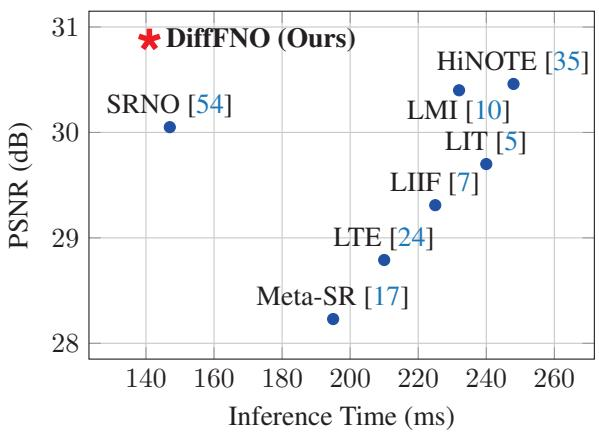
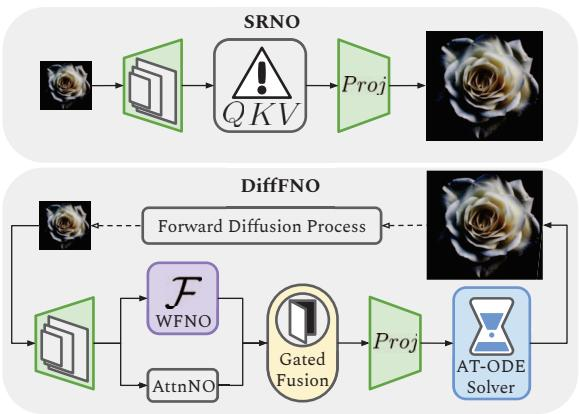
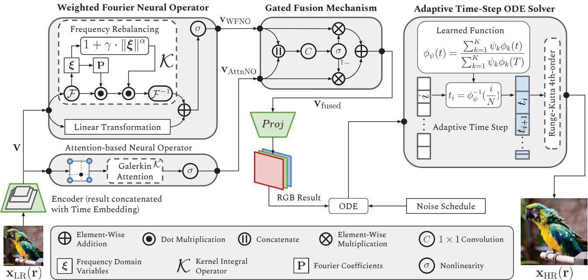
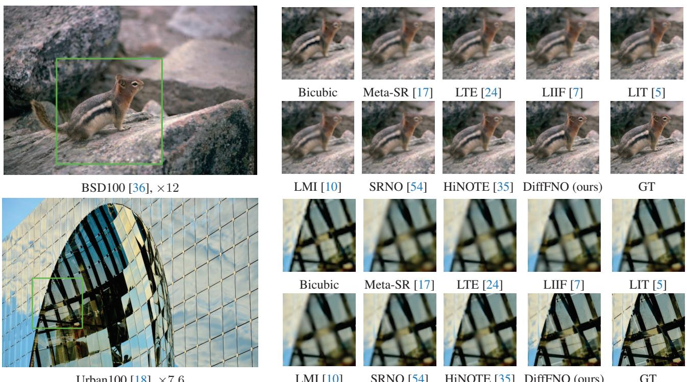

# DiffFNO: Diffusion Fourier Neural Operator

Xiaoyi Liu1,\* Hao Tang2,†

1Washington University in St. Louis 2Peking University jasonl@wustl.eduhaotang@pku.edu.cn

  
(a) PSNR and inference time for ×4 super-resolution

  
(b) DiffFNO vs SRNO [54]  
Figure 1. (a) All models use the EDSR-baseline [31] encoder, except HiNOTE [35] which has its own. (b) Compared to SRNO [54], DiffFNO is strengthened by the fusion of spectral and spatial features and efficient refinement by a diffusion process.

## Abstract

We introduce DiffFNO, a novel diffusion framework for arbitrary-scale super-resolution strengthened by a Weighted Fourier Neural Operator (WFNO). Mode Rebalancing in WFNO effectively captures critical frequency components, significantly improving the reconstruction of high-frequency image details that are crucial for superresolution tasks. Gated Fusion Mechanism (GFM) adaptively complements WFNO's spectral features with spatial features from an Attention-based Neural Operator (AttnNO). This enhances the network's capability to capture both global structures and local details. Adaptive Time-Step (ATS) ODE solver, a deterministic sampling strategy, accelerates inference without sacrificing output quality by dynamically adjusting integration step sizes ATS. Extensive experiments demonstrate that DiffFNO achieves stateof-the-art (SOTA) results, outperforming existing methods across various scaling factors by a margin of 2-4 dB in

PSNR, including those beyond the training distribution. It also achieves this at lower inference time (Fig. 1 (a)). Our approach sets a new standard in super-resolution, delivering both superior accuracy and computational efficiency

## 1. Introduction

Image super-resolution (SR) reconstructs high-resolution (HR) images from low-resolution (LR) inputs, recovering lost fine details to enhance visual quality. SR is crucial for applications like medical imaging [12], satellite imagery [23, 52], and video games [38]. However, multiple HR images can correspond to the same LR input due to information loss during downsampling. This ambiguity requires algorithms capable of inferring plausible and perceptually accurate high-frequency content from limited data.

Deep learning, particularly Convolutional Neural Networks (CNNs) [58], has significantly advanced SR. Dong et al. introduced SRCNN [9], demonstrating the effectiveness of end-to-end learning for SR. Subsequent models achieved remarkable performance using deeper architectures and attention mechanisms [6, 30, 31, 34, 57].

Diffusion models have emerged as powerful generative frameworks modeling complex data distributions via iterative denoising processes [11, 14, 45]. Their ability to generate high-fidelity images is well-suited for inferring missing fine details. In SR, diffusion models progressively refine an LR image by modeling the conditional distribution of HR images given the LR input [15, 25, 41, 51]. This iterative process reconstructs intricate textures and high-frequency components, producing realistic outputs.

However, diffusion models are computationally intensive due to the iterative reverse diffusion process [46]. To address this, recent research explores efficient sampling strategies to accelerate reverse diffusion. One approach is approximating the diffusion process through deterministic Ordinary Differential Equation (ODE), which can be solved in fewer steps [33]. This accelerates inference and provides consistent, reproducible results.

Arbitrary-scale SR models [7, 17, 24], which can upsample images at user-defined scales beyond those seen in training, have gained attention in recent years. Methods involving attention mechanisms [5] and representing images as continuous functions [10] have been explored. Operator-learning methods such as Super-Resolution Neural Operators (SRNO) [54] and HiNOTE [35] have further advanced this field. However, the inherent differences between physics simulations and real-world images introduce challenges from computational demands to the difficulty in restoring high-frequency details.

## To address these limitations, our contributions are:

(1) We propose Weighted Fourier Neural Operator (WFNO) strengthened by iterative refinement from a diffusion framework for high-frequency reconstruction, detailed in Fig. 2. Through Mode Rebalancing (MR), WFNO learns to emphasize the most critical frequency components. This greatly enhances high-frequency image detail reconstruction, overcoming the limitations of standard FNOs and MLPs, which underrepresent such details due to mode truncation and spectral bias, respectively. (2) We develop Gated Fusion Mechanism (GFM) to dynamically adjust the influence of Fourier space features from WFNO and complementary spatial domain features from an Attention-based Neural Operator (AttnNO). AttnNO is lightweight, sharing an encoder with and running in parallel to WFNO. (3) Additionally, we present Adaptive Time-Step (ATS) ODE solver, which flexibly adjusts integration step sizes based on data characteristics by assessing the complexity of image regions, thereby reducing computational overhead without compromising quality. (4) DiffFNO achieves state-of-the-art results on multiple SR benchmarks, outperforming existing methods by 2–4 dB in PSNR in reconstruction quality. It also offers competitive inference time as Fig. 1 (a) shows. DiffFNO remains robust across various upscaling factors—even those

unseen during training.

## 2. Related Work

Neural Operators and Fourier Methods. Neural Operators (NO) [22] have emerged as a powerful framework for learning mappings between infinite-dimensional function spaces, providing resolution-invariant models that generalize across different input resolutions. Unlike traditional neural networks that map finite-dimensional vectors to other vectors, neural operators learn mappings from functions to functions [27], making them well-suited for tasks involving continuous data or data at varying resolutions.

Multi-Layer Perceptrons (MLPs) often exhibit a spectral bias, favoring low-frequency functions [39]. This limits their ability to capture fine textures and sharp edges. To overcome these limitations, techniques like positional encodings and Fourier feature mappings capture highfrequency details by embedding input coordinates into a higher-dimensional sinusoidal space, allowing the network to represent complex patterns [44, 47].

Fourier Neural Operator (FNO) [26] is a variant of NO that uses spectral convolution to efficiently capture global data patterns, modeling long-range dependencies with lower computational complexity than traditional CNNs. In physics and climate settings [19, 29, 55], FNOs can handle arbitrary input resolutions without retraining. Although successful, FNOs may still lose high-frequency information due to mode truncation (discarding higher-frequency Fourier modes). This loss impairs tasks such as SR that rely on detailed reconstruction [13, 48, 49].

The Mode Rebalancing mechanism in WFNO overcomes these limitations. Instead of being truncated, all Fourier modes are preserved, with additional learnable weights to modulate their impact on reconstruction. Finegrained feature representation is further enhanced by AttnNO, which captures local details by processing data directly in the spatial domain

Diffusion-Based SR and Efficient Sampling. Diffusion models have gained prominence as powerful generative models capable of producing high-quality images through iterative denoising techniques [14, 42]. In the context of SR, diffusion models have been employed to model the conditional distribution of HR images given LR inputs, achieving higher resolutions after progressive enhancement [40, 41].

Despite their effectiveness, diffusion models are computationally intensive due to the large number of time steps required in the reverse diffusion process. Such computational demands pose significant challenges for practical applications [20], especially in real-time or resource-constrained settings. Current solutions include: (i) Deterministic Sampling via ODE Solvers: By reformulating the stochastic reverse diffusion as a deterministic ODE, advanced ODE solvers can be employed to reduce the number of sampling steps [21]. Methods like Denoising Diffusion Implicit Models (DDIM) [45] and DPM-Solver [2, 33] have demonstrated the ability to generate high-quality images with significantly fewer steps. (ii) Operator Learning for Fast Sampling: Neural operators accelerates sampling by learning the solution operator of the reverse diffusion process [8, 59]. (iii) Progressive Distillation: Training a distilled model to approximate the behavior of the full diffusion model allows faster sampling with fewer steps [37, 43]. Although effective, this method may require extensive retraining and potentially compromise image quality for increased speed.

  
Figure 2. The proposed Diffusion Fourier Neural Opeartor (DiffFNO) architecture for arbitrary-scale super-resolution begins by lifting a low-resolution input image ${ \bf x } _ { \mathrm { L R } } ( { \bf r } )$ into a feature space using a convolutional encoder. Features extracted by the Weighted Fourier Neural Operator (WFNO) and an Attention-based Neural Operator (AttnNO) are combined using a Gated Fusion Mechanism (GFM). The fused features are then projected into RGB space, where Adaptive Time-Step (ATS) ODE solver efficiently completes the reverse diffusion process with both accuracy and speed. This pipeline generates ${ \bf x } _ { \mathrm { H R } } ( { \bf r } )$ , a high-resolution version of the input image.

Applying these acceleration methods to diffusion-based SR enables faster inference while maintaining high image quality. With efficient sampling methods, diffusion models become more practical for SR tasks, balancing performance and computational efficiency [32].

DiffFNO adopts (i) for its simplicity and the robustness of established numerical methods. We also strength it with the ATS strategy, which adjusts integration step sizes adaptively to balance speed and quality.

## 3. The Proposed DiffFNO

## 3.1. Network Architecture and Novel Components

An overview of the proposed DiffFNO is shown in Fig. 1 (b). It has three parts: (i) A CNN encoder extracts features from LR images. Unlike the simple linear transformations in standard FNO setups for physics simulations, our encoder is tailored for SR, extracting complex patterns and textures needed for high-quality reconstructions. We use the EDSR-baseline [31] and RDN models [58] in our experiments. (ii) WFNO and GFM: WFNO captures both global and local details alongside the AttnNO. GFM combines these into a unified HR feature map, which is then projected into RGB. (iii) ATS ODE solver accelerates inference speed by taking fewer, larger, and dynamically adjusted steps toward the reconstructed HR image. Fig. 2 illustrates these components in detail.

The network minimizes the difference between the predicted image and the true image. The loss function is:

$$
\begin{array} { r } { \mathcal { L } ( \theta ) = \mathbb { E } _ { t , \mathbf { x } _ { 0 } } \left[ \left\| s _ { \theta } ( \mathbf { x } _ { t } , t ) - \nabla _ { \mathbf { x } _ { t } } \log p _ { t } ( \mathbf { x } _ { t } | \mathbf { x } _ { 0 } ) \right\| _ { 2 } ^ { 2 } \right] , } \end{array}\tag{1}
$$

where $\mathbf { x } _ { t } ~ ( \mathrm { i . e . ~ } \mathbf { x } _ { \mathrm { L R } } )$ is obtained by adding noise to $\mathbf { x } _ { \mathrm { 0 } }$ (i.e. XHR). $s _ { \theta } ( \mathbf { x } _ { t } , t )$ is the neural network approximating the true score function. $\nabla { \mathbf x } _ { t } \log p _ { t } ( { \mathbf x } _ { t } | { \mathbf x } _ { 0 } )$ is the true score function.

## 3.2. Weighted Fourier Neural Operator

The Fourier Neural Operator (FNO) [26] is an efficient NO variant designed to learn mappings between function spaces. It operates directly on inputs of arbitrary resolutions, performing upscaling by mapping low-resolution inputs to high-resolution outputs. It first transforms the input data into the frequency domain, applies the learned filters, and then transforms the data back to the spatial domain.

Spectral convolution and mode truncation greatly enhance computational efficiency.

Let ${ \bf x } _ { \mathrm { L R } } ( { \bf r } )$ denote the low-resolution input function $( \mathrm { e . g . }$ , an image), where $\mathbf { r } \in \mathbb { R } ^ { 2 }$ represents spatial coordinates. The goal is to learn an operator $\mathcal { G }$ such that:

$$
\begin{array} { r } { \mathbf { x } _ { \mathrm { H R } } ( \mathbf { r } ) = \mathcal { G } [ \mathbf { x } _ { \mathrm { L R } } ( \mathbf { r } ) ] , } \end{array}\tag{2}
$$

where ${ \bf x } _ { \mathrm { H R } } ( { \bf r } )$ is the output function (e.g., the superresolved image). The FNO models $\mathcal { G }$ by stacking:

$$
\mathbf { v } _ { l + 1 } ( \mathbf { r } ) = \sigma \left( \mathcal { W } _ { l } \mathbf { v } _ { l } ( \mathbf { r } ) + \mathcal { K } _ { l } \mathbf { v } _ { l } ( \mathbf { r } ) \right) ,\tag{3}
$$

where $\mathbf { v } _ { l } ( \mathbf { r } )$ is the feature representation at layer l evaluated at spatial location $\mathbf { r } ,$ and $\mathbf { v } _ { l + 1 } ( \mathbf { r } )$ is its updated representation in the following layer; $\sigma$ is a nonlinear activation function; Wi is a linear transformation. $\mathcal { \kappa } _ { l }$ , the integral operator at layer $l ,$ transforms the features into the Fourier domain. Fourier modes are then truncated for computational efficiency. Global convolution is performed with a pointwise multiplication between the transformed features and the learned Fourier coefficients.

$$
\begin{array} { r } { \mathcal { K } _ { l } \mathbf { v } _ { l } ( \mathbf { r } ) = \mathcal { F } ^ { - 1 } \left( \mathbf { P } _ { l } ( \pmb { \xi } ) \cdot \mathcal { F } [ \mathbf { v } _ { l } ] ( \pmb { \xi } ) \right) , } \end{array}\tag{4}
$$

where $\mathcal { F }$ and ${ \mathcal { F } } ^ { - 1 }$ denote the Fourier and inverse Fourier transforms, respectively. ξ is the frequency domain variables. $\mathcal { F } [ \mathbf { v } _ { l } ] ( \boldsymbol { \xi } )$ is the Fourier transform of $\mathbf { v } _ { l } .$ , evaluated at frequency $\pmb { \xi } . \mathbf { P } _ { l } ( \pmb { \xi } )$ is a complex-valued tensor of learnable parameters representing the Fourier domain filters.

However, mode truncation underrepresents highfrequency components that are critical to SR of real-world images. To address this limitation, we introduce Mode Rebalancing. A learned weighting function ${ \bf w } _ { l } ( \pmb { \xi } )$ is applied to the Fourier modes to amplify or attenuate specific frequency components. It is defined at layer l as:

$$
\mathbf { w } _ { l } ( \pmb { \xi } ) = 1 + \gamma _ { l } \cdot \| \pmb { \xi } \| ^ { \alpha } ,\tag{5}
$$

where $\gamma _ { l }$ is a learnable scalar parameter at layer l that controls the strength of the weighting; α is a hyperparameter (0.7 in our experiments or optionally a learnable parameter) that determines how the weight scales with the frequency magnitude ∥|ξ||. $\mathbf { w } ( \pmb { \xi } )$ assigns higher weights to higher frequencies when $\alpha > 0$ , thus emphasizing high-frequency components. This yields an updated $\kappa _ { l }$ ..

$$
{ \mathcal { K } } _ { l } { \mathbf { v } } _ { l } ( { \mathbf { r } } ) = { \mathcal { F } } ^ { - 1 } \left( { \mathbf { w } } _ { l } ( { \boldsymbol { \xi } } ) \cdot { \mathbf { P } } _ { l } ( { \boldsymbol { \xi } } ) \cdot { \mathcal { F } } [ { \mathbf { v } } _ { l } ] ( { \boldsymbol { \xi } } ) \right) .\tag{6}
$$

## 3.3. Gated Fusion Mechanism

While WFNO excels at capturing global dependencies through spectral convolutions, it may not fully exploit local interactions critical for detailed image reconstruction. We incorporate AttnNO to complement WFNO by capturing local dependencies. Working in tandem, they learn mappings from the low-resolution input function to the highresolution output function. Gated Fusion Mechanism optimally combines the complementary features from both operators, adaptively balancing the contributions of each to a fused feature map, which is then fed to a projection layer.

Efficient implementation of the kernel integral using the Galerkin-type attention mechanism [4] has been explored in the neural operator applied to SR tasks [35, 54]. Our AttnNO is composed of bicubic interpolation, Galerkin attention, and nonlinearity, sharing an encoder with WFNO. AttnNO models local interactions in the spatial domain, focusing on the most relevant spatial regions during the convolution process. Given the complementary role of AttnNO to WFNO, we simplify its structure to improve runtime.

While previous works have applied gating mechanisms in different contexts, our approach differs significantly. Zheng et al. [60] use gating within recurrent CRF networks primarily for semantic segmentation, controlling the information flow for boundary refinement rather than fusing feature maps with distinct representations. Hu et al. [16] introduced channel-wise gating in Squeeze-and-Excitation (SE) blocks, focusing on adaptively recalibrating feature channels within a single network stream. In contrast, our Gated Fusion Mechanism applies spatial gating to integrate global dependencies captured by WFNO and local information from AttnNO. This mechanism adaptively combines both operators' feature maps, enhancing high-resolution image reconstruction by balancing global and local contributions at each spatial location.

Let $\mathbf { \bar { v } } _ { \mathrm { W F N O } } \in \mathbb { R } ^ { B \times H \times W \times C }$ and $\mathbf { v } _ { \mathrm { A t t n N O } } \in \mathbb { R } ^ { B \times H \times W \times C }$ denote the feature maps obtained from WFNO and AttnNO, respectively, where $B$ is the batch size, H and $W$ are the height and width of the feature maps, and C is the number of channels. We first concatenate the feature maps along the channel dimension and pass them through a convolutional layer followed by a sigmoid activation to produce a gating map $\mathbf { G } \in \mathbb { R } ^ { B \times H \times W \times \mathbf { \breve { 1 } } }$

$$
\mathbf { G } = \sigma \left( \mathbf { C o n v } _ { 1 \times 1 } \left( \left[ \mathbf { v } _ { \mathrm { W F N O } } , \mathbf { v } _ { \mathrm { A t t n N O } } \right] \right) \right) ,\tag{7}
$$

where $[ \cdot , \cdot ]$ denotes concatenation along the channel dimension; $\mathrm { C o n v } _ { 1 \times 1 }$ is a $1 \times 1$ convolutional layer that reduces the concatenated features to a single-channel gating map; $\sigma ( \cdot )$ is the sigmoid activation function applied element-wise.

The fused feature map $\mathbf { v } _ { \mathrm { f u s e d } } \ \in \ \mathbb { R } ^ { B \times H \times W \times C }$ is the element-wise weighted sum of the two feature maps:

$$
\mathbf { v } _ { \mathrm { f u s e d } } = \mathbf { G } \odot \mathbf { v } _ { \mathrm { W F N O } } + ( 1 - \mathbf { G } ) \odot \mathbf { v } _ { \mathrm { A t t n N O } } ,\tag{8}
$$

where $\odot$ denotes element-wise multiplication, and subtraction is performed element-wise. The gating map G is broadcast across the channel dimension to match the dimensions of the feature maps.

Gated Fusion Mechanism brings two advantages compared to a naive concatenation strategy: (i) Captures complementary Information: WFNO models global dependencies through spectral convolutions, effectively modeling long-range interactions and overall structure. In contrast, AttnNO excels at capturing local dependencies and finegrained details via attention mechanisms. (ii) Balances contributions dynamically: Gated Fusion Mechanism elicits the importance of each feature map at each spatial location, dynamically balancing global and local information.

## 3.4. Forward Diffusion Process and Noise Schedule

Motivation. NOs are well-suited for SR tasks due to their inherent resolution invariance and their ability to model global dependencies efficiently. Diffusion models can iteratively refine a low-resolution image to a high-resolution one, capturing the complex conditional distribution of highresolution images given low-resolution inputs.

DiffFNO leverages the strengths of both frameworks. WFNO is a powerful mechanism for handling arbitrary resolutions and capturing high-frequency details, while the diffusion process iteratively improves reconstruction output.

In our framework, the forward diffusion process models the degradation of HR images to LR images, which in our case is primarily due to downscaling. To incorporate this degradation into the diffusion model framework, we define a forward process that simulates the downscaling effect over continuous time $t \in [ 0 , T ]$ . At, the image xT closely resemble the observed LR image $\mathbf { x } _ { \mathrm { L R } }$ after significant degradation. We adopt a modified variance-preserving (VP) stochastic differential equation (SDE):

$$
d \mathbf { x } _ { t } = - \frac { 1 } { 2 } \beta ( t ) \left( \mathbf { x } _ { t } - \mathbf { D } \mathbf { x } _ { t } \right) d t + \sqrt { \beta ( t ) } d \mathbf { w } ,\tag{9}
$$

where $\beta ( t )$ is the noise schedule; D is the downsampling operator that reduces the resolution of the image; dw is the standard Wiener process.

In this formulation, the term x — Dx quantifies the highfrequency details lost during downscaling. The drift term $- { \textstyle \frac { 1 } { 2 } } \beta ( t ) \left( { \bf x } - { \bf D } { \bf x } \right)$ dt models the gradual removal of these details, while the diffusion term $\sqrt { \beta ( t ) } d \mathbf { w }$ adds Gaussian noise to simulate further degradation.

Noise Schedule $\beta ( t )$ . We define the noise schedule $\beta ( t )$ as a simple and effective linear function increasing over the time interval [0, T]:

$$
\beta ( t ) = \beta _ { \mathrm { m i n } } + ( \beta _ { \mathrm { m a x } } - \beta _ { \mathrm { m i n } } ) \cdot \frac { t } { T } ,\tag{10}
$$

where $\beta _ { \mathrm { m i n } } \mathrm { = } 0 . 1$ and $\beta _ { \mathrm { m a x } } = 2 0$ . This linear schedule ensures a gradual increase in the degradation strength from minimal degradation at $t { = } 0$ to maximum degradation at $t { = } T$

Relation to Image Degradation. At each time $t ,$ the image $\mathbf { x } _ { t }$ progressively loses high-frequency details due to the drift toward $\mathbf { D } \mathbf { x } _ { t }$ , the downscaled version of the image. The added Gaussian noise further simulates the information loss inherent in downscaling. $\mathbf { A } { \boldsymbol { \mathrm { t } } } \ t = T$ , the image $\mathbf { x } _ { T }$ approximates the observed low-resolution image $\mathbf { x } _ { \mathrm { L R } }$ . The reverse diffusion process then aims to recover the high-resolution image $\mathbf { x } _ { 0 } ~ ( \mathrm { i . e . x _ { H R } } ~ )$ from $\mathbf { x } _ { T }$ by reversing the degradation.

Choice of $\beta ( t )$ . The linear noise schedule is chosen for its simplicity and effectiveness. It provides a straightforward way to control the rate of degradation over time. Parameters $\beta _ { \mathrm { m i n } }$ and $\beta _ { \mathrm { m a x } }$ are selected to balance the trade-off between sufficient degradation (to simulate downscaling) and numerical stability of the diffusion process.

Downsampling Operator D. The operator D is defined to reduce the spatial dimensions of the image by the desired scaling factor. We use bicubic downsampling.

## 3.5. Adaptive Time-Step

The standard reverse diffusion process is stochastic and requires a large number of sampling steps, making it computationally expensive. To accelerate inference, we reformulate the reverse diffusion as a deterministic Ordinary Differential Equation (ODE), allowing us to use advanced ODE solvers for faster sampling. The ODE solver integrates the reverse diffusion process, and its output is the superresolved image. The reverse diffusion process can be described by a Stochastic Differential Equation (SDE) [46]:

$$
d \mathbf { x } = \left[ f ( \mathbf { x } , t ) - g ( t ) ^ { 2 } \nabla _ { \mathbf { x } } \log p _ { t } ( \mathbf { x } ) \right] d t + g ( t ) d \bar { \mathbf { w } }\tag{11}
$$

where x is the data; t is the time variable; $f ( \mathbf { x } , t )$ and $g ( t )$ are drift and diffusion coefficients; $\nabla _ { \mathbf x }$ log $p _ { t } ( \mathbf { x } )$ is the score function; w is the reverse-time Wiener process. By removing the stochastic term, we obtain the probability flow ODE, which deterministically transports the data from the noise distribution to the data distribution.

Our ATS ODE solver comprises three key components: 1. Adaptive Time Step Selection Using a Learned Function. Optimizing the allocation of time steps based on data characteristics has been explored in previous works [28, 53]. We discretize the time interval $[ 0 , T ]$ into N non-uniform time steps $\{ t _ { i } \} _ { i = 0 } ^ { N } ,$ where $t _ { 0 } = 0$ and $t _ { N } =$ $T .$ We introduce a learned function $\phi _ { \psi } ( t )$ as a weighted sum of polynomial basis functions, where the weight is parameterized by a set of learnable coefficients $\begin{array} { r l } { \psi } & { { } = } \end{array}$ $\left\{ \psi _ { 1 } , \psi _ { 2 } , \dots , \psi _ { K } \right\}$ , which adaptively determines the distribution of time steps based on the data characteristics. Parameterization of $\phi _ { \psi } ( t )$ . We define $\phi _ { \psi } ( t )$ as a normalized weighted sum of K predefined monotonically increasing basis functions $\{ \phi _ { k } ( t ) \} _ { k = 1 } ^ { K }$

$$
\phi _ { \psi } ( t ) = \frac { \sum _ { k = 1 } ^ { K } \psi _ { k } \phi _ { k } ( t ) } { \sum _ { k = 1 } ^ { K } \psi _ { k } \phi _ { k } ( T ) } , \quad \psi _ { k } = \exp ( \omega _ { k } ) ,\tag{12}
$$

where each basis function $\phi _ { k } ( t ) = t ^ { k } \operatorname { f o r } k = 1 , 2 , . . . , K$ is polynomial. $\omega _ { k }$ are unconstrained learnable parameters that ensure $\psi _ { k } \geq 0$ through the exponential mapping. We set $K = 3$ to balance model flexibility with computational efficiency. This setup allows $\phi _ { \psi } ( t )$ to capture nonlinear timestep distributions without excessive complexity.

Selection of Time Steps. Using the learned function $\phi _ { \psi } ( t )$ we map uniformly spaced normalized values $\begin{array} { r } { s _ { i } \ = \ \frac { i } { N } } \end{array}$ to non-uniform time steps $t _ { i } { : }$

$$
t _ { i } = \phi _ { \psi } ^ { - 1 } \left( s _ { i } \right) = \phi _ { \psi } ^ { - 1 } \left( \frac { i } { N } \right) , \quad i = 0 , 1 , \ldots , N\tag{13}
$$

Since $\phi _ { \psi } ( t )$ is monotonically increasing, its inverse function $\phi _ { \boldsymbol { \imath } \boldsymbol { b } } ^ { - 1 } ( \boldsymbol { s } )$ exists and can be efficiently computed.

2. Neural Operator Score Network. The score function, representing the gradient of the log probability density $\log p _ { t } ( \mathbf { x } )$ , is approximated using a neural network $s _ { \theta } ( \mathbf { x } , t )$ parameterized by θ:

$$
\nabla _ { \mathbf { x } } \log p _ { t } ( \mathbf { x } ) \approx s _ { \theta } ( \mathbf { x } , t ) .\tag{14}
$$

In our architecture, $s _ { \theta }$ consists of: (i) An encoder that extracts features from $\mathbf { x } _ { \mathrm { L R } } ) ;$ (ii) WFNO for capturing global dependencies and high-frequency details; (iii) AttnNO for modeling local dependencies and fine-grained structures; (iv) Gated Fusion Mechanism to dynamically combine features; (v) Time embedding $\mathbf { e } ( t )$ incorporating the time variable t into our neural network $s _ { \theta } ( \mathbf { x } , t )$ using sinusoidal positional embeddings [14, 50], concatenating it and encoded features along the channel dimension.

3. Efficient Solver. We solve the reverse-time stochastic differential equation (SDE) of the diffusion process, transformed into an ODE:

$$
\frac { d \mathbf { x } } { d t } = f ( \mathbf { x } , t ) - \frac { 1 } { 2 } g ( t ) ^ { 2 } \nabla _ { \mathbf { x } } \log p _ { t } ( \mathbf { x } ) ,\tag{15}
$$

where $\mathbf { x } \in \mathbb { R } ^ { d }$ is the image estimate at time t in the reverse diffusion process; $f ( \mathbf { x } , t )$ and $g ( t )$ are coefficients derived from the forward diffusion process.

For the Variance Preserving (VP) SDE commonly used in diffusion models, the coefficients are defined as:

$$
f ( \mathbf { x } , t ) = - \frac { 1 } { 2 } \beta ( t ) \mathbf { x } , \quad g ( t ) = \sqrt { \beta ( t ) } ,\tag{16}
$$

where $\beta ( t )$ is a predefined noise schedule specific to the diffusion process and is consistent with our DiffFNO. By substituting the score function approximation from Eq. (14), we define the approximate drift function:

$$
f _ { \theta } ( { \bf x } , t ) = f ( { \bf x } , t ) - \frac { 1 } { 2 } g ( t ) ^ { 2 } s _ { \theta } ( { \bf x } , t ) .\tag{17}
$$

The adaptive time steps $\{ t _ { i } \} _ { i = 0 } ^ { N }$ discretize the ODE. We apply the Runge-Kutta 4th-order (RK4) method, as it balances computational cost and accuracy, requiring fewer steps than lower-order methods while retaining precision.

The benefits of ATS are threefold: (i) Deterministic Sampling: It consistently produces the same results for identical inputs, improving reproducibility. (ii) Reduced Computation: Fewer sampling steps significantly decrease inference time. (iii) High-Quality Reconstruction: It maintains high-quality reconstruction by efficiently allocating computational resources.

## 4. Experiments

Datasets and Evaluation Metrics. We use the DIV2K [1] dataset for training. For evaluation, we use the DIV2K validation set and four standard datasets: Set5 [3], Set14 [56], BSD100 [36], and Urban100 [18].

We evaluate our model on upscaling factors of $\times 2 , \times 3 ,$ $\times 4 , \times 6 , \times 8 .$ and $\times 1 2$ Notably, scales $\times 6 , \times 8 ,$ and $\times 1 2$ are outside the training distribution, as the training scales are uniformly sampled from ×1 to ×4. This setup assesses our model's ability to generalize to arbitrary scales. We use Peak Signal-to-Noise Ratio (PSNR) and Structural Similarity Index Measure (SSIM) as our evaluation metrics.

Quantitative Results. Building on the quantitative gains of our model, we also present qualitative results to illustrate the visual improvements achieved. We compare our proposed DiffFNO model with several SOTA arbitrary-scale SR methods, including Meta-SR [17], LIIF [7], LTE [24], SRNO [54], LIT [5], LMI [10], and HiNOTE [35]. All models are trained on the DIV2K dataset with identical settings to ensure a fair comparison in Tables 1 and 2.

Among the compared methods, Meta-SR performs adequately at lower scales but struggles at higher scaling factors due to its generalized approach that lacks specialized mechanisms for fine detail capture. LIIF and LTE improve upon Meta-SR by using local implicit functions and frequency-based estimations, respectively, which enhance high-frequency texture representation. However, they still face limitations in capturing non-periodic textures and high-frequency details, resulting in blurred textures at larger scales. LIT and LMI further advance performance by integrating attention mechanisms and MLP-mixer architectures, effectively preserving high-frequency textures and handling diverse scales, but they may not generalize well across datasets with varying distributions. SRNO and HiNOTE employ neural operator frameworks with attention mechanisms and frequency-aware loss priors to better capture global spatial properties and enhance high-frequency detail reconstruction. We observed mixed results between SRNO and HiNOTE: at certain scaling factors, one outperforms the other, indicating their varying strengths at different resolutions. Overall, their neural operator foundation improves the handling of arbitrary scaling but may increase computational demands.

LMI [10]  
  
Urban100 [18], ×7.6

Figure 3. Qualitative comparison on integer and continuous super-resolution scales. The models use RDN [58] as their encoder (except HiNOTE [35], has its own). In the HR image, the cropped patch is outlined in green.
<table><tr><td rowspan="2">Model</td><td colspan="2">×2</td><td colspan="2">x3</td><td colspan="2">x4</td><td colspan="2">×6</td><td colspan="2">×8</td><td colspan="2">×12</td></tr><tr><td>PSNR</td><td>SSIM</td><td>PSNR</td><td>SSIM</td><td>PSNR</td><td>SSIM</td><td>PSNR</td><td>SSIM</td><td>PSNR</td><td>SSIM</td><td>PSNR</td><td>SSIM</td></tr><tr><td>EDSR-MetaSR [17]</td><td>33.32</td><td>0.913</td><td>30.10</td><td>0.800</td><td>28.23</td><td>0.830</td><td>26.10</td><td>0.792</td><td>24.77</td><td>0.742</td><td>23.95</td><td>0.720</td></tr><tr><td>EDSR-LTE [24]</td><td>33.83</td><td>0.921</td><td>30.50</td><td>0.880</td><td>28.79</td><td>0.852</td><td>26.55</td><td>0.800</td><td>25.05</td><td>0.760</td><td>24.20</td><td>0.736</td></tr><tr><td>EDSR-LIIF [7]</td><td>34.36</td><td>0.925</td><td>30.94</td><td>0.885</td><td>29.31</td><td>0.855</td><td>27.02</td><td>0.814</td><td>25.44</td><td>0.771</td><td>24.32</td><td>0.743</td></tr><tr><td>EDSR-LIT [5]</td><td>34.81</td><td>0.928</td><td>31.39</td><td>0.890</td><td>29.70</td><td>0.860</td><td>27.44</td><td>0.815</td><td>25.78</td><td>0.775</td><td>24.69</td><td>0.745</td></tr><tr><td>EDSR-LMI [10]</td><td>35.40</td><td>0.930</td><td>31.88</td><td>0.895</td><td>30.40</td><td>0.865</td><td>27.95</td><td>0.820</td><td>26.16</td><td>0.780</td><td>25.56</td><td>0.750</td></tr><tr><td>EDSR-SRNO [54]</td><td>34.85</td><td>0.928</td><td>31.45</td><td>0.890</td><td>30.05</td><td>0.863</td><td>27.36</td><td>0.810</td><td>26.00</td><td>0.772</td><td>25.91</td><td>0.760</td></tr><tr><td>EDSR-DiffFNO (Ours)</td><td>35.72</td><td>0.932</td><td>32.50</td><td>0.905</td><td>30.88</td><td>0.870</td><td>28.29</td><td>0.830</td><td>26.78</td><td>0.790</td><td>26.48</td><td>0.775</td></tr><tr><td>HiNOTE† [35]</td><td>35.29</td><td>0.931</td><td>31.90</td><td>0.895</td><td>30.46</td><td>0.842</td><td>27.83</td><td>0.799</td><td>26.41</td><td>0.772</td><td>26.23</td><td>0.732</td></tr><tr><td>RDN-MetaSR [17]</td><td>33.50</td><td>0.920</td><td>30.32</td><td>0.893</td><td>28.41</td><td>0.861</td><td>26.29</td><td>0.810</td><td>24.90</td><td>0.780</td><td>24.01</td><td>0.790</td></tr><tr><td>RDN-LTE [24]</td><td>33.98</td><td>0.922</td><td>30.65</td><td>0.882</td><td>28.94</td><td>0.852</td><td>26.70</td><td>0.802</td><td>25.20</td><td>0.762</td><td>24.35</td><td>0.732</td></tr><tr><td>RDN-LIIF [7]</td><td>34.51</td><td>0.927</td><td>31.09</td><td>0.887</td><td>29.46</td><td>0.857</td><td>27.17</td><td>0.812</td><td>25.59</td><td>0.772</td><td>24.47</td><td>0.742</td></tr><tr><td>RDN-LIT [5]</td><td>34.96</td><td>0.930</td><td>31.54</td><td>0.892</td><td>29.85</td><td>0.862</td><td>27.59</td><td>0.817</td><td>25.93</td><td>0.777</td><td>24.84</td><td>0.747</td></tr><tr><td>RDN-LMI [10]</td><td>35.55</td><td>0.932 0.930</td><td>32.03 31.60</td><td>0.897</td><td>30.55 30.20</td><td>0.867</td><td>28.10</td><td>0.822</td><td>26.31</td><td>0.782</td><td>25.71</td><td>0.752</td></tr><tr><td>RDN-SRNO [54]</td><td>35.00 35.87</td><td>0.934</td><td>32.65</td><td>0.892 0.902</td><td>31.03</td><td>0.862 0.872</td><td>27.51 28.44</td><td>0.812 0.832</td><td>26.15 26.93</td><td>0.772 0.792</td><td>26.06 26.63</td><td>0.762</td></tr><tr><td>RDN-DiffFNO (Ours)</td><td></td><td></td><td></td><td></td><td></td><td></td><td></td><td></td><td></td><td></td><td></td><td>0.777</td></tr></table>

Table 1. PSNR/SSIM comparison on the DIV2K [1] validation set using EDSR [31] and RDN [58] encoders. HiNOTE [35] uses its own.

Our DiffFNO model consistently achieves the highest PSNR and SSIM scores across all scaling factors and datasets. The performance gap widens at larger scaling factors (×8 and × 12), demonstrating a superior generalization to the out-of-distribution scales. The improvements are more pronounced on complex datasets like Urban100, which contain intricate textures and structures. By combining WFNO and AttnNO features through the Gated Fusion

Mechanism, which adaptively balances global and local features, DiffFNO synthesizes global and local dependencies. The ATS ODE solver efficiently refines high-resolution images, further enhancing quality. This combination addresses the limitations of prior models, such as spectral bias and insufficient high-frequency detail capture.

Qualitative Results. Fig. 3 compares arbitrary-scale SR methods on a BSD100 image (scaling factor of ×12) with fine-grained details like animal fur and rock textures and an Urban100 (continuous scaling factor of ×7.6) image featuring large structures and fine local details such as reflections on the grass. SRNO and HiNOTE capture multiscale details effectively, from the animal's body to tiny gaps between glass panels. However, DiffFNO reconstructs crisper edges with fewer artifacts, enhancing texture in animal fur pattern and reflections. WFNO captures large-scale patterns, while AttnNO and Gated Fusion Mechanism preserve intricate textures. This multiscale approach followed by a diffusion process enhanced by the ATS 's ODE solver further reduces visual artifacts.

<table><tr><td rowspan="2">Model</td><td colspan="4">Set5</td><td colspan="4"></td><td colspan="4"></td><td colspan="4">Urban100</td></tr><tr><td>×2</td><td>×3</td><td>×4</td><td>×6</td><td>×8 ×2</td><td>×3</td><td>×4</td><td>×6</td><td>×8 ×2</td><td>×3</td><td>×4</td><td>×6 ×8</td><td>×2</td><td>×3</td><td>×4</td><td>×6 ×8</td></tr><tr><td>MetaSR [17]</td><td></td><td>37.50 34.05</td><td>31.52 28.23</td><td>26.02</td><td>33.51</td><td>30.03</td><td>28.02</td><td>25.53 24.02</td><td>31.02</td><td>28.05 26.52</td><td>24.82</td><td>23.52</td><td>32.02</td><td>28.03 25.82</td><td>23.52 22.03</td><td></td></tr><tr><td>LIIF [7]</td><td></td><td>38.02 34.42 32.04 28.57 26.25 34.03 30.43 28.43</td><td></td><td></td><td></td><td></td><td></td><td>25.8424.33</td><td>31.52 28.55 27.03</td><td></td><td>25.03</td><td>23.83</td><td>32.52</td><td>28.53 26.03</td><td>23.83 22.33</td><td></td></tr><tr><td>LTE [24]</td><td></td><td>38.2134.63</td><td>32.2528.7626.4434.22</td><td></td><td></td><td></td><td>30.6528.6426.05</td><td>24.52</td><td>31.71 28.73 27.23</td><td></td><td>25.23</td><td>24.03</td><td>32.72</td><td>28.75 26.23</td><td>24.0322.53</td><td></td></tr><tr><td>SRNO [54]</td><td></td><td>38.3234.8432.6929.3827.2834.27</td><td></td><td></td><td></td><td></td><td></td><td>30.71 28.9726.76 25.26</td><td>32.4329.3727.8326.0424.99</td><td></td><td></td><td></td><td>33.33</td><td>29.14 26.9824.4323.02</td><td></td><td></td></tr><tr><td>LIT [5]</td><td></td><td>38.5335.0232.8229.5127.4234.4430.8329.0326.8225.3332.5229.5127.92 26.12 25.0133.42</td><td></td><td></td><td></td><td></td><td></td><td></td><td></td><td></td><td></td><td></td><td></td><td>29.22 27.02 24.52 23.12</td><td></td><td></td></tr><tr><td>LMI [10]</td><td></td><td>38.7235.1432.9529.6327.5534.6331.0229.2427.0525.5532.72 29.74 28.0426.2525.1433.6229.44 27.24 24.6323.23</td><td></td><td></td><td></td><td></td><td></td><td></td><td></td><td></td><td></td><td></td><td></td><td></td><td></td><td></td></tr><tr><td>HiNOTE [35]</td><td></td><td>39.01 35.22 33.0829.8527.74 35.02 31.25 29.55 27.3525.8533.02 30.0528.15 26.35 25.2534.0329.8327.55 24.73 23.34</td><td></td><td></td><td></td><td></td><td></td><td></td><td></td><td></td><td></td><td></td><td></td><td></td><td></td><td></td></tr><tr><td>DiffFNO (Ours) 39.72 35.30 33.16 30.23 27.93 36.01 31.54 30.22 27.58 26.02 33.56 30.24 28.21 26.45 25.30 34.19 29.99 27.74 24.80 23.35</td><td></td><td></td><td></td><td></td><td></td><td></td><td></td><td></td><td></td><td></td><td></td><td></td><td></td><td></td><td></td><td></td></tr></table>

Table 2. PSNR comparison on four benchmark datasets: Set5 [3], Set14 [56], BSD100 [36], and Urban100 [18]. All models use RDN [58] as their encoder, besides HiNOTE [35] which has its own.
<table><tr><td rowspan="2">Model</td><td colspan="2">×2</td><td colspan="2">x3</td><td colspan="2">×4</td><td colspan="2">×6</td><td colspan="2">×8</td><td colspan="2">×12</td><td rowspan="2">Inference</td><td rowspan="2">Steps</td></tr><tr><td>PSNR</td><td>SSIM</td><td>PSNR</td><td>SSIM</td><td>PSNR</td><td>SSIM</td><td>PSNR</td><td>SSIM</td><td>PSNR</td><td>SSIM</td><td>PSNR</td><td>SSIM</td></tr><tr><td>SRNO [54]</td><td>33.81</td><td>0.920</td><td>30.53</td><td>0.880</td><td>28.74</td><td>0.850</td><td>26.59</td><td>0.800</td><td>25.10</td><td>0.760</td><td>24.18</td><td>0.730</td><td>147</td><td></td></tr><tr><td>FNO [26]</td><td>34.36</td><td>0.925</td><td>30.94</td><td>0.885</td><td>29.31</td><td>0.855</td><td>27.02</td><td>0.810</td><td>25.44</td><td>0.770</td><td>24.32</td><td>0.740</td><td>85</td><td></td></tr><tr><td>WFNO</td><td>34.81</td><td>0.928</td><td>31.39</td><td>0.888</td><td>29.70</td><td>0.858</td><td>27.44</td><td>0.815</td><td>25.78</td><td>0.775</td><td>24.69</td><td>0.745</td><td>97</td><td></td></tr><tr><td>WFNO-AttnNO</td><td>35.40</td><td>0.930</td><td>31.88</td><td>0.892</td><td>30.40</td><td>0.862</td><td>27.95</td><td>0.820</td><td>26.16</td><td>0.780</td><td>25.56</td><td>0.750</td><td>139</td><td>1000</td></tr><tr><td>DiffFNO(-w, -a, -s)</td><td>34.85</td><td>0.928</td><td>31.45</td><td>0.890</td><td>30.05</td><td>0.860</td><td>27.36</td><td>0.815</td><td>26.00</td><td>0.775</td><td>25.91</td><td>0.760</td><td>204</td><td>1000</td></tr><tr><td>DiffFNO(-a, -s)</td><td>35.29</td><td>0.930</td><td>31.90</td><td>0.893</td><td>30.46</td><td>0.863</td><td>27.83</td><td>0.820</td><td>26.41</td><td>0.780</td><td>26.23</td><td>0.765</td><td>231</td><td>1000</td></tr><tr><td>DiffFNO(-s)</td><td>35.70</td><td>0.932</td><td>32.48</td><td>0.896</td><td>30.85</td><td>0.866</td><td>28.26</td><td>0.825</td><td>26.75</td><td>0.785</td><td>26.45</td><td>0.770</td><td>266</td><td>1000</td></tr><tr><td>DiffFNO</td><td>35.72</td><td>0.932</td><td>32.50</td><td>0.900</td><td>30.88</td><td>0.870</td><td>28.29</td><td>0.830</td><td>26.78</td><td>0.790</td><td>26.48</td><td>0.775</td><td>141</td><td>30</td></tr></table>

Table 3. Ablation study of variants of DiffFNO on the DIV2K [1] validation set. All use EDSR-baseline [31] backbone as their encoder. Inference times are measured in milliseconds (ms). WFNO-AttnNO has Gated Fusion Mechanism.

Ablation Studies. Extensive ablation studies validate the effectiveness and complementary nature of new components in DiffFNO. Table 3 reports the PSNR results on the DIV2K validation set for different model variants with scaling factors from ×2 to ×12. -w denotes leaving out the Mode Rebalancing (yielding the default FNO [26]). -a denotes omitting AttnNO. -s denotes the removal of ATS ODE solver. We also measure inference time by averaging over 100 runs, and report inference steps. We establish a baseline with SRNO, whose architecture is the most similar to our DiffFNO aamong the methods covered in our study. Overall, we observe notable improvements with the addition of model components. The complete DiffFNO achieves the highest PSNR and SSIM values across all upscaling factors.

Effect of Mode Rebalancing. Incorporating Mode Rebalancing into WFNO boosted performance compared to the default FNO [26], at the cost of a slightly increased number of parameters and inference time.

Effect of Gated Fusion Mechanism and AttnNO. The Gated Fusion Mechanism introduces minimal computational overhead. In addition, extra computational cost incurred by Attention-based Neural Operator is effectively mitigated by running it in parallel with WFNO while employing a shared encoder.

Effect of ATS ODE Solver: ATS dramatically reduces the number of inference steps from 1, 000 to just 30, which substantially improves the inference time while delivering competitive performance (Tab. 3). DiffFNO outperforms the SOTA in both PSNR and inference time (Fig. 1 (a)).

## 5. Conclusion

We propose Diffusion Fourier Neural Opeartor (DiffFNO) for arbitrary-scale image super-resolution. DiffFNO is made of Weighted Fourier Neural Operator with a Mode Rebalancing mechanism to emphasize high-frequency details. It is complemented by a Attention-based Neural Operator through a Gated Fusion Mechanism that effectively adjusts the influence of global and local features. Image reconstruction is further refined by a diffusion process augmented with an Adaptive Time-Step ODE solver that dynamically allocates time steps, drastically cutting down inference time without compromising output quality. Experiments demonstrate DiffFNO's competitiveness in both reconstruction quality and inference time across various benchmarks, establishing a new state-of-the-art.

## References

[1] Eirikur Agustsson and Radu Timofte. Ntire 2017 challenge on single image super-resolution: Dataset and study. In The IEEE Conference on Computer Vision and Pattern Recognition (CVPR) Workshops, 2017. 6, 7, 8

[2] Fan Bao, Chongxuan Li, Jun Zhu, and Bo Zhang. Analytic-DPM: an analytic estimate of the optimal reverse variance in diffusion probabilistic models. In International Conference on Learning Representations, 2022. 3

[3] Marco Bevilacqua, Aline Roumy, Christine Guillemot, and Marie-line Alberi-Morel. Low-complexity single-image super-resolution based on nonnegative neighbor embedding. In Proceedings of the British Machine Vision Conference (BMVC), pages 135.1–135.10, 2012. 6, 8

[4] Shuhao Cao. Choose a transformer: Fourier or galerkin. Advances in neural information processing systems, 34:24924– 24940, 2021.4

[5] Hao-Wei Chen, Yu-Syuan Xu, Min-Fong Hong, Yi-Min Tsai, Hsien-Kai Kuo, and Chun-Yi Lee. Cascaded local implicit transformer for arbitrary-scale super-resolution. In Proceedings of the IEEE/CVF Conference on Computer Vision and Pattern Recognition, pages 18257–18267, 2023. 1, 2, 6,7, 8

[6] Xiangyu Chen, Xintao Wang, Jiantao Zhou, Yu Qiao, and Chao Dong. Activating more pixels in image superresolution transformer. In Proceedings of the IEEE/CVF conference on computer vision and pattern recognition, pages 22367–22377, 2023. 2

[7] Yinbo Chen, Sifei Liu, and Xiaolong Wang. Learning continuous image representation with local implicit image function. In Proceedings of the IEEE/CVF conference on computer vision and pattern recognition, pages 8628–8638, 2021.1,2,6,7,8

[8] Tim Dockhorn, Arash Vahdat, and Karsten Kreis. Scorebased generative modeling with critically-damped langevin diffusion. In International Conference on Learning Representations, 2022. 3

[9] Chao Dong, Chen Change Loy, Kaiming He, and Xiaoou Tang. Image super-resolution using deep convolutional networks. IEEE Transactions on Pattern Analysis and Machine Intelligence, 38:295–307, 2014. 1

[10] Huiyuan Fu, Fei Peng, Xianwei Li, Yejun Li, Xin Wang, and Huadong Ma. Continuous optical zooming: A benchmark for arbitrary-scale image super-resolution in real world. In Proceedings of the IEEE/CVF Conference on Computer Vision and Pattern Recognition (CVPR), pages 3035–3044, 2024. 1, 2, 6, 7, 8

[11] Sicheng Gao, Xuhui Liu, Bohan Zeng, Sheng Xu, Yanjing Li, Xiaoyan Luo, Jianzhuang Liu, Xiantong Zhen, and Baochang Zhang. Implicit diffusion models for continuous super-resolution. In Proceedings of the IEEE/CVF conference on computer vision and pattern recognition, pages 10021–10030, 2023.2

[12] Hayit Greenspan. Super-Resolution in Medical Imaging. The Computer Journal, 52(1):43–63, 2008. 1

[13] Gaurav Gupta, Xiongye Xiao, and Paul Bogdan. Multiwavelet-based operator learning for differential equations. In Advances in Neural Information Processing Systems, 2021. 2

[14] Jonathan Ho, Ajay Jain, and Pieter Abbeel. Denoising diffusion probabilistic models. Advances in neural information processing systems, 33:6840–6851, 2020. 2, 6

[15] Jonathan Ho, Chitwan Saharia, William Chan, David J Fleet, Mohammad Norouzi, and Tim Salimans. Cascaded diffusion models for high fidelity image generation. Journal of Machine Learning Research, 23(47):1–33, 2022. 2

[16] Jie Hu, Li Shen, and Gang Sun. Squeeze-and-excitation networks. In Proceedings of the IEEE conference on computer vision and pattern recognition, pages 7132–7141, 2018. 4

[17] Xuecai Hu, Haoyuan Mu, Xiangyu Zhang, Zilei Wang, Tieniu Tan, and Jian Sun. Meta-sr: A magnificationarbitrary network for super-resolution. In Proceedings of the IEEE/CVF conference on computer vision and pattern recognition, pages 1575–1584, 2019. 1, 2, 6, 7, 8

[18] Jia-Bin Huang, Abhishek Singh, and Narendra Ahuja. Single image super-resolution from transformed self-exemplars. In Proceedings of the IEEE Conference on Computer Vision and Pattern Recognition (CVPR), pages 5197–5206, 2015. 6,7,8

[19] Peishi Jiang, Zhao Yang, Jiali Wang, Chenfu Huang, Pengfei Xue, T. C. Chakraborty, Xingyuan Chen, and Yun Qian. Efficient super-resolution of near-surface climate modeling using the fourier neural operator. Journal of Advances in Modeling Earth Systems, 15(7), 2023. 2

[20] Tero Karras, Miika Aittala, Timo Aila, and Samuli Laine. Elucidating the design space of diffusion-based generative models. In Proc. NeurIPS, 2022. 2

[21] Zhifeng Kong and Wei Ping. On fast sampling of diffusion probabilistic models. In ICML Workshop on Invertible Neural Networks, Normalizing Flows, and Explicit Likelihood Models, 2021. 3

[22] Nikola B Kovachki, Zongyi Li, Burigede Liu, Kamyar Azizzadenesheli, Kaushik Bhattacharya, Andrew M Stuart, and Anima Anandkumar. Neural operator: Learning maps between function spaces with applications to pdes. Journal of Machine Learning Research, 24(146):1–63, 2023. 2

[23] Christian Ledig, Lucas Theis, Ferenc Huszar, Jose Caballero, Andrew P. Aitken, Alykhan Tejani, Johannes Totz, Zehan Wang, and Wenzhe Shi. Photo-realistic single image superresolution using a generative adversarial network. CoRR, abs/1609.04802, 2016.1

[24] Jaewon Lee and Kyong Hwan Jin. Local texture estimator for implicit representation function. In Proceedings of the IEEE/CVF conference on computer vision and pattern recognition, pages 1929–1938, 2022. 1, 2, 6, 7, 8

[25] Haoying Li, Yifan Yang, Meng Chang, Shiqi Chen, Huajun Feng, Zhihai Xu, Qi Li, and Yueting Chen. Srdiff: Single image super-resolution with diffusion probabilistic models. Neurocomputing, 479:47–59, 2022. 2

[26] Zongyi Li, Nikola Kovachki, Kamyar Azizzadenesheli, Burigede Liu, Kaushik Bhattacharya, Andrew Stuart, and Anima Anandkumar. Fourier neural operator for parametric

partial differential equations. In International Conference on Learning Representations, 2021. 2, 3, 8

[27] Zongyi Li, Nikola Kovachki, and Anima Anandkumar. Fourier neural operator with learned deformations for pdes on general geometries. In Proceedings of the 39th International Conference on Machine Learning, 2022. 2

[28] Zhengyu Li, Kyungmin Kim, Jungwoo Lee, and Thomas Huang. Autodiffusion: Training-free optimization of time steps and architectures for automated diffusion sampling. In IEEE Conference on Computer Vision and Pattern Recognition (CVPR), 2023. 5

[29] Zongyi Li, Hongkai Zheng, Nikola Kovachki, David Jin, Haoxuan Chen, Burigede Liu, Kamyar Azizzadenesheli, and Anima Anandkumar. Physics-informed neural operator for learning partial differential equations. ACM/JMS Journal of Data Science, 1(3):1–27, 2024. 2

[30] Jingyun Liang, Jiezhang Cao, Guolei Sun, Kai Zhang, Luc Van Gool, and Radu Timofte. Swinir: Image restoration using swin transformer. In Proceedings of the IEEE/CVF international conference on computer vision, pages 1833–1844 2021.2

[31] Bee Lim, Sanghyun Son, Heewon Kim, Seungjun Nah, and Kyoung Mu Lee. Enhanced deep residual networks for single image super-resolution. In The IEEE Conference on Computer Vision and Pattern Recognition (CVPR) Workshops, 2017. 1, 2, 3, 7, 8

[32] Nan Liu, Shuang Li, Yilun Du, Antonio Torralba, and Joshua B Tenenbaum. Compositional visual generation with composable diffusion models. In Computer Vision-ECCV 2022: 17th European Conference, Tel Aviv, Israel, October 23–27, 2022, Proceedings, Part XVII, pages 423–439. Springer, 2022. 3

[33] Cheng Lu, Yuhao Zhou, Fan Bao, Jianfei Chen, Chongxuan Li, and Jun Zhu. Dpm-solver: A fast ode solver for diffusion probabilistic model sampling in around 10 steps. Advances in Neural Information Processing Systems, 35:5775–5787, 2022. 2, 3

[34] Zhisheng Lu, Juncheng Li, Hong Liu, Chaoyan Huang, Linlin Zhang, and Tieyong Zeng. Transformer for single image super-resolution. In Proceedings of the IEEE/CVF conference on computer vision and pattern recognition, pages 457–466, 2022. 2

[35] Xihaier Luo, Xiaoning Qian, and Byung-Jun Yoon. Hierarchical neural operator transformer with learnable frequencyaware loss prior for arbitrary-scale super-resolution. arXiv preprint arXiv:2405.12202, 2024. 1, 2, 4, 6, 7, 8

[36] David Martin, Charless Fowlkes, Doron Tal, and Jitendra Malik. A database of human segmented natural images and its application to evaluating segmentation algorithms and measuring ecological statistics. In Proceedings of the IEEE International Conference on Computer Vision (ICCV), pages 416–423, 2001. 6, 7, 8

[37] Taehong Moon, Moonseok Choi, EungGu Yun, Jongmin Yoon, Gayoung Lee, and Juho Lee. Early exiting for accelerated inference in diffusion models. In ICML 2023 Workshop on Structured Probabilistic Inference & Generative Modeling, 2023. 3

[38] NVIDIA Corporation. Deep learning super sampling (dlss), 2024.1

[39] Nasim Rahaman, Aristide Baratin, Devansh Arpit, Felix Draxler, Min Lin, Fred Hamprecht, Yoshua Bengio, and Aaron Courville. On the spectral bias of neural networks. In International conference on machine learning, pages 5301– 5310. PMLR, 2019. 2

[40] Robin Rombach, Andreas Blattmann, Dominik Lorenz, Patrick Esser, and Björn Ommer. High-resolution image synthesis with latent diffusion models. In Proceedings of the IEEE/CVF Conference on Computer Vision and Pattern Recognition, pages 10684–10695, 2022. 2

[41] Chitwan Saharia, Jonathan Ho, William Chan, Tim Salimans, David J Fleet, and Mohammad Norouzi. Image superresolution via iterative refinement. IEEE transactions on pattern analysis and machine intelligence, 45(4):4713–4726, 2022.2

[42] Chitwan Saharia, Jonathan Ho, William Chan, Tim Salimans, David J Fleet, and Mohammad Norouzi. Sr3: Image super-resolution via repeated refinement. In Proceedings of the IEEE/CVF Conference on Computer Vision and Pattern Recognition (CVPR), pages 2736–2745, 2022. 2

[43] Tim Salimans and Jonathan Ho. Progressive distillation for fast sampling of diffusion models. In International Conference on Learning Representations, 2022. 3

[44] Vincent Sitzmann, Julien N.P. Martel, Alexander W. Bergman, David B. Lindell, and Gordon Wetzstein. Implicit neural representations with periodic activation functions. In Advances in Neural Information Processing Systems, 2020. 2

[45] Jiaming Song, Chenlin Meng, and Stefano Ermon. Denoising diffusion implicit models. arXiv preprint arXiv:2010.02502, 2020. 2, 3

[46] Yang Song, Jascha Sohl-Dickstein, Diederik P Kingma, Abhishek Kumar, Stefano Ermon, and Ben Poole. Score-based generative modeling through stochastic differential equations. arXiv preprint arXiv:2011.13456, 2020. 2, 5

[47] Matthew Tancik, Pratul Srinivasan, Ben Mildenhall, Sara Fridovich-Keil, Nithin Raghavan, Utkarsh Singhal, Ravi Ramamoorthi, Jonathan Barron, and Ren Ng. Fourier features let networks learn high frequency functions in low dimensional domains. Advances in neural information processing systems, 33:7537–7547, 2020. 2

[48] Huy Tran, Levon Nurbekyan, and Houman Owhadi. Factorized fourier neural operators. In Proceedings of the 39th International Conference on Machine Learning, 2022. 2

[49] Tapas Tripura and Souvik Chakraborty. Wavelet neural operator for solving parametric partial differential equations in computational mechanics problems. Computer Methods in Applied Mechanics and Engineering, 404:115783, 2023. 2

[50] A Vaswani. Attention is all you need. Advances in Neural Information Processing Systems, 2017. 6

[51] Jianyi Wang, Zongsheng Yue, Shangchen Zhou, Kelvin CK Chan, and Chen Change Loy. Exploiting diffusion prior for real-world image super-resolution. International Journal of Computer Vision, pages 1–21, 2024. 2

[52] Peijuan Wang, Bulent Bayram, and Elif Sertel. A comprehensive review on deep learning based remote sensing image super-resolution methods. Earth-Science Reviews, 232: 104110, 2022. 1

[53] Rachel Watson, Anirudh Mehta, Hyojin Choi, and Ajay Singh. Align your steps: Optimizing sampling schedules in diffusion models. arXiv preprint arXiv:2404.14507, 2024. 5

[54] Min Wei and Xuesong Zhang. Super-resolution neural operator. In Proceedings of the IEEE/CVF Conference on Computer Vision and Pattern Recognition (CVPR), pages 18247– 18256, 2023. 1, 2, 4, 6, 7, 8

[55] Qidong Yang, Paula Harder, Venkatesh Ramesh, Alex Hernandez-Garcia, Daniela Szwarcman, Prasanna Sattigeri, Campbell D Watson, and David Rolnick. Fourier neural operators for arbitrary resolution climate data downscaling. In ICLR 2023 Workshop on Tackling Climate Change with Machine Learning, 2023. 2

[56] Roman Zeyde, Michael Elad, and Matan Protter. On single image scale-up using sparse-representations. In International Conference on Curves and Surfaces, pages 711–730, 2010.6,8

[57] Yulun Zhang, Kunpeng Li, Kai Li, Lichen Wang, Bineng Zhong, and Yun Fu. Image super-resolution using very deep residual channel attention networks. In Proceedings of the European conference on computer vision (ECCV), pages 286–301, 2018. 2

[58] Yulun Zhang, Yapeng Tian, Yu Kong, Bineng Zhong, and Yun Fu. Residual dense network for image super-resolution. In CVPR, 2018. 1, 3, 7, 8

[59] Hongkai Zheng, Weili Nie, Arash Vahdat, Kamyar Azizzadenesheli, and Anima Anandkumar. Fast sampling of diffusion models via operator learning. In Proceedings of the 40th International Conference on Machine Learning, pages 42390–42402. PMLR, 2023. 3

[60] Shuai Zheng, Sadeep Jayasumana, Bernardino Romera-Paredes, Vibhav Vineet, Zhile Su, Dalong Du, Chang Huang, and Philip HS Torr. Conditional random fields as recurrent neural networks. In Proceedings of the IEEE international conference on computer vision, pages 1529–1537, 2015. 4