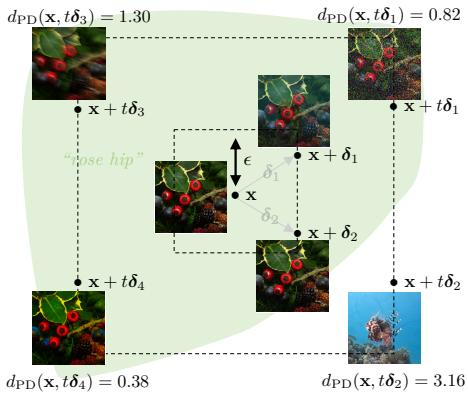
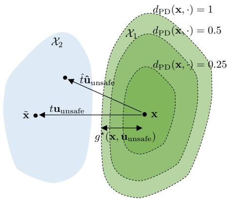
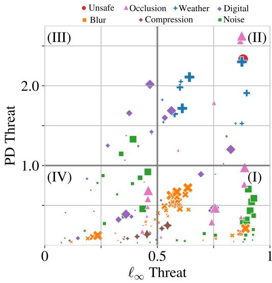
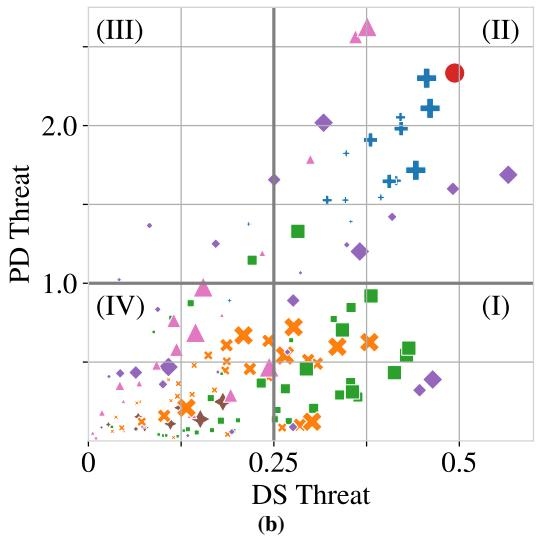
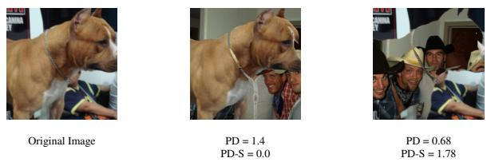
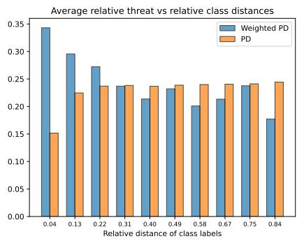

# Disentangling Safe and Unsafe Image Corruptions via Anisotropy and Locality

Ramchandran Muthukumar\* 1 Ambar Pal2† Jeremias Sulam1 René Vidal3 1Johns Hopkins University 2Amazon Web Services 3University of Pennsylvania

## Abstract

State-of-the-art machine learning systems are vulnerable to small perturbations to their input, where “small” is defined according to a threat model that assigns a positive threat to each perturbation. Most prior works define a task-agnostic, isotropic, and global threat, like the $\ell _ { p }$ norm, where the magnitude of the perturbation fully determines the degree of the threat and neither the direction of the attack nor its position in space matter. However, common corruptions in computer vision, such as blur, compression, or occlusions, are not well captured by such threat models. This paper proposes a novel threat model called Projected Displacement (PD) to study robustness beyond existing isotropic and global threat models. The proposed threat model measures the threat of a perturbation via its alignment with unsafe directions, defined as directions in the input space along which a perturbation of sufficient magnitude changes the ground truth class label. Unsafe directions are identified locallyfor each input based on observed training data. In this way, the PD-threat model exhibits anisotropy and locality. Experiments on Imagenet-1k data indicate that, for any input, the set ofperturbations with small PD threat includes safe perturbations of large $\ell _ { p }$ norm that preserve the true label, such as noise, blur and compression, while simultaneously excluding unsafe perturbations that alter the true label. Unlike perceptual threat models based on embeddings of large-vision models, the PD-threat model can be readily computed for arbitrary classification tasks without pre-training orfinetuning. Further additional task information such as sensitivity to image regions or concept hierarchies can be easily integrated into the assessment of threat and thus the PD threat model presents practitioners with a flexible, task-driven threat specification that alleviates the limitations of $\cdot \ell _ { p }$ -threat models.

## 1. Introduction

Modern machine learning (ML) systems are nearing widespread deployment in civilian life, and hence a comprehensive understanding of their security vulnerabilities is necessary [46]. One such vulnerability concerns the ability of a malicious adversary to tamper with predictions by adding small imperceptible corruptions referred to as adversarial perturbations [22, 42]. There is by now overwhelming evidence that carefully crafted adversarial perturbations can foil the prediction of state-of-the-art machine learning classifiers, i.e. they are not adversarially robust [6, 8]. Such vulnerabilities have been observed in a wide variety of applications like computer vision [1, 49], speech recognition [37, 55], autonomous driving [5, 45], and more. The goal of designing safe and reliable ML systems remains incomplete [4, 11] despite significant investment [23, 24, 33]. Often, strategies that intend to foil performance, i.e. adversarial attacks [6, 7, 22, 31, 44], have proven more successful than strategies aimed at mitigating vulnerabilities, i.e. adversarial defenses [3, 9, 34, 48, 52].

Meaningfully evaluating the adversarial robustness of a machine learning system requires a formal specification of a threat function, and an associated threat model that limits the scope of malicious adversaries [20]. Informally, a threat function $d \ : \ \mathbb { R } ^ { d } \times \mathbb { R } ^ { d } \ \to \ \mathbb { R } ^ { \ge 0 }$ measures the threat1 represented by a corruption $\pmb { \delta } ~ \in ~ \mathbb { R } ^ { d }$ towards altering the true label at input $\textbf { x } \in \mathbb { R } ^ { d }$ as $d ( \mathbf { x } , \pmb { \delta } )$ . We let $\mathcal { S } ( \mathbf { x } , d , \varepsilon ) : = \{ \pmb { \delta } \in \mathbb { R } ^ { d } \ | \ d ( \mathbf { x } , \pmb { \delta } ) \leq \varepsilon \}$ denote the ε-sublevel set of perturbations where the threat d is measured w.r.t. input x. A threat model $( d , \varepsilon )$ is a pair of a threat function d and a permissible threshold ε that together define the set of permissible perturbations $S ( \mathbf { x } , d , \varepsilon )$ . Under the threat model $( d , \varepsilon )$ , the robust accuracy of a classifier $h \in \mathcal H$ is the probability that the label prediction at x is locally invariant to corruptions within the permissible set $S ( \mathbf { x } , d , \varepsilon )$ , see Definition 2 for an explicit definition.

One of the most commonly used threat models is the $\ell _ { p }$ -threat model $( d _ { p } , \epsilon )$ , corresponding to the choi $\mathrm { { c e } } ^ { 2 }$ $d _ { p } ( \mathbf { x } , \boldsymbol { \delta } ) : = \lVert \boldsymbol { \delta } \rVert _ { p } .$ . The threat function $d _ { p }$ is task-agnostic, easy to evaluate, and induces a compact sub-level set $S ( \mathbf { x } , d _ { p } , \varepsilon )$ that allows efficient projection. Hence, the $\ell _ { p } -$ threat model $( d _ { p } , \varepsilon )$ presents a natural starting point for investigating robustness. RobustBench [8] maintains an upto-date leaderboard of the robust accuracies of benchmark models under $( d _ { p } , \varepsilon )$ . Unfortunately, the progress towards achieving perfect adversarial robustness (i.e. 100% robust test accuracy) in RobustBench has plateaued in recent years. Unlike supervised learning on clean data, scaling data, model size and computing resources might be insufficient to bridge the gap [4, 11]. Below we expand further on the fundamental limitations of isotropic and global threat models.

  
Figure 1. Corruptions with equal $\ell _ { \infty }$ -threat, $\begin{array} { r } { \left\| \delta _ { 1 } \right\| _ { \infty } = \left\| \delta _ { 2 } \right\| _ { \infty } = } \end{array}$ $\| \pmb { \delta } _ { 3 } \| _ { \infty } = \| \pmb { \delta } _ { 4 } \| _ { \infty }$ , but varying PD-threat.

## 1.1. Motivation: Specification of Threat Model

For image-based datasets, it is widely recognized that $\ell _ { p }$ norms are neither necessary nor sufficient for capturing perceptual similarity [39, 40], which poses significant challenges for accurately evaluating robustness [26, 43]. In Figure 1, x (at the center) is an image of class ROSE HIP from the Imagenet-1k dataset, and $\textbf { x } + \delta _ { 1 } , \textbf { x } + \delta _ { 2 }$ are two corrupted images equidistant (w.r.t. $\ell _ { \infty } )$ from x, i.e. $\left\| \delta _ { 1 } \right\| _ { \infty } = \left\| \delta _ { 2 } \right\| _ { \infty } = \varepsilon$ . Intuitively, both $\mathbf { x } + \pmb { \delta } _ { 1 }$ and $\mathbf { x } + \pmb { \delta } _ { 2 }$ share the same label as x, since its appearance still depicts the fruit ROSE HIP. We refer to such perturbations that preserve the class label as $s a f e$ , while those that change it are termed unsafe. Consider now moving further along these directions to $\mathbf { x } + t { \boldsymbol { \delta } } _ { 1 }$ and $\mathbf { x } + t { \delta } _ { 2 } .$ , for $t > 1$ . These perturbed points are again equidistant from $\mathbf { x } ,$ but while $t \delta _ { 1 }$ does not alter the true label (i.e. it is safe), $t \delta _ { 2 }$ does (and it is unsafe). As a result, any threat model $( d _ { \infty } , t ^ { \prime } \varepsilon )$ with $t ^ { \prime } \geq t$ necessarily incurs misspecification: any classifier h stable to all perturbations in $S ( \mathbf { x } , d _ { \infty } , t ^ { \prime } \varepsilon )$ produces an incorrect prediction at ${ \bf x } + t \delta _ { 2 } , i . e . \ h ( { \bf x } + t \delta _ { 2 } ) = \mathrm { R O S E ~ H I P }$ . On the other hand, shrinking the threat model is also futile, as then the safe perturbation $t \delta _ { 1 }$ is necessarily excluded.

This illustrates that standard $\ell _ { p } .$ -threat models are unable to distinguish between the safe perturbations that preserve the true label and the unsafe perturbations that alter the true label. Hence, perfect robust accuracy under $\ell _ { p }$ threat models might be neither achievable nor desirable. Attempting to resolve these limitations, Laidlaw et al. [32] formulate perceptual threat models via neural perceptual metric based on neural representations. Unfortunately (but unsurprisingly), all neural perceptual distance metrics are themselves vulnerable to adversarial attacks [17–19, 29].

## 1.2. Summary of Contributions

We propose a novel threat function called Projected Displacement (PD), denoted by $d _ { \mathrm { P D } }$ (see Definition 7 for an explicit description), that accounts for the local directional statistics of the data via unsafe directions $\mathcal { U } ( \mathbf { x } )$ (Definition 6) at each input x. For an input x with label $y ,$ any input x˜ with label $\tilde { y } \ne y$ represents the unsafe direction $\begin{array} { r } { \mathbf { u } : = \frac { \tilde { \mathbf { x } } - \mathbf { x } } { \left\| \tilde { \mathbf { x } } - \mathbf { x } \right\| _ { 2 } } . } \end{array}$ which will be estimated from observed training data. Then, the degree of threat of each perturbation δ is the maximal alignment with the set of unsafe directions: A large threat $d _ { \mathrm { P D } } ( \mathbf { x } , \pmb { \delta } )$ indicates that $\delta$ is well-aligned with an unsafe direction $\mathbf { u } \in \mathcal { U } ( \mathbf { x } )$ . We highlight some key properties.

1. Disentangling safe vs unsafe perturbations. PD-threat is able to distinguish between safe and unsafe perturbations of equal $\ell _ { p }$ norms. From Figure 1, different corruptions (Gaussian noise $t \delta _ { 1 }$ , motion blur $t \delta _ { 3 }$ and saturation $t \delta _ { 4 } )$ applied to the original image x all have equal $\ell _ { \infty }$ norm of $2 4 0 / 2 5 5$ . Despite this, the true label of these perturbed samples does not change, unlike that of corruption $t \delta _ { 2 }$ , which results in an image $\mathbf { x } + t { \delta _ { 2 } }$ with a different class. For each perturbation $t \delta _ { i }$ , the computed values of PD threat in Figure 1 naturally reflect how close they are to changing the class label. PD threat model is competent with state-of-the-art neural perceptual threat model DreamSim (denoted $d _ { \mathrm { D S } } ) \left[ 1 5 \right]$ for distinguishing safe and unsafe perturbations (see Section 4).

2. Ease of use. As we will show, the sub-level set $S ( \mathbf { x } , d _ { \mathrm { P D } } , \varepsilon )$ at each input x is convex, allowing for efficient projections onto it. This enables a straightforward plug-and-play mechanism for adapting existing adversarial attacks to the PD-threat model. We incorporate such an extension of AutoAttack [7] to evaluate the robustness under the PD-threat model $( d _ { \mathrm { P D } } , \varepsilon )$ for state-of-the-art robust classifiers registered at RobustBench [8].

3. Task-dependency. PD-threat models can readily integrate additional task-relevant information via label annotation, such as inter-class hierarchy (e.g. the Wordnet hierarchy) or pixel annotation (e.g. segmentation masks)–see Table 1– allowing for variations in the form of robustness while retaining the above benefits (anisotropy, locality, convex sub-level sets, and efficient projection).

## 1.3. Related Work

In this section, we highlight prior work that explores robustness beyond $\ell _ { p } .$ -threat models.

<table><tr><td>PROPERTY</td><td>FEATURES</td><td> $d _ { \mathrm { p } }$ </td><td>dDs [15]</td><td> $d _ { \mathrm { P D } }$ </td></tr><tr><td>Degree of Threat</td><td>Anisotropy, Locality</td><td>X</td><td>L</td><td>L</td></tr><tr><td>Label Annotation</td><td>Inter-class Distance</td><td>X</td><td>2</td><td></td></tr><tr><td>Pixel Annotation</td><td>Segmentation</td><td></td><td>X</td><td></td></tr></table>

Table 1. Comparison of Threat Models

Common Corruptions. Neural networks are vulnerable to image distortions (e.g. translation, rotation), common corruptions (e.g. blur, noise), changes in lighting, view, depth, etc. [12, 16, 25, 27, 28, 36, 50]. Note that these are known safe perturbations as they preserve the true label, even if they have large $\ell _ { p }$ norms. To measure this vulnerability, [25] formalized the notion of corruption robustness and presented a standardized benchmark dataset, Imagenet-C containing 19 styles of common image corruptions (categorized into noise, $b l u r ,$ weather, and digital). Training on Imagenet-C, or on other augmentations, can result in over-fitting, particularly to specific types of corruptions [36]. Additionally, [36] in troduced a newdataset, Imagenet-C¯ , with 10 new corruption styles identified from a larger set of real-world corruptions. These will be useful later in our experiments.

Perceptual Distance Metrics. Since $\ell _ { p }$ provides inaccurate approximations to perceptual distances, several works have attempted to propose alternatives, such as SSIM [47], FSIM [53], and HDR-VDP-2 [35]. With the advent of learning data-driven representations, [15, 54] hail the effectiveness of internal representations of neural classifiers in capturing perceptual similarity. DreamSim [15], the current state-ofthe-art among the neural perceptual distance metrics, is finetuned on human perceptual similarity judgements.

## 2. Key Definitions

Notation. We denote scalar quantities in Roman letters and vectors in boldface Roman letters. The empty set is given by . For any set $\nu ,$ we denote by $2 ^ { \nu }$ the power set of all its subsets. For any set $\nu \subset \mathbb { R } ^ { d }$ and a vector v $\in \mathbb { R } ^ { d } , \mathcal { V } - \left\{ \mathbf { v } \right\}$ is the Minkowski difference, i.e. the set $\{ \mathbf { w } - \mathbf { v } | \forall \mathbf { w } \in \mathcal { V } \}$ (subtracting v from all elements of ). We denote the unit ball and the unit sphere in $\mathbb { R } ^ { d }$ w.r.t. the $\ell _ { p }$ norm by $\mathbb { B } _ { p } ^ { d } : =$ $\{ \mathbf { v } \in \mathbb { R } ^ { d } \mid \left\| \mathbf { v } \right\| _ { p } \leq 1 \}$ and $\mathbb { S } _ { p } ^ { d } : = \left\{ \mathbf { v } \in \mathbb { R } ^ { d } \mid \left. \mathbf { v } \right. _ { p } = 1 \right\}$ respectively. A direction is an element of the unit sphere $\mathbb { S } _ { 2 } ^ { d }$

## 2.1. Supervised Learning

We consider a supervised learning task with a bounded input domain $\mathcal { X } \subset \mathbb { R } ^ { d }$ and labels $\mathcal { V } = \{ 1 , \ldots , C \}$ such that each input x is assigned a label by a deterministic $\mathrm { \ t r u e ^ { 4 } }$ labeling function $h ^ { \star } : \mathcal { X }  \mathcal { Y }$ . The true labeling function $h ^ { \star }$ partitions the input domain $\mathcal { X } : = \cup _ { y } \mathcal { X } _ { y }$ , where $\mathcal { X } _ { y }$ is the set of inputs assigned label y, i.e. $\mathbf { \nabla } \cdot \mathcal { X } _ { y } = \{ \mathbf { x } \in \mathcal { X } \mid h ^ { \star } ( \mathbf { x } ) = y \}$

We assume that the partition sets $\mathcal { X } _ { 1 } , \ldots , \mathcal { X } _ { C }$ are nonempty and open in order to avoid degeneracies.

We let $\mathcal { D } _ { \mathcal { X } }$ be a data distribution over the input domain $\mathcal { X }$ and $\mathcal { D } _ { \mathcal { Z } }$ the extension5 of $\mathcal { D } _ { \mathcal { X } }$ to a distribution over the joint domain $\mathcal { Z } : = \mathcal { X } \times \mathcal { Y }$ using the true labeling function $h ^ { \star }$ . The true labeling function $h ^ { \star }$ and the marginal input distribution $\mathcal { D } _ { \mathcal { X } }$ are unknown, but we observe finite labeled training data $\mathsf { S } : = \{ ( \mathbf { x } ^ { ( 1 ) } , y ^ { ( 1 ) } ) , \ldots , ( \mathbf { x } ^ { ( m ) } , y ^ { ( m ) } ) \} \overset { \mathrm { i . i . d . } } { \sim } ( \mathcal { D } _ { \mathcal { Z } } ) ^ { m }$ . For any classifier $h : \mathcal { X } \to \mathcal { Y }$ , accuracy is the probability of correctly labeling a random input, i.e. $\begin{array} { r } { \mathrm { A c c } ( h ) : = \mathrm { P r o b } _ { { \bf x } \sim \mathcal { D } _ { \mathcal { X } } } [ h ( { \bf x } ) = } \end{array}$ $h ^ { \star } ( \mathbf { x } ) ]$ . The task of supervised learning seeks a classifier h¯ in a hypothesis class $\mathcal { H } \subset \{ h : \mathcal { X }  \mathcal { Y } \}$ with high accuracy.

## 2.2. Adversarial Perturbations

In this article, we formally define adversarial perturbations through the lens of the partition sets $\mathcal { X } _ { y }$

Definition 1 (Adversarial Perturbation). A perturbation $\delta \in$ $\mathbb { R } ^ { d }$ is adversarial for predictor h at input x if it is,

1. Domain constrained: $\mathbf { x } + \delta \in \mathcal { X } , i . e . \delta \in \mathcal { X } - \left\{ \mathbf { x } \right\}$

2. Label invariant: $\mathbf { x } + \delta$ has the same true label as x, i.e. $h ^ { \star } ( \mathbf { x } + \delta ) = h ^ { \star } ( \mathbf { x } )$

3. Adversarial: $\mathbf { x } + \delta$ is misclassified by h, i.e. $h ( \mathbf { x } + { \delta } ) \neq$ $h ^ { \star } ( \mathbf { x } + \delta )$

The labels assigned by $h ^ { \star }$ are considered the ground truth and thus $h ^ { \star }$ has no adversarial perturbation at any input. The presence of adversarial perturbations indicates an imperfect labeling function h. Based on Definition 1, perturbations $\pmb { \delta } \in \mathbb { R } ^ { d }$ such that $\mathbf { x } + { \pmb { \delta } } \notin { \mathcal { X } }$ are not deemed adversarial as the classifier h is not required to predict labels outside the input domain. On the other hand, for x with true label $y ,$ a perturbation δ such that $h ^ { \star } ( { \bf x } + \delta ) \neq y$ cannot be adversarial at x as the corrupted input $\mathbf { x } + \delta$ has a different true label. Finally, if h predicts the label at x incorrectly, then 0 is already an adversarial perturbation.

## 2.2.1. Adversarial Robustness via Threat Specification

A threatfunction d : $\mathcal { X } \times \mathbb { R } ^ { d }  \mathbb { R } ^ { \geq 0 }$ presents practitioners a way to specify the kind of robustness suitable for a particular learning task. The ε-sublevel set of a threat function d at an input x, $\mathcal { S } ( \mathbf { x } , d , \varepsilon ) : = \{ \pmb { \delta } \in \mathbb { R } ^ { d } \ | \ d ( \mathbf { x } , \pmb { \delta } ) \leq \varepsilon \}$ , defines the set of perturbations with a threat at most ε.

Definition 2 (Threat Model, Robust Accuracy). A threat model $( d , \varepsilon )$ is a pair of threat function d and permissible threshold ε that together define the set of permissible perturbations at each input x as the sublevel set $S ( \mathbf { x } , d , \varepsilon )$ . Under the threat model $( d , \varepsilon )$ , the robust accuracy Robust $\operatorname { A c c } ( h , ( d , \varepsilon ) )$ of a classifier $h \in \mathcal H$ is the probability of stable prediction upon corruptions within the permissible set, i.e. Probx $\mathbf { \eta } _ { : } \vert \forall \mathbf { \delta } \delta \in S ( \mathbf { x } , d , \varepsilon )$ ， $h ( { \bf x } + \delta ) = h ^ { \star } ( { \bf x } ) \big ]$

  
Figure 2. An illustration of unsafe directions, and sub-level sets of the PD-threat.

Thus we define robustness as the stability6 of a classifier’s prediction under perturbations within the permissible sets. The task of robust supervised learning seeks a classifier in with high robust accuracy.

Definition 3 (ε-robust). A classifier $h \in \mathcal H$ is ε-robust at x w.r.t. a threat function d if, $\delta \in \mathcal { S } ( \mathbf { x } , d , \varepsilon ) \cap ( \mathcal { X } -$ x ), we have $h ( \mathbf { x } + \delta ) = h ^ { \star } ( \mathbf { x } )$

An ε-robust classifier predicts the same label $h ^ { \star } ( \mathbf { x } )$ at $\mathbf { x } { + } \delta$ for any corruption δ within the ε-sublevel set $S ( \mathbf { x } , d , \varepsilon )$ We emphasize that robust accuracy and ε-robustness are measures of stability rather than correctness. In this way, each threat model $( d , \varepsilon )$ implicitly encodes a trade-off between stability and correctness. [13]. Requiring more stability than necessary can lead to incorrect predictions as in Figure 1.

## 3. Threat specification beyond $\ell _ { p }$ norms

In this section, we design a principled threat model from first principles that is local and anisotropic. We first theoretically develop our exact $\mathrm { P D } ^ { \star }$ -threat model assuming knowledge of the decision boundaries of the true labeling function $h ^ { \star }$ (Section 3.1), and later relax this assumption by developing an approximation leveraging the observed training data and obtaining a practical PD-threat (Section 3.2).

## 3.1. Measuring threat with class partition

Definition 4 (Unsafe Directions). At each input x, a direction $\mathbf { u } \in \mathbb { S } _ { 2 } ^ { d }$ is called unsafe if there exists a step size $t \geq 0$ such that $\mathbf { x } + t \mathbf { u } \in \mathcal { X }$ and $h ^ { \star } ( \mathbf { x } + t \mathbf { u } ) \neq h ^ { \star } ( \mathbf { x } )$ . We denote the set of all unsafe directions at x as $\mathcal { U } ^ { \star } ( \mathbf { x } )$

The minimum step size needed to alter the true label can vary across unsafe directions. Further, $\mathcal { U } ^ { \star } ( \mathbf { x } )$ varies with input. Directions $\mathbf { v } \in B _ { 2 } ^ { d } \cap ( \mathcal { U } ^ { \star } ( \mathbf { x } ) ) ^ { c }$ are called safe, since moving along them (whilst domain constrained) cannot alter the true label. We note that adversarial perturbations (Definition 1) are a characteristic of a learned predictor $h \in$ while unsafe directions are a characteristic of the true labeling function $h ^ { \star }$ . We propose to measure threat of a perturbations δ using $\mathcal { U } ^ { \star } ( \mathbf { x } )$ .

Definition 5 (PD⋆-threat). Let $\mathbf { x } \in \mathcal { X }$ and let $\pmb { \delta } \in \mathbb { R } ^ { d }$ be a perturbation. The exact projected displacement threat function $d _ { P D } ^ { \star }$ is defined as the maximum scaled displacement of the Euclidean projection of the perturbation δ over all unsafe directions,

$$
d _ { \mathrm { P D } } ^ { \star } ( \mathbf { x } , \pmb { \delta } ) : = \operatorname* { s u p } _ { \mathbf { u } \in \mathcal { U } ^ { \star } ( \mathbf { x } ) } \ \frac { 1 } { g ^ { \star } ( \mathbf { x } , \mathbf { u } ) } \operatorname* { m a x } \left( \langle \pmb { \delta } , \mathbf { u } \rangle , 0 \right)\tag{1}
$$

where $g ^ { \star } ( \mathbf { u } , \mathbf { x } )$ is called the normalization function,

$$
\boldsymbol { g } ^ { \star } ( \mathbf { x } , \mathbf { u } ) : = \operatorname* { s u p } _ { \mathbb { R } \geq 0 } M \mathrm { ~ s . t . ~ } \mathbf { x } + t \mathbf { u } \in \boldsymbol { \mathcal { X } } _ { h ^ { \star } ( \mathbf { x } ) } \forall t \in [ 0 , M ] .
$$

At each x, the normalization function $g ^ { * } ( \mathbf { x } , \mathbf { u } )$ captures the distance along the direction u to the boundary of the set $\mathcal { X } _ { h ^ { \star } ( { \bf x } ) }$ and enables a comparison of the threat along different unsafe directions (see Figure 2). In (1), the supremum ensures that we do not underestimate the threat along a direction that potentially alters the true label. We highlight two key characteristics.

Anisotropy. The threat function $d _ { \mathrm { P D } } ^ { \star }$ is anisotropic (the threat of a perturbation $\pmb { \delta }$ at input x depends on both the direction and magnitude of the perturbation) and does not correspond to a norm in general, unlike $\ell _ { p }$ threat models. For a fixed x, the threat along different directions u varies based on the alignment with unsafe directions ${ { \mathcal { U } } ^ { \star } } ( { \bf { x } } )$ . In particular, $d _ { \mathrm { P D } } ^ { \star }$ can differentiate between the perturbations δ and δ.

Locality. The threat function $d _ { \mathrm { P D } } ^ { \star }$ exhibits locality; i.e. a fixed perturbation δ has varying threat $d _ { \mathrm { P D } } ^ { \star } ( \mathbf { x } , \pmb { \delta } )$ depending on the input x. Thus the permissible set varies with input7, enabling an input-aware assessment of threat. We note that weighted $\ell _ { p }$ norms [14] can be anisotropic but not local.

## 3.1.1. Stability vs Correctness Trade-off

Since the normalization function $g ^ { \star }$ accounts for the class partition $\{ \mathcal { X } _ { c } \} _ { c = 1 } ^ { C }$ , the threat function $d _ { \mathrm { P D } } ^ { \star }$ has a principled trade-off between stability and correctness. Specifically, the true labeling function $h ^ { \star }$ exhibits a high level of robustness under the PD⋆-threat8.

Theorem 1. The true labeling function $h ^ { \star }$ is 1-robust at any input $\mathbf { x } \in \mathcal { X }$ w.r.t. the threat $d _ { \mathrm { P D } } ^ { \star }$ . Additionally, if a classifier h is not 1-robust at all inputs then there exists an input x misclassified by $h .$

In other words, for any pairs of inputs $\mathbf { x } , \tilde { \mathbf { x } } \in \mathcal { X }$ with different labels, the threat $d _ { \mathrm { P D } } ^ { \star } ( \mathbf { x } , \tilde { \mathbf { x } } - \mathbf { x } )$ is always larger than 1. Thus seeking $h \in \mathcal H$ that is 1-robust at any input under $d _ { \mathrm { P D } } ^ { \star }$ is not at odds with learning $h ^ { \star }$

## 3.2. Measuring threats with observed data

Computing $d _ { \mathrm { P D } } ^ { \star } ( \mathbf { x } , \cdot )$ from Definition 5 requires explicitly characterizing the set of unsafe directions $\mathcal { U } ^ { \star } ( \mathbf { x } )$ and the normalization function $g ^ { \star } ( \mathbf { u } , \mathbf { x } )$ , both of which need knowledge of the partition sets $\{ \mathcal { X } _ { c } \} _ { c = 1 } ^ { C }$ induced by $h ^ { \star }$ . In this subsection, we propose a heuristic empirical approximation.

Approximating ${ { \mathcal { U } } ^ { \star } } ( { \bf { x } } )$ . We have access to training data S and incomplete information on the partition sets $\{ \mathcal { X } _ { c } \} _ { c = 1 } ^ { C }$ via the partition $\mathsf { S } = \{ \mathsf { S } _ { c } \} _ { c = 1 } ^ { C }$ , where $\mathrm { S } _ { c } : = \{ \mathbf { x } \in \mathcal { X } \mid ( \mathbf { x } , c ) \in$ $\mathrm { ~ S ~ } \} \subset \mathcal { X } _ { c }$ . At every training input $\textbf { x } \in \ S _ { y }$ for each input $\tilde { \mathbf { x } } \in  { \mathrm { S } } _ { c } \left( \mathrm { f o r } c \neq y \right)$ , the direction $\begin{array} { r } { \mathbf { u } = \frac { \tilde { \mathbf { x } } - \mathbf { \bar { x } } } { \left\| \tilde { \mathbf { x } } - \mathbf { x } \right\| _ { 2 } } } \end{array}$ is an unsafe direction. For computational considerations, we choose a collection $\bigcup _ { c } S _ { c , k }$ of representative subsets $\mathsf { S } _ { c , k } \subset \mathsf { S } _ { c }$ of size k. As a heuristic choice, we select subsets $\mathrm { S } _ { c , k }$ by solving a discrete-k-center optimization problem (detailed in Sec. 9.1). We are now ready to define an observed subset of the unsafe directions based on $\boldsymbol { \mathrm { S } } _ { c , k }$

Definition 6 (Observed Unsafe Directions). For each ${ \textbf { x } } \in$ $\mathrm { ~ \cal ~ S ~ } _ { y } ,$ we identify a set of $( C - 1 ) k \cdot$ -observed unsafe directions based on the representative subsets $\boldsymbol { \mathrm { S } } _ { c , k }$

$$
\mathcal { U } _ { k } ( \mathbf { x } ) : = \left\{ \frac { \tilde { \mathbf { x } } - \mathbf { x } } { \lVert \tilde { \mathbf { x } } - \mathbf { x } \rVert _ { 2 } } \left| \tilde { \mathbf { x } } \in \bigcup _ { c \neq y } \mathcal { S } _ { c , k } \right. \right\} \subset \mathcal { U } ^ { \star } ( \mathbf { x } ) .
$$

Approximating $g ^ { \star } ( { \bf x } , { \bf u } )$ . At any $\mathbf { x } \in \mathcal { X } _ { y }$ , for each ${ \textbf { u } } \in$ $\mathcal { U } _ { k } ( { \bf x } )$ , there exists $\tilde { \mathbf { x } } \in \cup _ { c \neq y } \mathbf { S } _ { c , k }$ such that $\begin{array} { r } { \mathbf { u } = \frac { \tilde { \mathbf { x } } - \mathbf { x } } { \| \tilde { \mathbf { x } } - \mathbf { x } \| _ { 2 } } } \end{array}$ normalization function can be bounded as $g ^ { \star } ( \mathbf { x } , \mathbf { u } ) \ \leq$ $\| \tilde { \mathbf { x } } - \mathbf { x } \| _ { 2 }$ , since $h ^ { \star } ( \tilde { \mathbf { x } } ) \neq h ^ { \star } ( \mathbf { x } )$ . In practice, we use the heuristic $g _ { \beta } ( \mathbf { u } , \mathbf { x } ) : = \beta \left\| \tilde { \mathbf { x } } - \mathbf { x } \right\| _ { 2 }$ , where $\beta \in ( 0 , 1 )$ is a scaling hyper-parameter.

Definition ${ \textsf { 7 } } ( ( k , \beta ) { \cdot } \mathrm { P D }$ threat). Let $\textbf { x } \in \mathcal { X }$ and let $\delta \ \in$ $\mathbb { R } ^ { d }$ be a perturbation. The projected displacement threat is defined as

$$
d _ { \mathrm { P D } , k , \beta } ( \mathbf { x } , \boldsymbol { \delta } ) : = \operatorname* { m a x } _ { \mathbf { u } \in \mathcal { U } _ { k } ( \mathbf { x } ) } \ \frac { 1 } { g _ { \beta } ( \mathbf { x } , \mathbf { u } ) } \operatorname* { m a x } _ { \mathbf { u } \in \mathcal { } } \left( \langle \boldsymbol { \delta } , \mathbf { u } \rangle , 0 \right) .
$$

The quality of the approximation of the exact threat $d _ { \mathrm { P D } } ^ { \star }$ by $d _ { \mathrm { P D } , \mathbf { k } , \beta }$ depends on the choice of representative unsafe directions $\mathcal { U } _ { k } ( \cdot )$ via the k-subset $\boldsymbol { \mathrm { S } } _ { c , k }$ and on the heuristic choice of the approximate normalization $g _ { \beta } .$ , via the scaling hyper-parameter $\beta .$ In this article, we fix $( k , \beta ) = ( 5 0 , \textstyle { \frac { 1 } { 2 } } )$ as the default hyper-parameters (see Section 9.3 for an expanded discussion on choosing hyper-parameters $( k , \beta )$ for any learning task). For brevity, we refer to the observed unsafe directions (Definition 6), the heuristic normalizations and the PD threat (Definition 7) as $\mathcal { U } ( \mathbf { x } ) , g ( \mathbf { x } , \pmb { \delta } )$ and $d _ { \mathrm { P D } } ( \mathbf { x } , \delta )$ , respectively.

We now state a few important properties of our proposed empirical approximation $d _ { \mathrm { P D } }$ . Clearly $d _ { \mathrm { P D } }$ inherits the anisotropy and locality properties of the exact threat $d _ { \mathrm { P D } } ^ { \star }$

Growth and Sensitivity. The growth of PD threat along any direction is linear, $\mathrm { i . e . , } d _ { \mathrm { P D } } ( \mathbf { x } , t \delta ) = t d _ { \mathrm { P D } } ( \mathbf { x } , \delta )$ , and the rate of growth scales inversely with the (approximate) normalization. In particular, for a fixed x, $d _ { \mathrm { P D } } ( \mathbf { x } , \cdot )$ is $\left( \operatorname* { m a x } _ { u \in \mathcal { U } ( \mathbf { x } ) } 1 / g ( \mathbf { x } , \mathbf { u } ) \right)$ -Lipschitz w.r.t $\ell _ { 2 }$ norm.

Projection onto sublevel sets. For any threat model $( d , \varepsilon )$ , the ability to efficiently project a perturbation δ onto the sub-level sets $S ( d , \mathbf { x } , \varepsilon )$ enables one to leverage a wide literature on gradient-based attacks to conduct a rigorous evaluations of adversarial robustness. The sublevel sets of PD threat model, $\mathrm { i . e . , } \ S ( \mathbf { x } , d , \varepsilon )$ , are convex for all x for all $\epsilon \geq 0$ . In particular, is the intersection of at most $k \cdot C$ half-spaces characterized by unsafe directions $\mathcal { U } ( \mathbf { x } )$ as $\begin{array} { r } { S ( \mathbf { x } , d _ { \mathrm { P D } } , \varepsilon ) = \underset { \mathbf { u } \in \mathcal { U } ( \mathbf { x } ) } { \bigcap } \{ \pmb { \delta } \in \mathbb { R } ^ { d } \mid \langle \pmb { \delta } , \mathbf { u } \rangle \leq \varepsilon \cdot g ( \mathbf { x } , \dot { \mathbf { u } } ) \} } \end{array}$ Further, the sub-level sets are monotonic w.r.t. the threshold, i.e., for $\varepsilon _ { 1 } \geq \varepsilon _ { 2 } \geq 0 , S ( \mathbf { x } , d _ { \mathrm { P D } } , \varepsilon _ { 2 } ) \subseteq S ( \mathbf { x } , d _ { \mathrm { P D } } , \varepsilon _ { 1 } )$

Linearity of growth and convexity of the sub-level sets together provide a straightforward approximate projection algorithm, since for any perturbation $\delta ,$ , the scaled perturbation $\frac { \varepsilon } { d _ { \mathrm { P D } } ( \mathbf { x } , \delta ) } \delta$ lies in the permissible set $S ( \mathbf { x } , d _ { \mathrm { P D } } , \varepsilon )$ Further, due to the convexity of sublevel sets, an exact projection (in $\ell _ { 2 }$ distance) can be computed using the iterative greedy scheme outlined in the Algorithm 2 (deferred to the appendix). Thus the PD threat provides the practitioner with the flexibility of a fast approximate projection or an exact projection at the expense of increased computation. Together, these projection algorithms enable immediate adaptation of existing adversarial attacks to our proposed threat model.

We note that efficient exact projection algorithms are also known for $\ell _ { p }$ threat models. However, for neural perceptual threat models such as DreamSim [15], the sub-level sets are non-convex and a projection can only be approximately computed [32] and is typically not computationally efficient.

## 4. Experiments on Real World Data

In this section we illustrate the qualitative and quantitative characteristics of the PD-threat in comparison to existing threat models. We evaluate 4 threat functions: $d _ { \infty } , d _ { 2 } , d _ { \mathrm { D S } }$ and our proposed PD threat function dPD, where dDS is the neural perceptual threat function $d _ { \mathrm { D S } } ( \mathbf { x } , \tilde { \mathbf { x } } - \mathbf { x } ) \ : =$ DreamSim(x, x˜) from DreamSim [15]. Note that we focus on DreamSim due to its superior performance over other neural perceptual threat models [15], but the following comparison applies to any modern neural perceptual threat model.

Experimental Setup. We seek to measure the ability of threat functions to distinguish between safe and unsafe corruptions. The threat models $d _ { \mathrm { P D } }$ and $d _ { \mathrm { D S } }$ depend on the Imagenet-1k training dataset S. All threat models are evaluated on the Imagenet-1k validation dataset $\mathrm { S _ { v a l } }$ . For any pair of labelled inputs $( \mathbf { x } , y ) , ( \tilde { \mathbf { x } } , c ) \in \mathrm { S } _ { \mathrm { v a l } }$ with distinct labels $( c \neq y )$ , the perturbation $\delta : = \tilde { \mathbf { x } } - \mathbf { x }$ is an unsafe perturbation at x. This way, we can evaluate the statistics of threat under unsafe perturbations for each threat function. To characterize threat under safe perturbations, we consider a set Ω of 150 distinct common corruptions consisting of 30 styles $\times 5$ severity levels, i.e., severity $\in \{ 1 , 2 , 3 , 4 , 5 \}$ – the supplementary material contains visual examples (see Figures 8 and 9), sourced from Imagenet-C [25] and Imagenet-C¯ [36] accompanied with their threat assessment.

<table><tr><td>CATEGORY</td><td>CORRUPTION STYLES</td></tr><tr><td>Noise</td><td>Gaussian, Shot, Impulse, Speckle, Blue,</td></tr><tr><td>Blur</td><td>Brown, Perlin, Single-Frequency, Plasma Gaussian, Defocus, Glass, Motion,</td></tr><tr><td>Compression</td><td>Concentric Sine Waves, Caustic Refraction</td></tr><tr><td>Digital</td><td>Pixelate, JPEG</td></tr><tr><td></td><td>Brightness, Contrast, Saturate, Elastic Transform</td></tr><tr><td>Weather</td><td>Frost, Fog, Snow</td></tr><tr><td>Occlusion</td><td>Spatter, Checkerboard Cutout, Sparkles,</td></tr></table>

Table 2. Categories of corruptions studied, from Imagenet-C [25] and Imagenet-C¯ [36].

For a specific corruption style such as Gaussian noise and a severity level 5, we let $\Omega _ { \mathrm { G a u s s i a n N o i s e } , 5 }$ denote the corresponding corruption function. To aid visualization, we group the corruption styles into 6 distinct categories (listred in Table 2) so that $\Omega : = \cup _ { i \in [ 5 ] } \Omega _ { i }$ where $\Omega _ { i }$ is the set of all corruption styles at severity level i,

$$
\Omega _ { i } : = \left( \Omega _ { \mathrm { n o i s e } , i } \cup \Omega _ { \mathrm { b l u r } , i } \cup \Omega _ { \mathrm { c o m p r e s s i o n } , i } \cup \Omega _ { \mathrm { d i g i t a l } , i } \cup \Omega _ { \mathrm { w e a t h e r } , i } \cup \Omega _ { \mathrm { o c c l u s i o n } , i } \right) .
$$

Each individual corruption $\omega ~ \in ~ \Omega$ is applied to a subset $\bar { \mathrm { ~ S ~ } } \subset \ \mathrm { S } _ { \mathrm { v a l } }$ of 5,000 images chosen uniformly at random. For each threat function $d \in \{ d _ { \infty } , d _ { 2 } , d _ { \mathrm { P D } } , d _ { \mathrm { D S } } \}$ and corruption $\omega \in \Omega$ , for each image ${ \textbf { x } } \in { \bar { \mathrm { ~ S ~ } } } ,$ we denote by $\mathrm { a v g } ( d , \omega )$ , the average threat statistic, $\arg ( d , \omega ) : =$ $\begin{array} { r } { \frac { 1 } { | \overline { { \mathbb { S } } } | } \sum _ { ( \mathbf { x } , y ) \in \mathbb { S } } d ( \mathbf { x } , \omega ( \mathbf { x } ) - \mathbf { x } ) } \end{array}$ , where $\omega ( \mathbf { x } )$ is the corrupted input and $\omega ( { \bf x } ) - { \bf x }$ is the safe perturbation at x.

## 4.1. Disentangling Safe and Unsafe Corruption

We now measure the ability of threat models to distinguish safe and unsafe corruptions. Each corruption $\omega \in \Omega$ defines a point in Figure 3a having as the horizontal coordinate $\mathrm { a v g } ( d _ { \infty } , \omega )$ and $\arg ( d _ { \mathrm { P D } } , \omega )$ as the vertical coordinate, producing a comparison of our PD threat to the $\ell _ { \infty }$ -threat model. Similarly, Figure 3b compares PD threat to the DreamSIMthreat model.

A specification of threat model $( d , \varepsilon )$ corresponds to the choice of a horizontal line for $d _ { \mathrm { P D } }$ or a vertical line for $( d _ { \infty }$ or $d _ { \mathrm { D S } } )$ in Figure 3. We note that a size-able set of common corruptions incur large $d _ { \infty }$ threat, in particular as large as the unsafe corruptions (as indicated in Figure 1), thus any vertical line in Figure 3a is bound to exclude such common corruptions. In contrast, both $d _ { \mathrm { P D } }$ and $d _ { \mathrm { D S } }$ admit choices of ε that exclude unsafe perturbations while including most common corruptions. Hence, PD threat and DS threat are able to disentangle safe and unsafe corruptions.

For each of the comparisons in Figure 3, we identify 4 quadrants I-IV, distinguishing between low-threat and highthreat corruptions as measured by the corresponding threat models. We define the quadrants by choosing thresholds of 1, 0.5, and 0.25 for $d _ { \mathrm { P D } } , d _ { \infty }$ , and $d _ { \mathrm { D S } }$ , respectively9, and comment on the qualitative behavior observed:

• Quadrant IV contains corruptions that are characterized as low-threat by both threat models. As expected, almost all corruptions having a low severity (1) lie in this region. However, we already see deficiencies of the $d _ { \infty }$ threat, as some blur, noise, and occlusion corruptions of severity 1 in Figure 3a are not characterized as low-threat by at least one of the threat models.

• Quadrant II contains corruptions that are characterized as high-threat by both threat models. These include digital and weather corruptions of high severity (5) as they tend to remove most of the signal in the input.

• Quadrant I contains corruptions having low PD-threat but high $d _ { \infty } \thinspace \mathrm { o r } \ d _ { \mathrm { D S } }$ and showcases the resilience of our PDthreat model to natural corruptions like blur and Gaussian noise, which retain a lot of the information in the image relevant to the classification task. Indeed, a visual inspection of these corruptions (see Section 10 in the Appendix) reveals that even at a high severity, a human is able to discern task-relevant information from the corrupted images, and hence these corruptions should be assigned a low threat.

• Quadrant III contains corruptions with high PD threat but low $d _ { \infty }$ or $d _ { \mathrm { D S } }$ threat. We note that corruptions rate as high threat by $d _ { \mathrm { P D } }$ are largely also rated highly by $d _ { \mathrm { D S } }$ Since the PD and DS threats are aligned, the corruptions in Quadrant III in Figure 3a indicate that low $d _ { \infty }$ is not sufficient to characterize hard corruptions.

As a final point, we note that while the size of markers in Figure 3 indicate the severity levels, different corruptions of similar severity levels are qualitatively different. For e.g, weather corruptions of severity level 5 are uniformly harder than noise corruptions such as shot noise, Gaussian noise. Figure 11 illustrates heatmap of average threat for each corruption category across increasing severity. We observe that both PD and DS threat exhibit largely monotonic increase across severity unlike $d _ { \infty }$ . At this point, we will pause to summarize the benefits of PD-threat.

  
Figure 3. Comparison of Threat models w.r.t. various common corruptions. The size of a marker represents the severity level.

PD vs DreamSim. The PD-threat compares well to the DS-threat but does not require pre-trained large vision models or fine-tuning on a curated dataset of human perceptual similarity judgements. For real-world classification tasks where perceptual similarity between pairs of input is harder to quantify even with expert human annotators, instantiation of high-quality neural perceptual distance metrics is harder. Further, unlike perceptual distance metrics [15, 17, 18, 32, 54], the growth of the PD-threat is linear and interpretable along any direction, the sub-level sets induced by the PD-threat model are convex, and admit efficient projection algorithms and hence PD threat presents a promising alternative.

## 5. Measuring threat with Task Annotation

We described two practical design choices for PD-threat in Section 3.2: (1) a choice of the set of unsafe directions $\mathcal { U } ( \mathbf { x } )$ at each input, and (2) a choice of normalization $g ( \mathbf { x } , \mathbf { u } )$ for each unsafe direction. Next, we incorporate additional task-relevant information to refine PD-threat further.

## 5.1. Segmentation-aware Threat Specification

Segmentation masks isolate regions of the input that contain semantic information relevant to the class label, and can be generated efficiently following recent advances in foundational models for image segmentation [30, 38]. We demonstrate a straightforward method to incorporate semantic masks in the assessment of threat.

Definition 8 (PD-S threat). Let $\mathbf { x } \in \mathcal { X }$ and let $\pmb { \delta } \in \mathbb { R } ^ { d }$ . Let $\mathbf { a } \in \{ 0 , 1 \} ^ { d }$ be a boolean mask. The segmented PD threat,

$$
d _ { \mathrm { P D - S } } ( \mathbf { x } , \mathbf { a } , \delta ) : = \operatorname* { m a x } _ { \mathbf { u } \in \mathcal { U } ( \mathbf { x } ) } \ \frac { 1 } { g _ { \beta } ( \mathbf { x } , \mathbf { u } ) } \operatorname* { m a x } \left( \langle \delta [ \mathbf { a } ] , \mathbf { u } [ \mathbf { a } ] \rangle , 0 \right) .
$$

Here the $\mathbf { u } [ \mathbf { a } ]$ denotes a sub-vector whose indices are selected by the boolean mask a. The threat model $( d _ { \mathrm { P D - S } } , \varepsilon )$ is aligned with Xiao et al. [51]’s proposal to learn models robust to adversarially chosen backgrounds.For each image, we generate automatic masks by prompting $\mathbf { S A M ^ { 1 0 } }$ with the center pixel coordinates. Figure 4 illustrates the difference between PD and PD-S threat on 2 corruptions that are background-only and foreground-only respectively. PD-S threat is oblivious to background corruption but more sensitive to foreground corruption.

  
Figure 4. Comparison of threat on background vs foreground.

We note that $\ell _ { p }$ threat models are also capable of integrating segmentation masks as they are pixel-based, but it is unclear if perceptual threat can account for pixel annotation.

## 5.2. Concept-aware Threat Specification

The PD-threat assumes no hierarchy of class labels; i.e. all labels are distinct to the same degree. However, classification tasks are often accompanied with an additional hierarchy that identifies groups of class labels based on similar semantic content. We propose to account for such a hierarchy by refining our choice of normalization. Suppose x has label y and $\begin{array} { r } { \mathbf { u } = \frac { \tilde { \mathbf { x } } - \mathbf { x } } { \left\| \tilde { \mathbf { x } } - \mathbf { x } \right\| _ { 2 } } } \end{array}$ where $\tilde { \mathbf { x } } \in \mathbf  \} _ { c , k }$ has label c. Let W : $[ C ] \times [ C ] \in [ 0 , 1 ]$ denote a relative11 distance between class labels based on Wordnet-hierarchy (refer to Section 9.5 for explicit details). We propose the weighted normalization $g _ { \beta , W } ( \mathbf { x } , \mathbf { u } ) : = \beta \cdot W ( y , c ) \| \tilde { \mathbf { x } } - \mathbf { x } \| _ { 2 } ,$ so that perturbation between nearby classes are weighted higher in threat.

Definition 9 (PD-W threat). Let $\mathbf { x } \in \mathcal { X }$ with label y and let $\pmb { \delta } \in \mathbb { R } ^ { d }$ . The weighted PD threat is defined as,

$$
d _ { \mathrm { P D - W } } ( \mathbf { x } , \delta ) : = \operatorname* { m a x } _ { \mathbf { u } \in \mathcal { U } ( \mathbf { x } ) } \ \frac { 1 } { g _ { \beta , W } ( \mathbf { x } , \mathbf { u } ) } \operatorname* { m a x } _ { \mathbf { u } \in \mathcal { U } ( \mathbf { x } ) } \left( { \langle \delta , \mathbf { u } \rangle } , 0 \right) .
$$

The threat model $( d _ { \mathrm { P D - W } } , \varepsilon )$ is weaker than $( d _ { \mathrm { P D } } , \varepsilon )$ since $\mathcal { S } ( \mathbf { x } , d _ { \mathrm { P D - W } } , \varepsilon ) \subseteq \mathcal { S } ( \mathbf { x } , d _ { \mathrm { P D } } , \varepsilon )$ . Thus PD-W is a relaxation of PD threat with a softer requirement of stability between nearby classes. Figure 5 depicts the average relative12 threat vs relative distance $W ( \cdot , \cdot )$ of class labels on the Imagenet-1k validation dataset. The decreasing PD-W threat for increasing class distance is aligned with the following intuition - failure to distinguish between semantically distant classes such as ENGLISH FOXHOUND and FIRE TRUCK should incur lower robust accuracy than failure to distinguish between similar classes such as ENGLISH FOXHOUND and IRISH WOLFHOUND.

  
Figure 5. Relative Threat vs relative inter-class distances

In summary our novel threat specification framework enables evaluation of robustness to adversarial perturbations and common corruptions while enabling sensitivity to semantic regions of an image and class hierarchy by incorporating additional task annotation. As a consequence, our threat model unifies adversarial robustness with variants of corruption robustness suggested by several independent benchmarks [25, 36, 51].

## 6. Evaluation of benchmark $\ell _ { p }$ robust models

Finally, we evaluate state-of-the-art robust models against our proposed thread models. Note that, as per Theorem 1, one should hope for classifiers that are 1-robust to corruptions under the PD-threat. The corresponding permissible set of corruptions cover regions IV and I in Figure 3. We evaluate robustness to corruptions in the set $S ( \mathbf { x } , d _ { \mathrm { P D } } , \varepsilon ) \cap S ( \mathbf { x } , d _ { \infty } , \varepsilon )$ . We denote the corresponding threat model $( d _ { \infty } \cap d _ { \mathrm { P D } } , \varepsilon )$ . A robust evaluation for such a threat model can be executed in practice by generating adversarial perturbations with standard AutoAttack [7] for $( d _ { \infty } , \varepsilon )$ followed by projection onto $S ( \mathbf { x } , d _ { \mathrm { P D } } , \varepsilon )$ . Table 3 shows the robustness of benchmark classifiers registered at RobustBench order by $d _ { \infty }$ robustness (column 1) when evaluated against $( d _ { \infty } \cap d _ { \mathrm { P D } }$ , 16/255) threat model for the Imagenet-1k classification task.

<table><tr><td>Benchmark Model</td><td> $d _ { \infty }$ </td><td>PD PD-S PD-W</td></tr><tr><td>ConvNeXt-L [33]</td><td>0.25</td><td>0.32 0.31 0.31</td></tr><tr><td>Swin-B [33]</td><td>0.12</td><td>0.21 0.20 0.21</td></tr><tr><td>ConvNeXt-B [33]</td><td>0.1</td><td>0.19 0.18 0.18</td></tr><tr><td>ConvNeXt-B-ConvStem [41]</td><td>0.09</td><td>0.19 0.19 0.19</td></tr><tr><td>ViT-S-ConvStem [41]</td><td>0.05</td><td>0.13 0.12 0.12</td></tr><tr><td>XCiT-L12 [10]</td><td>0.04</td><td>0.17 0.18 0.18</td></tr></table>

Table 3. Robust Evaluation for $\varepsilon = 1 6 / 2 5 5$

We note that robust accuracies uniformly improve under our threat specification in comparison to $( d _ { \infty } , \varepsilon )$ , indicating a meaningful restriction of unsafe corruptions. The ordering of robust accuracies highlights diversity, e.g. [10]’s XCiT-L12 fares better under PD threat than suggested by the $d _ { \infty }$ leaderboard. The indistinguishability across PD, PD-S and PD-w is surprising. Similar levels of robustness w.r.t PD-W and PD indicate that models are unable to distinguish distant classes, while similar levels under PD and PD-S indicate adversarial attacks are often aligned with foreground masks. We note that adversarial attacks adapted to the threat specification often lead to a more accurate pessimistic evaluation of robustness.

## 7. Conclusion

This work proposes a novel task-dependent threat specification Projected Displacement threat that is adapted to the shape of decision boundaries based on observed training data. Unlike standard $\ell _ { p } .$ -threat models, the proposed threat model exhibits anisotropy and locality and is thus able to distinguish between safe and unsafe perturbations. The proposed threat specification framework is flexible and can effectively account for additional task information, such as image regions or label hierarchies. We invite the community to suggest further adaptive attacks and effective training strategies to encourage robustness in PD threat.

## Acknowledgements

This research was supported by NSF CISE 2212457 and NSF CAREER Award CCF 2239787

## References

[1] Naveed Akhtar, Ajmal Mian, Navid Kardan, and Mubarak Shah. Advances in adversarial attacks and defenses in computer vision: A survey. IEEE Access, 9:155161–155196, 2021. 1

[2] Pranjal Awasthi, Anqi Mao, Mehryar Mohri, and Yutao Zhong. Theoretically grounded loss functions and algorithms for adversarial robustness. In Proceedings ofThe 26th International Conference on Artificial Intelligence and Statistics, pages 10077–10094. PMLR, 2023. 3

[3] Yatong Bai, Brendon G. Anderson, Aerin Kim, and Somayeh Sojoudi. Improving the accuracy-robustness trade-off of classifiers via adaptive smoothing, 2024. 1

[4] Brian R. Bartoldson, James Diffenderfer, Konstantinos Parasyris, and Bhavya Kailkhura. Adversarial robustness limits via scaling-law and human-alignment studies. In Proceedings of the 41st International Conference on Machine Learning, pages 3046–3072. PMLR, 2024. 1, 2

[5] Yulong Cao, Chaowei Xiao, Benjamin Cyr, Yimeng Zhou, Wonseok Park, Sara Rampazzi, Qi Alfred Chen, Kevin Fu, and Z. Morley Mao. Adversarial sensor attack on lidar-based perception in autonomous driving. Proceedings ofthe 2019 ACM SIGSAC Conference on Computer and Communications Security, 2019. 1

[6] Nicholas Carlini and David A. Wagner. Adversarial examples are not easily detected: Bypassing ten detection methods. Proceedings of the 10th ACM Workshop on Artificial Intelligence and Security, 2017. 1

[7] Francesco Croce and Matthias Hein. Reliable evaluation of adversarial robustness with an ensemble of diverse parameterfree attacks. In Proceedings of the 37th International Conference on Machine Learning. JMLR.org, 2020. 1, 2, 8

[8] Francesco Croce, Maksym Andriushchenko, Vikash Sehwag, Edoardo Debenedetti, Nicolas Flammarion, Mung Chiang, Prateek Mittal, and Matthias Hein. Robustbench: a standardized adversarial robustness benchmark. In Thirty-fifth Conference on Neural Information Processing Systems Datasets and Benchmarks Track, 2021. 1, 2

[9] Jiequan Cui, Zhuotao Tian, Zhisheng Zhong, Xiaojuan Qi, Bei Yu, and Hanwang Zhang. Decoupled kullback-leibler divergence loss, 2023. 1

[10] Edoardo Debenedetti, Vikash Sehwag, and Prateek Mittal. A light recipe to train robust vision transformers, 2023. 8

[11] Edoardo Debenedetti, Zishen Wan, Maksym Andriushchenko, Vikash Sehwag, Kshitij Bhardwaj, and Bhavya Kailkhura. Scaling compute is not all you need for adversarial robustness. In ICLR 2024 Workshop on Reliable and Responsible Foundation Models, 2024. 1, 2

[12] Samuel Dodge and Lina Karam. A study and comparison of human and deep learning recognition performance under visual distortions. In 2017 26th international conference on computer communication and networks (ICCCN), pages 1–7. IEEE, 2017. 3

[13] Elvis Dohmatob. Generalized no free lunch theorem for adversarial robustness. In ICML, 2019. 4

[14] Ecenaz Erdemir, Jeffrey Bickford, Luca Melis, and Sergul Aydore. Adversarial robustness with non-uniform perturbations, 2021. 4

[15] Stephanie Fu, Netanel Tamir, Shobhita Sundaram, Lucy Chai, Richard Zhang, Tali Dekel, and Phillip Isola. Dreamsim: Learning new dimensions of human visual similarity using synthetic data. Advances in Neural Information Processing Systems, 36, 2024. 2, 3, 5, 7

[16] Robert Geirhos, Carlos R. M. Temme, Jonas Rauber, Heiko H. Schütt, Matthias Bethge, and Felix A. Wichmann. Generalisation in humans and deep neural networks. In Advances in Neural Information Processing Systems. Curran Associates, Inc., 2018. 3

[17] Sara Ghazanfari, Alexandre Araujo, Prashanth Krishnamurthy, Farshad Khorrami, and Siddharth Garg. Lipsim: A provably robust perceptual similarity metric. ArXiv, abs/2310.18274, 2023. 2, 7

[18] Sara Ghazanfari, Siddharth Garg, Prashanth Krishnamurthy, Farshad Khorrami, and Alexandre Araujo. R-LPIPS: An adversarially robust perceptual similarity metric. In The Second Workshop on New Frontiers in Adversarial Machine Learning, 2023. 7

[19] Abhijay Ghildyal and Feng Liu. Attacking perceptual similarity metrics. Trans. Mach. Learn. Res., 2023, 2023. 2

[20] Justin Gilmer, Ryan P. Adams, Ian Goodfellow, David Andersen, and George E. Dahl. Motivating the rules of the game for adversarial example research, 2018. 1

[21] Teofilo F. Gonzalez. Clustering to minimize the maximum intercluster distance. Theoretical Computer Science, 38:293– 306, 1985. 11

[22] Ian J. Goodfellow, Jonathon Shlens, and Christian Szegedy. Explaining and harnessing adversarial examples. CoRR, abs/1412.6572, 2015. 1

[23] Sven Gowal, Chongli Qin, Jonathan Uesato, Timothy Mann, and Pushmeet Kohli. Uncovering the limits of adversarial training against norm-bounded adversarial examples, 2021. 1

[24] Sven Gowal, Sylvestre-Alvise Rebuffi, Olivia Wiles, Florian Stimberg, Dan Andrei Calian, and Timothy Mann. Improving robustness using generated data, 2021. 1

[25] Dan Hendrycks and Thomas Dietterich. Benchmarking neural network robustness to common corruptions and perturbations. Proceedings of the International Conference on Learning Representations, 2019. 3, 6, 8, 16

[26] Joern-Henrik Jacobsen, Jens Behrmann, Richard Zemel, and Matthias Bethge. Excessive invariance causes adversarial vulnerability. In International Conference on Learning Representations, 2019. 2

[27] Can Kanbak, Seyed-Mohsen Moosavi-Dezfooli, and Pascal Frossard. Geometric Robustness of Deep Networks: Analysis and Improvement . In 2018 IEEE/CVF Conference on Computer Vision and Pattern Recognition (CVPR), pages 4441–4449, Los Alamitos, CA, USA, 2018. IEEE Computer Society. 3

[28] Oguzhan Fatih Kar, Teresa Yeo, Andrei Atanov, and Amir ˘ Zamir. 3d common corruptions and data augmentation. In

Proceedings ofthe IEEE/CVF Conference on Computer Vision and Pattern Recognition, pages 18963–18974, 2022. 3

[29] Markus Kettunen, Erik Härkönen, and Jaakko Lehtinen. Elpips: Robust perceptual image similarity via random transformation ensembles, 2019. 2

[30] Alexander Kirillov, Eric Mintun, Nikhila Ravi, Hanzi Mao, Chloe Rolland, Laura Gustafson, Tete Xiao, Spencer Whitehead, Alexander C. Berg, Wan-Yen Lo, Piotr Dollár, and Ross Girshick. Segment anything. arXiv:2304.02643, 2023. 7

[31] Alexey Kurakin, Ian J. Goodfellow, and Samy Bengio. Adversarial examples in the physical world. ArXiv, abs/1607.02533, 2017. 1

[32] Cassidy Laidlaw, Sahil Singla, and Soheil Feizi. Perceptual adversarial robustness: Defense against unseen threat models, 2021. 2, 5, 7

[33] Chang Liu, Yinpeng Dong, Wenzhao Xiang, Xiao Yang, Hang Su, Jun Zhu, Yuefeng Chen, Yuan He, Hui Xue, and Shibao Zheng. A comprehensive study on robustness of image classification models: Benchmarking and rethinking, 2023. 1, 8, 13

[34] Aleksander Madry, Aleksandar Makelov, Ludwig Schmidt, Dimitris Tsipras, and Adrian Vladu. Towards deep learning models resistant to adversarial attacks. ArXiv, abs/1706.06083, 2018. 1

[35] Rafał K. Mantiuk, Kil Joong Kim, Allan G. Rempel, and Wolfgang Heidrich. Hdr-vdp-2: a calibrated visual metric for visibility and quality predictions in all luminance conditions. ACM SIGGRAPH 2011 papers, 2011. 3

[36] Eric Mintun, Alexander Kirillov, and Saining Xie. On interaction between augmentations and corruptions in natural corruption robustness. In Advances in Neural Information Processing Systems, pages 3571–3583. Curran Associates, Inc., 2021. 3, 6, 8, 16

[37] Yao Qin, Nicholas Carlini, Garrison Cottrell, Ian Goodfellow, and Colin Raffel. Imperceptible, robust, and targeted adversarial examples for automatic speech recognition. In International conference on machine learning, pages 5231– 5240. PMLR, 2019. 1

[38] Nikhila Ravi, Valentin Gabeur, Yuan-Ting Hu, Ronghang Hu, Chaitanya Ryali, Tengyu Ma, Haitham Khedr, Roman Rädle, Chloe Rolland, Laura Gustafson, Eric Mintun, Junting Pan, Kalyan Vasudev Alwala, Nicolas Carion, Chao-Yuan Wu, Ross Girshick, Piotr Dollár, and Christoph Feichtenhofer. Sam 2: Segment anything in images and videos. arXiv preprint arXiv:2408.00714, 2024. 7

[39] Ayon Sen, Xiaojin Zhu, Erin Marshall, and Robert Nowak. Popular imperceptibility measures in visual adversarial attacks are far from human perception. In Decision and Game Theoryfor Security, pages 188–199, Cham, 2020. Springer International Publishing. 2

[40] Mahmood Sharif, Lujo Bauer, and Michael K. Reiter. On the suitability of lp-norms for creating and preventing adversarial examples. 2018 IEEE/CVF Conference on Computer Vision and Pattern Recognition Workshops (CVPRW), pages 1686– 16868, 2018. 2

[41] Naman D Singh, Francesco Croce, and Matthias Hein. Revisiting adversarial training for imagenet: Architectures, training and generalization across threat models, 2023. 8

[42] Christian Szegedy, Wojciech Zaremba, Ilya Sutskever, Joan Bruna, D. Erhan, Ian J. Goodfellow, and Rob Fergus. Intriguing properties of neural networks. CoRR, abs/1312.6199, 2014. 1

[43] Florian Tramèr, Jens Behrmann, Nicholas Carlini, Nicolas Papernot, and Jörn-Henrik Jacobsen. Fundamental tradeoffs between invariance and sensitivity to adversarial perturbations. In Proceedings of the 37th International Conference on Machine Learning, ICML 2020, 13-18 July 2020, Virtual Event, pages 9561–9571. PMLR, 2020. 2, 3

[44] Florian Tramèr, Nicholas Carlini, Wieland Brendel, and Aleksander Madry. On adaptive attacks to adversarial example defenses. ArXiv, abs/2002.08347, 2020. 1

[45] James Tu, Huichen Li, Xinchen Yan, Mengye Ren, Yun Chen, Ming Liang, Eilyan Bitar, Ersin Yumer, and Raquel Urtasun. Exploring adversarial robustness of multi-sensor perception systems in self driving. In Proceedings of the 5th Conference on Robot Learning, pages 1013–1024. PMLR, 2022. 1

[46] Apostol Vassilev, Alina Oprea, Alie Fordyce, and Hyrum Andersen. Adversarial machine learning: A taxonomy and terminology of attacks and mitigations, 2024. 1

[47] Zhou Wang, A.C. Bovik, H.R. Sheikh, and E.P. Simoncelli. Image quality assessment: from error visibility to structural similarity. IEEE Transactions on Image Processing, 13(4): 600–612, 2004. 3

[48] Zekai Wang, Tianyu Pang, Chao Du, Min Lin, Weiwei Liu, and Shuicheng Yan. Better diffusion models further improve adversarial training, 2023. 1

[49] Zuxuan Wu, Ser-Nam Lim, Larry Davis, and Tom Goldstein. Making an invisibility cloak: Real world adversarial attacks on object detectors, 2020. 1

[50] Chaowei Xiao, Jun-Yan Zhu, Bo Li, Warren He, Mingyan Liu, and Dawn Song. Spatially transformed adversarial examples. In International Conference on Learning Representations, 2018. 3

[51] Kai Yuanqing Xiao, Logan Engstrom, Andrew Ilyas, and Aleksander Madry. Noise or signal: The role of image backgrounds in object recognition. In International Conference on Learning Representations, 2021. 7, 8

[52] Hongyang Zhang, Yaodong Yu, Jiantao Jiao, Eric Xing, Laurent El Ghaoui, and Michael Jordan. Theoretically principled trade-off between robustness and accuracy. In Proceedings of the 36th International Conference on Machine Learning, pages 7472–7482. PMLR, 2019. 1

[53] Lin Zhang, Lei Zhang, Xuanqin Mou, and David Zhang. Fsim: A feature similarity index for image quality assessment. IEEE Transactions on Image Processing, 20(8):2378–2386, 2011. 3

[54] Richard Zhang, Phillip Isola, Alexei A. Efros, Eli Shechtman, and Oliver Wang. The unreasonable effectiveness of deep features as a perceptual metric. In 2018 IEEE/CVF Conference on Computer Vision and Pattern Recognition (CVPR), pages 586–595, Los Alamitos, CA, USA, 2018. IEEE Computer Society. 3, 7

[55] Piotr Zelasko, Sonal Joshi, Yiwen Shao, Jesus Villalba, Jan˙ Trmal, Najim Dehak, and Sanjeev Khudanpur. Adversarial attacks and defenses for speech recognition systems, 2021.