# Do Your Best and Get Enough Rest for Continual Learning

Hankyul Kang1 Gregor Seifer1

Donghyun Lee2 Jongbin Ryu1 \*

1 Ajou University 2 KAIST

## Abstract

According to the forgetting curve theory, we can enhance memory retention by learning extensive data and taking adequate rest. This means that in order to effectively retain new knowledge, it is essential to learn it thoroughly and ensure sufficient rest so that our brain can memorize without forgetting. The main takeaway from this theory is that learning extensive data at once necessitates sufficient rest before learning the same data again. This aspect of human long-term memory retention can be effectively utilized to address the continual learning of neural networks. Retaining new knowledge for a long period of time without catastrophic forgetting is the critical problem of continual learning. Therefore, based on Ebbinghaus’ theory, we introduce the view-batch model that adjusts the learning schedules to optimize the recall interval between retraining the same samples. The proposed view-batch model allows the network to get enough rest to learn extensive knowledge from the same samples with a recall interval of sufficient length. To this end, we specifically present two approaches: 1) a replay method that guarantees the optimal recall interval, and 2) a self-supervised learning that acquires extensive knowledge from a single training sample at a time. We empirically show that these approaches of our method are aligned with the forgetting curve theory, which can enhance long-term memory. In our experiments, we also demonstrate that our method significantly improves many state-of-the-art continual learning methods in various protocols and scenarios. We open-source this project at https://github.com/hankyul2/ViewBatchModel.

## 1. Introduction

The forgetting curve theory [18] suggests that human memory tends to fade as time goes on; however, memory retention can be improved by repeated learning in an optimal recall interval. Motivated by this theory, many subsequent studies [6, 19, 27] have shown that spaced repetition with optimal recall interval enhances long-term memory retention in the human brain. This phenomenon is known as the spacing effect [7], where the optimal recall interval for repeated learning is crucial to maintain an acceptable level of forgetting knowledge. Several studies [7, 21, 36] have made significant progress on the spacing effect, shedding light on its effectiveness. There have also been studies [28, 30, 31] highlighting the importance of the recall interval of repeated learning.

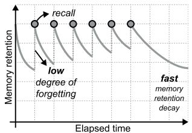  
(a) Short-term recall interval

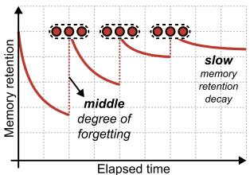  
(b) Optimal recall interval

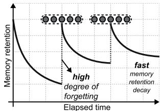  
(c) Long-term recall interval

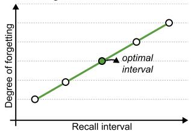  
(d) Degree of forgetting  
Figure 1. Conceptual graph of the forgetting curve. We show (a) short-term recall interval, (b) optimal recall interval, (c) longterm recall interval, and (d) degree of forgetting. (a-b) Expanding the recall interval improves long-term memory retention of neural networks by repeatedly recalling memory with moderate difficulty, whereas (c) an excessive recall interval decreases it. The depicted forgetting curve regarding recall interval is based on the spacing effect formula [6, 7] provided in the supplementary material.

Although this theory has been widely recognized in human brain research, it is currently very little known in the field of machine learning. Only a few works [1, 4, 48] show this theory’s potential in neural networks by utilizing it as an analysis toolkit or dynamic learning strategy. So, we investigate the impact of the forgetting curve theory on long-term memory retention in neural networks for continual learning.

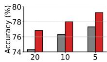  
(a) Step size

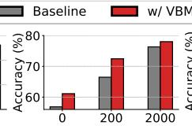  
(b) Buffer size

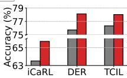

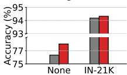  
(d) Pre-trained model

(c) Baseline method  
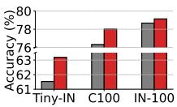  
(e) Benchmark

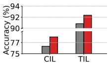  
(f) Protocol  
Figure 2. Overview of experimental results. We provide comprehensive comparisons of various factors for continual learning. We perform extensive experiments on step and buffer sizes (a-b), three different continual learning methods (c), whether to use the pre-trained model (d), three different benchmarks (e), and two evaluation protocols (f). In all cases, ours improves the baseline performance consistently.

In Ebbinghaus’ theory, we focus on the decay of memory retention in the forgetting curve as shown in Figure 1. The forgetting curve suggests that, as shown in Figure 1(a), the sample memory shows extreme knowledge decay when repeating its learning with a short time-space. On the other hand, as shown in Figure 1(c), if there is an excessive recall interval of repeated learning, too much memory is forgotten, leading to a decreased level of memory retention when relearning the same sample. However, as shown in Figure 1(b), when there is an optimal recall interval between repeated learning, the decay of memory retention also becomes gentle. This effect of the optimal recall interval implies that it is imperative to implement an appropriate learning schedule to retain memories efficiently in the repeated learning process. The notion behind this spacing effect can be usefully applied in continual learning, particularly to prevent catastrophic forgetting.

However, empirically, we found that the current methods for continual learning have a short recall interval [24, 32], so they are limited to profit from the spacing effect, which requires a sufficient recall interval.

To tackle this limitation, we introduce two approaches for training neural networks. Our first approach aims to prevent short recall intervals through the proposed replay method. We replay view-batch in the repeated training schedule so that short recall intervals can be delayed sufficiently. We augment multiple views from a single sample, and thus, the recall intervals of repeated learning can be adjusted. In our second approach, we make use of selfsupervised learning to compensate for the delayed recall interval by training each sample extensively. We leverage the one-to-many divergence to learn the generalized selfsupervised features within a view-batch, which enhances the capability of the networks. These two approaches ensure that the neural networks have enough time to retrain the same samples, and at the same time, they can acquire substantial knowledge from training samples at a time. We apply our view-batch model (VBM) to both rehearsal and rehearsal-free continual learning scenarios, where addressing long-term memory retention is critical. Moreover, we show extensive experimental results of various continual protocols and scenarios. As an overview, Figure 2 showcases the comprehensive comparison against different step sizes, memory buffer size, baseline methods, use of the pretrained model, benchmarks, and protocols. For all these comparisons, our view-batch model achieves significant performance improvements. We have condensed our contributions into the following points:

• We propose the view-batch model that optimizes the recall interval between retraining samples in order to enhance memory decay in the continual learning task. The proposed view-batch model includes replay and selfsupervised learning components to accomplish extensive learning in optimized intervals.

• We showcase the effectiveness of our approach on various state-of-the-art continual learning methods, where ours consistently improves the performance. The proposed method is a drop-in replacement approach, so it does not require any extra computational costs for the performance improvements.

• We reveal that enhancing memory decay can significantly improve the performance of the continual learning. This confirms the practical utility of theoretical knowledge for neural networks.

## 2. Related Work

## 2.1. Forgetting Curve Theory in Neural Networks

Several studies [25, 26] have employed the forgetting curve theory [18] to gain insights into the inherent memory retention of neural networks. Recently, Tirumala et al. [39] investigated the forgetting curve theory in neural networks regarding different model scales. Cao et al. [4] have also utilized the forgetting curve theory to examine the variations in memory conformation of the neural networks as influenced by pre-training methods. Additionally, Amiri et al. [1] proposed a dynamic learning scheduler to reduce total learning cost, leveraging optimal learning intervals corresponding to the forgetting curve. Zhong et al. [48] optimized memory retrieval timing based on the principles of the spacing effect theory, enabling the retention of the previous dialogue context existing over an extended duration.

## 2.2. Data Augmentation

Data augmentation [14, 45] has been widely used in various existing networks. It helps networks learn rich visual information using a limited number of training samples.

Data augmentation is also effective in self-supervised learning [5, 11]. Unlimited labels can be generated when different augmentation methods are applied to a single sample. Therefore, the network is able to learn with self-supervised labels of augmented samples. We use this augmentation method to construct multiple views in a view-batch and also learn self-supervision along with the supervised information of the continual learning process. There have been several studies [2, 22] on repeated augmentation, which allows learning multiple views from a single sample at a time. However, these studies only focused on improving the performance of the augmentation method and did not examine the effect of recall intervals. In addition, they do not apply self-supervised learning and only use label supervision to train networks.

## 2.3. Continual Learning

The main problem of continual learning is preserving old knowledge while acquiring new one. This problem has been recognized as catastrophic forgetting, and one common strategy used to address this problem is to make use of a memory buffer [32]. The approaches to this strategy can be divided into two categories: one involves the direct storage of a subset of training samples from a previously learned task [32, 33], while the other generates training samples from the learned task [37]. This approach of utilizing memory buffers proves to be highly effective in addressing the issue of catastrophic forgetting; however, it does come with the trade-off of requiring additional memory space. Consequently, non-rehearsal continual learning methods [15, 33] have been widely studied to avoid additional memory usage. In addition, studies [41, 42, 46] using pre-trained models in non-rehearsal continual learning have been actively conducted recently. Meanwhile, there have been several works [16, 29] that tackle continual learning from the perspective of the regularization method. The architecture-based method [35, 44] has been another prevalent research direction for addressing continual learning.

## 3. Method

We introduce a view-batch model designed to enhance the long-term memory retention of neural networks for continual learning (CL) tasks. In existing CL methods [24, 32, 44], the neural networks retrain the same samples with short time intervals, which prohibits long-term memory retention. To address this short recall interval, we first investigate the augmentation model with the replay method to ensure a sufficient recall interval in Sec. 3.1. Then, Sec. 3.2 introduces view-batch learning model to extensively train multiple samples of the same instance in view-batch.

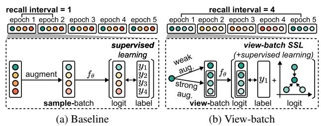  
Figure 3. Schematic illustration of the proposed view-batch model. In subfigure (b), we show our view-batch model employing the replay (V=4) and self-supervised learning approach. In contrast to (a) the baseline method, we learn multiple views of the same sample (marked as different shades) using the proposed view-batch self-supervised loss to learn it extensively and ensure enough time-space between recall intervals. For simplicity, we assume in (a) that the entire training data and batch size are the same as four, thus a single training epoch constitutes one batch.

## 3.1. Replay with Augmentation

Our view-batch model employs a replaying method with the augmentation to adjust the recall interval of retraining the same samples. In the conventional learning scheduler, a sample-batch is replayed in the training process of neural networks. It means a batch for training networks consists of multiple unique training samples. Therefore, the recall interval of retraining is the same as the number of training samples. However, the strategy on our learning scheduler alternates the replaying method at the view-batch level. We structure a view-batch to have multiple views of a single sample. Thus, the recall interval of a single sample increases with the size of view-batch. The concept of this view-batch model for the replay method is shown in Figure 3. It shows that when learning four samples in sequence, the time-space of re-training is four, whereas when learning V views of a single sample, the time-space is extended by V times.

Formally, we define samples as $I ,$ sample-batch as $B ^ { I } =$ $\{ I _ { i } \} _ { i = 1 } ^ { B }$ , the number of batches in a epoch as T, and learning scheduler as A. In the conventional learning algorithm, we replay each sample-batch to establish the scheduler.

$$
\begin{array} { r } { \mathcal { A } _ { \mathrm { c o n v e n t i o n a l } } = [ \underbrace { \mathcal { B } _ { 1 } ^ { I } , \cdot \cdot \cdot , \mathcal { B } _ { T } ^ { I } } _ { \mathrm { r e c a l l i n t e r v a l } = B \times T } \mathcal { B } _ { 1 } ^ { I } , \cdot \cdot \cdot , \mathcal { B } _ { T } ^ { I } ] . } \end{array}\tag{1}
$$

Therefore, the recall interval of retraining is the same as the number of training samples $B \times T$ in an epoch. However, to extend the recall interval, we replace the replaying unit from the sample-batch to the view-batch $B ^ { \nu } \stackrel { \cdot } { = } \stackrel { \cdot } { \{ \nu _ { i } \} } _ { i = 1 } ^ { B }$ We construct a view-batch by including multiple views of the same sample $\mathcal { V } _ { i } = \{ I _ { i } \} _ { i = 1 } ^ { \bar { V } }$ , where V denotes the number of views consisting of different augmentations of a single image. By modifying the replaying unit of Equation (1) with a constructed view-batch, we define our new learning

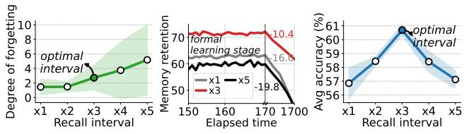

Algorithm 1 Pseudocode for our view-batch model.   
Require: dataset $\mathcal { D } ^ { \mathrm { t r a i n } } .$ , parameters $\theta ,$ learning rate $\gamma ,$ batch   
size $B ,$ view-batch size V   
1: Initialize network parameters θ   
2: Update $B  B / V$   
3: for number of training iterations do   
4: $\boldsymbol { B ^ { I } } = \{ I _ { i } \} _ { i = 1 } ^ { B }$ with $I _ { i } \stackrel { \mathrm { i . i . d . } } { \sim } D ^ { \mathrm { t r a i n } }$   
5: for $i = 1 , \cdots , B$ do   
6: ${ \mathcal { V } } _ { i } \gets \{ I _ { i } \} _ { j = 1 } ^ { V }$ ▷ replay ofEquation (2)   
7: $\mathcal { V } _ { i , 1 }  A _ { w } ( \mathcal { V } _ { i , 1 } )$   
8: $\mathcal { V } _ { i , 2 : }  A _ { s } ( \mathcal { V } _ { i , 2 : } )$   
9: $\bar { B } ^ { \nu }  \{ \mathcal { V } _ { i } \} _ { i = 1 } ^ { B }$   
10: Compute $l _ { \mathrm { s u p } } \doteq L _ { \mathrm { s u p } } ( \theta , B ^ { \nu } )$   
11: Compute $\hat { l _ { \mathrm { s s l } } } \dot { } \gets L _ { \mathrm { s s l } } \dot { } ( \theta , B ^ { \nu } )$ ▷ SSL ofEquation (3)   
12: Update $\theta  \theta - \gamma \nabla _ { \theta } ( l _ { \mathrm { s u p } } + l _ { \mathrm { s s l } } )$

scheduler as follows:

$$
\begin{array} { r } { \mathcal { A } _ { \mathrm { { o u r s } } } = [ \underbrace { \mathcal { B } _ { 1 } ^ { \mathcal { V } } , \cdot \cdot \cdot , \mathcal { B } _ { T } ^ { \mathcal { V } } } _ { \mathrm { r e c a l l ~ i n t e r v a l } = B \times T \times V } \mathcal { B } _ { 1 } ^ { \mathcal { V } } , \cdot \cdot \cdot , \mathcal { B } _ { T } ^ { \mathcal { V } } ] , } \end{array}\tag{2}
$$

Based on this rescheduling, the recall interval is increased by V times. While we process V views at a time, we decrease the total learning epoch by V , ensuring that the number of total samples that networks have seen during training is the same as the baseline method. As a result, networks repeatedly forget and retrain samples during extended recall intervals, thereby improving long-term memory retention. This learning of multiple views of a single sample adjusts the time-space while networks learn the same sample repeatedly. To promote extensive learning, we present the self-supervised learning in the following.

## 3.2. Self-supervised Learning

We present a self-supervised learning model with our VBM to extensively learn a sample at a time. It is well-known that self-supervision generalizes the networks rather than acquiring task-specific knowledge [5]. Further, task-agnostic knowledge from self-supervision is more robust to catastrophic forgetting of continual learning [8]. For these reasons, we propose the SSL approach to effectively learn view-batch in a (i) simple and an (ii) efficient manner. For (i) simplicity, unlike previous SSL methods [5, 11, 20], which require changes, such as architecture design [8] or teacher networks [12], we only modify an objective function to learn common knowledge within a view-batch of same samples. To satisfy (ii) efficiency, our method does not use an extra training phase or longer training epochs than supervised learning, ensuring the minimal training cost as analyzed in the supplementary material. Thus, the proposed method could be used in most continual learning methods without increasing computing costs as a drop-in replace-

Figure 4. Empirical findings related to forgetting curve theory. (a) We report the degree of forgetting for different recall intervals with a 95% confidence interval denoted as shaded region. The degree of forgetting is measured as the performance degradation of each sample’s classification accuracy between recall intervals. (b) We show the decay of memory retention as the learning progresses. This graph shows that when the formal learning stage is finished, memory retention decays over time for all three cases. (c) We compare the network’s classification accuracy of continual learning. It shows that x3 achieves the best performance thanks to the slow memory retention decay.

ment approach.

To implement our approach, we employ a one-to-many divergence loss to learn self-supervision within a viewbatch $\{ \gamma _ { i } \} _ { i = 1 } ^ { B }$ Our one-to-many divergence loss minimizes the average divergence between one weak-augmented view $A _ { w } ( \nu _ { i , 1 } )$ and the remaining strong-augmented views $A _ { s } ( \gamma _ { i , 2 : } )$ of a view-batch at the logit level. By aggregating different augmented views closer, networks learn common characteristics of objects. Specifically, leveraging KL divergence $D _ { \mathrm { K I } }$ between different augmentations, we define one-to-many-based self-supervised loss as

$$
L _ { \mathrm { s s l } } ( f _ { \theta } , \mathcal { B } ^ { \mathcal { V } } ) = \frac { 1 } { B \cdot ( V - 1 ) } \sum _ { i = 1 } ^ { B } \sum _ { j = 2 } ^ { V } D _ { \mathrm { K L } } ( p _ { i } ^ { 1 } | | p _ { i } ^ { j } ) ,\tag{3}
$$

where $p _ { i } ^ { 1 }$ and $p _ { i } ^ { j }$ represent network’s prediction for weak augmented samples $\sigma ( f _ { \theta } ( A _ { w } ( \mathcal { V } _ { i , 1 } ) ) )$ ) and strong augmented samples $\sigma ( f _ { \theta } ( A _ { s } ( \mathcal { V } _ { i , j } ) ) )$ , fθ is neural networks, and σ stand for the softmax. Finally, as shown in Algorithm 1, we define our final objective function as

$$
\begin{array} { r } { \operatorname* { m i n } _ { f _ { \theta } } L _ { \mathrm { s u p } } ( f _ { \theta } , \mathcal { B } ^ { \mathcal { V } } ) + L _ { \mathrm { s s l } } ( f _ { \theta } , \mathcal { B } ^ { \mathcal { V } } ) , } \end{array}\tag{4}
$$

where $\begin{array} { r } { L _ { \operatorname* { s u p } } ( f _ { \theta } , \mathcal { B } ^ { \mathcal { V } } ) = \frac { 1 } { B \cdot V } \sum _ { i = 1 } ^ { B } \sum _ { j = 1 } ^ { V } \mathcal { H } ( y _ { i } , p _ { i } ^ { j } ) } \end{array}$ of each view’s prediction $p _ { i } ^ { j }$ and its label yi using cross-entropy loss H. We select widely used auto-augmentation [13] as a strong augmentation method, which slightly affects the performance of the baseline method as shown in Tab. 6, while using horizontal flip as weak augmentation.

## 3.3. Empirical Evidence

This subsection empirically confirms our assumption that optimal recall interval improves memory retention, and accordingly, the performance of the continual method is enhanced. Specifically, the logical development of our assumption is that 1) if the network sufficiently forgets a sample at the optimal recall interval and then extensively retrains it, 2) memory retention is enhanced as training progresses, and therefore, 3) the accuracy of continual learning is also improved. To evaluate our assumption, we measure 1) the degree of forgetting between a retraining session for training samples, 2) the decay speed of the memory retention, and 3) the average accuracy at which networks correctly classify their class labels. Figure 4 shows the results for the empirical evidence of our assumption. As depicted in Figure 4(a), the degree of forgetting becomes larger as the recall interval increases. It is obvious that the longer recall interval allows the network to forget a training sample before retraining it again. Figure 4(b) demonstrates the different levels of memory retention decay due to the recall intervals. The experiment results show that memory decays slowest in the x3 case, which has an interval three times longer than the baseline x1 case. Notably, our method achieves considerably higher performance at the end of the formal learning stage. This result is attributed to the fact that multiple epochs are used in training networks, and the memory retention decay between epochs is slow for the x3 case. Accordingly, x3 with our replay method achieves improved accuracy compared to other recall interval cases, as shown in Figure 4(c). We conduct more experiments to show empirical proofs on different datasets, backbone networks, and buffer sizes in Figure 6. The definition of forgetting is given in the supplementary material.

<table><tr><td rowspan="2">Buffer</td><td rowspan="2">Method</td><td colspan="4">S-CIFAR-10</td><td colspan="4">S-Tiny-ImageNet</td></tr><tr><td>CIL</td><td>TIL</td><td>Avg*</td><td>∆</td><td>CIL</td><td>TIL</td><td>Avg*</td><td>Δ</td></tr><tr><td></td><td>Joint</td><td>92.20±0.15</td><td>98.31±0.12</td><td>95.26</td><td></td><td>59.99±0.19</td><td>82.04±0.10</td><td>71.02</td><td></td></tr><tr><td rowspan="2">0</td><td>LwF</td><td></td><td>61.98±0.98</td><td>61.98</td><td></td><td></td><td>15.26±0.71</td><td>15.26</td><td></td></tr><tr><td>VBM-LwF</td><td>=</td><td>77.53±3.06</td><td>77.53</td><td>+15.55</td><td>=</td><td>51.21±0.34</td><td>51.21</td><td>+35.95</td></tr><tr><td rowspan="8">200</td><td>DER</td><td>56.58±2.08</td><td>89.32±1.32</td><td>72.95</td><td></td><td>11.56±0.58</td><td>41.67±0.63</td><td>26.62</td><td></td></tr><tr><td>ER</td><td>50.27±0.70</td><td>91.66±0.79</td><td>70.97</td><td></td><td>8.67±0.23</td><td>38.03±0.79</td><td>23.35</td><td></td></tr><tr><td>VBM-ER</td><td>52.56±1.59</td><td>93.58±0.23</td><td>73.07</td><td>+2.10</td><td>8.83±0.13</td><td>44.03±1.12</td><td>26.43</td><td>+3.08</td></tr><tr><td>iCaRL</td><td>64.11±1.86</td><td>90.20±0.88</td><td>77.16</td><td></td><td>19.09±0.13</td><td>53.07±0.27</td><td>36.08</td><td></td></tr><tr><td>VBM-iCaRL</td><td>69.73±0.87</td><td>92.76±0.45</td><td>81.25</td><td>+4.09</td><td>21.39±0.18</td><td>56.31±0.42</td><td>38.85</td><td>+2.77</td></tr><tr><td>DER++</td><td>61.67±1.02</td><td>90.61±1.13</td><td>76.14</td><td></td><td>12.48±1.60</td><td>41.19±0.48</td><td>26.84</td><td></td></tr><tr><td>VBM-DER++</td><td>66.99±2.98</td><td>94.30±0.21</td><td>80.65</td><td>+4.51</td><td>13.67±0.41</td><td>44.36±0.88</td><td>29.02</td><td>+2.18</td></tr><tr><td>DER</td><td>65.93±5.38</td><td>92.52±0.68</td><td>79.23</td><td></td><td>18.04±1.30</td><td>52.90±0.91</td><td>35.47</td><td></td></tr><tr><td rowspan="7">500</td><td>ER</td><td>56.37±0.96</td><td>94.15±0.04</td><td>75.26</td><td></td><td>10.20±0.37</td><td>49.13±0.31</td><td>29.67</td><td></td></tr><tr><td>VBM-ER</td><td>63.39±2.77</td><td>94.20±0.25</td><td>78.80</td><td>+3.54</td><td>11.21±0.30</td><td>52.01±0.71</td><td>31.61</td><td>+1.94</td></tr><tr><td>iCaRL</td><td>62.22±3.45</td><td>88.86±3.23</td><td>75.54</td><td></td><td>23.93±0.97</td><td>58.89±0.85</td><td>41.41</td><td></td></tr><tr><td>VBM-iCaRL</td><td>68.97±0.38</td><td>93.10±0.66</td><td>81.04</td><td>+5.50</td><td>26.89±0.54</td><td>62.61±0.17</td><td>44.75</td><td>+3.34</td></tr><tr><td>DER++</td><td>69.94±2.04</td><td>93.49±0.26</td><td>81.72</td><td></td><td>19.39±1.09</td><td>51.71±0.35</td><td>35.55</td><td></td></tr><tr><td>VBM-DER++</td><td>75.22±0.81</td><td>94.81±0.39</td><td>85.02</td><td>+3.30</td><td>19.46±0.46</td><td>49.80±0.80</td><td>34.63</td><td>-0.92</td></tr><tr><td>DER</td><td>80.79±0.75</td><td>94.46±0.30</td><td>87.63</td><td></td><td>32.92±3.09</td><td>64.77±2.14</td><td>48.85</td><td></td></tr><tr><td rowspan="7">5120</td><td>ER</td><td>74.23±4.18</td><td>96.86±0.28</td><td>85.55</td><td></td><td>28.07±0.37</td><td>67.58±0.30</td><td>47.83</td><td></td></tr><tr><td>VBM-ER</td><td>79.29±2.29</td><td>97.02±0.13</td><td>88.16</td><td>+2.61</td><td>33.07±0.36</td><td>68.91±0.50</td><td>50.99</td><td>+3.16</td></tr><tr><td></td><td>78.49±0.38</td><td>94.84±0.82</td><td>86.67</td><td></td><td>32.16±0.24</td><td>66.75±0.36</td><td></td><td></td></tr><tr><td>iCaRL</td><td>79.40±0.63</td><td>96.09±0.32</td><td>87.75</td><td>+1.08</td><td>34.40±0.12</td><td>68.86±0.26</td><td>49.46 51.63</td><td>+2.17</td></tr><tr><td>VBM-iCaRL DER++</td><td>85.42±0.74</td><td>96.24±0.19</td><td>90.83</td><td></td><td>34.06±0.57</td><td>65.28±1.20</td><td>49.67</td><td></td></tr><tr><td>VBM-DER++</td><td>86.62±0.38</td><td>97.07±0.07</td><td>91.85</td><td>+1.02</td><td>35.14±0.36</td><td>67.52±0.48</td><td>51.33</td><td>+1.66</td></tr><tr><td></td><td></td><td></td><td></td><td></td><td></td><td></td><td></td><td></td></tr></table>

Table 1. Experimental results on CIL and TIL protocols. In this evaluation, we report the last top-1 accuracy (%) on the S-CIFAR-10 and S-Tiny-ImageNet benchmarks with four different buffer sizes. ResNet-18 backbone is used for each continual learning method in this evaluation. \*Avg is the averaged accuracy of CIL and TIL. We reproduce baseline methods following Buzzega et al. [3]. We run every method three times with different random seeds for a reliable result. Ours improves performance consistently in most results. The performance of Joint is the upper bound of this experiment, where all old training samples are used in every step.

<table><tr><td>Method</td><td>Avg</td><td>∆</td><td>Last</td><td>∆</td></tr><tr><td>Joint</td><td>=</td><td></td><td>46.48±3.62</td><td></td></tr><tr><td>AGEM</td><td>24.88±0.57</td><td></td><td>28.94±0.67</td><td></td></tr><tr><td>AGEM-R</td><td>24.72±0.59</td><td></td><td>28.01±0.93</td><td></td></tr><tr><td>FDR</td><td>34.62±0.33</td><td></td><td>34.46±0.32</td><td></td></tr><tr><td>DER</td><td>39.84±0.15</td><td></td><td>40.46±0.47</td><td></td></tr><tr><td>ER</td><td>32.38±2.88</td><td></td><td>32.02±2.39</td><td></td></tr><tr><td>VBM-ER</td><td>35.80±0.55</td><td>+3.42</td><td>34.72±0.37</td><td>+2.70</td></tr><tr><td>DER++</td><td>34.56±3.42</td><td></td><td>34.75±2.41</td><td></td></tr><tr><td>VBM-DER++</td><td>42.16±0.20</td><td>+7.24</td><td>41.81±0.08</td><td>+7.06</td></tr></table>

Table 2. Experimental results on DIL protocol. This evaluation shows Avg and Last top-1 accuracy (%) on the DomainNet benchmark. We utilize ResNet-18 as the backbone network in this evaluation.

<table><tr><td rowspan="2">Method</td><td colspan="3">5 Step</td><td colspan="3">10 Step</td><td colspan="4"></td></tr><tr><td>Avg</td><td>∆ Last</td><td></td><td>Avg</td><td>∆</td><td>Last</td><td>∆</td><td>Avg</td><td>Last</td><td>Δ</td></tr><tr><td>Joint</td><td>80.40</td><td>=</td><td></td><td>80.41</td><td></td><td></td><td>81.49</td><td></td><td></td><td></td></tr><tr><td>iCaRL</td><td>71.14±0.34</td><td>59.71</td><td></td><td>65.27±1.02</td><td></td><td>50.74</td><td></td><td>61.20±0.83</td><td>43.75</td><td></td></tr><tr><td>UCIR</td><td>62.77±0.82</td><td>47.31</td><td></td><td>58.66±0.71</td><td></td><td>43.39</td><td></td><td>58.17±0.30</td><td>40.63</td><td></td></tr><tr><td>BiC</td><td>73.10±0.55</td><td>62.10</td><td></td><td>68.80±1.20</td><td></td><td>53.54</td><td></td><td>66.48±0.32</td><td>47.02</td><td></td></tr><tr><td>WA</td><td>72.81±0.28</td><td>60.84</td><td></td><td>69.46±0.29</td><td></td><td>53.78</td><td></td><td>67.33±0.15</td><td>47.31</td><td></td></tr><tr><td>DyTox</td><td></td><td></td><td></td><td>73.66±0.02</td><td></td><td>60.67</td><td></td><td>72.27±0.18</td><td>56.32</td><td></td></tr><tr><td>DER</td><td>76.77±0.01</td><td></td><td>68.06±0.00</td><td>75.72±0.08</td><td></td><td>64.32±0.05</td><td></td><td>74.96±0.01</td><td>61.80±0.07</td><td></td></tr><tr><td>VBM-DER</td><td>78.60±0.23</td><td>+1.83</td><td>70.60±0.12 +2.54</td><td>78.12±0.07</td><td>+2.40</td><td>67.04±0.11</td><td>+2.72</td><td>76.95±0.02 +1.99</td><td>64.29±0.04</td><td>+2.49</td></tr><tr><td>TCIL</td><td>77.33±0.08</td><td></td><td>69.48±0.14</td><td>76.33±0.15</td><td></td><td>65.66±0.02</td><td></td><td>74.32±0.01</td><td>62.54±0.02</td><td></td></tr><tr><td>VBM-TCIL</td><td>79.23±0.01</td><td>+1.90</td><td>71.23±0.04</td><td>+1.75 78.02±0.03</td><td>+1.69</td><td>68.14±0.08</td><td>+2.48</td><td>76.83±0.00 +2.51</td><td>67.16±0.09</td><td>+4.62</td></tr></table>

Table 3. Experimental results on rehearsal-based CIL protocol. In this evaluation, we provide Avg and Last top-1 accuracy (%) on the S-CIFAR-100 benchmark with three different class incremental steps. ResNet-18 backbone is utilized to evaluate each rehearsal-based method. This evaluation also shows that ours achieves consistent performance improvements. Results of DyTox are imported from its original work [17]. We reproduce results of DER and TCIL using official implementation, while other results come from Yan et al. [44].

<table><tr><td rowspan="2">Method</td><td colspan="3">5 Step</td><td colspan="3">10 Step</td></tr><tr><td>Avg</td><td>∆ Last</td><td>∆</td><td>Avg</td><td>∆</td><td>Last ∆</td></tr><tr><td>Joint</td><td>80.40</td><td></td><td></td><td>80.41</td><td></td><td></td></tr><tr><td>LwF-MC</td><td>32.89</td><td>11.42</td><td></td><td>20.71</td><td>6.36</td><td></td></tr><tr><td>BiC</td><td>54.74</td><td>35.42</td><td></td><td>45.08</td><td>24.42</td><td></td></tr><tr><td>LwM</td><td>39.31</td><td>16.70</td><td></td><td>25.47</td><td>8.57</td><td></td></tr><tr><td>WA</td><td>63.67</td><td>49.36</td><td></td><td>45.68</td><td>26.14</td><td></td></tr><tr><td>DER</td><td>40.05±0.00</td><td>17.11±0.00</td><td></td><td>26.67±0.00</td><td>8.71±0.00</td><td></td></tr><tr><td>VBM-DER 40.47±0.00+0.4217.47±0.01 +0.3626.95±0.00+0.28 8.90±0.00 +0.19</td><td></td><td></td><td></td><td></td><td></td><td></td></tr><tr><td>TCIL</td><td>64.40±0.15</td><td>52.37±0.08</td><td></td><td>56.84±0.75</td><td></td><td>40.31±1.04</td></tr><tr><td>VBM-TCIL 66.40±0.07+2.0054.69±0.02+2.3261.12±0.02 +4.2845.92±0.25 +5.61</td><td></td><td></td><td></td><td></td><td></td><td></td></tr></table>

Table 4. Experimental results on non-rehearsal-based CIL protocol. For this evaluation, we measure Avg and Last top-1 accuracy (%) on the S-CIFAR-100 benchmark with two different class incremental steps. ResNet-18 backbone is applied to existing and our methods. We report original results from LwF-MC and LwM [15]. We reproduce the results of DER and TCIL by ourselves using official implementation. Other results are reported from Huang et al. [24].

## 4. Experiments

This section demonstrates the capabilities of the proposed view-batch model in various continual learning protocols and scenarios through extensive performance evaluation. We perform experiments for three continual learning protocols, such as class, task, and domain incremental learning. Further, we also assess our view-batch model in both rehearsal and non-rehearsal, as well as under the pre-trainingbased continual learning scenarios.

## 4.1. Experimental Settings

Datasets. We evaluate our methods on widely used benchmarks such as S-CIFAR-10/100, S-Tiny-ImageNet, S-ImageNet-R, and DomainNet where the prefix of ‘S-’ denotes the sequential data configuration. We use the commonly adopted class ordering lists, following existing works of Yan et al. [44] and Huang et al. [24].

Protocols. In our experiments, we utilize three continual learning protocols. First, we make use of task incremental learning (TIL), which involves training neural networks on a series of tasks in a sequential manner while evaluating their performance on both newly acquired and previously learned tasks. Specifically, the TIL protocol consists of the following detailed configurations: 1) a task is defined by a set of label classes, and 2) we evaluate networks knowing the task identity of test samples. Second, we adopt class incremental learning (CIL), which is identical to TIL except that it evaluates test samples without knowing their task identity. Third, we use domain incremental learning (DIL), which focuses on learning the new samples across multiple sequential domains rather than acquiring new classes. In addition to these three protocols, we also include both rehearsal and non-rehearsal scenarios, divided by the use of a memory buffer during continual learning. For the non-rehearsal scenario, we evaluate both scratch- and pre-training-based learning scenarios to showcase extensive experimental results. For all these protocols and scenarios, we provide the mean and standard deviation of three runs for reliable experimental results. The details of the experiment can be found in the supplementary material.

Baseline Methods. We apply our view-batch to recent baseline continual learning methods such as iCaRL [32], ER [34], DER [3, 44], TCIL [24], and SLCA [46]. We also include results from A-GEM [10], LwM [15], UCIR [23], BiC [43], WA [47], DyTox [17], L2P [42], S-iPrompt [40], DualPrompt [41], and CODA-Prompt [38]. We follow the baseline’s hyper-parameters for a fair comparison between ours and its respective baseline methods. Specifically, we use ResNet and Vision Transformer (ViT) as backbone networks in traditional and prompt-based approaches. For the traditional approach, we randomly initialize backbone weights at the beginning of every run. On the other hand, for the prompt-based approach, we adopt a frozen backbone whose weights are pre-trained on a large-scale dataset following recent prompt-based CL studies [42, 46]

<table><tr><td></td><td colspan="4">S-CIFAR-100</td><td colspan="4">S-ImageNet-R</td></tr><tr><td rowspan="2">Method</td><td colspan="2">Top-1</td><td colspan="2">Top-5</td><td colspan="2">Top-1</td><td colspan="2">Top-5</td></tr><tr><td>Avg</td><td>Last</td><td>Avg</td><td>Last</td><td>Avg</td><td>Last</td><td>Avg</td><td>Last</td></tr><tr><td>Joint</td><td></td><td>92.54±0.14</td><td></td><td>99.24±0.02</td><td></td><td>82.41±0.02</td><td></td><td>93.27±0.07</td></tr><tr><td>L2P</td><td>90.42±0.56</td><td>83.76±0.42</td><td>98.89±0.03</td><td>98.08±0.15</td><td>76.76±0.33</td><td>73.56±0.42</td><td>89.39±0.16</td><td>86.61±0.03</td></tr><tr><td>DualPrompt</td><td>90.17±0.38</td><td>85.10±0.23</td><td>98.90±0.07</td><td>97.68±0.12</td><td>73.31±0.19</td><td>69.12±0.18</td><td>89.19±0.09</td><td>85.46±0.04</td></tr><tr><td>CODA-Prompt</td><td>91.27±0.66</td><td>86.86±0.58</td><td>99.29±0.09</td><td>98.64±0.07</td><td>81.89±0.59</td><td>76.79±0.17</td><td>93.30±0.34</td><td>90.49±0.15</td></tr><tr><td>S-iPrompt</td><td>92.19±0.40</td><td>88.43±0.42</td><td>99.19±0.05</td><td>98.63±0.05</td><td>71.47±0.14</td><td>68.77±0.27</td><td>88.44±0.19</td><td>84.91±0.31</td></tr><tr><td>SLCA</td><td>94.31±1.12</td><td>91.57±0.46</td><td>99.64±0.04</td><td>99.26±0.03</td><td>83.58±0.65</td><td>78.81±0.21</td><td>94.39±0.26</td><td>92.02±0.25</td></tr><tr><td>VBM-SLCA</td><td>94.52±0.85</td><td>91.78±0.18</td><td>99.64±0.03</td><td>99.29±0.03</td><td>84.61±0.59</td><td>80.07±0.12</td><td>94.86±0.19</td><td>92.74±0.14</td></tr></table>

Table 5. Experimental results on pre-trained model-based CIL protocol. This evaluation presents Avg and Last top-1,5 accuracy (%) on the S-CIFAR-100 and S-ImageNet-R benchmarks without using a memory buffer. ViT-B/16 backbone is adopted for each pre-trained model-based method. We reproduce baseline methods using official implementation by ourselves, except for L2P.

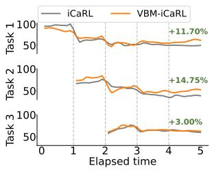  
(a) iCaRL

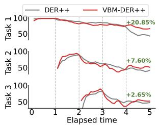  
(b) DER++

Figure 5. Experimental results on memory retention decay. This analysis reports memory retention decay of the first three tasks on the S-CIFAR-10 dataset, comparing the proposed approach against the baseline methods. The green numbers at the end of the last task are the accuracy gain of the proposed approach over the baselines.  
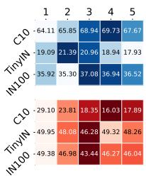  
(a) Dataset

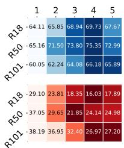  
(b) Network

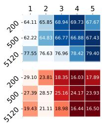  
(c) Buffer  
Figure 6. Experimental results on recall interval. We measure the last top-1 accuracy (%) (↑) in the top row and report forgetting (↓) at the bottom row, varying recall intervals with different learning factors. Dark colors mean better. We use the ResNet-18 backbone.

<table><tr><td>Method</td><td>Replay</td><td>Strong augment</td><td>SSL</td><td>CIL</td><td>TIL</td><td>Avg</td><td>∆</td></tr><tr><td rowspan="5">iCaRL</td><td></td><td>=</td><td></td><td>64.11</td><td>90.20</td><td>77.16</td><td></td></tr><tr><td>=</td><td>√</td><td></td><td>62.04</td><td>90.17</td><td>76.11</td><td>-1.05</td></tr><tr><td>√</td><td>=</td><td></td><td>67.51</td><td>91.87</td><td>79.69</td><td>+2.53</td></tr><tr><td>√</td><td>√</td><td>=</td><td>66.78</td><td>91.21</td><td>78.99</td><td>+1.83</td></tr><tr><td>√</td><td>√</td><td>L</td><td>69.73</td><td>92.76</td><td>81.25</td><td>+4.09</td></tr><tr><td rowspan="5">DER++</td><td>=</td><td>=</td><td></td><td>61.67</td><td>90.61</td><td>76.14</td><td></td></tr><tr><td>=</td><td>√</td><td></td><td>62.66</td><td>91.14</td><td>76.90</td><td>+0.76</td></tr><tr><td>√</td><td>=</td><td></td><td>64.75</td><td>92.79</td><td>78.77</td><td>+2.63</td></tr><tr><td>√</td><td>√</td><td>=</td><td>64.44</td><td>93.38</td><td>78.91</td><td>+2.77</td></tr><tr><td>√</td><td>√</td><td>√</td><td>66.99</td><td>94.30</td><td>80.65</td><td>+4.51</td></tr></table>

Table 6. Experimental results on factor analysis. We demonstrate the last accuracy (%) of CIL and TIL on S-CIFAR-10, vary ing our main components with different augmentation types. We observe that the proposed components, such as replay and SSL, improve performance consistently and confirm that performance enhancement comes from them, not simply from strong augmentation. In the strong augmentation setting without view batch replay, we maintain the same ratio of weak to strong augmentations.

## 4.2. Experimental Results

Continual Learning under Three Protocols. We evaluate our method in the three continual learning protocols such as CIL, TIL, and DIL. For TIL and CIL, we use different memory buffer sizes: 0, 200, 500, and 5,120. For DIL, we utilize 50 samples per class, resulting in 17,250 samples in a buffer. We apply our view-batch model to LwF for the non-rehearsal memory buffer (i.e. 0 size) and ER, DER++, and iCaRL for the other buffer sizes. Tabs. 1 and 2 show that our method improves the performance of continual learning methods for all protocols. Moreover, we demonstrate that baseline methods employing our view-batch are comparable to other continual learning methods.

We conduct further in-depth experiments under the most widely used CIL protocol. We consider three configurations with step sizes of 5, 10, and 20, which are the number of total incremental steps, as shown in Tab. 3. In addition, we take into account the use of a memory buffer in two scenarios, such as rehearsal and non-rehearsal in Tab. 4. Both experimental results demonstrate that our view-batch model consistently improves the performance of continual learning methods under the various step sizes and memory buffer configurations.

<table><tr><td>Method</td><td>Current sample</td><td>Buffer sample</td><td>CIL</td><td>TIL</td><td>Avg</td><td>∆</td></tr><tr><td rowspan="4">iCaRL</td><td>=</td><td>=</td><td>64.11</td><td>90.20</td><td>77.16</td><td></td></tr><tr><td>√</td><td>=</td><td>64.64</td><td>94.12</td><td>79.38</td><td>+2.22</td></tr><tr><td>=</td><td>√</td><td>64.99</td><td>94.20</td><td>79.60</td><td>+2.44</td></tr><tr><td>√</td><td>√</td><td>69.73</td><td>92.76</td><td>81.25</td><td>+4.09</td></tr><tr><td rowspan="4">DER++</td><td>=</td><td>I</td><td>61.67</td><td>90.61</td><td>76.14</td><td></td></tr><tr><td>√</td><td>=</td><td>64.88</td><td>93.22</td><td>79.05</td><td>+2.91</td></tr><tr><td>=</td><td>√</td><td>62.69</td><td>94.15</td><td>78.42</td><td>+2.28</td></tr><tr><td>√</td><td>√</td><td>66.99</td><td>94.30</td><td>80.65</td><td>+4.51</td></tr></table>

Table 7. Experimental results on sample type. We measure the last accuracy (%) of CIL and TIL on S-CIFAR-10, applying our method to different sample types. We use the ResNet-18 as backbone. This analysis shows that our method works well with both sample types.

Non-rehearsal Continual Learning. While the nonrehearsal scenario has the advantage of not using memory buffers, they inherently face the drawback of limited performance due to the inability to retrain networks using old data in the memory buffer. To overcome this limitation, many recent studies have focused on non-rehearsal continual learning using a pre-trained model trained with a largescale dataset. Thus, we evaluate our view-batch model in a scenario where models are pre-trained, such as SCLA. Experimental results in Tab. 5 indicate that the proposed viewbatch model is effective across all benchmarks for this scenario.

## 5. Analysis

We present the analysis of the proposed view-batch model. First, we validate that the optimal recall interval mitigates catastrophic forgetting of early tasks. Figure 5 visualize that the recall interval x3 maintains long-term memory retention resolving catastrophic forgetting of initial tasks. Also, Figure 6 analyzes how different factors (i.e., dataset, network scales, memory buffer size) affect the optimal recall intervals in terms of last top-1 accuracy and forgetting metrics [9, 10, 42]. We find that the recall interval x3 or x4 improves the accuracy and resolves catastrophic forgetting in various scenarios. More experimental results of different methods and task types can be found in the supplementary material. Tab. 6 shows that two main factors of the proposed method consistently improve their respective baselines, identifying that the performance improvement comes from the proposed components, not strong augmentation.

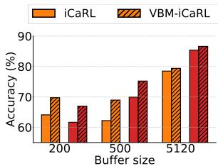  
(a) Accuracy (↑)

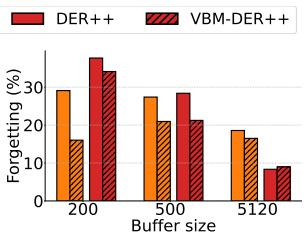  
(b) Forgetting (↓)  
Figure 7. Experimental results on accuracy and forgetting. This analysis shows (a) the last top-1 accuracy (%) and (b) corresponding forgetting measures on the S-CIFAR-10 dataset with different buffer sizes. Our method consistently improves accuracy and forgetting measures.

Lastly, in the rehearsal scenario, we have two different sample types, current- and buffer-based samples. Tab. 7 exhibit that ours performs well with both types.

We examine the proposed method in terms of the last accuracy and forgetting measurement. We apply the proposed method to two different baseline approaches. We compute average forgetting at Tth task as $\begin{array} { r } { \frac { 1 } { T - 1 } \sum _ { t = 1 } ^ { T - 1 } \operatorname* { m a x } _ { j \in \{ t , \cdots , T - 1 \} } \bar { a _ { j } ^ { t } } - \bar { a _ { T } ^ { t } } } \end{array}$ where $a _ { j } ^ { t }$ means tth task accuracy at j step. Notably, higher forgetting means severe catastrophic forgetting of previous tasks. Figure 7 shows that the view-batch model improves accuracy while addressing the forgetting problem simultaneously.

## 6. Conclusion

We propose the view-batch model, which is generally applicable to various continual learning scenarios. Inspired by Ebbinghaus’s forgetting curve theory, the proposed view-batch model optimizes the recall interval between retraining samples, improving neural networks’ long-term memory. The proposed method consists of two main components: replay and self-supervised learning. The replay optimizes the recall interval for guaranteeing sufficient memory forgetting by grouping multiple views of a sample. Also, the self-supervised learning ensures extensive learning for the multiple views using the one-to-many divergence loss. Experimental results show that sufficient forgetting preserves long-term memory and ultimately improves continual learning accuracy. We hope the proposed approach to continual learning can boost future research.

Acknowledgment. This paper was supported in part by the ETRI Grant funded by Korean Government (Fundamental Technology Research for Human-Centric Autonomous Intelligent Systems) under Grant 24ZB1200, Artificial Intelligence Convergence Innovation Human Resources Development (IITP-2025-RS-2023-00255968), Artificial Intelligence Innovation Hub (RS-2021-II212068), and the NRF Grant (RS-2024-00356486).

## References

[1] Hadi Amiri, Timothy Miller, and Guergana Savova. Repeat before forgetting: Spaced repetition for efficient and effective training of neural networks. In Conference on Empirical Methods in Natural Language Processing, 2017. 1, 2

[2] Maxim Berman, Herve J´ egou, Andrea Vedaldi, Iasonas´ Kokkinos, and Matthijs Douze. Multigrain: a unified image embedding for classes and instances. arXiv:1902.05509, 2019. 3

[3] Pietro Buzzega, Matteo Boschini, Angelo Porrello, Davide Abati, and Simone Calderara. Dark experience for general continual learning: a strong, simple baseline. Advances in Neural Information Processing Systems, 2020. 5, 6

[4] Boxi Cao, Qiaoyu Tang, Hongyu Lin, Shanshan Jiang, Bin Dong, Xianpei Han, Jiawei Chen, Tianshu Wang, and Le Sun. Retentive or forgetful? diving into the knowledge memorizing mechanism of language models. In Joint International Conference on Computational Linguistics, Language Resources and Evaluation, 2024. 1, 2

[5] Mathilde Caron, Hugo Touvron, Ishan Misra, Herve J´ egou,´ Julien Mairal, Piotr Bojanowski, and Armand Joulin. Emerging properties in self-supervised vision transformers. In International Conference on Computer Vision, 2021. 3, 4

[6] Nicholas J Cepeda, Harold Pashler, Edward Vul, John T Wixted, and Doug Rohrer. Distributed practice in verbal recall tasks: A review and quantitative synthesis. Psychological bulletin, 2006. 1

[7] Nicholas J Cepeda, Edward Vul, Doug Rohrer, John T Wixted, and Harold Pashler. Spacing effects in learning: A temporal ridgeline of optimal retention. Psychological science, 2008. 1

[8] Hyuntak Cha, Jaeho Lee, and Jinwoo Shin. Co2l: Contrastive continual learning. In International Conference on Computer Vision, 2021. 4

[9] Arslan Chaudhry, Puneet K Dokania, Thalaiyasingam Ajanthan, and Philip HS Torr. Riemannian walk for incremental learning: Understanding forgetting and intransigence. In European Conference on Computer Vision, 2018. 8

[10] Arslan Chaudhry, Marc’Aurelio Ranzato, Marcus Rohrbach, and Mohamed Elhoseiny. Efficient lifelong learning with agem. In International Conference on Learning Representations, 2019. 6, 8

[11] Ting Chen, Simon Kornblith, Mohammad Norouzi, and Geoffrey Hinton. A simple framework for contrastive learning of visual representations. In International Conference on Machine Learning, 2020. 3, 4

[12] Haoyang Cheng, Haitao Wen, Heqian Qiu, Lanxiao Wang, Minjian Zhang, and Hongliang Li. Must unsupervised con tinual learning relies on previous information? In Conference on Computer Vision and Pattern Recognition, 2024. 4

[13] Ekin D Cubuk, Barret Zoph, Dandelion Mane, Vijay Vasudevan, and Quoc V Le. Autoaugment: Learning augmentation policies from data. arXiv:1805.09501, 2018. 4

[14] Ekin D Cubuk, Barret Zoph, Jonathon Shlens, and Quoc V Le. Randaugment: Practical automated data augmentation with a reduced search space. In Conference on Computer Vision and Pattern Recognition Workshops, 2020. 2

[15] Prithviraj Dhar, Rajat Vikram Singh, Kuan-Chuan Peng, Ziyan Wu, and Rama Chellappa. Learning without memoriz ing. In Conference on Computer Vision and Pattern Recog nition, 2019. 3, 6

[16] Arthur Douillard, Matthieu Cord, Charles Ollion, Thomas Robert, and Eduardo Valle. Podnet: Pooled outputs distilla tion for small-tasks incremental learning. In European Con ference on Computer Vision, 2020. 3

[17] Arthur Douillard, Alexandre Rame, Guillaume Couairon,´ and Matthieu Cord. Dytox: Transformers for continual learn ing with dynamic token expansion. In Conference on Computer Vision and Pattern Recognition, 2022. 6

[18] Hermann Ebbinghaus. Memory: A contribution to experi mental psychology. Annals ofneurosciences, 2013. 1, 2

[19] Kate Gordon. Class results with spaced and unspaced mem orizing. Journal of Experimental Psychology, 1925. 1

[20] Jean-Bastien Grill, Florian Strub, Florent Altche, Corentin´ Tallec, Pierre Richemond, Elena Buchatskaya, Carl Doersch, Bernardo Avila Pires, Zhaohan Guo, Mohammad Ghesh laghi Azar, et al. Bootstrap your own latent-a new approach to self-supervised learning. Advances in Neural Information Processing Systems, 2020. 4

[21] Karri S Hawley, Katie E Cherry, Emily O Boudreaux, and Erin M Jackson. A comparison of adjusted spaced retrieval versus a uniform expanded retrieval schedule for learning a name–face association in older adults with probable alzheimer’s disease. Journal of Clinical and Experimental Neuropsychology, 2008. 1

[22] Elad Hoffer, Tal Ben-Nun, Itay Hubara, Niv Giladi, Torsten Hoefler, and Daniel Soudry. Augment your batch: better training with larger batches. arXiv:1901.09335, 2019. 3

[23] Saihui Hou, Xinyu Pan, Chen Change Loy, Zilei Wang, and Dahua Lin. Learning a unified classifier incrementally via rebalancing. In Conference on Computer Vision and Pattern Recognition, 2019. 6

[24] Bingchen Huang, Zhineng Chen, Peng Zhou, Jiayin Chen, and Zuxuan Wu. Resolving task confusion in dynamic expansion architectures for class incremental learning. In Asso ciation for the Advancement ofArtificial Intelligence, 2023. 2, 3, 6

[25] Anette Hunziker, Yuxin Chen, Oisin Mac Aodha, Manuel Gomez Rodriguez, Andreas Krause, Pietro Perona, Yisong Yue, and Adish Singla. Teaching multiple concepts to a forgetful learner. Advances in Neural Information Processing Systems, 2019. 2

[26] Szabolcs Kali and Peter Dayan. Replay, repair and consoli-´ dation. Advances in Neural Information Processing Systems, 2002. 2

[27] Sean HK Kang. Spaced repetition promotes efficient and effective learning: Policy implications for instruction. Policy Insightsfrom the Behavioral and Brain Sciences, 2016. 1

[28] Jeffrey D Karpicke and Henry L Roediger III. Expanding retrieval practice promotes short-term retention, but equally spaced retrieval enhances long-term retention. Journal of experimental psychology: learning, memory, and cognition, 2007. 1

[29] Zhizhong Li and Derek Hoiem. Learning without forgetting. IEEE transactions on pattern analysis and machine intelligence, 2017. 3

[30] Cecil Alec Mace. The psychology of study. Mcbride, 1932. 1

[31] Arthur W Melton. The situation with respect to the spacing of repetitions and memory. Journal of Verbal Learning and Verbal Behavior, 1970. 1

[32] Sylvestre-Alvise Rebuffi, Alexander Kolesnikov, Georg Sperl, and Christoph H Lampert. icarl: Incremental classifier and representation learning. In Conference on Computer Vision and Pattern Recognition, 2017. 2, 3, 6

[33] Matthew Riemer, Ignacio Cases, Robert Ajemian, Miao Liu, Irina Rish, Yuhai Tu, , and Gerald Tesauro. Learning to learn without forgetting by maximizing transfer and minimizing interference. In International Conference on Learning Representations, 2019. 3

[34] David Rolnick, Arun Ahuja, Jonathan Schwarz, Timothy Lillicrap, and Gregory Wayne. Experience replay for continual learning. Advances in Neural Information Processing Systems, 2019. 6

[35] Joan Serra, Didac Suris, Marius Miron, and Alexandros Karatzoglou. Overcoming catastrophic forgetting with hard attention to the task. In International Conference on Machine Learning, 2018. 3

[36] John J Shaughnessy. Long-term retention and the spacing effect in free-recall and frequency judgments. The American Journal of Psychology, 1977. 1

[37] Hanul Shin, Jung Kwon Lee, Jaehong Kim, and Jiwon Kim. Continual learning with deep generative replay. Advances in Neural Information Processing Systems, 2017. 3

[38] James Seale Smith, Leonid Karlinsky, Vyshnavi Gutta, Paola Cascante-Bonilla, Donghyun Kim, Assaf Arbelle, Rameswar Panda, Rogerio Feris, and Zsolt Kira. Coda-prompt: Continual decomposed attention-based prompting for rehearsal-free continual learning. In Conference on Computer Vision and Pattern Recognition, 2023. 6

[39] Kushal Tirumala, Aram Markosyan, Luke Zettlemoyer, and Armen Aghajanyan. Memorization without overfitting: Analyzing the training dynamics of large language models. Advances in Neural Information Processing Systems, 2022. 2

[40] Yabin Wang, Zhiwu Huang, and Xiaopeng Hong. S-prompts learning with pre-trained transformers: An occam’s razor for domain incremental learning. Advances in Neural Information Processing Systems, 2022. 6

[41] Zifeng Wang, Zizhao Zhang, Sayna Ebrahimi, Ruoxi Sun, Han Zhang, Chen-Yu Lee, Xiaoqi Ren, Guolong Su, Vincent Perot, Jennifer Dy, et al. Dualprompt: Complementary prompting for rehearsal-free continual learning. In European Conference on Computer Vision, 2022. 3, 6

[42] Zifeng Wang, Zizhao Zhang, Chen-Yu Lee, Han Zhang, Ruoxi Sun, Xiaoqi Ren, Guolong Su, Vincent Perot, Jennifer Dy, and Tomas Pfister. Learning to prompt for continual learning. In Conference on Computer Vision and Pattern Recognition, 2022. 3, 6, 7, 8

[43] Yue Wu, Yinpeng Chen, Lijuan Wang, Yuancheng Ye, Zicheng Liu, Yandong Guo, and Yun Fu. Large scale in-

cremental learning. In Conference on Computer Vision and Pattern Recognition, 2019. 6

[44] Shipeng Yan, Jiangwei Xie, and Xuming He. Der: Dynam ically expandable representation for class incremental learning. In Conference on Computer Vision and Pattern Recog nition, 2021. 3, 6

[45] Sangdoo Yun, Dongyoon Han, Seong Joon Oh, Sanghyuk Chun, Junsuk Choe, and Youngjoon Yoo. Cutmix: Regularization strategy to train strong classifiers with localizable features. In International Conference on Computer Vision, 2019. 2

[46] Gengwei Zhang, Liyuan Wang, Guoliang Kang, Ling Chen, and Yunchao Wei. Slca: Slow learner with classifier align ment for continual learning on a pre-trained model. In International Conference on Computer Vision, 2023. 3, 6, 7

[47] Bowen Zhao, Xi Xiao, Guojun Gan, Bin Zhang, and Shu Tao Xia. Maintaining discrimination and fairness in class incremental learning. In Conference on Computer Vision and Pattern Recognition, 2020. 6

[48] Wanjun Zhong, Lianghong Guo, Qiqi Gao, He Ye, and Yanlin Wang. Memorybank: Enhancing large language models with long-term memory. In Associationfor the Advancement ofArtificial Intelligence, 2024. 1, 2