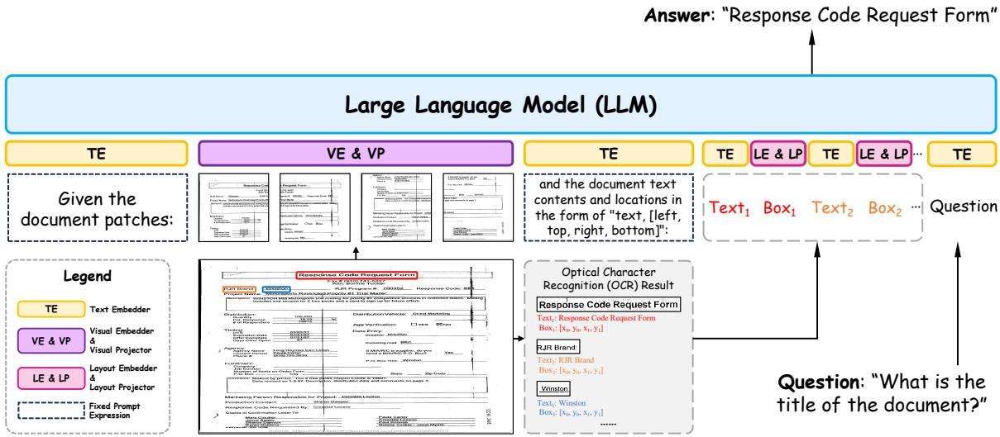
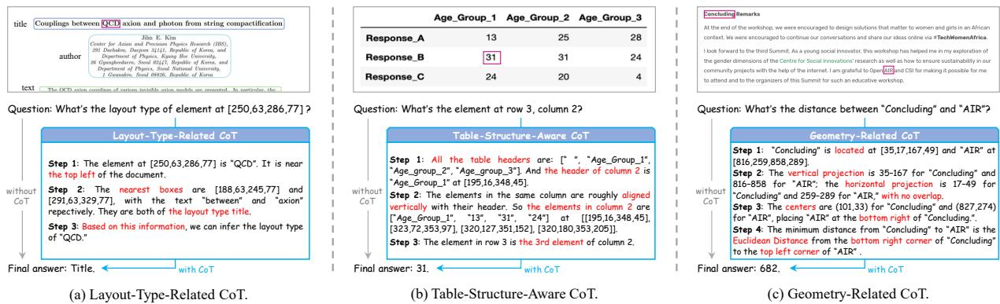
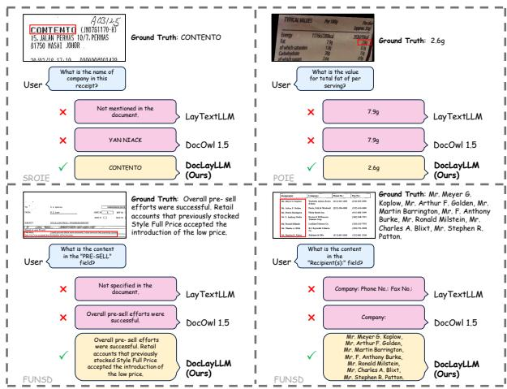

# DocLayLLM: An Efficient Multi-modal Extension of Large Language Models for Text-rich Document Understanding

Wenhui Liao1†, Jiapeng Wang1,2†, Hongliang Li1, Chengyu Wang2∗, Jun Huang2, Lianwen Jin1,3∗

1South China University of Technology, Guangzhou, China

2Alibaba Cloud Computing, Hangzhou, China

3SCUT-Zhuhai Institute of Modern Industrial Innovation, Zhuhai, China

{eelwh, eejpwang, eehongliangli}@mail.scut.edu.cn, eelwjin@scut.edu.cn

{chengyu.wcy, huangjun.hj}@alibaba-inc.com

## Abstract

Text-rich document understanding (TDU) requires comprehensive analysis of documents containing substantial textual content and complex layouts. While Multimodal Large Language Models (MLLMs) have achieved fast progress in this domain, existing approaches either demand significant computational resources or struggle with effective multi-modal integration. In this paper, we introduce DocLayLLM, an efficient multi-modal extension of LLMs specifically designed for TDU. By lightly integrating visual patch tokens and 2D positional tokens into LLMs’ input and encoding the document content using the LLMs themselves, we fully take advantage of the document comprehension capability ofLLMs and enhance theirperception of OCR information. We have also deeply considered the role of chain-of-thought (CoT) and innovatively proposed the techniques of CoT Pre-training and CoT Annealing. Our DocLayLLM can achieve remarkable performances with lightweight training settings, showcasing its efficiency and effectiveness. Experimental results demonstrate that our DocLayLLM outperforms existing OCR-dependent methods and OCR-free competitors. Code and model are available at https://github.com/whlscut/DocLayLLM.

## 1. Introduction

Text-rich document understanding (TDU) focuses on analyzing documents with extensive text and complex layouts, requiring a combined understanding of text, layout, and images. Early research [1, 2, 12, 15, 20, 28, 33– 37, 44, 52, 55, 65, 68, 69, 72, 73, 77] often used BERTlike [8] Transformer-based document encoders (DE), designing various pre-training tasks for large-scale unlabeled document corpora and fine-tuning their models on specific downstream tasks like key information extraction (KIE) and visual question answering (VQA) [39, 40]. However, these pre-training tasks often diverge significantly from downstream tasks, requiring the model to acquire substantial task-specific knowledge during fine-tuning. This may result in limited generalization capability across different tasks and datasets.

With the rapid development of large language models (LLMs), their impressive versatility and generalization capabilities have captured widespread interest [74]. This has led many researchers [17, 38, 61, 76, 79] to overcome the challenges of TDU with LLMs. Initially, efforts focused on employing multi-modal large language models (MLLMs) for OCR-free TDU, where document images are fed into MLLMs, directly generating responses to comprehension tasks. These MLLMs, which can process images and text inputs, are among the most recent advancements in this domain. To date, several general MLLMs have been developed to manage diverse scenarios, and researchers often build their TDU models based on these general models. However, these TDU models typically require highresolution image inputs to recognize dense text in documents and a large volume of training data to effectively develop this capability, both of which bring significant computational demands. Furthermore, within the extensive collections of image and instruction data used to train these models, the training data for downstream evaluation tasks was often included, which might potentially impact the assessment of their generalization to previously unseen datasets.

To overcome the constraints of OCR-free methods, scholars have pursued diverse methodologies for integrating OCR information into LLMs. Initial strategies [14, 70] involved inputting coordinates of OCR bounding boxes as numeric text. However, this textual representation of numbers often resulted in excessively long inputs that could decrease inference speeds and potentially degrade model performance. In response, many researchers [11, 24, 45] have adopted an auxiliary document encoder like LayoutLMv3 [20] to process textual, visual, and layout features from documents and integrated into LLMs. Although these methods avoid high-resolution image inputs, the textual content of documents must also be encoded alongside the layout and image features within the DE due to its structural limitations. However, the document comprehension capabilities of these DEs may not be on par with those of LLMs themselves, which might have led to significant finetuning efforts for aligning the feature spaces of DEs and LLMs to improve performances during the whole training phase, demanding substantial computational resources.

To address the limitations of OCR-dependent TDU methods, we introduce DocLayLLM, an efficient multimodal extension of large language models for text-rich document understanding. Our method diverges from existing approaches that utilize an extra DE by integrating the document’s image patch tokens and 2D positional tokens with textual content into a natural language expression, and then encoding them through a unified LLM. This innovative integration not only taps into the LLM’s inherent text comprehension abilities but also allows it to perceive document layouts. Besides, by incorporating patch tokens, the model supports image-related pre-training tasks and further gains a rudimentary understanding of document structures.

To advance model performance, we have fully integrated the concept of the chain-of-thought (CoT) [3] into each stage of our training process. Firstly, we developed a novel CoT Pre-training strategy. CoT is engineered to preserve thematic coherence and logical progression during model reasoning, further enhancing the inference ability of LLM, which has proven effectiveness in various subsequent studies [14, 45, 71]. Recently, the use of Long CoT reasoning to enhance the inference capability of models has attracted significant attention [7, 49, 63], and DeepSeek-R1 [7] further emphasized the importance of utilizing CoT data for a cold start before the reinforcement learning stage. Our proposed CoT Pre-training offers a method for rapidly generating large-scale CoT data from non-QA data, thereby improving the model’s reasoning ability. By employing CoT in the data generation process and subsequently pre-training the model with the generated QA-formatted data, we have aligned the added visual and layout features with LLM’s inherent textual features while improving the model’s comprehension ability. Furthermore, we introduced a CoT Annealing technique. While previous research [31, 42] has validated the effectiveness of annealing strategies that gradually increase the proportion of high-quality data towards the end of training, the impact of CoT on data quality had not been explored. To address this, we first propose an annealing strategy that considers data quality from a CoT perspective, further improving model performance.

Thanks to the above design, utilizing only around 3M pre-training data and 300K supervised fine-tuning (SFT) data with the efficient tuning technology of LoRA [18], our DocLayLLM finishes the whole training process in 36 A100 days, therefore resulting an efficient extension of LLM. Even with such low resources, our DocLayLLM surpasses existing OCR-dependent TDU methods. Furthermore, it also excels in specific tasks without fine-tuning on downstream tasks and outperforms state-of-the-art (SOTA) OCRfree methods when trained with training sets of downstream tasks as other methods, further showcasing its effectiveness. Our contributions are:

• We propose an efficient multi-modal extension of LLMs, which has augmented LLM in understanding text-rich documents and greatly reduced training resources in need.

• We introduce CoT Pre-training, a novel approach for generating CoT data that helps enhance the comprehension capabilities of models.

• We revisit data annealing from a novel perspective and introduce the CoT Annealing strategy, which further enhances the model’s efficiency in data utilization and boosts its ultimate performance.

• Our method outperforms existing OCR-dependent TDU solutions and surpasses current OCR-free methods under comparable supervised fine-tuning conditions.

## 2. Related Works

OCR-free MLLMs for Text-Rich Documents Understanding. To date, a number of studies have attempted to directly answer the instruction for TDU tasks from document images, thereby obviating the need for extra OCR processing and resulting in an end-to-end paradigm. Such models are referred to as OCR-free methods. Early examples like Donut [23], UDOP [62], and OmniParser [66] have explored end-to-end document understanding solutions without relying on LLMs or MLLMs. However, with the rapid development of MLLMs, many new studies have begun to focus on enhancing the capabilities of general MLLMs in document understanding. Some of them attempt to boost the document understanding ability of general MLLMs by tuning them with synthesizing TDU data generated by proprietary LLMs, including LLaVAR [79] and TextSquare [61], while mPLUG-DocOwl 1.5 [17] enhances the document understanding capability by integrating existing document comprehension data and converting it into vision-related QA-formatted data. Moreover, researchers have also explored image encoding methods to read the text more clearly. For instance, UReader [76] and Monkey [38] empower MLLMs to handle high-resolution images by splitting them into sub-images, encoding each separately, and then concatenating them. Some general MLLMs, such as LLaVA-Next [29], LLaVA-

  
Figure 1. The overall architecture of DocLayLLM.

OneVision [27], and Idefics3 [26], also adopt this approach to address the challenge of TDU. Although these above methods have achieved notable success in TDU tasks, they typically require high-resolution image inputs to identify text within images, significantly increasing computational demands. Besides, to equip general MLLMs with the ability to recognize the rich text within a document, a substantial amount of training data is required, including training sets of the benchmarks tested, which resulted in a high demand for training resources and might affect the evaluation of their zero-shot inference ability.

OCR-dependent MLLMs for Text-Rich Documents Understanding. To address the challenges of OCR-free MLLMs, some researchers have attempted to integrate OCR information from text-rich documents into LLMs to avoid high-resolution image inputs. ICL-D3IE [14] feeds coordinates of OCR boxes into the LLM using a textual expression of [left, top, right, bottom], while LATIN-Prompt [70] simulates the document layout by inserting spaces and newline characters between OCR-recognized text segments, thus providing the LLM with a document input containing a rudimentary layout. Besides, LMDX [53] also input the layout in a way similar to ICL-D3IE. However, these methods of inputting OCR information in textual form lead to overly lengthy inputs, thereby slowing inference and impacting model performance. Subsequent studies have explored encoding OCR information using additional encoders. Cream [24] utilizes BLIP-2 [30] to encode document OCR positions, images, text, and additional object detection information, with the output of BLIP-2 fed into the LLM. InstructDr [60] introduces an extra feature extractor to encode document OCR information, compressing it with learnable tokens before inputting it into the LLM. Additionally, Fujitake [11] and Luo et al. [45] adopt LayoutLMv3 [20] to encode the OCR information of documents before inputting them into the LLM. Although these methods avoid the issue of overly lengthy text inputs, they must use the extra DE to encode all the OCR textual, positional information from the document due to the structural restriction of DE. However, the additional DE might not be comparable with LLMs themselves in terms of document comprehension capability. This might be the reason why they usually need extensive training of both the DE and the LLM to align the features encoded by the DE with those of the LLM, which consumes significant computational resources. DocLLM [67] proposes an extension where the hidden states derived from OCR bounding boxes interact with those of OCR text features encoded by LLMs within each attention block via cross-attention [5, 6]. However, they use an extra projection layer at each attention block to transform and inject layout information, which might excessively interfere with the original attention computation of LLM, thereby potentially affecting LLM’s generalization capability. Moreover, it does not adequately consider the role of image features in TDU. Overall, designing an efficient method to provide OCR information to LLMs remains a research question worthy of deep exploration.

## 3. DocLayLLM

DocLayLLM is an LLM-based methodology that encodes OCRed textual, visual, and positional information directly within an LLM, eliminating the need for additional DE. The training regime of DocLayLLM includes both pretraining and supervised fine-tuning phases, which are both instruction-tuning-based processes. To further enhance our model, we propose the integration of CoT into our pretraining tasks, denoted as CoT Pre-training. Additionally, we introduce CoT Annealing, which involves the application of annealing to the data utilized in the supervised finetuning phase, specifically from the perspective of CoT.

  
Figure 2. Examples of CoT Pre-training across different tasks. Red text highlights key steps in the chain of thought for each task.

## 3.1. Model Architecture

The overall architecture of our DocLayLLM is illustrated in Figure 1. To process a document image, we first employ an OCR engine. This engine extracts the OCR results, which encompass the textual content, denoted as $T e x t _ { 1 : N }$ , and the associated bounding box, represented by $B o x _ { 1 : N }$ . Here, N indicates the total number of text segments detected by the OCR, and each $B o x _ { i } = [ x _ { 0 } , y _ { 0 } , x _ { 1 } , y _ { 1 } ]$ defines the bounding box for $T e x t _ { i }$ . The bounding box coordinates correspond to the $l e f t ,$ top, right, and bottom boundaries of the text segment. After the OCR process, the document image is segmented into patches, denoted as $P a t c h _ { 1 : M }$ , where M represents the total number of patches. Next, the OCR results and the document patches are integrated with the fixed part of the prompt and the specific Question related to the document. This integration forms the final prompt input to the model, presented in a natural language expression T: Given the document patches: $\left\{ P a t c h _ { 1 : M } \right\}$ and the document text contents and locations in the form of “text, [left, top, right, bottom]”: $\{ ( T e x t _ { i } , B o x _ { i } ) _ { 1 : N } \}$ {Question}

Subsequently, the textual components of the prompt, including the fixed expression, $T e x t _ { 1 : N }$ , and Question, are processed using the LLM’s native text embedder. This generates the embeddings for the text content as follows:

$$
E m b _ { T } = T E ( T e x t C o n t e n t ) ,\tag{1}
$$

where TE is the native text embedder of LLM, and T extContent consists of the fixed expression, T ext1:N, and Question.

As for $P a t c h _ { 1 : M }$ and $B o x _ { 1 : N }$ , they are first embedded with an extra embedder, then mapped to the LLM’s feature space via a linear projector, yielding EmbV and $E m b _ { L }$ as:

$$
E m b _ { V } = V P ( V E ( P a t c h _ { 1 : M } ) ) ,\tag{2}
$$

$$
E m b _ { L } = L P ( L E ( B o x _ { 1 : N } ) ) ,\tag{3}
$$

where VE and VP represent the visual embedder and visual projector, LE and LP denote the layout embedder and layout projector, respectively. It is worth noting that despite the introduction of V E, V P, LE, and $L P ,$ these are all simple embedding layers or linear layers, thereby minimizing additional computational burden.

Finally, LLM will comprehend the embeddings provided and utilize them to generate the Answer to the Question:

$$
A n s w e r = L L M ( \pi ( ( E m b _ { T } , E m b _ { V } , E m b _ { L } ) , \mathcal { T } ) ) .\tag{4}
$$

Here π represents organizing EmbT, EmbV, $E m b _ { L }$ into a feature sequence according to T.

With our design, we have preserved the original structure of the LLM, ensuring its generalization capability. At the same time, we have enabled the LLM to easily accept and process visual and layout features, making it better suited for understanding text-rich documents with various layouts. This results in a simple yet effective multi-modal extension.

## 3.2. CoT Pre-training

During the pre-training phase, we incorporate a wide range of tasks (as detailed in the appendix) to boost the LLM’s understanding of the visual and layout features inspired by Luo et al. [45]. Since the datasets related to these tasks are not designed explicitly for instruction-tuning, their annotations are not in a QA format. Therefore, we manually create QA-formatted instructions based on their annotations for training. However, simply converting task descriptions into Question and annotations into Answer is highly inefficient regarding data utilization. To address this, we incorporate CoT during the conversion to instruction-tuning data for specific tasks, asking LLM to solve our problem stepby-step thus enhancing the model’s comprehension abilities, as the examples illustrated in Fig 2. Our designed CoT primarily falls into the following three categories:

## 3.2.1. Layout-Type-Related CoT

We conduct a layout-type-related CoT for the layout analysis task. To determine the layout type of a given area, it is beneficial first to locate its region within the document and then infer based on the nearby layout element. When giving an area bounded by a bounding box, our layout-type-related CoT can be formulated as following steps:

1. Identify the text within the area and determine its approximate region within the document (e.g., top left, top right part of the document, etc).

2. Locate the nearest bounding boxes and assess their layout type.

3. Infer the layout type of the given area based on the above information.

Through this CoT process, we enable the LLM to fully utilize the visual, layout, and textual features of the document, thereby improving their ability to understand the document’s overall structure.

## 3.2.2. Table-Structure-Aware CoT

Table-structure-aware CoT is primarily employed in the table analysis task. We have integrated the XY-Cut algorithm [48]—a widely-used technique for analyzing table structures. For instance, to locate an element at the i-th row and j-th column, the CoT process is outlined as follows:

1. Identify all the table headers and their respective locations. The header of the j-th column corresponds to the j-th element in the headers list.

2. Output all elements in the j-th column when told that the elements of the same column are roughly vertically aligned with their corresponding headers.

3. Determine the final answer based on the i-th element of the contents in the j-th column.

Applying the above CoT, we break down a complex question into simple steps using the basic XY-Cut thought. This approach improves the LLM’s inference ability through this breakdown and enhances data utilization by effectively leveraging the overall structure of the table.

## 3.2.3. Geometry-Related CoT

This is used in geometric analysis to identify geometric relationships between two text segments. It assists LLM to inference with geometric relations. Specifically, when giving the text content of two lines:

1. Recover the bounding box of the given text segments.

2. Analyze their vertical and horizontal projections to determine if they overlap through interval analysis.

3. Calculate the center point of each segment and determine their relative location by comparing their center points.

4. Calculate the minimum Euclidean distance based on the previous analysis. If they overlap, the distance is 0; if they overlap in vertical/horizontal projections, the minimum distance is the smallest interval in the horizontal/vertical projections; otherwise, it is the minimum Euclidean distance between their nearest corners.

This design advances the LLM’s arithmetic reasoning capabilities and helps it more accurately grasp the spatial relationships between different boxes, and also contributes to layout-type-aware CoT to find the nearest bounding boxes.

## 3.3. CoT Annealing

Data annealing involves gradually increasing the proportion of high-quality data towards the end of supervised finetuning to improve data utilization efficiency and augment the model’s reasoning abilities. This technique has been proven to be effective and is widely adopted in models like MiniCPM [19], DataComp-LM [31], and Llama-3.1 [42].

During the SFT stage, we employ data with a layoutaware CoT [45] that helps focus on potential regions of questions and answers within documents, thereby better leveraging the layout features learned during pre-training. It also allows the model to strengthen its reasoning capacity through step-by-step thinking. However, in the latter stages of SFT, our goal for LLM is to output precise and direct answers to questions. At this point, using CoT data may introduce unnecessary noise with a long response, and the overly uniform layout-aware CoT data might partially compromise the LLM’s generalization abilities.

To balance the strengths and weaknesses of such data, we propose CoT annealing, which reconsiders this data annealing issue from a CoT perspective. Specifically, we generate direct-answer data without CoT from the CoT data, treating it as high-quality data. During the SFT process, we gradually increase the proportion of this direct-answer data, thereby enhancing the LLM’s ability to respond with a clear and direct answer in the end. Initially, we only utilize the data with CoT, gradually adjusting the ratio of CoT to non-CoT data as the SFT process progresses. Ultimately, we conclude the training using only the data without CoT.

## 4. Experiments

## 4.1. Datasets

During the pre-training stage, we conduct our pre-training tasks on several datasets, including RVL-CDIP [13], PubLayNet [80], PubTabNet [81], DocLayNet [54], DocBank [32], DocILE [56], and the Document Dense Description data from LayoutLLM [45]. This results in a total of 3.1 million pairs of instruction tuning data, which is significantly less than the volume used in previous OCRdependent TDU methods. For the supervised fine-tuning stage, we apply CoT annealing on the layout-aware document QA data utilized in LayoutLLM [45].

We evaluate our DocLayLLM on widely used textrich document benchmarks, including FUNSD [22], CORD [50], SROIE [21], POIE [25], DocVQA [46], InfoVQA [47], VisualMRC [59], DeepForm [58], KLC [57], WTQ [51], and TabFact [4]. For a fair comparison with other approaches, we use the default OCR data from the official datasets otherwise commercial OCR engines 1 if not provided, and follow their evaluation pipeline and metrics.

<table><tr><td rowspan="2">Method</td><td rowspan="2">Processed Data at Pre-training</td><td colspan="3">Document-oriented VQA</td><td colspan="4">KIE</td></tr><tr><td>DocVQA</td><td>VisualMRC</td><td> $\mathbf { A v g } .$ </td><td>FUNSD†</td><td>CORD†</td><td>SROIE†</td><td> $\mathbf { A v g . }$ </td></tr><tr><td>Text</td><td></td><td></td><td></td><td></td><td></td><td></td><td></td><td></td></tr><tr><td>Llama2-7B-Chat [64]</td><td>一</td><td>20.50</td><td>9.90</td><td>15.20</td><td>15.10</td><td>20.00</td><td>35.6</td><td>23.57</td></tr><tr><td>Llama3-8B-Instruct [42]</td><td></td><td>51.79</td><td>47.77</td><td>49.78</td><td>68.56</td><td>52.31</td><td>61.24</td><td>60.70</td></tr><tr><td>Text + Box</td><td></td><td></td><td></td><td></td><td></td><td></td><td></td><td></td></tr><tr><td> $\mathrm { L l a m a 2 - 7 B - C h a t } _ { c o o r } \ [ 1 4 ]$ </td><td></td><td>12.30</td><td>12.20</td><td>12.25</td><td>11.90</td><td>6.40</td><td>39.40</td><td>19.23</td></tr><tr><td> $\operatorname { L l a m a 3 - 8 B - I n s t r u c t } _ { c o o r } \ [ 1 4 ]$ </td><td></td><td>49.13</td><td>41.75</td><td>45.44</td><td>74.00</td><td>62.20</td><td>63.15</td><td>66.45</td></tr><tr><td> $\mathrm { L a y T e x t L L M } _ { z e r o } \ [ 4 3 ]$ </td><td>10.0M (323%)</td><td>65.50</td><td>37.40</td><td>51.45</td><td>72.00</td><td>45.50</td><td>82.00</td><td>66.50</td></tr><tr><td>Text + Box + Patch</td><td></td><td></td><td></td><td></td><td></td><td></td><td></td><td></td></tr><tr><td> $\mathrm { L a y o u t L L M } _ { L l a m a 2 } \ : [ 4 5 ]$ </td><td>5.7M (184%)</td><td>74.25</td><td>55.73</td><td>64.99</td><td>78.65</td><td>62.21</td><td>70.97</td><td>70.61</td></tr><tr><td> $D o c L a y L L M _ { L l a m a 2 } \ : ( \mathbf { O u r s } )$ </td><td>3.1M (100%)</td><td>72.83</td><td>55.04</td><td>63.94</td><td>78.67</td><td>70.81</td><td>83.27</td><td>77.58</td></tr><tr><td> $D o c L a y L L M _ { L l a m a 3 } \ : ( \mathbf { O u r s } )$ </td><td>3.1M (100%)</td><td>78.36</td><td>58.55</td><td>68.46</td><td>84.11</td><td>71.34</td><td>84.36</td><td>79.94</td></tr></table>

Table 1. Comparison with OCR-dependent methods using metrics from LayoutLLM [45]. Processed Data at Pre-training represents the total data volume processed at the pre-training stage, equivalent to dataset size multiplied by epoch count, with values in parentheses representing size ratios compared to DocLayLLM. Avg. represents the average performance across different benchmarks, and † indicates the cleaned test set used in LayoutLLM. The suffix $l a y o u t$ denotes using method from He et al. [14], which provides LLM with layout features via OCR box coordinates in textual form. Bold indicates the best performance, and underline indicates the second-best one.
<table><tr><td rowspan="3">Method</td><td rowspan="3">Processed Data at Pre-training</td><td colspan="3">Document-oriented VQA</td><td colspan="4">KIE</td></tr><tr><td colspan="2">DocVQA VisualMRC</td><td> $\mathbf { A v g } .$ </td><td>FUNSD</td><td colspan="2">CORD</td><td> $\mathbf { A v g } .$ </td></tr><tr><td></td><td></td><td></td><td></td><td></td><td>SROIE</td><td></td></tr><tr><td>Text</td><td></td><td></td><td></td><td></td><td></td><td></td><td></td><td></td></tr><tr><td>Llama2-7B-Chat [64]</td><td></td><td>20.50</td><td>6.30</td><td>13.40</td><td>23.40</td><td>51.80</td><td>58.60</td><td>44.60</td></tr><tr><td>Llama3-8B-Instruct [42]</td><td></td><td>51.79</td><td>229.74</td><td>140.77</td><td>66.67</td><td>74.71</td><td>82.51</td><td>74.63</td></tr><tr><td>Text + Box</td><td></td><td></td><td></td><td></td><td></td><td></td><td></td><td></td></tr><tr><td> $\mathrm { L l a m a 2 - 7 B - C h a t } _ { c o o r } \ [ 1 4 ]$ </td><td></td><td>12.30</td><td>28.00</td><td>20.15</td><td>14.40</td><td>38.10</td><td>50.60</td><td>34.37</td></tr><tr><td> $\operatorname { L l a m a 3 - 8 B - I n s t r u c t } _ { c o o r } \ [ 1 4 ]$ </td><td></td><td>49.13</td><td>211.69</td><td>130.41</td><td>74.71</td><td>75.33</td><td>75.93</td><td>75.32</td></tr><tr><td>LMDX [53]</td><td></td><td></td><td></td><td></td><td></td><td>66.95</td><td></td><td></td></tr><tr><td>DocLLM [67]</td><td>16.8M (542%)</td><td>69.50*</td><td>264.10*</td><td>166.80*</td><td>51.80*</td><td>67.60*</td><td>91.90*</td><td>70.43*</td></tr><tr><td> $\mathrm { L a y T e x t L L M } _ { z e r o } \ [ 4 3 ]$ </td><td>10.0M (323%)</td><td>65.50</td><td>200.20</td><td>132.85</td><td>47.20</td><td>77.20</td><td>83.80</td><td>69.40</td></tr><tr><td> $\mathbf { T e x t } + \mathbf { B o x } + \mathbf { P a t c h }$ </td><td></td><td></td><td></td><td></td><td></td><td></td><td></td><td></td></tr><tr><td> $D o c L a y L L M _ { L l a m a 2 } \ : ( \mathbf { O u r s } )$ </td><td>3.1M (100%)</td><td>72.83</td><td>310.60</td><td>191.72</td><td>80.74</td><td>79.37</td><td>84.37</td><td>81.49</td></tr><tr><td> $D o c L a y L L M _ { L l a m a 3 } \ : ( \mathbf { O u r s } )$ </td><td>3.1M (100%)</td><td>78.35</td><td>357.04</td><td>217.70</td><td>86.47</td><td>83.66</td><td>86.08</td><td>85.40</td></tr></table>

Table 2. Comparison with OCR-dependent methods using metrics from DocLLM [67]. ∗ indicates that the model uses the training set of the benchmark during training.

## 4.2. Implement Details

Our method is based on Llama3-8B-Instruct [42], with a Llama2-7B-Chat [64] version for better comparison with other methods. They are denoted as DocLayLLMLlama3 and DocLayL $\mathrm { L M } _ { L l a m a 2 }$ respectively. We initialize V E and LE with weights from LayoutLMv3 [20] to leverage document knowledge acquired during its pre-training, while V P and LP are randomly initialized. Besides, the image resolution is fixed at 224\*224, resulting in 196 visual patch tokens, to capture an overview of document layout while bringing less computation burden. During pre-training and fine-tuning, we use LoRA [18] with a rank of 64 on LLM and keep VE, VP, LE, and LP trainable, leading to few tuning parameters. We train our model on 8 NVIDIA Tesla A100-80G GPUs, taking about 30 A100 days for pretraining and 6 A100 days for supervised fine-tuning. Additional details can be found in the appendix.

## 4.3. Comparisons with SOTA OCR-dependent methods

We have compared our DocLayLLM with existing SOTA OCR-dependent methods. In order to exhibit the zero-shot inferring ability precisely, we chose their performances under the zero-shot scenario unless they are not provided.

The experimental results are shown in Table 1 and Table 2. Our method outperforms the baseline models, regardless of their type or whether the document’s layout information is provided to them. It validates the rationale behind our design of multi-modal extension.

Additionally, our method significantly outperforms previous SOTA methods despite fewer training resources. As shown in Table 1, it surpasses the performance of Layout-LLM [45] and LayTextLLM [43] though requiring fewer computational resources by using less data and tuning few parameters at training. Even with Llama2 as the backbone, our approach matches the performance of previous SOTA methods in the Document-oriented VQA task and significantly outperforms them in the KIE tasks, further demonstrating the efficiency and effectiveness of our approach.

<table><tr><td rowspan="2">Method</td><td colspan="3">Document-oriented VQA</td><td colspan="4">KIE</td></tr><tr><td>DocVQA</td><td>InfoVQA</td><td>Avg.</td><td>FUNSD</td><td>SROIE</td><td>POIE</td><td>Avg.</td></tr><tr><td>LLaVAR [79]</td><td>12.30</td><td>16.50</td><td>14.40</td><td>0.50</td><td>5.20</td><td>5.90</td><td>3.87</td></tr><tr><td>UniDoc [10]</td><td>7.70</td><td>14.70</td><td>11.20</td><td>1.00</td><td>2.90</td><td>5.10</td><td>3.00</td></tr><tr><td>DocPedia [9]</td><td>47.10*</td><td>15.20*</td><td>31.15*</td><td>29.90</td><td>21.40</td><td>39.90</td><td>30.40</td></tr><tr><td>Monkey [38]</td><td>50.10*</td><td>25.80*</td><td>37.95*</td><td>24.10</td><td>41.90</td><td>19.90</td><td>28.63</td></tr><tr><td>TextMonkey [41]</td><td>66.70*</td><td>28.60*</td><td>47.65*</td><td>42.90</td><td>46.20</td><td>32.00</td><td>40.37</td></tr><tr><td>DocOwl 1.5 [17]</td><td>=</td><td></td><td></td><td></td><td>48.30</td><td>51.80</td><td></td></tr><tr><td>TextSquare [61]</td><td></td><td></td><td></td><td></td><td>53.20</td><td>71.80</td><td></td></tr><tr><td>DocKylin [78]</td><td>65.10*</td><td>34.80*</td><td>49.95*</td><td>58.70</td><td>25.50</td><td>49.50</td><td>44.57</td></tr><tr><td>_  $D o c L a y L L M _ { L l a m a 3 } \ : ( \mathbf { O u r s } )$ </td><td>77.79</td><td>42.02</td><td>59.91</td><td>80.28</td><td>76.59</td><td>75.13</td><td>77.33</td></tr></table>

Table 3. Comparison with OCR-free methods using the precision metric from TextMonkey [41]. ∗ indicates that the model uses the training set of the benchmark during training.
<table><tr><td rowspan="2">Method</td><td colspan="4">Document-oriented VQA</td><td colspan="3">KIE</td><td colspan="3">Table Understanding</td></tr><tr><td>DocVQA</td><td>InfoVQA</td><td>VisualMRC</td><td>Avg.</td><td>DeepForm</td><td>KLC</td><td>Avg.</td><td>WTQ</td><td>TabFact</td><td>Avg.</td></tr><tr><td>DocPedia [9]</td><td>47.10</td><td>15.20</td><td></td><td></td><td></td><td></td><td></td><td></td><td></td><td></td></tr><tr><td>DocOwl [75]</td><td>62.20</td><td>38.20</td><td>188.80</td><td>96.40</td><td>42.60</td><td>30.30</td><td>36.45</td><td>26.90</td><td>60.20</td><td>43.55</td></tr><tr><td>UReader [76]</td><td>65.40</td><td>42.20</td><td>221.70</td><td>109.77</td><td>49.50</td><td>32.80</td><td>41.15</td><td>29.40</td><td>67.60</td><td>48.50</td></tr><tr><td>Monkey [38]</td><td>66.50</td><td>36.10</td><td></td><td></td><td>40.60</td><td>32.80</td><td>36.70</td><td>25.30</td><td></td><td></td></tr><tr><td>TextMonkey [41]</td><td>73.00</td><td></td><td></td><td></td><td>59.70</td><td>37.80</td><td>48.75</td><td>31.90</td><td></td><td></td></tr><tr><td>DocKylin [78]</td><td>77.30</td><td>46.60</td><td>319.90</td><td>147.93</td><td>64.20</td><td></td><td></td><td>32.40</td><td></td><td></td></tr><tr><td>CogAgent [16]</td><td>81.60</td><td>44.50</td><td></td><td></td><td></td><td></td><td></td><td></td><td></td><td></td></tr><tr><td>DocOwl 1.5 [17]</td><td>82.20</td><td>50.70</td><td>246.40</td><td>126.43</td><td>68.80</td><td>38.70</td><td>53.75</td><td>40.60</td><td>80.20</td><td>60.40</td></tr><tr><td>TextSquare [61]]</td><td>84.30</td><td>51.50</td><td></td><td></td><td></td><td></td><td></td><td>49.70</td><td>84.20</td><td>66.95</td></tr><tr><td> $D o c L a y L L M _ { L l a m a 3 } ^ { \dagger } \left( \mathbf { O u r s } \right)$ </td><td>86.52</td><td>58.36</td><td>327.91</td><td>157.60</td><td>77.07</td><td>40.73</td><td>58.90</td><td>58.62</td><td>83.36</td><td>70.99</td></tr></table>

Table 4. Comparison with OCR-free methods using the evaluation framework and metrics from DocOwl 1.5 [17]. All methods, including our $D o c L a y \bar { L } L M _ { L l a m a 3 } ^ { \ddagger }$ variant, are exposed to the train set corresponding to the evaluation set during training.

Besides, our method exhibits robust zero-shot generalization capability without fine-tuning with specific downstream tasks. From the comparison with DocLLM [67] in Table 2, it is clear that our method, even without fine-tuning, significantly outperforms DocLLM across most datasets and achieves a considerable overall performance improvement. This validates our design, which has preserved the strong generalization ability of the original LLM structure.

In summary, DocLayLLM serves as an efficient extension of LLMs. It demonstrates strong zero-shot generalization and effective document understanding by encoding documents within a unified model. Even with limited training resources, DocLayLLM achieves new SOTA performance compared to OCR-dependent competitors.

## 4.4. Comparisons with SOTA OCR-free methods

We have also compared our method with SOTA OCR-free TDU models. Table 3 presents the precision of our method and some advent OCR-free TDU methods across various benchmarks. Even though in the circumstance that OCRfree models use some of the training sets of these benchmarks during training, while our method infers in a purely zero-shot manner, our DocLayLLM still outperforms these models, particularly in KIE task, which heavily relies on layout information. This clearly demonstrates the superiority of our design to provide LLM with OCR information.

We additionally test DocLayLLM on a broader set of benchmarks from DocOwl 1.5 [17]. To further assess the performance of DocLayLLM on seen datasets, we incorporate the training sets of these benchmarks used in DocOwl 1.5 during the SFT process as other OCR-free TDU methods do during training. To maintain the efficiency advantage of our method, we ensure that the SFT is conducted with the same number of steps as the standard DocLayLLM. The results in Table 4 show that with the inclusion of downstream task data during SFT, our method outperforms the SOTA OCR-free TDU models in most datasets. Moreover, our overall performance in the Document-oriented VQA, KIE, and Table Understanding sub-tasks surpasses the OCR-free TDU methods using limited training resources, showcasing the tremendous potential of OCR-dependent methods and further reinforcing the reliability of our method.

Overall, our DocLayLLM consistently shows strong zero-shot inference ability, outperforming many OCR-free TDU methods without prior exposure to downstream data.

  
Figure 3. Qualitative comparisons of DocLayLLM with other OCR-dependent and OCR-free methods. Zoom in for better view.

Additionally, when incorporating downstream datasets during SFT like other OCR-free approaches, DocLayLLM surpasses them, highlighting its potential in solving TDU tasks by integrating OCR information into the LLM.

## 4.5. Qualitative Results

Figure 3 shows some qualitative examples to visualize the performance on KIE tasks of our DocLayLLM compared with LayTextLLM and DocOwl 1.5. The example from SROIE clearly shows that DocLayLLM has improved document comprehension and answer accuracy. And the example from POIE demonstrates our advantage in handling table-formatted documents to give an accurate response. Furthermore, as seen in the FUNSD examples, DocLayLLM excels at extracting answers spanning multiple text lines, outperforming both OCR-dependent and OCRfree methods. For more visualization of qualitative examples, please refer to the appendix.

## 4.6. Ablation Study

We have also conducted additional experiments to explore the effectiveness of our proposed method. To conserve computational resources, we perform pre-training at 25% of the standard scale (including the baseline) but full-scale SFT. We focus on the impact of two main factors: (a) the role of CoT pre-training and CoT annealing, and (b) the influence of different modality configurations.

Experimental results in Table 5a indicate that omitting CoT Pre-training leads to an obvious performance drop in both the Document-oriented VQA and KIE tasks, while not using CoT Annealing primarily affects VQA performance. Besides, using randomly initialized VE and LE partially compromises the proposed extension, resulting in performance degradation in both the VQA and KIE tasks.

Additionally, performances in Table 5b show the efficacy of our DocLayLLM to incorporate different modalities for TDU tasks. It is obvious that using only text from the document is insufficient for TDU, while adding layout information in textual form provides some gain on VQA tasks but leads to over-length input (see appendix for analysis), greatly slowing the inference. By our design to integrate layout features via an LE, we achieve notable improvements on these TDU tasks with shorter inputs. And adding visual features further boosts the performance of our method.

<table><tr><td rowspan="2">Experiment</td><td colspan="3">Document-oriented VQA</td><td colspan="3">KIE</td></tr><tr><td>DocVQA</td><td>VisualMRC</td><td>Avg.</td><td>DeepForm</td><td>KLC</td><td>Avg.</td></tr><tr><td>DocLayLLMLlama3</td><td>77.43</td><td>316.27</td><td>196.85</td><td>35.41</td><td>26.25</td><td>30.83</td></tr><tr><td>w/o CoT Pre-training</td><td>76.00</td><td>295.49</td><td>185.75</td><td>24.54</td><td>25.49</td><td>25.02</td></tr><tr><td>w/o CoT Annealing</td><td>77.40</td><td>310.17</td><td>193.79</td><td>34.23</td><td>26.21</td><td>30.22</td></tr><tr><td>w/o pt VE &amp; LE</td><td>77.42</td><td>308.49</td><td>192.96</td><td>31.31</td><td>25.76</td><td>28.54</td></tr></table>

(a) Impact of different settings: w/o CoT Pre-training and w/o CoT Annealing indicate pre-training without CoT and supervised finetuning with only CoT data, while w/o pt VE and PE uses randomly initialized visual and layout embedders instead of pre-trained ones.

<table><tr><td colspan="3">Modality</td><td colspan="3">Document-oriented VQA</td><td colspan="3">KIE</td></tr><tr><td>T</td><td>L</td><td>V</td><td>DocVQA</td><td>VisualMRC</td><td>Avg.</td><td>DeepForm</td><td>KLC</td><td>Avg.</td></tr><tr><td>√</td><td>x</td><td>x</td><td>73.57</td><td>280.27</td><td>176.93</td><td>15.76</td><td>24.09</td><td>19.93</td></tr><tr><td>√</td><td>(I)</td><td>x</td><td>75.72</td><td>306.51</td><td>191.12</td><td>14.13</td><td>24.23</td><td>19.18</td></tr><tr><td>√</td><td>(II)</td><td>x</td><td>77.32</td><td>310.75</td><td>194.03</td><td>33.75</td><td>25.97</td><td>29.86</td></tr><tr><td></td><td>(II)</td><td>✓</td><td>77.43</td><td>316.27</td><td>196.85</td><td>35.41</td><td>26.25</td><td>30.83</td></tr></table>

(b) Impacts of different modality configurations. T, L, and V represent textual, layout, and visual modalities, respectively. (I) indicates inputting OCR coordinates as text following He et al. [14], while (II) embeds coordinates with LE in our approach.  
Table 5. Ablation study on various designs of our DocLayLLM.

Overall, the combined impact of these designs ensures the efficiency and effectiveness of our method.

## 5. Conclusion

We propose DocLayLLM, an efficient multi-modal extension of large language models for text-rich document understanding. By streamlined integration of document patch tokens and OCR positional tokens into the LLM inputs, it achieves a simple yet efficient multi-modal extension of LLM to enable it to have the capability to perceive and process textual, visual, and layout information from the OCR results of the document. Additionally, we introduce CoT Pre-training and CoT Annealing techniques centered around CoT, offering a new way to generate CoT data and further enhancing the model’s understanding of textrich documents. Despite requiring fewer training resources, our method surpasses existing OCR-dependent TDU models, demonstrating strong zero-shot generalization capability. Furthermore, it also exceeds the performance of SOTA OCR-free TDU methods under comparable training conditions, showcasing remarkable performance across various document understanding tasks. Our work significantly advances efficient MLLM-based document understanding while maintaining high-performance standards.

## Acknowledgement

This research is supported in part by National Natural Science Foundation of China (Grant No.: 62476093, 62441604).

## References

[1] Srikar Appalaraju, Bhavan Jasani, Bhargava Urala Kota, Yusheng Xie, and R. Manmatha. DocFormer: End-to-End Transformer for Document Understanding. In Proc. ICCV, pages 993–1003, 2021. 1

[2] Srikar Appalaraju, Peng Tang, Qi Dong, Nishant Sankaran, Yichu Zhou, and R. Manmatha. DocFormerv2: Local Features for Document Understanding. In Proc. AAAI, pages 709–718, 2024. 1

[3] Tom Brown, Benjamin Mann, Nick Ryder, Melanie Subbiah, Jared D Kaplan, Prafulla Dhariwal, Arvind Neelakantan, Pranav Shyam, Girish Sastry, Amanda Askell, Sandhini Agarwal, Ariel Herbert-Voss, Gretchen Krueger, Tom Henighan, Rewon Child, Aditya Ramesh, Daniel Ziegler, Jeffrey Wu, Clemens Winter, Chris Hesse, Mark Chen, Eric Sigler, Mateusz Litwin, Scott Gray, Benjamin Chess, Jack Clark, Christopher Berner, Sam McCandlish, Alec Radford, Ilya Sutskever, and Dario Amodei. Language Models are Few-shot Learners. Proc. NIPS, 33:1877–1901, 2020. 2

[4] Wenhu Chen, Hongmin Wang, Jianshu Chen, Yunkai Zhang, Hong Wang, Shiyang Li, Xiyou Zhou, and William Yang Wang. TabFact: A Large-scale Dataset for Table-based Fact Verification. In Proc. ICLR, 2020. 5

[5] Gang Dai, Yifan Zhang, Qingfeng Wang, Qing Du, Zhuliang Yu, Zhuoman Liu, and Shuangping Huang. Disentangling Writer and Character Styles for Handwriting Generation. In Proc. CVPR, pages 5977–5986, 2023. 3

[6] Gang Dai, Yifan Zhang, Quhui Ke, Qiangya Guo, and Shuangping Huang. One-dm: One-shot diffusion mimicker for handwritten text generation. In Proc. ECCV, pages 410– 427, 2025. 3

[7] DeepSeek-AI. DeepSeek-R1: Incentivizing Reasoning Capability in LLMs via Reinforcement Learning. arXiv: Comp. Res. Repository, abs/2501.12948, 2025. 2

[8] Jacob Devlin, Ming-Wei Chang, Kenton Lee, and Kristina Toutanova. BERT: Pre-training of Deep Bidirectional Transformers for Language Understanding. In Proc. NAACL, pages 4171–4186, 2019. 1

[9] Hao Feng, Qi Liu, Hao Liu, Wengang Zhou, Houqiang Li, and Can Huang. DocPedia: Unleashing the Power of Large Multimodal Model in the Frequency Domain for Versatile Document Understanding. arXiv: Comp. Res. Repository, abs/2311.11810, 2023. 7

[10] Hao Feng, Zijian Wang, Jingqun Tang, Jinghui Lu, Wengang Zhou, Houqiang Li, and Can Huang. UniDoc: A Universal Large Multimodal Model for Simultaneous Text Detection, Recognition, Spotting and Understanding. arXiv: Comp. Res. Repository, abs/2308.11592, 2023. 7

[11] Masato Fujitake. LayoutLLM: Large Language Model Instruction Tuning for Visually Rich Document Understanding. In Proc. LREC/COLING, pages 10219–10224, 2024. 2, 3

[12] Łukasz Garncarek, Rafał Powalski, Tomasz Stanisławek, Bartosz Topolski, Piotr Halama, Michał Turski, and Filip Gralinski. LAMBERT: Layout-Aware Language Modeling´ for Information Extraction. In Proc. ICDAR, pages 532–547, 2021. 1

[13] Adam W. Harley, Alex Ufkes, and Konstantinos G. Derpanis. Evaluation of Deep Convolutional Nets for Document Image Classification and Retrieval. In Proc. ICDAR, pages 991– 995, 2015. 5

[14] Jiabang He, Lei Wang, Yi Hu, Ning Liu, Hui Liu, Xing Xu, and Heng Tao Shen. ICL-D3IE: In-Context Learning with Diverse Demonstrations Updating for Document Information Extraction. In Proc. ICCV, pages 19428–19437, 2023. 1, 2, 3, 6, 8

[15] Teakgyu Hong, DongHyun Kim, Mingi Ji, Wonseok Hwang, Daehyun Nam, and Sungrae Park. BROS: A Pre-trained Language Model Focusing on Text and Layout for Better Key In formation Extraction from Documents. In Proc. AAAI, pages 10767–10775, 2022. 1

[16] Wenyi Hong, Weihan Wang, Qingsong Lv, Jiazheng Xu, Wenmeng Yu, Junhui Ji, Yan Wang, Zihan Wang, Yuxiao Dong, Ming Ding, and Jie Tang. CogAgent: A Visual Language Model for GUI Agents. In Proc. CVPR, pages 14281– 14290, 2024. 7

[17] Anwen Hu, Haiyang Xu, Jiabo Ye, Ming Yan, Liang Zhang, Bo Zhang, Ji Zhang, Qin Jin, Fei Huang, and Jingren Zhou. mPLUG-DocOwl 1.5: Unified Structure Learning for OCRfree Document Understanding. In Findings EMNLP, pages 3096–3120, 2024. 1, 2, 7

[18] Edward J. Hu, Yelong Shen, Phillip Wallis, Zeyuan Allen-Zhu, Yuanzhi Li, Shean Wang, Lu Wang, and Weizhu Chen. LoRA: Low-Rank Adaptation of Large Language Models. In Proc. ICLR, 2022. 2, 6

[19] Shengding Hu, Yuge Tu, Xu Han, Chaoqun He, Ganqu Cui, Xiang Long, Zhi Zheng, Yewei Fang, Yuxiang Huang, Weilin Zhao, Xinrong Zhang, Zhen Leng Thai, Kai Zhang, Chongyi Wang, Yuan Yao, Chenyang Zhao, Jie Zhou, Jie Cai, Zhongwu Zhai, Ning Ding, Chao Jia, Guoyang Zeng, Dahai Li, Zhiyuan Liu, and Maosong Sun. MiniCPM: Un veiling the Potential of Small Language Models with Scal able Training Strategies. arXiv: Comp. Res. Repository, abs/2404.06395, 2024. 5

[20] Yupan Huang, Tengchao Lv, Lei Cui, Yutong Lu, and Furu Wei. LayoutLMv3: Pre-training for Document AI with Unified Text and Image Masking. In Proc. ACM MM, pages 4083–4091, 2022. 1, 2, 3, 6

[21] Zheng Huang, Kai Chen, Jianhua He, Xiang Bai, Dimosthe nis Karatzas, Shijian Lu, and C. V. Jawahar. ICDAR2019 Competition on Scanned Receipt OCR and Information Extraction. In Proc. ICDAR, pages 1516–1520, 2019. 5

[22] Guillaume Jaume, Hazim Kemal Ekenel, and Jean-Philippe Thiran. FUNSD: A Dataset for Form Understanding in Noisy Scanned Documents. In Workshop on ICDAR, pages 1–6, 2019. 5

[23] Geewook Kim, Teakgyu Hong, Moonbin Yim, JeongYeon Nam, Jinyoung Park, Jinyeong Yim, Wonseok Hwang, Sang doo Yun, Dongyoon Han, and Seunghyun Park. OCR-Free

Document Understanding Transformer. Proc. ECCV, 13688: 498–517, 2022. 2

[24] Geewook Kim, Hodong Lee, Daehee Kim, Haeji Jung, Sanghee Park, Yoonsik Kim, Sangdoo Yun, Taeho Kil, Bado Lee, and Seunghyun Park. Visually-Situated Natural Language Understanding with Contrastive Reading Model and Frozen Large Language Models. In Proc. EMNLP, pages 11989–12010, 2023. 2, 3

[25] Jianfeng Kuang, Wei Hua, Dingkang Liang, Mingkun Yang, Deqiang Jiang, Bo Ren, and Xiang Bai. Visual Information Extraction in the Wild: Practical Dataset and End-to-End Solution. In Proc. ICDAR, pages 36–53, 2023. 5

[26] Hugo Laurenc¸on, Andres Marafioti, Victor Sanh, and Leo´ Tronchon. Building and better understanding visionlanguage models: insights and future directions. In Workshop on NIPS, 2024. 3

[27] Bo Li, Yuanhan Zhang, Dong Guo, Renrui Zhang, Feng Li, Hao Zhang, Kaichen Zhang, Peiyuan Zhang, Yanwei Li, Ziwei Liu, and Chunyuan Li. LLaVA-OneVision: Easy Visual Task Transfer. Transactions on Machine Learning Research, 2025. 3

[28] Chenliang Li, Bin Bi, Ming Yan, Wei Wang, Songfang Huang, Fei Huang, and Luo Si. StructuralLM: Structural Pre-training for Form Understanding. In Proc. ACL, pages 6309–6318, 2021. 1

[29] Feng Li, Renrui Zhang, Hao Zhang, Yuanhan Zhang, Bo Li, Wei Li, Zejun Ma, and Chunyuan Li. LLaVa-NeXT-Interleave: Tackling Multi-image, Video, and 3D in Large Multimodal Models. arXiv: Comp. Res. Repository, abs/2407.07895, 2023. 2

[30] Junnan Li, Dongxu Li, Silvio Savarese, and Steven C. H. Hoi. BLIP-2: Bootstrapping Language-Image Pre-training with Frozen Image Encoders and Large Language Models. Proc. ICML, 202:19730–19742, 2023. 3

[31] Jeffrey Li, Alex Fang, Georgios Smyrnis, Maor Ivgi, Matt Jordan, Samir Yitzhak Gadre, Hritik Bansal, Etash Guha, Sedrick Keh, Kushal Arora, Saurabh Garg, Rui Xin, Niklas Muennighoff, Reinhard Heckel, Jean Mercat, Mayee Chen, Suchin Gururangan, Mitchell Wortsman, Alon Albalak, Yonatan Bitton, Marianna Nezhurina, Amro Abbas, Cheng-Yu Hsieh, Dhruba Ghosh, Josh Gardner, Maciej Kilian, Hanlin Zhang, Rulin Shao, Sarah M. Pratt, Sunny Sanyal, Gabriel Ilharco, Giannis Daras, Kalyani Marathe, Aaron Gokaslan, Jieyu Zhang, Khyathi Raghavi Chandu, Thao Nguyen, Igor Vasiljevic, Sham M. Kakade, Shuran Song, Sujay Sanghavi, Fartash Faghri, Sewoong Oh, Luke Zettlemoyer, Kyle Lo, Alaaeldin El-Nouby, Hadi Pouransari, Alexander Toshev, Stephanie Wang, Dirk Groeneveld, Luca Soldaini, Pang Wei Koh, Jenia Jitsev, Thomas Kollar, Alexandros G. Dimakis, Yair Carmon, Achal Dave, Ludwig Schmidt, and Vaishaal Shankar. DataComp-LM: In search of the next generation of training sets for language models. arXiv: Comp. Res. Repository, abs/2406.11794, 2024. 2, 5

[32] Minghao Li, Yiheng Xu, Lei Cui, Shaohan Huang, Furu Wei, Zhoujun Li, and Ming Zhou. DocBank: A Benchmark Dataset for Document Layout Analysis. In Pro. COLING, pages 949–960, 2020. 5

[33] Peizhao Li, Jiuxiang Gu, Jason Kuen, Vlad I Morariu, Han dong Zhao, Rajiv Jain, Varun Manjunatha, and Hongfu Liu. SelfDoc: Self-Supervised Document Representation Learn ing. In Proc. CVPR, pages 5652–5660, 2021. 1

[34] Qiwei Li, Zuchao Li, Xiantao Cai, Bo Du, and Hai Zhao. Enhancing Pisually-Pich Pocument Pnderstanding via Payout Ptructure Podeling. In Proc. ACM MM, page 4513–4523, 2023.

[35] Qiwei Li, Zuchao Li, Ping Wang, Haojun Ai, and Hai Zhao. Hypergraph based Understanding for Document Semantic Entity Recognition. In Proc. ACL, pages 2950–2960, 2024.

[36] Xin Li, Yan Zheng, Yiqing Hu, Haoyu Cao, Yunfei Wu, Deqiang Jiang, Yinsong Liu, and Bo Ren. Relational Representation Learning in Visually-Rich Documents. In Proc. ACM MM, page 4614–4624, 2022.

[37] Yulin Li, Yuxi Qian, Yuechen Yu, Xiameng Qin, Chengquan Zhang, Yan Liu, Kun Yao, Junyu Han, Jingtuo Liu, and Errui Ding. StrucTexT: Structured Text Understanding with Multi Modal Transformers. In Proc. ACM MM, page 1912–1920, 2021. 1

[38] Zhang Li, Biao Yang, Qiang Liu, Zhiyin Ma, Shuo Zhang, Jingxu Yang, Yabo Sun, Yuliang Liu, and Xiang Bai. Mon key: Image Resolution and Text Label Are Important Things for Large Multi-modal Models. In Proc. CVPR, pages 26763–26773, 2024. 1, 2, 7

[39] Zening Lin, Jiapeng Wang, and Lianwen Jin. Visual Information Extraction Deep Learning Method: A Critical Review. Journal of Image and Graphics, 28(08):2276–2297, 2023. 1

[40] Chenglin Liu, Lianwen Jin, Xiang Bai, Xiaohui Li, and Fei Yin. Frontiers of intelligent document analysis and recognition: review and prospects. Journal ofImage and Graphics, 28(08):2223–2252, 2023. 1

[41] Yuliang Liu, Biao Yang, Qiang Liu, Zhang Li, Zhiyin Ma, Shuo Zhang, and Xiang Bai. TextMonkey: An OCR Free Large Multimodal Model for Understanding Document. arXiv: Comp. Res. Repository, abs/2403.04473, 2024. 7

[42] Meta AI Llama Team. The Llama 3 Herd of Models. arXiv: Comp. Res. Repository, abs/2407.21783, 2024. 2, 5, 6

[43] Jinghui Lu, Haiyang Yu, Yanjie Wang, Yongjie Ye, Jingqun Tang, Ziwei Yang, Binghong Wu, Qi Liu, Hao Feng, Han Wang, Hao Liu, and Can Huang. A Bounding Box is Worth One Token: Interleaving Layout and Text in a Large Language Model for Document Understanding. arXiv: Comp. Res. Repository, abs/2407.01976, 2024. 6

[44] Chuwei Luo, Changxu Cheng, Qi Zheng, and Cong Yao. GeoLayoutLM: Geometric Pre-Training for Visual Information Extraction. In Proc. CVPR, pages 7092–7101, 2023. 1

[45] Chuwei Luo, Yufan Shen, Zhaoqing Zhu, Qi Zheng, Zhi Yu, and Cong Yao. LayoutLLM: Layout Instruction Tuning with Large Language Models for Document Understanding. In Proc. CVPR, pages 15630–15640, 2024. 2, 3, 4, 5, 6

[46] Minesh Mathew, Dimosthenis Karatzas, and C. V. Jawahar. DocVQA: A Dataset for VQA on Document Images. In Proc. WACV, pages 2199–2208, 2021. 5

[47] Minesh Mathew, Viraj Bagal, Ruben Tito, Dimosthenis\` Karatzas, Ernest Valveny, and C.V. Jawahar. InfographicVQA. In Proc. WACV, pages 1697–1706, 2022. 5

[48] G. Nagy, S. Seth, and M. Viswanathan. A Prototype Document Image Analysis System for Technical Journals. Computer, 25(7):10–22, 1992. 5

[49] OpenAI. Hello GPT-4o, 2024. 2

[50] Seunghyun Park, Seung Shin, Bado Lee, Junyeop Lee, Jaeheung Surh, Minjoon Seo, and Hwalsuk Lee. CORD: A Consolidated Receipt Dataset for Post-OCR Parsing. In Workshop on NIPS, 2019. 5

[51] Panupong Pasupat and Percy Liang. Compositional Semantic Parsing on Semi-Structured Tables. In Proc. ACL, pages 1470–1480, 2015. 5

[52] Qiming Peng, Yinxu Pan, Wenjin Wang, Bin Luo, Zhenyu Zhang, Zhengjie Huang, Yuhui Cao, Weichong Yin, Yongfeng Chen, Yin Zhang, Shikun Feng, Yu Sun, Hao Tian, Hua Wu, and Haifeng Wang. ERNIE-Layout: Layout Knowledge Enhanced Pre-training for Visually-rich Document Understanding. In Findings of EMNLP, pages 3744– 3756, 2022. 1

[53] Vincent Perot, Kai Kang, Florian Luisier, Guolong Su, Xiaoyu Sun, Ramya Sree Boppana, Zilong Wang, Zifeng Wang, Jiaqi Mu, Hao Zhang, Chen-Yu Lee, and Nan Hua. LMDX: Language Model-based Document Information Extraction and Localization. In Findings of ACL, pages 15140– 15168, 2024. 3, 6

[54] Birgit Pfitzmann, Christoph Auer, Michele Dolfi, Ahmed S. Nassar, and Peter W. J. Staar. DocLayNet: A Large Human-Annotated Dataset for Document-Layout Segmentation. In Proc. ACM SIGKDD Int. Conf. Knowledge discovery & data mining, pages 3743–3751, 2022. 5

[55] Rafał Powalski, Łukasz Borchmann, Dawid Jurkiewicz, Tomasz Dwojak, Michał Pietruszka, and Gabriela Pałka. Going Full-TILT Boogie on Document Understanding with Text-Image-Layout Transformer. In Proc. ICDAR, pages 732–747, 2021. 1

[56] Stepan Simsa, Milan Sulc, Michal Uric´ ar, Yash Pa-´ tel, Ahmed Hamdi, Matej Kocian, Maty´ as Skalick´ y, Jir´ ´ı Matas, Antoine Doucet, Mickael Coustaty, and Dimosthenis¨ Karatzas. DocILE Benchmark for Document Information Localization and Extraction. In Proc. ICDAR, pages 147– 166, 2023. 5

[57] Tomasz Stanislawek, Filip Gralinski, Anna Wroblewska,´ Dawid Lipinski, Agnieszka Kaliska, Paulina Rosalska, Bartosz Topolski, and Przemyslaw Biecek. Kleister: Key Information Extraction Datasets Involving Long Documents with Complex Layouts. In Proc. ICDAR, pages 564–579, 2021. 5

[58] Stacey Svetlichnaya. DeepForm: Understand Structured Documents at Scale. https://wandb.ai/stacey/ deepform\_v1, 2020. Accessed: 2024-08-14. 5

[59] Ryota Tanaka, Kyosuke Nishida, and Sen Yoshida. VisualMRC: Machine Reading Comprehension on Document Images. In Proc. AAAI, pages 13878–13888, 2021. 5

[60] Ryota Tanaka, Taichi Iki, Kyosuke Nishida, Kuniko Saito, and Jun Suzuki. InstructDoc: A Dataset for Zero-shot Generalization of Visual Document Understanding with Instructions. In Proc. AAAI, pages 19071–19079, 2024. 3

[61] Jingqun Tang, Chunhui Lin, Zhen Zhao, Shu Wei, Binghong Wu, Qi Liu, Hao Feng, Yang Li, Siqi Wang, Lei Liao, Wei

Shi, Yuliang Liu, Hao Liu, Yuan Xie, Xiang Bai, and Can Huang. TextSquare: Scaling up Text-Centric Visual Instruction Tuning. arXiv: Comp. Res. Repository, abs/2404.12803, 2024. 1, 2, 7

[62] Zineng Tang, Ziyi Yang, Guoxin Wang, Yuwei Fang, Yang Liu, Chenguang Zhu, Michael Zeng, Cha Zhang, and Mohit Bansal. Unifying Vision, Text, and Layout for Universal Document Processing. In Proc. CVPR, pages 19254–19264, 2023. 2

[63] Qwen Team. QwQ: Reflect Deeply on the Boundaries of the Unknown, 2024. 2

[64] Hugo Touvron, Louis Martin, Kevin Stone, Peter Albert, Amjad Almahairi, Yasmine Babaei, Nikolay Bash lykov, Soumya Batra, Prajjwal Bhargava, Shruti Bhosale, Dan Bikel, Lukas Blecher, Cristian Canton-Ferrer, Moya Chen, Guillem Cucurull, David Esiobu, Jude Fernandes, Jeremy Fu, Wenyin Fu, Brian Fuller, Cynthia Gao, Vedanuj Goswami, Naman Goyal, Anthony Hartshorn, Saghar Hosseini, Rui Hou, Hakan Inan, Marcin Kardas, Vik tor Kerkez, Madian Khabsa, Isabel Kloumann, Artem Korenev, Punit Singh Koura, Marie-Anne Lachaux, Thibaut Lavril, Jenya Lee, Diana Liskovich, Yinghai Lu, Yuning Mao, Xavier Martinet, Todor Mihaylov, Pushkar Mishra, Igor Molybog, Yixin Nie, Andrew Poulton, Jeremy Reizenstein, Rashi Rungta, Kalyan Saladi, Alan Schelten, Ruan Silva, Eric Michael Smith, Ranjan Subramanian, Xiaoqing Ellen Tan, Binh Tang, Ross Taylor, Adina Williams, Jian Xiang Kuan, Puxin Xu, Zheng Yan, Iliyan Zarov, Yuchen Zhang, Angela Fan, Melanie Kambadur, Sharan Narang, Aurelien Rodriguez, Robert Stojnic, Sergey Edunov,´ and Thomas Scialom. Llama 2: Open Foundation and Fine-Tuned Chat Models. arXiv: Comp. Res. Repository, abs/2307.09288, 2023. 6

[65] Yi Tu, Ya Guo, Huan Chen, and Jinyang Tang. Layout-Mask: Enhance Text-Layout Interaction in Multi-modal Pretraining for Document Understanding. In Proc. ACL, pages 15200–15212, 2023. 1

[66] Jianqiang Wan, Sibo Song, Wenwen Yu, Yuliang Liu, Wen qing Cheng, Fei Huang, Xiang Bai, Cong Yao, and Zhibo Yang. OmniParser: A Unified Framework for Text Spotting Key Information Extraction and Table Recognition. In Proc. CVPR, pages 15641–15653, 2024. 2

[67] Dongsheng Wang, Natraj Raman, Mathieu Sibue, Zhiqiang Ma, Petr Babkin, Simerjot Kaur, Yulong Pei, Armineh Nourbakhsh, and Xiaomo Liu. DocLLM: A Layout-Aware Gen erative Language Model for Multimodal Document Under standing. In Proc. ACL, pages 8529–8548, 2024. 3, 6, 7

[68] Jiapeng Wang, Lianwen Jin, and Kai Ding. LiLT: A Simple yet Effective Language-Independent Layout Transformer for Structured Document Understanding. In Proc. ACL, pages 7747–7757, 2022. 1

[69] Jiapeng Wang, Zening Lin, Dayi Huang, Longfei Xiong, and Lianwen Jin. LiLTv2: Language-substitutable layout-image transformer for visual information extraction. ACM Transactions on Multimedia Computing, Communications and Ap plications, 21(3):1–27, 2025. 1

[70] Wenjin Wang, Yunhao Li, Yixin Ou, and Yin Zhang. Layout and Task Aware Instruction Prompt for Zero-shot Document

Image Question Answering. arXiv: Comp. Res. Repository, abs/2306.00526, 2023. 1, 3

[71] Jason Wei, Xuezhi Wang, Dale Schuurmans, Maarten Bosma, brian ichter, Fei Xia, Ed Chi, Quoc V Le, and Denny Zhou. Chain-of-Thought Prompting Elicits Reasoning in Large Language Models. Proc. NIPS, 35:24824–24837, 2022. 2

[72] Yiheng Xu, Minghao Li, Lei Cui, Shaohan Huang, Furu Wei, and Ming Zhou. LayoutLM: Pre-training of Text and Layout for Document Image Understanding. In Proc. ACM SIGKDD Int. Conf. Knowledge discovery & data mining, page 1192–1200, 2020. 1

[73] Yang Xu, Yiheng Xu, Tengchao Lv, Lei Cui, Furu Wei, Guoxin Wang, Yijuan Lu, Dinei Florencio, Cha Zhang, Wanxiang Che, Min Zhang, and Lidong Zhou. LayoutLMv2: Multi-modal Pre-training for Visually-rich Document Understanding. In Proc. ACL, pages 2579–2591, 2021. 1

[74] Hao Yan, Yuliang Liu, Lianwen Jin, and Xiang Bai. The development, application, and future of LLM similar to Chat-GPT. Journal of Image and Graphics, 28(9):2749–2762, 2023. 1

[75] Jiabo Ye, Anwen Hu, Haiyang Xu, Qinghao Ye, Ming Yan, Yuhao Dan, Chenlin Zhao, Guohai Xu, Chenliang Li, Junfeng Tian, Qian Qi, Ji Zhang, and Fei Huang. mPLUG-DocOwl: Modularized Multimodal Large Language Model for Document Understanding. arXiv: Comp. Res. Repository, abs/2307.02499, 2023. 7

[76] Jiabo Ye, Anwen Hu, Haiyang Xu, Qinghao Ye, Ming Yan, Guohai Xu, Chenliang Li, Junfeng Tian, Qi Qian, Ji Zhang, Qin Jin, Liang He, Xin Lin, and Fei Huang. UReader: Universal OCR-free Visually-situated Language Understanding with Multimodal Large Language Model. In Findings of EMNLP, pages 2841–2858, 2023. 1, 2, 7

[77] Chong Zhang, Ya Guo, Yi Tu, Huan Chen, Jinyang Tang, Huijia Zhu, Qi Zhang, and Tao Gui. Reading Order Matters: Information Extraction from Visually-rich Documents by Token Path Prediction. In Proc. EMNLP, pages 13716– 13730, 2023. 1

[78] Jiaxin Zhang, Wentao Yang, Songxuan Lai, Zecheng Xie, and Lianwen Jin. DocKylin: A Large Multimodal Model for Visual Document Understanding with Efficient Visual Slimming. arXiv: Comp. Res. Repository, abs/2406.19101, 2024. 7

[79] Yanzhe Zhang, Ruiyi Zhang, Jiuxiang Gu, Yufan Zhou, Nedim Lipka, Diyi Yang, and Tong Sun. LLaVAR: Enhanced Visual Instruction Tuning for Text-Rich Image Understanding. arXiv: Comp. Res. Repository, abs/2306.17107, 2023. 1, 2, 7

[80] Xu Zhong, Jianbin Tang, and Antonio Jimeno-Yepes. Pub-LayNet: Largest Dataset Ever for Document Layout Analy sis. In Proc. ICDAR, pages 1015–1022, 2019. 5

[81] Xu Zhong, Elaheh ShafieiBavani, and Antonio Jimeno-Yepes. Image-Based Table Recognition: Data, Model, and Evaluation. Proc. ECCV, 12366:564–580, 2020. 5