# DoraCycle: Domain-Oriented Adaptation of Unified Generative Model in Multimodal Cycles

Rui Zhao, Weijia Mao, Mike Zheng Shou Show Lab, National University of Singapore

## Abstract

Adapting generative models to specific domains presents an effective solution for satisfying specialized requirements. However, adapting to some complex domains remains challenging, especially when these domains require substantial paired data to capture the targeted distributions. Since unpaired data from a single modality, such as vision or language, is more readily available, we utilize the bidirectional mappings between vision and language learned by the unified generative model to enable training on unpaired data for domain adaptation. Specifically, we propose DoraCycle, which integrates two multimodal cycles: text-toimage-to-text and image-to-text-to-image. The model is optimized through cross-entropy loss computed at the cycle endpoints, where both endpoints share the same modality. This facilitates self-evolution of the model without reliance on annotated text-image pairs. Experimental results demonstrate that for tasks independent of paired knowledge, such as stylization, DoraCycle can effectively adapt the unified model using only unpaired data. For tasks involving new paired knowledge, such as specific identities, a combination of a small set of paired image-text examples and larger-scale unpaired data is sufficient for effective domain-oriented adaptation. The code will be released at https://github.com/showlab/DoraCycle.

## 1. Introduction

The adaptation of pre-trained generative models to specific domains is an important aspect of advancing personalized content creation, from stylized media outputs to customized identity generation [47, 62]. However, effectively adapting generative models to complex domains remains challenging, particularly when these domains require extensive amounts of paired data to accurately capture the desired distributions. For instance, learning the visual styles and character identities across a unique movie, which involves understanding multiple characters, their relationships, and diverse settings, is a highly complex task that demands vast amounts of paired frames and captions data. Collecting such paired data, especially for multimodal tasks involving vision and language, is often laborious and impractical, limiting the potential to adapt generative models at scale.

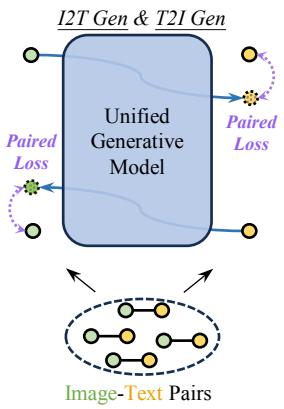

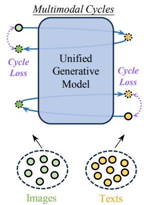  
(a) Training on paired data  
(b) Training in Multimodal Cycles  
Figure 1. Training paradigms for unified generative models. (a) Traditional training involves using paired image-text data and optimizing the unified model with paired losses for both image-to-text (I2T) and text-to-image (T2I) generation tasks. (b) In contrast, the proposed multimodal cycle training framework leverages unpaired images and texts. By using cycle-consistency losses, the unified model learns to maintain consistency between input and output across modalities, enabling adaptation without the need for extensive paired datasets.

High-quality image-text paired data is relatively rare and scarce, but unpaired images and texts are readily available in our daily lives, such as video websites, image platforms, and content from novel websites. Therefore, we aim to explore whether it is possible to adapt generative models to target domains based on unpaired data. To achieve this goal, it is crucial for the model to have an internal capability to align the two modalities to some extent. Fortunately, recent advancements in unified generative models have encouraged us to pursue this direction.

Recent advanced unified generative models [14, 18, 58, 67, 77] have shown great potential in unifying multimoda understanding and generation within a single model. These unified models are capable of processing and generating content across different modalities, i.e. vision and language, within a shared framework. By leveraging the bidirectional mappings between vision and language, which are learned by the unified generative model in its pre-training stage, we can map each data from one modality to another and then back to the original modality, as shown in Fig. 1. Through these two mappings, data can be maintained within the same modality, thereby imposing constraints on the deviation introduced in the process. This only requires computing the cross-entropy loss between the data in the same modality, without any paired data supervision.

To this end, we introduce DoraCycle, a framework for adapting unified multimodal generative models to target domains, through cycle-consistent learning with unpaired data. Unlike previous adaptation methods that heavily rely on paired text-image data, the proposed framework leverages the shared latent space of unified models to learn consistent transformations between modalities without requiring paired training examples. Specifically, we design two cycles, i.e. text-to-image-to-text (T cycle) and image-totext-to-image (I cycle). As shown by Fig. 1 (b), leveraging the pre-trained vision-language alignment of the unified model, each multimodal cycle involves two cross-modality mappings while optimizing in the same modality. This enables calculating loss on unpaired data while implicitly refining cross-modal alignment through the intermediate step.

In practice, since there is no labeled ground-truth, mapping data to another modality requires multi-step inference, such as predicting the next token multiple times for text generation. Allowing all forward steps to participate in gradient backpropagation can lead to a catastrophic gradient explosion. Therefore, we stop gradients during multi-step inference and use the generated data as pseudo labels for the model to forward once again, allowing gradients to propagate. Moreover, we found that since a complete cycle requires the model to forward twice, it can lead to training instability, with the quality of pseudo data generated in the middle being compromised. To enhance the stability of pseudo data generation, we maintain a slowly updated EMA (Exponential Moving Average) [57] model, which is used for inference to generate pseudo data. Additionally, we employ gradient clipping techniques to avoid conflicts in the optimization directions of the two cycles, further increasing training stability.

The experiments indicate that for tasks independent of paired knowledge, such as stylization and domain-specific adaptation, DoraCycle can adapt the unified model with only unpaired data, which is both more practical and scalable. For tasks that require new paired knowledge, such as identity-specific adaptation, DoraCycle effectively utilizes small amounts of paired data along with larger-scale unpaired data, making it a flexible solution for generative adaptation challenges. We conduct extensive experiments that compare DoraCycle to existing methods, showing that our approach achieves comparable or superior results while significantly reducing the need for paired data. This ability to harness large-scale unpaired data, combined with strategic usage of small paired datasets, makes DoraCycle a feasible solution for personalized multimodal content generation across a wide range of applications.

## 2. Related Works

## 2.1. Multimodal Generation and Understanding

Generating visual contents from text and describing them through natural language have been extensively studied as core multimodal tasks. Advanced generative models [3, 5, 6, 8, 12, 13, 16, 19, 36, 37, 42, 44, 45, 49, 74–76], such as DALL·E [41, 43], Stable Diffusion [46], demonstrate remarkable generation capabilities, producing high-quality and diverse contents from textual prompts. Meanwhile, image captioning models [24, 26, 27, 60, 61, 63], such as mPLUG [31], and BLIP [33], push the boundaries of visual understanding, generating accurate and context-aware descriptions. Additionally, recent advancements in multimodal large language models [32], such as LLaVA [35], MiniGPT-4 [78], and InstructBLIP [11], have significantly improved the ability to understand and reason about visua content.

Besides the powerful foundational generative models, adapting or customizing them attracts increasing interest, which enables more personalized and specific outputs based on user preferences [7, 9, 17, 20, 29, 30, 38, 68]. Approaches like DreamBooth [47] enable user-specific customization by fine-tuning generative models with personal data, allowing the generation of content tailored to individual needs or preferences.

## 2.2. Unified Multimodal Generative Models

Unified multimodal generative models aim to bridge the gap between understanding and generation tasks, and integrate vision and language into a single framework, enabling the model to learn shared representations across modalities [1, 2, 14, 18, 53, 56, 64, 65, 67, 69–71, 77]. SEED-X [18] utilizes a unified architecture where visual features extracted from the CLIP ViT encoder [40] are combined with text tokens and fed into a large language model to enable both next-word prediction and image regression tasks. DreamLLM [14] extends the generative capability of large language models by combining multimodal inputs directly into LLMs. Chameleon [58] employs a discrete tokenization approach for both visual and textual inputs, converting all modalities into a unified token space that is processed by a transformer-based architecture. Transfusion [77] introduces an advanced integration mechanism that focuses on directly fusing visual encoding with language tokens, allowing the model to effectively translate visual information into textual formats while maintaining the semantic integrity of both modalities. Show-o [67] combines autoregressive modeling with a discrete diffusion process, enabling the generation of high-quality outputs that are aligned across modalities. Our work leverages the advancements made by these foundational models and explores how to adapt the foundational model to specific domains.

## 2.3. Cycle Consistency

Cycle consistency has been utilized in computer vision and natural language processing as a means to enhance model robustness and consistency [10, 15, 21, 23, 51, 51, 52, 73]. CycleGAN [79] introduced cycle consistency loss to align unpaired image domains, ensuring that mappings between domains (e.g., $\mathbf { A }  \mathbf { B }  \mathbf { A } )$ remain consistent. In the field of natural language processing, back-translation employs similar ideas by translating sentences between languages in both directions to improve translation quality [50]. However, the cycle consistency in these works is in a single modality, i.e. vision or language. Recently, ITIT [34] was proposed to utilize cycle consistency to train visionlanguage generative models. ITIT takes in a mixture of unpaired data and paired data to pre-train the foundational generative model. It is constructed with one image-text encoder and two modality-specific decoders, which operate on the encoded image-text features to generate either text or image tokens. In contrast, we utilized a single unified transformer to parse and predict text and image tokens together. Besides, we focus on adapting pre-trained foundational models to new domains efficiently rather than retraining new foundation models.

## 3. Method

The proposed DoraCycle framework, as shown in Fig. 2, is built upon the unified generative model designed for multimodal tasks involving both vision and language [58, 67, 77]. The unified model uses a single transformer to learn bidirectional mappings between vision and language, providing a powerful backbone capable of processing and generating different modalities [67]. For captioning, the model takes in image tokens and predicts corresponding text tokens, while for image generation, it takes in text tokens and predicts image tokens. This versatility makes the unified model wellsuited as a base for our proposed framework.

In the following sections, we first introduce the design of multimodal cycles, and then discuss the stabilization of optimization, and the balance of two cycles.

## 3.1. Multimodal Cycles

To adapt the unified model for domain-oriented adaptations using unpaired data, we design two multimodal cycles: the Image-to-Text-to-Image Cycle (I Cycle) and the Text-to-Image-to-Text Cycle (T Cycle). Each cycle utilizes data from a single modality, allowing the model to adapt without relying on paired data.

T Cycle: The T cycle training involves transforming an input textual sequence into an image representation and then back into a textual sequence, enforcing consistency between the generated and original text. Specifically, at each training iteration, we begin with an input text sequence $T = [ t _ { l } ] _ { l = 1 } ^ { L }$ . Conditioned on this, the unified model generates pseudo-paired image tokens $I ^ { \prime } { , }$ , representing the visual interpretation of the input text. The generated image tokens are then subjected to a random masking operation, denoted as $I _ { M } ^ { \prime }$ , where a subset of the tokens is masked. The unified model is then called to reconstruct these masked tokens to form the complete synthesized image ${ \tilde { I } } .$

In the second half of the cycle, conditioning on image ${ \tilde { I } } ,$ the model generates the corresponding text sequence. The objective of the T cycle is to enforce cycle consistency between the generated text and the original input text $T .$ The T cycle consistency loss is defined as follows:

$$
\mathcal { L } _ { T C } = - \mathbb { E } _ { T \in \mathcal { D } t e x t } \big [ \sum _ { l = 1 } ^ { L } \log p ( t _ { l } | \tilde { I } , t _ { 0 } , \cdot \cdot \cdot , t _ { l - 1 } ) \big ] ,\tag{1}
$$

where the text is the set of text samples from the target domain.

I Cycle: The I cycle training begins with an input image, which is subsequently mapped to a textual representation and then transformed back to an image, enforcing consistency between the generated image and the original image tokens. At each training iteration, we start with input image tokens I. The unified model is used to synthesize pseudopaired text tokens $T ^ { \prime }$ , representing the textual description of the image. We then use $T ^ { \prime }$ in conjunction with the input image token I to predict the reconstructed text tokens T˜.

In the second half of the cycle, we pass the masked image tokens $I _ { M }$ and the text $\tilde { T }$ through the model to regenerate the masked image tokens. The cycle enforces consistency between the reconstructed and the original image tokens. The loss for enforcing I cycle consistency is given by:

$$
\mathcal { L } _ { I C } = - \mathbb { E } _ { I \in \mathcal { D } _ { i m a g e } } \big [ \sum _ { \forall k : m _ { k } = 1 } \log p ( i _ { k } | I _ { M } , \tilde { T } ) \big ] ,\tag{2}
$$

where the image is the set of image samples from the target domain, which are unpaired with the text samples.

By leveraging these two cycles, our framework forces the model to refine its generative understanding of both image and text representations, ensuring consistency between the input and output while effectively leveraging unpaired data to adapt the unified towards the target domain.

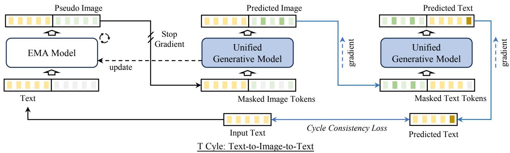  
Figure 2. The overview of T cycle (text-to-image-to-text) of the proposed DoraCycle. The I cycle is similar and is omitted in the figure for brevity.

Efficient Training: In the intermediate steps of both cycles, generating the middle representation (i.e., captions or images) requires multiple forward passes. This is because the generation process involves either predicting the next tokens or the masked tokens multiple times. Backpropagating gradients through all these steps is computationally prohibitive. Thus, we first generate the intermediate results using the model in inference mode as pseudo-paired data, which are then used as the ground truth in the teacherforcing scheme [54, 55] for the first half of the cycles. In this way, we reduce the number of forward passes to two, i.e. one for generating the middle result and one for the final output, thus making the overall training process more memory efficient.

Token Differentiability: Since the intermediate outputs in each cycle are discrete tokens, which can not directly propagate gradients, we employ the Gumbel-Softmax [28] to make these token representations differentiable.

## 3.2. Stabilizing Optimization

Each cycle involves the same unified model twice in the forward pass, which leads to optimization instabilities. To stabilize the training process, we adopt the Exponential Moving Average (EMA) training technique [57]. Specifically, we maintain a shadow version of the model, referred to as the EMA model, which is updated using an exponentially decaying average of the parameters of the main model.

$$
\theta _ { \mathrm { E M A } }  \alpha \theta _ { \mathrm { E M A } } + ( 1 - \alpha ) \theta _ { \mathrm { m a i n } } ,\tag{3}
$$

where ε is a decay factor (set to 0.999) that controls the update rate, and $\theta _ { \mathrm { { m a i n } } }$ represents the parameters of the main model.

In each training step, the EMA version of the model is used to generate the intermediate representation tokens (e.g., pseudo image or text tokens) which serve as pseudo ground truth during training. By using these stable targets from the slower-evolving EMA model, we can mitigate the risks of optimization instability. The main model is thus able to learn from more consistent and reliable intermediate targets, rather than being affected by fluctuations during the early stages of training.

## 3.3. Balancing Two Cycles

We observe that the T cycle tends to converge faster than the I cycle, primarily because textual data is inherently onedimensional and simpler to learn compared to images. This imbalance in optimization leads to a kind of collapse of the model, where it tends to generate irrelevant but selfconsistent captions for images, ultimately degrading the image-text alignment capability.

To address this problem, we make the gradients of the T cycle orthogonal to those of the I cycle, thus preventing interference. This is achieved by modifying the gradients using gradient surgery [72]. Let gT and gI represent the gradients of the T cycle and the I cycle, respectively. We project $g _ { T }$ onto the orthogonal complement of $g _ { I }$ to obtain the modified gradient $g _ { T } ^ { \prime }$ , which is defined as:

$$
g _ { T } ^ { \prime } = g _ { T } - \frac { g _ { T } \cdot g _ { I } } { g _ { I } \cdot g _ { I } } g _ { I } ,\tag{4}
$$

where $g _ { T } \cdot g _ { I }$ denotes the dot product between the gradients of the T and I cycle.

Additionally, we reweight the losses to further balance the learning between the I and T cycles. The final loss function is as,

$$
\begin{array} { r } { \mathcal { L } = \mathcal { L } _ { I C } + \beta \mathcal { L } _ { T C } , } \end{array}\tag{5}
$$

where the $\beta$ is the weight of the T cycle loss.

## 4. Experiments

## 4.1. Implementation Details

To the best of our knowledge, Show-o [67] is currently the only fully open-source unified generative model with complete pre-trained weights and training code, including both its understanding and generation capabilities. Therefore, we base DoraCycle on Show-o and conduct experiments accordingly. The base model is a unified transformer model that performs understanding and image generation by predicting discrete textual and visual tokens. We insert trainable low-rank adaptations (LoRA) [25] modules into the Q projection and V projection of the attention layers from layers 7 to 24. The LoRA rank is set to 32. The $\beta$ is set to 0.1 to balance the optimization of two cycles.

The training of DoraCycle is performed on 8 NVIDIA H100 GPUs with mixed precision enabled for memory efficiency. We set the batch size to 32, with each cycle taking half of the batch when both cycles are being optimized simultaneously. The learning rate is set to $1 e ^ { - \bar { 4 } }$ with a cosine annealing schedule. The optimizer is AdamW with weight decay of $1 e ^ { - 2 }$ . Additionally, EMA is employed to stabilize the training process, as described in Section 3.2.

## 4.2. Domain-Oriented Adaptations

Unpaired Training: For tasks that do not require strongly related paired knowledge, our DoraCycle can fully learn the target domain using unpaired data. For example, to learn the cyberpunk style, we collected 300 cyberpunk-style images as input for the I cycle, and used the text data from the base model pre-training dataset [4] for the T cycle, with the keyword ”cyberpunk style” automatically injected into text, prompting the model about the target style we want.

The experimental results are shown in Fig. 3. Given the same text prompt to generate cyberpunk-style images, Fig. 3 (a) shows the images generated by the base model without additional training. It can be observed that the base model adds some cyberpunk elements, such as neon lights, but the overall atmosphere does not align well with the desired style. Fig. 3 (d) shows the images generated by the adapted model trained with DoraCycle, which aligns well with the target style. Traditional text-to-image customization or adaptation methods, such as DreamBooth [48], rely on paired data for training. Therefore, we simulate usercreated paired data by annotating the collected images with captions, and split them into two groups. One group contained only 10 paired examples, which is an acceptable workload for users, while the other group contained captions for all 300 images, which would be labor-intensive and impractical for users. The images generated by the model that trained on 10 paired examples are shown in Fig. 3 (b). It struggled to produce good stylized images, likely because the combination of indoor bookshelves with the cyberpunk style is too novel for the model to generalize well from limited paired data. The images generated by the model trained on 300 paired examples are shown in Fig. 3 (c), which have better outputs. In contrast, the model trained using DoraCycle does not require manual captioning, significantly reducing the workload for users.

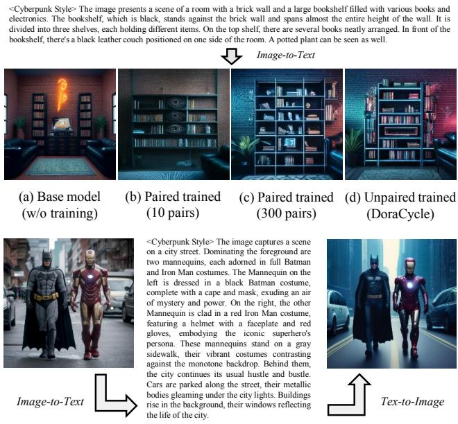  
(e) Image-to-Text-to-Image translation by the adapted unified model.  
Figure 3. Domain-oriented adaptation with different training setups. (a) Image generated by the base model without training for adoption. (b) Image generated by the model trained with 10 paired image-text samples. (c) Image generated by the model trained with 300 paired image-text samples. (d) Image generated by the model trained by DoraCycle on only unpaired data. (e) Image-to-Textto-Image translation performed by the adapted model trained by DoraCycle.

Fig. 3 (e) illustrates the adapted model trained by DoraCyle maintains semantic consistency through image-totext-to-image translation. The input image is transformed into a textual description and then reconstructed into an image. The result shows that the adapted model successfully captures and retains the key visual components in the original image throughout the multimodal cycle. Notably, the identity of the characters and the details of the environment are all preserved, indicating effective bidirectional understanding and generation capabilities in the target domain. Furthermore, the newly generated image incorporates styles learned from the target domain, demonstrating the generalization of the learned knowledge to images in the wild.

Learning Paired Knowledge: For tasks that require learning some paired knowledge, such as associating an identity name with its visual appearance, DoraCycle can incorporate a small amount of paired data to learn such associations while leveraging a large amount of unpaired

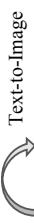

Text-to-Image

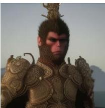

Destined One, wears an intricately detailed golden armor with elaborate ornaments and engravings. A golden crown-like adornment sits atop his head. In the background, distant mountains and a serene sky can be seen.

(a)  
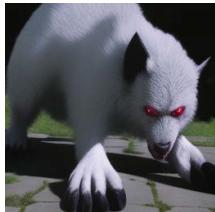

Image-to-Text

Lingxuzi's glowing red eyes and bared fangs indicate its aggressive nature. It crouches low to the ground, its large hand-like paw spread over ancient stone paving surrounded by patches of grass.

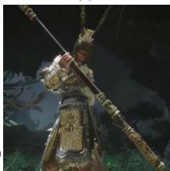

Destined One stands tall, wielding a massive golden stick that dominates the frame. The individual exudes power, strength, and determination, clad in ornate armor that gleams with gold. A hat adds a touch of regality. The background is dramatic, with shadows cast by trees hinting at a mysterious atmosphere. The grass beneath the figure is lush and green, contrasting with the ruggedness of the ground.

Nobita is sitting under a tree, trying to finish his math homework. He looks stressed, with one hand on his chin and scratching his head with the other

(g)  
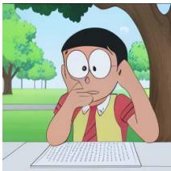

Image-to-Text

(m)  
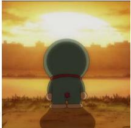

Doraemon is standing on the shore, looking out at the sunset. He has a calm expression, and the sun is setting over the water, casting a warm glow. The sky is filled with clouds, and there are silhouettes of buildings in the distance.

## Domain 1: Black Myth Wukong

(s)  
(b)  
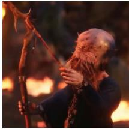

Keeper, an elderly, hunched individual with a bald, heavily wrinkled head covered in spots. Keeper has a long, unkempt beard and is dressed in a simple, tattered blue robe. He grips a gnarled wooden staff for support as he walks through a forest fire. His posture is stooped, and his facial features are mostly obscured by his thick beard

(h)  
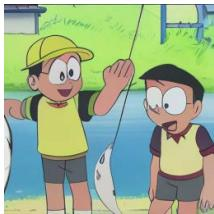

Suneo and Nobita are at a fishing pond, trying to catch a fish. Nobita, in his bright yellow fishing hat and a sharp outfit, confidently casts his line into the water. Suneo watches Nobita’s struggle with a smile, offering some tips to help him out. The two boys share a laugh as the wait for a bite.

(n)  
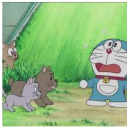

Doraemon is standing in the grass, looking surprised as he sees a group of cats. The cats are gathered around him, with one of them appearing to be a cat with a surprised expression. The background shows a fence and som bushes.

(t)  
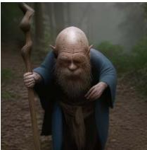

Keeper grips a gnarled wooden staff for support as he walks through a wooded area. His posture is stooped, and his facial features are mostly obscured by his thick beard. The scene is set in a forest, with a textured ground of leaves and dirt.

(c)  
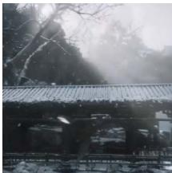

The image depicts a serene, snowy landscape with a large, ancient-looking wooden bridge spanning across a frozen river. The bridge has a traditional, Asian design, with intricate carvings and a slatted roof. Bare trees with frost-covered branches surround the scene, casting a calm, wintery atmosphere. Snowflakes gently fall, enhancing the tranquil, mystical ambiance

(i)  
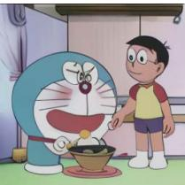

Doraemon is cooking in the kitchen, while holding a bowl. He looks excited, flipping a pancake into the air. Nobita is standing beside him, smiling gently, watching Doraemon.

(o)  
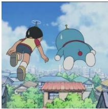  
Doraemon is flying through the air, looking down at the city below. Nobita is also flying through the air, looking down at the city.

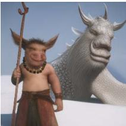  
(u)  
Domain 2: Doraemon

Zhu Bajie stands confidently in the snow, gripping his staff with a sly smile on his boar-like face, beads hanging around his neck. Beside him lies the majestic, wounded form of Kang-Jin Loong, a silver-scaled dragon with intricate, ethereal horns and whiskers.

(d)  
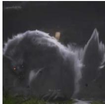

Lingxuzi is depicted as a large, menacing fox-like creature with thick, flowing white fur. Its red eyes glow intensely, giving an eerie, supernatural appearance. The creature is in a crouching stance, with its body slightly arched and its tails fanned out behind it, showing both power and readiness to strike. The dark background adds to the ominous atmosphere, contrasting with the brightness of its fur.

(j)  
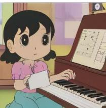  
Shizuka is sitting by a piano, composing a new tune. She looks thoughtful, her fingers delicately pressing the keys as she tries different melodies. A notebook rests on the piano stand, filled with her notes and musical ideas, and she appears content in the process.

(p)  
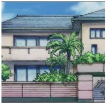  
The image depicts a two-story house with a large garden in front of it. The house has a tan exterior and is surrounded by a variety of plants, including palm trees and bushes. The garden is well-maintained. The house features a balcony on the second floor adding to its charm.

(v)  
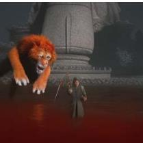

Tiger Vanguard charges through the blood-red waters towards Destined One. The massive stone statue behind him looms ominously, adding to the intensity of the scene. Destined One stands firm, his staff held at the ready, his gaze unwavering as he prepares for the oncoming assault. The water ripples around them, reflecting the dark hues of the battle setting

(e)  
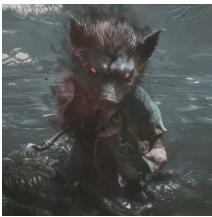

Zhu Bajie stands menacingly in a murky, mist-covered swamp, his humanoid body combined with the head of a fierce, snarling boar. His red glowing eyes pierce through the fog, radiating a dark energy. Dressed in a tattered green robe, he wears a string of large beads around his neck, adding a sense of mysticism. His left hand clutches a spiked weapon, while shadows and wisps of smoke swirl around him, amplifying his sinister presence.

(k)  
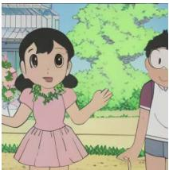

Shizuka and Nobita are making flower crowns at the park. Shizuka, in her soft pink dress, weaves flowers together. Nobita, in his casual shorts, tries his best to copy her.

(q)  
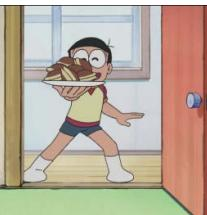  
Nobita is standing in the doorway, holding a plate with a doughnut on it. He looks excited, and the doughnut is on a white plate. The door is open, and the room is visible in the background.

Figure 4. Image-to-text and text-to-image generation by the unified models that adapted for two domains. The special tokens are omitted.  
(w)  
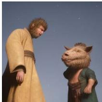

Destined One stands tall, his gaze cast downward, his weathered yellow robe flowing with subtle wear, reflecting the trials he has endured. Beside him, Zhu Bajie looks up with a playful expression, his boar-like face filled with curiosity and mischief. The two figures share a quiet moment, framed against an open, clear sky dotted with drifting embers.

(f)  
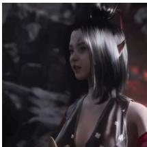

A female character with a uniqu appearance, having a combination of human and demonic features. She ha a short, black, straight hairstyle and pair of horns protruding from her head. Her skin is pale, and she has a few dots on her forehead, giving her a mystical look. She is wearing a black, low-cut top adorned with whit flowers, and her right arm is covered in red fabric. She has a focused and intense expression on her face, as if she is concentrating on something important. (l)

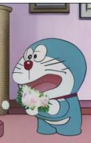

Doraemon is standing in front of the white cat with an excited expression He is holding a bouquet of flowers, in front of the cat. The white cat, sitting on a small cushion, is looking at Doraemon with a curious or intrigued expression. The setting appears to b indoors, with a pink carpet, a scratching post in the background, and a framed picture on the wall.

(r)  
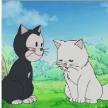

White cat and black cat are sitting on the grass, looking at each other wit affection, with a blue sky in the background, and a few clouds scattered across the sky.

(x)

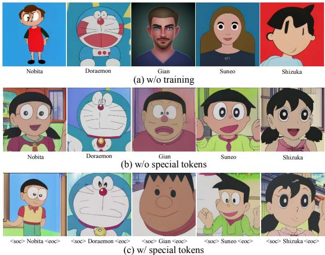  
Figure 5. Effect of special tokens on character learning. (a) Base model without training. (b) Model trained without using special tokens, showing attribute confusion among characters. (c) Model trained with special tokens, improving character attribute alignment and reducing confusion.

data to comprehensively learn general aspects of the target domain. Specifically, in each batch, for data with paired ground truth, we compute the token prediction loss and also include it in the cycle, use ground truth as the pseudo middle generations, and compute the cycle loss. For unpaired data, we compute the unpaired cycle loss.

For example, when adapting the model to Domain 1: Black Myth Wukong and Domain 2: Doraemon, we annotate 1-3 images per unique identity with captions that specify the name of the identity. For each domain, we collect 2k images, which are mostly sampled from online videos, and independently collect text descriptions, which are further expanded to 1k by ChatGPT [39]. The final adapted model trained with DoraCycle demonstrates strong performance in both text-to-image generation and image-to-text generation, as shown in Fig. 4.

In terms of text-to-image results, the model trained with DoraCycle effectively generated images that aligned well with the target domains. In domain 1 (Black Myth Wukong), the generated images accurately depicted domain-specific visual elements, such as the intricate details of character appearances and the overall fantasy-like atmosphere. This indicates that the model successfully learned to generalize the visual features from text prompts to realistic images within the target domain. Similarly, in domain 2 (Doraemon), the generated images preserve the iconic cartoonish aesthetics and capture key visual details of the characters and settings, demonstrating effective domain adaptation.

For the image-to-text task, the model performs well in generating contextually accurate captions. In domain 1, the generated captions provide rich descriptions of the characters, their attributes, and the context, effectively mirroring the visual elements present in the input images. In domain 2, the captions correctly describe the characters, their actions, and their environments concisely, maintaining consistency with the visual style. The ability of the model to generate accurate descriptions highlights its robust understanding of the visual components of the domain.

Additionally, an interesting phenomenon can be observed in how the model handles the visual elements that are not annotated with paired data. For instance, in Fig. 4 (w), the dorayaki (a type of sweet bean-filled pancake) was described by the model as a ”doughnut”. This may be due to the fact that the anime-style representation of the dorayaki is novel, and neither the base model nor the unpaired training provided specific textual-visual pairing knowledge about it. On the other hand, in the example shown in Fig. 4 (x), we annotate the white cat as a character with paired textual and visual data, using a special token for its name: ”<soc> white cat <eoc>”. Interestingly, although no paired annotation is provided for the black cat, the model still predicts the special token for it as ”<soc> black cat <eoc>” during the caption generation. This suggests that the model autonomously categorized the black cat as a character when learning the target domain, indicating that it may have attempted to generalize learned knowledge from one type of entity to similar ones.

Enhanced Learning with Special Tokens: As shown in Fig. 5, we experimentally find that the model often confused multiple novel concepts in the target domain. Fig. 5 (a) shows the image generated by the base model without training taking in the name of characters. Fig. 5 (b) shows the characters generated by the trained model. During training, the names of characters are directly included in the text without special treatment, leading to attribute confusion between characters. The varying lengths of the tokenized character names also make learning difficult. To solve this problem, we introduce a simple yet efficient solution: adding special tokens around character names. We introduced start of character (<soc>) and end of character (<eoc>) tokens to enclose character names, which significantly enhance the learning of novel concepts. As shown in Fig. 5 (c), involving special tokens improves the alignments between characters and their names.

## 4.3. Comparisons

In this section, we use the Storyboard20K [66] dataset to conduct the quantitative comparison experiments. The storyboards originating from the same data source are grouped to form a domain, consisting of images and descriptive text. The data are used under three different settings, i.e. totally unpaired, only paired, and paired plus unpaired data,

Table 1. Comparison of different training methods under various data settings. The best value is highlighted in blue , and the second-best value is highlighted in green . “P” indicates paired data, and “U” indicates unpaired data.
<table><tr><td rowspan="2"></td><td rowspan="2">T cycle I cycle</td><td rowspan="2"></td><td rowspan="2">T Data</td><td rowspan="2">I Data</td><td rowspan="2">FID-1K↓</td><td rowspan="2">CIDEr ↑</td><td colspan="2">Human Eval</td></tr><tr><td>T2I Align ↑</td><td>I2T Align↑</td></tr><tr><td rowspan="2">DreamBooth [48]</td><td></td><td>=</td><td>10%P</td><td>10% P</td><td>33.22</td><td>32.74</td><td>3.25</td><td>1.83</td></tr><tr><td>1</td><td>-</td><td>100% P</td><td>100% P</td><td>24.93</td><td>41.55</td><td>4.13</td><td>3.96</td></tr><tr><td rowspan="4">DoraCycle</td><td>X</td><td>√</td><td>x</td><td>100%U</td><td>28.93</td><td>30.54</td><td>3.38</td><td>1.62</td></tr><tr><td>√</td><td>x</td><td>100%U</td><td>x</td><td>36.63</td><td>35.70</td><td>3.26</td><td>2.17</td></tr><tr><td>√</td><td>√</td><td>100% U</td><td>100%U</td><td>27.44</td><td>38.17</td><td>3.84</td><td>3.42</td></tr><tr><td>√</td><td>√</td><td>10% P + 90% U</td><td>10% P + 90% U</td><td>25.37</td><td>40.90</td><td>4.12</td><td>3.81</td></tr><tr><td>ITIT [34]</td><td>√</td><td>√</td><td>10% P + 90% U</td><td>10% P + 90% U</td><td>27.50</td><td>38.62</td><td>3.85</td><td>3.52</td></tr></table>

as shown in Table 1.

The compared methods include DreamBooth [48] and ITIT [34]. We implement DreamBooth as a paired-training baseline by applying LoRA fine-tuning on the unified model. The original design of ITIT is different, in which the image and text decoders are separate models, and its code has not been released. We adjusted and re-implemented it to be suitable for our unified model architecture.

We use both automatic and human evaluations to compare the performance of different methods. For automatic evaluation, we use FID to measure the distribution differences between the generated images and the target domain images [22], and CIDEr to compute the error between the generated text and the ground truth [59]. For human evaluation, we create 100 questions for the generated results of models, each rated by three different human raters. The raters are asked to evaluate the alignment between the image and text on a scale from 1 to 5, where 1 indicates no relevance and 5 indicates complete alignment.

The experimental results in Table 1 demonstrate that the proposed DoraCycle performs competitively under several data settings. Specifically, when using a combination of paired and unpaired data, DoraCycle outperforms ITIT. Compared to DreamBooth, which heavily relies on paired data, DoraCycle outperforms it when using the same scale of paired data, i.e. 10% paired data, indicting the benefits brought by 90% unpaired data. While Dreambooth with 100% achieves the best evaluation scores, the scores of the DoraCycle with 10% paired and 90% unpaired data are comparable with them.

Table 1 also shows the difference in the performance of DoraCyle under different cycle settings. It is shown that without the T cycle and with only the I cycle, the captioning ability of the adapted model degrades more significantly. In contrast, if only the T cycle is used and without the I cycle, the FID score increases substantially, indicating that the generated image distribution mismatches with the target distribution.

## 4.4. Ablation Studies

Table 2 shows that removing key components from DoraCycle significantly impacts performance. Without EMA, the FID score increases from 25.37 to 27.19, indicating lower image quality

Table 2. Ablation Studies. EMA refers to the exponential moving average. GS refers to gradient surgery.
<table><tr><td></td><td>FID-1K↓</td><td>CIDEr ↑</td></tr><tr><td>w/o EMA</td><td>27.19</td><td>38.85</td></tr><tr><td>w/o GS</td><td>25.54</td><td>39.98</td></tr><tr><td>DoraCycle</td><td>25.37</td><td>40.90</td></tr></table>

due to less stable training. Removing Gradient Surgery (GS) will reduce the CIDEr score and increase the FID, indicating a worse performance. This demonstrates the importance of mitigating the interference between the optimization directions of two cycles. The complete DoraCycle framework, with both EMA and GS, has the best performance across all metrics, demonstrating the importance of these components in achieving better optimization.

## 5. Conclusion

We propose the DoraCycle to adapt the unified generative model to target domains within multimodal cycles. By leveraging both image-to-text-to-image and text-to-imageto-text cycles, DoraCycle changes the learning objectives into the same modality, allowing for effective optimization using unpaired data. Our experiments show that DoraCycle can adapt the unified model to target domains using only unpaired data, or involving a small amount of paired data when necessary to learn specific concepts. Experimental results demonstrate that DoraCycle achieves advanced or comparable performance across various settings. Leveraging unpaired data broadens the application potential of DoraCycle, making it ideally suited for domain adaptation tasks where paired data is scarce or challenging to collect.

## 6. Acknowledgments

This research is supported by the National Research Foundation, Singapore under its AI Singapore Programme (AISG Award No: AISG3-RP-2022-030).

## References

[1] Armen Aghajanyan, Bernie Huang, Candace Ross, Vladimir Karpukhin, Hu Xu, Naman Goyal, Dmytro Okhonko, Mandar Joshi, Gargi Ghosh, Mike Lewis, et al. Cm3: A causal masked multimodal model of the internet. arXiv preprint arXiv:2201.07520, 2022. 2

[2] Emanuele Aiello, LILI YU, Yixin Nie, Armen Aghajanyan, and Barlas Oguz. Jointly training large autoregressive multimodal models. In ICLR, 2024. 2

[3] Yogesh Balaji, Seungjun Nah, Xun Huang, Arash Vahdat, Jiaming Song, Karsten Kreis, Miika Aittala, Timo Aila, Samuli Laine, Bryan Catanzaro, et al. ediffi: Text-to-image diffusion models with an ensemble of expert denoisers. arXiv preprint arXiv:2211.01324, 2022. 2

[4] Soravit Changpinyo, Piyush Sharma, Nan Ding, and Radu Soricut. Conceptual 12m: Pushing web-scale image-text pretraining to recognize long-tail visual concepts. In Proceedings of the IEEE/CVF conference on computer vision and pattern recognition, pages 3558–3568, 2021. 5

[5] Junsong Chen, Chongjian Ge, Enze Xie, Yue Wu, Lewei Yao, Xiaozhe Ren, Zhongdao Wang, Ping Luo, Huchuan Lu, and Zhenguo Li. Pixart- sigma: Weak-to-strong training of diffusion transformer for 4k text-to-image generation. arXiv preprint arXiv:2403.04692, 2024. 2

[6] Junsong Chen, Jincheng Yu, Chongjian Ge, Lewei Yao, Enze Xie, Zhongdao Wang, James T. Kwok, Ping Luo, Huchuan Lu, and Zhenguo Li. Pixart-ω: Fast training of diffusion transformer for photorealistic text-to-image synthesis. In ICLR. OpenReview.net, 2024. 2

[7] Li Chen, Mengyi Zhao, Yiheng Liu, Mingxu Ding, Yangyang Song, Shizun Wang, Xu Wang, Hao Yang, Jing Liu, Kang Du, et al. Photoverse: Tuning-free image customization with text-to-image diffusion models. arXiv preprint arXiv:2309.05793, 2023. 2

[8] Mark Chen, Alec Radford, Rewon Child, Jeffrey Wu, Heewoo Jun, David Luan, and Ilya Sutskever. Generative pretraining from pixels. In ICML, pages 1691–1703, 2020. 2

[9] Xi Chen, Lianghua Huang, Yu Liu, Yujun Shen, Deli Zhao, and Hengshuang Zhao. Anydoor: Zero-shot object-level image customization. In Proceedings of the IEEE/CVF Conference on Computer Vision and Pattern Recognition, pages 6593–6602, 2024. 2

[10] Yunjey Choi, Minje Choi, Munyoung Kim, Jung-Woo Ha, Sunghun Kim, and Jaegul Choo. Stargan: Unified generative adversarial networks for multi-domain image-to-image translation. In Proceedings of the IEEE Conference on Computer Vision and Pattern Recognition (CVPR), 2018. 3

[11] Wenliang Dai, Junnan Li, Dongxu Li, Anthony Meng Huat Tiong, Junqi Zhao, Weisheng Wang, Boyang Li, Pascale Fung, and Steven Hoi. Instructblip: Towards general-

purpose vision-language models with instruction tuning, 2023. 2

[12] Xiaoliang Dai, Ji Hou, Chih-Yao Ma, Sam Tsai, Jialiang Wang, Rui Wang, Peizhao Zhang, Simon Vandenhende, Xi aofang Wang, Abhimanyu Dubey, et al. Emu: Enhancing image generation models using photogenic needles in a haystack. arXiv preprint arXiv:2309.15807, 2023. 2

[13] Prafulla Dhariwal and Alexander Nichol. Diffusion models beat gans on image synthesis. Advances in Neural Informa tion Processing Systems, 34:8780–8794, 2021. 2

[14] Runpei Dong, Chunrui Han, Yuang Peng, Zekun Qi, Zheng Ge, Jinrong Yang, Liang Zhao, Jianjian Sun, Hongyu Zhou, Haoran Wei, Xiangwen Kong, Xiangyu Zhang, Kaisheng Ma, and Li Yi. DreamLLM: Synergistic multimodal com prehension and creation. In ICLR, 2024. 1, 2

[15] Debidatta Dwibedi, Yusuf Aytar, Jonathan Tompson, Pierre Sermanet, and Andrew Zisserman. Temporal cycleconsistency learning. In Proceedings of the IEEE/CVF conference on computer vision and pattern recognition, pages 1801–1810, 2019. 3

[16] Patrick Esser, Sumith Kulal, Andreas Blattmann, Rahim Entezari, Jonas Muller, Harry Saini, Yam Levi, Dominik¨ Lorenz, Axel Sauer, Frederic Boesel, et al. Scaling rectified flow transformers for high-resolution image synthesis. arXiv preprint arXiv:2403.03206, 2024. 2

[17] Rinon Gal, Yuval Alaluf, Yuval Atzmon, Or Patashnik, Amit H Bermano, Gal Chechik, and Daniel Cohen Or. An image is worth one word: Personalizing text-toimage generation using textual inversion. arXiv preprint arXiv:2208.01618, 2022. 2

[18] Yuying Ge, Sijie Zhao, Jinguo Zhu, Yixiao Ge, Kun Yi, Lin Song, Chen Li, Xiaohan Ding, and Ying Shan. Seed-x: Mul timodal models with unified multi-granularity comprehen sion and generation. arXiv preprint arXiv:2404.14396, 2024. 1, 2

[19] Yuchao Gu, Xintao Wang, Jay Zhangjie Wu, Yujun Shi, Yunpeng Chen, Zihan Fan, Wuyou Xiao, Rui Zhao, Shuning Chang, Weijia Wu, et al. Mix-of-show: Decentralized lowrank adaptation for multi-concept customization of diffusion models. Advances in Neural Information Processing Systems, 36:15890–15902, 2023. 2

[20] Jiayi Guo, Chaofei Wang, You Wu, Eric Zhang, Kai Wang, Xingqian Xu, Shiji Song, Humphrey Shi, and Gao Huang. Zero-shot generative model adaptation via image-specific prompt learning. In Proceedings of the IEEE/CVF conference on computer vision and pattern recognition, pages 11494–11503, 2023. 2

[21] Di He, Yingce Xia, Tao Qin, Liwei Wang, Nenghai Yu, Tie Yan Liu, and Wei-Ying Ma. Dual learning for machine translation. In Advances in Neural Information Processing Sys tems (NeurIPS), 2016. 3

[22] Martin Heusel, Hubert Ramsauer, Thomas Unterthiner, Bernhard Nessler, and Sepp Hochreiter. Gans trained by a two time-scale update rule converge to a local nash equilibrium. In Proceedings ofthe 31st International Conference on Neural Information Processing Systems, pages 6626–6637, 2017. 8

[23] Judy Hoffman, Eric Tzeng, Taesung Park, Jun-Yan Zhu, Phillip Isola, Kate Saenko, Alexei A Efros, and Trevor Darrell. Cycada: Cycle-consistent adversarial domain adaptation. In Proceedings ofthe International Conference on Machine Learning (ICML), 2018. 3

[24] MD Zakir Hossain, Ferdous Sohel, Mohd Fairuz Shiratuddin, and Hamid Laga. A comprehensive survey of deep learning for image captioning. ACM Computing Surveys (CsUR), 51(6):1–36, 2019. 2

[25] Edward J. Hu, Yelong Shen, Phillip Wallis, Zeyuan Allen-Zhu, Yuanzhi Li, Shean Wang, and Weizhu Chen. Lora: Low-rank adaptation of large language models. In International Conference on Learning Representations, 2022. 5

[26] Jia Cheng Hu, Roberto Cavicchioli, and Alessandro Capotondi. Exploiting multiple sequence lengths in fast end to end training for image captioning. In 2023 IEEE International Conference on Big Data (BigData), pages 2173–2182. IEEE, 2023. 2

[27] Xiaowei Hu, Zhe Gan, Jianfeng Wang, Zhengyuan Yang, Zicheng Liu, Yumao Lu, and Lijuan Wang. Scaling up vision-language pre-training for image captioning. In Pro ceedings of the IEEE/CVF conference on computer vision and pattern recognition, pages 17980–17989, 2022. 2

[28] Eric Jang, Shixiang Gu, and Ben Poole. Categorical reparameterization with gumbel-softmax. arXiv preprint arXiv:1611.01144, 2016. 4

[29] Xuhui Jia, Yang Zhao, Kelvin CK Chan, Yandong Li, Han Zhang, Boqing Gong, Tingbo Hou, Huisheng Wang, and Yu-Chuan Su. Taming encoder for zero fine-tuning image customization with text-to-image diffusion models. arXiv preprint arXiv:2304.02642, 2023. 2

[30] Nupur Kumari, Bingliang Zhang, Richard Zhang, Eli Shechtman, and Jun-Yan Zhu. Multi-concept customization of text-to-image diffusion. In Proceedings of the IEEE/CVF Conference on Computer Vision and Pattern Recognition, pages 1931–1941, 2023. 2

[31] Chenliang Li, Haiyang Xu, Junfeng Tian, Wei Wang, Ming Yan, Bin Bi, Jiabo Ye, Hehong Chen, Guohai Xu, Zheng Cao, et al. mplug: Effective and efficient vision-language learning by cross-modal skip-connections. arXiv preprint arXiv:2205.12005, 2022. 2

[32] Chunyuan Li, Zhe Gan, Zhengyuan Yang, Jianwei Yang, Linjie Li, Lijuan Wang, Jianfeng Gao, et al. Multimodal foundation models: From specialists to general-purpose assistants. Foundations and Trends® in Computer Graphics and Vision, 16(1-2):1–214, 2024. 2

[33] Junnan Li, Dongxu Li, Silvio Savarese, and Steven Hoi. Blip-2: Bootstrapping language-image pre-training with frozen image encoders and large language models. In International conference on machine learning, pages 19730– 19742. PMLR, 2023. 2

[34] Tianhong Li, Sangnie Bhardwaj, Yonglong Tian, Han Zhang, Jarred Barber, Dina Katabi, Guillaume Lajoie, Huiwen Chang, and Dilip Krishnan. Leveraging unpaired data for vision-language generative models via cycle consistency. arXiv preprint arXiv:2310.03734, 2023. 3, 8

[35] Haotian Liu, Chunyuan Li, Qingyang Wu, and Yong Jae Lee. Visual instruction tuning. NeurIPS, 36, 2024. 2

[36] Nanye Ma, Mark Goldstein, Michael S Albergo, Nicholas M Boffi, Eric Vanden-Eijnden, and Saining Xie. Sit: Exploring flow and diffusion-based generative models with scalable interpolant transformers. arXiv preprint arXiv:2401.08740, 2024. 2

[37] Xin Ma, Yaohui Wang, Gengyun Jia, Xinyuan Chen, Ziwei Liu, Yuan-Fang Li, Cunjian Chen, and Yu Qiao. Latte: Latent diffusion transformer for video generation. arXiv preprint arXiv:2401.03048, 2024. 2

[38] Ron Mokady, Amir Hertz, Kfir Aberman, Yael Pritch, and Daniel Cohen-Or. Null-text inversion for editing real images using guided diffusion models. In Proceedings of the IEEE/CVF Conference on Computer Vision and Pattern Recognition, pages 6038–6047, 2023. 2

[39] OpenAI. Chatgpt. https://chatgpt.com/, 2024. 7

[40] Alec Radford, Jong Wook Kim, Chris Hallacy, Aditya Ramesh, Gabriel Goh, Sandhini Agarwal, Girish Sastry, Amanda Askell, Pamela Mishkin, Jack Clark, et al. Learning transferable visual models from natural language supervision. In International conference on machine learning, pages 8748–8763. PMLR, 2021. 2

[41] Aditya Ramesh, Mikhail Pavlov, Gabriel Goh, Scott Gray, Chelsea Voss, Alec Radford, Mark Chen, and Ilya Sutskever. Zero-shot text-to-image generation. In ICML, pages 8821– 8831. Pmlr, 2021. 2

[42] Aditya Ramesh, Prafulla Dhariwal, Alex Nichol, Casey Chu, and Mark Chen. Hierarchical text-conditional image generation with CLIP latents. CoRR, abs/2204.06125, 2022. 2

[43] Aditya Ramesh, Prafulla Dhariwal, Alex Nichol, Casey Chu, and Mark Chen. Hierarchical diffusion models for text-toimage generation. arXiv preprint arXiv:2204.06125, 2022. 2

[44] Aditya Ramesh, Prafulla Dhariwal, Alex Nichol, Casey Chu, and Mark Chen. Hierarchical text-conditional image generation with clip latents. arXiv preprint arXiv:2204.06125, 1 (2):3, 2022. 2

[45] Robin Rombach, Andreas Blattmann, Dominik Lorenz, Patrick Esser, and Bjorn Ommer. High-resolution image syn- ¨ thesis with latent diffusion models. In CVPR, pages 10684– 10695, 2022. 2

[46] Robin Rombach, Andreas Blattmann, Dominik Lorenz, Patrick Esser, and Bjorn Ommer. High-resolution im- ¨ age synthesis with latent diffusion models. arXiv preprint arXiv:2112.10752, 2022. 2

[47] Nataniel Ruiz, Yuanzhen Li, Varun Jampani, Yael Pritch, Michael Rubinstein, and Kfir Aberman. Dreambooth: Fine tuning text-to-image diffusion models for subject-driven generation. arXiv preprint arXiv:2208.12242, 2022. 1, 2

[48] Nataniel Ruiz, Yuanzhen Li, Varun Jampani, Yael Pritch, Michael Rubinstein, and Kfir Aberman. Dreambooth: Fine tuning text-to-image diffusion models for subject-driven generation. In Proceedings of the IEEE/CVF conference on computer vision and pattern recognition, pages 22500– 22510, 2023. 5, 8

[49] Chitwan Saharia, William Chan, Saurabh Saxena, Lala Li, Jay Whang, Emily L Denton, Kamyar Ghasemipour, Raphael Gontijo Lopes, Burcu Karagol Ayan, Tim Salimans,

et al. Photorealistic text-to-image diffusion models with deep language understanding. Advances in Neural Information Processing Systems, 35:36479–36494, 2022. 2

[50] Rico Sennrich, Barry Haddow, and Alexandra Birch. Improving neural machine translation models with monolingual data. In Proceedings ofthe 54th Annual Meeting ofthe Association for Computational Linguistics (Volume 1: Long Papers), 2016. 3

[51] Meet Shah, Xinlei Chen, Marcus Rohrbach, and Devi Parikh. Cycle-consistency for robust visual question answering. In Proceedings of the IEEE/CVF Conference on Computer Vision and Pattern Recognition, pages 6649–6658, 2019. 3

[52] Sameer Shah, Siddharth Bharadwaj, Devi Parikh, and Dhruv Batra. Cycle-consistency for robust visual question answering. In Proceedings of the IEEE Conference on Computer Vision and Pattern Recognition (CVPR), 2019. 3

[53] Quan Sun, Yufeng Cui, Xiaosong Zhang, Fan Zhang, Qiying Yu, Yueze Wang, Yongming Rao, Jingjing Liu, Tiejun Huang, and Xinlong Wang. Generative multimodal models are in-context learners. In Proceedings of the IEEE/CVF Conference on Computer Vision and Pattern Recognition, pages 14398–14409, 2024. 2

[54] I Sutskever. Sequence to sequence learning with neural networks. arXiv preprint arXiv:1409.3215, 2014. 4

[55] Richard S Sutton. Learning to predict by the methods of temporal differences. Machine learning, 3:9–44, 1988. 4

[56] Zineng Tang, Ziyi Yang, Chenguang Zhu, Michael Zeng, and Mohit Bansal. Any-to-any generation via composable diffusion. NeurIPS, 36, 2024. 2

[57] Antti Tarvainen and Harri Valpola. Mean teachers are better role models: Weight-averaged consistency targets improve semi-supervised deep learning results. In Advances in Neural Information Processing Systems, pages 1195–1204, 2017. 2, 4

[58] Chameleon Team. Chameleon: Mixed-modal early-fusion foundation models. arXiv preprint arXiv:2405.09818, 2024. 1, 2, 3

[59] Ramakrishna Vedantam, C. Lawrence Zitnick, and Devi Parikh. Cider: Consensus-based image description evaluation. In Proceedings of the IEEE Conference on Computer Vision and Pattern Recognition (CVPR), pages 4566–4575, 2015. 8

[60] Jianfeng Wang, Zhengyuan Yang, Xiaowei Hu, Linjie Li, Kevin Lin, Zhe Gan, Zicheng Liu, Ce Liu, and Lijuan Wang. Git: A generative image-to-text transformer for vision and language. arXiv preprint arXiv:2205.14100, 2022. 2

[61] Peng Wang, An Yang, Rui Men, Junyang Lin, Shuai Bai, Zhikang Li, Jianxin Ma, Chang Zhou, Jingren Zhou, and Hongxia Yang. Ofa: Unifying architectures, tasks, and modalities through a simple sequence-to-sequence learning framework. In International conference on machine learning, pages 23318–23340. PMLR, 2022. 2

[62] Qixun Wang, Xu Bai, Haofan Wang, Zekui Qin, Anthony Chen, Huaxia Li, Xu Tang, and Yao Hu. Instantid: Zero-shot identity-preserving generation in seconds. arXiv preprint arXiv:2401.07519, 2024. 1

[63] Yuchi Wang, Shuhuai Ren, Rundong Gao, Linli Yao, Qingyan Guo, Kaikai An, Jianhong Bai, and Xu Sun.

Ladic: Are diffusion models really inferior to autoregressive counterparts for image-to-text generation? arXiv preprint arXiv:2404.10763, 2024. 2

[64] Chengyue Wu, Xiaokang Chen, Zhiyu Wu, Yiyang Ma, Xingchao Liu, Zizheng Pan, Wen Liu, Zhenda Xie, Xingkai Yu, Chong Ruan, et al. Janus: Decoupling visual encoding for unified multimodal understanding and generation. arXiv preprint arXiv:2410.13848, 2024. 2

[65] Shengqiong Wu, Hao Fei, Leigang Qu, Wei Ji, and Tat-Seng Chua. Next-gpt: Any-to-any multimodal llm. arXiv preprint arXiv:2309.05519, 2023. 2

[66] Jinheng Xie, Jiajun Feng, Zhaoxu Tian, Kevin Qinghong Lin, Yawen Huang, Xi Xia, Nanxu Gong, Xu Zuo, Jiaqi Yang, Yefeng Zheng, et al. Learning long-form video prior via generative pre-training. arXiv preprint arXiv:2404.15909, 2024. 7

[67] Jinheng Xie, Weijia Mao, Zechen Bai, David Junhao Zhang, Weihao Wang, Kevin Qinghong Lin, Yuchao Gu, Zhijie Chen, Zhenheng Yang, and Mike Zheng Shou. Show-o: One single transformer to unify multimodal understanding and generation. arXiv preprint arXiv:2408.12528, 2024. 1, 2, 3, 5

[68] Ceyuan Yang, Yujun Shen, Zhiyi Zhang, Yinghao Xu, Jia peng Zhu, Zhirong Wu, and Bolei Zhou. One-shot generative domain adaptation. In Proceedings of the ieee/cvf inter national conference on computer vision, pages 7733–7742, 2023. 2

[69] Hanrong Ye, De-An Huang, Yao Lu, Zhiding Yu, Wei Ping, Andrew Tao, Jan Kautz, Song Han, Dan Xu, Pavlo Molchanov, et al. X-vila: Cross-modality alignment for large language model. arXiv preprint arXiv:2405.19335, 2024. 2

[70] Haoxuan You, Mandy Guo, Zhecan Wang, Kai-Wei Chang, Jason Baldridge, and Jiahui Yu. Cobit: A contrastive bidirectional image-text generation model. arXiv preprint arXiv:2303.13455, 2023.

[71] Lili Yu, Bowen Shi, Ramakanth Pasunuru, Benjamin Muller, Olga Golovneva, Tianlu Wang, Arun Babu, Binh Tang, Brian Karrer, Shelly Sheynin, et al. Scaling autoregressive multimodal models: Pretraining and instruction tuning. arXiv preprint arXiv:2309.02591, 2(3), 2023. 2

[72] Tianhe Yu, Saurabh Kumar, Abhishek Gupta, Sergey Levine, Karol Hausman, and Chelsea Finn. Gradient surgery for multi-task learning. In Advances in Neural Information Pro cessing Systems, pages 5824–5836, 2020. 4

[73] Gengwei Zhang, Guoliang Kang, Yi Yang, and Yunchao Wei. Few-shot segmentation via cycle-consistent transformer. Advances in Neural Information Processing Systems, 34:21984–21996, 2021. 3

[74] Rui Zhao, Wei Li, Zhipeng Hu, Lincheng Li, Zhengxia Zou, Zhenwei Shi, and Changjie Fan. Zero-shot text-to-parameter translation for game character auto-creation. In Proceedings of the IEEE/CVF Conference on Computer Vision and Pat tern Recognition, pages 21013–21023, 2023. 2

[75] Rui Zhao, Yuchao Gu, Jay Zhangjie Wu, David Jun hao Zhang, Jia-Wei Liu, Weijia Wu, Jussi Keppo, and Mike Zheng Shou. Motiondirector: Motion customization of text-to-video diffusion models. In European Conference on Computer Vision, pages 273–290. Springer, 2024.

[76] Rui Zhao, Hangjie Yuan, Yujie Wei, Shiwei Zhang, Yuchao Gu, Lingmin Ran, Xiang Wang, Jay Zhangjie Wu, David Junhao Zhang, Yingya Zhang, et al. Evolvedirector: Approaching advanced text-to-image generation with large vision-language models. Advances in Neural Information Processing Systems, 37:122104–122129, 2025. 2

[77] Chunting Zhou, Lili Yu, Arun Babu, Kushal Tirumala, Michihiro Yasunaga, Leonid Shamis, Jacob Kahn, Xuezhe Ma, Luke Zettlemoyer, and Omer Levy. Transfusion: Predict the next token and diffuse images with one multi-modal model. arXiv preprint arXiv:2408.11039, 2024. 1, 2, 3

[78] Deyao Zhu, Jun Chen, Xiaoqian Shen, Xiang Li, and Mohamed Elhoseiny. Minigpt-4: Enhancing vision-language understanding with advanced large language models. CoRR, abs/2304.10592, 2023. 2

[79] Jun-Yan Zhu, Taesung Park, Phillip Isola, and Alexei A. Efros. Unpaired image-to-image translation using cycleconsistent adversarial networks. In Proceedings of the IEEE International Conference on Computer Vision (ICCV), 2017. 3