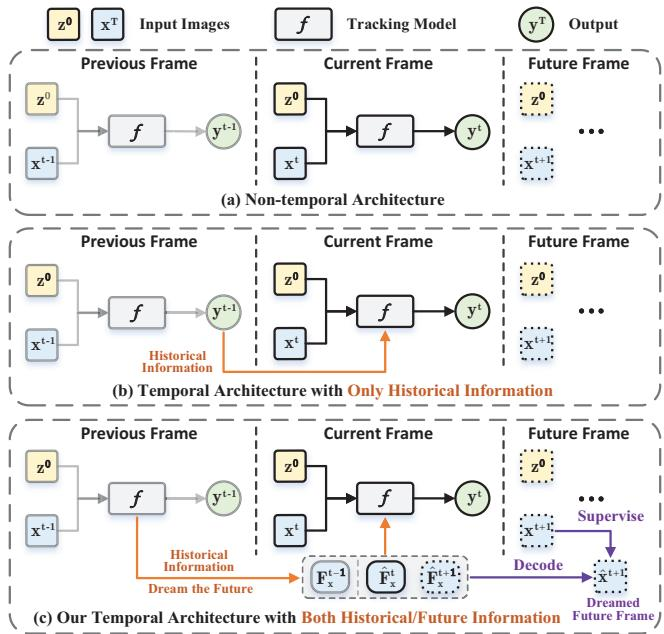
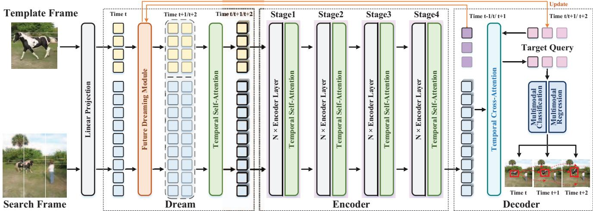
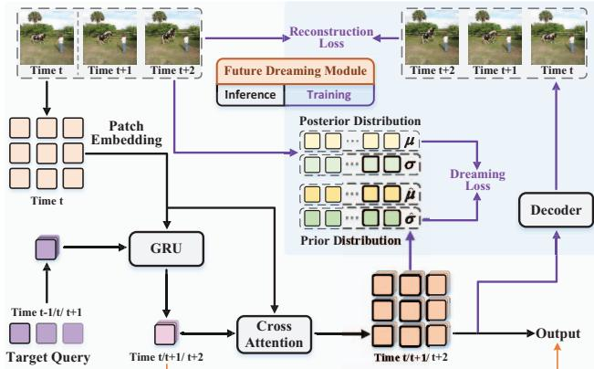
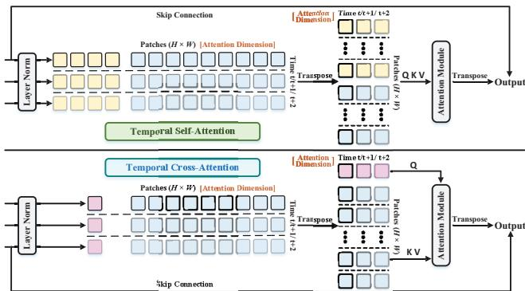
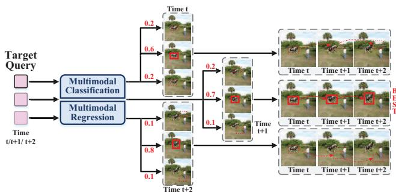
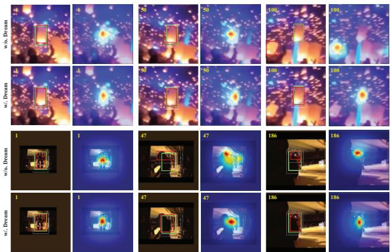
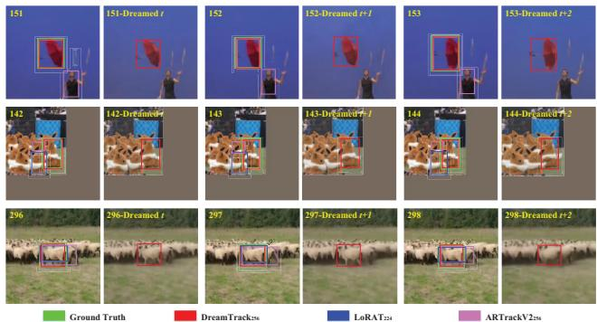

# DreamTrack: Dreaming the Future for Multimodal Visual Object Tracking

Mingzhe Guo 1\* Weiping Tan 1 Wenyu Ran 1 Liping Jing 1† Zhipeng Zhang 2 Beijing Jiaotong University 1, Shanghai Jiaotong University 2

## Abstract

Aiming to achieve class-agnostic perception in visual object tracking, current trackers commonlyformulate tracking as a one-shot detection problem with the template-matching architecture. Despite the success, severe environmental variations in long-term tracking raise challenges to generalizing the tracker in novel situations. Temporal trackers try to fix it by preserving the time-validity of target information with historical predictions, e.g., updating the template. However, solely transmitting the previous observations instead of learning from them leads to an inferior capability ofunderstanding the tracking scenariofrom past experience, which is criticalfor the generalization in newframes. To address this issue, we reformulate temporal learning in visual tracking as a History-to-Future process and propose a novel trackingframework DreamTrack. Our Dream-Track learns the temporal dynamicsfrom past observations to dream the future variations of the environment, which boosts the generalization with the extended future information from history. Considering the uncertainty offuture variation, multimodal prediction is designed to infer the target trajectory of each possible future situation. The experiments demonstrate that our DreamTrack achieves leading performance with real-time inference speed. In particular, DreamTrack obtains SUC scores of 76.6%/87.9% on La-SOT/TrackingNet, surpassing all recent SOTA trackers.

## 1. Introduction

Visual Object Tracking (VOT) is one of the most fundamental computer vision problems with numerous applications [5, 28], which aims to estimate the position of an arbitrary target in a video sequence, given only its location in the initial frame. To achieve the class-agnostic perception, recent prevalent Siamese-based approaches [2, 6, 7, 9, 20, 31, 34, 47, 51, 52] typically formulate visual tracking as a one-shot detection problem. Specifically, these trackers perform general object tracking by matching with the initialized target template and then predicting the location in a single forward pass, as shown in Fig. 1(a).

  
Figure 1. Comparison of different temporal architectures. (a) The non-temporal architecture that regards visual tracking as a oneshot detection problem. (b) The temporal architecture with only historical information that limits the temporal messages in the transmission of previous observations. (c) Our proposed tempo ral architecture with both historical and future information, which learns environmental dynamics from past experiences and dreams the future states for better generalization in subsequent frames.

Despite the demonstrated success, it’s challenging for the non-temporal architecture to ensure the generalization in new frames with severe environmental variations compared with the initial frame, e.g., deformation of the target appearance and background in long-term tracking. The outdated template hardly provides effective target-aware knowledge but distracts the tracking process. Then many works [7, 10, 12, 25] intuitively try to fix it by keeping the time-validity of target information, e.g., updating the template with predictions of high confidence scores in previous frames [45, 50] or passing historical trajectory as prior knowledge [7, 47], as shown in Fig. 1(b). However, these efforts focus on only transmitting previous observations instead of learning from them, leading to an inferior capability of understanding the tracking scenario from the past experience so that enables generalization to novel situations.

To address this issue, we reformulate the temporal learning in VOT as a History-to-Future process, as shown in Fig. 1(c). The pipeline dreams the future states of the tracking scenario based on learned temporal dynamics from previous observations, which empowers the tracker with superior generalization ability in complex environments of new frames. Our intuition stems from the human recognition process [21, 30]. The brain abstracts the world from past senses and imagines future variations, which aims to achieve goals in complex scenarios even though they are never encountered before. Such a temporal modeling manner is intuitively superior to the one limited in historical information, which further develops the generalization in new frames with the future information from dreamed states. To this end, we construct a future dreaming module, originally proposed in the world model for reinforcement learning tasks [21–23], to endow the tracker with the capability of predicting future variations of the target from the learned historical dynamics (see Fig. 1(c)). In contrast to non-temporal [6, 9, 31] or historical informationonly trackers [7, 47, 50], our dreaming module extends the temporal messages from the history to its future, in which the dreamed future frames are self-supervised with groundtruth future observations. The future information undoubtedly facilitates better generalization for appearance deformation of the target and background variance.

More specifically, we propose a novel tracking framework dubbed DreamTrack, which has a dream-encoderdecoder architecture. The dreaming stage caches historical observations and predicts future states to represent the environmental variation in the next few frames. Then the features of the current and dreamed future frames are input to the encoder, which extracts target-aware features with the temporal messages from both history and future. Notably, after each feature extraction stage of the encoder, the tempo ral dynamics will be refined along the timeline, which aims to filter target-irrelevant interferences with the exposure of the target information. The final decoder predicts the trajectory of the target in the current and future frames. Considering the uncertainty of the future variation, we forecast the probabilities and target locations of different possible future scenarios, i.e., multimodal prediction.

Extensive experiments on eight prevailing VOT benchmarks show that our proposed DreamTrack outperforms recent state-of-the-art trackers. For instance, under fair settings, DreamTrack-L384 obtains a 76.6% SUC score on the LaSOT [15] dataset, surpassing ARTrackV2-L384 [1] by 3.0% and $\mathrm { L o R A T - L } _ { 3 7 8 }$ [34] by 1.5%, respectively. In summary, the contributions of this work are as follows:

• We reformulate the tracking problem as a History-to-Future process and are the first to develop the temporal messages into the future frames for better generalization of novel situations in visual object tracking.

• We make the first attempt at predicting the future states of the target and performing multimodal prediction to include the uncertainty of different future scenarios, which empowers the tracker with superior generalization for appearance deformation and background variation.

• We prove the effectiveness of the proposed future dreaming to facilitate tracking with state-of-the-art performance on eight prevailing VOT benchmarks.

## 2. Related Work

Visual Object Tracking. Current prevailing trackers [2, 6, 9, 20, 31, 53] commonly employ a template-matching framework, which exploits the initialized template to match the target within the search region. Regarding tracking as a one-shot detection problem, these approaches develop a deep backbone to extract visual features [33, 51, 52], then predict the current target location following the detection paradigms [41, 55], such as object scale estimation [32, 44, 53] and center point localization [6, 20]. Observing the target information of the template may be weakened by the appearance deformation and background variation in long-term tracking, many works design modules to ensure the time-validity of target-relevant knowledge, e.g., updating the template with predictions of high confidence scores in previous frames [45, 50] or passing historical trajectory as prior knowledge [7, 47]. Despite the improved performance in long-term tracking, the limited understanding of the tracking scenario leads to suboptimal generalization in novel situations. Thus, we reformulate tracking as a History-to-Future process that learns the environmental dynamics from past experiences and dreams the future states for better adaptation and tracking capability in new frames.

World Model. The world model [30] aims to learn a general representation of the world and predicts future world states resulting from a sequence of actions, which has been widely studied in the game [21–23, 40] and lab environments [14, 18, 48]. Dreamer [22] learns a latent dynamics model from past experience to predict future state values and actions in a latent space. It’s capable of handling challenging visual control tasks in the DeepMind Control Suite [43]. DreamerV2 [23] further achieves humanlevel performance on Atari games with discrete modeling. DreamerV3 [24] develops a general algorithm and allows solving challenging control problems such as obtaining diamonds in Minecraft from scratch given sparse rewards. Recently, learning world models in driving scenes has gained attention. MILE [26] employs a model-based imitation learning method to jointly learn a dynamics model and driving behavior. In this work, we introduce the mechanism of the world model to visual object tracking, which boosts environmental understanding with the dreamed future states.

  
Figure 2. The dream-encoder-decoder framework of our DreamTrack. Initially, the dreaming stage takes the input image tokens to predict future states of the next two frames based on the cached temporal dynamics in the Future Dreaming module. Then features of the current frame and dreamed future are fed into the encoder for further modeling, with a Temporal Self-Attention after each encoder stage for target aware refinement. In the end, the decoder performs multimodal prediction for the target, i.e., the probabilities and trajectories in the current and next two frames of three possible future scenarios. The prediction with the highest probability is selected as the final output.

## 3. Method

## 3.1. Preliminaries

Formulation of VOT. Given the template image $\mathrm { z ^ { 0 } }$ of a target initialized in the first frame, the objective of visual tracking is to localize the target $\mathrm { b } ^ { t }$ from the continuous input image $\mathrm { x } ^ { t }$ , where b denotes the target state, $i . e . ,$ , a bounding box. The mainstream tracking paradigm aims to learn a deep tracking model $f$ that performs localization with the output ${ \mathrm { y } } ^ { t }$ following different detection paradigms, i.e., anchor-based [41] or anchor-free [55] architectures. The tracking process can be formulated as,

$$
\mathbf { y } ^ { t } = f ( \mathbf { z } ^ { 0 } , \mathbf { x } ^ { t } ) .\tag{1}
$$

To alleviate the influence of target’s appearance deformation and background variation in long-term tracking, recent prevailing temporal trackers exploit previous outputs $\mathrm { y } ^ { 0 : t - \hat { 1 } }$ as additional prior knowledge, e.g., updating the template [45, 50] or passing historical target location [7, 47]. The temporal tracking process is formulated as,

$$
\begin{array} { r } { \mathrm { y } ^ { t } = f ( \mathrm { z } ^ { 0 } , \mathrm { x } ^ { t } , \mathrm { y } ^ { 0 : t - 1 } ) . } \end{array}\tag{2}
$$

In contrast, we formulate temporal visual tracking as a History-to-Future process, which predicts the future trajectory of the target (including the current frame and the next two ones) based on the learned environmental dynamics from historical observations (cached in the target queries $\mathbf { Q } _ { \mathrm { t g t } } ^ { t : t + 2 }$ of $f ,$ , described in Sec. 3.2). This modeling pipeline can be expressed as,

$$
\begin{array} { r } { \mathrm { y } ^ { t : t + 2 } = f [ \mathbf { Q } _ { \mathrm { t g t } } ^ { t : t + 2 } ] ( \mathrm { z } ^ { 0 } , \mathrm { x } ^ { t } ) . } \end{array}\tag{3}
$$

The parameterized modeling of environmental dynamics $( \mathbf { Q } _ { \mathrm { t g t } } ^ { t : t + 2 } )$ instead of explicit transmission of historical output $\mathrm { y } ^ { 0 : t - 1 }$ , not only enables better generalization in novel situations of future frames, but also reduces the risk of error accumulation from past experiences.

Trajectory Coordinate Mapping. To reduce computation costs, most methods perform tracking on the cropped search region instead of the full-resolution frame, which outputs target’s coordinates in the current frame, relative to the search region. Thus, it’s necessary to map the predicted target location of the relative coordinate system to the original frame after inference, which we denote as the global coordinate system. Correspondingly, the ground-truth boxes for training are also transformed from the global to relative coordinate system. For our DreamTrack that learns dynamics and predicts target trajectory over a video sequence, we additionally cache the ground-truth boxes of the preceding two frames in the global coordinate system and map them to the relative coordinate system of the current frame after the search region is cropped. Notably, the search region patches of the two future frames are cropped by referring to the ground-truth box of the current frame, which represent the target’s motion and serve for the supervision of future image reconstruction (described in Sec. 3.2 and Fig. 3).

## 3.2. Network Architecture

The overall framework of DreamTrack is depicted in Fig. 2. Given the target sequences constructed from object trajectories, we use a novel dream-encoder-decoder structure for learning and inference. The target state is described by a trajectory including the current and next two frames.

  
Figure 3. Illustration of the proposed Future Dreaming module. The target queries auto-regressively update the temporal dynamics with the patch embeddings of the current frame through GRU, which are then exploited to predict the future states. For training, the distributions of the predicted future states and decoded future images are self-supervised by the ground-truth future frames.

Dream. We propose the Future Dreaming module to learn temporal dynamics of the tracking scenario. As shown in Fig. 3, the module evolves the dynamics with current observation and dreams the future states, which endows the tracker with the capability of future prediction by supervising with ground-truth future frames. Specifically, three trainable target queries $\mathbf { Q } _ { \mathrm { t g t } } ^ { t - 1 : t + 1 } \in \mathbb { R } ^ { 3 \times \mathbf { \bar { C } } }$ , which represent the transition dynamics of the current and next two frames, are initialized. With the template $\mathrm { z ^ { 0 } }$ and search region $\mathrm { x } ^ { t }$ of each new frame, the images are split and flattened to build current observation feature ${ \bf F } ^ { \mathrm { t } } = \{ { \bf F } _ { z } ^ { 0 } \in \}$ $\mathbb { R } ^ { H _ { \mathbf { z } } W _ { \mathbf { z } } \times C } , \mathbf { F } _ { \mathbf { x } } ^ { t } \in \mathbb { R } ^ { H _ { \mathbf { x } } W _ { \mathbf { x } } \times C } \}$ with a linear projection. Then target queries auto-regressively update the cached temporal messages with $\mathbf { F } ^ { \mathrm { t } }$ through a gated recurrent unit (GRU) [8],

$$
\mathbf { Q } _ { \mathrm { t g t } } ^ { t : t + 2 } = \mathrm { G R U } ( \mathbf { Q } _ { \mathrm { t g t } } ^ { t - 1 : t + 1 } , \mathbf { F } ^ { t } ) .\tag{4}
$$

As the aim of our DreamTrack is to enhance the generalization in novel situations of new frames, it’s a prerequisite to evolve the future variations of the tracking environment. Thus, the updated target queries $\mathbf { Q } _ { \mathrm { t g t } } ^ { t : t + 2 }$ are exploited to backward imagine the future observation feature $\hat { \mathbf { F } } ^ { t : t + 2 } = \{ \hat { \mathbf { F } } _ { \mathrm { z } } ^ { t : t + 2 } \in \mathbb { R } ^ { 3 \times H _ { \mathrm { z } } W _ { \mathrm { z } } \times C } , \hat { \mathbf { F } } _ { \mathrm { x } } ^ { t : t + 2 } \in \mathbb { R } ^ { 3 \times H _ { \mathrm { x } } W _ { \mathrm { x } } \times C } \}$ based on $\mathbf { F } ^ { \mathrm { t } }$ with a cross-attention,

$$
\hat { \mathbf { F } } ^ { t : t + 2 } = \mathrm { C r o s s A t t e n t i o n } ( q = \mathbf { F } ^ { t } , k v = \mathbf { Q } _ { \mathrm { t g t } } ^ { t : t + 2 } ) .\tag{5}
$$

Notably, the interaction between $\mathbf { F } ^ { t }$ and $\mathbf { Q } _ { \mathrm { t g t } } ^ { t }$ to generate $\hat { \mathbf { F } } ^ { t }$ intends to enhance the feature quality of the current frame by introducing historical information, which originates from $\mathbf { Q } _ { \mathrm { t g t } } ^ { t - 1 }$ before the GRU update (Eq. 4). The output $\hat { \mathbf { F } } ^ { t : t + 2 }$ of the module will be further modeled with the Temporal Self-Attention, which is detailed in the encoder.

Following the loss design in world models [22–24], we respectively map the dreamed future observation feature $\hat { \mathbf { F } } _ { \mathrm { x } } ^ { t : t + 2 }$ and ground-truth observation feature $\mathbf { F } _ { \mathrm { x } } ^ { t : t + 2 }$ to distributions of $\{ \hat { \mu } _ { \mathrm { x } } ^ { t : t + 2 } , \hat { \sigma } _ { \mathrm { x } } ^ { t : t + 2 } \in \mathbb { R } ^ { 3 \times H _ { \mathrm { x } } W _ { \mathrm { x } } \times C ^ { \prime } } \}$ and $\{ \mu _ { \mathrm { x } } ^ { t : t + 2 } , \sigma _ { \mathrm { x } } ^ { t : t + 2 } \in \mathbb { R } ^ { 3 \times H _ { \mathrm { x } } ^ { \mathrm { x } } W _ { \mathrm { x } } \times C ^ { \dagger } } \}$ with MLP layers, and then minimize their KL divergence. Notably, we only consider supervising the dreaming process of the search region, as the input template always comes from the initial frame. The prior distribution from $\hat { \mathbf { F } } _ { \mathrm { x } } ^ { t : t + 2 }$ is regarded as a prediction of the future dynamics. In contrast, the posterior distribution from $\mathbf { F } _ { \mathrm { x } } ^ { t : t + 2 }$ represents the future dynamics from the ground-truth observation $\mathrm { x } ^ { t : t + 2 }$ . The KL divergence measures the gap between the imagined future (prior) and the true future (posterior). We expect to enhance the capability of future prediction for long-term tracking, which is realized by optimizing the dreaming loss $\mathcal { L } _ { \mathrm { d r m } }$

$$
\mathcal { L } _ { \mathrm { d r m } } = \mathrm { K L } ( \{ \hat { \mu } _ { \mathrm { x } } ^ { t : t + 2 } , \hat { \sigma } _ { \mathrm { x } } ^ { t : t + 2 } \} | | \{ \mu _ { \mathrm { x } } ^ { t : t + 2 } , \sigma _ { \mathrm { x } } ^ { t : t + 2 } \} ) ,\tag{6}
$$

where $\mathrm { K L } ( \cdot | | \cdot )$ denotes the KL divergence.

Besides the supervision from the distribution difference, we further improve the accuracy of future prediction by reconstructing the future search regions based on $\hat { \mathbf { F } } _ { \mathrm { x } } ^ { t : t + 2 }$ with a decoder of several CNN upsampling layers. The decoded future search regions $\hat { \mathrm { X } } ^ { t : t + \bar { 2 } }$ is supervised by the groundtruth search regions $\mathrm { x } ^ { t : t + 2 }$ by optimizing the reconstruction loss ${ \mathcal { L } } _ { \mathrm { r c t } }$

$$
\mathcal { L } _ { \mathrm { { r c t } } } = \mathrm { M S E } ( \hat { \mathbf { x } } ^ { t : t + 2 } | | \mathbf { x } ^ { t : t + 2 } ) ,\tag{7}
$$

where $\mathrm { M S E } ( \cdot | | \cdot )$ is the mean squared error.

Encoder. Following previous works [7, 47, 51], we adopt a plain vision transformer (ViT) [13] as the encoder and model the search and template images jointly. The encoder extracts the features of the search and template images and learns feature-level correspondence to filter targeirrelevant distractors. The input dreamed observation features $\{ \hat { \mathbf { F } } _ { \mathrm { z } } ^ { t : t + 2 } , \hat { \mathbf { F } } _ { \mathrm { x } } ^ { t : t + 2 } \}$ are concatenated along the spatial dimension and fed into the encoder for feature extraction,

$$
\begin{array} { r l } & { \hat { \mathbf { F } } _ { \mathrm { z x } , i } ^ { t : t + 2 } = \mathrm { C o n c a t } ( \hat { \mathbf { F } } _ { \mathrm { z } } ^ { t : t + 2 } , \hat { \mathbf { F } } _ { \mathrm { x } } ^ { t : t + 2 } ) , i = 0 } \\ & { \hat { \mathbf { F } } _ { \mathrm { z x } , i } ^ { t : t + 2 } = \mathrm { B l o c k } _ { i } ( \hat { \mathbf { F } } _ { \mathrm { z x } , i - 1 } ^ { t : t + 2 } ) , 1 \leq i \leq l _ { \mathrm { s p t } } } \end{array}\tag{8}
$$

where $\hat { \mathbf { F } } _ { \mathrm { z x } , i } ^ { t : t + 2 } \in \mathbb { R } ^ { 3 \times ( H _ { \mathrm { z } } W _ { \mathrm { z } } + H _ { \mathrm { x } } W _ { \mathrm { x } } ) \times C }$ , Block denotes the transformer block in the encoder for spatial modeling and $l _ { \mathrm { s p t } }$ is the layer number.

Besides the spatial modeling between the template and search region in Block, it’s also important to exploit the extracted target-aware information to refine the temporal dynamics along the timeline. Thus, after each feature extraction stage of the encoder, we arrange a Temporal Self-Attention module to filter target-irrelevant interferences with the exposure of the target information from different levels. As shown in Fig. $^ { 4 , }$ the dreamed observation features $\hat { \mathbf { F } } _ { \mathrm { z x } } ^ { t : t + 2 }$ are transposed and input to the attention for the interaction on the temporal dimension,

$$
\hat { \mathbf { F } } _ { \mathrm { z x } , i } ^ { t : t + 2 } = \mathrm { T e m A t t n } _ { \mathrm { s e l f } } ^ { i } ( \hat { \mathbf { F } } _ { \mathrm { z x } , i - 1 } ^ { t : t + 2 } ) , 1 \leq i \leq l _ { \mathrm { t e m } }\tag{9}
$$

  
Figure 4. Illustration of the Temporal Self/Cross-Attention. For self-attention, patch embeddings of the template and search region are jointly modeled on the temporal dimension. In contrast, the cross-attention takes target queries as Q and patch embeddings of search region as K, V to extract localization-relevant information.

where $\mathrm { T e m A t t n } _ { \mathrm { s e l f } }$ denotes the Temporal Self-Attention module and $l _ { \mathrm { t e m } }$ is the module number corresponding to the four stages of the encoder (see Fig. 2).

Decoder. The final decoder is responsible for predicting the target trajectory in the current and next two frames based on the updated target queries $\mathbf { Q } _ { \mathrm { t g t } } ^ { t : t + 2 }$ and target-aware observation feature of the search region $\hat { \mathbf { F } } _ { \mathrm { x } } ^ { t : t + 2 }$ , which is split from the encoder output $\hat { \mathbf { F } } _ { \mathrm { z x } } ^ { t : t + 2 }$ . Notably, the dreamed feature of the template $\hat { \mathbf { F } } _ { \mathrm { z } } ^ { t : t + 2 }$ is not employed as the ultimate is to locate the target in the search region and the target information has been introduced into $\hat { \mathbf { F } } _ { \mathrm { x } } ^ { t : t + 2 }$ after encoder modeling. The target queries $\mathbf { Q } _ { \mathrm { t g t } } ^ { t : t + 2 }$ first extract localizationrelevant messages from $\hat { \mathbf { F } } _ { \mathrm { x } } ^ { t : t + 2 }$ with the Temporal Cross-Attention module. As shown in Fig. 4, each target query interacts with the region feature of the same timestamp,

$$
\begin{array} { r } { \hat { \mathbf { Q } } _ { \mathrm { t g t } } ^ { t : t + 2 } = \mathrm { T e m A t t n } _ { \mathrm { c r o s s } } ( q = \mathbf { Q } _ { \mathrm { t g t } } ^ { t : t + 2 } , k v = \hat { \mathbf { F } } _ { \mathrm { x } } ^ { t : t + 2 } ) , } \end{array}\tag{10}
$$

where $\mathrm { T e m A t t n } _ { \mathrm { c r o s s } }$ is the Temporal Cross-Attention module. The output target queries $\dot { \hat { \mathbf { Q } } } _ { \mathrm { t g t } } ^ { t : t + 2 }$ are then used to predict the target trajectory of the current and next two frames.

The key challenge to future prediction is the high degree of uncertainty, in large part due to not knowing the intents and latent characteristics of the tracking target. For example, the target commonly has a multimodal distribution of futures: it could turn, go straight, slow down, speed up, etc. The high degree of multimodality also exists in the motion prediction of autonomous driving [17, 36], which correspondingly designs a multimodal prediction to generate multiple plausible trajectories of the target vehicle. We draw inspiration from this solution and design the tailored Multimodal Prediction to our DreamTrack. As shown in Fig. 5, each target query of one timestamp forecasts the probabilities $\hat { \boldsymbol { \mathrm { p } } } ^ { T } \in \mathbb { R } ^ { 3 \times i }$ and target states $\hat { \mathbf { b } } ^ { T } \in \mathbb { R } ^ { 3 \times 4 }$ of three possible future situations with a stack of MLP layers,

$$
\hat { \mathrm { p } } ^ { T } , \hat { \mathrm { b } } ^ { T } = \mathrm { M L P } ( \hat { \mathbf { Q } } _ { \mathrm { t g t } } ^ { T } ) . ~ T \in \{ t , t + 1 , t + 2 \}\tag{11}
$$

  
Figure 5. Illustration of the Multimodal Prediction. The target queries of different timestamps respectively predict the probabilities and locations of three possible future situations, in which the one of the highest probability score is the final output.

After the prediction, the target state with the highest probability of each timestamp constitutes the final target trajectory. For training, we first calculate GIoU [42] between the predicted target state of each modality $\hat { \mathrm { b } } _ { j } ^ { T } \in \hat { \mathrm { b } } ^ { T } ( 1 \leq j \leq 3 )$ and the ground-truth $\mathrm { b } ^ { T }$ . The prediction with the largest GIoU is assigned with the probability label of 1 (the other two ones are 0), and L1 loss $\mathcal { L } _ { \mathrm { L 1 } }$ and GIoU loss ${ \mathcal { L } } _ { \mathrm { G I o U } }$ are applied to the output target states. The probabilities are supervised by the 0-1 labels with a cross-entropy loss $\mathcal { L } _ { \mathrm { c e } }$

## 3.3. Training and Inference

Training. Our DreamTrack performs video sequencelevel training and facilitates environmental understanding in an end-to-end manner. We construct video clips in which each contains 4 frames for training (i.e., one frame as template and three ones as search sequence), following the protocol of coordinate mapping described in Sec. 3.1. For every new input of the video clip, the hidden state in GRU (see Sec. 3.2) will be initialized, which avoids being distracted by the last tracking video. Considering the consistent time step between training and inference, we sample consecutive three frames for the search sequence.

The overall optimization objective for DreamTrack includes dreaming loss ${ \mathcal { L } } _ { \mathrm { d r m } } ,$ reconstruction loss ${ \mathcal { L } } _ { \mathrm { r c t } }$ from the Future Dreaming module, and probability loss $\mathcal { L } _ { \mathrm { c e } , \mathrm { L } 1 }$ loss ${ \mathcal { L } } _ { \mathrm { L 1 } }$ and GIoU loss ${ \mathcal { L } } _ { \mathrm { G I o U } }$ from the Multimodal Prediction,

$$
\mathcal { L } = \lambda _ { 1 } \mathcal { L } _ { \mathrm { d r m } } + \lambda _ { 2 } \mathcal { L } _ { \mathrm { r c t } } + \lambda _ { 3 } \mathcal { L } _ { \mathrm { c e } } + \lambda _ { 4 } \mathcal { L } _ { \mathrm { L 1 } } + \lambda _ { 5 } \mathcal { L } _ { \mathrm { G I o U } } ,\tag{12}
$$

where λ values are the balancing weight coefficients.

Inference. During inference, we initialize the hidden state of GRU for each new video sequence as previously described. Notably, it’s no need to sample the video clip for inference. With the defined target queries that automatically cache the historical dynamics, we perform frame-level input for DreamTrack, which is consistent with previous nontemporal works [9, 51] and friendly for the deployment. Besides, the distribution mapping and image reconstruction in Fig. 3 are not required in the inference phase, which could be extended to other tasks, $e . g .$ ., video generation.

<table><tr><td rowspan="2">Methods</td><td colspan="3">LaSOT [15]</td><td colspan="3"> $\mathrm { L a S O T e x t } \left[ 1 6 \right]$ </td><td colspan="3"> $\mathrm { G O T - 1 0 k ^ { * } \left[ 2 7 \right] }$ </td><td colspan="3">TrackingNet [39]</td><td colspan="2">TNL2K [46]</td></tr><tr><td>SUC(%)</td><td> $\mathrm { P _ { N o r m } } ( \% )$ </td><td>P(%)</td><td>SUC(%)</td><td> $\mathrm { P _ { N o r m } } ( \% )$ </td><td>P(%)</td><td>AO(%)</td><td> $\mathrm { S R } _ { 0 . 5 } ( \% )$ </td><td> $\mathrm { S R } _ { 0 . 7 5 } ( \% )$ </td><td>SUC(%)</td><td> $\mathrm { P _ { N o r m } } ( \% )$ </td><td>P(%)</td><td>SUC(%)</td><td>P(%)</td></tr><tr><td>SiamFC255 [2]</td><td>33.6</td><td>42.0</td><td>33.9</td><td>23.0</td><td>31.1</td><td>26.9</td><td>34.8</td><td>35.3</td><td>9.8</td><td>57.1</td><td>66.3</td><td>53.3</td><td>29.5</td><td>28.6</td></tr><tr><td>ECO224 [10]</td><td>32.4</td><td>33.8</td><td>30.1</td><td>22.0</td><td>25.2</td><td>24.0</td><td>31.6</td><td>30.9</td><td>11.1</td><td>55.4</td><td>61.8</td><td>49.2</td><td>32.6</td><td>31.7</td></tr><tr><td>SiamRPN++255 [32]</td><td>49.6</td><td>56.9</td><td>49.1</td><td>34.0</td><td>41.6</td><td>39.6</td><td>51.7</td><td>61.6</td><td>32.5</td><td>73.3</td><td>80.0</td><td>69.4</td><td>41.3</td><td>41.2</td></tr><tr><td>DiMP288 [3]</td><td>56.9</td><td>65.0</td><td>56.7</td><td>39.2</td><td>47.6</td><td>45.1</td><td>61.1</td><td>71.7</td><td>49.2</td><td>74.0</td><td>80.1</td><td>68.7</td><td>44.7</td><td>43.4</td></tr><tr><td>SiamRCNN255 [44]</td><td>64.8</td><td>72.2</td><td></td><td></td><td></td><td></td><td>64.9</td><td>72.8</td><td>59.7</td><td>81.2</td><td>85.4</td><td>80.0</td><td>52.3</td><td>52.8</td></tr><tr><td>Ocean255 [53]</td><td>56.0</td><td>65.1</td><td>56.6</td><td></td><td></td><td></td><td>61.1</td><td>72.1</td><td>47.3</td><td></td><td></td><td></td><td>38.4</td><td>38.7</td></tr><tr><td>AutoMatch255 [54]</td><td>58.3</td><td></td><td>59.9</td><td>37.6</td><td></td><td>43.0</td><td>65.2</td><td>76.6</td><td>54.3</td><td>76.0</td><td></td><td>72.6</td><td>47.2</td><td>43.5</td></tr><tr><td>TrDiMP352 [45]</td><td>63.9</td><td></td><td>61.4</td><td></td><td></td><td></td><td>67.1</td><td>77.7</td><td>58.3</td><td>78.4</td><td>83.3</td><td>73.1</td><td></td><td></td></tr><tr><td>TransT256 [6]</td><td>64.9</td><td>73.8</td><td>69.0</td><td>44.8</td><td>52.3</td><td>52.5</td><td>67.1</td><td>76.8</td><td>60.9</td><td>81.4</td><td>86.7</td><td>80.3</td><td>50.7</td><td>51.7</td></tr><tr><td>STARK320 [50]</td><td>67.1</td><td>77.0</td><td></td><td>47.8</td><td>56.2</td><td>55.1</td><td>68.8</td><td>78.1</td><td>64.1</td><td>82.0</td><td>86.9</td><td></td><td></td><td></td></tr><tr><td>SwinTrack-B384 [33]</td><td>71.3</td><td></td><td>76.5</td><td>49.1</td><td></td><td>55.6</td><td>72.4</td><td>80.5</td><td>67.8</td><td>84.0</td><td>-</td><td>82.8</td><td>55.9</td><td>57.1</td></tr><tr><td>MixFormer-L320 [9]</td><td>70.1</td><td>79.9</td><td>76.3</td><td></td><td></td><td></td><td>72.6</td><td>82.2</td><td>68.8</td><td>83.9</td><td>88.9</td><td>83.1</td><td></td><td></td></tr><tr><td>OSTrack384 [51]</td><td>71.1</td><td>81.1</td><td>77.6</td><td>50.5</td><td>61.3</td><td>57.6</td><td>73.7</td><td>83.2</td><td>70.8</td><td>83.9</td><td>88.5</td><td>83.2</td><td>55.9</td><td>56.7</td></tr><tr><td>GRM256 [19]</td><td>69.9</td><td>79.3</td><td>75.8</td><td></td><td></td><td></td><td>73.4</td><td>82.9</td><td>70.4</td><td>84.0</td><td>88.7</td><td>83.3</td><td></td><td></td></tr><tr><td>MixViT288 [9]</td><td>69.6</td><td>79.9</td><td>75.9</td><td></td><td></td><td></td><td>72.5</td><td>82.4</td><td>69.9</td><td>83.5</td><td>88.3</td><td>82.0</td><td></td><td></td></tr><tr><td>ROMTrack384 [4]</td><td>71.4</td><td>81.4</td><td>78.2</td><td>51.3</td><td>62.4</td><td>58.6</td><td>74.2</td><td>84.3</td><td>72.4</td><td>84.1</td><td>89.0</td><td>83.7</td><td></td><td></td></tr><tr><td>MixViT-L384 [9]</td><td>72.4</td><td>82.2</td><td>80.1</td><td></td><td></td><td></td><td>75.7</td><td>85.3</td><td>75.1</td><td>85.4</td><td>90.2</td><td>85.7</td><td></td><td></td></tr><tr><td> $\mathrm { S e q T r a c k } { \mathrm { - L } } _ { 3 8 4 } \left[ 7 \right]$ </td><td>72.5</td><td>81.5</td><td>79.3</td><td>50.7</td><td>61.6</td><td>57.5</td><td>74.8</td><td>81.9</td><td>72.2</td><td>85.5</td><td>89.8</td><td>85.8</td><td>57.8</td><td></td></tr><tr><td>ARTrack256 [47]</td><td>70.4</td><td>79.5</td><td>76.6</td><td>46.4</td><td>56.5</td><td>52.3</td><td>73.5</td><td>82.2</td><td>70.9</td><td>84.2</td><td>88.7</td><td>83.5</td><td>57.5</td><td></td></tr><tr><td>ARTrack-L384 [47]</td><td>73.1</td><td>82.2</td><td>80.3</td><td>52.8</td><td>62.9</td><td>59.7</td><td>78.5</td><td>87.4</td><td>77.8</td><td>85.6</td><td>89.6</td><td>86.0</td><td>60.3</td><td></td></tr><tr><td> $\mathrm { A R T r a c k V } 2 _ { 2 5 6 } [ 1 ]$ </td><td>71.6 73.6</td><td>80.2 82.8</td><td>77.2</td><td>50.8</td><td>61.9</td><td>57.7</td><td>75.9</td><td>85.4</td><td>72.7</td><td>84.9</td><td>89.3</td><td>84.5</td><td>59.2</td><td></td></tr><tr><td>ARTrackV2-L384 [1]</td><td>71.7</td><td>80.9</td><td>81.1 77.3</td><td>53.4 50.3</td><td>63.7 61.6</td><td>60.2 57.1</td><td>79.5 72.1</td><td>87.8 81.8</td><td>79.6 70.7</td><td>86.1 83.5</td><td>90.4 87.9</td><td>86.2 82.1</td><td>61.6</td><td>61.3</td></tr><tr><td> $\mathrm { L o R A T } _ { 2 2 4 }$  [34] LoRAT-L378 [34]</td><td>75.1</td><td>84.1</td><td>82.0</td><td>56.6</td><td>69.0</td><td>65.1</td><td>77.5</td><td>86.2</td><td>78.1</td><td>85.6</td><td>89.7</td><td>85.4</td><td>58.8 62.3</td><td>67.0</td></tr><tr><td></td><td></td><td></td><td></td><td></td><td></td><td></td><td></td><td></td><td></td><td></td><td></td><td></td><td></td><td></td></tr><tr><td>DreamTrack256</td><td>73.8</td><td>83.4</td><td>80.6</td><td>53.1</td><td>64.1</td><td>59.8</td><td>77.5</td><td>87.1</td><td>74.2</td><td>85.8</td><td>90.0</td><td>85.3</td><td>60.4</td><td>63.2</td></tr><tr><td>DreamTrack384</td><td>75.0</td><td>84.2</td><td>81.7</td><td>54.5</td><td>65.3</td><td>61.1</td><td>78.3</td><td>87.9</td><td>76.6</td><td>86.5</td><td>90.6</td><td>85.9</td><td>61.2 62.9</td><td>64.8 67.4</td></tr><tr><td> $\mathbf { D r e a m T r a c k - L } _ { 3 8 4 }$ </td><td>76.6</td><td>85.6</td><td>83.1</td><td>57.1</td><td>69.4</td><td>65.4</td><td>79.9</td><td>88.5</td><td>80.3</td><td>87.9</td><td>91.3</td><td>86.8</td></table>

Table 1. State-of-the-art comparison on LaSOT [15], LaSOText [16], GOT-10k [27], TrackingNet [39] and TNL2K [46]. \* indicates only trained on GOT-10k. The number in the subscript denotes the search region resolution.

## 4. Experiment

## 4.1. Implementation Details

Model Variants. We develop three variants of Dream-Track with different configurations as follows:

• DreamTrack256. Backbone: ViT-Base; Template size: [128 128]; Search region size: [256 256];

• DreamTrack384. Backbone: ViT-Base; Template size: [192 192]; Search region size: [384 384];

• DreamTrack-L384. Backbone: ViT-Large; Template size: [192 192]; Search region size: [384 384].

The ViT backbone [13] is regarded as the encoder of our DreamTrack (see Fig. 2), which is divided into four stages for feature modeling with the proposed Temporal Self-Attention. The four stages contain 2,2,6,2 encoder layers for ViT-Base, and 4,4,12,4 ones for ViT-Large, respectively.

Training Strategy. The training setting and evaluation protocol follow previous Transformer-based trackers (e.g., OSTrack [51]). The training datasets include COCO [35], LaSOT [15], TrackingNet [39] and GOT-10k [27] (with 1k sequences removed from GOT-10k train split, as per [50]). To ensure a fair evaluation of the GOT-10k test set, our models learn from the entire GOT-10k training split following its one-shot protocol. Our DreamTrack performs training with video clips, as described in Sec. 3.3. To align with the data form in the image dataset COCO that performs frame-level sampling, we repeat the sampled search frame with random shifts to constitute a pseudo video clip.

We train our model using the AdamW [37] optimizer with a weight decay of $1 \times 1 0 ^ { - 4 }$ . The learning rate for the encoder is set to $4 \times 1 0 ^ { - 5 }$ , while other parameters use a learning rate of $4 \times 1 0 ^ { - 4 }$ The training process is conducted on 8 NVIDIA RTX3090 GPUs, comprising 300 epochs with 60k video sequences per epoch. The learning rate decreases by a factor of 10 after 240 epochs.

## 4.2. Main Results

We evaluate our models on eight prevailing benchmark datasets, including LaSOT [15], LaSOText [16], GOT-10k [27], TrackingNet [39], TNL2K [46], OTB100 [49], NFS [29] and UAV123 [38].

LaSOT [15]. LaSOT is a benchmark designed for longterm tracking, comprising 280 videos in its test set. Tab. 1 demonstrates that our DreamTrack256 already outperforms $\mathrm { A R T r a c k - L } _ { 3 8 4 }$ , which has a larger backbone. Furthermore, our DreamTrack-L384 achieved the best performance with the SUC score of 76.6%, without the use of any online template update strategy or post-processing. This proves the superiority of our temporal design with future dreaming.

LaSOText [16]. LaSOText serves as an extension of La-SOT, which includes additional 150 video sequences. As shown in Tab. 1, our DreamTrack256 achieves superior performance compared with other trackers with the same backbone, e.g., $\mathrm { A R T r a c k V } 2 _ { 2 5 6 }$ and $\mathrm { L o R A T } _ { 2 2 4 }$ With the larger backbone, the performance of our DreamTrack-L further improves with the best SUC score of 57.1%.

<table><tr><td>Method</td><td>OTB100 [49] NFS [29]</td><td></td><td>UAV123 [38]</td></tr><tr><td>DreamTrack-L384</td><td>72.4</td><td>67.4</td><td>73.1</td></tr><tr><td>DreamTrack384</td><td>72.0</td><td>66.1</td><td>72.5</td></tr><tr><td>DreamTrack256</td><td>71.8</td><td>65.4</td><td>72.1</td></tr><tr><td>LoRAT-L378 [34]</td><td>72.0</td><td>66.7</td><td>72.5</td></tr><tr><td>LoRAT224 [34]</td><td>71.4</td><td>64.0</td><td>72.6</td></tr><tr><td>ARTrackV2-L384 [1]</td><td>-</td><td>67.6</td><td>69.9</td></tr><tr><td> $\mathrm { S e q T r a c k } { - } \mathrm { L } _ { 3 8 4 }$  [7]</td><td>-</td><td>66.2</td><td>68.5</td></tr><tr><td>OSTrack384 [51]</td><td></td><td>66.5</td><td>70.7</td></tr><tr><td>TransT256 [6]</td><td>69.5</td><td>65.7</td><td>69.1</td></tr><tr><td>DiMP288 [3]</td><td>68.4</td><td>61.8</td><td>64.3</td></tr><tr><td>Ocean255 [53]</td><td>68.4</td><td>49.4</td><td>57.4</td></tr><tr><td>ATOM288 [11]</td><td>66.3</td><td>58.3</td><td>63.2</td></tr><tr><td>ECO224 [10]</td><td>66.6</td><td>52.2</td><td>53.5</td></tr><tr><td>SiamFC255 [2]</td><td>58.3</td><td>37.7</td><td>46.8</td></tr></table>

Table 2. Performance comparison on OTB100 [49], NFS [29] and UAV123 [38] in terms of the SUC score (%).

GOT-10k [27]. GOT-10k provides 180 videos for testing with a strict protocol that only allows trackers to be trained exclusively on its training split. We adhere to this protocol and report the results in Tab. 1. Our DreamTrack-L384 outperforms recent SOTA trackers across all metrics. Notably, our DreamTrack256 surpasses other trackers with the same backbone, proving its effectiveness.

TrackingNet [39]. TrackingNet is an extensive tracking dataset that covers a wide range of real-world scenarios. We assess the performance of DreamTrack on its test set of 511 videos, as illustrated in Tab. 1. It shows that not only does our DreamTrack384 outperform all other trackers in SUC, but our DreamTrack-L also establishes a new state-ofthe-art in three metrics on this large-scale benchmark.

TNL2K [46]. TNL2K is a recently proposed large-scale benchmark for tracking by natural language and bounding box initialization. We evaluate our tracker on its 700 testing videos and the results are listed in Tab. 1. Our DreamTrack-L384 achieves the best performance with the SUC and precision of 62.9% and 67.4% respectively, showing the effectiveness of our temporal learning.

OTB100 [49], NFS [29] and UAV123 [38]. We also evaluate our tracker on three additional benchmarks, i.e., OTB100, NFS and UAV123 including 100, 100 and 123 videos respectively. Tab. 2 shows that DreamTrack-L384 achieves the best performance on all three benchmarks, demonstrating the strong generalizability of our framework.

Efficiency Comparison. Tab. 3 compares the efficiency of our DreamTrack against other Transformer-based trackers in terms of inference speed, floating point operations, and number of parameters. Benefiting from the efficient one-stream architecture and sparse multimodal prediction, our DreamTrack shows impressive inference speed with small computation costs. Our most compact variant, DreamTrack256, achieves the state-of-the-art performance while operating at 139 frames per second (FPS), proving the effectiveness and efficiency of our method.

<table><tr><td>Tracker</td><td>Speed (FPS)</td><td>FLOPs (G)</td><td>Params (M)</td></tr><tr><td>SwinTrack-B384 [33]</td><td>45</td><td>69.7</td><td>91</td></tr><tr><td>OSTrack256 [51]</td><td>105.4</td><td>21.5</td><td>94</td></tr><tr><td>OSTrack384 [51]</td><td>58.1</td><td>48.3</td><td>94</td></tr><tr><td>SeqTrack-B256 [7]</td><td>40</td><td>66</td><td>89</td></tr><tr><td>SeqTrack-L384 [7]</td><td>5</td><td>524</td><td>309</td></tr><tr><td>ARTrack256 [47]</td><td>26</td><td>395.6</td><td>117</td></tr><tr><td>ROMTrack256 [4]</td><td>62</td><td>34.5</td><td>92</td></tr><tr><td>ROMTrack384 [4]</td><td>28</td><td>77.7</td><td>92</td></tr><tr><td>LoRAT224 [34]</td><td>209</td><td>30</td><td>99</td></tr><tr><td> $\mathrm { L o R A T - L } _ { 3 7 8 }$  [34]</td><td>63</td><td>325</td><td>336</td></tr><tr><td>DreamTrack256 DreamTrack-L384</td><td>139 32</td><td>37.6 359.4</td><td>87 317</td></tr></table>

Table 3. Efficiency comparison. The inference speed is measured on a single NVIDIA RTX2080Ti GPU.
<table><tr><td rowspan="3">#</td><td rowspan="3">Model Variants</td><td colspan="3">LaSOT [15]</td><td colspan="2">TNL2K [46]</td><td rowspan="3">FPS</td></tr><tr><td>SUC(%) PNorm(%)</td><td></td><td>P(%)</td><td>SUC(%) P(%)</td><td></td></tr><tr><td></td><td></td><td></td><td></td><td></td></tr><tr><td>①</td><td>Baseline</td><td>69.3</td><td>79.1</td><td>75.3</td><td>54.7</td><td>56.2</td><td>162</td></tr><tr><td>② ③</td><td>+ Future Dreaming Module + Temporal Self-Attention</td><td>71.7 72.6</td><td>81.3</td><td>77.7 78.5</td><td>56.9</td><td>59.5 60.4</td><td>153</td></tr><tr><td>④</td><td>+ Temporal Cross-Attention</td><td>73.1</td><td>82.0 82.4</td><td>79.0</td><td>59.1 59.5</td><td>61.1</td><td>145 143</td></tr><tr><td>⑤</td><td></td><td>73.8</td><td></td><td>80.6</td><td>60.4</td><td>63.2</td><td></td></tr><tr><td></td><td>+ Multimodal Prediction</td><td></td><td>83.4</td><td></td><td></td><td></td><td>139</td></tr></table>

Table 4. Ablation on each proposed module in DreamTrack.

## 4.3. Component-wise Ablation

We analyze the influence of each component in our DreamTrack256 to show the effectiveness and rationality of the proposed modules, as shown in Tab. 4. When removing all designed modules and directly predicting the target location of the current frame based on the target query, the performance is still comparable with the fastest inference speed of 162 FPS. By applying the key Future Dreaming module on the baseline version, it obtains impressive SUC gains of 2.4% on LaSOT (② v.s. ①). This verifies that deeper environmental understanding from past experience benefits the generalizability in novel situations. The Temporal Self/Cross-Attention further improves the performance for 0.9%/0.5% SUC on LaSOT (④ v.s. ③ v.s. ②), proving the effectiveness of target-aware temporal refinement. The final Multimodal Prediction brings 0.7%/0.9% SUC gains on LaSOT and TNL2K, respectively. It indicates that modeling the uncertainty of different future scenarios helps to forecast the target’s motion and perform robust tracking.

## 4.4. Further Analysis

Self-supervision in Future Dreaming. As mentioned in Sec. 3.2, the capability of predicting the environmental future states relies on the self-supervision in the proposed Future Dreaming module. We explore the influence by ablating the loss functions based on DreamTrack256. As shown in Tab. 5, removing both the dreaming and reconstruction losses makes the dreamed future unreliable to reflect the real scenario in the next two frames, degrading the quality of learned temporal dynamics (①). Applying each of the two loss functions brings performance gains of 4.4%/4.0% SUC on LaSOT respectively (②,③ v.s. ①), proving the effectiveness. With the full supervision, the performance of DreamTrack further improves with the SUC of 73.8% on LaSOT (④), which indicates the cooperation of our design.

<table><tr><td rowspan="2">#</td><td rowspan="2">Loss</td><td rowspan="2">Dreaming Reconstruction Loss</td><td colspan="2">LaSOT [15]</td><td colspan="2">TNL2K [46]</td></tr><tr><td>SUC(%)</td><td>PNorm(%) P(%)</td><td>SUC(%)</td><td>P(%)</td></tr><tr><td>①</td><td>-</td><td>=</td><td>68.3</td><td>77.4</td><td>73.8</td><td>53.7 53.2</td></tr><tr><td>②</td><td>√</td><td>=</td><td>72.7</td><td>82.6</td><td>79.8 59.1</td><td>61.7</td></tr><tr><td>③</td><td>-</td><td>√</td><td>72.3</td><td>82.1</td><td>79.2</td><td>58.5 60.3</td></tr><tr><td>④</td><td>√</td><td>√</td><td>73.8</td><td>83.4</td><td>80.6 60.4</td><td>63.2</td></tr></table>

Table 5. Ablation on loss functions in Future Dreaming module.
<table><tr><td rowspan="2">#</td><td rowspan="2">Dreaming Step For Evaluation</td><td>LaSOT [15]</td><td>LaSOText [16]</td><td>TNL2K [46]</td><td></td></tr><tr><td>SUC(%) P(%)</td><td>SUC(%) P(%)</td><td></td><td>SUC(%) P(%)</td></tr><tr><td>①</td><td>0</td><td>73.8 80.6</td><td>53.1</td><td>59.8</td><td>60.4</td><td>63.2</td></tr><tr><td>②</td><td>1</td><td>71.3 77.5</td><td>51.4</td><td>58.2</td><td>58.6</td><td>61.6</td></tr><tr><td>③</td><td>2</td><td>68.5 74.7</td><td>48.9</td><td>55.0</td><td>55.3</td><td>57.8</td></tr></table>

Table 6. Performance comparison of different dreaming steps.

Performance of Future Prediction. With the defined target queries of different timestamps, our DreamTrack is capable of predicting the target trajectory including the current and next two frames. We then evaluate the performance of the future predictions by regarding them as the results, e.g., the future prediction for frame 10 from current frame 8 is used for the metric computation. As shown in Tab. 6, the performance of future prediction is inferior to current prediction (②,③ v.s. ①), and the tracking metrics degrade more with the prediction of further future. The underlying reason is that the future observation is unknowable for current prediction, in which the high degree of uncertainty raises challenges to future forecasting. In contrast, the previous trackers only predict the present target location with current observation. Despite these, the comparable performance demonstrates the potential of our design in the motion prediction of the target and benefits visual tracking.

Activation Analysis and Result Visualization. Future dreaming endows our DreamTrack with superior generalization capability in novel situations. For deeper insights into the mechanism, we first visualize the activation maps w/. and w/o. the Future Dreaming module. As shown in Fig. 6, the attention areas without the future dreaming are easily distracted by the target’s appearance deformation and background clutters, finally losing the target. This proves our claim that insufficient environmental understanding hardly handles the challenges in long-term tracking. In contrast, the version with future dreaming successfully locates the target area with the learned dynamics from past experience, showing the effectiveness of our design.

We also visualize the results of different trackers, as well as the dreamed future frames. As shown in Fig. 7, the proposed DreamTrack256 delivers more robust tracking under deformation (the first row), occlusion and similar interferences (the last two rows). It demonstrates the superiority of our temporal learning in benefiting from both future and historical information. Notably, the dreamed future frames correctly indicate the evolution of the complex environment, and the predicted trajectory successfully locates the tracking target. This indicates the potential of our method to be developed into video generation and annotation tasks.

Figure 6. Attention visualization of our DreamTrack w/. and w/o. the Future Dreaming module. The predictions and ground-truth boxes are marked in red and green, respectively.  
  
Figure 7. Results visualization of different trackers and dreamed future frames based on learned environmental dynamics.

Due to limited space, we present more analyses in the supplementary material, including 1) more challenging benchmarks, 2) generalization in different paradigms, 3) position of future dreaming, 4) more visualizations, etc.

## 5. Conclusion

We propose DreamTrack, a novel temporal framework with both historical and future information for visual object tracking. We reformulate the temporal learning in VOT as a History-to-Future process, which dreams the future states of the tracking scenario based on learned temporal dynamics from past experience, which empowers the tracker with the generalization in novel situations of new frames. The uncertainty of the future variation is modeled by forecasting the target trajectories of different possible future scenarios with multimodal prediction. Extensive experiments prove our tracker outperforms other mainstream trackers and achieves SOTA performance on prevailing benchmark datasets.

## Acknowledgments

This work was supported by the National Natural Science Foundation of China under Grant (62436001,62176020); the Joint Foundation of the Ministry of Education for Innovation Team (8091B042235); the Fundamental Research Funds for the Central Universities (2019JBZ110); and the State Key Laboratory of Rail Traffic Control and Safety (RCS2023K006), Beijing Jiaotong University.

## References

[1] Yifan Bai, Zeyang Zhao, Yihong Gong, and Xing Wei. Artrackv2: Prompting autoregressive tracker where to look and how to describe. In CVPR, 2024. 2, 6, 7

[2] Luca Bertinetto, Jack Valmadre, Joao F Henriques, Andrea˜ Vedaldi, and Philip H S Torr. Fully-convolutional siamese networks for object tracking. In ECCVW, 2016. 1, 2, 6, 7

[3] Goutam Bhat, Martin Danelljan, Luc Van Gool, and Radu Timofte. Learning discriminative model prediction for tracking. In ICCV, 2019. 6, 7

[4] Yidong Cai, Jie Liu, Jie Tang, and Gangshan Wu. Robust object modeling for visual tracking. In ICCV, 2023. 6, 7

[5] Fei Chen, Xiaodong Wang, Yunxiang Zhao, Shaohe Lv, and Xin Niu. Visual object tracking: A survey. Computer Vision and Image Understanding, 2022. 1

[6] Xin Chen, Bin Yan, Jiawen Zhu, Dong Wang, Xiaoyun Yang, and Huchuan Lu. Transformer tracking. In CVPR, 2021. 1, 2, 6, 7

[7] Xin Chen, Houwen Peng, Dong Wang, Huchuan Lu, and Han Hu. Seqtrack: Sequence to sequence learning for visual object tracking. In CVPR, 2023. 1, 2, 3, 4, 6, 7

[8] Junyoung Chung, Caglar Gulcehre, KyungHyun Cho, and Yoshua Bengio. Empirical evaluation of gated recurrent neural networks on sequence modeling. arXiv preprint arXiv:1412.3555, 2014. 4

[9] Yutao Cui, Jiang Cheng, Limin Wang, and Gangshan Wu. Mixformer: End-to-end tracking with iterative mixed attention. In CVPR, 2022. 1, 2, 5, 6

[10] Martin Danelljan, Goutam Bhat, Fahad Shahbaz Khan, and Michael Felsberg. Eco: Efficient convolution operators for tracking. In CVPR, 2017. 1, 6, 7

[11] Martin Danelljan, Goutam Bhat, Fahad Shahbaz Khan, and Michael Felsberg. ATOM: Accurate tracking by overlap maximization. In CVPR, 2019. 7

[12] Martin Danelljan, Luc Van Gool, and Radu Timofte. Probabilistic regression for visual tracking. In CVPR, 2020. 1

[13] Alexey Dosovitskiy, Lucas Beyer, Alexander Kolesnikov, Dirk Weissenborn, Xiaohua Zhai, Thomas Unterthiner, Mostafa Dehghani, Matthias Minderer, Georg Heigold, Sylvain Gelly, et al. An image is worth 16x16 words: Transformers for image recognition at scale. In ICLR, 2021. 4, 6

[14] Frederik Ebert, Chelsea Finn, Sudeep Dasari, Annie Xie, Alex Lee, and Sergey Levine. Visual foresight: Model-based deep reinforcement learning for vision-based robotic control. arXiv preprint arXiv:1812.00568, 2018. 2

[15] Heng Fan, Liting Lin, Fan Yang, Peng Chu, Ge Deng, Sijia Yu, Hexin Bai, Yong Xu, Chunyuan Liao, and Haibin Ling. LaSOT: A high-quality benchmark for large-scale single object tracking. In CVPR, 2019. 2, 6, 7, 8

[16] Heng Fan, Hexin Bai, Liting Lin, Fan Yang, Peng Chu, Ge Deng, Sijia Yu, Mingzhen Huang, Juehuan Liu, Yong Xu, et al. Lasot: A high-quality large-scale single object tracking benchmark. IJCV, 2021. 6, 8

[17] Liangji Fang, Qinhong Jiang, Jianping Shi, and Bolei Zhou. Tpnet: Trajectory proposal network for motion prediction. In CVPR, 2020. 5

[18] Chelsea Finn and Sergey Levine. Deep visual foresight for planning robot motion. ICRA, 2016. 2

[19] Shenyuan Gao, Chunluan Zhou, and Jun Zhang. Generalized relation modeling for transformer tracking. In CVPR, 2023. 6

[20] Dongyan Guo, Jun Wang, Ying Cui, Zhenhua Wang, and Shengyong Chen. SiamCAR: Siamese fully convolutional classification and regression for visual tracking. In CVPR, 2020. 1, 2

[21] David Ha and Jurgen Schmidhuber. Recurrent world models ¨ facilitate policy evolution. NeurIPS, 2018. 2

[22] Danijar Hafner, Timothy Lillicrap, Jimmy Ba, and Mohammad Norouzi. Dream to control: Learning behaviors by latent imagination. ICLR, 2020. 2, 4

[23] Danijar Hafner, Timothy Lillicrap, Mohammad Norouzi, and Jimmy Ba. Mastering atari with discrete world models. ICLR, 2021. 2

[24] Danijar Hafner, Jurgis Pasukonis, Jimmy Ba, and Timothy Lillicrap. Mastering diverse domains through world models. arXiv preprint arXiv:2301.04104, 2023. 2, 4

[25] Joao F Henriques, Rui Caseiro, Pedro Martins, and Jorge˜ Batista. High-speed tracking with kernelized correlation filters. IEEE T-PAMI, 2014. 1

[26] Anthony Hu, Gianluca Corrado, Nicolas Griffiths, Zachary Murez, Corina Gurau, Hudson Yeo, Alex Kendall, Roberto Cipolla, and Jamie Shotton. Model-based imitation learning for urban driving. NeurIPS, 2022. 2

[27] Lianghua Huang, Xin Zhao, and Kaiqi Huang. Got-10k: A large high-diversity benchmark for generic object tracking in the wild. IEEE T-PAMI, 2019. 6, 7

[28] Licheng Jiao, Dan Wang, Yidong Bai, Puhua Chen, and Fang Liu. Deep learning in visual tracking: A review. IEEE TNNLS, 2021. 1

[29] Hamed Kiani Galoogahi, Ashton Fagg, Chen Huang, Deva Ramanan, and Simon Lucey. Need for speed: A benchmark for higher frame rate object tracking. In ICCV, 2017. 6, 7

[30] Yann LeCun. A path towards autonomous machine intelligence version 0.9. 2, 2022-06-27. Open Review, 2022. 2

[31] Bo Li, Junjie Yan, Wei Wu, Zheng Zhu, and Xiaolin Hu. High performance visual tracking with siamese region pro posal network. In CVPR, 2018. 1, 2

[32] Bo Li, Wei Wu, Qiang Wang, Fangyi Zhang, Junliang Xing, and Junjie Yan. Siamrpn++: Evolution of siamese visual tracking with very deep networks. In CVPR, 2019. 2, 6

[33] Liting Lin, Heng Fan, Zhipeng Zhang, Yong Xu, and Haibin Ling. Swintrack: A simple and strong baseline for transformer tracking. NeurIPS, 2022. 2, 6, 7

[34] Liting Lin, Heng Fan, Zhipeng Zhang, Yaowei Wang, Yong Xu, and Haibin Ling. Tracking meets lora: Faster training, larger model, stronger performance. ECCV, 2024. 1, 2, 6, 7

[35] Tsung-Yi Lin, Michael Maire, Serge J. Belongie, Lubomir D. Bourdev, Ross B. Girshick, James Hays, Pietro Perona, Deva Ramanan, Piotr Dollar, and C. Lawrence Zitnick. Microsoft´ COCO: Common objects in context. In ECCV, 2014. 6

[36] Yicheng Liu, Jinghuai Zhang, Liangji Fang, Qinhong Jiang, and Bolei Zhou. Multimodal motion prediction with stacked transformers. In CVPR, 2021. 5

[37] Ilya Loshchilov and Frank Hutter. Decoupled weight decay regularization. In ICLR, 2019. 6

[38] Matthias Mueller, Neil Smith, and Bernard Ghanem. A benchmark and simulator for uav tracking. In ECCV, 2016. 6, 7

[39] Matthias Muller, Adel Bibi, Silvio Giancola, Salman Alsubaihi, and Bernard Ghanem. TrackingNet: A large-scale dataset and benchmark for object tracking in the wild. In ECCV, 2018. 6, 7

[40] Scott Reed, Konrad Zolna, Emilio Parisotto, Sergio Gomez´ Colmenarejo, Alexander Novikov, Gabriel Barth-maron, Mai Gimenez, Yury Sulsky, Jackie Kay, Jost Tobias Sprin-´ genberg, et al. A generalist agent. TMLR, 2022. 2

[41] Shaoqing Ren, Kaiming He, Ross Girshick, and Jian Sun. Faster R–CNN: Towards real-time object detection with region proposal networks. In NIPS, 2015. 2, 3

[42] Hamid Rezatofighi, Nathan Tsoi, JunYoung Gwak, Amir Sadeghian, Ian Reid, and Silvio Savarese. Generalized intersection over union: A metric and a loss for bounding box regression. In CVPR, 2019. 5

[43] Yuval Tassa, Yotam Doron, Alistair Muldal, Tom Erez, Yazhe Li, Diego de Las Casas, David Budden, Abbas Abdolmaleki, Josh Merel, Andrew Lefrancq, et al. Deepmind control suite. arXiv preprint arXiv:1801.00690, 2018. 2

[44] Paul Voigtlaender, Jonathon Luiten, Philip HS Torr, and Bastian Leibe. Siam r-cnn: Visual tracking by re-detection. In CVPR, 2020. 2, 6

[45] Ning Wang, Wengang Zhou, Jie Wang, and Houqiang Li. Transformer meets tracker: Exploiting temporal context for robust visual tracking. In CVPR, 2021. 1, 2, 3, 6

[46] Xiao Wang, Xiujun Shu, Zhipeng Zhang, Bo Jiang, Yaowei Wang, Yonghong Tian, and Feng Wu. Towards more flexible and accurate object tracking with natural language: Algorithms and benchmark. In CVPR, 2021. 6, 7, 8

[47] Xing Wei, Yifan Bai, Yongchao Zheng, Dahu Shi, and Yihong Gong. Autoregressive visual tracking. In CVPR, 2023. 1, 2, 3, 4, 6, 7

[48] Philipp Wu, Alejandro Escontrela, Danijar Hafner, Pieter Abbeel, and Ken Goldberg. Daydreamer: World models for physical robot learning. In CoRL. PMLR, 2023. 2

[49] Yi Wu, Jongwoo Lim, and Ming Hsuan Yang. Object tracking benchmark. IEEE T-PAMI, 2015. 6, 7

[50] Bin Yan, Houwen Peng, Jianlong Fu, Dong Wang, and Huchuan Lu. Learning spatio-temporal transformer for visual tracking. In ICCV, 2021. 1, 2, 3, 6

[51] Botao Ye, Hong Chang, Bingpeng Ma, Shiguang Shan, and Xilin Chen. Joint feature learning and relation modeling for

tracking: A one-stream framework. In ECCV, 2022. 1, 2, 4, 5, 6, 7

[52] Zhipeng Zhang and Houwen Peng. Deeper and wider siamese networks for real-time visual tracking. In CVPR, 2019. 1, 2

[53] Zhipeng Zhang, Houwen Peng, Jianlong Fu, Bing Li, and Weiming Hu. Ocean: Object-aware anchor-free tracking. In ECCV, 2020. 2, 6, 7

[54] Zhipeng Zhang, Yihao Liu, Xiao Wang, Bing Li, and Weiming Hu. Learn to match: Automatic matching network design for visual tracking. ICCV, 2021. 6

[55] Xingyi Zhou, Dequan Wang, and Philipp Krahenb¨ uhl. Ob-¨ jects as points. arXiv preprint arXiv:1904.07850, 2019. 2, 3