# DynamicScaler: Seamless and Scalable Video Generation for Panoramic Scenes

Jinxiu Liu1,\* Shaoheng Lin1,\* Yinxiao Li2,† Ming-Hsuan Yang2,3,† 1South China University of Technology 2Google DeepMind 3UC Merced

## Abstract

The increasing demand for immersive AR/VR applications and spatial intelligence has heightened the need to generate high-quality scene-level and 360° panoramic video. However, most video diffusion models are constrained by limited resolution and aspect ratio, which re stricts their applicability to scene-level dynamic content synthesis. In this work, we propose DynamicScaler, addressing these challenges by enabling spatially scalable and panoramic dynamic scene synthesis that preserves coher ence across panoramic scenes of arbitrary size. Specifi cally, we introduce a Offset Shifting Denoiser, facilitating efficient, synchronous, and coherent denoising panoramic dynamic scenes via a diffusion model with fixed resolu tion through a seamless rotating Window, which ensures seamless boundary transitions and consistency across the entire panoramic space, accommodating varying resolutions and aspect ratios. Additionally, we employ a Global Motion Guidance mechanism to ensure both local detail fidelity and global motion continuity. Extensive experiments demonstrate our method achieves superior content and motion quality in panoramic scene-level video generation, offering a training-free, efficient, and scalable solution for immersive dynamic scene creation with constant VRAM consumption regardless of the output video resolution. Project page is available at https://dynamicscaler.pages.dev/new .

## 1. Introduction

The increasing demand for immersive AR/VR applications has heightened the need for high-quality panoramic scene synthesis, essential for industries like digital advertising, wearable displays, and related tasks, where content often requires wide or portrait formats. However, achieving scalable panoramic scene synthesis poses unique challenges. A successful approach must enable spatially scalable generation while preserving motion coherence across panoramic

Regular (perspective) Dynamic Panorama  
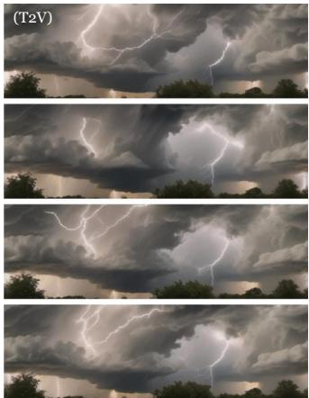

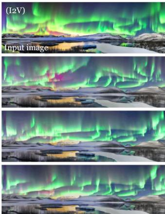  
Thunderstorm coming, lighting bolts sparks in dark sky...  
Beautiful northern light swirling and shifting across the night sky...

360° Dynamic Panorama (displayed in equirectangular projection)  
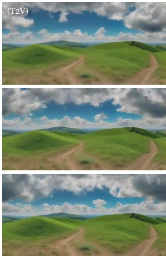

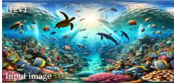

Clouds swirled over the green grass field…  
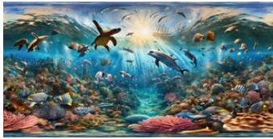

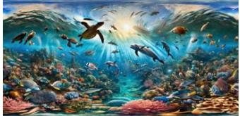  
Underwater world with various marine creatures swimming …  
Figure 1. We introduce DynamicScaler, a framework for generating dynamic panoramas conditioned on both images and text, or text alone. DynamicScaler enables the creation of regular panoramas with arbitary aspect ratio as well as 360° panoramic views, offering immersive visual experiences for AR/VR applications and displays of arbitrary aspect ratio and resolution.

scenes of any size, ensuring a seamless and immersive experience across various scenes in a panoramic view.

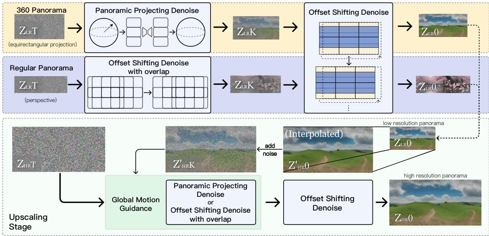  
Figure 2. Our pipeline is divided into two stages: low-resolution stage establishes a coarse motion structure, 360-degree setting(the yellow block) involves Panoramic Projecting Denoise to initialize motion that fits to spherical panorama, while the regular perspective setting(the blue block) utilizes Offset Shifting with overlap for the early denoise steps, then the remaining denoise steps are completed by our Offset Shifting Denoise. The up-scaling stage(the green block) utilizes more shift windows to produce a refined, high-resolution panorama with Global Motion Guidance from the low-resoltuion video.

Recent methods for image generation face two key challenges: generating high-resolution or wide aspect ratio images, and maintaining motion consistency and memory efficiency in dynamic scene generation, such as video synthesis. Extending image generation to higher resolutions or wider aspect ratios is computationally intensive, requiring significant memory and large-scale training datasets.

Models like [20] support larger range of aspect ratios but still faces scalability issues, especially when it comes to ultra wide aspect ratio and higher resolution, which limits this methods in consistency, memory usage and inference speed. Other methods, such as those that stitch patches from pre-trained diffusion models, work well for generating panoramic or landscape images with repetitive patterns [2, 14], but this approach is less effective for more complex or varied scenes. Additionally, although there have been advances in spatially scalable diffusion models for static image generation, these models are often limited to square images [7, 9, 10, 31], restricting their abil ity to handle broader aspect ratios. In contrast, the challenge of dynamic scene generation requires not only spatial coherence across frames, but also global motion consistency, making it even more computationally demanding. Moreover, video generation models must be designed with memory efficiency in mind, as large-scale dynamic scene synthesis often strains memory, limiting real-time inference capabilities. While recent works have explored trainingfree approaches for expanding diffusion models to new domains [13, 22, 23], the scalability of these models to highresolution video generation remains largely underexplored, requiring solutions that balance motion consistency and memory consumption effectively.

Generating dynamic scenes in a 360° panoramic field of view (FoV) introduces unique challenges, including: (1) the broader content distribution required for equirectangular projections (ERPs) over $3 6 0 ^ { \circ } \times 1 8 0 ^ { \circ }$ FoV; (2) curved motion patterns in ERPs versus straight-line motion in standard videos; and (3) continuity requirements at the left and right ERP boundaries, which represent the same meridian. 360DVD [25] addresses these challenges by fine-tuning a text-conditioned video diffusion model on panoramic data in equirectangular space, but it suffers from low resolution and interpolation artifacts due to operating in the latent space, causing blurriness and divergence from the original motion space. Other methods, like 4K4DGen [18] and Vividdream [15], attempt to animate scenes in overlapping regions, but their fixed-window denoising limits motion range and cross-scene consistency. Specifically, 4K4DGen faces constraints in motion range, relies solely on image-to-video transformations, and requires optimization procedures that reduce efficiency. Our approach overcomes these limitations by introducing a tuning-free denoising method that ensures spatial and temporal coherence for long-duration, loopable, and seamless panoramic video generation, achieving high-quality continuous motion with improved efficiency and visual fidelity.

We propose DynamicScaler, a unified, tuning-free framework for scalable panoramic dynamic scene synthesis with seamless motion. Our method ensures spatial and motion coherence throughout video generation by utilizing a shifting window that distributes noise uniformly across regions, achieving spatial scalability—whether overlapping or not—while maintaining consistent motion from a latent noise space. In contrast to the state-of-the-art 360DVD, DynamicScaler synthesizes higher-quality images by processing data into a pre-projected space before mapping it to the final equirectangular projection, thereby enhancing output fidelity. We introduce the Offset Shifting Denoiser (OSD), which synchronously denoises panoramic dynamic scenes using a well designed shifting Window mechanism, ensuring smooth transitions and spatial coherence while preserving motion fidelity as well as seamless transitions, and can also be adapted to generate 360 degree panorama by our Panoramic Projecting technique. To handle varying resolutions and aspect ratios, we employ Global Motion Guidance (GMG) and an upsampling strategy, ensuring local detail and global motion continuity in high-resolution scene generation. Our hierarchical approach maintains overall structure while delivering fine-grained local details, achieving seamless motion and scene-level consistency. In addition to spatial dimensions, we address the often-overlooked temporal dynamics, enabling the generation of long-duration as well as loopable dynamic scenes with continuous motion. We extend our OSD technique to the temporal domain, overcoming GPU memory constraints and enabling the synthesis of longer, temporally consistent dynamic scenes. Our contributions can be summarized as follows:

• We propose a unified framework for scalable panoramic dynamic scene synthesis, ensuring motion coherence across various resolutions, aspect ratios, and 360° FoV settings without requiring fine-tuning.

• We introduce the Offset Shifting Denoiser, which efficiently denoises the entire panoramic video with overall coherence, ensuring seamless boundary transitions and scene continuity across arbitrary aspect ratios, along with Global Motion Guidance, which enhances motion consistency at higher resolutions.

• We introduce the Panoramic Projection Denoiser to enable 360° FoV panorama generation and extend it to the temporal dimension, allowing for the generation of longer-duration or loopable dynamic videos. This method overcomes GPU memory limitations while ensuring temporal consistency across long-duration panoramic video sequences.

• Extensive experiments demonstrate that DynamicScaler outperforms existing methods in visual quality and motion consistency, generating continuous, longer duration an loopable dynamic scenes suitable for immersive applications.

## 2. Related Works

## 2.1. Spatial Scaling of Diffusion Models

Diffusion models have achieved remarkable success in generating high-quality images, with recent efforts focusing on scaling to diverse resolutions and aspect ratios. Existing approaches often rely on retraining or fine-tuning large models [27, 32], incurring significant computational costs and requiring extensive datasets. Other methods generate panoramic images by stitching patches from pretrained models, which work well for repetitive patterns like landscapes [2, 8, 14, 21]. Additionally, techniques such as AnyLens [22], MagicScroll [23], and AutoDiffusion [17] extend pretrained models across various domains without retraining. However, most of these methods are limited to square aspect ratios or fixed resolutions [7, 9, 10, 31] and cannot directly generate panoramic scenes with large aspect ratio.

## 2.2. Panoramic Scene Synthesis.

Recent advancements in scene-level generation focus on synthesizing large-scale 3D scenes from text, as seen in works like LucidDreamer, GALA3D, and Wonderworld [5, 29, 33]. These methods primarily generate static 3D scenes using Gaussian representations, limiting their capacity for dynamic content or flexible perspectives. Research on immersive generation has shifted toward 360° panoramas. OmniDreamer [1] employs cyclic inference for 360° image synthesis, while ImmenseGAN [6] leverages fine-tuning for better control. Diffusion-based methods, such as DiffCollage [30] and PanoDiff [24], have shown promise for static panoramas, yet fail to address dynamic video generation. While DreamScene360 [16] integrates Gaussian splatting for text-to-panorama synthesis, its reliance on static priors restricts dynamic scene applications.

## 2.3. Dynamic Scene Generation.

Dynamic scene generation for panoramic videos introduces challenges in maintaining motion coherence, temporal consistency, and visual quality over extended durations. 360DVD [25] adapts video diffusion models for panoramic data but faces limitations in generalization, interpolation accuracy, and style diversity when combining multiple LoRA models. Similarly, methods like 4K4DGen [18] and Vividdream [15] use overlapping regions for scene animation but suffer from noisy artifacts, fixed-window denoising, and restricted motion ranges. Moreover, 4K4DGen depends on optimization process to maintain coherence and is limited to image-to-video transformations. In contrast, our method overcomes these limitations with a shifting-based denoising framework that ensures spatial and temporal coherence. Our approach enables the generation of seamless, longduration, and loopable panoramic videos with high-quality dynamic motion.

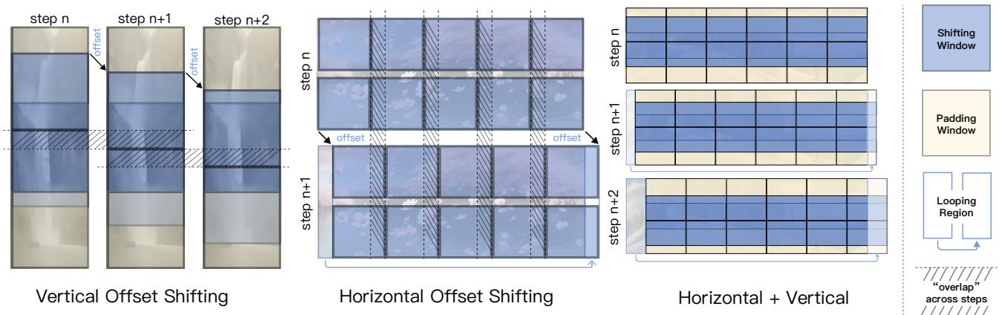  
Figure 3. The purposed Offset Shifting Window mechanism, which involves shifting denoising windows both vertically and horizontally between denoise steps to denoise the whole panorama video latent with arbitrary aspect ratio an resolution. The denosing windows are shifted vertically and horizontally every step, creating ”overlap” regions between steps which mitigate the artifacts and synchronize the whole denoising process across the panorama. This results in seamless and consistent panoramic video generation with high resolution and aspect ratio.

## 3. Method

We present DynamicScaler, a scalable and tuning-free framework for panoramic dynamic scene synthesis that achieves seamless spatial and temporal coherence in panoramic sythesis, as illustrated in Figure 2. To extend video diffusion from fixed resolutions to expansive panoramas, our approach involves an Offset Shifting Denoising mechanism. To further enhance structural awareness and ensure global coherence in large-scale motion, we introduce Global Motion Guidance, a structured motion prior tailored for panoramic video generation. Additionally, our framework provides methods for continuous, loopable motion, enabling seamless transitions and frame-to-frame consistency for extended, loopable video sequences.

## 3.1. Offset Shifting Denoising

To generate a $W _ { p } \times H _ { p }$ panorama Z with a regular diffusion model θ trained in resolution $W _ { \theta } \times H _ { \theta } ( W _ { \theta } < W _ { p } , H _ { \theta } <$ $H _ { p } )$ without extra finetuning, Z should be divided into nW ×nH windows to fit in the applicable size and denoised. Existing methods in panorama image synthesis like Multi-Diffusion [2] and SyncDiffusion [14] utilize more windows $( n _ { H } > H _ { p } / H _ { \theta } , n _ { W } > W _ { p } / W _ { \theta } )$ that overlap with each others to mitigate the seam and distortion caused by divided denoising windows, resulting in much higher computation overhead, while [8] randomly shift the windows to reduce the overlap needed, those methods mainly focus on regular perspective panorama image. However, in high resolution 360 degree panoramic video synthesis require extending both vertically and horizontally, contents also differs between each windows, hindering one from directly applying those methods. To tackle this challenge, we introduce Offset Shifting Denoising (OSD) that shift denoising windows by an offset, both vertically and horizontally, across the entire panorama in each steps as illustrated in Figure 3. This offset creates ”overlap” regions among windows between denoise steps, synchronizing content and motions across windows, and the trend of discontinuity at the edge of windows in one certain denoise step are also mitigated at the next step because the edges are also shifted along with the window.

Specifically, in the vertical direction, the windows with in the upper and lower boundaries are shifted vertically by an offset every steps, and the region that is not covered by those shifting windows are handled by the padding windows at the top and bottom of the panorama. Horizontally, windows are also shifted by offset while the whole latent would be regarded as a ring, that is, the left and right boundaries are ’connected’ so windows can cross through those boundary, which is implemented by filling the ’out of boundary’ regions by the corresponding region from the other side. The Offset Shifting Denoising process can be formulated as:

$$
Z _ { t } = C o n | _ { 1 : n _ { W } , 1 : n _ { H } } ( \Phi _ { \theta } ( t , c , S p l i t ( Z _ { t - 1 } , i , j , t , n _ { W } , n _ { H } ) ) )\tag{1}
$$

where $S p l i t ( X , i , j , t , n _ { W } , n _ { H } )$ indicates dividing the panorama video latent X into $n _ { W } \times n _ { H }$ windows with offset at time t and select the one in $i - t h$ column, j $C o n ( \cdot )$ means collecting latent from divided wi concat them to form the entire panorama latent; represents the diffusion process, for $\begin{array} { r } { \mathrm { T } 2 \mathrm { V } , c = \left\{ \begin{array} { r l } \end{array} \right. } \end{array}$ for I2V, $c = \{ c _ { t e x t } , S p l i t ( c _ { i m g } , i , j , t ) \}$

OSD not only allows seamless transition whole generated video in arbitrarily aspect rati enables motion and content continuity between t right boundaries, as shown in Figure 7, produci sive panoramic videos.

## 3.2. Global Motion Guidance

Shifting denoising along horizontal and vertical enables scalable panorama generation and seaml However, complex motion patterns, such as casc terfalls, require coordination across the entire field. At early denoising steps, the overall layo

structed [19], while the intrinsic synchronization offered by OSD has not accumulate enough influence in this period, different part of the panorama may tend to separate motion pattern, resulting in less consist overall motion, especially in high resolution panoramic scene generation. Besides applying more windows to create explicit spatial overlap in the first K steps, we introduce the Global Motion Guidance $( \mathrm { G M G } )$ , which decompose the generation process into global layout and local content stages hierarchically: the first stage synthesis a video in lower resolution, capturing high-level motion structures. Then in the upscaling stage those low-resolution result are upsampled using interpolation algorithm inter(·) like bicubic and re-noised noise(·), serving as an initialization that guide content layout and motion in the following high-resolution generation, which refines local details while preserve consistency. This process is formulated as:

$$
Z _ { H R ^ { 0 } } = \Phi _ { \theta } { } ^ { O S D } ( n o i s e ( i n t e r ( \Phi _ { \theta } { } ^ { O S D } ( Z _ { L R T } ) ) ) )\tag{2}
$$

Integrated with Offset Shifting Denoise, Global Motion Guidance preserves both broad motion structures and intricate details, yielding cohesive and richly detailed high resolution panoramic scenes.

## 3.3. 360° FoV Panorama Generation

$3 6 0 ^ { \circ }$ FoV panoramas are usually represented by its equirectangular projection (ERP), which project the spherical panorama into an $H \times W \times C$ matrix, with $W / H =$ 2. Common diffusion models trained by regular (perspective) video datasets face challenge in generating $3 6 0 ^ { \circ }$ FoV panorama videos due to the deformation in equirectangular projection. Besides training adapters with extra $3 6 0 ^ { \circ }$ FoV datasets [25], projecting portion of the equirectangular panorama back into mulitple perspective view ports allows using regular diffusion models to denoise. [18] relys on an optimization procedure to synchronize the diffusion process among each view ports, while it is constrained in Image to Video Generation and suffer from insufficient motion. We instead intergrate our offset shifting denoising mechanism with equirectangular projecting, ensuring high-quality $3 6 0 ^ { \circ }$ FoV panorama generation with minimal distortion.

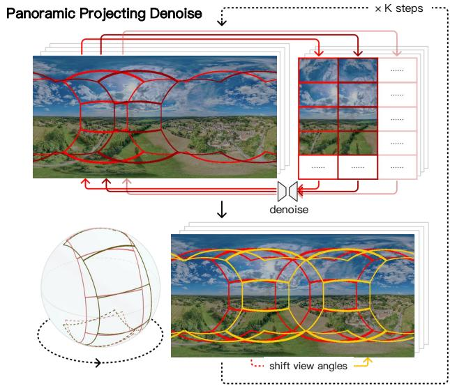  
Figure 4. The purposed Panoramic Projecting Denoise, where spherical panorama videos latents (represented as equirectangular projections) are projected into perspective view port windows and denoised, followed by re-projection back to the equirectangular panorama, as shown in the upper part of the figure. Those view port windows are also shifted with an offset applied in their view angles at each steps, as shown in the lower part of the figure. For legibility, only a proportion of view port regions are shown in the figure.

## 3.3.1. Spherical Projection.

Given a point $( x , y , z )$ on the unit sphere, the corresponding longitude α and latitude $\beta$ can be computed by:

$$
\alpha = \arctan 2 ( y , x ) , \beta = \arcsin ( z ) .\tag{3}
$$

The equirectangular projection maps these spherical coordinates $( \alpha , \beta )$ to a rectangular plane $( u , v )$ with $u =$ $\alpha , v \ = \ \beta ,$ , where the rectangular plane has a width of 2π and a height of $\pi _ { \mathrm { : } }$ , maintaining a 1 : 2 aspect ratio. For the inverse mapping, given a point $( u , v )$ on the rectangular plane, the corresponding 3D coordinates $( x , y , z )$ on the unit sphere can be computed by:

$$
x = \cos ( \beta ) \cos ( \alpha ) , y = \cos ( \beta ) \sin ( \alpha ) , z = \sin ( \beta ) .\tag{4}
$$

## 3.3.2. Offset Shifting in Panoramic Space.

Perspective view ports at certain view angle a and field of view f can be obtained by the projecting function ${ P r o j ( \cdot ) }$ from the equirectangular projection $Z ^ { p }$ of a 360 degree panorama, dividing the panorama into $n _ { \alpha } \times n _ { \beta }$ view port windows that can be denoised using normal diffusion model θ. Similar to the Offset Shifting in perspective panorama, we can also shift the view port windows at each steps with an offset applied in view angle $^ { a , }$ as illustrated in Figure 4, which can be formulated as:

$$
Z _ { t } = C o n _ { P r o j } | _ { 1 : n _ { \alpha } , 1 : n _ { \beta } } ( \Phi _ { \theta } ( t , c , P r o j ( Z _ { t - 1 } , f , a _ { i , j , t } ) ) )\tag{5}
$$

where $C o n _ { P r o j } ( \cdot )$ means collecting latent from divided view port windows and project into the 360 degree panorama.

In cases that windows have overlap with each others, which is often the case in high polar angle regions, parts of the latent space corresponding to subsequent windows may have already been denoised by previous windows, creating inconsistent noise levels. To address this, the system maintains a mask $M _ { d }$ at each timestep t to track denoised regions. Before processing each window, noise is rebalanced as:

$$
Z _ { t } ^ { \prime } [ x , y ] = \left\{ \begin{array} { l l } { \sqrt { \alpha _ { t } } Z _ { t } [ x , y ] + \sqrt { 1 - \alpha _ { t } } \epsilon _ { t } } & { \mathrm { i f } \ M _ { d } ( x , y ) = 1 } \\ { Z _ { t } [ x , y ] } & { \mathrm { i f } \ M _ { d } ( x , y ) = 0 } \end{array} \right.\tag{6}
$$

ensuring consistent noise levels across all windows before passing into diffusion model.

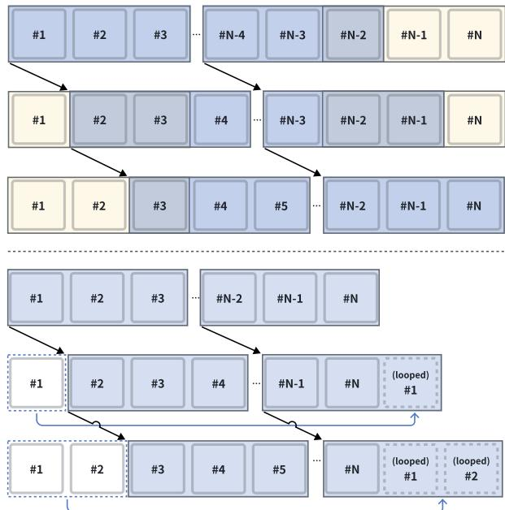  
Figure 5. The Offset Shifting Denoising mechanism extended to temporal dimension. The upper part shows how the frame clip windows are shifted with an offset along the temporal dimension, with padding windows at the start and end of the video sequence. The lower part shows the loopable offset shifting denoising, with looping frames at the start and end of the frames sequence.

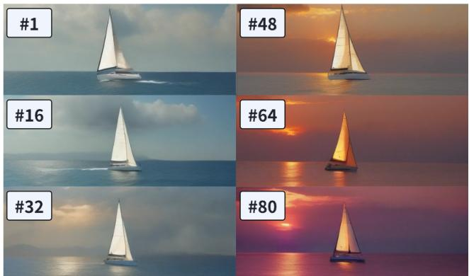  
Figure 6. Example frames from generated video at the first, 16th, 32th, 48th, 64th and 80th frames generate by a diffusion model that is capable for 16 frames originally. Despite the increasing video length, the visual quality of the panorama remains consistent, demonstrating the effectiveness of our method in generating long videos.

## 3.4. Long and Loopable Scene Video Generation

Most existing dynamic scene synthesis approaches like [25] and [18] are constrained in limited duration video sequences, as most video diffusion models produce only short clips (typically 16 frames, 2s durantion at 8 FPS). To address this, we extended Offset Shifting Denoising from spatial to temporal dimension and introduced a temporal shifting strategy that enables continuous motion and the generation of videos with much longer durationby regular video diffusion models θ that have limited frames length capacity $F _ { \theta }$ . In detail, the latent of long duration video $\bar { Z } \overset { * } { \in } \overset { \bullet } { \mathbb { R } } ^ { F ^ { \prime } \times W \times H }$ is divided along temporal dimention $F ^ { \prime }$ into $n _ { F }$ shorter frame clip windows with duration $F _ { \theta }$ each, as shown in Figure 5. which can be formulated by:

$$
Z _ { t } = C o n _ { F } | _ { 1 : n _ { F } } ( \Phi _ { \theta } ( t , c , S p l i t _ { F } ( Z _ { t - 1 } , i , t , n _ { F } ) ) )\tag{7}
$$

where $S p l i t _ { F } ( X , i , j , t , n _ { F } )$ indicates dividing the panorama video latent X into $n _ { F }$ frame clip windows with offset at time t and select the $i - t h$ one; $C o n _ { F } ( \cdot )$ means collecting latent from divided windows and concat them to form the complete latent. The shifting offset in temporal dimensions also create ’cross step overlap’ between windows analogous to spatial OSD, enabling generation of videos with much longer duration by regular video diffusion models that have limited frame length, while perserving continuous motion and smooth transitions between frames, as shown in Figure 6.

Moreover, by applying similar looping mechanism in our spatiall OSD process to the temporal dimension we can achieve seamless looping video generation. Specifically, instead of the padding windows at the start and the end of the frame sequence, the first and last frame are regarded as connected and windows are allowed to cross the start and end boundary, treating the video frames as a ring, to create a loopable sequence with smooth, continuous motion

<table><tr><td></td><td>Source</td><td>Tuning-Free</td><td>Arbitrary Size</td><td>360° Field-of-View</td><td>Text Only Condition</td><td>Image Condition</td><td>Unlimited Video Length</td><td>Loopable Generation</td></tr><tr><td>360DVD [25]</td><td>CVPR24</td><td>×</td><td>√</td><td>√</td><td>√</td><td>×</td><td>X</td><td>X</td></tr><tr><td>4K4DGen [18]</td><td>Arxiv24</td><td>X</td><td>×</td><td>√</td><td>×</td><td>√</td><td>X</td><td>×</td></tr><tr><td>Scalecrafter [11]</td><td>ICLR24</td><td>√</td><td>√</td><td>X</td><td>√</td><td>X</td><td>X</td><td>×</td></tr><tr><td>VividDream [15]</td><td>Arxiv24</td><td>X</td><td>√</td><td>×</td><td>×</td><td>√</td><td>X</td><td>X</td></tr><tr><td>DynamicScaler</td><td></td><td>√</td><td>√</td><td>√</td><td>√</td><td>√</td><td>√</td><td>√</td></tr><tr><td></td><td>CLIP-Score↑</td><td>Image ↑ Quality</td><td>Dynamic↑ Degree</td><td>Motion ↑ Smoothness</td><td>Temporal Flickering</td><td>Scene ↑</td><td>Q-Align(I) ↑</td><td>Q-Align(V)↑</td></tr><tr><td>360DVD [25]</td><td>0.293</td><td>0.436</td><td>0.412</td><td>0.917</td><td>0.964</td><td>0.417</td><td>0.485</td><td>0.532</td></tr><tr><td>DynamicScaler</td><td>0.302</td><td>0.583</td><td>0.783</td><td>0.963</td><td>0.982</td><td>0.499</td><td>0.632</td><td>0.613</td></tr></table>

Table 1. Quantitative comparison of dynamic scene generation methods, with best results highlighted in bold. The evaluation covers key factors such as resolution scalability, video length, and loopability, using metrics on image quality, dynamic range, motion smoothness, and temporal flickering, and user-centric Q-Align scores. DynamicScaler outperforms existing methods across all these metrics.

## 4. Experiments

## 4.1. Qualitative Results

<table><tr><td rowspan="2">Methods</td><td colspan="2">Video Criteria</td><td colspan="3">Panorama Criteria</td></tr><tr><td>Graphics Quality</td><td>Frame Consistency</td><td>End Continuity</td><td>Motion Pattern</td><td>Scene Richness</td></tr><tr><td colspan="6">Same Case Comparison</td></tr><tr><td>360DVD [25]</td><td>3.3</td><td>3.5</td><td>3.6</td><td>3.7</td><td>3.5</td></tr><tr><td>Ours</td><td>4.6</td><td>4.7</td><td>4.8</td><td>4.5</td><td>4.6</td></tr><tr><td colspan="6">Random Case Comparison</td></tr><tr><td>360DVD [25]</td><td>3.3</td><td>3.4</td><td>3.6</td><td>3.9</td><td>3.4</td></tr><tr><td>4K4DGen [18]</td><td>4.5</td><td>3.6</td><td>4.3</td><td>3.6</td><td>4.3</td></tr><tr><td>Scalecrafter [11]</td><td>3.5</td><td>3.7</td><td>1.9</td><td>4.4</td><td>3.6</td></tr><tr><td>VividDream [15]</td><td>3.6</td><td>3.7</td><td>3.8</td><td>3.6</td><td>4.1</td></tr><tr><td>Ours</td><td>4.3</td><td>3.9</td><td>4.5</td><td>4.5</td><td>4.4</td></tr></table>

Table 2. User preference study results. Same Case Comparison refers to using the same case for comparison, while Random Case Comparison refers to using different cases due to the unavailability of some methods. Ratings range from 1 (lowest) to 5 (highest).
<table><tr><td></td><td>Image↑Dynamic↑ Quality</td><td>Degree</td><td>Motion Smoothness</td><td>Temporal Flickering</td><td>↑Q-Align(V)↑</td></tr><tr><td>Direct Inference OOM</td><td></td><td>OOM</td><td>OOM</td><td>OOM</td><td>OOM</td></tr><tr><td>w/o OSD</td><td>0.564</td><td>0.749</td><td>0.948</td><td>0.905</td><td>0.595</td></tr><tr><td>w/o GMG</td><td>0.571</td><td>0.765</td><td>0.961</td><td>0.946</td><td>0.598</td></tr><tr><td>Full Method</td><td>0.587</td><td>0.778</td><td>0.967</td><td>0.985</td><td>0.616</td></tr></table>

Table 3. Performance comparison of different configurations regarding image quality, dynamic degree, motion smoothness, and temporal flickering. OOM stands for Out-of-Memory.

We evaluate the performance of DynamicScaler against state-of-the-art models. We detail the implementation, experimental settings, comparison methods, and user studies conducted to assess the efficacy of our approach. The proposed DynamicScaler is built on top of existing text-tovideo generation model from VideoCrafter2 [4] and imageto-video generation model from VideoCrafter1 [3].

Compared to previous methods, DynamicScaler supports a wider range of settings and can generate videos of infinite length, while other methods are limited to generating only finite-length videos. Our approach generates dynamic panoramas at various resolutions, including both standard and 360° Field-of-View (FoV) panoramas, with support for both text- and image-conditioned inputs, as shown in Table 1. Currently, among the available concurrent works, only 360DVD is capable of generating dynamic panoramas, so we compare our method directly with it. We assess the visual quality by randomly selecting views from 100 generated video cases using random camera positions. Key factors such as image quality, dynamic range, motion smoothness, temporal flickering, and scene richness are evaluated according to the protocols of VBench [12] and CogVideoX [28]. Furthermore, we incorporate an LLMbased visual evaluator, Q-Align [26], to score both image and video quality. As shown in Table 1, DynamicScaler outperforms existing methods, demonstrating superior video quality in handling complex dynamic scenes.

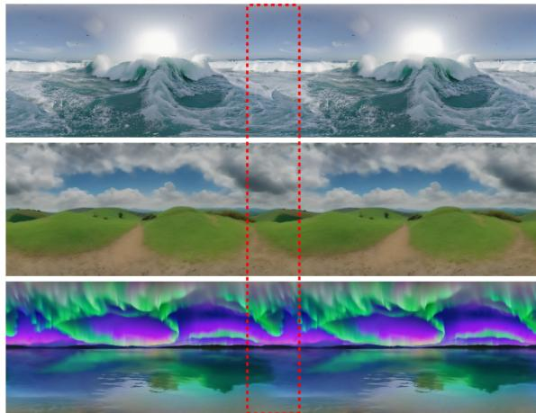  
Figure 7. To demonstrates the seamlessness of generated panorama videos, we horizontally concatenat the video frames, showcasing continuity across the left and right boundaries.

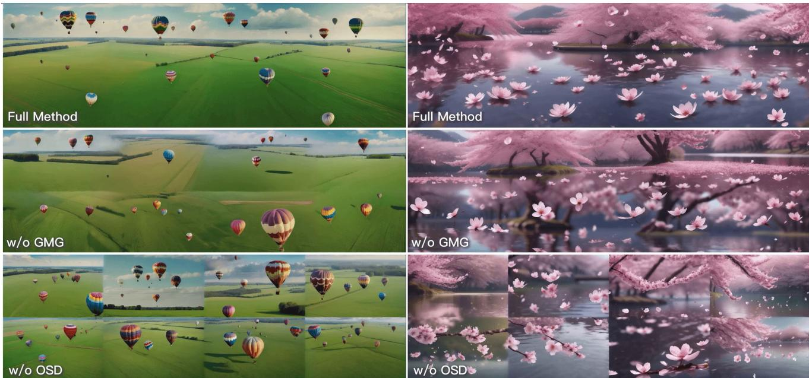  
Figure 8. Qualitative visualization of ablation study in regular perspective setting. Refer to our project page for results in video format.

## 4.2. Quantitative Results

As demonstrated in Figure 1, our approach generates panoramas of arbitrary sizes, supporting rectangular and 360° Field of View (FoV) configurations, offering unparalleled flexibility for diverse applications. As shown in Figure 7, the region near horizontal boundaries of generated frames align seamlessly, ensuring flawless 360° view—an essential feature for immersive environments. This highlights the robustness of our shift denoise technique in both non-360° and 360° settings. Furthermore, our method facilitates the creation of scene-level, long duration, and loopable videos through temporal shifting, without requiring additional training or compromising visual quality.

## 4.3. User Studies

We conduct user studies to evaluate videos based on five criteria: graphics quality, frame consistency, left-right continuity, content distribution, and motion patterns. 20 Participants are asked to select the video with the highest quality. Table 2 shows that DynamicScaler performs favorably in all criteria. We use two comparison types: same-case comparison (using the same scene for direct comparisons) and random-case comparison (using different scenes due to limited publicly available samples for comparison). Dynamic-Scaler receives the highest ratings in most criteria as shown in Table 2, especially for continuity, content distribution, and motion patterns, demonstrating its superior ability to generate seamless, dynamic panorama.

## 4.4. Ablation Studies

We conducted ablation studies to evaluate the impact of each core component in DynamicScaler under four different configurations: Direct Inference, where the video is generated directly at the target resolution without enhancement techniques, but results in out-of-memory (OOM) due to high VRAM demands; Without OSD (Offset Spatial Denoising), which excludes the offset spatial denoising mechanism that mitigates multi-scale artifacts; Without GMG (Global Motion Guidance), where global motion guidance is omitted, reducing frame-to-frame motion continuity; and the Full Method, which integrates all components. As shown in Table 3, the Full Method consistently outperforms all other configurations across all evaluation metrics, underscoring the significance of each component. Both OSD and GMG play critical roles in improving image quality, dynamic range, motion smoothness, and temporal coherence, while also minimizing temporal flickering. We also provide quantitative results of ablation study in Figure 8 and our project page.

## 5. Conclusions

This paper presents DynamicScaler for scalable, coherent panoramic dynamic scene synthesis. By introducing a Spatial Rotating Denoiser and Seamless Rotating Window, our approach ensures efficient denoising and consistent boundary transitions. The Global Motion Guidance mechanism maintains local detail and global motion continuity, delivering superior content quality and motion smoothness.

Overall, DynamicScaler outperforms existing methods in scalability and performance, offering a practical, training-free solution for creating high-quality, immersive AR/VR dynamic content across various resolutions and aspect ratios.

## Acknowledgments

Supported by the Intelligence Advanced Research Projects Activity (IARPA) via Department of Interior/ Interior Business Center (DOI/IBC) contract number 140D0423C0074. The U.S. Government is authorized to reproduce and distribute reprints for Governmental purposes notwithstanding any copyright annotation thereon. Disclaimer: The views and conclusions contained herein are those of the authors and should not be interpreted as necessarily representing the official policies or endorsements, either expressed or implied, of IARPA, DOI/IBC, or the U.S. Government.

## References

[1] Naofumi Akimoto, Yuhi Matsuo, and Yoshimitsu Aoki. Diverse plausible 360-degree image outpainting for efficient 3dcg background creation. In CVPR, pages 11441–11450, 2022. 3

[2] Omer Bar-Tal, Lior Yariv, Yaron Lipman, and Tali Dekel. Multidiffusion: Fusing diffusion paths for controlled image generation. In ICML, 2023. 2, 3, 4

[3] Haoxin Chen, Menghan Xia, Yingqing He, Yong Zhang, Xiaodong Cun, Shaoshu Yang, Jinbo Xing, Yaofang Liu, Qifeng Chen, Xintao Wang, Chao Weng, and Ying Shan. Videocrafter1: Open diffusion models for high-quality video generation, 2023. 7

[4] Haoxin Chen, Yong Zhang, Xiaodong Cun, Menghan Xia, Xintao Wang, Chao Weng, and Ying Shan. Videocrafter2: Overcoming data limitations for high-quality video diffusion models. In CVPR, pages 7310–7320, 2024. 7

[5] Jaeyoung Chung, Suyoung Lee, Hyeongjin Nam, Jaerin Lee, and Kyoung Mu Lee. Luciddreamer: Domain-free generation of 3d gaussian splatting scenes. arXiv preprint arXiv:2311.13384, 2023. 3

[6] Mohammad Reza Karimi Dastjerdi, Yannick Hold-Geoffroy, Jonathan Eisenmann, Siavash Khodadadeh, and Jean-Franc¸ois Lalonde. Guided co-modulated gan for 360 field of view extrapolation. In 3DV, pages 475–485, 2022. 3

[7] Ruoyi Du, Dongliang Chang, Timothy Hospedales, Yi-Zhe Song, and Zhanyu Ma. Demofusion: Democratising highresolution image generation with no. In CVPR, pages 6159– 6168, 2024. 2, 3

[8] Stanislav Frolov, Brian B Moser, and Andreas Dengel. Spotdiffusion: A fast approach for seamless panorama generation over time. arXiv preprint arXiv:2407.15507, 2024. 3, 4

[9] Alexandros Graikos, Srikar Yellapragada, Minh-Quan Le, Saarthak Kapse, Prateek Prasanna, Joel Saltz, and Dimitris Samaras. Learned representation-guided diffusion models for large-image generation. In CVPR, pages 8532–8542, 2024. 2, 3

[10] Lanqing Guo, Yingqing He, Haoxin Chen, Menghan Xia, Xiaodong Cun, Yufei Wang, Siyu Huang, Yong Zhang, Xintao Wang, Qifeng Chen, et al. Make a cheap scaling: A self-cascade diffusion model for higher-resolution adaptation. arXiv preprint arXiv:2402.10491, 2024. 2, 3

[11] Yingqing He, Shaoshu Yang, Haoxin Chen, Xiaodong Cun, Menghan Xia, Yong Zhang, Xintao Wang, Ran He, Qifeng Chen, and Ying Shan. Scalecrafter: Tuning-free higherresolution visual generation with diffusion models. In ICLR, 2023. 7

[12] Ziqi Huang, Yinan He, Jiashuo Yu, Fan Zhang, Chenyang Si, Yuming Jiang, Yuanhan Zhang, Tianxing Wu, Qingyang Jin, Nattapol Chanpaisit, et al. Vbench: Comprehensive benchmark suite for video generative models. In CVPR, pages 21807–21818, 2024. 7

[13] Zhiyu Jin, Xuli Shen, Bin Li, and Xiangyang Xue. Trainingfree diffusion model adaptation for variable-sized text-toimage synthesis. In NeurIPS, pages 70847–70860, 2023. 2

[14] Yuseung Lee, Kunho Kim, Hyunjin Kim, and Minhyuk Sung. Syncdiffusion: Coherent montage via synchronized joint diffusions. In NeurIPS, pages 50648–50660, 2023. 2, 3, 4

[15] Yao-Chih Lee, Yi-Ting Chen, Andrew Wang, Ting-Hsuan Liao, Brandon Y Feng, and Jia-Bin Huang. Vividdream: Generating 3d scene with ambient dynamics. arXiv preprint arXiv:2405.20334, 2024. 2, 3, 7

[16] Haoran Li, Haolin Shi, Wenli Zhang, Wenjun Wu, Yong Liao, Lin Wang, Lik-hang Lee, and Pengyuan Zhou. Dreamscene: 3d gaussian-based text-to-3d scene generation via formation pattern sampling. arXiv preprint arXiv:2404.03575, 2024. 3

[17] Lijiang Li, Huixia Li, Xiawu Zheng, Jie Wu, Xuefeng Xiao, Rui Wang, Min Zheng, Xin Pan, Fei Chao, and Rongrong Ji. Autodiffusion: Training-free optimization of time steps and architectures for automated diffusion model acceleration. In CVPR, pages 7105–7114, 2023. 3

[18] Renjie Li, Panwang Pan, Bangbang Yang, Dejia Xu, Shijie Zhou, Xuanyang Zhang, Zeming Li, Achuta Kadambi, Zhangyang Wang, and Zhiwen Fan. 4k4dgen: Panoramic 4d generation at 4k resolution. arXiv preprint arXiv:2406.13527, 2024. 2, 3, 5, 6, 7

[19] Or Patashnik, Daniel Garibi, Idan Azuri, Hadar Averbuch-Elor, and Daniel Cohen-Or. Localizing object-level shape variations with text-to-image diffusion models. In Proceed ings of the IEEE/CVF International Conference on Computer Vision (ICCV), 2023. 5

[20] Dustin Podell, Zion English, Kyle Lacey, Andreas Blattmann, Tim Dockhorn, Jonas Muller, Joe Penna, and¨ Robin Rombach. Sdxl: Improving latent diffusion models for high-resolution image synthesis. arXiv preprint arXiv:2307.01952, 2023. 2

[21] Fabio Quattrini, Vittorio Pippi, Silvia Cascianelli, and Rita Cucchiara. Merging and splitting diffusion paths for semantically coherent panoramas. arXiv preprint arXiv:2408.15660, 2024. 3

[22] Andrey Voynov, Amir Hertz, Moab Arar, Shlomi Fruchter, and Daniel Cohen-Or. Anylens: A generative diffusion model with any rendering lens. arXiv preprint arXiv:2311.17609, 2023. 2, 3

[23] Bingyuan Wang, Hengyu Meng, Zeyu Cai, Lanjiong Li, Yue Ma, Qifeng Chen, and Zeyu Wang. Magicscroll: Nontypical aspect-ratio image generation for visual storytelling

via multi-layered semantic-aware denoising. arXiv preprint arXiv:2312.10899, 2023. 2, 3

[24] Jionghao Wang, Ziyu Chen, Jun Ling, Rong Xie, and Li Song. 360-degree panorama generation from few unregistered nfov images. arXiv preprint arXiv:2308.14686, 2023. 3

[25] Qian Wang, Weiqi Li, Chong Mou, Xinhua Cheng, and Jian Zhang. 360dvd: Controllable panorama video generation with 360-degree video diffusion model. In CVPR, pages 6913–6923, 2024. 2, 3, 5, 6, 7

[26] Haoning Wu, Zicheng Zhang, Weixia Zhang, Chaofeng Chen, Liang Liao, Chunyi Li, Yixuan Gao, Annan Wang, Erli Zhang, Wenxiu Sun, et al. Q-align: Teaching lmms for visual scoring via discrete text-defined levels. arXiv preprint arXiv:2312.17090, 2023. 7

[27] Enze Xie, Lewei Yao, Han Shi, Zhili Liu, Daquan Zhou, Zhaoqiang Liu, Jiawei Li, and Zhenguo Li. Difffit: Unlocking transferability of large diffusion models via simple parameter-efficient fine-tuning. In CVPR, pages 4230–4239, 2023. 3

[28] Zhuoyi Yang, Jiayan Teng, Wendi Zheng, Ming Ding, Shiyu Huang, Jiazheng Xu, Yuanming Yang, Wenyi Hong, Xiaohan Zhang, Guanyu Feng, et al. Cogvideox: Text-to-video diffusion models with an expert transformer. arXiv preprint arXiv:2408.06072, 2024. 7

[29] Hong-Xing Yu, Haoyi Duan, Charles Herrmann, William T Freeman, and Jiajun Wu. Wonderworld: Interactive 3d scene generation from a single image. arXiv preprint arXiv:2406.09394, 2024. 3

[30] Qinsheng Zhang, Jiaming Song, Xun Huang, Yongxin Chen, and Ming-Yu Liu. Diffcollage: Parallel generation of large content with diffusion models. In CVPR, pages 10188– 10198, 2023. 3

[31] Shen Zhang, Zhaowei Chen, Zhenyu Zhao, Zhenyuan Chen, Yao Tang, Yuhao Chen, Wengang Cao, and Jiajun Liang. Hidiffusion: Unlocking high-resolution creativity and efficiency in low-resolution trained diffusion models. arXiv preprint arXiv:2311.17528, 2023. 2, 3

[32] Qingping Zheng, Yuanfan Guo, Jiankang Deng, Jianhua Han, Ying Li, Songcen Xu, and Hang Xu. Any-sizediffusion: Toward efficient text-driven synthesis for any-size hd images. In AAAI, pages 7571–7578, 2024. 3

[33] Xiaoyu Zhou, Xingjian Ran, Yajiao Xiong, Jinlin He, Zhiwei Lin, Yongtao Wang, Deqing Sun, and Ming-Hsuan Yang. Gala3d: Towards text-to-3d complex scene generation via layout-guided generative gaussian splatting. arXiv preprint arXiv:2402.07207, 2024. 3