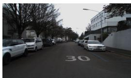
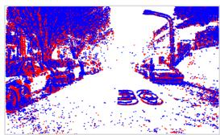
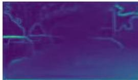
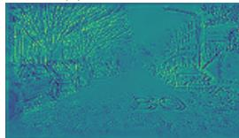
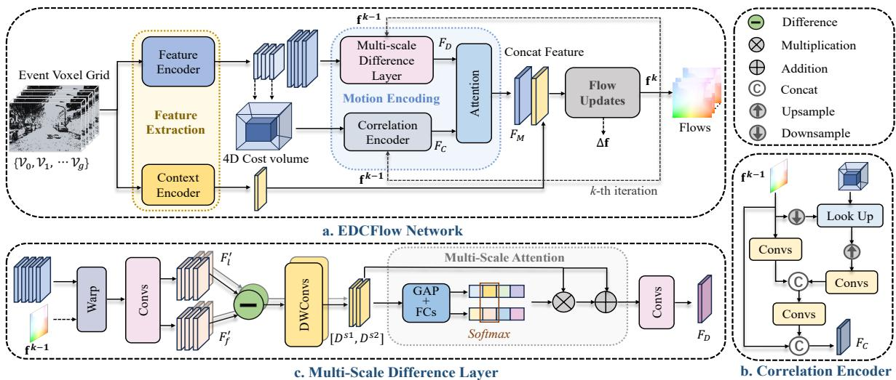
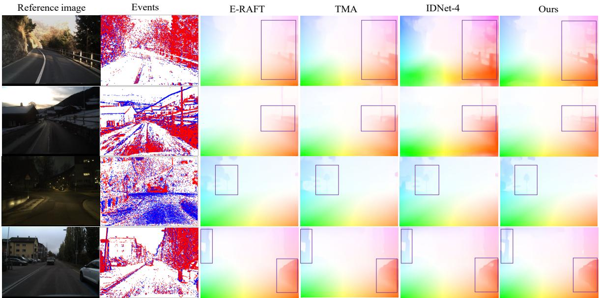
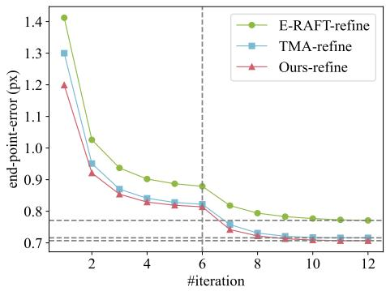
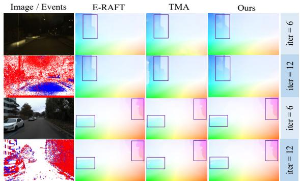

# EDCFlow: Exploring Temporally Dense Difference Maps for Event-based Optical Flow Estimation

Daikun Liu Lei Cheng Teng Wang\* Changyin Sun Southeast University {dkliu, leicheng, wangteng, cysun}@seu.edu.cn

## Abstract

Recent learning-based methodsfor event-based opticalflow estimation utilize cost volumes for pixel matching but suffer from redundant computations and limited scalability to higher resolutions for flow refinement. In this work, we take advantage of the complementarity between temporally densefeature differences ofadjacent eventframes and cost volume and present a lightweight event-based optical flow network (EDCFlow) to achieve high-quality flow estimation at a higher resolution. Specifically, an attentionbased multi-scale temporal feature difference layer is developed to capture diverse motion patterns at high resolution in a computation-efficient manner. An adaptive fusion of high-resolution difference motion features and lowresolution correlation motion features is performed to enhance motion representation and model generalization. Notably, EDCFlow can serve as a plug-and-play refinement modulefor RAFT-like event-based methods to enhanceflow details. Extensive experiments demonstrate that EDCFlow achieves better performance with lower complexity compared to existing methods, offering superior generalization. Codes and models will be available at here.

## 1. Introduction

Optical flow estimation calculates per-pixel displacement vectors and is important for various applications like deblurring [19, 41], action recognition [9, 37], and object tracking [40]. Event streams offer fine-grained temporal detail, high dynamic range, and no motion blur [8], making them well-suited for motion capture in challenging scenarios.

Flow estimation essentially involves establishing correspondences between the source and target pixels, commonly achieved by modeling correlations in 4D cost volumes [6, 33, 34]. As a representative method, RAFT [34] constructs a single-resolution (i.e., 1/8) cost volume of allpairs for correlations retrieval and employs a GRU for iterative refinement. Inspired by the success of RAFT in the frame domain, several event-based methods [12, 13, 20, 36] adopt analogous architectures by treating event streams as consecutive event frames. Specifically, DCEIFlow [36] and E-RAFT [12] focus on long-range correspondences, neglecting intermediate motions in events; TMA [20] and MultiFlow [13] mitigate this by building temporally dense cost volumes, resulting in a complexity of $\mathcal { O } ( T N ^ { 2 } C )$ with T, N, and C representing the number of event frames, pixels, and feature dimensions, respectively. However, event streams typically provide small displacement in a short time window and performing global 2D searches within temporally dense cost volumes leads to information redundancy and unnecessary computations. Furthermore, this computational burden limits the scalability of these RAFT-like methods to higher resolutions, which offer potential accuracy gains as evidenced by recent studies [4, 38].

  
(a) Reference image

  
(b) Event stream

  
(c) Correlation motion feature

  
(d) Difference motion feature  
Figure 1. Illustration of difference between correlation and difference motion features. (a) Reference image of DSEC [11] dataset. (b) Corresponding event stream. (c) Correlation motion feature. (d) Difference motion feature.

In this work, we attempt to perform flow estimation at a higher resolution (i.e., 1/4) without resorting to computationally expensive high-resolution cost volumes. Instead, we exploit the potential of temporally dense motion features derived from dense feature differences between adjacent event frames. As illustrated in Fig. 1, cost volumes reflect global similarity and are robust to noise, but prone to matching ambiguities and expensive computations. In contrast, feature differences capture details with clear motion boundaries and are computationally efficient (i.e., O(TNC)), but are sensitive to noise, limiting their Generalizability. This complementarity motivates us to present a joint difference and correlation network for event-based optical flow, dubbed EDCFlow, as shown in Fig. 2, that iteratively integrates motion features from temporally dense high-resolution (i.e., 1/4) feature difference maps and a lowresolution (i.e., 1/8) cost volume to refine flows, thereby achieving better accuracy with lower complexity.

To be specific, in each iteration, we look up the correlation, upsample it to the higher resolution, and encode correlation motion features. To capture intermediate motions, we discretize moving trajectories and compute the feature differences between adjacent frames. More precisely, we perform feature warping on consecutive frames, and introduce a multi-scale temporal feature difference layer with attention to capture various motion patterns, providing reliable motion details for both large and small displacements. The correlation and difference motion features are finally adaptively fused to update the flow. Notably, our model can be cascaded into existing RAFT-like networks to enhance flow quality, especially at motion boundaries, with marginal additional parameters and computations. Extensive experimental results on DSEC [11] and MVSEC [42] demonstrate that EDCFlow achieves SOTA-comparable performance with higher efficiency, offering advantages for realworld deployment and adoption. Furthermore, we conduct ablation studies to validate key design choices of EDCFlow. We summarize our contributions as follows:

• We introduce a lightweight event-based optical flow network, which explores the temporally dense feature differences between adjacent event frames, combined with a low-resolution cost volume to enable high-quality flow estimation at a higher resolution.

• We construct an attention-based feature difference layer to aggregate temporally multi-scale motion patterns and adaptively fuse complementary motion features from difference maps and cost volume, enhancing both representation power and generalization capability of our model.

• The proposed methods can be flexibly integrated into event-based RAFT-like networks to further refine flow.

• Our method achieves state-of-the-art or comparable performance on DSEC and MVSEC while striking a better balance between accuracy, model size, and computations.

## 2. Related Work

Optical Flow Estimation on Two-frame. Building on the advancements in deep learning, some U-Net-like methods [23, 24, 33, 35, 39] employ similar core components, with a feature pyramid, warping layers, and local correlation reaching high accuracy. Recently, RAFT [34] diverges from previous approaches by generating an all-pairs 4D cost volume and using GRU for recurrent flow updates, obtaining high-quality flow. Extended methods [15, 16, 32] optimize the cost volume to address matching ambiguities. We leverage the excellent framework of RAFT to explore eventbased flow estimation.

Event-based Optical Flow Estimation. In event-based vision, early model-based works estimate flow by leveraging the Lucas-Kanade algorithm [1, 26], variational methods [27, 31], and block-matching [21, 22]. Under the assumption of brightness constancy, some methods [7, 29] adopt contrast maximization frameworks to improve the flow quality. Most learning-based methods [5, 28, 43, 44] employ U-Net-like networks to output multi-level flow, but low-resolution outputs lead to details loss. Recently, networks [12, 13, 18, 20, 36] introduce RAFT into the event domain, delivering impressive performance, yet they are inefficient in encoding intermediate motions and face challenges in extending for refinement at higher resolutions. Although IDNet [38] achieves a lightweight network capable of estimating at a higher resolution, it incurs significant computational overhead. In contrast, our approach utilizes dense feature differences to effectively encode continuous motion cues at a higher resolution, achieving better accuracy/model-complexity balance.

Event-based Motion Encoding in Flow Estimation. Some methods [3, 5, 10, 43–45] tend to use CNNs or RNNs to implicitly learn correspondences. Recent approaches [12, 13, 18, 20, 36] leverage cost volumes to directly construct correspondences, improving the accuracy and robustness. However, they either neglect intermediate motion [12, 18, 36] or adopt computationally expensive multi-cost volume [13, 20] to represent it. IDNet [38] employs an RNN backbone to iteratively encode temporal dependencies, yet estimate flow at a higher resolution still requires substantial computations. Instead, we compute feature differences, which effectively capture consistent motion and boundaries [17], aiding intermediate motion encoding in events. However, due to their sensitivity to noise, we propose combining feature differences with a low-resolution cost volume to model representative motion features with greater robustness and efficiency.

## 3. Method

## 3.1. Overall Framework

Event Representation and Problem Description. Event camera produces an event encoded as $( x , y , t , p )$ by measuring the brightness change, where (x, y), t, and $p \in$ $\{ - 1 , + 1 \}$ denote the coordinate, timestamp, and polarity of the brightness change, respectively. For an event stream $\mathcal { E } = \{ ( x _ { i } , y _ { i } , t _ { i } , p _ { i } ) \} _ { i = 0 } ^ { N _ { e } - 1 }$ with $N _ { e }$ events, we represent it as a voxel grid with B temporal bins [44], with each event contributing its polarity to the two closest temporal bins:

  
Figure 2. a. Overview of EDCFlow, including three main components: 1) Feature Extraction. Feature and context encoder extract features from input. 2) Motion Encoding. A correlation encoder and multi-scale temporal feature difference layer, along with an attention layer, are utilized to iteratively generate representative motion features. 3) Flow Updates. A GRU recurrently updates the flow by decoding the fused motion feature. b. Correlation Encoder. Search correlations at lower resolution, followed by upsampling and high-resolution correlation motion encoding. c. Multi-scale Difference Layer. Compute temporal multi-scale difference motion features at the higher resolution.

$$
\mathcal { V } \left( b , x , y \right) = \sum _ { i = 0 } ^ { N _ { e } - 1 } p _ { i } \operatorname* { m a x } \left( 0 , 1 - \left| b - t _ { i } ^ { * } \right| \right) ,\tag{1}
$$

$$
t _ { i } ^ { * } = \frac { ( t _ { i } - t _ { m i n } ) } { t _ { m a x } - t _ { m i n } } \times ( B - 1 ) ,\tag{2}
$$

where $b \in [ 0 , B - 1 ]$ is the bin index, $t _ { m a x }$ and $t _ { m i n }$ are the maximum and minimum timestamps, respectively. In this work, we aim to estimate the dense flow $\mathbf { f } _ { t  t + 1 }$ from t to $t + 1$ under the two consecutive event sequences $\mathcal { E } _ { t - d t  t }$ and $\mathcal { E } _ { t  t + 1 }$ , with $\mathcal { E } _ { t - d t  t }$ as the reference.

Overview. We briefly review RFAT [34] in the supplementary material and present an overview of our EDCFlow in $\mathrm { F i g . ~ 2 ~ ( a ) }$ . Our EDCFlow consists of three key components: 1) Feature Extraction. The feature encoder extracts two-resolution features to encode feature differences at a higher resolution (i.e., 1/4) while constructing a lowresolution (i.e., 1/8) cost volume. The context encoder provides scene context for flow decoding. 2) Motion Encoding. At the higher resolution, correlation features are encoded through looking up, motion encoding, and upsampling, while the temporally dense motion features are captured by a multi-scale temporal difference layer. These two complementary motion features are adaptively fused by an attention layer. 3) Flow Updates. A GRU decodes the residual flow from the fused motion features and updates the current flow. We iteratively perform motion encoding and flow updates to refine the flow. In the following sections, we will elaborate on the details of our EDCFlow in Sec. 3.2, Sec. 3.3 and Sec. 3.4.

## 3.2. Feature Extraction

The fine-grained temporal detail of event streams provides continuous motion information. To exploit the intermediate motion cues, instead of treating the current event stream $\mathcal { E } _ { t  t + 1 }$ as a single frame as in E-RAFT [12], we divide it into g time windows of size dt, along with the reference event stream $\mathcal { E } _ { t  t + 1 }$ , resulting in a total of $g + 1$ time windows. Using Eq. (1) and Eq. (2), for each time window, we generate event representation $v _ { i } \in \mathbb { R } ^ { B \times H \times W }$ $i = 0 , 1 , \dotsc , g$ , where H and W denote height and width, respectively. We adopt a shared-weight encoder to extract features for $g + 1$ voxel grids at 1/4 and 1/8 resolution: $F _ { i } ~ \in ~ \mathbb { R } ^ { d \times \frac { H ^ { \prime } } { 4 } \times \frac { \dot { W } } { 4 } }$ and $\bar { F } _ { i } \overset {  } { \in } \mathbb { R } ^ { \bar { d } \times \frac { H } { 8 } \times \frac { W } { 8 } } , \ i \ = \ 0 , 1 , \dots , g ,$ where d and ¯d represent the channel of features. For saving computation and storage, we build a long-range 4D cost volume C at 1/8 resolution using $\bar { F } _ { 0 }$ and $\bar { F } _ { g } .$

$$
C = \frac { \bar { F } _ { 0 } \bar { F _ { g } } } { \sqrt { \bar { d } } } \in \mathbb { R } ^ { \frac { H } { 8 } \times \frac { W } { 8 } \times \frac { H } { 8 } \times \frac { W } { 8 } } .\tag{3}
$$

This cost volume is constructed to provide crucial and robust correspondence information, facilitating the 2D search. The context encoder follows the same architecture as the feature encoder to capture scene contexts for flow updates.

## 3.3. Motion Encoding and Flow Updates

We take advantage of high-resolution difference maps and low-resolution cost volume to encode motion features, thus estimating high-quality flow in an efficient manner. As shown in Fig. 2, we employ an iterative scheme as in RAFT [34], to progressively narrow the flow search space. Each iteration $k \in \{ 1 , 2 , \cdots , K \}$ involves correlation motion encoding, multi-scale temporal difference motion encoding, attention-based motion fusion, and flow updates.

Correlation Encoder. The difference maps encode changes between adjacent frames but lack direct pixel-level correspondences, whereas the cost volume provides reliable matching cues to capture long-range dependencies. Therefore, integrating correlation motion features from a low resolution offers crucial long-range correspondences efficiently. $\mathbf { A } \mathbf { s }$ shown in Fig. 2 (b), given the estimated flow $\mathbf { f } ^ { k - 1 } ( i . e . , \mathbf { f } _ { 0  g } ^ { k - 1 } )$ at 1/4 resolution, we first downsample it to 1/8 resolution to retrieve correlations from the cost volume C. We then upsample the correlation map to 1/4 resolution and follow RAFT [34] to encode the correlation motion features $F _ { C }$ through convolutions.

Multi-scale Temporal Difference Layer. For each iteration, our difference layer strives to capture continuous motion features, providing fine details for inferring the residual flow. We achieve this by warping the target feature maps to the reference one using the current flow before calculating the dense difference maps. Specifically, in Fig. 2 (c), we warp the features $F _ { i } , i = 1 , \ldots , g .$ , of consecutive frames, towards $F _ { 0 }$ through bilinear interpolation based on the corresponding flow $\bar { \mathbf { f } } _ { 0  i } ^ { k - 1 }$ . In small time windows, the motion is minimal, allowing us to assume linear movement. Under this assumption, the flow for each feature map $F _ { i }$ is given by:

$$
{ \bf f } _ { 0  i } ^ { k - 1 } = \frac { i } { g } { \bf f } ^ { k - 1 } , i = 1 , 2 , . . . , g .\tag{4}
$$

The warped features $\tilde { F } _ { i }$ , and the reference feature $F _ { 0 } ,$ , denoted as $\tilde { F } _ { 0 }$ , are considered for motion encoding.

To maintain high computational efficiency, we apply a convolution to reduce the channel dimension of $\tilde { F } _ { i }$ , producing former features $\tilde { F } _ { i } ^ { f } \in \mathbb { R } ^ { \frac { d } { r } \times \frac { H } { 4 } \times \frac { W } { 4 } } , i \mathrm { ~ = ~ } 0 , 1 , . . . , g ,$ where r is the reduction ratio. To alleviate spatial misalignment between adjacent feature maps, we perform channelwise transformations on the former features to smooth out the spatial boundaries while sharpening the motion boundaries, resulting in the latter features $\mathbf { \widetilde { \it F } } _ { i } ^ { l }$ . Considering that fast-moving objects cause large displacements over short durations, while slower movements may exhibit significant changes over longer durations, we introduce a multi-scale sampling strategy to capture multi-scale motion cues. Specifically, we introduce a sampling stride s, $s \in \{ 1 , 2 , \cdots , g \}$ , to control the time interval between the latter and former features, with smaller and higher values capturing fast and slower motions, respectively. A sequence of feature difference maps under a given s is given by:

$$
D _ { j } ^ { s } = \tilde { F } _ { ( j + 1 ) * s } ^ { l } - \tilde { F } _ { j * s } ^ { f } , j = 0 , 1 , \ldots , \lfloor \frac { g } { s } \rfloor - 1 .\tag{5}
$$

We reshape them into $\begin{array} { r } { \frac { d } { r } \times \lfloor \frac { g } { s } \rfloor \times \frac { H } { 4 } \times \frac { W } { 4 } } \end{array}$ . Simply adding these temporal features can lead to the loss of details, while using concatenation or GRU for aggregation introduces significant computational overhead. Therefore, we use two depth-wise separable 3D convolutions (DW-3DConvs) to capture spatio-temporal features while restoring the number of channels, obtaining motion features $D ^ { s }$ . We consider different values of $s = [ s 1 , s 2 , \cdot \cdot \cdot ] ,$ , and concatenate the produced multi-scale motion features denoted as $D = [ D ^ { s 1 } ; D ^ { s 2 } ; \cdot \cdot \cdot ]$ . To accommodate different motion patterns across various scenarios, we design an attentionbased multi-scale fusion module, consisting of global pooling, fully connected layers, and softmax along the scale dimension, to adaptively fuse them softly. Finally, a convolution is applied to adjust the channel dimensions and output the difference motion feature $F _ { D }$ . This difference motion feature exhibits a stronger ability to handle details at the higher resolution.

Attention-based Motion Fusion. The difference motion features and correlation motion features hold distinct advantages and exhibit complementary properties. To effectively handle the importance variations between these two features in an adaptive manner while maintaining computational efficiency, we employ a simple yet effective channel attention [14] to fuse them:

$$
F _ { M } = \mathrm { A t t e n t i o n } ( \mathrm { C o n c a t } ( F _ { D } , F _ { C } ) ) ,\tag{6}
$$

where $F _ { M }$ is the final motion feature for flow estimation. Flow Updates. We feed the contextual characteristics and the fused motion features $F _ { M }$ into the GRU unit to output an updated residual flow $\Delta \mathbf { f } ,$ which is used to calculate the current estimate: $\mathbf { f } ^ { k } = \mathbf { f } ^ { k - 1 } + \Delta \mathbf { f }$

## 3.4. Loss

Following RAFT [34], we supervised our network with $L _ { 1 }$ loss between ground truth $\mathbf { f } ^ { g t }$ and the predictions $\{ \mathbf { f } ^ { 1 } , . . . , \mathbf { f } ^ { K } \}$ }, with exponentially increasing weights, which is given by:

$$
\mathcal { L } = \sum _ { k = 1 } ^ { K } 0 . 8 ^ { K - i } \left\| \mathbf { f } ^ { g t } - \mathbf { f } ^ { k } \right\| _ { 1 } .\tag{7}
$$

## 4. Experiments

Datasets and Metrics. We conduct experiments on two commonly used datasets: MVSEC [42], which has lower resolution and sparser events, resulting in poorer data quality and ground truth, and DSEC [11], which provides higher resolution and denser events. Following previous works [12, 20, 38], we train and test our network on the DSEC official training and test sets and report the results on the public benchmark. For MVSEC, we train on two time windows lengths: $d t \ = \ 1$ (1 grayscale image frame apart) and dt = 4 (4 grayscale image frames apart), using the outdoor day2 sequence for training and testing on indoor flying sequences and 800 samples of the outdoor day1. We evaluate flow accuracy using end-pointerror (EPE) on both datasets. For MVSEC, we additionally measure the percentage of pixels with an EPE greater than 3 pixels and 5% of ground-truth magnitude (% Outlier). For DSEC, we compute the angular error in degrees (AE) and percentage of pixels with an EPE greater than n pixels (nPE, n=1, 2, 3). To assess efficiency, we report multiplyaccumulate operations (MACs), model size in parameters (Param), and runtime time (Runt.) of per-predicting on the DSEC dataset, using the NVIDIA GeForce RTX 4090.

<table><tr><td></td><td>Method</td><td>EPE</td><td>AE</td><td>1PE</td><td>2PE</td><td>3PE</td><td>Param (M)</td><td>MACs (G)</td><td>Runt. (ms)</td></tr><tr><td>MB</td><td>MultiCM [29]</td><td>3.47</td><td>13.98</td><td>76.6</td><td>48.4</td><td>30.9</td><td>-</td><td>-</td><td>-</td></tr><tr><td>USL</td><td>TamingCM [28]</td><td>2.33</td><td>10.56</td><td>68.3</td><td>33.5</td><td>17.8</td><td>-</td><td>-</td><td>-</td></tr><tr><td rowspan="8">SL</td><td>EV-FlowNet† [43]</td><td>2.32</td><td>7.9</td><td>55.4</td><td>29.8</td><td>18.6</td><td>14.0</td><td>62</td><td>7</td></tr><tr><td>E-RAFT [12]</td><td>0.79</td><td>2.85</td><td>12.7</td><td>4.7</td><td>2.7</td><td>5.3</td><td>256</td><td>102</td></tr><tr><td>E-RAFT-4 [12]</td><td></td><td>GPU out of memory </td><td></td><td> (&gt; 40GB)</td><td></td><td>5.3</td><td>750</td><td>1</td></tr><tr><td>MultiFlow [13]</td><td>0.75</td><td>2.68</td><td>11.9</td><td>4.4</td><td>2.4</td><td>5.6</td><td></td><td></td></tr><tr><td>TMA [20]</td><td>0.74</td><td>2.68</td><td>10.9</td><td>4.0</td><td>2.7</td><td>6.9</td><td>344</td><td>58</td></tr><tr><td>IDNet-8 [38]</td><td>0.77</td><td>3.0</td><td>12.1</td><td>4.0</td><td>2.2</td><td>1.4</td><td>222</td><td>75</td></tr><tr><td>IDNet-4 [38]</td><td>0.72</td><td>2.72</td><td>10.1</td><td>3.5</td><td>2.0</td><td>2.5</td><td>1200</td><td>120</td></tr><tr><td>E-FlowFormer [18]</td><td>0.76</td><td>2.68</td><td>11.2</td><td>4.1</td><td>2.5</td><td></td><td></td><td>1</td></tr><tr><td></td><td>Ours</td><td>0.72</td><td>2.65</td><td>10.0</td><td>3.6</td><td>2.1</td><td>2.5</td><td>247</td><td>39</td></tr></table>

Table 1. Evaluation on DSEC [11]. The best results are in bold, while the second-best ones are underlined. † denote the result from E-RAFT [12]. E-RAFT-4 represents flow estimation at 1/4 resolution.

  
Figure 3. Qualitative results of flow predictions on DSEC [11]. Notable areas are marked by bounding boxes. Please zoom in for details.

Implementation Details. For event representation, we set g = 5 for both datasets, with B = 3 for DSEC and MVSEC at dt = 4, and B = 1 when dt = 1, maintaining the same total number of time bins across all time windows as methods [12, 20]. We assign downsampling ratio r = 1 and multiple scales $s = [ 1 , 2 , 5 ]$ for the difference layer. The iteration K and the hidden dimension of GRU are set to 6 and 96, respectively, the channel for correlation motion feature is 64, and the feature extraction follows TMA [20]. Our method, implemented in PyTorch, is trained on DSEC and MVSEC using the AdamW optimizer [25] with a onecycle learning rate scheduler [30] (maximum learning rate 0.0002), for 100 and 10 epochs, respectively with a batch size of 3. During training, DSEC and MVSEC are randomly cropped to 288 × 384 and 256 × 256 respectively, with 50% probability of horizontal flipping and 10% probability of vertical flipping applied to both datasets.

## 4.1. Results

DSEC. Tab. 1 presents a quantitative comparison with existing methods on DSEC [11]. Training manners are annotated as MB (model-based), USL (unsupervised learning), and SL (supervised learning). E-FlowFormer is trained on both DSEC and Blinkflow [18], while others use DSEC only. Our method outperforms both model-based and unsupervised approaches in accuracy and surpasses the U-Net-like EV-FlowNet. Among RAFT-like methods [12, 13, 18, 20], we achieve the best performance, improving EPE by 9% over E-RAFT and 3% over TMA, with better robustness (lower nPE). Compared to IDNet, we perform accuracy comparable to IDNet-4 but with superior AE.

<table><tr><td rowspan="2"></td><td rowspan="2">Method</td><td rowspan="2">Input</td><td colspan="2">outdoor_day1</td><td colspan="2">indoor-flying1</td><td colspan="2">indoorflying2</td><td colspan="2">indoor-flying3</td></tr><tr><td>EPE</td><td>% Outlier</td><td>EPE</td><td>% Outlier</td><td>EPE</td><td>% Outlier</td><td>EPE</td><td>% Outlier</td></tr><tr><td>dt = 1</td><td></td><td></td><td></td><td></td><td></td><td></td><td></td><td></td><td></td><td></td></tr><tr><td rowspan="2">MB</td><td>Brebion et al. [2]</td><td>E</td><td>0.53</td><td>0.20</td><td>0.52</td><td>0.10</td><td>0.98</td><td>5.50</td><td>0.71</td><td>2.10</td></tr><tr><td>MultiCM (Burgers&#x27;) [29]</td><td>E</td><td>0.30</td><td>0.10</td><td>0.42</td><td>0.10</td><td>0.60</td><td>0.59</td><td>0.50</td><td>0.28</td></tr><tr><td rowspan="2">USL</td><td>Zhu et al. [44]</td><td>E</td><td>0.32</td><td>0.00</td><td>0.58</td><td>0.00</td><td>1.02</td><td>4.00</td><td>0.87</td><td>3.00</td></tr><tr><td>EV-MGRFlowNet [45]</td><td>E</td><td>0.28</td><td>0.02</td><td>0.41</td><td>0.17</td><td>0.70</td><td>2.35</td><td>0.59</td><td>1.29</td></tr><tr><td rowspan="2">SSL</td><td>EV-FlowNet [43]</td><td>E</td><td>0.49</td><td>0.20</td><td>1.03</td><td>2.20</td><td>1.72</td><td>15.1</td><td>1.53</td><td>11.90</td></tr><tr><td>STE-FlowNet [5]</td><td>E</td><td>0.42</td><td>0.00</td><td>0.57</td><td>0.10</td><td>0.79</td><td>1.60</td><td>0.72</td><td>1.30</td></tr><tr><td rowspan="5">SL</td><td>E-RAFT [12]</td><td>E</td><td>0.24</td><td>0.00</td><td>1.10</td><td>5.72</td><td>1.94</td><td>30.79</td><td>1.66</td><td>25.20</td></tr><tr><td>DCEIFlow [36]</td><td>E+I1</td><td>0.22</td><td>0.00</td><td>0.75</td><td>1.55</td><td>0.90</td><td>2.10</td><td>0.80</td><td>1.77</td></tr><tr><td>TMA [20]</td><td>E</td><td>0.25</td><td>0.07</td><td>1.06</td><td>3.63</td><td>1.81</td><td>27.29</td><td>1.58</td><td>23.26</td></tr><tr><td>IDNet-8 [38]</td><td>E</td><td>0.33</td><td>(0.01)</td><td>(1.13)</td><td>(2.94)</td><td>(1.67)</td><td>(13.64)</td><td>(1.59)</td><td>(10.05)</td></tr><tr><td>IDNet-4 [38]</td><td>E</td><td>0.31</td><td>(0.00)</td><td>(1.04)</td><td>(1.86)</td><td>(1.55)</td><td>(10.84)</td><td>(1.51)</td><td>(9.58)</td></tr><tr><td rowspan="4">SL</td><td>Ours</td><td>E</td><td>0.23</td><td>0.00</td><td>0.97</td><td>2.19</td><td>1.49</td><td>10.79</td><td>1.38</td><td>8.98</td></tr><tr><td>Ours (+in1)</td><td>E</td><td>0.23</td><td>0.00</td><td></td><td></td><td>0.65</td><td>1.85</td><td>0.54</td><td>0.96</td></tr><tr><td>Ours (+in2)</td><td>E</td><td>0.23</td><td>0.00</td><td>0.44</td><td>0.02</td><td></td><td></td><td>0.49</td><td>0.34</td></tr><tr><td>Ours (+in3)</td><td>E</td><td>0.23</td><td>0.00</td><td>0.42</td><td>0.01</td><td>0.54</td><td>0.34</td><td></td><td></td></tr><tr><td>dt = 4</td><td></td><td></td><td></td><td></td><td></td><td></td><td></td><td></td><td></td><td></td></tr><tr><td rowspan="2">MB USL</td><td>MultiCM (Burgers&#x27;) [29]</td><td>E</td><td>1.25</td><td>9.21</td><td>1.69</td><td>12.95</td><td>2.49</td><td>26.35</td><td>2.06</td><td>19.03</td></tr><tr><td>Zhu et al. [44]</td><td>E</td><td>1.30</td><td>9.70</td><td>2.18</td><td>24.2</td><td>3.85</td><td>46.80</td><td>3.18</td><td>47.80</td></tr><tr><td rowspan="2">SSL</td><td>EV-MGRFlowNet [45]</td><td>E</td><td>1.10</td><td>6.22</td><td>1.50</td><td>8.67</td><td>2.39</td><td>23.70</td><td>2.06</td><td>18.0</td></tr><tr><td>EV-FlowNet [43]</td><td>E</td><td>1.23</td><td>7.30</td><td>2.25</td><td>24.7</td><td>4.05</td><td>45.30</td><td>3.45</td><td>39.70</td></tr><tr><td rowspan="4"></td><td>STE-FlowNet [5]</td><td>E</td><td>0.99</td><td>3.90</td><td>1.77</td><td>14.70</td><td>2.52</td><td>26.10</td><td>2.23</td><td>22.10</td></tr><tr><td>E-RAFT [12]</td><td>E</td><td>0.72</td><td>1.12</td><td>2.81</td><td>40.25</td><td>5.09</td><td>64.19</td><td>4.46</td><td>57.11</td></tr><tr><td>DCEIFlow [36]</td><td> $\mathrm { E + I _ { 1 } }$ </td><td>0.89</td><td>3.19</td><td>2.08</td><td>21.47</td><td>3.48</td><td>42.05</td><td>2.51</td><td>29.73</td></tr><tr><td>TMA [20]</td><td>E</td><td>0.70</td><td>1.08</td><td>2.43</td><td>29.91</td><td>4.32</td><td>52.74</td><td>3.60</td><td>42.02</td></tr><tr><td rowspan="4"></td><td>IDNet-8 [38]</td><td>E</td><td>1.26</td><td>(4.91)</td><td>(4.31)</td><td>(58.95)</td><td>(6.10)</td><td>(72.97)</td><td>(5.47)</td><td>(68.58)</td></tr><tr><td>IDNet-4 [38]</td><td>E</td><td>1.30</td><td>(2.48)</td><td>(3.30)</td><td>(42.72)</td><td>(4.82)</td><td>(56.82)</td><td>(4.33)</td><td>(52.91)</td></tr><tr><td>Ours</td><td>E</td><td>0.67</td><td>0.85</td><td>2.59</td><td>28.16</td><td>4.16</td><td>44.29</td><td>3.48</td><td>36.54</td></tr><tr><td>Ours (+in1)</td><td>E</td><td>0.70</td><td>0.89</td><td></td><td></td><td>1.97</td><td>15.56</td><td>1.67</td><td>11.44</td></tr><tr><td>SL</td><td>Ours (+in2) Ours (+in3)</td><td>E E</td><td>0.67 0.72</td><td>0.83 1.29</td><td>1.28 1.30</td><td>5.24 5.56</td><td>1.61</td><td>11.19</td><td>1.47</td><td>7.97</td></tr></table>

Table 2. Evaluation on MVSEC dataset [42]. E and $\mathrm { I } _ { 1 }$ represent events and reference image, respectively. Results in ( ) are got by re implementing the source code. ‘Ours (+in1, 2, 3)’ indicates the inclusion of indoor flying1, 2, or 3 sequences as training samples.

Fig. 3 illustrates the qualitative comparison of predicted flow, showcasing our predictions against other methods. E-RAFT and TMA estimate flow at the 1/8 resolution, while IDNet-4 and our method estimate directly at the 1/4 resolution. Although TMA aggregates temporally dense motion information to alleviate mismatches in cost volume, performing estimation at low resolution causes a loss of details, leading to lower-quality flow, particularly with blurry motion boundaries. In contrast, our method exhibits clearer details, especially in complex textured scenes, outperforming IDNet-4. This improvement is due to our explicit use of higher-resolution feature differences between adjacent frames, which capture local motion details and boundaries more accurately, whereas IDNet relies on an RNN backbone to implicitly extract pixel correspondences. In addition, the integration of correlation information enables long-range matching, further enhancing our motion representation.

Furthermore, our method demonstrates advantages in model efficiency. It outperforms all RAFT-like models [12, 13, 18, 20] in terms of model size, computational complexity, and runtime, despite inference flow at twice their resolution. Compared to IDNet-4, which has similar accuracy, our model exhibits only 0.2 times the computation and a 68% faster runtime due to the repeated RNN backbone computation in IDNet. Although EV-FlowNet achieves faster runtime and IDNet-8 is more lightweight, both sacrifice accuracy. We attribute these advantages to utilizing feature differences rather than multiple cost volumes to capture continuous motions, which not only reduces computational load but also enables flow estimation at higher resolutions.

<table><tr><td>Method</td><td>Train D.Set</td><td>EPE</td><td>AE</td><td>1PE</td><td>3PE</td></tr><tr><td rowspan="2">E-RAFT [12]</td><td>D</td><td>0.80</td><td>2.76</td><td>12.5</td><td>2.9</td></tr><tr><td>B</td><td>1.41 (-0.61)</td><td>4.76</td><td>39.1</td><td>6.7</td></tr><tr><td rowspan="2">TMA [20]</td><td>D</td><td>0.77</td><td>2.76</td><td>11.7</td><td>2.6</td></tr><tr><td>B</td><td>1.49 (-0.72)</td><td>5.73</td><td>42.4</td><td>7.7</td></tr><tr><td rowspan="2">IDNet-4 [20]</td><td>D</td><td>0.72</td><td>2.72</td><td>10.1</td><td>2.0</td></tr><tr><td>B</td><td>1.49 (-0.77)</td><td>5.68</td><td>40.7</td><td>8.3</td></tr><tr><td rowspan="2">E-FlowFormer [18]</td><td>D+B</td><td>0.76</td><td>2.68</td><td>11.2</td><td>2.5</td></tr><tr><td>B</td><td>1.33 (-0.57)</td><td>4.65</td><td>36.4</td><td>6.1</td></tr><tr><td rowspan="2">Ours</td><td>D</td><td>0.72</td><td>2.65</td><td>10.0</td><td>2.1</td></tr><tr><td>B</td><td>1.25 (-0.53)</td><td>4.73</td><td>33.3</td><td>5.3</td></tr></table>

Table 3. Generalization performance on DSEC [11]. D and B refer to the DSEC and Blinkflow [18] dataset, respectively. ‘Reduc. indicates the percentage reduction in EPE of generalization compared to training directly on DSEC.
<table><tr><td>Model</td><td>EPE</td><td>AE</td><td>1PE</td><td>2PE</td><td>3PE</td></tr><tr><td>W/o Diff</td><td>0.82</td><td>2.88</td><td>13.6</td><td>5.2</td><td>2.9</td></tr><tr><td>W/o Corr</td><td>0.83</td><td>3.17</td><td>14.0</td><td>5.0</td><td>2.9</td></tr><tr><td>W/o SE</td><td>0.74</td><td>2.69</td><td>10.4</td><td>3.7</td><td>2.1</td></tr><tr><td>W/o MSAttn</td><td>0.74</td><td>2.68</td><td>10.6</td><td>3.8</td><td>2.2</td></tr><tr><td>Ours</td><td>0.72</td><td>2.65</td><td>10.0</td><td>3.6</td><td>2.1</td></tr></table>

Table 4. Main components in our model.

MVSEC. Tab. 2 reports the results on MVSEC [42] for dt = 1 and $d t \ = \ 4 .$ We annotate the input data types (Input) used for inference in each method. The SSL refers to self-supervised learning methods using photometric error loss from grayscale frames. When trained on the outdoor day2 sequence, our method achieves comparable accuracy to DCEIFlow on the outdoor day1 at dt = 1 and SOTA results at dt = 4, demonstrating its effectiveness in handling both short-term and long-term motion. Similar to E-RAFT, TMA, and IDNet, our method experiences a slight performance drop on other sequences due to the dataset’s poor quality and large gap between outdoor and indoor sequences. Despite the challenges posed by the training data, our approach demonstrates the best accuracy on nearly all sequences compared to these methods, highlighting its effectiveness and greater generalizability. The MultiCM and unsupervised methods typically rely on event-based motion compensation, which offers good generalization performance but often entails considerable computational overhead. Moreover, STE and DCEIFlow require the integration of image knowledge. Notably, after incorporating a few indoor samples, our method achieves SOTA performance across all sequences.

Sim-to-real Generalization. To avoid the influence of lowquality data of MVSEC on the results, we further validate model generalization performance with training on Blinkflow [18] and evaluating on DSEC, as shown in Tab. 3. We annotate the training dataset (Train D.Set) for each result. Notably, Blinkflow is a simulated dataset. To be fair, we retrain TMA with a batch size of 3 and evaluate

<table><tr><td>Scale</td><td>EPE</td><td>AE</td><td>1PE</td><td>2PE</td><td>3PE</td></tr><tr><td>1</td><td>0.77</td><td>2.82</td><td>11.8</td><td>4.2</td><td>2.4</td></tr><tr><td>2</td><td>0.74</td><td>2.72</td><td>10.7</td><td>3.9</td><td>2.2</td></tr><tr><td>5</td><td>0.79</td><td>2.80</td><td>12.1</td><td>4.4</td><td>2.7</td></tr><tr><td>1,2,5</td><td>0.72</td><td>2.65</td><td>10.0</td><td>3.6</td><td>2.1</td></tr></table>

Table 5. Multi-scale strategy.

E-RAFT without warm-start. The results show that our method achieves the highest accuracy and best robustness compared to other methods. Ours also shows the lowest accuracy drop compared to results directly trained on DSEC, indicating strong generalization to unseen scenes. Furthermore, our model exhibits better sim-to-real generalization, highlighting its transferability and potential to reduce the reliance on large annotated datasets.

## 4.2. Ablation Study

In this section, we provide ablation studies on EDCFlow to show the relative importance of each component. All ablated versions are trained on the DSEC [11] dataset and evaluated on the public benchmark.

Difference Motion Feature. In Tab. 4, we validate the contribution of feature difference (denoted as ‘W/o Diff’, meaning without difference motion encoding). The results show a 14% decrease in EPE, indicating that the upsampled correlation at 1/8 resolution is not only coarse but also limited in capturing temporally dense motion information. This also validates that our proposed feature difference strategy between adjacent frames effectively encodes intermediate motion information and better captures local detail.

Correlation Motion Feature. As shown in Tab. 4, removing correlation motion encoding (W/o Corr) results in a 15% accuracy drop. This is because difference maps are sensitive to noise and have lower generalization performance, while correlation offers stronger robustness. Thus, combining both leads to improved accuracy.

Attention Modules. We study the effects of removing the multi-scale attention mechanism in the feature difference layer (W/o MSAttn) and the channel attention mechanism that fuses correlation and difference motion features (W/o SE). The results in Tab. 4 indicate that dynamically fusing multi-scale temporal feature difference maps and adaptively aggregating correlation and difference motion features both contribute to further accuracy improvements.

Multi-scale Strategy. In Tab. 5, we explore the effectiveness of our multi-scale in the difference layer. The scale reflects the sampling interval between adjacent frames. The too-small interval hinders the capturing of subtle motions, and amplifies the changes induced by noise or non-motion, introducing pseudo-motion. Conversely, a large one fails to capture motion details, compromising boundary clarity, particularly in fast-moving or complex scenes. The incorporation of multi-scale concepts can enhance robustness, allowing for adaptation to diverse motion patterns.

  
(a) EPE vs. iteration at inference. The addition of refinement stages (starting from iteration=7) results in a notable improvement in accuracy.

  
(b) Qualitative results. For each sample, we present the results before refinement (iter=6) and the final flow after refinement (iter=12).

Figure 4. Refinement strategy in existing RAFT-like methods.
<table><tr><td>Method</td><td>EPE</td><td>AE</td><td>1PE</td><td>3PE</td><td>MACs (G)</td><td>Param (M)</td></tr><tr><td>Add.</td><td>0.75</td><td>2.73</td><td>10.5</td><td>2.2</td><td>242</td><td>2.5</td></tr><tr><td>Concat</td><td>0.72</td><td>2.65</td><td>9.8</td><td>2.1</td><td>311</td><td>3.1</td></tr><tr><td>GRU</td><td>0.73</td><td>2.69</td><td>9.9</td><td>2.0</td><td>445</td><td>2.7</td></tr><tr><td>DWConv3d</td><td>0.72</td><td>2.65</td><td>10.0</td><td>2.1</td><td>247</td><td>2.5</td></tr></table>

Table 6. Difference motion feature encoding methods.

Difference Motion Feature Encoding Methods. We explore various methods to encode spatio-temporal difference motion features within each scale in Tab. 6. Directly adding consecutive feature difference maps (i.e., Add.) fails to encode temporal context, limiting the model’s ability to capture continuous motion variations and potentially causing detail degradation or blurring. Both GRU and channel concatenation fused through 2D convolution can capture temporal dependencies, but depthwise separable 3D convolutions provide a more efficient alternative.

## 4.3. Extending to RAFT-like methods

We integrate the proposed EDCFlow after existing RAFTlike networks as a refinement stage to obtain higher-quality flow. We construct a 1/8 resolution version of EDCFlow (i.e., Ours-8). ‘Methods-refine’ represents running the original flow computation process with 6 iterations at 1/8 resolution, followed by 6 iterations of our refinement at 1/4 resolution with the hidden dimension of 64 for GRU. For comparison, we evaluate all methods with results from 6 and 12 iterations (denoted as ×6 and ×12) at the 1/8 resolution. The results in Tab. 7 demonstrate that merely increasing iteration count at 1/8 resolutions offers limited accuracy gains, as the estimation converges after several iterations, leaving the flow near a local optimum. Conversely, refinement at higher resolutions leads to substantial accuracy improvements without significantly increasing the model size. Fig. 4a intuitively provides a depiction of the accuracy trajectory when incorporating higher-resolution refinement, revealing a notable error reduction at iteration=7. Qualitative results in Fig. 4b further highlight that refined flow enhances details, especially along motion boundaries and in regions with intricate textures.

<table><tr><td>Method</td><td>EPE</td><td>AE</td><td>1PE</td><td>3PE</td><td>MACs (G)</td><td>Param (M)</td></tr><tr><td>E-RAFT_×6 [12]</td><td>0.82</td><td>2.83</td><td>13.1</td><td>3.0</td><td>161</td><td>5.3</td></tr><tr><td>E-RAFT_× 12 [12]</td><td>0.80</td><td>2.76</td><td>12.5</td><td>2.9</td><td>256</td><td>5.3</td></tr><tr><td>E-RAFT-refine [12]</td><td>0.77</td><td>2.81</td><td>11.1</td><td>2.5</td><td>364</td><td>6.16</td></tr><tr><td>TMA_×6 [20]</td><td>0.77</td><td>2.76</td><td>11.7</td><td>2.6</td><td>344</td><td>6.9</td></tr><tr><td>TMA_×12 [20]</td><td>0.76</td><td>2.66</td><td>11.2</td><td>2.4</td><td>620</td><td>6.9</td></tr><tr><td>TMA-refine [20]</td><td>0.72</td><td>2.66</td><td>9.2</td><td>2.0</td><td>478</td><td>7.9</td></tr><tr><td>Ours-8_×6</td><td>0.78</td><td>2.82</td><td>12.7</td><td>2.5</td><td>216</td><td>6.8</td></tr><tr><td>Ours-8_×12</td><td>0.79</td><td>2.89</td><td>13.89</td><td>2.6</td><td>367</td><td>6.8</td></tr><tr><td>Ours-8-refine</td><td>0.71</td><td>2.72</td><td>9.8</td><td>1.9</td><td>352</td><td>8.0</td></tr></table>

Table 7. Higher-resolution refinement in RAFT-like methods.

## 5. Conclusion

In this paper, we explore the multi-scale temporally dense feature differences to efficiently capture continuous motions. Leveraging the complementarity between these features and cost volume, we construct EDCFlow, a lightweight network for event-based optical flow estimation. By adaptively fusing difference motion features with relatively low-resolution correlations, EDCFlow enables high-quality flow inference at a higher resolution. Comprehensive experiments on DSEC and MVSEC validate the superior performance and efficiency of our method, achieving a balance between model accuracy and complexity. Particularly, our method can be flexibly integrated into RAFT-like networks for further refinement.

Acknowledgment. This work was supported by the National Natural Science Foundation of China (Grant No. 62273093, 62236002).

## References

[1] Ryad Benosman, Sio-Hoi Ieng, Charles Clercq, Chiara Bartolozzi, and Mandyam Srinivasan. Asynchronous frameless event-based optical flow. Neural Networks, 27:32–37, 2012. 2

[2] Vincent Brebion, Julien Moreau, and Franck Davoine. Realtime optical flow for vehicular perception with low-and highresolution event cameras. IEEE Transactions on Intelligent Transportation Systems, 23(9):15066–15078, 2021. 6

[3] Marco Cannici, Marco Ciccone, Andrea Romanoni, and Matteo Matteucci. A differentiable recurrent surface for asynchronous event-based data. In ECCV, pages 136–152. Springer, 2020. 2

[4] Changxing Deng, Ao Luo, Haibin Huang, Shaodan Ma, Jiangyu Liu, and Shuaicheng Liu. Explicit motion disentangling for efficient optical flow estimation. In Proceedings ofthe IEEE/CVF International Conference on Computer Vision, pages 9521–9530, 2023. 1

[5] Ziluo Ding, Rui Zhao, Jiyuan Zhang, Tianxiao Gao, Ruiqin Xiong, Zhaofei Yu, and Tiejun Huang. Spatio-temporal recurrent networks for event-based optical flow estimation. In Proceedings of the AAAI conference on artificial intelligence, pages 525–533, 2022. 2, 6

[6] Alexey Dosovitskiy, Philipp Fischer, Eddy Ilg, Philip Hausser, Caner Hazirbas, Vladimir Golkov, Patrick Van Der Smagt, Daniel Cremers, and Thomas Brox. Flownet: Learning optical flow with convolutional networks. In Proceedings of the IEEE international conference on computer vision, pages 2758–2766, 2015. 1

[7] Guillermo Gallego, Henri Rebecq, and Davide Scaramuzza. A unifying contrast maximization framework for event cameras, with applications to motion, depth, and optical flow estimation. In Proceedings of the IEEE conference on computer vision and pattern recognition, pages 3867–3876, 2018. 2

[8] Guillermo Gallego, Tobi Delbruck, Garrick Orchard, Chiara¨ Bartolozzi, Brian Taba, Andrea Censi, Stefan Leutenegger, Andrew J. Davison, Jorg Conradt, Kostas Daniilidis, and¨ Davide Scaramuzza. Event-based vision: A survey. IEEE Transactions on Pattern Analysis and Machine Intelligence, 44(1):154–180, 2022. 1

[9] Ruohan Gao, Bo Xiong, and Kristen Grauman. Im2flow: Motion hallucination from static images for action recognition. In CVPR, pages 5937–5947, 2018. 1

[10] Daniel Gehrig, Antonio Loquercio, Konstantinos G Derpanis, and Davide Scaramuzza. End-to-end learning of representations for asynchronous event-based data. In Proceedings of the IEEE/CVF International Conference on Computer Vision, pages 5633–5643, 2019. 2

[11] Mathias Gehrig, Willem Aarents, Daniel Gehrig, and Davide Scaramuzza. Dsec: A stereo event camera dataset for driving scenarios. IEEE Robotics and Automation Letters, 6(3): 4947–4954, 2021. 1, 2, 4, 5, 7

[12] Mathias Gehrig, Mario Millhausler, Daniel Gehrig, and Da-¨ vide Scaramuzza. E-raft: Dense optical flow from event cameras. In International Conference on 3D Vision (3DV), 2021. 1, 2, 3, 4, 5, 6, 7, 8

[13] Mathias Gehrig, Manasi Muglikar, and Davide Scaramuzza. Dense continuous-time optical flow from event cameras. IEEE Transactions on Pattern Analysis and Machine Intelligence, 2024. 1, 2, 5, 6

[14] Jie Hu, Li Shen, and Gang Sun. Squeeze-and-excitation networks. In Proceedings of the IEEE conference on computer vision and pattern recognition, pages 7132–7141, 2018. 4

[15] Zhaoyang Huang, Xiaoyu Shi, Chao Zhang, Qiang Wang, Ka Chun Cheung, Hongwei Qin, Jifeng Dai, and Hongsheng Li. Flowformer: A transformer architecture for optical flow. In European conference on computer vision, pages 668–685. Springer, 2022. 2

[16] Shihao Jiang, Dylan Campbell, Yao Lu, Hongdong Li, and Richard Hartley. Learning to estimate hidden motions with global motion aggregation. In Proceedings of the IEEE/CVF international conference on computer vision, pages 9772– 9781, 2021. 2

[17] Yan Li, Bin Ji, Xintian Shi, Jianguo Zhang, Bin Kang, and Limin Wang. Tea: Temporal excitation and aggregation for action recognition. In Proceedings of the IEEE/CVF con ference on computer vision and pattern recognition, pages 909–918, 2020. 2

[18] Yijin Li, Zhaoyang Huang, Shuo Chen, Xiaoyu Shi, Hongsheng Li, Hujun Bao, Zhaopeng Cui, and Guofeng Zhang. Blinkflow: A dataset to push the limits of event-based optical flow estimation. In 2023 IEEE/RSJ International Conference on Intelligent Robots and Systems (IROS), pages 3881–3888. IEEE, 2023. 2, 5, 6, 7

[19] Jing Lin, Yuanhao Cai, Xiaowan Hu, Haoqian Wang, Youliang Yan, Xueyi Zou, Henghui Ding, Yulun Zhang, Radu Timofte, and Luc Van Gool. Flow-guided sparse transformer for video deblurring. arXiv preprint arXiv:2201.01893, 2022. 1

[20] Haotian Liu, Guang Chen, Sanqing Qu, Yanping Zhang, Zhijun Li, Alois Knoll, and Changjun Jiang. Tma: Temporal motion aggregation for event-based optical flow. In Proceedings of the IEEE/CVF International Conference on Com puter Vision, pages 9685–9694, 2023. 1, 2, 4, 5, 6, 7, 8

[21] Min Liu and Tobi Delbruck. Block-matching optical flow for dynamic vision sensors: Algorithm and fpga implemen tation. In 2017 IEEE International Symposium on Circuits and Systems (ISCAS), pages 1–4. IEEE, 2017. 2

[22] Min Liu and Tobi Delbruck. Abmof: A novel optical flow algorithm for dynamic vision sensors. arXiv preprint arXiv:1805.03988, 2018. 2

[23] Pengpeng Liu, Michael R Lyu, Irwin King, and Jia Xu. Learning by distillation: a self-supervised learning framework for optical flow estimation. IEEE transactions on pat tern analysis and machine intelligence, 44(9):5026–5041, 2021. 2

[24] Shuaicheng Liu, Kunming Luo, Nianjin Ye, Chuan Wang, Jue Wang, and Bing Zeng. Oiflow: Occlusion-inpainting op tical flow estimation by unsupervised learning. IEEE Trans actions on Image Processing, 30:6420–6433, 2021. 2

[25] I Loshchilov. Decoupled weight decay regularization. arXiv preprint arXiv:1711.05101, 2017. 5

[26] Bruce D Lucas and Takeo Kanade. An iterative image registration technique with an application to stereo vision. In

IJCAI’81: 7th international joint conference on Artificial intelligence, pages 674–679, 1981. 2

[27] Liyuan Pan, Miaomiao Liu, and Richard Hartley. Single image optical flow estimation with an event camera. In 2020 IEEE/CVF Conference on Computer Vision and Pattern Recognition (CVPR), pages 1669–1678. IEEE, 2020. 2

[28] Federico Paredes-Valles, Kirk YW Scheper, Christophe´ De Wagter, and Guido CHE De Croon. Taming contrast maximization for learning sequential, low-latency, event-based optical flow. In Proceedings of the IEEE/CVF International Conference on Computer Vision, pages 9695–9705, 2023. 2, 5

[29] Shintaro Shiba, Yoshimitsu Aoki, and Guillermo Gallego. Secrets of event-based optical flow. In European Conference on Computer Vision, pages 628–645. Springer, 2022. 2, 5, 6

[30] Leslie N Smith and Nicholay Topin. Super-convergence: Very fast training of neural networks using large learning rates. In Artificial intelligence and machine learning for multi-domain operations applications, pages 369–386. SPIE, 2019. 5

[31] Timo Stoffregen and Lindsay Kleeman. Simultaneous optical flow and segmentation (sofas) using dynamic vision sen sor. arXiv preprint arXiv:1805.12326, 2018. 2

[32] Xiuchao Sui, Shaohua Li, Xue Geng, Yan Wu, Xinxing Xu, Yong Liu, Rick Goh, and Hongyuan Zhu. Craft: Crossattentional flow transformer for robust optical flow. In Proceedings of the IEEE/CVF Conference on Computer Vision and Pattern Recognition, pages 17602–17611, 2022. 2

[33] Deqing Sun, Xiaodong Yang, Ming-Yu Liu, and Jan Kautz. Pwc-net: Cnns for optical flow using pyramid, warping, and cost volume. In CVPR, pages 8934–8943, 2018. 1, 2

[34] Zachary Teed and Jia Deng. Raft: Recurrent all-pairs field transforms for optical flow. In ECCV, pages 402–419. Springer, 2020. 1, 2, 3, 4

[35] Long Tian, Zhigang Tu, Dejun Zhang, Jun Liu, Baoxin Li, and Junsong Yuan. Unsupervised learning of optical flow with cnn-based non-local filtering. IEEE Transactions on Image Processing, 29:8429–8442, 2020. 2

[36] Zhexiong Wan, Yuchao Dai, and Yuxin Mao. Learning dense and continuous optical flow from an event camera. IEEE Transactions on Image Processing, 31:7237–7251, 2022. 1, 2, 6

[37] Lei Wang and Piotr Koniusz. Flow dynamics correction for action recognition. In ICASSP 2024-2024 IEEE International Conference on Acoustics, Speech and Signal Processing (ICASSP), pages 3795–3799. IEEE, 2024. 1

[38] Yilun Wu, Federico Paredes-Valles, and Guido CHE de´ Croon. Lightweight event-based optical flow estimation via iterative deblurring. In 2024 IEEE International Conference on Robotics and Automation (ICRA), pages 14708–14715. IEEE, 2024. 1, 2, 4, 5, 6

[39] Gengshan Yang and Deva Ramanan. Volumetric correspondence networks for optical flow. Advances in neural information processing systems, 32, 2019. 2

[40] Mufeng Yao, Jiaqi Wang, Jinlong Peng, Mingmin Chi, and Chao Liu. Folt: Fast multiple object tracking from uavcaptured videos based on optical flow. In Proceedings of the

31st ACM International Conference on Multimedia, pages 3375–3383, 2023. 1

[41] Huicong Zhang, Haozhe Xie, and Hongxun Yao. Spatio temporal deformable attention network for video deblurring. In ECCV, pages 581–596. Springer, 2022. 1

[42] Alex Zihao Zhu, Dinesh Thakur, Tolga Ozaslan, Bernd¨ Pfrommer, Vijay Kumar, and Kostas Daniilidis. The multivehicle stereo event camera dataset: An event camera dataset for 3d perception. IEEE Robotics and Automation Letters, 3 (3):2032–2039, 2018. 2, 4, 6, 7

[43] Alex Zihao Zhu, Liangzhe Yuan, Kenneth Chaney, and Kostas Daniilidis. Ev-flownet: Self-supervised optical flow estimation for event-based cameras. arXiv preprint arXiv:1802.06898, 2018. 2, 5, 6

[44] Alex Zihao Zhu, Liangzhe Yuan, Kenneth Chaney, and Kostas Daniilidis. Unsupervised event-based learning of optical flow, depth, and egomotion. In Proceedings of the IEEE/CVF Conference on Computer Vision and Pattern Recognition, pages 989–997, 2019. 2, 3, 6

[45] Hao Zhuang, Zheng Fang, Xinjie Huang, Kuanxu Hou, Delei Kong, and Chenming Hu. Ev-mgrflownet: Motion-guided recurrent network for unsupervised event-based optical flow with hybrid motion-compensation loss. IEEE Transactions on Instrumentation and Measurement, 2024. 2, 6