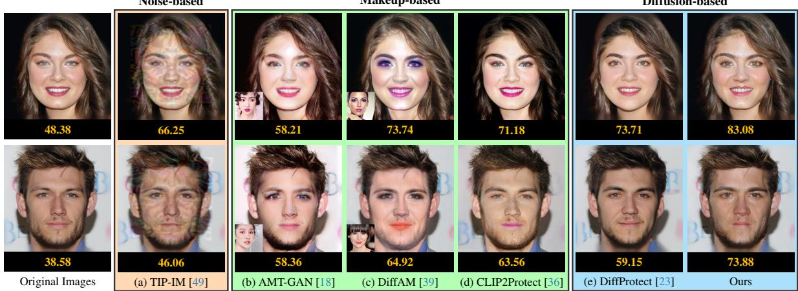
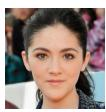
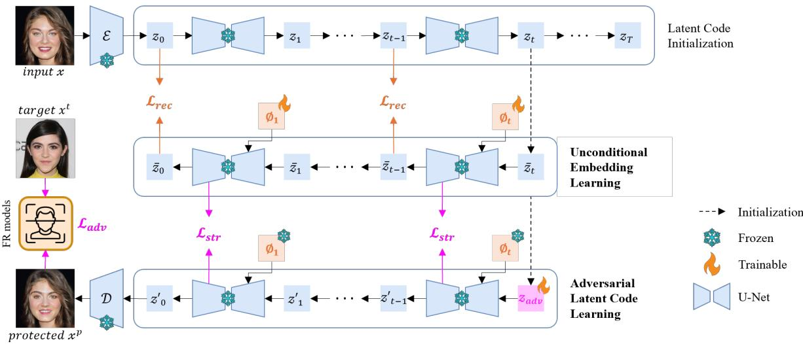
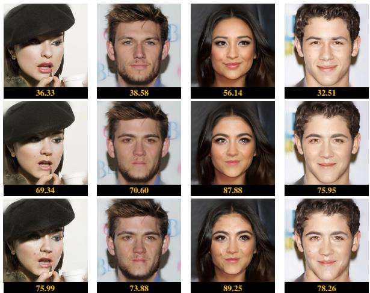
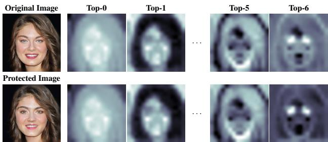
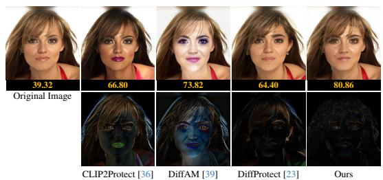
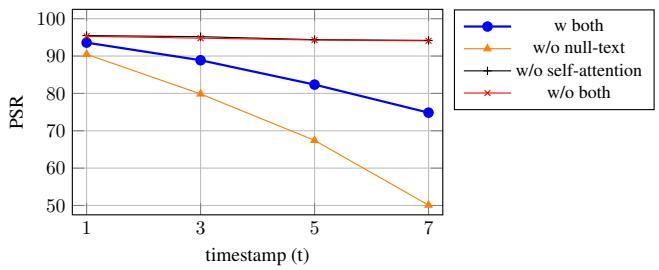
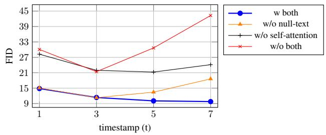
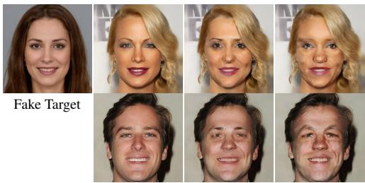

Diffusion-based

# Enhancing Facial Privacy Protection via Weakening Diffusion Purification

Ali Salar1 Qing Liu1 Yingli Tian2 Guoying Zhao1∗

1Center for Machine Vision and Signal Analysis (CMVS), University of Oulu, Finland {ali.salar, qing.liu, guoying.zhao}@oulu.fi 2City University of New York (CUNY) ytian@ccny.cuny.edu

Figure 1. Protected images generated by various facial privacy protection methods. Below each image, the numbers indicate the verification confidence from the Face++ API; higher values suggest a stronger match with the target image shown on the right side. For (b) and (c), the reference images used for makeup transfer are displayed near the corresponding protected images. In (d), the makeup prompt is “big eyebrows with pink eyeshadows.”  

## Abstract

The rapid growth of social media has led to the widespread sharing of individual portrait images, which pose serious privacy risks due to the capabilities of automatic face recognition (AFR) systems for mass surveillance. Hence, protectingfacial privacy against unauthorized AFR systems is essential. Inspired by the generation capability of the emerging diffusion models, recent methods employ diffusion models to generate adversarial face images for privacy protection. However, they suffer from the diffusion purification effect, leading to a low protection success rate (PSR). In this paper, wefirst propose learning unconditional embeddings to increase the learning capacity for adversarial modifications and then use them to guide the modification of the adversarial latent code to weaken the diffusion purification effect. Moreover, we integrate an identity-preserving structure to maintain structural consistency between the original and generated images, allowing

human observers to recognize the generated image as having the same identity as the original. Extensive experiments conducted on two public datasets, i.e., CelebA-HQ and LADN, demonstrate the superiority of our approach. The protected faces generated by our method outperform those produced by existing facial privacy protection approaches in terms of transferability and natural appearance. The code is available at https://github.com/parham1998/Facial-Privacy-Protection

## 1. Introduction

The advancement of facial recognition (FR) technology, particularly those based on deep neural networks [6, 44], has led to widespread applications in various fields, such as biometrics [26], surveillance [15], etc. Despite the benefits, FR technology could be misused by unauthorized organizations to e.g. track users’ interactions and activities, which poses serious risks to personal privacy and security. So, it is urgent to develop effective facial privacy protection methods against the invasive use by unauthorized systems.

One of the most widely used ways to protect facial privacy is targeted de-identification (impersonation), which conceals the original identity by generating a protected image to impersonate a real or synthesized target identity. An ideal protected image must (1) perceive high visual quality, ensuring that humans can still recognize the same identity as in the original image, and (2) provide effective privacy protection by successfully concealing the original identity from unauthorized FR systems [36].

To this end, TIP-IM [49] learns noise-constrained adversarial perturbations to conceal the original identity. However, the learned noise mask is perceptible, adversely affecting the generated image quality, as shown in Fig. 1(a). Instead, makeup-based methods utilize adversarial makeup to produce semantically meaningful distortions for privacy protection. For example, AMT-GAN [18] and DiffAM [39] transfers the fine-grained makeup style from a reference image to the original one while impersonating a target identity. However, they need an extra reference image to extract the makeup information and have to retrain the whole model for each new target identity, which makes them less practical and time-consuming (see Fig. 1(b) and (c)). Differently, Clip2Protect [36] uses pre-defined textual makeup prompts to add makeup to the original image. Still, it struggles to achieve precise control over fine-grained aspects like makeup placement and color, often resulting in discrepancies between the generated makeup and the intended prompt (see Fig. 1(d)). For makeup-based methods, improving the protection performances often requires applying more makeup across the face or intensifying it in a specific area, adversely affecting the overall image quality.

Driven by the powerful image generation of Diffusion Autoencoder (Diff-AE) [32], Liu et al, as the pioneers, propose DiffProtect [23] which employs the frozen Diff-AE model to generate protected face images. In detail, DiffProtect encodes the input image as a semantic code via a semantic encoder and a stochastic code through a conditional DDIM encoding process, then adversarially optimizes an adversarial semantic code to create semantically meaningful perturbations. However, modifying the semantic code makes the protected face’s shape and structure resemble the target face, resulting in perceivable distortions, as shown in Fig. 1(e). More seriously, DiffProtect suffers from the diffusion purification effect leading to an unsatisfying protection performance. Diffusion purification naturally occurs in the reverse diffusion process [2], where adversarial modifications are interpreted as high-frequency noise and are gradually removed throughout the denoising steps [29].

To address the mentioned issues, we propose learning unconditional embeddings during the reverse diffusion process and then directly optimizing an adversarial latent code within a latent diffusion model (LDM) [34]. This approach eliminates the need to modify the semantic latent code to generate a protected face image that preserves the overall structures. On the one hand, these learnable unconditional embeddings provide extra learning capacity to the model, allowing it to retain fine textures and structural details. On the other hand, they can effectively preserve identity-related alterations by weakening the model from overly purifying the adversarial modifications. This allows adversarial features to persist in the generated image, thereby simultaneously improving the generated image’s visual quality and protection capability. Although learning unconditional embeddings aids in generating images with good visual quality, unrestricted modification of the latent code reduces the structural consistency between the original and generated images. Consistency in the self-attention maps before and after latent code learning is proposed to make the generated face image have the same structure as the original face. The overall pipeline for our method is illustrated in Fig. 2. In summary, key contributions are summarized below:

• We propose a novel framework for facial privacy protection that adversarially modifies the latent code in LDM and introduces learned unconditional embeddings as nulltext guidance to guide the generation of protected images. Benefiting from the null-text guidance, our method can weaken the diffusion purification and retain more fine textures and structure details to enhance both the generated image’s protection capability and visual quality.

• We propose to leverage self-attention maps to preserve the structural integrity between the original and generated images, thereby maintaining the visual quality of the protected images.

• Extensive experiments on the CelebA-HQ [19] and LADN [11] datasets demonstrate the efficacy of our method in protecting facial privacy by impersonating real and synthesized face images, with notable improvements in protection success rates (PSR) and Frechet inception´ distance (FID) [14].

## 2. Related Work

Facial privacy protection methods can be categorized as white-box [48], where the parameters and architectures of the target model are accessible, or black-box, where only limited information about the target model is available. As our work belongs to transfer-based black-box methods [8], where protected face images are generated using surrogate FR models in a white-box setting to deceive an unauthorized FR model, we review the black-box methods. They can be categorized into noise-based, patch-based, makeupbased, and diffusion-based methods. In what follows, we elaborately review each category.

Noise-based Method. Noise-based methods generate unexplainable adversarial noises on facial images to conceal their identities. Several approaches have been proposed, such as projected gradient descent (PGD) [25], momentum iterative fast gradient sign method (MI-FGSM) [8], translation-invariant diverse inputs method (TI-DIM) [9], and targeted identity-protection iterative method (TIP-IM) [49]. Although these methods effectively protect privacy, they often produce output images with noticeable noises, affecting the overall user experience.

Patch-based Method. Patch-based de-identification has been developed to create wearable accessories, such as colorful glasses in Adv-Glasses [37] and hats in Adv-Hat [20], to protect facial privacy. Xiao et al. [47] extend previous transfer-based approaches, create adversarial patches, and regularize them on a low-dimensional data manifold represented by generative models to improve their transferability. However, these adversarial patches often suffer from poor protection performance due to their confined editing region, reducing the image’s natural appearance.

Makeup-based Method. More recent methods protect facial privacy by applying makeup. For instance, Adv-Makeup [50] and AMT-GAN [18] focus on makeup transfer. A subset of style transfer, makeup transfer is an imageto-image translation task [31] that blends the content of a source image with the makeup style of a reference image. Another example, CLIP2Protect [36], utilizes a CLIPguided [33] model to apply makeup by modifying latent codes in StyleGAN [41]. All these methods add makeup using GANs, which tend to introduce unexpected makeup artifacts and struggle to maintain non-makeup elements, such as the background. This often results in face images that appear visually unnatural to human observers. To improve the quality of the protected face image, DiffAM [39] employs two diffusion models, one for makeup removal guided by text and one for adversarial makeup transfer guided by a reference makeup image, respectively. Nevertheless, one key drawback remains. The model must be retrained whenever the target identity changes in the targeted de-identification.

Diffusion-based Method. As cutting-edge probabilistic generative models, diffusion models [7, 16, 28, 38] excel in producing highly realistic and high-resolution images. Research has recently shown that their strong generation capabilities can be leveraged to generate adversarial examples. For instance, DiffProtect [23] demonstrated that modifying the semantic latent codes in Diff-AE [32] enables the generation of protected images. However, modifying these codes can significantly alter the face’s structure, compromising structural consistency between the original and generated images. DiffProtect constrains the modification strength of the semantic code to mitigate the structure distortion but sacrifices the protection capability. Moreover, pre-trained diffusion models have proven to be robust purification tools [10, 29], effectively removing adversarial noise from input images. DiffProtect ignores the adverse influences of the purification effect in the reverse diffusion process, further limiting its protection capability. Instead of modifying a semantic latent code in Diff-AE, our method directly and unrestrictedly modifies the latent codes in LDM [34] and uses the learned unconditional embeddings as null-text guidance to guide the generation of protected images and weaken the diffusion purification effect. Besides, we preserve the structural consistency by aligning similarity between self-attention maps rather than constraining the modification strength on the adversarial code.

Diffusion Purification. Diffusion-based models provide a promising approach to adversarial purification [21, 29, 51] by considering imperceptible adversarial perturbations as noise. The purification process involves a forward diffusion stage that progressively adds noise to an adversarial example over t steps, and a reverse denoising stage that removes this noise to recover the clean data. Theoretically, as more noise is added, the distributions of the noisy adversarial and true examples become increasingly similar [29], making the denoised outputs likely to converge toward the clean data. It has been shown that the purified data share a similar distribution with the clean data [51], effectively erasing the adversarial attack.

## 3. Method

## 3.1. Problem Definition & Framework Overview

Following previous work [23, 36, 39], we outline the problem of targeted de-identification in this section. Suppose the original face image x is given, the goal is to generate a protected face image $x ^ { p }$ that impersonates the target face image $x ^ { t }$ while maintaining the natural appearance and overall facial identity of the original image x as human observers perceive. Formally, facial privacy protection can be defined as the following optimization problem:

$$
\operatorname* { m i n } _ { x ^ { p } } \mathcal { L } _ { a d v } = \mathcal { D } \left( \mathcal { F } \left( x ^ { p } \right) , \mathcal { F } \left( x ^ { t } \right) \right) \mathrm { ~ s . t . ~ } \mathcal { P } \left( x ^ { p } , x \right) \leq \tau \mathrm { ~ , ~ } \left( 1 \right)
$$

where $\mathcal { F }$ denotes the feature extractor used in the FR model, $\mathcal { D }$ is a distance function (cosine distance in our work), $\mathcal { P }$ is a measure of the perceptual difference between the original and the protected images, and τ is a threshold.

As illustrated in Fig. 2, our proposed method leverages the pre-trained diffusion model and a two-stage learning strategy to generate the protected face image that effectively conceals the identity of the original image so that it could not be identified by unauthorized FR systems, and maintains high visual quality for human observers. With the input image x, we first feed it to the diffusion model to obtain its noise vector $z _ { t }$ . Then we learn per-timestamp unconditional embeddings $\{ \mathcal { O } _ { i } \} _ { i = 1 } ^ { t }$ with two main objectives: (1) to achieve high-quality protected images, and (2) to weaken the purification effect in the reverse diffusion process. In the second stage, we freeze the unconditional embedding learned in the first stage and modify the adversarial latent code $z _ { a d v }$ to generate the protected face image by minimizing two loss items: the adversarial loss which ensures identity concealment and the structure preservation loss which ensures that the generated image retains key structural features. The details of each part are described as follows.

  
Figure 2. The overview of the proposed framework for facial privacy protection. Our novel approach leverages Stable Diffusion [34] to adversarially modify the latent code $z _ { a d v } ,$ , enabling subtle and controlled alterations to identity-specific features, ensuring effective facial privacy protection while maintaining high visual quality. Unconditional embeddings are proposed as null-text guidance to weaken diffusion purification and enhance protection performance. Self-attention guidance is employed to preserve the structural integrity of th image, ensuring the generated faces remain visually consistent with the original while maintaining high protection efficacy.

## 3.2. Latent Code Initialization

Unlike DDPM [16] and DDIM [38], which operate directly in pixel space, the conditional latent diffusion model (LDM) [34] operates within a compressed latent space, learned through an autoencoder to reduce computational complexity. The autoencoder encodes the input image x into a latent representation $z = \mathcal { E } ( x )$ and decodes it back into $\hat { x } = \mathcal { D } ( z )$

Since we aim to edit a given real image x, it is necessary to identify a noise map $z _ { t }$ that reconstructs the input latent code $z _ { \mathrm { 0 } }$ satisfying $z _ { 0 } = x$ during the sampling process. Owing to the deterministic nature of DDIM and the fact that it models the reverse diffusion as an ordinary differential equation, it is possible to map a real image $z _ { \mathrm { 0 } }$ back to its corresponding latent representation $( z _ { 1 } , . . . , z _ { t } )$ by reversing the sampling process, a technique known as DDIM Inversion [27]:

$$
\begin{array} { r l } & { \quad z _ { t + 1 } = \sqrt { \bar { \alpha } _ { t + 1 } / \bar { \alpha } _ { t } } z _ { t } + } \\ & { \sqrt { \bar { \alpha } _ { t + 1 } } \left( \sqrt { 1 / \bar { \alpha } _ { t + 1 } - 1 } - \sqrt { 1 / \bar { \alpha } _ { t } - 1 } \right) \epsilon _ { \theta } \left( z _ { t } , t , \emptyset \right) \ , } \end{array}\tag{2}
$$

where $\hat { \alpha } _ { t }$ is the noise scaling factor and $\epsilon _ { \theta } \left( z _ { t } , t , \theta \right)$ is the U-Net model that predicts the noise added at timestamp $t ,$ given the unconditional embedding ∅. Since LDM [34] relies on conditions, while our approach does not depend on textual prompts as conditional input, we use a single unconditional embedding $\mathcal { O } ,$ initialized with a null-text embedding, during the inversion process. DDIM sampling process is also shown below:

$$
\begin{array} { r l } & { z _ { t - 1 } = \sqrt { \bar { \alpha } _ { t - 1 } / \bar { \alpha } _ { t } } z _ { t } + } \\ & { \sqrt { \bar { \alpha } _ { t - 1 } } \left( \sqrt { 1 / \bar { \alpha } _ { t - 1 } - 1 } - \sqrt { 1 / \bar { \alpha } _ { t } - 1 } \right) \epsilon _ { \theta } \left( z _ { t } , t , \mathcal { O } _ { t } \right) . } \end{array}\tag{3}
$$

## 3.3. Unconditional Embedding Learning

We observed that inversion using DDIM can lead to degradation of the regenerated image quality. This process often results in a reconstructed image with increased smoothness, creating a more even texture, particularly noticeable on the skin and hair strands. An intuitive way to invert real images into the model’s domain is to fine-tune the model weights for each input image [41]. Still, this method is highly inefficient and computationally expensive. Another approach used in various editing tasks is optimizing the textual prompts [1, 13]. However, our proposed method is textfree and we observed that fine-grained details tend to diminish without textual guidance during the reverse process.

To address this, we propose to learn unconditional embeddings, inspired by the method introduced by Mokady et al [27]. As illustrated in Fig. 2, we apply the DDIM sampling step (Eq. 3) using $\bar { z } _ { t } ~ = ~ z _ { t }$ with $\scriptstyle { \mathcal { O } } _ { t }$ as the model’s condition to obtain $\bar { z } _ { t - 1 }$ . To enforce that the reconstructed image is as similar to the original one while preserving the capacity for meaningful edits, we enforce $\bar { z } _ { t - 1 }$ approximate

  
Figure 3. The improvements gained by incorporating learned unconditional embeddings during adversarial image generation. The first row presents original images. The second row shows protected images generated without unconditional embeddings as the null-text guidance. The third row displays protected images generated with our learned unconditional embeddings as the null-text guidance. The protection capability of the protected images is enhanced with the null-text guidance.

to $z _ { t - 1 }$ via:

$$
\operatorname* { m i n } _ { \mathcal { D } _ { t } } \mathcal { L } _ { r e c } = \| z _ { t - 1 } - \bar { z } _ { t - 1 } \| _ { 2 } ^ { 2 } .\tag{4}
$$

We initiate the optimization process at a specific timestamp t, where adversarial optimization begins, and optimize a distinct unconditional embedding for each timestamp. This allows us to maximize the similarity to the original image while preserving the capacity for meaningful edits.

## 3.4. Adversarial Latent Code Learning

In a black-box setting, where the malicious FR model is unknown, the optimization problem cannot be solved directly. Therefore, like previous methods, we perform adversarial optimization on K white-box surrogate models to closely approximate the unknown FR model’s decision boundaries. Starting with $z _ { a d v } = z _ { t }$ , multiple DDIM reverse steps are applied to obtain $z _ { 0 } ^ { \prime } ,$ , which is then decoded as $x ^ { p } = \mathcal { D } \left( z _ { 0 } ^ { \prime } \right)$ as illustrated in Fig. 2. The loss function is defined as follows:

$$
\operatorname* { m i n } _ { z _ { a d v } } \mathcal { L } _ { \mathrm { a d v } } = \frac { 1 } { K } \sum _ { k = 1 } ^ { K } \left[ 1 - \cos \left( \mathcal { F } _ { k } \left( x ^ { p } \right) , \mathcal { F } _ { k } \left( x ^ { t } \right) \right) \right]\tag{5}
$$

As stated earlier, $\mathcal { F } _ { k }$ refers to the feature extractor used in the k-th FR model.

While adversarial modifications in the latent code $z _ { a d v }$ are intended to generate a transferable protected face image, experimental results reveal that the diffusion model’s reverse process naturally removes these small, high-frequency identity-related modifications [46] due to its strong purification ability [29]. In other words, these perturbations result in a modified $z _ { a d v }$ that no longer precisely corresponds to the clean image. However, during the reverse process, the denoising model—trained exclusively on clean images—projects the perturbed noise back toward the natural data manifold, thereby mitigating the impact of the adversarial modification. Incorporating learned unconditional embeddings as null-text guidance in the diffusion reverse process, we find that the diffusion purification effect is weakened and identity-specific modifications are effectively preserved. Correspondingly, the privacy protection capability of the protected images is enhanced. The PSR and the visual aspects in Fig. 3 further show the effectiveness of null-text guidance, which encourages the model to maintain certain input details—including the adversarial noise—rather than fully denoising the image.

## 3.5. Structure Preservation via Self-attention

While learned unconditional embeddings can partially retain the quality of the generated image, unrestricted optimization of the latent code $z _ { a d v }$ (Eq. 5) may alter the structure of the generated image, causing it to resemble the target image more closely than the original. A potential solution to this issue is to constrain the latent code to meet the $L _ { \infty }$ norm bound $\| z _ { a d v } - z _ { t } \| _ { \infty } \leq \varepsilon \left[ 8 \right]$ . However, this contradicts our unrestricted approach and leads to weaker protection. Research by [30] has revealed that differences in attention maps between edited and real images lead to structural changes in the edited image. [22] further shows that refining the cross-attention maps of an adversarial image using the source image during the generation process can lead to unsuccessful image editing. Moreover, modifying cross-attention maps typically relies on a conditional prompt, as discussed in Section 3.3, our approach does not require any text input. In contrast, self-attention maps [42] are essential for preserving the geometric and shape details of the source image (see Fig. 4). Therefore, we propose using self-attention guidance to retain the image structure during latent code learning.

We adopt a two-step process [3], as shown in Fig. 2. First, we apply the DDIM sampling steps using the latent code $\bar { z } _ { t }$ before applying any perturbations and calculate self-attention maps $S ( \bar { z } _ { t } )$ for each timestamp t. These maps capture the original image’s structure, which we aim to preserve. Then, we calculate self-attention maps $S ( z _ { a d v } )$ after adding the perturbation again for each timestamp. We align $S ( z _ { a d v } )$ and $S ( \bar { z } _ { t } )$ by minimizing their difference:

$$
\operatorname* { m i n } _ { z _ { a d v } } \mathcal { L } _ { \mathrm { s t r } } = \left\| S \left( z _ { a d v } \right) - S \left( \bar { z } _ { t } \right) \right\| _ { 2 } ^ { 2 } .\tag{6}
$$

Overall, the final loss function for our proposed method is

  
Figure 4. The self-attention map [42] visualization shows the top seven components extracted through singular value decomposition [43]. The above shows the self-attention maps corresponding to the original image, while the maps for the protected image are shown below. Despite the protection, the structural details of the original image are well preserved in the protected images.

defined as follows:

$$
\operatorname* { m i n } _ { z _ { a d v } } \mathcal { L } = \lambda _ { \mathrm { a d v } } \mathcal { L } _ { \mathrm { a d v } } + \mathcal { L } _ { \mathrm { s t r } } ,\tag{7}
$$

where $\lambda _ { a d v }$ represents the hyper-parameter.

## 4. Experiments

## 4.1. Experimental Setting

Datasets. Following AMT-GAN [18], we employ the CelebA-HQ [19] and LADN [11] datasets in our experiments. CelebA-HQ, a high-resolution variant of the CelebA dataset, contains 30,000 images. Following [18], a subset of 1000 images is selected, representing distinct identities. The LAND dataset includes 333 non-makeup and 302 makeup images, and based on [18], we select 332 nonmakeup images for testing. In both datasets, the selected images are divided into four groups, each corresponding to a specific target identity. All images within a group aim to impersonate the same target identity, following the four target identities provided by [18].

Target models. We carry out extensive experiments with four widely-used black-box FR models—IRSE50 [17], IR152 [12], Facenet [35], and Mobileface [4]—to evaluate the protection performance. We select three models during fine-tuning, while the remaining one is reserved for blackbox testing. Following the experimental protocol outlined in [36], we preprocess the face images by aligning and cropping them using MTCNN [52] before inputting them into the FR models for evaluation.

Benchmarks. We compare our method with four noisebased, four makeup-based, and one diffusion-based facial privacy protection techniques. Noise-based methods include PGD [25], MI-FGSM [8], TI-DIM [9], and TIP-IM [49]. Makeup-based methods are Adv-Makeup [50], AMT-GAN [18], CLIP2Protect [36], and DiffAM [39], and the diffusion-based method is DiffProtect [23]. DiffAM and

DiffProtect are state-of-the-art (SOTA) in makeup-based and diffusion-based de-identification.

Evaluation metrics. In line with CLIP2Protect [36], we use the PSR to assess our proposed method’s effectiveness compared to benchmark approaches. PSR is calculated by setting the false acceptance rate (FAR) to 0.01 [18, 36, 39]. Additionally, we report the FID [14], peak signal-to-noise ratio (PSNR in dB), and structural similarity index (SSIM) [45] to evaluate the visual quality of the protected images.

Implemention Details. Our implementation is built on [27]. We apply 20 DDIM Inversion steps $( T = 2 0 )$ to the initial clean image, with the reverse process beginning at the 3rd timestamp (t = 3). We utilize the AdamW [24] optimizer with a learning rate of 0.1 and 20 iterations for unconditional embedding learning. Similarly, we use AdamW with a learning rate of 0.01 and 35 iterations for adversarial latent learning, setting $\lambda _ { a d v }$ to 0.003.

## 4.2. Comparison Study

In this section, we assess the experimental results of our proposed approach and benchmarks in terms of protection performance under black-box settings on four pre-trained FR models, and the generated image quality.

Assessment on personal facial privacy protection. The results of black-box settings against four FR models on the CelebA-HQ and LADN datasets are presented in Tab. 1. The other three models are surrogate models to deceive the target model. We evaluate performance across four target identities and report the average results. It is important to note that the test images of the target faces are different images of the same individuals used during training. Our approach shows about 30% and 1.5% improvement in average PSR compared to the SOTA noise-based (TIP-IM) and makeup-based (DiffAM), respectively. Unlike DiffAM, which involves two distinct stages (i.e., makeup removal and makeup transfer), our method employs a more streamlined approach, resulting in better transferability.

Assessment on image quality. We perform quantitative and qualitative comparisons for the quality of the generated images. Tab. 2 shows the quantitative evaluation. Among the methods, Adv-Makeup achieves the highest performance across all quality evaluation metrics, focusing solely on applying makeup to the eye region. However, this limited scope leads to a significantly lower PSR. While our method shows lower SSIM performance than DiffAM and DiffProtect, it excels in FID, indicating that the protected images generated are more natural. Additionally, our approach outperforms others in PSNR, suggesting that the controlled modifications made in the latent space have less impact on the images at the pixel level.

The qualitative evaluations of visual quality can be seen in Fig. 5. The comparison of the generated images reveals notable differences between makeup-based methods (CLIP2Protect and DiffAM), diffusion-based methods (DiffProtect), and the proposed framework. Makeup-based methods apply perturbations across the entire facial region, resulting in more visible alterations in the facial appearance. DiffProtect, while effective, introduces more evenly distributed artifacts that reduce the sharpness and texture of facial features. In contrast, ours achieves superior visual quality by generating more natural-looking faces with minimal, localized perturbations, focusing only on the regions necessary to deceive FR models. This selective approach preserves the overall realism of the faces and avoids introducing noticeable noise patterns, striking an effective balance between adversarial strength and imperceptibility. Consequently, ours outperforms the other methods in maintaining high image fidelity while ensuring protection against FR models.

<table><tr><td rowspan="2"></td><td rowspan="2">Method</td><td colspan="4">CelebA-HQ</td><td colspan="4">LADN-dataset</td><td rowspan="2">Average</td></tr><tr><td>IRSE50</td><td>IR152</td><td>Facenet</td><td>Mobileface</td><td>IRSE50</td><td>IR152</td><td>Facenet</td><td>Mobileface</td></tr><tr><td rowspan="4">Noise-based</td><td>clean</td><td>7.29</td><td>3.80</td><td>1.08</td><td>12.68</td><td>2.71</td><td>3.61</td><td>0.60</td><td>5.11</td><td>4.61</td></tr><tr><td>PGD (2017)</td><td>36.87</td><td>20.68</td><td>1.85</td><td>43.99</td><td>40.09</td><td>19.59</td><td>3.82</td><td>41.09</td><td>25.60</td></tr><tr><td>MI-FGSM (2018)</td><td>45.79</td><td>25.03</td><td>2.58</td><td>45.85</td><td>48.90</td><td>25.57</td><td>6.31</td><td>45.01</td><td>30.63</td></tr><tr><td>TI-DIM (2019)</td><td>63.63</td><td>36.17</td><td>15.30</td><td>57.12</td><td>56.36</td><td>34.18</td><td>22.11</td><td>48.30</td><td>41.64</td></tr><tr><td rowspan="4">Makeup-based</td><td>TIP-IM (2021)</td><td>54.40</td><td>37.23</td><td>40.74</td><td>48.72</td><td>65.89</td><td>43.57</td><td>63.50</td><td>46.48</td><td>50.06</td></tr><tr><td>Adv-Makeup (2021)</td><td>21.95</td><td>9.48</td><td>1.37</td><td>22.00</td><td>29.64</td><td>10.03</td><td>0.97</td><td>22.38</td><td>14.72</td></tr><tr><td>AMT-GAN (2022)</td><td>76.96</td><td>35.13</td><td>16.62</td><td>50.71</td><td>89.64</td><td>49.12</td><td>32.13</td><td>72.43</td><td>52.84</td></tr><tr><td>CLIP2Protect (2023)</td><td>81.10</td><td>48.42</td><td>41.72</td><td>75.26</td><td>91.57</td><td>53.31</td><td>47.91</td><td>79.94</td><td>64.90</td></tr><tr><td rowspan="2">Diffusion-based</td><td>DiffAM (2024)</td><td>92.00</td><td>63.13</td><td>64.67</td><td>83.35</td><td>95.66</td><td>66.75</td><td>65.44</td><td>92.04</td><td>77.88</td></tr><tr><td>DiffProtect (2023) Ours</td><td>67.75 88.87</td><td>60.14 67.25</td><td>35.19 59.53</td><td>64.33 91.57</td><td>54.51 95.78</td><td>44.27 70.18</td><td>31.33 62.05</td><td>50.90 98.17</td><td>51.05 79.17</td></tr></table>

Table 1. Protection success rate (PSR) under the black-box setting. The best and second-best results are marked in bold and underlined.

<table><tr><td>Method</td><td>PSR(↑)</td><td>FID(↓)</td><td>PSNR(↑)</td><td>SSIM(↑)</td></tr><tr><td>TIP-IM</td><td>50.06</td><td>38.7357</td><td>33.2089</td><td>0.9214</td></tr><tr><td>Adv-makeup</td><td>14.72</td><td>4.2282</td><td>34.5152</td><td>0.9850</td></tr><tr><td>AMT-GAN</td><td>52.84</td><td>34.4405</td><td>19.5045</td><td>0.7873</td></tr><tr><td>CLIP2Protect</td><td>64.90</td><td>37.1172</td><td>19.3537</td><td>0.6025</td></tr><tr><td>DiffAM</td><td>77.88</td><td>26.1015</td><td>20.5260</td><td>0.8861</td></tr><tr><td>DiffProtect Ours</td><td>51.05 79.17</td><td>28.2912 15.3212</td><td>24.2070 27.7223</td><td>0.8785 0.8393</td></tr></table>

Table 2. Quantitative assessments of image quality. These are the average results for both CelebA-HQ and LADN datasets.

## 4.3. Ablation Studies

Null-text guidance. A comparison of the blue and yellow lines in Fig. 6(a) and (b) clearly shows how well-learned unconditional embeddings work to make the reverse diffusion process less susceptible to purification and keep the images’ visual quality. As we progress to deeper timestamps (e.g., t = 5 and t = 7), the diffusion model’s denoising process prioritizes reconstructing broad structural features over fine-grained details that could aid in impersonation. Moreover, the sampling process’s purification effect prevents adversarial modifications from fully remaining, lowering the PSR. With the reverse process beginning at each timestamp, we can see that PSR is much better (particularly at deeper timestamps) when we use these learned embeddings. Looking at the blue and yellow lines in Fig. 6(b), we can see that these learned embeddings can effectively preserve the quality of generated images by preserving fine-grained details. The trend in the blue line demonstrates that the FID score remains low and relatively stable across timestamps. However, this trend differs in the yellow line in deeper timestamps. It proves the model struggles to maintain fine-grained details without learned embeddings when the starting noise is high.

  
Figure 5. Comparison of visual quality between recent facial privacy protection methods. The absolute difference between the generated and original images is shown below each protected face.

Self-attention guidance. Fig. 6(a) shows that the lack of self-attention (represented by the black and red lines) leads to higher PSR. However, as seen in Fig. 6(b), this absence of self-attention also results in a noticeable drop in image quality, indicated by an increase in FID. It can be concluded that without self-attention, the adversarial modifications are less guided, possibly making the image closer to the target identity. At the same time, this lack causes the generated images to deviate more from the original distribution, degrading their visual quality.

  
Figure 6. Ablation study to evaluate the contributions of different loss items. The left figure illustrates the protection success rate (PSR) under different conditions, with and without null-text and self-attention guidances, while the right one evaluates the visual quality by Frechet inception distance (FID). The timestamp´ t marks the point at which adversarial learning begins.

## 5. Discussion

Generating a protected face by impersonating a real identity raises additional ethical concerns. Although the intent might be to conceal the original identity, using another real identity as the target can misrepresent the individual whose identity is being impersonated. A common approach to address this issue is obfuscation [5, 40], which ensures that the protected face does not resemble any other images of the same individual. This can be achieved by generating a protected face where ${ \mathcal { D } } ( { \mathcal { F } } ( x ^ { p } ) , { \mathcal { F } } ( x ) )$ is significant. Since the focus is on increasing the distance between the generated and the source face images, the perturbations might not be natural, resulting in distorted images.

One way to overcome this limitation is to simultaneously impersonate a target identity via minimizing $\mathcal { D } ( \mathcal { F } ( x ^ { p } ) , \mathcal { F } ( x ^ { t } ) )$ and obfuscate via maximizing ${ \mathcal { D } } ( { \mathcal { F } } ( x ^ { p } ) , { \mathcal { F } } ( x ) )$ . As a result, the perturbations are more controlled since impersonation can act as a form of regularization, leading to better visual quality while achieving the obfuscation criteria. Unlike CLIP2Protect [36], which impersonates a real target identity in the obfuscation task, we propose impersonating a synthesized target identity to ensure that the protected face does not resemble any real individual. Hence, the protected face maintains anonymity without the risk of misusing a real person’s similarity.

We follow CLIP2Protect [36] and conduct experiments on the CelebA-HQ dataset. 500 subjects are randomly selected, each with a pair of images. One image from each pair is assigned to the training set, while the other is designated for the test set. The selected images impersonate a synthesized target identity chosen from the “100k Faces Generated by AI” database1. Quantitative and qualitative results are presented in Tab. 3 and Fig. 7, respectively.

## 6. Conclusion

In this study, we explored the use of diffusion models for facial privacy protection, leveraging their powerful imagegeneration capabilities. We proposed a novel framework that adversarially modifies the latent diffusion model’s latent code, rather than changing pixel space. We introduced learned unconditional embeddings as null-text guidance to weaken the diffusion model’s purification effect and significantly enhanced privacy protection. Additionally, we incorporated self-attention guidance to preserve structural integrity between the original and generated images, ensuring high visual quality. Comprehensive quantitative and qualitative evaluations demonstrate the efficacy of our approach in protecting facial privacy compared to various FR models while maintaining superior visual quality.

<table><tr><td>Method</td><td>IRSE50</td><td>IR152</td><td>Facenet</td><td>Mobileface</td></tr><tr><td>CLIP2Protect</td><td>83.4</td><td>83.6</td><td>93.5</td><td>62.8</td></tr><tr><td>Ours</td><td>90.2</td><td>88.6</td><td>87.0</td><td>85.0</td></tr></table>

Table 3. Protection success rate (PSR) under the black-box setting.

  
Original Image Impersonation Obfuscation  
Figure 7. Qualitative assessment of the protected image regarding impersonating a fake target versus merely obfuscation.

Acknowledgements. This work was supported by the Research Council of Finland (former Academy of Finland) Academy Professor project EmotionAI (grants 336116, 345122, 359854), HPC project FaceCanvas (grant number 364905), the University of Oulu & Research Council of Finland Profi 7 (grant 352788), EU HORIZON-MSCA-SE-2022 project ACMod (grant 101130271), Academy Research Fellow project (grant 355095), and Infotech Oulu. The authors also wish to acknowledge CSC – IT Center for Science, Finland, for computational resources.

## References

[1] Tim Brooks, Aleksander Holynski, and Alexei A Efros. Instructpix2pix: Learning to follow image editing instructions. In Proceedings of the IEEE/CVF Conference on Computer Vision and Pattern Recognition, pages 18392–18402, 2023. 4

[2] Nicholas Carlini, Florian Tramer, Krishnamurthy Dj Dvijotham, Leslie Rice, Mingjie Sun, and J Zico Kolter. (certified!!) adversarial robustness for free! In The Eleventh International Conference on Learning Representations, 2023. 2

[3] Jianqi Chen, Hao Chen, Keyan Chen, Yilan Zhang, Zhengxia Zou, and Zhenwei Shi. Diffusion models for imperceptible and transferable adversarial attack. IEEE Transactions on Pattern Analysis and Machine Intelligence, 2024. 5

[4] Sheng Chen, Yang Liu, Xiang Gao, and Zhen Han. Mobilefacenets: Efficient cnns for accurate real-time face verification on mobile devices. In Chinese conference on biometric recognition, pages 428–438. Springer, 2018. 6

[5] William L. Croft, Jorg-R¨ udiger Sack, and Wei Shi. Differ-¨ entially private facial obfuscation via generative adversarial networks. Future Generation Computer Systems, 129:358– 379, 2022. 8

[6] Jiankang Deng, Jia Guo, Niannan Xue, and Stefanos Zafeiriou. ArcFace: Additive angular margin loss for deep face recognition. In IEEE Conf. Comput. Vis. Pattern Recog., pages 4690–4699, 2019. 1

[7] Prafulla Dhariwal and Alexander Nichol. Diffusion models beat gans on image synthesis. Advances in neural information processing systems, 34:8780–8794, 2021. 3

[8] Yinpeng Dong, Fangzhou Liao, Tianyu Pang, Hang Su, Jun Zhu, Xiaolin Hu, and Jianguo Li. Boosting adversarial attacks with momentum. In Proceedings of the IEEE conference on computer vision and pattern recognition, pages 9185–9193, 2018. 2, 3, 5, 6

[9] Yinpeng Dong, Tianyu Pang, Hang Su, and Jun Zhu. Evading defenses to transferable adversarial examples by translation-invariant attacks. In Proceedings of the IEEE/CVF conference on computer vision and pattern recognition, pages 4312–4321, 2019. 3, 6

[10] Sven Gowal, Sylvestre-Alvise Rebuffi, Olivia Wiles, Florian Stimberg, Dan Andrei Calian, and Timothy A Mann. Improving robustness using generated data. Advances in Neural Information Processing Systems, 34:4218–4233, 2021. 3

[11] Qiao Gu, Guanzhi Wang, Mang Tik Chiu, Yu-Wing Tai, and Chi-Keung Tang. LADN: Local adversarial disentangling network for facial makeup and de-makeup. In Proceedings of the IEEE/CVF International conference on computer vision, pages 10481–10490, 2019. 2, 6

[12] Kaiming He, Xiangyu Zhang, Shaoqing Ren, and Jian Sun. Deep residual learning for image recognition. In Proceedings of the IEEE conference on computer vision and pattern recognition, pages 770–778, 2016. 6

[13] Amir Hertz, Ron Mokady, Jay Tenenbaum, Kfir Aberman, Yael Pritch, and Daniel Cohen-or. Prompt-to-prompt image editing with cross-attention control. In The Eleventh International Conference on Learning Representations, 2023. 4

[14] Martin Heusel, Hubert Ramsauer, Thomas Unterthiner, Bernhard Nessler, and Sepp Hochreiter. GANs trained by a two time-scale update rule converge to a local nash equilibrium. Advances in neural information processing systems, 30, 2017. 2, 6

[15] Kashmir Hill. The secretive company that might end privacy as we know it. In Ethics of Data and Analytics, pages 170– 177. Auerbach Publications, 2022. 1

[16] Jonathan Ho, Ajay Jain, and Pieter Abbeel. Denoising diffusion probabilistic models. Advances in neural information processing systems, 33:6840–6851, 2020. 3, 4

[17] Jie Hu, Li Shen, and Gang Sun. Squeeze-and-excitation networks. In Proceedings of the IEEE conference on computer vision and pattern recognition, pages 7132–7141, 2018. 6

[18] Shengshan Hu, Xiaogeng Liu, Yechao Zhang, Minghui Li, Leo Yu Zhang, Hai Jin, and Libing Wu. Protecting facial privacy: Generating adversarial identity masks via style-robust makeup transfer. In Proceedings of the IEEE/CVF conference on computer vision and pattern recognition, pages 15014–15023, 2022. 1, 2, 3, 6

[19] Tero Karras. Progressive growing of gans for improved quality, stability, and variation. arXiv preprint arXiv:1710.10196, 2017. 2, 6

[20] Stepan Komkov and Aleksandr Petiushko. Advhat: Realworld adversarial attack on arcface face id system. In 2020 25th international conference on pattern recognition (ICPR), pages 819–826. IEEE, 2021. 3

[21] Minjong Lee and Dongwoo Kim. Robust evaluation of diffusion-based adversarial purification. In Proceedings of the IEEE/CVF International Conference on Computer Vision, pages 134–144, 2023. 3

[22] Bingyan Liu, Chengyu Wang, Tingfeng Cao, Kui Jia, and Jun Huang. Towards understanding cross and self-attention in stable diffusion for text-guided image editing. In Proceedings of the IEEE/CVF Conference on Computer Vision and Pattern Recognition, pages 7817–7826, 2024. 5

[23] Jiang Liu, Chun Pong Lau, and Rama Chellappa. Diff-Protect: Generate adversarial examples with diffusion models for facial privacy protection. arXiv preprint arXiv:2305.13625, 2023. 1, 2, 3, 6, 7

[24] Ilya Loshchilov and Frank Hutter. Decoupled weight decay regularization. In International Conference on Learning Representations, 2019. 6

[25] Aleksander Madry. Towards deep learning models resistant to adversarial attacks. arXiv preprint arXiv:1706.06083, 2017. 3, 6

[26] Pietro Melzi, Christian Rathgeb, Ruben Tolosana, Ruben´ Vera-Rodriguez, and Christoph Busch. An overview of privacy-enhancing technologies in biometric recognition. ACM Computing Surveys, 56(12):1–28, 2024. 1

[27] Ron Mokady, Amir Hertz, Kfir Aberman, Yael Pritch, and Daniel Cohen-Or. Null-text inversion for editing real images using guided diffusion models. In Proceedings of the IEEE/CVF Conference on Computer Vision and Pattern Recognition, pages 6038–6047, 2023. 4, 6

[28] Alexander Quinn Nichol and Prafulla Dhariwal. Improved denoising diffusion probabilistic models. In International

conference on machine learning, pages 8162–8171. PMLR, 2021. 3

[29] Weili Nie, Brandon Guo, Yujia Huang, Chaowei Xiao, Arash Vahdat, and Anima Anandkumar. Diffusion models for adversarial purification. In International Conference on Machine Learning (ICML), 2022. 2, 3, 5

[30] Gaurav Parmar, Krishna Kumar Singh, Richard Zhang, Yijun Li, Jingwan Lu, and Jun-Yan Zhu. Zero-shot image-to-image translation. In ACM SIGGRAPH 2023 Conference Proceedings, pages 1–11, 2023. 5

[31] Isola Phillip, Zhu Jun-Yan, Zhou Tinghui, AEfros Alexei, et al. Image-to-image translation with conditional adversarial networks. In Proceedings ofthe IEEE conference on computer vision and pattern recognition, 2017. 3

[32] Konpat Preechakul, Nattanat Chatthee, Suttisak Wizadwongsa, and Supasorn Suwajanakorn. Diffusion autoencoders: Toward a meaningful and decodable representation. In Proceedings of the IEEE/CVF conference on computer vision and pattern recognition, pages 10619–10629, 2022. 2, 3

[33] Alec Radford, Jong Wook Kim, Chris Hallacy, Aditya Ramesh, Gabriel Goh, Sandhini Agarwal, Girish Sastry, Amanda Askell, Pamela Mishkin, Jack Clark, et al. Learning transferable visual models from natural language supervision. In International conference on machine learning, pages 8748–8763. PMLR, 2021. 3

[34] Robin Rombach, Andreas Blattmann, Dominik Lorenz, Patrick Esser, and Bjorn Ommer. High-resolution image¨ synthesis with latent diffusion models. In Proceedings of the IEEE/CVF conference on computer vision and pattern recognition, pages 10684–10695, 2022. 2, 3, 4

[35] Florian Schroff, Dmitry Kalenichenko, and James Philbin. Facenet: A unified embedding for face recognition and clustering. In Proceedings of the IEEE conference on computer vision and pattern recognition, pages 815–823, 2015. 6

[36] Fahad Shamshad, Muzammal Naseer, and Karthik Nandakumar. Clip2Protect: Protecting facial privacy using textguided makeup via adversarial latent search. In Proceedings of the IEEE/CVF Conference on Computer Vision and Pattern Recognition, pages 20595–20605, 2023. 1, 2, 3, 6, 7, 8

[37] Mahmood Sharif, Sruti Bhagavatula, Lujo Bauer, and Michael K Reiter. A general framework for adversarial examples with objectives. ACM Transactions on Privacy and Security (TOPS), 22(3):1–30, 2019. 3

[38] Jiaming Song, Chenlin Meng, and Stefano Ermon. Denoising diffusion implicit models. In International Conference on Learning Representations, 2021. 3, 4

[39] Yuhao Sun, Lingyun Yu, Hongtao Xie, Jiaming Li, and Yongdong Zhang. DiffAM: Diffusion-based adversarial makeup transfer for facial privacy protection. In Proceedings of the IEEE/CVF Conference on Computer Vision and Pattern Recognition, pages 24584–24594, 2024. 1, 2, 3, 6, 7

[40] Huan Tian, Tianqing Zhu, and Wanlei Zhou. Fairness and privacy preservation for facial images: Gan-based methods. Computers & Security, 122:102902, 2022. 8

[41] Omer Tov, Yuval Alaluf, Yotam Nitzan, Or Patashnik, and Daniel Cohen-Or. Designing an encoder for stylegan image manipulation. ACM Trans. Graph., 40(4), 2021. 3, 4

[42] A Vaswani. Attention is all you need. Advances in Neural Information Processing Systems, 2017. 5, 6

[43] Michael E Wall, Andreas Rechtsteiner, and Luis M Rocha. Singular value decomposition and principal component analysis. In A practical approach to microarray data analysis, pages 91–109. Springer, 2003. 6

[44] Mei Wang and Weihong Deng. Deep face recognition: A survey. Neurocomputing, 429:215–244, 2021. 1

[45] Zhou Wang, Alan C Bovik, Hamid R Sheikh, and Eero P Simoncelli. Image quality assessment: from error visibility to structural similarity. IEEE transactions on image processing, 13(4):600–612, 2004. 6

[46] Juanjuan Weng, Zhiming Luo, and Shaozi Li. Exploring frequencies via feature mixing and meta-learning for improving adversarial transferability. arXiv preprint arXiv:2405.03193, 2024. 5

[47] Zihao Xiao, Xianfeng Gao, Chilin Fu, Yinpeng Dong, Wei Gao, Xiaolu Zhang, Jun Zhou, and Jun Zhu. Improving transferability of adversarial patches on face recognition with generative models. In IEEE Conf. Comput. Vis. Pattern Recog., pages 11845–11854, 2021. 3

[48] Lu Yang, Qing Song, and Yingqi Wu. Attacks on state-ofthe-art face recognition using attentional adversarial attack generative network. Multimedia tools and applications, 80: 855–875, 2021. 2

[49] Xiao Yang, Yinpeng Dong, Tianyu Pang, Hang Su, Jun Zhu, Yuefeng Chen, and Hui Xue. Towards face encryption by generating adversarial identity masks. In Int. Conf. Comput. Vis., pages 3897–3907, 2021. 1, 2, 3, 6

[50] Bangjie Yin, Wenxuan Wang, Taiping Yao, Junfeng Guo, Zelun Kong, Shouhong Ding, Jilin Li, and Cong Liu. Adv-Makeup: A new imperceptible and transferable attack on face recognition. In International Joint Conference on Artificial Intelligence, 2021. 3, 6

[51] Boya Zhang, Weijian Luo, and Zhihua Zhang. Purify++: Improving diffusion-purification with advanced diffusion models and control of randomness. arXiv preprint arXiv:2310.18762, 2023. 3

[52] Kaipeng Zhang, Zhanpeng Zhang, Zhifeng Li, and Yu Qiao. Joint face detection and alignment using multitask cascaded convolutional networks. IEEE signal processing letters, 23 (10):1499–1503, 2016. 6