# Enhancing Few-Shot Class-Incremental Learning via Training-Free Bi-Level Modality Calibration

Yiyang Chen1, Tianyu Ding2, Lei Wang3, Jing Huo1, Yang Gao1, Wenbin Li1,4\* 1State Key Laboratory for Novel Software Technology, Nanjing University, China 2Applied Sciences Group, Microsoft, USA 3University of Wollongong, Australia 4Shenzhen Research Institute of Nanjing University, Shenzhen, China

## Abstract

Few-shot Class-Incremental Learning (FSCIL) challenges models to adapt to new classes with limited samples, presenting greater difficulties than traditional classincremental learning. While existing approaches rely heavily on visual models and require additional training during base or incremental phases, we propose a training-free framework that leverages pre-trained visual-language models like CLIP. At the core of our approach is a novel Bilevel Modality Calibration (BiMC) strategy. Our framework initially performs intra-modal calibration, combining LLM-generated fine-grained category descriptions with visual prototypes from the base session to achieve precise classifier estimation. This is further complemented by inter-modal calibration that fuses pre-trained linguistic knowledge with task-specific visual priors to mitigate modality-specific biases. To enhance prediction robustness, we introduce additional metrics and strategies that maximize the utilization of limited data. Extensive experimental results demonstrate that our approach significantly outperforms existing methods. Code is available at: https://github.com/yychen016/BiMC.

## 1. Introduction

The rapid advancement of artificial intelligence has propelled deep neural networks to achieve remarkable progress. However, these models often struggle with catastrophic forgetting when faced with dynamically changing environments, impeding their ability to learn sequential tasks effectively. Class-Incremental Learning (CIL) can be a potential solution to this challenge. Yet, in practical settings, researchers frequently encounter a scarcity of training data during the incremental phase, leading to sample sparsity issues. Consequently, Few-Shot Class-Incremental Learning (FSCIL) [31] has recently emerged as a more realistic scenario, better reflecting real-world constraints.

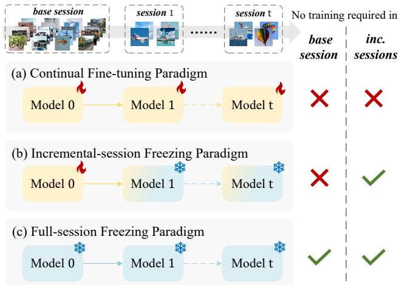  
Figure 1. Model updating paradigms in FSCIL. (a) Continuous model updates during incremental phases. (b) Leveraging the base task to learn a generalizable model. (c) Our proposed framework: training-free in both base and incremental sessions.

Current FSCIL methods can be broadly categorized into two paradigms: the continual fine-tuning paradigm and the incremental-session freezing paradigm, as shown in Figure 1 (a) and (b). The former [4, 21, 27, 43] utilizes limited samples to continuously update the model, enhancing its plasticity. Conversely, the latter [22, 35, 44, 48] focuses on learning robust representations during the base task, which are then generalized to incremental tasks, prioritizing stability by avoiding subsequent model updates. Despite their distinct approaches, both paradigms necessitate additional training to adapt to new tasks, presenting ongoing challenges in resource efficiency and model adaptability.

The emergence of large-scale models has shifted the landscape of representation learning. Vision-language models like CLIP [24], trained on a large number of imagetext pairs, excel in zero-shot tasks. However, fine-tuning is computationally expensive and may compromise generalization, especially with limited data [14, 39]. While recent approaches like prompt tuning [46, 47] and low-rank adaptation [9] offer more efficient alternatives, they still demand additional training. This raises a crucial question: How can we effectively leverage pre-trained knowledge and domainspecific visual priors to adapt the large-scale model using few samples without additional training?

While CLIP is widely used for cross-modal retrieval in visual categorization, it overlooks the potential of intramodal recognition, akin to traditional purely visual models, such as CNN [30, 41]. We believe that CLIP’s visual prototypes can effectively complement zero-shot textual classifiers, serving as domain-specific priors, particularly in addressing two major challenges in FSCIL tasks: catastrophic forgetting and overfitting. Building on this insight, we introduce Bi-level Modality Calibration (BiMC), a simple yet effective framework that treats CLIP as a blackbox model and operates without additional training, thereby avoiding the parameter updates that typically cause forgetting. Our framework incorporates both intra-modal and inter-modal calibration strategies to enhance CLIP’s classification accuracy. For intra-modal calibration, we leverage LLM-generated fine-grained category descriptions in the textual domain to improve zero-shot classifier discrimination, while using base session prototypes in the visual domain to refine new class prototypes affected by sample scarcity. Inter-modal calibration combines pre-trained linguistic knowledge with task-aware visual priors to reduce modal biases and overfitting. The framework is further enhanced with an anisotropic covariance metric and a cross-modal category-conditioned nearest-neighbor metric, implementing the final classifier through masked ensemble inference. Extensive experiments demonstrate that our method achieves competitive performance without additional training.

Our contributions are summarized as follows:

• We propose a novel training-free FSCIL framework that achieves continual model adaptation by treating visionlanguage models as black boxes, significantly enhancing practicality for real-world applications.

• We develop a bi-level modality calibration approach combining intra-modal and inter-modal strategies to enhance classifier accuracy across both modalities. This approach is strengthened by an innovative visual covariance metric and a category-conditioned nearest-neighbor metric, culminating in a robust masked ensemble inference strategy.

• We demonstrate the effectiveness of our framework through extensive experiments on standard benchmarks, where it not only achieves competitive performance but also outperforms supervised training methods in several scenarios, despite requiring no additional training.

## 2. Related work

Few-Shot Class-Incremental Learning. Few-Shot Class-Incremental Learning (FSCIL) challenges models to adapt continuously using minimal samples. Existing approaches can be categorized into three main groups: representationbased methods [1, 2, 12, 18, 22, 27, 30, 38, 44], which focus on optimizing feature representations; dynamicarchitecture-based methods [31, 41], which adapt mode structures to accommodate new classes; and knowledgedistillation-based methods [4, 7, 15], which transfer knowledge from previous tasks to new ones. Notable examples include CEC [41], which employs an evolving graph model for classifier optimization, and FACT [44] and SAVC [30], which introduce virtual categories as placeholders for forward compatibility. In contrast, our approach leverages a pre-trained vision-language model, eliminating the need for additional learning on the base session.

Class-Incremental Learning via Pre-Trained Models. Recent trends in incremental learning focus on effectively utilizing pre-trained models as backbones for downstream tasks. Early works primarily used prompt-based methods [11, 28, 34, 36, 37], introducing learnable prompt parameters for task adaptation. Other approaches have employed adapters [45] or LoRA [9] to facilitate adaptation [17, 40, 45]. While these methods use efficient parameter-tuning techniques, they still require further training. Our approach, however, leverages both vision and language modalities to enable ongoing model adaptation without gradient updates.

Language-Assisted Classification. Linguistic information has been increasingly utilized in various visual tasks. Some studies have used linguistic cues to guide visual classification [33, 42], while others have leveraged Large Language Models (LLMs) to generate rich descriptive text [20, 23, 26]. In continual learning, several works have exploited linguistic guidance [13, 19]. Within FSCIL, methods like [2, 4, 21] also utilize linguistic information. However, these approaches have limitations: some [2] use distillation techniques on smaller visual models with linguistic knowledge as a regularization term, potentially limiting scalability and flexibility. Others [4, 21] rely on complex and often redundant architectural designs, making implementation challenging and inefficient. In contrast, our approach addresses these limitations by proposing a simpler, more efficient framework that effectively integrates linguistic and visual information.

## 3. Method

## 3.1. Preliminary

In FSCIL, a model continuously adapts to a sequence of sessions $\textit { S } = \ \{ { D } _ { 0 } , { D } _ { 1 } , \ldots , { D } _ { T } \}$ Each session $\begin{array} { r l } { \mathcal { D } _ { t } } & { { } = } \end{array}$ $\left\{ \left( \mathbf { x } _ { i } , y _ { i } \right) \right\} _ { i = 1 } ^ { N _ { t } }$ consists of training data with a category space ${ \mathcal { C } } _ { t } ^ { \mathrm { t r a i n } } = Y _ { t }$ , where $N _ { t }$ represents the number of samples in the t-th session. The base session $\mathcal { D } _ { 0 }$ contains a substantial number of categories and samples, while subsequent incremental sessions $\mathcal { D } _ { t }$ for $t > 0$ contain only a few training samples per category, formally expressed as $N _ { 0 } \gg N _ { t }$

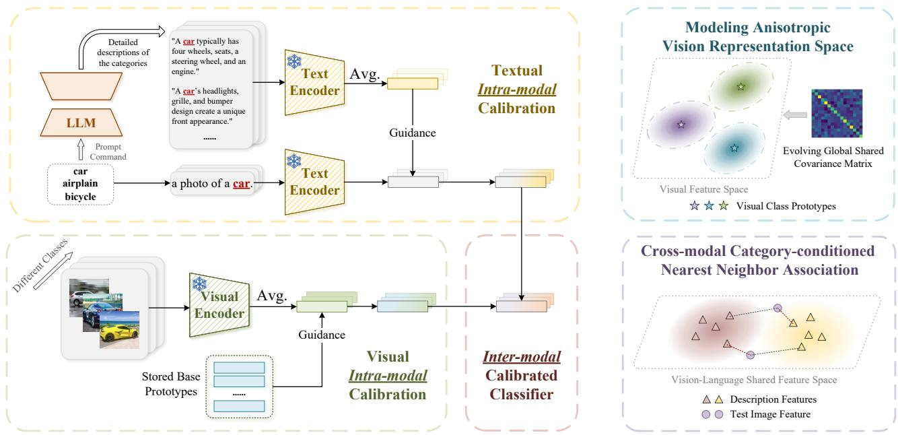  
(a) Bi-Level Modality Calibration Framework  
(b) Semantic and Covariance-enhanced Metric  
Figure 2. Overview of our framework. In each task adaptation phase, we construct a calibrated classifier through our proposed bi-level calibration framework, which involves intra-modal calibration and inter-modal calibration. To enhance performance, we introduce a globally shared covariance metric for visual feature modeling, complemented by a category-conditioned nearest-neighbor scoring strategy.

The categories across different sessions are mutually exclusive, meaning that for any different $i , j ~ \in ~ [ 0 , T ]$ $Y _ { i } \cap Y _ { j } = \emptyset$ . Furthermore, during the training of the current session, data from previous sessions is not accessible. At the testing phase of the t-th session, the model evaluates against all previously encountered categories, with the cumulative category set defined as $\textstyle \mathcal { V } _ { t } = \bigcup _ { j = 0 } ^ { \bar { t } } Y _ { j }$ . Consequently, the test category space is given by $\bar { \mathcal { C } } _ { t } ^ { \mathrm { t e s t } } = \mathcal { V } _ { t }$

## 3.2. Bi-Level calibration framework

Our proposed training-free framework builds upon CLIP [24] and incorporates two essential components: intra-modal and inter-modal calibration (see Figure 2a).

## 3.2.1 Intra-modal classifier calibration

In its standard usage, CLIP relies on simple prompt templates, $( e . g . , \ " a$ photo $\begin{array} { r l } { \textsf { O f } \stackrel { } { \simeq } } & { { } \left[ \mathbb { C } \mathbb { L } \mathbb { S } \right] \cdot \stackrel { \pmb { \ " } } { \mathstrut } \big \mathbf { \ " } \big ) } \end{array}$ to construct zero-shot classifiers for visual tasks. However, this category-agnostic approach has inherent limitations. The generic nature of these templates fails to capture categoryspecific nuances, making them particularly inadequate for fine-grained classification tasks where detailed feature discrimination is crucial. A single, static template cannot effectively characterize the diverse visual characteristics within each category, especially when subtle distinctions between categories are essential.

To overcome these limitations, we leverage Large Language Models (LLMs) to generate dynamic, categoryspecific descriptions. These LLM-generated descriptions provide richer, more discriminative semantic representations for each category, enhancing the model’s capacity to capture fine-grained features. We integrate this enhanced semantic information through an intra-modal calibration strategy within the textual modality:

$$
\tilde { \pmb { \mu } } _ { c } ^ { T } = ( 1 - \lambda _ { T } ) \pmb { w } _ { c } + \lambda _ { T } \left( \frac { 1 } { n _ { c } } \sum _ { j = 1 } ^ { n _ { c } } \frac { g \left( \mathbf { t } _ { c , j } \right) } { \left\| g \left( \mathbf { t } _ { c , j } \right) \right\| _ { 2 } } \right) .\tag{1}
$$

In this formulation, $\lambda _ { T }$ controls the intensity of intra-modal calibration within the text modality, $n _ { c }$ denotes the number of descriptions for category $c , g ( \cdot )$ represents the text encoder, $\mathbf { t } _ { c , j }$ is the j-th LLM-generated description for category c, $\tilde { \mu } _ { c } ^ { 1 }$ is the calibrated textual prototype, and ${ \pmb w } _ { c }$ denotes the original CLIP Zero-Shot classifier weight for class $c .$ This calibration mechanism preserves the robust generalization capabilities of the CLIP Zero-Shot classifier while incorporating fine-grained, category-specific semantic information. The latter term in Eq. (1) serves as a semantically enriched category description center, enhancing the model’s discriminative power.

In the FSCIL context, prototype-based classifiers are commonly employed, where the accuracy of prototype estimation directly impacts performance. During the base session, the abundance of samples allows for precise estimation of class prototypes. However, in incremental sessions that introduce new classes, the limited number of samples inevitably leads to biased estimates of new class prototypes. Drawing inspiration from TEEN [35], we leverage the accurately estimated prototype weights of base classes to facilitate intra-modality calibration on the prototypes of incoming new classes within the visual modality.

For a given class $c ,$ we first utilize the encoded training image data to obtain the naive visual prototype:

$$
\pmb { \mu } _ { c } ^ { I } = \frac { 1 } { m _ { c } } \sum _ { j = 1 } ^ { m _ { c } } \frac { f \left( \mathbf { x } _ { c , j } \right) } { \parallel f \left( \mathbf { x } _ { c , j } \right) \parallel _ { 2 } } ,\tag{2}
$$

where $f ( \cdot )$ is the visual encoder, $m _ { c }$ is the number of images in class $c ,$ and $\mathbf { x } _ { c , j }$ is the $j \mathrm { - t h }$ image belonging to category c. Due to the inaccuracy in visual prototype estimation during the incremental sessions, the prototypes from the base session are used to recalibrate the new class prototypes by leveraging the similarity relationship between them. This process can be formulated as:

$$
\tilde { \pmb { \mu } } _ { c } ^ { I } = \left\{ \begin{array} { l l } { \pmb { \mu } _ { c } ^ { I } } & { , t = 0 } \\ { \qquad } \\ { ( 1 - \lambda _ { I } ) \pmb { \mu } _ { c } ^ { I } + \lambda _ { I } \displaystyle \sum _ { b = 1 } ^ { | \mathcal { V } _ { 0 } | } s _ { b , c } \pmb { \mu } _ { b } ^ { I } } & { , t > 0 , } \end{array} \right.\tag{3}
$$

where, t represents the task identifier, $\lambda _ { I }$ controls the strength of the visual intra-modal calibration, and $s _ { b , c }$ denotes the normalized cosine similarity between the visual prototypes of class b (from the base classes) and class c. The similarity ${ } ^ { { s } _ { b , c } }$ is defined as: $\begin{array} { r } { s _ { b , c } = \frac { e ^ { \tau \cdot \langle \pmb { \mu } _ { b } , \pmb { \mu } _ { c } \rangle } } { \sum _ { i = 1 } ^ { | \mathcal { V } _ { 0 } | } e ^ { \tau \cdot \langle \pmb { \mu } _ { i } , \pmb { \mu } _ { c } \rangle } } } \end{array}$ . Here, $\langle \cdot , \cdot \rangle$ represents the cosine similarity, and τ is the temperature scaling parameter.

Through this visual intra-modality calibration process, the prototypes of the new classes are adjusted to align more closely with the well-calibrated base class prototypes, allowing the new class prototypes to partially inherit the discriminative properties of the base class prototypes.

## 3.2.2 Inter-modal classifier calibration

Following intra-modal calibration, two classifier achieves enhanced accuracy within its respective modality. However, we posit that their full potential remains unrealized when operating in isolation. This is due to the fact that classifiers operating exclusively on linguistic data derive their knowledge from pre-trained models and lack explicit downstream knowledge for visual tasks. Conversely, classifiers functioning solely within the visual domain serve as metrics within the visual sub-feature space but are deficient in semantic understanding. Recognizing the complementary nature of these two modalities, we propose a training-free inter-modal calibration strategy, allowing domain-relevant downstream visual prior to guide domain-agnostic pretrained linguistic knowledge. Formally, this process can be

described as:

$$
{ \pmb \mu } _ { c } = \beta { \tilde { \pmb \mu } } _ { c } ^ { T } + ( 1 - \beta ) { \tilde { \pmb \mu } } _ { c } ^ { I } .\tag{4}
$$

Here, $\pmb { \mu } _ { c }$ is the inter-modal calibrated classifier, and $\beta$ is the calibration coefficient. During inference, we use cosine similarity to calculate the similarity between the sample features $f \left( \mathbf { x } \right)$ and the mixed category center:

$$
\mathbf { s } _ { c } ^ { \mathrm { c a l i b } } = \frac { f \left( \mathbf { x } \right) ^ { \top } \pmb { \mu } _ { c } } { \Vert f \left( \mathbf { x } \right) \Vert _ { 2 } \cdot \Vert \pmb { \mu } _ { c } \Vert _ { 2 } } .\tag{5}
$$

This inter-modal calibration strategy effectively combines the strengths of both linguistic and visual modalities. It helps to enhance the overall classification performance by creating a more robust and comprehensive classifier that can better capture the nuances of visual tasks while maintaining a strong semantic understanding.

## 3.3. Semantic and covariance-enhanced metric

While our previous metrics effectively integrate linguistic and visual information and mitigate modal bias, they primarily measure sample distances from distribution centers. This isotropic approach, despite its simplicity, struggles to capture higher-order information and complex data relationships. To address these limitations, we propose leveraging statistical information from existing data for more comprehensive and efficient measurements, as shown in Figure 2b.

## 3.3.1 Modeling global covariance

Inspired by FeCAM [8], we introduce an anisotropic covariance metric to fully utilize the visual modality’s statistical information. For a session t, we compute its covariance matrix $\Sigma ^ { t }$ using image embeddings $f ( \mathbf { x } )$ of all image data relevant to the session. To avoid singularity, we apply regularization with an identity matrix $\mathbf { \nabla } _ { I _ { d } } \mathbf { : }$

$$
\boldsymbol { \tilde { \Sigma } } ^ { t } = \boldsymbol { \Sigma ^ { t } } + \frac { \gamma } { d } \mathrm { t r } ( \boldsymbol { \Sigma ^ { t } } ) \boldsymbol { I } _ { d } ,\tag{6}
$$

where $\gamma$ is a hyperparameter controlling the strength of regularization, d represents the feature dimension. Here, $\operatorname { t r } ( \cdot )$ denotes the trace operator of a matrix, and both d and tr(Σt) provide a prior estimation for the regularization strength. Subsequently, we construct a continuously evolving shared covariance matrix as:

$$
\tilde { \boldsymbol { \Sigma } } _ { G } ^ { t } = \frac { | \mathcal { V } _ { t - 1 } | } { | \mathcal { V } _ { t } | } \tilde { \boldsymbol { \Sigma } } _ { G } ^ { t - 1 } + \left( 1 - \frac { | \mathcal { V } _ { t - 1 } | } { | \mathcal { V } _ { t } | } \right) \tilde { \boldsymbol { \Sigma } } ^ { t } .\tag{7}
$$

The evolved covariance matrix captures the statistical information of all categories. Given a test sample \protec \mathbf {x}, we calculate its score as:

$$
\mathbf { s } _ { c } ^ { \mathrm { c o v } } ( \mathbf { x } ) = - \frac { 1 } { d } \left( f \left( \mathbf { x } \right) - \tilde { \mu } _ { c } ^ { I } \right) ^ { T } \tilde { \Sigma } _ { G } ^ { - 1 } \left( f \left( \mathbf { x } \right) - \tilde { \mu } _ { c } ^ { I } \right) .\tag{8}
$$

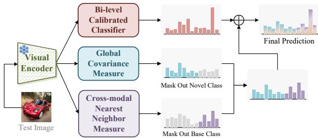  
Figure 3. In the inference phase, an ensemble strategy with category masking is utilized.

The division by feature dimension d serves as a normalization factor, preventing the softmax transformation into probabilities from collapsing into a single category. The negative sign maintains metric consistency, ensuring that a larger output score indicates a higher probability of the sample belonging to category c. Here, $\tilde { \Sigma } _ { G }$ denotes the global covariance, with the superscript t omitted for clarity.

## 3.3.2 Cross-modal category nearest neighbor metric

Global covariance modeling effectively utilizes statistical information from the visual modality. To better leverage LLM-generated category descriptions, we propose a category-conditioned nearest-neighbor-based metric. Given a description text $\mathbf { t } _ { c , j }$ encoded by $g ( \cdot )$ , we obtain its normalized feature representation $\begin{array} { r } { z _ { c , j } = \frac { g ( \mathbf { t } _ { c , j } ) } { \| g ( \mathbf { t } _ { c , j } ) \| _ { 2 } } } \end{array}$ . For a visual query sample, we compute its normalized representation $\begin{array} { r } { { \pmb v } = \frac { f ( \mathbf { x } ) } { \| f ( \mathbf { x } ) \| _ { 2 } } } \end{array}$ . The likelihood of this sample belonging to category c is determined by the maximum dot product between v and all description features in class c:

$$
{ \bf s } _ { c } ^ { \mathrm { n n } } = \operatorname* { m a x } _ { j } \left\{ \boldsymbol { z } _ { c , j } ^ { \top } \cdot \boldsymbol { v } \right\} ,\tag{9}
$$

where $\mathbf { s } _ { c } ^ { \mathrm { n n } }$ indicates the likelihood that the query sample belongs to category $c .$ This metric leverages maximum crossmodal similarity, effectively utilizing the diverse textual descriptions generated by LLM.

## 3.3.3 Inference score reorganization strategy

We employ a globally shared covariance matrix to model distribution shape information in the visual feature space. While the base session contains substantial data for accurate covariance matrix estimation, experiments reveal that these base-derived covariance matrices perform poorly in distinguishing new class data. This limitation stems from two factors: (1) the covariance from extensive base data fails to align with new classes, and (2) the limited data available for new classes prevents accurate covariance estimation. To address this, we use the cross-modal category nearest neighbor metric for novel classes to compensate for the limitations of the second-order covariance metric, as shown in Figure 3.

We first normalize the scores of three metrics using the softmax function: $\mathbf { p } ^ { \mathrm { c a l i b } } =$ softmax $\left( \mathbf { s } ^ { \mathrm { c a l i b } } \right)$ $\mathbf { p } ^ { \mathrm { c o v } } =$ softmax $\left( \mathbf { s } ^ { \mathrm { c o v } } \right)$ , and $\mathbf { p } ^ { \mathrm { n n } } =$ softmax $\left( \mathbf { s } ^ { \mathrm { { n n } } } \right)$ . The final probability score $\mathbf { p } _ { c }$ is computed differently for base and novel categories:

$$
\mathbf { p } _ { c } = \left\{ \begin{array} { l l } { \alpha \mathbf { p } _ { c } ^ { \mathrm { c a l i b } } + ( 1 - \alpha ) \mathbf { p } _ { c } ^ { \mathrm { c o v } } } & { , c \in \mathcal { V } _ { 0 } } \\ { \alpha \mathbf { p } _ { c } ^ { \mathrm { c a l i b } } + ( 1 - \alpha ) \mathbf { p } _ { c } ^ { \mathrm { n n } } } & { , c \notin \mathcal { V } _ { 0 } . } \end{array} \right.\tag{10}
$$

For base categories $( c \in \ \mathcal { V } _ { 0 } )$ , we use a weighted sum of mixed prototype scores and visual mahalanobis metric scores. For novel categories $( c \notin \mathcal { V } _ { 0 } )$ , we combine mixed prototype scores with cross-modal nearest neighbor metric scores. The final category prediction for a sample is determined by \arg \max \_{c} \mathbf {p}\_c $\mathbf { p } _ { c } .$

## 4. Experiments

## 4.1. Experimental settings

Datasets. We evaluate our method on three benchmarks following [22, 30, 41]: CIFAR100 [3], CUB200-2011 [32], and miniImageNet [25]. For CIFAR100 and miniImageNet, we partition each dataset into 60 base classes and 40 novel classes. The novel classes are further divided into eight incremental tasks, with each task structured as a 5-way 5-shot incremental session. The CUB200 dataset is split into 100 base classes and 100 novel classes, with each incremental task organized in a 10-way 5-shot format.

Implementation details. We adopt CLIP’s ViT-B/16 architecture as the backbone for fair comparison across all methods. For category descriptions, we utilize fine-grained text generated by CuPL [23] and [26]. The hyperparameters are configured with intra-modal calibration coefficients $\lambda _ { T } = 0 . 5$ (textual), and $\lambda _ { I } = 0 . 1$ (visual), and a temperature parameter $\tau = 1 6$ . The inter-modal calibration coefficient $\beta$ is optimized through a validation process. Specifically, we divide the base session into training and validation subsets. Applying our bi-level calibration framework on the training subset, we evaluate performance on the validation subset. By incrementing $\beta$ by 0.05, we identify the value that maximizes validation accuracy. This optimal $\beta$ remains fixed throughout subsequent incremental sessions. The shared covariance parameter $\gamma$ is set to 1 for the base session and adjusted to 5 for incremental sessions. Finally, for score reorganization, we set $\alpha = 0 . 6$ for CIFAR100 and miniImageNet, and $\alpha = 0 . 8$ for CUB200.

## 4.2. Comparison results

We compare our method with training-free approaches in the FSCIL scenario: CLIP Zero-Shot [24], Visual Prototype [29], TEEN [35] and FeCAM [8]. We present the performance curve over all benchmarks in Figure 4, while detailed session-wise performance on miniImageNet is shown in Table 1. Detailed results for CIFAR100 and CUB200 are provided in the supplementary material.

Table 1. Detailed session-wise accuracy, average accuracy (Avg) and performance degradation (PD) comparison on miniImageNet dataset. V and L represent the visual and language modalities, respectively. BiMC refers to the results obtained solely through the bi-level calibra tion framework, whereas BiMC† incorporates the ensemble classifier strategy. The best results on each each sessions are indicated in bold, while the second-best results are underlined. ↑ means higher is better, while ↓ means lower is better.
<table><tr><td rowspan="2">Method</td><td rowspan="2">Modality</td><td colspan="10">Accuracy in each session(%) ↑</td><td rowspan="2">Avg ↑</td><td rowspan="2">PD↓</td></tr><tr><td>0</td><td>1</td><td>2</td><td>3</td><td>4</td><td>5</td><td>6</td><td>7</td><td>8</td></tr><tr><td>CLIP Zero-Shot [24]</td><td>L</td><td>91.27</td><td>91.25</td><td>89.74</td><td>89.43</td><td>88.98</td><td>88.42</td><td>86.96</td><td>86.64</td><td>86.15</td><td>88.76</td><td>5.12</td></tr><tr><td>Visual Prototype [29]</td><td>V</td><td>92.58</td><td>91.88</td><td>89.37</td><td>88.24</td><td>88.42</td><td>87.86</td><td>86.33</td><td>86.16</td><td>86.09</td><td>88.55</td><td>6.49</td></tr><tr><td>TEEN [35]</td><td>V</td><td>92.58</td><td>92.06</td><td>89.69</td><td>88.60</td><td>88.80</td><td>88.31</td><td>86.84</td><td>86.71</td><td>86.66</td><td>88.92</td><td>5.92</td></tr><tr><td>FeCAM [8]</td><td>V</td><td>94.42</td><td>93.71</td><td>91.61</td><td>90.59</td><td>90.62</td><td>90.22</td><td>88.43</td><td>88.17</td><td>88.20</td><td>90.66</td><td>6.22</td></tr><tr><td>BiMC</td><td>V-L</td><td>94.90</td><td>94.80</td><td>93.21</td><td>92.91</td><td>92.88</td><td>92.60</td><td>91.78</td><td>91.88</td><td>91.81</td><td>92.97</td><td>3.09</td></tr><tr><td>BiMC†</td><td>V-L</td><td>95.47</td><td>95.34</td><td>93.80</td><td>93.63</td><td>93.51</td><td>93.18</td><td>92.51</td><td>92.56</td><td>92.40</td><td>93.60</td><td>3.07</td></tr></table>

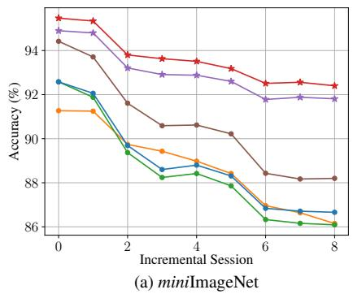

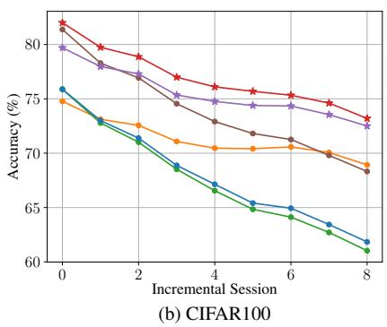

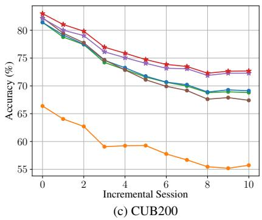  
Figure 4. Performance curve of each incremental sessions on (a) miniImageNet, (b) CIFAR100 and (c) CUB200 datasets.

Our approach demonstrates competitive performance across all three datasets and significantly outperforms unimodal baselines without requiring additional training, highlighting the importance of leveraging information from both modalities. On the miniImageNet dataset, while visual and textual1 prototype classifiers achieve comparable results, and although TEEN [35] and FeCAM [8] better utilize visual modality information, their improvement remain limited. Our framework employs a simple calibration strategy to integrate domain visual knowledge with pretrained linguistic knowledge, yielding up to 6% performance improvement over uni-modal models.

For CIFAR100, the language prototype shows better resistance to forgetting compared to the visual one, which is more susceptible to sequential task learning. This can be attributed to the dataset’s low-resolution characteristics, resulting in insufficient visual information during incremental phases. Our calibration framework achieves approximately 3.5% improvement over a language-only classifier. In contrast, for the fine-grained CUB200 dataset, the visual prototype surpasses the language prototype due to limited trans-

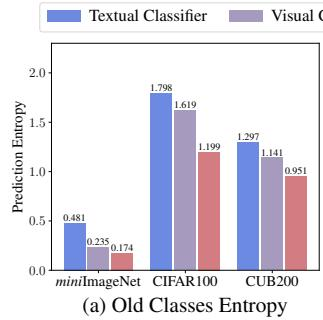

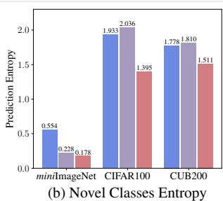  
Figure 5. Comparison of output confidence with different models. ferability of pre-trained language knowledge. By combining both modalities, our approach achieves approximately 3.5% performance improvement. Notably, our framework demonstrates robust resistance to forgetting, achieving the lowest performance drop across all metrics.

One can observe that each modality’s contribution to classification varies across datasets. Our proposed bi-level calibration framework effectively leverages the strengths of each modality and mitigates modality bias. Moreover, our ensemble inference strategy, denoted as BiMC†, provides additional performance improvements.

## 4.3. Investigation of bi-level calibrated classifiers

In this section, we analyze two distinct attributes of the calibrated classifier to demonstrate the effectiveness of our pro-

Table 2. Ablation studies of bi-level calibration framework on miniImageNet. Vis. and Lang. individually represent classifiers derived from the visual and language modalities. Intra-C and Inter-C refer to the strategies of intra-modal and inter-modal calibration, respectively.
<table><tr><td rowspan="2">Vis</td><td rowspan="2">Lang</td><td rowspan="2">Intra-C</td><td rowspan="2">Inter-C</td><td colspan="9">Accuracy in each session(%) ↑</td><td rowspan="2"> $\mathbf { A v g } \uparrow$ </td><td rowspan="2">PD↓</td></tr><tr><td>0</td><td>1</td><td>2</td><td>3</td><td>4</td><td>5</td><td>6</td><td>7</td><td>8</td></tr><tr><td>V</td><td></td><td></td><td></td><td>92.58</td><td>91.88</td><td>89.37</td><td>88.24</td><td>88.42</td><td>87.86</td><td>86.33</td><td>86.16</td><td>86.09</td><td>88.55</td><td>6.49</td></tr><tr><td>V</td><td></td><td>√</td><td></td><td>92.58</td><td>92.06</td><td>89.69</td><td>88.60</td><td>88.80</td><td>88.31</td><td>86.84</td><td>86.71</td><td>86.66</td><td>88.92</td><td>5.92</td></tr><tr><td></td><td>√</td><td></td><td></td><td>91.27</td><td>91.25</td><td>89.74</td><td>89.43</td><td>88.98</td><td>88.42</td><td>86.96</td><td>86.64</td><td>86.15</td><td>88.76</td><td>5.12</td></tr><tr><td></td><td>√</td><td>V</td><td></td><td>93.27</td><td>93.32</td><td>91.91</td><td>91.51</td><td>91.21</td><td>90.73</td><td>89.28</td><td>89.23</td><td>89.01</td><td>91.05</td><td>4.26</td></tr><tr><td>√</td><td>√</td><td></td><td>√</td><td>94.68</td><td>94.58</td><td>92.87</td><td>92.49</td><td>92.56</td><td>92.31</td><td>91.59</td><td>91.58</td><td>91.54</td><td>92.69</td><td>3.14</td></tr><tr><td>√</td><td>√</td><td>√</td><td>√</td><td>94.90</td><td>94.80</td><td>93.21</td><td>92.91</td><td>92.88</td><td>92.60</td><td>91.78</td><td>91.88</td><td>91.81</td><td>92.97</td><td>3.09</td></tr></table>

Table 3. The left side of the table lists classification result combinations from three classifiers, while the right side shows the percentage (%) of test samples meeting each combination. Test sets from both the base and the final session were used for analysis.
<table><tr><td colspan="3">Modality</td><td colspan="2">CIFAR100</td><td colspan="2">CUB200</td></tr><tr><td>V</td><td>L</td><td>V-L</td><td> $\mathcal { D } _ { 0 } ^ { \mathrm { t e s t } }$ </td><td> $\mathcal { D } _ { 8 } ^ { \mathrm { t e s t } }$ </td><td> $\mathcal { D } _ { 0 } ^ { \mathrm { t e s t } }$ </td><td> $\mathcal { D } _ { 1 0 } ^ { \mathrm { t e s t } }$ </td></tr><tr><td></td><td></td><td></td><td>65.33</td><td>51.81</td><td>59.00</td><td>44.85</td></tr><tr><td>X</td><td>√</td><td></td><td>6.95</td><td>13.07</td><td>2.06</td><td>4.00</td></tr><tr><td>V</td><td>X</td><td></td><td>6.10</td><td>5.56</td><td>19.83</td><td>21.40</td></tr><tr><td>X</td><td>X</td><td></td><td>1.20</td><td>2.10</td><td>1.08</td><td>1.98</td></tr></table>

posed framework.

The bi-level calibrated classifier enhances prediction confidence. We evaluate prediction confidence by calculating the entropy of predictions for each classifier in the final session across all three datasets. The entropy serves as an uncertainty indicator for model outputs, and we compute it separately for both base and novel categories, as detailed in Figure 5. The findings indicate that the bi-level calibrated classifier significantly reduces the entropy of predictions compared to uni-model classifiers, thereby enhancing prediction accuracy.

The bi-level calibrated classifier mitigates modality bias. To elucidate the superior performance of our method, we analyze the joint prediction outcomes across different classifiers in comparison to uni-modal approaches. Using ✓ to denote correct classifications and ✗ for classification errors, we observe that the calibrated classifier maintains accurate predictions even in cases where uni-modal classifiers fail, as demonstrated in the $2 ^ { \mathrm { n d } }$ and $3 ^ { \mathrm { r d } }$ rows of Table 3. This evidence suggests that the bi-level calibrated classifier produces more accurate and unbiased predictions, offering enhanced robustness compared to uni-modality classifiers. Remarkably, in certain rare instances, the modalitycalibrated classifier successfully classifies samples that both uni-modal classifiers misclassify.

## 4.4. Ablation study

We conduct comprehensive ablation analyses on the miniImageNet dataset to evaluate the significance of each component within our proposed framework.

Bi-level calibration framework. Our framework comprises four components: visual modality information, linguistic modality information, intra-modal calibration strategy, and inter-modal calibration strategy. As shown in Table 2, single-modality classifiers enhanced with intra-modal calibration demonstrate improved performance, attributable to more accurate estimation of the uni-modal classifier. When employing inter-modal calibration, we observe significant performance gains compared to uni-modal approaches, owing to the fusion strategy’s effectiveness in addressing modality biases. The combination of both intramodal and inter-modal calibration strategies yields the best performance, with comprehensive knowledge integration leading to minimal forgetting rates.

Table 4. Ablation study of Semantic and Covariance-enhanced Metric on the miniImageNet dataset. To verify their efftctiveness, we measured the performance of the base task ${ \mathcal { A } } _ { { \mathrm { b a s e } } } ,$ the performance of last task $\mathcal { A } _ { \mathrm { l a s t } }$ and the average performance $\mathcal { A } _ { \mathrm { a v g . } }$ . across all tasks. Additionally, we report the accuracy of base $\bar { \mathcal { A } } _ { \mathrm { l a s t } } ^ { b }$ and novel $\mathcal { A } _ { \mathrm { l a s t } } ^ { n }$ class in last task.
<table><tr><td>Ablation</td><td> $\mathcal { A } _ { \mathrm { b a s e } }$ </td><td> $\mathcal { A } _ { \mathrm { l a s t } }$ </td><td> $\mathcal { A } _ { \mathrm { l a s t } } ^ { b }$ </td><td> $\mathcal { A } _ { \mathrm { l a s t } } ^ { n }$ </td><td> $\mathcal { A } _ { \mathrm { a v g . } }$ </td></tr><tr><td>BiMC</td><td>94.90</td><td>91.81</td><td>93.43</td><td>89.38</td><td>92.97</td></tr><tr><td>+ MGC</td><td>95.47</td><td>91.51</td><td>94.37</td><td>87.22</td><td>92.91</td></tr><tr><td>+ CMNN</td><td>94.85</td><td>92.15</td><td>93.30</td><td>90.42</td><td>93.18</td></tr><tr><td>BiMC† (w/o mask.)</td><td>95.47</td><td>92.20</td><td>94.12</td><td>89.32</td><td>93.37</td></tr><tr><td> $\mathrm { B i M C ^ { \dagger } }$ </td><td>95.47</td><td>92.40</td><td>93.20</td><td>91.20</td><td>93.60</td></tr></table>

Semantic and covariance-enhanced metric. We examine the effectiveness of Modeling Global Covariance (MGC) and Cross-modal category Nearest Neighbor metric (CMNN) in Table 4. The global covariance modeling strategy enhances base category performance in both the base session and the final incremental session, though at the cost of reduced recognition performance for novel classes, a consequence of the mismatch between global covariance (dominated by base data) and new classes. The semantic nearest neighbor strategy, conversely, improves novel class recognition performance. Implementing both strategies simultaneously without masking further enhances overall performance. Finally, the ensemble inference mechanism with masks fully leverages the advantages of both metrics, achieving superior performance.

β  
Table 5. Comparison with three trainable methods on the miniImageNet dataset. $N _ { p }$ is the number of parameters which require training. $\Delta \mathcal { A } _ { \mathrm { l a s t } }$ reflects the last task’s performance gap between our method and the comparative one.
<table><tr><td>Method</td><td> $N _ { p }$ </td><td> $\mathcal { A } _ { \mathrm { b a s e } }$ </td><td> $\mathcal { A } _ { \mathrm { l a s t } }$ </td><td> $\mathcal { A } _ { \mathrm { a v g . } }$ </td><td> $\Delta \mathcal { A } _ { \mathrm { l a s t } }$ </td></tr><tr><td>CPE-CLIP [5]</td><td>400k</td><td>90.23</td><td>82.77</td><td>86.13</td><td>+9.63</td></tr><tr><td>CLIP-M3 [6]</td><td>46k</td><td>96.00</td><td>92.50</td><td>94.10</td><td>-0.10</td></tr><tr><td>LP-DiF [10]</td><td>8.1k</td><td>96.34</td><td>91.68</td><td>93.76</td><td>+0.72</td></tr><tr><td>BiMC†</td><td>0</td><td>95.47</td><td>92.40</td><td>93.60</td><td>0.00</td></tr></table>

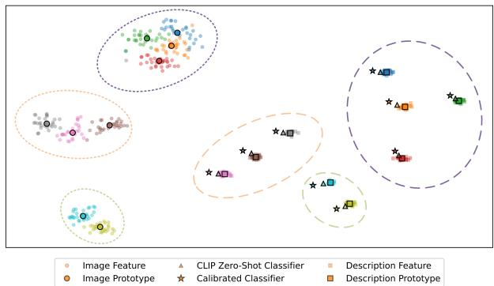  
Figure 6. CLIP Feature Space Visualization. Squares, circles, and pentagrams represent textual, visual features, and calibrated classifiers respectively. Different colors denote different categories.

## 4.5. Further analysis

Comparison with training-required methods. To comprehensively evaluate our approach, we conduct comparisons with three training-based methods [5, 6, 10]. As demonstrated in Table 5, our parameter-free adaptation approach to FSCIL tasks achieves comparable or superior performance to methods that require additional training.

Visualization of Feature Space. We visualized the image and text feature distributions on the miniImageNet dataset, as depicted in Figure 6. Our analysis showed that in the unified feature space encoded by CLIP, visual and textual features are located at diametrically opposed ends, exemplifying a modality gap phenomenon [16]. Textual features showed more consistent convergence, in contrast to the visual features of the same category, which were more dispersed within the feature space. Notably, despite being distinct, these features share similar representations in the visual subspace (e.g., the two purple dashed ellipses in Figure 6) but are clearly distinguishable in the textual subspace. Furthermore, after modality calibration, the classifiers, influenced by visual priors, demonstrate a shift from the textual modality to the visual modality, thereby alleviating modality bias and enhancing classification capabilities.

Analysis of hyper-parameters. Our framework involves two critical hyper-parameters: the inter-modal calibration parameter $\beta$ and the ensemble classifier weighting coefficient $\alpha ,$ both constrained to [0, 1]. Figure 7a illustrates how performance varies sessions for different values of $\beta .$

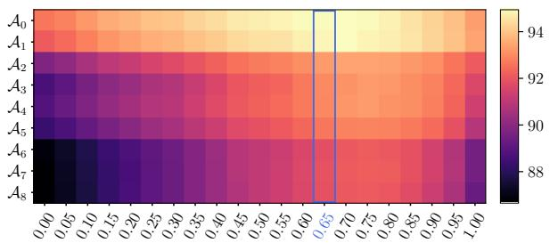

(a) Influence of β and session-wise accuracy on miniImageNet  
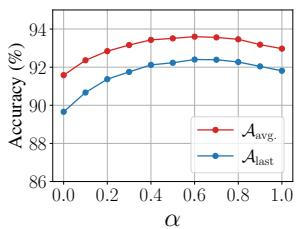

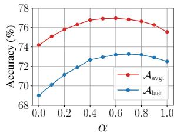  
(b) Influence of α on miniImageNet  
(c) Influence of α on CIFAR100  
Figure 7. Analysis on hyper-parameters $\beta$ and $\alpha .$ For $\beta ,$ we present heatmaps illustrating accuracy under varying $\beta$ across different sessions. For α, we report the average task accuracy $\mathcal { A } _ { a v g }$ and the final task accuracy $\mathbf { \mathcal { A } } _ { l a s t }$ under different settings.

We observe that the $\beta$ values that perform well in the base session maintain their effectiveness throughout incremental tasks. The optimal solution identified through the validation search in the base session (indicated by the blue rectangular box) closely approaches the global optimum. For the parameter α, results are presented in Figures 7b and 7c. When $\alpha = 1$ , the method reduces to a bi-level calibrated classifier. The performance reaches its peak at $\alpha = 0 . 6 $ , optimizing both the average and final accuracy metrics.

## 5. Conclusion

We explore CLIP models in the context of Few-shot Class-Incremental Learning. To mitigate forgetting, we treat the pre-trained model as a black box and employ a simple yet effective training-free bi-level modality calibration strategy. The intra-modal calibration achieves accurate classifier estimates within each modality, while the inter-modal calibration combines knowledge from both visual and textual modalities. An ensemble inference strategy integrating covariance and nearest-neighbor metrics enhances the accuracy of prediction. Extensive experiments validate the effectiveness of our approach.

Acknowledgements. This work is supported in part by the Young Elite Scientists Sponsorship Program by CAST (2023QNRC001), National Natural Science Foundation of China (62192783, 62276128), Guangdong Basic and Applied Basic Research Foundation (2024A1515011340) Jiangsu Natural Science Foundation (BK20221441), and the Australian Research Council’s Discovery Project (DP220101784).

## References

[1] Noor Ahmed, Anna Kukleva, and Bernt Schiele. Orco: Towards better generalization via orthogonality and contrast for few-shot class-incremental learning. In Proceedings of the IEEE/CVF Conference on Computer Vision and Pattern Recognition, pages 28762–28771, 2024. 2

[2] Afra Feyza Akyurek, Ekin Aky ¨ urek, Derry Tanti Wijaya, and¨ Jacob Andreas. Subspace regularizers for few-shot class incremental learning. arXiv preprint arXiv:2110.07059, 2021. 2

[3] Krizhevsky Alex. Learning multiple layers of features from tiny images. https://www. cs. toronto. edu/kriz/learningfeatures-2009-TR. pdf, 2009. 5

[4] Ali Cheraghian, Shafin Rahman, Pengfei Fang, Soumava Kumar Roy, Lars Petersson, and Mehrtash Harandi. Semantic-aware knowledge distillation for fewshot class-incremental learning. In Proceedings of the IEEE/CVF conference on computer vision and pattern recognition, pages 2534–2543, 2021. 1, 2

[5] Marco D’Alessandro, Alberto Alonso, Enrique Calabres,´ and Mikel Galar. Multimodal parameter-efficient few-shot class incremental learning. In Proceedings ofthe IEEE/CVF International Conference on Computer Vision, pages 3393– 3403, 2023. 8

[6] Thang Doan, Sima Behpour, Xin Li, Wenbin He, Liang Gou, and Liu Ren. A streamlined approach to multimodal few-shot class incremental learning for fine-grained datasets. arXiv preprint arXiv:2403.06295, 2024. 8

[7] Songlin Dong, Xiaopeng Hong, Xiaoyu Tao, Xinyuan Chang, Xing Wei, and Yihong Gong. Few-shot classincremental learning via relation knowledge distillation. In Proceedings of the AAAI Conference on Artificial Intelligence, pages 1255–1263, 2021. 2

[8] Dipam Goswami, Yuyang Liu, Bartłomiej Twardowski, and Joost van de Weijer. Fecam: Exploiting the heterogeneity of class distributions in exemplar-free continual learning. Advances in Neural Information Processing Systems, 36, 2024. 4, 5, 6

[9] Edward J Hu, Yelong Shen, Phillip Wallis, Zeyuan Allen-Zhu, Yuanzhi Li, Shean Wang, Lu Wang, and Weizhu Chen. Lora: Low-rank adaptation of large language models. arXiv preprint arXiv:2106.09685, 2021. 1, 2

[10] Zitong Huang, Ze Chen, Zhixing Chen, Erjin Zhou, Xinxing Xu, Rick Siow Mong Goh, Yong Liu, Chunmei Feng, and Wangmeng Zuo. Learning prompt with distribution-based feature replay for few-shot class-incremental learning. arXiv preprint arXiv:2401.01598, 2024. 8

[11] Dahuin Jung, Dongyoon Han, Jihwan Bang, and Hwanjun Song. Generating instance-level prompts for rehearsal-free continual learning. In Proceedings ofthe IEEE/CVF International Conference on Computer Vision, pages 11847–11857, 2023. 2

[12] Jayateja Kalla and Soma Biswas. S3c: Self-supervised stochastic classifiers for few-shot class-incremental learning. In European Conference on Computer Vision, pages 432– 448. Springer, 2022. 2

[13] Muhammad Gul Zain Ali Khan, Muhammad Ferjad Naeem, Luc Van Gool, Didier Stricker, Federico Tombari, and Muhammad Zeshan Afzal. Introducing language guidance in prompt-based continual learning. In Proceedings of the IEEE/CVF International Conference on Computer Vision, pages 11463–11473, 2023. 2

[14] Muhammad Uzair Khattak, Syed Talal Wasim, Muzammal Naseer, Salman Khan, Ming-Hsuan Yang, and Fahad Shahbaz Khan. Self-regulating prompts: Foundational model adaptation without forgetting. In Proceedings of the IEEE/CVF International Conference on Computer Vision, pages 15190–15200, 2023. 1

[15] Anna Kukleva, Hilde Kuehne, and Bernt Schiele. Generalized and incremental few-shot learning by explicit learning and calibration without forgetting. In Proceedings of the IEEE/CVF International Conference on Computer Vision, pages 9020–9029, 2021. 2

[16] Weixin Liang, Yuhui Zhang, Yongchan Kwon, Serena Yeung, and James Zou. Mind the gap: Understanding the modality gap in multi-modal contrastive representation learning. In Advances in Neural Information Processing Systems, 2022. 8

[17] Yan-Shuo Liang and Wu-Jun Li. Inflora: Interference-free low-rank adaptation for continual learning. In Proceedings of the IEEE/CVF Conference on Computer Vision and Pattern Recognition, pages 23638–23647, 2024. 2

[18] Pratik Mazumder, Pravendra Singh, and Piyush Rai. Fewshot lifelong learning. In Proceedings of the AAAI Confer ence on Artificial Intelligence, pages 2337–2345, 2021. 2

[19] Bolin Ni, Hongbo Zhao, Chenghao Zhang, Ke Hu, Gaofeng Meng, Zhaoxiang Zhang, and Shiming Xiang. Enhancing visual continual learning with language-guided supervision. In Proceedings of the IEEE/CVF Conference on computer vision and pattern recognition, pages 24068–24077, 2024. 2

[20] Zachary Novack, Julian McAuley, Zachary Chase Lipton, and Saurabh Garg. Chils: Zero-shot image classification with hierarchical label sets. In International Conference on Machine Learning, pages 26342–26362. PMLR, 2023. 2

[21] Keon-Hee Park, Kyungwoo Song, and Gyeong-Moon Park. Pre-trained vision and language transformers are few-shot incremental learners. In Proceedings ofthe IEEE/CVF Conference on Computer Vision and Pattern Recognition, pages 23881–23890, 2024. 1, 2

[22] Can Peng, Kun Zhao, Tianren Wang, Meng Li, and Brian C Lovell. Few-shot class-incremental learning from an openset perspective. In European Conference on Computer Vision, pages 382–397. Springer, 2022. 1, 2, 5

[23] Sarah Pratt, Ian Covert, Rosanne Liu, and Ali Farhadi. What does a platypus look like? generating customized prompts for zero-shot image classification. In Proceedings of the IEEE/CVF International Conference on Computer Vision, pages 15691–15701, 2023. 2, 5

[24] Alec Radford, Jong Wook Kim, Chris Hallacy, Aditya Ramesh, Gabriel Goh, Sandhini Agarwal, Girish Sastry, Amanda Askell, Pamela Mishkin, Jack Clark, et al. Learn ing transferable visual models from natural language supervision. In International Conference on Machine Learning, pages 8748–8763. PMLR, 2021. 1, 3, 5, 6

[25] Sachin Ravi and Hugo Larochelle. Optimization as a model for few-shot learning. In International conference on learning representations, 2017. 5

[26] Oindrila Saha, Grant Van Horn, and Subhransu Maji. Improved zero-shot classification by adapting vlms with text descriptions. In Proceedings of the IEEE/CVF Conference on Computer Vision and Pattern Recognition, pages 17542– 17552, 2024. 2, 5

[27] Guangyuan Shi, Jiaxin Chen, Wenlong Zhang, Li-Ming Zhan, and Xiao-Ming Wu. Overcoming catastrophic forgetting in incremental few-shot learning by finding flat minima. Advances in neural information processing systems, 34: 6747–6761, 2021. 1, 2

[28] James Seale Smith, Leonid Karlinsky, Vyshnavi Gutta, Paola Cascante-Bonilla, Donghyun Kim, Assaf Arbelle, Rameswar Panda, Rogerio Feris, and Zsolt Kira. Coda-prompt: Continual decomposed attention-based prompting for rehearsal-free continual learning. In Proceedings of the IEEE/CVF Conference on Computer Vision and Pattern Recognition, pages 11909–11919, 2023. 2

[29] Jake Snell, Kevin Swersky, and Richard Zemel. Prototypical networks for few-shot learning. Advances in neural information processing systems, 30, 2017. 5, 6

[30] Zeyin Song, Yifan Zhao, Yujun Shi, Peixi Peng, Li Yuan, and Yonghong Tian. Learning with fantasy: Semantic-aware virtual contrastive constraint for few-shot class-incremental learning. In Proceedings of the IEEE/CVF Conference on Computer Vision and Pattern Recognition, pages 24183– 24192, 2023. 2, 5

[31] Xiaoyu Tao, Xiaopeng Hong, Xinyuan Chang, Songlin Dong, Xing Wei, and Yihong Gong. Few-shot classincremental learning. In Proceedings of the IEEE/CVF conference on Computer Vision and Pattern Recognition, pages 12183–12192, 2020. 1, 2

[32] Catherine Wah, Steve Branson, Peter Welinder, Pietro Perona, and Serge Belongie. The caltech-ucsd birds-200-2011 dataset. 2011. 5

[33] Junyang Wang, Yuanhong Xu, Juhua Hu, Ming Yan, Jitao Sang, and Qi Qian. Improved visual fine-tuning with natural language supervision. In Proceedings of the IEEE/CVF International Conference on Computer Vision, pages 11899– 11909, 2023. 2

[34] Liyuan Wang, Jingyi Xie, Xingxing Zhang, Mingyi Huang, Hang Su, and Jun Zhu. Hierarchical decomposition of prompt-based continual learning: Rethinking obscured suboptimality. Advances in Neural Information Processing Systems, 36, 2024. 2

[35] Qi-Wei Wang, Da-Wei Zhou, Yi-Kai Zhang, De-Chuan Zhan, and Han-Jia Ye. Few-shot class-incremental learning via training-free prototype calibration. Advances in Neural Information Processing Systems, 36, 2024. 1, 4, 5, 6

[36] Zifeng Wang, Zizhao Zhang, Sayna Ebrahimi, Ruoxi Sun, Han Zhang, Chen-Yu Lee, Xiaoqi Ren, Guolong Su, Vincent Perot, Jennifer Dy, et al. Dualprompt: Complementary prompting for rehearsal-free continual learning. In European Conference on Computer Vision, pages 631–648. Springer, 2022. 2

[37] Zifeng Wang, Zizhao Zhang, Chen-Yu Lee, Han Zhang, Ruoxi Sun, Xiaoqi Ren, Guolong Su, Vincent Perot, Jen nifer Dy, and Tomas Pfister. Learning to prompt for continual learning. In Proceedings ofthe IEEE/CVF conference on Computer Vision and Pattern Recognition, pages 139–149, 2022. 2

[38] Yibo Yang, Haobo Yuan, Xiangtai Li, Zhouchen Lin, Philip Torr, and Dacheng Tao. Neural collapse inspired featureclassifier alignment for few-shot class incremental learning. arXiv preprint arXiv:2302.03004, 2023. 2

[39] Hantao Yao, Rui Zhang, and Changsheng Xu. Visual language prompt tuning with knowledge-guided context optimization. In Proceedings of the IEEE/CVF conference on Computer Vision and Pattern Recognition, pages 6757– 6767, 2023. 1

[40] Jiazuo Yu, Yunzhi Zhuge, Lu Zhang, Ping Hu, Dong Wang, Huchuan Lu, and You He. Boosting continual learning of vision-language models via mixture-of-experts adapters. In Proceedings of the IEEE/CVF Conference on Computer Vi sion and Pattern Recognition, pages 23219–23230, 2024. 2

[41] Chi Zhang, Nan Song, Guosheng Lin, Yun Zheng, Pan Pan, and Yinghui Xu. Few-shot incremental learning with continually evolved classifiers. In Proceedings of the IEEE/CVF conference on Computer Vision and Pattern Recognition, pages 12455–12464, 2021. 2, 5

[42] Hai Zhang, Junzhe Xu, Shanlin Jiang, and Zhenan He. Simple semantic-aided few-shot learning. In Proceedings of the IEEE/CVF Conference on Computer Vision and Pattern Recognition, pages 28588–28597, 2024. 2

[43] Linglan Zhao, Jing Lu, Yunlu Xu, Zhanzhan Cheng, Dashan Guo, Yi Niu, and Xiangzhong Fang. Few-shot classincremental learning via class-aware bilateral distillation. In Proceedings of the IEEE/CVF conference on Computer Vision and Pattern Recognition, pages 11838–11847, 2023. 1

[44] Da-Wei Zhou, Fu-Yun Wang, Han-Jia Ye, Liang Ma, Shiliang Pu, and De-Chuan Zhan. Forward compatible few-shot class-incremental learning. In Proceedings of the IEEE/CVF conference on Computer Vision and Pattern Recognition, pages 9046–9056, 2022. 1, 2

[45] Da-Wei Zhou, Hai-Long Sun, Han-Jia Ye, and De-Chuan Zhan. Expandable subspace ensemble for pre-trained modelbased class-incremental learning. In Proceedings of the IEEE/CVF Conference on Computer Vision and Pattern Recognition, pages 23554–23564, 2024. 2

[46] Kaiyang Zhou, Jingkang Yang, Chen Change Loy, and Ziwei Liu. Conditional prompt learning for vision-language models. In Proceedings of the IEEE/CVF conference on Computer Vision and Pattern Recognition, pages 16816–16825, 2022. 1

[47] Kaiyang Zhou, Jingkang Yang, Chen Change Loy, and Ziwei Liu. Learning to prompt for vision-language models. International Journal of Computer Vision, 130(9):2337–2348, 2022. 1

[48] Yixiong Zou, Shanghang Zhang, Yuhua Li, and Ruixuan Li. Margin-based few-shot class-incremental learning with class-level overfitting mitigation. Advances in neural information processing systems, 35:27267–27279, 2022. 1