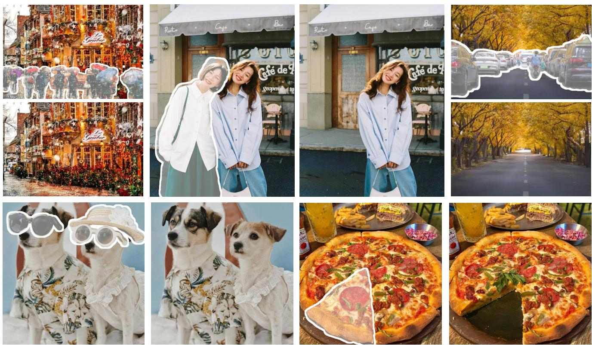
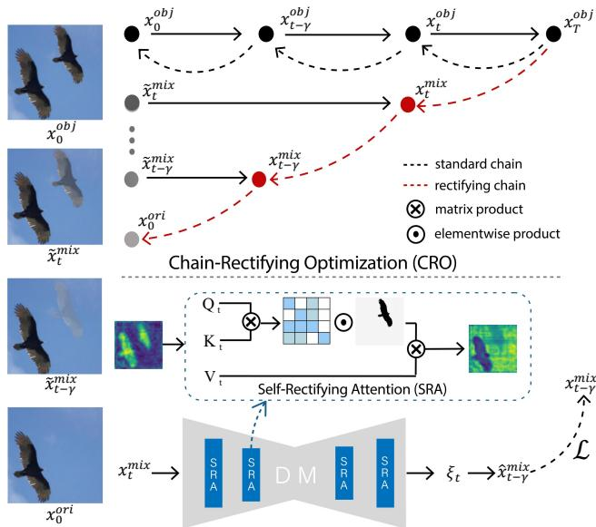
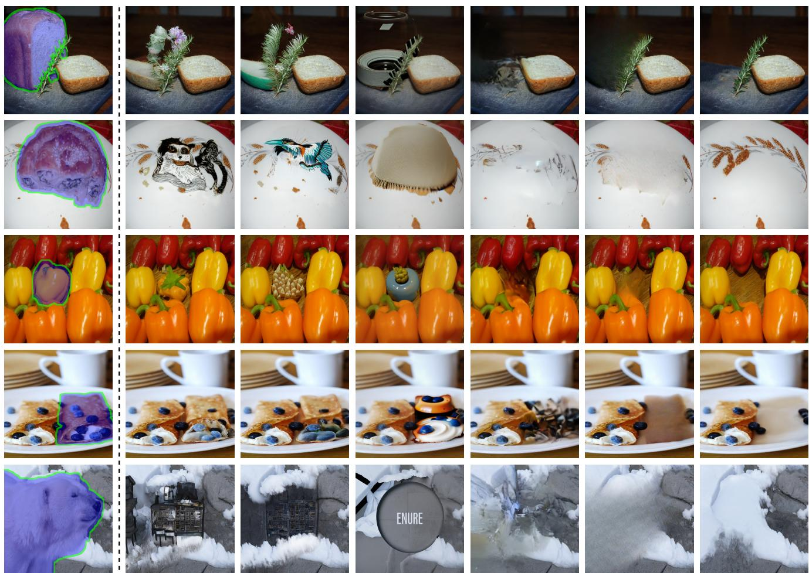
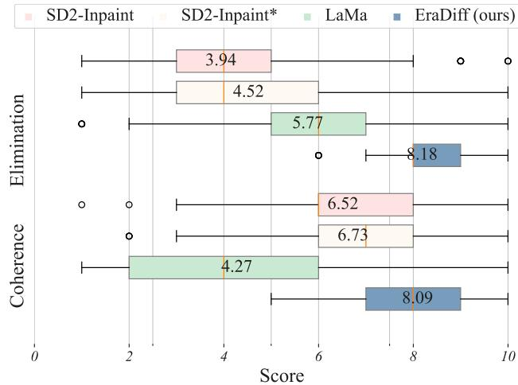
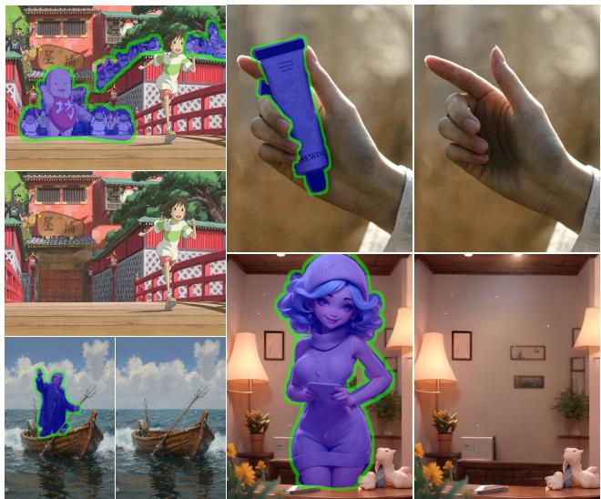
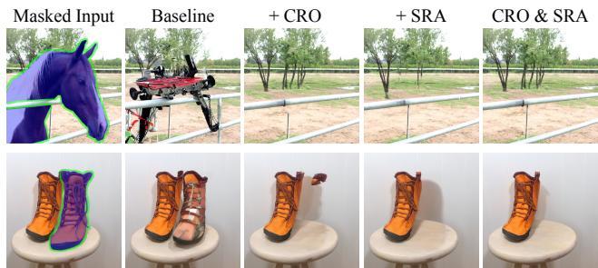
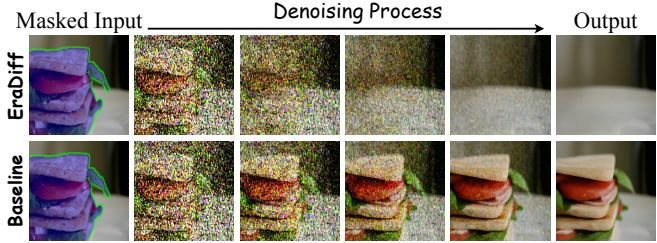
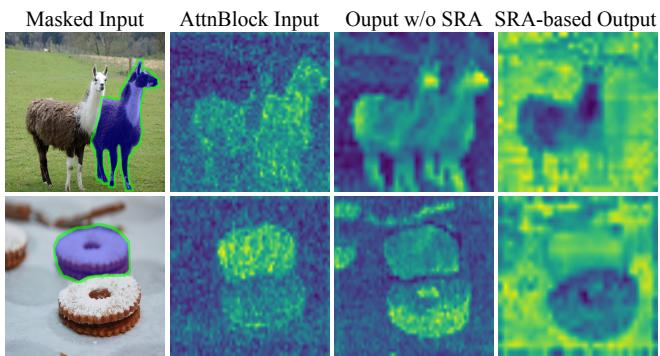

  
Figure 1. Diverse erase inpainting results produced by our proposed EraDiff, where images before and after removal are presented in pairs, and the areas to be erased in the original images have been marked. The EraDiff can eliminate targets in various complex real-world scenes while ensuring visual coherence in the generated images.

# Erase Diffusion: Empowering Object Removal Through Calibrating Diffusion Pathways

Yi Liu∗, Hao Zhou∗, Benlei Cui†, Wenxiang Shang, Ran Lin Alibaba Group

{ly402089,baishu.zh,cuibenlei.cbl,shangwenxiang.swx,linran.lr09}@taobao.com

## Abstract

Erase inpainting, or object removal, aims to precisely remove target objects within masked regions while preserving the overall consistency of the surrounding content. Despite diffusion-based methods have made significant strides in the field of image inpainting, challenges remain regarding the emergence of unexpected objects or artifacts. We assert that the inexact diffusion pathways established by existing

standard optimization paradigms constrain the efficacy of object removal. To tackle these challenges, we propose a novel Erase Diffusion, termed EraDiff, aimed at unleashing the potential power of standard diffusion in the context of object removal. In contrast to standard diffusion, the EraDiff adapts both the optimization paradigm and the network to improve the coherence and elimination of the erasure results. We first introduce a Chain-Rectifying Optimization (CRO) paradigm, a sophisticated diffusion process specifically designed to align with the objectives oferasure. This paradigm establishes innovative diffusion transition

pathways that simulate the gradual elimination of objects during optimization, allowing the model to accurately capture the intent of object removal. Furthermore, to mitigate deviations caused by artifacts during the sampling pathways, we develop a simple yet effective Self-Rectifying Attention (SRA) mechanism. The SRA calibrates the sampling pathways by altering self-attention activation, allowing the model to effectively bypass artifacts while further enhancing the coherence ofthe generated content. With this design, our proposed EraDiffachieves state-of-the-art performance on the OpenImages V5 dataset and demonstrates significant superiority in real-world scenarios.

## 1. Introduction

Image inpainting is a crucial technique in computer vision, aimed at reconstructing missing or damaged regions while maintaining visual coherence and contextual integrity [15, 32]. As one specialized form of image inpainting, object removal, also called erase inpainting, has broader applications in various fields such as social media [3, 50], advertising design [36], and image processing [37, 46]. However, in comparison to general image inpainting, an ideal erase inpainting model must address two critical challenges. Coherence: The model should seamlessly inpaint the masked area, ensuring consistency in lighting, content, and other relevant aspects. Elimination: The model should accurately remove objects within the masked area while preventing the generation of extraneous elements or artifacts.

Prior erase inpainting methods primarily relied on nonparametric patch sampling techniques [4, 10, 19] or Generative Adversarial Networks (GANs) [5, 8, 14, 22, 29, 33, 41, 44, 48]. These approaches often resort to filling large masked regions with repetitive patches, resulting in a lack of coherence in the generated images. In recent years, methods based on Latent Diffusion Models (LDMs) [27] have demonstrated superiority in generating more natural images. However, these methods struggle to eliminate target objects. For example, when a user seeks to erase a piece of pizza in Figure 1, the LDMs may mistakenly generate another piece of pizza instead of the expected clean plate.

We attribute the above issues to the fact that standard diffusion pathways in most existing methods are not suitable for erase tasks. During optimization, most diffusion-based erase inpainting models take the original image with added noise and randomly generated masks as input, aiming to recover the original image in the presence of noise. However, this standard training paradigm only establishes a denoising process that transitions from random noise to clear images, without addressing the specific goal of object removal. Consequently, the model may follow a denoising pathway from noise to an image with objects. Based on this observation, we argue that an ideal erase inpainting model should establish a diffusion pathway directly from objects to backgrounds to ensure the definitive removal of unwanted elements. Furthermore, in the early stages of denoising, the reconstructed regions are significantly influenced by the shape of the masks and the level of noise. This impact may lead to deviations in the early latent states, resulting in the emergence of artifacts. The standard self-attention mechanism tends to incorrectly regard the features of these artifacts as important information, which gradually amplifies the deviations during the subsequent denoising process. Ultimately, it leads to unexpected objects in the generated images.

In this paper, we present a novel erase diffusion model, termed EraDiff, specifically designed for object removal, which effectively unleashes the potential erasure power of standard diffusion. First, we introduce a Chain-Rectifying Optimization (CRO) paradigm that supports the establishment of new diffusion pathways from noise to backgrounds. Specifically, we develop a dynamic image synthesis strategy that enables the generation of a variety of dynamic images at different time steps without the need for extra data. These synthesized dynamic images effectively simulate the gradual elimination of objects during the denoising process, yielding intermediate latent states corresponding to different time steps. Next, we introduce a new dedicated optimization objective for erase inpainting. This objective guides the establishment of transitions among multiple intermediate latent states. By applying the CRO paradigm, the model learns to accurately identify the intention to erase and improve content coherence. Furthermore, to address potential deviations caused by artifacts during the early denoising process, we design a Self-Rectifying Attention (SRA) mechanism that explicitly guides the model in executing object removal more effectively. By altering self-attention activation, the SRA enhances background features while rectifying its incorrect reliance on artifacts. This replacement of the standard attention mechanism results in final generated images that appear more realistic and devoid of unexpected objects. To the best of our knowledge, our proposed method achieves state-of-the-art performance in both the public OpenImages V5 [18] dataset and large-scale realworld scenarios.

## 2. Related Work

Image Inpainting. Image inpainting, which involves the reconstruction of large-scale missing regions, has garnered substantial attention within the field. Traditional image inpainting methods employ heuristic patch-based propagation algorithms to borrow texture and structure from neighboring regions of the corrupted areas [4, 10, 19]. However, these methods often struggle to effectively restore areas with complex structures or semantics [42]. To tackle this issue, numerous studies have harnessed the power of deep neural networks [6, 34, 49] and proposed various enhancements to GANs [25] aimed at improving the coherence of inpainted regions. Subsequent research has extensively examined different facets, including semantic context and texture [1, 7, 13], edges and contours [5, 8], as well as the design of hand-engineered architectures [20, 51]. Notably, Suvorov et al. [33] introduced FFCs into residual modules, providing a remedy for enhancing the perceptual quality of GAN-generated outputs. More recently, promising efforts have been made in applying LDMs to inpainting tasks, showcasing their potential to achieve impressive results [9, 23, 26, 31, 35, 38]. However, general image inpainting models may generate unexpected objects in the masked areas, making these LDM-based methods unsuitable for effective object removal.

Erase Inpainting. Erase inpainting, one specialized form of image inpainting, focuses on removing unwanted content from images. The typical setup for erase inpainting is to provide an image along with an object mask as input, ultimately generating a clean background that excludes the specified object. Many studies have concentrated on improvements in model architecture [22, 40, 43, 44] and loss functions [29, 33]. While these methods effectively improve the coherence of masked regions, they still struggle with object removal. Recent works [2, 12, 21, 30, 45] have attempted to leverage textual prompts to locate erase targets within images. However, relying on textual cues to accurately identify areas for erasure has proven to be unstable. Models fail to follow textual instructions, which can lead to unfavorable results. As a result, these approaches face challenges in large-scale practical applications. Through in-depth investigation, we find that the struggle to effectively erase objects stems from the inexact construction of the erase diffusion chain. Our proposed method attempts to directly establish diffusion pathways from the noise to the background. This approach enables effective object removal without relying on additional textual information and produces one clean and natural background.

## 3. Preliminaries

Latent Diffusion Models. In this paper, we utilize latent diffusion models (LDMs) as our erase inpainting model. LDMs are probabilistic models designed to learn a data distribution $p ( { \pmb x } )$ by gradually denoising a normally distributed variable, which corresponds to learning the reverse sampling process of a fixed Markov Chain of length T. Specifically, the forward diffusion process progressively adds noise to the initial latent state $\scriptstyle { \mathbf { { \mathit { x } } } } _ { 0 }$

$$
\begin{array} { r } { q ( \pmb { x } _ { t } | \pmb { x } _ { 0 } ) = \mathcal { N } ( \pmb { x } _ { t } ; \sqrt { \bar { \alpha _ { t } } } \pmb { x } _ { 0 } , ( 1 - \bar { \alpha _ { t } } ) \pmb { I } ) , } \end{array}\tag{1}
$$

where $1 - \bar { \alpha } _ { t }$ is the variance schedule at step t and represents the level of noise, with $\begin{array} { r } { \bar { \alpha } _ { t } = \prod _ { s = 1 } ^ { t } \alpha _ { s } } \end{array}$

According to the DDIM algorithm, the reverse sampling process can be defined as

$$
\begin{array} { r } { \pmb { x } _ { p r e v } = \sqrt { \bar { \alpha } _ { p r e v } } \left( \frac { \pmb { x } _ { t } - \sqrt { 1 - \bar { \alpha } _ { t } } \epsilon _ { \theta } ^ { ( t ) } ( \pmb { x } _ { t } ) } { \sqrt { \bar { \alpha } _ { t } } } \right) } \\ { + \sqrt { 1 - \bar { \alpha } _ { p r e v } - \sigma _ { t } ^ { 2 } } \epsilon _ { \theta } ^ { ( t ) } ( \pmb { x } _ { t } ) + \sigma _ { t } \epsilon _ { t } , } \end{array}\tag{2}
$$

where $\epsilon _ { t } \sim \mathcal { N } ( \mathbf { 0 } , I )$ is standard Gaussian noise. Here, $\sigma _ { t }$ are hyper-parameters, and the reverse sampling process can be considered deterministic as $\sigma _ { t }  0$ . The term $\epsilon _ { \theta } ^ { ( t ) } ( \pmb { x } _ { t } )$ is trained to predict the noise added to \protec \bm {x}\_t by minimizing the following optimization objective

$$
\operatorname* { m i n } _ { \theta } \mathbb { E } _ { \epsilon \sim \mathcal { N } ( \mathbf { 0 } , I ) } \left. \epsilon - \epsilon _ { \theta } ^ { ( t ) } ( \pmb { x } _ { t } ) \right. _ { 2 } ^ { 2 } .\tag{3}
$$

Structure of Erasing Ipainting. Most advanced erasing inpainting methods are based on diffusion models. In this paper, we focus on the SD2-Inpaint model[27], which mainly consists of a Variational AutoEncoder (VAE) [17] and a U-Net network [28]. The VAE facilitates the transformation of input images into latent space. For Erasing Ipainting, the inputs typically consist of a noisy image $\bar { \pmb { x } _ { t } ^ { o r i } } \in \mathbb { R } ^ { \bar { H } \times W \times 3 }$ , a random binary mask $\mathbf { M } \in \{ 0 , \overset { \cdot } { 1 } \} ^ { H \times \hat { W } }$ , and the corresponding masked image $\pmb { x } ^ { \prime } = \pmb { x } _ { 0 } ^ { o r i } \odot \mathbf { M }$ . The U-Net network predicts the associated noise at timestamp t based on the Equation 3. This methodology enables the model to establish a diffusion chain between the original image and Gaussian noise, allowing for seamlessly repainting masked regions.

Additionally, the self-attention mechanism within U-Net networks plays a significant role in the erasing process. This mechanism aggregates information from the entire image, thereby controlling the generation of features in the masked regions during the reverse sampling process. Given one latent feature map $\boldsymbol { z } ~ \in ~ \mathbb { R } ^ { h \times w \times c }$ , where $h ,$ w and c are the height, width, and channel dimensions of z respectively, the self-attention process can be represented as follows

$$
\begin{array} { r } { { \bf Q } , { \bf K } , { \bf V } = \ell _ { Q } ( z ) , \ell _ { K } ( z ) , \ell _ { V } ( z ) , } \end{array}\tag{4}
$$

$$
\operatorname { S A } ( \mathbf { Q } , \mathbf { K } , \mathbf { V } ) = \operatorname { S o f t m a x } \left( { \frac { \mathbf { Q } \mathbf { K } ^ { \top } } { \sqrt { d } } } \right) \mathbf { V } ,\tag{5}
$$

where $\ell _ { Q } , \ell _ { K } , \ell _ { V }$ are learnable linear layers, and d denotes the scaling factor.

## 4. Method

Overview. The overall architecture of our proposed Erase Diffusion, termed EraDiff, is shown in Figure 2, consisting of a Chain-Rectifying Optimization paradigm (see Section 4.1) and a Self-Rectifying Attention mechanism (see Section 4.2). This CRO paradigm introduces the design of dynamic latent states along with a dedicated optimization objective, thereby establishing novel diffusion chains that better align with the erasure objectives. Meanwhile, the SRA mechanism effectively guides the sampling process to prevent state deviations caused by artifacts.

  
Figure 2. The overview of our proposed Erase Diffusion, termed EraDiff. Left: Dynamic image synthesis. Each image is initially transformed using techniques like matting, scaling, and copypasting. A mix-up strategy then synthesizes a series of dynamic images $\{ \tilde { \pmb { x } } _ { t } ^ { m i x } \}$ that simulate the gradual fading of the object. Top: Chain-Rectifying Optimization (CRO). The standard sampling pathway is prone to generating artifacts (black dashed lines). In contrast, we establish a new sampling path for erasing (red dashed lines) that better aligns the reverse sampling trajectory with a clear background. Bottom: Self-Rectifying Attention (SRA). The standard self-attention mechanism may inadvertently amplify artifacts, diverging from the expected diffusion pathway. By modifying the attention activation, we guide the model to bypass artifact regions, enhancing its focus on the background and ensuring a more accurate erase sampling path.

## 4.1. Chain-Rectifying Optimization

In the optimization process, existing erase inpainting methods typically employ randomly generated or object-based masks, predicting the noise in the masked regions using Equation 3. These masked regions may cover objects, and the model’s optimization objective is to reconstruct these objects rather than eliminate them. As discussed above, such standard diffusion chains may inadvertently encourage the model to generate unexpected artifacts. An effective solution is to dedicate diffusion paths for the erase inpainting task between objects and backgrounds. By simulating the gradual fading of objects, this approach can suppress their emergence during the sampling process. Even if the sampling process does not start with standard Gaussian noise (a common enhancement trick), it can still help eliminate leaked objects within the masked region. Thus, the main challenge of this approach is to develop new latent states within the erase diffusion chains and to optimize the model to manipulate transitions among these latent states.

Dynamic Latent States. To design dedicated diffusion chains for erasure between objects and backgrounds, it is essential to obtain corresponding image pairs. However, existing public datasets often lack these paired samples, highlighting the need for an innovative data synthesis strategy.

Let $\pmb { x } _ { 0 } ^ { o r i }$ denote the original image, and a trained matting model is employed to segment the primary object within it. We then apply various image transformation techniques, including rotation and scaling, to modify the segmented objects. These transformed objects are randomly pasted onto the background region, resulting in a new synthesized image, $\pmb { x } _ { 0 } ^ { o b \tilde { \mathcal { I } } }$ . This method allows us to construct a training dataset of object-background image pairs at a relatively low cost. Furthermore, to effectively simulate the gradual fading of the objects, we input dynamic images $\tilde { \pmb { x } } _ { t } ^ { m i x }$ for each time step t during the training process,

$$
\begin{array} { r } { \tilde { \pmb { x } } _ { t } ^ { m i x } = ( 1 - \lambda _ { t } ) \pmb { x } _ { 0 } ^ { o r i } + \lambda _ { t } \pmb { x } _ { 0 } ^ { o b j } , } \end{array}\tag{6}
$$

where the decreasing sequence $\lambda _ { : T } \in [ 0 , 1 ] ^ { T }$ controls the mix-up level of object-background image pairs. In the case of $t = 0 , \ : \tilde { \pmb { x } } _ { 0 } ^ { m i x }$ corresponds to the original image $\pmb { x } _ { 0 } ^ { o r i }$ These dynamic mix-up images assist the model in understanding the smooth transition from objects to backgrounds. Ultimately, based on Equation 1, we can derive a set of new latent states $\pmb { x } _ { t } ^ { m i x }$ for the self-rectifying diffusion chains,

$$
\pmb { x } _ { t } ^ { m i x } = \sqrt { \bar { \alpha } _ { t } } \tilde { \pmb { x } } _ { t } ^ { m i x } + \sqrt { 1 - \bar { \alpha _ { t } } } \epsilon ,\tag{7}
$$

where $\epsilon \sim \mathcal { N } ( 0 , I )$

Optimization Objective. The traditional diffusion process starts from a fixed $\pmb { x } _ { 0 } ^ { o r i }$ , and each intermediate latent state $\pmb { x } _ { t } ^ { o r i }$ can be obtained directly using Equation 1. However, in the new self-rectifying diffusion chains, each latent state $\pmb { x } _ { t } ^ { m i x }$ is derived from the dynamic image $\tilde { \pmb { x } } _ { t } ^ { m i x }$ , making it infeasible to apply the standard optimization objective in Equation 3. To mitigate this challenge, we propose a novel optimization objective that enhances the alignment between the model’s predicted distribution and the true distribution, as illustrated in Algorithm 1.

Specifically, the new loss function aims to minimize the distance between the model-predicted latent states $\hat { \pmb { x } } _ { t } ^ { m i x }$ and the true states $\pmb { x } _ { t } ^ { m i x }$ . It allows the model to gradually alter its parameters to adapt to the new distribution shifts. Given one latent state $\pmb { x } _ { t } ^ { m i x }$ , we can derive the modelpredicted latent state $\hat { \pmb { x } } _ { t - \gamma } ^ { m i x }$ at the previous $\gamma$ time step,

$$
\begin{array} { r l } & { p _ { \theta } ( \hat { \pmb x } _ { t - \gamma } ^ { m i x } | \pmb x _ { t } ^ { m i x } ) = \sqrt { \bar { \alpha } _ { t - \gamma } } \left( \frac { \pmb x _ { t } ^ { m i x } - \sqrt { 1 - \bar { \alpha } _ { t } } \epsilon _ { \theta } ^ { ( t ) } ( \pmb x _ { t } ^ { m i x } ) } { \sqrt { \bar { \alpha } _ { t } } } \right) } \\ & { \quad \quad \quad \quad + \sqrt { 1 - \bar { \alpha } _ { t - \gamma } } \epsilon _ { \theta } ^ { ( t ) } ( \pmb x _ { t } ^ { m i x } ) , } \end{array}\tag{8}
$$

where $\gamma \in ( 0 , \gamma _ { m } )$ . Given the original image $\pmb { x } _ { 0 } ^ { o r i }$ and the synthesized image $\pmb { x } _ { 0 } ^ { o b j }$ , the corresponding true state $\pmb { x } _ { t - \gamma } ^ { m i x }$

Algorithm 1: Chain-Rectifying Optimization   
repeat   
$\pmb { x } _ { 0 } ^ { o r i } \sim q ( \pmb { x } ) ;$   
$t \sim { \mathrm { U n i f o r m } } ( \{ 1 , \dots , T \} ) ;$   
$\gamma \sim \operatorname { U n i f o r m } ( \{ 1 , \dots , \gamma _ { m } \} ) ;$   
$\epsilon \sim \mathcal { N } ( 0 , I ) ;$   
$\pmb { x } _ { 0 } ^ { o b j }   \pmb { x } _ { 0 } ^ { o r i }$ image transformation;   
$\pmb { x } _ { t } ^ { m i x } , \pmb { x } _ { t - \gamma } ^ { m i x } \longleftarrow \pmb { x } _ { 0 } ^ { o r i } , \pmb { x } _ { 0 } ^ { o b j }$ based on Equ $6 - 7 ;$   
$\hat { \pmb x } _ { t - \gamma } ^ { m i x }  { \pmb x } _ { t } ^ { m i x } , \epsilon _ { \theta } ^ { ( t ) }$ based on Equ 8;   
Take gradient descent step on   
$\overline { { \nabla _ { \theta } \left\| \pmb { x } _ { t - \gamma } ^ { m i x } - \hat { \pmb { x } } _ { t - \gamma } ^ { m i x } \right\| ^ { 2 } } }$ based on Equ 9   
until converged;

can be obtained using Equation 6 and 7. Finally, we define the new optimization objective as follows

$$
\operatorname* { m i n } _ { \theta } \mathbb { E } _ { \gamma \sim \mathrm { U n i f o r m } ( 1 , \gamma _ { m } ) , t } \left. \pmb { x } _ { t - \gamma } ^ { m i x } - p _ { \theta } ( \hat { \pmb { x } } _ { t - \gamma } ^ { m i x } | \pmb { x } _ { t } ^ { m i x } ) \right. _ { 2 } ^ { 2 } .\tag{9}
$$

## 4.2. Self-Rectifying Attention

We have established a self-rectifying diffusion pathway to guide the model toward object removal. However, information leakage from the mask’s shape can still lead to artifacts during the early stages of denoising, resulting in latent state shifts. The self-attention mechanism tends to give the masked region stronger attention to itself rather than to the background. This phenomenon can continuously amplify artifacts along the reverse sampling path, ultimately leading to a deviation from the object removal direction. An intuitive solution is to alter the current attention layers for path calibration to mitigate the above risk of generating unexpected objects due to deviations from specific states.

Based on our observations, we believe that the generation of the foreground region should rely more on backgrounds rather than focusing on itself. Additionally, the background region remains visible and thus should not be affected by the content of the foregrounds. By altering the self-attention activation, it is possible to ignore the negative effects of artifacts while emphasizing the background, thereby further enhancing the coherence and elimination of the generated content. Thus, we propose a simple yet effective Self-Rectifying Attention mechanism to replace the standard self-attention mechanism. Specifically, we first downsample and flatten the image mask \protect \textbf {M} to obtain the corresponding mask vector m \in \{0, 1\}^{wh} $\in \{ 0 , 1 \} ^ { w h }$ . We then design an extended mask $m ^ { \prime } \in \{ - i n f , 1 \dot { \} } ^ { w h \times w h }$ as follows

$$
m _ { i , j } ^ { \prime } = \left\{ \begin{array} { l l } { { 1 , } } & { { m _ { i } = 0 \mathrm { o r } m _ { j } = 0 } } \\ { { - i n f , } } & { { \mathrm { e l s e } } } \end{array} \right.\tag{10}
$$

The extended mask is subsequently applied directly to the corresponding attention activations, effectively suppressing

objects within the masked regions while enhancing background features. This is represented mathematically as

$$
\operatorname { S R A } ( \mathbf { Q } , \mathbf { K } , \mathbf { V } ) = \operatorname { S o f t m a x } \left( { \frac { \mathbf { Q } \mathbf { K } ^ { \top } } { { \sqrt { d } } } } \cdot m ^ { \prime } \right) \mathbf { V } .\tag{11}
$$

This mechanism enhances the model’s capacity to perceive background information without any additional computational cost, while also effectively diminishing the interference of artifacts on the final generated results. Consequently, this improvement ensures that the sampling process can calibrate itself to the target direction of object removal.

## 5. Experiments

## 5.1. Experimental Setup

Benchmark Datasets. We conducted a thorough evaluation of our proposed pipeline utilizing the publicly available OpenImages V5 segmentation dataset [18]. Each instance within this dataset comprises the original image, a corresponding segmentation mask, segmentation bounding boxes, and associated class labels, thereby enabling a rigorous comparative analysis against several baseline models. For our experiments, we randomly selected a subset of 10,000 samples from the OpenImages V5 test set.

Comparison Baselines. We have chosen several cuttingedge image inpainting methods as our baselines for comparison. These include two mask-guided approaches: SD2- Inpaint [27] and LaMa [33], alongside two text-guided techniques: Inst-Inpaint [45] and PowerPaint [52].

Evaluation Metrics. In accordance with LaMa [33], we employ two primary evaluation metrics: Frechet Inception´ Distance (FID) [11] and Learned Perceptual Image Patch Similarity (LPIPS) [47]. These metrics are adept at assessing the overall visual coherence of the inpainted images. To provide a more nuanced evaluation of the quality of content generated within the masked regions, we introduce the Local FID metric [39], which allows for a detailed assessment of local visual fidelity. Furthermore, we augment our evaluation framework by incorporating analyses derived from GPT-4o [24] along with expert human annotations, thereby examining the effectiveness of these erasure-targeted models in eliminating objects and artifacts.

Training Details. Our proposed pipeline builds upon the foundations established by SD2-Inpaint and is implemented using PyTorch along with the Diffusers library. During the training phase, we employed the Adam [16] optimizer with a learning rate set to $3 \times 1 0 ^ { - 6 }$ on the OpenImages V5 training set. To simplify parameters, the increasing sequence $\lambda _ { : T }$ follows the same schedule as the sequence $1 - \bar { \alpha } _ { : T }$ For loss computation, we ensured that the time intervals between two timestamps did not exceed $\gamma _ { m } = 1 0 0$ . All experiments were conducted on NVIDIA A100 GPUs.

SD2-Inpaint

SD2-Inpaint\*

PowerPaint

Inst-Inpaint

Masked Input  
LaMa  
EraDiff (ours)  

Figure 3. Qualitative results of OpenImages V5 dataset compared among SD2-Inpaint [27], SD2-Inpaint with prompt guidance [27], PowerPaint [52], Inst-Inpaint [45], LaMa [33], and our approach.
<table><tr><td>Method</td><td>FID↓</td><td>LPIPS↓</td><td>Local FID↓</td></tr><tr><td>SD2-Inpaint</td><td>3.805</td><td>0.301</td><td>8.852</td></tr><tr><td>SD2-Inpaint*†</td><td>4.019</td><td>0.308</td><td>7.194</td></tr><tr><td>PowerPaint</td><td>6.027</td><td>0.289</td><td>10.021</td></tr><tr><td>Inst-Inpaint</td><td>11.423</td><td>0.410</td><td>43.472</td></tr><tr><td>LaMa</td><td>7.533</td><td>0.219</td><td>6.091</td></tr><tr><td>EraDiff (ours)</td><td>6.540</td><td>0.192</td><td>3.799</td></tr></table>

Table 1. Quantitative assessment of various erase inpainting models on the OpenImages V5 dataset. Optimal results are highlighted in bold, with runner-up performance underlined.

## 5.2. Qualitative and Quantitative Comparisons

The quantitative evaluation results of our proposed method, in comparison to several established models, are summarized in Table 1. Additionally, we present the experimental findings when the prompt is used as supplementary guidance for SD2-Inpaint (abbreviated as SD2-Inpaint\*, consistent throughout the paper). As indicated in the table, our model is in the mid-range of all baseline models in terms of the FID score, yet it significantly surpasses the others in the Local FID metric. This observation highlighting its remarkable ability to generate visually coherent results specifically within the designated erased regions, all the while maintaining a commendable level of visual coherence throughout the entire image. Additionally, our method records the highest performance on the LPIPS metric, suggesting that the images produced exhibit enhanced visual fidelity following the removal process. Figure 3 illustrates relevant visualization results, clearly demonstrating the model’s robustness in addressing challenges such as the presence of objects within the image that closely resemble the target erasure region, as well as extensive areas that necessitate removal.

It is essential to highlight that both the FID and LPIPS metrics primarily evaluate the visual coherence and aesthetic quality of the final generated images. However, these metrics do not provide a direct assessment of the effectiveness regarding object or artifact elimination in the denoising process. This limitation is clearly illustrated in Figure 3, which demonstrates that despite the SD2-Inpaint model achieving the highest FID score among all evaluated models, it frequently fails to adequately eliminate unwanted objects or artifacts from the designated masked areas.

<table><tr><td>Method</td><td>Superior</td><td>Comparable</td><td>Inferior</td></tr><tr><td>SD2-Inpaint</td><td>1.03%</td><td>18.07%</td><td>80.90%</td></tr><tr><td>SD2-Inpaint*</td><td>2.20%</td><td>24.79%</td><td>73.01%</td></tr><tr><td>LaMa</td><td>13.17%</td><td>35.29%</td><td>51.54%</td></tr></table>

Table 2. Quantitative results of OpenImages V5 dataset among SD2-Inpaint, SD2-Inpaint∗, LaMa, and EraDiff. This table delineates a comparative analysis of the elimination performance results obtained by these methodologies relative to ours, highlighting whether their outcomes are superior, comparable, or inferior to those achieved by our approach.

  
Figure 4. Results from the user study. EraDiff demonstrates enhanced performance, as indicated by its higher mean scores in both elimination and coherence evaluations.

To evaluate the effectiveness of the baseline models and our proposed method in eliminating objects and artifacts, we systematically selected the top-performing models: SD2-Inpaint, SD2-Inpaint\*, and LaMa, as indicated in Table 1. A comparative analysis was performed through pairwise comparisons against our method, utilizing GPT-4o to generate objective evaluations focused on identifying superior results among the competing models. The outcomes of this analysis are described in Table 2. Furthermore, we undertook a user study that involved 20 experts that was tasked with appraising the effectiveness of the erasure and the visual aesthetics of the generated results, using a scoring system ranging from 1 to $1 0 ;$ where a score of 1 reflects poor performance and a score of 10 indicates exceptional quality. The outcomes of this assessment are illustrated in Figure 4. The results from both experimental methodologies distinctly demonstrate that our proposed approach significantly outperforms the competitors in effectively eliminating target objects. This conclusion is further corroborated by the finding that, despite the lower FID score recorded for SD2-Inpaint, its efficacy in object removal does not surpass that of our innovative model.

  
Figure 5. Visualization of EraDiff’s performance across a diverse array of in-the-wild scenarios: animated imagery, e-commerce content, oil paintings, and glasses-free 3D visuals.

Furthermore, we find that EraDiff shows superior performance across a diverse array of in-the-wild scenarios, as illustrated in Figure 5. A more detailed analysis of this will be provided in the appendix.

## 5.3. Ablation Study

To evaluate the impact of calibrating the sampling pathway on the performance of erase inpainting, we conducted four extensive experiments: each focusing on the removal of CRO, SRA, and the simultaneous exclusion of both CRO and SRA, all based on the EraDiff model. Furthermore, we assessed the model’s performance without the incorporation of the mix-up strategy during training, wherein the value of $\lambda _ { t }$ was held constant. For our evaluation, we employed the GPT-4o to quantify the success rate of object elimination. Results are detailed in Table 3. The results indicate that the removal of either the CRO or SRA components, as well as their simultaneous exclusion, leads to a substantial deterioration in both the visual coherence of the erased images and the efficacy of object elimination. Particularly noteworthy is the fact that the omission of CRO results in a more pronounced decline in overall performance. Additionally, the absence of the mix-up strategy produced considerable fluctuations in training loss and impeded model convergence. The instability observed can be attributed to the limited noise present at earlier time steps, which complicates the model’s ability to accurately predict the entirety of the masked region as noise. Figure 6 presents the visual outcomes of these ablation experiments, clearly illustrating the effectiveness of the calibration sampling pathway in enhancing the erasure task. In this regard, SRA serves a corrective function, effectively addressing specific anomalous denoising artifacts.

<table><tr><td>Method</td><td>Local FID↓</td><td>GPT score↑</td></tr><tr><td>EraDiff</td><td>3.799</td><td>83.43%</td></tr><tr><td>-w/o CRO</td><td>5.713</td><td>72.96%</td></tr><tr><td>-w/o SRA</td><td>4.950</td><td>78.54%</td></tr><tr><td>-w/o CRO ∪ SRA</td><td>8.852</td><td>27.80%</td></tr><tr><td>-w/o mix-up</td><td>NaN</td><td>NaN</td></tr></table>

Table 3. Results of the ablation study highlight the individual and combined effects of CRO and SRA methodologies.

  
Figure 6. Visual examples for the ablation study comparing baseline, baseline with CRO, baseline with SRA, and baseline with both CRO and SRA, displayed left to right.

## 5.4. How the CRO and SRA work?

To further elucidate the roles of the CRO and SRA methodologies in the denoising process of erase inpainting, we established two types of extended experimental setups.

To investigate the mechanism underlying CRO, we established an extremely challenging condition by setting the denoising strength to 0.6. This configuration allows for significant leakage of original image information, including the target objects intended for removal. This leakage can lead to considerable disruptions, resulting in artifacts within the erased regions and potentially even the restoration of the erasure-targeted objects. As illustrated in Figure 7, we observed the denoising processes of the EraDiff alongside the baseline model (i.e., SD2-Inpaint) under this condition. Notably, as the denoising process progressed, the EraDiff model effectively concealed the object artifacts in the erased region, whereas the baseline model highlighted it. These experimental findings provide further validation of our earlier discussion in Section 4, asserting that EraDiff accomplishes the erasure task by traversing a sample pathway that closely

  
Figure 7. Comparison of EraDiff’s and baseline model’s denoising process with strength set to 0.6.

  
Figure 8. Visualization of heatmaps representing attention block outputs in the presence and absence of the SRA mechanism.

resembles $\boldsymbol { x } _ { t } ^ { m i x }$

To reveal the mechanism of the SRA approach, we examined a misleading scenario where multiple similar objects exist within an image, necessitating the removal of one specific object. The heatmaps generated before and after the attention block for both the EraDiff and the baseline model are presented in Figure 8. The results indicate that the baseline model tends to focus on similar objects, while our proposed method shifts its attention to the background. This strategic focus allows the model to extract critical information from the background rather than from the foreground, thereby facilitating the elimination of the target object while maintaining coherence between the erased region and the surrounding background.

## 6. Conclusion

In this paper, we present the EraDiff, which enhances object elimination while maintaining visual coherence in erase inpainting. By introducing a CRO paradigm, EraDiff establishes innovative diffusion pathways that facilitate a gradual removal of objects, allowing the model to better understand the erasure intent. Moreover, the SRA mechanism effectively reduces artifacts during the sampling process. With inclusive experiments, we demonstrate that these advancements significantly improve performance in challenging scenarios, positioning EraDiff as a valuable contribution to the field of erase inpainting.

## References

[1] Fazil Altinel, Mete Ozay, and Takayuki Okatani. Deep structured energy-based image inpainting. In ICPR, pages 423– 428. IEEE Computer Society, 2018. 3

[2] Omri Avrahami, Ohad Fried, and Dani Lischinski. Blended latent diffusion. ACM TOG, 42(4):149:1–149:11, 2023. 3

[3] Omer Bar-Tal, Dolev Ofri-Amar, Rafail Fridman, Yoni Kasten, and Tali Dekel. Text2live:text-driven layered image and video editing. In ECCV, pages 707–723. Springer, 2022. 2

[4] Connelly Barnes, Eli Shechtman, Adam Finkelstein, and Dan B. Goldman. Patchmatch: a randomized correspondence algorithm for structural image editing. ACM TOG, 28(3):24, 2009. 2

[5] Chenjie Cao, Qiaole Dong, and Yanwei Fu. ZITS++: image inpainting by improving the incremental transformer on structural priors. IEEE TPAMI, 45(10):12667–12684, 2023. 2, 3

[6] Benlei Cui, Xue-Mei Dong, Qiaoqiao Zhan, Jiangtao Peng, and Weiwei Sun. Litedepthwisenet: A lightweight network for hyperspectral image classification. IEEE Transactions on Geoscience and Remote Sensing, 60:1–15, 2022. 2

[7] Ding Ding, Sundaresh Ram, and Jeffrey J. Rodr´ıguez. Image inpainting using nonlocal texture matching and nonlinear filtering. IEEE TIP, 28(4):1705–1719, 2019. 3

[8] Qiaole Dong, Chenjie Cao, and Yanwei Fu. Incremental transformer structure enhanced image inpainting with masking positional encoding. In CVPR, 2022. 2, 3

[9] Zigang Geng, Binxin Yang, Tiankai Hang, Chen Li, Shuyang Gu, Ting Zhang, Jianmin Bao, Zheng Zhang, Houqiang Li, Han Hu, Dong Chen, and Baining Guo. Instructdiffusion: A generalist modeling interface for vision tasks. In CVPR, pages 12709–12720. IEEE, 2024. 3

[10] James Hays and Alexei A. Efros. Scene completion using millions of photographs. ACM TOG, 26(3):4, 2007. 2

[11] Martin Heusel, Hubert Ramsauer, Thomas Unterthiner, Bernhard Nessler, and Sepp Hochreiter. Gans trained by a two time-scale update rule converge to a local nash equilibrium. In NeurIPS, pages 6626–6637, 2017. 5

[12] Yuzhou Huang, Liangbin Xie, Xintao Wang, Ziyang Yuan, Xiaodong Cun, Yixiao Ge, Jiantao Zhou, Chao Dong, Rui Huang, Ruimao Zhang, and Ying Shan. Smartedit: Exploring complex instruction-based image editing with multimodal large language models. In CVPR. IEEE, 2024. 3

[13] Satoshi Iizuka, Edgar Simo-Serra, and Hiroshi Ishikawa. Globally and locally consistent image completion. ACM TOG, 36(4):107:1–107:14, 2017. 3

[14] Jitesh Jain, Yuqian Zhou, Ning Yu, and Humphrey Shi. Keys to better image inpainting: Structure and texture go hand in hand. In WACV, pages 208–217, 2023. 2

[15] Varun Jampani, Huiwen Chang, Kyle Sargent, Abhishek Kar, Richard Tucker, Michael Krainin, Dominik Kaeser, William T. Freeman, David Salesin, Brian Curless, and Ce Liu. SLIDE: single image 3d photography with soft layering and depth-aware inpainting. In ICCV, pages 12498–12507. IEEE, 2021. 2

[16] Diederik P. Kingma and Jimmy Ba. Adam: A method for stochastic optimization. In ICLR, 2015. 5

[17] Diederik P. Kingma and Max Welling. Auto-encoding variational bayes. In ICLR, 2014. 3

[18] Alina Kuznetsova, Hassan Rom, Neil Alldrin, Jasper R. R. Uijlings, Ivan Krasin, Jordi Pont-Tuset, Shahab Kamali, Stefan Popov, Matteo Malloci, Tom Duerig, and Vittorio Ferrari. The open images dataset V4: unified image classification, object detection, and visual relationship detection at scale. CoRR, abs/1811.00982, 2018. 2, 5

[19] Anat Levin, Assaf Zomet, and Yair Weiss. Learning how to inpaint from global image statistics. In ICCV, pages 305– 312, 2003. 2

[20] Jingyuan Li, Ning Wang, Lefei Zhang, Bo Du, and Dacheng Tao. Recurrent feature reasoning for image inpainting. In CVPR, pages 7757–7765. Computer Vision Foundation / IEEE, 2020. 3

[21] Shanglin Li, Bohan Zeng, Yutang Feng, Sicheng Gao, Xiuhui Liu, Jiaming Liu, Lin Li, Xu Tang, Yao Hu, Jianzhuang Liu, and Baochang Zhang. ZONE: zero-shot instruction guided local editing. In CVPR, pages 6254–6263. IEEE, 2024. 3

[22] Wenbo Li, Zhe Lin, Kun Zhou, Lu Qi, Yi Wang, and Jiaya Jia. MAT: mask-aware transformer for large hole image inpainting. In CVPR, pages 10748–10758, 2022. 2, 3

[23] Andreas Lugmayr, Martin Danelljan, Andres Romero, Fisher´ Yu, Radu Timofte, and Luc Van Gool. Repaint: Inpainting using denoising diffusion probabilistic models. In CVPR, pages 11451–11461. IEEE, 2022. 3

[24] OpenAI. Gpt-4o. https://openai.com/index/ hello-gpt-4o/, 2024. Accessed: 2024-07-10. 5

[25] Deepak Pathak, Philipp Krahenb¨ uhl, Jeff Donahue, Trevor¨ Darrell, and Alexei A. Efros. Context encoders: Feature learning by inpainting. In CVPR, pages 2536–2544. IEEE Computer Society, 2016. 3

[26] Aditya Ramesh, Prafulla Dhariwal, Alex Nichol, Casey Chu, and Mark Chen. Hierarchical text-conditional image generation with CLIP latents. CoRR, abs/2204.06125, 2022. 3

[27] Robin Rombach, Andreas Blattmann, Dominik Lorenz, Patrick Esser, and Bjorn Ommer. High-resolution image syn-¨ thesis with latent diffusion models. In CVPR, pages 10674– 10685. IEEE, 2022. 2, 3, 5, 6

[28] Olaf Ronneberger, Philipp Fischer, and Thomas Brox. U-net: Convolutional networks for biomedical image segmentation. In MICCAI, pages 234–241, 2015. 3

[29] Andranik Sargsyan, Shant Navasardyan, Xingqian Xu, and Humphrey Shi. MI-GAN: A simple baseline for image inpainting on mobile devices. In ICCV, pages 7301–7311, 2023. 2, 3

[30] Shelly Sheynin, Adam Polyak, Uriel Singer, Yuval Kirstain, Amit Zohar, Oron Ashual, Devi Parikh, and Yaniv Taigman. Emu edit: Precise image editing via recognition and genera tion tasks. In CVPR, pages 8871–8879. IEEE, 2024. 3

[31] Yang Song, Jascha Sohl-Dickstein, Diederik P. Kingma, Abhishek Kumar, Stefano Ermon, and Ben Poole. Score-based generative modeling through stochastic differential equations. In ICLR. OpenReview.net, 2021. 3

[32] Wenhao Sun, Benlei Cui, Xue-Mei Dong, and Jingqun Tang. Attentive eraser: Unleashing diffusion model’s object re

moval potential via self-attention redirection guidance. In AAAI, 2025. 2

[33] Roman Suvorov, Elizaveta Logacheva, Anton Mashikhin, Anastasia Remizova, Arsenii Ashukha, Aleksei Silvestrov, Naejin Kong, Harshith Goka, Kiwoong Park, and Victor Lempitsky. Resolution-robust large mask inpainting with fourier convolutions. In WACV, pages 3172–3182, 2022. 2, 3, 5, 6

[34] Jingqun Tang, Su Qiao, Benlei Cui, Yuhang Ma, Sheng Zhang, and Dimitrios Kanoulas. You can even annotate text with voice: Transcription-only-supervised text spotting. In Proceedings of the 30th ACM International Conference on Multimedia, pages 4154–4163, New York, NY, USA, 2022. Association for Computing Machinery. 2

[35] Su Wang, Chitwan Saharia, Ceslee Montgomery, Jordi Pont-Tuset, Shai Noy, Stefano Pellegrini, Yasumasa Onoe, Sarah Laszlo, David J. Fleet, Radu Soricut, Jason Baldridge, Mohammad Norouzi, Peter Anderson, and William Chan. Imagen editor and editbench: Advancing and evaluating textguided image inpainting. In CVPR, pages 18359–18369. IEEE, 2023. 3

[36] Yuxin Wang, Qianyi Wu, Guofeng Zhang, and Dan Xu. Learning 3d geometry and feature consistent gaussian splatting for object removal. In ECCV, pages 1–17. Springer, 2024. 2

[37] Daniel Winter, Matan Cohen, Shlomi Fruchter, Yael Pritch, Alex Rav-Acha, and Yedid Hoshen. Objectdrop: Bootstrapping counterfactuals for photorealistic object removal and insertion. In ECCV, pages 112–129. Springer, 2024. 2

[38] Shaoan Xie, Zhifei Zhang, Zhe Lin, Tobias Hinz, and Kun Zhang. Smartbrush: Text and shape guided object inpainting with diffusion model. In CVPR, pages 22428–22437. IEEE, 2023. 3

[39] Shaoan Xie, Zhifei Zhang, Zhe Lin, Tobias Hinz, and Kun Zhang. Smartbrush: Text and shape guided object inpainting with diffusion model. In CVPR, pages 22428–22437. IEEE, 2023. 5

[40] Shaoan Xie, Yang Zhao, Zhisheng Xiao, Kelvin C. K. Chan, Yandong Li, Yanwu Xu, Kun Zhang, and Tingbo Hou. Dreaminpainter: Text-guided subject-driven image inpainting with diffusion models. CoRR, abs/2312.03771, 2023. 3

[41] Xingqian Xu, Shant Navasardyan, Vahram Tadevosyan, Andranik Sargsyan, Yadong Mu, and Humphrey Shi. Image completion with heterogeneously filtered spectral hints. In WACV, pages 4580–4590, 2023. 2

[42] Siyuan Yang, Lu Zhang, Liqian Ma, Yu Liu, Jingjing Fu, and You He. Magicremover: Tuning-free text-guided image inpainting with diffusion models. CoRR, abs/2310.02848, 2023. 2

[43] Siyuan Yang, Lu Zhang, Liqian Ma, Yu Liu, Jingjing Fu, and You He. Magicremover: Tuning-free text-guided image inpainting with diffusion models. CoRR, abs/2310.02848, 2023. 3

[44] Zili Yi, Qiang Tang, Shekoofeh Azizi, Daesik Jang, and Zhan Xu. Contextual residual aggregation for ultra high-resolution image inpainting. In CVPR, pages 7505–7514, 2020. 2, 3

[45] Ahmet Burak Yildirim, Vedat Baday, Erkut Erdem, Aykut Erdem, and Aysegul Dundar. Inst-inpaint: Instructing to remove objects with diffusion models. CoRR, abs/2304.03246, 2023. 3, 5, 6

[46] Donggeun Yoon and Donghyeon Cho. CORE-MPI: consistency object removal with embedding multiplane image. In CVPR, pages 20081–20090. IEEE, 2024. 2

[47] Richard Zhang, Phillip Isola, Alexei A. Efros, Eli Shechtman, and Oliver Wang. The unreasonable effectiveness of deep features as a perceptual metric. In CVPR, pages 586– 595, 2018. 5

[48] Shengyu Zhao, Jonathan Cui, Yilun Sheng, Yue Dong, Xiao Liang, Eric I-Chao Chang, and Yan Xu. Large scale image completion via co-modulated generative adversarial networks. In ICLR, 2021. 2

[49] Hao Zhou, Chuanping Hu, Chongyang Zhang, and Shengyang Shen. Visual relationship recognition via lan guage and position guided attention. In ICASSP, 2019. 2

[50] Hao Zhou, Chongyang Zhang, Yan Luo, Yanjun Chen, and Chuanping Hu. Embracing uncertainty: Decoupling and debias for robust temporal grounding. In CVPR, pages 8445– 8454, 2021. 2

[51] Tong Zhou, Changxing Ding, Shaowen Lin, Xinchao Wang, and Dacheng Tao. Learning oracle attention for high-fidelity face completion. In CVPR, pages 7677–7686, 2020. 3

[52] Junhao Zhuang, Yanhong Zeng, Wenran Liu, Chun Yuan, and Kai Chen. A task is worth one word: Learning with task prompts for high-quality versatile image inpainting. CoRR, abs/2312.03594, 2023. 5, 6